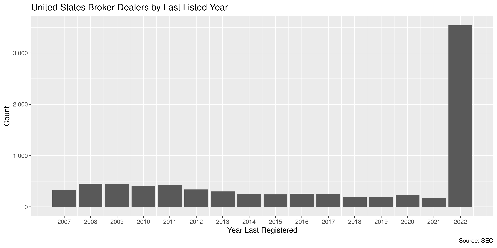
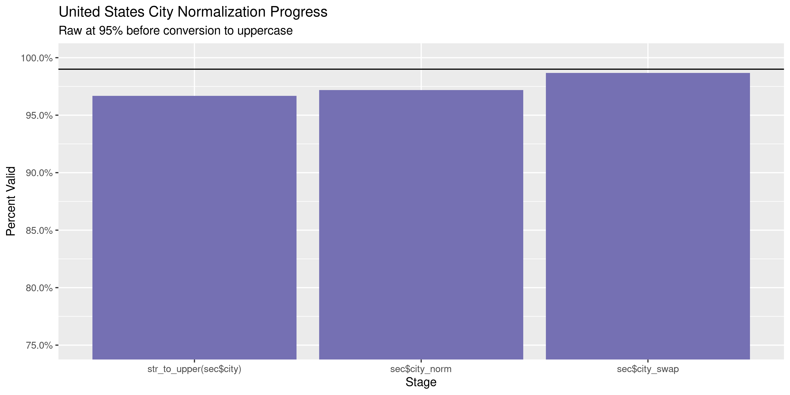
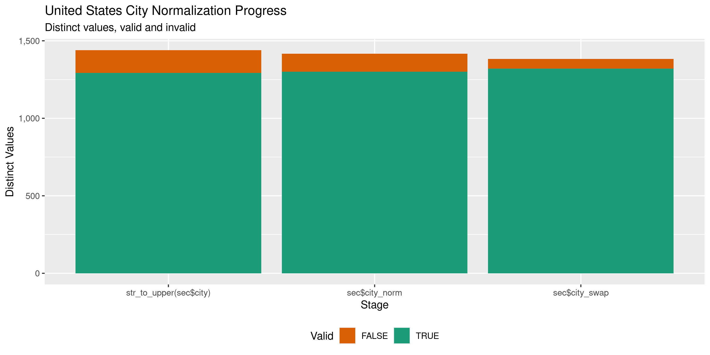

United States Broker-Dealers
================
Kiernan Nicholls
Wed Mar 30 15:59:32 2022

-   [Project](#project)
-   [Objectives](#objectives)
-   [Packages](#packages)
-   [Source](#source)
-   [Download](#download)
-   [Read](#read)
-   [Explore](#explore)
    -   [Missing](#missing)
    -   [Dates](#dates)
-   [Wrangle](#wrangle)
    -   [Address](#address)
    -   [ZIP](#zip)
    -   [State](#state)
    -   [City](#city)
-   [Conclude](#conclude)
-   [Export](#export)
-   [Upload](#upload)

<!-- Place comments regarding knitting here -->

## Project

The Accountability Project is an effort to cut across data silos and
give journalists, policy professionals, activists, and the public at
large a simple way to search across huge volumes of public data about
people and organizations.

Our goal is to standardize public data on a few key fields by thinking
of each dataset row as a transaction. For each transaction there should
be (at least) 3 variables:

1.  All **parties** to a transaction.
2.  The **date** of the transaction.
3.  The **amount** of money involved.

## Objectives

This document describes the process used to complete the following
objectives:

1.  How many records are in the database?
2.  Check for entirely duplicated records.
3.  Check ranges of continuous variables.
4.  Is there anything blank or missing?
5.  Check for consistency issues.
6.  Create a five-digit ZIP Code called `zip`.
7.  Create a `year` field from the transaction date.
8.  Make sure there is data on both parties to a transaction.

## Packages

The following packages are needed to collect, manipulate, visualize,
analyze, and communicate these results. The `pacman` package will
facilitate their installation and attachment.

``` r
if (!require("pacman")) {
  install.packages("pacman")
}
pacman::p_load(
  tidyverse, # data manipulation
  lubridate, # datetime strings
  gluedown, # printing markdown
  janitor, # clean data frames
  campfin, # custom irw tools
  aws.s3, # aws cloud storage
  refinr, # cluster & merge
  scales, # format strings
  knitr, # knit documents
  vroom, # fast reading
  rvest, # scrape html
  glue, # code strings
  here, # project paths
  httr, # http requests
  fs # local storage
)
```

This diary was run using `campfin` version 1.0.8.9201.

``` r
packageVersion("campfin")
#> [1] '1.0.8.9201'
```

This document should be run as part of the `R_tap` project, which lives
as a sub-directory of the more general, language-agnostic
[`irworkshop/accountability_datacleaning`](https://github.com/irworkshop/accountability_datacleaning)
GitHub repository.

The `R_tap` project uses the [RStudio
projects](https://support.rstudio.com/hc/en-us/articles/200526207-Using-Projects)
feature and should be run as such. The project also uses the dynamic
`here::here()` tool for file paths relative to *your* machine.

``` r
# where does this document knit?
here::i_am("us/sec_brokers/sec_broker-dealers_diary.Rmd")
```

## Source

The Security Exchange Commission (SEC) requires brokers and dealers to
register.

> Most “brokers” and “dealers” must register with the SEC and join a
> “self-regulatory organization,” or SRO. This section covers the
> factors that determine whether a person is a broker or dealer. It also
> describes the types of brokers and dealers that do not have to
> register with the SEC. Self-regulatory organizations are described in
> Part III, below.

> ### A. Who is a “Broker”
>
> any person engaged in the business of effecting transactions in
> securities for the account of others.

> ### B. Who is a “Dealer”
>
> any person engaged in the business of buying and selling securities
> for his own account, through a broker or otherwise.

The SEC then hosts this list online for people to download.

``` r
home <- read_html("https://www.sec.gov/help/foiadocsbdfoiahtm.html")
```

> ### What You Should Know About the Data File
>
> This ascii text file contains the Central Index Key (CIK) numbers,
> company names, SEC reporting file numbers, and addresses (business
> addresses are provided when mailing addresses are not available) of
> active broker-dealers who are registered with the SEC.
>
> The information in this file is **raw data** — data that is meant to
> be used as input to another program. The data items are provided as a
> “tab delimited” file. Although the file can be viewed in any program
> that accepts ASCII text (for example, a word processor), the data
> fields are best viewed when imported into a program that accepts
> delimited data, such as a spreadsheet. The record layout and maximum
> field sizes are shown below for those who want to process the data
> into another form.

``` r
raw_cols <- home %>% 
  html_element("table") %>% 
  html_table()
```

| Field Name            | Maximum Size  |
|:----------------------|:--------------|
| CIK NUMBER            | 10 characters |
| COMPANY NAME          | 60 characters |
| REPORTING FILE NUMBER | 25 characters |
| ADDRESS1              | 40 characters |
| ADDRESS2              | 40 characters |
| CITY                  | 30 characters |
| STATE CODE            | 2 characters  |
| ZIP CODE              | 10 characters |

## Download

We are going to download *all* of the files listed on this home page.

``` r
down <- html_elements(home, "table")[[2]]
```

``` r
raw_url <- down %>% 
  html_elements("a") %>% 
  html_attr("href") %>% 
  str_c("https://www.sec.gov", .)
```

``` r
down_tbl <- down %>% 
  html_table() %>% 
  mutate(
    across(everything(), str_remove, "^\\w+:(\\s+)?"),
    across(Size, as_fs_bytes),
    url = raw_url
  )
```

| File                                                                                                                        | Format | Size |
|:----------------------------------------------------------------------------------------------------------------------------|:-------|-----:|
| [March 2022](https://www.sec.gov/files/data/broker-dealers/company-information-about-active-broker-dealers/bd030122.txt)    | TXT    | 339K |
| [February 2022](https://www.sec.gov/files/data/broker-dealers/company-information-about-active-broker-dealers/bd020122.txt) | TXT    | 341K |
| [January 2022](https://www.sec.gov/files/data/broker-dealers/company-information-about-active-broker-dealers/bd0120321.txt) | TXT    | 342K |
| [December 2021](https://www.sec.gov/files/data/broker-dealers/company-information-about-active-broker-dealers/bd1201_2.txt) | TXT    | 343K |
| [November 2021](https://www.sec.gov/files/data/broker-dealers/company-information-about-active-broker-dealers/bd110121.txt) | TXT    | 344K |
| [October 2021](https://www.sec.gov/files/data/broker-dealers/company-information-about-active-broker-dealers/bd100121.txt)  | TXT    | 344K |

``` r
raw_dir <- dir_create(here("us", "sec_brokers", "data", "raw"))
raw_tsv <- path(raw_dir, basename(raw_url))
```

``` r
if (!all(file_exists(raw_tsv))) {
  for (i in seq_along(raw_url)) {
    cli::cli_h2(basename(raw_url[i]))
    RETRY(
      verb = "GET",
      url = raw_url[i],
      pause_base = 2,
      quiet = FALSE,
      progress("down"),
      write_disk(
        path = raw_tsv[i], 
        overwrite = TRUE
      )
    )
  }
}
```

## Read

Some files vary in their line ending characters. We can quickly remove
these.

``` r
tmp_tsv <- path_temp(basename(raw_tsv))
for (i in seq_along(tmp_tsv)) {
  message(i)
  read_file(raw_tsv[i]) %>% 
    str_replace_all("\r\r\n", "\r") %>% 
    write_file(tmp_tsv[i])
}
```

Now each fixed file can be read into a single file.

``` r
sec <- read_delim(
  file = tmp_tsv,
  delim = "\t",
  escape_backslash = FALSE,
  escape_double = FALSE,
  col_names = raw_cols$field_name,
  name_repair = make_clean_names,
  id = "source_file",
  na = c(" ", ""),
  col_types = cols(
    .default = col_character()
  )
)
```

We will rearrange the columns to add the source file and date from the
download page table to the end.

``` r
sec <- sec %>% 
  select(-X9) %>% 
  mutate(across(source_file, basename)) %>% 
  relocate(source_file, .after = last_col()) %>% 
  left_join(
    down_tbl %>% 
      mutate(source_file = basename(url)) %>% 
      select(source_file, source_date = File)
  )
```

Many registrants are listed in multiple quarterly files. We are going to
keep only the most recent registration per entry but also create a new
column indicating the *first* file they appeared in.

``` r
sec <- sec %>%
  group_by(cik_number) %>% 
  mutate(
    source_date = parse_date(source_date, "%B %Y"),
    first_date = min(source_date),
    last_date = max(source_date),
  ) %>% 
  arrange(desc(source_date)) %>% 
  slice(1) %>% 
  ungroup() %>% 
  select(-source_date)
```

About half the registrants are listed in the most recent file.

``` r
mean(sec$source_date == max(sec$source_date))
#> [1] NaN
```

## Explore

There are 8,043 rows of 11 columns. Each record represents a single
broker-dealer registered with the SEC.

``` r
glimpse(sec)
#> Rows: 8,043
#> Columns: 11
#> $ cik_number            <chr> "0000001841", "0000001904", "0000001918", "0000002303", "0000002554", "0000002781", "000…
#> $ company_name          <chr> "ABEL/NOSER CORP.", "ABRAHAM SECURITIES CORPORATION", "WIZER FINANCIAL. INC.", "PROSPERA…
#> $ reporting_file_number <chr> "00821897", "00829452", "00820438", "00828164", "00816750", "00815501", "00813675", "008…
#> $ address1              <chr> "ONE BATTERY PARK PLAZA", "3724 47TH STREET CT. NW", "1829 EAST SPRING STREET", "5429 LB…
#> $ address2              <chr> "6TH FLOOR", NA, "SUITE 201", "SUITE 750", "30 SEVENTH STREET EAST", NA, "TORONTO DOM CE…
#> $ city                  <chr> "NEW YORK", "GIG HARBOR", "NEW ALBANY", "DALLAS", "ST. PAUL", "DALLAS", "TORONTO", "SANT…
#> $ state_code            <chr> "NY", "WA", "IN", "TX", "MN", "TX", "A6", "CA", "KY", "NY", "NY", "TX", "MN", "OK", "UT"…
#> $ zip_code              <chr> "10004", "98335", "47150", "75240", "55101-4901", "75367-0367", "M5K 1E9", "95054", "402…
#> $ source_file           <chr> "bd120116.txt", "bd030122.txt", "bd070110.txt", "bd030122.txt", "bd030122.txt", "bd03010…
#> $ first_date            <date> 2007-03-01, 2007-03-01, 2007-03-01, 2007-03-01, 2007-03-01, 2007-03-01, 2007-03-01, 200…
#> $ last_date             <date> 2016-12-01, 2022-03-01, 2010-07-01, 2022-03-01, 2022-03-01, 2008-03-01, 2010-05-01, 201…
tail(sec)
#> # A tibble: 6 × 11
#>   cik_number company_name reporting_file_… address1 address2 city  state_code zip_code source_file first_date last_date 
#>   <chr>      <chr>        <chr>            <chr>    <chr>    <chr> <chr>      <chr>    <chr>       <date>     <date>    
#> 1 0001841659 DV SECURITI… 00870659         216 WES… SUITE 3… CHIC… IL         60606    bd030122.t… 2021-08-01 2022-03-01
#> 2 0001842624 JAVELIN PRI… 00870661         4625 LI… SUITE 2… ST. … MO         63108    bd030122.t… 2021-12-01 2022-03-01
#> 3 0001843264 WWF SECURIT… 00870662         1 PARK … APT #17… DETR… MI         48226    bd030122.t… 2022-01-01 2022-03-01
#> 4 0001846279 PROVABLE MA… 00870667         200 VES… 24TH FL… NEW … NY         10281    bd030122.t… 2021-12-01 2022-03-01
#> 5 0001846757 JUMP EXECUT… 00870668         600 WES… SUITE 6… CHIC… IL         60654    bd030122.t… 2022-02-01 2022-03-01
#> 6 0001847187 VESTFI INC.  00870669         9106 CA… SUITE 4… RIVE… FL         33578    bd030122.t… 2021-07-01 2022-03-01
```

### Missing

Columns vary in their degree of missing values. Only the `address2` and
`state_code` columns are missing data.

``` r
col_stats(sec, count_na)
#> # A tibble: 11 × 4
#>    col                   class      n       p
#>    <chr>                 <chr>  <int>   <dbl>
#>  1 cik_number            <chr>      0 0      
#>  2 company_name          <chr>      0 0      
#>  3 reporting_file_number <chr>      0 0      
#>  4 address1              <chr>      0 0      
#>  5 address2              <chr>   3227 0.401  
#>  6 city                  <chr>      0 0      
#>  7 state_code            <chr>     53 0.00659
#>  8 zip_code              <chr>      0 0      
#>  9 source_file           <chr>      0 0      
#> 10 first_date            <date>     0 0      
#> 11 last_date             <date>     0 0
```

The rows missing `state_code` have a foreign `city` value, which makes
sense.

``` r
sec %>% 
  filter(is.na(state_code)) %>% 
  count(city, sort = TRUE)
#> # A tibble: 21 × 2
#>    city                  n
#>    <chr>             <int>
#>  1 LONDON               16
#>  2 TORONTO, ONTARIO     12
#>  3 TORONTO               3
#>  4 CALGARY               2
#>  5 HAGATNA               2
#>  6 MONTREAL              2
#>  7 TORONTO, ON           2
#>  8 DUBLIN 2              1
#>  9 EDINBURGH             1
#> 10 FRANKFURT AM MAIN     1
#> # … with 11 more rows
```

### Dates

We can add the calendar year from `date` with `lubridate::year()`

``` r
sec <- mutate(sec, last_year = year(last_date))
```

``` r
min(sec$last_date)
#> [1] "2007-03-01"
sum(sec$last_year < 2000)
#> [1] 0
max(sec$last_date)
#> [1] "2022-03-01"
sum(sec$last_date > today())
#> [1] 0
```

<!-- -->

## Wrangle

To improve the searchability of the database, we will perform some
consistent, confident string normalization. For geographic variables
like city names and ZIP codes, the corresponding `campfin::normal_*()`
functions are tailor made to facilitate this process.

### Address

For the street `addresss` variable, the `campfin::normal_address()`
function will force consistence case, remove punctuation, and abbreviate
official USPS suffixes.

``` r
sec <- sec %>%
  mutate(
    address1_norm = normal_address(address1, usps_street),
    address2_norm = normal_address(address2, usps_street, abb_end = FALSE)
  ) %>%
  unite(
    col = address_norm,
    matches("^address\\d_norm$"),
    sep = " ",
    remove = TRUE,
    na.rm = TRUE
  )
```

### ZIP

For ZIP codes, the `campfin::normal_zip()` function will attempt to
create valid *five* digit codes by removing the ZIP+4 suffix and
returning leading zeroes dropped by other programs like Microsoft Excel.

``` r
sec <- sec %>%
  mutate(
    zip_norm = normal_zip(
      zip = zip_code,
      na_rep = TRUE
    )
  )
```

``` r
progress_table(
  sec$zip_code,
  sec$zip_norm,
  compare = valid_zip
)
#> # A tibble: 2 × 6
#>   stage        prop_in n_distinct prop_na n_out n_diff
#>   <chr>          <dbl>      <dbl>   <dbl> <dbl>  <dbl>
#> 1 sec$zip_code   0.864       3172 0        1091   1016
#> 2 sec$zip_norm   0.989       2526 0.00174    90     73
```

### State

All of the “invalid” `state_code` values are from overseas.

``` r
prop_in(sec$state_code, valid_state)
#> [1] 0.9966208
unique(what_out(sec$state_code, valid_state))
#>  [1] "A6" "I8" "A8" "L6" "D0" "A0" "A1" "E9" "H2" "V8" "X0" "P7" "L3"
```

### City

Cities are the most difficult geographic variable to normalize, simply
due to the wide variety of valid cities and formats.

#### Normal

The `campfin::normal_city()` function is a good start, again converting
case, removing punctuation, but *expanding* USPS abbreviations. We can
also remove `invalid_city` values.

``` r
norm_city <- sec %>%
  distinct(city, state_code, zip_norm) %>%
  mutate(
    city_norm = normal_city(
      city = city,
      abbs = usps_city,
      states = c("US", "DC", "UNITED STATES"),
      na = invalid_city,
      na_rep = TRUE
    )
  )
```

#### Swap

We can further improve normalization by comparing our normalized value
against the *expected* value for that record’s state abbreviation and
ZIP code. If the normalized value is either an abbreviation for or very
similar to the expected value, we can confidently swap those two.

``` r
norm_city <- norm_city %>%
  rename(city_raw = city) %>%
  left_join(
    y = zipcodes,
    by = c(
      "state_code" = "state",
      "zip_norm" = "zip"
    )
  ) %>%
  rename(city_match = city) %>%
  mutate(
    match_abb = is_abbrev(city_norm, city_match),
    match_dist = str_dist(city_norm, city_match),
    city_swap = if_else(
      condition = !is.na(match_dist) & (match_abb | match_dist == 1),
      true = city_match,
      false = city_norm
    )
  ) %>%
  select(
    -city_match,
    -match_dist,
    -match_abb
  )
```

``` r
sec <- left_join(
  x = sec,
  y = norm_city,
  by = c(
    "city" = "city_raw",
    "state_code",
    "zip_norm"
  )
)
```

#### Progress

Our goal for normalization was to increase the proportion of city values
known to be valid and reduce the total distinct values by correcting
misspellings.

| stage                    | prop_in | n_distinct | prop_na | n_out | n_diff |
|:-------------------------|--------:|-----------:|--------:|------:|-------:|
| `str_to_upper(sec$city)` |   0.967 |       1440 |       0 |   267 |    147 |
| `sec$city_norm`          |   0.972 |       1417 |       0 |   226 |    117 |
| `sec$city_swap`          |   0.987 |       1383 |       0 |   107 |     63 |

You can see how the percentage of valid values increased with each
stage.

<!-- -->

More importantly, the number of distinct values decreased each stage. We
were able to confidently change many distinct invalid values to their
valid equivalent.

<!-- -->

Before exporting, we can remove the intermediary normalization columns
and rename all added variables with the `_clean` suffix.

``` r
sec <- sec %>%
  select(
    -city_norm,
    city_clean = city_swap,
  ) %>%
  rename_all(~str_replace(., "_norm", "_clean")) %>%
  rename_all(~str_remove(., "_raw")) %>%
  relocate(address_clean, city_clean, .before = zip_clean)
```

## Conclude

``` r
glimpse(sample_n(sec, 1000))
#> Rows: 1,000
#> Columns: 15
#> $ cik_number            <chr> "0001256072", "0001113151", "0000941082", "0000887602", "0001507736", "0001264426", "000…
#> $ company_name          <chr> "SL DISTRIBUTORS, INC.", "NEWOAK CAPITAL MARKETS LLC", "GREENWICH HIGH YIELD LLC", "BARR…
#> $ reporting_file_number <chr> "00866073", "00852532", "00848128", "00844856", "00868761", "00866170", "00841206", "008…
#> $ address1              <chr> "12750 MERIT DRIVE", "3 COLUMBUS CIRCLE, 15TH FL.", "21 MCLAREN ROAD", "THE WILCOX BUILD…
#> $ address2              <chr> "SUITE 500", NA, "3RD FLOOR", "42 WEYBOSSET STREET", NA, NA, NA, NA, NA, NA, "5TH FLOOR"…
#> $ city                  <chr> "DALLAS", "NEW YORK", "DARIEN", "PROVIDENCE", "NEW YORK", "CORAL SPRINGS", "SPRINGFIELD"…
#> $ state_code            <chr> "TX", "NY", "CT", "RI", "NY", "FL", "OH", "OH", "GA", "CA", "NY", "CA", "PA", "NY", "NY"…
#> $ zip_code              <chr> "75251-1209", "10019", "06820", "02903", "10036", "33065", "45502", "45255", "30062", "9…
#> $ source_file           <chr> "bd010413.txt", "bd030122.txt", "bd060109.txt", "bd030122.txt", "bd030122.txt", "bd02010…
#> $ first_date            <date> 2007-03-01, 2007-03-01, 2007-03-01, 2007-03-01, 2011-08-01, 2007-03-01, 2007-03-01, 200…
#> $ last_date             <date> 2013-01-01, 2022-03-01, 2009-06-01, 2022-03-01, 2022-03-01, 2008-02-01, 2022-03-01, 201…
#> $ last_year             <dbl> 2013, 2022, 2009, 2022, 2022, 2008, 2022, 2014, 2022, 2022, 2008, 2019, 2007, 2022, 2008…
#> $ address_clean         <chr> "12750 MERIT DR STE 500", "3 COLUMBUS CIRCLE 15TH FL", "21 MCLAREN RD 3RD FL", "THE WILC…
#> $ city_clean            <chr> "DALLAS", "NEW YORK", "DARIEN", "PROVIDENCE", "NEW YORK", "CORAL SPRINGS", "SPRINGFIELD"…
#> $ zip_clean             <chr> "75251", "10019", "06820", "02903", "10036", "33065", "45502", "45255", "30062", "95404"…
```

1.  There are 8,043 records in the database.
2.  There are 0 duplicate records in the database.
3.  The range and distribution of `amount` and `date` seem reasonable.
4.  There are 0 records missing key variables.
5.  Consistency in geographic data has been improved with
    `campfin::normal_*()`.
6.  The 4-digit `year` variable has been created with
    `lubridate::year()`.

## Export

Now the file can be saved on disk for upload to the Accountability
server. We will name the object using a date range of the records
included.

``` r
min_dt <- str_remove_all(min(sec$first_date), "-")
max_dt <- str_remove_all(max(sec$last_date), "-")
csv_ts <- paste(min_dt, max_dt, sep = "-")
```

``` r
clean_dir <- dir_create(here("us", "sec_brokers", "data", "clean"))
clean_csv <- path(clean_dir, glue("sec_broker-dealers_{csv_ts}.csv"))
clean_rds <- path_ext_set(clean_csv, "rds")
basename(clean_csv)
#> [1] "sec_broker-dealers_20070301-20220301.csv"
```

``` r
write_csv(sec, clean_csv, na = "")
write_rds(sec, clean_rds, compress = "xz")
(clean_size <- file_size(clean_csv))
#> 1.36M
```

## Upload

We can use the `aws.s3::put_object()` to upload the text file to the IRW
server.

``` r
aws_key <- path("csv", basename(clean_csv))
if (!object_exists(aws_key, "publicaccountability")) {
  put_object(
    file = clean_csv,
    object = aws_key,
    bucket = "publicaccountability",
    acl = "public-read",
    show_progress = TRUE,
    multipart = TRUE
  )
}
aws_head <- head_object(aws_key, "publicaccountability")
(aws_size <- as_fs_bytes(attr(aws_head, "content-length")))
unname(aws_size == clean_size)
```
