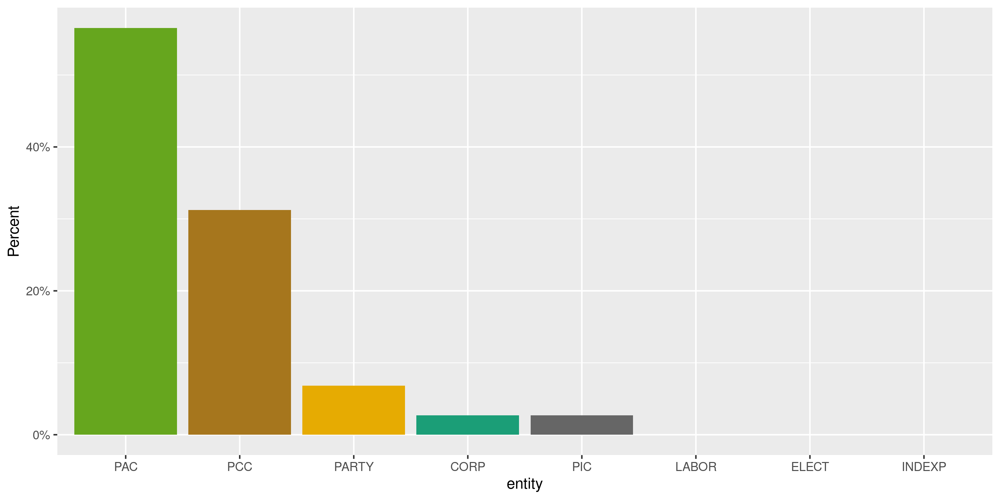

Utah Expenditures
================
Kiernan Nicholls
2020-07-15 13:03:18

  - [Project](#project)
  - [Objectives](#objectives)
  - [Packages](#packages)
  - [Data](#data)
  - [Download](#download)
  - [Read](#read)
  - [Explore](#explore)
  - [Wrangle](#wrangle)
  - [Conclude](#conclude)
  - [Export](#export)
  - [Upload](#upload)
  - [Dictionary](#dictionary)

<!-- Place comments regarding knitting here -->

## Project

The Accountability Project is an effort to cut across data silos and
give journalists, policy professionals, activists, and the public at
large a simple way to search across huge volumes of public data about
people and organizations.

Our goal is to standardizing public data on a few key fields by thinking
of each dataset row as a transaction. For each transaction there should
be (at least) 3 variables:

1.  All **parties** to a transaction.
2.  The **date** of the transaction.
3.  The **amount** of money involved.

## Objectives

This document describes the process used to complete the following
objectives:

1.  How many records are in the database?
2.  Check for entirely duplicated records.
3.  Check ranges of continuous variables.
4.  Is there anything blank or missing?
5.  Check for consistency issues.
6.  Create a five-digit ZIP Code called `zip`.
7.  Create a `year` field from the transaction date.
8.  Make sure there is data on both parties to a transaction.

## Packages

The following packages are needed to collect, manipulate, visualize,
analyze, and communicate these results. The `pacman` package will
facilitate their installation and attachment.

The IRW’s `campfin` package will also have to be installed from GitHub.
This package contains functions custom made to help facilitate the
processing of campaign finance data.

``` r
if (!require("pacman")) install.packages("pacman")
pacman::p_load_gh("irworkshop/campfin")
pacman::p_load(
  tidyverse, # data manipulation
  lubridate, # datetime strings
  gluedown, # printing markdown
  magrittr, # pipe operators
  janitor, # clean data frames
  refinr, # cluster and merge
  scales, # format strings
  knitr, # knit documents
  vroom, # read files fast
  rvest, # html scraping
  glue, # combine strings
  here, # relative paths
  httr, # http requests
  fs # local storage 
)
```

This document should be run as part of the `R_campfin` project, which
lives as a sub-directory of the more general, language-agnostic
[`irworkshop/accountability_datacleaning`](https://github.com/irworkshop/accountability_datacleaning)
GitHub repository.

The `R_campfin` project uses the [RStudio
projects](https://support.rstudio.com/hc/en-us/articles/200526207-Using-Projects)
feature and should be run as such. The project also uses the dynamic
`here::here()` tool for file paths relative to *your* machine.

``` r
# where does this document knit?
here::here()
#> [1] "/home/kiernan/Code/tap/R_campfin"
```

## Data

Campaign expenditures are from the Utah [Financial Disclosures
website](https://disclosures.utah.gov/).

> #### Reporting Contributions and Expenditures:
> 
> The general requirement for contribution reporting is to report each
> contribution you receive within 31 days of receiving it. However,
> there are additional requirements that must be followed: …
> 
>   - All expenditures must be reported by the reporting deadline for
>     each reporting period.
>   - All additional contributions received during a reporting period
>     must be reported by the reporting deadline.
>   - All filing reports must be filled by no later than 11:59 p.m. on
>     the day of the reporting deadline. Failure to file a report on
>     time may result in a fine.

## Download

Using the website’s [advance search
feature](https://disclosures.utah.gov/Search/AdvancedSearch), users can
search along a name, entity type, and report year. The site gives
ambiguous directions, but we can obtain *all* records for a year and
entity type if we leave the name blank and click on the top record.

> Please follow these steps: \* Select an Entity Type \* Select a Report
> Year \* Click Find \* In the top row of results, click the year under
> the far right column – “Download Data by Year”

We make these direct HTTP requests using `httr::GET()`.

``` r
raw_dir <- dir_create(here("ut", "expends", "data", "raw"))
```

Search results are categorized across eight entity types for every year
from 1998 to 2020.

  - PCC = Candidates & Office Holders
  - CORP = Corporation
  - ELECT = Electioneering
  - INDEXP = Independent Expenditures
  - LABOR = Labor Organizations
  - PAC = Political Action Committee
  - PIC = Political Issues Committee
  - PARTY = Political Party

We can first scrape all the entity types and report years from the
search site’s dropdown menus.

``` r
sch_url <- "https://disclosures.utah.gov/Search/AdvancedSearch"
ut_search <- read_html(sch_url)
report_years <- ut_search %>% 
  html_nodes("#ReportYear > option") %>% 
  html_attr("value") %>% 
  as.integer()
```

``` r
min(report_years)
#> [1] 1998
max(report_years)
#> [1] 2020
```

``` r
entity_types <- ut_search %>% 
  html_nodes("#EntityType > option") %>% 
  html_attr("value") %>% 
  str_subset("\\w")
```

There are 184 combinations of these types and years, however many of
these combinations have no search results.

``` r
length(entity_types) * length(report_years)
#> [1] 184
```

We can make a `for` loop to run through each combination and request
data from the server with `httr::GET()`. For any combination without any
results, a HTML file is returned instead of the CSV file we want; these
files can be detected and deleted, leaving us with only files containing
expenditure records.

``` r
rpt_url <- str_c(sch_url, "/GenerateReport")
for (y in report_years) {
  for (t in entity_types) {
    p <- path(raw_dir, glue("{t}-{y}.csv"))
    if (file_exists(p)) {
      next() # skip is file exists
    } else { # save if file needed
      q <- list(ReportYear = y, EntityType = t)
      g <- GET(rpt_url, query = q, write_disk(p, TRUE))
      if (str_detect(headers(g)[["content-type"]], "csv")) {
      } else { # delete if html or txt
        file_delete(p) 
      }
      Sys.sleep(runif(1, 5, 10)) 
    }
  }
}
```

We are left with 84 CSV files with data.

``` r
raw_info <- dir_info(raw_dir)
nrow(raw_info)
#> [1] 84
sum(raw_info$size)
#> 136M
as_tibble(raw_info) %>% 
  select(path, size, modification_time) %>% 
  mutate(across(path, path.abbrev))
#> # A tibble: 84 x 3
#>    path                                       size modification_time  
#>    <chr>                               <fs::bytes> <dttm>             
#>  1 ~/ut/expends/data/raw/CORP-2007.csv         440 2020-07-14 14:50:11
#>  2 ~/ut/expends/data/raw/CORP-2008.csv        451K 2020-07-14 14:49:06
#>  3 ~/ut/expends/data/raw/CORP-2009.csv        181K 2020-07-14 14:47:34
#>  4 ~/ut/expends/data/raw/CORP-2010.csv        377K 2020-07-14 14:46:18
#>  5 ~/ut/expends/data/raw/CORP-2011.csv        217K 2020-07-14 14:44:48
#>  6 ~/ut/expends/data/raw/CORP-2012.csv        466K 2020-07-14 14:43:19
#>  7 ~/ut/expends/data/raw/CORP-2013.csv        241K 2020-07-14 14:41:44
#>  8 ~/ut/expends/data/raw/CORP-2014.csv        531K 2020-07-14 14:40:15
#>  9 ~/ut/expends/data/raw/CORP-2015.csv        235K 2020-07-14 14:38:41
#> 10 ~/ut/expends/data/raw/CORP-2016.csv        332K 2020-07-14 14:37:10
#> # … with 74 more rows
```

## Read

We will use `purrr::map()` and `readr::read_delim()` to read each CSV
file into a list of data frames.

``` r
ute <- map(
  .x = raw_info$path,
  .f = read_delim,
  escape_backslash = FALSE, 
  escape_double = FALSE,
  delim = ",",
  na = c("", "NA", "na", "N/A"),
  col_types = cols(
    .default = col_character(),
    TRAN_DATE = col_date_usa(),
    TRAN_AMT = col_double()
  )
)
```

``` r
# add column from type name
ute <- map(ute, ~mutate(., ENTITY = names(.)[2], .after = 1))
# rename type column to COMM
ute <- map(ute, rename, COMMITTEE = 3)
# bind all together
ute <- clean_names(bind_rows(ute))
ute <- rename_with(ute, str_remove, 5:8, "tran_")
```

``` r
ute <- mutate(ute, across(c(filed, inkind, loan), ~not(is.na(.))))
```

## Explore

``` r
glimpse(ute)
#> Rows: 844,519
#> Columns: 19
#> $ filed           <lgl> TRUE, TRUE, TRUE, TRUE, TRUE, TRUE, TRUE, TRUE, TRUE, TRUE, TRUE, TRUE, …
#> $ entity          <chr> "CORP", "CORP", "CORP", "CORP", "CORP", "CORP", "CORP", "CORP", "CORP", …
#> $ committee       <chr> "Cambra Business Advisors", "Denison Mines (USA) Corp", "1-800 CONTACTS"…
#> $ report          <chr> "Year End", "Year End", "August 31st", "August 31st", "August 31st", "Au…
#> $ id              <chr> "101121", "101122", "45332", "45331", "45333", "45329", "45330", "45392"…
#> $ type            <chr> "Expenditure", "Expenditure", "Expenditure", "Expenditure", "Expenditure…
#> $ date            <date> 2007-12-19, 2007-12-31, 2008-01-04, 2008-01-14, 2008-01-17, 2008-05-05,…
#> $ amount          <dbl> -1000, -2500, -1000, -1500, -5000, -15000, -150, -20000, -1000, -250, -2…
#> $ inkind          <lgl> FALSE, FALSE, FALSE, FALSE, FALSE, FALSE, FALSE, FALSE, FALSE, FALSE, FA…
#> $ loan            <lgl> FALSE, FALSE, FALSE, FALSE, FALSE, FALSE, FALSE, FALSE, FALSE, FALSE, FA…
#> $ amends          <chr> NA, NA, NA, NA, NA, NA, NA, NA, NA, NA, NA, NA, NA, NA, NA, NA, NA, NA, …
#> $ name            <chr> "Rep. James Dunnigan", "Conservative Caucus", "Utah State Senate Republi…
#> $ purpose         <chr> "Campaign Contribution", "Contribution", "Leadership Breakfast", "Annual…
#> $ address1        <chr> NA, NA, NA, NA, NA, NA, NA, NA, NA, NA, NA, NA, NA, NA, NA, NA, NA, NA, …
#> $ address2        <chr> NA, NA, NA, NA, NA, NA, NA, NA, NA, NA, NA, NA, NA, NA, NA, NA, NA, NA, …
#> $ city            <chr> NA, NA, NA, NA, NA, NA, NA, NA, NA, NA, NA, NA, NA, NA, NA, NA, NA, NA, …
#> $ state           <chr> NA, NA, NA, NA, NA, NA, NA, NA, NA, NA, NA, NA, NA, NA, NA, NA, NA, NA, …
#> $ zip             <chr> NA, NA, NA, NA, NA, NA, NA, NA, NA, NA, NA, NA, NA, NA, NA, NA, NA, NA, …
#> $ inkind_comments <chr> NA, NA, NA, NA, NA, NA, NA, NA, NA, NA, NA, NA, NA, NA, NA, NA, NA, NA, …
tail(ute)
#> # A tibble: 6 x 19
#>   filed entity committee report id    type  date       amount inkind loan  amends name  purpose
#>   <lgl> <chr>  <chr>     <chr>  <chr> <chr> <date>      <dbl> <lgl>  <lgl> <chr>  <chr> <chr>  
#> 1 TRUE  PIC    ZOO ARTS… Conve… 9704… Expe… 2020-01-02  -1000 FALSE  FALSE <NA>   MIB … Lobbyi…
#> 2 TRUE  PIC    ZOO ARTS… Conve… 9704… Expe… 2020-02-04  -1000 FALSE  FALSE <NA>   MIB … Lobbyi…
#> 3 TRUE  PIC    ZOO ARTS… Conve… 9752… Expe… 2020-03-02  -1000 FALSE  FALSE <NA>   MIB … Lobbyi…
#> 4 TRUE  PIC    ZOO ARTS… Conve… 9976… Expe… 2020-04-01  -1000 FALSE  FALSE <NA>   MIB … Lobbyi…
#> 5 TRUE  PIC    ZOO ARTS… Prima… 9976… Expe… 2020-05-01  -1000 FALSE  FALSE <NA>   MIB … Lobbyi…
#> 6 TRUE  PIC    ZOO ARTS… Prima… 9976… Expe… 2020-06-01  -1000 FALSE  FALSE <NA>   MIB … Lobbyi…
#> # … with 6 more variables: address1 <chr>, address2 <chr>, city <chr>, state <chr>, zip <chr>,
#> #   inkind_comments <chr>
```

### Missing

``` r
col_stats(ute, count_na)
#> # A tibble: 19 x 4
#>    col             class       n        p
#>    <chr>           <chr>   <int>    <dbl>
#>  1 filed           <lgl>       0 0       
#>  2 entity          <chr>       0 0       
#>  3 committee       <chr>       0 0       
#>  4 report          <chr>       0 0       
#>  5 id              <chr>       0 0       
#>  6 type            <chr>       0 0       
#>  7 date            <date>      0 0       
#>  8 amount          <dbl>       0 0       
#>  9 inkind          <lgl>       0 0       
#> 10 loan            <lgl>       0 0       
#> 11 amends          <chr>  841711 0.997   
#> 12 name            <chr>     512 0.000606
#> 13 purpose         <chr>  613301 0.726   
#> 14 address1        <chr>  234794 0.278   
#> 15 address2        <chr>  828047 0.980   
#> 16 city            <chr>  234114 0.277   
#> 17 state           <chr>  256492 0.304   
#> 18 zip             <chr>  233573 0.277   
#> 19 inkind_comments <chr>  835427 0.989
```

``` r
ute <- ute %>% flag_na(date, name, amount, committee)
sum(ute$na_flag)
#> [1] 512
```

``` r
ute %>% 
  filter(na_flag) %>% 
  select(date, name, amount, committee)
#> # A tibble: 512 x 4
#>    date       name  amount committee                                                   
#>    <date>     <chr>  <dbl> <chr>                                                       
#>  1 2012-02-09 <NA>       0 Bank Of American Fork                                       
#>  2 2012-09-26 <NA>       0 Bennett Tueller Johnson and Deere                           
#>  3 2012-01-06 <NA>       0 Central Utah Clinic                                         
#>  4 2012-04-11 <NA>       0 Deseret Power Electronic Cooperative                        
#>  5 2012-05-04 <NA>   -5000 Dolphin Capital Group                                       
#>  6 2012-03-20 <NA>       0 Incentive Capital LLC                                       
#>  7 2012-01-17 <NA>       0 Regence BlueCross BlueShield Of Utah/Cambia Health Solutions
#>  8 2012-06-25 <NA>       0 Takeda Pharmaceuticals America                              
#>  9 2012-05-15 <NA>       0 US Magnesium, LLC                                           
#> 10 2013-11-12 <NA>       0 Eli Lilly and Company                                       
#> # … with 502 more rows
```

### Duplicates

``` r
ute <- flag_dupes(ute, -id)
percent(mean(ute$dupe_flag), 0.01)
#> [1] "3.41%"
```

``` r
ute %>% 
  filter(dupe_flag) %>% 
  select(date, name, amount, committee)
#> # A tibble: 28,776 x 4
#>    date       name                  amount committee        
#>    <date>     <chr>                  <dbl> <chr>            
#>  1 2008-01-18 Steven  Mascaro         -250 EnergySolutions  
#>  2 2008-01-18 Steven  Mascaro         -250 EnergySolutions  
#>  3 2008-01-18 Mark Wheatley           -250 EnergySolutions  
#>  4 2008-01-18 Mark Wheatley           -250 EnergySolutions  
#>  5 2008-08-22 Utah Republican Party   -250 EnergySolutions  
#>  6 2008-08-22 Utah Republican Party   -500 EnergySolutions  
#>  7 2008-08-22 Utah Republican Party   -250 EnergySolutions  
#>  8 2008-08-22 Utah Republican Party   -500 EnergySolutions  
#>  9 2008-10-29 Curtis, Greg            -500 Johnson & Johnson
#> 10 2008-10-29 Curtis, Greg            -500 Johnson & Johnson
#> # … with 28,766 more rows
```

### Categorical

``` r
col_stats(ute, n_distinct)
#> # A tibble: 21 x 4
#>    col             class       n          p
#>    <chr>           <chr>   <int>      <dbl>
#>  1 filed           <lgl>       2 0.00000237
#>  2 entity          <chr>       8 0.00000947
#>  3 committee       <chr>    2646 0.00313   
#>  4 report          <chr>      14 0.0000166 
#>  5 id              <chr>  844519 1         
#>  6 type            <chr>       4 0.00000474
#>  7 date            <date>   6094 0.00722   
#>  8 amount          <dbl>   56824 0.0673    
#>  9 inkind          <lgl>       2 0.00000237
#> 10 loan            <lgl>       2 0.00000237
#> 11 amends          <chr>    2809 0.00333   
#> 12 name            <chr>  244286 0.289     
#> 13 purpose         <chr>   62632 0.0742    
#> 14 address1        <chr>  197951 0.234     
#> 15 address2        <chr>    3324 0.00394   
#> 16 city            <chr>   18872 0.0223    
#> 17 state           <chr>      88 0.000104  
#> 18 zip             <chr>   25332 0.0300    
#> 19 inkind_comments <chr>    5264 0.00623   
#> 20 na_flag         <lgl>       2 0.00000237
#> 21 dupe_flag       <lgl>       2 0.00000237
```

``` r
explore_plot(ute, entity)
```

<!-- -->

``` r
explore_plot(ute, report)
```

<!-- -->

``` r
explore_plot(ute, type)
```

<!-- -->

### Amounts

A significant number of the `amount` values are equal to zero.

``` r
noquote(map_chr(summary(ute$amount), dollar))
#>        Min.     1st Qu.      Median        Mean     3rd Qu.        Max. 
#> -$1,630,000     -$11.23         $10      -$4.82         $50  $1,780,024
percent(mean(ute$amount == 0), 0.01)
#> [1] "0.22%"
```

``` r
glimpse(ute[which.max(ute$amount), ])
#> Rows: 1
#> Columns: 21
#> $ filed           <lgl> TRUE
#> $ entity          <chr> "PAC"
#> $ committee       <chr> "Southwest Regional Council Of Carpenters Political Action Fund"
#> $ report          <chr> "August 31st"
#> $ id              <chr> "161886"
#> $ type            <chr> "Contribution"
#> $ date            <date> 2010-08-26
#> $ amount          <dbl> 1780024
#> $ inkind          <lgl> FALSE
#> $ loan            <lgl> FALSE
#> $ amends          <chr> NA
#> $ name            <chr> "Unitemized Contributions"
#> $ purpose         <chr> NA
#> $ address1        <chr> NA
#> $ address2        <chr> NA
#> $ city            <chr> NA
#> $ state           <chr> "UT"
#> $ zip             <chr> NA
#> $ inkind_comments <chr> NA
#> $ na_flag         <lgl> FALSE
#> $ dupe_flag       <lgl> FALSE
```

<!-- -->

### Dates

We can add the calendar year from `date` with `lubridate::year()`

``` r
ute <- mutate(ute, year = year(date))
```

``` r
min(ute$date)
#> [1] "2000-01-18"
sum(ute$year < 2000)
#> [1] 0
max(ute$date)
#> [1] "2020-07-14"
sum(ute$date > today())
#> [1] 0
```

<!-- -->

## Wrangle

To improve the searchability of the database, we will perform some
consistent, confident string normalization. For geographic variables
like city names and ZIP codes, the corresponding `campfin::normal_*()`
functions are tailor made to facilitate this process.

### Address

For the street `addresss` variable, the `campfin::normal_address()`
function will force consistence case, remove punctuation, and abbreviate
official USPS suffixes.

``` r
ute <- ute %>% 
  unite(
    col = address_full,
    starts_with("address"),
    sep = " ",
    remove = FALSE,
    na.rm = TRUE
  ) %>% 
  mutate(
    address_norm = normal_address(
      address = address_full,
      abbs = usps_street,
      na_rep = TRUE
    )
  ) %>% 
  select(-address_full)
```

``` r
ute %>% 
  select(contains("address")) %>% 
  distinct() %>% 
  sample_n(10)
#> # A tibble: 10 x 3
#>    address1                     address2 address_norm                
#>    <chr>                        <chr>    <chr>                       
#>  1 53 JILL MARIE DR             <NA>     53 JILL MARIE DR            
#>  2 364 Middle Oak Lane          <NA>     364 MIDDLE OAK LN           
#>  3 448 East Winchester STE 480  <NA>     448 E WINCHESTER STE 480    
#>  4 3625 GETTYSBURG AVE S APT 43 <NA>     3625 GETTYSBURG AVE S APT 43
#>  5 701 NAPA VALLEY LN UNIT 6    <NA>     701 NAPA VLY LN UNIT 6      
#>  6 683 E 1000 South Circle      <NA>     683 E 1000 S CIR            
#>  7 175 S Main Street Ste 1420   <NA>     175 S MAIN ST STE 1420      
#>  8 658 W RAMBLER CT             <NA>     658 W RAMBLER CT            
#>  9 5044 S. Valene St.           <NA>     5044 S VALENE ST            
#> 10 12313 CARL LOOP              <NA>     12313 CARL LOOP
```

### ZIP

For ZIP codes, the `campfin::normal_zip()` function will attempt to
create valid *five* digit codes by removing the ZIP+4 suffix and
returning leading zeroes dropped by other programs like Microsoft Excel.

``` r
ute <- ute %>% 
  mutate(
    zip_norm = normal_zip(
      zip = zip,
      na_rep = TRUE
    )
  )
```

``` r
progress_table(
  ute$zip,
  ute$zip_norm,
  compare = valid_zip
)
#> # A tibble: 2 x 6
#>   stage    prop_in n_distinct prop_na n_out n_diff
#>   <chr>      <dbl>      <dbl>   <dbl> <dbl>  <dbl>
#> 1 zip        0.942      25332   0.277 35636   6551
#> 2 zip_norm   0.996      19216   0.280  2544    396
```

### State

Valid two digit state abbreviations can be made using the
`campfin::normal_state()` function.

``` r
ute <- ute %>% 
  mutate(
    state_norm = normal_state(
      state = state,
      abbreviate = TRUE,
      na_rep = TRUE,
      valid = valid_state
    )
  )
```

``` r
ute %>% 
  filter(state != state_norm) %>% 
  count(state, sort = TRUE)
#> # A tibble: 13 x 2
#>    state     n
#>    <chr> <int>
#>  1 Ut      211
#>  2 ut      168
#>  3 ny       13
#>  4 ca        3
#>  5 co        2
#>  6 md        2
#>  7 ak        1
#>  8 Co        1
#>  9 il        1
#> 10 ma        1
#> 11 or        1
#> 12 va        1
#> 13 Va        1
```

``` r
progress_table(
  ute$state,
  ute$state_norm,
  compare = valid_state
)
#> # A tibble: 2 x 6
#>   stage      prop_in n_distinct prop_na n_out n_diff
#>   <chr>        <dbl>      <dbl>   <dbl> <dbl>  <dbl>
#> 1 state        0.999         88   0.304   508     31
#> 2 state_norm   1             58   0.304     0      1
```

### City

Cities are the most difficult geographic variable to normalize, simply
due to the wide variety of valid cities and formats.

#### Normal

The `campfin::normal_city()` function is a good start, again converting
case, removing punctuation, but *expanding* USPS abbreviations. We can
also remove `invalid_city` values.

``` r
ute <- ute %>% 
  mutate(
    city_norm = normal_city(
      city = city, 
      abbs = usps_city,
      states = c("UT", "DC", "UTAH"),
      na = invalid_city,
      na_rep = TRUE
    )
  )
```

#### Swap

We can further improve normalization by comparing our normalized value
against the *expected* value for that record’s state abbreviation and
ZIP code. If the normalized value is either an abbreviation for or very
similar to the expected value, we can confidently swap those two.

``` r
ute <- ute %>% 
  rename(city_raw = city) %>% 
  left_join(
    y = zipcodes,
    by = c(
      "state_norm" = "state",
      "zip_norm" = "zip"
    )
  ) %>% 
  rename(city_match = city) %>% 
  mutate(
    match_abb = is_abbrev(city_norm, city_match),
    match_dist = str_dist(city_norm, city_match),
    city_swap = if_else(
      condition = !is.na(match_dist) & (match_abb | match_dist == 1),
      true = city_match,
      false = city_norm
    )
  ) %>% 
  select(
    -city_match,
    -match_dist,
    -match_abb
  )
```

#### Refine

The [OpenRefine](https://openrefine.org/) algorithms can be used to
group similar strings and replace the less common versions with their
most common counterpart. This can greatly reduce inconsistency, but with
low confidence; we will only keep any refined strings that have a valid
city/state/zip combination.

``` r
good_refine <- ute %>% 
  mutate(
    city_refine = city_swap %>% 
      key_collision_merge() %>% 
      n_gram_merge(numgram = 1)
  ) %>% 
  filter(city_refine != city_swap) %>% 
  inner_join(
    y = zipcodes,
    by = c(
      "city_refine" = "city",
      "state_norm" = "state",
      "zip_norm" = "zip"
    )
  )
```

    #> # A tibble: 65 x 5
    #>    state_norm zip_norm city_swap                 city_refine         n
    #>    <chr>      <chr>    <chr>                     <chr>           <int>
    #>  1 UT         84105    SALT LAKE CITYSLC         SALT LAKE CITY     40
    #>  2 UT         84414    NO OGDEN                  OGDEN              29
    #>  3 UT         84108    SALT LAKE CITYSALT LAKE   SALT LAKE CITY      5
    #>  4 UT         84098    PARK CITYPARK CITY        PARK CITY           4
    #>  5 UT         84117    SALT LAKE CITYSLC         SALT LAKE CITY      4
    #>  6 UT         84124    SALT LAKE CITYSALT LAKE C SALT LAKE CITY      4
    #>  7 OH         45201    CINCINATTI                CINCINNATI          3
    #>  8 CO         80113    ENGLEWOOD CO              ENGLEWOOD           2
    #>  9 DE         19850    WILLIMNGTON               WILMINGTON          2
    #> 10 FL         33308    FORT LAUDERDALE FL        FORT LAUDERDALE     2
    #> # … with 55 more rows

Then we can join the refined values back to the database.

``` r
ute <- ute %>% 
  left_join(good_refine) %>% 
  mutate(city_refine = coalesce(city_refine, city_swap))
```

#### Progress

| stage        | prop\_in | n\_distinct | prop\_na | n\_out | n\_diff |
| :----------- | -------: | ----------: | -------: | -----: | ------: |
| city\_raw)   |    0.901 |       13168 |    0.277 |  60154 |    3236 |
| city\_norm   |    0.960 |       11875 |    0.284 |  24493 |    1913 |
| city\_swap   |    0.988 |       11114 |    0.284 |   7035 |    1124 |
| city\_refine |    0.989 |       11058 |    0.284 |   6877 |    1068 |

You can see how the percentage of valid values increased with each
stage.

<!-- -->

More importantly, the number of distinct values decreased each stage. We
were able to confidently change many distinct invalid values to their
valid equivalent.

<!-- -->

## Conclude

Before exporting, we can remove the intermediary normalization columns
and rename all added variables with the `_clean` suffix.

``` r
ute <- ute %>% 
  select(
    -city_norm,
    -city_swap,
    city_clean = city_refine
  ) %>% 
  rename_all(~str_replace(., "_norm", "_clean")) %>% 
  rename_all(~str_remove(., "_raw"))
```

``` r
glimpse(sample_n(ute, 20))
#> Rows: 20
#> Columns: 26
#> $ filed           <lgl> TRUE, TRUE, TRUE, TRUE, TRUE, TRUE, TRUE, TRUE, TRUE, TRUE, TRUE, TRUE, …
#> $ entity          <chr> "PCC", "PAC", "PCC", "PAC", "PCC", "CORP", "PAC", "PCC", "PCC", "PARTY",…
#> $ committee       <chr> "Bramble, Curtis S", "Americans for an Informed Electorate", "Daw, Bradl…
#> $ report          <chr> "Year End", "Convention Report Due 4/23/18", "Primary", "Year End", "Gen…
#> $ id              <chr> "423587", "758387", "571768", "702796", "14605", "69192", "759522", "846…
#> $ type            <chr> "Expenditure", "Contribution", "Expenditure", "Contribution", "Expenditu…
#> $ date            <date> 2013-04-09, 2018-04-16, 2016-04-20, 2017-12-01, 2008-09-13, 2008-11-09,…
#> $ amount          <dbl> -14.22, 10.00, -50.00, 15.00, -691.15, -500.00, 30.00, 10.00, -1000.00, …
#> $ inkind          <lgl> FALSE, FALSE, FALSE, FALSE, FALSE, FALSE, FALSE, FALSE, FALSE, FALSE, FA…
#> $ loan            <lgl> FALSE, FALSE, FALSE, FALSE, FALSE, FALSE, FALSE, FALSE, FALSE, FALSE, FA…
#> $ amends          <chr> NA, NA, NA, NA, NA, NA, NA, NA, NA, NA, NA, NA, NA, NA, NA, NA, NA, NA, …
#> $ name            <chr> "Cafe Rio", "WANDA WALTRIP", "Gayle Ruzick", "Franklin Clawson", "Delta …
#> $ purpose         <chr> "Lunch Meeting", NA, "Flyer for State Convention", NA, "Airfare to Senat…
#> $ address1        <chr> NA, "12557 MOLLYLEA DR", NA, "7730 Union Park Ave, Ste 350", NA, NA, "12…
#> $ address2        <chr> NA, NA, NA, NA, NA, NA, NA, NA, NA, NA, NA, NA, "PO Box 9199", NA, NA, N…
#> $ city            <chr> NA, "BATON ROUGE", NA, "Midvale", NA, NA, "WALPOLE", "Spanish Fork", NA,…
#> $ state           <chr> NA, "LA", NA, "UT", NA, NA, "NH", "UT", NA, "OH", NA, NA, "UT", NA, "UT"…
#> $ zip             <chr> NA, "70815", NA, "84047", NA, NA, "03608", "84606", NA, "44070", NA, NA,…
#> $ inkind_comments <chr> NA, NA, NA, NA, NA, NA, NA, NA, NA, NA, NA, NA, NA, NA, NA, NA, NA, NA, …
#> $ na_flag         <lgl> FALSE, FALSE, FALSE, FALSE, FALSE, FALSE, FALSE, FALSE, FALSE, FALSE, FA…
#> $ dupe_flag       <lgl> FALSE, TRUE, FALSE, FALSE, FALSE, FALSE, TRUE, FALSE, FALSE, FALSE, FALS…
#> $ year            <dbl> 2013, 2018, 2016, 2017, 2008, 2008, 2018, 2018, 2013, 2015, 2010, 2015, …
#> $ address_clean   <chr> NA, "12557 MOLLYLEA DR", NA, "7730 UN PARK AVE STE 350", NA, NA, "122 PO…
#> $ zip_clean       <chr> NA, "70815", NA, "84047", NA, NA, "03608", "84606", NA, "44070", NA, NA,…
#> $ state_clean     <chr> NA, "LA", NA, "UT", NA, NA, "NH", "UT", NA, "OH", NA, NA, "UT", NA, "UT"…
#> $ city_clean      <chr> NA, "BATON ROUGE", NA, "MIDVALE", NA, NA, "WALPOLE", "SPANISH FORK", NA,…
```

1.  There are 844,519 records in the database.
2.  There are 28,776 duplicate records in the database.
3.  The range and distribution of `amount` and `date` seem reasonable.
4.  There are 512 records missing key variables.
5.  Consistency in geographic data has been improved with
    `campfin::normal_*()`.
6.  The 4-digit `year` variable has been created with
    `lubridate::year()`.

## Export

Now the file can be saved on disk for upload to the Accountability
server.

``` r
clean_dir <- dir_create(here("ut", "expends", "data", "clean"))
clean_path <- path(clean_dir, "ut_expends_clean.csv")
write_csv(ute, clean_path, na = "")
file_size(clean_path)
#> 161M
file_encoding(clean_path) %>% 
  mutate(across(path, path.abbrev))
#> # A tibble: 1 x 3
#>   path                                         mime            charset
#>   <chr>                                        <chr>           <chr>  
#> 1 ~/ut/expends/data/clean/ut_expends_clean.csv application/csv utf-8
```

## Upload

Using the [duckr](https://github.com/kiernann/duckr) R package, we can
wrap around the [duck](https://duck.sh/) command line tool to upload the
file to the IRW server.

``` r
# remotes::install_github("kiernann/duckr")
s3_dir <- "s3:/publicaccountability/csv/"
s3_path <- path(s3_dir, basename(clean_path))
if (require(duckr)) {
  duckr::duck_upload(clean_path, s3_path)
}
```

## Dictionary

The following table describes the variables in our final exported file:

| Column            | Type        | Definition |
| :---------------- | :---------- | :--------- |
| `filed`           | `logical`   |            |
| `entity`          | `character` |            |
| `committee`       | `character` |            |
| `report`          | `character` |            |
| `id`              | `character` |            |
| `type`            | `character` |            |
| `date`            | `double`    |            |
| `amount`          | `double`    |            |
| `inkind`          | `logical`   |            |
| `loan`            | `logical`   |            |
| `amends`          | `character` |            |
| `name`            | `character` |            |
| `purpose`         | `character` |            |
| `address1`        | `character` |            |
| `address2`        | `character` |            |
| `city`            | `character` |            |
| `state`           | `character` |            |
| `zip`             | `character` |            |
| `inkind_comments` | `character` |            |
| `na_flag`         | `logical`   |            |
| `dupe_flag`       | `logical`   |            |
| `year`            | `double`    |            |
| `address_clean`   | `character` |            |
| `zip_clean`       | `character` |            |
| `state_clean`     | `character` |            |
| `city_clean`      | `character` |            |
