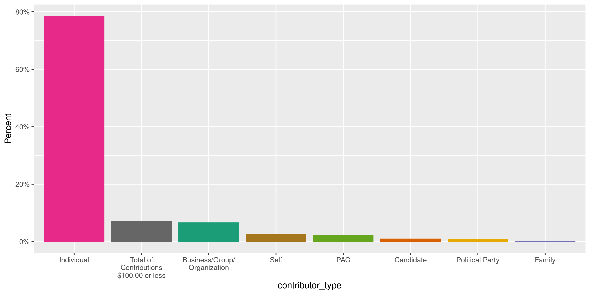
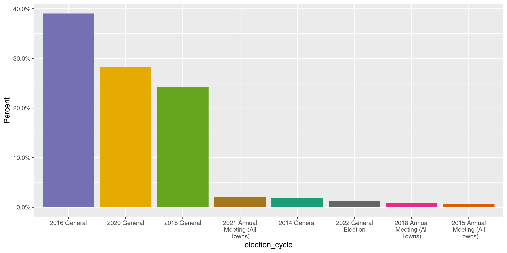
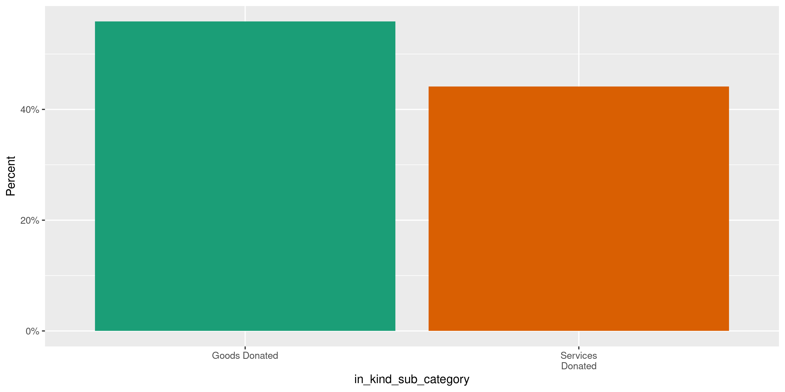
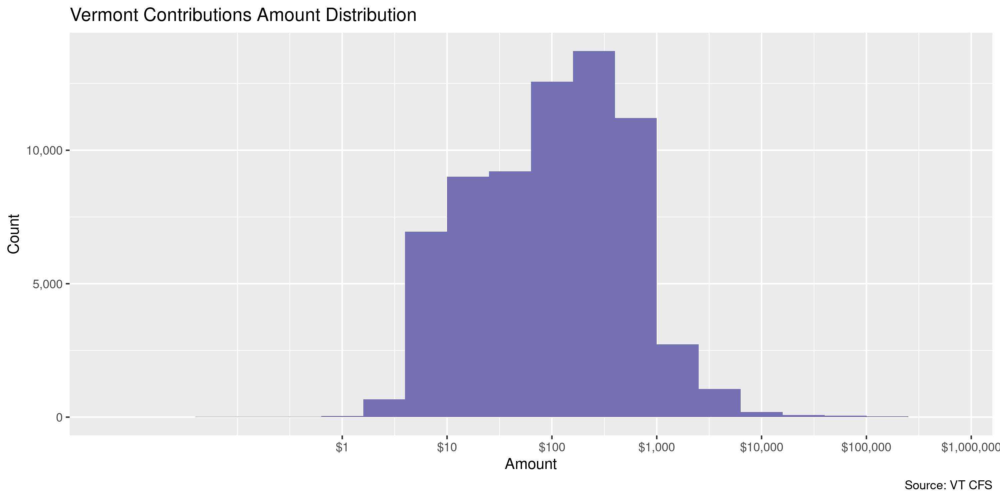

Vermont Contributions
================
Kiernan Nicholls
Fri Sep 24 12:54:38 2021

-   [Project](#project)
-   [Objectives](#objectives)
-   [Packages](#packages)
-   [Data](#data)
-   [Download](#download)
-   [Fix](#fix)
-   [Read](#read)
-   [Explore](#explore)
    -   [Missing](#missing)
    -   [Duplicates](#duplicates)
    -   [Categorical](#categorical)
    -   [Amounts](#amounts)
    -   [Dates](#dates)
-   [Wrangle](#wrangle)
    -   [ZIP](#zip)
    -   [State](#state)
    -   [City](#city)
-   [Conclude](#conclude)
-   [Export](#export)
-   [Upload](#upload)

<!-- Place comments regarding knitting here -->

## Project

The Accountability Project is an effort to cut across data silos and
give journalists, policy professionals, activists, and the public at
large a simple way to search across huge volumes of public data about
people and organizations.

Our goal is to standardize public data on a few key fields by thinking
of each dataset row as a transaction. For each transaction there should
be (at least) 3 variables:

1.  All **parties** to a transaction.
2.  The **date** of the transaction.
3.  The **amount** of money involved.

## Objectives

This document describes the process used to complete the following
objectives:

1.  How many records are in the database?
2.  Check for entirely duplicated records.
3.  Check ranges of continuous variables.
4.  Is there anything blank or missing?
5.  Check for consistency issues.
6.  Create a five-digit ZIP Code called `zip`.
7.  Create a `year` field from the transaction date.
8.  Make sure there is data on both parties to a transaction.

## Packages

The following packages are needed to collect, manipulate, visualize,
analyze, and communicate these results. The `pacman` package will
facilitate their installation and attachment.

``` r
if (!require("pacman")) {
  install.packages("pacman")
}
pacman::p_load(
  tidyverse, # data manipulation
  lubridate, # datetime strings
  gluedown, # printing markdown
  janitor, # clean data frames
  campfin, # custom irw tools
  aws.s3, # aws cloud storage
  refinr, # cluster & merge
  scales, # format strings
  knitr, # knit documents
  vroom, # fast reading
  rvest, # scrape html
  glue, # code strings
  here, # project paths
  httr, # http requests
  fs # local storage 
)
```

This document should be run as part of the `R_campfin` project, which
lives as a sub-directory of the more general, language-agnostic
[`irworkshop/accountability_datacleaning`](https://github.com/irworkshop/accountability_datacleaning)
GitHub repository.

The `R_campfin` project uses the [RStudio
projects](https://support.rstudio.com/hc/en-us/articles/200526207-Using-Projects)
feature and should be run as such. The project also uses the dynamic
`here::here()` tool for file paths relative to *your* machine.

``` r
# where does this document knit?
here::i_am("vt/contribs/docs/vt_contribs_diary.Rmd")
```

## Data

Contribution data is available from the [Vermont Campaign Finance
System](https://campaignfinance.vermont.gov/) run by the Secretary of
State’s Elections Division. Contributions can be
[searched](https://campaignfinance.vermont.gov/Public/ReceiptsList) and
exported to a CSV file.

## Download

We can run a search of all contributions since 1975, the earliest date
in the system. We will save this exported text file locally.

``` r
raw_dir <- dir_create(here("vt", "contribs", "data", "raw"))
raw_csv <- path(raw_dir, "ViewContributionsList.csv")
has_raw <- !file_exists(raw_csv)
```

``` r
set_config(config(ssl_verifypeer = FALSE))
vt_home <- GET("https://campaignfinance.vermont.gov/Public/ReceiptsList")
vt_cook <- cookies(vt_home)
vt_cook <- setNames(vt_cook$value, vt_cook$name)
```

``` r
raw_post <- POST(
  url = "https://campaignfinance.vermont.gov/Public/ViewReceipts",
  set_cookies(vt_cook),
  query = list(
    ContributorType = "",
    ContributionType = "",
    ContributorName = "",
    FirstName = "",
    Employer = "",
    FilingPeriodName = "",
    OccupationTitle = "",
    GabId = "",
    OfficeTypeCode = "",
    DistrictID = "",
    OfficeID = "",
    StartDate = "01/01/1975",
    # use current date
    EndDate = format(Sys.Date(), "%m/%d/%Y"),
    AmountRangeFrom = "",
    AmountRangeTo = "",
    OutOfState = "on",
    MemberId = "",
    PageIndex = "1",
    Election = "",
    AggAmountRangeFrom = "",
    AggAmountRangeTo = ""
  )
)
```

``` r
if (!file_exists(raw_csv)) {
  GET(
    url = "https://campaignfinance.vermont.gov/Public/ViewContributionsList",
    query = list(hgridex = 5),
    write_disk(path = raw_tmp),
    progress(type = "down"),
    set_cookies(vt_cook)
  )
}
```

## Fix

The CSV file has multiple rows with an erroneous newline (`\n`)
character within a text field, causing that record to be split across
multiple lines of the text file. We can re-combine these split lines.
There is also a trailing comma at the end of every line that can be
removed.

``` r
x <- read_lines(raw_csv)
x_top <- x[1]
x <- x[-1]
bad_nl <- which(str_starts(x, "\\d", negate = TRUE))
x[bad_nl - 1] <- paste0(x[bad_nl - 1], x[bad_nl])
x <- x[-bad_nl]
x <- str_remove(x, ",$")
x[length(x)] <- paste0(x[length(x)], ",,,,")
x <- c(x_top, x)
raw_fix <- file_temp(ext = "csv")
write_lines(x = x, file = raw_fix)
```

## Read

``` r
vtc <- read_delim( # 67,591
  file = raw_fix,
  delim = ",",
  trim_ws = TRUE,
  escape_backslash = FALSE,
  escape_double = FALSE,
  col_types = cols(
    .default = col_character(),
    `Transaction Date` = col_date("%m/%d/%Y %H:%M:%S %p"),
    `Reporting Period` = col_date("%m/%d/%Y %H:%M:%S %p"),
    `Amount` = col_double(),
    `Total Contribution Amount` = col_double()  )
)
```

``` r
problems(vtc)
#> # A tibble: 0 × 5
#> # … with 5 variables: row <int>, col <int>, expected <chr>, actual <chr>, file <chr>
```

To ensure the file was correctly read, we can count the distinct values
of a variable known to be discrete, like `Contributor Type`. If there
are no dates, addresses, etc in this column then every row has been
correctly parsed.

``` r
count(vtc, `Contributor Type`, sort = TRUE)
#> # A tibble: 11 × 2
#>    `Contributor Type`                         n
#>    <chr>                                  <int>
#>  1 Individual                             53143
#>  2 Total of Contributions $100.00 or less  4915
#>  3 Business/Group/Organization             4497
#>  4 Self                                    1809
#>  5 PAC                                     1506
#>  6 Candidate                                739
#>  7 Political Party                          697
#>  8 Family                                   233
#>  9 Legislative Leadership PAC                43
#> 10 IE-Only PAC                                6
#> 11 Public Question                            3
```

Finally, we will convert the column names to “snake” case.

``` r
vtc <- clean_names(vtc, case = "snake")
```

## Explore

There are 67,591 rows of 16 columns. Each record represents a single
contribution made from an individual or business to a political campaign
or committee.

``` r
glimpse(vtc)
#> Rows: 67,591
#> Columns: 16
#> $ transaction_date          <date> 2022-03-12, 2021-08-28, 2021-08-28, 2021-08-21, 2021-08-17, 2021-08-15, 2021-08-12,…
#> $ contributor_type          <chr> "Total of Contributions $100.00 or less", "Total of Contributions $100.00 or less", …
#> $ contributor_name          <chr> "Anonymous", "Anonymous", "Anonymous", "Giardinelli, Bryan", "Warren, Jesse", "Broug…
#> $ contributor_address       <chr> "Anonymous", "Anonymous", "Anonymous", "38081 Agua Vista, Apt. A, A, Murrieta, CA 92…
#> $ receiving_registrant      <chr> "Kitchel, Jane", "Magee, Joe C", "Felker, Christopher Aaron", "Magee, Joe C", "Magee…
#> $ receiving_registrant_type <chr> "Candidate", "Candidate", "Candidate", "Candidate", "Candidate", "Candidate", "Candi…
#> $ office                    <chr> "State Senate - Caledonia", "City Councilor -", "City Councilor -", "City Councilor …
#> $ election_cycle            <chr> "2022 General Election", "2021 Special Election -Ward 3 City Council (Burlington)", …
#> $ reporting_period          <date> 2022-03-15, 2021-08-31, 2021-08-31, 2021-08-31, 2021-08-31, 2021-08-31, 2021-08-31,…
#> $ contribution_type         <chr> "Contribution Count # :2", "Contribution Count # :3", "Contribution Count # :5", "Mo…
#> $ amount                    <dbl> 89.70, 93.00, 310.00, 27.00, 1000.00, 400.00, 300.00, 247.00, 100.00, 250.00, 50.00,…
#> $ total_contribution_amount <dbl> 89.70, 93.00, 310.00, 300.00, 1000.00, 400.00, 300.00, 247.00, 100.00, 250.00, 150.0…
#> $ comments                  <chr> "website hosting", NA, NA, NA, "Design and photography services", NA, NA, NA, NA, NA…
#> $ in_kind_sub_category      <chr> "Services Donated", NA, NA, NA, "Services Donated", NA, NA, NA, NA, NA, NA, NA, NA, …
#> $ town_city                 <chr> "Danville", NA, NA, "MURRIETA", NA, "Burlington", NA, "Burlington", NA, NA, "BURLING…
#> $ town_state                <chr> "VT", "VT", "VT", "CA", "VT", "VT", NA, "VT", "VT", "VT", "VT", "VT", "VT", "VT", "V…
tail(vtc)
#> # A tibble: 6 × 16
#>   transaction_date contributor_type   contributor_name     contributor_address receiving_regis… receiving_regist… office
#>   <date>           <chr>              <chr>                <chr>               <chr>            <chr>             <chr> 
#> 1 2013-10-28       Individual         Larson, Kathryn W    54 Caroline Street… Weinberger, Miro Candidate         Mayor…
#> 2 2013-10-25       Business/Group/Or… Balance Team, Inc.   1 King Street, Bur… Weinberger, Miro Candidate         Mayor…
#> 3 2013-10-25       Business/Group/Or… Crothers Entertainm… 29 Iranistan Road,… Weinberger, Miro Candidate         Mayor…
#> 4 2013-10-25       Individual         Perkinson, Jacob B   66 Ledge Road, Bur… Weinberger, Miro Candidate         Mayor…
#> 5 2013-10-25       Business/Group/Or… Theseus Advisors, L… PO Box 364, Burlin… Weinberger, Miro Candidate         Mayor…
#> 6 2013-10-25       Individual         Farrington, Jr., Da… 4788 Spear Street,… Weinberger, Miro Candidate         Mayor…
#> # … with 9 more variables: election_cycle <chr>, reporting_period <date>, contribution_type <chr>, amount <dbl>,
#> #   total_contribution_amount <dbl>, comments <chr>, in_kind_sub_category <chr>, town_city <chr>, town_state <chr>
```

### Missing

Columns vary in their degree of missing values.

``` r
col_stats(vtc, count_na)
#> # A tibble: 16 × 4
#>    col                       class      n     p
#>    <chr>                     <chr>  <int> <dbl>
#>  1 transaction_date          <date>     0 0    
#>  2 contributor_type          <chr>      0 0    
#>  3 contributor_name          <chr>      0 0    
#>  4 contributor_address       <chr>      0 0    
#>  5 receiving_registrant      <chr>      0 0    
#>  6 receiving_registrant_type <chr>      0 0    
#>  7 office                    <chr>  20334 0.301
#>  8 election_cycle            <chr>      0 0    
#>  9 reporting_period          <date>     0 0    
#> 10 contribution_type         <chr>      0 0    
#> 11 amount                    <dbl>      0 0    
#> 12 total_contribution_amount <dbl>      0 0    
#> 13 comments                  <chr>  60581 0.896
#> 14 in_kind_sub_category      <chr>  65406 0.968
#> 15 town_city                 <chr>  20874 0.309
#> 16 town_state                <chr>  17477 0.259
```

We can flag any record missing a key variable needed to identify a
transaction.

``` r
key_vars <- c("transaction_date", "contributor_name", 
              "amount", "receiving_registrant")
vtc <- flag_na(vtc, all_of(key_vars))
sum(vtc$na_flag)
#> [1] 0
```

There are 0 records missing a key variable.

``` r
if (sum(vtc$na_flag) == 0) {
  # remove if none exist
  vtc <- select(vtc, -na_flag)
}
```

### Duplicates

We can also flag any record completely duplicated across every column.

``` r
vtc <- flag_dupes(vtc, everything())
sum(vtc$dupe_flag)
#> [1] 1069
```

1.6% of rows are duplicated at once.

``` r
vtc %>% 
  filter(dupe_flag) %>% 
  select(all_of(key_vars)) %>% 
  arrange(transaction_date)
#> # A tibble: 1,069 × 4
#>    transaction_date contributor_name  amount receiving_registrant                              
#>    <date>           <chr>              <dbl> <chr>                                             
#>  1 2014-08-13       Fletcher, Darcy       20 Vermont-NEA Fund for Children and Public Education
#>  2 2014-08-13       Fletcher, Darcy       20 Vermont-NEA Fund for Children and Public Education
#>  3 2014-08-13       Fletcher, Darcy       20 Vermont-NEA Fund for Children and Public Education
#>  4 2014-08-13       Fletcher, Darcy       20 Vermont-NEA Fund for Children and Public Education
#>  5 2014-08-13       Fletcher, Darcy       20 Vermont-NEA Fund for Children and Public Education
#>  6 2014-08-13       Fletcher, Darcy       20 Vermont-NEA Fund for Children and Public Education
#>  7 2014-08-19       Wamble, Louis        100 Morris, Kiah                                      
#>  8 2014-08-19       Wamble, Louis        100 Morris, Kiah                                      
#>  9 2014-09-29       Richmond, Douglas    100 Feliciano, Dan                                    
#> 10 2014-09-29       Richmond, Douglas    100 Feliciano, Dan                                    
#> # … with 1,059 more rows
```

### Categorical

``` r
col_stats(vtc, n_distinct)
#> # A tibble: 17 × 4
#>    col                       class      n         p
#>    <chr>                     <chr>  <int>     <dbl>
#>  1 transaction_date          <date>  2469 0.0365   
#>  2 contributor_type          <chr>     11 0.000163 
#>  3 contributor_name          <chr>  18378 0.272    
#>  4 contributor_address       <chr>  19027 0.282    
#>  5 receiving_registrant      <chr>    981 0.0145   
#>  6 receiving_registrant_type <chr>      5 0.0000740
#>  7 office                    <chr>    177 0.00262  
#>  8 election_cycle            <chr>     23 0.000340 
#>  9 reporting_period          <date>    97 0.00144  
#> 10 contribution_type         <chr>    260 0.00385  
#> 11 amount                    <dbl>   3622 0.0536   
#> 12 total_contribution_amount <dbl>   3212 0.0475   
#> 13 comments                  <chr>   3955 0.0585   
#> 14 in_kind_sub_category      <chr>      3 0.0000444
#> 15 town_city                 <chr>   2094 0.0310   
#> 16 town_state                <chr>     55 0.000814 
#> 17 dupe_flag                 <lgl>      2 0.0000296
```

<!-- --><!-- --><!-- --><!-- --><!-- -->

### Amounts

``` r
summary(vtc$amount)
#>     Min.  1st Qu.   Median     Mean  3rd Qu.     Max. 
#>      0.0     27.0    100.0    523.8    300.0 400000.0
mean(vtc$amount <= 0)
#> [1] 0
```

These are the records with the minimum and maximum amounts.

``` r
glimpse(vtc[c(which.max(vtc$amount), which.min(vtc$amount)), ])
#> Rows: 2
#> Columns: 17
#> $ transaction_date          <date> 2016-10-28, 2020-12-12
#> $ contributor_type          <chr> "Business/Group/Organization", "Total of Contributions $100.00 or less"
#> $ contributor_name          <chr> "REPUBLICAN GOVERNORS ASSOCIATION", "Anonymous"
#> $ contributor_address       <chr> "1747 PENN. AVE. NW STE. 250, WASHINGTON, DC 20006", "Anonymous"
#> $ receiving_registrant      <chr> "A Stronger Vermont", "Cina, Brian"
#> $ receiving_registrant_type <chr> "IE-Only Political Action Committee", "Candidate"
#> $ office                    <chr> NA, "State Representative - Chittenden 6-4"
#> $ election_cycle            <chr> "2016 General", "2020 General"
#> $ reporting_period          <date> 2016-11-04, 2020-12-15
#> $ contribution_type         <chr> "Monetary", "Contribution Count # :1"
#> $ amount                    <dbl> 4e+05, 1e-02
#> $ total_contribution_amount <dbl> 3.019e+06, 1.000e-02
#> $ comments                  <chr> "CONTRIBUTION", "&quot;dividends&quot;"
#> $ in_kind_sub_category      <chr> NA, NA
#> $ town_city                 <chr> NA, NA
#> $ town_state                <chr> NA, NA
#> $ dupe_flag                 <lgl> FALSE, FALSE
```

<!-- -->

### Dates

We can add the calendar year from `date` with `lubridate::year()`

``` r
vtc <- mutate(vtc, transaction_year = year(transaction_date))
```

``` r
min(vtc$transaction_date)
#> [1] "2013-10-25"
sum(vtc$transaction_year < 2000)
#> [1] 0
max(vtc$transaction_date)
#> [1] "2022-03-12"
sum(vtc$transaction_date > today())
#> [1] 1
```

<!-- -->

## Wrangle

To improve the searchability of the database, we will perform some
consistent, confident string normalization. For geographic variables
like city names and ZIP codes, the corresponding `campfin::normal_*()`
functions are tailor made to facilitate this process.

First, we notice that the vast majority of the existing `town_city` and
`town_state` variables are missing.

``` r
prop_na(vtc$town_city)
#> [1] 0.3088281
prop_na(vtc$town_state)
#> [1] 0.2585699
vtc %>% 
  select(contributor_address, town_city, town_state) %>% 
  filter(!is.na(town_city) & !is.na(town_state))
#> # A tibble: 46,643 × 3
#>    contributor_address                                    town_city  town_state
#>    <chr>                                                  <chr>      <chr>     
#>  1 Anonymous                                              Danville   VT        
#>  2 38081 Agua Vista, Apt. A, A, Murrieta, CA 92563        MURRIETA   CA        
#>  3 52 Henry Street, Burlington, VT 05401                  Burlington VT        
#>  4 Anonymous                                              Burlington VT        
#>  5 45 Alfred Terrace, Burlington, VT 05401                BURLINGTON VT        
#>  6 5 S. Main St. Ste. 322, White River Junction, VT 05001 Hartford   VT        
#>  7 Anonymous                                              BURLINGTON VT        
#>  8 Anonymous                                              Grand Isle VT        
#>  9 41 N Champlain Street, Burlington, VT 05401            Burlington VT        
#> 10 428 Bolton Valley Access Rd, Bolton, VT 05676          Bolton     VT        
#> # … with 46,633 more rows
```

However, the city and state values are present in the full contributor
address line, which can be split into it’s components with
`tidyr::separate()`.

``` r
vtc <- vtc %>% 
  mutate(address_tmp = na_if(contributor_address, "Anonymous")) %>% 
  separate(
    col = address_tmp,
    into = c(glue("addr{1:10}"), "city_sep", "state_zip"),
    sep = "\\s?,\\s",
    remove = TRUE,
    fill = "left",
    extra = "merge"
  ) %>% 
  mutate(
    across(
      starts_with("addr"),
      normal_address,
      abbs = usps_street,
      na_rep = TRUE
    )
  ) %>% 
  unite(
    starts_with("addr"),
    col = addr_norm,
    sep = " ",
    remove = TRUE,
    na.rm = TRUE
  ) %>% 
  mutate(across(addr_norm, na_if, "")) %>% 
  separate(
    col = state_zip,
    into = c("state_sep", "zip_sep"),
    sep = "\\s(?=\\d)",
    remove = TRUE
  ) %>% 
  mutate(
    city_sep = coalesce(city_sep, town_city),
    state_sep = coalesce(state_sep, town_state)
  ) %>% 
  relocate(ends_with("_sep"), .after = last_col())
```

``` r
vtc %>% 
  select(contributor_address, ends_with("_sep")) %>% 
  filter(!is.na(contributor_address)) %>% 
  sample_n(10)
#> # A tibble: 10 × 4
#>    contributor_address                                  city_sep         state_sep zip_sep   
#>    <chr>                                                <chr>            <chr>     <chr>     
#>  1 1350 Sherman Hollow Rd, Huntington, VT 05462         Huntington       VT        05462     
#>  2 PO Box 8, New Haven, VT 05472                        New Haven        VT        05472     
#>  3 7234 Parkway Dr, Hanover, MD 21076                   Hanover          MD        21076     
#>  4 PO BOX 263, JAMAICA, VT 05343                        JAMAICA          VT        05343     
#>  5 2 Hill Road, S. Hero, VT 05486                       S. Hero          VT        05486     
#>  6 316 Willard St, Burlington, VT 05401                 Burlington       VT        05401     
#>  7 275 Woods Rd, Brookfield, VT 05036                   Brookfield       VT        05036     
#>  8 230 N Williston Rd, Williston, VT 05495-9562         Williston        VT        05495-9562
#>  9 111 Hubbard Farm Rd, Waterbury Center, VT 05677-8275 Waterbury Center VT        05677-8275
#> 10 161 Austin Dr, Apt 15, Burlington, VT 05401-5452     Burlington       VT        05401-5452
```

### ZIP

For ZIP codes, the `campfin::normal_zip()` function will attempt to
create valid *five* digit codes by removing the ZIP+4 suffix and
returning leading zeroes dropped by other programs like Microsoft Excel.

``` r
vtc <- vtc %>% 
  mutate(
    zip_norm = normal_zip(
      zip = zip_sep,
      na_rep = TRUE
    )
  )
```

``` r
progress_table(
  vtc$zip_sep,
  vtc$zip_norm,
  compare = valid_zip
)
#> # A tibble: 2 × 6
#>   stage        prop_in n_distinct prop_na n_out n_diff
#>   <chr>          <dbl>      <dbl>   <dbl> <dbl>  <dbl>
#> 1 vtc$zip_sep    0.770       6723  0.0727 14400   4618
#> 2 vtc$zip_norm   0.998       2682  0.0730   121     74
```

### State

Valid two digit state abbreviations can be made using the
`campfin::normal_state()` function.

``` r
vtc <- vtc %>% 
  mutate(
    state_norm = normal_state(
      state = state_sep,
      abbreviate = TRUE,
      na_rep = TRUE,
      valid = valid_state
    )
  )
```

``` r
vtc %>% 
  filter(state_sep != state_norm) %>% 
  count(state_sep, state_norm, sort = TRUE)
#> # A tibble: 1 × 3
#>   state_sep state_norm     n
#>   <chr>     <chr>      <int>
#> 1 Vt        VT             1
```

``` r
progress_table(
  vtc$state_sep,
  vtc$state_norm,
  compare = valid_state
)
#> # A tibble: 2 × 6
#>   stage          prop_in n_distinct prop_na n_out n_diff
#>   <chr>            <dbl>      <dbl>   <dbl> <dbl>  <dbl>
#> 1 vtc$state_sep     1.00         57  0.0100     7      4
#> 2 vtc$state_norm    1            54  0.0101     0      1
```

### City

Cities are the most difficult geographic variable to normalize, simply
due to the wide variety of valid cities and formats.

#### Normal

The `campfin::normal_city()` function is a good start, again converting
case, removing punctuation, but *expanding* USPS abbreviations. We can
also remove `invalid_city` values.

``` r
norm_city <- vtc %>% 
  distinct(city_sep, state_norm, zip_norm) %>% 
  mutate(
    city_norm = normal_city(
      city = city_sep, 
      abbs = usps_city,
      states = c("NH", "DC", "NEW HAMPSHIRE"),
      na = invalid_city,
      na_rep = TRUE
    )
  )
```

#### Swap

We can further improve normalization by comparing our normalized value
against the *expected* value for that record’s state abbreviation and
ZIP code. If the normalized value is either an abbreviation for or very
similar to the expected value, we can confidently swap those two.

``` r
norm_city <- norm_city %>% 
  left_join(
    y = zipcodes,
    by = c(
      "state_norm" = "state",
      "zip_norm" = "zip"
    )
  ) %>% 
  rename(city_match = city) %>% 
  mutate(
    match_abb = is_abbrev(city_norm, city_match),
    match_dist = str_dist(city_norm, city_match),
    city_swap = if_else(
      condition = !is.na(match_dist) & (match_abb | match_dist == 1),
      true = city_match,
      false = city_norm
    )
  ) %>% 
  select(
    -city_match,
    -match_dist,
    -match_abb
  )
```

``` r
vtc <- left_join(vtc, norm_city, by = c("city_sep", "zip_norm", "state_norm"))
```

#### Refine

The [OpenRefine](https://openrefine.org/) algorithms can be used to
group similar strings and replace the less common versions with their
most common counterpart. This can greatly reduce inconsistency, but with
low confidence; we will only keep any refined strings that have a valid
city/state/zip combination.

``` r
good_refine <- vtc %>% 
  mutate(
    city_refine = city_swap %>% 
      key_collision_merge() %>% 
      n_gram_merge(numgram = 1)
  ) %>% 
  filter(city_refine != city_swap) %>% 
  inner_join(
    y = zipcodes,
    by = c(
      "city_refine" = "city",
      "state_norm" = "state",
      "zip_norm" = "zip"
    )
  )
```

    #> # A tibble: 4 × 5
    #>   state_norm zip_norm city_swap        city_refine          n
    #>   <chr>      <chr>    <chr>            <chr>            <int>
    #> 1 VT         05053    NORTH PROMFET    NORTH POMFRET        1
    #> 2 VT         05403    SOUTH BURLINGONT SOUTH BURLINGTON     1
    #> 3 VT         05458    GRAND ISLE RD    GRAND ISLE           1
    #> 4 VT         05736    RUTLAND CENTER   CENTER RUTLAND       1

Then we can join the refined values back to the database.

``` r
vtc <- vtc %>% 
  left_join(good_refine, by = names(.)) %>% 
  mutate(city_refine = coalesce(city_refine, city_swap))
```

#### Manual

``` r
many_city <- c(valid_city, extra_city)
vtc %>% 
  count(state_norm, city_refine, sort = TRUE) %>% 
  filter(city_refine %out% many_city)
#> # A tibble: 233 × 3
#>    state_norm city_refine          n
#>    <chr>      <chr>            <int>
#>  1 <NA>       <NA>               675
#>  2 VT         <NA>               642
#>  3 VT         WEYBRIDGE          195
#>  4 VT         GEORGIA            114
#>  5 VT         WEST BRATTLEBORO    77
#>  6 MA         NEEDHAM HEIGHTS     74
#>  7 VT         ST ALBANS           70
#>  8 VT         ST JOHNSBURY        66
#>  9 VT         PANTON              61
#> 10 VT         NORTH MIDDLESEX     46
#> # … with 223 more rows
```

``` r
many_city <- c(many_city, "WEYBRIDGE", "GEORGIA")
```

#### Progress

| stage                        | prop\_in | n\_distinct | prop\_na | n\_out | n\_diff |
|:-----------------------------|---------:|------------:|---------:|-------:|--------:|
| `str_to_upper(vtc$city_sep)` |    0.926 |        2202 |    0.019 |   4879 |     554 |
| `vtc$city_norm`              |    0.950 |        2039 |    0.020 |   3287 |     379 |
| `vtc$city_swap`              |    0.981 |        1882 |    0.020 |   1238 |     215 |
| `vtc$city_refine`            |    0.981 |        1878 |    0.020 |   1234 |     211 |

You can see how the percentage of valid values increased with each
stage.

<!-- -->

More importantly, the number of distinct values decreased each stage. We
were able to confidently change many distinct invalid values to their
valid equivalent.

<!-- -->

Before exporting, we can remove the intermediary normalization columns
and rename all added variables with the `_clean` suffix.

``` r
vtc <- vtc %>% 
  select(
    -ends_with("_sep"),
    -city_norm,
    -city_swap,
    city_clean = city_refine
  ) %>% 
  rename_all(~str_replace(., "_norm", "_clean")) %>% 
  rename_all(~str_remove(., "_raw")) %>% 
  relocate(city_clean, state_clean, zip_clean, .after = addr_clean)
```

## Conclude

``` r
glimpse(sample_frac(vtc))
#> Rows: 67,591
#> Columns: 22
#> $ transaction_date          <date> 2020-12-23, 2018-09-28, 2020-03-30, 2020-10-14, 2020-02-19, 2020-07-14, 2015-06-22,…
#> $ contributor_type          <chr> "Individual", "Individual", "Individual", "Individual", "Total of Contributions $100…
#> $ contributor_name          <chr> "Hurt, Samantha", "Lemay, Paul", "CHRISTIANSON, KIENAN", "LAX, LISA K", "Anonymous",…
#> $ contributor_address       <chr> "111 RIVERS EDGE DR, Burlington, VT 05408", "P. O. Box 396, East Burke, VT 05832", "…
#> $ receiving_registrant      <chr> "Tracy, Maxwell", "Scott, Phil", "Vermont Progressive Party", "Vermont Progressive P…
#> $ receiving_registrant_type <chr> "Candidate", "Candidate", "Political Party Committee", "Political Party Committee", …
#> $ office                    <chr> "Mayor -", "Governor", NA, NA, "City Councilor -", "State Senate - Chittenden", NA, …
#> $ election_cycle            <chr> "2021 Annual Meeting (All Towns)", "2018 General", "2020 General", "2020 General", "…
#> $ reporting_period          <date> 2021-01-31, 2018-10-01, 2020-07-01, 2020-10-30, 2020-02-22, 2020-08-01, 2015-07-15,…
#> $ contribution_type         <chr> "Monetary", "Monetary", "Monetary", "Monetary", "Contribution Count # :43", "Monetar…
#> $ amount                    <dbl> 100.00, 50.00, 10.00, 27.00, 3235.00, 150.00, 63.00, 5.00, 37.00, 10.00, 10.00, 1500…
#> $ total_contribution_amount <dbl> 1040.00, 200.00, 150.00, 127.00, 3235.00, 150.00, 186.00, 175.00, 37.00, 180.00, 240…
#> $ comments                  <chr> NA, NA, NA, NA, NA, NA, NA, NA, NA, NA, "Payroll Deduction", NA, NA, "Campaign contr…
#> $ in_kind_sub_category      <chr> NA, NA, NA, NA, NA, NA, NA, NA, NA, NA, NA, NA, NA, NA, NA, NA, NA, NA, "Goods Donat…
#> $ town_city                 <chr> "Burlington", "East Burke", "BURLINGTON", "Burlington", "Brattleboro", "Burlington",…
#> $ town_state                <chr> "VT", "VT", "VT", "VT", "VT", "VT", "VT", "VT", "MD", "VT", "CT", NA, "ME", NA, "VT"…
#> $ dupe_flag                 <lgl> FALSE, FALSE, FALSE, FALSE, FALSE, FALSE, FALSE, FALSE, FALSE, FALSE, FALSE, FALSE, …
#> $ transaction_year          <dbl> 2020, 2018, 2020, 2020, 2020, 2020, 2015, 2016, 2020, 2016, 2019, 2016, 2020, 2018, …
#> $ addr_clean                <chr> "111 RIVERS EDGE DR", "PO BOX 396", "35 ALGIRD ST", "41 THIBAULT PKWY", NA, "45 BILO…
#> $ city_clean                <chr> "BURLINGTON", "EAST BURKE", "BURLINGTON", "BURLINGTON", "BRATTLEBORO", "BURLINGTON",…
#> $ state_clean               <chr> "VT", "VT", "VT", "VT", "VT", "VT", "VT", "VT", "MD", "VT", "CT", "VT", "ME", NA, "V…
#> $ zip_clean                 <chr> "05408", "05832", "05408", "05401", NA, "05401", "05860", "05602", NA, "05489", "064…
```

1.  There are 67,591 records in the database.
2.  There are 1,069 duplicate records in the database.
3.  The range and distribution of `amount` and `date` seem reasonable.
4.  There are 0 records missing key variables.
5.  Consistency in geographic data has been improved with
    `campfin::normal_*()`.
6.  The 4-digit `year` variable has been created with
    `lubridate::year()`.

## Export

Now the file can be saved on disk for upload to the Accountability
server.

``` r
clean_dir <- dir_create(here("vt", "contribs", "data", "clean"))
clean_path <- path(clean_dir, "vt_contribs_20131025-20210924.csv")
write_csv(vtc, clean_path, na = "")
(clean_size <- file_size(clean_path))
#> 15.2M
```

## Upload

We can use the `aws.s3::put_object()` to upload the text file to the IRW
server.

``` r
aws_path <- path("csv", basename(clean_path))
if (!object_exists(aws_path, "publicaccountability")) {
  put_object(
    file = clean_path,
    object = aws_path, 
    bucket = "publicaccountability",
    acl = "public-read",
    show_progress = TRUE,
    multipart = TRUE
  )
}
aws_head <- head_object(aws_path, "publicaccountability")
(aws_size <- as_fs_bytes(attr(aws_head, "content-length")))
unname(aws_size == clean_size)
```
