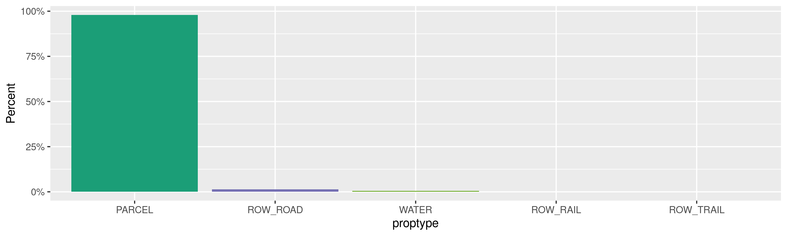
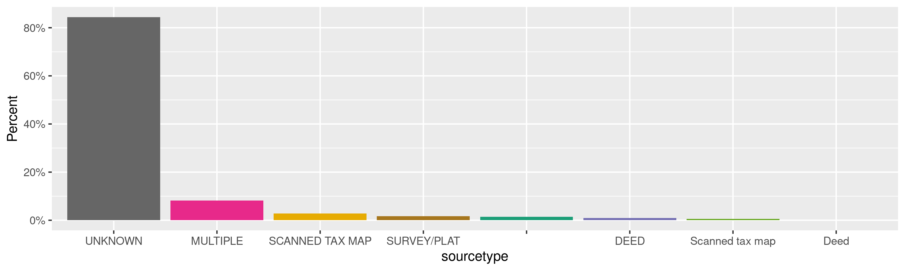
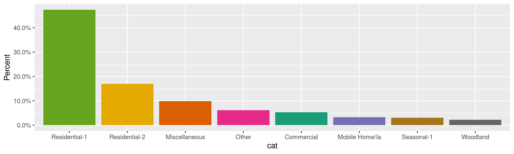
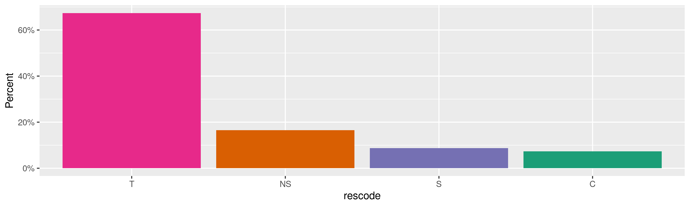
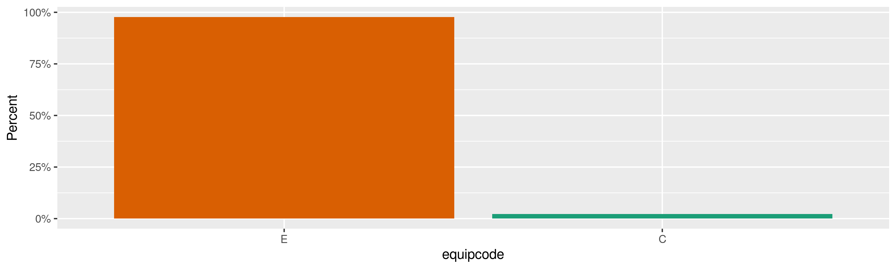
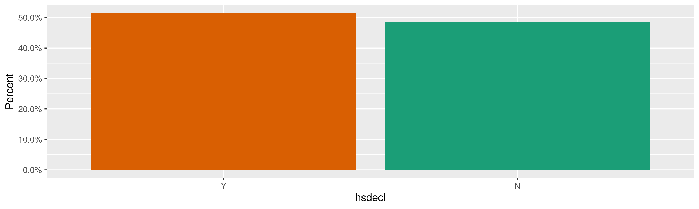
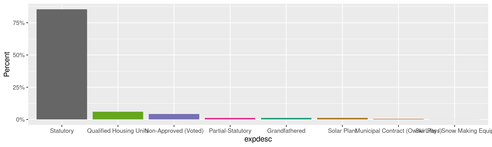
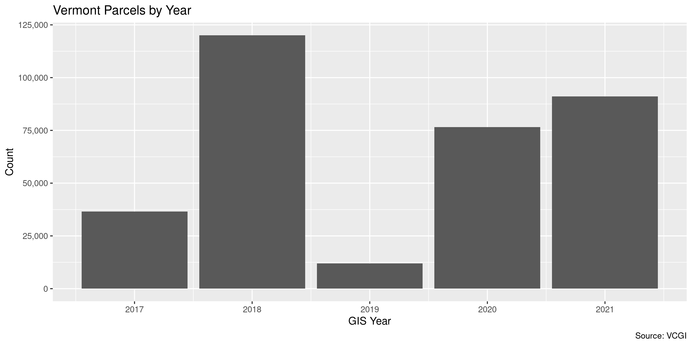

Vermont Parcels
================
Kiernan Nicholls
Tue Oct 12 15:53:20 2021

-   [Project](#project)
-   [Objectives](#objectives)
-   [Packages](#packages)
-   [Data](#data)
    -   [Dictionary](#dictionary)
-   [Download](#download)
-   [Read](#read)
-   [Explore](#explore)
    -   [Missing](#missing)
    -   [Duplicates](#duplicates)
    -   [Categorical](#categorical)
    -   [Amounts](#amounts)
    -   [Dates](#dates)
-   [Wrangle](#wrangle)
    -   [Address](#address)
    -   [ZIP](#zip)
    -   [State](#state)
    -   [City](#city)
-   [Conclude](#conclude)
-   [Export](#export)
-   [Upload](#upload)

<!-- Place comments regarding knitting here -->

## Project

The Accountability Project is an effort to cut across data silos and
give journalists, policy professionals, activists, and the public at
large a simple way to search across huge volumes of public data about
people and organizations.

Our goal is to standardize public data on a few key fields by thinking
of each dataset row as a transaction. For each transaction there should
be (at least) 3 variables:

1.  All **parties** to a transaction.
2.  The **date** of the transaction.
3.  The **amount** of money involved.

## Objectives

This document describes the process used to complete the following
objectives:

1.  How many records are in the database?
2.  Check for entirely duplicated records.
3.  Check ranges of continuous variables.
4.  Is there anything blank or missing?
5.  Check for consistency issues.
6.  Create a five-digit ZIP Code called `zip`.
7.  Create a `year` field from the transaction date.
8.  Make sure there is data on both parties to a transaction.

## Packages

The following packages are needed to collect, manipulate, visualize,
analyze, and communicate these results. The `pacman` package will
facilitate their installation and attachment.

``` r
if (!require("pacman")) {
  install.packages("pacman")
}
pacman::p_load(
  tidyverse, # data manipulation
  lubridate, # datetime strings
  jsonlite, # parse JSON data
  gluedown, # printing markdown
  janitor, # clean data frames
  campfin, # custom irw tools
  aws.s3, # aws cloud storage
  refinr, # cluster & merge
  scales, # format strings
  knitr, # knit documents
  vroom, # fast reading
  rvest, # scrape html
  glue, # code strings
  here, # project paths
  httr, # http requests
  fs # local storage 
)
```

This document should be run as part of the `R_campfin` project, which
lives as a sub-directory of the more general, language-agnostic
[`irworkshop/accountability_datacleaning`](https://github.com/irworkshop/accountability_datacleaning)
GitHub repository.

The `R_campfin` project uses the [RStudio
projects](https://support.rstudio.com/hc/en-us/articles/200526207-Using-Projects)
feature and should be run as such. The project also uses the dynamic
`here::here()` tool for file paths relative to *your* machine.

``` r
# where does this document knit?
here::i_am("vt/parcels/docs/vt_parcels_diary.Rmd")
```

## Data

Data is from the [Vermont Parcel
Program](https://vcgi.vermont.gov/data-and-programs/parcel-program) run
by the [Vermont Center for Geographic
Information](https://vcgi.vermont.gov/).

> Parcel mapping in Vermont is undertaken and overseen by each
> municipality, who may perform annual map updates on their own or hire
> vendors to maintain. As part of the Parcel Program, VCGI coordinates
> the collection of the best available digital parcel data from
> municipalities and publishes them in a uniform GIS format joined with
> the Tax Department’s [annual grand
> list](https://tax.vermont.gov/municipal-officials/data-request). VCGI
> also develops the [data
> standards](https://vcgi.vermont.gov/document/vt-gis-parcel-data-standard),
> [templates](https://vcgi.vermont.gov/document/geodatabase-template-parcel-data-standard),
> [digital parcel mapping
> guidelines](https://vcgi.vermont.gov/document/vermont-gis-parcel-mapping-guideline),
> and guidance resources by which Vermont digital GIS parcel data are
> organized and made publicly available.
>
> The Parcel Program is an outgrowth of the [Statewide Property Mapping
> Project](https://legislature.vermont.gov/statutes/section/19/001/00044)
> which included a three-year (2017-2019) funded effort to create or
> update digital GIS parcel data for all of Vermont’s municipalities.
> The Project successfully completed that work in December 2019,
> resulting in a freely available GIS layer for all Vermont
> municipalities joined with their [annual grand
> list](https://tax.vermont.gov/municipal-officials/data-request) via a
> parcel’s unique [School Property Account Number
> (SPAN)](https://tax.vermont.gov/home/tax-learning-center/glossary#s).
> The parcel Program now supports the ongoing collection and publishing
> of municipal parcel data in GIS format statewide, continuing to use
> the SPAN number as a unique parcel identifier.

### Dictionary

| name            | alias                                           | type         | length |
|:----------------|:------------------------------------------------|:-------------|-------:|
| `OBJECTID`      | OBJECTID                                        | OID          |        |
| `SPAN`          | GIS SPAN                                        | String       |     13 |
| `GLIST_SPAN`    | Grand List SPAN                                 | String       |     13 |
| `MAPID`         | MAPID                                           | String       |     80 |
| `PARCID`        | Parcel ID                                       | String       |    100 |
| `PROPTYPE`      | PROPTYPE                                        | String       |      9 |
| `YEAR`          | GIS Year                                        | SmallInteger |        |
| `GLYEAR`        | Grand List Year                                 | SmallInteger |        |
| `TOWN`          | TOWN                                            | String       |     30 |
| `TNAME`         | Grand-List Town-Name                            | String       |    100 |
| `SOURCENAME`    | SOURCENAME                                      | String       |     80 |
| `SOURCETYPE`    | SOURCETYPE                                      | String       |     19 |
| `SOURCEDATE`    | SOURCEDATE                                      | String       |      8 |
| `EDITMETHOD`    | EDITMETHOD                                      | String       |     20 |
| `EDITOR`        | EDITOR                                          | String       |     50 |
| `EDITDATE`      | EDITDATE                                        | String       |      8 |
| `MATCHSTAT`     | MATCHSTAT                                       | String       |      9 |
| `EDITNOTE`      | EDITNOTE                                        | String       |    254 |
| `OWNER1`        | Owner Name 1                                    | String       |    100 |
| `OWNER2`        | Owner Name 2                                    | String       |    100 |
| `ADDRGL1`       | Mailing Address 1                               | String       |    100 |
| `ADDRGL2`       | Mailing Address 2                               | String       |    100 |
| `CITYGL`        | Mailing Address City                            | String       |    100 |
| `STGL`          | Mailing Address State                           | String       |    100 |
| `ZIPGL`         | Mailing Address Zip                             | String       |    100 |
| `DESCPROP`      | Property Description                            | String       |    100 |
| `LOCAPROP`      | Location                                        | String       |    100 |
| `CAT`           | Category (Real Estate only)                     | String       |    100 |
| `RESCODE`       | Resident Ownership Code                         | String       |    100 |
| `ACRESGL`       | Total Acres                                     | Double       |        |
| `REAL_FLV`      | Listed Real Value (Full)                        | Integer      |        |
| `HSTED_FLV`     | Homestead Listed Value (Full)                   | Integer      |        |
| `NRES_FLV`      | Non-Residential Value (Full)                    | Integer      |        |
| `LAND_LV`       | Listed Value of Land                            | Integer      |        |
| `IMPRV_LV`      | Listed Value of Improvements                    | Integer      |        |
| `EQUIPVAL`      | Equipment Value (Personal Property)             | Integer      |        |
| `EQUIPCODE`     | Equipment Code (Cable only)                     | String       |    100 |
| `INVENVAL`      | Inventory Value                                 | Integer      |        |
| `HSDECL`        | Homestead Declared (Y/N)                        | String       |    100 |
| `HSITEVAL`      | Housesite Value                                 | Integer      |        |
| `VETEXAMT`      | Veterans Exemption Amount                       | Integer      |        |
| `EXPDESC`       | Other Exemption Type                            | String       |    100 |
| `ENDDATE`       | Exemption End Date                              | String       |    100 |
| `STATUTE`       | Exemption Statute                               | String       |    100 |
| `EXAMT_HS`      | Exemption Homestead Amount                      | Integer      |        |
| `EXAMT_NR`      | Exemption Non-Residential Amount                | Integer      |        |
| `UVREDUC_HS`    | Current Use Homestead Reduction Amount          | Integer      |        |
| `UVREDUC_NR`    | Current Use Non-Residential Reduction Amount    | Integer      |        |
| `GLVAL_HS`      | Education Grand List Value Homestead (1%)       | Double       |        |
| `GLVAL_NR`      | Education Grand List Value Non-Residential (1%) | Double       |        |
| `CRHOUSPCT`     | Covenant Restricted Housing Percent             | Double       |        |
| `MUNGL1PCT`     | Municipal Grand List Value (1%)                 | Double       |        |
| `AOEGL_HS`      | AOE Grand List Value Homestead (1%)             | Double       |        |
| `AOEGL_NR`      | AOE GL Value Non-Residential (1%)               | Double       |        |
| `E911ADDR`      | Emergency 911 Address                           | String       |    100 |
| `Shape__Area`   | Shape\_\_Area                                   | Double       |        |
| `Shape__Length` | Shape\_\_Length                                 | Double       |        |

## Download

The parcel list can be downloaded directly from the Vermont Open Geodata
Portal.

``` r
id <- "09cf47e1cf82465e99164762a04f3ce6_0"
vt_head <- HEAD(
  url = glue("https://opendata.arcgis.com/api/v3/datasets/{id}/downloads/data"),
  query = list(
    format = "csv",
    spatialRefId = 32145
  )
)
```

``` r
vt_info <- headers(vt_head)
vt_name <- str_extract(vt_info[["content-disposition"]], '(?<=").*?(?=")')
```

``` r
raw_dir <- dir_create(here("vt", "parcels", "data", "raw"))
raw_csv <- path(raw_dir, vt_name)
```

``` r
if (!file_exists(raw_csv)) {
  GET(
    url = vt_head$url,
    write_disk(raw_csv), 
    progress("down")
  )
}
```

## Read

The tabular parcel list can be read as a data frame from the CSV file.

``` r
vtp <- read_delim(
  file = raw_csv,
  delim = ",",
  guess_max = 1e6,
  escape_backslash = FALSE,
  escape_double = FALSE
)
```

``` r
vtp <- clean_names(vtp, case = "snake")
```

## Explore

There are 336,224 rows of 57 columns. Each record represents a single
property parcel in the state of Vermont.

``` r
glimpse(vtp)
#> Rows: 336,224
#> Columns: 57
#> $ objectid     <dbl> 1, 2, 3, 4, 5, 6, 7, 8, 9, 10, 11, 12, 13, 14, 15, 16, 17, 18, 19, 20, 21, 22, 23, 24, 25, 26, 27…
#> $ span         <chr> "009-003-10160", "009-003-10509", "009-003-10161", "009-003-10510", "009-003-10162", "009-003-105…
#> $ glist_span   <chr> "009-003-10160", "009-003-10509", "009-003-10161", "009-003-10510", "009-003-10162", "009-003-105…
#> $ mapid        <chr> NA, NA, NA, NA, NA, NA, NA, NA, NA, NA, NA, NA, NA, NA, NA, NA, NA, NA, NA, NA, NA, NA, NA, NA, N…
#> $ parcid       <chr> "BA021-", "FK071-", "BA023-", "FK075-", "BA025-", "FK079-", "BD011-", "FK083-", "BD018-", "FK085-…
#> $ proptype     <chr> "PARCEL", "PARCEL", "PARCEL", "PARCEL", "PARCEL", "PARCEL", "PARCEL", "PARCEL", "PARCEL", "PARCEL…
#> $ year         <dbl> 2021, 2021, 2021, 2021, 2021, 2021, 2021, 2021, 2021, 2021, 2021, 2021, 2021, 2021, 2021, 2021, 2…
#> $ glyear       <dbl> 2020, 2020, 2020, 2020, 2020, 2020, 2020, 2020, 2020, 2020, 2020, 2020, 2020, 2020, 2020, 2020, 2…
#> $ town         <chr> "ALBURGH", "ALBURGH", "ALBURGH", "ALBURGH", "ALBURGH", "ALBURGH", "ALBURGH", "ALBURGH", "ALBURGH"…
#> $ tname        <chr> "Alburgh", "Alburgh", "Alburgh", "Alburgh", "Alburgh", "Alburgh", "Alburgh", "Alburgh", "Alburgh"…
#> $ sourcename   <chr> NA, NA, NA, NA, NA, NA, NA, NA, NA, NA, NA, NA, NA, NA, NA, NA, NA, NA, NA, NA, NA, NA, NA, NA, N…
#> $ sourcetype   <chr> "UNKNOWN", "UNKNOWN", "UNKNOWN", "UNKNOWN", "UNKNOWN", "UNKNOWN", "UNKNOWN", "UNKNOWN", "UNKNOWN"…
#> $ sourcedate   <chr> "UNKNOWN", "UNKNOWN", "UNKNOWN", "UNKNOWN", "UNKNOWN", "UNKNOWN", "UNKNOWN", "UNKNOWN", "UNKNOWN"…
#> $ editmethod   <chr> "UNKNOWN", "UNKNOWN", "UNKNOWN", "UNKNOWN", "UNKNOWN", "UNKNOWN", "UNKNOWN", "UNKNOWN", "UNKNOWN"…
#> $ editor       <chr> "UNKNOWN", "UNKNOWN", "UNKNOWN", "UNKNOWN", "UNKNOWN", "UNKNOWN", "UNKNOWN", "UNKNOWN", "UNKNOWN"…
#> $ editdate     <chr> "UNKNOWN", "UNKNOWN", "UNKNOWN", "UNKNOWN", "UNKNOWN", "UNKNOWN", "UNKNOWN", "UNKNOWN", "UNKNOWN"…
#> $ matchstat    <chr> "MATCH", "MATCH", "MATCH", "MATCH", "MATCH", "MATCH", "MATCH", "MATCH", "MATCH", "MATCH", "MATCH"…
#> $ editnote     <chr> "UNKNOWN", "UNKNOWN", "UNKNOWN", "UNKNOWN", "UNKNOWN", "UNKNOWN", "UNKNOWN", "UNKNOWN", "UNKNOWN"…
#> $ owner1       <chr> "PRATT JOHN", "ZWARYCH PETER", "LYON WILLIAM", "WALBY ANNE TRUST", "ROSENBERG ROGER", "VALELA BRU…
#> $ owner2       <chr> "URWIN CHARLENE", "ZWARYCH GLADYS", "LYON ANN", "FALLON JOSEPH C/O BREMMAM PUNDERSON & DO", "ROSE…
#> $ addrgl1      <chr> "614 WEST JOHANNA ST", "7405 E GOSPEL ISLAND ROAD", "40 PARTRIDGE TERRACE", "PO BOX 648", "10239 …
#> $ addrgl2      <chr> NA, NA, NA, NA, NA, NA, NA, NA, NA, NA, NA, NA, NA, NA, NA, NA, NA, NA, NA, NA, NA, NA, NA, NA, N…
#> $ citygl       <chr> "AUSTIN", "INVERNESS", "NORTHFIELD", "ALBURGH", "DALLAS", "ST LEONARD", "ALBURGH", "ALBURGH", "AL…
#> $ stgl         <chr> "TX", "FL", "VT", "VT", "TX", "QC", "VT", "VT", "VT", "VT", "VT", "VT", "VT", "NH", "VT", "ME", "…
#> $ zipgl        <chr> "78704", "34450", "05663", "05440", "75229", "H1P 1R1", "05440", "05440", "05440", "05440", "0544…
#> $ descprop     <chr> "LOT & HOUSE", "LOT", "LOT & HOUSE", "LOT & HOUSE", "LOT & HOUSE", "LOT & HOUSE", "LAND & HOUSE",…
#> $ locaprop     <chr> NA, NA, NA, NA, NA, NA, NA, NA, NA, NA, NA, NA, NA, NA, NA, NA, NA, NA, NA, NA, NA, NA, NA, NA, N…
#> $ cat          <chr> "Seasonal-1", "Miscellaneous", "Seasonal-1", "Seasonal-1", "Seasonal-1", "Seasonal-1", "Residenti…
#> $ rescode      <chr> "NS", "NS", "S", "T", "T", "NS", "T", "T", "NS", "S", "T", "T", "S", "NS", "S", "T", "T", "T", "S…
#> $ acresgl      <dbl> 0.50, 1.73, 0.39, 1.29, 0.65, 0.72, 3.50, 1.35, 17.00, 0.52, 15.21, 88.00, 25.00, 3.50, 3.50, 0.1…
#> $ real_flv     <dbl> 309700, 214700, 206500, 328700, 300600, 313800, 309100, 246000, 55300, 272800, 84900, 301600, 317…
#> $ hsted_flv    <dbl> 0, 0, 0, 328700, 0, 0, 309100, 246000, 0, 272800, 0, 301600, 0, 0, 0, 0, 92000, 145500, 112200, 0…
#> $ nres_flv     <dbl> 309700, 214700, 206500, 0, 300600, 313800, 0, 0, 55300, 0, 84900, 0, 317300, 210100, 170200, 1141…
#> $ land_lv      <dbl> 144400, 214700, 112600, 207200, 147800, 132000, 49700, 210300, 55300, 172300, 63200, 131800, 2810…
#> $ imprv_lv     <dbl> 165300, 0, 93900, 121500, 152800, 181800, 259400, 35700, 0, 100500, 21700, 169800, 36300, 38400, …
#> $ equipval     <dbl> 0, 0, 0, 0, 0, 0, 0, 0, 0, 0, 0, 0, 0, 0, 0, 0, 0, 0, 0, 0, 0, 0, 0, 0, 0, 0, 0, 0, 0, 0, 0, 0, 0…
#> $ equipcode    <chr> NA, NA, NA, NA, NA, NA, NA, NA, NA, NA, NA, NA, NA, NA, NA, NA, NA, NA, NA, NA, NA, NA, NA, NA, N…
#> $ invenval     <dbl> 0, 0, 0, 0, 0, 0, 0, 0, 0, 0, 0, 0, 0, 0, 0, 0, 0, 0, 0, 0, 0, 0, 0, 0, 0, 0, 0, 0, 0, 0, 0, 0, 0…
#> $ hsdecl       <chr> "N", "N", "N", "Y", "N", "N", "Y", "Y", "N", "Y", "N", "Y", "N", "N", "N", "N", "Y", "Y", "Y", "N…
#> $ hsiteval     <dbl> 309700, 0, 206500, 328700, 300600, 313800, 307400, 246000, 0, 272800, 0, 203700, 251300, 206700, …
#> $ vetexamt     <dbl> 0, 0, 0, 0, 0, 0, 0, 0, 0, 0, 0, 0, 0, 0, 0, 0, 0, 0, 0, 0, 0, 0, 0, 0, 0, 0, 0, 0, 0, 0, 0, 0, 0…
#> $ expdesc      <chr> NA, NA, NA, NA, NA, NA, NA, NA, NA, NA, NA, NA, NA, NA, NA, NA, NA, NA, NA, NA, NA, NA, NA, NA, N…
#> $ enddate      <dbl> NA, NA, NA, NA, NA, NA, NA, NA, NA, NA, NA, NA, NA, NA, NA, NA, NA, NA, NA, NA, NA, NA, NA, NA, N…
#> $ statute      <chr> NA, NA, NA, NA, NA, NA, NA, NA, NA, NA, NA, NA, NA, NA, NA, NA, NA, NA, NA, NA, NA, NA, NA, NA, N…
#> $ examt_hs     <dbl> 0, 0, 0, 0, 0, 0, 0, 0, 0, 0, 0, 0, 0, 0, 0, 0, 0, 0, 0, 0, 0, 0, 0, 0, 0, 0, 0, 0, 0, 0, 0, 0, 0…
#> $ examt_nr     <dbl> 0, 0, 0, 0, 0, 0, 0, 0, 0, 0, 0, 0, 0, 0, 0, 0, 0, 0, 0, 0, 0, 0, 0, 0, 0, 0, 0, 0, 0, 0, 0, 0, 0…
#> $ uvreduc_hs   <dbl> 0, 0, 0, 0, 0, 0, 0, 0, 0, 0, 0, 0, 0, 0, 0, 0, 0, 0, 0, 0, 0, 0, 0, 0, 0, 0, 0, 0, 0, 0, 0, 0, 0…
#> $ uvreduc_nr   <dbl> 0, 0, 0, 0, 0, 0, 0, 0, 0, 0, 0, 0, 0, 0, 0, 0, 0, 0, 0, 0, 0, 0, 0, 0, 0, 0, 0, 0, 0, 0, 0, 0, 0…
#> $ glval_hs     <dbl> 0, 0, 0, 3287, 0, 0, 3091, 2460, 0, 2728, 0, 3016, 0, 0, 0, 0, 920, 1455, 1122, 0, 0, 1559, 1501,…
#> $ glval_nr     <dbl> 3097, 2147, 2065, 0, 3006, 3138, 0, 0, 553, 0, 849, 0, 3173, 2101, 1702, 1141, 0, 0, 0, 990, 930,…
#> $ crhouspct    <dbl> 0, 0, 0, 0, 0, 0, 0, 0, 0, 0, 0, 0, 0, 0, 0, 0, 0, 0, 0, 0, 0, 0, 0, 0, 0, 0, 0, 0, 0, 0, 0, 0, 0…
#> $ mungl1pct    <dbl> 3097, 2147, 2065, 3287, 3006, 3138, 3091, 2460, 553, 2728, 849, 3016, 3173, 2101, 1702, 1141, 920…
#> $ aoegl_hs     <dbl> 0, 0, 0, 3287, 0, 0, 3091, 2460, 0, 2728, 0, 3016, 0, 0, 0, 0, 920, 1455, 1122, 0, 0, 1559, 1501,…
#> $ aoegl_nr     <dbl> 3097, 2147, 2065, 0, 3006, 3138, 0, 0, 553, 0, 849, 0, 3173, 2101, 1702, 1141, 0, 0, 0, 990, 930,…
#> $ e911addr     <chr> "163 BAKER STREET", "71 FISKE ROAD", "55 BAKER STREET EXTENSION", "75 FISKE ROAD", "67 BAKER STRE…
#> $ shape_length <dbl> 258.0065, 319.2659, 244.5730, 315.8616, 259.8069, 248.9902, 720.3574, 288.0963, 1170.5364, 234.91…
#> $ shape_area   <dbl> -3042.7462, -6197.6834, -2258.6953, -6136.8482, -2854.8662, -3257.7979, -21312.0310, -5089.2679, …
tail(vtp)
#> # A tibble: 6 × 57
#>   objectid span  glist_span mapid parcid proptype  year glyear town     tname sourcename sourcetype sourcedate editmethod
#>      <dbl> <chr> <chr>      <chr> <chr>  <chr>    <dbl>  <dbl> <chr>    <chr> <chr>      <chr>      <chr>      <chr>     
#> 1   336219 <NA>  <NA>       ROAD  <NA>   ROW_ROAD  2017     NA WOODBURY <NA>  TOWN       SCANNED T… "2017"     HEADS UP …
#> 2   336220 <NA>  <NA>       ROAD  <NA>   ROW_ROAD  2017     NA WOODBURY <NA>  VCGI       UNKNOWN    "1992"     UNKNOWN   
#> 3   336221 <NA>  <NA>       WATER <NA>   WATER     2017     NA WOODBURY <NA>  VCGI       UNKNOWN    "1992"     UNKNOWN   
#> 4   336222 <NA>  <NA>       ROAD  <NA>   ROW_ROAD  2009     NA SANDGATE <NA>  VCGI       UNKNOWN    "UNKNOWN"  UNKNOWN   
#> 5   336223 <NA>  <NA>       ROAD  <NA>   ROW_ROAD  2009     NA SANDGATE <NA>  VCGI       UNKNOWN    "UNKNOWN"  UNKNOWN   
#> 6   336224 <NA>  <NA>       <NA>  <NA>   ROW_ROAD     0     NA DERBY    <NA>  <NA>       UNKNOWN    " "        UNKNOWN   
#> # … with 43 more variables: editor <chr>, editdate <chr>, matchstat <chr>, editnote <chr>, owner1 <chr>, owner2 <chr>,
#> #   addrgl1 <chr>, addrgl2 <chr>, citygl <chr>, stgl <chr>, zipgl <chr>, descprop <chr>, locaprop <chr>, cat <chr>,
#> #   rescode <chr>, acresgl <dbl>, real_flv <dbl>, hsted_flv <dbl>, nres_flv <dbl>, land_lv <dbl>, imprv_lv <dbl>,
#> #   equipval <dbl>, equipcode <chr>, invenval <dbl>, hsdecl <chr>, hsiteval <dbl>, vetexamt <dbl>, expdesc <chr>,
#> #   enddate <dbl>, statute <chr>, examt_hs <dbl>, examt_nr <dbl>, uvreduc_hs <dbl>, uvreduc_nr <dbl>, glval_hs <dbl>,
#> #   glval_nr <dbl>, crhouspct <dbl>, mungl1pct <dbl>, aoegl_hs <dbl>, aoegl_nr <dbl>, e911addr <chr>,
#> #   shape_length <dbl>, shape_area <dbl>
```

### Missing

Columns vary in their degree of missing values.

``` r
col_stats(vtp, count_na)
#> # A tibble: 57 × 4
#>    col          class      n          p
#>    <chr>        <chr>  <int>      <dbl>
#>  1 objectid     <dbl>      0 0         
#>  2 span         <chr>  13694 0.0407    
#>  3 glist_span   <chr>  15292 0.0455    
#>  4 mapid        <chr>  17285 0.0514    
#>  5 parcid       <chr>  17536 0.0522    
#>  6 proptype     <chr>      0 0         
#>  7 year         <dbl>      0 0         
#>  8 glyear       <dbl>  17500 0.0520    
#>  9 town         <chr>      0 0         
#> 10 tname        <chr>  17500 0.0520    
#> 11 sourcename   <chr> 193693 0.576     
#> 12 sourcetype   <chr>      0 0         
#> 13 sourcedate   <chr>      0 0         
#> 14 editmethod   <chr>      0 0         
#> 15 editor       <chr>      2 0.00000595
#> 16 editdate     <chr>      3 0.00000892
#> 17 matchstat    <chr>      0 0         
#> 18 editnote     <chr> 102108 0.304     
#> 19 owner1       <chr>  17506 0.0521    
#> 20 owner2       <chr> 212435 0.632     
#> 21 addrgl1      <chr>  18844 0.0560    
#> 22 addrgl2      <chr> 328779 0.978     
#> 23 citygl       <chr>  17777 0.0529    
#> 24 stgl         <chr>  17854 0.0531    
#> 25 zipgl        <chr>  17997 0.0535    
#> 26 descprop     <chr>  32105 0.0955    
#> 27 locaprop     <chr> 186809 0.556     
#> 28 cat          <chr>  17681 0.0526    
#> 29 rescode      <chr>  17681 0.0526    
#> 30 acresgl      <dbl>  17500 0.0520    
#> 31 real_flv     <dbl>  17500 0.0520    
#> 32 hsted_flv    <dbl>  17500 0.0520    
#> 33 nres_flv     <dbl>  17500 0.0520    
#> 34 land_lv      <dbl>  17500 0.0520    
#> 35 imprv_lv     <dbl>  17500 0.0520    
#> 36 equipval     <dbl>  17500 0.0520    
#> 37 equipcode    <chr> 336045 0.999     
#> 38 invenval     <dbl>  17500 0.0520    
#> 39 hsdecl       <chr>  17500 0.0520    
#> 40 hsiteval     <dbl>  17500 0.0520    
#> 41 vetexamt     <dbl>  17500 0.0520    
#> 42 expdesc      <chr> 326019 0.970     
#> 43 enddate      <dbl> 335744 0.999     
#> 44 statute      <chr> 335707 0.998     
#> 45 examt_hs     <dbl>  17500 0.0520    
#> 46 examt_nr     <dbl>  17500 0.0520    
#> 47 uvreduc_hs   <dbl>  17500 0.0520    
#> 48 uvreduc_nr   <dbl>  17500 0.0520    
#> 49 glval_hs     <dbl>  17500 0.0520    
#> 50 glval_nr     <dbl>  17500 0.0520    
#> 51 crhouspct    <dbl>  17500 0.0520    
#> 52 mungl1pct    <dbl>  17500 0.0520    
#> 53 aoegl_hs     <dbl>  17500 0.0520    
#> 54 aoegl_nr     <dbl>  17500 0.0520    
#> 55 e911addr     <chr>  25838 0.0768    
#> 56 shape_length <dbl>      0 0         
#> 57 shape_area   <dbl>      0 0
```

We can flag any record missing a key variable needed to identify a
transaction.

``` r
key_vars <- c("real_flv", "year", "addrgl1", "owner1")
vtp <- flag_na(vtp, all_of(key_vars))
mean(vtp$na_flag)
#> [1] 0.05605192
```

``` r
vtp %>% 
  filter(na_flag) %>% 
  select(all_of(key_vars))
#> # A tibble: 18,846 × 4
#>    real_flv  year addrgl1 owner1                       
#>       <dbl> <dbl> <chr>   <chr>                        
#>  1       NA  2021 <NA>    <NA>                         
#>  2       NA  2021 <NA>    <NA>                         
#>  3   306700  2021 <NA>    RICHTER LUKE                 
#>  4       NA  2021 <NA>    <NA>                         
#>  5       NA  2021 <NA>    <NA>                         
#>  6    46300  2021 <NA>    ROBEAR JASON                 
#>  7       NA  2021 <NA>    <NA>                         
#>  8    43200  2021 <NA>    BARNET FIRE DISTRICT #2      
#>  9   195400  2021 <NA>    GRACE UNITED METHODIST CHURCH
#> 10   322200  2021 <NA>    GRACE UNITED METHODIST CHURCH
#> # … with 18,836 more rows
```

### Duplicates

We can also flag any record completely duplicated across every column.

``` r
vtp <- flag_dupes(vtp, -objectid)
sum(vtp$dupe_flag)
#> [1] 161
```

``` r
vtp %>% 
  filter(dupe_flag) %>% 
  select(objectid, all_of(key_vars))
#> # A tibble: 161 × 5
#>    objectid real_flv  year addrgl1              owner1                          
#>       <dbl>    <dbl> <dbl> <chr>                <chr>                           
#>  1    43928   100000  2021 636 WEST JACKSON AVE WYNTER STEPHON & HODGES FRANSICA
#>  2    43929   100000  2021 636 WEST JACKSON AVE WYNTER STEPHON & HODGES FRANSICA
#>  3    43930   100000  2021 636 WEST JACKSON AVE WYNTER STEPHON & HODGES FRANSICA
#>  4    43931   100000  2021 636 WEST JACKSON AVE WYNTER STEPHON & HODGES FRANSICA
#>  5    44989   577500  2021 28 CATAMOUNT DR      RNK ENTERPRISES LLC             
#>  6    44990   577500  2021 28 CATAMOUNT DR      RNK ENTERPRISES LLC             
#>  7    44991   611800  2021 32 CATAMOUNT DR      PEJ LLC                         
#>  8    44992   611800  2021 32 CATAMOUNT DR      PEJ LLC                         
#>  9    62291   299200  2021 900 HARBOR VIEW DR   WALSH ANDREW R & CHANDRA L      
#> 10    62292   299200  2021 900 HARBOR VIEW DR   WALSH ANDREW R & CHANDRA L      
#> # … with 151 more rows
```

### Categorical

``` r
col_stats(vtp, n_distinct)
#> # A tibble: 59 × 4
#>    col          class      n          p
#>    <chr>        <chr>  <int>      <dbl>
#>  1 objectid     <dbl> 336224 1         
#>  2 span         <chr> 300324 0.893     
#>  3 glist_span   <chr> 320750 0.954     
#>  4 mapid        <chr> 267604 0.796     
#>  5 parcid       <chr> 278096 0.827     
#>  6 proptype     <chr>      5 0.0000149 
#>  7 year         <dbl>      7 0.0000208 
#>  8 glyear       <dbl>      2 0.00000595
#>  9 town         <chr>    255 0.000758  
#> 10 tname        <chr>    260 0.000773  
#> 11 sourcename   <chr>   1995 0.00593   
#> 12 sourcetype   <chr>     11 0.0000327 
#> 13 sourcedate   <chr>   1977 0.00588   
#> 14 editmethod   <chr>     13 0.0000387 
#> 15 editor       <chr>     50 0.000149  
#> 16 editdate     <chr>   1298 0.00386   
#> 17 matchstat    <chr>      3 0.00000892
#> 18 editnote     <chr>   3125 0.00929   
#> 19 owner1       <chr> 277534 0.825     
#> 20 owner2       <chr> 112656 0.335     
#> 21 addrgl1      <chr> 229419 0.682     
#> 22 addrgl2      <chr>   5318 0.0158    
#> 23 citygl       <chr>   8386 0.0249    
#> 24 stgl         <chr>    297 0.000883  
#> 25 zipgl        <chr>  36705 0.109     
#> 26 descprop     <chr> 130105 0.387     
#> 27 locaprop     <chr>  99427 0.296     
#> 28 cat          <chr>     16 0.0000476 
#> 29 rescode      <chr>      5 0.0000149 
#> 30 acresgl      <dbl>  12565 0.0374    
#> 31 real_flv     <dbl>  33954 0.101     
#> 32 hsted_flv    <dbl>  20665 0.0615    
#> 33 nres_flv     <dbl>  26371 0.0784    
#> 34 land_lv      <dbl>  14367 0.0427    
#> 35 imprv_lv     <dbl>  25088 0.0746    
#> 36 equipval     <dbl>    138 0.000410  
#> 37 equipcode    <chr>      3 0.00000892
#> 38 invenval     <dbl>     10 0.0000297 
#> 39 hsdecl       <chr>      3 0.00000892
#> 40 hsiteval     <dbl>  27246 0.0810    
#> 41 vetexamt     <dbl>     50 0.000149  
#> 42 expdesc      <chr>     12 0.0000357 
#> 43 enddate      <dbl>     68 0.000202  
#> 44 statute      <chr>     15 0.0000446 
#> 45 examt_hs     <dbl>    107 0.000318  
#> 46 examt_nr     <dbl>   1144 0.00340   
#> 47 uvreduc_hs   <dbl>   3001 0.00893   
#> 48 uvreduc_nr   <dbl>   4705 0.0140    
#> 49 glval_hs     <dbl>  20397 0.0607    
#> 50 glval_nr     <dbl>  24463 0.0728    
#> 51 crhouspct    <dbl>     11 0.0000327 
#> 52 mungl1pct    <dbl>  32019 0.0952    
#> 53 aoegl_hs     <dbl>  20398 0.0607    
#> 54 aoegl_nr     <dbl>  24475 0.0728    
#> 55 e911addr     <chr> 275887 0.821     
#> 56 shape_length <dbl> 313998 0.934     
#> 57 shape_area   <dbl> 314004 0.934     
#> 58 na_flag      <lgl>      2 0.00000595
#> 59 dupe_flag    <lgl>      2 0.00000595
```

<!-- --><!-- --><!-- --><!-- --><!-- --><!-- --><!-- --><!-- --><!-- --><!-- --><!-- -->

### Amounts

``` r
vtp$real_flv <- round(vtp$real_flv, digits = 2)
```

``` r
summary(vtp$real_flv)
#>      Min.   1st Qu.    Median      Mean   3rd Qu.      Max.      NA's 
#>         0    117200    192900    282787    294400 459264700     17500
mean(vtp$real_flv <= 0, na.rm = TRUE)
#> [1] 0.001022829
```

These are the records with the minimum and maximum amounts.

``` r
glimpse(vtp[c(which.max(vtp$real_flv), which.min(vtp$real_flv)), ])
#> Rows: 2
#> Columns: 59
#> $ objectid     <dbl> 198330, 3813
#> $ span         <chr> "114-035-16784", "033-010-10872"
#> $ glist_span   <chr> "114-035-16784", "033-010-10870"
#> $ mapid        <chr> "046-2-103-000", "0008-01-78"
#> $ parcid       <chr> "046-2-103.000", "777061"
#> $ proptype     <chr> "PARCEL", "PARCEL"
#> $ year         <dbl> 2018, 2021
#> $ glyear       <dbl> 2020, 2020
#> $ town         <chr> "BURLINGTON", "BARNET"
#> $ tname        <chr> "Burlington", "Barnet"
#> $ sourcename   <chr> NA, NA
#> $ sourcetype   <chr> "UNKNOWN", "UNKNOWN"
#> $ sourcedate   <chr> "UNKNOWN", "UNKNOWN"
#> $ editmethod   <chr> "UNKNOWN", "UNKNOWN"
#> $ editor       <chr> "UNKNOWN", "UNKNOWN"
#> $ editdate     <chr> "UNKNOWN", "UNKNOWN"
#> $ matchstat    <chr> "MATCH", "MATCH"
#> $ editnote     <chr> "UNKNOWN", "UNKNOWN"
#> $ owner1       <chr> "UNIVERSITY OF VERMONT MEDICAL CENTER IN", "LANCTOT JAMES & KATHY"
#> $ owner2       <chr> NA, NA
#> $ addrgl1      <chr> "199 MAIN ST SUITE 150", "690 HILL STREET"
#> $ addrgl2      <chr> NA, NA
#> $ citygl       <chr> "BURLINGTON", "LYNDONVILLE"
#> $ stgl         <chr> "VT", "VT"
#> $ zipgl        <chr> "05401", "05851"
#> $ descprop     <chr> "MEDICAL CENTER HOSPITAL COMPLEX  ACC COM", "MHU"
#> $ locaprop     <chr> NA, "MHU"
#> $ cat          <chr> "Commercial", "Mobile Home/un"
#> $ rescode      <chr> "C", "S"
#> $ acresgl      <dbl> 34.82, 0.00
#> $ real_flv     <dbl> 459264700, 0
#> $ hsted_flv    <dbl> 0, 0
#> $ nres_flv     <dbl> 459264700, 0
#> $ land_lv      <dbl> 21055700, 0
#> $ imprv_lv     <dbl> 438208996, 0
#> $ equipval     <dbl> 0, 0
#> $ equipcode    <chr> NA, NA
#> $ invenval     <dbl> 0, 0
#> $ hsdecl       <chr> "N", "N"
#> $ hsiteval     <dbl> 0, 0
#> $ vetexamt     <dbl> 0, 0
#> $ expdesc      <chr> "Statutory", NA
#> $ enddate      <dbl> NA, NA
#> $ statute      <chr> NA, NA
#> $ examt_hs     <dbl> 0, 0
#> $ examt_nr     <dbl> 0, 0
#> $ uvreduc_hs   <dbl> 0, 0
#> $ uvreduc_nr   <dbl> 0, 0
#> $ glval_hs     <dbl> 0, 0
#> $ glval_nr     <dbl> 0, 0
#> $ crhouspct    <dbl> 0, 0
#> $ mungl1pct    <dbl> 0, 0
#> $ aoegl_hs     <dbl> 0, 0
#> $ aoegl_nr     <dbl> 0, 0
#> $ e911addr     <chr> "111 COLCHESTER AV", "461 SHORELINE DRIVE"
#> $ shape_length <dbl> 2420.770, 7685.128
#> $ shape_area   <dbl> -131695.7, -1206148.4
#> $ na_flag      <lgl> FALSE, FALSE
#> $ dupe_flag    <lgl> FALSE, FALSE
```

<!-- -->

### Dates

There is an existing `year` variable.

``` r
min(vtp$year)
#> [1] 0
sum(vtp$year < 2000)
#> [1] 1
max(vtp$year)
#> [1] 2021
sum(vtp$year > year(today()))
#> [1] 0
```

<!-- -->

## Wrangle

To improve the searchability of the database, we will perform some
consistent, confident string normalization. For geographic variables
like city names and ZIP codes, the corresponding `campfin::normal_*()`
functions are tailor made to facilitate this process.

The variables being cleaned in this data refer mostly to the mailing
address of the property owner. The address of the parcel itself is only
found in the `e911addr` variable. The `town` variable similarly refers
to the legal town locality of the property, with the `citygl` variable
referring to the city of the owner’s mailing address, etc.

### Address

The address variables are already sufficiently normalized.

    #> # A tibble: 10 × 2
    #>    addrgl1         addrgl2
    #>    <chr>           <chr>  
    #>  1 505 COLONIAL DR <NA>   
    #>  2 160 CENTER RD   <NA>   
    #>  3 207 MAIN ST     <NA>   
    #>  4 PO BOX 187      <NA>   
    #>  5 2389 ROUTE 14   <NA>   
    #>  6 PO BOX 63       <NA>   
    #>  7 678 PICKNELL RD <NA>   
    #>  8 22 LINCOLN AVE  <NA>   
    #>  9 123 BRYCE RD    <NA>   
    #> 10 <NA>            <NA>

### ZIP

For ZIP codes, the `campfin::normal_zip()` function will attempt to
create valid *five* digit codes by removing the ZIP+4 suffix and
returning leading zeroes dropped by other programs like Microsoft Excel.

``` r
vtp <- vtp %>% 
  mutate(
    zip_norm = normal_zip(
      zip = zipgl,
      na_rep = TRUE
    )
  )
```

    #> # A tibble: 2 × 6
    #>   stage        prop_in n_distinct prop_na n_out n_diff
    #>   <chr>          <dbl>      <dbl>   <dbl> <dbl>  <dbl>
    #> 1 vtp$zipgl      0.847      36705  0.0535 48622  29264
    #> 2 vtp$zip_norm   0.986       9566  0.0539  4564   1391

### State

Valid two digit state abbreviations can be made using the
`campfin::normal_state()` function.

``` r
vtp <- vtp %>% 
  mutate(
    state_norm = stgl %>%
      str_remove_all("\\.") %>% 
      str_replace("^CANADA$", "CN") %>% 
      str_replace("^QUEBEC$", "QC") %>% 
      str_replace("^QUE?(\\s+)?CANADA$", "QC") %>% 
      str_replace("^N Y$", "NY") %>% 
      str_remove("\\s+CANADA$") %>% 
      normal_state(abbreviate = TRUE, na_rep = TRUE) %>% 
      str_replace("^(\\w)\\s(\\w)", "\\1\\2")
  )
```

``` r
vtp %>% 
  filter(stgl != state_norm) %>% 
  count(stgl, state_norm, sort = TRUE)
#> # A tibble: 99 × 3
#>    stgl       state_norm     n
#>    <chr>      <chr>      <int>
#>  1 CANADA     CN           553
#>  2 QC CANADA  QC           155
#>  3 QUEBEC     QC            35
#>  4 QUECANADA  QC            27
#>  5 ON CANADA  ON            22
#>  6 PQ CANADA  PQ            22
#>  7 QC  CANADA QC            22
#>  8 NEW YORK   NY            21
#>  9 N Y        NY            19
#> 10 FLORIDA    FL            16
#> # … with 89 more rows
```

    #> # A tibble: 2 × 6
    #>   stage          prop_in n_distinct prop_na n_out n_diff
    #>   <chr>            <dbl>      <dbl>   <dbl> <dbl>  <dbl>
    #> 1 vtp$stgl         0.994        297  0.0531  1820    240
    #> 2 vtp$state_norm   0.995        205  0.0532  1632    148

We are also going to manually add the state of each property address,
which should be Vermont in all cases.

``` r
vtp <- mutate(vtp, state_prop = "VT")
```

### City

Cities are the most difficult geographic variable to normalize, simply
due to the wide variety of valid cities and formats.

#### Normal

The `campfin::normal_city()` function is a good start, again converting
case, removing punctuation, but *expanding* USPS abbreviations. We can
also remove `invalid_city` values.

``` r
norm_city <- vtp %>% 
  distinct(citygl, state_norm, zip_norm) %>% 
  mutate(
    city_norm = normal_city(
      city = citygl, 
      abbs = usps_city,
      states = c("VT", "DC", "VERMONT"),
      na = invalid_city,
      na_rep = TRUE
    )
  )
```

#### Swap

We can further improve normalization by comparing our normalized value
against the *expected* value for that record’s state abbreviation and
ZIP code. If the normalized value is either an abbreviation for or very
similar to the expected value, we can confidently swap those two.

``` r
norm_city <- norm_city %>% 
  left_join(
    y = zipcodes,
    by = c(
      "state_norm" = "state",
      "zip_norm" = "zip"
    )
  ) %>% 
  rename(city_match = city) %>% 
  mutate(
    match_abb = is_abbrev(city_norm, city_match),
    match_dist = str_dist(city_norm, city_match),
    city_swap = if_else(
      condition = !is.na(match_dist) & (match_abb | match_dist == 1),
      true = city_match,
      false = city_norm
    )
  ) %>% 
  select(
    -city_match,
    -match_dist,
    -match_abb
  )
```

``` r
vtp <- left_join(
  x = vtp,
  y = norm_city,
  by = c(
    "citygl", 
    "state_norm", 
    "zip_norm"
  )
)
```

#### Refine

The [OpenRefine](https://openrefine.org/) algorithms can be used to
group similar strings and replace the less common versions with their
most common counterpart. This can greatly reduce inconsistency, but with
low confidence; we will only keep any refined strings that have a valid
city/state/zip combination.

``` r
good_refine <- vtp %>% 
  mutate(
    city_refine = city_swap %>% 
      key_collision_merge() %>% 
      n_gram_merge(numgram = 1)
  ) %>% 
  filter(city_refine != city_swap) %>% 
  inner_join(
    y = zipcodes,
    by = c(
      "city_refine" = "city",
      "state_norm" = "state",
      "zip_norm" = "zip"
    )
  )
```

    #> # A tibble: 51 × 5
    #>    state_norm zip_norm city_swap           city_refine             n
    #>    <chr>      <chr>    <chr>               <chr>               <int>
    #>  1 MA         01060    NORTH HAMPTON       NORTHAMPTON             7
    #>  2 NY         11968    SOUTH HAMPTON       SOUTHAMPTON             5
    #>  3 MA         02127    SO BOSTON           BOSTON                  4
    #>  4 ME         03903    ELLOIT              ELIOT                   3
    #>  5 VT         05255    MANCHESTER CTN      MANCHESTER CENTER       3
    #>  6 MA         01073    SOUTH HAMPTON       SOUTHAMPTON             2
    #>  7 CA         90210    BERVELY HILLS       BEVERLY HILLS           1
    #>  8 CT         06238    NO COVENTRY         COVENTRY                1
    #>  9 CT         06255    NORTH GROVESNORDALE NORTH GROSVENORDALE     1
    #> 10 CT         06437    UILFORDG            GUILFORD                1
    #> # … with 41 more rows

Then we can join the refined values back to the database.

``` r
vtp <- vtp %>% 
  left_join(good_refine, by = names(.)) %>% 
  mutate(city_refine = coalesce(city_refine, city_swap))
```

#### Check

We can use the `campfin::check_city()` function to pass the remaining
unknown `city_refine` values (and their `state_norm`) to the Google
Geocode API. The function returns the name of the city or locality which
most associated with those values.

This is an easy way to both check for typos and check whether an unknown
`city_refine` value is actually a completely acceptable neighborhood,
census designated place, or some other locality not found in our
`valid_city` vector from our `zipcodes` database.

First, we’ll filter out any known valid city and aggregate the remaining
records by their city and state. Then, we will only query those unknown
cities which appear at least ten times.

``` r
many_city <- c(valid_city, extra_city)
```

``` r
vtp_out <- vtp %>% 
  filter(city_refine %out% many_city) %>% 
  count(city_refine, state_norm, sort = TRUE) %>% 
  drop_na() %>% 
  head(100)
```

Passing these values to `campfin::check_city()` with `purrr::pmap_dfr()`
will return a single tibble of the rows returned by each city/state
combination.

First, we’ll check to see if the API query has already been done and a
file exist on disk. If such a file exists, we can read it using
`readr::read_csv()`. If not, the query will be sent and the file will be
written using `readr::write_csv()`.

``` r
check_file <- here("vt", "parcels", "data", "city_check.csv")
if (file_exists(check_file)) {
  check <- read_csv(
    file = check_file,
    col_types = cols(
      .default = col_character(),
      check_city_flag = col_logical()
    )
  )
} else {
  check <- pmap_dfr(
    .l = list(
      vtp_out$city_refine, 
      vtp_out$state_norm
    ), 
    .f = check_city, 
    key = Sys.getenv("GEOCODE_KEY"), 
    guess = TRUE
  ) %>% 
    mutate(guess = coalesce(guess_city, guess_place)) %>% 
    select(-guess_city, -guess_place)
  write_csv(
    x = check,
    file = check_file
  )
}
```

Any city/state combination with a `check_city_flag` equal to `TRUE`
returned a matching city string from the API, indicating this
combination is valid enough to be ignored.

``` r
valid_locality <- check$guess[check$check_city_flag]
length(valid_locality)
#> [1] 55
```

Then we can perform some simple comparisons between the queried city and
the returned city. If they are extremely similar, we can accept those
returned locality strings and add them to our list of accepted
additional localities.

``` r
valid_locality <- check %>% 
  filter(!check_city_flag) %>% 
  mutate(
    abb = is_abbrev(original_city, guess),
    dist = str_dist(original_city, guess)
  ) %>%
  filter(abb | dist <= 3) %>% 
  pull(guess) %>% 
  c(valid_locality)

length(valid_locality)
#> [1] 69
```

``` r
many_city <- c(many_city, valid_locality)
```

``` r
many_city <- c(
  many_city, "BROWNINGTON", "WEYBRIDGE", "ST GEORGE", "GEORGIA", "PANTON"
)
```

#### Progress

Our goal for normalization was to increase the proportion of city values
known to be valid and reduce the total distinct values by correcting
misspellings.

| stage                      | prop_in | n_distinct | prop_na | n_out | n_diff |
|:---------------------------|--------:|-----------:|--------:|------:|-------:|
| `str_to_upper(vtp$citygl)` |   0.874 |       8279 |   0.053 | 40113 |   3548 |
| `vtp$city_norm`            |   0.949 |       7524 |   0.053 | 16327 |   2746 |
| `vtp$city_swap`            |   0.988 |       6169 |   0.053 |  3898 |   1352 |
| `vtp$city_refine`          |   0.988 |       6122 |   0.053 |  3838 |   1306 |

You can see how the percentage of valid values increased with each
stage.

<!-- -->

More importantly, the number of distinct values decreased each stage. We
were able to confidently change many distinct invalid values to their
valid equivalent.

<!-- -->

Before exporting, we can remove the intermediary normalization columns
and rename all added variables with the `_clean` suffix.

``` r
vtp <- vtp %>% 
  select(
    -city_norm,
    -city_swap,
    city_clean = city_refine
  ) %>% 
  rename_all(~str_replace(., "_norm", "_clean")) %>% 
  rename_all(~str_remove(., "_raw")) %>% 
  relocate(city_clean, state_clean, .before = zip_clean) %>% 
  relocate(state_prop, .before = city_clean)
```

## Conclude

``` r
glimpse(sample_n(vtp, 50))
#> Rows: 50
#> Columns: 63
#> $ objectid     <dbl> 194378, 324730, 69427, 2042, 235789, 146486, 4490, 107008, 233720, 221588, 279019, 273531, 320603…
#> $ span         <chr> "114-035-12101", "660-208-10011", "606-190-10978", "072-022-10730", "369-114-12378", "558-176-123…
#> $ glist_span   <chr> "114-035-12101", "660-208-10011", "606-190-10978", "072-022-10730", "369-114-12378", "558-176-123…
#> $ mapid        <chr> "028-1-182-000", "BR001", "1B-1-25.2", "21-97-0404", "32-165", "003-000-004-000", "22-22-50-41.01…
#> $ parcid       <chr> "028-1-182.000", "BR001-", "01B/1/25-2", "21-97-0404", "32-1651-", "30004", "0059-0106", "252002"…
#> $ proptype     <chr> "PARCEL", "PARCEL", "PARCEL", "PARCEL", "PARCEL", "PARCEL", "PARCEL", "PARCEL", "PARCEL", "PARCEL…
#> $ year         <dbl> 2018, 2017, 2021, 2021, 2018, 2020, 2021, 2020, 2018, 2018, 2018, 2018, 2017, 2020, 2018, 2020, 2…
#> $ glyear       <dbl> 2020, 2020, 2020, 2020, 2020, 2020, 2020, 2020, 2020, 2020, 2020, 2020, 2020, 2020, 2020, 2020, 2…
#> $ town         <chr> "BURLINGTON", "UNDERHILL", "SPRINGFIELD", "BRADFORD", "LYNDON", "SAINT JOHNSBURY", "BRANDON", "CH…
#> $ tname        <chr> "Burlington", "Underhill", "Springfield", "Bradford", "Lyndon", "St. Johnsbury", "Brandon", "Ches…
#> $ sourcename   <chr> NA, "UNKNOWN", NA, NA, " ", NA, NA, NA, " ", "UNKNOWN", "PETER PRESEAU", " ", " ", "UNKNOWN", NA,…
#> $ sourcetype   <chr> "UNKNOWN", "UNKNOWN", "UNKNOWN", "UNKNOWN", "UNKNOWN", "UNKNOWN", "UNKNOWN", "UNKNOWN", "UNKNOWN"…
#> $ sourcedate   <chr> "UNKNOWN", "UNKNOWN", "UNKNOWN", "UNKNOWN", "UNKNOWN", "UNKNOWN", "UNKNOWN", "UNKNOWN", "UNKNOWN"…
#> $ editmethod   <chr> "UNKNOWN", "UNKNOWN", "UNKNOWN", "UNKNOWN", "UNKNOWN", "UNKNOWN", "UNKNOWN", "UNKNOWN", "UNKNOWN"…
#> $ editor       <chr> "UNKNOWN", "VHB", "UNKNOWN", "UNKNOWN", "UNKNOWN", "UNKNOWN", "UNKNOWN", "UNKNOWN", "UNKNOWN", "U…
#> $ editdate     <chr> "UNKNOWN", "20180330", "UNKNOWN", "UNKNOWN", "UNKNOWN", "UNKNOWN", "UNKNOWN", "UNKNOWN", "UNKNOWN…
#> $ matchstat    <chr> "MATCH", "MATCH", "MATCH", "MATCH", "MATCH", "MATCH", "MATCH", "MATCH", "MATCH", "EXEMPT", "MATCH…
#> $ editnote     <chr> "UNKNOWN", NA, "UNKNOWN", "UNKNOWN", "UNKNOWN", "UNKNOWN", "UNKNOWN", "UNKNOWN", "UNKNOWN", NA, N…
#> $ owner1       <chr> "NORMAN STEPHEN S", "JENOT JOHN & JODI", "TOURVILLE CAROLYN", "LORNITZO SUSAN M", "VERMONT TRANSC…
#> $ owner2       <chr> "STEPHEN NORMAN FAMILY TRUST", NA, "TOURVILLE THOMAS", NA, "VERMONT ELECTRIC CO INC", "OLCOTT EVE…
#> $ addrgl1      <chr> "96 STANIFORD ROAD", "1 BARRETT LN", "790 BALTIMORE ROAD", "PO BOX 363", "366 PINNACLE RIDGE RD",…
#> $ addrgl2      <chr> NA, NA, NA, NA, NA, NA, NA, NA, NA, NA, NA, NA, NA, NA, NA, NA, NA, NA, NA, NA, NA, NA, NA, NA, N…
#> $ citygl       <chr> "BURLINGTON", "UNDERHILL", "CHESTER", "BRADFORD", "RUTLAND", "SOLDOTNA", "BRANDON", "CHESTER", "L…
#> $ stgl         <chr> "VT", "VT", "VT", "VT", "VT", "AK", "VT", "VT", "VT", "VT", "VT", "MA", "VT", "VT", "VT", "VT", "…
#> $ zipgl        <chr> "05408", "05489", "05143", "05033", "05701", "99669", "05733", "05143", "05851", "05445", "05733"…
#> $ descprop     <chr> NA, "1.40 ACRES & DWL", "LAND & BLDGS", "HOUSE & LAND", "LAND", "LOG HOME GARAGE 64.91 A", "DWL &…
#> $ locaprop     <chr> NA, NA, "21 ROUTE 106", NA, "LILY POND ROAD", "012112019          PRIOR PID 2020", NA, NA, "2211 …
#> $ cat          <chr> "Residential-1", "Residential-1", "Commercial", "Residential-1", "Miscellaneous", "Residential-2"…
#> $ rescode      <chr> "T", "T", "C", "T", "C", "NS", "T", "T", "T", "S", "S", "NS", "T", "T", "T", "T", "T", "T", "NS",…
#> $ acresgl      <dbl> 0.63, 1.40, 1.87, 1.20, 0.33, 64.91, 0.80, 14.25, 2.00, 0.00, 174.30, 10.40, 0.27, 2.23, 0.00, 3.…
#> $ real_flv     <dbl> 199600, 195300, 408200, 275100, 2300, 295600, 240000, 244400, 143500, 189300, 364900, 25300, 2260…
#> $ hsted_flv    <dbl> 154600, 195300, 0, 114000, 0, 0, 240000, 244400, 143500, 0, 302500, 0, 226000, 198400, 207400, 24…
#> $ nres_flv     <dbl> 45000, 0, 408200, 161100, 2300, 295600, 0, 0, 0, 189300, 62400, 25300, 0, 0, 0, 20600, 94600, 0, …
#> $ land_lv      <dbl> 87000, 76500, 58900, 27000, 2300, 131000, 33000, 57800, 28500, 0, 0, 25300, 53500, 48500, 0, 7140…
#> $ imprv_lv     <dbl> 112600, 118800, 349300, 248100, 0, 164600, 207000, 186600, 115000, 189300, 0, 0, 172500, 149900, …
#> $ equipval     <dbl> 0, 0, 0, 0, 0, 0, 0, 0, 0, 0, 0, 0, 0, 0, 0, 0, 0, 0, 0, 0, 0, 0, 0, 0, 0, 0, 0, 0, NA, 0, 0, 0, …
#> $ equipcode    <chr> NA, NA, NA, NA, NA, NA, NA, NA, NA, NA, NA, NA, NA, NA, NA, NA, NA, NA, NA, NA, NA, NA, NA, NA, N…
#> $ invenval     <dbl> 0, 0, 0, 0, 0, 0, 0, 0, 0, 0, 0, 0, 0, 0, 0, 0, 0, 0, 0, 0, 0, 0, 0, 0, 0, 0, 0, 0, NA, 0, 0, 0, …
#> $ hsdecl       <chr> "Y", "Y", "N", "Y", "N", "N", "Y", "Y", "Y", "N", "Y", "N", "Y", "Y", "Y", "Y", "Y", "Y", "N", "N…
#> $ hsiteval     <dbl> 154600, 195300, 0, 114000, 0, 190400, 240000, 226600, 143500, 189300, 143700, 0, 226000, 198000, …
#> $ vetexamt     <dbl> 0, 0, 0, 0, 0, 0, 0, 0, 0, 0, 0, 0, 0, 0, 0, 0, 0, 0, 0, 0, 0, 0, 0, 0, 0, 0, 0, 0, NA, 0, 0, 0, …
#> $ expdesc      <chr> NA, NA, NA, NA, NA, NA, NA, NA, NA, NA, NA, NA, NA, NA, NA, NA, NA, NA, NA, NA, NA, NA, NA, NA, N…
#> $ enddate      <dbl> NA, NA, NA, NA, NA, NA, NA, NA, NA, NA, NA, NA, NA, NA, NA, NA, NA, NA, NA, NA, NA, NA, NA, NA, N…
#> $ statute      <chr> NA, NA, NA, NA, NA, NA, NA, NA, NA, NA, NA, NA, NA, NA, NA, NA, NA, NA, NA, NA, NA, NA, NA, NA, N…
#> $ examt_hs     <dbl> 0, 0, 0, 0, 0, 0, 0, 0, 0, 0, 0, 0, 0, 0, 0, 0, 0, 0, 0, 0, 0, 0, 0, 0, 0, 0, 0, 0, NA, 0, 0, 0, …
#> $ examt_nr     <dbl> 0, 0, 0, 0, 0, 0, 0, 0, 0, 0, 0, 0, 0, 0, 0, 0, 0, 0, 0, 0, 0, 0, 0, 0, 0, 0, 0, 0, NA, 0, 0, 0, …
#> $ uvreduc_hs   <dbl> 0, 0, 0, 0, 0, 0, 0, 0, 0, 0, 0, 0, 0, 0, 0, 0, 0, 0, 0, 0, 0, 0, 0, 0, 0, 0, 0, 0, NA, 0, 0, 0, …
#> $ uvreduc_nr   <dbl> 0, 0, 0, 0, 0, 73200, 0, 0, 0, 0, 0, 0, 0, 0, 0, 0, 0, 0, 0, 0, 0, 0, 0, 0, 0, 0, 0, 0, NA, 0, 0,…
#> $ glval_hs     <dbl> 1546.0, 1953.0, 0.0, 1140.0, 0.0, 0.0, 2400.0, 2444.0, 1435.0, 0.0, 3025.0, 0.0, 2260.0, 1984.0, …
#> $ glval_nr     <dbl> 450, 0, 4082, 1611, 23, 2224, 0, 0, 0, 1893, 624, 253, 0, 0, 0, 206, 946, 0, 493, 1586, 1067, 0, …
#> $ crhouspct    <dbl> 0, 0, 0, 0, 0, 0, 0, 0, 0, 0, 0, 0, 0, 0, 0, 0, 0, 37, 0, 0, 0, 0, 0, 0, 0, 0, 0, 0, NA, 0, 0, 0,…
#> $ mungl1pct    <dbl> 1996.0, 1953.0, 4082.0, 2751.0, 23.0, 2224.0, 2400.0, 2444.0, 1435.0, 1893.0, 3649.0, 253.0, 2260…
#> $ aoegl_hs     <dbl> 1546.0, 1953.0, 0.0, 1140.0, 0.0, 0.0, 2400.0, 2444.0, 1435.0, 0.0, 3025.0, 0.0, 2260.0, 1984.0, …
#> $ aoegl_nr     <dbl> 450, 0, 4082, 1611, 23, 2224, 0, 0, 0, 1893, 624, 253, 0, 0, 0, 206, 946, 0, 493, 1586, 1067, 0, …
#> $ e911addr     <chr> "96 STANIFORD RD", "1 BARRETT LN", "21 ROUTE 106", "536 N MAIN ST", "LILY POND RD", "2415 NEW BOS…
#> $ shape_length <dbl> 227.42994, 334.83346, 358.12152, 295.46319, 160.85793, 2875.99697, 286.12124, 1211.06477, 356.552…
#> $ shape_area   <dbl> -2536.3354, -5841.6687, -7274.2399, -4983.8860, -1614.5248, -262699.5981, -3210.7615, -58397.0841…
#> $ na_flag      <lgl> FALSE, FALSE, FALSE, FALSE, FALSE, FALSE, FALSE, FALSE, FALSE, FALSE, FALSE, FALSE, FALSE, FALSE,…
#> $ dupe_flag    <lgl> FALSE, FALSE, FALSE, FALSE, FALSE, FALSE, FALSE, FALSE, FALSE, FALSE, FALSE, FALSE, FALSE, FALSE,…
#> $ state_prop   <chr> "VT", "VT", "VT", "VT", "VT", "VT", "VT", "VT", "VT", "VT", "VT", "VT", "VT", "VT", "VT", "VT", "…
#> $ city_clean   <chr> "BURLINGTON", "UNDERHILL", "CHESTER", "BRADFORD", "RUTLAND", "SOLDOTNA", "BRANDON", "CHESTER", "L…
#> $ state_clean  <chr> "VT", "VT", "VT", "VT", "VT", "AK", "VT", "VT", "VT", "VT", "VT", "MA", "VT", "VT", "VT", "VT", "…
#> $ zip_clean    <chr> "05408", "05489", "05143", "05033", "05701", "99669", "05733", "05143", "05851", "05445", "05733"…
```

1.  There are 336,224 records in the database.
2.  There are 161 duplicate records in the database.
3.  The range and distribution of `amount` and `date` seem reasonable.
4.  There are 18,846 records missing key variables.
5.  Consistency in geographic data has been improved with
    `campfin::normal_*()`.
6.  The 4-digit `year` variable has been created with
    `lubridate::year()`.

## Export

Now the file can be saved on disk for upload to the Accountability
server.

``` r
clean_dir <- dir_create(here("vt", "parcels", "data", "clean"))
clean_path <- path(clean_dir, "vt_parcels_2017-20211011.csv")
write_csv(vtp, clean_path, na = "")
(clean_size <- file_size(clean_path))
#> 131M
```

## Upload

We can use the `aws.s3::put_object()` to upload the text file to the IRW
server.

``` r
aws_path <- path("csv", basename(clean_path))
if (!object_exists(aws_path, "publicaccountability")) {
  put_object(
    file = clean_path,
    object = aws_path, 
    bucket = "publicaccountability",
    acl = "public-read",
    show_progress = TRUE,
    multipart = TRUE
  )
}
aws_head <- head_object(aws_path, "publicaccountability")
(aws_size <- as_fs_bytes(attr(aws_head, "content-length")))
unname(aws_size == clean_size)
```
