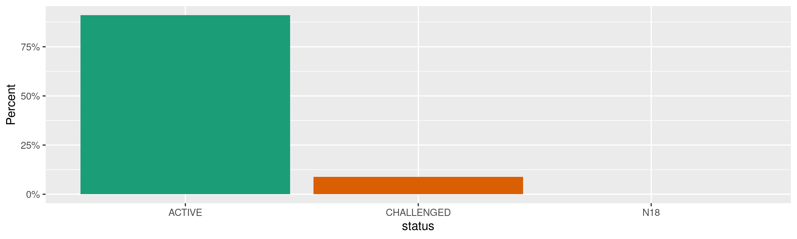
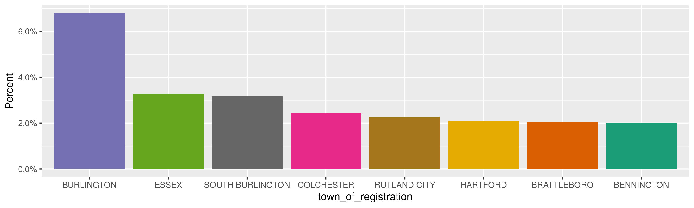
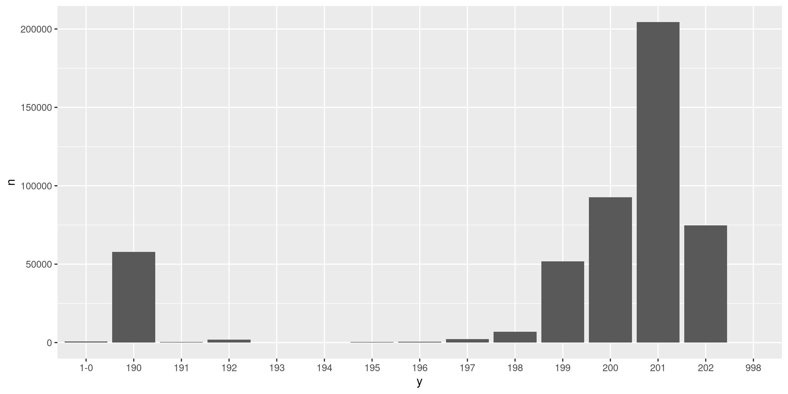
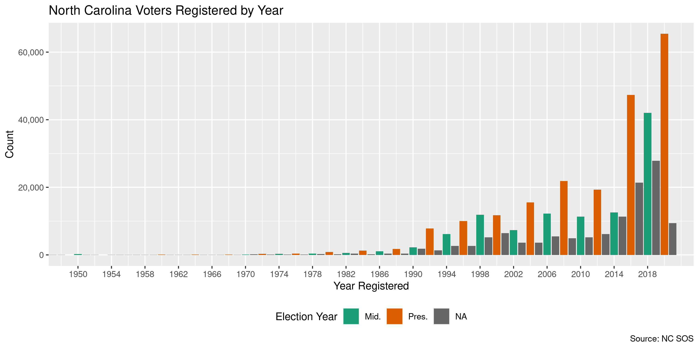
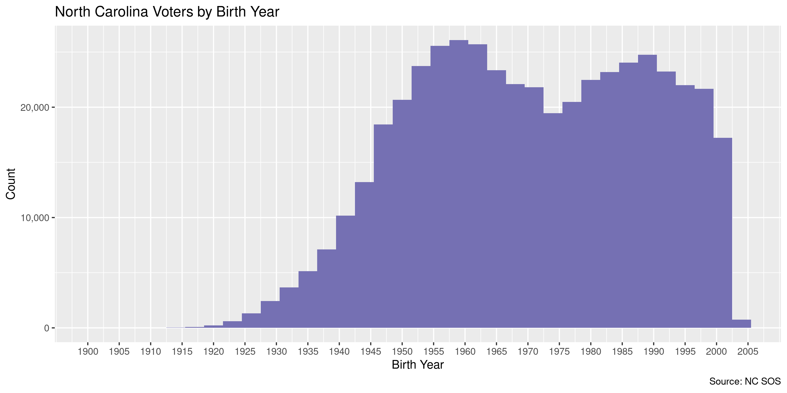

Vermont Voters
================
Kiernan Nicholls
Thu Apr 15 11:57:24 2021

-   [Project](#project)
-   [Objectives](#objectives)
-   [Packages](#packages)
-   [Data](#data)
-   [About](#about)
-   [Extract](#extract)
-   [Read](#read)
-   [Explore](#explore)
    -   [Missing](#missing)
    -   [Duplicates](#duplicates)
    -   [Categorical](#categorical)
    -   [Dates](#dates)
-   [Missing](#missing-1)
-   [Wrangle](#wrangle)
-   [Conclude](#conclude)
-   [Export](#export)
-   [Upload](#upload)
-   [Old](#old)

<!-- Place comments regarding knitting here -->

## Project

The Accountability Project is an effort to cut across data silos and
give journalists, policy professionals, activists, and the public at
large a simple way to search across huge volumes of public data about
people and organizations.

Our goal is to standardize public data on a few key fields by thinking
of each dataset row as a transaction. For each transaction there should
be (at least) 3 variables:

1.  All **parties** to a transaction.
2.  The **date** of the transaction.
3.  The **amount** of money involved.

## Objectives

This document describes the process used to complete the following
objectives:

1.  How many records are in the database?
2.  Check for entirely duplicated records.
3.  Check ranges of continuous variables.
4.  Is there anything blank or missing?
5.  Check for consistency issues.
6.  Create a five-digit ZIP Code called `zip`.
7.  Create a `year` field from the transaction date.
8.  Make sure there is data on both parties to a transaction.

## Packages

The following packages are needed to collect, manipulate, visualize,
analyze, and communicate these results. The `pacman` package will
facilitate their installation and attachment.

``` r
if (!require("pacman")) {
  install.packages("pacman")
}
pacman::p_load(
  tidyverse, # data manipulation
  lubridate, # datetime strings
  gluedown, # printing markdown
  janitor, # clean data frames
  campfin, # custom irw tools
  aws.s3, # aws cloud storage
  refinr, # cluster & merge
  scales, # format strings
  readxl, # read excel files
  knitr, # knit documents
  vroom, # fast reading
  rvest, # scrape html
  glue, # code strings
  here, # project paths
  httr, # http requests
  fs # local storage 
)
```

This document should be run as part of the `R_campfin` project, which
lives as a sub-directory of the more general, language-agnostic
[`irworkshop/accountability_datacleaning`](https://github.com/irworkshop/accountability_datacleaning)
GitHub repository.

The `R_campfin` project uses the [RStudio
projects](https://support.rstudio.com/hc/en-us/articles/200526207-Using-Projects)
feature and should be run as such. The project also uses the dynamic
`here::here()` tool for file paths relative to *your* machine.

``` r
# where does this document knit?
here::i_am("vt/voters/docs/vt_voters_diary.Rmd")
```

## Data

The Vermont statewide voter list was obtained via a records request made
to the Secretary of State’s Records Office on April 5, 2021. After
signing an affidavit asserting our intentions to distribute the data on
a non-commercial basis, the records request was fulfilled.

The data was provided to Kiernan Nicholls as attachments to an email.

> As requested, enclosed you will find a compressed zip file of the
> Vermont Statewide Voter File (as of April 9, 2021) with a printed
> Excel list of the fields that are created in text delimited format.
>
> You requested to receive a one-time dispatch of the Vermont Statewide
> Voter Checklist. If you have any concerns, please contact me at
> <lelonie.oatway@vermont.gov>.

Two files were attached to the email.

1.  `4.9.2021Statewidevoters (81).zip`
2.  `2020 Field Listing-Statewide Checklist.xls`

``` r
raw_dir <- dir_create(here("vt", "voters", "data", "raw"))
raw_zip <- path(raw_dir, "4.9.2021Statewidevoters (81).zip")
file_size(raw_zip)
#> 24.3M
raw_xls <- here("vt", "voters", "2020 Field Listing-Statewide Checklist.xls")
```

## About

| Row | Column                                       |
|----:|:---------------------------------------------|
|   1 | Voter ID (unique identifier)                 |
|   2 | Last Name                                    |
|   3 | First Name                                   |
|   4 | Middle Initial                               |
|   5 | Suffix                                       |
|   6 | Legal Address Line 1                         |
|   7 | Legal Address Line 2                         |
|   8 | Legal Address City                           |
|   9 | Legal Address State                          |
|  10 | Legal Address Zip                            |
|  11 | Mailing Address Line 1                       |
|  12 | Mailing Address Line 2                       |
|  13 | Mailing Address City                         |
|  14 | Mailing Address State                        |
|  15 | Mailing Address Zip                          |
|  16 | Year of birth                                |
|  17 | Date of Registration                         |
|  18 | Date last voted                              |
|  19 | 2008 Gen Election Participation (True/False) |
|  20 | 2010 Gen Election Participation (True/False) |
|  21 | 2012 Gen Election Participation (True/False) |
|  22 | 2014 Gen Election Participation (True/False) |
|  23 | 2016 Gen Election Participation (True/False) |
|  24 | 2018 Gen Election Participation (True/False) |
|  25 | 2020 Gen Election Participation (True/False) |
|  26 | Status (all but purged in report)            |
|  27 | Town of Registration                         |
|  28 | County                                       |
|  29 | Senate -District                             |
|  30 | Town-Nemrc Number                            |
|  31 | Voting District (Rep District)               |
|  32 | Polling Location                             |
|  33 | Police District                              |
|  34 | Sewer District                               |
|  35 | Garbage District                             |
|  36 | School District                              |
|  37 | Fire District                                |
|  38 | Water District                               |
|  39 | Village                                      |
|  40 | Ward                                         |

## Extract

The ZIP archive contains one text file of the same name.

| Name                               | Length | Date                |
|:-----------------------------------|-------:|:--------------------|
| `4.9.2021Statewidevoters (81).txt` |   143M | 2021-04-09 10:01:00 |

``` r
raw_txt <- unzip(raw_zip, exdir = raw_dir)
file_size(raw_txt)
#> 143M
```

## Read

``` r
vtv <- read_delim(
  file = raw_txt,
  delim = "|",
  escape_backslash = FALSE,
  escape_double = FALSE,
  na = c("", " ", "NA"),
  col_types = cols(
    .default = col_character(),
    `Year of Birth` = col_integer(),
    `Date of Registration` = col_date_mdy(),
    `Date last Voted` = col_date_mdy()
  )
)
```

``` r
vtv <- vtv %>% 
  # remove empty end col
  remove_empty("cols") %>%
  # rename variables
  clean_names("snake") %>% 
  rename(
    address_1      = legal_address_line_1,
    address_2      = legal_address_line_2,
    city           = legal_address_city,
    state          = legal_address_state,
    zip            = legal_address_zip,
    mail_address_1 = mailing_address_line_1,
    mail_address_2 = mailing_address_line_2,
    mail_city      = mailing_address_city,
    mail_state     = mailing_address_state,
    mail_zip       = mailing_address_zip,
    reg_date       = date_of_registration,
    birth_year     = year_of_birth
  ) %>% 
  # remove voting history
  select(-ends_with("participation"))
```

## Explore

There are 494,799 rows of 32 columns. Each record represents a single
voter registered in the state of Vermont as of April 5.

``` r
glimpse(vtv)
#> Rows: 494,799
#> Columns: 32
#> $ voter_id             <chr> "001003049", "000101175", "000101176", "000781770", "000781774", "000784845", "000781784"…
#> $ last_name            <chr> "A", "A'PELT", "A'PELT", "AAKJAR", "AAKJAR", "AAKJAR", "AAKJAR", "AAKRE", "AALERUD", "AAL…
#> $ first_name           <chr> "JAKUBEK", "CHARLES W", "CYNTHIA", "DYLAN", "LUCAS", "MELISSA", "SABINE", "KIMBERLY J", "…
#> $ middle_name          <chr> "KRAMER", NA, "A", "W.", "H.", "N.", "U.", NA, NA, NA, NA, NA, "K.", "J.", NA, "A.", "H."…
#> $ suffix               <chr> NA, NA, NA, NA, NA, NA, NA, NA, NA, NA, NA, NA, NA, NA, NA, NA, NA, NA, NA, NA, NA, NA, N…
#> $ address_1            <chr> "165 WINTERBERRY LN", "1573 FLAMSTEAD RD", "1573 FLAMSTEAD RD", "1436 LILLY HILL RD", "14…
#> $ address_2            <chr> NA, NA, NA, NA, NA, NA, NA, NA, NA, NA, NA, NA, NA, NA, NA, NA, NA, NA, NA, NA, NA, NA, N…
#> $ city                 <chr> "BURLINGTON", "CHESTER", "CHESTER", "DANBY", "DANBY", "DANBY", "DANBY", "HARTLAND", "RYEG…
#> $ state                <chr> "VT", "VT", "VT", "VT", "VT", "VT", "VT", "VT", "VT", "VT", "VT", "VT", "VT", "VT", "VT",…
#> $ zip                  <chr> "05401", "05143", "05143", "05739", "05739", "05739", "05739", "05048", "05069", "05069",…
#> $ mail_address_1       <chr> "165 WINTERBERRY LN", "1573 FLAMSTEAD ROAD", "1573 FLAMSTEAD ROAD", "1436 LILLY HILL RD",…
#> $ mail_address_2       <chr> NA, NA, NA, NA, NA, NA, NA, NA, NA, NA, NA, NA, NA, NA, NA, NA, NA, NA, NA, NA, NA, NA, N…
#> $ mail_city            <chr> "BURLINGTON", "CHESTER", "CHESTER", "PAWLET", "PAWLET", "PAWLET", "PAWLET", "HARTLAND", "…
#> $ mail_state           <chr> "VT", "VT", "VT", "VT", "VT", "VT", "VT", "VT", "VT", "VT", "VT", "VT", "VT", "VT", NA, "…
#> $ mail_zip             <chr> "05401", "05143", "05143", "05761", "05761", "05761", "05761", "05048", "05069", "05069",…
#> $ birth_year           <int> 1989, 1958, 1958, 1992, 1988, 1984, 1958, 1959, 1949, 1951, 1972, 1982, 1975, 1970, 1948,…
#> $ reg_date             <date> 2020-12-03, 1900-01-01, 1900-01-01, 2012-10-16, 2012-10-16, 2020-10-31, 2012-10-16, 2002…
#> $ date_last_voted      <date> NA, 2020-11-03, 2020-11-03, 2021-03-02, 2021-03-02, 2021-03-02, 2021-03-02, 2020-11-03, …
#> $ status               <chr> "ACTIVE", "ACTIVE", "ACTIVE", "ACTIVE", "ACTIVE", "ACTIVE", "ACTIVE", "ACTIVE", "ACTIVE",…
#> $ town_of_registration <chr> "BURLINGTON", "CHESTER", "CHESTER", "DANBY", "DANBY", "DANBY", "DANBY", "HARTLAND", "RYEG…
#> $ county               <chr> "CHITTENDEN", "WINDSOR", "WINDSOR", "RUTLAND", "RUTLAND", "RUTLAND", "RUTLAND", "WINDSOR"…
#> $ senate_district      <chr> "CHI", "WDR", "WDR", "RUT", "RUT", "RUT", "RUT", "WDR", "CAL", "CAL", "FRA", "FRA", "FRA"…
#> $ town_nemrc_number    <chr> "50", "60", "60", "69", "69", "69", "69", "105", "185", "185", "197", "187", "213", "187"…
#> $ voting_district      <chr> "CHI-6-7", "WDR-3-1", "WDR-3-1", "BEN-RUT", "BEN-RUT", "BEN-RUT", "BEN-RUT", "WDR-1", "CA…
#> $ polling_location     <chr> "MATER CHRISTI SCHOOL", "CHESTER TOWN HALL, SECOND FLOOR", "CHESTER TOWN HALL, SECOND FLO…
#> $ police_district      <chr> NA, NA, NA, NA, NA, NA, NA, NA, NA, NA, NA, NA, NA, NA, NA, NA, NA, NA, NA, NA, NA, NA, N…
#> $ sewer_district       <chr> NA, NA, NA, NA, NA, NA, NA, NA, NA, NA, NA, NA, NA, NA, NA, NA, NA, NA, NA, NA, NA, NA, N…
#> $ school_district      <chr> NA, NA, NA, NA, NA, NA, NA, NA, NA, NA, NA, NA, NA, NA, NA, "WCSU", "WCSU", NA, NA, NA, N…
#> $ fire_district        <chr> NA, NA, NA, NA, NA, NA, NA, NA, NA, NA, NA, NA, NA, NA, NA, NA, NA, NA, NA, NA, NA, NA, N…
#> $ water_district       <chr> NA, NA, NA, NA, NA, NA, NA, NA, NA, NA, NA, NA, NA, NA, NA, NA, NA, NA, NA, NA, NA, NA, N…
#> $ village              <chr> NA, NA, NA, NA, NA, NA, NA, NA, "VILLAGE", "VILLAGE", NA, NA, NA, NA, NA, NA, NA, NA, NA,…
#> $ ward                 <chr> "WARD 1", NA, NA, NA, NA, NA, NA, NA, NA, NA, NA, NA, NA, NA, NA, NA, NA, NA, NA, NA, NA,…
tail(vtv)
#> # A tibble: 6 x 32
#>   voter_id  last_name first_name middle_name suffix address_1  address_2 city  state zip   mail_address_1 mail_address_2
#>   <chr>     <chr>     <chr>      <chr>       <chr>  <chr>      <chr>     <chr> <chr> <chr> <chr>          <chr>         
#> 1 000914896 ZYLSTRA   ALISON     R           <NA>   315 MAPLE… <NA>      PAWL… VT    05761 315 MAPLE GRO… <NA>          
#> 2 000913588 ZYLSTRA   JONATHAN   <NA>        <NA>   315 MAPLE… <NA>      PAWL… VT    05761 315 MAPLE GRO… <NA>          
#> 3 000234069 ZYLSTRA   NANCY R    <NA>        <NA>   19 LAKE RD <NA>      PANT… VT    <NA>  19 LAKE ROAD   <NA>          
#> 4 000773584 ZYTKO     REGINA     V.          <NA>   1745 NEBR… <NA>      STOWE VT    <NA>  PO BOX 554     <NA>          
#> 5 000885247 ZYTO      JACQUELINE <NA>        <NA>   363 SUNRI… <NA>      ARLI… VT    05250 363 SUNRISE LN <NA>          
#> 6 000839592 ZYWIEC    KARYN      <NA>        <NA>   644 CAMPE… <NA>      CONC… VT    05824 644 CAMPERS L… <NA>          
#> # … with 20 more variables: mail_city <chr>, mail_state <chr>, mail_zip <chr>, birth_year <int>, reg_date <date>,
#> #   date_last_voted <date>, status <chr>, town_of_registration <chr>, county <chr>, senate_district <chr>,
#> #   town_nemrc_number <chr>, voting_district <chr>, polling_location <chr>, police_district <chr>,
#> #   sewer_district <chr>, school_district <chr>, fire_district <chr>, water_district <chr>, village <chr>, ward <chr>
```

### Missing

Columns vary in their degree of missing values.

``` r
col_stats(vtv, count_na)
#> # A tibble: 32 x 4
#>    col                  class       n          p
#>    <chr>                <chr>   <int>      <dbl>
#>  1 voter_id             <chr>       0 0         
#>  2 last_name            <chr>       0 0         
#>  3 first_name           <chr>       3 0.00000606
#>  4 middle_name          <chr>  170562 0.345     
#>  5 suffix               <chr>  482722 0.976     
#>  6 address_1            <chr>    1234 0.00249   
#>  7 address_2            <chr>  479542 0.969     
#>  8 city                 <chr>     119 0.000241  
#>  9 state                <chr>     101 0.000204  
#> 10 zip                  <chr>  116015 0.234     
#> 11 mail_address_1       <chr>    1030 0.00208   
#> 12 mail_address_2       <chr>  485805 0.982     
#> 13 mail_city            <chr>    2123 0.00429   
#> 14 mail_state           <chr>    2159 0.00436   
#> 15 mail_zip             <chr>    2177 0.00440   
#> 16 birth_year           <int>       0 0         
#> 17 reg_date             <date>      0 0         
#> 18 date_last_voted      <date>  55789 0.113     
#> 19 status               <chr>       0 0         
#> 20 town_of_registration <chr>       0 0         
#> 21 county               <chr>       0 0         
#> 22 senate_district      <chr>       0 0         
#> 23 town_nemrc_number    <chr>       0 0         
#> 24 voting_district      <chr>       0 0         
#> 25 polling_location     <chr>    8846 0.0179    
#> 26 police_district      <chr>  489365 0.989     
#> 27 sewer_district       <chr>  486435 0.983     
#> 28 school_district      <chr>  437115 0.883     
#> 29 fire_district        <chr>  468899 0.948     
#> 30 water_district       <chr>  480546 0.971     
#> 31 village              <chr>  456264 0.922     
#> 32 ward                 <chr>  413321 0.835
```

No rows are missing the last name or registration date used for
identification.

### Duplicates

We can also flag any record completely duplicated across every column.

``` r
vtv <- flag_dupes(vtv, -voter_id)
sum(vtv$dupe_flag)
#> [1] 26
```

Ignoring the supposedly unique `voter_id`, we do find a number of
duplicate voters (born in the same year, living at the same address).

``` r
vtv %>% 
  filter(dupe_flag) %>% 
  select(voter_id, last_name, first_name, address_1, birth_year)
#> # A tibble: 26 x 5
#>    voter_id  last_name first_name  address_1                birth_year
#>    <chr>     <chr>     <chr>       <chr>                         <int>
#>  1 000980887 BARRY     CHRISTOPHER 83 WEST END AVE                1997
#>  2 000980888 BARRY     CHRISTOPHER 83 WEST END AVE                1997
#>  3 000980621 BRYAN     JENNIFER    1349 COVENTRY ST               1972
#>  4 000980622 BRYAN     JENNIFER    1349 COVENTRY ST               1972
#>  5 000980855 CARON     CHARLOTTE   1693 DUBLIN RD                 2002
#>  6 000980856 CARON     CHARLOTTE   1693 DUBLIN RD                 2002
#>  7 000980889 CARPENTER JORDAN      74 FAIRVIEW ST                 2002
#>  8 000980890 CARPENTER JORDAN      74 FAIRVIEW ST                 2002
#>  9 000980785 DEZAFRA   DANIEL      1382 WELLWOOD ORCHARD RD       1986
#> 10 000980786 DEZAFRA   DANIEL      1382 WELLWOOD ORCHARD RD       1986
#> # … with 16 more rows
```

### Categorical

``` r
col_stats(vtv, n_distinct)
#> # A tibble: 33 x 4
#>    col                  class       n          p
#>    <chr>                <chr>   <int>      <dbl>
#>  1 voter_id             <chr>  494799 1         
#>  2 last_name            <chr>   68604 0.139     
#>  3 first_name           <chr>   46079 0.0931    
#>  4 middle_name          <chr>   10569 0.0214    
#>  5 suffix               <chr>      59 0.000119  
#>  6 address_1            <chr>  207202 0.419     
#>  7 address_2            <chr>    4616 0.00933   
#>  8 city                 <chr>     459 0.000928  
#>  9 state                <chr>       2 0.00000404
#> 10 zip                  <chr>     548 0.00111   
#> 11 mail_address_1       <chr>  235619 0.476     
#> 12 mail_address_2       <chr>    4967 0.0100    
#> 13 mail_city            <chr>    3758 0.00760   
#> 14 mail_state           <chr>      56 0.000113  
#> 15 mail_zip             <chr>    3606 0.00729   
#> 16 birth_year           <int>     105 0.000212  
#> 17 reg_date             <date>  12112 0.0245    
#> 18 date_last_voted      <date>    401 0.000810  
#> 19 status               <chr>       3 0.00000606
#> 20 town_of_registration <chr>     246 0.000497  
#> 21 county               <chr>      14 0.0000283 
#> 22 senate_district      <chr>      13 0.0000263 
#> 23 town_nemrc_number    <chr>     246 0.000497  
#> 24 voting_district      <chr>     104 0.000210  
#> 25 polling_location     <chr>     242 0.000489  
#> 26 police_district      <chr>       4 0.00000808
#> 27 sewer_district       <chr>      12 0.0000243 
#> 28 school_district      <chr>      39 0.0000788 
#> 29 fire_district        <chr>      22 0.0000445 
#> 30 water_district       <chr>      23 0.0000465 
#> 31 village              <chr>      28 0.0000566 
#> 32 ward                 <chr>       9 0.0000182 
#> 33 dupe_flag            <lgl>       2 0.00000404
```

<!-- --><!-- --><!-- -->

### Dates

There are thousands of voters with a registration date of January 1,
1900. These should be `NA` values, not real dates. Similarly, a few
hundred have the date of January 1st of the year 1910. The same is true
for the birth year.

``` r
vtv %>% 
  count(
    y = str_sub(reg_date, 1, 3),
    y2 = str_sub(birth_year, 1, 3)
  ) %>% 
  ggplot(aes(y, n)) + 
  geom_col()
```

<!-- -->

``` r
count_na(vtv$reg_date)
#> [1] 0
min(vtv$reg_date, na.rm = TRUE)
#> [1] "1-01-01"
# compare two dates
sum(vtv$reg_date == "1900-01-01", na.rm = TRUE)
#> [1] 56315
sum(vtv$reg_date == "1900-01-02", na.rm = TRUE)
#> [1] 0
```

``` r
# bad dates
vtv$reg_date <- na_if(vtv$reg_date, "1900-01-01")
vtv$reg_date <- na_if(vtv$reg_date, "1901-01-01")
vtv$reg_date <- na_if(vtv$reg_date,   "01-01-01")
vtv$reg_date <- na_if(vtv$reg_date, "1910-01-01")
```

``` r
# fix one bad date
vtv$reg_date[which(vtv$reg_date == "998-09-01")] <- "1998-09-01"
min(vtv$reg_date, na.rm = TRUE)
#> [1] "1900-03-22"
```

``` r
sum(vtv$birth_year == 1900)
#> [1] 24044
sum(vtv$birth_year == 1901)
#> [1] 6
vtv$birth_year <- na_if(vtv$birth_year, 1900)
```

``` r
max(vtv$reg_date, na.rm = TRUE)
#> [1] "2021-04-08"
```

We can add the calendar year from `date` with `lubridate::year()`

``` r
vtv <- mutate(vtv, reg_year = year(reg_date))
```

<!-- -->

<!-- -->

## Missing

Now that we’ve removed some invalid dates, we can flag all the rows
missing any name or date.

``` r
vtv <- vtv %>% 
  mutate(
    na_flag = !complete.cases(first_name, reg_date, birth_year),
    .before = dupe_flag
  )
```

Quite a large percentage of rows were using these blatantly invalid
registration dates or birth years; 14% of all rows are missing a name or
date.

## Wrangle

Almost all the geographic variables are sufficiently clean.

``` r
prop_in(vtv$city, c(valid_city, extra_city))
#> [1] 0.8701686
prop_in(vtv$state, valid_state)
#> [1] 1
prop_in(vtv$zip, valid_zip)
#> [1] 0.9993004
```

The cities that can’t be easily identified as valid are mostly legal
distinctions between the town, city, and village of a jurisdiction. For
[example](https://en.wikipedia.org/wiki/Barre_(city),_Vermont):

> Barre is the most populous city in Washington County, Vermont, United
> States. As of the 2010 census, the municipal population was 9,052.
> Popularly referred to as “Barre City”, it is almost completely
> surrounded by “Barre Town”, which is a separate municipality.

``` r
vtv %>% 
  filter(city %out% c(valid_city, extra_city)) %>% 
  count(city, sort = TRUE)
#> # A tibble: 165 x 2
#>    city                  n
#>    <chr>             <int>
#>  1 RUTLAND CITY      10653
#>  2 BARRE TOWN         6185
#>  3 BARRE CITY         5358
#>  4 SAINT ALBANS CITY  5239
#>  5 SAINT ALBANS TOWN  4285
#>  6 GEORGIA            3966
#>  7 NEWPORT CITY       3782
#>  8 RUTLAND TOWN       3118
#>  9 WEATHERSFIELD      2428
#> 10 HIGHGATE           2353
#> # … with 155 more rows
```

The street addresses are in the proper USPS abbreviated format.

``` r
sample(vtv$address_1, 10)
#>  [1] "5 MERIDIAN ST"        "3 SPRUCE ST"          "589 GOSS HILL RD"     "630 ROBINSON RD"      "651 GRANITEVILLE RD" 
#>  [6] "895 LEBLANC RD"       "356 HIDDEN VALLEY RD" "376 S BEAR SWAMP RD"  "1096 ESSEX RD"        "71 CLARK RD"
```

## Conclude

``` r
glimpse(sample_n(vtv, 50))
#> Rows: 50
#> Columns: 35
#> $ voter_id             <chr> "000819844", "000697369", "000076513", "000850146", "000215496", "000444455", "000620632"…
#> $ last_name            <chr> "FENNER", "PITTELLO", "HARRINGTON", "MURRAY", "CAMPBELL", "ADAMS", "PLANTE", "KENDALL", "…
#> $ first_name           <chr> "DIANE", "RUTH", "SHEILA", "STEVEN", "MICHELE", "MICHAEL F", "KRYSTAL", "SILAS", "KRISTEN…
#> $ middle_name          <chr> "J.", "E", NA, "A", "MCCANNA", NA, "MARIE", "J.", "G.", NA, NA, "S.", NA, "E", NA, "J", N…
#> $ suffix               <chr> NA, NA, NA, NA, NA, NA, NA, NA, NA, NA, NA, NA, NA, NA, NA, NA, NA, NA, NA, NA, NA, NA, N…
#> $ address_1            <chr> "1220 ROBERT YOUNG RD", "133 SOUTH ST", "2633 CHAPEL RD", "2000 STAGE RD", "8 OAKWOOD LN"…
#> $ address_2            <chr> "STARKSBORO", NA, NA, NA, NA, NA, NA, NA, NA, NA, NA, NA, NA, NA, NA, NA, NA, NA, NA, NA,…
#> $ city                 <chr> "STARKSBORO", "RUTLAND CITY", "BENNINGTON", "BENSON", "ESSEX", "BARNET", "BARRE TOWN", "V…
#> $ state                <chr> "VT", "VT", "VT", "VT", "VT", "VT", "VT", "VT", "VT", "VT", "VT", "VT", "VT", "VT", "VT",…
#> $ zip                  <chr> "05487", "05701", "05201", "05743", "05452", "05821", NA, "05079", "05843", "05679", "056…
#> $ mail_address_1       <chr> "1220 ROBERT YOUNG RD", "133 SOUTH ST", "2633 CHAPEL ROAD", "2000 STAGE RD", "8 OAKWOOD L…
#> $ mail_address_2       <chr> NA, NA, NA, NA, NA, NA, NA, NA, NA, NA, NA, NA, NA, NA, NA, NA, NA, NA, NA, NA, NA, NA, N…
#> $ mail_city            <chr> "STARKSBORO", "RUTLAND CITY", "BENNINGTON", "BENSON", "ESSEX JCT", "ST. JOHNSBURY", "BARR…
#> $ mail_state           <chr> "VT", "VT", "VT", "VT", "VT", "VT", "VT", "VT", "VT", "VT", "VT", "VT", "VT", "VT", "VT",…
#> $ mail_zip             <chr> "05487", "05701", "05201", "05743", "05452", "05819", "05641", "05079", "05843", "05679",…
#> $ birth_year           <int> 1995, 1953, 1948, 1965, 1947, 1957, 1985, 1986, 1995, NA, 1997, 1968, 1976, 1963, 1967, 1…
#> $ reg_date             <date> 2014-07-02, 2016-10-24, 2001-03-28, 2016-01-14, NA, NA, 2018-10-15, NA, 2013-06-17, 1996…
#> $ date_last_voted      <date> 2021-03-02, 2020-11-03, 2020-11-03, 2020-03-03, 2021-04-13, 2020-11-03, 2020-11-03, NA, …
#> $ status               <chr> "ACTIVE", "ACTIVE", "ACTIVE", "ACTIVE", "ACTIVE", "ACTIVE", "ACTIVE", "ACTIVE", "ACTIVE",…
#> $ town_of_registration <chr> "STARKSBORO", "RUTLAND CITY", "BENNINGTON", "BENSON", "ESSEX", "BARNET", "BARRE TOWN", "V…
#> $ county               <chr> "ADDISON", "RUTLAND", "BENNINGTON", "RUTLAND", "CHITTENDEN", "CALEDONIA", "WASHINGTON", "…
#> $ senate_district      <chr> "ADD", "RUT", "BEN", "RUT", "CHI", "CAL", "WAS", "ORA", "CAL", "ORA", "WAS", "CHI", "CHI"…
#> $ town_nemrc_number    <chr> "205", "183", "30", "31", "81", "25", "27", "224", "103", "251", "154", "50", "176", "81"…
#> $ voting_district      <chr> "ADD-4", "RUT-5-3", "BEN-2-1", "ADD-RUT", "CHI-8-1", "CAL-1", "WAS-2", "ORA-1", "CAL-2", …
#> $ polling_location     <chr> "ROBINSON ELEMENTARY SCHOOL", "AMERICAN LEGION", "BENNINGTON FIRE DEPARTMENT", "BENSON CO…
#> $ police_district      <chr> NA, NA, NA, NA, NA, NA, NA, NA, NA, NA, NA, NA, NA, NA, NA, NA, NA, NA, NA, NA, NA, NA, N…
#> $ sewer_district       <chr> NA, NA, NA, NA, NA, NA, NA, NA, NA, NA, "Sewer 1", NA, NA, NA, NA, NA, NA, NA, NA, NA, NA…
#> $ school_district      <chr> "193", NA, NA, NA, NA, NA, "BARRE TOWN MIDDLE & ELEMENTARY SCHOOL", NA, NA, NA, NA, NA, N…
#> $ fire_district        <chr> NA, NA, NA, NA, NA, NA, NA, NA, NA, NA, NA, NA, NA, NA, NA, NA, NA, NA, NA, "FIRE DISTRIC…
#> $ water_district       <chr> NA, NA, NA, NA, NA, NA, NA, NA, NA, NA, "Water 1", NA, NA, NA, NA, NA, NA, NA, NA, NA, NA…
#> $ village              <chr> NA, NA, NA, NA, NA, NA, NA, NA, NA, NA, NA, NA, NA, "VIL1", NA, NA, NA, NA, NA, NA, NA, N…
#> $ ward                 <chr> NA, "WARD 3", NA, NA, NA, NA, "WARD 1", NA, NA, NA, NA, "WARD 7", NA, NA, NA, NA, "WARD 1…
#> $ na_flag              <lgl> FALSE, FALSE, FALSE, FALSE, TRUE, TRUE, FALSE, TRUE, FALSE, TRUE, FALSE, FALSE, FALSE, FA…
#> $ dupe_flag            <lgl> FALSE, FALSE, FALSE, FALSE, FALSE, FALSE, FALSE, FALSE, FALSE, FALSE, FALSE, FALSE, FALSE…
#> $ reg_year             <dbl> 2014, 2016, 2001, 2016, NA, NA, 2018, NA, 2013, 1996, 2016, 2014, 2017, 1994, NA, 1993, N…
```

1.  There are 494,799 records in the database.
2.  There are 26 duplicate records in the database.
3.  The range and distribution of `amount` and `date` seem reasonable.
4.  There are 70,575 records missing key variables.
5.  Consistency in geographic data has been improved with
    `campfin::normal_*()`.
6.  The 4-digit `year` variable has been created with
    `lubridate::year()`.

## Export

Now the file can be saved on disk for upload to the Accountability
server.

``` r
clean_dir <- dir_create(here("vt", "voters", "data", "clean"))
clean_path <- path(clean_dir, "vt_voters_2021-04-09.csv")
write_csv(vtv, clean_path, na = "")
(clean_size <- file_size(clean_path))
#> 104M
non_ascii(clean_path)
#> # A tibble: 68 x 2
#>       row line                                                                                                          
#>     <int> <chr>                                                                                                         
#>  1   4375 "000987940,ALDRICH,NOAH,JOS<c3><89>,,50 HUNTINGTON ST,,SAINT ALBANS CITY,VT,05478,50 HUNTINGTON ST,,SAINT ALB…
#>  2   8147 "000877372,ANDERSEN,MAXWELL,THOMAS,,1 UNIDENTIFIED ST,,MIDDLEBURY,VT,05753,385 CHAUSS<c3><89>E DE WATERLOO,IX…
#>  3  20093 "000950990,BARBOSA,JORGE,R,,60 MURRAY HILL RD,,MANCHESTER,VT,05255,227 OESTE DE LA CANDELARIA,MAYAG<c3><9c>EZ…
#>  4  37250 "000806598,BIRG<c3><89>,SARAH,H.,,11 FERAL MOUNTAIN RD,,MIDDLESEX,VT,05602,11 FERAL MOUNTAIN RD,,MIDDLESEX,VT…
#>  5  57728 "000989066,BROWN,MIYEL,NAJ<c3><89>,,38 MONROE ST,,BURLINGTON,VT,05401,38 MONROE ST,,BURLINGTON,VT,05401,1996,…
#>  6  80560 "000851588,CHAVES,JARED,SCOTT,,172 HEATH RD,,HYDE PARK,VT,05655,KL<c3><96>NNESTR. 53,,,,,1988,2016-02-01,,ACT…
#>  7  81152 "000924025,CHESNEY,T<c3><89>O,,,613 HIDDEN VALLEY RD,,POWNAL,VT,05261,613 HIDDEN VALLEY RD,,POWNAL,VT,05261,1…
#>  8  87077 "000006793,CLOUGH,GRETA,,,302 OLD GUILFORD RD,,BRATTLEBORO,VT,05301,H<c3><96>F<c3><90>ABRAUT 21,,,,,1982,2000…
#>  9  98030 "000689432,COT<c3><89>,JESSICA,M.,,18 MANNING RD,,HYDE PARK,VT,05655,18 MANNING RD,,HYDE PARK,VT,05655,1970,2…
#> 10 116488 "000879437,DENEEN,MATHIEU,,,115 HILLINGER LN,,SHARON,VT,05065,M<c3><96>JAV<c3><84>GEN 40,,,,,1980,2016-10-13,…
#> # … with 58 more rows
```

## Upload

We can use the `aws.s3::put_object()` to upload the text file to the IRW
server.

``` r
aws_path <- path("csv", basename(clean_path))
if (!object_exists(aws_path, "publicaccountability")) {
  put_object(
    file = clean_path,
    object = aws_path, 
    bucket = "publicaccountability",
    acl = "public-read",
    show_progress = TRUE,
    multipart = TRUE
  )
}
aws_head <- head_object(aws_path, "publicaccountability")
(aws_size <- as_fs_bytes(attr(aws_head, "content-length")))
unname(aws_size == clean_size)
```

## Old

Download 2018 data from IRW server.

``` r
old_csv <- path(raw_dir, "vt_voters_2018.csv")
if (!file_exists(old_csv)) {
  save_object(
    object = "csv/vt_voters.csv",
    bucket = "publicaccountability",
    file = old_csv
  )
}
```

Read 2018 data.

``` r
vto <- read_csv(
  file = old_csv,
  col_types = cols(
    .default = col_character(),
    REG_DATE = col_date_mdy(),
    YEAR = col_integer(),
    YearofBirth = col_integer(),
    LASTVOTEDATE = col_date_mdy()
  )
)
```

Match old column names to new data.

``` r
vto <- vto %>% 
  rename(
    voter_id = VoterID,
    last_name = LASTNAME,
    first_name = FIRSTNAME,
    middle_name = MIDDLENAME,
    suffix = SUFFIX,
    address_1 = ADDRESS1,
    address_2 = ADDRESS2,
    city = CITY,
    state = STATE,
    zip = ZIP5,
    birth_year = YearofBirth,
    reg_date = REG_DATE,
    reg_year = YEAR,
    date_last_voted = LASTVOTEDATE,
    county = County,
    status = Status,
    town_of_registration = TownofRegistration
  )
```

Bind new structure on old data to fill columns.

``` r
vto <- bind_rows(vtv[0, ], vto)
```

Keep only voters not in 2021 data.

``` r
vto <- filter(vto, voter_id %out% vtv$voter_id)
```

``` r
old_path <- path(clean_dir, "vt_voters_2018-12-01.csv")
write_csv(vto, old_path, na = "")
```

``` r
aws_old <- path("csv", basename(old_path))
if (!object_exists(aws_path, "publicaccountability")) {
  put_object(
    file = old_path,
    object = aws_old, 
    bucket = "publicaccountability",
    acl = "public-read",
    show_progress = TRUE,
    multipart = TRUE
  )
}
```
