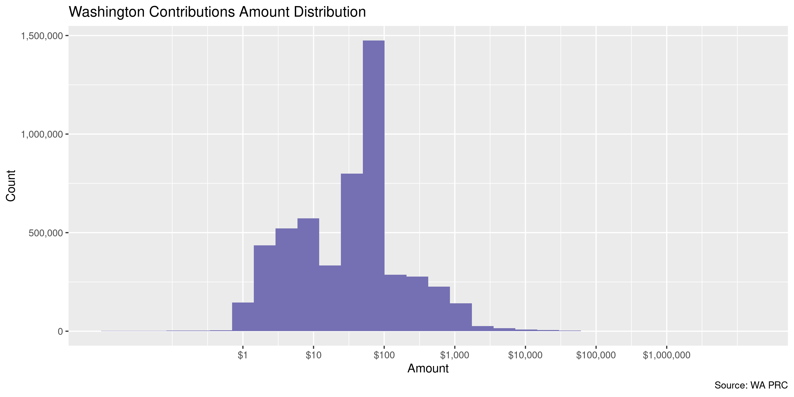
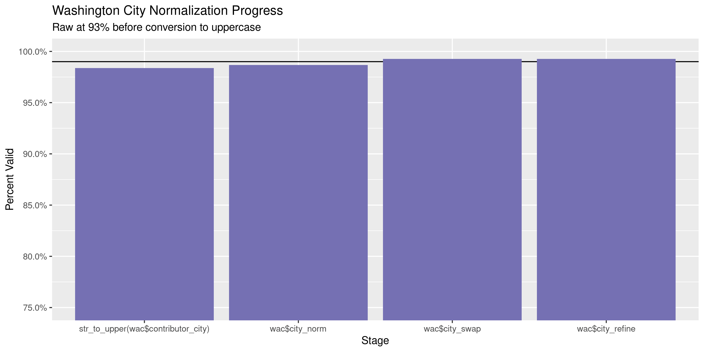

Washington Contributions
================
Kiernan Nicholls
Thu Sep 23 14:37:40 2021

-   [Project](#project)
-   [Objectives](#objectives)
-   [Packages](#packages)
-   [Data](#data)
-   [Download](#download)
-   [Read](#read)
-   [Explore](#explore)
    -   [Missing](#missing)
    -   [Duplicates](#duplicates)
    -   [Categorical](#categorical)
    -   [Amounts](#amounts)
    -   [Dates](#dates)
-   [Wrangle](#wrangle)
    -   [Address](#address)
    -   [ZIP](#zip)
    -   [State](#state)
    -   [City](#city)
-   [Conclude](#conclude)
-   [Export](#export)
-   [Upload](#upload)

<!-- Place comments regarding knitting here -->

## Project

The Accountability Project is an effort to cut across data silos and
give journalists, policy professionals, activists, and the public at
large a simple way to search across huge volumes of public data about
people and organizations.

Our goal is to standardize public data on a few key fields by thinking
of each dataset row as a transaction. For each transaction there should
be (at least) 3 variables:

1.  All **parties** to a transaction.
2.  The **date** of the transaction.
3.  The **amount** of money involved.

## Objectives

This document describes the process used to complete the following
objectives:

1.  How many records are in the database?
2.  Check for entirely duplicated records.
3.  Check ranges of continuous variables.
4.  Is there anything blank or missing?
5.  Check for consistency issues.
6.  Create a five-digit ZIP Code called `zip`.
7.  Create a `year` field from the transaction date.
8.  Make sure there is data on both parties to a transaction.

## Packages

The following packages are needed to collect, manipulate, visualize,
analyze, and communicate these results. The `pacman` package will
facilitate their installation and attachment.

``` r
if (!require("pacman")) {
  install.packages("pacman")
}
pacman::p_load(
  tidyverse, # data manipulation
  lubridate, # datetime strings
  jsonlite, # parse json data
  gluedown, # printing markdown
  janitor, # clean data frames
  campfin, # custom irw tools
  aws.s3, # aws cloud storage
  refinr, # cluster & merge
  scales, # format strings
  knitr, # knit documents
  vroom, # fast reading
  rvest, # scrape html
  glue, # code strings
  here, # project paths
  httr, # http requests
  fs # local storage 
)
```

This document should be run as part of the `R_campfin` project, which
lives as a sub-directory of the more general, language-agnostic
[`irworkshop/accountability_datacleaning`](https://github.com/irworkshop/accountability_datacleaning)
GitHub repository.

The `R_campfin` project uses the [RStudio
projects](https://support.rstudio.com/hc/en-us/articles/200526207-Using-Projects)
feature and should be run as such. The project also uses the dynamic
`here::here()` tool for file paths relative to *your* machine.

``` r
# where does this document knit?
here::i_am("wa/contribs/docs/wa_contribs_diary.Rmd")
```

## Data

``` r
wa_meta <- fromJSON("https://data.wa.gov/api/views/kv7h-kjye")
```

[Contributions](https://data.wa.gov/d/kv7h-kjye) for the state of
Washington can be obtained from the state’s [Public Disclosure
Commission](http://pdc.wa.gov/) on their [Open Data
portal](https://data.wa.gov/). The data is titled “Contributions to
Candidates and Political Committees” and was created on December 16,
2016 and was last updated at September 23, 2021.

#### Description

> This dataset contains cash and in-kind contributions, (including
> unpaid loans) made to Washington State Candidates and Political
> Committees for the last 10 years as reported to the PDC on forms C3,
> C4, Schedule C and their electronic filing equivalents. It does not
> include loans which have been paid or forgiven, pledges or any
> expenditures.
>
> For candidates, the number of years is determined by the year of the
> election, not necessarily the year the contribution was reported. For
> political committees, the number of years is determined by the
> calendar year of the reporting period.
>
> Candidates and political committees choosing to file under “mini
> reporting” are not included in this dataset. See WAC 390-16-105 for
> information regarding eligibility.
>
> This dataset is a best-effort by the PDC to provide a complete set of
> records as described herewith and may contain incomplete or incorrect
> information. The PDC provides access to the original reports for the
> purpose of record verification.
>
> Descriptions attached to this dataset do not constitute legal
> definitions; please consult RCW 42.17A and WAC Title 390 for legal
> definitions and additional information political finance disclosure
> requirements.
>
> CONDITION OF RELEASE: This publication constitutes a list of
> individuals prepared by the Washington State Public Disclosure
> Commission and may not be used for commercial purposes. This list is
> provided on the condition and with the understanding that the persons
> receiving it agree to this statutorily imposed limitation on its use.
> See RCW 42.56.070(9) and AGO 1975 No. 15.

#### Dictionary

| fieldName                    | dataTypeName   | description                                                                                                                                                                                                                                                                                                                                                                                                                                                                                                                                                                                                |
|:-----------------------------|:---------------|:-----------------------------------------------------------------------------------------------------------------------------------------------------------------------------------------------------------------------------------------------------------------------------------------------------------------------------------------------------------------------------------------------------------------------------------------------------------------------------------------------------------------------------------------------------------------------------------------------------------|
| `id`                         | text           | PDC internal identifier that corresponds to a single contribution or correction record. When combined with the origin value, this number uniquely identifies a single row.                                                                                                                                                                                                                                                                                                                                                                                                                                 |
| `report_number`              | text           | PDC identifier used for tracking the individual form C3, C4 or C4 schedule C. Multiple contributions or corrections will correspond to the same report number when they were reported to the PDC at the same time. The report number is unique to the report it represents. When a report is amended, a new report number is assigned that supersedes the original version of the amended report and the original report records are not included in this dataset.                                                                                                                                         |
| `origin`                     | text           | The form, schedule or section where the record was reported. Please see <https://www.pdc.wa.gov/learn/forms> for a list of forms and instructions.<br/><br/>AUB (Form C3, schedule AU, auction buyer);<br/>AUD (Form C3, schedule AU, auction donor);<br/>C.1 (Form C4, schedule C1 correction);<br/>C3 (Form C3 cash contribution);<br/>C3.1A (Form C3, anonymous contributions);<br/>C3.1B (Form C3, candidate personal funds);<br/>C3.1D (Form C3, miscellaneous receipts)<br/>C3.1E (Form C3, small contributions);<br/>C4 (Form C4, in-kind contribution);<br/><br/>                                  |
| `committee_id`               | text           | The unique identifier of a committee. For a continuing committee, this id will be the same for all the years that the committee is registered. Single year committees and candidate committees will have a unique id for each year even though the candidate or committee organization might be the same across years. Surplus accounts will have a single committee id across all years.                                                                                                                                                                                                                  |
| `filer_id`                   | text           | The unique id assigned to a candidate or political committee. The filer id is consistent across election years with the exception that an individual running for a second office in the same election year will receive a second filer id. There is no correlation between the two filer ids. For a candidate and single-election-year committee such as a ballot committee, the combination of filer\_id and election\_year uniquely identifies a campaign.                                                                                                                                               |
| `type`                       | text           | Indicates if this record is for a candidate or a political committee. In the case of a political committee, it may be either a continuing political committee, party committee or single election year committee.                                                                                                                                                                                                                                                                                                                                                                                          |
| `filer_name`                 | text           | The candidate or committee name as reported on the form C1 candidate or committee registration form. The name will be consistent across all records for the same filer id and election year but may differ across years due to candidates or committees changing their name.                                                                                                                                                                                                                                                                                                                               |
| `office`                     | text           | The office sought by the candidate. Does not apply to political committees.                                                                                                                                                                                                                                                                                                                                                                                                                                                                                                                                |
| `legislative_district`       | text           | The Washington State legislative district. This field only applies to candidates where the office is “state senator” or “state representative.”                                                                                                                                                                                                                                                                                                                                                                                                                                                            |
| `position`                   | text           | The position associated with an office. This field typically applies to judicial and local office that have multiple positions or seats. This field does not apply to political committees.                                                                                                                                                                                                                                                                                                                                                                                                                |
| `party`                      | text           | The political party as declared by the candidate or committee on their form C1 registration. Contains only “Major parties” as recognized by Washington State law.                                                                                                                                                                                                                                                                                                                                                                                                                                          |
| `ballot_number`              | text           | If the committee is a Statewide Ballot Initiative Committee a ballot number will appear once a ballot number is assigned by the Secretary of State. Local Ballot Initiatives will not have a ballot number. This field will contain a number only if the Secretary of State issues a number.                                                                                                                                                                                                                                                                                                               |
| `for_or_against`             | text           | Ballot initiative committees are formed to either support or oppose an initiative. This field represents whether a committee “supports” (for) or “opposes” (against) a ballot initiative.                                                                                                                                                                                                                                                                                                                                                                                                                  |
| `jurisdiction`               | text           | <br/>The political jurisdiction associated with the office of a candidate.                                                                                                                                                                                                                                                                                                                                                                                                                                                                                                                                 |
| `jurisdiction_county`        | text           | The county associated with the jurisdiction of a candidate. Multi-county jurisdictions as reported as the primary county. This field will be empty for political committees and when a candidate jurisdiction is statewide.                                                                                                                                                                                                                                                                                                                                                                                |
| `jurisdiction_type`          | text           | The type of jurisdiction this office is: Statewide, Local, etc.                                                                                                                                                                                                                                                                                                                                                                                                                                                                                                                                            |
| `election_year`              | number         | The election year in the case of candidates and single election committees. The reporting year in the case of continuing political committees.                                                                                                                                                                                                                                                                                                                                                                                                                                                             |
| `amount`                     | number         | The amount of the cash or in-kind contribution. On corrections records, this field is the amount of the adjustment.                                                                                                                                                                                                                                                                                                                                                                                                                                                                                        |
| `cash_or_in_kind`            | text           | What kind of contribution this is, if known.                                                                                                                                                                                                                                                                                                                                                                                                                                                                                                                                                               |
| `receipt_date`               | calendar\_date | <br/>The date that the contribution was received.                                                                                                                                                                                                                                                                                                                                                                                                                                                                                                                                                          |
| `description`                | text           | <br/>The reported description of the transaction. This field does not apply to cash contributions. Not all in-kind contributions and corrections will contain a description. In the case of corrections, the PDC has added a notation regarding the amounts reported on the form Schedule C. A C3 contains not only detailed contributions it also contains none detailed cash - this column will contain the descriptions: ‘Anonymous - Cash’; ‘Candidates Personal Funds - Does not include candidate loans’; ‘Miscellaneous Receipts’, ‘Contributions of $25 or less contributed by: \_\_\_\_ persons’. |
| `memo`                       | text           | The optional memo field associated with the transaction. In most cases this field will be blank.                                                                                                                                                                                                                                                                                                                                                                                                                                                                                                           |
| `primary_general`            | text           | <br/>Candidates subject to contribution limits must specify whether a contribution is designated for the primary or the general election. Contributions to candidates not subject to limits, political committees and continuing political committees apply to the full election cycle.                                                                                                                                                                                                                                                                                                                    |
| `code`                       | text           | When a contribution is received, the code field denotes the type of entity that made the contribution. These types are determined by the filer. The field values correspond to the selected code: A: Anonymous; B: Business; C: PAC; I: Individual; L: Caucus; O: Other; P: Bona Fide Party; S: Self Pers. Fund; T: Minor Party; U: Union.                                                                                                                                                                                                                                                                 |
| `contributor_category`       | text           | Indicates if the contributor is an “Individual” or “Organization”. When a contribution is received, the code field denotes the type of entity that made the contribution. These types are determined by the filer. The field values correspond to the selected code: A: Anonymous; B: Business; C: PAC; I: Individual; L: Caucus; O: Other; P: Bona Fide Party; S: Self Pers. Fund; T: Minor Party; U: Union. Codes B, C, F, L, O, P, M and U are assigned the category “Organization” and all others are assigned the category “Individual”.                                                              |
| `contributor_name`           | text           | <br/>The name of the individual or organization making the contribution as reported. The names appearing here have not been normalized and the same entity may be represented by different names in the dataset. This field only applies to contributions where the aggregate total of all contributions from this contributor to this candidate or committee exceeds $25 for the election cycle (calendar year for continuing committees).                                                                                                                                                                |
| `contributor_address`        | text           | The street address of the individual or organization making the contribution. Refer to the contributor name field for more information on when this information is required.                                                                                                                                                                                                                                                                                                                                                                                                                               |
| `contributor_city`           | text           | The city of the individual or organization making the contribution. Refer to the contributor name field for more information on when this information is required.                                                                                                                                                                                                                                                                                                                                                                                                                                         |
| `contributor_state`          | text           | The state of the individual or organization making the contribution. Contributions from outside the United States may contain foreign postal region codes in this field. Refer to the contributor name field for more information on when this information is required.                                                                                                                                                                                                                                                                                                                                    |
| `contributor_zip`            | text           | The US zip code of the individual or organization making the contribution. Contributions from outside the United States may contain foreign postal codes in this field. Refer to the contributor name field for more information on when this information is required.                                                                                                                                                                                                                                                                                                                                     |
| `contributor_occupation`     | text           | The occupation of the contributor. This field only applies to contributions by individuals and only when an individual gives a campaign or committee more than $100 in the aggregate for the election cycle (calendar year for continuing political committees).                                                                                                                                                                                                                                                                                                                                           |
| `contributor_employer_name`  | text           | The name of the contributor’s employer. The names appearing here have not been normalized and the same entity may be represented by different names in the dataset. Refer to the contributor occupation field to see when this field applies.                                                                                                                                                                                                                                                                                                                                                              |
| `contributor_employer_city`  | text           | City of the contributor’s employer. Refer to the contributor occupation field to see when this field applies.                                                                                                                                                                                                                                                                                                                                                                                                                                                                                              |
| `contributor_employer_state` | text           | State of the contributor’s employer. Refer to the contributor occupation field to see when this field applies.                                                                                                                                                                                                                                                                                                                                                                                                                                                                                             |
| `url`                        | url            | A link to a PDF version of the original report as it was filed to the PDC.                                                                                                                                                                                                                                                                                                                                                                                                                                                                                                                                 |
| `contributor_location`       | point          | The geocoded location of the contributor as reported. The quality of the geocoded location is dependent on how many of the address fields are available and is calculated using a third-party service. The PDC has not verified the results of the geocoding. Please refer to the recipient\_name field for more information regarding address fields.                                                                                                                                                                                                                                                     |

## Download

``` r
raw_dir <- dir_create(here("wa", "contribs", "data", "raw"))
raw_tsv <- path(raw_dir, path_ext_set(wa_meta$resourceName, "tsv"))
```

``` r
if (!file_exists(raw_tsv)) {
  wa_head <- GET(
    url = "https://data.wa.gov/api/views/kv7h-kjye/rows.tsv",
    query = list(accessType = "DOWNLOAD"),
    write_disk(path = raw_tsv),
    progress("down")
  )
}
```

## Read

``` r
wac <- read_delim(
  file = raw_tsv,
  delim = "\t",
  escape_backslash = FALSE,
  escape_double = FALSE,
  col_types = cols(
    .default = col_character(),
    id = col_integer(),
    election_year = col_integer(),
    amount = col_double(),
    receipt_date = col_date("%m/%d/%Y")
  )
)
```

## Explore

There are 5,310,134 rows of 36 columns. Each record represents a single
cash or in-kind contribution or correction.

``` r
glimpse(wac)
#> Rows: 5,310,134
#> Columns: 36
#> $ id                         <int> 13342841, 13343735, 11644965, 11872032, 11155319, 12481055, 11363379, 11363302, 113…
#> $ report_number              <chr> "100266813", "100277081", "100326656", "100329684", "100364667", "100259876", "1003…
#> $ origin                     <chr> "C3", "C3", "C3", "C3", "C3", "C3", "C3", "C3", "C3", "C3", "C3", "C3", "C3", "C3",…
#> $ committee_id               <chr> "17557", "17557", "36", "7210", "12226", "2198", "17557", "17557", "17557", "17557"…
#> $ filer_id                   <chr> "SEATPO 134", "SEATPO 134", "39THLD 290", "GOERK  272", "MARRC  203", "BUILIG 661",…
#> $ type                       <chr> "Political Committee", "Political Committee", "Political Committee", "Candidate", "…
#> $ filer_name                 <chr> "SEATTLE POLICE OFFICERS GUILD POLITICAL ACTION COMMITTEE", "SEATTLE POLICE OFFICER…
#> $ office                     <chr> NA, NA, NA, "CITY COUNCIL MEMBER", "STATE SENATOR", NA, NA, NA, NA, NA, NA, NA, NA,…
#> $ legislative_district       <chr> NA, NA, NA, NA, "06", NA, NA, NA, NA, NA, NA, NA, NA, NA, NA, "24", "15", NA, NA, N…
#> $ position                   <chr> NA, NA, NA, NA, NA, NA, NA, NA, NA, NA, NA, NA, NA, NA, NA, NA, NA, NA, NA, NA, NA,…
#> $ party                      <chr> NA, NA, "DEMOCRATIC", "NON PARTISAN", "DEMOCRATIC", NA, NA, NA, NA, NA, NA, NA, NA,…
#> $ ballot_number              <chr> NA, NA, NA, NA, NA, NA, NA, NA, NA, NA, NA, NA, NA, NA, NA, NA, NA, NA, NA, NA, NA,…
#> $ for_or_against             <chr> NA, NA, NA, NA, NA, NA, NA, NA, NA, NA, NA, NA, NA, NA, NA, NA, NA, NA, NA, NA, NA,…
#> $ jurisdiction               <chr> NA, NA, NA, "CITY OF MONROE", "LEG DISTRICT 06 - SENATE", NA, NA, NA, NA, NA, NA, N…
#> $ jurisdiction_county        <chr> NA, NA, NA, "SNOHOMISH", "SPOKANE", NA, NA, NA, NA, NA, NA, NA, NA, NA, NA, "CLALLA…
#> $ jurisdiction_type          <chr> NA, NA, NA, "Local", "Legislative", NA, NA, NA, NA, NA, NA, NA, NA, NA, NA, "Legisl…
#> $ election_year              <int> 2008, 2008, 2009, 2009, 2010, 2008, 2010, 2010, 2010, 2010, 2010, 2010, 2010, 2010,…
#> $ amount                     <dbl> 4.00, 4.00, 0.42, 250.00, 25.00, 1025.00, 10.00, 10.00, 6.00, 10.00, 6.00, 4.00, 10…
#> $ cash_or_in_kind            <chr> "Cash", "Cash", "Cash", "Cash", "Cash", "Cash", "Cash", "Cash", "Cash", "Cash", "Ca…
#> $ receipt_date               <date> 2008-07-18, 2008-09-29, 2009-09-30, 2009-10-14, 2010-06-15, 2008-06-30, 2010-05-21…
#> $ description                <chr> NA, NA, "Miscellaneous Receipts", NA, "Contributions of $25 or less contributed by:…
#> $ memo                       <chr> NA, NA, NA, NA, NA, NA, NA, NA, NA, NA, NA, NA, NA, NA, NA, NA, NA, NA, NA, NA, NA,…
#> $ primary_general            <chr> "Full Election", "Full Election", NA, "Full Election", NA, NA, "Full Election", "Fu…
#> $ code                       <chr> "Individual", "Individual", "Other", "Individual", "Other", "Other", "Individual", …
#> $ contributor_category       <chr> "Individual", "Individual", "Individual", "Individual", "Individual", "Individual",…
#> $ contributor_name           <chr> "CARR ALAN", "BRANHAM AMY", "MISCELLANEOUS RECEIPTS", "OLSHEFSKY LISETTE", "SMALL C…
#> $ contributor_address        <chr> "2949 4TH AVENUE, S.", "2949 4TH AVENUE, S.", NA, "17837 N 46TH DR", NA, NA, "2949 …
#> $ contributor_city           <chr> "SEATTLE", "SEATTLE", NA, "GLENDALE", NA, NA, "SEATTLE", "SEATTLE", "SEATTLE", "SEA…
#> $ contributor_state          <chr> "WA", "WA", NA, "AZ", NA, NA, "WA", "WA", "WA", "WA", "WA", "WA", "WA", "WA", NA, N…
#> $ contributor_zip            <chr> "98134", "98134", NA, "85308", NA, NA, "98134", "98134", "98134", "98134", "98134",…
#> $ contributor_occupation     <chr> NA, NA, NA, "RETIRED", NA, NA, NA, NA, NA, NA, NA, NA, NA, NA, NA, NA, NA, NA, NA, …
#> $ contributor_employer_name  <chr> NA, NA, NA, NA, NA, NA, NA, NA, NA, NA, NA, NA, NA, NA, NA, NA, NA, NA, NA, NA, NA,…
#> $ contributor_employer_city  <chr> NA, NA, NA, NA, NA, NA, NA, NA, NA, NA, NA, NA, NA, NA, NA, NA, NA, NA, NA, NA, NA,…
#> $ contributor_employer_state <chr> NA, NA, NA, NA, NA, NA, NA, NA, NA, NA, NA, NA, NA, NA, NA, NA, NA, NA, NA, NA, NA,…
#> $ url                        <chr> "https://web.pdc.wa.gov/rptimg/default.aspx?batchnumber=100266813", "https://web.pd…
#> $ contributor_location       <chr> NA, NA, NA, NA, NA, NA, "POINT (-122.32954 47.57618)", "POINT (-122.32954 47.57618)…
tail(wac)
#> # A tibble: 6 × 36
#>         id report_number origin committee_id filer_id   type    filer_name    office   legislative_dis… position   party
#>      <int> <chr>         <chr>  <chr>        <chr>      <chr>   <chr>         <chr>    <chr>            <chr>      <chr>
#> 1 15255294 110049174     C3     27866        SCHMJ  584 Candid… Joseph R Sch… CITY CO… <NA>             City Coun… <NA> 
#> 2 15255293 110049174     C3     27866        SCHMJ  584 Candid… Joseph R Sch… CITY CO… <NA>             City Coun… <NA> 
#> 3 15255297 110049174     C3     27866        SCHMJ  584 Candid… Joseph R Sch… CITY CO… <NA>             City Coun… <NA> 
#> 4 15255295 110049174     C3     27866        SCHMJ  584 Candid… Joseph R Sch… CITY CO… <NA>             City Coun… <NA> 
#> 5 15255304 110049175     C3     29612        LFP-N--963 Politi… Neighbors Fo… <NA>     <NA>             <NA>       <NA> 
#> 6 15255311 110049176     C3     26591        MUTCJ  248 Candid… MUTCHLER JON… CITY CO… <NA>             City Coun… <NA> 
#> # … with 25 more variables: ballot_number <chr>, for_or_against <chr>, jurisdiction <chr>, jurisdiction_county <chr>,
#> #   jurisdiction_type <chr>, election_year <int>, amount <dbl>, cash_or_in_kind <chr>, receipt_date <date>,
#> #   description <chr>, memo <chr>, primary_general <chr>, code <chr>, contributor_category <chr>,
#> #   contributor_name <chr>, contributor_address <chr>, contributor_city <chr>, contributor_state <chr>,
#> #   contributor_zip <chr>, contributor_occupation <chr>, contributor_employer_name <chr>,
#> #   contributor_employer_city <chr>, contributor_employer_state <chr>, url <chr>, contributor_location <chr>
```

### Missing

Columns vary in their degree of missing values.

``` r
col_stats(wac, count_na)
#> # A tibble: 36 × 4
#>    col                        class        n         p
#>    <chr>                      <chr>    <int>     <dbl>
#>  1 id                         <int>        0 0        
#>  2 report_number              <chr>        0 0        
#>  3 origin                     <chr>        0 0        
#>  4 committee_id               <chr>        0 0        
#>  5 filer_id                   <chr>        0 0        
#>  6 type                       <chr>        0 0        
#>  7 filer_name                 <chr>        0 0        
#>  8 office                     <chr>  3210879 0.605    
#>  9 legislative_district       <chr>  4693165 0.884    
#> 10 position                   <chr>  5043688 0.950    
#> 11 party                      <chr>  2946040 0.555    
#> 12 ballot_number              <chr>  5189839 0.977    
#> 13 for_or_against             <chr>  5003349 0.942    
#> 14 jurisdiction               <chr>  3047133 0.574    
#> 15 jurisdiction_county        <chr>  3770502 0.710    
#> 16 jurisdiction_type          <chr>  3137418 0.591    
#> 17 election_year              <int>        0 0        
#> 18 amount                     <dbl>        0 0        
#> 19 cash_or_in_kind            <chr>        0 0        
#> 20 receipt_date               <date>     472 0.0000889
#> 21 description                <chr>  5014333 0.944    
#> 22 memo                       <chr>  5249993 0.989    
#> 23 primary_general            <chr>   257795 0.0485   
#> 24 code                       <chr>        0 0        
#> 25 contributor_category       <chr>        0 0        
#> 26 contributor_name           <chr>        0 0        
#> 27 contributor_address        <chr>   211604 0.0398   
#> 28 contributor_city           <chr>   209241 0.0394   
#> 29 contributor_state          <chr>   205627 0.0387   
#> 30 contributor_zip            <chr>   214722 0.0404   
#> 31 contributor_occupation     <chr>  3587854 0.676    
#> 32 contributor_employer_name  <chr>  3794292 0.715    
#> 33 contributor_employer_city  <chr>  3888013 0.732    
#> 34 contributor_employer_state <chr>  3888391 0.732    
#> 35 url                        <chr>        0 0        
#> 36 contributor_location       <chr>  4246877 0.800
```

We can flag any record missing a key variable needed to identify a
transaction.

``` r
key_vars <- c("receipt_date", "contributor_name", "amount", "filer_name")
wac <- flag_na(wac, all_of(key_vars))
sum(wac$na_flag)
#> [1] 472
```

``` r
wac %>% 
  filter(na_flag) %>% 
  select(all_of(key_vars))
#> # A tibble: 472 × 4
#>    receipt_date contributor_name        amount filer_name                                                 
#>    <date>       <chr>                    <dbl> <chr>                                                      
#>  1 NA           SMALL CONTRIBUTIONS      353.  WASHINGTON EDUCATION ASSOCIATION POLITICAL ACTION COMMITTEE
#>  2 NA           SMALL CONTRIBUTIONS     4608   WASHINGTON EDUCATION ASSOCIATION POLITICAL ACTION COMMITTEE
#>  3 NA           ANONYMOUS CONTRIBUTIONS   20   WASHINGTON EDUCATION ASSOCIATION POLITICAL ACTION COMMITTEE
#>  4 NA           SMALL CONTRIBUTIONS       51.5 NUCOR PAC OF WA                                            
#>  5 NA           SMALL CONTRIBUTIONS        0.5 NUCOR PAC OF WA                                            
#>  6 NA           SMALL CONTRIBUTIONS       34.5 NUCOR PAC OF WA                                            
#>  7 NA           MISCELLANEOUS RECEIPTS   450   WASHINGTON EDUCATION ASSOCIATION POLITICAL ACTION COMMITTEE
#>  8 NA           SMALL CONTRIBUTIONS      635   WASHINGTON EDUCATION ASSOCIATION POLITICAL ACTION COMMITTEE
#>  9 NA           SMALL CONTRIBUTIONS      140   WASHINGTON EDUCATION ASSOCIATION POLITICAL ACTION COMMITTEE
#> 10 NA           SMALL CONTRIBUTIONS     1330   WASHINGTON EDUCATION ASSOCIATION POLITICAL ACTION COMMITTEE
#> # … with 462 more rows
```

### Duplicates

We can also flag any entirely duplicate rows. To keep memory usage low
with such a large data frame, we will split our data into a list and
check each element of the list. For each chunk, we will write the
duplicate `id` to a text file.

``` r
prop_distinct(wac$id)
#> [1] 1
```

``` r
dupe_file <- here("il", "contribs", "data", "dupe_ids.txt")
if (!file_exists(dupe_file)) {
  tmp <- file_temp(ext = "rds")
  write_rds(wac, file = tmp)
  file_size(tmp)
  wa_id <- split(wac$id, wac$receipt_date)
  was <- wac %>%
    select(-id) %>% 
    group_split(receipt_date)
  if (file_exists(tmp)) {
    rm(wac)
    Sys.sleep(5)
    flush_memory(2)
  }
  pb <- txtProgressBar(max = length(was), style = 3)
  for (i in seq_along(was)) {
    if (nrow(was[[i]]) < 2) {
      next
    }
    d1 <- duplicated(was[[i]], fromLast = FALSE)
    d2 <- duplicated(was[[i]], fromLast = TRUE)
    dupe_vec <- d1 | d2
    rm(d1, d2)
    if (any(dupe_vec)) {
      write_lines(
        x = wa_id[[i]][dupe_vec], 
        file = dupe_file, 
        append = file_exists(dupe_file),
        na = ""
      )
    }
    rm(dupe_vec)
    was[[i]] <- NA
    wa_id[[i]] <- NA
    if (i %% 100 == 0) {
      Sys.sleep(2)
      flush_memory()
    }
    setTxtProgressBar(pb, i)
  }
  rm(was, wa_id)
  Sys.sleep(5)
  flush_memory()
  wac <- read_rds(tmp)
}
```

``` r
dupe_id <- tibble(
  id = as.integer(read_lines(dupe_file, skip_empty_rows = TRUE)),
  dupe_flag = TRUE
)
wac <- left_join(wac, dupe_id, by = "id")
wac <- mutate(wac, across(dupe_flag, Negate(is.na)))
```

1.9% of rows are duplicates.

``` r
wac %>% 
  filter(dupe_flag) %>% 
  count(receipt_date, contributor_name, amount, filer_name, sort = TRUE)
#> # A tibble: 44,023 × 5
#>    receipt_date contributor_name                   amount filer_name                                                   n
#>    <date>       <chr>                               <dbl> <chr>                                                    <int>
#>  1 2019-08-29   CORRECTION TO CONTRIBUTIONS         -2.25 WASHINGTON EDUCATION ASSOCIATION POLITICAL ACTION COMMI…  1046
#>  2 2008-06-17   CORRECTION TO CONTRIBUTIONS        -75    RONALD C SIMS                                              179
#>  3 2008-06-17   CORRECTION TO CONTRIBUTIONS       -100    RONALD C SIMS                                               98
#>  4 2015-04-25   KITSAP CO DEMOCRATIC CNTRL COMM     60    Kitsap County Democratic Central Committee                  86
#>  5 2006-10-13   PROCEEDS FROM LOW COST FUNDRAISER   50    AUBURN CIT FOR SCHOOLS                                      78
#>  6 2014-09-12   PROCEEDS FROM LOW COST FUNDRAISER   20    PIKE LIZ S (LIZ PIKE)                                       73
#>  7 2007-10-20   CORRECTION TO CONTRIBUTIONS         -2.25 WASHINGTON EDUCATION ASSOCIATION POLITICAL ACTION COMMI…    62
#>  8 2017-02-18   PROCEEDS FROM LOW COST FUNDRAISER   50    Grant County Republican Party Central Committee             57
#>  9 2015-03-25   CORRECTION TO CONTRIBUTIONS        -82.0  Mary Sue Wilson                                             50
#> 10 2015-03-25   CORRECTION TO CONTRIBUTIONS        -41.0  Mary Sue Wilson                                             45
#> # … with 44,013 more rows
```

### Categorical

``` r
col_stats(wac, n_distinct)
#> # A tibble: 38 × 4
#>    col                        class        n           p
#>    <chr>                      <chr>    <int>       <dbl>
#>  1 id                         <int>  5310134 1          
#>  2 report_number              <chr>   493404 0.0929     
#>  3 origin                     <chr>        5 0.000000942
#>  4 committee_id               <chr>    10350 0.00195    
#>  5 filer_id                   <chr>     7150 0.00135    
#>  6 type                       <chr>        2 0.000000377
#>  7 filer_name                 <chr>     8491 0.00160    
#>  8 office                     <chr>       44 0.00000829 
#>  9 legislative_district       <chr>       50 0.00000942 
#> 10 position                   <chr>      189 0.0000356  
#> 11 party                      <chr>       12 0.00000226 
#> 12 ballot_number              <chr>      108 0.0000203  
#> 13 for_or_against             <chr>        3 0.000000565
#> 14 jurisdiction               <chr>      573 0.000108   
#> 15 jurisdiction_county        <chr>       39 0.00000734 
#> 16 jurisdiction_type          <chr>        5 0.000000942
#> 17 election_year              <int>       19 0.00000358 
#> 18 amount                     <dbl>    50811 0.00957    
#> 19 cash_or_in_kind            <chr>        2 0.000000377
#> 20 receipt_date               <date>    6168 0.00116    
#> 21 description                <chr>    64571 0.0122     
#> 22 memo                       <chr>        3 0.000000565
#> 23 primary_general            <chr>        4 0.000000753
#> 24 code                       <chr>        8 0.00000151 
#> 25 contributor_category       <chr>        2 0.000000377
#> 26 contributor_name           <chr>  1042321 0.196      
#> 27 contributor_address        <chr>  1032673 0.194      
#> 28 contributor_city           <chr>    18132 0.00341    
#> 29 contributor_state          <chr>      161 0.0000303  
#> 30 contributor_zip            <chr>    18399 0.00346    
#> 31 contributor_occupation     <chr>    44471 0.00837    
#> 32 contributor_employer_name  <chr>   140063 0.0264     
#> 33 contributor_employer_city  <chr>     9261 0.00174    
#> 34 contributor_employer_state <chr>      145 0.0000273  
#> 35 url                        <chr>   522241 0.0983     
#> 36 contributor_location       <chr>   139809 0.0263     
#> 37 na_flag                    <lgl>        2 0.000000377
#> 38 dupe_flag                  <lgl>        2 0.000000377
```

<!-- -->

### Amounts

``` r
summary(wac$amount)
#>     Min.  1st Qu.   Median     Mean  3rd Qu.     Max. 
#> -2500000       10       35      290      100  8929810
mean(wac$amount <= 0)
#> [1] 0.003497275
```

These are the records with the minimum and maximum amounts.

``` r
glimpse(wac[c(which.max(wac$amount), which.min(wac$amount)), ])
#> Rows: 2
#> Columns: 38
#> $ id                         <int> 10644750, 10645096
#> $ report_number              <chr> "100433945", "100441590"
#> $ origin                     <chr> "C3", "C.1"
#> $ committee_id               <chr> "22059", "22059"
#> $ filer_id                   <chr> "YES1183109", "YES1183109"
#> $ type                       <chr> "Political Committee", "Political Committee"
#> $ filer_name                 <chr> "YES ON 1183 COALITION", "YES ON 1183 COALITION"
#> $ office                     <chr> NA, NA
#> $ legislative_district       <chr> NA, NA
#> $ position                   <chr> NA, NA
#> $ party                      <chr> NA, NA
#> $ ballot_number              <chr> NA, NA
#> $ for_or_against             <chr> NA, NA
#> $ jurisdiction               <chr> NA, NA
#> $ jurisdiction_county        <chr> NA, NA
#> $ jurisdiction_type          <chr> NA, NA
#> $ election_year              <int> 2011, 2011
#> $ amount                     <dbl> 8929810, -2500000
#> $ cash_or_in_kind            <chr> "Cash", "Cash"
#> $ receipt_date               <date> 2011-10-17, 2011-10-17
#> $ description                <chr> NA, "(Reported amount: 8929810.00; Corrected amount: 6429810.00) Description: REFUN…
#> $ memo                       <chr> NA, NA
#> $ primary_general            <chr> "Full Election", NA
#> $ code                       <chr> "Business", "Other"
#> $ contributor_category       <chr> "Organization", "Individual"
#> $ contributor_name           <chr> "COSTCO", "CORRECTION TO CONTRIBUTIONS"
#> $ contributor_address        <chr> "999 LAKE DR", NA
#> $ contributor_city           <chr> "ISSAQUAH", NA
#> $ contributor_state          <chr> "WA", NA
#> $ contributor_zip            <chr> "98027", NA
#> $ contributor_occupation     <chr> NA, NA
#> $ contributor_employer_name  <chr> NA, NA
#> $ contributor_employer_city  <chr> NA, NA
#> $ contributor_employer_state <chr> NA, NA
#> $ url                        <chr> "https://web.pdc.wa.gov/rptimg/default.aspx?batchnumber=100433945", "https://web.pd…
#> $ contributor_location       <chr> NA, NA
#> $ na_flag                    <lgl> FALSE, FALSE
#> $ dupe_flag                  <lgl> FALSE, FALSE
```

<!-- -->

### Dates

We can add the calendar year from `receipt_date` with
`lubridate::year()`

``` r
wac <- mutate(wac, receipt_year = year(receipt_date))
```

``` r
min(wac$receipt_date)
#> [1] NA
sum(wac$receipt_year < 2000)
#> [1] NA
max(wac$receipt_date)
#> [1] NA
sum(wac$receipt_date > today())
#> [1] NA
```

<!-- -->

## Wrangle

To improve the searchability of the database, we will perform some
consistent, confident string normalization. For geographic variables
like city names and ZIP codes, the corresponding `campfin::normal_*()`
functions are tailor made to facilitate this process.

### Address

The `contributor_address` variable is already sufficiently normalized.

``` r
sample(wac$contributor_address, 5)
#> [1] "12116 E PORTLAND"                   "2730 OCCIDENTAL AVE S"              "1308 ALEXANDER AVE E"              
#> [4] NA                                   "16125 JUANITA WOODINVILLE WAY #702"
```

### ZIP

For ZIP codes, the `campfin::normal_zip()` function will attempt to
create valid *five* digit codes by removing the ZIP+4 suffix and
returning leading zeroes dropped by other programs like Microsoft Excel.

``` r
wac <- wac %>% 
  mutate(
    zip_norm = normal_zip(
      zip = contributor_zip %>% 
        str_remove_all("-\\d{4}$"),
      na_rep = TRUE
    )
  )
```

``` r
wac %>% 
  count(contributor_zip, zip_norm, sort = TRUE) %>% 
  filter(contributor_zip != zip_norm)
#> # A tibble: 385 × 3
#>    contributor_zip zip_norm     n
#>    <chr>           <chr>    <int>
#>  1 V6J 1           61          83
#>  2 V6Z 2           62          19
#>  3 100.0           1000        16
#>  4 98---           98          11
#>  5 +9116           9116        10
#>  6 WA989           989          9
#>  7 `9810           9810         7
#>  8 250.0           2500         7
#>  9 500.0           5000         7
#> 10 98,16           9816         7
#> # … with 375 more rows
```

``` r
progress_table(
  wac$contributor_zip,
  wac$zip_norm,
  compare = valid_zip
)
#> # A tibble: 2 × 6
#>   stage               prop_in n_distinct prop_na n_out n_diff
#>   <chr>                 <dbl>      <dbl>   <dbl> <dbl>  <dbl>
#> 1 wac$contributor_zip   0.994      18399  0.0404 28991   2920
#> 2 wac$zip_norm          0.998      18025  0.0436 12235   2546
```

### State

Valid two digit state abbreviations can be made using the
`campfin::normal_state()` function.

``` r
wac <- wac %>% 
  mutate(
    state_norm = normal_state(
      state = contributor_state,
      abbreviate = TRUE,
      na_rep = TRUE,
      valid = valid_state
    )
  )
```

``` r
wac %>% 
  count(contributor_state, state_norm, sort = TRUE) %>% 
  filter(contributor_state != state_norm)
#> # A tibble: 5 × 3
#>   contributor_state state_norm     n
#>   <chr>             <chr>      <int>
#> 1 Washington        WA           151
#> 2 Wa                WA            28
#> 3 WASHINGTON        WA            17
#> 4 wa                WA            13
#> 5 Wa.               WA             3
```

``` r
progress_table(
  wac$contributor_state,
  wac$state_norm,
  compare = valid_state
)
#> # A tibble: 2 × 6
#>   stage                 prop_in n_distinct prop_na n_out n_diff
#>   <chr>                   <dbl>      <dbl>   <dbl> <dbl>  <dbl>
#> 1 wac$contributor_state    1.00        161  0.0387  1103    102
#> 2 wac$state_norm           1            59  0.0389     0      1
```

### City

Cities are the most difficult geographic variable to normalize, simply
due to the wide variety of valid cities and formats.

#### Normal

The `campfin::normal_city()` function is a good start, again converting
case, removing punctuation, but *expanding* USPS abbreviations. We can
also remove `invalid_city` values.

``` r
norm_city <- wac %>% 
  distinct(contributor_city, state_norm, zip_norm) %>% 
  mutate(
    city_norm = normal_city(
      city = contributor_city, 
      abbs = usps_city,
      states = c("WA", "DC", "WASHINGTON"),
      na = invalid_city,
      na_rep = TRUE
    )
  )
```

#### Swap

We can further improve normalization by comparing our normalized value
against the *expected* value for that record’s state abbreviation and
ZIP code. If the normalized value is either an abbreviation for or very
similar to the expected value, we can confidently swap those two.

``` r
norm_city <- norm_city %>% 
  left_join(
    y = zipcodes,
    by = c(
      "state_norm" = "state",
      "zip_norm" = "zip"
    )
  ) %>% 
  rename(city_match = city) %>% 
  mutate(
    match_abb = is_abbrev(city_norm, city_match),
    match_dist = str_dist(city_norm, city_match),
    city_swap = if_else(
      condition = !is.na(match_dist) & (match_abb | match_dist == 1),
      true = city_match,
      false = city_norm
    )
  ) %>% 
  select(
    -city_match,
    -match_dist,
    -match_abb
  )
```

``` r
wac <- left_join(
  x = wac,
  y = norm_city,
  by = c(
    "contributor_city",
    "state_norm", 
    "zip_norm"
  )
)
```

#### Refine

The [OpenRefine](https://openrefine.org/) algorithms can be used to
group similar strings and replace the less common versions with their
most common counterpart. This can greatly reduce inconsistency, but with
low confidence; we will only keep any refined strings that have a valid
city/state/zip combination.

``` r
good_refine <- wac %>% 
  mutate(
    city_refine = city_swap %>% 
      key_collision_merge() %>% 
      n_gram_merge(numgram = 1)
  ) %>% 
  filter(city_refine != city_swap) %>% 
  inner_join(
    y = zipcodes,
    by = c(
      "city_refine" = "city",
      "state_norm" = "state",
      "zip_norm" = "zip"
    )
  )
```

    #> # A tibble: 258 × 5
    #>    state_norm zip_norm city_swap       city_refine           n
    #>    <chr>      <chr>    <chr>           <chr>             <int>
    #>  1 WA         98374    PUAYLLP         PUYALLUP             74
    #>  2 WA         98638    NASSEL          NASELLE              22
    #>  3 ID         83815    COUER DALENE    COEUR D ALENE        21
    #>  4 WA         98537    COSMPOLOLIS     COSMOPOLIS           20
    #>  5 WA         98275    MULKITEO        MUKILTEO             18
    #>  6 NY         11733    SETAUKET        EAST SETAUKET        15
    #>  7 WA         98110    BAINBRIDGE ISLE BAINBRIDGE ISLAND    12
    #>  8 OH         45202    CINCINATTI      CINCINNATI           11
    #>  9 OR         97850    LEGRANDE        LA GRANDE            10
    #> 10 WA         98359    OLAOOA          OLALLA               10
    #> # … with 248 more rows

Then we can join the refined values back to the database.

``` r
wac <- wac %>% 
  left_join(good_refine, by = names(.)) %>% 
  mutate(city_refine = coalesce(city_refine, city_swap))
```

#### Progress

Our goal for normalization was to increase the proportion of city values
known to be valid and reduce the total distinct values by correcting
misspellings.

| stage                                | prop\_in | n\_distinct | prop\_na | n\_out | n\_diff |
|:-------------------------------------|---------:|------------:|---------:|-------:|--------:|
| `str_to_upper(wac$contributor_city)` |    0.984 |       15011 |    0.039 |  82502 |    7381 |
| `wac$city_norm`                      |    0.987 |       13946 |    0.040 |  67506 |    6294 |
| `wac$city_swap`                      |    0.993 |       10319 |    0.040 |  37381 |    2663 |
| `wac$city_refine`                    |    0.993 |       10101 |    0.040 |  36783 |    2446 |

You can see how the percentage of valid values increased with each
stage.

<!-- -->

More importantly, the number of distinct values decreased each stage. We
were able to confidently change many distinct invalid values to their
valid equivalent.

<!-- -->

Before exporting, we can remove the intermediary normalization columns
and rename all added variables with the `_clean` suffix.

``` r
wac <- wac %>% 
  select(
    -city_norm,
    -city_swap,
    city_clean = city_refine
  ) %>% 
  rename_all(~str_replace(., "_norm", "_clean")) %>% 
  rename_all(~str_remove(., "_raw")) %>% 
  relocate(city_clean, state_clean, .before = zip_clean)
```

``` r
glimpse(sample_n(wac, 50))
#> Rows: 50
#> Columns: 42
#> $ id                         <int> 6735455, 4063058, 12384344, 7722445, 5131410, 14863592, 2206257, 13919891, 9707781,…
#> $ report_number              <chr> "100668298", "100782259", "100272778", "100609519", "100738673", "110027949", "1009…
#> $ origin                     <chr> "C3", "C3", "C3", "C3", "C3", "C3", "C3", "C3", "AU", "C3", "C3", "C3", "C3", "C3",…
#> $ committee_id               <chr> "20794", "5339", "109", "20728", "6371", "26576", "17153", "12790", "17937", "9495"…
#> $ filer_id                   <chr> "WASHSP 507", "DURKJ  144", "21STLDV036", "WASHHP 119", "FIREAS 501", "GONZM  102",…
#> $ type                       <chr> "Political Committee", "Candidate", "Political Committee", "Political Committee", "…
#> $ filer_name                 <chr> "AWSP-WASHINGTON SCHOOL PRINCIPALS LEGISLATIVE EFFECTIVENESS ASSOCIATION", "Jenny A…
#> $ office                     <chr> NA, "MAYOR", NA, NA, NA, "MAYOR", "CITY COUNCIL MEMBER", "MAYOR", NA, "STATE REPRES…
#> $ legislative_district       <chr> NA, NA, NA, NA, NA, NA, NA, NA, NA, "31", NA, NA, NA, NA, NA, NA, NA, NA, NA, NA, N…
#> $ position                   <chr> NA, NA, NA, NA, NA, NA, "CITY COUNCIL MEMBER, POSITION 3", NA, NA, NA, NA, NA, NA, …
#> $ party                      <chr> NA, "NONE", "DEMOCRATIC", NA, NA, NA, "OTHER", "NON PARTISAN", "DEMOCRATIC", "REPUB…
#> $ ballot_number              <chr> NA, NA, NA, NA, NA, NA, NA, NA, NA, NA, NA, NA, NA, NA, NA, NA, NA, NA, NA, NA, NA,…
#> $ for_or_against             <chr> NA, NA, "For", NA, NA, NA, NA, NA, NA, NA, NA, "For", NA, NA, NA, NA, NA, NA, "For"…
#> $ jurisdiction               <chr> NA, "CITY OF SEATTLE", "SNOHOMISH CO", NA, NA, "CITY OF SEATTLE", "CITY OF SEATTLE"…
#> $ jurisdiction_county        <chr> NA, "KING", "SNOHOMISH", NA, NA, "KING", "KING", "WHATCOM", NA, "KING", "SPOKANE", …
#> $ jurisdiction_type          <chr> NA, "Local", "Local", NA, NA, "Local", "Local", "Local", NA, "Legislative", "Local"…
#> $ election_year              <int> 2015, 2017, 2008, 2014, 2016, 2021, 2019, 2007, 2012, 2017, 2007, 2016, 2021, 2013,…
#> $ amount                     <dbl> 15.00, 500.00, 25.00, 100.00, 10.00, 100.00, 10.00, 100.00, 20.00, 1000.00, 99.99, …
#> $ cash_or_in_kind            <chr> "Cash", "Cash", "Cash", "Cash", "Cash", "Cash", "Cash", "Cash", "Cash", "Cash", "Ca…
#> $ receipt_date               <date> 2015-11-12, 2017-08-04, 2008-08-18, 2014-10-14, 2016-12-16, 2021-03-19, 2019-06-29…
#> $ description                <chr> NA, NA, NA, NA, NA, NA, NA, NA, NA, NA, NA, NA, NA, NA, NA, NA, NA, NA, NA, "EVENT …
#> $ memo                       <chr> NA, NA, NA, NA, NA, NA, NA, NA, "Item Donor", NA, NA, NA, NA, NA, NA, NA, NA, NA, N…
#> $ primary_general            <chr> "Full Election", "Full Election", "Full Election", "Full Election", "Full Election"…
#> $ code                       <chr> "Individual", "Individual", "Individual", "Individual", "Individual", "Individual",…
#> $ contributor_category       <chr> "Individual", "Individual", "Individual", "Individual", "Individual", "Individual",…
#> $ contributor_name           <chr> "FOSTER RYAN B", "JASSNY LAUREN", "COOPER CHRYSTAL", "LACY TYSON", "THIERFELDER MAT…
#> $ contributor_address        <chr> "1020 EVERGREEN WAY SE", "317 W HIGHLAND DR", "820 MAPLE ST", "PO BOX 669", "2911 E…
#> $ contributor_city           <chr> "AUBURN", "SEATTLE", "EDMONDS", "DAVENPORT", "VANCOUVER", "Seattle", "LINTON", "BEL…
#> $ contributor_state          <chr> "WA", "WA", "WA", "WA", "WA", "WA", "IN", "WA", "WA", "WA", "WA", "WA", "ID", "WA",…
#> $ contributor_zip            <chr> "98092", "98119", "98020", "99122", "98661", "98199", "47441", "98225", "98274", "9…
#> $ contributor_occupation     <chr> "PRINCIPAL", "BANKER", NA, NA, "FIRE FIGHTER", NA, NA, "RECYCLING MANAGER", NA, NA,…
#> $ contributor_employer_name  <chr> "AUBURN SD", "COMMERCE BANK", NA, NA, "CITY OF VANCOUVER", NA, NA, "SANITARY SERVIC…
#> $ contributor_employer_city  <chr> "AUBURN", "SEATTLE", NA, NA, "VANCOUVER", NA, NA, "BELLINGHAM", NA, NA, NA, NA, NA,…
#> $ contributor_employer_state <chr> "WA", "WA", NA, NA, "WA", NA, NA, "WA", NA, NA, NA, NA, NA, NA, "NC", NA, NA, NA, "…
#> $ url                        <chr> "https://web.pdc.wa.gov/rptimg/default.aspx?batchnumber=100668298", "https://web.pd…
#> $ contributor_location       <chr> NA, NA, NA, NA, "POINT (-122.63977 45.63165)", "POINT (-122.40569 47.6434)", NA, "P…
#> $ na_flag                    <lgl> FALSE, FALSE, FALSE, FALSE, FALSE, FALSE, FALSE, FALSE, FALSE, FALSE, FALSE, FALSE,…
#> $ dupe_flag                  <lgl> FALSE, FALSE, FALSE, FALSE, TRUE, FALSE, FALSE, FALSE, FALSE, FALSE, FALSE, FALSE, …
#> $ receipt_year               <dbl> 2015, 2017, 2008, 2014, 2016, 2021, 2019, 2007, 2012, 2017, 2007, 2016, 2021, 2013,…
#> $ city_clean                 <chr> "AUBURN", "SEATTLE", "EDMONDS", "DAVENPORT", "VANCOUVER", "SEATTLE", "LINTON", "BEL…
#> $ state_clean                <chr> "WA", "WA", "WA", "WA", "WA", "WA", "IN", "WA", "WA", "WA", "WA", "WA", "ID", "WA",…
#> $ zip_clean                  <chr> "98092", "98119", "98020", "99122", "98661", "98199", "47441", "98225", "98274", "9…
```

## Conclude

1.  There are 5,310,134 records in the database.
2.  There are 103,026 duplicate records in the database.
3.  The range and distribution of `amount` and `date` seem reasonable.
4.  There are 472 records missing key variables.
5.  Consistency in geographic data has been improved with
    `campfin::normal_*()`.
6.  The 4-digit `year` variable has been created with
    `lubridate::year()`.

## Export

Now the file can be saved on disk for upload to the Accountability
server.

``` r
clean_dir <- dir_create(here("wa", "contribs", "data", "clean"))
clean_path <- path(clean_dir, "wa_contribs_20040101-20210922.csv")
write_csv(wac, clean_path, na = "")
(clean_size <- file_size(clean_path))
#> 1.78G
```

## Upload

We can use the `aws.s3::put_object()` to upload the text file to the IRW
server.

``` r
aws_path <- path("csv", basename(clean_path))
if (!object_exists(aws_path, "publicaccountability")) {
  put_object(
    file = clean_path,
    object = aws_path, 
    bucket = "publicaccountability",
    acl = "public-read",
    show_progress = TRUE,
    multipart = TRUE
  )
}
aws_head <- head_object(aws_path, "publicaccountability")
(aws_size <- as_fs_bytes(attr(aws_head, "content-length")))
unname(aws_size == clean_size)
```
