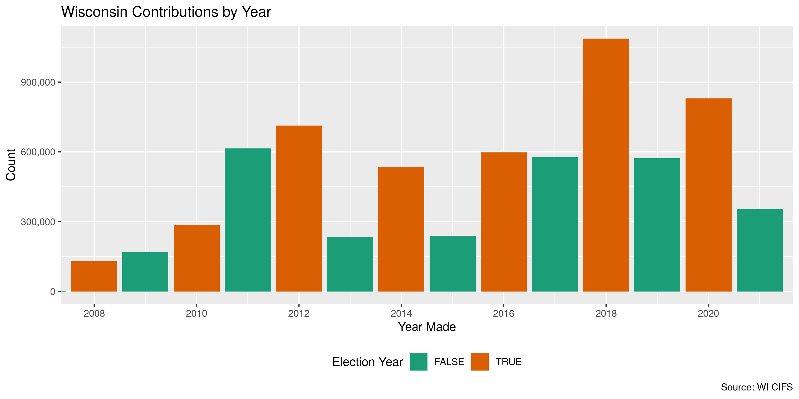

Wisconsin Contributions
================
Kiernan Nicholls
2021-10-18 16:18:08

-   [Project](#project)
-   [Objectives](#objectives)
-   [Packages](#packages)
-   [Data](#data)
-   [Download](#download)
-   [Read](#read)
-   [Explore](#explore)
-   [Wrangle](#wrangle)
-   [Conclude](#conclude)
-   [Export](#export)
-   [Upload](#upload)

<!-- Place comments regarding knitting here -->

## Project

The Accountability Project is an effort to cut across data silos and
give journalists, policy professionals, activists, and the public at
large a simple way to search across huge volumes of public data about
people and organizations.

Our goal is to standardizing public data on a few key fields by thinking
of each dataset row as a transaction. For each transaction there should
be (at least) 3 variables:

1.  All **parties** to a transaction.
2.  The **date** of the transaction.
3.  The **amount** of money involved.

## Objectives

This document describes the process used to complete the following
objectives:

1.  How many records are in the database?
2.  Check for entirely duplicated records.
3.  Check ranges of continuous variables.
4.  Is there anything blank or missing?
5.  Check for consistency issues.
6.  Create a five-digit ZIP Code called `zip`.
7.  Create a `year` field from the transaction date.
8.  Make sure there is data on both parties to a transaction.

## Packages

The following packages are needed to collect, manipulate, visualize,
analyze, and communicate these results. The `pacman` package will
facilitate their installation and attachment.

The IRW’s `campfin` package will also have to be installed from GitHub.
This package contains functions custom made to help facilitate the
processing of campaign finance data.

``` r
if (!require("pacman")) install.packages("pacman")
pacman::p_load_gh("irworkshop/campfin")
pacman::p_load(
  tidyverse, # data manipulation
  lubridate, # datetime strings
  gluedown, # print markdown
  magrittr, # pipe operators
  janitor, # dataframe clean
  refinr, # cluster and merge
  scales, # format strings
  knitr, # knit documents
  vroom, # read files fast
  glue, # combine strings
  here, # relative storage
  fs # search storage 
)
```

This document should be run as part of the `R_campfin` project, which
lives as a sub-directory of the more general, language-agnostic
[`irworkshop/accountability_datacleaning`](https://github.com/irworkshop/accountability_datacleaning)
GitHub repository.

The `R_campfin` project uses the [RStudio
projects](https://support.rstudio.com/hc/en-us/articles/200526207-Using-Projects)
feature and should be run as such. The project also uses the dynamic
`here::here()` tool for file paths relative to *your* machine.

``` r
# where does this document knit?
here::here()
#> [1] "/home/kiernan/Documents/tap/R_tap"
```

## Data

Data is from the Wisconsin Secretary of State’s Campaign Finance System
(CIFS).

> Wyoming’s Campaign Finance Information System (WYCFIS) exists to
> provide a mechanism for online filing of campaign finance information
> and to provide full disclosure to the public. This website contains
> detailed financial records and related information that candidates,
> committees, organizations and parties are required by law to disclose.

## Download

Using the CIFS [contribution search
portal](https://cfis.wi.gov/Public/Registration.aspx?page=ReceiptList#),
we can run a search for all contributions from “All Filing Periods” from
the dates 2000-01-01 to 2021-10-18. Those search results need to be
manually exported as the `ReceiptsList.csv` file.

> To view contributions to a committee, go to the CFIS Home Page, on the
> left hand side, and click View Receipts. A pop up letting you know
> that this information cannot be used for solicitation purposes will
> appear – click Continue. Type in a committee’s ID in the field titled
> ID, or start typing the name of the candidate in the Registrant Name
> field and click on the correct committee name when it appears. Type in
> any additional information you would like to search for, including a
> name of a contributor or amount of contribution. To view all
> contributions, remove the filing period by clicking, in the Filing
> Period Name field, and scroll all the way to the top and select All
> Filing Periods. Click Search and all of the contributions fitting your
> search criteria will appear. If you would like to export these into
> Excel, scroll all the way to the bottom and on the right hand side,
> click the XLS icon.

Infuriatingly, the site only lets users export 65,000 records at a time.
I have written a scrip that will use Selenium to open a remote browser,
submit a search for all contributions and download the row-limited files
one by one.

``` r
source(
  file = here("wi", "contribs", "docs", "scrape_wi_contribs.R")
)
```

The files are downloaded to the `scrape/` directory.

``` r
raw_dir <- dir_create(here("wi", "contribs", "data", "scrape"))
raw_info <- as_tibble(dir_info(raw_dir))
sum(raw_info$size)
#> 1.24G
raw_info %>% 
  select(path, size, modification_time) %>% 
  mutate(across(path, basename))
#> # A tibble: 107 × 3
#>    path                                   size modification_time  
#>    <chr>                           <fs::bytes> <dttm>             
#>  1 wi_contribs_1-65000.csv               12.3M 2021-10-18 11:40:05
#>  2 wi_contribs_1040001-1105000.csv       11.6M 2021-10-18 11:40:11
#>  3 wi_contribs_1105001-1170000.csv       11.5M 2021-10-18 11:40:11
#>  4 wi_contribs_1170001-1235000.csv       10.3M 2021-10-18 11:40:11
#>  5 wi_contribs_1235001-1300000.csv       12.8M 2021-10-18 11:40:11
#>  6 wi_contribs_1300001-1365000.csv       11.9M 2021-10-18 11:40:11
#>  7 wi_contribs_130001-195000.csv         10.4M 2021-10-18 11:40:10
#>  8 wi_contribs_1365001-1430000.csv       10.4M 2021-10-18 11:40:11
#>  9 wi_contribs_1430001-1495000.csv       11.1M 2021-10-18 11:40:12
#> 10 wi_contribs_1495001-1560000.csv       10.7M 2021-10-18 11:40:12
#> # … with 97 more rows
raw_csv <- raw_info$path
```

We should check the file names to ensure we were able to download every
batch of 65,000. If we count the distance between each of the sorted
numbers in the row ranges we should be left with only 1, 64999, and
however many are in the last range (the only one below 65,000).

``` r
row_range <- raw_csv %>% 
  str_extract(pattern = "(\\d+)-(\\d+)") %>% 
  str_split(pattern = "-") %>% 
  map(as.numeric) %>% 
  unlist() %>% 
  sort() 

sort(table(diff(row_range)))
#> 
#> 46188     1 64999 
#>     1   106   106
```

## Read

The files can be read into a single data frame with `read_delim()`.

``` r
wic <- read_delim( # 6,936,189
  file = raw_csv,
  delim = ",",
  escape_double = FALSE,
  escape_backslash = FALSE,
  col_types = cols(
    .default = col_character(),
    TransactionDate = col_date_mdy(),
    ContributionAmount = col_double(),
    ETHCFID = col_integer(),
    `72 Hr. Reports` = col_date_mdy(),
    SegregatedFundFlag = col_logical()
  )
)
```

We can check the number of rows against the total reported by our empty
search. We can also count the number of distinct values from a discrete
column.

``` r
nrow(wic) == 6936189 # check col count
#> [1] TRUE
count(wic, ContributorType) # check distinct col
#> # A tibble: 9 × 2
#>   ContributorType         n
#>   <chr>               <int>
#> 1 Anonymous           17074
#> 2 Business            18444
#> 3 Ethics Commission     143
#> 4 Individual        6786497
#> 5 Local Candidate      2812
#> 6 Registrant          74804
#> 7 Self                12065
#> 8 Unitemized          18169
#> 9 Unregistered         6181
prop_na(wic[[length(wic)]]) # empty column
#> [1] 1
```

The file appears to have been read correctly. We just need to parse,
rename, and remove some of the columns.

``` r
raw_names <- names(wic)[-length(wic)]
```

``` r
wic <- wic %>% 
  clean_names("snake") %>% 
  select(-last_col()) # empty
```

The `contributor_name` columns is in a “LAST FIRST” format, which might
complicate searches on the TAP database. Each name is separated with two
spaces, so we can separate each name into its own column so they can be
properly ordered when mapped in the database.

``` r
name_split <- wic %>% 
  distinct(contributor_name) %>% 
  separate(
    col = contributor_name,
    into = c(
      "contributor_last", 
      "contributor_first"
    ),
    sep = "\\s{2}",
    remove = FALSE,
    extra = "merge",
    fill = "right"
  )
```

``` r
wic <- wic %>% 
  left_join(name_split, by = "contributor_name") %>% 
  relocate(contributor_first, contributor_last, .after = contributor_name) %>%  
  select(-contributor_name)
```

``` r
wic <- mutate(wic, across(where(is.character), str_squish))
```

## Explore

There are 6,936,189 rows of 21 columns. Each record represents a single
contribution from an individual to a political committee.

``` r
glimpse(wic)
#> Rows: 6,936,189
#> Columns: 21
#> $ transaction_date         <date> 2020-10-20, 2020-10-20, 2020-10-20, 2020-11-05, 2020-10-13, 202…
#> $ filing_period_name       <chr> "January Continuing 2021", "January Continuing 2021", "January C…
#> $ contributor_first        <chr> NA, "Bruce", "James", "John Conrad", "Smith", "Hilficker", "Osow…
#> $ contributor_last         <chr> "Republican Party of Milwaukee County", "Boll", "Meyers", "Ellen…
#> $ contribution_amount      <dbl> 100.00, 100.00, 65.00, 1074.44, 25.00, 500.00, 100.00, 99.00, 15…
#> $ address_line1            <chr> "801 S 108th St", "732 S 103rd St", "3232 N Norwood Pl", "1343 S…
#> $ address_line2            <chr> NA, NA, NA, NA, NA, NA, NA, NA, NA, NA, NA, NA, NA, NA, NA, NA, …
#> $ city                     <chr> "West Allis", "Milwaukee", "Milwaukee", "Shell Lake", "Eau Clair…
#> $ state_code               <chr> "WI", "WI", "WI", "WI", "WI", "MN", "WI", "WI", "WI", "MA", "WI"…
#> $ zip                      <chr> "53214", "53214", "53216", "54871", "54701", "55101", "53219", "…
#> $ occupation               <chr> NA, NA, NA, NA, NA, NA, NA, NA, NA, NA, NA, NA, "Retired", "Reti…
#> $ employer_name            <chr> NA, NA, NA, NA, NA, NA, NA, NA, NA, NA, NA, NA, NA, NA, NA, NA, …
#> $ employer_address         <chr> NA, NA, NA, NA, NA, NA, NA, NA, NA, NA, NA, NA, NA, NA, NA, NA, …
#> $ contributor_type         <chr> "Business", "Individual", "Individual", "Self", "Individual", "I…
#> $ receiving_committee_name <chr> "Abie for Assembly", "Abie for Assembly", "Abie for Assembly", "…
#> $ ethcfid                  <int> 106253, 106253, 106253, 106325, 106325, 106325, 106325, 106325, …
#> $ conduit                  <chr> NA, NA, NA, NA, NA, NA, NA, NA, NA, NA, NA, NA, NA, NA, NA, NA, …
#> $ branch                   <chr> "State Assembly District No. 17", "State Assembly District No. 1…
#> $ comment                  <chr> NA, NA, NA, NA, NA, NA, NA, NA, NA, NA, NA, NA, NA, NA, NA, NA, …
#> $ x72_hr_reports           <date> NA, NA, NA, NA, NA, NA, NA, NA, NA, NA, NA, NA, NA, NA, NA, NA,…
#> $ segregated_fund_flag     <lgl> FALSE, FALSE, FALSE, FALSE, FALSE, FALSE, FALSE, FALSE, FALSE, F…
tail(wic)
#> # A tibble: 6 × 21
#>   transaction_date filing_period_name   contributor_first contributor_last contribution_amount
#>   <date>           <chr>                <chr>             <chr>                          <dbl>
#> 1 2020-06-24       July Continuing 2020 JACOB             DZIEKAN                         0.59
#> 2 2020-06-24       July Continuing 2020 CHAD              MARTINEZ                        0.53
#> 3 2020-06-24       July Continuing 2020 KYLE              DOWE                            0.78
#> 4 2020-06-24       July Continuing 2020 SHAUN             SCHOWALTER                      0.56
#> 5 2020-06-24       July Continuing 2020 MASON             KILEN                           0.68
#> 6 2020-06-24       July Continuing 2020 STEVEN            MUELLER                         0.47
#> # … with 16 more variables: address_line1 <chr>, address_line2 <chr>, city <chr>,
#> #   state_code <chr>, zip <chr>, occupation <chr>, employer_name <chr>, employer_address <chr>,
#> #   contributor_type <chr>, receiving_committee_name <chr>, ethcfid <int>, conduit <chr>,
#> #   branch <chr>, comment <chr>, x72_hr_reports <date>, segregated_fund_flag <lgl>
```

### Missing

Columns vary in their degree of missing values.

``` r
col_stats(wic, count_na)
#> # A tibble: 21 × 4
#>    col                      class        n          p
#>    <chr>                    <chr>    <int>      <dbl>
#>  1 transaction_date         <date>       0 0         
#>  2 filing_period_name       <chr>        0 0         
#>  3 contributor_first        <chr>   134727 0.0194    
#>  4 contributor_last         <chr>        7 0.00000101
#>  5 contribution_amount      <dbl>        0 0         
#>  6 address_line1            <chr>   110636 0.0160    
#>  7 address_line2            <chr>  6604325 0.952     
#>  8 city                     <chr>    72571 0.0105    
#>  9 state_code               <chr>    43299 0.00624   
#> 10 zip                      <chr>    95350 0.0137    
#> 11 occupation               <chr>  5124426 0.739     
#> 12 employer_name            <chr>  5956515 0.859     
#> 13 employer_address         <chr>  6114813 0.882     
#> 14 contributor_type         <chr>        0 0         
#> 15 receiving_committee_name <chr>        0 0         
#> 16 ethcfid                  <int>        0 0         
#> 17 conduit                  <chr>  6420693 0.926     
#> 18 branch                   <chr>  4320103 0.623     
#> 19 comment                  <chr>  5332800 0.769     
#> 20 x72_hr_reports           <date> 6921889 0.998     
#> 21 segregated_fund_flag     <lgl>        0 0
```

We can flag any record missing a key variable needed to identify a
transaction.

``` r
key_vars <- c("transaction_date", "contributor_last", 
              "contribution_amount", "receiving_committee_name")
wic <- flag_na(wic, all_of(key_vars))
sum(wic$na_flag)
#> [1] 7
```

Very, very few records are missing the contributor name.

``` r
wic %>% 
  filter(na_flag) %>% 
  select(all_of(key_vars))
#> # A tibble: 7 × 4
#>   transaction_date contributor_last contribution_amount receiving_committee_name             
#>   <date>           <chr>                          <dbl> <chr>                                
#> 1 2020-12-31       <NA>                          2430.  Wisconsin Federation for Children PAC
#> 2 2008-12-31       <NA>                            84.6 Friends of Shirley Krug              
#> 3 2008-11-30       <NA>                            81.7 Friends of Shirley Krug              
#> 4 2008-10-31       <NA>                            84.3 Friends of Shirley Krug              
#> 5 2008-09-30       <NA>                            77.8 Friends of Shirley Krug              
#> 6 2008-08-31       <NA>                            80.2 Friends of Shirley Krug              
#> 7 2008-07-31       <NA>                            78.2 Friends of Shirley Krug
```

### Duplicates

We can also flag any entirely duplicate rows. To keep memory usage low
with such a large data frame, we will split our data into a list and
check each element of the list. For each chunk, we will write the
duplicate `id` to a text file.

``` r
wic <- wic %>% 
  group_split(
    q = quarter(transaction_date),
    y = year(transaction_date),
    .keep = FALSE
  ) %>% 
  map_dfr(
    .f = function(x) {
      message(x$transaction_date[1])
      if (nrow(x) > 1) {
        x <- flag_dupes(x, everything(), .check = FALSE)
        if (runif(1) > 0.75) {
          flush_memory(1)
        }
      }
      return(x)
    }
  )
```

NA of rows are duplicates.

``` r
wic %>% 
  filter(dupe_flag) %>% 
  count(transaction_date, contributor_last, 
        contribution_amount, receiving_committee_name, 
        sort = TRUE)
#> # A tibble: 46,639 × 5
#>    transaction_date contributor_last contribution_amount receiving_committee_name                 n
#>    <date>           <chr>                          <dbl> <chr>                                <int>
#>  1 2008-10-30       Unitemized                        20 Assembly Democratic Camp Comm          120
#>  2 2011-06-10       Anonymous                         10 Shilling for Senate                     75
#>  3 2018-02-08       Anonymous                          2 Local 420 PAC                           69
#>  4 2017-12-28       Anonymous                          2 Local 420 PAC                           62
#>  5 2010-07-15       Anonymous                         10 Matt Bitz for Assembly                  60
#>  6 2013-08-07       Anonymous                         10 Marathon Co Democratic Party            54
#>  7 2010-09-07       Anonymous                          5 Republican Party of Jackson County …    52
#>  8 2018-06-15       Anonymous                          5 Waukesha County Democratic Party        49
#>  9 2017-08-22       Anonymous                          2 Local 420 PAC                           48
#> 10 2013-08-25       Anonymous                         10 Marathon Co Democratic Party            41
#> # … with 46,629 more rows
```

### Categorical

``` r
col_stats(wic, n_distinct)
#> # A tibble: 23 × 4
#>    col                      class        n           p
#>    <chr>                    <chr>    <int>       <dbl>
#>  1 transaction_date         <date>    5188 0.000748   
#>  2 filing_period_name       <chr>      162 0.0000234  
#>  3 contributor_first        <chr>   149599 0.0216     
#>  4 contributor_last         <chr>   266665 0.0384     
#>  5 contribution_amount      <dbl>    29485 0.00425    
#>  6 address_line1            <chr>  1373593 0.198      
#>  7 address_line2            <chr>    30853 0.00445    
#>  8 city                     <chr>    37442 0.00540    
#>  9 state_code               <chr>       58 0.00000836 
#> 10 zip                      <chr>   343284 0.0495     
#> 11 occupation               <chr>    82534 0.0119     
#> 12 employer_name            <chr>   126085 0.0182     
#> 13 employer_address         <chr>   222757 0.0321     
#> 14 contributor_type         <chr>        9 0.00000130 
#> 15 receiving_committee_name <chr>     2788 0.000402   
#> 16 ethcfid                  <int>     2794 0.000403   
#> 17 conduit                  <chr>      235 0.0000339  
#> 18 branch                   <chr>      399 0.0000575  
#> 19 comment                  <chr>    80991 0.0117     
#> 20 x72_hr_reports           <date>     812 0.000117   
#> 21 segregated_fund_flag     <lgl>        2 0.000000288
#> 22 na_flag                  <lgl>        2 0.000000288
#> 23 dupe_flag                <lgl>        3 0.000000433
```

<!-- -->

### Amounts

``` r
wic$contribution_amount <- round(wic$contribution_amount, digits = 2)
```

``` r
summary(wic$contribution_amount)
#>    Min. 1st Qu.  Median    Mean 3rd Qu.    Max. 
#>       0       2      10     115      35 3250000
mean(wic$contribution_amount <= 0)
#> [1] 0.002056172
```

These are the records with the minimum and maximum amounts.

``` r
glimpse(wic[c(
  which.max(wic$contribution_amount), 
  which.min(wic$contribution_amount)
), ])
#> Rows: 2
#> Columns: 23
#> $ transaction_date         <date> 2020-02-28, 2007-03-26
#> $ filing_period_name       <chr> "Spring Pre-Election 2020", "July Continuing 2007"
#> $ contributor_first        <chr> NA, "Annette K."
#> $ contributor_last         <chr> "Marsy's Law for All Foundation", "Ziegler"
#> $ contribution_amount      <dbl> 3250000, 0
#> $ address_line1            <chr> "15 Enterprise Suite 550", "PO Box 620066"
#> $ address_line2            <chr> NA, NA
#> $ city                     <chr> "Aliso Viejo", "Middleton"
#> $ state_code               <chr> "CA", "WI"
#> $ zip                      <chr> "92656", "53562"
#> $ occupation               <chr> NA, NA
#> $ employer_name            <chr> NA, NA
#> $ employer_address         <chr> NA, NA
#> $ contributor_type         <chr> "Business", "Self"
#> $ receiving_committee_name <chr> "Marsy's Law for Wisconsin LLC", "Justice Ziegler For Supreme C…
#> $ ethcfid                  <int> 700120, 103567
#> $ conduit                  <chr> NA, NA
#> $ branch                   <chr> NA, "Supreme Court"
#> $ comment                  <chr> NA, "All personal loans were forgiven 10/27/2007 when the commit…
#> $ x72_hr_reports           <date> NA, NA
#> $ segregated_fund_flag     <lgl> FALSE, FALSE
#> $ na_flag                  <lgl> FALSE, FALSE
#> $ dupe_flag                <lgl> FALSE, FALSE
```

<!-- -->

### Dates

We can add the calendar year from `date` with `lubridate::year()`

``` r
wic <- mutate(wic, transaction_year = year(transaction_date))
```

``` r
min(wic$transaction_date)
#> [1] "1995-12-31"
sum(wic$transaction_year < 2008)
#> [1] 473
max(wic$transaction_date)
#> [1] "2021-08-04"
sum(wic$transaction_date > today())
#> [1] 0
```

<!-- -->

## Wrangle

To improve the searchability of the database, we will perform some
consistent, confident string normalization. For geographic variables
like city names and ZIP codes, the corresponding `campfin::normal_*()`
functions are tailor made to facilitate this process.

### Address

For the street `addresss` variable, the `campfin::normal_address()`
function will force consistence case, remove punctuation, and abbreviate
official USPS suffixes.

``` r
addr_norm <- wic %>% 
  distinct(address_line1, address_line2) %>% 
  mutate(
    across(
      starts_with("address_"),
      list(anorm = normal_address),
      abbs = usps_street,
      na_rep = TRUE
    )
  ) %>% 
  unite(
    col = address_norm,
    ends_with("_anorm"),
    sep = " ",
    remove = TRUE,
    na.rm = TRUE
  )
```

``` r
addr_norm
#> # A tibble: 1,416,282 × 3
#>    address_line1                 address_line2 address_norm               
#>    <chr>                         <chr>         <chr>                      
#>  1 W269 S3244 Merrill Hills Road <NA>          W269 S3244 MERRILL HILLS RD
#>  2 7633 Geralayne Circle         <NA>          7633 GERALAYNE CIR         
#>  3 8819 Whispering Oaks Court    <NA>          8819 WHISPERING OAKS CT    
#>  4 N26779 County Road T          <NA>          N26779 COUNTY ROAD T       
#>  5 3032 Walden Circle            <NA>          3032 WALDEN CIR            
#>  6 2845 North 68th Street        <NA>          2845 NORTH 68TH ST         
#>  7 3033 W. Spencer St.           <NA>          3033 W SPENCER ST          
#>  8 823 East Sunset Avenue        <NA>          823 EAST SUNSET AVE        
#>  9 2520 Settlement Road          <NA>          2520 SETTLEMENT RD         
#> 10 8348 South 68th Street        <NA>          8348 SOUTH 68TH ST         
#> # … with 1,416,272 more rows
```

``` r
wic <- left_join(wic, addr_norm, by = c("address_line1", "address_line2"))
```

### ZIP

For ZIP codes, the `campfin::normal_zip()` function will attempt to
create valid *five* digit codes by removing the ZIP+4 suffix and
returning leading zeroes dropped by other programs like Microsoft Excel.

``` r
wic <- wic %>% 
  mutate(
    zip_norm = normal_zip(
      zip = zip,
      na_rep = TRUE
    )
  )
```

``` r
progress_table(
  wic$zip,
  wic$zip_norm,
  compare = valid_zip
)
#> # A tibble: 2 × 6
#>   stage        prop_in n_distinct prop_na   n_out n_diff
#>   <chr>          <dbl>      <dbl>   <dbl>   <dbl>  <dbl>
#> 1 wic$zip        0.698     343284  0.0137 2065639 316832
#> 2 wic$zip_norm   0.997      33091  0.0139   18633   4341
```

### State

``` r
wic$state_code <- str_to_upper(wic$state_code)
prop_in(wic$state_code, valid_state)
#> [1] 1
```

### City

Cities are the most difficult geographic variable to normalize, simply
due to the wide variety of valid cities and formats.

#### Normal

The `campfin::normal_city()` function is a good start, again converting
case, removing punctuation, but *expanding* USPS abbreviations. We can
also remove `invalid_city` values.

``` r
norm_city <- wic %>% 
  distinct(city, state_code, zip_norm) %>% 
  mutate(
    city_norm = normal_city(
      city = city, 
      abbs = usps_city,
      states = c("WI", "DC", "WISCONSIN"),
      na = invalid_city,
      na_rep = TRUE
    )
  )
```

#### Swap

We can further improve normalization by comparing our normalized value
against the *expected* value for that record’s state abbreviation and
ZIP code. If the normalized value is either an abbreviation for or very
similar to the expected value, we can confidently swap those two.

``` r
norm_city <- norm_city %>% 
  rename(city_raw = city) %>% 
  left_join(
    y = zipcodes,
    by = c(
      "state_code" = "state",
      "zip_norm" = "zip"
    )
  ) %>% 
  rename(city_match = city) %>% 
  mutate(
    match_abb = is_abbrev(city_norm, city_match),
    match_dist = str_dist(city_norm, city_match),
    city_swap = if_else(
      condition = !is.na(match_dist) & (match_abb | match_dist == 1),
      true = city_match,
      false = city_norm
    )
  ) %>% 
  select(
    -city_match,
    -match_dist,
    -match_abb
  )
```

``` r
wic <- left_join(
  x = wic,
  y = norm_city,
  by = c(
    "city" = "city_raw", 
    "state_code", 
    "zip_norm"
  )
)
```

#### Refine

The [OpenRefine](https://openrefine.org/) algorithms can be used to
group similar strings and replace the less common versions with their
most common counterpart. This can greatly reduce inconsistency, but with
low confidence; we will only keep any refined strings that have a valid
city/state/zip combination.

``` r
good_refine <- wic %>% 
  mutate(
    city_refine = city_swap %>% 
      key_collision_merge() %>% 
      n_gram_merge(numgram = 1)
  ) %>% 
  filter(city_refine != city_swap) %>% 
  inner_join(
    y = zipcodes,
    by = c(
      "city_refine" = "city",
      "state_code" = "state",
      "zip_norm" = "zip"
    )
  )
```

    #> # A tibble: 378 × 5
    #>    state_code zip_norm city_swap        city_refine         n
    #>    <chr>      <chr>    <chr>            <chr>           <int>
    #>  1 WI         54873    SOLON SPRINGSSS  SOLON SPRINGS      35
    #>  2 WI         54751    MENOMINEE        MENOMONIE          27
    #>  3 WI         53051    MENONOMEE FALLS  MENOMONEE FALLS    24
    #>  4 WI         53566    MNRO MONROE      MONROE             14
    #>  5 CA         92625    CORONA DALE MAR  CORONA DEL MAR     13
    #>  6 WI         54751    MENONOMIE        MENOMONIE          13
    #>  7 CA         90292    MARINA DALE REY  MARINA DEL REY     12
    #>  8 IL         60030    GREYS LAKE       GRAYSLAKE          12
    #>  9 SC         29406    NORTH CHARLESTON CHARLESTON         10
    #> 10 WI         54956    NEEHAN           NEENAH             10
    #> # … with 368 more rows

Then we can join the refined values back to the database.

``` r
wic <- wic %>% 
  left_join(good_refine, by = names(.)) %>% 
  mutate(city_refine = coalesce(city_refine, city_swap))
```

#### Progress

Our goal for normalization was to increase the proportion of city values
known to be valid and reduce the total distinct values by correcting
misspellings.

| stage                    | prop_in | n_distinct | prop_na |  n_out | n_diff |
|:-------------------------|--------:|-----------:|--------:|-------:|-------:|
| `str_to_upper(wic$city)` |   0.980 |      26707 |   0.010 | 134879 |  12872 |
| `wic$city_norm`          |   0.985 |      24901 |   0.011 | 100788 |  11030 |
| `wic$city_swap`          |   0.995 |      18581 |   0.011 |  31413 |   4707 |
| `wic$city_refine`        |   0.996 |      18268 |   0.011 |  30725 |   4397 |

You can see how the percentage of valid values increased with each
stage.

<!-- -->

More importantly, the number of distinct values decreased each stage. We
were able to confidently change many distinct invalid values to their
valid equivalent.

<!-- -->

Before exporting, we can remove the intermediary normalization columns
and rename all added variables with the `_clean` suffix.

``` r
wic <- wic %>% 
  select(
    -city_norm,
    -city_swap,
    city_clean = city_refine
  ) %>% 
  rename_all(~str_replace(., "_norm", "_clean")) %>% 
  rename_all(~str_remove(., "_raw")) %>% 
  relocate(address_clean, city_clean, .before = zip_clean)
```

## Conclude

``` r
glimpse(sample_n(wic, 50))
#> Rows: 50
#> Columns: 27
#> $ transaction_date         <date> 2015-02-11, 2011-03-17, 2011-05-15, 2012-02-24, 2015-05-11, 201…
#> $ filing_period_name       <chr> "July Continuing 2015", "Spring Pre-Election 2011", "July Contin…
#> $ contributor_first        <chr> "David", "David", "Joan", "Leonard", "John", "JOSLYN E", "Larry"…
#> $ contributor_last         <chr> "Ferguson", "Feiss", "Honig", "Sobczak", "Maier", "OLSON", "Pres…
#> $ contribution_amount      <dbl> 25.00, 100.00, 6.25, 5000.00, 50.00, 0.17, 3.00, 4.00, 25.00, 5.…
#> $ address_line1            <chr> "530 S David Ln", "7915 Mary Ellen Pl", "3300 Darby Rd. #7305", …
#> $ address_line2            <chr> NA, NA, NA, NA, NA, NA, "WI1-4042", NA, NA, "P.O. Box 2306", NA,…
#> $ city                     <chr> "Knoxville", "Milwaukee", "Haverford", "Milwaukee", "Roscoe", "A…
#> $ state_code               <chr> "TN", "WI", "PA", "WI", "IL", "WI", "WI", "WI", "WI", "WI", "WI"…
#> $ zip                      <chr> "37922", "53213-3470", "19041", "53211-4314", "61073", "54806-22…
#> $ occupation               <chr> "RETIRED", NA, NA, "REAL ESTATE", "ATTORNEY", NA, NA, NA, "Nurse…
#> $ employer_name            <chr> NA, NA, NA, "Eastmore Real Estate", NA, NA, NA, NA, NA, "PBC", N…
#> $ employer_address         <chr> NA, NA, NA, "3287 N Oakland Ave Milwaukee WI 53211", NA, NA, NA,…
#> $ contributor_type         <chr> "Individual", "Individual", "Individual", "Individual", "Individ…
#> $ receiving_committee_name <chr> "Friends of Scott Walker", "State Senate Democratic Comm", "Frie…
#> $ ethcfid                  <int> 102575, 400003, 102813, 300054, 102575, 500132, 500847, 500189, …
#> $ conduit                  <chr> NA, "ActBlue Wisconsin", "ActBlue Wisconsin", NA, NA, NA, NA, NA…
#> $ branch                   <chr> "Governor", NA, "State Senate District No. 22", NA, "Governor", …
#> $ comment                  <chr> NA, NA, NA, "recall", NA, "eDues including EFT Credit Card and/o…
#> $ x72_hr_reports           <date> NA, NA, NA, NA, NA, NA, NA, NA, NA, NA, NA, NA, NA, NA, NA, NA,…
#> $ segregated_fund_flag     <lgl> FALSE, FALSE, FALSE, FALSE, FALSE, FALSE, FALSE, FALSE, FALSE, F…
#> $ na_flag                  <lgl> FALSE, FALSE, FALSE, FALSE, FALSE, FALSE, FALSE, FALSE, FALSE, F…
#> $ dupe_flag                <lgl> FALSE, FALSE, FALSE, FALSE, FALSE, FALSE, FALSE, FALSE, FALSE, F…
#> $ transaction_year         <dbl> 2015, 2011, 2011, 2012, 2015, 2018, 2012, 2020, 2019, 2013, 2013…
#> $ address_clean            <chr> "530 S DAVID LN", "7915 MARY ELLEN PL", "3300 DARBY RD 7305", "2…
#> $ city_clean               <chr> "KNOXVILLE", "MILWAUKEE", "HAVERFORD", "MILWAUKEE", "ROSCOE", "A…
#> $ zip_clean                <chr> "37922", "53213", "19041", "53211", "61073", "54806", "53202", "…
```

1.  There are 6,936,193 records in the database.
2.  There are NA duplicate records in the database.
3.  The range and distribution of `amount` and `date` seem reasonable.
4.  There are 7 records missing key variables.
5.  Consistency in geographic data has been improved with
    `campfin::normal_*()`.
6.  The 4-digit `year` variable has been created with
    `lubridate::year()`.

## Export

Now the file can be saved on disk for upload to the Accountability
server.

``` r
clean_dir <- dir_create(here("wi", "contribs", "data", "clean"))
clean_path <- path(clean_dir, "wi_contribs_2008-20211018.csv")
write_csv(wic, clean_path, na = "")
(clean_size <- file_size(clean_path))
#> 1.52G
```

## Upload

We can use the `aws.s3::put_object()` to upload the text file to the IRW
server.

``` r
aws_path <- path("csv", basename(clean_path))
if (!object_exists(aws_path, "publicaccountability")) {
  put_object(
    file = clean_path,
    object = aws_path, 
    bucket = "publicaccountability",
    acl = "public-read",
    show_progress = TRUE,
    multipart = TRUE
  )
}
aws_head <- head_object(aws_path, "publicaccountability")
(aws_size <- as_fs_bytes(attr(aws_head, "content-length")))
unname(aws_size == clean_size)
```
