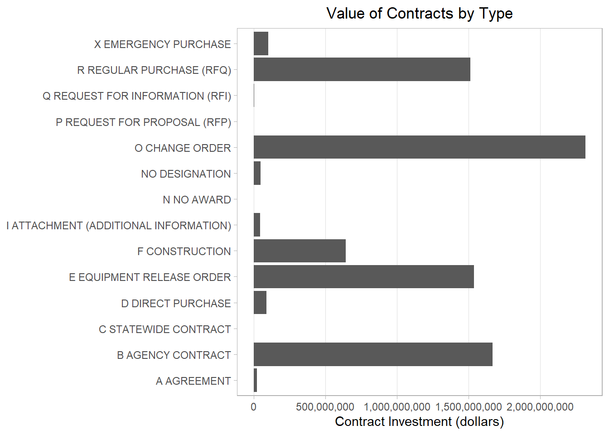
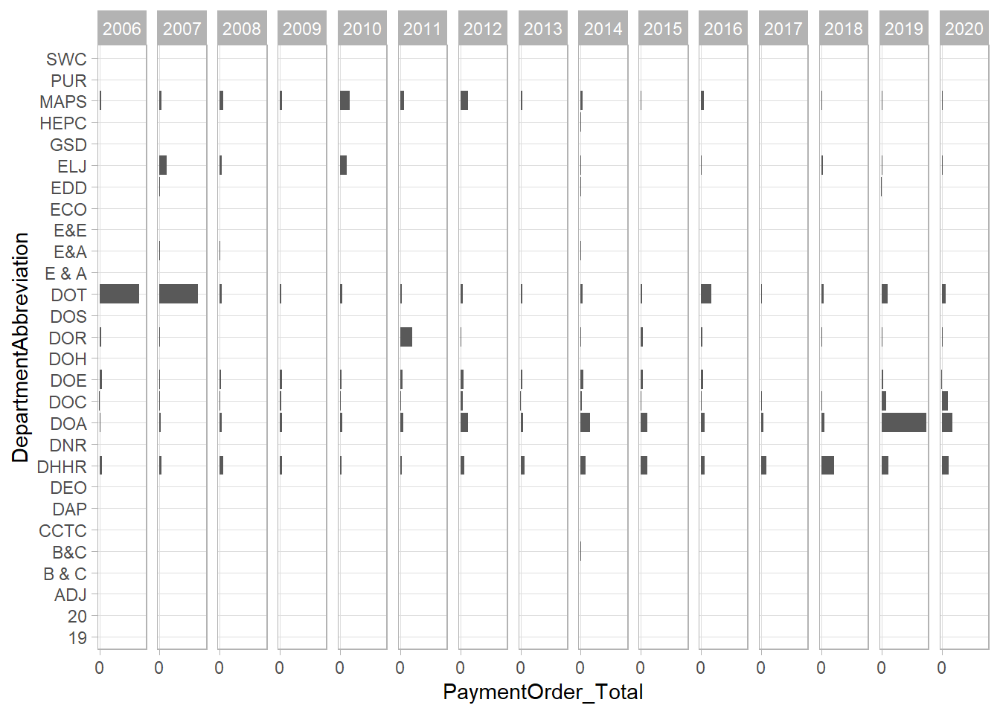

Exploratory Data Analysis - WV Contracts
========================================

#### Kevin Shrawder

#### 10/25/2020

## Project

The Accountability Project is an effort to cut across data silos and give journalists, policy professionals, activists, and the public at large a simple way to search across huge volumes of public data about people and organizations.

Our goal is to standardizing public data on a few key fields by thinking of each dataset row as a transaction.

## Objectives

This document describes the process used to visualize and explore the West Virginia contracts dataset.

## Software

This data is processed using the free, open-source statistical computing language R, which can be installed from CRAN \[[https://cran.r-project.org/](https://cran.r-project.org/)\] for various opperating systems. For example, R can be installed from the apt package repository on Ubuntu.

The following additional R packages are needed to collect, manipulate, visualize, analyze, and communicate these results. The `tidyverse` package will facilitate their installation and attachment.

    library(tidyverse)

## Data

The data used in this analyiss is a cleaned version of the West Virginia Contracts data, obtained via a Freedom of Information Act to the West Virginia Purchasing Department. Steps on processing the data can be found in the file: WV\_Contracts\_Data\_Cleaning available on The Accountability Project github page ([https://github.com/irworkshop/accountability\_datacleaning](https://github.com/irworkshop/accountability_datacleaning)).

Read the data into R.

    df <- read_csv('WestVirginiaContracts_fy2006_fy2020.csv')

## Exploratory Analysis

We’ll start by looking some descriptive statistics for the numerical variables Fiscal Year, Change Order Number and Payment Order Total Amount of money.

    df %>%
      select(ChangeOrder_Number, FiscalYear, PaymentOrder_Total) %>%
      summary()

    ##  ChangeOrder_Number   FiscalYear   PaymentOrder_Total 
    ##  Min.   :  1.000    Min.   :2006   Min.   :-14437837  
    ##  1st Qu.:  1.000    1st Qu.:2008   1st Qu.:        0  
    ##  Median :  2.000    Median :2012   Median :        0  
    ##  Mean   :  5.472    Mean   :2012   Mean   :   190449  
    ##  3rd Qu.:  4.000    3rd Qu.:2016   3rd Qu.:    28000  
    ##  Max.   :137.000    Max.   :2020   Max.   :709053211  
    ##  NA's   :23628

Though Fiscal Year doesn’t tell us much (and wasn’t intended to tell us much), it does show the data starts from Fiscal Year 2006 and ends in Fiscal Year 2020. This makes sense since the Fiscal Year for West Virginia begins on July 1 - thus the data ends on June 30th, 2020 and does not encompass the rest of calendar year 2020. Looking at change orders, it appears that many contracts do not have a change order (looking at the NA count). However we do see that a few contracts have many change orders (max being 137 change orders); overall the average amount of change orders for contracts that do have a change order looks to be likely somewhere in the low ten’s with the median of 2 and a mean of 5.47. Finally, looking at the payment order amount we see that some contracts appear to be rescinded payments (negative minimum) but the average amount paid out on contracts is something around 1.9 million. Additionally, we see that many of the contract numbers present in this data set have a value of 0 (median and Q1 values) which indicate several things. After looking at the data a bit more it will become clear that these are likely the observations with change orders, split orders, or more commonly, contract numbers associated with requests for proposals.

We will now similarly look at the frequency tables of the observations.

    df %>%
      count(PaymentOrder_Prefix) %>%
      arrange(desc(n))

    ## # A tibble: 178 x 2
    ##    PaymentOrder_Prefix     n
    ##    <chr>               <int>
    ##  1 DEP                  5343
    ##  2 DOH                  5301
    ##  3 SWC                  4469
    ##  4 DOT                  2386
    ##  5 GSD                  2085
    ##  6 DNR                  1951
    ##  7 FLT                  1063
    ##  8 DPS                  1027
    ##  9 HHR                   890
    ## 10 COR                   792
    ## # ... with 168 more rows

    df %>%
      count(PaymentOrder_SplitOrder) %>%
      arrange(desc(n))

    ## # A tibble: 172 x 2
    ##    PaymentOrder_SplitOrder     n
    ##    <chr>                   <int>
    ##  1 <NA>                    32797
    ##  2 A                        2547
    ##  3 B                        1303
    ##  4 C                         839
    ##  5 D                         526
    ##  6 E                         435
    ##  7 F                         321
    ##  8 G                         242
    ##  9 H                         201
    ## 10 I                         177
    ## # ... with 162 more rows

    df %>%
      count(DepartmentAbbreviation) %>%
      arrange(desc(n))

    ## # A tibble: 38 x 2
    ##    DepartmentAbbreviation     n
    ##    <chr>                  <int>
    ##  1 DOT                     8945
    ##  2 DOE                     5342
    ##  3 DHHR                    5271
    ##  4 DOA                     4690
    ##  5 MAPS                    4629
    ##  6 SWC                     4564
    ##  7 DOC                     2836
    ##  8 ELJ                     1641
    ##  9 DOR                     1594
    ## 10 E&A                      965
    ## # ... with 28 more rows

    df %>%
      count(PaymentOrder_Type) %>%
      arrange(desc(n))

    ## # A tibble: 14 x 2
    ##    PaymentOrder_Type                         n
    ##    <chr>                                 <int>
    ##  1 O CHANGE ORDER                        18187
    ##  2 R REGULAR PURCHASE (RFQ)               8099
    ##  3 E EQUIPMENT RELEASE ORDER              4176
    ##  4 I ATTACHMENT (ADDITIONAL INFORMATION)  3504
    ##  5 B AGENCY CONTRACT                      2868
    ##  6 N NO AWARD                             1967
    ##  7 C STATEWIDE CONTRACT                    733
    ##  8 X EMERGENCY PURCHASE                    636
    ##  9 F CONSTRUCTION                          620
    ## 10 A AGREEMENT                             547
    ## 11 D DIRECT PURCHASE                       529
    ## 12 <NA>                                     43
    ## 13 Q REQUEST FOR INFORMATION (RFI)          21
    ## 14 P REQUEST FOR PROPOSAL (RFP)              3

Looking at the payment order prefixes; some areas have a significantly higher number of contracts than others. This could be due to frequency of change orders within the data, or more likely just that a certain area has a greater need for outside contracts than others. For the number of split orders, we see that it is much more common for orders to be split among two companies than any other amount, and about twice as much as the B’s. Observing the NA count here, most contracts do not appear to be split. A similar trend to the payment order prefix is seen in the department abbreviation - likely since these two attributes are somewhat connected. Here we can observe that the Department of Transportation in West Virginia has a higher number of total contracts than any other, with the next highest being Department of Energy and then Department of Health and Human Resources. Finally, looking at the type of payment order gives us a general understanding of what the contracts are about. It looks like change orders happen often. the next highest category is regular purchases, which makes sense since those would be necessary to maintain operations. What is interesting here is that there are a high number of emergency purchases. It would be interesting to see which year these are most prevalent in as the mind is immediately drawn to COVID expenditures in 2020.

Moving into graph creation to analyze some of these trends visually, we start with a bar chart examining the amount of money invested in each year.

    df %>%
      select(FiscalYear, PaymentOrder_Total) %>%
      mutate(FiscalYear = parse_date(as.character(FiscalYear), format = '%Y')) %>%
      group_by(FiscalYear) %>%
      mutate(AmountInvested = sum(PaymentOrder_Total, na.rm = T),
             AmountInvested = AmountInvested / 100000000) %>%
      ggplot(aes(x = FiscalYear, y = AmountInvested)) + 
      geom_col() +
      scale_y_continuous(labels = scales::comma, breaks = scales::pretty_breaks(8)) + 
      scale_x_date(breaks = seq.Date(parse_date('2006', '%Y'), parse_date('2020', '%Y'), '1 year'), labels = scales::date_format('%Y')) +
      ylab('Amount Invested (Millions of Dollars)') + 
      xlab('Fiscal Year') + 
      ggtitle('Contract Total Amount by Year') +
      theme_minimal() + 
      theme(panel.grid.major.x = element_blank(),
            plot.title = element_text(hjust = .5),
            panel.grid.minor.x = element_blank(),
            panel.grid.minor.y = element_blank()) 

This illustrates a very interesting trend that a good amount of money was spent in 2006 and 2007, then spending greatly dropped off until 2019 and was again low in 2020. This is probably due to the natural fluctuations of state spending, but still interesting to gauge spending trends. Additionally, it could just be that spending by the purchasing department is lower in the other years and spending in other departments is higher, since there are other agencies who also facilitate contracts for work that are not included in this data.

Let’s look and see if this trend can be explained by the volume of contracts each year.

    df %>%
      select(PaymentOrder_Number, FiscalYear) %>%
      distinct() %>%
      mutate(FiscalYear = parse_date(as.character(FiscalYear), format = '%Y')) %>%
      group_by(FiscalYear) %>%
      tally() %>%
      ggplot(aes(x = FiscalYear, y = n)) + 
      geom_col() + 
      scale_y_continuous(labels = scales::comma, breaks = scales::pretty_breaks(8)) + 
      scale_x_date(breaks = seq.Date(parse_date('2006', '%Y'), parse_date('2020', '%Y'), '1 year'), labels = scales::date_format('%Y')) +
      ylab('Volume of Payment Orders') + 
      xlab('Fiscal Year') + 
      ggtitle('Number of Contracts by Year')+
      theme_minimal() + 
      theme(panel.grid.major.x = element_blank(),
            plot.title = element_text(hjust = .5),
            panel.grid.minor.x = element_blank(),
            panel.grid.minor.y = element_blank())

The volume of contracts does not reflect the same pattern, instead it shows generally a decreasing pattern over the course of all years. This indicates that money was spent more broadly in 2006 than it is in later years with contract values (total money they are worth) likely being higher than they were in 2006 or 2007. This is a point which we will test in the in-depth analysis.

It may help to understand what the money is being spent on. To do this we look at the contract descriptions compared to the number of contracts that are in this area.

    df %>%
      select(FiscalYear, PaymentOrder_Type) %>%
      mutate(PaymentOrder_Type = ifelse(is.na(PaymentOrder_Type), 'NO DESIGNATION', PaymentOrder_Type)) %>%
      group_by(FiscalYear, PaymentOrder_Type) %>%
      tally() %>%
      ggplot(aes(x = PaymentOrder_Type, y = n)) + 
      geom_col() + 
      scale_y_continuous(breaks = scales::pretty_breaks(n = 8), labels = scales::comma) +
      coord_flip() + 
      ylab('Volume of Contracts') +
      theme_light() + 
      ggtitle('Number of contracts by Type')+ 
      theme(axis.title.y = element_blank(),
            panel.grid.minor.x = element_blank(),
            plot.title = element_text(hjust = .5),
            panel.grid.major.y = element_blank(),
            panel.grid.minor.y = element_blank())

This exemplifies that most contract observations are change orders occurring on existing contracts.

    df %>%
      select(PaymentOrder_Type, PaymentOrder_Total) %>%
      mutate(PaymentOrder_Type = ifelse(is.na(PaymentOrder_Type), 'NO DESIGNATION', PaymentOrder_Type)) %>%
      group_by(PaymentOrder_Type) %>%
      mutate(PaymentOrder_Total = sum(PaymentOrder_Total, na.rm = T)) %>%
      distinct() %>%
      ggplot(aes(x = PaymentOrder_Type, y = PaymentOrder_Total)) + 
      geom_col() +
      scale_y_continuous(breaks = scales::pretty_breaks(n = 8), labels = scales::comma) +
      coord_flip() + 
      ylab('Contract Investment (dollars)') +
      theme_light() + 
      ggtitle('Value of Contracts by Type') +
      theme(axis.title.y = element_blank(),
            panel.grid.minor.x = element_blank(),
            plot.title = element_text(hjust = .5),
            panel.grid.major.y = element_blank(),
            panel.grid.minor.y = element_blank())

This same trend is exemplified when looking into the amount of money invested in each area. Change orders take up most of the investment.

Next we explore these two a little deeper by comparing across multiple plots.

    df %>%
      select(FiscalYear, PaymentOrder_Total, PaymentOrder_Type) %>%
      group_by(FiscalYear, PaymentOrder_Type) %>%
      count(PaymentOrder_Type) %>%
      ggplot(aes(x = PaymentOrder_Type, y = n)) + 
      geom_col() + 
      scale_y_continuous(breaks = scales::pretty_breaks(2)) +
      theme_light() + 
      coord_flip() +
      facet_wrap(~ FiscalYear, ncol = 8) 

Looking at all years it appears that the prevalence of different types of orders drops off as the years increase. In later years, contracts seem mostly constrained to regular purchases and change orders as well as equipment release orders. In 2006 we see many agency contracts and agreements, however these also both go away as the years progress. Overall, this doesn’t do much to answer the question but a similar chart explaining the amount of money spent might.

    df %>%
      select(FiscalYear, PaymentOrder_Total, PaymentOrder_Type) %>%
      group_by(FiscalYear, PaymentOrder_Type) %>%
      mutate(PaymentOrder_Total = sum(PaymentOrder_Total, na.rm = T)) %>%
      ungroup() %>%
      ggplot(aes(x = PaymentOrder_Type, y = PaymentOrder_Total)) + 
      geom_col() + 
      scale_y_continuous(breaks = scales::pretty_breaks(2)) +
      theme_light() + 
      coord_flip() +
      facet_wrap(~ FiscalYear, ncol = 8) 

This plot better examines what is happening, at least at a high level. It appears a lot of money was spent on agency contracts in 2006 and 2007 with almost no money spent on those areas in later years. We also see that West Virginia spent a significant amount of money via change orders in 2019 which is an interesting point which we should further examine in the in-depth analysis portion.

Next we will look at the amount of money spent on contracts per each department.

    df %>%
      filter(PaymentOrder_Total > 0) %>%
      select(PaymentOrder_Total, DepartmentAbbreviation, PaymentOrder_Type) %>%
      mutate(PaymentOrder_Total = PaymentOrder_Total / 100000000) %>%
      ggplot(aes(x = DepartmentAbbreviation, y = PaymentOrder_Total)) + 
      geom_col() + 
      theme(legend.position = 'bottom') + 
      xlab('Department Abbreviation') + 
      ylab('Aggregated Total (Millions of Dollars)') + 
      scale_y_continuous(labels = scales::comma, breaks = scales::pretty_breaks(8)) + 
      theme_minimal() +
      ggtitle('Value of Contracts by Department') +
      theme(panel.grid.major.x = element_blank(),
            plot.title = element_text(hjust = .5),
            panel.grid.minor.x = element_blank(),
            panel.grid.minor.y = element_blank()) + 
      coord_flip()

Looking here it appears that the agriculture department and transportation departments are by far spending the most amount of money. Like the broader analysis done previously, we will examine this slightly more in-depth by breaking this down by year and category.

    df %>%
      select(DepartmentAbbreviation, FiscalYear, PaymentOrder_Total) %>%
      mutate(FiscalYear = as.character(FiscalYear)) %>%
      group_by(FiscalYear, DepartmentAbbreviation) %>%
      mutate(PaymentOrder_Total = sum(PaymentOrder_Total, na.rm = T)) %>%
      ungroup() %>%
      distinct() %>%
      filter(PaymentOrder_Total > 0) %>%
      ggplot(aes(x = DepartmentAbbreviation, y = PaymentOrder_Total)) + 
      geom_col() +
      scale_y_continuous(breaks = scales::pretty_breaks(1), labels = scales::comma) +
      coord_flip() +
      theme_light() +
      facet_wrap(. ~ FiscalYear, ncol = 15)

Without knowing exact dollar amounts, we see that the DOT spent a good amount of money in 2006 and 2007 while the DOA spent a lot of money in 2019. It would be interesting to understand what the general political platforms were for the state at this time - something we can investigate during the in-depth analysis.

Finally, to get a general sense of how the money awarded in each observation is split up we created a few histograms.

    df %>%
      ggplot(aes(x = PaymentOrder_Total)) + 
      geom_histogram(bins = 50) + 
      ggtitle('Histogram of Payment Order Values') +
      theme_light() + 
      scale_x_continuous(breaks = scales::pretty_breaks(6), labels = scales::comma)+
      theme(plot.title = element_text(hjust = .5),
            panel.grid.major.x = element_blank(),
            panel.grid.minor.x = element_blank())

This histogram looks a bit odd because the data shows a pattern like what we know from the descriptive statistics - the average value of contracts is towards the smaller end of all contract investments with only a handful of large investments. Thus, it makes sense that this original is very much skewed to the right.

We broke this histogram into two smaller histograms with limits on the x axis. The first one shows total amount spent in each observation distributed between 0 and 1 million dollars.

    df %>%
      ggplot(aes(x = PaymentOrder_Total)) + 
      geom_histogram(bins = 50) +
      scale_x_continuous(breaks = scales::pretty_breaks(8), labels = scales::comma, limits = c(0, 1000000)) + 
      scale_y_continuous(breaks = scales::pretty_breaks(8), labels = scales::comma, limits = c(0, 3500)) + 
      theme_light() + 
      xlab('Amount Invested') +
      ylab('Count') + 
      ggtitle('Histogram of Value of Contracts, 0 - 1 Million Dollars') +
      theme(panel.grid.minor.y = element_blank(),
            plot.title = element_text(hjust = .5),
            panel.grid.major.x = element_blank(),
            panel.grid.minor.x = element_blank())

We notice a similar skew here, but we get more context in observing that a good amount of observations fall between 0 and 100,000 dollars with decreasing amounts as the total value increases.

Now we look at those above 1 million dollars.

    df %>%
      ggplot(aes(x = PaymentOrder_Total)) + 
      geom_histogram() +
      scale_x_continuous(limits = c(1000000, max(df$PaymentOrder_Total)),  breaks = scales::pretty_breaks(20),  labels = scales::comma) + 
      scale_y_continuous(breaks = scales::pretty_breaks(8), labels = scales::comma, limits = c(0, 100)) + 
      theme_light() + 
      ggtitle('Histogram of Value of Contracts Greater than 1 Million Dollars') +
      theme(axis.text.x = element_text(angle = 90),
            panel.grid.minor.y = element_blank(),
            plot.title = element_text(hjust = .5),
            panel.grid.major.x = element_blank(),
            panel.grid.minor.x = element_blank())

Again, we see that these are skewed to the right indicating it is not common to have high dollar amounts associated with observations.

## Conclusion

After exploring the data, we have a good starting place to further analyze the West Virginia contracts data. A few key points uncovered here will serve as the focus of this in-depth exploration such as the difference in the amount and volume of contracts by department, and by type. The next step in this process will be to combine the contracts data with the political contributions data and evaluate if there are tendencies for businesses who contribute to political campaigns to also get more contracts. Examining this relationship between an organization’s political contributions and the amount or volume of contracts that they are awarded will help to illustrate if there are some benefits to contributing politically, or if those who contribute politically may get special favors. It may also be helpful to do a bit of outside research on the contract process in West Virginia to add more context.
