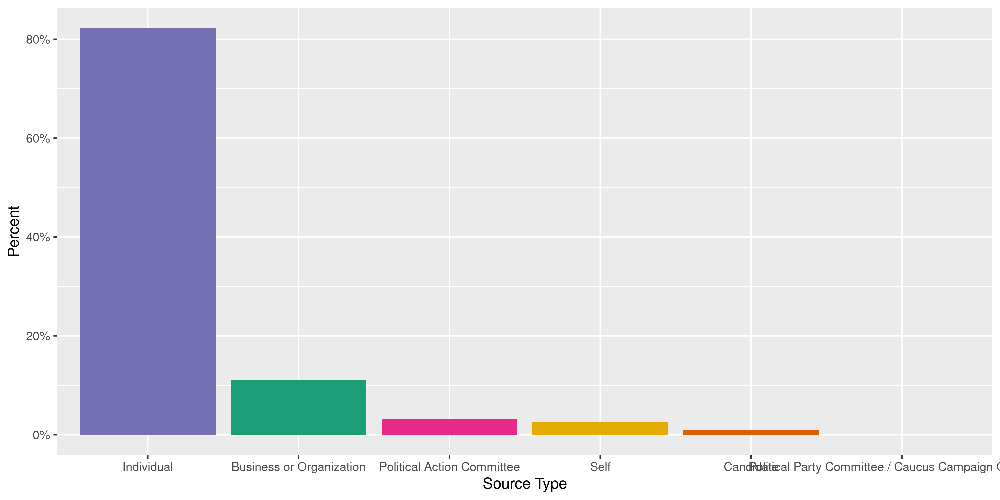
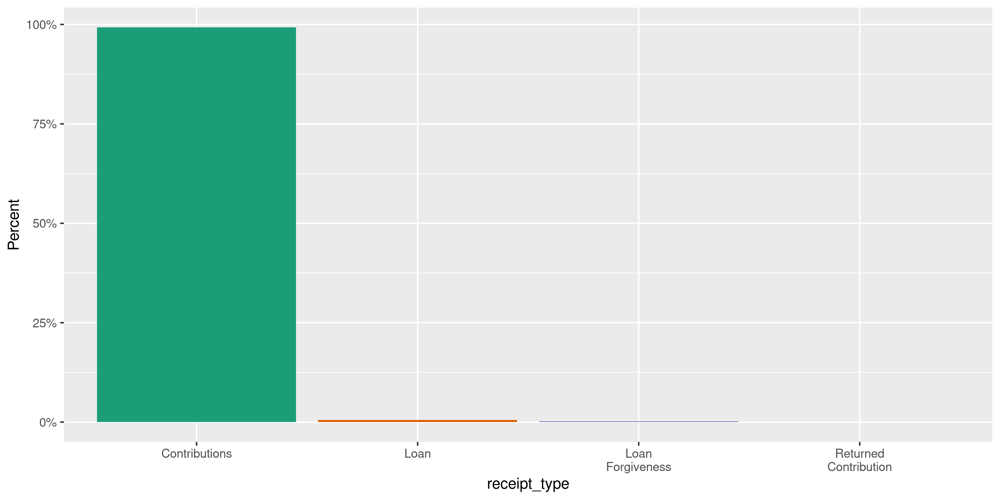
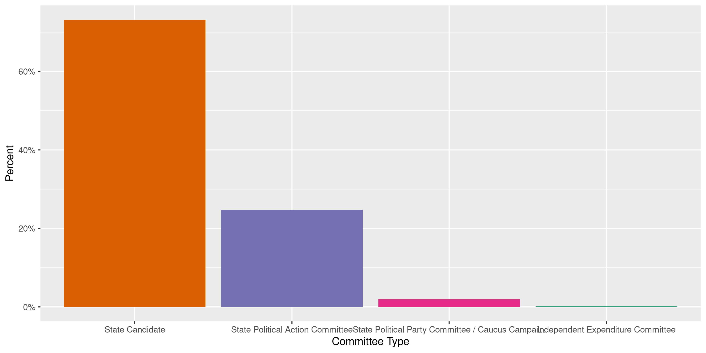
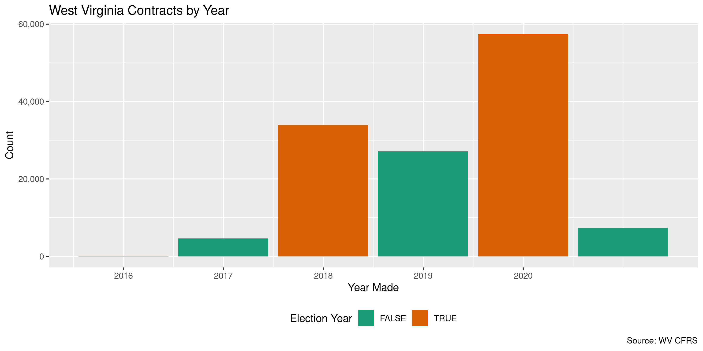
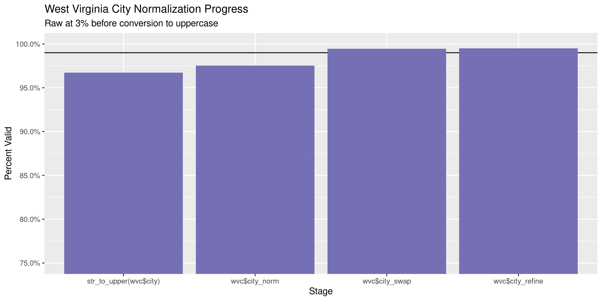
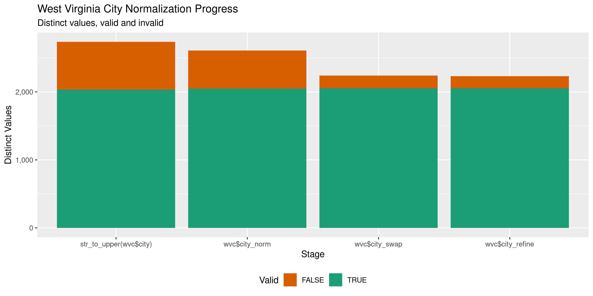

West Virginia Contracts
================
Kiernan Nicholls
2021-09-29 15:47:36

-   [Project](#project)
-   [Objectives](#objectives)
-   [Packages](#packages)
-   [Data](#data)
-   [Dictionary](#dictionary)
-   [Download](#download)
-   [Read](#read)
-   [Explore](#explore)
-   [Wrangle](#wrangle)
-   [Conclude](#conclude)
-   [Export](#export)
-   [Upload](#upload)
-   [Dictionary](#dictionary-1)

<!-- Place comments regarding knitting here -->

## Project

The Accountability Project is an effort to cut across data silos and
give journalists, policy professionals, activists, and the public at
large a simple way to search across huge volumes of public data about
people and organizations.

Our goal is to standardize public data on a few key fields by thinking
of each dataset row as a transaction. For each transaction there should
be (at least) 3 variables:

1.  All **parties** to a transaction.
2.  The **date** of the transaction.
3.  The **amount** of money involved.

## Objectives

This document describes the process used to complete the following
objectives:

1.  How many records are in the database?
2.  Check for entirely duplicated records.
3.  Check ranges of continuous variables.
4.  Is there anything blank or missing?
5.  Check for consistency issues.
6.  Create a five-digit ZIP Code called `zip`.
7.  Create a `year` field from the transaction date.
8.  Make sure there is data on both parties to a transaction.

## Packages

The following packages are needed to collect, manipulate, visualize,
analyze, and communicate these results. The `pacman` package will
facilitate their installation and attachment.

The IRW’s `campfin` package will also have to be installed from GitHub.
This package contains functions custom made to help facilitate the
processing of campaign finance data.

``` r
if (!require("pacman")) install.packages("pacman")
pacman::p_load_gh("irworkshop/campfin")
pacman::p_load(
  tidyverse, # data manipulation
  lubridate, # datetime strings
  gluedown, # printing markdown
  magrittr, # pipe operators
  janitor, # clean data frames
  batman, # parse logicals
  refinr, # cluster and merge
  scales, # format strings
  knitr, # knit documents
  vroom, # read files fast
  rvest, # html scraping
  glue, # combine strings
  here, # relative paths
  httr2, # http requests
  httr, # http requests
  fs # local storage 
)
```

This document should be run as part of the `R_campfin` project, which
lives as a sub-directory of the more general, language-agnostic
[`irworkshop/accountability_datacleaning`](https://github.com/irworkshop/accountability_datacleaning)
GitHub repository.

The `R_campfin` project uses the [RStudio
projects](https://support.rstudio.com/hc/en-us/articles/200526207-Using-Projects)
feature and should be run as such. The project also uses the dynamic
`here::here()` tool for file paths relative to *your* machine.

``` r
# where does this document knit?
here::here()
#> [1] "/home/kiernan/Documents/accountability_datacleaning/R_tap"
```

## Data

Contributions data can be obtained in bulk from the West Virginia
Secretary of State [Campaign Finance Reporting System
(CFRS)](https://cfrs.wvsos.gov/index.html#/index). Each record contains
information on a contribution made to a candidate or committee. The CFRS
also provides a [record layout
PDF](https://cfrs.wvsos.gov/CFIS_APIService/Template/KeyDownloads/Contributions%20and%20Loans%20File%20Layout%20Key.pdf),
which we have converted to a text file.

## Dictionary

``` r
key_path <- here("wv", "contribs", "record_layout.csv")
(dict_md <- kable(read_csv(key_path)))
```

| Field Position | Field Name                          | Description                                                                                                                          |
|---------------:|:------------------------------------|:-------------------------------------------------------------------------------------------------------------------------------------|
|              1 | `ORG ID`                            | This is the unique ID of the recipient candidate or committee.                                                                       |
|              2 | `RECEIPT AMOUNT`                    | Receipt Amount                                                                                                                       |
|              3 | `RECEIPT DATE`                      | Receipt Date                                                                                                                         |
|              4 | `LAST NAME`                         | Last Name of Receipt Source, if an individual person. If not an individual, the entity full name will be in LAST NAME field.         |
|              5 | `FIRST NAME`                        | Receipt Source First Name                                                                                                            |
|              6 | `MIDDLE NAME`                       | Receipt Source Middle Initial or Name if provided.                                                                                   |
|              7 | `SUFFIX`                            | Receipt Source Name Suffix                                                                                                           |
|              8 | `ADDRESS 1`                         | Receipt Source Street, PO Box, or other directional information                                                                      |
|              9 | `ADDRESS 2`                         | Receipt Source Suite/Apartment number, or other directional information                                                              |
|             10 | `CITY`                              | Receipt Source City                                                                                                                  |
|             11 | `STATE`                             | Receipt Source State                                                                                                                 |
|             12 | `ZIP`                               | Receipt Source Zip Code                                                                                                              |
|             13 | `Description`                       | NA                                                                                                                                   |
|             14 | `RECEIPT ID`                        | This is the Receipt internal ID. This ID is unique.                                                                                  |
|             15 | `FILED DATE`                        | Receipt Filed Date                                                                                                                   |
|             16 | `RECEIPT SOURCE TYPE`               | Type of entity that is the source of the Receipt.                                                                                    |
|             17 | `AMENDED`                           | Y/N indicator to show if an amendment was filed for this record.                                                                     |
|             18 | `RECEIPT TYPE`                      | This is the Receipt Type.                                                                                                            |
|             19 | `COMMITTEE TYPE`                    | The type of Committee.                                                                                                               |
|             20 | `COMMITTEE NAME`                    | This is the name of the recipient committee.                                                                                         |
|             21 | `CANDIDATE NAME`                    | This is the name of the recipient candidate.                                                                                         |
|             22 | `EMPLOYER`                          | Receipt Source’s employer displays in cases where this information is provided. Only used for Individual contributors.               |
|             23 | `OCCUPATION`                        | The Receipt Source’s occupation in cases where this information is provided. Only used for Individual contributors .                 |
|             24 | `OCCUPATION COMMENT`                | This is the receipt source’s occupation description if ‘Other’ is chosen for the occupation. Only used for Individual contributors . |
|             25 | `FORGIVEN LOAN`                     | NA                                                                                                                                   |
|             26 | `RELATED FUNDRAISER EVENT DATE`     | Date of fundraiser event, if the contribution was related to a fundraiser.                                                           |
|             27 | `RELATED FUNDRAISER EVENT TYPE`     | Type of fundraiser event, if the contribution was related to a fundraiser.                                                           |
|             28 | `RELATED FUNDRAISER PLACE OF EVENT` | Name of venue or location where the fundraiser event took place, if the contribution was related to a fundraiser.                    |
|             29 | `REPORT NAME`                       | Indicates Name of the Report                                                                                                         |
|             30 | `CONTRIBUTION TYPE`                 | Indicates Type of Contribution                                                                                                       |

``` r
write_lines(
  x = c("# West Virginia Contracts Data Dictionary\n", dict_md),
  file = here("wv", "contribs", "wv_contribs_dict.md"),
)
```

## Download

The files can be downloaded with an `httr::GET()` request to the CFRS
server.

``` r
raw_dir <- dir_create(here("wv", "contribs", "data", "raw"))
wv_api <- "https://cfrs.wvsos.gov/CFIS_APIService/api"
```

``` r
wv_ls <- request("https://cfrs.wvsos.gov/CFIS_APIService/api/") %>% 
  req_url_path_append("DataDownload", "GetCheckDatadownload") %>% 
  req_url_query(pageNumber = 1, pageSize = 50) %>% 
  req_perform() %>% 
  resp_body_json(
    check_type = FALSE,
    simplifyDataFrame = TRUE
  )
```

| TransactionKey          | ElectionYear | NameOfFile     | TransactionType |
|:------------------------|-------------:|:---------------|:----------------|
| Contributions and Loans |         2021 | `CON_2021.csv` | CON             |
| Expenditures            |         2021 | `EXP_2021.csv` | EXP             |
| Expenditures            |         2020 | `EXP_2020.csv` | EXP             |
| Contributions and Loans |         2020 | `CON_2020.csv` | CON             |
| Expenditures            |         2019 | `EXP_2019.csv` | EXP             |
| Contributions and Loans |         2019 | `CON_2019.csv` | CON             |
| Contributions and Loans |         2018 | `CON_2018.csv` | CON             |
| Expenditures            |         2018 | `EXP_2018.csv` | EXP             |

``` r
wv_ls <- wv_ls %>% 
  filter(TransactionType == "CON") %>% 
  mutate(FilePath = path(raw_dir, NameOfFile))
```

``` r
for (i in seq(nrow(wv_ls))) {
  message(wv_ls$NameOfFile[i])
  if (!file_exists(wv_ls$FilePath[i])) {
    request("https://cfrs.wvsos.gov/CFIS_APIService/api/") %>% 
      req_url_path_append("DataDownload", "GetCSVDownloadReport") %>% 
      req_url_query(
        year = wv_ls$ElectionYear[i],
        transactionType = wv_ls$TransactionType[i],
        reportFormat = "csv",
        fileName = wv_ls$NameOfFile[i]
      ) %>% 
      req_perform(path = wv_ls$FilePath[i])
  }
}
```

    #> # A tibble: 4 × 3
    #>   path                size modification_time  
    #>   <chr>        <fs::bytes> <dttm>             
    #> 1 CON_2021.csv       3.11M 2021-09-28 16:41:43
    #> 2 CON_2020.csv      14.02M 2021-09-28 16:41:52
    #> 3 CON_2019.csv       4.35M 2021-09-28 16:41:55
    #> 4 CON_2018.csv        8.4M 2021-09-28 16:42:00

## Read

While character columns are wrapped in double-quotes (`"`), any
double-quotes *within* those columns are not escaped in any way. We will
have to use regular expressions to replace them with single-quotes
(`'`).

``` r
fix_csv <- path_temp(basename(raw_csv))
for (i in seq_along(raw_csv)) {
  read_lines(raw_csv[i]) %>% 
    str_replace("Report$", "Report,") %>% 
    str_replace_all(",\"([A-z\\. ]+)\"[^,|\"]*", ",'\\1'") %>% 
    str_replace_all("\\s\"([A-z\\. ]+)\"[^,|\"]*", " '\\1'") %>% 
    str_replace_all("(?<!^|,)\"(?!,|$)", r"("""")") %>% 
    write_lines(fix_csv[i])
}
```

The fixed text files can be read into a single data frame.

``` r
wvc <- read_delim(
  file = fix_csv,
  delim = ",",
  escape_backslash = FALSE, 
  escape_double = TRUE,
  na = c("", " "),
  col_types = cols(
    .default = col_character(),
    `Receipt Amount` = col_double(),
    `Receipt Date` = col_date("%m/%d/%Y %H:%M:%S %p"),
    `Filed Date` = col_datetime("%m/%d/%Y %H:%M:%S %p"),
    `Fundraiser Event Date` = col_datetime("%m/%d/%Y %H:%M:%S %p")
  )
)
```

``` r
problems(wvc)
#> # A tibble: 15 × 5
#>      row   col expected   actual     file                        
#>    <int> <int> <chr>      <chr>      <chr>                       
#>  1 33120    29 30 columns 29 columns /tmp/RtmpEmdMma/CON_2020.csv
#>  2 33130    29 30 columns 29 columns /tmp/RtmpEmdMma/CON_2020.csv
#>  3 33144    29 30 columns 29 columns /tmp/RtmpEmdMma/CON_2020.csv
#>  4 33146    29 30 columns 29 columns /tmp/RtmpEmdMma/CON_2020.csv
#>  5 33147    29 30 columns 29 columns /tmp/RtmpEmdMma/CON_2020.csv
#>  6 33376    29 30 columns 29 columns /tmp/RtmpEmdMma/CON_2020.csv
#>  7 33379    29 30 columns 29 columns /tmp/RtmpEmdMma/CON_2020.csv
#>  8 35147    29 30 columns 29 columns /tmp/RtmpEmdMma/CON_2020.csv
#>  9 36122    29 30 columns 29 columns /tmp/RtmpEmdMma/CON_2020.csv
#> 10 36132    29 30 columns 29 columns /tmp/RtmpEmdMma/CON_2020.csv
#> 11 36233    29 30 columns 29 columns /tmp/RtmpEmdMma/CON_2020.csv
#> 12 36410    29 30 columns 29 columns /tmp/RtmpEmdMma/CON_2020.csv
#> 13 36461    29 30 columns 29 columns /tmp/RtmpEmdMma/CON_2020.csv
#> 14 36640    29 30 columns 29 columns /tmp/RtmpEmdMma/CON_2020.csv
#> 15  5467    29 30 columns 29 columns /tmp/RtmpEmdMma/CON_2021.csv
```

Column names can be converted to snake case and simplified.

``` r
wvc <- wvc %>% 
  clean_names("snake") %>% 
  mutate(across(c(amended, occupation_comment), to_logical))
```

We can check whether the files were properly read by counting the number
of distinct values in a discrete variable like the `contribution_type`.

``` r
count(wvc, contribution_type)
#> # A tibble: 5 × 2
#>   contribution_type                        n
#>   <chr>                                <int>
#> 1 In-Kind                               3383
#> 2 Monetary                            124037
#> 3 Other Income                          1504
#> 4 Receipt of Transfer of Excess Funds    554
#> 5 <NA>                                   952
```

## Explore

``` r
glimpse(wvc)
#> Rows: 130,430
#> Columns: 30
#> $ org_id                 <chr> "19", "24", "24", "24", "24", "24", "24", "24", "24", "24", "55", …
#> $ receipt_amount         <dbl> 217.79, 3.22, 3.33, 3.44, 3.44, 5.17, 7.73, 7.99, 7.99, 8.44, 40.0…
#> $ receipt_date           <date> 2020-11-02, 2021-06-30, 2021-04-30, 2021-03-31, 2021-05-31, 2021-…
#> $ last_name              <chr> "Howell", "WVCCU", "WVCCU", "WVCCU", "WVCCU", "WVCCU", "WVCCU", "W…
#> $ first_name             <chr> "Gary", NA, NA, NA, NA, NA, NA, NA, NA, NA, "John", "Michael", "Ja…
#> $ middle_name            <chr> "G", NA, NA, NA, NA, NA, NA, NA, NA, NA, NA, "E", NA, "J", NA, NA,…
#> $ suffix                 <chr> NA, NA, NA, NA, NA, NA, NA, NA, NA, NA, NA, NA, NA, NA, NA, NA, NA…
#> $ address1               <chr> "PO Box 39", "1306 Murdoch Ave", "1306 Murdoch Ave", NA, "1306 Mur…
#> $ address2               <chr> NA, NA, NA, NA, NA, NA, NA, NA, NA, NA, NA, NA, NA, NA, NA, NA, NA…
#> $ city                   <chr> "Keyser", "Parkersburg", "Parkersburg", NA, "Parkersburg", NA, "Pa…
#> $ state                  <chr> "WV", "WV", "WV", "ME", "WV", "ME", "WV", "WV", "ME", "WV", "ME", …
#> $ zip                    <chr> "26726", "26101", "26101", NA, "26101", NA, "26101", "26101", NA, …
#> $ description            <chr> NA, "Interest", "Interest", "Interest", "Interest", "Interest", "I…
#> $ receipt_id             <chr> "301122", "317450", "317448", "310000", "317449", "309998", "30085…
#> $ filed_date             <dttm> 2021-01-07 13:11:35, 2021-08-02 16:29:57, 2021-08-02 16:29:57, 20…
#> $ receipt_source_type    <chr> "Individual", "Business or Organization", "Business or Organizatio…
#> $ amended                <lgl> FALSE, FALSE, FALSE, FALSE, FALSE, FALSE, FALSE, FALSE, FALSE, FAL…
#> $ receipt_type           <chr> "Contributions", "Contributions", "Contributions", "Contributions"…
#> $ committee_type         <chr> "State Candidate", "State Candidate", "State Candidate", "State Ca…
#> $ committee_name         <chr> NA, NA, NA, NA, NA, NA, NA, NA, NA, NA, NA, NA, NA, NA, NA, NA, NA…
#> $ candidate_name         <chr> "Gary G. Howell", "Lissa Lucas", "Lissa Lucas", "Lissa Lucas", "Li…
#> $ employer               <chr> NA, NA, NA, NA, NA, NA, NA, NA, NA, NA, NA, NA, NA, "retired", "As…
#> $ occupation             <chr> NA, NA, NA, NA, NA, NA, NA, NA, NA, NA, NA, NA, NA, "Retired", "Ot…
#> $ occupation_comment     <lgl> FALSE, FALSE, FALSE, FALSE, FALSE, FALSE, FALSE, FALSE, FALSE, FAL…
#> $ forgiven_loan          <chr> NA, NA, NA, NA, NA, NA, NA, NA, NA, NA, NA, NA, NA, NA, NA, NA, NA…
#> $ fundraiser_event_date  <dttm> NA, NA, NA, NA, NA, NA, NA, NA, NA, NA, NA, NA, NA, NA, NA, NA, N…
#> $ fundraiser_event_type  <chr> NA, NA, NA, NA, NA, NA, NA, NA, NA, NA, NA, NA, NA, NA, NA, NA, NA…
#> $ fundraiser_event_place <chr> NA, NA, NA, NA, NA, NA, NA, NA, NA, NA, NA, NA, NA, NA, NA, NA, NA…
#> $ report_name            <chr> "2020 4th Quarter Report", "2021 2nd Quarter Report", "2021 2nd Qu…
#> $ contribution_type      <chr> "Monetary", "Other Income", "Other Income", "Other Income", "Other…
tail(wvc)
#> # A tibble: 6 × 30
#>   org_id receipt_amount receipt_date last_name      first_name middle_name suffix address1 address2
#>   <chr>           <dbl> <date>       <chr>          <chr>      <chr>       <chr>  <chr>    <chr>   
#> 1 40776            500  2018-11-05   Coca-Cola      <NA>       <NA>        <NA>   4100 Co… <NA>    
#> 2 40776           1000  2018-11-01   Adams          Richard    <NA>        <NA>   53 Mead… <NA>    
#> 3 40776           1200  2018-10-30   Azinger        Thomas     Albert      <NA>   1310 7t… <NA>    
#> 4 40776           2300  2018-10-18   Azinger        Thomas     Albert      <NA>   1310 7t… <NA>    
#> 5 42375           4778. 2018-12-12   Roger Shuttle… <NA>       <NA>        <NA>   331 Tom… <NA>    
#> 6 42375           5000  2016-07-16   Roger Shuttle… <NA>       <NA>        <NA>   331 Tom… <NA>    
#> # … with 21 more variables: city <chr>, state <chr>, zip <chr>, description <chr>,
#> #   receipt_id <chr>, filed_date <dttm>, receipt_source_type <chr>, amended <lgl>,
#> #   receipt_type <chr>, committee_type <chr>, committee_name <chr>, candidate_name <chr>,
#> #   employer <chr>, occupation <chr>, occupation_comment <lgl>, forgiven_loan <chr>,
#> #   fundraiser_event_date <dttm>, fundraiser_event_type <chr>, fundraiser_event_place <chr>,
#> #   report_name <chr>, contribution_type <chr>
```

### Missing

Columns range in their degree of missing values.

``` r
col_stats(wvc, count_na)
#> # A tibble: 30 × 4
#>    col                    class       n       p
#>    <chr>                  <chr>   <int>   <dbl>
#>  1 org_id                 <chr>       0 0      
#>  2 receipt_amount         <dbl>       0 0      
#>  3 receipt_date           <date>      0 0      
#>  4 last_name              <chr>    3481 0.0267 
#>  5 first_name             <chr>   18650 0.143  
#>  6 middle_name            <chr>  112356 0.861  
#>  7 suffix                 <chr>  128202 0.983  
#>  8 address1               <chr>   61943 0.475  
#>  9 address2               <chr>  127226 0.975  
#> 10 city                   <chr>   61207 0.469  
#> 11 state                  <chr>       0 0      
#> 12 zip                    <chr>   61629 0.473  
#> 13 description            <chr>  125277 0.960  
#> 14 receipt_id             <chr>       0 0      
#> 15 filed_date             <dttm>      0 0      
#> 16 receipt_source_type    <chr>       0 0      
#> 17 amended                <lgl>       0 0      
#> 18 receipt_type           <chr>       0 0      
#> 19 committee_type         <chr>       0 0      
#> 20 committee_name         <chr>  130430 1      
#> 21 candidate_name         <chr>   38439 0.295  
#> 22 employer               <chr>   77848 0.597  
#> 23 occupation             <chr>   84454 0.648  
#> 24 occupation_comment     <lgl>       0 0      
#> 25 forgiven_loan          <chr>  130430 1      
#> 26 fundraiser_event_date  <dttm> 106611 0.817  
#> 27 fundraiser_event_type  <chr>  106774 0.819  
#> 28 fundraiser_event_place <chr>  106611 0.817  
#> 29 report_name            <chr>       0 0      
#> 30 contribution_type      <chr>     952 0.00730
```

We should flag any record missing a key variable, those needed to
identify a transaction and all parties, with `campfin::flag_na()`.

After combining these rows, we have no records missing key variables.

``` r
key_vars <- c("receipt_date", "last_name", "receipt_amount", "candidate_name")
```

``` r
wvc <- flag_na(wvc, all_of(key_vars))
mean(wvc$na_flag)
#> [1] 0.31837
```

### Duplicates

We can also flag records that are entirely duplicated across every row,
save for the supposedly unique `id`.

``` r
wvc <- flag_dupes(wvc, -receipt_id)
percent(mean(wvc$dupe_flag), 0.01)
#> [1] "1.40%"
```

``` r
wvc %>% 
  filter(dupe_flag) %>% 
  select(all_of(key_vars)) %>% 
  arrange(receipt_date)
#> # A tibble: 1,827 × 4
#>    receipt_date last_name         receipt_amount candidate_name
#>    <date>       <chr>                      <dbl> <chr>         
#>  1 2017-04-04   Douglas  McKinney            100 <NA>          
#>  2 2017-04-04   Douglas  McKinney            100 <NA>          
#>  3 2017-04-10   Trickett                     100 <NA>          
#>  4 2017-04-10   Trickett                     100 <NA>          
#>  5 2017-04-23   Totten                        25 <NA>          
#>  6 2017-04-23   Totten                        25 <NA>          
#>  7 2017-07-18   Floyd                          5 <NA>          
#>  8 2017-07-18   Floyd                          5 <NA>          
#>  9 2017-08-21   Tarr                        1000 Ryan Ferns    
#> 10 2017-08-21   Tarr                        1000 Ryan Ferns    
#> # … with 1,817 more rows
```

### Categorical

``` r
col_stats(wvc, n_distinct)
#> # A tibble: 32 × 4
#>    col                    class       n          p
#>    <chr>                  <chr>   <int>      <dbl>
#>  1 org_id                 <chr>    1140 0.00874   
#>  2 receipt_amount         <dbl>    5238 0.0402    
#>  3 receipt_date           <date>   1574 0.0121    
#>  4 last_name              <chr>   25991 0.199     
#>  5 first_name             <chr>    6914 0.0530    
#>  6 middle_name            <chr>     780 0.00598   
#>  7 suffix                 <chr>       8 0.0000613 
#>  8 address1               <chr>   24672 0.189     
#>  9 address2               <chr>     689 0.00528   
#> 10 city                   <chr>    3130 0.0240    
#> 11 state                  <chr>      72 0.000552  
#> 12 zip                    <chr>    4024 0.0309    
#> 13 description            <chr>    2337 0.0179    
#> 14 receipt_id             <chr>  130429 1.00      
#> 15 filed_date             <dttm>   6573 0.0504    
#> 16 receipt_source_type    <chr>       7 0.0000537 
#> 17 amended                <lgl>       1 0.00000767
#> 18 receipt_type           <chr>       4 0.0000307 
#> 19 committee_type         <chr>       4 0.0000307 
#> 20 committee_name         <chr>       1 0.00000767
#> 21 candidate_name         <chr>     673 0.00516   
#> 22 employer               <chr>    9562 0.0733    
#> 23 occupation             <chr>      34 0.000261  
#> 24 occupation_comment     <lgl>       1 0.00000767
#> 25 forgiven_loan          <chr>       1 0.00000767
#> 26 fundraiser_event_date  <dttm>    621 0.00476   
#> 27 fundraiser_event_type  <chr>     303 0.00232   
#> 28 fundraiser_event_place <chr>     877 0.00672   
#> 29 report_name            <chr>      61 0.000468  
#> 30 contribution_type      <chr>       5 0.0000383 
#> 31 na_flag                <lgl>       2 0.0000153 
#> 32 dupe_flag              <lgl>       2 0.0000153
```

<!-- --><!-- --><!-- --><!-- --><!-- -->

### Amounts

``` r
wvc$receipt_amount <- round(wvc$receipt_amount, digits = 2)
```

The range of contribution amounts seems reasonable.

``` r
noquote(map_chr(summary(wvc$receipt_amount), dollar))
#>       Min.    1st Qu.     Median       Mean    3rd Qu.       Max. 
#>      $0.01     $20.20        $50    $560.94       $250 $1,000,000
sum(wvc$receipt_amount <= 0.01)
#> [1] 77
```

Here is the largest contribution of $1,000,000:

``` r
glimpse(wvc[which.max(wvc$receipt_amount), ])
#> Rows: 1
#> Columns: 32
#> $ org_id                 <chr> "26155"
#> $ receipt_amount         <dbl> 1e+06
#> $ receipt_date           <date> 2020-07-06
#> $ last_name              <chr> "WV State Building & Construction Trades Council"
#> $ first_name             <chr> NA
#> $ middle_name            <chr> NA
#> $ suffix                 <chr> NA
#> $ address1               <chr> "600 Leon Sullivan Way"
#> $ address2               <chr> NA
#> $ city                   <chr> "Charleston"
#> $ state                  <chr> "WV"
#> $ zip                    <chr> "25301"
#> $ description            <chr> NA
#> $ receipt_id             <chr> "253475"
#> $ filed_date             <dttm> 2020-10-07 09:18:16
#> $ receipt_source_type    <chr> "Business or Organization"
#> $ amended                <lgl> FALSE
#> $ receipt_type           <chr> "Contributions"
#> $ committee_type         <chr> "Independent Expenditure Committee"
#> $ committee_name         <chr> NA
#> $ candidate_name         <chr> NA
#> $ employer               <chr> NA
#> $ occupation             <chr> NA
#> $ occupation_comment     <lgl> FALSE
#> $ forgiven_loan          <chr> NA
#> $ fundraiser_event_date  <dttm> NA
#> $ fundraiser_event_type  <chr> NA
#> $ fundraiser_event_place <chr> NA
#> $ report_name            <chr> "2020 3rd Quarter Report"
#> $ contribution_type      <chr> "Monetary"
#> $ na_flag                <lgl> TRUE
#> $ dupe_flag              <lgl> FALSE
```

<!-- -->

### Dates

We can add the calendar year from `receipt_date` with
`lubridate::year()`

``` r
wvc <- mutate(wvc, receipt_year = year(receipt_date))
```

The range of dates is completely normal.

``` r
min(wvc$receipt_date)
#> [1] "2016-03-01"
sum(wvc$receipt_year < 2016)
#> [1] 0
max(wvc$receipt_date)
#> [1] "2021-06-30"
sum(wvc$receipt_date > today())
#> [1] 0
```

<!-- -->

## Wrangle

To improve the searchability of the database, we will perform some
consistent, confident string normalization. For geographic variables
like city names and ZIP codes, the corresponding `campfin::normal_*()`
functions are tailor made to facilitate this process.

### Address

For the street `addresss` variable, the `campfin::normal_address()`
function will force consistence case, remove punctuation, and abbreviate
official USPS suffixes.

``` r
addr_norm <- wvc %>%
  distinct(address1, address2) %>% 
  mutate(
    norm_address1 = normal_address(
      address = address1,
      abbs = usps_street,
      na_rep = TRUE
    ),
    norm_address2 = normal_address(
      address = address2,
      abbs = usps_street,
      na_rep = TRUE,
      abb_end = FALSE
    )
  ) %>% 
  unite(
    col = address_norm,
    starts_with("norm_address"),
    sep = " ",
    remove = TRUE,
    na.rm = TRUE
  ) %>% 
  mutate(across(address_norm, na_if, ""))
```

``` r
sample_n(addr_norm, 10)
#> # A tibble: 10 × 3
#>    address1              address2 address_norm        
#>    <chr>                 <chr>    <chr>               
#>  1 205 1st Ave S         <NA>     205 1ST AVE S       
#>  2 650 Rich Hollow Rd.   <NA>     650 RICH HOLLOW RD  
#>  3 1074 MOUNT VERON RD   <NA>     1074 MOUNT VERON RD 
#>  4 600 Club Cir          <NA>     600 CLUB CIR        
#>  5 268 Osborne Ave       <NA>     268 OSBORNE AVE     
#>  6 1111 East Village Dr. <NA>     1111 EAST VILLAGE DR
#>  7 1611 Speedway Ave     <NA>     1611 SPEEDWAY AVE   
#>  8 1515 Thomas Circle    <NA>     1515 THOMAS CIR     
#>  9 1200 Front Street     <NA>     1200 FRONT ST       
#> 10 832 Walters Rd        <NA>     832 WALTERS RD
```

``` r
wvc <- left_join(wvc, addr_norm)
```

### ZIP

For ZIP codes, the `campfin::normal_zip()` function will attempt to
create valid *five* digit codes by removing the ZIP+4 suffix and
returning leading zeroes dropped by other programs like Microsoft Excel.

``` r
wvc <- wvc %>% 
  mutate(
    zip_norm = normal_zip(
      zip = zip,
      na_rep = TRUE
    )
  )
```

``` r
progress_table(
  wvc$zip,
  wvc$zip_norm,
  compare = valid_zip
)
#> # A tibble: 2 × 6
#>   stage        prop_in n_distinct prop_na n_out n_diff
#>   <chr>          <dbl>      <dbl>   <dbl> <dbl>  <dbl>
#> 1 wvc$zip        0.969       4024   0.473  2156    832
#> 2 wvc$zip_norm   0.996       3396   0.473   269    143
```

### State

Valid two digit state abbreviations can be made using the
`campfin::normal_state()` function.

``` r
wvc <- wvc %>% 
  mutate(
    state_norm = normal_state(
      state = state,
      abbreviate = TRUE,
      na_rep = TRUE,
      valid = valid_state
    )
  )
```

``` r
wvc %>% 
  filter(state != state_norm) %>% 
  count(state, state_norm, sort = TRUE)
#> # A tibble: 19 × 3
#>    state state_norm     n
#>    <chr> <chr>      <int>
#>  1 wv    WV           463
#>  2 Wv    WV            73
#>  3 dc    DC            42
#>  4 tx    TX            29
#>  5 wV    WV            25
#>  6 ca    CA            21
#>  7 ky    KY            18
#>  8 mA    MA             9
#>  9 ny    NY             8
#> 10 ma    MA             6
#> 11 vA    VA             4
#> 12 md    MD             3
#> 13 Ok    OK             3
#> 14 co    CO             2
#> 15 in    IN             2
#> 16 oh    OH             2
#> 17 va    VA             2
#> 18 il    IL             1
#> 19 nC    NC             1
```

``` r
progress_table(
  wvc$state,
  wvc$state_norm,
  compare = valid_state
)
#> # A tibble: 2 × 6
#>   stage          prop_in n_distinct    prop_na n_out n_diff
#>   <chr>            <dbl>      <dbl>      <dbl> <dbl>  <dbl>
#> 1 wvc$state        0.995         72 0            715     20
#> 2 wvc$state_norm   1             53 0.00000767     0      1
```

### City

Cities are the most difficult geographic variable to normalize, simply
due to the wide variety of valid cities and formats.

#### Normal

The `campfin::normal_city()` function is a good start, again converting
case, removing punctuation, but *expanding* USPS abbreviations. We can
also remove `invalid_city` values.

``` r
norm_city <- wvc %>% 
  distinct(city, state_norm, zip_norm) %>% 
  mutate(
    city_norm = normal_city(
      city = city, 
      abbs = usps_city,
      states = c("WV", "DC", "WEST VIRGINIA"),
      na = invalid_city,
      na_rep = TRUE
    )
  )
```

#### Swap

We can further improve normalization by comparing our normalized value
against the *expected* value for that record’s state abbreviation and
ZIP code. If the normalized value is either an abbreviation for or very
similar to the expected value, we can confidently swap those two.

``` r
norm_city <- norm_city %>% 
  rename(city_raw = city) %>% 
  left_join(
    y = zipcodes,
    by = c(
      "state_norm" = "state",
      "zip_norm" = "zip"
    )
  ) %>% 
  rename(city_match = city) %>% 
  mutate(
    match_abb = is_abbrev(city_norm, city_match),
    match_dist = str_dist(city_norm, city_match),
    city_swap = if_else(
      condition = !is.na(match_dist) & (match_abb | match_dist == 1),
      true = city_match,
      false = city_norm
    )
  ) %>% 
  select(
    -city_match,
    -match_dist,
    -match_abb
  )
```

``` r
wvc <- left_join(
  x = wvc,
  y = norm_city,
  by = c(
    "city" = "city_raw", 
    "state_norm", 
    "zip_norm"
  )
)
```

#### Refine

The [OpenRefine](https://openrefine.org/) algorithms can be used to
group similar strings and replace the less common versions with their
most common counterpart. This can greatly reduce inconsistency, but with
low confidence; we will only keep any refined strings that have a valid
city/state/zip combination.

``` r
good_refine <- wvc %>% 
  mutate(
    city_refine = city_swap %>% 
      key_collision_merge() %>% 
      n_gram_merge(numgram = 1)
  ) %>% 
  filter(city_refine != city_swap) %>% 
  inner_join(
    y = zipcodes,
    by = c(
      "city_refine" = "city",
      "state_norm" = "state",
      "zip_norm" = "zip"
    )
  )
```

    #> # A tibble: 13 × 5
    #>    state_norm zip_norm city_swap       city_refine       n
    #>    <chr>      <chr>    <chr>           <chr>         <int>
    #>  1 WV         25303    SO CHARLESTON   CHARLESTON       15
    #>  2 WV         25311    EAST CHARLESTON CHARLESTON        5
    #>  3 WV         25309    SO CHARLESTON   CHARLESTON        4
    #>  4 WV         26416    PHILLIPI        PHILIPPI          3
    #>  5 CA         94118    SAN FRANSCISO   SAN FRANCISCO     2
    #>  6 WV         25301    EAST CHARLESTON CHARLESTON        2
    #>  7 WV         26845    OIL FIELDS      OLD FIELDS        2
    #>  8 NC         28231    CHAROLETTE      CHARLOTTE         1
    #>  9 WV         24970    RONCERVERT      RONCEVERTE        1
    #> 10 WV         25414    CHARLESTON TOWN CHARLES TOWN      1
    #> 11 WV         25701    HUNGINTON       HUNTINGTON        1
    #> 12 WV         25826    CORRINE         CORINNE           1
    #> 13 WV         26501    MORGNTANTOWN    MORGANTOWN        1

Then we can join the refined values back to the database.

``` r
wvc <- wvc %>% 
  left_join(good_refine) %>% 
  mutate(city_refine = coalesce(city_refine, city_swap))
```

#### Progress

Our goal for normalization was to increase the proportion of city values
known to be valid and reduce the total distinct values by correcting
misspellings.

| stage                    | prop\_in | n\_distinct | prop\_na | n\_out | n\_diff |
|:-------------------------|---------:|------------:|---------:|-------:|--------:|
| `str_to_upper(wvc$city)` |    0.967 |        2737 |    0.469 |   2271 |     702 |
| `wvc$city_norm`          |    0.975 |        2608 |    0.470 |   1715 |     560 |
| `wvc$city_swap`          |    0.994 |        2241 |    0.470 |    385 |     187 |
| `wvc$city_refine`        |    0.995 |        2230 |    0.470 |    353 |     177 |

You can see how the percentage of valid values increased with each
stage.

<!-- -->

More importantly, the number of distinct values decreased each stage. We
were able to confidently change many distinct invalid values to their
valid equivalent.

<!-- -->

Before exporting, we can remove the intermediary normalization columns
and rename all added variables with the `_clean` suffix.

``` r
wvc <- wvc %>% 
  select(
    -city_norm,
    -city_swap,
    city_clean = city_refine
  ) %>% 
  rename_all(~str_replace(., "_norm", "_clean")) %>% 
  rename_all(~str_remove(., "_raw")) %>% 
  relocate(address_clean, city_clean, state_clean, .before = zip_clean)
```

## Conclude

``` r
glimpse(sample_n(wvc, 50))
#> Rows: 50
#> Columns: 37
#> $ org_id                 <chr> "2202", "2265", "92", "2202", "1885", "48832", "17", "99783", "20"…
#> $ receipt_amount         <dbl> 7.33, 40.00, 500.00, 7.60, 275.00, 10.00, 200.00, 100000.00, 50.00…
#> $ receipt_date           <date> 2019-05-01, 2020-06-25, 2017-10-04, 2017-11-01, 2019-08-27, 2021-…
#> $ last_name              <chr> "Witt", "Stephen G. Roberts", "Michele C. Crites", "jeffery a spra…
#> $ first_name             <chr> "Timothy", "Stephen", "Michele", "jeffery", NA, "Enrique", "Daniel…
#> $ middle_name            <chr> NA, "G.", "C.", "a", NA, NA, NA, NA, "Daye", "L.", NA, NA, NA, NA,…
#> $ suffix                 <chr> NA, NA, NA, NA, NA, NA, NA, NA, NA, NA, NA, NA, NA, NA, NA, NA, NA…
#> $ address1               <chr> NA, "1624 Kanawha Boulevard East", "471 Point Dr.", NA, NA, "1946 …
#> $ address2               <chr> NA, NA, NA, NA, NA, NA, NA, "Suite 800", NA, NA, NA, NA, NA, NA, N…
#> $ city                   <chr> NA, "Charleston", "Petersburg", NA, NA, "Charleston", NA, "Washing…
#> $ state                  <chr> "ME", "WV", "WV", "ME", "ME", "WV", "ME", "DC", "ME", "ME", "ME", …
#> $ zip                    <chr> NA, "25311", "26847", NA, NA, "25314", NA, "20006", NA, NA, NA, "2…
#> $ description            <chr> NA, NA, NA, NA, NA, NA, NA, NA, NA, NA, NA, NA, NA, NA, NA, NA, NA…
#> $ receipt_id             <chr> "122062", "244527", "287", "45592", "141956", "313934", "10735", "…
#> $ filed_date             <dttm> 2019-07-02 17:02:09, 2020-07-08 09:55:28, 2018-04-05 00:00:00, 20…
#> $ receipt_source_type    <chr> "Individual", "Individual", "Individual", "Individual", "Business …
#> $ amended                <lgl> FALSE, FALSE, FALSE, FALSE, FALSE, FALSE, FALSE, FALSE, FALSE, FAL…
#> $ receipt_type           <chr> "Contributions", "Contributions", "Contributions", "Contributions"…
#> $ committee_type         <chr> "State Political Action Committee", "State Political Action Commit…
#> $ committee_name         <chr> NA, NA, NA, NA, NA, NA, NA, NA, NA, NA, NA, NA, NA, NA, NA, NA, NA…
#> $ candidate_name         <chr> NA, NA, "Robert Karnes", NA, NA, "Patrick Morrisey", "John R. Kell…
#> $ employer               <chr> NA, "WV Chamber of Commerce", "Allegheny Wood Products", NA, NA, "…
#> $ occupation             <chr> NA, "General Business", "Other", NA, NA, "Business Owner", NA, NA,…
#> $ occupation_comment     <lgl> FALSE, FALSE, FALSE, FALSE, FALSE, FALSE, FALSE, FALSE, FALSE, FAL…
#> $ forgiven_loan          <chr> NA, NA, NA, NA, NA, NA, NA, NA, NA, NA, NA, NA, NA, NA, NA, NA, NA…
#> $ fundraiser_event_date  <dttm> NA, NA, NA, NA, NA, NA, NA, NA, NA, NA, NA, 2018-09-14 04:00:00, …
#> $ fundraiser_event_type  <chr> NA, NA, NA, NA, NA, NA, NA, NA, NA, NA, NA, "Fundraiser", NA, NA, …
#> $ fundraiser_event_place <chr> NA, NA, NA, NA, NA, NA, NA, NA, NA, NA, NA, "Nanners Fundraiser", …
#> $ report_name            <chr> "2019 2nd Quarter Report", "2020 2nd Quarter Report", "Primary-Fir…
#> $ contribution_type      <chr> "Monetary", "Monetary", "Monetary", "Monetary", "Monetary", "Monet…
#> $ na_flag                <lgl> TRUE, TRUE, FALSE, TRUE, TRUE, FALSE, FALSE, TRUE, FALSE, TRUE, FA…
#> $ dupe_flag              <lgl> FALSE, FALSE, FALSE, FALSE, FALSE, FALSE, FALSE, FALSE, FALSE, FAL…
#> $ receipt_year           <dbl> 2019, 2020, 2017, 2017, 2019, 2021, 2018, 2020, 2018, 2020, 2020, …
#> $ address_clean          <chr> NA, "1624 KANAWHA BOULEVARD E", "471 POINT DR", NA, NA, "1946 KANA…
#> $ city_clean             <chr> NA, "CHARLESTON", "PETERSBURG", NA, NA, "CHARLESTON", NA, "WASHING…
#> $ state_clean            <chr> "ME", "WV", "WV", "ME", "ME", "WV", "ME", "DC", "ME", "ME", "ME", …
#> $ zip_clean              <chr> NA, "25311", "26847", NA, NA, "25314", NA, "20006", NA, NA, NA, "2…
```

1.  There are 130,430 records in the database.
2.  There are 1,827 duplicate records in the database.
3.  The range and distribution of `amount` and `date` seem reasonable.
4.  There are 41,525 records missing key variables.
5.  Consistency in geographic data has been improved with
    `campfin::normal_*()`.
6.  The 4-digit `year` variable has been created with
    `lubridate::year()`.

## Export

Now the file can be saved on disk for upload to the Accountability
server.

``` r
clean_dir <- dir_create(here("wv", "contribs", "data", "clean"))
clean_path <- path(clean_dir, "wv_contribs_20160301-20210630.csv")
write_csv(wvc, clean_path, na = "")
(clean_size <- file_size(clean_path))
#> 32.8M
```

## Upload

We can use the `aws.s3::put_object()` to upload the text file to the IRW
server.

``` r
aws_path <- path("csv", basename(clean_path))
if (!object_exists(aws_path, "publicaccountability")) {
  put_object(
    file = clean_path,
    object = aws_path, 
    bucket = "publicaccountability",
    acl = "public-read",
    show_progress = TRUE,
    multipart = TRUE
  )
}
aws_head <- head_object(aws_path, "publicaccountability")
(aws_size <- as_fs_bytes(attr(aws_head, "content-length")))
unname(aws_size == clean_size)
```

## Dictionary

The following table describes the variables in our final exported file:

| Column                   | Type        | Definition |
|:-------------------------|:------------|:-----------|
| `org_id`                 | `character` |            |
| `receipt_amount`         | `double`    |            |
| `receipt_date`           | `double`    |            |
| `last_name`              | `character` |            |
| `first_name`             | `character` |            |
| `middle_name`            | `character` |            |
| `suffix`                 | `character` |            |
| `address1`               | `character` |            |
| `address2`               | `character` |            |
| `city`                   | `character` |            |
| `state`                  | `character` |            |
| `zip`                    | `character` |            |
| `description`            | `character` |            |
| `receipt_id`             | `character` |            |
| `filed_date`             | `double`    |            |
| `receipt_source_type`    | `character` |            |
| `amended`                | `logical`   |            |
| `receipt_type`           | `character` |            |
| `committee_type`         | `character` |            |
| `committee_name`         | `character` |            |
| `candidate_name`         | `character` |            |
| `employer`               | `character` |            |
| `occupation`             | `character` |            |
| `occupation_comment`     | `logical`   |            |
| `forgiven_loan`          | `character` |            |
| `fundraiser_event_date`  | `double`    |            |
| `fundraiser_event_type`  | `character` |            |
| `fundraiser_event_place` | `character` |            |
| `report_name`            | `character` |            |
| `contribution_type`      | `character` |            |
| `na_flag`                | `logical`   |            |
| `dupe_flag`              | `logical`   |            |
| `receipt_year`           | `double`    |            |
| `address_clean`          | `character` |            |
| `city_clean`             | `character` |            |
| `state_clean`            | `character` |            |
| `zip_clean`              | `character` |            |
