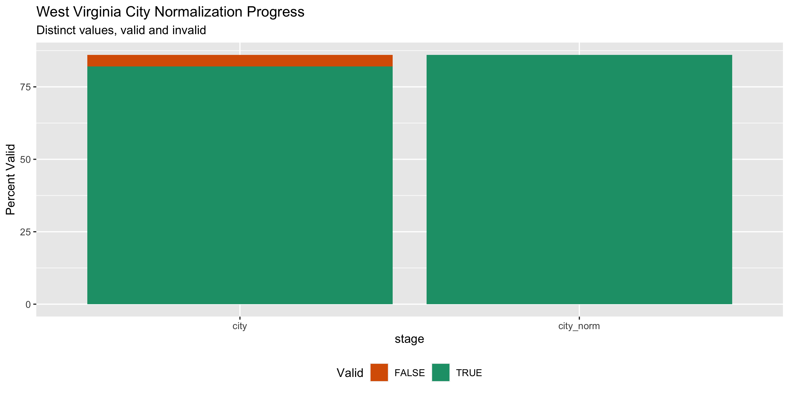

West Virginia Lobbying Registration Diary
================
Yanqi Xu
2020-04-23 14:50:38

  - [Project](#project)
  - [Objectives](#objectives)
  - [Packages](#packages)
  - [Data](#data)
  - [Import](#import)
  - [Explore](#explore)
  - [Wrangle](#wrangle)
  - [Conclude](#conclude)
  - [Export](#export)
  - [Dictionary](#dictionary)

<!-- Place comments regarding knitting here -->

## Project

The Accountability Project is an effort to cut across data silos and
give journalists, policy professionals, activists, and the public at
large a simple way to search across huge volumes of public data about
people and organizations.

Our goal is to standardizing public data on a few key fields by thinking
of each dataset row as a transaction. For each transaction there should
be (at least) 3 variables:

1.  All **parties** to a transaction.
2.  The **date** of the transaction.
3.  The **amount** of money involved.

## Objectives

This document describes the process used to complete the following
objectives:

1.  How many records are in the database?
2.  Check for entirely duplicated records.
3.  Check ranges of continuous variables.
4.  Is there anything blank or missing?
5.  Check for consistency issues.
6.  Create a five-digit ZIP Code called `zip`.
7.  Create a `year` field from the transaction date.
8.  Make sure there is data on both parties to a transaction.

## Packages

The following packages are needed to collect, manipulate, visualize,
analyze, and communicate these results. The `pacman` package will
facilitate their installation and attachment.

The IRW’s `campfin` package will also have to be installed from GitHub.
This package contains functions custom made to help facilitate the
processing of campaign finance data.

``` r
if (!require("pacman")) install.packages("pacman")
pacman::p_load_current_gh("irworkshop/campfin")
pacman::p_load(
  readxl, # read excel files
  rvest, # used to scrape website and get html elements
  tidyverse, # data manipulation
  stringdist, # calculate distances between strings
  lubridate, # datetime strings
  magrittr, # pipe opperators
  janitor, # dataframe clean
  refinr, # cluster and merge
  scales, # format strings
  knitr, # knit documents
  vroom, # read files fast
  httr, # http queries
  glue, # combine strings
  here, # relative storage
  fs, # search storage 
  gluedown # generate dictionary
)
```

This document should be run as part of the `R_campfin` project, which
lives as a sub-directory of the more general, language-agnostic
[`irworkshop/accountability_datacleaning`](https://github.com/irworkshop/accountability_datacleaning)
GitHub repository.

The `R_campfin` project uses the [Rstudio
projects](https://support.rstudio.com/hc/en-us/articles/200526207-Using-Projects "Rproj")
feature and should be run as such. The project also uses the dynamic
`here::here()` tool for file paths relative to *your* machine.

``` r
# where does this document knit?
here::here()
#> [1] "/Users/yanqixu/code/accountability_datacleaning/R_campfin"
```

## Data

Lobbyist data is obtained via a public record request from the \[West
Virginia State Ethics Commission\]\[03\]. The data was obtained on April
9, 2020.

It is a list of all current lobbyists for the 2019-2020 session.

According to the [West Virginia State Ethics
Commission](https://ethics.wv.gov/lobbyist/Pages/Registration.aspx),

> Lobbyists may register at any time. Registration must be completed
> before lobbying begins. Lobbyist registration cycles consist of
> two-year periods, and all lobbyist registrations expire at the end of
> each even-numbered year.

## Import

### Setting up Raw Data Directory

``` r
raw_dir <- dir_create(here("wv", "lobby", "data", "raw","reg"))
```

### Read

``` r
wvlr <- dir_ls(raw_dir) %>% read_xlsx() %>% 
  clean_names() %>% 
  mutate_if(is.character, str_to_upper)
```

## Explore

``` r
head(wvlr)
#> # A tibble: 6 x 8
#>   lobbyist_name  address_line1 address_line2 city_state_zip phone_primary email topics  represents 
#>   <chr>          <chr>         <chr>         <chr>          <chr>         <chr> <chr>   <chr>      
#> 1 ADKINS, DONNIE 1410 ROBIN H… <NA>          CHARLESTON, W… (304) 731-31… DONN… MANUFA… MANUFACTUR…
#> 2 ADKINS, J. MA… BOWLES RICE,… 600 QUARRIER… CHARLESTON, W… (304) 347-17… MADK… ADVERT… COMMUNITY …
#> 3 ADLER, JONATH… 2026 KANAWHA… <NA>          CHARLESTON, W… (304) 549-05… JONA… COUNTY… ASSN. OF C…
#> 4 AILES, JOHN    209 CAPITOL … <NA>          CHARLESTON, W… (304) 345-65… JAIL… MISCEL… NOT AFFILI…
#> 5 ALBERT, FRED   1615 WASHING… SUITE 300     CHARLESTON, W… (304) 344-26… FALB… EDUCAT… AFT-WV (AM…
#> 6 ALLEN, LOREN   3601 MACCORK… SUITE 100     CHARLESTON, W… (304) 343-88… LALL… BANKIN… BANKERS AS…
tail(wvlr)
#> # A tibble: 6 x 8
#>   lobbyist_name address_line1  address_line2  city_state_zip phone_primary email topics  represents
#>   <chr>         <chr>          <chr>          <chr>          <chr>         <chr> <chr>   <chr>     
#> 1 WYRICK, JARED PO BOX 2028    <NA>           CHARLESTON, W… (304) 887-72… JWYR… AUTOMO… AUTO & TR…
#> 2 YATES, MARVIN 515 KING STRE… SUITE 300      ALEXANDRIA, V… (703) 684-11… MYAT… SPORTS  NATIONAL …
#> 3 YAUSSY, DAVID SPILMAN THOMA… 300 KANAWHA B… CHARLESTON, W… (304) 340-38… DYAU… BUSINE… MANUFACTU…
#> 4 YOUNG, KAYLA  2207 WASHINGT… <NA>           CHARLESTON, W… (604) 561-42… HELL… AIR QU… ENVIRONME…
#> 5 ZLAJIC, SUSAN 1 S. DEARBORN… 19TH FLOOR     CHICAGO, IL 6… (312) 899-30… SUSA… ENERGY… ARCELORMI…
#> 6 ZUCKETT, GARY 1500 DIXIE ST… <NA>           CHARLESTON, W… (304) 346-58… GARY… ELECTI… CITIZEN A…
glimpse(sample_n(wvlr, 20))
#> Rows: 20
#> Columns: 8
#> $ lobbyist_name  <chr> "SWAFFORD, ERIC", "WILES, RONNIE", "KRUG, KIRSTEN", "MARR, CHRIS", "MANNI…
#> $ address_line1  <chr> "270 ARBOR POINTE TRAIL", "10351 VETERANS MEMORIAL HIGHWAY", "ONE LIBERTY…
#> $ address_line2  <chr> NA, NA, "1650 MARKET STREET, STE. 4303", NA, "SUITE 4303", NA, NA, "SUITE…
#> $ city_state_zip <chr> "DAYTON, TN 37321", "MASONTOWN, WV 26542", "PHILADELPHIA, PA 19103", "CHA…
#> $ phone_primary  <chr> "(423) 667-9473", "(304) 980-2084", "(215) 854-6036", "(304) 550-1849", "…
#> $ email          <chr> "ESWAFFORD@HUMANESOCIETY.ORG", "GOODNEWS.RON@GMAIL.COM", "KIRSTEN.E.KRUG@…
#> $ topics         <chr> "ANIMAL WELFARE", "NON-PROFIT", "FINANCIAL ISSUES/SERVICES", "ANIMAL WELF…
#> $ represents     <chr> "HUMANE SOCIETY/U.S.", "GOOD NEWS MOUNTAINEER GARAGE", "CITIGROUP GLOBAL …
```

### Missing

There’re almost no missing fields, except for one record missing
“represents”.

``` r
col_stats(wvlr, count_na)
#> # A tibble: 8 x 4
#>   col            class     n       p
#>   <chr>          <chr> <int>   <dbl>
#> 1 lobbyist_name  <chr>     0 0      
#> 2 address_line1  <chr>     0 0      
#> 3 address_line2  <chr>   227 0.609  
#> 4 city_state_zip <chr>     0 0      
#> 5 phone_primary  <chr>     1 0.00268
#> 6 email          <chr>     0 0      
#> 7 topics         <chr>     0 0      
#> 8 represents     <chr>     1 0.00268
```

### Duplicates

There’s no duplicate columns.

``` r
wvlr <- flag_dupes(wvlr, dplyr::everything())
```

## Wrangle

To improve the searchability of the database, we will perform some
consistent, confident string normalization. For geographic variables
like city names and ZIP codes, the corresponding `campfin::normal_*()`
functions are taylor made to facilitate this process.

### Year,

We’ll add a common `year` field which is the mos current year, 2020.

``` r
wvlr <-  wvlr %>% mutate(year = "2020")
```

### Phone

We can normalize the phone numbers.

``` r
wvlr <- wvlr %>% 
      mutate(phone_primary_norm = normal_phone(phone_primary))
```

### Address

For the street `addresss` variable, the `campfin::normal_address()`
function will force consistence case, remove punctuation, and
abbreviation official USPS suffixes.

``` r
wvlr <- wvlr %>% 
    # combine street addr
  unite(
    col =  address_full,
    starts_with("address"),
    sep = " ",
    remove = FALSE,
    na.rm = TRUE
  ) %>% 
    mutate(address_norm = normal_address(address_full,abbs = usps_street,
      na_rep = TRUE)) %>% 
  select(-ends_with("full"))
```

### Separate

We will first separate city, state and zip with regular expressions.
Afterwards, we will also normalize them using `campfin::normal_*()`
functions.

``` r
wvlr <- wvlr %>% 
  separate(col = city_state_zip, into = c("city", "state_zip"), sep = ", ", remove = FALSE) %>% 
  separate(col = state_zip, into = c("state", "zip"), sep = " ", remove = TRUE)
```

### ZIP

For ZIP codes, the `campfin::normal_zip()` function will attempt to
create valied *five* digit codes by removing the ZIP+4 suffix and
returning leading zeroes dropped by other programs like Microsoft Excel.

``` r
prop_in(wvlr$zip, valid_zip, na.rm = TRUE)
#> [1] 0.9919571
wvlr <- wvlr %>% 
    mutate(zip5 =normal_zip(zip))
prop_in(wvlr$zip5, valid_zip, na.rm = TRUE)
#> [1] 0.997319
```

### State

The state column is clean and doesn’t need to be normalized.

``` r
prop_in(wvlr$state, valid_state, na.rm = TRUE)
#> [1] 1
```

### City

Cities are the most difficult geographic variable to normalize, simply
due to the wide variety of valid cities and formats.

#### Normal

The `campfin::normal_city()` function is a good start, again converting
case, removing punctuation, but *expanding* USPS abbreviations. We can
also remove `invalid_city` values.

``` r
prop_in(wvlr$city, valid_city, na.rm = T)
#> [1] 0.9839142

wvlr <- wvlr %>% 
  mutate(city_norm = normal_city(city,abbs = usps_city,
                                 states = usps_state,
                                 na = invalid_city,
                                 na_rep = TRUE))
prop_in(wvlr$city_norm, valid_city, na.rm = T)
#> [1] 0.9946381
```

After the two normalization steps, the percentage of valid cities is at
100%. \#\#\#\# Progress

| stage      | prop\_in | n\_distinct | prop\_na | n\_out | n\_diff |
| :--------- | -------: | ----------: | -------: | -----: | ------: |
| city       |  0.98928 |          86 |        0 |      4 |       4 |
| city\_norm |  1.00000 |          86 |        0 |      0 |       0 |

You can see how the percentage of valid values increased with each
stage.

<!-- -->

More importantly, the number of distinct values decreased each stage. We
were able to confidently change many distinct invalid values to their
valid equiwvlrnt.

``` r
progress %>% 
  select(
    stage, 
    all = n_distinct,
    bad = n_diff
  ) %>% 
  mutate(good = all - bad) %>% 
  pivot_longer(c("good", "bad")) %>% 
  mutate(name = name == "good") %>% 
  ggplot(aes(x = stage, y = value)) +
  geom_col(aes(fill = name)) +
  scale_fill_brewer(palette = "Dark2", direction = -1) +
  scale_y_continuous(labels = comma) +
  theme(legend.position = "bottom") +
  labs(
    title = "West Virginia City Normalization Progress",
    subtitle = "Distinct values, valid and invalid",
    x = "stage",
    y = "Percent Valid",
    fill = "Valid"
  )
```

<!-- -->

## Conclude

``` r
glimpse(sample_n(wvlr, 20))
#> Rows: 20
#> Columns: 16
#> $ lobbyist_name      <chr> "SKELO, LANA", "FULKS, CAROL", "KOMINAR, STEVEN", "DOUGLASS, WILLIAM …
#> $ address_line1      <chr> "1615 H STREET NW", "PO BOX 1347", "P.O. BOX 753", "146 CHARLES FORK …
#> $ address_line2      <chr> NA, NA, NA, NA, NA, NA, NA, NA, NA, "600 QUARRIER STREET", "SUITE 405…
#> $ city_state_zip     <chr> "WASHINGTON, DC 20062", "CHARLESTON, WV 25325", "KERMIT, WV 25674", "…
#> $ city               <chr> "WASHINGTON", "CHARLESTON", "KERMIT", "SPENCER", "RICHMOND", "TALLAHA…
#> $ state              <chr> "DC", "WV", "WV", "WV", "VA", "FL", "AL", "CA", "WV", "WV", "WV", "WV…
#> $ zip                <chr> "20062", "25325", "25674", "25276", "23230", "32302", "36080", "94107…
#> $ phone_primary      <chr> "(202) 463-5724", "(304) 345-1588", "(304) 784-2149", "(304) 783-8340…
#> $ email              <chr> "LSKELO@USCHAMBER.COM", "CAROL@FULKSANDASSOCIATES.COM", "STEVEKOMINAR…
#> $ topics             <chr> "LEGAL REFORM", "ADVERTISING/MARKETING; BUSINESS ISSUES; FIRST AMENDM…
#> $ represents         <chr> "U.S. CHAMBER INSTITUTE FOR LEGAL REFORM", "BREEDERS CLASSICS/WV; CHA…
#> $ year               <chr> "2020", "2020", "2020", "2020", "2020", "2020", "2020", "2020", "2020…
#> $ phone_primary_norm <chr> "(202) 463-5724", "(304) 345-1588", "(304) 784-2149", "(304) 783-8340…
#> $ address_norm       <chr> "1615 H ST NW", "PO BOX 1347", "PO BOX 753", "146 CHARLES FRK RD", "6…
#> $ zip5               <chr> "20062", "25325", "25674", "25276", "23230", "32302", "36080", "94107…
#> $ city_norm          <chr> "WASHINGTON", "CHARLESTON", "KERMIT", "SPENCER", "RICHMOND", "TALLAHA…
```

1.  There are 373 records in the database.
2.  There’s no duplicate record in the database.
3.  The range and distribution of `amount` and `date` seem reasonable.
4.  There are 0 records missing either recipient or date.
5.  Consistency in goegraphic data has been improved with
    `campfin::normal_*()`.

## Export

``` r
clean_dir <- dir_create(here("wv", "lobby", "data", "processed","exp"))
```

``` r
wvlr <- wvlr %>% 
  rename(city_clean = city_norm)

write_csv(
  x = wvlr,
  path = path(clean_dir, "wv_lob_reg_clean.csv"),
  na = ""
)
```

## Dictionary

| Column               | Type    | Definition                                                |
| :------------------- | :------ | :-------------------------------------------------------- |
| `lobbyist_name`      | `<chr>` | Original Field                                            |
| `address_line1`      | `<chr>` | Original Field                                            |
| `address_line2`      | `<chr>` | Original Field                                            |
| `city_state_zip`     | `<chr>` | City field extracted from`city_state_zip`                 |
| `city`               | `<chr>` | State field extracted from`city_state_zip`                |
| `state`              | `<chr>` | Zip field extracted from`city_state_zip`                  |
| `zip`                | `<chr>` | Original Field                                            |
| `phone_primary`      | `<chr>` | Original Field                                            |
| `email`              | `<chr>` | Original Field                                            |
| `topics`             | `<chr>` | Original Field                                            |
| `represents`         | `<chr>` | The latest year in the current lobbying cycle             |
| `year`               | `<chr>` | Normalized primary phone numbers from`phone_primary_norm` |
| `phone_primary_norm` | `<chr>` | Normalized combined street address                        |
| `address_norm`       | `<chr>` | Normalized 5-digit ZIP code                               |
| `zip5`               | `<chr>` | Normalized 2-digit state abbreviation                     |
| `city_clean`         | `<chr>` | Normalized city name                                      |

``` r
write_lines(
  x = c("# West Virginia Lobbying Registration Dictionary\n", dict_md),
  path = here("wv", "lobby", "wi_contribs_dict.md"),
)
```
