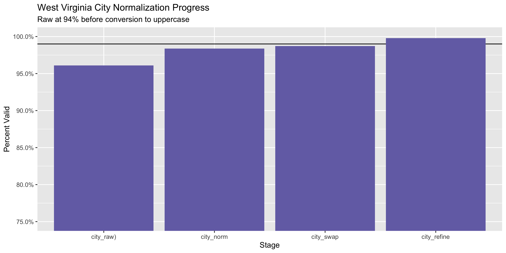

West Virginia Voter
================
Victor
2021-03-01 11:26:19

  - [Project](#project)
  - [Objectives](#objectives)
  - [Packages](#packages)
  - [Data](#data)
  - [Read](#read)
  - [Explore](#explore)
  - [Wrangle](#wrangle)
  - [Conclude](#conclude)
  - [Export](#export)
  - [Upload](#upload)
  - [Dictionary](#dictionary)

<!-- Place comments regarding knitting here -->

## Project

The Accountability Project is an effort to cut across data silos and
give journalists, policy professionals, activists, and the public at
large a simple way to search across huge volumes of public data about
people and organizations.

Our goal is to standardizing public data on a few key fields by thinking
of each dataset row as a transaction. For each transaction there should
be (at least) 3 variables:

1.  All **parties** to a transaction.
2.  The **date** of the transaction.
3.  The **amount** of money involved.

## Objectives

This document describes the process used to complete the following
objectives:

1.  How many records are in the database?
2.  Check for entirely duplicated records.
3.  Check ranges of continuous variables.
4.  Is there anything blank or missing?
5.  Check for consistency issues.
6.  Create a five-digit ZIP Code called `zip`.
7.  Create a `year` field from the transaction date.
8.  Make sure there is data on both parties to a transaction.

## Packages

The following packages are needed to collect, manipulate, visualize,
analyze, and communicate these results. The `pacman` package will
facilitate their installation and attachment.

The IRW’s `campfin` package will also have to be installed from GitHub.
This package contains functions custom made to help facilitate the
processing of campaign finance data.

``` r
if (!require("pacman")) install.packages("pacman")
pacman::p_load_gh("irworkshop/campfin")
pacman::p_load(
  tidyverse, # data manipulation
  lubridate, # datetime strings
  gluedown, # printing markdown
  magrittr, # pipe operators
  janitor, # clean data frames
  aws.s3, # upload to aws s3
  refinr, # cluster and merge
  scales, # format strings
  knitr, # knit documents
  vroom, # read files fast
  rvest, # html scraping
  glue, # combine strings
  here, # relative paths
  httr, # http requests
  fs # local storage 
)
```

This document should be run as part of the `R_campfin` project, which
lives as a sub-directory of the more general, language-agnostic
[`irworkshop/accountability_datacleaning`](https://github.com/irworkshop/accountability_datacleaning)
GitHub repository.

The `R_campfin` project uses the [RStudio
projects](https://support.rstudio.com/hc/en-us/articles/200526207-Using-Projects)
feature and should be run as such. The project also uses the dynamic
`here::here()` tool for file paths relative to *your* machine.

``` r
# where does this document knit?
here::here()
#> [1] "/Users/vbrewski/Documents/American Schoolwork/Work/accountability_datacleaning/R_tap/wv/voter/docs"
```

## Data

Voter data for the state of West Virginia was obtained via a zip file
download from the state’s data portal from the \[Secretary of State\]
but then extracted and made availableon our IRW database
(<https://publicaccountability.s3.amazonaws.com/public/PPP/InvestigatingReporting121620_wvvoters.zip>).
\#\# Extract

``` r
raw_dir <- dir_create(here("wv", "voter", "data", "raw"))
raw_zip <- path(raw_dir,"InvestigatingReporting121620_wvvoters.zip")
```

The ZIP archive itself contains a number of subsequent ZIP archives.

``` r
(zip_files <- raw_zip %>% 
  unzip(list = TRUE) %>% 
  as_tibble(.name_repair = tolower) %>% 
  mutate(across(length, as_fs_bytes)) %>% 
  mutate(across(name, as_fs_path)))
#> # A tibble: 1 x 3
#>   name                                  length date               
#>   <fs::path>                       <fs::bytes> <dttm>             
#> 1 InvestigatingReporting121620.txt        242M 2020-12-16 16:42:00
```

We can extract only the file containing the latest voter data. \#There
might not be a flag in here for overwrite

``` r
raw_path <- unzip(
  zipfile = raw_zip, 
  files = str_subset(zip_files$name,"^State"), 
  exdir = raw_dir,
  junkpaths = TRUE,
  overwrite = TRUE
)
```

``` r
length(raw_path) #Run this before code to see length before changes 
#> [1] 1
```

``` r
#
file_info(raw_path) %>% 
  group_by(size) %>% 
  slice(1)
#> # A tibble: 1 x 18
#>   path       type   size permissions modification_time   user  group device_id hard_links
#>   <fs::path> <fct> <fs:> <fs::perms> <dttm>              <chr> <chr>     <dbl>      <dbl>
#> 1 /Users/vb… file   242M rw-rw-rw-   2021-03-01 11:26:22 vbre… staff  16777220          1
#> # … with 9 more variables: special_device_id <dbl>, inode <dbl>, block_size <dbl>, blocks <dbl>,
#> #   flags <int>, generation <dbl>, access_time <dttm>, change_time <dttm>, birth_time <dttm>
```

``` r
file_info(raw_path) %>% # make table of file into
  group_by(size) %>% # group them by file size
  slice(1) %>% # keep only ONE of the same size
  pull(path) -> raw_path # pull the path column as vector
```

``` r
length(raw_path) #Run this after code to see if changes worked. 
#> [1] 1
```

## Read

The .txt file containing Voter data is not a fixed-width file (FWF) with
each column found at unique line position.

We can use this information in `readr::read_fwf()` to parse the text
file as a data frame for exploration.

``` r
wv <- read_delim(
  file = raw_path,
  delim = "|",
  escape_backslash = FALSE,
  escape_double = FALSE,
  quote = "",
  col_types = cols(
    .default = col_character(),
    `DATE OF BIRTH` = col_date("%m/%d/%Y %H:%M:%S"),
    `REGISTRATION DATE` = col_date("%m/%d/%Y %H:%M:%S")
  )
)
```

``` r
#wv <- wv %>%
  #mutate(
  #across(`REGISTRATION DATE`,
         #mdy)
#)
```

SnakeCase: Cleaning column names

``` r
#Making column names consistent
wv <- janitor::clean_names(wv)
```

## Explore

``` r
glimpse(wv)
#> Rows: 1,271,240
#> Columns: 29
#> $ county_name            <chr> "BARBOUR", "BARBOUR", "BARBOUR", "BARBOUR", "BARBOUR", "BARBOUR",…
#> $ id_voter               <chr> "000000004", "000000005", "000000011", "000000012", "000000015", …
#> $ last_name              <chr> "ABBOTT", "PHILLIPS", "ADAMS", "ADAMS", "ADAMS", "ADAMS", "ADAMS"…
#> $ first_name             <chr> "CLARE", "LILAH", "CHRISTINA", "EVERLYN", "JOHN", "LINDA", "MARTH…
#> $ mid                    <chr> "M", "LEA", "FAYE", "L", "R", "J", "V", "D", "LEE", "M", "DOUGLAS…
#> $ suffix                 <chr> NA, NA, NA, NA, NA, NA, NA, NA, NA, NA, NA, NA, NA, NA, NA, NA, N…
#> $ date_of_birth          <date> 1942-02-16, 1956-02-04, 1973-05-11, 1947-03-07, 1931-12-01, 1947…
#> $ sex                    <chr> "M", "F", "F", "M", "M", "F", "F", "M", "M", "F", "M", "M", "F", …
#> $ house_no               <chr> "5716", "124", "38", "115", "69", "115", "69", "151", "38", "69",…
#> $ street                 <chr> "ARDEN GRADE RD", "SHENANDOAH LN", "ELK ST", "LANDER RD", "COMMUN…
#> $ street2                <chr> NA, NA, NA, NA, NA, NA, NA, NA, NA, NA, NA, NA, NA, NA, NA, NA, N…
#> $ unit                   <chr> NA, NA, NA, NA, NA, NA, NA, NA, NA, NA, NA, NA, NA, NA, NA, NA, N…
#> $ city                   <chr> "MOATSVILLE", "PHILIPPI", "PHILIPPI", "PHILIPPI", "PHILIPPI", "PH…
#> $ state                  <chr> "WV", "WV", "WV", "WV", "WV", "WV", "WV", "WV", "WV", "WV", "WV",…
#> $ zip                    <chr> "26405", "26416", "26416", "26416", "26416", "26416", "26416", "2…
#> $ mail_street            <chr> "ARDEN GRADE RD", "SHENANDOAH LN", "ELK ST", "LANDER RD", "COMMUN…
#> $ mail_street2           <chr> NA, NA, NA, NA, NA, NA, NA, NA, NA, NA, NA, NA, NA, NA, NA, NA, N…
#> $ mail_unit              <chr> NA, NA, NA, NA, NA, NA, NA, NA, NA, NA, NA, NA, NA, NA, NA, NA, N…
#> $ mail_city              <chr> "MOATSVILLE", "PHILIPPI", "PHILIPPI", "PHILIPPI", "PHILIPPI", "PH…
#> $ mail_state             <chr> "WV", "WV", "WV", "WV", "WV", "WV", "WV", "WV", "WV", "WV", "WV",…
#> $ mail_zip               <chr> "26405", "26416", "26416", "26416", "26416", "26416", "26416", "2…
#> $ registration_date      <date> 1988-04-11, 1990-06-28, 2001-05-08, 1975-11-18, 1956-10-06, 1975…
#> $ status                 <chr> "Active", "Active", "Active", "Active", "Active", "Active", "Acti…
#> $ congressional_district <chr> "0001", "0001", "0001", "0001", "0001", "0001", "0001", "0001", "…
#> $ senatorial_district    <chr> "0014", "0014", "0014", "0014", "0014", "0014", "0014", "0014", "…
#> $ delegate_district      <chr> "0047", "0047", "0047", "0047", "0047", "0047", "0047", "0047", "…
#> $ magisterial_district   <chr> NA, "NORTH CENTRAL", "NORTH", "SOUTH EAST", NA, "SOUTH EAST", NA,…
#> $ precinct_number        <chr> "09", "11", "07", "07", "08", "07", "08", "08", "07", "07", "01",…
#> $ poll_name              <chr> "ARDEN-CLEMTOWN COMMUNITY CENTER", "PHILIPPI MIDDLE SCHOOL", "BAR…
tail(wv)
#> # A tibble: 6 x 29
#>   county_name id_voter last_name first_name mid   suffix date_of_birth sex   house_no street
#>   <chr>       <chr>    <chr>     <chr>      <chr> <chr>  <date>        <chr> <chr>    <chr> 
#> 1 WYOMING     1008634… REED      DANIEL     PAUL  <NA>   2002-06-27    M     84       MORGA…
#> 2 WYOMING     1008634… BROWN     COURTNEY   LEA   <NA>   2002-11-01    F     12098    POPLA…
#> 3 WYOMING     1008634… HOWERTON  KAYLA      NICO… <NA>   1994-08-03    F     1225     GUYAN…
#> 4 WYOMING     1008634… HASH      NATALI     GRACE <NA>   2003-08-07    F     87       WHISP…
#> 5 WYOMING     1008637… HATFIELD  LATHEA     EMIL… <NA>   2002-10-16    F     11       NARRO…
#> 6 WYOMING     1008642… WORKMAN   KELSEY     DANI… <NA>   1995-10-03    F     48       COALT…
#> # … with 19 more variables: street2 <chr>, unit <chr>, city <chr>, state <chr>, zip <chr>,
#> #   mail_street <chr>, mail_street2 <chr>, mail_unit <chr>, mail_city <chr>, mail_state <chr>,
#> #   mail_zip <chr>, registration_date <date>, status <chr>, congressional_district <chr>,
#> #   senatorial_district <chr>, delegate_district <chr>, magisterial_district <chr>,
#> #   precinct_number <chr>, poll_name <chr>
```

### Missing

Most columns are missing some amount of values; we can flag any records
missing one of the key variables needed to identify a transaction.

``` r
#Go across every column, count the number of NA rows per column and then calculate the % of NA 
col_stats(wv, count_na)
#> # A tibble: 29 x 4
#>    col                    class        n         p
#>    <chr>                  <chr>    <int>     <dbl>
#>  1 county_name            <chr>        0 0        
#>  2 id_voter               <chr>        0 0        
#>  3 last_name              <chr>        0 0        
#>  4 first_name             <chr>        0 0        
#>  5 mid                    <chr>    94356 0.0742   
#>  6 suffix                 <chr>  1209009 0.951    
#>  7 date_of_birth          <date>       0 0        
#>  8 sex                    <chr>   125106 0.0984   
#>  9 house_no               <chr>    55765 0.0439   
#> 10 street                 <chr>       17 0.0000134
#> 11 street2                <chr>  1223130 0.962    
#> 12 unit                   <chr>  1228755 0.967    
#> 13 city                   <chr>       13 0.0000102
#> 14 state                  <chr>       17 0.0000134
#> 15 zip                    <chr>     4550 0.00358  
#> 16 mail_street            <chr>   252933 0.199    
#> 17 mail_street2           <chr>  1252333 0.985    
#> 18 mail_unit              <chr>  1236743 0.973    
#> 19 mail_city              <chr>   253054 0.199    
#> 20 mail_state             <chr>   253650 0.200    
#> 21 mail_zip               <chr>   261780 0.206    
#> 22 registration_date      <date>       0 0        
#> 23 status                 <chr>        0 0        
#> 24 congressional_district <chr>      186 0.000146 
#> 25 senatorial_district    <chr>      186 0.000146 
#> 26 delegate_district      <chr>      186 0.000146 
#> 27 magisterial_district   <chr>   420318 0.331    
#> 28 precinct_number        <chr>        0 0        
#> 29 poll_name              <chr>        0 0
```

``` r
wv <- wv %>% flag_na(county_name, id_voter, last_name, first_name, date_of_birth, registration_date) #Creates a new column with trues and falses and puts a true on any row that's missing a variable ex. .5% of rows is missing one of those values. .5 is normal though - we only check for columns that are relevant to figuring out the information we need. 
mean(wv$na_flag) %>% #change this to sum to count the rows vs find %
  percent(0.01)
#> [1] "0.00%"
```

### Duplicates

There are only a handful of entirely duplicated records.

``` r
wv <- flag_dupes(wv, -id_voter, .check = F) #create another logical column that puts true's next to each row with duplicates 
sum(wv$dupe_flag)
#> [1] 46
```

``` r
dups <- wv %>% 
  filter(dupe_flag) %>% 
  select(county_name, id_voter, last_name, first_name, date_of_birth, registration_date) %>% 
  arrange(county_name, last_name, registration_date) 
```

### Categorical

``` r
col_stats(wv, n_distinct)
#> # A tibble: 31 x 4
#>    col                    class        n           p
#>    <chr>                  <chr>    <int>       <dbl>
#>  1 county_name            <chr>       55 0.0000433  
#>  2 id_voter               <chr>  1271240 1          
#>  3 last_name              <chr>    75434 0.0593     
#>  4 first_name             <chr>    44014 0.0346     
#>  5 mid                    <chr>    45250 0.0356     
#>  6 suffix                 <chr>      300 0.000236   
#>  7 date_of_birth          <date>   30407 0.0239     
#>  8 sex                    <chr>        6 0.00000472 
#>  9 house_no               <chr>    24392 0.0192     
#> 10 street                 <chr>    96215 0.0757     
#> 11 street2                <chr>    16964 0.0133     
#> 12 unit                   <chr>     5948 0.00468    
#> 13 city                   <chr>     1085 0.000853   
#> 14 state                  <chr>        7 0.00000551 
#> 15 zip                    <chr>     1057 0.000831   
#> 16 mail_street            <chr>   101035 0.0795     
#> 17 mail_street2           <chr>     8633 0.00679    
#> 18 mail_unit              <chr>     5302 0.00417    
#> 19 mail_city              <chr>     3417 0.00269    
#> 20 mail_state             <chr>       61 0.0000480  
#> 21 mail_zip               <chr>     3540 0.00278    
#> 22 registration_date      <date>   20671 0.0163     
#> 23 status                 <chr>        2 0.00000157 
#> 24 congressional_district <chr>        4 0.00000315 
#> 25 senatorial_district    <chr>       18 0.0000142  
#> 26 delegate_district      <chr>       68 0.0000535  
#> 27 magisterial_district   <chr>      122 0.0000960  
#> 28 precinct_number        <chr>      512 0.000403   
#> 29 poll_name              <chr>     1383 0.00109    
#> 30 na_flag                <lgl>        1 0.000000787
#> 31 dupe_flag              <lgl>        2 0.00000157
```

<!-- --><!-- -->

### Dates

We can add the calendar year from `registration_date` with
`lubridate::year()`

``` r
wv <- mutate(wv, year = year(registration_date), birth_year = year(date_of_birth))
```

There are 0 entries in Registration dates since the count was the exact
same as the number of rows. Maybe remove that column?

``` r
count_na(wv$registration_date)
#> [1] 0
min(wv$registration_date)
#> [1] "1800-01-01"
mean(wv$registration_date == "1900-01-01")
#> [1] 4.090494e-05
wv$registration_date[wv$registration_date == "1900-01-01"] <- NA
max(wv$registration_date)
#> [1] NA
```

``` r
min(wv$date_of_birth)
#> [1] "1800-01-01"
sum(wv$date_of_birth == "1900-01-01")
#> [1] 1
wv$date_of_birth[wv$date_of_birth == "1900-01-01"] <- NA
wv$date_of_birth[wv$date_of_birth == "1900-01-01"] <- NA
max(wv$date_of_birth, na.rm = TRUE)
#> [1] "2003-09-26"
```

<!-- -->

## Wrangle

To improve the searchability of the database, we will perform some
consistent, confident string normalization. For geographic variables
like city names and ZIP codes, the corresponding `campfin::normal_*()`
functions are tailor made to facilitate this process.

### Address

For the street `addresss` variable, the `campfin::normal_address()`
function will force consistence case, remove punctuation, and abbreviate
official USPS suffixes.

``` r
wv <- wv %>% 
  unite(
    col = address_full,
    house_no, street, street2, unit, 
    sep = " ",
    remove = FALSE,
    na.rm = TRUE
  ) %>% 
  mutate(
    address_norm = normal_address(
      address = address_full,
      abbs = usps_street,
      na_rep = TRUE
    )
  ) %>% select(-address_full)
  
```

``` r
wv %>% 
  select(house_no, street, street2, unit, address_norm) %>% 
  distinct() %>% 
  sample_n(10)
#> # A tibble: 10 x 5
#>    house_no street                   street2 unit    address_norm            
#>    <chr>    <chr>                    <chr>   <chr>   <chr>                   
#>  1 1578     STINSON RD               <NA>    <NA>    1578 STINSON RD         
#>  2 2546     NATIONAL RD              <NA>    APT 102 2546 NATIONAL RD APT 102
#>  3 158      DELTA PLACE              <NA>    <NA>    158 DELTA PLACE         
#>  4 37       CAMBRIDGE DR             <NA>    <NA>    37 CAMBRIDGE DR         
#>  5 381      FAIRWAY DR               <NA>    <NA>    381 FAIRWAY DR          
#>  6 119      EDITH LN                 <NA>    <NA>    119 EDITH LN            
#>  7 186      ELM STREET               <NA>    <NA>    186 ELM ST              
#>  8 210      HAMPSHIRE DR             <NA>    <NA>    210 HAMPSHIRE DR        
#>  9 1524     LEE ST E                 APT D   <NA>    1524 LEE ST E APT D     
#> 10 24       CHANKEY PEN BRANCH DRIVE <NA>    <NA>    24 CHANKEY PEN BR DR
```

### ZIP

For ZIP codes, the `campfin::normal_zip()` function will attempt to
create valid *five* digit codes by removing the ZIP+4 suffix and
returning leading zeroes dropped by other programs like Microsoft Excel.

``` r
wv <- wv %>% 
  mutate(
    zip_norm = normal_zip(
      zip = zip,
      na_rep = TRUE
    )
  )
```

``` r
progress_table(
  wv$zip,
  wv$zip_norm,
  compare = valid_zip
)
#> # A tibble: 2 x 6
#>   stage    prop_in n_distinct prop_na n_out n_diff
#>   <chr>      <dbl>      <dbl>   <dbl> <dbl>  <dbl>
#> 1 zip        0.999       1057 0.00358  1468    181
#> 2 zip_norm   0.999       1055 0.00361  1420    177
```

### State

Valid two digit state abbreviations can be made using the
`campfin::normal_state()` function.

``` r
wv <- wv %>% 
  mutate(
    state_norm = normal_state(
      state = state,
      abbreviate = TRUE,
      na_rep = TRUE,
      valid = valid_state
    )
  )
```

``` r
wv %>% 
  filter(state != state_norm) %>% 
  count(state, state_norm, sort = TRUE)
#> # A tibble: 1 x 3
#>   state state_norm     n
#>   <chr> <chr>      <int>
#> 1 Wv    WV             1
```

``` r
progress_table(
  wv$state,
  wv$state_norm,
  compare = valid_state
)
#> # A tibble: 2 x 6
#>   stage      prop_in n_distinct   prop_na n_out n_diff
#>   <chr>        <dbl>      <dbl>     <dbl> <dbl>  <dbl>
#> 1 state         1.00          7 0.0000134     2      3
#> 2 state_norm    1             5 0.0000142     0      1
```

### City

Cities are the most difficult geographic variable to normalize, simply
due to the wide variety of valid cities and formats.

#### Normal

The `campfin::normal_city()` function is a good start, again converting
case, removing punctuation, but *expanding* USPS abbreviations. We can
also remove `invalid_city` values.

``` r
wv <- wv %>% 
  mutate(
    city_norm = normal_city(
      city = city, 
      abbs = usps_city,
      states = c("WV", "DC", "WEST VIRGINIA"),
      na = invalid_city,
      na_rep = TRUE
    )
  )
```

#### Swap

We can further improve normalization by comparing our normalized value
against the *expected* value for that record’s state abbreviation and
ZIP code. If the normalized value is either an abbreviation for or very
similar to the expected value, we can confidently swap those two.

``` r
wv <- wv %>% 
  rename(city_raw = city) %>% 
  left_join(
    y = zipcodes,
    by = c(
      "state_norm" = "state",
      "zip_norm" = "zip"
    )
  ) %>% 
  rename(city_match = city) %>% 
  mutate(
    match_abb = is_abbrev(city_norm, city_match),
    match_dist = str_dist(city_norm, city_match),
    city_swap = if_else(
      condition = !is.na(match_dist) & (match_abb | match_dist == 1),
      true = city_match,
      false = city_norm
    )
  ) %>% 
  select(
    -city_match,
    -match_dist,
    -match_abb
  )
```

#### Refine

The [OpenRefine](https://openrefine.org/) algorithms can be used to
group similar strings and replace the less common versions with their
most common counterpart. This can greatly reduce inconsistency, but with
low confidence; we will only keep any refined strings that have a valid
city/state/zip combination.

``` r
good_refine <- wv %>% 
  mutate(
    city_refine = city_swap %>% 
      key_collision_merge() %>% 
      n_gram_merge(numgram = 1)
  ) %>% 
  filter(city_refine != city_swap) %>% 
  inner_join(
    y = zipcodes,
    by = c(
      "city_refine" = "city",
      "state_norm" = "state",
      "zip_norm" = "zip"
    )
  )
```

    #> # A tibble: 6 x 5
    #>   state_norm zip_norm city_swap     city_refine     n
    #>   <chr>      <chr>    <chr>         <chr>       <int>
    #> 1 WV         25309    SO CHARLESTON CHARLESTON   8450
    #> 2 WV         25303    SO CHARLESTON CHARLESTON   5085
    #> 3 WV         25302    SO CHARLESTON CHARLESTON      3
    #> 4 WV         25301    SO CHARLESTON CHARLESTON      1
    #> 5 WV         25313    SO CHARLESTON CHARLESTON      1
    #> 6 WV         25314    SO CHARLESTON CHARLESTON      1

Then we can join the refined values back to the database.

``` r
wv <- wv %>% 
  left_join(good_refine) %>% 
  mutate(city_refine = coalesce(city_refine, city_swap))
```

#### Progress

| stage        | prop\_in | n\_distinct | prop\_na | n\_out | n\_diff |
| :----------- | -------: | ----------: | -------: | -----: | ------: |
| city\_raw)   |    0.961 |        1068 |        0 |  49469 |     175 |
| city\_norm   |    0.984 |        1045 |        0 |  20514 |     145 |
| city\_swap   |    0.987 |        1045 |        0 |  16217 |     137 |
| city\_refine |    0.998 |        1045 |        0 |   2676 |     137 |

You can see how the percentage of valid values increased with each
stage.

<!-- -->

More importantly, the number of distinct values decreased each stage. We
were able to confidently change many distinct invalid values to their
valid equivalent.

<!-- -->

## Conclude

Before exporting, we can remove the intermediary normalization columns
and rename all added variables with the `_clean` suffix.

``` r
wv <- wv %>% 
  select(
    -city_norm,
    -city_swap,
    city_clean = city_refine
  ) %>% 
  rename_all(~str_replace(., "_norm", "_clean")) %>% 
  rename_all(~str_remove(., "_raw"))
```

``` r
glimpse(sample_n(wv, 50))
#> Rows: 50
#> Columns: 37
#> $ county_name            <chr> "RALEIGH", "PLEASANTS", "MARSHALL", "MORGAN", "RALEIGH", "MARION"…
#> $ id_voter               <chr> "100465588", "100397835", "100695730", "100737756", "002545065", …
#> $ last_name              <chr> "BLAKE", "BUNNER", "GUMP", "GATES", "SARVER", "MALONEY", "HERNDON…
#> $ first_name             <chr> "DENNIS", "MIRANDA", "TYLER", "NANCY", "NOAH", "STEPHEN", "CAITLI…
#> $ mid                    <chr> "EUGENE", "LEANN", "LANE", "MARIE", "L", "MICHAEL", NA, "GARVIN",…
#> $ suffix                 <chr> NA, NA, NA, NA, NA, NA, NA, NA, NA, NA, NA, NA, NA, NA, NA, NA, N…
#> $ date_of_birth          <date> 1955-02-02, 1980-12-14, 1994-09-28, 1955-01-01, 1944-10-19, 1952…
#> $ sex                    <chr> "M", "F", NA, "F", "M", "M", "F", "F", "F", "M", "M", "M", "M", "…
#> $ house_no               <chr> "184", "80", "6474", "141", "113", "239", "502", "213-D", "5112",…
#> $ street                 <chr> "HUNTER RIDGE ROAD", "SPRUCE RUN ROAD", "FAIRMONT PIKE ROAD", "GO…
#> $ street2                <chr> NA, NA, NA, NA, NA, NA, NA, NA, NA, NA, NA, NA, NA, NA, NA, NA, N…
#> $ unit                   <chr> NA, NA, NA, NA, NA, NA, NA, NA, NA, NA, NA, NA, NA, NA, NA, NA, N…
#> $ city                   <chr> "MT HOPE", "FRIENDLY", "MOUNDSVILLE", "BERKELEY SPRINGS", "CRAB O…
#> $ state                  <chr> "WV", "WV", "WV", "WV", "WV", "WV", "WV", "WV", "WV", "WV", "WV",…
#> $ zip                    <chr> "25880", "26146", "26041", "25411", "25827", "26571", "25313", "2…
#> $ mail_street            <chr> NA, "SPRUCE RUN ROAD", "FAIRMONT PIKE ROAD", "GO AWAY LANE", NA, …
#> $ mail_street2           <chr> NA, NA, NA, NA, NA, NA, NA, NA, NA, NA, NA, NA, NA, NA, NA, NA, N…
#> $ mail_unit              <chr> NA, NA, NA, NA, NA, NA, NA, NA, NA, NA, NA, NA, NA, NA, NA, NA, N…
#> $ mail_city              <chr> NA, "FRIENDLY", "MOUNDSVILLE", "BERKELEY SPRINGS", NA, "FARMINGTO…
#> $ mail_state             <chr> NA, "WV", "WV", "WV", NA, "WV", "WV", "WV", NA, "WV", "WV", "WV",…
#> $ mail_zip               <chr> NA, "26146", "26041", "25411", NA, "26571", "25313", "26505", NA,…
#> $ registration_date      <date> 2012-09-24, 2011-03-08, 2017-07-26, 2018-08-16, 1981-11-12, 2004…
#> $ status                 <chr> "Active", "Active", "Active", "Active", "Active", "Active", "Acti…
#> $ congressional_district <chr> "0003", "0001", "0001", "0002", "0003", "0001", "0002", "0001", "…
#> $ senatorial_district    <chr> "0009", "0003", "0002", "0015", "0009", "0002", "0008", "0013", "…
#> $ delegate_district      <chr> "0032", "0006", "0004", "0058", "0029", "0050", "0039", "0051", "…
#> $ magisterial_district   <chr> "02", "D", NA, "WEST MAG. DIST. 1", NA, NA, NA, "CENTRAL", "3", "…
#> $ precinct_number        <chr> "54", "07", "29", "06", "26", "053", "370", "36", "364", "09", "6…
#> $ poll_name              <chr> "BRADLEY ELEMENTARY SCHOOL", "ARVILLA", "SHERRARD MIDDLE SCHOOL",…
#> $ na_flag                <lgl> FALSE, FALSE, FALSE, FALSE, FALSE, FALSE, FALSE, FALSE, FALSE, FA…
#> $ dupe_flag              <lgl> FALSE, FALSE, FALSE, FALSE, FALSE, FALSE, FALSE, FALSE, FALSE, FA…
#> $ year                   <dbl> 2012, 2011, 2017, 2018, 1981, 2004, 2020, 1992, 1992, 2002, 1983,…
#> $ birth_year             <dbl> 1955, 1980, 1994, 1955, 1944, 1952, 1993, 1962, 1947, 1984, 1934,…
#> $ address_clean          <chr> "184 HUNTER RDG RD", "80 SPRUCE RUN RD", "6474 FAIRMONT PIKE RD",…
#> $ zip_clean              <chr> "25880", "26146", "26041", "25411", "25827", "26571", "25313", "2…
#> $ state_clean            <chr> "WV", "WV", "WV", "WV", "WV", "WV", "WV", "WV", "WV", "WV", "WV",…
#> $ city_clean             <chr> "MOUNT HOPE", "FRIENDLY", "MOUNDSVILLE", "BERKELEY SPRINGS", "CRA…
```

1.  There are 1,271,240 records in the database.
2.  There are 46 duplicate records in the database.
3.  The range and distribution of `amount` and `date` seem reasonable.
4.  There are 0 records missing key variables.
5.  Consistency in geographic data has been improved with
    `campfin::normal_*()`.
6.  The 4-digit `year` variable has been created with
    `lubridate::year()`.

## Export

Now the file can be saved on disk for upload to the Accountability
server.

``` r
clean_dir <- dir_create(here("wv", "voter", "data", "clean"))
clean_path <- path(clean_dir, "wv_voter_clean.csv")
write_csv(wv, clean_path, na = "")
file_size(clean_path)
#> 294M
non_ascii(clean_path)
#> # A tibble: 1 x 2
#>      row line                                                                                      
#>    <int> <chr>                                                                                     
#> 1 695202 MCDOWELL,000508337,JOHNS,FLORA,C,,1921-11-05,F,220<bd>,SUMMERS STREET,,,WELCH,WV,24801,SU…
```

## Upload

We can use the `aws.s3::put_object()` to upload the text file to the IRW
server.

``` r
s3_path <- path("csv", basename(clean_path))
if (!object_exists(s3_path, "publicaccountability")) {
  put_object(
    file = clean_path,
    object = s3_path, 
    bucket = "publicaccountability",
    acl = "public-read",
    show_progress = TRUE
  )
}
```

``` r
#as_fs_bytes(object_size(s3_path, "publicaccountability"))
```

## Dictionary

The following table describes the variables in our final exported file:

| Column                   | Type        | Definition                                                                                                                                        |
| :----------------------- | :---------- | :------------------------------------------------------------------------------------------------------------------------------------------------ |
| `county_name`            | `character` | County that the vote was registered in                                                                                                            |
| `id_voter`               | `character` | Unique voter ID used to identify a voter                                                                                                          |
| `last_name`              | `character` | The voters full name last name                                                                                                                    |
| `first_name`             | `character` | The voters full name first name                                                                                                                   |
| `mid`                    | `character` | The voters full name middle name                                                                                                                  |
| `suffix`                 | `character` | The voters full name suffix                                                                                                                       |
| `date_of_birth`          | `double`    | The voters DOB                                                                                                                                    |
| `sex`                    | `character` | The sex of the voter                                                                                                                              |
| `house_no`               | `character` | The house number of the voters mailing address                                                                                                    |
| `street`                 | `character` | The Street Address of the voters mailing address                                                                                                  |
| `street2`                | `character` | The 2nd part of an adress (if there is a PO box or apt number) of the voters mailing address                                                      |
| `unit`                   | `character` | The unit number (if living in an apartment) of the voters mailing address                                                                         |
| `city`                   | `character` | Normalized city name                                                                                                                              |
| `state`                  | `character` | Normalized 2-digit state abbreviation                                                                                                             |
| `zip`                    | `character` | 5-digit ZIP code                                                                                                                                  |
| `mail_street`            | `character` | (Mail delivered to somewhere else they don’t live at)The Street Address of the voters mailing address                                             |
| `mail_street2`           | `character` | (Mail delivered to somewhere else they don’t live at)The 2nd part of an adress (if there is a PO box or apt number) of the voters mailing address |
| `mail_unit`              | `character` | (Mail delivered to somewhere else they don’t live at)The unit number (if living in an apartment) of the voters mailing address                    |
| `mail_city`              | `character` | (Mail delivered to somewhere else they don’t live at) Normalized city name                                                                        |
| `mail_state`             | `character` | (Mail delivered to somewhere else they don’t live at) Normalized 2-digit state abbreviation                                                       |
| `mail_zip`               | `character` | (Mail delivered to somewhere else they don’t live at) 5-digit ZIP code                                                                            |
| `registration_date`      | `double`    | The date that the voter registered to vote                                                                                                        |
| `status`                 | `character` | The voter status when voting                                                                                                                      |
| `congressional_district` | `character` | The congressional district of this voter                                                                                                          |
| `senatorial_district`    | `character` | The senatorial district of this voter                                                                                                             |
| `delegate_district`      | `character` | The delegate district of this voter                                                                                                               |
| `magisterial_district`   | `character` | Legal district of magistrate court                                                                                                                |
| `precinct_number`        | `character` | Voting precinct number                                                                                                                            |
| `poll_name`              | `character` | Polling place within voting precinct                                                                                                              |
| `na_flag`                | `logical`   | Flag for missing date, amount, or name                                                                                                            |
| `dupe_flag`              | `logical`   | Flag for completely duplicated record                                                                                                             |
| `year`                   | `double`    | Normalized year                                                                                                                                   |
| `birth_year`             | `double`    | Normalized birth year                                                                                                                             |
| `address_clean`          | `character` | Normalized combined street address                                                                                                                |
| `zip_clean`              | `character` | The cleaned normalized zip file from the original data                                                                                            |
| `state_clean`            | `character` | normalized clean 2 letter state variable                                                                                                          |
| `city_clean`             | `character` | normalized clean city variable                                                                                                                    |
