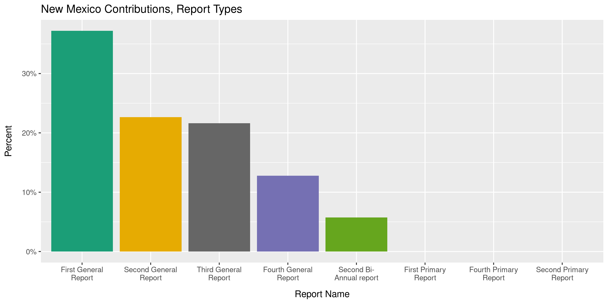
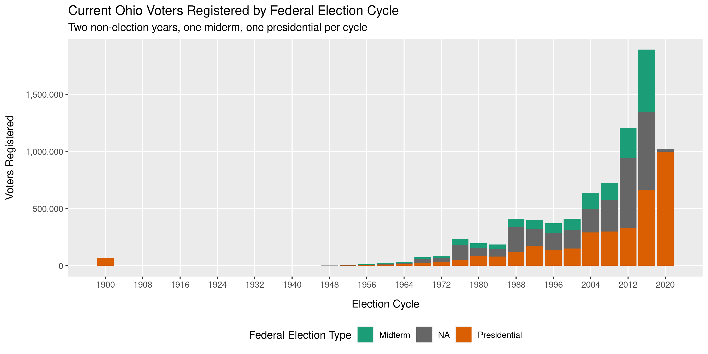

<!-- Place comments regarding knitting here -->


[The Accountability Project][tap] database recently surpassed one _billion_ 
records! That's one billion rows of campaign contributions, government
contracts, registered voters, property records, lobbyist registrations, stimulus
spending, and more. All searchable alongside one another with blazing speed. To
put that in perspective: one million seconds (the Excel spreadsheet maximum) is
less than twelve days, while one billion seconds is over 31 _years_.


```r
duration(1e6)
#> [1] "1e+06s (~1.65 weeks)"
duration(1e9)
#> [1] "1e+09s (~31.69 years)"
```

To reach this impressive milestone, the Investigative Reporting Workshop has
employed a number of tools to scrape, read, parse, request, and manipulate such
a vast amount of data. Here, I am going to cover just some of the work we've 
done using coding workflows to help automate some consistent data processing.

[R] is a free, open source programming language first developed for statistical
computing and taught in many universities. With the rise of the data science
field, R has grown into a fantastic choice for the kind of data processing we do
here at IRW. In fact, this very blog was written in R, like all our data guides.

The ability to write self-contained data diaries with our journalist's thoughts
intermixed alongside actual code means we can publish comprehensive and
comprehensible catalogs of every change we make to public data. This means
anybody, most importantly our future selves, can easy replicate our work from 
start to finish.

All such code is found on the [TAP GitHub Repository][gh], where our markdown
files render as [easy-to-read web pages][al].

[tap]: https://publicaccountability.org/
[R]: https://www.r-project.org/
[gh]: https://github.com/irworkshop/accountability_datacleaning
[al]: https://github.com/irworkshop/accountability_datacleaning/blob/master/R_tap/al/contribs/docs/al_contribs_diary.md
[sc]: https://github.com/irworkshop/campfin
[CRAN]: https://cran.r-project.org/package=campfin

## Software

To facilitate a lot of this work, IRW developed our own R software package. This
`campfin` package helps with everything from reading data to exploring its 
structure and normalizing messy values. The [source code][sc] for this package
also lives on GitHub and can be installed from there or the [CRAN] repository.


```r
install.packages("campfin") # release version
remotes::install_github("irworkshop/campfin") # development
```

Later in this blog, we'll show how `campfin` helps with some specific problems
that come up often in public data like campaign finance.

Other software used is all free and open source and can be easily installed from
withing R, making our entire workflow easy for new staff and third parties.
Every step of the data wrangling process is handled from with code: getting the
data, reading it, exploring it, improving it, and uploading it the
Accountability Project server where it can be searched by our users.

## Getting data

IRW has to use many different methods to obtain all the different kinds of data
found on the Accountability Project. A lot of the time, data can be
downloaded directly from an agency's website. Other times, we have to 
submit formal records requests either ourselves or with a partner.

Downloading files directly is an important step in our reproducible, automated
workflow. By doing everything through code, data can be easily updated at any
time without having to track down the website and download everything by hand.
We can download files from a regular URL, fill out and submit web forms, or even
open a remote web browser window and navigate it with code.

It's easiest when files can be retrieved from a direct URL.


```r
al_url <- glue(
  "https://fcpa.alabamavotes.gov/PublicSite/Docs/BulkDataDownloads/",
  "{2019:2021}_CashContributionsExtract.csv.zip"
)
```

* https://fcpa.alabamavotes.gov/PublicSite/Docs/BulkDataDownloads/2019_CashContributionsExtract.csv.zip
* https://fcpa.alabamavotes.gov/PublicSite/Docs/BulkDataDownloads/2020_CashContributionsExtract.csv.zip
* https://fcpa.alabamavotes.gov/PublicSite/Docs/BulkDataDownloads/2021_CashContributionsExtract.csv.zip

Sometimes, in an attempt to make things "easier" for their users, agencies only
make their data available using a search portal. Here, we are submitting the
same kind of `GET` requests sent by your browser when you fill out a form and
click the "export" button.


```r
nm_csv <- path(data_dir, "CON_2020.csv")
if (!file_exists(nm_csv)) {
  nm_get <- GET(
    url = "https://login.cfis.sos.state.nm.us",
    path = c("api", "DataDownload", "GetCSVDownloadReport"),
    write_disk(path = nm_csv),
    progress(type = "down"),
    query = list(
      year = "2020",
      transactionType = "CON",
      reportFormat = "csv",
      fileName = "CON_2020.csv"
    )
  )
}
```

In the worst case, IRW uses state and federal records laws like the Freedom of
Information Act to formally request public data. In some case, we've partnered
with the non-profit [MuckRock][mr], specialists in filing records requests. This
was was the case when obtaining a copy of [New Jersey state contracts][nj].
Unfortunately, the request was fulfilled as a 65 page PDF... not the easiest
data to read, but even that can be downloaded directly with R code.


```r
pdf_url <- "https://cdn.muckrock.com/foia_files/2020/05/08/Morisy_Response.pdf"
pdf_path <- path(data_dir, basename(pdf_url))
if (!file_exists(pdf_path)) download.file(pdf_url, pdf_path)
```

[mr]: https://www.muckrock.com/
[nj]: https://www.muckrock.com/foi/new-jersey-229/state-contracts-office-of-the-state-comptroller-91636/

## Reading data

The Accountability Project currently sources data from 192 different publishers.
Everybody from the Alabama Ethics Commission to the Department of Veterans
Affairs. When working with data from literally hundreds of different sources,
you can never expect two files to look the same.

The Accountability Project standardizes data by thinking of every row as a
transaction between two parties. The first step in that standardization data is
to read everything as a tabular data frame in R. NEarly everything can be read:
a delimited text file, Excel spreadsheet, Microsoft Access database, or
thousands of PDF pages.

Sometimes, even simple text files need some work. Regular expressions can help.


```r
nm_contribs <- nm_csv %>% 
  read_lines(progress = TRUE) %>% 
  # remove quotes within quotes
  str_replace_all("(?<=\\s)\"(?!,)|\"(?=\\s)", "'") %>% 
  read_delim(
    delim = ",",
    escape_double = FALSE,
    escape_backslash = FALSE,
    col_types = cols(
      .default = col_character(),
      # read these text columns as real data
      `Transaction Amount` = col_double(),
      `Transaction Date` = col_date("%m/%d/%Y %H:%M:%S %p"),
      `Filed Date` = col_date("%m/%d/%Y %H:%M:%S %p"),
      `Start of Period` = col_datetime("%b  %d %Y %H:%M%p"),
      `End of Period` = col_datetime("%b  %d %Y %H:%M%p")
    )
  )
```

<div data-pagedtable="false">
  <script data-pagedtable-source type="application/json">
{"columns":[{"label":["org_id"],"name":[1],"type":["chr"],"align":["left"]},{"label":["amount"],"name":[2],"type":["dbl"],"align":["right"]},{"label":["date"],"name":[3],"type":["date"],"align":["right"]},{"label":["last_name"],"name":[4],"type":["chr"],"align":["left"]},{"label":["first_name"],"name":[5],"type":["chr"],"align":["left"]},{"label":["middle_name"],"name":[6],"type":["chr"],"align":["left"]},{"label":["prefix"],"name":[7],"type":["chr"],"align":["left"]},{"label":["suffix"],"name":[8],"type":["chr"],"align":["left"]},{"label":["address_line_1"],"name":[9],"type":["chr"],"align":["left"]},{"label":["address_line_2"],"name":[10],"type":["chr"],"align":["left"]},{"label":["city"],"name":[11],"type":["chr"],"align":["left"]},{"label":["state"],"name":[12],"type":["chr"],"align":["left"]},{"label":["zip_code"],"name":[13],"type":["chr"],"align":["left"]},{"label":["description"],"name":[14],"type":["chr"],"align":["left"]},{"label":["check_number"],"name":[15],"type":["chr"],"align":["left"]},{"label":["id"],"name":[16],"type":["chr"],"align":["left"]},{"label":["filed_date"],"name":[17],"type":["date"],"align":["right"]},{"label":["election"],"name":[18],"type":["chr"],"align":["left"]},{"label":["report_name"],"name":[19],"type":["chr"],"align":["left"]},{"label":["start_of_period"],"name":[20],"type":["dttm"],"align":["right"]},{"label":["end_of_period"],"name":[21],"type":["dttm"],"align":["right"]},{"label":["code"],"name":[22],"type":["chr"],"align":["left"]},{"label":["contribution_type"],"name":[23],"type":["chr"],"align":["left"]},{"label":["report_entity_type"],"name":[24],"type":["chr"],"align":["left"]},{"label":["committee_name"],"name":[25],"type":["chr"],"align":["left"]},{"label":["candidate_last_name"],"name":[26],"type":["chr"],"align":["left"]},{"label":["candidate_first_name"],"name":[27],"type":["chr"],"align":["left"]},{"label":["candidate_middle_name"],"name":[28],"type":["chr"],"align":["left"]},{"label":["candidate_prefix"],"name":[29],"type":["chr"],"align":["left"]},{"label":["candidate_suffix"],"name":[30],"type":["chr"],"align":["left"]},{"label":["amended"],"name":[31],"type":["chr"],"align":["left"]},{"label":["employer"],"name":[32],"type":["chr"],"align":["left"]},{"label":["occupation"],"name":[33],"type":["chr"],"align":["left"]},{"label":["occupation_comment"],"name":[34],"type":["chr"],"align":["left"]},{"label":["employment_information_requested"],"name":[35],"type":["chr"],"align":["left"]}],"data":[{"1":"1375","2":"19.85","3":"2020-09-03","4":"Fernandez","5":"Darien","6":"D.","7":"NA","8":"NA","9":"NA","10":"NA","11":"NA","12":"NA","13":"NA","14":"cash","15":"NA","16":"6495","17":"2020-09-03","18":"2014 Legacy Election - Candidate Election Cycle","19":"Second Bi-Annual report","20":"2020-04-07","21":"2020-10-05","22":"Candidate/Officeholder","23":"Monetary","24":"Candidate","25":"Committee to Elect Darien Fernandez","26":"Fernandez","27":"Darien","28":"D.","29":"NA","30":"NA","31":"N","32":"NA","33":"NA","34":"NA","35":"N"},{"1":"1430","2":"129.23","3":"2020-08-03","4":"Effective/Comcast","5":"NA","6":"NA","7":"NA","8":"NA","9":"345 Iverness Dr. South #300","10":"NA","11":"Englewood","12":"CO","13":"80112","14":"Refund","15":"000","16":"41616","17":"2020-09-10","18":"2016 Legacy Election - Candidate Election Cycle","19":"Second Bi-Annual report","20":"2020-04-07","21":"2020-10-05","22":"Other (e.g. business entity)","23":"Monetary","24":"Candidate","25":"Candidate Campaign Committee –  Michael S Sanchez,","26":"Sanchez","27":"Michael","28":"S","29":"NA","30":"NA","31":"N","32":"NA","33":"NA","34":"NA","35":"N"},{"1":"1436","2":"1452.94","3":"2020-10-04","4":"Roch","5":"Dennis","6":"J","7":"NA","8":"NA","9":"NA","10":"NA","11":"NA","12":"NA","13":"NA","14":"Donation","15":"NA","16":"176539","17":"2020-10-11","18":"2016 Legacy Election - Candidate Election Cycle","19":"Second Bi-Annual report","20":"2020-04-07","21":"2020-10-05","22":"Candidate/Officeholder","23":"Monetary","24":"Candidate","25":"Candidate Campaign Committee –  Dennis J Roch,","26":"Roch","27":"Dennis","28":"J","29":"NA","30":"NA","31":"N","32":"NA","33":"NA","34":"NA","35":"N"},{"1":"1453","2":"0.70","3":"2020-07-03","4":"First Data USA","5":"NA","6":"NA","7":"NA","8":"NA","9":"5565 Glenridge Connector NE","10":"Ste 2000","11":"Atlanta","12":"GA","13":"30342","14":"Refund from Vendor","15":"NA","16":"199218","17":"2020-10-13","18":"2018 Legacy Election - Candidate Election Cycle","19":"Second Bi-Annual report","20":"2020-04-07","21":"2020-10-05","22":"Other (e.g. business entity)","23":"Monetary","24":"Candidate","25":"New Mexicans for Michelle","26":"Lujan Grisham","27":"Michelle","28":"NA","29":"NA","30":"NA","31":"N","32":"NA","33":"NA","34":"NA","35":"N"},{"1":"1453","2":"1.00","3":"2020-07-21","4":"Hendrickx","5":"Jan","6":"NA","7":"NA","8":"NA","9":"PO Box 897","10":"NA","11":"Los Lunas","12":"NM","13":"87031","14":"Monetary Contribution","15":"NA","16":"196695","17":"2020-10-13","18":"2018 Legacy Election - Candidate Election Cycle","19":"Second Bi-Annual report","20":"2020-04-07","21":"2020-10-05","22":"Individual","23":"Monetary","24":"Candidate","25":"New Mexicans for Michelle","26":"Lujan Grisham","27":"Michelle","28":"NA","29":"NA","30":"NA","31":"N","32":"NA","33":"NA","34":"NA","35":"N"},{"1":"1453","2":"1.00","3":"2020-07-25","4":"Atkins","5":"Arnold","6":"NA","7":"NA","8":"NA","9":"12 Vista Grande Dr","10":"NA","11":"Santa Fe","12":"NM","13":"87508","14":"Monetary Contribution","15":"NA","16":"194725","17":"2020-10-13","18":"2018 Legacy Election - Candidate Election Cycle","19":"Second Bi-Annual report","20":"2020-04-07","21":"2020-10-05","22":"Individual","23":"Monetary","24":"Candidate","25":"New Mexicans for Michelle","26":"Lujan Grisham","27":"Michelle","28":"NA","29":"NA","30":"NA","31":"N","32":"NA","33":"NA","34":"NA","35":"N"},{"1":"1453","2":"1.00","3":"2020-08-17","4":"Nieto","5":"Roger","6":"NA","7":"NA","8":"NA","9":"PO Box 1513","10":"NA","11":"Pena Blanca","12":"NM","13":"87041","14":"Monetary Contribution","15":"NA","16":"197746","17":"2020-10-13","18":"2018 Legacy Election - Candidate Election Cycle","19":"Second Bi-Annual report","20":"2020-04-07","21":"2020-10-05","22":"Individual","23":"Monetary","24":"Candidate","25":"New Mexicans for Michelle","26":"Lujan Grisham","27":"Michelle","28":"NA","29":"NA","30":"NA","31":"N","32":"NA","33":"NA","34":"NA","35":"N"},{"1":"1453","2":"1.00","3":"2020-08-17","4":"Rivas","5":"Frank","6":"NA","7":"NA","8":"NA","9":"PO BOX 1235","10":"NA","11":"WILDWOOD","12":"FL","13":"34785","14":"Monetary Contribution","15":"NA","16":"198102","17":"2020-10-13","18":"2018 Legacy Election - Candidate Election Cycle","19":"Second Bi-Annual report","20":"2020-04-07","21":"2020-10-05","22":"Individual","23":"Monetary","24":"Candidate","25":"New Mexicans for Michelle","26":"Lujan Grisham","27":"Michelle","28":"NA","29":"NA","30":"NA","31":"N","32":"NA","33":"NA","34":"NA","35":"N"},{"1":"1453","2":"1.00","3":"2020-08-20","4":"Bharara","5":"Shabadjot","6":"NA","7":"NA","8":"NA","9":"98 EAST ST","10":"NA","11":"MORRIS","12":"CT","13":"06763","14":"Monetary Contribution","15":"NA","16":"194869","17":"2020-10-13","18":"2018 Legacy Election - Candidate Election Cycle","19":"Second Bi-Annual report","20":"2020-04-07","21":"2020-10-05","22":"Individual","23":"Monetary","24":"Candidate","25":"New Mexicans for Michelle","26":"Lujan Grisham","27":"Michelle","28":"NA","29":"NA","30":"NA","31":"N","32":"NA","33":"NA","34":"NA","35":"N"},{"1":"1453","2":"1.00","3":"2020-08-28","4":"Nieto","5":"Roger","6":"NA","7":"NA","8":"NA","9":"PO Box 1513","10":"NA","11":"Pena Blanca","12":"NM","13":"87041","14":"Monetary Contribution","15":"NA","16":"197747","17":"2020-10-13","18":"2018 Legacy Election - Candidate Election Cycle","19":"Second Bi-Annual report","20":"2020-04-07","21":"2020-10-05","22":"Individual","23":"Monetary","24":"Candidate","25":"New Mexicans for Michelle","26":"Lujan Grisham","27":"Michelle","28":"NA","29":"NA","30":"NA","31":"N","32":"NA","33":"NA","34":"NA","35":"N"},{"1":"1453","2":"1.00","3":"2020-08-30","4":"Fabry","5":"John","6":"NA","7":"NA","8":"NA","9":"1201 ALVARADO WAY","10":"NA","11":"BERNALILLO","12":"NM","13":"87004","14":"Monetary Contribution","15":"NA","16":"195600","17":"2020-10-13","18":"2018 Legacy Election - Candidate Election Cycle","19":"Second Bi-Annual report","20":"2020-04-07","21":"2020-10-05","22":"Individual","23":"Monetary","24":"Candidate","25":"New Mexicans for Michelle","26":"Lujan Grisham","27":"Michelle","28":"NA","29":"NA","30":"NA","31":"N","32":"NA","33":"NA","34":"NA","35":"N"},{"1":"1453","2":"1.00","3":"2020-08-31","4":"Alanen","5":"Dennis","6":"NA","7":"NA","8":"NA","9":"3077 Evelyn St","10":"NA","11":"Roseville","12":"MN","13":"55113","14":"Monetary Contribution","15":"NA","16":"194646","17":"2020-10-13","18":"2018 Legacy Election - Candidate Election Cycle","19":"Second Bi-Annual report","20":"2020-04-07","21":"2020-10-05","22":"Individual","23":"Monetary","24":"Candidate","25":"New Mexicans for Michelle","26":"Lujan Grisham","27":"Michelle","28":"NA","29":"NA","30":"NA","31":"N","32":"NA","33":"NA","34":"NA","35":"N"},{"1":"1453","2":"1.00","3":"2020-09-19","4":"White","5":"Michael","6":"NA","7":"NA","8":"NA","9":"144 Carriage Way Dr","10":"NA","11":"Burr Ridge","12":"IL","13":"60527","14":"Monetary Contribution","15":"NA","16":"198827","17":"2020-10-13","18":"2018 Legacy Election - Candidate Election Cycle","19":"Second Bi-Annual report","20":"2020-04-07","21":"2020-10-05","22":"Individual","23":"Monetary","24":"Candidate","25":"New Mexicans for Michelle","26":"Lujan Grisham","27":"Michelle","28":"NA","29":"NA","30":"NA","31":"N","32":"NA","33":"NA","34":"NA","35":"N"},{"1":"1453","2":"1.00","3":"2020-09-23","4":"Hendrickx","5":"Jan","6":"NA","7":"NA","8":"NA","9":"PO Box 897","10":"NA","11":"Los Lunas","12":"NM","13":"87031","14":"Monetary Contribution","15":"NA","16":"196696","17":"2020-10-13","18":"2018 Legacy Election - Candidate Election Cycle","19":"Second Bi-Annual report","20":"2020-04-07","21":"2020-10-05","22":"Individual","23":"Monetary","24":"Candidate","25":"New Mexicans for Michelle","26":"Lujan Grisham","27":"Michelle","28":"NA","29":"NA","30":"NA","31":"N","32":"NA","33":"NA","34":"NA","35":"N"},{"1":"1453","2":"1.00","3":"2020-09-23","4":"Walton","5":"Meagan","6":"NA","7":"NA","8":"NA","9":"202 Stanford Dr SE","10":"Apt 3","11":"Albuquerque","12":"NM","13":"87106","14":"Monetary Contribution","15":"NA","16":"198753","17":"2020-10-13","18":"2018 Legacy Election - Candidate Election Cycle","19":"Second Bi-Annual report","20":"2020-04-07","21":"2020-10-05","22":"Individual","23":"Monetary","24":"Candidate","25":"New Mexicans for Michelle","26":"Lujan Grisham","27":"Michelle","28":"NA","29":"NA","30":"NA","31":"N","32":"NA","33":"NA","34":"NA","35":"N"},{"1":"1453","2":"1.00","3":"2020-09-25","4":"Romero","5":"Amy","6":"NA","7":"NA","8":"NA","9":"7809 SHERWOOD DR NW","10":"NA","11":"ALBUQUERQUE","12":"NM","13":"87120","14":"Monetary Contribution","15":"NA","16":"198152","17":"2020-10-13","18":"2018 Legacy Election - Candidate Election Cycle","19":"Second Bi-Annual report","20":"2020-04-07","21":"2020-10-05","22":"Individual","23":"Monetary","24":"Candidate","25":"New Mexicans for Michelle","26":"Lujan Grisham","27":"Michelle","28":"NA","29":"NA","30":"NA","31":"N","32":"NA","33":"NA","34":"NA","35":"N"},{"1":"1453","2":"1.00","3":"2020-09-25","4":"Stepp","5":"Barbara","6":"NA","7":"NA","8":"NA","9":"3200 N Lake Shore Dr","10":"Apt 1706","11":"Chicago","12":"IL","13":"60657-3948","14":"Monetary Contribution","15":"NA","16":"198475","17":"2020-10-13","18":"2018 Legacy Election - Candidate Election Cycle","19":"Second Bi-Annual report","20":"2020-04-07","21":"2020-10-05","22":"Individual","23":"Monetary","24":"Candidate","25":"New Mexicans for Michelle","26":"Lujan Grisham","27":"Michelle","28":"NA","29":"NA","30":"NA","31":"N","32":"NA","33":"NA","34":"NA","35":"N"},{"1":"1453","2":"1.00","3":"2020-09-28","4":"Messenger","5":"David","6":"NA","7":"NA","8":"NA","9":"115 PALO ALTO RD SE","10":"NA","11":"DEMING","12":"NM","13":"88030","14":"Monetary Contribution","15":"NA","16":"197572","17":"2020-10-13","18":"2018 Legacy Election - Candidate Election Cycle","19":"Second Bi-Annual report","20":"2020-04-07","21":"2020-10-05","22":"Individual","23":"Monetary","24":"Candidate","25":"New Mexicans for Michelle","26":"Lujan Grisham","27":"Michelle","28":"NA","29":"NA","30":"NA","31":"N","32":"NA","33":"NA","34":"NA","35":"N"},{"1":"1453","2":"1.50","3":"2020-09-26","4":"Wong","5":"Jim","6":"NA","7":"NA","8":"NA","9":"5827 MARSHALL ST","10":"NA","11":"OAKLAND","12":"CA","13":"94608","14":"Monetary Contribution","15":"NA","16":"198892","17":"2020-10-13","18":"2018 Legacy Election - Candidate Election Cycle","19":"Second Bi-Annual report","20":"2020-04-07","21":"2020-10-05","22":"Individual","23":"Monetary","24":"Candidate","25":"New Mexicans for Michelle","26":"Lujan Grisham","27":"Michelle","28":"NA","29":"NA","30":"NA","31":"N","32":"NA","33":"NA","34":"NA","35":"N"},{"1":"1453","2":"2.00","3":"2020-07-21","4":"Lukesh","5":"Debra","6":"Sue","7":"NA","8":"NA","9":"222 Corsica Dr SE","10":"NA","11":"Rio Rancho","12":"NM","13":"87124","14":"Monetary Contribution","15":"NA","16":"197312","17":"2020-10-13","18":"2018 Legacy Election - Candidate Election Cycle","19":"Second Bi-Annual report","20":"2020-04-07","21":"2020-10-05","22":"Individual","23":"Monetary","24":"Candidate","25":"New Mexicans for Michelle","26":"Lujan Grisham","27":"Michelle","28":"NA","29":"NA","30":"NA","31":"N","32":"NA","33":"NA","34":"NA","35":"N"},{"1":"1453","2":"2.00","3":"2020-07-25","4":"Campbell","5":"Thomas","6":"NA","7":"NA","8":"NA","9":"828 E SHAWNEE ST","10":"NA","11":"FREEPORT","12":"IL","13":"61032","14":"Monetary Contribution","15":"NA","16":"195102","17":"2020-10-13","18":"2018 Legacy Election - Candidate Election Cycle","19":"Second Bi-Annual report","20":"2020-04-07","21":"2020-10-05","22":"Individual","23":"Monetary","24":"Candidate","25":"New Mexicans for Michelle","26":"Lujan Grisham","27":"Michelle","28":"NA","29":"NA","30":"NA","31":"N","32":"NA","33":"NA","34":"NA","35":"N"},{"1":"1453","2":"2.00","3":"2020-08-17","4":"Darragh","5":"John","6":"NA","7":"NA","8":"NA","9":"5219 W Comanche St","10":"NA","11":"Farmington","12":"NM","13":"87401","14":"Monetary Contribution","15":"NA","16":"195385","17":"2020-10-13","18":"2018 Legacy Election - Candidate Election Cycle","19":"Second Bi-Annual report","20":"2020-04-07","21":"2020-10-05","22":"Individual","23":"Monetary","24":"Candidate","25":"New Mexicans for Michelle","26":"Lujan Grisham","27":"Michelle","28":"NA","29":"NA","30":"NA","31":"N","32":"NA","33":"NA","34":"NA","35":"N"},{"1":"1453","2":"2.00","3":"2020-08-28","4":"Johnson","5":"Daryl","6":"NA","7":"NA","8":"NA","9":"3704 Bryn Mawr Dr NE","10":"Apt F","11":"Albuquerque","12":"NM","13":"87107","14":"Monetary Contribution","15":"NA","16":"196908","17":"2020-10-13","18":"2018 Legacy Election - Candidate Election Cycle","19":"Second Bi-Annual report","20":"2020-04-07","21":"2020-10-05","22":"Individual","23":"Monetary","24":"Candidate","25":"New Mexicans for Michelle","26":"Lujan Grisham","27":"Michelle","28":"NA","29":"NA","30":"NA","31":"N","32":"NA","33":"NA","34":"NA","35":"N"},{"1":"1453","2":"2.00","3":"2020-08-31","4":"Sanchez","5":"Sherry","6":"NA","7":"NA","8":"NA","9":"2192 CAMINO SAN ANDRES","10":"NA","11":"SANTA FE","12":"NM","13":"87505","14":"Monetary Contribution","15":"NA","16":"198246","17":"2020-10-13","18":"2018 Legacy Election - Candidate Election Cycle","19":"Second Bi-Annual report","20":"2020-04-07","21":"2020-10-05","22":"Individual","23":"Monetary","24":"Candidate","25":"New Mexicans for Michelle","26":"Lujan Grisham","27":"Michelle","28":"NA","29":"NA","30":"NA","31":"N","32":"NA","33":"NA","34":"NA","35":"N"},{"1":"1453","2":"2.00","3":"2020-09-17","4":"Darragh","5":"John","6":"NA","7":"NA","8":"NA","9":"5219 W Comanche St","10":"NA","11":"Farmington","12":"NM","13":"87401","14":"Monetary Contribution","15":"NA","16":"195386","17":"2020-10-13","18":"2018 Legacy Election - Candidate Election Cycle","19":"Second Bi-Annual report","20":"2020-04-07","21":"2020-10-05","22":"Individual","23":"Monetary","24":"Candidate","25":"New Mexicans for Michelle","26":"Lujan Grisham","27":"Michelle","28":"NA","29":"NA","30":"NA","31":"N","32":"NA","33":"NA","34":"NA","35":"N"},{"1":"1453","2":"2.00","3":"2020-09-23","4":"Wong","5":"Jim","6":"NA","7":"NA","8":"NA","9":"5827 MARSHALL ST","10":"NA","11":"OAKLAND","12":"CA","13":"94608","14":"Monetary Contribution","15":"NA","16":"198891","17":"2020-10-13","18":"2018 Legacy Election - Candidate Election Cycle","19":"Second Bi-Annual report","20":"2020-04-07","21":"2020-10-05","22":"Individual","23":"Monetary","24":"Candidate","25":"New Mexicans for Michelle","26":"Lujan Grisham","27":"Michelle","28":"NA","29":"NA","30":"NA","31":"N","32":"NA","33":"NA","34":"NA","35":"N"},{"1":"1453","2":"2.00","3":"2020-09-28","4":"Johnson","5":"Daryl","6":"NA","7":"NA","8":"NA","9":"3704 Bryn Mawr Dr NE","10":"Apt F","11":"Albuquerque","12":"NM","13":"87107","14":"Monetary Contribution","15":"NA","16":"196909","17":"2020-10-13","18":"2018 Legacy Election - Candidate Election Cycle","19":"Second Bi-Annual report","20":"2020-04-07","21":"2020-10-05","22":"Individual","23":"Monetary","24":"Candidate","25":"New Mexicans for Michelle","26":"Lujan Grisham","27":"Michelle","28":"NA","29":"NA","30":"NA","31":"N","32":"NA","33":"NA","34":"NA","35":"N"},{"1":"1453","2":"2.00","3":"2020-09-30","4":"Stepp","5":"Barbara","6":"NA","7":"NA","8":"NA","9":"3200 N Lake Shore Dr","10":"Apt 1706","11":"Chicago","12":"IL","13":"60657-3948","14":"Monetary Contribution","15":"NA","16":"198476","17":"2020-10-13","18":"2018 Legacy Election - Candidate Election Cycle","19":"Second Bi-Annual report","20":"2020-04-07","21":"2020-10-05","22":"Individual","23":"Monetary","24":"Candidate","25":"New Mexicans for Michelle","26":"Lujan Grisham","27":"Michelle","28":"NA","29":"NA","30":"NA","31":"N","32":"NA","33":"NA","34":"NA","35":"N"},{"1":"1453","2":"2.00","3":"2020-09-30","4":"Wong","5":"Jim","6":"NA","7":"NA","8":"NA","9":"5827 MARSHALL ST","10":"NA","11":"OAKLAND","12":"CA","13":"94608","14":"Monetary Contribution","15":"NA","16":"198893","17":"2020-10-13","18":"2018 Legacy Election - Candidate Election Cycle","19":"Second Bi-Annual report","20":"2020-04-07","21":"2020-10-05","22":"Individual","23":"Monetary","24":"Candidate","25":"New Mexicans for Michelle","26":"Lujan Grisham","27":"Michelle","28":"NA","29":"NA","30":"NA","31":"N","32":"NA","33":"NA","34":"NA","35":"N"},{"1":"1453","2":"2.50","3":"2020-07-31","4":"Wells","5":"Robert","6":"NA","7":"NA","8":"NA","9":"400 Broken Arrow Rd","10":"NA","11":"Roswell","12":"NM","13":"88201","14":"Monetary Contribution","15":"NA","16":"198803","17":"2020-10-13","18":"2018 Legacy Election - Candidate Election Cycle","19":"Second Bi-Annual report","20":"2020-04-07","21":"2020-10-05","22":"Individual","23":"Monetary","24":"Candidate","25":"New Mexicans for Michelle","26":"Lujan Grisham","27":"Michelle","28":"NA","29":"NA","30":"NA","31":"N","32":"NA","33":"NA","34":"NA","35":"N"},{"1":"1453","2":"2.50","3":"2020-09-25","4":"Calisch","5":"Claudia","6":"NA","7":"NA","8":"NA","9":"3 Spirit Run Pl","10":"NA","11":"Santa Fe","12":"NM","13":"87508","14":"Monetary Contribution","15":"NA","16":"195078","17":"2020-10-13","18":"2018 Legacy Election - Candidate Election Cycle","19":"Second Bi-Annual report","20":"2020-04-07","21":"2020-10-05","22":"Individual","23":"Monetary","24":"Candidate","25":"New Mexicans for Michelle","26":"Lujan Grisham","27":"Michelle","28":"NA","29":"NA","30":"NA","31":"N","32":"NA","33":"NA","34":"NA","35":"N"},{"1":"1453","2":"2.50","3":"2020-09-25","4":"Campos","5":"Ida","6":"NA","7":"NA","8":"NA","9":"18 Rael Ln","10":"NA","11":"Santa Fe","12":"NM","13":"87507","14":"Monetary Contribution","15":"NA","16":"195106","17":"2020-10-13","18":"2018 Legacy Election - Candidate Election Cycle","19":"Second Bi-Annual report","20":"2020-04-07","21":"2020-10-05","22":"Individual","23":"Monetary","24":"Candidate","25":"New Mexicans for Michelle","26":"Lujan Grisham","27":"Michelle","28":"NA","29":"NA","30":"NA","31":"N","32":"NA","33":"NA","34":"NA","35":"N"},{"1":"1453","2":"2.50","3":"2020-09-25","4":"Connors","5":"Michael","6":"NA","7":"NA","8":"NA","9":"11504 Angelina Pl NE","10":"NA","11":"Albuquerque","12":"NM","13":"87123","14":"Monetary Contribution","15":"NA","16":"195266","17":"2020-10-13","18":"2018 Legacy Election - Candidate Election Cycle","19":"Second Bi-Annual report","20":"2020-04-07","21":"2020-10-05","22":"Individual","23":"Monetary","24":"Candidate","25":"New Mexicans for Michelle","26":"Lujan Grisham","27":"Michelle","28":"NA","29":"NA","30":"NA","31":"N","32":"NA","33":"NA","34":"NA","35":"N"},{"1":"1453","2":"2.50","3":"2020-09-25","4":"Dorsey","5":"Grover","6":"NA","7":"NA","8":"NA","9":"PO Box 1905","10":"NA","11":"Ruidoso","12":"NM","13":"88355","14":"Monetary Contribution","15":"NA","16":"195482","17":"2020-10-13","18":"2018 Legacy Election - Candidate Election Cycle","19":"Second Bi-Annual report","20":"2020-04-07","21":"2020-10-05","22":"Individual","23":"Monetary","24":"Candidate","25":"New Mexicans for Michelle","26":"Lujan Grisham","27":"Michelle","28":"NA","29":"NA","30":"NA","31":"N","32":"NA","33":"NA","34":"NA","35":"N"},{"1":"1453","2":"2.50","3":"2020-09-25","4":"Glarum-Heatley","5":"Elizabeth","6":"NA","7":"NA","8":"NA","9":"2 TREVINGTON RD","10":"NA","11":"SANTA TERESA","12":"NM","13":"88008","14":"Monetary Contribution","15":"NA","16":"195816","17":"2020-10-13","18":"2018 Legacy Election - Candidate Election Cycle","19":"Second Bi-Annual report","20":"2020-04-07","21":"2020-10-05","22":"Individual","23":"Monetary","24":"Candidate","25":"New Mexicans for Michelle","26":"Lujan Grisham","27":"Michelle","28":"NA","29":"NA","30":"NA","31":"N","32":"NA","33":"NA","34":"NA","35":"N"},{"1":"1453","2":"2.50","3":"2020-09-25","4":"Gregory","5":"Barbara","6":"NA","7":"NA","8":"NA","9":"3538 NE 86TH ST","10":"NA","11":"SEATTLE","12":"WA","13":"98115-3636","14":"Monetary Contribution","15":"NA","16":"195866","17":"2020-10-13","18":"2018 Legacy Election - Candidate Election Cycle","19":"Second Bi-Annual report","20":"2020-04-07","21":"2020-10-05","22":"Individual","23":"Monetary","24":"Candidate","25":"New Mexicans for Michelle","26":"Lujan Grisham","27":"Michelle","28":"NA","29":"NA","30":"NA","31":"N","32":"NA","33":"NA","34":"NA","35":"N"},{"1":"1453","2":"2.50","3":"2020-09-25","4":"Kaub","5":"Rachel","6":"NA","7":"NA","8":"NA","9":"PO Box 4813","10":"NA","11":"Gallup","12":"NM","13":"87305","14":"Monetary Contribution","15":"NA","16":"196989","17":"2020-10-13","18":"2018 Legacy Election - Candidate Election Cycle","19":"Second Bi-Annual report","20":"2020-04-07","21":"2020-10-05","22":"Individual","23":"Monetary","24":"Candidate","25":"New Mexicans for Michelle","26":"Lujan Grisham","27":"Michelle","28":"NA","29":"NA","30":"NA","31":"N","32":"NA","33":"NA","34":"NA","35":"N"},{"1":"1453","2":"2.50","3":"2020-09-25","4":"Ortega","5":"Roland","6":"NA","7":"NA","8":"NA","9":"10500 WILLARD RD NW","10":"NA","11":"ALBUQUERQUE","12":"NM","13":"87114","14":"Monetary Contribution","15":"NA","16":"197802","17":"2020-10-13","18":"2018 Legacy Election - Candidate Election Cycle","19":"Second Bi-Annual report","20":"2020-04-07","21":"2020-10-05","22":"Individual","23":"Monetary","24":"Candidate","25":"New Mexicans for Michelle","26":"Lujan Grisham","27":"Michelle","28":"NA","29":"NA","30":"NA","31":"N","32":"NA","33":"NA","34":"NA","35":"N"},{"1":"1453","2":"2.50","3":"2020-09-25","4":"Rothberg","5":"Riha","6":"NA","7":"NA","8":"NA","9":"7 Placitas West Rd","10":"NA","11":"Placitas","12":"NM","13":"87043","14":"Monetary Contribution","15":"NA","16":"198191","17":"2020-10-13","18":"2018 Legacy Election - Candidate Election Cycle","19":"Second Bi-Annual report","20":"2020-04-07","21":"2020-10-05","22":"Individual","23":"Monetary","24":"Candidate","25":"New Mexicans for Michelle","26":"Lujan Grisham","27":"Michelle","28":"NA","29":"NA","30":"NA","31":"N","32":"NA","33":"NA","34":"NA","35":"N"},{"1":"1453","2":"2.50","3":"2020-09-25","4":"Sheppard","5":"Luke","6":"NA","7":"NA","8":"NA","9":"520 Jose St","10":"Apt 5","11":"Santa Fe","12":"NM","13":"87501","14":"Monetary Contribution","15":"NA","16":"198370","17":"2020-10-13","18":"2018 Legacy Election - Candidate Election Cycle","19":"Second Bi-Annual report","20":"2020-04-07","21":"2020-10-05","22":"Individual","23":"Monetary","24":"Candidate","25":"New Mexicans for Michelle","26":"Lujan Grisham","27":"Michelle","28":"NA","29":"NA","30":"NA","31":"N","32":"NA","33":"NA","34":"NA","35":"N"},{"1":"1453","2":"2.50","3":"2020-09-25","4":"Sheridan","5":"Suzanne","6":"NA","7":"NA","8":"NA","9":"277A North Ave","10":"NA","11":"Westport","12":"CT","13":"06880","14":"Monetary Contribution","15":"NA","16":"198371","17":"2020-10-13","18":"2018 Legacy Election - Candidate Election Cycle","19":"Second Bi-Annual report","20":"2020-04-07","21":"2020-10-05","22":"Individual","23":"Monetary","24":"Candidate","25":"New Mexicans for Michelle","26":"Lujan Grisham","27":"Michelle","28":"NA","29":"NA","30":"NA","31":"N","32":"NA","33":"NA","34":"NA","35":"N"},{"1":"1453","2":"2.50","3":"2020-09-25","4":"Sosa","5":"Angela","6":"NA","7":"NA","8":"NA","9":"PO Box 501","10":"NA","11":"Bernalillo","12":"NM","13":"87004","14":"Monetary Contribution","15":"NA","16":"198431","17":"2020-10-13","18":"2018 Legacy Election - Candidate Election Cycle","19":"Second Bi-Annual report","20":"2020-04-07","21":"2020-10-05","22":"Individual","23":"Monetary","24":"Candidate","25":"New Mexicans for Michelle","26":"Lujan Grisham","27":"Michelle","28":"NA","29":"NA","30":"NA","31":"N","32":"NA","33":"NA","34":"NA","35":"N"},{"1":"1453","2":"2.50","3":"2020-09-25","4":"Thompson","5":"Joann","6":"NA","7":"NA","8":"NA","9":"1486 Camino de la Tierra","10":"NA","11":"Corrales","12":"NM","13":"87048","14":"Monetary Contribution","15":"NA","16":"198608","17":"2020-10-13","18":"2018 Legacy Election - Candidate Election Cycle","19":"Second Bi-Annual report","20":"2020-04-07","21":"2020-10-05","22":"Individual","23":"Monetary","24":"Candidate","25":"New Mexicans for Michelle","26":"Lujan Grisham","27":"Michelle","28":"NA","29":"NA","30":"NA","31":"N","32":"NA","33":"NA","34":"NA","35":"N"},{"1":"1453","2":"2.50","3":"2020-09-25","4":"Wechselberger","5":"Nicholas","6":"NA","7":"NA","8":"NA","9":"1714 1/2 Coal Pl SE","10":"NA","11":"Albuquerque","12":"NM","13":"87106","14":"Monetary Contribution","15":"NA","16":"198792","17":"2020-10-13","18":"2018 Legacy Election - Candidate Election Cycle","19":"Second Bi-Annual report","20":"2020-04-07","21":"2020-10-05","22":"Individual","23":"Monetary","24":"Candidate","25":"New Mexicans for Michelle","26":"Lujan Grisham","27":"Michelle","28":"NA","29":"NA","30":"NA","31":"N","32":"NA","33":"NA","34":"NA","35":"N"},{"1":"1453","2":"2.50","3":"2020-09-30","4":"Wells","5":"Robert","6":"NA","7":"NA","8":"NA","9":"400 Broken Arrow Rd","10":"NA","11":"Roswell","12":"NM","13":"88201","14":"Monetary Contribution","15":"NA","16":"198804","17":"2020-10-13","18":"2018 Legacy Election - Candidate Election Cycle","19":"Second Bi-Annual report","20":"2020-04-07","21":"2020-10-05","22":"Individual","23":"Monetary","24":"Candidate","25":"New Mexicans for Michelle","26":"Lujan Grisham","27":"Michelle","28":"NA","29":"NA","30":"NA","31":"N","32":"NA","33":"NA","34":"NA","35":"N"},{"1":"1453","2":"2.70","3":"2020-08-11","4":"Fisher","5":"Debra","6":"NA","7":"NA","8":"NA","9":"406 San Juan Ave","10":"NA","11":"Aztec","12":"NM","13":"87410","14":"Monetary Contribution","15":"NA","16":"195635","17":"2020-10-13","18":"2018 Legacy Election - Candidate Election Cycle","19":"Second Bi-Annual report","20":"2020-04-07","21":"2020-10-05","22":"Individual","23":"Monetary","24":"Candidate","25":"New Mexicans for Michelle","26":"Lujan Grisham","27":"Michelle","28":"NA","29":"NA","30":"NA","31":"N","32":"NA","33":"NA","34":"NA","35":"N"},{"1":"1453","2":"2.70","3":"2020-09-05","4":"Fisher","5":"Debra","6":"NA","7":"NA","8":"NA","9":"406 San Juan Ave","10":"NA","11":"Aztec","12":"NM","13":"87410","14":"Monetary Contribution","15":"NA","16":"195636","17":"2020-10-13","18":"2018 Legacy Election - Candidate Election Cycle","19":"Second Bi-Annual report","20":"2020-04-07","21":"2020-10-05","22":"Individual","23":"Monetary","24":"Candidate","25":"New Mexicans for Michelle","26":"Lujan Grisham","27":"Michelle","28":"NA","29":"NA","30":"NA","31":"N","32":"NA","33":"NA","34":"NA","35":"N"},{"1":"1453","2":"3.00","3":"2020-07-14","4":"Martindell","5":"Kathi","6":"NA","7":"NA","8":"NA","9":"6000 Katson Ave NE","10":"NA","11":"Albuquerque","12":"NM","13":"87109","14":"Monetary Contribution","15":"NA","16":"197401","17":"2020-10-13","18":"2018 Legacy Election - Candidate Election Cycle","19":"Second Bi-Annual report","20":"2020-04-07","21":"2020-10-05","22":"Individual","23":"Monetary","24":"Candidate","25":"New Mexicans for Michelle","26":"Lujan Grisham","27":"Michelle","28":"NA","29":"NA","30":"NA","31":"N","32":"NA","33":"NA","34":"NA","35":"N"},{"1":"1453","2":"3.00","3":"2020-07-21","4":"Bandt","5":"Paula","6":"NA","7":"NA","8":"NA","9":"16120 Rosewood St","10":"NA","11":"Overland Park","12":"KS","13":"66085","14":"Monetary Contribution","15":"NA","16":"194780","17":"2020-10-13","18":"2018 Legacy Election - Candidate Election Cycle","19":"Second Bi-Annual report","20":"2020-04-07","21":"2020-10-05","22":"Individual","23":"Monetary","24":"Candidate","25":"New Mexicans for Michelle","26":"Lujan Grisham","27":"Michelle","28":"NA","29":"NA","30":"NA","31":"N","32":"NA","33":"NA","34":"NA","35":"N"},{"1":"1453","2":"3.00","3":"2020-07-24","4":"Bransford","5":"Gladys","6":"NA","7":"NA","8":"NA","9":"PO Box 1066","10":"NA","11":"Cobb","12":"CA","13":"95426","14":"Monetary Contribution","15":"NA","16":"194957","17":"2020-10-13","18":"2018 Legacy Election - Candidate Election Cycle","19":"Second Bi-Annual report","20":"2020-04-07","21":"2020-10-05","22":"Individual","23":"Monetary","24":"Candidate","25":"New Mexicans for Michelle","26":"Lujan Grisham","27":"Michelle","28":"NA","29":"NA","30":"NA","31":"N","32":"NA","33":"NA","34":"NA","35":"N"},{"1":"1453","2":"3.00","3":"2020-07-24","4":"Rockwell","5":"David","6":"NA","7":"NA","8":"NA","9":"31 Cienega Canyon Rd","10":"NA","11":"Placitas","12":"NM","13":"87043","14":"Monetary Contribution","15":"NA","16":"198132","17":"2020-10-13","18":"2018 Legacy Election - Candidate Election Cycle","19":"Second Bi-Annual report","20":"2020-04-07","21":"2020-10-05","22":"Individual","23":"Monetary","24":"Candidate","25":"New Mexicans for Michelle","26":"Lujan Grisham","27":"Michelle","28":"NA","29":"NA","30":"NA","31":"N","32":"NA","33":"NA","34":"NA","35":"N"},{"1":"1453","2":"3.00","3":"2020-07-26","4":"Chattey","5":"Pablo","6":"NA","7":"NA","8":"NA","9":"1 BRIMHALL WASH","10":"NA","11":"SANTA FE","12":"NM","13":"87508","14":"Monetary Contribution","15":"NA","16":"195183","17":"2020-10-13","18":"2018 Legacy Election - Candidate Election Cycle","19":"Second Bi-Annual report","20":"2020-04-07","21":"2020-10-05","22":"Individual","23":"Monetary","24":"Candidate","25":"New Mexicans for Michelle","26":"Lujan Grisham","27":"Michelle","28":"NA","29":"NA","30":"NA","31":"N","32":"NA","33":"NA","34":"NA","35":"N"},{"1":"1453","2":"3.00","3":"2020-07-27","4":"Graham","5":"Mary","6":"NA","7":"NA","8":"NA","9":"PO Box 1882","10":"NA","11":"Alamogordo","12":"NM","13":"88311","14":"Monetary Contribution","15":"NA","16":"195855","17":"2020-10-13","18":"2018 Legacy Election - Candidate Election Cycle","19":"Second Bi-Annual report","20":"2020-04-07","21":"2020-10-05","22":"Individual","23":"Monetary","24":"Candidate","25":"New Mexicans for Michelle","26":"Lujan Grisham","27":"Michelle","28":"NA","29":"NA","30":"NA","31":"N","32":"NA","33":"NA","34":"NA","35":"N"},{"1":"1453","2":"3.00","3":"2020-07-27","4":"Rhodes","5":"Sandy","6":"NA","7":"NA","8":"NA","9":"1001 Alcazar St NE","10":"NA","11":"Albuquerque","12":"NM","13":"87110","14":"Monetary Contribution","15":"NA","16":"198079","17":"2020-10-13","18":"2018 Legacy Election - Candidate Election Cycle","19":"Second Bi-Annual report","20":"2020-04-07","21":"2020-10-05","22":"Individual","23":"Monetary","24":"Candidate","25":"New Mexicans for Michelle","26":"Lujan Grisham","27":"Michelle","28":"NA","29":"NA","30":"NA","31":"N","32":"NA","33":"NA","34":"NA","35":"N"},{"1":"1453","2":"3.00","3":"2020-07-27","4":"Yates","5":"Larry","6":"NA","7":"NA","8":"NA","9":"995 Lima St","10":"NA","11":"Aurora","12":"CO","13":"80010","14":"Monetary Contribution","15":"NA","16":"198927","17":"2020-10-13","18":"2018 Legacy Election - Candidate Election Cycle","19":"Second Bi-Annual report","20":"2020-04-07","21":"2020-10-05","22":"Individual","23":"Monetary","24":"Candidate","25":"New Mexicans for Michelle","26":"Lujan Grisham","27":"Michelle","28":"NA","29":"NA","30":"NA","31":"N","32":"NA","33":"NA","34":"NA","35":"N"},{"1":"1453","2":"3.00","3":"2020-07-28","4":"Conrad","5":"Calvin","6":"NA","7":"NA","8":"NA","9":"5226 Westgate Dr","10":"NA","11":"Oxford","12":"OH","13":"45056","14":"Monetary Contribution","15":"NA","16":"195267","17":"2020-10-13","18":"2018 Legacy Election - Candidate Election Cycle","19":"Second Bi-Annual report","20":"2020-04-07","21":"2020-10-05","22":"Individual","23":"Monetary","24":"Candidate","25":"New Mexicans for Michelle","26":"Lujan Grisham","27":"Michelle","28":"NA","29":"NA","30":"NA","31":"N","32":"NA","33":"NA","34":"NA","35":"N"},{"1":"1453","2":"3.00","3":"2020-07-28","4":"Farrar","5":"Margery","6":"NA","7":"NA","8":"NA","9":"339 Manor Dr","10":"NA","11":"Pacifica","12":"CA","13":"94044","14":"Monetary Contribution","15":"NA","16":"195609","17":"2020-10-13","18":"2018 Legacy Election - Candidate Election Cycle","19":"Second Bi-Annual report","20":"2020-04-07","21":"2020-10-05","22":"Individual","23":"Monetary","24":"Candidate","25":"New Mexicans for Michelle","26":"Lujan Grisham","27":"Michelle","28":"NA","29":"NA","30":"NA","31":"N","32":"NA","33":"NA","34":"NA","35":"N"},{"1":"1453","2":"3.00","3":"2020-07-28","4":"Jensen","5":"Dal","6":"NA","7":"NA","8":"NA","9":"2625 San Pablo St NE","10":"NA","11":"Albuquerque","12":"NM","13":"87110","14":"Monetary Contribution","15":"NA","16":"196866","17":"2020-10-13","18":"2018 Legacy Election - Candidate Election Cycle","19":"Second Bi-Annual report","20":"2020-04-07","21":"2020-10-05","22":"Individual","23":"Monetary","24":"Candidate","25":"New Mexicans for Michelle","26":"Lujan Grisham","27":"Michelle","28":"NA","29":"NA","30":"NA","31":"N","32":"NA","33":"NA","34":"NA","35":"N"},{"1":"1453","2":"3.00","3":"2020-07-30","4":"Tarney","5":"Frank","6":"P.","7":"NA","8":"NA","9":"6533 Serena Ln","10":"NA","11":"Boca Raton","12":"FL","13":"33433","14":"Monetary Contribution","15":"NA","16":"198572","17":"2020-10-13","18":"2018 Legacy Election - Candidate Election Cycle","19":"Second Bi-Annual report","20":"2020-04-07","21":"2020-10-05","22":"Individual","23":"Monetary","24":"Candidate","25":"New Mexicans for Michelle","26":"Lujan Grisham","27":"Michelle","28":"NA","29":"NA","30":"NA","31":"N","32":"NA","33":"NA","34":"NA","35":"N"},{"1":"1453","2":"3.00","3":"2020-08-02","4":"Yoshida","5":"Chiyoko","6":"NA","7":"NA","8":"NA","9":"186 HC 72","10":"NA","11":"Ribera","12":"NM","13":"87560","14":"Monetary Contribution","15":"NA","16":"198932","17":"2020-10-13","18":"2018 Legacy Election - Candidate Election Cycle","19":"Second Bi-Annual report","20":"2020-04-07","21":"2020-10-05","22":"Individual","23":"Monetary","24":"Candidate","25":"New Mexicans for Michelle","26":"Lujan Grisham","27":"Michelle","28":"NA","29":"NA","30":"NA","31":"N","32":"NA","33":"NA","34":"NA","35":"N"},{"1":"1453","2":"3.00","3":"2020-08-13","4":"Cooke","5":"James","6":"NA","7":"NA","8":"NA","9":"3518 EASTERN AVE SE","10":"NA","11":"ALBUQUERQUE","12":"NM","13":"87106","14":"Monetary Contribution","15":"NA","16":"195277","17":"2020-10-13","18":"2018 Legacy Election - Candidate Election Cycle","19":"Second Bi-Annual report","20":"2020-04-07","21":"2020-10-05","22":"Individual","23":"Monetary","24":"Candidate","25":"New Mexicans for Michelle","26":"Lujan Grisham","27":"Michelle","28":"NA","29":"NA","30":"NA","31":"N","32":"NA","33":"NA","34":"NA","35":"N"},{"1":"1453","2":"3.00","3":"2020-08-17","4":"Lafarge","5":"Grant","6":"NA","7":"NA","8":"NA","9":"250 E Alameda St","10":"Apt 426","11":"Santa Fe","12":"NM","13":"87501","14":"Monetary Contribution","15":"NA","16":"197133","17":"2020-10-13","18":"2018 Legacy Election - Candidate Election Cycle","19":"Second Bi-Annual report","20":"2020-04-07","21":"2020-10-05","22":"Individual","23":"Monetary","24":"Candidate","25":"New Mexicans for Michelle","26":"Lujan Grisham","27":"Michelle","28":"NA","29":"NA","30":"NA","31":"N","32":"NA","33":"NA","34":"NA","35":"N"},{"1":"1453","2":"3.00","3":"2020-08-17","4":"Stein","5":"Edward","6":"NA","7":"NA","8":"NA","9":"3172 Plaza Blanca","10":"NA","11":"SANTA FE","12":"NM","13":"87507","14":"Monetary Contribution","15":"NA","16":"198467","17":"2020-10-13","18":"2018 Legacy Election - Candidate Election Cycle","19":"Second Bi-Annual report","20":"2020-04-07","21":"2020-10-05","22":"Individual","23":"Monetary","24":"Candidate","25":"New Mexicans for Michelle","26":"Lujan Grisham","27":"Michelle","28":"NA","29":"NA","30":"NA","31":"N","32":"NA","33":"NA","34":"NA","35":"N"},{"1":"1453","2":"3.00","3":"2020-08-19","4":"Wong","5":"Jim","6":"NA","7":"NA","8":"NA","9":"5827 MARSHALL ST","10":"NA","11":"OAKLAND","12":"CA","13":"94608","14":"Monetary Contribution","15":"NA","16":"198888","17":"2020-10-13","18":"2018 Legacy Election - Candidate Election Cycle","19":"Second Bi-Annual report","20":"2020-04-07","21":"2020-10-05","22":"Individual","23":"Monetary","24":"Candidate","25":"New Mexicans for Michelle","26":"Lujan Grisham","27":"Michelle","28":"NA","29":"NA","30":"NA","31":"N","32":"NA","33":"NA","34":"NA","35":"N"},{"1":"1453","2":"3.00","3":"2020-08-21","4":"Bandt","5":"Paula","6":"NA","7":"NA","8":"NA","9":"16120 Rosewood St","10":"NA","11":"Overland Park","12":"KS","13":"66085","14":"Monetary Contribution","15":"NA","16":"194781","17":"2020-10-13","18":"2018 Legacy Election - Candidate Election Cycle","19":"Second Bi-Annual report","20":"2020-04-07","21":"2020-10-05","22":"Individual","23":"Monetary","24":"Candidate","25":"New Mexicans for Michelle","26":"Lujan Grisham","27":"Michelle","28":"NA","29":"NA","30":"NA","31":"N","32":"NA","33":"NA","34":"NA","35":"N"},{"1":"1453","2":"3.00","3":"2020-08-26","4":"McCarthy","5":"Carla","6":"NA","7":"NA","8":"NA","9":"2600 W Zia Rd","10":"NA","11":"Santa Fe","12":"NM","13":"87505-5585","14":"Monetary Contribution","15":"NA","16":"197460","17":"2020-10-13","18":"2018 Legacy Election - Candidate Election Cycle","19":"Second Bi-Annual report","20":"2020-04-07","21":"2020-10-05","22":"Individual","23":"Monetary","24":"Candidate","25":"New Mexicans for Michelle","26":"Lujan Grisham","27":"Michelle","28":"NA","29":"NA","30":"NA","31":"N","32":"NA","33":"NA","34":"NA","35":"N"},{"1":"1453","2":"3.00","3":"2020-08-30","4":"Armel","5":"Joe","6":"NA","7":"NA","8":"NA","9":"33 BAY VISTA DR","10":"NA","11":"MILL VALLEY","12":"CA","13":"94941","14":"Monetary Contribution","15":"NA","16":"194708","17":"2020-10-13","18":"2018 Legacy Election - Candidate Election Cycle","19":"Second Bi-Annual report","20":"2020-04-07","21":"2020-10-05","22":"Individual","23":"Monetary","24":"Candidate","25":"New Mexicans for Michelle","26":"Lujan Grisham","27":"Michelle","28":"NA","29":"NA","30":"NA","31":"N","32":"NA","33":"NA","34":"NA","35":"N"},{"1":"1453","2":"3.00","3":"2020-09-01","4":"Clements","5":"David","6":"NA","7":"NA","8":"NA","9":"PO Box 24","10":"NA","11":"Ojo Caliente","12":"NM","13":"87549","14":"Monetary Contribution","15":"NA","16":"195229","17":"2020-10-13","18":"2018 Legacy Election - Candidate Election Cycle","19":"Second Bi-Annual report","20":"2020-04-07","21":"2020-10-05","22":"Individual","23":"Monetary","24":"Candidate","25":"New Mexicans for Michelle","26":"Lujan Grisham","27":"Michelle","28":"NA","29":"NA","30":"NA","31":"N","32":"NA","33":"NA","34":"NA","35":"N"},{"1":"1453","2":"3.00","3":"2020-09-05","4":"Becker","5":"Barbara","6":"NA","7":"NA","8":"NA","9":"3 ARG","10":"NA","11":"BURLINGAME","12":"CA","13":"94010","14":"Monetary Contribution","15":"NA","16":"194832","17":"2020-10-13","18":"2018 Legacy Election - Candidate Election Cycle","19":"Second Bi-Annual report","20":"2020-04-07","21":"2020-10-05","22":"Individual","23":"Monetary","24":"Candidate","25":"New Mexicans for Michelle","26":"Lujan Grisham","27":"Michelle","28":"NA","29":"NA","30":"NA","31":"N","32":"NA","33":"NA","34":"NA","35":"N"},{"1":"1453","2":"3.00","3":"2020-09-06","4":"Cox","5":"Astrid","6":"NA","7":"NA","8":"NA","9":"2 Ld La Forge Du Bois Bellet Idem","10":"Montrollet France","11":"Albuquerque","12":"NM","13":"87107","14":"Monetary Contribution","15":"NA","16":"195315","17":"2020-10-13","18":"2018 Legacy Election - Candidate Election Cycle","19":"Second Bi-Annual report","20":"2020-04-07","21":"2020-10-05","22":"Individual","23":"Monetary","24":"Candidate","25":"New Mexicans for Michelle","26":"Lujan Grisham","27":"Michelle","28":"NA","29":"NA","30":"NA","31":"N","32":"NA","33":"NA","34":"NA","35":"N"},{"1":"1453","2":"3.00","3":"2020-09-10","4":"Lambert","5":"Sandra","6":"NA","7":"NA","8":"NA","9":"27 Centre St","10":"NA","11":"Mansfield Center","12":"CT","13":"06250","14":"Monetary Contribution","15":"NA","16":"197146","17":"2020-10-13","18":"2018 Legacy Election - Candidate Election Cycle","19":"Second Bi-Annual report","20":"2020-04-07","21":"2020-10-05","22":"Individual","23":"Monetary","24":"Candidate","25":"New Mexicans for Michelle","26":"Lujan Grisham","27":"Michelle","28":"NA","29":"NA","30":"NA","31":"N","32":"NA","33":"NA","34":"NA","35":"N"},{"1":"1453","2":"3.00","3":"2020-09-10","4":"Sullivan","5":"Denise","6":"Erin","7":"NA","8":"NA","9":"69 ORONA RD","10":"NA","11":"LOS LUNAS","12":"NM","13":"87031","14":"Monetary Contribution","15":"NA","16":"198529","17":"2020-10-13","18":"2018 Legacy Election - Candidate Election Cycle","19":"Second Bi-Annual report","20":"2020-04-07","21":"2020-10-05","22":"Individual","23":"Monetary","24":"Candidate","25":"New Mexicans for Michelle","26":"Lujan Grisham","27":"Michelle","28":"NA","29":"NA","30":"NA","31":"N","32":"NA","33":"NA","34":"NA","35":"N"},{"1":"1453","2":"3.00","3":"2020-09-18","4":"Troup","5":"Brenda","6":"NA","7":"NA","8":"NA","9":"21 MEADOW RD","10":"NA","11":"BOLTON","12":"MA","13":"01740","14":"Monetary Contribution","15":"NA","16":"198667","17":"2020-10-13","18":"2018 Legacy Election - Candidate Election Cycle","19":"Second Bi-Annual report","20":"2020-04-07","21":"2020-10-05","22":"Individual","23":"Monetary","24":"Candidate","25":"New Mexicans for Michelle","26":"Lujan Grisham","27":"Michelle","28":"NA","29":"NA","30":"NA","31":"N","32":"NA","33":"NA","34":"NA","35":"N"},{"1":"1453","2":"3.00","3":"2020-09-19","4":"Sullivan","5":"Denise","6":"Erin","7":"NA","8":"NA","9":"69 ORONA RD","10":"NA","11":"LOS LUNAS","12":"NM","13":"87031","14":"Monetary Contribution","15":"NA","16":"198530","17":"2020-10-13","18":"2018 Legacy Election - Candidate Election Cycle","19":"Second Bi-Annual report","20":"2020-04-07","21":"2020-10-05","22":"Individual","23":"Monetary","24":"Candidate","25":"New Mexicans for Michelle","26":"Lujan Grisham","27":"Michelle","28":"NA","29":"NA","30":"NA","31":"N","32":"NA","33":"NA","34":"NA","35":"N"},{"1":"1453","2":"3.00","3":"2020-09-19","4":"Wong","5":"Jim","6":"NA","7":"NA","8":"NA","9":"5827 MARSHALL ST","10":"NA","11":"OAKLAND","12":"CA","13":"94608","14":"Monetary Contribution","15":"NA","16":"198890","17":"2020-10-13","18":"2018 Legacy Election - Candidate Election Cycle","19":"Second Bi-Annual report","20":"2020-04-07","21":"2020-10-05","22":"Individual","23":"Monetary","24":"Candidate","25":"New Mexicans for Michelle","26":"Lujan Grisham","27":"Michelle","28":"NA","29":"NA","30":"NA","31":"N","32":"NA","33":"NA","34":"NA","35":"N"},{"1":"1453","2":"3.00","3":"2020-09-21","4":"Bandt","5":"Paula","6":"NA","7":"NA","8":"NA","9":"16120 Rosewood St","10":"NA","11":"Overland Park","12":"KS","13":"66085","14":"Monetary Contribution","15":"NA","16":"194782","17":"2020-10-13","18":"2018 Legacy Election - Candidate Election Cycle","19":"Second Bi-Annual report","20":"2020-04-07","21":"2020-10-05","22":"Individual","23":"Monetary","24":"Candidate","25":"New Mexicans for Michelle","26":"Lujan Grisham","27":"Michelle","28":"NA","29":"NA","30":"NA","31":"N","32":"NA","33":"NA","34":"NA","35":"N"},{"1":"1453","2":"3.00","3":"2020-09-28","4":"Brightwater","5":"Elaine","6":"T.","7":"NA","8":"NA","9":"1328 Luthy Cir NE","10":"NA","11":"Albuquerque","12":"NM","13":"87112","14":"Monetary Contribution","15":"NA","16":"194969","17":"2020-10-13","18":"2018 Legacy Election - Candidate Election Cycle","19":"Second Bi-Annual report","20":"2020-04-07","21":"2020-10-05","22":"Individual","23":"Monetary","24":"Candidate","25":"New Mexicans for Michelle","26":"Lujan Grisham","27":"Michelle","28":"NA","29":"NA","30":"NA","31":"N","32":"NA","33":"NA","34":"NA","35":"N"},{"1":"1453","2":"3.00","3":"2020-09-28","4":"Richmond","5":"Sherry","6":"NA","7":"NA","8":"NA","9":"8939 Brown Dr","10":"NA","11":"Frankfort","12":"IL","13":"60423","14":"Monetary Contribution","15":"NA","16":"198086","17":"2020-10-13","18":"2018 Legacy Election - Candidate Election Cycle","19":"Second Bi-Annual report","20":"2020-04-07","21":"2020-10-05","22":"Individual","23":"Monetary","24":"Candidate","25":"New Mexicans for Michelle","26":"Lujan Grisham","27":"Michelle","28":"NA","29":"NA","30":"NA","31":"N","32":"NA","33":"NA","34":"NA","35":"N"},{"1":"1453","2":"3.00","3":"2020-09-28","4":"Rockwell","5":"David","6":"NA","7":"NA","8":"NA","9":"31 Cienega Canyon Rd","10":"NA","11":"Placitas","12":"NM","13":"87043","14":"Monetary Contribution","15":"NA","16":"198133","17":"2020-10-13","18":"2018 Legacy Election - Candidate Election Cycle","19":"Second Bi-Annual report","20":"2020-04-07","21":"2020-10-05","22":"Individual","23":"Monetary","24":"Candidate","25":"New Mexicans for Michelle","26":"Lujan Grisham","27":"Michelle","28":"NA","29":"NA","30":"NA","31":"N","32":"NA","33":"NA","34":"NA","35":"N"},{"1":"1453","2":"3.00","3":"2020-09-28","4":"Rutt","5":"Anne","6":"NA","7":"NA","8":"NA","9":"5327 Ridge Rock Ave NW","10":"NA","11":"Albuquerque","12":"NM","13":"87114","14":"Monetary Contribution","15":"NA","16":"198206","17":"2020-10-13","18":"2018 Legacy Election - Candidate Election Cycle","19":"Second Bi-Annual report","20":"2020-04-07","21":"2020-10-05","22":"Individual","23":"Monetary","24":"Candidate","25":"New Mexicans for Michelle","26":"Lujan Grisham","27":"Michelle","28":"NA","29":"NA","30":"NA","31":"N","32":"NA","33":"NA","34":"NA","35":"N"},{"1":"1453","2":"3.00","3":"2020-09-30","4":"Romero","5":"Amy","6":"NA","7":"NA","8":"NA","9":"7809 SHERWOOD DR NW","10":"NA","11":"ALBUQUERQUE","12":"NM","13":"87120","14":"Monetary Contribution","15":"NA","16":"198153","17":"2020-10-13","18":"2018 Legacy Election - Candidate Election Cycle","19":"Second Bi-Annual report","20":"2020-04-07","21":"2020-10-05","22":"Individual","23":"Monetary","24":"Candidate","25":"New Mexicans for Michelle","26":"Lujan Grisham","27":"Michelle","28":"NA","29":"NA","30":"NA","31":"N","32":"NA","33":"NA","34":"NA","35":"N"},{"1":"1453","2":"3.00","3":"2020-10-01","4":"Crosby","5":"Sallie","6":"NA","7":"NA","8":"NA","9":"1900 Silver Ave SE","10":"NA","11":"Albuquerque","12":"NM","13":"87106","14":"Monetary Contribution","15":"NA","16":"195347","17":"2020-10-13","18":"2018 Legacy Election - Candidate Election Cycle","19":"Second Bi-Annual report","20":"2020-04-07","21":"2020-10-05","22":"Individual","23":"Monetary","24":"Candidate","25":"New Mexicans for Michelle","26":"Lujan Grisham","27":"Michelle","28":"NA","29":"NA","30":"NA","31":"N","32":"NA","33":"NA","34":"NA","35":"N"},{"1":"1453","2":"4.00","3":"2020-08-18","4":"Starzec","5":"Kathryne","6":"J.","7":"NA","8":"NA","9":"364 WHITE TAIL DR","10":"NA","11":"HAINESVILLE","12":"IL","13":"60030","14":"Monetary Contribution","15":"NA","16":"198460","17":"2020-10-13","18":"2018 Legacy Election - Candidate Election Cycle","19":"Second Bi-Annual report","20":"2020-04-07","21":"2020-10-05","22":"Individual","23":"Monetary","24":"Candidate","25":"New Mexicans for Michelle","26":"Lujan Grisham","27":"Michelle","28":"NA","29":"NA","30":"NA","31":"N","32":"NA","33":"NA","34":"NA","35":"N"},{"1":"1453","2":"4.00","3":"2020-08-22","4":"Wong","5":"Jim","6":"NA","7":"NA","8":"NA","9":"5827 MARSHALL ST","10":"NA","11":"OAKLAND","12":"CA","13":"94608","14":"Monetary Contribution","15":"NA","16":"198889","17":"2020-10-13","18":"2018 Legacy Election - Candidate Election Cycle","19":"Second Bi-Annual report","20":"2020-04-07","21":"2020-10-05","22":"Individual","23":"Monetary","24":"Candidate","25":"New Mexicans for Michelle","26":"Lujan Grisham","27":"Michelle","28":"NA","29":"NA","30":"NA","31":"N","32":"NA","33":"NA","34":"NA","35":"N"},{"1":"1453","2":"5.00","3":"2020-04-09","4":"Shuck","5":"Anna","6":"NA","7":"NA","8":"NA","9":"10308 DUNBAR ST NW","10":"NA","11":"ALBUQUERQUE","12":"NM","13":"87114","14":"Monetary Contribution","15":"NA","16":"198381","17":"2020-10-13","18":"2018 Legacy Election - Candidate Election Cycle","19":"Second Bi-Annual report","20":"2020-04-07","21":"2020-10-05","22":"Individual","23":"Monetary","24":"Candidate","25":"New Mexicans for Michelle","26":"Lujan Grisham","27":"Michelle","28":"NA","29":"NA","30":"NA","31":"N","32":"NA","33":"NA","34":"NA","35":"N"},{"1":"1453","2":"5.00","3":"2020-04-14","4":"Blair","5":"Frances","6":"NA","7":"NA","8":"NA","9":"115 Montgomery St","10":"NA","11":"Steilacoom","12":"WA","13":"98388","14":"Monetary Contribution","15":"NA","16":"194888","17":"2020-10-13","18":"2018 Legacy Election - Candidate Election Cycle","19":"Second Bi-Annual report","20":"2020-04-07","21":"2020-10-05","22":"Individual","23":"Monetary","24":"Candidate","25":"New Mexicans for Michelle","26":"Lujan Grisham","27":"Michelle","28":"NA","29":"NA","30":"NA","31":"N","32":"NA","33":"NA","34":"NA","35":"N"},{"1":"1453","2":"5.00","3":"2020-04-14","4":"Oakes","5":"Ronald","6":"NA","7":"NA","8":"NA","9":"514 Black Bear Loop NE","10":"NA","11":"Albuquerque","12":"NM","13":"87122","14":"Monetary Contribution","15":"NA","16":"197772","17":"2020-10-13","18":"2018 Legacy Election - Candidate Election Cycle","19":"Second Bi-Annual report","20":"2020-04-07","21":"2020-10-05","22":"Individual","23":"Monetary","24":"Candidate","25":"New Mexicans for Michelle","26":"Lujan Grisham","27":"Michelle","28":"NA","29":"NA","30":"NA","31":"N","32":"NA","33":"NA","34":"NA","35":"N"},{"1":"1453","2":"5.00","3":"2020-04-14","4":"Reader","5":"Mary","6":"NA","7":"NA","8":"NA","9":"PO Box 307","10":"NA","11":"Villas","12":"NJ","13":"08251-0307","14":"Monetary Contribution","15":"NA","16":"198028","17":"2020-10-13","18":"2018 Legacy Election - Candidate Election Cycle","19":"Second Bi-Annual report","20":"2020-04-07","21":"2020-10-05","22":"Individual","23":"Monetary","24":"Candidate","25":"New Mexicans for Michelle","26":"Lujan Grisham","27":"Michelle","28":"NA","29":"NA","30":"NA","31":"N","32":"NA","33":"NA","34":"NA","35":"N"},{"1":"1453","2":"5.00","3":"2020-04-17","4":"Reichle","5":"Alison","6":"NA","7":"NA","8":"NA","9":"106 N 42nd St","10":"NA","11":"Seattle","12":"WA","13":"98103","14":"Monetary Contribution","15":"NA","16":"198052","17":"2020-10-13","18":"2018 Legacy Election - Candidate Election Cycle","19":"Second Bi-Annual report","20":"2020-04-07","21":"2020-10-05","22":"Individual","23":"Monetary","24":"Candidate","25":"New Mexicans for Michelle","26":"Lujan Grisham","27":"Michelle","28":"NA","29":"NA","30":"NA","31":"N","32":"NA","33":"NA","34":"NA","35":"N"},{"1":"1453","2":"5.00","3":"2020-04-19","4":"Nelson","5":"Petrina","6":"NA","7":"NA","8":"NA","9":"1207 W Union Ave","10":"Unit 6","11":"Las Cruces","12":"NM","13":"88005","14":"Monetary Contribution","15":"NA","16":"197718","17":"2020-10-13","18":"2018 Legacy Election - Candidate Election Cycle","19":"Second Bi-Annual report","20":"2020-04-07","21":"2020-10-05","22":"Individual","23":"Monetary","24":"Candidate","25":"New Mexicans for Michelle","26":"Lujan Grisham","27":"Michelle","28":"NA","29":"NA","30":"NA","31":"N","32":"NA","33":"NA","34":"NA","35":"N"},{"1":"1453","2":"5.00","3":"2020-04-22","4":"Barr","5":"Darlene","6":"NA","7":"NA","8":"NA","9":"PO BOX 353","10":"NA","11":"BELEN","12":"NM","13":"87002","14":"Monetary Contribution","15":"NA","16":"194795","17":"2020-10-13","18":"2018 Legacy Election - Candidate Election Cycle","19":"Second Bi-Annual report","20":"2020-04-07","21":"2020-10-05","22":"Individual","23":"Monetary","24":"Candidate","25":"New Mexicans for Michelle","26":"Lujan Grisham","27":"Michelle","28":"NA","29":"NA","30":"NA","31":"N","32":"NA","33":"NA","34":"NA","35":"N"},{"1":"1453","2":"5.00","3":"2020-04-24","4":"Bass","5":"Stan","6":"NA","7":"NA","8":"NA","9":"1545 S Esperanza St","10":"NA","11":"Las Cruces","12":"NM","13":"88001","14":"Monetary Contribution","15":"NA","16":"194806","17":"2020-10-13","18":"2018 Legacy Election - Candidate Election Cycle","19":"Second Bi-Annual report","20":"2020-04-07","21":"2020-10-05","22":"Individual","23":"Monetary","24":"Candidate","25":"New Mexicans for Michelle","26":"Lujan Grisham","27":"Michelle","28":"NA","29":"NA","30":"NA","31":"N","32":"Not Employed","33":"Retired","34":"NA","35":"N"},{"1":"1453","2":"5.00","3":"2020-04-27","4":"Lander","5":"Marcia","6":"NA","7":"NA","8":"NA","9":"1017 VIRGINIA ST NE","10":"NA","11":"ALBUQUERQUE","12":"NM","13":"87110","14":"Monetary Contribution","15":"NA","16":"197157","17":"2020-10-13","18":"2018 Legacy Election - Candidate Election Cycle","19":"Second Bi-Annual report","20":"2020-04-07","21":"2020-10-05","22":"Individual","23":"Monetary","24":"Candidate","25":"New Mexicans for Michelle","26":"Lujan Grisham","27":"Michelle","28":"NA","29":"NA","30":"NA","31":"N","32":"NA","33":"NA","34":"NA","35":"N"},{"1":"1453","2":"5.00","3":"2020-04-30","4":"Baucom","5":"Rachel","6":"NA","7":"NA","8":"NA","9":"3413 GEORGIA ST NE","10":"NA","11":"ALBUQUERQUE","12":"NM","13":"87110","14":"Monetary Contribution","15":"NA","16":"194816","17":"2020-10-13","18":"2018 Legacy Election - Candidate Election Cycle","19":"Second Bi-Annual report","20":"2020-04-07","21":"2020-10-05","22":"Individual","23":"Monetary","24":"Candidate","25":"New Mexicans for Michelle","26":"Lujan Grisham","27":"Michelle","28":"NA","29":"NA","30":"NA","31":"N","32":"NA","33":"NA","34":"NA","35":"N"},{"1":"1453","2":"5.00","3":"2020-04-30","4":"Claunch","5":"Ann","6":"NA","7":"NA","8":"NA","9":"1534 WELLS DR NE","10":"NA","11":"ALBUQUERQUE","12":"NM","13":"87112","14":"Monetary Contribution","15":"NA","16":"195220","17":"2020-10-13","18":"2018 Legacy Election - Candidate Election Cycle","19":"Second Bi-Annual report","20":"2020-04-07","21":"2020-10-05","22":"Individual","23":"Monetary","24":"Candidate","25":"New Mexicans for Michelle","26":"Lujan Grisham","27":"Michelle","28":"NA","29":"NA","30":"NA","31":"N","32":"NA","33":"NA","34":"NA","35":"N"},{"1":"1453","2":"5.00","3":"2020-04-30","4":"Holder","5":"Bonny","6":"NA","7":"NA","8":"NA","9":"4 Disk Dr","10":"NA","11":"Edgewood","12":"NM","13":"87015","14":"Monetary Contribution","15":"NA","16":"196759","17":"2020-10-13","18":"2018 Legacy Election - Candidate Election Cycle","19":"Second Bi-Annual report","20":"2020-04-07","21":"2020-10-05","22":"Individual","23":"Monetary","24":"Candidate","25":"New Mexicans for Michelle","26":"Lujan Grisham","27":"Michelle","28":"NA","29":"NA","30":"NA","31":"N","32":"NA","33":"NA","34":"NA","35":"N"},{"1":"1453","2":"5.00","3":"2020-04-30","4":"See","5":"Mandy","6":"NA","7":"NA","8":"NA","9":"661 Unit 7900","10":"NA","11":"Dpo","12":"AE","13":"09213","14":"Monetary Contribution","15":"NA","16":"198339","17":"2020-10-13","18":"2018 Legacy Election - Candidate Election Cycle","19":"Second Bi-Annual report","20":"2020-04-07","21":"2020-10-05","22":"Individual","23":"Monetary","24":"Candidate","25":"New Mexicans for Michelle","26":"Lujan Grisham","27":"Michelle","28":"NA","29":"NA","30":"NA","31":"N","32":"NA","33":"NA","34":"NA","35":"N"},{"1":"1453","2":"5.00","3":"2020-05-02","4":"Bunker","5":"Anna","6":"NA","7":"NA","8":"NA","9":"523 San Geronimo Rd","10":"Unit 18","11":"Taos","12":"NM","13":"87571","14":"Monetary Contribution","15":"NA","16":"195026","17":"2020-10-13","18":"2018 Legacy Election - Candidate Election Cycle","19":"Second Bi-Annual report","20":"2020-04-07","21":"2020-10-05","22":"Individual","23":"Monetary","24":"Candidate","25":"New Mexicans for Michelle","26":"Lujan Grisham","27":"Michelle","28":"NA","29":"NA","30":"NA","31":"N","32":"NA","33":"NA","34":"NA","35":"N"},{"1":"1453","2":"5.00","3":"2020-05-04","4":"Cramer","5":"Richard","6":"D.","7":"NA","8":"NA","9":"3466 Cerrillos Rd","10":"Apt K1","11":"Santa Fe","12":"NM","13":"87507","14":"Monetary Contribution","15":"NA","16":"195328","17":"2020-10-13","18":"2018 Legacy Election - Candidate Election Cycle","19":"Second Bi-Annual report","20":"2020-04-07","21":"2020-10-05","22":"Individual","23":"Monetary","24":"Candidate","25":"New Mexicans for Michelle","26":"Lujan Grisham","27":"Michelle","28":"NA","29":"NA","30":"NA","31":"N","32":"NA","33":"NA","34":"NA","35":"N"},{"1":"1453","2":"5.00","3":"2020-05-06","4":"Devlieg","5":"Linda","6":"NA","7":"NA","8":"NA","9":"13316 SILVER PEAK PL NE","10":"NA","11":"ALBUQUERQUE","12":"NM","13":"87111","14":"Monetary Contribution","15":"NA","16":"195450","17":"2020-10-13","18":"2018 Legacy Election - Candidate Election Cycle","19":"Second Bi-Annual report","20":"2020-04-07","21":"2020-10-05","22":"Individual","23":"Monetary","24":"Candidate","25":"New Mexicans for Michelle","26":"Lujan Grisham","27":"Michelle","28":"NA","29":"NA","30":"NA","31":"N","32":"NA","33":"NA","34":"NA","35":"N"}],"options":{"columns":{"min":{},"max":[10]},"rows":{"min":[10],"max":[10]},"pages":{}}}
  </script>
</div>

Sometimes we need to look for more specialized tools. Tabula is used by
newsrooms around the country to read tables from a PDF. In R, we can use the
`tabulizer` package to access those same popular tools.


```r
tsv_dir <- dir_create(path(data_dir, "tsv"))
nj_tsv <- dir_ls(tsv_dir, glob = "*.tsv")
if (length(nj_tsv) != 9) {
  extract_tables(
    file = pdf_path,
    pages = 1:9,
    guess = TRUE,
    output = "tsv",
    method = "stream",
    outdir = tsv_dir
  )
}
```


```{.r .fold-hide}
nj_names <- read_names(nj_tsv[1], delim = "\t")
nj_contracts <- map_df(
    .x = nj_tsv,
    .f = read_tsv,
    skip = 1,
    col_names = nj_names,
    col_types = cols(
      .default = col_character(),
      `Creation Date` = col_date("%m/%d/%y"),
      `Budget Fiscal Year` = col_integer(),
      `Quantity` = col_number(),
      `Unit Price Amount` = col_number()
    )
  )
```

<div data-pagedtable="false">
  <script data-pagedtable-source type="application/json">
{"columns":[{"label":["fiscal_year"],"name":[1],"type":["int"],"align":["right"]},{"label":["creation_date"],"name":[2],"type":["date"],"align":["right"]},{"label":["po_number"],"name":[3],"type":["chr"],"align":["left"]},{"label":["vendor_name"],"name":[4],"type":["chr"],"align":["left"]},{"label":["vendor_contact"],"name":[5],"type":["chr"],"align":["left"]},{"label":["address_line_1"],"name":[6],"type":["chr"],"align":["left"]},{"label":["city"],"name":[7],"type":["chr"],"align":["left"]},{"label":["state_code"],"name":[8],"type":["chr"],"align":["left"]},{"label":["zip_code"],"name":[9],"type":["chr"],"align":["left"]},{"label":["quantity"],"name":[10],"type":["dbl"],"align":["right"]},{"label":["unit_price_amount"],"name":[11],"type":["dbl"],"align":["right"]},{"label":["order_line_number"],"name":[12],"type":["chr"],"align":["left"]},{"label":["order_desc1"],"name":[13],"type":["chr"],"align":["left"]},{"label":["order_desc2"],"name":[14],"type":["chr"],"align":["left"]}],"data":[{"1":"2015","2":"2015-05-14","3":"8132108","4":"ENPOINTE TECHNOLOGIES","5":"RONEA ROUSE","6":"P O BOX 740545","7":"LOS ANGELES","8":"CA","9":"90074","10":"1.00","11":"8048.25","12":"00002","13":"SOFTWARE - PLATFORM AND MANAGEMENT","14":"OTHER: PLATFORM AND MANAGEMENT"},{"1":"2015","2":"2015-05-14","3":"8132108","4":"ENPOINTE TECHNOLOGIES","5":"RONEA ROUSE","6":"P O BOX 740545","7":"LOS ANGELES","8":"CA","9":"90074","10":"1.00","11":"22391.24","12":"00003","13":"SOFTWARE - CONTENT AND COMMUNICATIONS","14":"INTERNET SERVICES"},{"1":"2015","2":"2015-05-19","3":"8134335","4":"STATE OF NJ DEPTCOR STATE USE","5":"CHARLES KELLEY","6":"PO BOX 863","7":"TRENTON","8":"NJ","9":"08625","10":"2.18","11":"11.00","12":"00001","13":"2 NAMEPLATES 1 PER EMPLOYEE ATTACHED","14":"MAIYSHA ROBINSON, SHEKIMA DAVIS"},{"1":"2016","2":"2015-06-17","3":"8147740","4":"DOCUSAFE DATA & RECORDS MAN","5":"MARVIN PARBER","6":"3 APPLEGATE DR S","7":"ROBBINSVILLE","8":"NJ","9":"08691","10":"1.05","11":"2.25","12":"00014","13":"RECORD STORAGE BOX:","14":"PURCHASE PRICE OF ONE STANDARD"},{"1":"2016","2":"2015-06-17","3":"8147740","4":"DOCUSAFE DATA & RECORDS MAN","5":"MARVIN PARBER","6":"3 APPLEGATE DR S","7":"ROBBINSVILLE","8":"NJ","9":"08691","10":"1.21","11":"4.00","12":"00004","13":"BOX OR FOLDER RETRIEVAL-EMERGENCY HOU","14":"ALL-INCLUSIVE PRICE FOR RETRIEVAL OF AN"},{"1":"2016","2":"2015-06-17","3":"8147740","4":"DOCUSAFE DATA & RECORDS MAN","5":"MARVIN PARBER","6":"3 APPLEGATE DR S","7":"ROBBINSVILLE","8":"NJ","9":"08691","10":"371.25","11":"2.25","12":"00003","13":"BOX OR FOLDER RETRIEVAL - NORMAL HOURS:","14":"ALL-INCLUSIVE PRICE FOR RETRIEVAL OF AN"},{"1":"2016","2":"2015-06-17","3":"8147740","4":"DOCUSAFE DATA & RECORDS MAN","5":"MARVIN PARBER","6":"3 APPLEGATE DR S","7":"ROBBINSVILLE","8":"NJ","9":"08691","10":"430.50","11":"0.41","12":"00021","13":"RECORD STORAGE AND INDEXING:","14":"ALL-INCLUSIVE MONTHLY PRICE FOR THE"},{"1":"2016","2":"2015-06-17","3":"8147740","4":"DOCUSAFE DATA & RECORDS MAN","5":"MARVIN PARBER","6":"3 APPLEGATE DR S","7":"ROBBINSVILLE","8":"NJ","9":"08691","10":"15881.91","11":"0.11","12":"00001","13":"RECORD STORAGE AND INDEXING:","14":"ALL INCLUSIVE MONTHLY PRICE FOR THE"},{"1":"2015","2":"2015-06-24","3":"8150861","4":"WB MASON CO INC.","5":"GAIL MEIRELES","6":"P O BOX 981101","7":"BOSTON","8":"MA","9":"02298","10":"30.00","11":"25.10","12":"00001","13":"OFFICE SUPPLIES & RECYCLED COPY PAPER","14":"CORE CONTRACT ITEM LISTING ONLY."},{"1":"2015","2":"2015-06-24","3":"8151099","4":"WEST PUBLISHING CORPORATION","5":"KARLA SNELLINGS","6":"THOMSON REUTERS BUSINE","7":"ATLANTA","8":"GA","9":"31193","10":"1.00","11":"2644.00","12":"00001","13":"NJ STATUTES AND ANNOTATED UPDATES (4)","14":"PAMPHLETS INDEX A-Z SUBSCRIPTION"},{"1":"2016","2":"2015-07-01","3":"8154776","4":"SHARP ELECTRONICS CORPORATI","5":"SHARP ELECTRONICS","6":"DEPT CH 14272","7":"PALATINE","8":"IL","9":"60055","10":"10.16","11":"200.11","12":"00001","13":"COPY MACHINES DIGITAL CATEGORY 3","14":"BLACK/WHITE CONVENIENCE COPIERS"},{"1":"2016","2":"2015-07-01","3":"8154776","4":"SHARP ELECTRONICS CORPORATI","5":"SHARP ELECTRONICS","6":"DEPT CH 14272","7":"PALATINE","8":"IL","9":"60055","10":"20.00","11":"10.79","12":"00004","13":"COPY MACHINES DIGITAL","14":"COPY OVERAGES BLACK/WHITE AND COLOR"},{"1":"2016","2":"2015-07-01","3":"8154776","4":"SHARP ELECTRONICS CORPORATI","5":"SHARP ELECTRONICS","6":"DEPT CH 14272","7":"PALATINE","8":"IL","9":"60055","10":"22.00","11":"330.61","12":"00002","13":"COPY MACHINES DIGITAL CATEGORY 3","14":"BLACK/WHITE CONVENIENCE COPIERS"},{"1":"2016","2":"2015-07-01","3":"8154776","4":"SHARP ELECTRONICS CORPORATI","5":"SHARP ELECTRONICS","6":"DEPT CH 14272","7":"PALATINE","8":"IL","9":"60055","10":"14575.00","11":"0.01","12":"00003","13":"COPY MACHINES DIGITAL","14":"COPY OVERAGES BLACK/WHITE AND COLOR"},{"1":"2016","2":"2015-07-02","3":"8155439","4":"NASACT","5":"PATRICIA J KNIGHT","6":"449 LEWIS HARGETT CIRCLE","7":"LEXINGTON","8":"KY","9":"40503","10":"1.00","11":"1000.00","12":"00001","13":"ANNUAL ASSESSMENT FOR TECHNICAL SRVS","14":"FROM: 7/1/15- 6/30/16 NASACT"},{"1":"2016","2":"2015-07-02","3":"8155439","4":"NASACT","5":"PATRICIA J KNIGHT","6":"449 LEWIS HARGETT CIRCLE","7":"LEXINGTON","8":"KY","9":"40503","10":"1.00","11":"5600.00","12":"00002","13":"MEMBERSHIP RENEWAL \"NASACT\"","14":"FROM: 7/1/15- 6/30/16"},{"1":"2016","2":"2015-07-07","3":"8156649","4":"CENTRAL PARKING SYSTEM","5":"ALAN BLAKE","6":"180 WASHINGTON ST","7":"NEWARK","8":"NJ","9":"07102","10":"9.85","11":"975.00","12":"00001","13":"CAPITAL PARKING CORPORATION MTHLY FEE","14":"FOR FY '16 7/1/15- 6/30/16"},{"1":"2015","2":"2015-07-15","3":"8162152","4":"DOCUSAFE DATA & RECORDS MAN","5":"MARVIN PARBER","6":"3 APPLEGATE DR S","7":"ROBBINSVILLE","8":"NJ","9":"08691","10":"293.05","11":"0.11","12":"00001","13":"RECORD STORAGE AND INDEXING:","14":"ALL INCLUSIVE MONTHLY PRICE FOR THE"},{"1":"2016","2":"2015-07-20","3":"8164680","4":"WB MASON CO INC.","5":"GAIL MEIRELES","6":"P O BOX 981101","7":"BOSTON","8":"MA","9":"02298","10":"0.00","11":"7.95","12":"00002","13":"OFFICE SUPPLIES & RECYCLED COPY PAPER","14":"CORE CONTRACT ITEM LISTING ONLY."},{"1":"2016","2":"2015-07-20","3":"8164680","4":"WB MASON CO INC.","5":"GAIL MEIRELES","6":"P O BOX 981101","7":"BOSTON","8":"MA","9":"02298","10":"1.00","11":"1.30","12":"00029","13":"OFFICE SUPPLIES & RECYCLED COPY PAPER","14":"CORE CONTRACT ITEM LISTING ONLY."},{"1":"2016","2":"2015-07-20","3":"8164680","4":"WB MASON CO INC.","5":"GAIL MEIRELES","6":"P O BOX 981101","7":"BOSTON","8":"MA","9":"02298","10":"1.00","11":"2.32","12":"00037","13":"OFFICE SUPPLIES & RECYCLED COPY PAPER","14":"CORE CONTRACT ITEM LISTING ONLY."},{"1":"2016","2":"2015-07-20","3":"8164680","4":"WB MASON CO INC.","5":"GAIL MEIRELES","6":"P O BOX 981101","7":"BOSTON","8":"MA","9":"02298","10":"1.00","11":"2.86","12":"00030","13":"OFFICE SUPPLIES & RECYCLED COPY PAPER","14":"CORE CONTRACT ITEM LISTING ONLY."},{"1":"2016","2":"2015-07-20","3":"8164680","4":"WB MASON CO INC.","5":"GAIL MEIRELES","6":"P O BOX 981101","7":"BOSTON","8":"MA","9":"02298","10":"1.00","11":"3.39","12":"00006","13":"OFFICE SUPPLIES & RECYCLED COPY PAPER","14":"CORE CONTRACT ITEM LISTING ONLY."},{"1":"2016","2":"2015-07-20","3":"8164680","4":"WB MASON CO INC.","5":"GAIL MEIRELES","6":"P O BOX 981101","7":"BOSTON","8":"MA","9":"02298","10":"1.00","11":"3.39","12":"00007","13":"OFFICE SUPPLIES & RECYCLED COPY PAPER","14":"CORE CONTRACT ITEM LISTING ONLY."},{"1":"2016","2":"2015-07-20","3":"8164680","4":"WB MASON CO INC.","5":"GAIL MEIRELES","6":"P O BOX 981101","7":"BOSTON","8":"MA","9":"02298","10":"1.00","11":"3.82","12":"00034","13":"OFFICE SUPPLIES & RECYCLED COPY PAPER","14":"CORE CONTRACT ITEM LISTING ONLY."},{"1":"2016","2":"2015-07-20","3":"8164680","4":"WB MASON CO INC.","5":"GAIL MEIRELES","6":"P O BOX 981101","7":"BOSTON","8":"MA","9":"02298","10":"1.00","11":"3.89","12":"00028","13":"OFFICE SUPPLIES & RECYCLED COPY PAPER","14":"CORE CONTRACT ITEM LISTING ONLY."},{"1":"2016","2":"2015-07-20","3":"8164680","4":"WB MASON CO INC.","5":"GAIL MEIRELES","6":"P O BOX 981101","7":"BOSTON","8":"MA","9":"02298","10":"1.00","11":"4.20","12":"00011","13":"OFFICE SUPPLIES & RECYCLED COPY PAPER","14":"CORE CONTRACT ITEM LISTING ONLY."},{"1":"2016","2":"2015-07-20","3":"8164680","4":"WB MASON CO INC.","5":"GAIL MEIRELES","6":"P O BOX 981101","7":"BOSTON","8":"MA","9":"02298","10":"1.00","11":"4.24","12":"00045","13":"OFFICE SUPPLIES & RECYCLED COPY PAPER","14":"CORE CONTRACT ITEM LISTING ONLY."},{"1":"2016","2":"2015-07-20","3":"8164680","4":"WB MASON CO INC.","5":"GAIL MEIRELES","6":"P O BOX 981101","7":"BOSTON","8":"MA","9":"02298","10":"1.00","11":"4.24","12":"00046","13":"OFFICE SUPPLIES & RECYCLED COPY PAPER","14":"CORE CONTRACT ITEM LISTING ONLY."},{"1":"2016","2":"2015-07-20","3":"8164680","4":"WB MASON CO INC.","5":"GAIL MEIRELES","6":"P O BOX 981101","7":"BOSTON","8":"MA","9":"02298","10":"1.00","11":"4.24","12":"00047","13":"OFFICE SUPPLIES & RECYCLED COPY PAPER","14":"CORE CONTRACT ITEM LISTING ONLY."},{"1":"2016","2":"2015-07-20","3":"8164680","4":"WB MASON CO INC.","5":"GAIL MEIRELES","6":"P O BOX 981101","7":"BOSTON","8":"MA","9":"02298","10":"1.00","11":"4.24","12":"00048","13":"OFFICE SUPPLIES & RECYCLED COPY PAPER","14":"CORE CONTRACT ITEM LISTING ONLY."},{"1":"2016","2":"2015-07-20","3":"8164680","4":"WB MASON CO INC.","5":"GAIL MEIRELES","6":"P O BOX 981101","7":"BOSTON","8":"MA","9":"02298","10":"1.00","11":"4.24","12":"00049","13":"OFFICE SUPPLIES & RECYCLED COPY PAPER","14":"CORE CONTRACT ITEM LISTING ONLY."},{"1":"2016","2":"2015-07-20","3":"8164680","4":"WB MASON CO INC.","5":"GAIL MEIRELES","6":"P O BOX 981101","7":"BOSTON","8":"MA","9":"02298","10":"1.00","11":"5.24","12":"00051","13":"OFFICE SUPPLIES & RECYCLED COPY PAPER","14":"CORE CONTRACT ITEM LISTING ONLY."},{"1":"2016","2":"2015-07-20","3":"8164680","4":"WB MASON CO INC.","5":"GAIL MEIRELES","6":"P O BOX 981101","7":"BOSTON","8":"MA","9":"02298","10":"1.00","11":"5.30","12":"00022","13":"OFFICE SUPPLIES & RECYCLED COPY PAPER","14":"CORE CONTRACT ITEM LISTING ONLY."},{"1":"2016","2":"2015-07-20","3":"8164680","4":"WB MASON CO INC.","5":"GAIL MEIRELES","6":"P O BOX 981101","7":"BOSTON","8":"MA","9":"02298","10":"1.00","11":"5.30","12":"00023","13":"OFFICE SUPPLIES & RECYCLED COPY PAPER","14":"CORE CONTRACT ITEM LISTING ONLY."},{"1":"2016","2":"2015-07-20","3":"8164680","4":"WB MASON CO INC.","5":"GAIL MEIRELES","6":"P O BOX 981101","7":"BOSTON","8":"MA","9":"02298","10":"1.00","11":"5.76","12":"00001","13":"OFFICE SUPPLIES & RECYCLED COPY PAPER","14":"CORE CONTRACT ITEM LISTING ONLY."},{"1":"2016","2":"2015-07-20","3":"8164680","4":"WB MASON CO INC.","5":"GAIL MEIRELES","6":"P O BOX 981101","7":"BOSTON","8":"MA","9":"02298","10":"1.00","11":"10.60","12":"00050","13":"OFFICE SUPPLIES & RECYCLED COPY PAPER","14":"CORE CONTRACT ITEM LISTING ONLY."},{"1":"2016","2":"2015-07-20","3":"8164680","4":"WB MASON CO INC.","5":"GAIL MEIRELES","6":"P O BOX 981101","7":"BOSTON","8":"MA","9":"02298","10":"1.00","11":"17.95","12":"00016","13":"OFFICE SUPPLIES & RECYCLED COPY PAPER","14":"CORE CONTRACT ITEM LISTING ONLY."},{"1":"2016","2":"2015-07-20","3":"8164680","4":"WB MASON CO INC.","5":"GAIL MEIRELES","6":"P O BOX 981101","7":"BOSTON","8":"MA","9":"02298","10":"1.00","11":"25.85","12":"00042","13":"OFFICE SUPPLIES & RECYCLED COPY PAPER","14":"CORE CONTRACT ITEM LISTING ONLY."},{"1":"2016","2":"2015-07-20","3":"8164680","4":"WB MASON CO INC.","5":"GAIL MEIRELES","6":"P O BOX 981101","7":"BOSTON","8":"MA","9":"02298","10":"1.00","11":"44.91","12":"00021","13":"OFFICE SUPPLIES & RECYCLED COPY PAPER","14":"CORE CONTRACT ITEM LISTING ONLY."},{"1":"2016","2":"2015-07-20","3":"8164680","4":"WB MASON CO INC.","5":"GAIL MEIRELES","6":"P O BOX 981101","7":"BOSTON","8":"MA","9":"02298","10":"1.00","11":"67.44","12":"00031","13":"OFFICE SUPPLIES & RECYCLED COPY PAPER","14":"CORE CONTRACT ITEM LISTING ONLY."},{"1":"2016","2":"2015-07-20","3":"8164680","4":"WB MASON CO INC.","5":"GAIL MEIRELES","6":"P O BOX 981101","7":"BOSTON","8":"MA","9":"02298","10":"2.00","11":"1.60","12":"00005","13":"OFFICE SUPPLIES & RECYCLED COPY PAPER","14":"CORE CONTRACT ITEM LISTING ONLY."},{"1":"2016","2":"2015-07-20","3":"8164680","4":"WB MASON CO INC.","5":"GAIL MEIRELES","6":"P O BOX 981101","7":"BOSTON","8":"MA","9":"02298","10":"2.00","11":"1.60","12":"00008","13":"OFFICE SUPPLIES & RECYCLED COPY PAPER","14":"CORE CONTRACT ITEM LISTING ONLY."},{"1":"2016","2":"2015-07-20","3":"8164680","4":"WB MASON CO INC.","5":"GAIL MEIRELES","6":"P O BOX 981101","7":"BOSTON","8":"MA","9":"02298","10":"2.00","11":"1.79","12":"00015","13":"OFFICE SUPPLIES & RECYCLED COPY PAPER","14":"CORE CONTRACT ITEM LISTING ONLY."},{"1":"2016","2":"2015-07-20","3":"8164680","4":"WB MASON CO INC.","5":"GAIL MEIRELES","6":"P O BOX 981101","7":"BOSTON","8":"MA","9":"02298","10":"2.00","11":"1.99","12":"00027","13":"OFFICE SUPPLIES & RECYCLED COPY PAPER","14":"CORE CONTRACT ITEM LISTING ONLY."},{"1":"2016","2":"2015-07-20","3":"8164680","4":"WB MASON CO INC.","5":"GAIL MEIRELES","6":"P O BOX 981101","7":"BOSTON","8":"MA","9":"02298","10":"2.00","11":"2.59","12":"00014","13":"OFFICE SUPPLIES & RECYCLED COPY PAPER","14":"CORE CONTRACT ITEM LISTING ONLY."},{"1":"2016","2":"2015-07-20","3":"8164680","4":"WB MASON CO INC.","5":"GAIL MEIRELES","6":"P O BOX 981101","7":"BOSTON","8":"MA","9":"02298","10":"2.00","11":"9.66","12":"00041","13":"OFFICE SUPPLIES & RECYCLED COPY PAPER","14":"CORE CONTRACT ITEM LISTING ONLY."},{"1":"2016","2":"2015-07-20","3":"8164680","4":"WB MASON CO INC.","5":"GAIL MEIRELES","6":"P O BOX 981101","7":"BOSTON","8":"MA","9":"02298","10":"2.00","11":"29.96","12":"00035","13":"OFFICE SUPPLIES & RECYCLED COPY PAPER","14":"CORE CONTRACT ITEM LISTING ONLY."},{"1":"2016","2":"2015-07-20","3":"8164680","4":"WB MASON CO INC.","5":"GAIL MEIRELES","6":"P O BOX 981101","7":"BOSTON","8":"MA","9":"02298","10":"3.00","11":"0.49","12":"00032","13":"OFFICE SUPPLIES & RECYCLED COPY PAPER","14":"CORE CONTRACT ITEM LISTING ONLY."},{"1":"2016","2":"2015-07-20","3":"8164680","4":"WB MASON CO INC.","5":"GAIL MEIRELES","6":"P O BOX 981101","7":"BOSTON","8":"MA","9":"02298","10":"3.00","11":"0.57","12":"00013","13":"OFFICE SUPPLIES & RECYCLED COPY PAPER","14":"CORE CONTRACT ITEM LISTING ONLY."},{"1":"2016","2":"2015-07-20","3":"8164680","4":"WB MASON CO INC.","5":"GAIL MEIRELES","6":"P O BOX 981101","7":"BOSTON","8":"MA","9":"02298","10":"3.00","11":"0.60","12":"00054","13":"OFFICE SUPPLIES & RECYCLED COPY PAPER","14":"CORE CONTRACT ITEM LISTING ONLY."},{"1":"2016","2":"2015-07-20","3":"8164680","4":"WB MASON CO INC.","5":"GAIL MEIRELES","6":"P O BOX 981101","7":"BOSTON","8":"MA","9":"02298","10":"3.00","11":"0.62","12":"00055","13":"OFFICE SUPPLIES & RECYCLED COPY PAPER","14":"CORE CONTRACT ITEM LISTING ONLY."},{"1":"2016","2":"2015-07-20","3":"8164680","4":"WB MASON CO INC.","5":"GAIL MEIRELES","6":"P O BOX 981101","7":"BOSTON","8":"MA","9":"02298","10":"3.00","11":"0.80","12":"00056","13":"OFFICE SUPPLIES & RECYCLED COPY PAPER","14":"CORE CONTRACT ITEM LISTING ONLY."},{"1":"2016","2":"2015-07-20","3":"8164680","4":"WB MASON CO INC.","5":"GAIL MEIRELES","6":"P O BOX 981101","7":"BOSTON","8":"MA","9":"02298","10":"3.00","11":"2.04","12":"00043","13":"OFFICE SUPPLIES & RECYCLED COPY PAPER","14":"CORE CONTRACT ITEM LISTING ONLY."},{"1":"2016","2":"2015-07-20","3":"8164680","4":"WB MASON CO INC.","5":"GAIL MEIRELES","6":"P O BOX 981101","7":"BOSTON","8":"MA","9":"02298","10":"3.00","11":"2.04","12":"00044","13":"OFFICE SUPPLIES & RECYCLED COPY PAPER","14":"CORE CONTRACT ITEM LISTING ONLY."},{"1":"2016","2":"2015-07-20","3":"8164680","4":"WB MASON CO INC.","5":"GAIL MEIRELES","6":"P O BOX 981101","7":"BOSTON","8":"MA","9":"02298","10":"3.00","11":"2.24","12":"00052","13":"OFFICE SUPPLIES & RECYCLED COPY PAPER","14":"CORE CONTRACT ITEM LISTING ONLY."},{"1":"2016","2":"2015-07-20","3":"8164680","4":"WB MASON CO INC.","5":"GAIL MEIRELES","6":"P O BOX 981101","7":"BOSTON","8":"MA","9":"02298","10":"3.00","11":"2.60","12":"00038","13":"OFFICE SUPPLIES & RECYCLED COPY PAPER","14":"CORE CONTRACT ITEM LISTING ONLY."},{"1":"2016","2":"2015-07-20","3":"8164680","4":"WB MASON CO INC.","5":"GAIL MEIRELES","6":"P O BOX 981101","7":"BOSTON","8":"MA","9":"02298","10":"3.00","11":"2.60","12":"00039","13":"OFFICE SUPPLIES & RECYCLED COPY PAPER","14":"CORE CONTRACT ITEM LISTING ONLY."},{"1":"2016","2":"2015-07-20","3":"8164680","4":"WB MASON CO INC.","5":"GAIL MEIRELES","6":"P O BOX 981101","7":"BOSTON","8":"MA","9":"02298","10":"3.00","11":"2.65","12":"00040","13":"OFFICE SUPPLIES & RECYCLED COPY PAPER","14":"CORE CONTRACT ITEM LISTING ONLY."},{"1":"2016","2":"2015-07-20","3":"8164680","4":"WB MASON CO INC.","5":"GAIL MEIRELES","6":"P O BOX 981101","7":"BOSTON","8":"MA","9":"02298","10":"3.00","11":"3.74","12":"00026","13":"OFFICE SUPPLIES & RECYCLED COPY PAPER","14":"CORE CONTRACT ITEM LISTING ONLY."},{"1":"2016","2":"2015-07-20","3":"8164680","4":"WB MASON CO INC.","5":"GAIL MEIRELES","6":"P O BOX 981101","7":"BOSTON","8":"MA","9":"02298","10":"3.00","11":"4.56","12":"00053","13":"OFFICE SUPPLIES & RECYCLED COPY PAPER","14":"CORE CONTRACT ITEM LISTING ONLY."},{"1":"2016","2":"2015-07-20","3":"8164680","4":"WB MASON CO INC.","5":"GAIL MEIRELES","6":"P O BOX 981101","7":"BOSTON","8":"MA","9":"02298","10":"3.00","11":"9.64","12":"00010","13":"OFFICE SUPPLIES & RECYCLED COPY PAPER","14":"CORE CONTRACT ITEM LISTING ONLY."},{"1":"2016","2":"2015-07-20","3":"8164680","4":"WB MASON CO INC.","5":"GAIL MEIRELES","6":"P O BOX 981101","7":"BOSTON","8":"MA","9":"02298","10":"4.00","11":"0.24","12":"00036","13":"OFFICE SUPPLIES & RECYCLED COPY PAPER","14":"CORE CONTRACT ITEM LISTING ONLY."},{"1":"2016","2":"2015-07-20","3":"8164680","4":"WB MASON CO INC.","5":"GAIL MEIRELES","6":"P O BOX 981101","7":"BOSTON","8":"MA","9":"02298","10":"4.00","11":"3.92","12":"00033","13":"OFFICE SUPPLIES & RECYCLED COPY PAPER","14":"CORE CONTRACT ITEM LISTING ONLY."},{"1":"2016","2":"2015-07-20","3":"8164680","4":"WB MASON CO INC.","5":"GAIL MEIRELES","6":"P O BOX 981101","7":"BOSTON","8":"MA","9":"02298","10":"4.00","11":"5.75","12":"00061","13":"OFFICE SUPPLIES & RECYCLED COPY PAPER","14":"CORE CONTRACT ITEM LISTING ONLY."},{"1":"2016","2":"2015-07-20","3":"8164680","4":"WB MASON CO INC.","5":"GAIL MEIRELES","6":"P O BOX 981101","7":"BOSTON","8":"MA","9":"02298","10":"5.00","11":"0.13","12":"00058","13":"OFFICE SUPPLIES & RECYCLED COPY PAPER","14":"CORE CONTRACT ITEM LISTING ONLY."},{"1":"2016","2":"2015-07-20","3":"8164680","4":"WB MASON CO INC.","5":"GAIL MEIRELES","6":"P O BOX 981101","7":"BOSTON","8":"MA","9":"02298","10":"5.00","11":"0.26","12":"00057","13":"OFFICE SUPPLIES & RECYCLED COPY PAPER","14":"CORE CONTRACT ITEM LISTING ONLY."},{"1":"2016","2":"2015-07-20","3":"8164680","4":"WB MASON CO INC.","5":"GAIL MEIRELES","6":"P O BOX 981101","7":"BOSTON","8":"MA","9":"02298","10":"5.00","11":"0.52","12":"00059","13":"OFFICE SUPPLIES & RECYCLED COPY PAPER","14":"CORE CONTRACT ITEM LISTING ONLY."},{"1":"2016","2":"2015-07-20","3":"8164680","4":"WB MASON CO INC.","5":"GAIL MEIRELES","6":"P O BOX 981101","7":"BOSTON","8":"MA","9":"02298","10":"5.00","11":"3.69","12":"00025","13":"OFFICE SUPPLIES & RECYCLED COPY PAPER","14":"CORE CONTRACT ITEM LISTING ONLY."},{"1":"2016","2":"2015-07-20","3":"8164680","4":"WB MASON CO INC.","5":"GAIL MEIRELES","6":"P O BOX 981101","7":"BOSTON","8":"MA","9":"02298","10":"5.00","11":"9.20","12":"00009","13":"OFFICE SUPPLIES & RECYCLED COPY PAPER","14":"CORE CONTRACT ITEM LISTING ONLY."},{"1":"2016","2":"2015-07-20","3":"8164680","4":"WB MASON CO INC.","5":"GAIL MEIRELES","6":"P O BOX 981101","7":"BOSTON","8":"MA","9":"02298","10":"6.00","11":"2.95","12":"00017","13":"OFFICE SUPPLIES & RECYCLED COPY PAPER","14":"CORE CONTRACT ITEM LISTING ONLY."},{"1":"2016","2":"2015-07-20","3":"8164680","4":"WB MASON CO INC.","5":"GAIL MEIRELES","6":"P O BOX 981101","7":"BOSTON","8":"MA","9":"02298","10":"6.00","11":"6.71","12":"00024","13":"OFFICE SUPPLIES & RECYCLED COPY PAPER","14":"CORE CONTRACT ITEM LISTING ONLY."},{"1":"2016","2":"2015-07-20","3":"8164680","4":"WB MASON CO INC.","5":"GAIL MEIRELES","6":"P O BOX 981101","7":"BOSTON","8":"MA","9":"02298","10":"6.00","11":"7.99","12":"00060","13":"OFFICE SUPPLIES & RECYCLED COPY PAPER","14":"CORE CONTRACT ITEM LISTING ONLY."},{"1":"2016","2":"2015-07-20","3":"8164680","4":"WB MASON CO INC.","5":"GAIL MEIRELES","6":"P O BOX 981101","7":"BOSTON","8":"MA","9":"02298","10":"10.00","11":"0.49","12":"00019","13":"OFFICE SUPPLIES & RECYCLED COPY PAPER","14":"CORE CONTRACT ITEM LISTING ONLY."},{"1":"2016","2":"2015-07-20","3":"8164680","4":"WB MASON CO INC.","5":"GAIL MEIRELES","6":"P O BOX 981101","7":"BOSTON","8":"MA","9":"02298","10":"10.00","11":"0.79","12":"00004","13":"OFFICE SUPPLIES & RECYCLED COPY PAPER","14":"CORE CONTRACT ITEM LISTING ONLY."},{"1":"2016","2":"2015-07-20","3":"8164680","4":"WB MASON CO INC.","5":"GAIL MEIRELES","6":"P O BOX 981101","7":"BOSTON","8":"MA","9":"02298","10":"10.00","11":"1.44","12":"00020","13":"OFFICE SUPPLIES & RECYCLED COPY PAPER","14":"CORE CONTRACT ITEM LISTING ONLY."},{"1":"2016","2":"2015-07-20","3":"8164680","4":"WB MASON CO INC.","5":"GAIL MEIRELES","6":"P O BOX 981101","7":"BOSTON","8":"MA","9":"02298","10":"20.00","11":"0.58","12":"00003","13":"OFFICE SUPPLIES & RECYCLED COPY PAPER","14":"CORE CONTRACT ITEM LISTING ONLY."},{"1":"2016","2":"2015-07-20","3":"8164680","4":"WB MASON CO INC.","5":"GAIL MEIRELES","6":"P O BOX 981101","7":"BOSTON","8":"MA","9":"02298","10":"30.00","11":"0.34","12":"00018","13":"OFFICE SUPPLIES & RECYCLED COPY PAPER","14":"CORE CONTRACT ITEM LISTING ONLY."},{"1":"2016","2":"2015-07-20","3":"8164680","4":"WB MASON CO INC.","5":"GAIL MEIRELES","6":"P O BOX 981101","7":"BOSTON","8":"MA","9":"02298","10":"36.00","11":"0.69","12":"00012","13":"OFFICE SUPPLIES & RECYCLED COPY PAPER","14":"CORE CONTRACT ITEM LISTING ONLY."},{"1":"2016","2":"2015-07-22","3":"8165759","4":"ACRO SERVICE CORPORATION","5":"CHRIS SHAHANI","6":"39209 W SIX MILE RD","7":"LIVONIA","8":"MI","9":"48152","10":"4567.01","11":"17.05","12":"00001","13":"CONTRACT LABOR PERSONNEL","14":"HOURLY BILL RATE - STATEWIDE"},{"1":"2016","2":"2015-07-22","3":"8165899","4":"MARY POMERANTZ ADVERTISING","5":"JOE REMMETT","6":"300 RARITAN AVE","7":"HIGHLAND PARK","8":"NJ","9":"08904","10":"1.00","11":"333.21","12":"00001","13":"ADVERTISING SERVICES - RECRUITMENT","14":"NA"},{"1":"2016","2":"2015-07-29","3":"8169611","4":"SHARP ELECTRONICS CORPORATI","5":"SHARP ELECTRONICS","6":"DEPT CH 14272","7":"PALATINE","8":"IL","9":"60055","10":"12.00","11":"115.71","12":"00019","13":"COPY MACHINES DIGITAL CATEGORY 3","14":"BLACK/WHITE CONVENIENCE COPIERS"},{"1":"2016","2":"2015-08-11","3":"8175479","4":"XEROX CORPORATION","5":"BARRETT SULLIVAN/TONY STEWART","6":"P O BOX 827598","7":"PHILADELPHIA","8":"PA","9":"19182","10":"960000.00","11":"257.40","12":"00024","13":"COPIERS - CPC: CONTINUATION PAYMENTS","14":"FOR COPIERS IN PLACE BEYOND CONTRACT"},{"1":"2016","2":"2015-08-11","3":"8175484","4":"XEROX CORPORATION","5":"BARRETT SULLIVAN/TONY STEWART","6":"P O BOX 827598","7":"PHILADELPHIA","8":"PA","9":"19182","10":"207000.00","11":"448.07","12":"00024","13":"COPIERS - CPC: CONTINUATION PAYMENTS","14":"FOR COPIERS IN PLACE BEYOND CONTRACT"},{"1":"2016","2":"2015-08-11","3":"8175484","4":"XEROX CORPORATION","5":"BARRETT SULLIVAN/TONY STEWART","6":"P O BOX 827598","7":"PHILADELPHIA","8":"PA","9":"19182","10":"207000.00","11":"572.00","12":"00024","13":"COPIERS - CPC: CONTINUATION PAYMENTS","14":"FOR COPIERS IN PLACE BEYOND CONTRACT"},{"1":"2016","2":"2015-08-11","3":"8175484","4":"XEROX CORPORATION","5":"BARRETT SULLIVAN/TONY STEWART","6":"P O BOX 827598","7":"PHILADELPHIA","8":"PA","9":"19182","10":"207000.00","11":"858.00","12":"00024","13":"COPIERS - CPC: CONTINUATION PAYMENTS","14":"FOR COPIERS IN PLACE BEYOND CONTRACT"},{"1":"2016","2":"2015-08-18","3":"8179358","4":"LEXISNEXIS A DIVISION OF RELX","5":"LEXISNEXIS RISK SOLUTIONS","6":"28330 NETWORK PLACE","7":"CHICAGO","8":"IL","9":"60673","10":"12.83","11":"839.00","12":"00003","13":"DATA ACCESS SERVICES:WEB-BASED","14":"INVESTIGATIVE AND LOCATOR DATA SECTION"},{"1":"2016","2":"2015-08-18","3":"8179358","4":"LEXISNEXIS A DIVISION OF RELX","5":"SARA WOLF","6":"P.O. BOX 9584","7":"NEW YORK","8":"NY","9":"10087","10":"1.70","11":"792.00","12":"00001","13":"DATA ACCESS SERVICES:WEB-BASED","14":"INVESTIGATIVE AND LOCATOR DATA SECTION"},{"1":"2016","2":"2015-08-18","3":"8179358","4":"LEXISNEXIS A DIVISION OF RELX","5":"SARA WOLF","6":"P.O. BOX 9584","7":"NEW YORK","8":"NY","9":"10087","10":"2.73","11":"1503.00","12":"00004","13":"DATA ACCESS SERVICES:WEB-BASED","14":"INVESTIGATIVE AND LOCATOR DATA SECTION"},{"1":"2016","2":"2015-08-18","3":"8179358","4":"LEXISNEXIS A DIVISION OF RELX","5":"SARA WOLF","6":"P.O. BOX 9584","7":"NEW YORK","8":"NY","9":"10087","10":"12.83","11":"839.00","12":"00003","13":"DATA ACCESS SERVICES:WEB-BASED","14":"INVESTIGATIVE AND LOCATOR DATA SECTION"},{"1":"2016","2":"2015-08-18","3":"8179358","4":"MATTHEW BENDER & COMPANY IN","5":"TRICIA BRIGNOLA","6":"P.O. BOX 9584","7":"NEW YORK","8":"NY","9":"10087","10":"2.73","11":"1503.00","12":"00004","13":"DATA ACCESS SERVICES:WEB-BASED","14":"INVESTIGATIVE AND LOCATOR DATA SECTION"},{"1":"2016","2":"2015-08-18","3":"8179358","4":"MATTHEW BENDER & COMPANY IN","5":"TRICIA BRIGNOLA","6":"P.O. BOX 9584","7":"NEW YORK","8":"NY","9":"10087","10":"12.83","11":"839.00","12":"00003","13":"DATA ACCESS SERVICES:WEB-BASED","14":"INVESTIGATIVE AND LOCATOR DATA SECTION"},{"1":"2016","2":"2015-08-18","3":"8179363","4":"LEXISNEXIS A DIVISION OF RELX","5":"LEXISNEXIS RISK SOLUTIONS","6":"28330 NETWORK PLACE","7":"CHICAGO","8":"IL","9":"60673","10":"11.89","11":"5239.00","12":"00010","13":"DATA ACCESS SERVICES:WEB-BASED","14":"INVESTIGATIVE AND LOCATOR DATA SECTION"},{"1":"2016","2":"2015-08-18","3":"8179363","4":"LEXISNEXIS A DIVISION OF RELX","5":"SARA WOLF","6":"P.O. BOX 9584","7":"NEW YORK","8":"NY","9":"10087","10":"11.89","11":"5239.00","12":"00010","13":"DATA ACCESS SERVICES:WEB-BASED","14":"INVESTIGATIVE AND LOCATOR DATA SECTION"},{"1":"2016","2":"2015-08-18","3":"8179363","4":"MATTHEW BENDER & COMPANY IN","5":"TRICIA BRIGNOLA","6":"P.O. BOX 9584","7":"NEW YORK","8":"NY","9":"10087","10":"11.89","11":"5239.00","12":"00010","13":"DATA ACCESS SERVICES:WEB-BASED","14":"INVESTIGATIVE AND LOCATOR DATA SECTION"},{"1":"2016","2":"2015-08-19","3":"8180055","4":"STATE OF NJ DEPTCOR STATE USE","5":"CHARLES KELLEY","6":"PO BOX 863","7":"TRENTON","8":"NJ","9":"08625","10":"2.00","11":"12.00","12":"00001","13":"2 NAMEPLATES.. IN SILVER FINISH W/HOLDER","14":"#104 RADIANT SILVER W/BLACK LETTERS"},{"1":"2016","2":"2015-09-01","3":"8186592","4":"ACRO SERVICE CORPORATION","5":"CHRIS SHAHANI","6":"39209 W SIX MILE RD","7":"LIVONIA","8":"MI","9":"48152","10":"35.00","11":"16.71","12":"00001","13":"WEEK ENDING 8/2/15 S.THAKER","14":"NA"},{"1":"2016","2":"2015-09-03","3":"8188234","4":"STATE OF NJ DEPTCOR STATE USE","5":"CHARLES KELLEY","6":"PO BOX 863","7":"TRENTON","8":"NJ","9":"08625","10":"6.00","11":"12.00","12":"00001","13":"6 EACH.. NAME PLATES NPW 200S SILVER","14":"FINISH HOLDER BLACK LETTERING ALL CAPS."},{"1":"2016","2":"2015-09-04","3":"8188775","4":"WB MASON CO INC.","5":"GAIL MEIRELES","6":"P O BOX 981101","7":"BOSTON","8":"MA","9":"02298","10":"25.00","11":"25.10","12":"00001","13":"OFFICE SUPPLIES & RECYCLED COPY PAPER","14":"CORE CONTRACT ITEM LISTING ONLY."},{"1":"2016","2":"2015-09-11","3":"8191087","4":"WB MASON CO INC.","5":"GAIL MEIRELES","6":"P O BOX 981101","7":"BOSTON","8":"MA","9":"02298","10":"1.00","11":"14.88","12":"00037","13":"OFFICE SUPPLIES & RECYCLED COPY PAPER","14":"CORE CONTRACT ITEM LISTING ONLY."}],"options":{"columns":{"min":{},"max":[10]},"rows":{"min":[10],"max":[10]},"pages":{}}}
  </script>
</div>

## Exploring data

After we've read all these different kinds of data into R, we typically like to
do a little exploratory analysis. Even simple stuff like counting the unique
values of a variable might lead to a story or expose some underlying flaw in the
data.

Why were almost none of the 83,345 contributions made in
New Mexico during the 2020 elections reported on one of the four Primary 
reports? We know primary elections were held for [multiple state races][ss] on
June 2 of 2020. If we do a little follow up, most of the dozen contributions
apparently filed on Primary reports have issues with the contributor name. 
Not too many such contributions, but an issue nonetheless.

[ss]: https://www.kob.com/new-mexico-news/several-conservative-democratic-state-lawmakers-lose-primary-races/5750206/


```{.r .fold-hide}
nm_contribs %>% 
  count(report_name) %>% 
  add_prop() %>% 
  head(8) %>% 
  ggplot(aes(x = reorder(report_name, -p), y = p)) +
  geom_col(aes(fill = report_name)) +
  scale_fill_brewer(palette = "Dark2", guide = FALSE) +
  scale_y_continuous(labels = percent) +
  scale_x_wrap(15) +
  theme(
    axis.title.x = element_text(margin = margin(t = 10)),
    axis.title.y = element_text(margin = margin(r = 10))
  ) +
  labs(
    title = "New Mexico Contributions, Report Types",
    x = "Report Name",
    y = "Percent"
  )
```

<!-- -->

<div data-pagedtable="false">
  <script data-pagedtable-source type="application/json">
{"columns":[{"label":["first_name"],"name":[1],"type":["chr"],"align":["left"]},{"label":["last_name"],"name":[2],"type":["chr"],"align":["left"]},{"label":["amount"],"name":[3],"type":["dbl"],"align":["right"]},{"label":["date"],"name":[4],"type":["date"],"align":["right"]},{"label":["committee_name"],"name":[5],"type":["chr"],"align":["left"]}],"data":[{"1":"Unknown - Researching","2":"For Amended Report","3":"100","4":"2020-02-18","5":"Democratic Party of Socorro County"},{"1":"Unknown - Researching","2":"For Amended Report","3":"100","4":"2020-06-24","5":"Democratic Party of Socorro County"},{"1":"Unknown - Researching","2":"For Amended Report","3":"120","4":"2020-02-28","5":"Democratic Party of Socorro County"},{"1":"Carol","2":"Courtney","3":"150","4":"2019-10-15","5":"Democratic Party of Socorro County"},{"1":"Carol","2":"Courtney","3":"150","4":"2020-02-03","5":"Democratic Party of Socorro County"},{"1":"Unknown - Researching","2":"For Amended Report","3":"150","4":"2020-02-18","5":"Democratic Party of Socorro County"},{"1":"Terry","2":"Armijo","3":"250","4":"2020-03-03","5":"Democratic Party of Socorro County"},{"1":"Unknown - Researching","2":"For Amended Report","3":"300","4":"2020-03-04","5":"Democratic Party of Socorro County"},{"1":"Unknown - Researching","2":"For Amended Report","3":"300","4":"2020-04-30","5":"Democratic Party of Socorro County"},{"1":"Unknown - Researching","2":"For Amended Report","3":"325","4":"2020-05-15","5":"Democratic Party of Socorro County"},{"1":"Unknown - Researching","2":"For Amended Report","3":"600","4":"2020-06-24","5":"Democratic Party of Socorro County"},{"1":"GABRIEL","2":"NA","3":"650","4":"2020-01-15","5":"Democratic Party of Socorro County"},{"1":"Unknown - Researching","2":"For Amended Report","3":"975","4":"2020-01-28","5":"Democratic Party of Socorro County"}],"options":{"columns":{"min":{},"max":[10]},"rows":{"min":[10],"max":[10]},"pages":{}}}
  </script>
</div>

We also visually and statistically explore amount values, looking at the
smallest and largest transactions for anything out of the ordinary. We try not
to filter our or remove any data provided by the source, but understanding any
potential flaws is an important step.


```r
noquote(map_chr(summary(nm_contribs$amount), dollar))
#>     Min.  1st Qu.   Median     Mean  3rd Qu.     Max. 
#>    $0.01   $11.07      $38  $282.76     $100 $300,000
```


```{.r .fold-hide}
nm_contribs %>%
  filter(amount >= 1) %>% 
  ggplot(aes(amount)) +
  geom_histogram(fill = dark2["purple"], bins = 50) +
  scale_y_continuous(labels = comma) +
  scale_x_continuous(
    breaks = sort(c(1 %o% 10^(0:3), 2.5 %o% 10^(0:3), 5 %o% 10^(0:3))),
    labels = function(x) {
      str_remove(dollar(x), "\\.\\d{2}$")
    },
    trans = "log10"
  ) +
  theme(
    axis.title.x = element_text(margin = margin(t = 10)),
    axis.title.y = element_text(margin = margin(r = 10))
  ) +
  labs(
    title = "New Mexico Contributions, Transaction Amount",
    x = "Amount",
    y = "Count"
  )
```

<!-- -->

We also explore the range of date variables. In this Ohio voter registration
data from 2020, we can plot the amount of voters registered each year and
organize them by election cycle and federal election type.


```{.r .fold-hide}
oh_voter_years <- read_csv(path(data_dir, "oh_voter_years.csv"))
yrs <- seq(1900, 2020, by = 4)
oh_voter_years %>% 
  expand(reg_year = 1900:2021) %>% 
  left_join(oh_voter_years, by = "reg_year") %>% 
  replace(is.na(.), 0) %>% 
  mutate(
    prez = reg_year %% 4 == 0,
    cycle = yrs[cumsum(reg_year %% 4 == 0)],
    type = if_else(
      condition = reg_year %% 4 == 0,
      true = "Presidential",
      false = if_else(
        condition = reg_year %% 2 == 0,
        true = "Midterm",
        false = "NA"
      )
    )
  ) %>% 
  ggplot(aes(x = cycle, y = n)) +
  geom_col(aes(fill = type)) +
  scale_fill_manual(values = c("#1B9E77", "#666666", "#D95F02")) +
  scale_y_continuous(labels = comma) +
  scale_x_continuous(breaks = seq(1900, 2020, by = 8)) +
  theme(
    legend.position = "bottom", 
    panel.grid.minor = element_blank(),
    axis.title.x = element_text(margin = margin(t = 10)),
    axis.title.y = element_text(margin = margin(r = 10))
  ) +
  labs(
    title = "Current Ohio Voters Registered by Federal Election Cycle",
    subtitle = "Two non-election years, one miderm, one presidential per cycle",
    fill = "Federal Election Type",
    x = "Election Cycle",
    y = "Voters Registered"
  )
```

<!-- -->

You may have noticed the unusual number of 138 year old voters currently
registered in the state of Ohio. In fact, all the voters registered in that year
were supposedly registered on January 1. It's pretty obvious this date is being
used as the default when no actual date is used. In a case like this, we would
create a copy column with those dates removed. This fixed date is the one users
would see on our site when searching the data. Dates aren't the only types of
weird data we sometimes have to improve.

## Improving data

Users on the Accountability Project search for transactions using a name and/or
address. To make this easier for the user, we typically standardize addresses
using USPS standards. That way, when they search an address, ZIP code, or city
name, they get the results they are looking for.

It's not uncommon to get a handful of records spelling out the full state or
using a nine digit ZIP code. We make everything consistent using the tools
in IRW's `campfin` package.


```r
nm_contribs %>% 
  filter(zip_code %out% valid_zip) %>% 
  count(zip_code, sort = TRUE) %>% 
  mutate(new_zip = normal_zip(zip_code))
#> # A tibble: 1,909 x 3
#>    zip_code       n new_zip
#>    <chr>      <int> <chr>  
#>  1 <NA>        4498 <NA>   
#>  2 87547        255 87547  
#>  3 87114-1807    68 87114  
#>  4 87505-4009    36 87505  
#>  5 87111-8147    33 87111  
#>  6 20000         26 20000  
#>  7 87501-6173    26 87501  
#>  8 78723-1809    22 78723  
#>  9 87108-1106    18 87108  
#> 10 87107-1264    16 87107  
#> # … with 1,899 more rows
```


```r
nm_contribs %>% 
  filter(state %out% valid_state) %>% 
  count(state, sort = TRUE) %>% 
  mutate(new_state = normal_state(state))
#> # A tibble: 7 x 3
#>   state     n new_state
#>   <chr> <int> <chr>    
#> 1 <NA>   4498 <NA>     
#> 2 tX        6 TX       
#> 3 nm        3 NM       
#> 4 ON        3 ON       
#> 5 Fl        1 FL       
#> 6 lA        1 LA       
#> 7 Tx        1 TX
```

For addresses, we use official USPS abbreviations and fix spacing,
capitalizationm and punctuation.


```r
normal_address("12east 2nd street, suite-209", abbs = usps_street)
#> [1] "12 E 2ND ST STE 209"
```

Cities are the hardest to normalize. I chose to highlight New Mexico
contributions here for one reason. Albuquerque... or is it Albuqueruqe? There
are **88** different city names that appear to be referring to Albuquerque.


```r
nm_cities <- nm_contribs$city[nm_contribs$state == "NM"]
sort(unique(str_subset(nm_cities, regex("ALB", ignore_case = TRUE))))
#>  [1] ". Albuquerque"                      "AALBUQUERQUE"                       "Alb"                               
#>  [4] "ALB"                                "Alb."                               "ALB."                              
#>  [7] "Albbuquerque"                       "Albert"                             "Albiuquerque"                      
#> [10] "ALBQ"                               "albquerque"                         "Albquerque"                        
#> [13] "ALBQUERQUE"                         "Albu"                               "Albuequerque"                      
#> [16] "Albuerque"                          "ALBUEUERQUE"                        "Album"                             
#> [19] "ALBUM"                              "Albuq"                              "ALBUQ"                             
#> [22] "ALBUQ."                             "Albuqerque"                         "ALBUQERQUE"                        
#> [25] "ALBUQERUQUE"                        "Albuqeurque"                        "ALBUQIERQIE"                       
#> [28] "Albuqueerque"                       "Albuqueerue"                        "ALBUQUEQU"                         
#> [31] "Albuqueque"                         "ALBUQUEQUE"                         "Albuquequer"                       
#> [34] "Albuquer"                           "Albuquereque"                       "Albuquerqe"                        
#> [37] "ALBUQUERQE"                         "Albuquerqeu"                        "Albuquerqu"                        
#> [40] "ALBUQUERQU"                         "albuquerque"                        "aLBUQUERQUE"                       
#> [43] "Albuquerque"                        "ALbuquerque"                        "ALBUQUERQUE"                       
#> [46] "Albuquerque (Bernalillo)"           "Albuquerque NM"                     "Albuquerque,"                      
#> [49] "ALBUQUERQUE,"                       "Albuquerque, NM"                    "ALBUQUERQUE, NM"                   
#> [52] "ALBUQUERQUE, UNITED STATES"         "ALBUQUERQUE,NM 87110 UNITED STATES" "Albuquerquej"                      
#> [55] "AlbuquerqueNM"                      "AlbuquerqueNM 87110 United States"  "ALBUQUERQUES"                      
#> [58] "Albuquerqure"                       "ALBUQUERQUW"                        "ALBUQUERQUYE"                      
#> [61] "Albuquerue"                         "Albuqueruqe"                        "ALBUQUERUQE"                       
#> [64] "Albuqueruque"                       "ALBUQUERUQUE"                       "ALBUQUERY"                         
#> [67] "ALBUQUETQUE"                        "Albuquqerque"                       "ALBUQUQERQUE"                      
#> [70] "Albuququerque"                      "Albuqureque"                        "albuqurque"                        
#> [73] "Albuqurque"                         "ALBUQURQUE"                         "Alburqueque"                       
#> [76] "Alburquerque"                       "ALBURQUERQUE"                       "Albuueque"                         
#> [79] "Albuuerque"                         "ALBUUERQUE"                         "Albuuqerque"                       
#> [82] "Albuuquerque"                       "Albvuquerque"                       "LOS RANCHOS DE ALBUQ"              
#> [85] "Los Ranchos de Albuquerque"         "Los Ranchos De Albuquerque"         "LOS RANCHOS DE ALBUQUERQUE"        
#> [88] "LOS RANCHOS/ ALBUQUERQUE"
```

We can use our city normalization workflow. Forcing capitalization, punctuation,
and abbreviation and comparing against the city name we would expect for a
contribution made from that ZIP code. Comparing against these expected names
gives us a very confident and consistent way to correct misspellings. We only
make changes that give us a valid combination, leaving everything as it was.


```{.r .fold-hide}
nm_city <- nm_contribs %>%
  distinct(city, state, zip_code) %>% 
  filter(
    state == "NM", 
    str_detect(city, regex("ALB", ignore_case = TRUE))
  ) %>% 
  mutate(
    city_norm = normal_city(
      city = city, 
      abbs = usps_city, 
      states = c("NM", "US", "UNITED STATES"), 
      na = invalid_city
    ),
    state = normal_state(state), zip_code = normal_zip(zip_code),
  ) %>% 
  rename(city_raw = city) %>% 
  left_join(
    y = zipcodes,
    by = c("state", "zip_code" = "zip")
  ) %>% 
  rename(city_match = city) %>% 
  mutate(
    match_abb = is_abbrev(city_norm, city_match),
    match_dist = str_dist(city_norm, city_match),
    city_swap = if_else(
      condition = !is.na(match_dist) & (match_abb | match_dist <= 2),
      true = city_match,
      false = city_norm
    )
  ) %>% 
  select(
    -city_match,
    -match_dist,
    -match_abb
  ) %>% 
  rename(city = city_raw) %>% 
  distinct()

nm_contribs <- left_join(nm_contribs, nm_city, c("city", "state", "zip_code"))

good_refine <- nm_contribs %>% 
  mutate(
    city_refine = city_swap %>% 
      key_collision_merge() %>% 
      n_gram_merge(numgram = 1)
  ) %>% 
  filter(city_refine != city_swap) %>% 
  inner_join(
    y = zipcodes,
    by = c(
      "city_refine" = "city",
      "state",
      "zip_code" = "zip"
    )
  )

nm_contribs <- nm_contribs %>% 
  left_join(good_refine, by = names(.)) %>% 
  mutate(city_refine = coalesce(city_refine, city_swap))

abq_city <- nm_contribs %>% 
  select(starts_with("city"), state, zip_code) %>% 
  filter(state == "NM", str_detect(city, regex("ALB", ignore_case = TRUE)))
```

This process brought our selection of Albuquerque-esque cities down from 88 to
just _15_, some of which are actually other cities in New Mexico. The remaining
probably have a ZIP code outside what we would expect, making it difficult to
compare the misspellings. They can be corrected by hand if need be.


```r
count(abq_city, city_refine, sort = TRUE)
#> # A tibble: 13 x 2
#>    city_refine                    n
#>    <chr>                      <int>
#>  1 ALBUQUERQUE                26199
#>  2 <NA>                         789
#>  3 LOS RANCHOS DE ALBUQUERQUE    39
#>  4 ALBUM                          3
#>  5 ALBUQUERQUE BERNALILLO         2
#>  6 LOS RANCHOS ALBUQUERQUE        2
#>  7 ALB                            1
#>  8 ALBBUQUERQUE                   1
#>  9 ALBERT                         1
#> 10 ALBUQERQUE                     1
#> 11 ALBUQUERQUE NM                 1
#> 12 ALBUQUERY                      1
#> 13 LOS RANCHOS DE ALBUQ           1
```

This is the improvements we made on a single city, for a single year. When 
dealing with millions city names across dozens of years, this process can
drastically reduce the number of weird city misspellings and make the data
easier to search for our users.

<div data-pagedtable="false">
  <script data-pagedtable-source type="application/json">
{"columns":[{"label":["city"],"name":[1],"type":["chr"],"align":["left"]},{"label":["state"],"name":[2],"type":["chr"],"align":["left"]},{"label":["zip_code"],"name":[3],"type":["chr"],"align":["left"]},{"label":["city_refine"],"name":[4],"type":["chr"],"align":["left"]}],"data":[{"1":"ALBQUERQUE","2":"NM","3":"87114","4":"ALBUQUERQUE"},{"1":"ALBUQIERQIE","2":"NM","3":"87199","4":"ALBUQUERQUE"},{"1":"ALBUQ","2":"NM","3":"87112","4":"ALBUQUERQUE"},{"1":"ALBUQUETQUE","2":"NM","3":"87104","4":"ALBUQUERQUE"},{"1":"ALBUQUERUQE","2":"NM","3":"87106","4":"ALBUQUERQUE"},{"1":"AlbuquerqueNM 87110 United States","2":"NM","3":"87110","4":"ALBUQUERQUE"},{"1":"Albuquerqe","2":"NM","3":"87111","4":"ALBUQUERQUE"},{"1":"Albuqueque","2":"NM","3":"87108","4":"ALBUQUERQUE"},{"1":"Albuquerque (Bernalillo)","2":"NM","3":"87199","4":"ALBUQUERQUE BERNALILLO"},{"1":"Albuquerque (Bernalillo)","2":"NM","3":"87114","4":"ALBUQUERQUE BERNALILLO"},{"1":"Albuquer","2":"NM","3":"87120","4":"ALBUQUERQUE"},{"1":"Albquerque","2":"NM","3":"87113","4":"ALBUQUERQUE"},{"1":"Albquerque","2":"NM","3":"87114","4":"ALBUQUERQUE"},{"1":"Albuqueruqe","2":"NM","3":"87110","4":"ALBUQUERQUE"},{"1":"Albuqueruqe","2":"NM","3":"87107","4":"ALBUQUERQUE"},{"1":"Albquerque","2":"NM","3":"87109","4":"ALBUQUERQUE"},{"1":"Albuqueruque","2":"NM","3":"87109","4":"ALBUQUERQUE"},{"1":"Albuuerque","2":"NM","3":"87105","4":"ALBUQUERQUE"},{"1":"Albuqueruqe","2":"NM","3":"87120","4":"ALBUQUERQUE"},{"1":"Albuqueruqe","2":"NM","3":"87111","4":"ALBUQUERQUE"},{"1":"Albuuqerque","2":"NM","3":"87120","4":"ALBUQUERQUE"},{"1":"Albuqurque","2":"NM","3":"87106","4":"ALBUQUERQUE"},{"1":"Albuqurque","2":"NM","3":"87122","4":"ALBUQUERQUE"},{"1":"Albuquereque","2":"NM","3":"87109","4":"ALBUQUERQUE"},{"1":"Albuquerque,","2":"NM","3":"87104","4":"ALBUQUERQUE"},{"1":"ALBUQUERUQUE","2":"NM","3":"87110","4":"ALBUQUERQUE"},{"1":"ALBUQERQUE","2":"NM","3":"87112","4":"ALBUQUERQUE"},{"1":"ALBUQ","2":"NM","3":"87105","4":"ALBUQUERQUE"},{"1":"ALBQ","2":"NM","3":"87120","4":"ALBUQUERQUE"},{"1":"ALB","2":"NM","3":"87111","4":"ALBUQUERQUE"},{"1":"ALBUUERQUE","2":"NM","3":"87108","4":"ALBUQUERQUE"},{"1":"ALBUQUEQUE","2":"NM","3":"87112","4":"ALBUQUERQUE"},{"1":"ALBUQUERQUE, UNITED STATES","2":"NM","3":"87112","4":"ALBUQUERQUE"},{"1":"ALBQUERQUE","2":"NM","3":"87111","4":"ALBUQUERQUE"},{"1":"Alb","2":"NM","3":"87104","4":"ALBUQUERQUE"},{"1":"ALBUQ.","2":"NM","3":"87106","4":"ALBUQUERQUE"},{"1":"ALB","2":"NM","3":"87107","4":"ALBUQUERQUE"},{"1":"ALBUUERQUE","2":"NM","3":"87106","4":"ALBUQUERQUE"},{"1":"ALBUQUERUQUE","2":"NM","3":"87104","4":"ALBUQUERQUE"},{"1":"ALBUQUERUQE","2":"NM","3":"87113","4":"ALBUQUERQUE"},{"1":"ALBURQUERQUE","2":"NM","3":"87123","4":"ALBUQUERQUE"},{"1":"ALBUQUERQUE,NM 87110 UNITED STATES","2":"NM","3":"87110","4":"ALBUQUERQUE NM"},{"1":"ALBQUERQUE","2":"NM","3":"87102","4":"ALBUQUERQUE"},{"1":"ALBUQERUQUE","2":"NM","3":"87184","4":"ALBUQUERQUE"},{"1":"AALBUQUERQUE","2":"NM","3":"87104","4":"ALBUQUERQUE"},{"1":"ALBUQURQUE","2":"NM","3":"87110","4":"ALBUQUERQUE"},{"1":"ALBUQUERUQUE","2":"NM","3":"87106","4":"ALBUQUERQUE"},{"1":"ALBUQ","2":"NM","3":"87104","4":"ALBUQUERQUE"},{"1":"Albuq","2":"NM","3":"87107","4":"ALBUQUERQUE"},{"1":"LOS RANCHOS/ ALBUQUERQUE","2":"NM","3":"87107","4":"LOS RANCHOS ALBUQUERQUE"},{"1":"ALBUQUERQUW","2":"NM","3":"87120","4":"ALBUQUERQUE"},{"1":"ALBUQUERQUYE","2":"NM","3":"87107","4":"ALBUQUERQUE"},{"1":"ALBUQERQUE","2":"NM","3":"87106","4":"ALBUQUERQUE"},{"1":"ALBUQUERQU","2":"NM","3":"87110","4":"ALBUQUERQUE"},{"1":"ALBUQERQUE","2":"NM","3":"87120","4":"ALBUQUERQUE"},{"1":"ALBUQUERQE","2":"NM","3":"87111","4":"ALBUQUERQUE"},{"1":"ALBUQUERQUE, NM","2":"NM","3":"87112","4":"ALBUQUERQUE"},{"1":"ALBUQUEQUE","2":"NM","3":"87120","4":"ALBUQUERQUE"},{"1":"ALBUQUQERQUE","2":"NM","3":"87111","4":"ALBUQUERQUE"},{"1":"ALB.","2":"NM","3":"87104","4":"ALBUQUERQUE"},{"1":"ALBUQERQUE","2":"NM","3":"87114","4":"ALBUQUERQUE"},{"1":"ALBURQUERQUE","2":"NM","3":"87111","4":"ALBUQUERQUE"},{"1":"ALBUQUERQUES","2":"NM","3":"87110","4":"ALBUQUERQUE"},{"1":"ALB","2":"NM","3":"87102","4":"ALBUQUERQUE"},{"1":"ALBUQUERQUE, NM","2":"NM","3":"87109","4":"ALBUQUERQUE"},{"1":"ALB","2":"NM","3":"87105","4":"ALBUQUERQUE"},{"1":"ALBUQUERUQUE","2":"NM","3":"87120","4":"ALBUQUERQUE"},{"1":"ALBUQUEQU","2":"NM","3":"87111","4":"ALBUQUERQUE"},{"1":"ALBUQUERQUE,","2":"NM","3":"87111","4":"ALBUQUERQUE"},{"1":"ALBUQERQUE","2":"NM","3":"87102","4":"ALBUQUERQUE"},{"1":"Albuqueque","2":"NM","3":"87109","4":"ALBUQUERQUE"},{"1":"Albquerque","2":"NM","3":"87105","4":"ALBUQUERQUE"},{"1":"Albuqueque","2":"NM","3":"87110","4":"ALBUQUERQUE"},{"1":"AlbuquerqueNM","2":"NM","3":"87102","4":"ALBUQUERQUE"},{"1":"Albuqueque","2":"NM","3":"87103","4":"ALBUQUERQUE"},{"1":"Albuquer","2":"NM","3":"87113","4":"ALBUQUERQUE"},{"1":"Albquerque","2":"NM","3":"87111","4":"ALBUQUERQUE"},{"1":"Albuquerqu","2":"NM","3":"87120","4":"ALBUQUERQUE"},{"1":"albquerque","2":"NM","3":"87106","4":"ALBUQUERQUE"},{"1":"Albuqueerque","2":"NM","3":"87120","4":"ALBUQUERQUE"},{"1":"Albuqueruqe","2":"NM","3":"87123","4":"ALBUQUERQUE"},{"1":"Albuquerqeu","2":"NM","3":"87102","4":"ALBUQUERQUE"},{"1":"Alburquerque","2":"NM","3":"87110","4":"ALBUQUERQUE"},{"1":"Albquerque","2":"NM","3":"87123","4":"ALBUQUERQUE"},{"1":"Albu","2":"NM","3":"87123","4":"ALBUQUERQUE"},{"1":"Albquerque","2":"NM","3":"87120","4":"ALBUQUERQUE"},{"1":"Albuuquerque","2":"NM","3":"87111","4":"ALBUQUERQUE"},{"1":"Albuquerque,","2":"NM","3":"87109","4":"ALBUQUERQUE"},{"1":"Albuquerqure","2":"NM","3":"87109","4":"ALBUQUERQUE"},{"1":"Albvuquerque","2":"NM","3":"87114","4":"ALBUQUERQUE"},{"1":"Albuequerque","2":"NM","3":"87102","4":"ALBUQUERQUE"},{"1":"Albuequerque","2":"NM","3":"87106","4":"ALBUQUERQUE"},{"1":"Albuequerque","2":"NM","3":"87199","4":"ALBUQUERQUE"},{"1":"Albuequerque","2":"NM","3":"87105","4":"ALBUQUERQUE"},{"1":"Albuequerque","2":"NM","3":"87123","4":"ALBUQUERQUE"},{"1":"Albuquerqe","2":"NM","3":"87121","4":"ALBUQUERQUE"},{"1":"Albuquerqe","2":"NM","3":"87104","4":"ALBUQUERQUE"},{"1":"Albuquerqe","2":"NM","3":"87114","4":"ALBUQUERQUE"},{"1":"Albuqueruque","2":"NM","3":"87110","4":"ALBUQUERQUE"},{"1":"Albuqerque","2":"NM","3":"87104","4":"ALBUQUERQUE"}],"options":{"columns":{"min":{},"max":[10]},"rows":{"min":[10],"max":[10]},"pages":{}}}
  </script>
</div>
