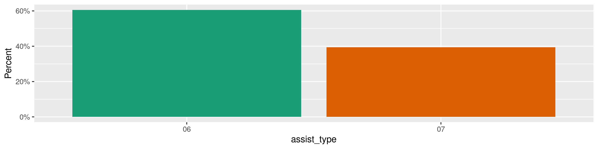
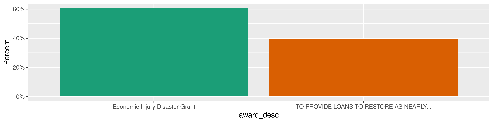
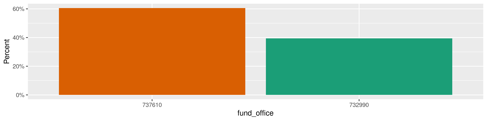
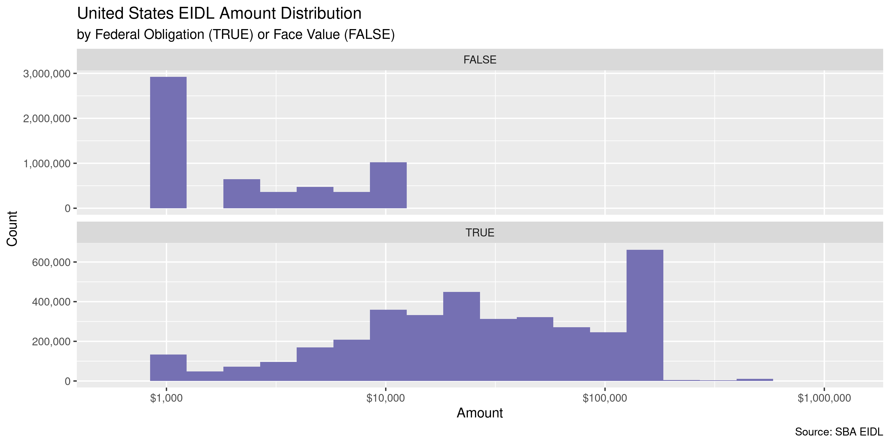
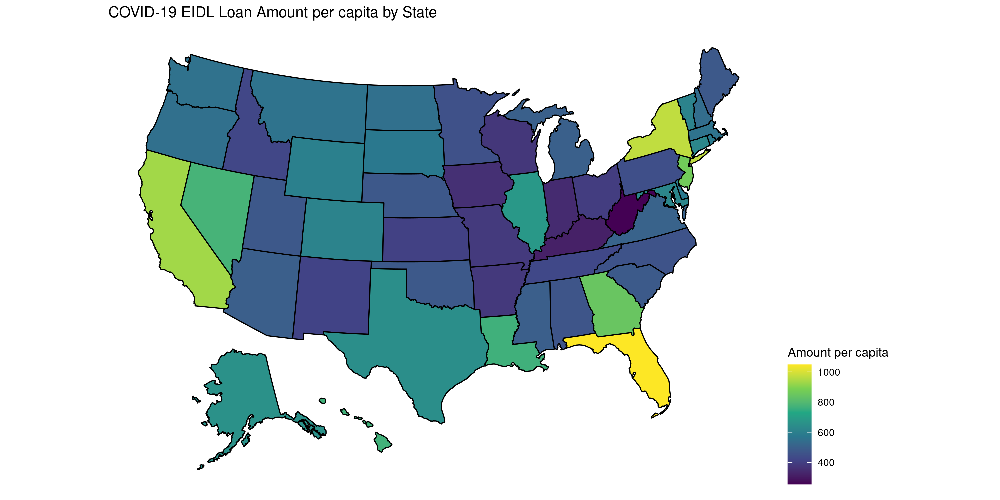
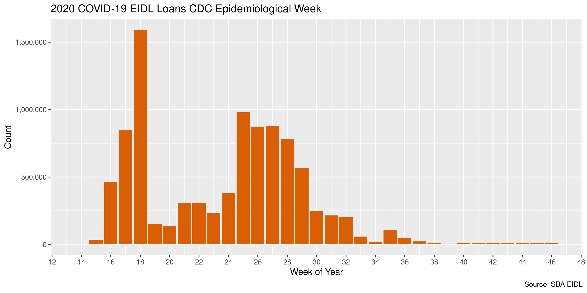
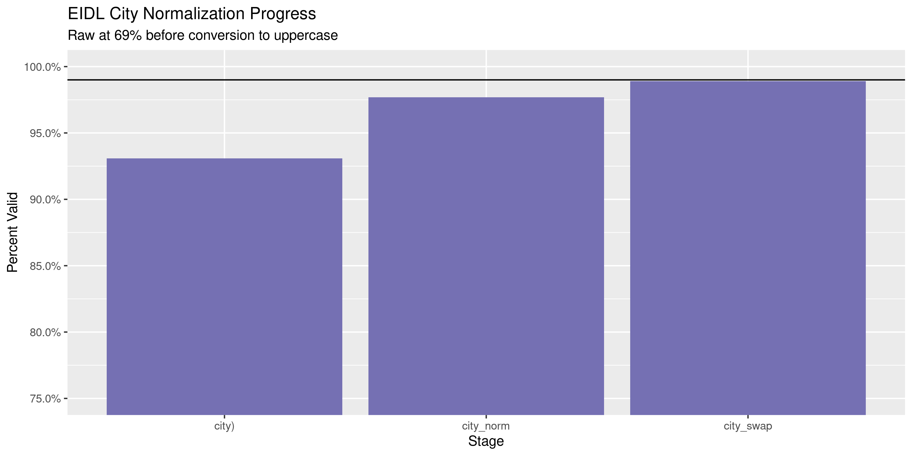
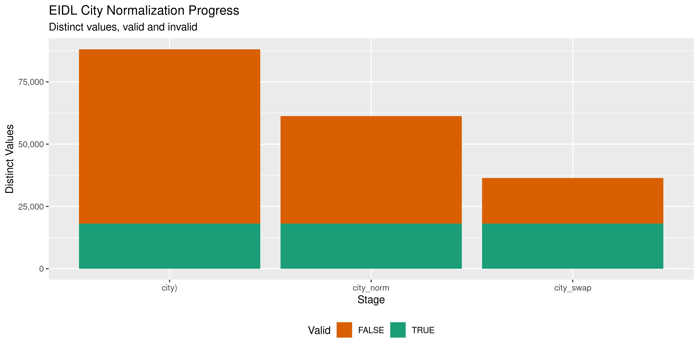

COVID-19 Economic Injury Disaster Loans Diary
================
Kiernan Nicholls
2020-12-04 17:06:33

  - [Project](#project)
  - [Objectives](#objectives)
  - [Packages](#packages)
  - [About](#about)
  - [Data](#data)
      - [Dictionary](#dictionary)
  - [Read](#read)
  - [Explore](#explore)
      - [Missing](#missing)
      - [Duplicates](#duplicates)
      - [Categorical](#categorical)
      - [Amounts](#amounts)
      - [Dates](#dates)
  - [Wrangle](#wrangle)
      - [Address](#address)
      - [ZIP](#zip)
      - [State](#state)
      - [City](#city)
  - [Conclude](#conclude)
  - [Export](#export)
  - [Upload](#upload)

<!-- Place comments regarding knitting here -->

## Project

The Accountability Project is an effort to cut across data silos and
give journalists, policy professionals, activists, and the public at
large a simple way to search across huge volumes of public data about
people and organizations.

Our goal is to standardizing public data on a few key fields by thinking
of each dataset row as a transaction. For each transaction there should
be (at least) 3 variables:

1.  All **parties** to a transaction.
2.  The **date** of the transaction.
3.  The **amount** of money involved.

## Objectives

This document describes the process used to complete the following
objectives:

1.  How many records are in the database?
2.  Check for entirely duplicated records.
3.  Check ranges of continuous variables.
4.  Is there anything blank or missing?
5.  Check for consistency issues.
6.  Create a five-digit ZIP Code called `zip`.
7.  Create a `year` field from the transaction date.
8.  Make sure there is data on both parties to a transaction.

## Packages

The following packages are needed to collect, manipulate, visualize,
analyze, and communicate these results. The `pacman` package will
facilitate their installation and attachment.

The IRW’s `campfin` package will also have to be installed from GitHub.
This package contains functions custom made to help facilitate the
processing of campaign finance data.

``` r
if (!require("pacman")) install.packages("pacman")
pacman::p_load_gh("irworkshop/campfin")
pacman::p_load(
  tidyverse, # data manipulation
  lubridate, # datetime strings
  gluedown, # printing markdown
  magrittr, # pipe operators
  janitor, # clean data frames
  refinr, # cluster and merge
  scales, # format strings
  readxl, # read excel files
  knitr, # knit documents
  vroom, # read files fast
  rvest, # html scraping
  glue, # combine strings
  here, # relative paths
  httr, # http requests
  fs # local storage 
)
```

This document should be run as part of the `R_campfin` project, which
lives as a sub-directory of the more general, language-agnostic
[`irworkshop/accountability_datacleaning`](https://github.com/irworkshop/accountability_datacleaning)
GitHub repository.

The `R_campfin` project uses the [RStudio
projects](https://support.rstudio.com/hc/en-us/articles/200526207-Using-Projects)
feature and should be run as such. The project also uses the dynamic
`here::here()` tool for file paths relative to *your* machine.

``` r
# where does this document knit?
here::here()
#> [1] "/home/kiernan/Code/tap/R_campfin"
```

## About

The Small Business Administration’s [Economic Injury Disaster
Loans](https://www.sba.gov/funding-programs/disaster-assistance) is a
program typically given to relieve the economic strain of natural
disasters on local economies. The loans are meant to cover operating
expenses that could have been met had the disaster not occurred. The
loans have a 3.75% interest rate for businesses and 2.75% for nonprofits
over a 30 year term.

The EIDL program was expanded during the COVID-19 pandemic:

> In response to the Coronavirus (COVID-19) pandemic, small business
> owners, including agricultural businesses, and nonprofit organizations
> in all U.S. states, Washington D.C., and territories can apply for an
> Economic Injury Disaster Loan. The EIDL program is designed to provide
> economic relief to businesses that are currently experiencing a
> temporary loss of revenue due to coronavirus (COVID-19).

The type of loans offered for COVID-19 applicants differ slightly:

> #### Who can use an SBA disaster loan?
> 
> *COVID-19 EIDL*: If you are a small businesses, nonprofit organization
> of any size, or a U.S. agricultural business with 500 or fewer
> employees that have suffered substantial economic injury as a result
> of the Coronavirus (COVID-19) pandemic, you can apply for the COVID-19
> EIDL. This loan applies to all businesses based in any U.S. state,
> territory, or the District of Columbia.
> 
> *ALL OTHER DISASTERS*: Businesses of all sizes located in declared
> disaster areas, private nonprofit organizations, homeowners, and
> renters affected by declared disaster, including civil unrest and
> natural disasters such as hurricanes, flooding, wildfires, etc.

> #### How to use an SBA disaster loan
> 
> ###### *COVID-19 EIDL*
> 
>   - For working capital
>   - Normal operating expenses (i.e. continuation of health care
>     benefits, rent, utilities, and fixed debt payments).
> 
> ###### *ALL OTHER DISASTERS*
> 
>   - Losses not covered by insurance or funding from the Federal
>     Emergency Management Agency (FEMA) for both personal and business.
>   - Business operating expenses that could have been met had the
>     disaster not occurred.

There are *two* type of loans offered through the EIDL program. Regular
loans are not forgivable while the *Advance* loans can be forgiven:

> EIDL Advance was a grant program offered together with the economic
> injury loan program. The amount of the grant was determined by the
> number of employees indicated on the EIDL application:
> $1,000/employee, up to a maximum of $10,000.
> 
>   - EIDL Advance does not have to be repaid.
>   - Recipients did not have to be approved for an EIDL loan to receive
>     the EIDL Advance.
>   - The amount of the loan Advance was deducted from total loan
>     eligibility.
>   - Businesses who received an EIDL Advance in addition to the
>     Paycheck Protection Program (eidl) loan will have the amount of
>     the EIDL Advance subtracted from the forgiveness amount of their
>     eidl loan.

## Data

In late November 2020, the Small Business administration was ordered by
a federal court to release detailed data on the recipients of Paycheck
Protection Program and Economic Disaster Injury Loans. On December 1,
the SBA complied with this request and published the data on their [Box
page](https://sba.app.box.com/s/5myd1nxutoq8wxecx2562baruz774si6). The
EIDL data is separated into regular and advance loan folders. These can
both be downloaded locally.

We can download the ZIP archives fro Box locally.

``` r
raw_dir <- dir_create(here("us", "covid", "eidl_covid", "data", "raw"))
raw_zip <- path(raw_dir, "120120 EIDL Data.zip")
adv_zip <- path(raw_dir, "120120 EIDL Advance Data.zip")
```

We can extract the CSV files from each archive.

``` r
raw_paths <- unzip(raw_zip, exdir = raw_dir, junkpaths = TRUE)
(raw_info <- raw_paths %>%
  map_df(unzip, list = TRUE) %>%
  as_tibble() %>%
  clean_names() %>%
  filter(length > 212))
```

``` r
for (i in seq_along(raw_paths)) {
  raw_paths[i] <- unzip(
    zipfile = raw_paths[i],
    files = raw_info$name[i],
    exdir = raw_dir,
    overwrite = FALSE
  )
}
```

The process can be repeated for the advance loan files.

``` r
adv_paths <- unzip(adv_zip, exdir = raw_dir, junkpaths = TRUE)
(adv_info <- adv_paths %>%
  map_df(unzip, list = TRUE) %>%
  as_tibble() %>%
  clean_names() %>%
  filter(length > 212))
```

``` r
for (i in seq_along(adv_paths)) {
  adv_paths[i] <- unzip(
    zipfile = adv_paths[i],
    files = adv_info$name[i],
    exdir = raw_dir,
    overwrite = FALSE
  )
}
```

### Dictionary

We can download an Excel file from the Treasury Depeartment that
contains some definitions for the variables in the data.

``` r
raw_names <- read_names(raw_paths[1])
dict_file <- path_temp("IDD-v2.0.xlsx")
dict_url <- "https://www.publicdebt.treas.gov/files/data-transparency/"
download.file(
  url = str_c(dict_url, basename(dict_file)),
  destfile = dict_file
)
```

``` r
dict <- read_excel(
  path = dict_file,
  sheet = "D2-Award (Financial Assistance)",
  .name_repair = make_clean_names,
  skip = 2
)
```

``` r
dict %>% 
  select(column, definition) %>% 
  mutate(across(column, md_code)) %>% 
  kable()
```

| column                                 | definition                                                                                                                                                                                                                                                                                                                                          |
| :------------------------------------- | :-------------------------------------------------------------------------------------------------------------------------------------------------------------------------------------------------------------------------------------------------------------------------------------------------------------------------------------------------- |
| `FAIN`                                 | The Federal Award Identification Number (FAIN) is the unique ID within the Federal agency for each (non-aggregate) financial assistance award.                                                                                                                                                                                                      |
| `URI`                                  | Unique Record Identifier. An agency defined identifier that (when provided) is unique for every financial assistance action reported by that agency. USAspending.gov and the Broker use URI as the Award ID for aggregate records.                                                                                                                  |
| `FederalActionObligation`              | Amount of Federal government’s obligation, de-obligation, or liability, in dollars, for an award transaction.                                                                                                                                                                                                                                       |
| `NonFederalFundingAmount`              | The amount of the award funded by non-Federal source(s), in dollars. Program Income (as defined in 2 CFR § 200.80) is not included until such time that Program Income is generated and credited to the agreement.                                                                                                                                  |
| `FaceValueOfDirectLoanOrLoanGuarantee` | The face value of the direct loan or loan guarantee.                                                                                                                                                                                                                                                                                                |
| `OriginalLoanSubsidyCost`              | The estimated long-term cost to the Government of a direct loan or loan guarantee, or modification thereof, calculated on a net present value basis, excluding administrative costs.                                                                                                                                                                |
| `ActionDate`                           | The date the action being reported was issued / signed by the Government or a binding agreement was reached.                                                                                                                                                                                                                                        |
| `PeriodOfPerformanceStartDate`         | The date on which, for the award referred to by the action being reported, awardee effort begins or the award is otherwise effective.                                                                                                                                                                                                               |
| `PeriodOfPerformanceCurrentEndDate`    | The current date on which, for the award referred to by the action being reported, awardee effort completes or the award is otherwise ended. Administrative actions related to this award may continue to occur after this date. This date does not apply to procurement indefinite delivery vehicles under which definitive orders may be awarded. |
| `AwardeeOrRecipientUniqueIdentifier`   | The unique identification number for an awardee or recipient. Currently the identifier is the 9-digit number assigned by Dun and Bradstreet (D\&B) referred to as the DUNS® number.                                                                                                                                                                 |
| `AwardeeOrRecipientLegalEntityName`    | The name of the awardee or recipient that relates to the unique identifier. For U.S. based companies, this name is what the business ordinarily files in formation documents with individual states (when required).                                                                                                                                |
| `LegalEntityCityName`                  | Name of the city in which the awardee or recipient’s legal business address is located.                                                                                                                                                                                                                                                             |
| `LegalEntityZIP5`                      | USPS five digit zoning code associated with the awardee or recipient’s legal business address. This field must be blank for non-US addresses.                                                                                                                                                                                                       |
| `LegalEntityZIPLast4`                  | USPS four digit extension code associated with the awardee or recipient’s legal business address. This must be blank for non-US addresses                                                                                                                                                                                                           |
| `LegalEntityCongressionalDistrict`     | The congressional district in which the awardee or recipient is located. This is not a required data element for non-U.S. addresses.                                                                                                                                                                                                                |
| `LegalEntityForeignCityName`           | For foreign recipients only: name of the city in which the awardee or recipient’s legal business address is located.                                                                                                                                                                                                                                |
| `LegalEntityForeignProvinceName`       | For foreign recipients only: name of the state or province in which the awardee or recipient’s legal business address is located.                                                                                                                                                                                                                   |
| `AssistanceType`                       | The type of assistance provided by the award.                                                                                                                                                                                                                                                                                                       |
| `BusinessFundsIndicator`               | The Business Funds Indicator sometimes abbreviated BFI. Code indicating the award’s applicability to the Recovery Act.                                                                                                                                                                                                                              |
| `BusinessTypes`                        | A collection of indicators of different types of recipients based on socio-economic status and organization / business areas.                                                                                                                                                                                                                       |
| `ActionType`                           | Description (and corresponding code) that provides information on any changes made to the Federal prime award. There are typically multiple actions for each award.                                                                                                                                                                                 |
| `RecordType`                           | Code indicating whether an action is an aggregate record, a non-aggregate record, or a non-aggregate record to an individual recipient (PII-Redacted).                                                                                                                                                                                              |

## Read

``` r
eidl <- map_df(
  .x = c(raw_paths, adv_paths),
  .f = read_delim,
  .id = "source_file",
  delim = ",",
  skip = 1,
  escape_backslash = FALSE,
  escape_double = FALSE,
  col_names = eidl_names,
  col_types = cols(
    .default = col_character(),
    action_date = col_date("%Y%m%d"),
    record_type = col_integer(),
    award_amend = col_integer(),
    period_start = col_date("%Y%m%d"),
    period_now = col_date("%Y%m%d"),
    fed_obligation = col_double(),
    nonfed_amount = col_double(),
    face_value = col_double(),
    og_loan_sub = col_double()
  )
)
```

``` r
if (interactive()) {
  eidl <- eidl %>% 
    remove_constant() %>% 
    remove_empty("cols")
}
```

``` r
eidl <- eidl %>% 
  relocate(source_file, .after = last_col()) %>% 
  mutate(advance_loan = str_detect(source_file, "Advance"))
```

## Explore

There are 9,555,185 rows of 47 rows. Each record represents a disaster
loan made to a small business.

``` r
nrow_pre <- nrow(eidl)
glimpse(eidl)
#> Rows: 9,555,185
#> Columns: 47
#> $ action_type    <chr> "A", "A", "A", "A", "A", "A", "A", "A", "A", "A", "A", "A", "A", "A", "A"…
#> $ action_date    <date> 2020-05-14, 2020-05-14, 2020-05-11, 2020-05-15, 2020-05-12, 2020-05-11, …
#> $ assist_type    <chr> "07", "07", "07", "07", "07", "07", "07", "07", "07", "07", "07", "07", "…
#> $ record_type    <int> 2, 2, 2, 2, 2, 2, 2, 2, 2, 2, 2, 2, 2, 2, 2, 2, 2, 2, 2, 2, 2, 2, 2, 2, 2…
#> $ fain           <chr> "6166667404", "6158417410", "5105167409", "6542677401", "5495557402", "46…
#> $ award_amend    <int> 1, 1, 1, 1, 1, 1, 1, 1, 1, 1, 1, 1, 1, 1, 1, 1, 1, 1, 1, 1, 1, 1, 1, 1, 1…
#> $ uri            <chr> NA, NA, NA, NA, NA, NA, NA, NA, NA, NA, NA, NA, NA, NA, NA, NA, NA, NA, N…
#> $ correct_delete <chr> NA, NA, NA, NA, NA, NA, NA, NA, NA, NA, NA, NA, NA, NA, NA, NA, NA, NA, N…
#> $ fy_qt_correct  <chr> NA, NA, NA, NA, NA, NA, NA, NA, NA, NA, NA, NA, NA, NA, NA, NA, NA, NA, N…
#> $ sai_num        <chr> "SAI Exempt", "SAI Exempt", "SAI Exempt", "SAI Exempt", "SAI Exempt", "SA…
#> $ awardee_name   <chr> "Les R. Rager,DDS", "Bob L Rylaarsdam", "MYO Investments Inc", "P.O.E.T. …
#> $ awardee_uuid   <chr> NA, NA, NA, NA, NA, NA, NA, NA, NA, NA, NA, NA, NA, NA, NA, NA, NA, NA, N…
#> $ addr1          <chr> "1957 HOWELL MILL RD NW", "647 Fairview Road ", "420 East Throckmorton Su…
#> $ addr2          <chr> NA, NA, NA, NA, NA, NA, NA, NA, NA, NA, NA, NA, NA, NA, NA, NA, NA, NA, N…
#> $ addr3          <chr> NA, NA, NA, NA, NA, NA, NA, NA, NA, NA, NA, NA, NA, NA, NA, NA, NA, NA, N…
#> $ city           <chr> "ATLANTA", "Grangeville", "Fort Worth", "Seal Beach", "Lancaster", "Saint…
#> $ state          <chr> "GA", "ID", "TX", "CA", "WI", "FL", "MO", "OR", "WA", "CA", "NY", "MD", "…
#> $ zip5           <chr> "30318", "83530", "76102", "90740", "53813", "33703", "64030", "97504", "…
#> $ zip4           <chr> "2522", "5184", "3755", "6429", "2120", "4904", "3035", "8144", "5421", "…
#> $ country        <chr> "USA", "USA", "USA", "USA", "USA", "USA", "USA", "USA", "USA", "USA", "US…
#> $ foreign_city   <chr> NA, NA, NA, NA, NA, NA, NA, NA, NA, NA, NA, NA, NA, NA, NA, NA, NA, NA, N…
#> $ foreign_prov   <chr> NA, NA, NA, NA, NA, NA, NA, NA, NA, NA, NA, NA, NA, NA, NA, NA, NA, NA, N…
#> $ foreign_post   <chr> NA, NA, NA, NA, NA, NA, NA, NA, NA, NA, NA, NA, NA, NA, NA, NA, NA, NA, N…
#> $ congress_dist  <chr> "05", "01", "12", "48", "03", "13", "05", "02", "07", "37", "05", "01", "…
#> $ business_type  <chr> "PR", "PR", "R", "R", "R", "R", "R", "R", "R", "R", "R", "R", "PR", "R", …
#> $ fund_agency    <chr> "073", "073", "073", "073", "073", "073", "073", "073", "073", "073", "07…
#> $ fund_sub       <chr> "7300", "7300", "7300", "7300", "7300", "7300", "7300", "7300", "7300", "…
#> $ fund_office    <chr> "732990", "732990", "732990", "732990", "732990", "732990", "732990", "73…
#> $ award_agency   <chr> "073", "073", "073", "073", "073", "073", "073", "073", "073", "073", "07…
#> $ award_sub      <chr> "7300", "7300", "7300", "7300", "7300", "7300", "7300", "7300", "7300", "…
#> $ award_office   <chr> "732990", "732990", "732990", "732990", "732990", "732990", "732990", "73…
#> $ cfda_num       <chr> "59.008", "59.008", "59.008", "59.008", "59.008", "59.008", "59.008", "59…
#> $ prime_cd       <chr> "GA**121", "ID**049", "TX**439", "CA**059", "WI**043", "FL**103", "MO**09…
#> $ prime_county   <chr> "USA", "USA", "USA", "USA", "USA", "USA", "USA", "USA", "USA", "USA", "US…
#> $ prime_zip9     <chr> NA, NA, NA, NA, NA, NA, NA, NA, NA, NA, NA, NA, NA, NA, NA, NA, NA, NA, N…
#> $ prime_foreign  <chr> NA, NA, NA, NA, NA, NA, NA, NA, NA, NA, NA, NA, NA, NA, NA, NA, NA, NA, N…
#> $ prime_congress <chr> "05", "01", "12", "48", "03", "13", "05", "02", "07", "37", "05", "01", "…
#> $ award_desc     <chr> "TO PROVIDE LOANS TO RESTORE AS NEARLY AS POSSIBLE THE VICTIMS OF ECONOMI…
#> $ period_start   <date> NA, NA, NA, NA, NA, NA, NA, NA, NA, NA, NA, NA, NA, NA, NA, NA, NA, NA, …
#> $ period_now     <date> NA, NA, NA, NA, NA, NA, NA, NA, NA, NA, NA, NA, NA, NA, NA, NA, NA, NA, …
#> $ fed_obligation <dbl> NA, NA, NA, NA, NA, NA, NA, NA, NA, NA, NA, NA, NA, NA, NA, NA, NA, NA, N…
#> $ nonfed_amount  <dbl> NA, NA, NA, NA, NA, NA, NA, NA, NA, NA, NA, NA, NA, NA, NA, NA, NA, NA, N…
#> $ face_value     <dbl> 65300, 150000, 150000, 48700, 150000, 23200, 150000, 10000, 150000, 84900…
#> $ og_loan_sub    <dbl> 8893.86, 20430.00, 20430.00, 6632.94, 20430.00, 3159.84, 20430.00, 1362.0…
#> $ biz_fund_id    <chr> "NON", "NON", "NON", "NON", "NON", "NON", "NON", "NON", "NON", "NON", "NO…
#> $ source_file    <chr> "/home/kiernan/Code/tap/R_campfin/us/covid/eidl_covid/data/raw/01 EIDL th…
#> $ advance_loan   <lgl> FALSE, FALSE, FALSE, FALSE, FALSE, FALSE, FALSE, FALSE, FALSE, FALSE, FAL…
tail(eidl)
#> # A tibble: 6 x 47
#>   action_type action_date assist_type record_type fain  award_amend uri   correct_delete
#>   <chr>       <date>      <chr>             <int> <chr>       <int> <chr> <chr>         
#> 1 A           2020-07-13  06                    2 EIDL…           1 <NA>  <NA>          
#> 2 A           2020-07-13  06                    2 EIDL…           1 <NA>  <NA>          
#> 3 A           2020-07-13  06                    2 EIDL…           1 <NA>  <NA>          
#> 4 A           2020-07-13  06                    2 EIDL…           1 <NA>  <NA>          
#> 5 A           2020-07-07  06                    2 EIDL…           1 <NA>  <NA>          
#> 6 A           2020-07-13  06                    2 EIDL…           1 <NA>  <NA>          
#> # … with 39 more variables: fy_qt_correct <chr>, sai_num <chr>, awardee_name <chr>,
#> #   awardee_uuid <chr>, addr1 <chr>, addr2 <chr>, addr3 <chr>, city <chr>, state <chr>,
#> #   zip5 <chr>, zip4 <chr>, country <chr>, foreign_city <chr>, foreign_prov <chr>,
#> #   foreign_post <chr>, congress_dist <chr>, business_type <chr>, fund_agency <chr>,
#> #   fund_sub <chr>, fund_office <chr>, award_agency <chr>, award_sub <chr>, award_office <chr>,
#> #   cfda_num <chr>, prime_cd <chr>, prime_county <chr>, prime_zip9 <chr>, prime_foreign <chr>,
#> #   prime_congress <chr>, award_desc <chr>, period_start <date>, period_now <date>,
#> #   fed_obligation <dbl>, nonfed_amount <dbl>, face_value <dbl>, og_loan_sub <dbl>,
#> #   biz_fund_id <chr>, source_file <chr>, advance_loan <lgl>
```

### Missing

Columns vary in their degree of missing values.

``` r
col_stats(eidl, count_na)
#> # A tibble: 47 x 4
#>    col            class        n          p
#>    <chr>          <chr>    <int>      <dbl>
#>  1 action_type    <chr>        0 0         
#>  2 action_date    <date>       0 0         
#>  3 assist_type    <chr>        0 0         
#>  4 record_type    <int>        0 0         
#>  5 fain           <chr>        0 0         
#>  6 award_amend    <int>        0 0         
#>  7 uri            <chr>  9555185 1         
#>  8 correct_delete <chr>  9555185 1         
#>  9 fy_qt_correct  <chr>  9555185 1         
#> 10 sai_num        <chr>        0 0         
#> 11 awardee_name   <chr>      122 0.0000128 
#> 12 awardee_uuid   <chr>  9555185 1         
#> 13 addr1          <chr>     6804 0.000712  
#> 14 addr2          <chr>  9555117 1.00      
#> 15 addr3          <chr>  9555185 1         
#> 16 city           <chr>       16 0.00000167
#> 17 state          <chr>        0 0         
#> 18 zip5           <chr>        0 0         
#> 19 zip4           <chr>      343 0.0000359 
#> 20 country        <chr>        0 0         
#> 21 foreign_city   <chr>  9555185 1         
#> 22 foreign_prov   <chr>  9555185 1         
#> 23 foreign_post   <chr>  9555185 1         
#> 24 congress_dist  <chr>     2545 0.000266  
#> 25 business_type  <chr>        0 0         
#> 26 fund_agency    <chr>        0 0         
#> 27 fund_sub       <chr>        0 0         
#> 28 fund_office    <chr>        0 0         
#> 29 award_agency   <chr>        0 0         
#> 30 award_sub      <chr>        0 0         
#> 31 award_office   <chr>        0 0         
#> 32 cfda_num       <chr>        0 0         
#> 33 prime_cd       <chr>        0 0         
#> 34 prime_county   <chr>        0 0         
#> 35 prime_zip9     <chr>  9555185 1         
#> 36 prime_foreign  <chr>  9555185 1         
#> 37 prime_congress <chr>     1712 0.000179  
#> 38 award_desc     <chr>        0 0         
#> 39 period_start   <date> 3766302 0.394     
#> 40 period_now     <date> 3766302 0.394     
#> 41 fed_obligation <dbl>  3766302 0.394     
#> 42 nonfed_amount  <dbl>  3766302 0.394     
#> 43 face_value     <dbl>  5788883 0.606     
#> 44 og_loan_sub    <dbl>  5788883 0.606     
#> 45 biz_fund_id    <chr>        0 0         
#> 46 source_file    <chr>        0 0         
#> 47 advance_loan   <lgl>        0 0
```

We can flag any record missing a variable needed to identify the
transaction.

``` r
unique(eidl$nonfed_amount)
#> [1] NA  0
```

``` r
eidl %>% 
  select(fed_obligation, face_value, og_loan_sub) %>% 
  sample_n(20)
#> # A tibble: 20 x 3
#>    fed_obligation face_value og_loan_sub
#>             <dbl>      <dbl>       <dbl>
#>  1           1000         NA         NA 
#>  2             NA     109900      14968.
#>  3           1000         NA         NA 
#>  4             NA     -83500     -11373.
#>  5             NA      90000      12258 
#>  6             NA      33900       4617.
#>  7             NA     117500      16004.
#>  8           1000         NA         NA 
#>  9           1000         NA         NA 
#> 10           1000         NA         NA 
#> 11             NA      12000       1634.
#> 12           4000         NA         NA 
#> 13             NA      34000       4631.
#> 14           1000         NA         NA 
#> 15           4000         NA         NA 
#> 16           4000         NA         NA 
#> 17             NA       6500        885.
#> 18           1000         NA         NA 
#> 19             NA     150000      20430 
#> 20           1000         NA         NA
```

``` r
eidl <- mutate(eidl, amount = coalesce(fed_obligation, face_value))
```

``` r
key_vars <- c("action_date", "awardee_name", "award_office", "amount")
eidl <- flag_na(eidl, all_of(key_vars))
```

``` r
sum(eidl$na_flag)
#> [1] 122
sum(is.na(eidl$awardee_name))
#> [1] 122
eidl %>% 
  filter(na_flag) %>% 
  select(all_of(key_vars))
#> # A tibble: 122 x 4
#>    action_date awardee_name award_office amount
#>    <date>      <chr>        <chr>         <dbl>
#>  1 2020-05-26  <NA>         732990         4300
#>  2 2020-06-04  <NA>         732990        20400
#>  3 2020-05-25  <NA>         732990         1500
#>  4 2020-06-03  <NA>         732990         4300
#>  5 2020-05-09  <NA>         732990        12000
#>  6 2020-05-09  <NA>         732990        11900
#>  7 2020-06-09  <NA>         732990       150000
#>  8 2020-06-05  <NA>         732990        14500
#>  9 2020-05-26  <NA>         732990         5100
#> 10 2020-06-05  <NA>         732990        22000
#> # … with 112 more rows
```

### Duplicates

We can also flag any record completely duplicated across every column.

``` r
dupe_file <- here("us", "covid", "eidl_covid", "dupes.tsv")
```

We flag these records by first identifying rows by a unique ID, then
splitting the data into chunks along a discrete variable and checking
each chunk for duplicate rows and saving any duplicate rows to a file.

``` r
eidl <- mutate(eidl, id = row_number(), .after = last_col())
```

``` r
if (!file_exists(dupe_file)) {
  file_create(dupe_file)
  eidls <- eidl %>% 
    select(-id, -fain, ) %>%
    group_split(action_date)
  split_id <- split(eidl$id, eidl$action_date)
  n_done <- 0
  pb <- txtProgressBar(max = nrow(eidl), style = 3)
  for (i in seq_along(eidls)) {
    n_new <- nrow(eidls[[i]])
    d1 <- duplicated(eidls[[i]], fromLast = FALSE)
    if (any(d1)) {
      d2 <- duplicated(eidls[[i]], fromLast = TRUE)
      dupes <- tibble(voter_id = split_id[[i]], dupe_flag = d1 | d2)
      dupes <- filter(dupes, dupe_flag == TRUE)
      vroom_write(dupes, dupe_file, append = TRUE)
      rm(d2, dupes)
    }
    rm(d1)
    eidls[i] <- list(NA)
    flush_memory(1)
    n_done <- n_done + n_new
    setTxtProgressBar(pb, value = n_done)
  }
  rm(eidls)
}
```

This file of duplicates can then be read and joined against the original
data.

``` r
file_size(dupe_file)
#> 4.9K
dupes <- read_tsv(
  file = dupe_file,
  col_names = c("id", "dupe_flag"),
  col_types = cols(
    id = col_integer(),
    dupe_flag = col_logical()
  )
)
```

``` r
nrow(eidl)
#> [1] 9555185
eidl <- left_join(eidl, dupes, by = "id")
eidl <- mutate(eidl, dupe_flag = !is.na(dupe_flag))
sum(eidl$dupe_flag)
#> [1] 398
eidl <- select(eidl, -id)
```

We can see that, despite a supposedly unique `fain`, there are duplicate
rows.

``` r
eidl %>% 
  filter(dupe_flag) %>% 
  select(fain, award_amend, all_of(key_vars), city) %>% 
  arrange(action_date, awardee_name)
#> # A tibble: 398 x 7
#>    fain          award_amend action_date awardee_name                  award_office amount city    
#>    <chr>               <int> <date>      <chr>                         <chr>         <dbl> <chr>   
#>  1 EIDLGT:33002…           1 2020-04-16  Salt River Salon DBA Salt Ri… 737610         1000 THAYNE  
#>  2 EIDLGT:33002…           1 2020-04-16  Salt River Salon DBA Salt Ri… 737610         1000 THAYNE  
#>  3 3142857208              1 2020-04-17  Abbiamo LLC                   732990        15000 Toluca …
#>  4 3142847205              1 2020-04-17  Abbiamo LLC                   732990        15000 Toluca …
#>  5 3142907210              1 2020-04-17  Azucena Valencia Law Corpora… 732990        23500 Pomona  
#>  6 3142917202              1 2020-04-17  Azucena Valencia Law Corpora… 732990        23500 Pomona  
#>  7 3143407204              1 2020-04-17  BC Restaurant LV LLC          732990       500000 LAS VEG…
#>  8 3143397203              1 2020-04-17  BC Restaurant LV LLC          732990       500000 LAS VEG…
#>  9 3143367205              1 2020-04-17  Beverly Hills Luxury Interio… 732990       189200 Los Ang…
#> 10 3143357202              1 2020-04-17  Beverly Hills Luxury Interio… 732990       189200 Los Ang…
#> # … with 388 more rows
```

### Categorical

``` r
col_stats(eidl, n_distinct)
#> # A tibble: 50 x 4
#>    col            class        n           p
#>    <chr>          <chr>    <int>       <dbl>
#>  1 action_type    <chr>        2 0.000000209
#>  2 action_date    <date>     195 0.0000204  
#>  3 assist_type    <chr>        2 0.000000209
#>  4 record_type    <int>        1 0.000000105
#>  5 fain           <chr>  9476823 0.992      
#>  6 award_amend    <int>       45 0.00000471 
#>  7 uri            <chr>        1 0.000000105
#>  8 correct_delete <chr>        1 0.000000105
#>  9 fy_qt_correct  <chr>        1 0.000000105
#> 10 sai_num        <chr>        1 0.000000105
#> 11 awardee_name   <chr>  9230812 0.966      
#> 12 awardee_uuid   <chr>        1 0.000000105
#> 13 addr1          <chr>  7035032 0.736      
#> 14 addr2          <chr>       65 0.00000680 
#> 15 addr3          <chr>        1 0.000000105
#> 16 city           <chr>   146845 0.0154     
#> 17 state          <chr>       57 0.00000597 
#> 18 zip5           <chr>    35498 0.00372    
#> 19 zip4           <chr>    10004 0.00105    
#> 20 country        <chr>        1 0.000000105
#> 21 foreign_city   <chr>        1 0.000000105
#> 22 foreign_prov   <chr>        1 0.000000105
#> 23 foreign_post   <chr>        1 0.000000105
#> 24 congress_dist  <chr>       57 0.00000597 
#> 25 business_type  <chr>        8 0.000000837
#> 26 fund_agency    <chr>        1 0.000000105
#> 27 fund_sub       <chr>        1 0.000000105
#> 28 fund_office    <chr>        2 0.000000209
#> 29 award_agency   <chr>        1 0.000000105
#> 30 award_sub      <chr>        1 0.000000105
#> 31 award_office   <chr>        2 0.000000209
#> 32 cfda_num       <chr>        2 0.000000209
#> 33 prime_cd       <chr>     4243 0.000444   
#> 34 prime_county   <chr>        1 0.000000105
#> 35 prime_zip9     <chr>        1 0.000000105
#> 36 prime_foreign  <chr>        1 0.000000105
#> 37 prime_congress <chr>       57 0.00000597 
#> 38 award_desc     <chr>        2 0.000000209
#> 39 period_start   <date>     159 0.0000166  
#> 40 period_now     <date>     159 0.0000166  
#> 41 fed_obligation <dbl>      417 0.0000436  
#> 42 nonfed_amount  <dbl>        2 0.000000209
#> 43 face_value     <dbl>     6853 0.000717   
#> 44 og_loan_sub    <dbl>     8613 0.000901   
#> 45 biz_fund_id    <chr>        1 0.000000105
#> 46 source_file    <chr>       12 0.00000126 
#> 47 advance_loan   <lgl>        2 0.000000209
#> 48 amount         <dbl>     7205 0.000754   
#> 49 na_flag        <lgl>        2 0.000000209
#> 50 dupe_flag      <lgl>        2 0.000000209
```

``` r
explore_plot(eidl, assist_type)
```

<!-- -->

``` r
explore_plot(eidl, award_desc) + scale_x_truncate(40)
```

<!-- -->

``` r
explore_plot(eidl, business_type)
```

<!-- -->

``` r
explore_plot(eidl, fund_office)
```

<!-- -->

### Amounts

``` r
summary(eidl$amount)
#>    Min. 1st Qu.  Median    Mean 3rd Qu.    Max. 
#> -500000    1000    5000   22359   16000  900000
mean(eidl$amount <= 0)
#> [1] 0.007667355
```

Most loan `amounts` are one of a few round integer values.

``` r
eidl %>% 
  count(fed_obligation, face_value, sort = TRUE) %>% 
  add_prop() %>% 
  mutate(cp = cumsum(p))
#> # A tibble: 7,268 x 5
#>    fed_obligation face_value       n      p    cp
#>             <dbl>      <dbl>   <int>  <dbl> <dbl>
#>  1           1000         NA 2921541 0.306  0.306
#>  2          10000         NA  931206 0.0975 0.403
#>  3           2000         NA  644316 0.0674 0.471
#>  4             NA     150000  567397 0.0594 0.530
#>  5           3000         NA  363208 0.0380 0.568
#>  6           4000         NA  254897 0.0267 0.595
#>  7           5000         NA  216500 0.0227 0.617
#>  8           6000         NA  145542 0.0152 0.633
#>  9             NA       1000  123857 0.0130 0.646
#> 10           7000         NA  108681 0.0114 0.657
#> # … with 7,258 more rows
```

<!-- -->

<!-- -->

### Dates

We can add the calendar year from `action_date` with
`lubridate::year()`.

``` r
eidl <- mutate(eidl, action_year = year(action_date))
```

All of the loans in this database were distributed between April and
November.

``` r
min(eidl$action_date)
#> [1] "2020-04-02"
max(eidl$action_date)
#> [1] "2020-11-14"
```

<!-- -->

## Wrangle

To improve the searchability of the database, we will perform some
consistent, confident string normalization. For geographic variables
like city names and ZIP codes, the corresponding `campfin::normal_*()`
functions are tailor made to facilitate this process.

We will also manually add the disbursing office and governing body.

``` r
office_codes <- tribble(
  ~fund_office, ~office,
  "732990", "Office of Disaster Assistance",
  "737610", "Office of Entrepreneurial Development"
)
```

``` r
eidl <- eidl %>% 
  mutate(govt = "US", agency = "Small Business Administration") %>% 
  left_join(office_codes)
```

``` r
count(eidl, fund_office, office)
#> # A tibble: 2 x 3
#>   fund_office office                                      n
#>   <chr>       <chr>                                   <int>
#> 1 732990      Office of Disaster Assistance         3766302
#> 2 737610      Office of Entrepreneurial Development 5788883
```

### Address

For the street `addresss` variable, the `campfin::normal_address()`
function will force consistence case, remove punctuation, and abbreviate
official USPS suffixes.

``` r
addr_file <- path(dirname(raw_dir), "addr.tsv")
```

``` r
if (file_exists(addr_file)) {
  norm_addr <- read_tsv(addr_file)
} else {
  norm_addr <- eidl %>%
    select(addr1, addr2) %>% 
    distinct() %>% 
    unite(
      col = addr_full,
      everything(),
      na.rm = TRUE,
      remove = FALSE,
    ) %>% 
    mutate(
      addr_norm = normal_address(
        address = addr_full,
        abbs = usps_street,
        na_rep = TRUE
      )
    ) %>% 
    select(-addr_full)
  write_tsv(distinct(norm_addr), addr_file)
}
```

    #> # A tibble: 10 x 3
    #>    addr1                              addr2 addr_norm                         
    #>    <chr>                              <chr> <chr>                             
    #>  1 1437 Jesse Bridge Rd               <NA>  1437 JESSE BRG RD                 
    #>  2 875 57th Street                    <NA>  875 57TH ST                       
    #>  3 4228 Glen Ridge Drive              <NA>  4228 GLN RDG DR                   
    #>  4 427 S. Boston Avenue, Suite B17    <NA>  427 S BOSTON AVE STE B 17         
    #>  5 5470 ELLSWORTH AVE STE 203         <NA>  5470 ELLSWORTH AVE STE 203        
    #>  6 13003 Madera Lane                  <NA>  13003 MADERA LN                   
    #>  7 345 saxony road #203               <NA>  345 SAXONY RD 203                 
    #>  8 708 Water Street                   <NA>  708 WATER ST                      
    #>  9 10180 west bay harbor drive ap     <NA>  10180 W BAY HBR DR AP             
    #> 10 Produce Distributor to Restaurants <NA>  PRODUCE DISTRIBUTOR TO RESTAURANTS

``` r
eidl <- left_join(eidl, norm_addr)
```

### ZIP

The business ZIP codes are already split into ZIP and ZIP+4 variables.

``` r
progress_table(
  eidl$zip5,
  compare = valid_zip
)
#> # A tibble: 1 x 6
#>   stage prop_in n_distinct prop_na n_out n_diff
#>   <chr>   <dbl>      <dbl>   <dbl> <dbl>  <dbl>
#> 1 zip5    0.999      35498       0  7411    292
```

### State

All of the `state` values are already valid.

``` r
progress_table(
  eidl$state,
  compare = valid_state
)
#> # A tibble: 1 x 6
#>   stage prop_in n_distinct prop_na n_out n_diff
#>   <chr>   <dbl>      <dbl>   <dbl> <dbl>  <dbl>
#> 1 state       1         57       0     0      0
```

### City

Cities are the most difficult geographic variable to normalize, simply
due to the wide variety of valid cities and formats.

#### Normal

The `campfin::normal_city()` function is a good start, again converting
case, removing punctuation, but *expanding* USPS abbreviations. We can
also remove `invalid_city` values.

``` r
norm_city <- eidl %>% 
  count(city, state, zip5, sort = TRUE) %>% 
  select(-n) %>% 
  mutate(
    city_norm = normal_city(
      city = city, 
      abbs = usps_city,
      states = "DC",
      na = invalid_city,
      na_rep = TRUE
    )
  )
```

#### Swap

We can further improve normalization by comparing our normalized value
against the *expected* value for that record’s state abbreviation and
ZIP code. If the normalized value is either an abbreviation for or very
similar to the expected value, we can confidently swap those two.

``` r
norm_city <- norm_city %>% 
  rename(city_raw = city) %>% 
  left_join(
    y = zipcodes,
    by = c("state", "zip5" = "zip")
  ) %>% 
  rename(city_match = city) %>% 
  mutate(
    match_abb = is_abbrev(city_norm, city_match),
    match_dist = str_dist(city_norm, city_match),
    city_swap = if_else(
      condition = !is.na(match_dist) & (match_abb | match_dist == 1),
      true = city_match,
      false = city_norm
    )
  ) %>% 
  select(
    -city_match,
    -match_dist,
    -match_abb
  ) %>% 
  rename(city = city_raw)
```

#### Progress

``` r
eidl <- left_join(eidl, norm_city, by = c("city", "state", "zip5"))
```

``` r
eidl <- mutate(
  .data = eidl,
  city_swap = city_swap %>% 
    str_replace("^NEW YORK CITY$", "NEW YORK")
)
```

``` r
many_city <- c(valid_city, extra_city)
eidl %>% 
  filter(city_swap %out% many_city) %>% 
  count(city_swap, state, sort = TRUE) %>% 
  add_prop(sum = TRUE)
#> # A tibble: 18,793 x 4
#>    city_swap         state     n      p
#>    <chr>             <chr> <int>  <dbl>
#>  1 FARMINGTON HILLS  MI     2791 0.0268
#>  2 HALLANDALE BEACH  FL     2660 0.0523
#>  3 HIALEAH GARDENS   FL     2256 0.0739
#>  4 SHELBY TOWNSHIP   MI     2204 0.0950
#>  5 PEMBROKE PNES     FL     1781 0.112 
#>  6 MANALAPAN         NJ     1639 0.128 
#>  7 SUNNY ISLES BEACH FL     1613 0.143 
#>  8 PORTER RANCH      CA     1552 0.158 
#>  9 DANIA BEACH       FL     1403 0.172 
#> 10 SEATAC            WA     1132 0.182 
#> # … with 18,783 more rows
```

| stage      | prop\_in | n\_distinct | prop\_na | n\_out | n\_diff |
| :--------- | -------: | ----------: | -------: | -----: | ------: |
| city)      |    0.931 |       88102 |        0 | 661185 |   70050 |
| city\_norm |    0.977 |       61231 |        0 | 221163 |   43134 |
| city\_swap |    0.989 |       36364 |        0 | 103859 |   18251 |

You can see how the percentage of valid values increased with each
stage.

<!-- -->

More importantly, the number of distinct values decreased each stage. We
were able to confidently change many distinct invalid values to their
valid equivalent.

<!-- -->

## Conclude

Before exporting, we can remove the intermediary normalization columns
and rename all added variables with the `_clean` suffix.

``` r
eidl <- eidl %>% 
  select(
    -city_norm,
    city_clean = city_swap
  ) %>% 
  rename_all(~str_replace(., "_norm", "_clean")) %>% 
  rename_all(~str_remove(., "_raw"))
```

``` r
glimpse(sample_n(eidl, 50))
#> Rows: 50
#> Columns: 56
#> $ action_type    <chr> "A", "A", "A", "A", "A", "A", "A", "A", "A", "A", "A", "A", "A", "A", "A"…
#> $ action_date    <date> 2020-07-06, 2020-06-22, 2020-06-18, 2020-04-18, 2020-07-09, 2020-05-15, …
#> $ assist_type    <chr> "06", "06", "07", "06", "06", "07", "06", "07", "06", "07", "07", "06", "…
#> $ record_type    <int> 2, 2, 2, 2, 2, 2, 2, 2, 2, 2, 2, 2, 2, 2, 2, 2, 2, 2, 2, 2, 2, 2, 2, 2, 2…
#> $ fain           <chr> "EIDLGT:3305442329", "EIDLGT:3305356391", "8469657909", "EIDLGT:330051224…
#> $ award_amend    <int> 1, 1, 1, 1, 1, 1, 1, 1, 1, 1, 1, 1, 1, 1, 1, 1, 1, 1, 1, 1, 1, 1, 1, 1, 1…
#> $ uri            <chr> NA, NA, NA, NA, NA, NA, NA, NA, NA, NA, NA, NA, NA, NA, NA, NA, NA, NA, N…
#> $ correct_delete <chr> NA, NA, NA, NA, NA, NA, NA, NA, NA, NA, NA, NA, NA, NA, NA, NA, NA, NA, N…
#> $ fy_qt_correct  <chr> NA, NA, NA, NA, NA, NA, NA, NA, NA, NA, NA, NA, NA, NA, NA, NA, NA, NA, N…
#> $ sai_num        <chr> "SAI Exempt", "SAI Exempt", "SAI Exempt", "SAI Exempt", "SAI Exempt", "SA…
#> $ awardee_name   <chr> "huseyin gurbuz DBA gurbuz catering", "Bernard Wiersema DBA Wiersema Tool…
#> $ awardee_uuid   <chr> NA, NA, NA, NA, NA, NA, NA, NA, NA, NA, NA, NA, NA, NA, NA, NA, NA, NA, N…
#> $ addr1          <chr> "650 avenue of the americas apt 3F", "417 N Main", "219 JEFFERSON STREET"…
#> $ addr2          <chr> NA, NA, NA, NA, NA, NA, NA, NA, NA, NA, NA, NA, NA, NA, NA, NA, NA, NA, N…
#> $ addr3          <chr> NA, NA, NA, NA, NA, NA, NA, NA, NA, NA, NA, NA, NA, NA, NA, NA, NA, NA, N…
#> $ city           <chr> "NEW YORK", "CHADWICK", "WAUSAU", "SANBORN", "ATLANTA", "Canton", "SPRING…
#> $ state          <chr> "NY", "IL", "WI", "NY", "GA", "GA", "MO", "NY", "FL", "NY", "NC", "FL", "…
#> $ zip5           <chr> "10011", "61014", "54403", "14132", "30350", "30115", "65804", "10040", "…
#> $ zip4           <chr> "2058", "9421", "5428", "9336", "2477", "2240", "3710", "1919", "6462", "…
#> $ country        <chr> "USA", "USA", "USA", "USA", "USA", "USA", "USA", "USA", "USA", "USA", "US…
#> $ foreign_city   <chr> NA, NA, NA, NA, NA, NA, NA, NA, NA, NA, NA, NA, NA, NA, NA, NA, NA, NA, N…
#> $ foreign_prov   <chr> NA, NA, NA, NA, NA, NA, NA, NA, NA, NA, NA, NA, NA, NA, NA, NA, NA, NA, N…
#> $ foreign_post   <chr> NA, NA, NA, NA, NA, NA, NA, NA, NA, NA, NA, NA, NA, NA, NA, NA, NA, NA, N…
#> $ congress_dist  <chr> "12", "17", "07", "27", "06", "11", "07", "13", "07", "05", "09", "25", "…
#> $ business_type  <chr> "P", "P", "MR", "P", "P", "PR", "R", "PR", "R", "R", "R", "R", "PR", "R",…
#> $ fund_agency    <chr> "073", "073", "073", "073", "073", "073", "073", "073", "073", "073", "07…
#> $ fund_sub       <chr> "7300", "7300", "7300", "7300", "7300", "7300", "7300", "7300", "7300", "…
#> $ fund_office    <chr> "737610", "737610", "732990", "737610", "737610", "732990", "737610", "73…
#> $ award_agency   <chr> "073", "073", "073", "073", "073", "073", "073", "073", "073", "073", "07…
#> $ award_sub      <chr> "7300", "7300", "7300", "7300", "7300", "7300", "7300", "7300", "7300", "…
#> $ award_office   <chr> "737610", "737610", "732990", "737610", "737610", "732990", "737610", "73…
#> $ cfda_num       <chr> "59.072", "59.072", "59.008", "59.072", "59.072", "59.008", "59.072", "59…
#> $ prime_cd       <chr> "NY**061", "IL**015", "WI**073", "NY**063", "GA**121", "GA**057", "MO**07…
#> $ prime_county   <chr> "USA", "USA", "USA", "USA", "USA", "USA", "USA", "USA", "USA", "USA", "US…
#> $ prime_zip9     <chr> NA, NA, NA, NA, NA, NA, NA, NA, NA, NA, NA, NA, NA, NA, NA, NA, NA, NA, N…
#> $ prime_foreign  <chr> NA, NA, NA, NA, NA, NA, NA, NA, NA, NA, NA, NA, NA, NA, NA, NA, NA, NA, N…
#> $ prime_congress <chr> "12", "17", "07", "27", "06", "11", "07", "13", "07", "05", "09", "25", "…
#> $ award_desc     <chr> "Economic Injury Disaster Grant", "Economic Injury Disaster Grant", "TO P…
#> $ period_start   <date> 2020-07-06, 2020-06-22, NA, 2020-04-18, 2020-07-09, NA, 2020-04-29, NA, …
#> $ period_now     <date> 2020-07-06, 2020-06-22, NA, 2020-04-18, 2020-07-09, NA, 2020-04-29, NA, …
#> $ fed_obligation <dbl> 1000, 1000, NA, 10000, 1000, NA, 5000, NA, 1000, NA, NA, 3000, NA, 1000, …
#> $ nonfed_amount  <dbl> 0, 0, NA, 0, 0, NA, 0, NA, 0, NA, NA, 0, NA, 0, 0, 0, NA, NA, 0, 0, NA, N…
#> $ face_value     <dbl> NA, NA, 150000, NA, NA, 38500, NA, 24900, NA, 59000, 2400, NA, 5000, NA, …
#> $ og_loan_sub    <dbl> NA, NA, 20430.00, NA, NA, 5243.70, NA, 3391.38, NA, 8035.80, 326.88, NA, …
#> $ biz_fund_id    <chr> "NON", "NON", "NON", "NON", "NON", "NON", "NON", "NON", "NON", "NON", "NO…
#> $ source_file    <chr> "/home/kiernan/Code/tap/R_campfin/us/covid/eidl_covid/data/raw/06 EIDL Ad…
#> $ advance_loan   <lgl> TRUE, TRUE, FALSE, TRUE, TRUE, FALSE, TRUE, FALSE, TRUE, FALSE, FALSE, TR…
#> $ amount         <dbl> 1000, 1000, 150000, 10000, 1000, 38500, 5000, 24900, 1000, 59000, 2400, 3…
#> $ na_flag        <lgl> FALSE, FALSE, FALSE, FALSE, FALSE, FALSE, FALSE, FALSE, FALSE, FALSE, FAL…
#> $ dupe_flag      <lgl> FALSE, FALSE, FALSE, FALSE, FALSE, FALSE, FALSE, FALSE, FALSE, FALSE, FAL…
#> $ action_year    <dbl> 2020, 2020, 2020, 2020, 2020, 2020, 2020, 2020, 2020, 2020, 2020, 2020, 2…
#> $ govt           <chr> "US", "US", "US", "US", "US", "US", "US", "US", "US", "US", "US", "US", "…
#> $ agency         <chr> "Small Business Administration", "Small Business Administration", "Small …
#> $ office         <chr> "Office of Entrepreneurial Development", "Office of Entrepreneurial Devel…
#> $ addr_clean     <chr> "650 AVE OF THE AMERICAS APT 3F", "417 N MAIN", "219 JEFFERSON ST", "2273…
#> $ city_clean     <chr> "NEW YORK", "CHADWICK", "WAUSAU", "SANBORN", "ATLANTA", "CANTON", "SPRING…
```

1.  There are 9,555,185 records in the database.
2.  There are 398 duplicate records in the database.
3.  The range and distribution of `amount` and `date` seem reasonable.
4.  There are 122 records missing key variables.
5.  Consistency in geographic data has been improved with
    `campfin::normal_*()`.
6.  The 4-digit `year` variable has been created with
    `lubridate::year()`.

## Export

Now the file can be saved on disk for upload to the Accountability
server.

``` r
clean_dir <- dir_create(here("us", "covid", "eidl_covid", "data", "clean"))
clean_path <- path(clean_dir, "us_eidl_covid.csv")
if (nrow(eidl) != nrow_pre) {
  stop("rows have been removed or added")
} else {
  write_csv(eidl, clean_path, na = "")
}
file_size(clean_path)
#> 4.58G
file_encoding(clean_path) %>% 
  mutate(across(path, path.abbrev))
#> # A tibble: 1 x 3
#>   path                                                                       mime           charset
#>   <fs::path>                                                                 <chr>          <chr>  
#> 1 /home/kiernan/Code/tap/R_campfin/us/covid/eidl_covid/data/clean/us_eidl_c… application/c… us-asc…
```

## Upload

We can use the `aws.s3::put_object()` to upload the text file to the IRW
server.

``` r
aws_path <- path("csv", basename(clean_path))
if (!object_exists(aws_path, "publicaccountability")) {
  put_object(
    file = clean_path,
    object = aws_path, 
    bucket = "publicaccountability",
    acl = "public-read",
    show_progress = TRUE,
    multipart = TRUE
  )
}
aws_head <- head_object(aws_path, "publicaccountability")
(aws_size <- as_fs_bytes(attr(aws_head, "content-length")))
unname(aws_size == clean_size)
```
