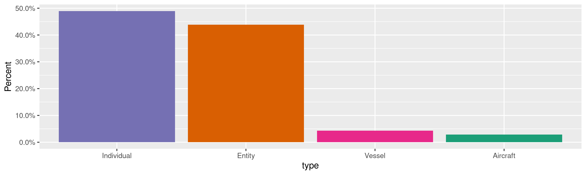
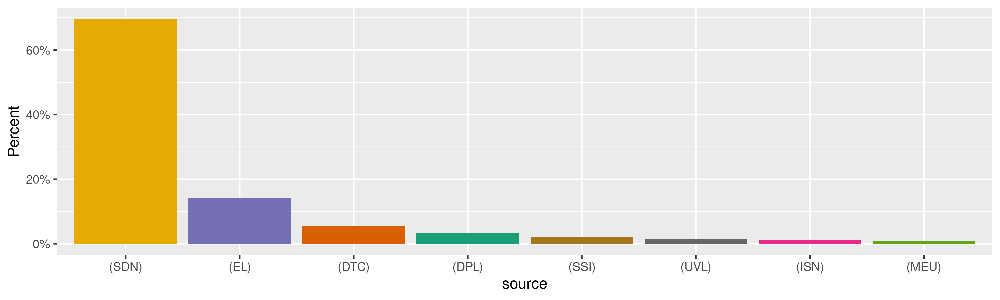

Consolidated Screening List
================
Kiernan Nicholls
Fri Mar 11 12:16:40 2022

-   [Project](#project)
-   [Objectives](#objectives)
-   [Packages](#packages)
-   [Source](#source)
-   [Download](#download)
-   [Dictionary](#dictionary)
-   [Read](#read)
-   [Explore](#explore)
    -   [Missing](#missing)
    -   [Duplicates](#duplicates)
    -   [Categorical](#categorical)
-   [Pivot](#pivot)
-   [Conclude](#conclude)
-   [Export](#export)
-   [Upload](#upload)
-   [Dictionary](#dictionary-1)

<!-- Place comments regarding knitting here -->

## Project

The Accountability Project is an effort to cut across data silos and
give journalists, policy professionals, activists, and the public at
large a simple way to search across huge volumes of public data about
people and organizations.

Our goal is to standardize public data on a few key fields by thinking
of each dataset row as a transaction. For each transaction there should
be (at least) 3 variables:

1.  All **parties** to a transaction.
2.  The **date** of the transaction.
3.  The **amount** of money involved.

## Objectives

This document describes the process used to complete the following
objectives:

1.  How many records are in the database?
2.  Check for entirely duplicated records.
3.  Check ranges of continuous variables.
4.  Is there anything blank or missing?
5.  Check for consistency issues.
6.  Create a five-digit ZIP Code called `zip`.
7.  Create a `year` field from the transaction date.
8.  Make sure there is data on both parties to a transaction.

## Packages

The following packages are needed to collect, manipulate, visualize,
analyze, and communicate these results. The `pacman` package will
facilitate their installation and attachment.

``` r
if (!require("pacman")) {
  install.packages("pacman")
}
pacman::p_load(
  tidyverse, # data manipulation
  lubridate, # datetime strings
  tabulizer, # read pdf tables
  gluedown, # printing markdown
  janitor, # clean data frames
  campfin, # custom irw tools
  aws.s3, # aws cloud storage
  refinr, # cluster & merge
  scales, # format strings
  knitr, # knit documents
  vroom, # fast reading
  rvest, # scrape html
  glue, # code strings
  here, # project paths
  httr, # http requests
  fs # local storage 
)
```

This diary was run using `campfin` version 1.0.8.9201.

``` r
packageVersion("campfin")
#> [1] '1.0.8.9201'
```

This document should be run as part of the `R_tap` project, which lives
as a sub-directory of the more general, language-agnostic
[`irworkshop/accountability_datacleaning`](https://github.com/irworkshop/accountability_datacleaning)
GitHub repository.

The `R_tap` project uses the [RStudio
projects](https://support.rstudio.com/hc/en-us/articles/200526207-Using-Projects)
feature and should be run as such. The project also uses the dynamic
`here::here()` tool for file paths relative to *your* machine.

``` r
# where does this document knit?
here::i_am("us/ofac_screen/docs/screening_list_diary.Rmd")
```

## Source

A copy of the Consolidated Screening List (CSL) can be obtained from
from the [U.S. Treasury
website.](https://www.trade.gov/consolidated-screening-list)

> The Consolidated Screening List (CSL) is a list of parties for which
> the United States Government maintains restrictions on certain
> exports, reexports, or transfers of items. Below, under “Tools” are
> links to the CSL search engine, downloadable CSL files, and the CSL
> Application Programming Interface (API), all consisting of the
> consolidation of multiple export screening lists of the Departments of
> Commerce, State, and Treasury.

We should note here the considerations listed on the Treasury website:

> ### Key Considerations:
>
> -   These tools are a consolidation of multiple export screening lists
>     of the Departments of Commerce, State, and the Treasury and may be
>     used as an aid to industry in conducting electronic screens of
>     potential parties to regulated transactions.
> -   In the event that a company, entity, or person on the list appears
>     to match a party potentially involved in your export transaction,
>     additional due diligence should be conducted before proceeding.
> -   There may be a strict export prohibition, requirement for seeking
>     a license application, evaluation of the end-use or user to ensure
>     it does not result in an activity prohibited by any U.S. export
>     regulations, or other restriction.
> -   Prior to taking further action, to ensure full compliance with all
>     of the terms and conditions of the restrictions placed on the
>     parties on this list, the user must check the official publication
>     of restricted parties in the Federal Register. They should also
>     check the official lists of restricted parties maintained on the
>     websites of the Departments of Commerce, State, and the Treasury.

## Download

We can directly download a copy of the list in tab-separated format.

> #### CSL Downloadable Files
>
> In the CSL downloadable files, there is a column which is titled
> “source.” This column indicates which specific federal agency’s
> proscribed party screening list is the source for each entry on the
> spreadsheet. Blank data fields in the CSL downloadable file are not
> applicable to the consolidated screening list in the “source” column.
> \* Instructions for Downloading the Consolidated Screening List \* CSV
> Download \* TSV Download (ASCII encoded)  
> \* JSON

From the above instructions file, there is information on the format.

> #### Data Specifications:
>
> Each file contains 27 columns – one for each field. The first row
> consists of the field names. Please note that some of the field names
> \[e.g., source, entity_number\] are longer than the data length of
> those fields.

> #### Recent Changes to the Files:
>
> On July 1, 2015, both the CSV and TSV files have been updated to
> accommodate changes in how the data is organized. Several of the field
> names have been updated and some of the fields contain additional
> information. For example, the City, State/Province, Postal Code, and
> Country have been combined into one addresses field. If an entity has
> more than one Address, then they are all included in the one field
> separated by semi-colons. This is true for alternate names as well.
> Because multiple addresses and alternate names have been combined,
> there are far fewer rows in the CSV/TSV files than previously.

``` r
raw_url <- "http://api.trade.gov/static/consolidated_screening_list/consolidated.tsv"
raw_dir <- dir_create(here("us", "ofac_screen", "data", "raw"))
raw_tsv <- path(raw_dir, basename(raw_url))
```

``` r
if (!file_exists(raw_tsv)) {
  download.file(raw_url, raw_tsv)
}
```

## Dictionary

We can get a dictionary of columns from the instructions PDF.

| column | field_name                 | description                                                                                                                                                                                                                                    |
|:-------|:---------------------------|:-----------------------------------------------------------------------------------------------------------------------------------------------------------------------------------------------------------------------------------------------|
| A      | `source`                   | 3-position code describing the source (agency or agency list) of the record (DPL= Denied Persons List, UVL= Unverified List, EL=Entity List, SDN= Specially Designated Nationals, DTC= AECA Debarred List, ISN= Nonproliferation Sanctions)    |
| B      | `entity_number`            | A number used by OFAC to uniquely identify the names of the Specially Designated Nationals (SDNs) (For SDN only. Null if not SDN)                                                                                                              |
| C      | `type`                     | Specifically identifies if the Specially Designated National (SDN) is an individual or vessel                                                                                                                                                  |
| D      | `programs`                 | The program in which the Specially Designated National falls under, as designated by OFAC, or the Nonproliferation Sanction, as designated by the legal authority of the State Department’s International Security and Nonproliferation (ISN). |
| E      | `name`                     | Name of the company, entity or person                                                                                                                                                                                                          |
| F      | `title`                    | Title or position held by the Specially Designated National                                                                                                                                                                                    |
| G      | `addresses`                | Addresses of the company, entity, or person. If the entity has more than one address, the addresses are separated by semi-colon.                                                                                                               |
| H      | `federal_register_notice`  | The official source of information about the parties on this list                                                                                                                                                                              |
| I      | `start_date`               | The effective date of the company, entity or person being on the list as defined by the Federal Register Notice                                                                                                                                |
| J      | `end_date`                 | The date the company, entity or person was lifted, waived or expired on or from the lists                                                                                                                                                      |
| K      | `standard_order`           | Whether or not (Y/N) the standard order applies to the Denied Party as defined by the Bureau of Industry and Security                                                                                                                          |
| L      | `license_requirement`      | The license requirement as determined by the Export Administration Regulations for the names on the Entity List (EL)                                                                                                                           |
| M      | `license_policy`           | The policy set forth in the Export Administration Regulations regarding denial of the name on the Entity List (EL)                                                                                                                             |
| N      | `call_sign`                | Call sign of the vessel listed on the Specially Designated Nationals list                                                                                                                                                                      |
| O      | `vessel_type`              | Describes the type of vessel (ferry, bulk cargo, tug) listed on the Specially Designated Nationals List                                                                                                                                        |
| P      | `gross_tonnage`            | The gross weight in tons not-registered for the vessel on the Specially Designated Nationals list                                                                                                                                              |
| Q      | `gross_registered_tonnage` | The gross weight in tons registered for the vessel on the Specially Designated Nationals list                                                                                                                                                  |
| R      | `vessel_flag`              | Country flag of the vessel on the Specially Designated Nationals List                                                                                                                                                                          |
| S      | `vessel_owner`             | Owner/Operator of the vessel on the Specially Designated Nationals List                                                                                                                                                                        |
| T      | `remarks`                  | Additional remarks or notes regarding the company, entity or person on the list                                                                                                                                                                |
| U      | `source_list_url`          | Website of the specific agency list                                                                                                                                                                                                            |
| V      | `alt_names`                | Alternate identity names separated by semi-colon                                                                                                                                                                                               |
| W      | `citizenships`             | Countries of citizenship separated by semi- colon                                                                                                                                                                                              |
| X      | `dates_of_birth`           | Alternate dates of birth separated by semi- colon                                                                                                                                                                                              |
| Y      | `nationalities`            | Alternate nationalities separated by semi- colon                                                                                                                                                                                               |
| Z      | `places_of_birth`          | Alternate places of birth separated by semi- colon                                                                                                                                                                                             |
| AA     | `source_information_url`   | Website of the source federal agency                                                                                                                                                                                                           |

## Read

``` r
csl <- read_delim(
  file = raw_tsv,
  delim = "\t",
  escape_backslash = FALSE,
  escape_double = FALSE,
  col_types = cols(
    .default = col_character()
  )
)
```

``` r
csl <- clean_names(csl, case = "snake")
```

## Explore

There are 13,383 rows of 29 columns. Each record represents a single
name of a person with whom the U.S. restricts business.

``` r
glimpse(csl)
#> Rows: 13,383
#> Columns: 29
#> $ id                       <chr> "deb7a1d5743a85c354ca1a2c7f2664e2104b32d7", "21944", "24904", "22084", "26860", "2609…
#> $ source                   <chr> "Denied Persons List (DPL) - Bureau of Industry and Security", "Specially Designated …
#> $ entity_number            <chr> NA, "21944", "24904", "22084", "26860", "26095", "9935", "17291", "17292", "12562", "…
#> $ type                     <chr> NA, "Individual", "Individual", "Individual", "Individual", "Individual", "Individual…
#> $ programs                 <chr> NA, "SYRIA", "SYRIA", "SYRIA", "IFSR; IRGC; SDGT", "SDGT", "SDGT", "SDGT", "SDGT", "S…
#> $ name                     <chr> " I. ASH", "'ABBAS, Rim", "'ABBAS, Yasir", "'ABBUD, Hikmat", "'ABD AL-HAMID AL-ASADI,…
#> $ title                    <chr> NA, "Scientific Studies and Research Center Employee", NA, "Scientific Studies and Re…
#> $ addresses                <chr> "UPON THE DATE OF THE ORDER INCARCERATED AT USM NO: 26265-177, FCI SEAGOVILLE, 2113 N…
#> $ federal_register_notice  <chr> "68 F.R. 38290 6/27/03 71 F.R. 38843 7/10/06 72 F.R. 4236 1/30/07", NA, NA, NA, NA, N…
#> $ start_date               <chr> "2003-06-19", NA, NA, NA, NA, NA, NA, NA, NA, NA, NA, NA, NA, NA, NA, NA, NA, NA, NA,…
#> $ end_date                 <chr> "2056-06-29", NA, NA, NA, NA, NA, NA, NA, NA, NA, NA, NA, NA, NA, NA, NA, NA, NA, NA,…
#> $ standard_order           <chr> "Y", NA, NA, NA, NA, NA, NA, NA, NA, NA, NA, NA, NA, NA, NA, NA, NA, NA, NA, NA, NA, …
#> $ license_requirement      <chr> NA, NA, NA, NA, NA, NA, NA, NA, NA, NA, NA, NA, NA, NA, NA, NA, NA, NA, NA, NA, NA, N…
#> $ license_policy           <chr> NA, NA, NA, NA, NA, NA, NA, NA, NA, NA, NA, NA, NA, NA, NA, NA, NA, NA, NA, NA, NA, N…
#> $ call_sign                <chr> NA, NA, NA, NA, NA, NA, NA, NA, NA, NA, NA, NA, NA, NA, NA, NA, NA, NA, NA, NA, NA, N…
#> $ vessel_type              <chr> NA, NA, NA, NA, NA, NA, NA, NA, NA, NA, NA, NA, NA, NA, NA, NA, NA, NA, NA, NA, NA, N…
#> $ gross_tonnage            <chr> NA, NA, NA, NA, NA, NA, NA, NA, NA, NA, NA, NA, NA, NA, NA, NA, NA, NA, NA, NA, NA, N…
#> $ gross_registered_tonnage <chr> NA, NA, NA, NA, NA, NA, NA, NA, NA, NA, NA, NA, NA, NA, NA, NA, NA, NA, NA, NA, NA, N…
#> $ vessel_flag              <chr> NA, NA, NA, NA, NA, NA, NA, NA, NA, NA, NA, NA, NA, NA, NA, NA, NA, NA, NA, NA, NA, N…
#> $ vessel_owner             <chr> NA, NA, NA, NA, NA, NA, NA, NA, NA, NA, NA, NA, NA, NA, NA, NA, NA, NA, NA, NA, NA, N…
#> $ remarks                  <chr> "FEDERAL REGISTER NOTICE UPDATED", NA, NA, NA, "(Linked To: ISLAMIC REVOLUTIONARY GUA…
#> $ source_list_url          <chr> "http://bit.ly/1Qi5heF", "http://bit.ly/1I7ipyR", "http://bit.ly/1I7ipyR", "http://bi…
#> $ alt_names                <chr> NA, NA, "'ABBAS, Yasir 'Aziz", NA, "ABDUL HAMEED AL ASADI, Makki Kadhim", "ABDELNASSE…
#> $ citizenships             <chr> NA, NA, NA, NA, NA, NA, NA, NA, NA, NA, NA, NA, NA, NA, NA, NA, NA, NA, NA, NA, NA, N…
#> $ dates_of_birth           <chr> NA, "1973-03-25", "1978-08-22", "1966-01-01", "1957-10-10", "1967; 1966; 1968", "1962…
#> $ nationalities            <chr> NA, "SY", "SY", "SY", NA, "IQ", "CA; SD", "JO", "JO", "AF", "SY", "SY", "SY", "SY", "…
#> $ places_of_birth          <chr> NA, NA, NA, NA, NA, "Tall 'Afar, Iraq", "Al-Bawgah, Sudan; Albaouga, Sudan", NA, "Ira…
#> $ source_information_url   <chr> "http://bit.ly/1iwxiF0", "http://bit.ly/1MLgpye", "http://bit.ly/1MLgpye", "http://bi…
#> $ ids                      <chr> NA, NA, "Male, Gender", NA, "Subject to Secondary Sanctions, Additional Sanctions Inf…
tail(csl)
#> # A tibble: 6 × 29
#>   id       source entity_number type  programs name  title addresses federal_registe… start_date end_date standard_order
#>   <chr>    <chr>  <chr>         <chr> <chr>    <chr> <chr> <chr>     <chr>            <chr>      <chr>    <chr>         
#> 1 b53f3b2… Entit… <NA>          <NA>  <NA>     Zurm… <NA>  Office N… 77 FR 25055      2012-04-27 <NA>     <NA>          
#> 2 e68d1a8… Entit… <NA>          <NA>  <NA>     Zurm… <NA>  House No… 77 FR 25055      2012-04-27 <NA>     <NA>          
#> 3 038b2fe… Entit… <NA>          <NA>  <NA>     Zurm… <NA>  House 01… 77 FR 25055      2012-04-27 <NA>     <NA>          
#> 4 3e02b87… Entit… <NA>          <NA>  <NA>     aBen… <NA>  Al Thura… 78 FR 18808      2013-03-28 <NA>     <NA>          
#> 5 8e818f3… Entit… <NA>          <NA>  <NA>     al A… <NA>  P.O. Box… 79 FR 32441      2014-06-05 <NA>     <NA>          
#> 6 6b7b550… Entit… <NA>          <NA>  <NA>     al T… <NA>  Beirut, … 79 FR 32441      2014-06-05 <NA>     <NA>          
#> # … with 17 more variables: license_requirement <chr>, license_policy <chr>, call_sign <chr>, vessel_type <chr>,
#> #   gross_tonnage <chr>, gross_registered_tonnage <chr>, vessel_flag <chr>, vessel_owner <chr>, remarks <chr>,
#> #   source_list_url <chr>, alt_names <chr>, citizenships <chr>, dates_of_birth <chr>, nationalities <chr>,
#> #   places_of_birth <chr>, source_information_url <chr>, ids <chr>
```

### Missing

Columns vary in their degree of missing values.

``` r
col_stats(csl, count_na)
#> # A tibble: 29 × 4
#>    col                      class     n     p
#>    <chr>                    <chr> <int> <dbl>
#>  1 id                       <chr>     0 0    
#>  2 source                   <chr>     0 0    
#>  3 entity_number            <chr>  3552 0.265
#>  4 type                     <chr>  3552 0.265
#>  5 programs                 <chr>  3385 0.253
#>  6 name                     <chr>     0 0    
#>  7 title                    <chr> 12386 0.926
#>  8 addresses                <chr>  3283 0.245
#>  9 federal_register_notice  <chr> 10203 0.762
#> 10 start_date               <chr> 11074 0.827
#> 11 end_date                 <chr> 12966 0.969
#> 12 standard_order           <chr> 12975 0.970
#> 13 license_requirement      <chr> 11389 0.851
#> 14 license_policy           <chr> 11389 0.851
#> 15 call_sign                <chr> 13299 0.994
#> 16 vessel_type              <chr> 13068 0.976
#> 17 gross_tonnage            <chr> 13317 0.995
#> 18 gross_registered_tonnage <chr> 13316 0.995
#> 19 vessel_flag              <chr> 12971 0.969
#> 20 vessel_owner             <chr> 13376 0.999
#> 21 remarks                  <chr>  8998 0.672
#> 22 source_list_url          <chr>     0 0    
#> 23 alt_names                <chr>  6988 0.522
#> 24 citizenships             <chr> 12544 0.937
#> 25 dates_of_birth           <chr>  8707 0.651
#> 26 nationalities            <chr> 11025 0.824
#> 27 places_of_birth          <chr> 10375 0.775
#> 28 source_information_url   <chr>     0 0    
#> 29 ids                      <chr>  5921 0.442
```

No rows are missing the `name` of the person or vehicle, but since the
data is so varied there is no consistency in other variables.

### Duplicates

We can also flag any record completely duplicated across every column.

``` r
csl <- flag_dupes(csl, -id)
sum(csl$dupe_flag)
#> [1] 0
```

There are no duplicate values in the data.

### Categorical

``` r
col_stats(csl, n_distinct)
#> # A tibble: 29 × 4
#>    col                      class     n        p
#>    <chr>                    <chr> <int>    <dbl>
#>  1 id                       <chr> 13302 0.994   
#>  2 source                   <chr>    13 0.000971
#>  3 entity_number            <chr>  9751 0.729   
#>  4 type                     <chr>     5 0.000374
#>  5 programs                 <chr>   254 0.0190  
#>  6 name                     <chr> 13152 0.983   
#>  7 title                    <chr>   611 0.0457  
#>  8 addresses                <chr>  6825 0.510   
#>  9 federal_register_notice  <chr>   597 0.0446  
#> 10 start_date               <chr>   297 0.0222  
#> 11 end_date                 <chr>   212 0.0158  
#> 12 standard_order           <chr>     5 0.000374
#> 13 license_requirement      <chr>    42 0.00314 
#> 14 license_policy           <chr>    36 0.00269 
#> 15 call_sign                <chr>    85 0.00635 
#> 16 vessel_type              <chr>    32 0.00239 
#> 17 gross_tonnage            <chr>    44 0.00329 
#> 18 gross_registered_tonnage <chr>    28 0.00209 
#> 19 vessel_flag              <chr>    29 0.00217 
#> 20 vessel_owner             <chr>     4 0.000299
#> 21 remarks                  <chr>  1249 0.0933  
#> 22 source_list_url          <chr>    10 0.000747
#> 23 alt_names                <chr>  6288 0.470   
#> 24 citizenships             <chr>   119 0.00889 
#> 25 dates_of_birth           <chr>  3701 0.277   
#> 26 nationalities            <chr>   173 0.0129  
#> 27 places_of_birth          <chr>  1841 0.138   
#> 28 source_information_url   <chr>    14 0.00105 
#> 29 ids                      <chr>  5774 0.431
```

<!-- --><!-- -->

## Pivot

The original format of the CSL lists a single *primary* name in the
`name` column and then a list of many *other* names in the `alt_names`
column. For our purposes, we are interested in making these alternative
names easily searchable. When a person is hoping to find results on a
given individual, we want to make it possible for *any* of their known
names to return information.

We can do this by un-nesting each of the alternate names into their own
copy of the original row, with the same additional information.

``` r
sum(str_count(csl$alt_names, ";"), na.rm = TRUE)
#> [1] 12762
```

``` r
csl <- csl %>% 
  mutate(across(where(is.character), str_squish)) %>% 
  unite(
    col = all_names, 
    name, alt_names,
    sep = "; ",
    remove = TRUE,
    na.rm = TRUE
  ) %>% 
  mutate(across(all_names, str_split, ";\\s")) %>% 
  unnest(
    cols = all_names,
    keep_empty = TRUE
  )
```

## Conclude

``` r
glimpse(sample_n(csl, 1000))
#> Rows: 1,000
#> Columns: 28
#> $ id                       <chr> "17967", "26626", "25932", "32731", "0062db77a4f15910a8bfd019b3256570e879f000", "3137…
#> $ source                   <chr> "Specially Designated Nationals (SDN) - Treasury Department", "Specially Designated N…
#> $ entity_number            <chr> "17967", "26626", "25932", "32731", NA, "31373", "22257", "16934", "16807", "16319", …
#> $ type                     <chr> "Individual", "Vessel", "Entity", "Entity", NA, "Individual", "Entity", "Individual",…
#> $ programs                 <chr> "SDGT", "VENEZUELA-EO13850", "IRAN", "BELARUS-EO14038", NA, "SDGT", "SYRIA", "UKRAINE…
#> $ all_names                <chr> "HARZI, Ali", "GP-23", "AHAK-E SANATI SIMAN SHARGH", "OOO DUBAI VOTER FRONT", "Beijin…
#> $ title                    <chr> NA, NA, NA, NA, NA, NA, NA, "Acting Governor of Sevastopol", NA, NA, "Director, Srpsk…
#> $ addresses                <chr> NA, NA, "IR", "ul. Petra Mstislavtsa, d. 9, pom. 10 (kabinet 34), Minsk, 220114, BY",…
#> $ federal_register_notice  <chr> NA, NA, NA, NA, "86 FR 36496", NA, NA, NA, NA, NA, NA, NA, NA, NA, NA, NA, NA, NA, NA…
#> $ start_date               <chr> NA, NA, NA, NA, "2021-07-12", NA, NA, NA, NA, NA, NA, NA, NA, NA, NA, NA, NA, NA, NA,…
#> $ end_date                 <chr> NA, NA, NA, NA, NA, NA, NA, NA, NA, NA, NA, NA, NA, NA, NA, NA, NA, NA, NA, NA, NA, N…
#> $ standard_order           <chr> NA, NA, NA, NA, NA, NA, NA, NA, NA, NA, NA, NA, NA, NA, NA, NA, NA, NA, NA, NA, NA, N…
#> $ license_requirement      <chr> NA, NA, NA, NA, "All items subject to the EAR. (See §744.11 of the EAR)", NA, NA, NA,…
#> $ license_policy           <chr> NA, NA, NA, NA, "Presumption of denial.", NA, NA, NA, NA, NA, NA, NA, NA, NA, NA, NA,…
#> $ call_sign                <chr> NA, NA, NA, NA, NA, NA, NA, NA, NA, NA, NA, NA, NA, NA, NA, NA, NA, NA, NA, NA, NA, N…
#> $ vessel_type              <chr> NA, "Drilling Ship", NA, NA, NA, NA, NA, NA, NA, NA, NA, NA, NA, NA, NA, NA, NA, NA, …
#> $ gross_tonnage            <chr> NA, NA, NA, NA, NA, NA, NA, NA, NA, NA, NA, NA, NA, NA, NA, NA, NA, NA, NA, NA, NA, N…
#> $ gross_registered_tonnage <chr> NA, NA, NA, NA, NA, NA, NA, NA, NA, NA, NA, NA, NA, NA, NA, NA, NA, NA, NA, NA, NA, N…
#> $ vessel_flag              <chr> NA, "Venezuela", NA, NA, NA, NA, NA, NA, NA, NA, NA, NA, NA, NA, NA, NA, NA, NA, NA, …
#> $ vessel_owner             <chr> NA, NA, NA, NA, NA, NA, NA, NA, NA, NA, NA, NA, NA, NA, NA, NA, NA, NA, NA, NA, NA, N…
#> $ remarks                  <chr> NA, "(Linked To: PETROLEOS DE VENEZUELA, S.A.)", "(Linked To: GHADIR INVESTMENT COMPA…
#> $ source_list_url          <chr> "http://bit.ly/1I7ipyR", "http://bit.ly/1I7ipyR", "http://bit.ly/1I7ipyR", "http://bi…
#> $ citizenships             <chr> NA, NA, NA, NA, NA, NA, NA, NA, NA, NA, NA, NA, NA, NA, NA, NA, NA, NA, NA, NA, NA, N…
#> $ dates_of_birth           <chr> "1986-03-09", NA, NA, NA, NA, "1981 to 1983", NA, "1960-08-22", NA, NA, "1958-01-27",…
#> $ nationalities            <chr> NA, NA, NA, NA, NA, "TZ", NA, NA, NA, NA, NA, NA, NA, "TR", NA, NA, NA, NA, NA, NA, "…
#> $ places_of_birth          <chr> "Tunis, Tunisia", NA, NA, NA, NA, "Pwani Region, Tanzania", NA, "Alagir, North Osseti…
#> $ source_information_url   <chr> "http://bit.ly/1MLgpye", "http://bit.ly/1MLgpye", "http://bit.ly/1MLgpye", "http://bi…
#> $ ids                      <chr> "TN, W342058, Passport", "IMO 8767977, Vessel Registration Identification", "Subject …
```

1.  There are 32,540 records in the database.
2.  There are 0 duplicate records in the database.
3.  The range and distribution of `amount` and `date` seem reasonable.
4.  There are 0 records missing key variables.
5.  Consistency in geographic data has been improved with
    `campfin::normal_*()`.
6.  The 4-digit `year` variable has been created with
    `lubridate::year()`.

## Export

Now the file can be saved on disk for upload to the Accountability
server.

``` r
clean_dir <- dir_create(here("us", "ofac_screen", "data", "clean"))
clean_csv <- path(clean_dir, glue("ofac_screening_list.csv"))
clean_rds <- path_ext_set(clean_csv, "rds")
basename(clean_csv)
#> [1] "ofac_screening_list.csv"
```

``` r
write_csv(csl, clean_csv, na = "")
write_rds(csl, clean_rds, compress = "xz")
(clean_size <- file_size(clean_csv))
#> 11.8M
```

## Upload

We can use the `aws.s3::put_object()` to upload the text file to the IRW
server.

``` r
aws_key <- path("csv", basename(clean_csv))
if (!object_exists(aws_key, "publicaccountability")) {
  put_object(
    file = clean_csv,
    object = aws_key, 
    bucket = "publicaccountability",
    acl = "public-read",
    show_progress = TRUE,
    multipart = TRUE
  )
}
aws_head <- head_object(aws_key, "publicaccountability")
(aws_size <- as_fs_bytes(attr(aws_head, "content-length")))
unname(aws_size == clean_size)
```

## Dictionary

The following table describes the variables in our final exported file:

| Column                     | Type        | Definition |
|:---------------------------|:------------|:-----------|
| `id`                       | `character` |            |
| `source`                   | `character` |            |
| `entity_number`            | `character` |            |
| `type`                     | `character` |            |
| `programs`                 | `character` |            |
| `all_names`                | `character` |            |
| `title`                    | `character` |            |
| `addresses`                | `character` |            |
| `federal_register_notice`  | `character` |            |
| `start_date`               | `character` |            |
| `end_date`                 | `character` |            |
| `standard_order`           | `character` |            |
| `license_requirement`      | `character` |            |
| `license_policy`           | `character` |            |
| `call_sign`                | `character` |            |
| `vessel_type`              | `character` |            |
| `gross_tonnage`            | `character` |            |
| `gross_registered_tonnage` | `character` |            |
| `vessel_flag`              | `character` |            |
| `vessel_owner`             | `character` |            |
| `remarks`                  | `character` |            |
| `source_list_url`          | `character` |            |
| `citizenships`             | `character` |            |
| `dates_of_birth`           | `character` |            |
| `nationalities`            | `character` |            |
| `places_of_birth`          | `character` |            |
| `source_information_url`   | `character` |            |
| `ids`                      | `character` |            |
