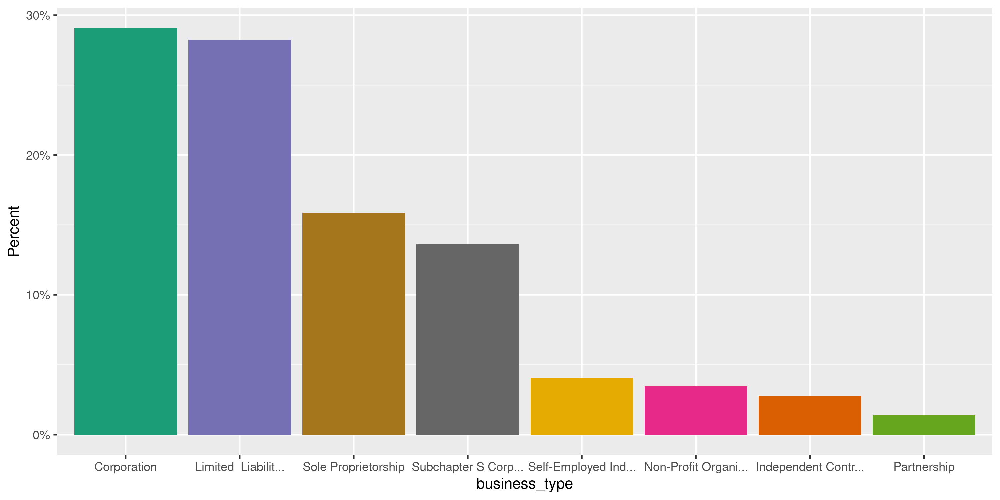

Paycheck Protection Program Loans
================
Kiernan Nicholls
2020-12-17 11:59:23

  - [Project](#project)
  - [Objectives](#objectives)
  - [Packages](#packages)
  - [Data](#data)
  - [Download](#download)
  - [Read](#read)
  - [Explore](#explore)
  - [Wrangle](#wrangle)
  - [Conclude](#conclude)
  - [Export](#export)
  - [Upload](#upload)
  - [Dictionary](#dictionary)
  - [By State](#by-state)

<!-- Place comments regarding knitting here -->

## Project

The Accountability Project is an effort to cut across data silos and
give journalists, policy professionals, activists, and the public at
large a simple way to search across huge volumes of public data about
people and organizations.

Our goal is to standardizing public data on a few key fields by thinking
of each dataset row as a transaction. For each transaction there should
be (at least) 3 variables:

1.  All **parties** to a transaction.
2.  The **date** of the transaction.
3.  The **amount** of money involved.

## Objectives

This document describes the process used to complete the following
objectives:

1.  How many records are in the database?
2.  Check for entirely duplicated records.
3.  Check ranges of continuous variables.
4.  Is there anything blank or missing?
5.  Check for consistency issues.
6.  Create a five-digit ZIP Code called `zip`.
7.  Create a `year` field from the transaction date.
8.  Make sure there is data on both parties to a transaction.

## Packages

The following packages are needed to collect, manipulate, visualize,
analyze, and communicate these results. The `pacman` package will
facilitate their installation and attachment.

The IRW’s `campfin` package will also have to be installed from GitHub.
This package contains functions custom made to help facilitate the
processing of campaign finance data.

``` r
if (!require("pacman")) install.packages("pacman")
pacman::p_load_gh("irworkshop/campfin")
pacman::p_load(
  tidyverse, # data manipulation
  lubridate, # datetime strings
  gluedown, # printing markdown
  janitor, # clean data frames
  aws.s3, # upload to aws s3
  refinr, # cluster and merge
  scales, # format strings
  knitr, # knit documents
  vroom, # read files fast
  rvest, # html scraping
  glue, # combine strings
  here, # relative paths
  httr, # http requests
  fs # local storage 
)
```

This document should be run as part of the `R_campfin` project, which
lives as a sub-directory of the more general, language-agnostic
[`irworkshop/accountability_datacleaning`](https://github.com/irworkshop/accountability_datacleaning)
GitHub repository.

The `R_campfin` project uses the [RStudio
projects](https://support.rstudio.com/hc/en-us/articles/200526207-Using-Projects)
feature and should be run as such. The project also uses the dynamic
`here::here()` tool for file paths relative to *your* machine.

``` r
# where does this document knit?
here::here()
#> [1] "/home/kiernan/Code/tap/R_campfin"
```

## Data

On December 1, 2020 the Small Business Administration was ordered by the
court to release more detailed data on loans made through the Paycheck
Protection Program (PPP), a major facet of the 2020 CARES Act to provide
stimulus funding during the ongoing COVID-19 pandemic. This detailed
release came after the SBA initially refused to publish any database,
then released only partial data on the largest loan recipients. The full
database now contains all recipient names, addresses, and exact loan
amounts.

> #### PPP Is A Delegated Loan Making Process
> 
> PPP loans are not made by SBA. PPP loans are made by lending
> institutions and then guaranteed by SBA. Accordingly, borrowers apply
> to lenders and self-certify that they are eligible for PPP loans. The
> self- certification includes a good faith certification that the
> borrower has economic need requiring the loan and that the borrower
> has applied the affiliation rules and is a small business. The lender
> then reviews the borrower’s application, and if all the paperwork is
> in order, approves the loan and submits it to SBA…

> #### Cancelled Loans Do Not Appear In The PPP Loan Data
> 
> The public PPP data includes only active loans. Loans that were
> cancelled for any reason are not included in the public data release.

## Download

We can download PPP loan data from the SBA Box server as a ZIP archive.

> Owner: Small Business Administration Enterprise Owner: U.S. Small
> Business Administration Created: Dec 1, 2020, 3:15 PM Modified: Dec 1,
> 2020, 3:31 PM Size: 210.3 MB

``` r
raw_dir <- dir_create(here("us", "covid", "ppp", "data", "raw"))
raw_zip <- path(raw_dir, "120120 Paycheck Protection Program Data.zip")
```

We can extract all files from the archive to a `data/raw/` directory.

``` r
raw_paths <- unzip(
  zipfile = raw_zip, 
  exdir = raw_dir,
  junkpaths = TRUE
)
```

``` r
raw_info <- raw_paths %>% 
  map_df(unzip, list = TRUE) %>% 
  as_tibble() %>% 
  clean_names() %>% 
  filter(length > 212)
```

``` r
for (i in seq_along(raw_paths)) {
  raw_paths[i] <- unzip(
    zipfile = raw_paths[i], 
    files = raw_info$name[i],
    exdir = raw_dir
  )
}
```

## Read

We can read all these files into a single data frame using
`purrr::map_df()` and `readr::read_delim()`.

``` r
ppp <- map_df(
  .x = raw_paths, 
  .f = read_delim,
  .id = "SourceFile",
  delim = ",",
  escape_double = TRUE,
  na = c("", "N/A"),
  col_types = cols(
    .default = col_character(),
    LoanAmount = col_double(),
    DateApproved = col_date_usa(),
    JobsReported = col_integer()
  )
)
```

``` r
ppp <- ppp %>% 
  clean_names("snake") %>% 
  relocate(source_file, .after = last_col()) %>%
  mutate(
    source_file = basename(raw_paths)[as.integer(source_file)],
    non_profit = !is.na(non_profit)
  )
```

## Explore

There are 5,156,850 rows of 17 columns. Each record is a loan issued to
a “small” business through a private lending bank and backed by the U.S.
federal government.

``` r
glimpse(ppp)
#> Rows: 5,156,850
#> Columns: 17
#> $ loan_amount    <dbl> 148440.00, 140081.78, 136520.96, 128440.00, 126798.00, 125916.00, 111200.…
#> $ business_name  <chr> "NOT AVAILABLE", "NORTH CHARLESTON HOSPITALITY GROUP LLC", "Q AND J SERVI…
#> $ address        <chr> NA, "192 College Park Rd", "301 Old Georgetown Road", NA, "24500 CAPITOL"…
#> $ city           <chr> NA, "Ladson", "Manning", NA, "REDFORD", "Spartanburg", NA, NA, "PASADENA"…
#> $ state          <chr> NA, NA, NA, NA, NA, NA, NA, NA, NA, NA, NA, NA, NA, NA, NA, NA, NA, NA, N…
#> $ zip            <chr> NA, "29456", "29102", NA, "48239", "29303", NA, NA, "91101", NA, NA, NA, …
#> $ naics_code     <chr> "339114", NA, "541990", "339114", NA, "999990", "332710", "238990", "6212…
#> $ business_type  <chr> NA, "Limited  Liability Company(LLC)", "Limited  Liability Company(LLC)",…
#> $ race_ethnicity <chr> "Unanswered", "Unanswered", "Unanswered", "Unanswered", "Unanswered", "Un…
#> $ gender         <chr> "Unanswered", "Unanswered", "Unanswered", "Unanswered", "Male Owned", "Un…
#> $ veteran        <chr> "Unanswered", "Unanswered", "Unanswered", "Unanswered", "Non-Veteran", "U…
#> $ non_profit     <lgl> FALSE, FALSE, FALSE, FALSE, FALSE, FALSE, FALSE, FALSE, FALSE, FALSE, FAL…
#> $ jobs_reported  <int> 12, 3, 170, 9, 20, 13, 10, NA, 9, NA, 20, NA, NA, NA, NA, NA, 10, 16, 5, …
#> $ date_approved  <date> 2020-05-01, 2020-05-01, 2020-05-01, 2020-05-01, 2020-05-01, 2020-05-01, …
#> $ lender         <chr> "Bank of America, National Association", "Synovus Bank", "Synovus Bank", …
#> $ cd             <chr> NA, "SC-01", "SC-06", NA, "MI-13", "SC-04", NA, NA, "CA-27", NA, NA, NA, …
#> $ source_file    <chr> "01 PPP sub 150k through 112420.csv", "01 PPP sub 150k through 112420.csv…
tail(ppp)
#> # A tibble: 6 x 17
#>   loan_amount business_name address city  state zip   naics_code business_type race_ethnicity
#>         <dbl> <chr>         <chr>   <chr> <chr> <chr> <chr>      <chr>         <chr>         
#> 1      150400 LOU TAUBERT … 125 E.… CASP… WY    82601 448190     Corporation   Unanswered    
#> 2      150375 ROADWORX, IN… 110 ME… EVAN… WY    82930 237310     Subchapter S… Unanswered    
#> 3      150000 ROY E PAULSO… 102 N.… CASP… WY    82601 621210     Corporation   White         
#> 4      150000 SWEETWATER C… 1715 H… GREE… WY    82935 624410     Non-Profit C… Unanswered    
#> 5      150000 EDEN LIFE CA… 30 N. … SHER… WY    82801 621610     Corporation   Unanswered    
#> 6      150000 S & S JOHNSO… 7342 G… TETO… WY    83025 722511     Subchapter S… Unanswered    
#> # … with 8 more variables: gender <chr>, veteran <chr>, non_profit <lgl>, jobs_reported <int>,
#> #   date_approved <date>, lender <chr>, cd <chr>, source_file <chr>
```

### Missing

Variables differ in their degree of missing values.

``` r
col_stats(ppp, count_na)
#> # A tibble: 17 x 4
#>    col            class       n         p
#>    <chr>          <chr>   <int>     <dbl>
#>  1 loan_amount    <dbl>       0 0        
#>  2 business_name  <chr>      86 0.0000167
#>  3 address        <chr>    3116 0.000604 
#>  4 city           <chr>     201 0.0000390
#>  5 state          <chr>     165 0.0000320
#>  6 zip            <chr>     196 0.0000380
#>  7 naics_code     <chr>  132940 0.0258   
#>  8 business_type  <chr>    4451 0.000863 
#>  9 race_ethnicity <chr>       0 0        
#> 10 gender         <chr>       0 0        
#> 11 veteran        <chr>       0 0        
#> 12 non_profit     <lgl>       0 0        
#> 13 jobs_reported  <int>  336466 0.0652   
#> 14 date_approved  <date>      0 0        
#> 15 lender         <chr>       0 0        
#> 16 cd             <chr>     537 0.000104 
#> 17 source_file    <chr>       0 0
```

We can flag any record missing a key variable.

``` r
key_vars <- c("business_name", "lender", "date_approved", "loan_amount")
ppp <- flag_na(ppp, all_of(key_vars))
```

There are 86 records missing mostly the business name.

``` r
ppp %>% 
  filter(na_flag) %>% 
  select(all_of(key_vars))
#> # A tibble: 86 x 4
#>    business_name lender                          date_approved loan_amount
#>    <chr>         <chr>                           <date>              <dbl>
#>  1 <NA>          Kabbage, Inc.                   2020-06-03          6003 
#>  2 <NA>          Ameris Bank                     2020-07-23          5000 
#>  3 <NA>          Fresno First Bank               2020-04-28         70430 
#>  4 <NA>          NCMIC Finance Corporation       2020-08-04         20832 
#>  5 <NA>          U.S. Bank, National Association 2020-05-01         20832 
#>  6 <NA>          First Bank                      2020-07-23         16956.
#>  7 <NA>          Cross River Bank                2020-05-01         14720 
#>  8 <NA>          WebBank                         2020-05-01          8797 
#>  9 <NA>          Cross River Bank                2020-06-28          5587 
#> 10 <NA>          MBE Capital Partners            2020-08-03          5100 
#> # … with 76 more rows
```

### Duplicates

There is a small number of duplicate records in the database, all of
which can be flagged with a new logical variable.

We can also flag any record completely duplicated across every column.

``` r
dupe_file <- here("us", "covid", "ppp", "dupes.tsv")
```

``` r
ppp <- mutate(ppp, id = row_number(), .after = last_col())
```

``` r
if (!file_exists(dupe_file)) {
  file_create(dupe_file)
  pps <- ppp %>% 
    select(-id) %>% 
    group_split(date_approved)
  split_id <- split(ppp$id, ppp$date_approved)
  pb <- txtProgressBar(max = length(pps), style = 3)
  for (i in seq_along(pps)) {
    d1 <- duplicated(pps[[i]], fromLast = FALSE)
    if (any(d1)) {
      d2 <- duplicated(pps[[i]], fromLast = TRUE)
      dupes <- tibble(voter_id = split_id[[i]], dupe_flag = d1 | d2)
      dupes <- filter(dupes, dupe_flag == TRUE)
      vroom_write(dupes, dupe_file, append = TRUE)
      rm(d2, dupes)
    }
    rm(d1)
    flush_memory(1)
    setTxtProgressBar(pb, i)
  }
  rm(pps)
}
```

``` r
file_size(dupe_file)
#> 1.23K
dupes <- read_tsv(
  file = dupe_file,
  col_names = c("id", "dupe_flag"),
  col_types = cols(
    id = col_integer(),
    dupe_flag = col_logical()
  )
)
```

``` r
nrow(ppp)
#> [1] 5156850
ppp <- left_join(ppp, dupes, by = "id")
ppp <- mutate(ppp, dupe_flag = !is.na(dupe_flag))
sum(ppp$dupe_flag)
#> [1] 99
ppp <- select(ppp, -id)
```

We can see that, despite unique IDs, there are duplicate voters. All of
these apparent duplicates are missing many of the key values needed to
identify a record.

``` r
ppp %>% 
  filter(dupe_flag) %>% 
  select(all_of(key_vars), state)
#> # A tibble: 99 x 5
#>    business_name             lender                                 date_approved loan_amount state
#>    <chr>                     <chr>                                  <date>              <dbl> <chr>
#>  1 ADVANCED PODIATRY         Wells Fargo Bank, National Association 2020-05-01          24343 AZ   
#>  2 ADVANCED PODIATRY         Wells Fargo Bank, National Association 2020-05-01          24343 AZ   
#>  3 YOLANDAFOGLE              Glacier Bank                           2020-05-02          21700 AZ   
#>  4 YOLANDAFOGLE              Glacier Bank                           2020-05-02          21700 AZ   
#>  5 CENTRAL ENDODONTICS INC   Wells Fargo Bank, National Association 2020-05-01          56208 CA   
#>  6 CENTRAL ENDODONTICS INC   Wells Fargo Bank, National Association 2020-05-01          56208 CA   
#>  7 LA PRECIOSA MARKET        Customers Bank                         2020-04-30          21224 CA   
#>  8 LA PRECIOSA MARKET        Customers Bank                         2020-04-30          21224 CA   
#>  9 LAW OFFICE OF L AARON LEE Wells Fargo Bank, National Association 2020-05-01          10953 CA   
#> 10 LAW OFFICE OF L AARON LEE Wells Fargo Bank, National Association 2020-05-01          10953 CA   
#> # … with 89 more rows
```

``` r
ppp %>% 
  filter(dupe_flag) %>% 
  col_stats(count_na)
#> # A tibble: 19 x 4
#>    col            class      n      p
#>    <chr>          <chr>  <int>  <dbl>
#>  1 loan_amount    <dbl>      0 0     
#>  2 business_name  <chr>      0 0     
#>  3 address        <chr>      0 0     
#>  4 city           <chr>      0 0     
#>  5 state          <chr>      0 0     
#>  6 zip            <chr>      0 0     
#>  7 naics_code     <chr>      4 0.0404
#>  8 business_type  <chr>      0 0     
#>  9 race_ethnicity <chr>      0 0     
#> 10 gender         <chr>      0 0     
#> 11 veteran        <chr>      0 0     
#> 12 non_profit     <lgl>      0 0     
#> 13 jobs_reported  <int>      8 0.0808
#> 14 date_approved  <date>     0 0     
#> 15 lender         <chr>      0 0     
#> 16 cd             <chr>      0 0     
#> 17 source_file    <chr>      0 0     
#> 18 na_flag        <lgl>      0 0     
#> 19 dupe_flag      <lgl>      0 0
```

### Categorical

``` r
col_stats(ppp, n_distinct)
#> # A tibble: 19 x 4
#>    col            class        n           p
#>    <chr>          <chr>    <int>       <dbl>
#>  1 loan_amount    <dbl>   704891 0.137      
#>  2 business_name  <chr>  5004636 0.970      
#>  3 address        <chr>  4623338 0.897      
#>  4 city           <chr>    65145 0.0126     
#>  5 state          <chr>       59 0.0000114  
#>  6 zip            <chr>    36659 0.00711    
#>  7 naics_code     <chr>     1243 0.000241   
#>  8 business_type  <chr>       18 0.00000349 
#>  9 race_ethnicity <chr>        9 0.00000175 
#> 10 gender         <chr>        3 0.000000582
#> 11 veteran        <chr>        3 0.000000582
#> 12 non_profit     <lgl>        2 0.000000388
#> 13 jobs_reported  <int>      503 0.0000975  
#> 14 date_approved  <date>     115 0.0000223  
#> 15 lender         <chr>     4863 0.000943   
#> 16 cd             <chr>      444 0.0000861  
#> 17 source_file    <chr>        6 0.00000116 
#> 18 na_flag        <lgl>        2 0.000000388
#> 19 dupe_flag      <lgl>        2 0.000000388
```

``` r
explore_plot(ppp, business_type) + scale_x_truncate()
```

<!-- -->

``` r
explore_plot(ppp, gender)
```

<!-- -->

``` r
explore_plot(ppp, veteran)
```

<!-- -->

``` r
explore_plot(ppp, non_profit)
```

<!-- -->

### Amounts

Since the amount values for loans over $150,000 are given as a range, we
can’t combine them with the exact `loan_amount` given for aggregated
records.

``` r
summary(ppp$loan_amount)
#>     Min.  1st Qu.   Median     Mean  3rd Qu.     Max. 
#>        0    10617    22880   101409    69500 10000000
sum(ppp$loan_amount <= 0)
#> [1] 1
sum(ppp$loan_amount == 1e7)
#> [1] 609
```

<!-- -->

<!-- -->

| Lending Bank                                | Loan Count | Mean Loan | Median Loan | Total Loaned | Proportion |
| :------------------------------------------ | :--------- | :-------- | :---------- | :----------- | :--------- |
| **All Other**                               | 3,038,714  | $116,510  | $28,258     | $3.5e+11     | 67.701%    |
| JPMorgan Chase Bank, National Association   | 280,160    | $104,753  | $28,740     | $2.9e+10     | 5.612%     |
| Bank of America, National Association       | 343,400    | $74,335   | $20,833     | $2.6e+10     | 4.881%     |
| PNC Bank, National Association              | 73,909     | $175,818  | $42,000     | $1.3e+10     | 2.485%     |
| Truist Bank d/b/a Branch Banking & Trust Co | 81,942     | $154,069  | $39,400     | $1.3e+10     | 2.414%     |
| Wells Fargo Bank, National Association      | 194,291    | $54,190   | $18,979     | $1.1e+10     | 2.013%     |
| TD Bank, National Association               | 85,705     | $99,696   | $25,750     | $8.5e+09     | 1.634%     |
| KeyBank National Association                | 43,134     | $190,340  | $43,828     | $8.2e+09     | 1.570%     |
| U.S. Bank, National Association             | 108,038    | $70,185   | $20,832     | $7.6e+09     | 1.450%     |
| Zions Bank, A Division of                   | 47,824     | $146,447  | $32,500     | $7.0e+09     | 1.339%     |
| Manufacturers and Traders Trust Company     | 34,649     | $195,095  | $47,100     | $6.8e+09     | 1.293%     |
| The Huntington National Bank                | 38,484     | $170,698  | $41,100     | $6.6e+09     | 1.256%     |
| Cross River Bank                            | 194,422    | $33,136   | $19,062     | $6.4e+09     | 1.232%     |
| Fifth Third Bank                            | 39,922     | $135,623  | $24,832     | $5.4e+09     | 1.035%     |
| Citizens Bank, National Association         | 50,950     | $95,493   | $23,100     | $4.9e+09     | 0.930%     |
| Regions Bank                                | 47,190     | $100,287  | $22,316     | $4.7e+09     | 0.905%     |
| Celtic Bank Corporation                     | 147,223    | $26,214   | $9,941      | $3.9e+09     | 0.738%     |
| Kabbage, Inc.                               | 161,174    | $18,997   | $11,002     | $3.1e+09     | 0.586%     |
| Customers Bank                              | 69,295     | $38,286   | $13,544     | $2.7e+09     | 0.507%     |
| WebBank                                     | 76,424     | $28,601   | $14,000     | $2.2e+09     | 0.418%     |

### Dates

We can add the calendar year from `date_approved` with
`lubridate::year()`

``` r
ppp <- mutate(ppp, year_approved = year(date_approved))
```

``` r
min(ppp$date_approved)
#> [1] "2020-04-03"
sum(ppp$year_approved < 2020)
#> [1] 0
max(ppp$date_approved)
#> [1] "2020-08-09"
sum(ppp$date_approved > today())
#> [1] 0
```

<!-- -->

## Wrangle

To improve the searchability of the database, we will perform some
consistent, confident string normalization. For geographic variables
like city names and ZIP codes, the corresponding `campfin::normal_*()`
functions are tailor made to facilitate this process.

### Address

For the street `addresss` variable, the `campfin::normal_address()`
function will force consistence case, remove punctuation, and abbreviate
official USPS suffixes.

``` r
ppp <- ppp %>% 
  mutate(
    address_norm = normal_address(
      address = address,
      abbs = usps_street,
      na_rep = TRUE
    )
  )
```

``` r
ppp %>% 
  select(starts_with("address")) %>% 
  distinct() %>% 
  sample_n(10)
#> # A tibble: 10 x 2
#>    address                  address_norm            
#>    <chr>                    <chr>                   
#>  1 1312 LOUISVILLE AVE      1312 LOUISVILLE AVE     
#>  2 2301 FM 2729             2301 FM 2729            
#>  3 78 5th Ave               78 5TH AVE              
#>  4 766 E. CRESCENT PL       766 E CRES PL           
#>  5 2521 Gilmer St           2521 GILMER ST          
#>  6 1701 Forest Ridge Drive  1701 FRST RDG DR        
#>  7 4010 SAN AMARO DR        4010 SAN AMARO DR       
#>  8 571 POOLES CREEK RD      571 POOLES CRK RD       
#>  9 6911 FM 620 N BLDG C-100 6911 FM 620 N BLDG C 100
#> 10 1216 HIGHLAND ST         1216 HIGHLAND ST
```

### ZIP

The `zip` variable is already extremely clean.

``` r
progress_table(ppp$zip, compare = valid_zip)
#> # A tibble: 1 x 6
#>   stage prop_in n_distinct   prop_na n_out n_diff
#>   <chr>   <dbl>      <dbl>     <dbl> <dbl>  <dbl>
#> 1 zip     0.999      36659 0.0000380  3671    295
```

### State

The `state` variable is also entirely clean, aside from two values.

For these values of “XX” with a valid `zip` variable, we can use the
matched state abbreviation instead.

``` r
ppp %>% 
  filter(state %out% valid_state) %>% 
  count(state, zip, city, sort = TRUE) %>% 
  left_join(zipcodes, by = "zip")
#> # A tibble: 29 x 6
#>    state.x zip   city.x            n city.y        state.y
#>    <chr>   <chr> <chr>         <int> <chr>         <chr>  
#>  1 <NA>    <NA>  <NA>            138 <NA>          <NA>   
#>  2 FI      33069 Pompano Beach     1 POMPANO BEACH FL     
#>  3 <NA>    01776 SUDBURY           1 SUDBURY       MA     
#>  4 <NA>    07005 BOONTON           1 BOONTON       NJ     
#>  5 <NA>    11501 MINEOLA           1 MINEOLA       NY     
#>  6 <NA>    11753 JERICHO           1 JERICHO       NY     
#>  7 <NA>    27410 GREENSBORO        1 GREENSBORO    NC     
#>  8 <NA>    29078 LUGOFF            1 LUGOFF        SC     
#>  9 <NA>    29102 Manning           1 MANNING       SC     
#> 10 <NA>    29150 Sumter            1 SUMTER        SC     
#> # … with 19 more rows
```

``` r
state_match <- select(zipcodes, zip, state_norm = state)
ppp <- left_join(ppp, state_match, by = "zip")
ppp$state_norm[ppp$state != "XX"] <- NA
ppp <- mutate(ppp, state_norm = coalesce(state_norm, state))
ppp$state_norm <- str_replace(ppp$state_norm, "FI", "FL")
```

``` r
sum(ppp$state == "XX")
#> [1] NA
sum(ppp$state_norm == "XX")
#> [1] NA
ppp %>% 
  filter(state == "XX") %>% 
  count(state_norm, sort = TRUE)
#> # A tibble: 0 x 2
#> # … with 2 variables: state_norm <chr>, n <int>
```

### City

Cities are the most difficult geographic variable to normalize, simply
due to the wide variety of valid cities and formats.

#### Normal

The `campfin::normal_city()` function is a good start, again converting
case, removing punctuation, but *expanding* USPS abbreviations. We can
also remove `invalid_city` values.

``` r
ppp <- ppp %>% 
  mutate(
    city_norm = normal_city(
      city = city, 
      abbs = usps_city,
      states = "DC",
      na = invalid_city,
      na_rep = TRUE
    )
  )
```

#### Swap

We can further improve normalization by comparing our normalized value
against the *expected* value for that record’s state abbreviation and
ZIP code. If the normalized value is either an abbreviation for or very
similar to the expected value, we can confidently swap those two.

``` r
ppp <- ppp %>% 
  rename(city_raw = city) %>% 
  left_join(
    y = zipcodes,
    by = c(
      "state_norm" = "state",
      "zip" = "zip"
    )
  ) %>% 
  rename(city_match = city) %>% 
  mutate(
    match_abb = is_abbrev(city_norm, city_match),
    match_dist = str_dist(city_norm, city_match),
    city_swap = if_else(
      condition = !is.na(match_dist) & (match_abb | match_dist == 1),
      true = city_match,
      false = city_norm
    )
  ) %>% 
  select(
    -city_match,
    -match_dist,
    -match_abb
  )
```

#### Refine

The [OpenRefine](https://openrefine.org/) algorithms can be used to
group similar strings and replace the less common versions with their
most common counterpart. This can greatly reduce inconsistency, but with
low confidence; we will only keep any refined strings that have a valid
city/state/zip combination.

``` r
good_refine <- ppp %>% 
  mutate(
    city_refine = city_swap %>% 
      key_collision_merge() %>% 
      n_gram_merge(numgram = 1)
  ) %>% 
  filter(city_refine != city_swap) %>% 
  inner_join(
    y = zipcodes,
    by = c(
      "city_refine" = "city",
      "state_norm" = "state",
      "zip" = "zip"
    )
  )
```

    #> # A tibble: 824 x 5
    #>    state_norm zip   city_swap              city_refine        n
    #>    <chr>      <chr> <chr>                  <chr>          <int>
    #>  1 SC         29406 NORTH CHARLESTON       CHARLESTON       416
    #>  2 NY         11733 SETAUKET               EAST SETAUKET     96
    #>  3 CA         90292 MARINA DALE REY        MARINA DEL REY    93
    #>  4 NY         11733 SETAUKET EAST SETAUKET EAST SETAUKET     32
    #>  5 CA         92625 CORONA DALE MAR        CORONA DEL MAR    29
    #>  6 IN         46184 NEW WHITELAND          WHITELAND         18
    #>  7 IL         60429 EAST HAZEL CREST       HAZEL CREST       15
    #>  8 HI         96813 HONOLULULULU           HONOLULU           6
    #>  9 IL         60067 PALENTINE              PALATINE           6
    #> 10 HI         96813 HONOLULUNOLULU         HONOLULU           5
    #> # … with 814 more rows

Then we can join the refined values back to the database.

``` r
ppp <- ppp %>% 
  left_join(good_refine) %>% 
  mutate(city_refine = coalesce(city_refine, city_swap))
```

#### Progress

| stage        | prop\_in | n\_distinct | prop\_na | n\_out | n\_diff |
| :----------- | -------: | ----------: | -------: | -----: | ------: |
| city\_raw)   |    0.982 |       37808 |        0 |  91792 |   19613 |
| city\_norm   |    0.988 |       34466 |        0 |  59819 |   16259 |
| city\_swap   |    0.993 |       25311 |        0 |  35381 |    7067 |
| city\_refine |    0.993 |       24655 |        0 |  34247 |    6412 |

You can see how the percentage of valid values increased with each
stage.

<!-- -->

More importantly, the number of distinct values decreased each stage. We
were able to confidently change many distinct invalid values to their
valid equivalent.

<!-- -->

## Conclude

Before exporting, we can remove the intermediary normalization columns
and rename all added variables with the `_clean` suffix.

``` r
ppp <- ppp %>% 
  select(
    -city_norm,
    -city_swap,
    city_clean = city_refine
  ) %>% 
  rename_all(~str_replace(., "_norm", "_clean")) %>% 
  rename_all(~str_remove(., "_raw"))
```

``` r
glimpse(sample_n(ppp, 20))
#> Rows: 20
#> Columns: 23
#> $ loan_amount    <dbl> 36900.0, 37499.0, 15625.0, 21363.0, 12305.0, 18000.0, 16595.0, 79300.0, 5…
#> $ business_name  <chr> "DUNCANS AUTO & TRUCK REPAIR, INC.", "BAGELSMITH FOOD STORE & DELI INC.",…
#> $ address        <chr> "2325 S BELT", "172 Perryville Road", "410 S GRAND AVE", "9803 Harwin Dr.…
#> $ city           <chr> "BELLEVILLE", "hampton", "COVINA", "Houston", "GRAY", "OKLAHOMA CITY", "T…
#> $ state          <chr> "IL", "NJ", "CA", "TX", "GA", "OK", "CA", "FL", "GA", "CA", "AZ", "IN", "…
#> $ zip            <chr> "62226", "08827", "91724", "77036", "31032", "73120", "92591", "33907", "…
#> $ naics_code     <chr> "811111", "722310", "522298", "713990", "561730", "531210", "423220", "52…
#> $ business_type  <chr> "Corporation", "Corporation", "Corporation", "Subchapter S Corporation", …
#> $ race_ethnicity <chr> "Unanswered", "Unanswered", "Unanswered", "Unanswered", "Unanswered", "Un…
#> $ gender         <chr> "Unanswered", "Unanswered", "Unanswered", "Unanswered", "Unanswered", "Un…
#> $ veteran        <chr> "Unanswered", "Unanswered", "Unanswered", "Veteran", "Unanswered", "Unans…
#> $ non_profit     <lgl> FALSE, FALSE, FALSE, FALSE, FALSE, FALSE, FALSE, FALSE, FALSE, FALSE, FAL…
#> $ jobs_reported  <int> 3, 11, NA, 1, 3, 1, 0, 0, 6, 2, NA, 3, 22, 1, 1, 0, 1, 1, 12, 5
#> $ date_approved  <date> 2020-04-29, 2020-04-27, 2020-05-01, 2020-04-10, 2020-06-19, 2020-04-28, …
#> $ lender         <chr> "Bank of Belleville", "Investors Bank", "Wells Fargo Bank, National Assoc…
#> $ cd             <chr> "IL-12", "NJ-07", "CA-32", "TX-09", "GA-08", "OK-05", "CA-42", "FL-19", "…
#> $ source_file    <chr> "02 PPP sub 150k through 112420.csv", "04 PPP sub 150k through 112420.csv…
#> $ na_flag        <lgl> FALSE, FALSE, FALSE, FALSE, FALSE, FALSE, FALSE, FALSE, FALSE, FALSE, FAL…
#> $ dupe_flag      <lgl> FALSE, FALSE, FALSE, FALSE, FALSE, FALSE, FALSE, FALSE, FALSE, FALSE, FAL…
#> $ year_approved  <dbl> 2020, 2020, 2020, 2020, 2020, 2020, 2020, 2020, 2020, 2020, 2020, 2020, 2…
#> $ address_clean  <chr> "2325 S BELT", "172 PERRYVILLE RD", "410 S GRAND AVE", "9803 HARWIN DR ST…
#> $ state_clean    <chr> "IL", "NJ", "CA", "TX", "GA", "OK", "CA", "FL", "GA", "CA", "AZ", "IN", "…
#> $ city_clean     <chr> "BELLEVILLE", "HAMPTON", "COVINA", "HOUSTON", "GRAY", "OKLAHOMA CITY", "T…
```

1.  There are 5,156,850 records in the database.
2.  There are 99 duplicate records in the database.
3.  The range and distribution of `amount` and `date` seem reasonable.
4.  There are 86 records missing key variables.
5.  Consistency in geographic data has been improved with
    `campfin::normal_*()`.
6.  The 4-digit `year` variable has been created with
    `lubridate::year()`.

## Export

Now the file can be saved on disk for upload to the Accountability
server. The data frame will be split into two files, the original file
types for loans over and under $150,000.

``` r
clean_dir <- dir_create(here("us", "covid", "ppp", "data", "clean"))
clean_path <- path(clean_dir, "sba_ppp_full.csv")
write_csv(ppp, clean_path, na = "")
(clean_size <- file_size(clean_path))
#> 1.27G
```

## Upload

We can use the `aws.s3::put_object()` to upload the text file to the IRW
server.

``` r
aws_path <- path("csv", basename(clean_path))
if (!object_exists(aws_path, "publicaccountability")) {
  put_object(
    file = clean_path,
    object = aws_path, 
    bucket = "publicaccountability",
    acl = "public-read",
    show_progress = TRUE,
    multipart = TRUE
  )
}
aws_head <- head_object(aws_path, "publicaccountability")
(aws_size <- as_fs_bytes(attr(aws_head, "content-length")))
unname(aws_size == clean_size)
```

## Dictionary

The following table describes the variables in our final exported file:

| Column           | Type        | Definition                                    |
| :--------------- | :---------- | :-------------------------------------------- |
| `loan_amount`    | `double`    | *Exact* loan amount                           |
| `business_name`  | `character` | Recipient business name                       |
| `address`        | `character` | Recipient business address                    |
| `city`           | `character` | Recipient business city name                  |
| `state`          | `character` | Recipient business state abbreviation         |
| `zip`            | `character` | Recipient business ZIP code                   |
| `naics_code`     | `character` | North American Industry Classification System |
| `business_type`  | `character` | Recipient business type                       |
| `race_ethnicity` | `character` | Recipient owner race or ethnicity             |
| `gender`         | `character` | Recipient owner gender                        |
| `veteran`        | `character` | Recipient owner veteran status                |
| `non_profit`     | `logical`   | Recipient business is non-profit              |
| `jobs_reported`  | `integer`   | Individual jobs retained by loan              |
| `date_approved`  | `double`    | Date loan approved                            |
| `lender`         | `character` | Lending institution name                      |
| `cd`             | `character` | Loan recipient location code                  |
| `source_file`    | `character` | Source file name                              |
| `na_flag`        | `logical`   | Flag indicating missing record                |
| `dupe_flag`      | `logical`   | Flag indicating duplicate record              |
| `year_approved`  | `double`    | Calendar year approved                        |
| `address_clean`  | `character` | Normalized recipient address                  |
| `state_clean`    | `character` | Normalized recipient state                    |
| `city_clean`     | `character` | Normalized recipient city                     |

## By State

We are also going to create separate files on PPP loans by state.

``` r
st_dir <- here(dirname(clean_dir), "by_state")
by_state <- group_split(ppp, state_clean)
by_state <- map(by_state, arrange, city_clean)
for (i in by_state) {
  st <- unique(by_state[[i]]$state_clean)
  st_path <- path(st_dir, glue("ppp_loans_state_{st}.csv"))
  st_aws <- path("PPP", basename(st_path))
  write_csv(by_state[[i]], st_path)
  put_object(
    file = st_path,
    object = st_aws, 
    bucket = "publicaccountability",
    acl = "public-read",
    show_progress = TRUE,
    multipart = TRUE
  )
}
```
