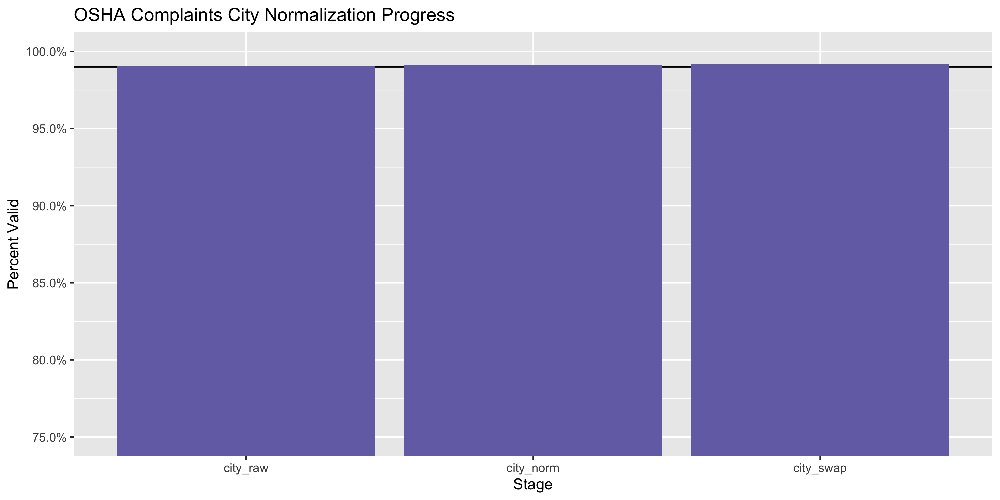
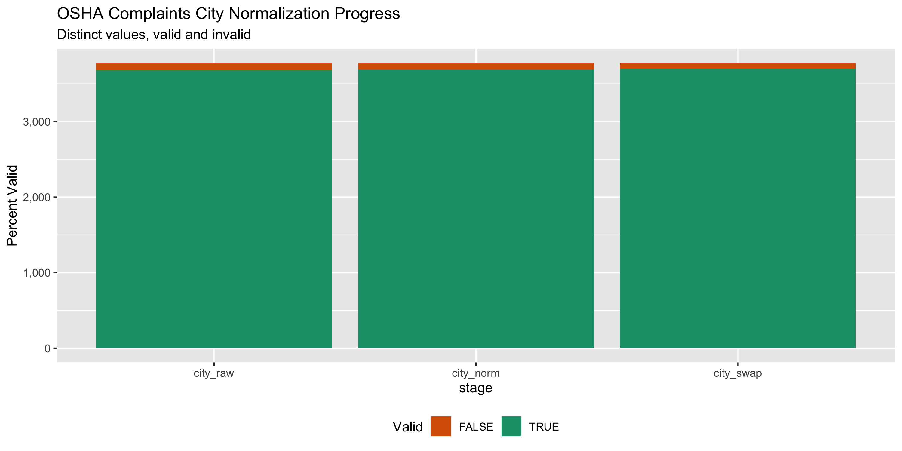
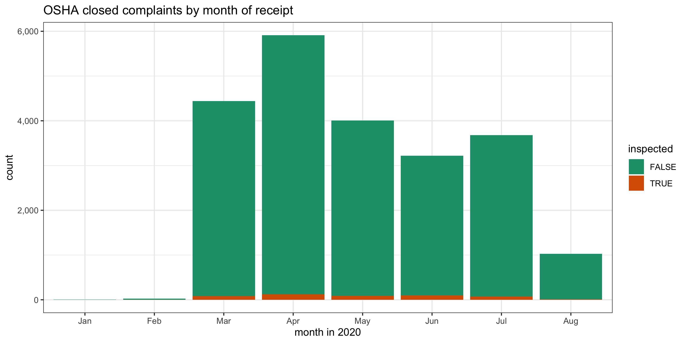
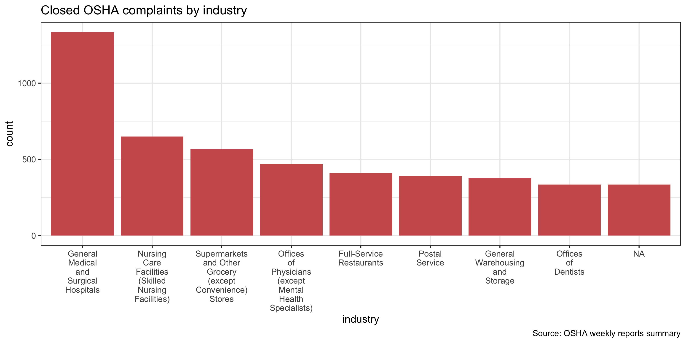
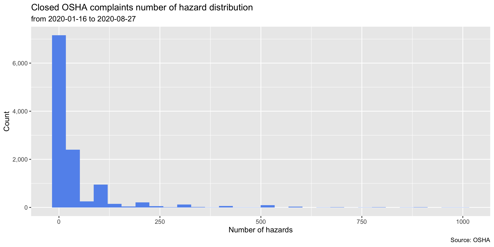
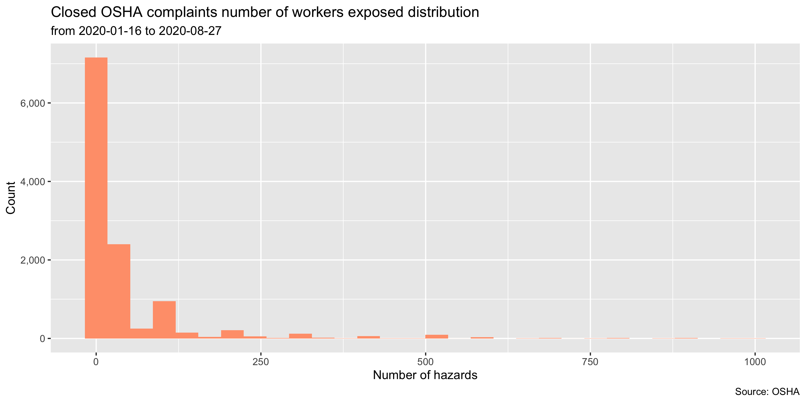

OSHA COVID-19 Weekly Reports
================
Yanqi Xu
2020-09-17 17:41:23

  - [Project](#project)
  - [Objectives](#objectives)
  - [Packages](#packages)
  - [Data](#data)
  - [Wrangle](#wrangle)
  - [Explore](#explore)
  - [Conclude](#conclude)
  - [Export](#export)
  - [Dictionary](#dictionary)

<!-- Place comments regarding knitting here -->

## Project

The Accountability Project is an effort to cut across data silos and
give journalists, policy professionals, activists, and the public at
large a simple way to search across huge volumes of public data about
people and organizations.

Our goal is to standardizing public data on a few key fields by thinking
of each dataset row as a transaction. For each transaction there should
be (at least) 3 variables:

1.  All **parties** to a transaction
2.  The **date** of the transaction
3.  The **amount** of money involved

## Objectives

This document describes the process used to complete the following
objectives:

1.  How many records are in the database?
2.  Check for duplicates
3.  Check ranges
4.  Is there anything blank or missing?
5.  Check for consistency issues
6.  Create a five-digit ZIP Code called `ZIP5`
7.  Create a `YEAR` field from the transaction date
8.  Make sure there is data on both parties to a transaction

## Packages

The following packages are needed to collect, manipulate, visualize,
analyze, and communicate these results. The `pacman` package will
facilitate their installation and attachment.

The IRW’s `campfin` package will also have to be installed from GitHub.
This package contains functions custom made to help facilitate the
processing of campaign finance data.

``` r
if (!require("pacman")) install.packages("pacman")
pacman::p_load_gh("irworkshop/campfin")
pacman::p_load(
  readxl, # read excel
  tidyverse, # data manipulation
  lubridate, # datetime strings
  magrittr, # pipe opperators
  janitor, # dataframe clean
  refinr, # cluster and merge
  scales, # format strings
  knitr, # knit documents
  vroom, # read files fast
  glue, # combine strings
  here, # relative storage
  fs, # search storage 
  gluedown # make small multiples
)
```

This document should be run as part of the `R_campfin` project, which
lives as a sub-directory of the more general, language-agnostic
[`irworkshop/accountability_datacleaning`](https://github.com/irworkshop/accountability_datacleaning "TAP repo")
GitHub repository.

The `R_campfin` project uses the [RStudio
projects](https://support.rstudio.com/hc/en-us/articles/200526207-Using-Projects "Rproj")
feature and should be run as such. The project also uses the dynamic
`here::here()` tool for file paths relative to *your* machine.

``` r
# where does this document knit?
here::here()
#> [1] "/Users/yanqixu/code/accountability_datacleaning"
```

## Data

[OSHA](https://www.osha.gov/enforcement/covid-19-data#complaints_referrals)
lists its COVID responses. Since the outbreak, it has received thousands
of complaints and removed workers from unsafe work places.

### Download

The OSHA data is cumulative, so we only need the most recent file, which
can be obtained from the
[OSHA](https://www.osha.gov/foia/archived-covid-19-data). According to
an OSHA spokesperson, \>Upon receiving a complaint, OSHA opens an
investigation, and, if necessary, that investigation would include an
onsite inspection. OSHA investigates all complaints.

> Open inspections are those in which OSHA is conducting an
> investigation. The agency has six months to complete an investigation.
> Additional details about open complaints are not available until the
> investigation is complete. The case file remains open throughout the
> inspection process and is not closed until the agency is satisfied
> that abatement has occurred.

> Complaints are listed as “closed/final” if they were valid complaints.
> A valid complaint must state the reason for the inspection request.
> There must be reasonable grounds to believe that either a violation of
> the Act or OSHA standard that exposes employees to physical harm
> exists, serious injury or death exists. A complaint cannot be marked
> as closed unless one of these activities has occurred. Any valid
> complaint must be closed either through the phone/fax/email process or
> by opening a formal inspection.Complaints are closed based on the
> exchange of information between the employer and OSHA. The Area Office
> reviews responses from employers regarding actions taken to address
> the complaint items and determine whether further action is warranted.

``` r
raw_dir <- dir_create(here() %>% str_remove("/R_campfin") %>% path("osha/data/raw"))
```

``` r
landing_url <- 'https://www.osha.gov/foia/archived-covid-19-data'

file_path <- read_html(landing_url) %>% 
  html_nodes(css = "article > div > div > p:nth-child(7) > span > a:nth-child(1)") %>% html_attr("href")

closed_url <- paste0("https://www.osha.gov/",file_path)


wget <- function(url, dir) {
  system2(
    command = "wget",
    args = c(
      "--no-verbose",
      "--content-disposition",
      url
    )
  )
}

if (!all_files_new(raw_dir)) {
   wget(closed_url, raw_dir)
}
```

### Read

``` r
dir_ls(raw_dir) %>% file_info()
#> # A tibble: 1 x 18
#>   path       type   size permissions modification_time   user  group device_id hard_links
#>   <fs::path> <fct> <fs:> <fs::perms> <dttm>              <chr> <chr>     <dbl>      <dbl>
#> 1 /Users/ya… file  3.99M rw-r--r--   2020-09-04 13:10:34 yanq… staff  16777221          1
#> # … with 9 more variables: special_device_id <dbl>, inode <dbl>, block_size <dbl>, blocks <dbl>,
#> #   flags <int>, generation <dbl>, access_time <dttm>, change_time <dttm>, birth_time <dttm>
osha <- read_xlsx(dir_ls(raw_dir))
```

According to DOL spokesperson, \> The activity ID (ACT ID) is the unique
identifier for the complaint. On the Inspection Information page, users
are able to select specific inspections when the activity numbers are
known which identify the inspections.

> The inspection ID identifies whether the complaint resulted in an
> inspection. The “Insp ID” column is only used when a complaint results
> in an inspection. Otherwise, the complaint will be handled using
> OSHA’s phone/fax investigation procedures and the “Insp ID” field
> will be left blank.Inspections are identified by number under the
> “Insp ID” column on the spreadsheet. Limited data on these open
> inspections can be found through a search on the Inspection
> Information page. For closed complaints, the OSHA Area Office reviews
> responses from employers regarding actions taken to address the
> complaint items and determines whether further action is warranted.

> The reporting ID (RID) identifies the OSHA office or organizational
> unit responsible for the inspection. The Primary/Site NAICS is the
> identification code for a specific industry. For the RID, the first
> two digits represent the region (01 through 10) and the third digit
> indicates if it is a State Plan or Federal office. All State Plan
> offices have a ‘5’ as the third digit, whereas any other number
> indicates a Federal office. State Plans are OSHA-approved workplace
> safety and health programs operated by individual states or U.S.
> territories. There are currently 22 State Plans covering both private
> sector and state and local government workers, and there are six State
> Plans covering only state and local government workers.

Hence we can separate the last column into two, and identify whether the
case is handled by a federal or state program by the RID. We will also
separate the `Establishment Name Site City-State-Zip` into name,
address, city, state and zip.

More information about OSHA’s state plans can be found on its
[website](https://www.osha.gov/stateplans). \#\#\#\# Separate We’ll
first separate the the last column.

``` r
osha <- osha %>% 
  separate(col = `No Alleged Hazards/No Emp Exposed`,into = c("number_of_alleged_hazards","number_of_workers_exposed"),remove = F,sep = "/\r\n") %>% 
  clean_names() %>% 
  mutate_at(.vars = vars(starts_with("number_of_")),as.numeric)
```

### Name

The name and adress are separated by

``` r
osha <- osha %>% 
  separate(col=establishment_name_site_city_state_zip,sep = "\r\n",
          remove = F,
  into=c("establishment_name","address_full"))
```

### Address

``` r
osha <- osha %>% 
  mutate(zip = str_extract(address_full,"\\d{5}$"),
         state = address_full %>% str_remove(",\\s\\d{5}$") %>% str_extract("(?<=\\s)[^,]+$"),
         address_city = address_full %>% str_remove(paste0(state,", ",zip)),
         city = str_extract(address_city,"(?<=,\\s)[^,]+(?=,\\s$)"),
         address = address_city %>% str_remove(paste0(", ",city,",")) %>% str_trim()) %>% 
  select(-c(address_full, address_city))
```

#### Extract Federal/State plans

More information about state plans coverage and federal jurisdiciton can
be found on [OSHA’s information page](https://www.osha.gov/stateplans).

``` r
osha <- osha %>% 
  mutate(office = if_else(condition = str_detect(rid, "-5\\d{2}-"),
                          true = "state",
                          false = "federal"))
```

### Missing

``` r
col_stats(osha, count_na)
#> # A tibble: 20 x 4
#>    col                                    class      n        p
#>    <chr>                                  <chr>  <int>    <dbl>
#>  1 rid                                    <chr>      0 0       
#>  2 act_id                                 <chr>      0 0       
#>  3 establishment_name_site_city_state_zip <chr>      0 0       
#>  4 establishment_name                     <chr>      0 0       
#>  5 county                                 <chr>      0 0       
#>  6 primary_site_naics                     <chr>      0 0       
#>  7 receipt_date                           <dttm>     0 0       
#>  8 receipt_type                           <chr>      0 0       
#>  9 formality                              <chr>      0 0       
#> 10 insp_id                                <chr>  21836 0.979   
#> 11 addl_code                              <chr>      0 0       
#> 12 hazard_desc_and_location               <chr>     21 0.000941
#> 13 no_alleged_hazards_no_emp_exposed      <chr>      0 0       
#> 14 number_of_alleged_hazards              <dbl>   7021 0.315   
#> 15 number_of_workers_exposed              <dbl>  10686 0.479   
#> 16 zip                                    <chr>     38 0.00170 
#> 17 state                                  <chr>      0 0       
#> 18 city                                   <chr>     38 0.00170 
#> 19 address                                <chr>      0 0       
#> 20 office                                 <chr>      0 0
```

We can quickly look at the cases with missing `city` and `zip`. Then we
are able to determine that these cases reported no specific locations.

``` r
osha %>% filter(is.na(zip)) %>% glimpse()
#> Rows: 38
#> Columns: 20
#> $ rid                                    <chr> "10-541-91", "10-541-12", "10-541-93", "10-541-95…
#> $ act_id                                 <chr> "C-1558784", "C-1561583", "C-1560433", "C-1561798…
#> $ establishment_name_site_city_state_zip <chr> "Minority Abatement Contractors Inc\r\nNO LOC IN …
#> $ establishment_name                     <chr> "Minority Abatement Contractors Inc", "Pacific La…
#> $ county                                 <chr> "Added for Legacy Migration", "Added for Legacy M…
#> $ primary_site_naics                     <chr> "562910 /\r\n562910", "561730 /\r\n561730", "9999…
#> $ receipt_date                           <dttm> 2020-03-25, 2020-03-26, 2020-03-27, 2020-03-27, …
#> $ receipt_type                           <chr> "Phone", "Phone", "Phone", "Phone", "Phone", "Pho…
#> $ formality                              <chr> "Nonformal", "Nonformal", "Nonformal", "Nonformal…
#> $ insp_id                                <chr> NA, NA, NA, NA, NA, NA, NA, NA, NA, NA, NA, NA, N…
#> $ addl_code                              <chr> "N-16-COVID-19:", "N-16-COVID-19:", "N-16-COVID-1…
#> $ hazard_desc_and_location               <chr> "Other Than Serious", "Other Than Serious", "Othe…
#> $ no_alleged_hazards_no_emp_exposed      <chr> "1/\r\n", "1/\r\n", "1/\r\n", "1/\r\n", "1/\r\n",…
#> $ number_of_alleged_hazards              <dbl> 1, 1, 1, 1, 1, 1, 1, 1, 1, 1, 1, 1, 1, 1, 2, 3, 1…
#> $ number_of_workers_exposed              <dbl> NA, NA, NA, NA, NA, NA, NA, NA, NA, NA, NA, NA, N…
#> $ zip                                    <chr> NA, NA, NA, NA, NA, NA, NA, NA, NA, NA, NA, NA, N…
#> $ state                                  <chr> "UNKWN", "UNKWN", "UNKWN", "UNKWN", "UNKWN", "UNK…
#> $ city                                   <chr> NA, NA, NA, NA, NA, NA, NA, NA, NA, NA, NA, NA, N…
#> $ address                                <chr> "NO LOC IN OREGON, Added for legacy migration, Ad…
#> $ office                                 <chr> "state", "state", "state", "state", "state", "sta…
```

We’ll flag the cases without hazard description and location.

``` r
osha <- osha %>% flag_na(hazard_desc_and_location)
```

### Duplicates

We can see there’s no duplicate entry.

``` r
osha <- flag_dupes(osha, dplyr::everything())
```

## Wrangle

To improve the searchability of the database, we will perform some
consistent, confident string normalization. For geographic variables
like city names and ZIP codes, the corresponding `campfin::normal_*()`
functions are taylor made to facilitate this process.

### ZIP

For ZIP codes, the `campfin::normal_zip()` function will attempt to
create valied *five* digit codes by removing the ZIP+4 suffix and
returning leading zeroes dropped by other programs like Microsoft Excel.

We can see that the ZIPcodes are normal and don’t need to be further
normalized.

``` r
prop_in(osha$zip, valid_zip, na.rm = T)
#> [1] 0.9995509
```

### Address

For the street `addresss` variable, the `campfin::normal_address()`
function will force consistence case, remove punctuation, and
abbreviation official USPS suffixes.

``` r
osha <- osha %>% 
    mutate(address_norm = normal_address(address,abbs = usps_street,
      na_rep = TRUE))
```

### State

The state column uses full names of states, and we will conform it to
IRW conventions of two-letter abbreviations.

``` r
osha <- osha %>% 
    mutate(
    state_norm = normal_state(
      state = state,
      abbreviate = TRUE,
      na_rep = TRUE,
      valid = valid_state
    ))
prop_in(osha$state_norm, valid_state, na.rm = T)
#> [1] 1
```

### City

Cities are the most difficult geographic variable to normalize, simply
due to the wide variety of valid cities and formats. \#\#\#\# Normal

The `campfin::normal_city()` function is a good oshaart, again
converting case, removing punctuation, but *expanding* USPS
abbreviations. We can also remove `invalid_city` values.

``` r
osha <- osha %>% 
      mutate(city_norm = normal_city(city,abbs = usps_city,
      states = usps_state,
      na = invalid_city,
      na_rep = TRUE))

prop_in(osha$city, valid_city, na.rm = T)
#> [1] 0.9731902
prop_in(osha$city_norm, valid_city, na.rm = T)
#> [1] 0.9736842
```

#### Swap

We can further improve normalization by comparing our normalized value
against the *expected* value for that record’s state abbreviation and
ZIP code. If the normalized value is either an abbreviation for or very
similar to the expected value, we can confidently swap those two.

``` r
osha <- osha %>% 
  rename(city_raw = city) %>% 
  left_join(
    y = zipcodes,
    by = c(
      "state_norm" = "state",
      "zip" = "zip"
    )
  ) %>% 
  rename(city_match = city) %>% 
  mutate(
    match_abb = is_abbrev(city_norm, city_match),
    match_dist = str_dist(city_norm, city_match),
    city_swap = if_else(
      condition = !is.na(match_dist) & (match_abb | match_dist == 1),
      true = city_match,
      false = city_norm
    )
  ) %>% 
  select(
    -city_match,
    -match_dist,
    -match_abb
  )
```

#### Check

We can use the `campfin::check_city()` function to pass the remaining
unknown `city_refine` values (and their `state_norm`) to the Google
Geocode API. The function returns the name of the city or locality which
most associated with those values.

This is an easy way to both check for typos and check whether an unknown
`city` value is actually a completely acceptable neighborhood, census
designated place, or some other locality not found in our `valid_city`
vector from our `zipcodes` database.

First, we’ll filter out any known valid city and aggregate the remaining
records by their city and state. Then, we will only query those unknown
cities which appear at least ten times.

``` r
osha_out <- osha %>% 
  filter(city_swap %out% c(valid_city, extra_city)) %>% 
  count(city_swap, state_norm, zip,sort = TRUE) %>% 
  drop_na() %>% 
  filter(n > 1)
```

Passing these values to `campfin::check_city()` with `purrr::pmap_dfr()`
will return a single tibble of the rows returned by each city/state
combination.

First, we’ll check to see if the API query has already been done and a
file exist on disk. If such a file exists, we can read it using
`readr::read_csv()`. If not, the query will be sent and the file will be
written using `readr::write_csv()`.

``` r
check_file <- path(raw_dir %>% str_remove("/raw"),"api_check.csv")
if (file_exists(check_file)) {
  check <- read_csv(
    file = check_file
  )
} else {
  check <- pmap_dfr(
    .l = list(
      osha_out$city_swap, 
      osha_out$state_norm,
      osha_out$zip
    ), 
    .f = check_city, 
    key = Sys.getenv("GEOCODE_KEY"), 
    guess = TRUE
  ) %>% 
    mutate(guess = coalesce(guess_city, guess_place)) %>% 
    select(-guess_city, -guess_place)
  write_csv(
    x = check,
    path = check_file
  )
}
```

Any city/state combination with a `check_city_flag` equal to `TRUE`
returned a matching city string from the API, indicating this
combination is valid enough to be ignored.

``` r
valid_locality <- check$guess[check$check_city_flag]
```

After the two normalization steps, the percentage of valid cities is at
100%. \#\#\#\# Progress

| stage      | prop\_in | n\_distinct | prop\_na | n\_out | n\_diff |
| :--------- | -------: | ----------: | -------: | -----: | ------: |
| city\_raw  |    0.991 |        3703 |    0.002 |    205 |      91 |
| city\_norm |    0.991 |        3703 |    0.002 |    193 |      86 |
| city\_swap |    0.992 |        3702 |    0.002 |    175 |      74 |

You can see how the percentage of valid values increased with each
stage.

<!-- -->

More importantly, the number of distinct values decreased each stage. We
were able to confidently change many distinct invalid values to their
valid equivalent.

``` r
progress %>% 
  select(
    stage, 
    all = n_distinct,
    bad = n_diff
  ) %>% 
  mutate(good = all - bad) %>% 
  pivot_longer(c("good", "bad")) %>% 
  mutate(name = name == "good") %>% 
  ggplot(aes(x = stage, y = value)) +
  geom_col(aes(fill = name)) +
  scale_fill_brewer(palette = "Dark2", direction = -1) +
  scale_y_continuous(labels = comma) +
  theme(legend.position = "bottom") +
  labs(
    title = "OSHA Complaints City Normalization Progress",
    subtitle = "Distinct values, valid and invalid",
    x = "stage",
    y = "Percent Valid",
    fill = "Valid"
  )
```

<!-- -->

## Explore

### Date

We can examine the date range of the receipt date.

``` r
min(osha$receipt_date)
#> [1] "2020-01-16 UTC"
max(osha$receipt_date)
#> [1] "2020-08-27 UTC"
sum(osha$receipt_date > today())
#> [1] 0
```

### Categorical

#### Month

We can see the frequencies of complaints made for each month
<!-- -->

#### Geographical

We can also see where cases occur.

Using the NASIC indicators, we can also see which industries have the
most number of closed complaints.

``` r
osha %>% 
  count(primary_site_naics) %>% top_n(8) %>% arrange(desc(n)) %>% 
  mutate(industry = case_when(
    str_detect(primary_site_naics,"622110") ~ "General Medical and Surgical Hospitals",
 str_detect(primary_site_naics,"623110") ~ "Nursing Care Facilities (Skilled Nursing Facilities)",
 str_detect(primary_site_naics,"491110") ~ "Postal Service",
 str_detect(primary_site_naics,"621111") ~ "Offices of Physicians (except Mental Health Specialists)",
 str_detect(primary_site_naics,"445110") ~ "Supermarkets and Other Grocery (except Convenience) Stores",
 str_detect(primary_site_naics,"493110") ~ "General Warehousing and Storage",
 str_detect(primary_site_naics,"722511") ~ "Full-Service Restaurants",
 str_detect(primary_site_naics,"621210") ~ "Offices of Dentists",
  )) %>% 
  ggplot(aes(x= reorder(industry,-n),y=n)) +
  geom_col(fill="indianred") +
  scale_x_discrete(labels = wrap_format(10)) +
  theme_bw() +
  theme(legend.position = "bottom") +
  labs(title = "Closed OSHA complaints by industry",
       caption = "Source: OSHA weekly reports summary",
       x = "industry",
       y = "count"
       )
```

<!-- -->

#### Continuous

We can see the distribution of the number of hazards and workers
exposed. <!-- --><!-- -->

## Conclude

``` r
glimpse(sample_n(osha, 20))
#> Rows: 20
#> Columns: 25
#> $ rid                                    <chr> "06-277-00", "05-518-00", "10-553-50", "09-506-14…
#> $ act_id                                 <chr> "C-1563258", "C-1594245", "C-1571532", "C-1554802…
#> $ establishment_name_site_city_state_zip <chr> "Langley Management Company, Inc.\r\nAll loan loc…
#> $ establishment_name                     <chr> "Langley Management Company, Inc.", "H-M Warehous…
#> $ county                                 <chr> "TULSA", "HENDRICKS", "YAKIMA", "ALAMEDA", "SUFFO…
#> $ primary_site_naics                     <chr> "561110 /\r\n561110", "493110 /\r\n493110", "9211…
#> $ receipt_date                           <dttm> 2020-03-31, 2020-05-11, 2020-04-10, 2020-03-17, …
#> $ receipt_type                           <chr> "Phone", "Email", "Phone", "Phone", "Online", "On…
#> $ formality                              <chr> "Nonformal", "Formal", "Nonformal", "Nonformal", …
#> $ insp_id                                <chr> NA, NA, NA, NA, NA, NA, NA, NA, NA, NA, NA, NA, N…
#> $ addl_code                              <chr> "N-16-COVID-19:", "N-16-COVID-19:", "N-16-COVID-1…
#> $ hazard_desc_and_location               <chr> "For all employees working included in the Tulsa …
#> $ no_alleged_hazards_no_emp_exposed      <chr> "1/\r\n1", "/\r\n", "/\r\n", "2/\r\n1", "3/\r\n30…
#> $ number_of_alleged_hazards              <dbl> 1, NA, NA, 2, 3, 1, 1, 1, 1, 1, 2, 1, NA, 3, 1, 3…
#> $ number_of_workers_exposed              <dbl> 1, NA, NA, 1, 300, 1, 1, 150, NA, 20, 25, 20, NA,…
#> $ zip                                    <chr> "74055", "46168", "98901", "94602", "02215", "497…
#> $ state                                  <chr> "OKLAHOMA", "INDIANA", "WASHINGTON", "CALIFORNIA"…
#> $ city_raw                               <chr> "OWASSO", "PLAINFIELD", "YAKIMA", "OAKLAND", "BOS…
#> $ address                                <chr> "All loan locations within the Tulsa Oklahoma dis…
#> $ office                                 <chr> "federal", "state", "state", "state", "federal", …
#> $ na_flag                                <lgl> FALSE, FALSE, FALSE, FALSE, FALSE, FALSE, FALSE, …
#> $ address_norm                           <chr> "ALL LOAN LOCATIONS WITHIN THE TULSA OKLAHOMA DIS…
#> $ state_norm                             <chr> "OK", "IN", "WA", "CA", "MA", "MI", "CA", "IL", "…
#> $ city_norm                              <chr> "OWASSO", "PLAINFIELD", "YAKIMA", "OAKLAND", "BOS…
#> $ city_swap                              <chr> "OWASSO", "PLAINFIELD", "YAKIMA", "OAKLAND", "BOS…
```

1.  There are 22306 records in the database.
2.  There are 0 duplicate records in the database.
3.  The range and distribution of `year` seems mostly reasonable except
    for a few entries.
4.  There are 21 records missing either recipient or date.
5.  Consistency in goegraphic data has been improved with
    `campfin::normal_*()`.
6.  The 4-digit `year` variable has been created with
    `lubridate::year()`.

## Export

``` r
osha <- osha %>% 
    select(-c(city_norm,state,city_raw,address)) %>% 
    rename(city_clean = city_swap) %>% 
    rename_all(~str_replace(., "_norm", "_clean"))
```

``` r
clean_dir <- dir_create(path(raw_dir %>% str_remove("/raw"), "processed"))
```

``` r
write_csv(
  x = osha,
  path = path(clean_dir, "osha_covid_complaints_clean.csv"),
  na = ""
)
```

## Dictionary

The following table describes the variables in our final exported file:

| Column                                   | Type        | Definition                                                                          |
| :--------------------------------------- | :---------- | :---------------------------------------------------------------------------------- |
| `rid`                                    | `character` | Reporting ID: the OSHA office or organizational unit responsible for the inspection |
| `act_id`                                 | `character` | Actiity ID: unique identifier for the complaint                                     |
| `establishment_name_site_city_state_zip` | `character` | Establishment name and addresses                                                    |
| `establishment_name`                     | `character` | Establishment name separated from above                                             |
| `county`                                 | `character` | County of the establishment                                                         |
| `primary_site_naics`                     | `character` | North American Standard Industrial Classification Code identifying industry         |
| `receipt_date`                           | `double`    | Date the complaint was received                                                     |
| `receipt_type`                           | `character` | Receipt type                                                                        |
| `formality`                              | `character` | Formality                                                                           |
| `insp_id`                                | `character` | ID of the ensuing inspection                                                        |
| `addl_code`                              | `character` | Additional Code (here indicating a COVID-19 flag)                                   |
| `hazard_desc_and_location`               | `character` | Hazard description and location                                                     |
| `no_alleged_hazards_no_emp_exposed`      | `character` | Number of alleged hazards and number of employees exposed                           |
| `number_of_alleged_hazards`              | `double`    | Number of alleged hazards separated from the previous column                        |
| `number_of_workers_exposed`              | `double`    | Number of alleged hazards separated as above                                        |
| `zip`                                    | `character` | ZIP code of establishment                                                           |
| `office`                                 | `character` | Logical variable indicating if the hazard description and location is missing       |
| `na_flag`                                | `logical`   | OSHA response office based on RID created by IRW                                    |
| `address_clean`                          | `character` | Normalized street address                                                           |
| `state_clean`                            | `character` | Normalized two-letter state abbreviation                                            |
| `city_clean`                             | `character` | Normalized city                                                                     |
