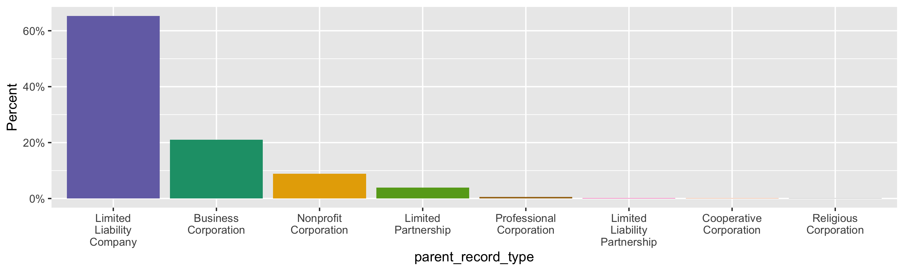

Alaska Agents
================
Kiernan Nicholls & Aarushi Sahejpal
Fri Apr 28 06:15:57 2023

- <a href="#project" id="toc-project">Project</a>
- <a href="#objectives" id="toc-objectives">Objectives</a>
- <a href="#packages" id="toc-packages">Packages</a>
- <a href="#source" id="toc-source">Source</a>
  - <a href="#disclaimer" id="toc-disclaimer">Disclaimer</a>
- <a href="#download" id="toc-download">Download</a>
- <a href="#read" id="toc-read">Read</a>
- <a href="#explore" id="toc-explore">Explore</a>
  - <a href="#missing" id="toc-missing">Missing</a>
  - <a href="#duplicates" id="toc-duplicates">Duplicates</a>
  - <a href="#categorical" id="toc-categorical">Categorical</a>
- <a href="#conclude" id="toc-conclude">Conclude</a>
- <a href="#export" id="toc-export">Export</a>
- <a href="#upload" id="toc-upload">Upload</a>

<!-- Place comments regarding knitting here -->

## Project

The Accountability Project is an effort to cut across data silos and
give journalists, policy professionals, activists, and the public at
large a simple way to search across huge volumes of public data about
people and organizations.

Our goal is to standardize public data on a few key fields by thinking
of each dataset row as a transaction. For each transaction there should
be (at least) 3 variables:

1.  All **parties** to a transaction.
2.  The **date** of the transaction.
3.  The **amount** of money involved.

## Objectives

This document describes the process used to complete the following
objectives:

1.  How many records are in the database?
2.  Check for entirely duplicated records.
3.  Check ranges of continuous variables.
4.  Is there anything blank or missing?
5.  Check for consistency issues.
6.  Create a five-digit ZIP Code called `zip`.
7.  Create a `year` field from the transaction date.
8.  Make sure there is data on both parties to a transaction.

## Packages

The following packages are needed to collect, manipulate, visualize,
analyze, and communicate these results. The `pacman` package will
facilitate their installation and attachment.

``` r
if (!require("pacman")) {
  install.packages("pacman")
}
pacman::p_load(
  tidyverse, # data manipulation
  lubridate, # datetime strings
  gluedown, # printing markdown
  janitor, # clean data frames
  campfin, # custom irw tools
  aws.s3, # aws cloud storage
  refinr, # cluster & merge
  scales, # format strings
  knitr, # knit documents
  vroom, # fast reading
  rvest, # scrape html
  glue, # code strings
  here, # project paths
  httr, # http requests
  fs # local storage 
)
```

This diary was run using `campfin` version 1.0.10.9001.

``` r
packageVersion("campfin")
#> [1] '1.0.10.9001'
```

This document should be run as part of the `R_tap` project, which lives
as a sub-directory of the more general, language-agnostic
[`irworkshop/accountability_datacleaning`](https://github.com/irworkshop/accountability_datacleaning)
GitHub repository.

The `R_tap` project uses the [RStudio
projects](https://support.rstudio.com/hc/en-us/articles/200526207-Using-Projects)
feature and should be run as such. The project also uses the dynamic
`here::here()` tool for file paths relative to *your* machine.

``` r
# where does this document knit?
here::i_am("state/ak/agents/docs/ak_agents_diary.Rmd")
```

## Source

Alaskan business licenses are available from the Alaska Department of
Commerce, Community, and Economic Development which provides \[direct
downloads\]\[dd\] to listings of Corporations, Business & Professional
Licensing.

> The Division of Corporations, Business and Professional Licensing
> provides access to thousands of license records online as a service to
> the public. Use the links below to search specific license types,
> including corporations, business licenses, endorsements, and
> professional licenses.

### Disclaimer

> The Division has attempted to insure that the information contained in
> these electronic documents is as accurate as possible. Only authorized
> staff from the Division of Corporations, Business and Professional
> Licensing has access to modify the data provided.
>
> For individuals who have had a licensing action, a notation should be
> reflected on their website record as “This license has been the
> subject of a formal agreement, order or disciplinary action. Contact
> the Division for more information.” The Division makes no guarantee
> that such action will appear on this website and further, we make no
> warranty or guarantee of the accuracy or reliability of the content of
> this website or the content of any other website to which it may link.
>
> Assessing the accuracy and reliability of the information obtained
> from this website is solely the responsibility of the user. The
> Division shall not be responsible or liable for any errors contained
> herein or for any damages resulting from the use of the information
> contained herein.

## Download

> The Division also allows for full downloads of our corporations,
> business, and professional licensing databases in .CSV format. Select
> one of the links below to download an Excel spreadsheet of all
> licenses on record with the state. Please note that these downloads
> may require some manipulation and further investigation via NAICS
> code, Entity Type, zip code, dates, etc., in order to properly
> organize the data provided.

``` r
raw_url <- "https://www.commerce.alaska.gov/cbp/DBDownloads/AgentsDownload.CSV"
raw_dir <- dir_create(here("state", "ak", "businesses", "data", "raw"))
raw_csv <- path(raw_dir, basename(raw_url))
```

``` r
if (!file_exists(raw_csv)) {
  download.file(raw_url, raw_csv)
}
```

## Read

``` r
aka <- read_delim(
  file = raw_csv,
  delim = ",",
  escape_backslash = FALSE,
  escape_double = FALSE,
  trim_ws = TRUE,
  col_types = cols(
    .default = col_character()
  )
)
```

``` r
aka <- clean_names(aka, case = "snake")
```

## Explore

There are 87,930 rows of 7 columns. Each record represents a single
agent of a registered business entity.

``` r
glimpse(aka)
#> Rows: 87,930
#> Columns: 7
#> $ parent_entity_number         <chr> "105099", "105719", "115970", "75704D", "105255", "105598", "105735", "72575D", "…
#> $ parent_entity_name           <chr> "Alaska Avalanche Specialists, LLC.", "Andes Properties, LLC", "Fairmont, LLC", "…
#> $ parent_record_type           <chr> "Limited Liability Company", "Limited Liability Company", "Limited Liability Comp…
#> $ official_entity_number       <chr> NA, NA, NA, NA, NA, NA, NA, NA, NA, NA, NA, NA, NA, NA, NA, NA, NA, NA, NA, NA, N…
#> $ official_last_or_entity_name <chr> "Glude", "Andes", "Green", "Alderman", "Kinney", "Housley", "SWEATT", "Kalmbach",…
#> $ official_first_name          <chr> "William J", "Alex", "Harold", "Mark C", "James Randall", "James M.", "JESS E.", …
#> $ official_title               <chr> "Registered Agent", "Registered Agent", "Registered Agent", "Registered Agent", "…
tail(aka)
#> # A tibble: 6 × 7
#>   parent_entity_number parent_entity_name               parent_record_type official_entity_number official_last_or_ent…¹
#>   <chr>                <chr>                            <chr>              <chr>                  <chr>                 
#> 1 10227513             Swell Creative, LLC              Limited Liability… <NA>                   Smithers              
#> 2 10183940             STRATAVARIOUS LLC                Limited Liability… <NA>                   Paddock               
#> 3 10184096             Park Consulting LLC              Limited Liability… <NA>                   Park                  
#> 4 10228649             Jennifer Cross LPC, LLC          Limited Liability… <NA>                   Cross                 
#> 5 10229064             Original Clothing L.L.C.         Limited Liability… <NA>                   Warlick               
#> 6 10231033             Engage Accounting and Consultin… Limited Liability… <NA>                   Kolipano              
#> # ℹ abbreviated name: ¹​official_last_or_entity_name
#> # ℹ 2 more variables: official_first_name <chr>, official_title <chr>
```

### Missing

Columns vary in their degree of missing values. most are missing no
values.

``` r
col_stats(aka, count_na)
#> # A tibble: 7 × 4
#>   col                          class     n     p
#>   <chr>                        <chr> <int> <dbl>
#> 1 parent_entity_number         <chr>     0 0    
#> 2 parent_entity_name           <chr>     0 0    
#> 3 parent_record_type           <chr>     0 0    
#> 4 official_entity_number       <chr> 51068 0.581
#> 5 official_last_or_entity_name <chr>     0 0    
#> 6 official_first_name          <chr> 37060 0.421
#> 7 official_title               <chr>     0 0
```

Any row missing the `official_first_name` appears have an entity
registered *as* the official.

``` r
aka %>% 
  filter(is.na(official_first_name)) %>% 
  count(official_last_or_entity_name, sort = TRUE)
#> # A tibble: 538 × 2
#>    official_last_or_entity_name               n
#>    <chr>                                  <int>
#>  1 Corporation Service Company             6192
#>  2 C T Corporation System                  5585
#>  3 LMRA Services, Inc.                     5349
#>  4 Registered Agents Inc                   2529
#>  5 COGENCY GLOBAL INC.                     1713
#>  6 United States Corporation Agents, Inc.  1226
#>  7 Northwest Registered Agent Inc          1016
#>  8 INCORP SERVICES, INC.                    995
#>  9 NATIONAL REGISTERED AGENTS, INC.         910
#> 10 Registered Agent Solutions, Inc.         899
#> # ℹ 528 more rows
```

### Duplicates

We can flag any record completely duplicated across every column.

``` r
aka <- flag_dupes(aka, everything())
sum(aka$dupe_flag)
#> [1] 730
```

``` r
aka %>% 
  filter(dupe_flag) %>% 
  arrange(parent_entity_name)
#> # A tibble: 730 × 8
#>    parent_entity_number parent_entity_name      parent_record_type        official_entity_number official_last_or_enti…¹
#>    <chr>                <chr>                   <chr>                     <chr>                  <chr>                  
#>  1 10082727             1-7178 Fairweather, LLC Limited Liability Company 10014663               Anderson Registered Ag…
#>  2 10082727             1-7178 Fairweather, LLC Limited Liability Company 10014663               Anderson Registered Ag…
#>  3 10157959             10200 Nigh Rd, LLC      Limited Liability Company 10014663               Anderson Registered Ag…
#>  4 10157959             10200 Nigh Rd, LLC      Limited Liability Company 10014663               Anderson Registered Ag…
#>  5 10167468             1033 Zakandra, LLC      Limited Liability Company 10014663               Anderson Registered Ag…
#>  6 10167468             1033 Zakandra, LLC      Limited Liability Company 10014663               Anderson Registered Ag…
#>  7 10202415             10630 Tahneeta, LLC     Limited Liability Company 10014663               Anderson Registered Ag…
#>  8 10202415             10630 Tahneeta, LLC     Limited Liability Company 10014663               Anderson Registered Ag…
#>  9 10172975             10712 Lunar, LLC        Limited Liability Company 10014663               Anderson Registered Ag…
#> 10 10172975             10712 Lunar, LLC        Limited Liability Company 10014663               Anderson Registered Ag…
#> # ℹ 720 more rows
#> # ℹ abbreviated name: ¹​official_last_or_entity_name
#> # ℹ 3 more variables: official_first_name <chr>, official_title <chr>, dupe_flag <lgl>
```

### Categorical

``` r
col_stats(aka, n_distinct)
#> # A tibble: 8 × 4
#>   col                          class     n         p
#>   <chr>                        <chr> <int>     <dbl>
#> 1 parent_entity_number         <chr> 87565 0.996    
#> 2 parent_entity_name           <chr> 87563 0.996    
#> 3 parent_record_type           <chr>     9 0.000102 
#> 4 official_entity_number       <chr>   357 0.00406  
#> 5 official_last_or_entity_name <chr> 20162 0.229    
#> 6 official_first_name          <chr> 11399 0.130    
#> 7 official_title               <chr>     1 0.0000114
#> 8 dupe_flag                    <lgl>     2 0.0000227
```

<!-- -->

## Conclude

``` r
glimpse(sample_n(aka, 1000))
#> Rows: 1,000
#> Columns: 8
#> $ parent_entity_number         <chr> "32929D", "10164161", "132249", "66090D", "10069422", "10054439", "10201103", "10…
#> $ parent_entity_name           <chr> "SUTLIFF'S HARDWARE, INC.", "BRIGHTON PLACE, LIMITED PARTNERSHIP", "S & F Fisheri…
#> $ parent_record_type           <chr> "Business Corporation", "Limited Partnership", "Limited Liability Company", "Limi…
#> $ official_entity_number       <chr> NA, "10045051", NA, NA, "79048F", "77446D", NA, NA, "10021053", "88971D", NA, NA,…
#> $ official_last_or_entity_name <chr> "ZIMMERMAN", "LMRA Services, Inc.", "Miles", "PRUHS", "Registered Agent Solutions…
#> $ official_first_name          <chr> "DON", NA, "Maryann", "J. DANA", NA, NA, "JESSE", "Jana", NA, NA, "Jeffrey", "Gir…
#> $ official_title               <chr> "Registered Agent", "Registered Agent", "Registered Agent", "Registered Agent", "…
#> $ dupe_flag                    <lgl> FALSE, FALSE, FALSE, FALSE, FALSE, FALSE, FALSE, FALSE, FALSE, FALSE, FALSE, FALS…
```

1.  There are 87,930 records in the database.
2.  There are 730 duplicate records in the database.
3.  The range and distribution of `amount` and `date` seem reasonable.
4.  There are 0 records missing key variables.
5.  Consistency in geographic data has been improved with
    `campfin::normal_*()`.
6.  The 4-digit `year` variable has been created with
    `lubridate::year()`.

## Export

Now the file can be saved on disk for upload to the Accountability
server.

``` r
clean_dir <- dir_create(here("state", "ak", "agents", "data", "clean"))
csv_ts <- str_remove_all(today(), "-")
clean_csv <- path(clean_dir, glue("ak_agents_{csv_ts}.csv"))
clean_rds <- path_ext_set(clean_csv, "rds")
basename(clean_csv)
#> [1] "ak_agents_20230428.csv"
```

``` r
write_csv(aka, clean_csv, na = "")
write_rds(aka, clean_rds, compress = "xz")
(clean_size <- file_size(clean_csv))
#> 8.94M
```

## Upload

We can use the `aws.s3::put_object()` to upload the text file to the IRW
server.

``` r
aws_key <- path("csv", basename(clean_csv))
if (!object_exists(aws_key, "publicaccountability")) {
  put_object(
    file = clean_csv,
    object = aws_key, 
    bucket = "publicaccountability",
    acl = "public-read",
    show_progress = TRUE,
    multipart = TRUE
  )
}
aws_head <- head_object(aws_key, "publicaccountability")
(aws_size <- as_fs_bytes(attr(aws_head, "content-length")))
unname(aws_size == clean_size)
```
