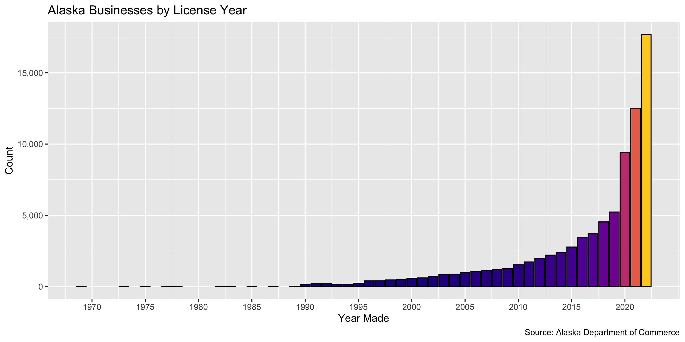
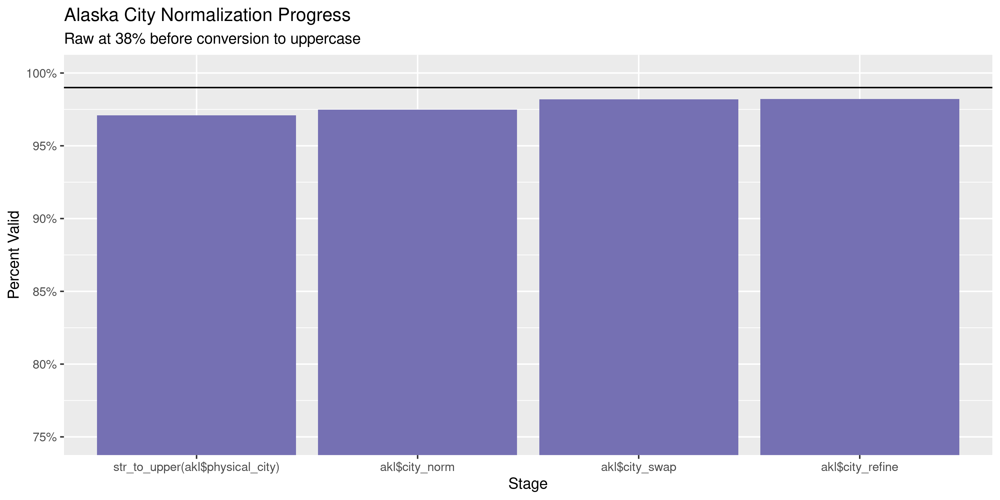
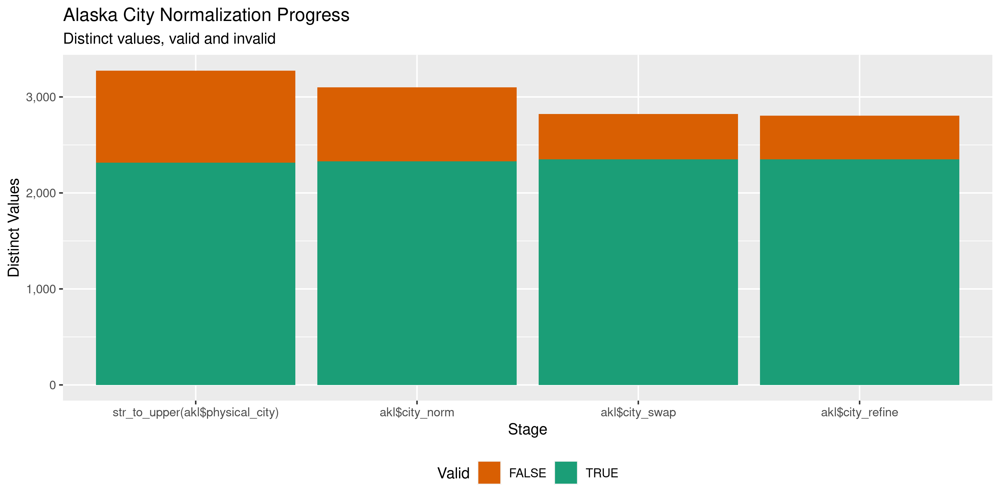

Alaska Businesses
================
Kiernan Nicholls & Aarushi Sahejpal
Fri Apr 28 06:26:05 2023

- <a href="#project" id="toc-project">Project</a>
- <a href="#objectives" id="toc-objectives">Objectives</a>
- <a href="#packages" id="toc-packages">Packages</a>
- <a href="#source" id="toc-source">Source</a>
  - <a href="#disclaimer" id="toc-disclaimer">Disclaimer</a>
- <a href="#download" id="toc-download">Download</a>
- <a href="#read" id="toc-read">Read</a>
- <a href="#explore" id="toc-explore">Explore</a>
  - <a href="#missing" id="toc-missing">Missing</a>
  - <a href="#duplicates" id="toc-duplicates">Duplicates</a>
  - <a href="#categorical" id="toc-categorical">Categorical</a>
  - <a href="#dates" id="toc-dates">Dates</a>
- <a href="#wrangle" id="toc-wrangle">Wrangle</a>
  - <a href="#address" id="toc-address">Address</a>
  - <a href="#zip" id="toc-zip">ZIP</a>
  - <a href="#state" id="toc-state">State</a>
  - <a href="#city" id="toc-city">City</a>
- <a href="#conclude" id="toc-conclude">Conclude</a>
- <a href="#export" id="toc-export">Export</a>
- <a href="#upload" id="toc-upload">Upload</a>

<!-- Place comments regarding knitting here -->

## Project

The Accountability Project is an effort to cut across data silos and
give journalists, policy professionals, activists, and the public at
large a simple way to search across huge volumes of public data about
people and organizations.

Our goal is to standardize public data on a few key fields by thinking
of each dataset row as a transaction. For each transaction there should
be (at least) 3 variables:

1.  All **parties** to a transaction.
2.  The **date** of the transaction.
3.  The **amount** of money involved.

## Objectives

This document describes the process used to complete the following
objectives:

1.  How many records are in the database?
2.  Check for entirely duplicated records.
3.  Check ranges of continuous variables.
4.  Is there anything blank or missing?
5.  Check for consistency issues.
6.  Create a five-digit ZIP Code called `zip`.
7.  Create a `year` field from the transaction date.
8.  Make sure there is data on both parties to a transaction.

## Packages

The following packages are needed to collect, manipulate, visualize,
analyze, and communicate these results. The `pacman` package will
facilitate their installation and attachment.

``` r
if (!require("pacman")) {
  install.packages("pacman")
}
pacman::p_load(
  tidyverse, # data manipulation
  lubridate, # datetime strings
  gluedown, # printing markdown
  janitor, # clean data frames
  campfin, # custom irw tools
  aws.s3, # aws cloud storage
  refinr, # cluster & merge
  scales, # format strings
  knitr, # knit documents
  rvest, # scrape html
  glue, # code strings
  here, # project paths
  httr, # http requests
  fs # local storage 
)
```

This diary was run using `campfin` version 1.0.10.9001.

``` r
packageVersion("campfin")
#> [1] '1.0.10.9001'
```

This document should be run as part of the `R_tap` project, which lives
as a sub-directory of the more general, language-agnostic
[`irworkshop/accountability_datacleaning`](https://github.com/irworkshop/accountability_datacleaning)
GitHub repository.

The `R_tap` project uses the [RStudio
projects](https://support.rstudio.com/hc/en-us/articles/200526207-Using-Projects)
feature and should be run as such. The project also uses the dynamic
`here::here()` tool for file paths relative to *your* machine.

``` r
# where does this document knit?
here::i_am("state/ak/businesses/docs/ak_businesses_diary.Rmd")
```

## Source

Alaskan business licenses are available from the Alaska Department of
Commerce, Community, and Economic Development which provides \[direct
downloads\]\[dd\] to listings of Corporations, Business & Professional
Licensing.

> The Division of Corporations, Business and Professional Licensing
> provides access to thousands of license records online as a service to
> the public. Use the links below to search specific license types,
> including corporations, business licenses, endorsements, and
> professional licenses.

### Disclaimer

> The Division has attempted to insure that the information contained in
> these electronic documents is as accurate as possible. Only authorized
> staff from the Division of Corporations, Business and Professional
> Licensing has access to modify the data provided.
>
> For individuals who have had a licensing action, a notation should be
> reflected on their website record as “This license has been the
> subject of a formal agreement, order or disciplinary action. Contact
> the Division for more information.” The Division makes no guarantee
> that such action will appear on this website and further, we make no
> warranty or guarantee of the accuracy or reliability of the content of
> this website or the content of any other website to which it may link.
>
> Assessing the accuracy and reliability of the information obtained
> from this website is solely the responsibility of the user. The
> Division shall not be responsible or liable for any errors contained
> herein or for any damages resulting from the use of the information
> contained herein.

## Download

> The Division also allows for full downloads of our corporations,
> business, and professional licensing databases in .CSV format. Select
> one of the links below to download an Excel spreadsheet of all
> licenses on record with the state. Please note that these downloads
> may require some manipulation and further investigation via NAICS
> code, Entity Type, zip code, dates, etc., in order to properly
> organize the data provided.

``` r
raw_url <- "https://www.commerce.alaska.gov/cbp/DBDownloads/BusinessLicenseDownload.CSV"
raw_dir <- dir_create(here("state", "ak", "businesses", "data", "raw"))
raw_csv <- path(raw_dir, basename(raw_url))
```

``` r
if (!file_exists(raw_csv)) {
  download.file(raw_url, raw_csv)
}
```

## Read

``` r
akl <- read_delim(
  file = raw_csv,
  delim = ",",
  locale = locale(date_format = "%m/%d/%Y"),
  escape_backslash = FALSE,
  escape_double = FALSE,
  col_types = cols(
    .default = col_character()
    # DateEffective = col_date(),
    # DateExpired = col_date(),
  )
)
```

``` r
sub_date <- function(x) {
  readr::parse_date(
    x = stringr::str_remove(x, "\\s.*$"),
    format = "%m/%d/%Y"
  )
}
```

``` r
akl <- akl %>% 
  clean_names(case = "snake") %>% 
  mutate(
    across(ends_with("_date"), sub_date),
    across(where(is_character), ~na_if(str_squish(.), ""))
  )
```

## Explore

There are 82,806 rows of 19 columns. Each record represents a single
business license issued to a business in Alaska.

``` r
glimpse(akl)
#> Rows: 82,806
#> Columns: 19
#> $ owners           <chr> "A AND A ROOFING CO, INC.", "ELAINE S. BAKER & ASSOCIATES, INC.", "DON ABEL BUILDING SUPPLIES…
#> $ license_number   <chr> "5", "34", "44", "173", "237", "257", "265", "316", "322", "355", "363", "401", "442", "527",…
#> $ business_name    <chr> "A & A ROOFING CO, INC", "ELAINE S. BAKER & ASSOCIATES, INC.", "DON ABEL BUILDING SUPPLY INC"…
#> $ status           <chr> "Active", "Active", "Active", "Active", "Active", "Active", "Active", "Active", "Active", "Ac…
#> $ issue_date       <date> 1969-07-15, 1990-12-28, 1990-12-27, 1991-01-03, 1991-01-03, 1991-01-03, 1991-01-07, 1990-12-…
#> $ renew_date       <date> 2022-10-05, 2022-10-03, 2022-10-11, 2022-11-28, 2021-12-22, 2021-10-14, 2021-10-19, 2022-12-…
#> $ expire_date      <date> 2024-12-31, 2024-12-31, 2024-12-31, 2024-12-31, 2023-12-31, 2023-12-31, 2023-12-31, 2024-12-…
#> $ physical_city    <chr> "FAIRBANKS", "ANCHORAGE", "JUNEAU", "SEATTLE", "ANCHORAGE", "ANCHORAGE", "Homer", "ANCHORAGE"…
#> $ physical_country <chr> "UNITED STATES", "UNITED STATES", "UNITED STATES", "UNITED STATES", "UNITED STATES", "UNITED …
#> $ physical_line1   <chr> "925 ASPEN ST.", "811 W 8th Avenue", "9999 GLACIER HIGHWAY", "19300 INTERNATIONAL BLVD", "404…
#> $ physical_line2   <chr> NA, NA, NA, NA, NA, NA, "9072990570", NA, NA, NA, NA, NA, NA, NA, NA, NA, "8587352176", NA, N…
#> $ physical_state   <chr> "AK", "AK", "AK", "WA", "AK", "AK", "AK", "AK", "AK", "AK", "AK", "AK", "KS", "AK", "AK", "AK…
#> $ physical_zip_out <chr> "99709", "99501", "99801", "98188", "99508", "99501-1731", "99603", "99502", "99503", "99503"…
#> $ mailing_city     <chr> "FAIRBANKS", "ANCHORAGE", "JUNEAU", "SEATTLE", "ANCHORAGE", "ANCHORAGE", "HOMER", "ANCHORAGE"…
#> $ mailing_country  <chr> "UNITED STATES", "UNITED STATES", "UNITED STATES", "UNITED STATES", "UNITED STATES", "UNITED …
#> $ mailing_line1    <chr> "P O BOX 70314", "811 W 8th Avenue", "9999 GLACIER HIGHWAY", "PO BOX 68900", "4047 SAN ERNEST…
#> $ mailing_line2    <chr> NA, NA, NA, "ATTN:LICENSING-SEAZL", NA, NA, NA, NA, NA, NA, NA, NA, NA, NA, NA, NA, "90725245…
#> $ mailing_state    <chr> "AK", "AK", "AK", "WA", "AK", "AK", "AK", "AK", "AK", "AK", "AK", "AK", "KS", "AK", "AK", "AK…
#> $ mailing_zip_out  <chr> "99707", "99501", "99801", "98168", "99508", "99503-3958", "99603", "99502", "99509", "99503"…
tail(akl)
#> # A tibble: 6 × 19
#>   owners            license_number business_name status issue_date renew_date expire_date physical_city physical_country
#>   <chr>             <chr>          <chr>         <chr>  <date>     <date>     <date>      <chr>         <chr>           
#> 1 Cathleen Ribbens  2165926        Stars of the… Active 2022-10-05 NA         2023-12-31  Kenai         UNITED STATES   
#> 2 Imperial Event R… 2165927        Imperial Eve… Active 2022-10-05 NA         2024-12-31  Anchorage     UNITED STATES   
#> 3 WESCO Services, … 2165930        WESCO Energy… Active 2022-10-05 NA         2024-12-31  PITTSBURGH    UNITED STATES   
#> 4 CAMPBELL GLEN OW… 2165931        Campbell Gle… Active 2022-10-05 NA         2024-12-31  Anchorage     UNITED STATES   
#> 5 Kenai Trucking a… 2165932        Kenai Trucki… Active 2022-10-05 NA         2024-12-31  Sterling      UNITED STATES   
#> 6 Troy Wuyts-Smith  2165933        Miss Alaska … Active 2022-10-05 NA         2024-12-31  Douglas       UNITED STATES   
#> # ℹ 10 more variables: physical_line1 <chr>, physical_line2 <chr>, physical_state <chr>, physical_zip_out <chr>,
#> #   mailing_city <chr>, mailing_country <chr>, mailing_line1 <chr>, mailing_line2 <chr>, mailing_state <chr>,
#> #   mailing_zip_out <chr>
```

### Missing

Columns vary in their degree of missing values.

``` r
col_stats(akl, count_na)
#> # A tibble: 19 × 4
#>    col              class      n         p
#>    <chr>            <chr>  <int>     <dbl>
#>  1 owners           <chr>      0 0        
#>  2 license_number   <chr>      0 0        
#>  3 business_name    <chr>      1 0.0000121
#>  4 status           <chr>      0 0        
#>  5 issue_date       <date>  1551 0.0187   
#>  6 renew_date       <date> 22945 0.277    
#>  7 expire_date      <date>     0 0        
#>  8 physical_city    <chr>     13 0.000157 
#>  9 physical_country <chr>      2 0.0000242
#> 10 physical_line1   <chr>      4 0.0000483
#> 11 physical_line2   <chr>  63122 0.762    
#> 12 physical_state   <chr>    122 0.00147  
#> 13 physical_zip_out <chr>    136 0.00164  
#> 14 mailing_city     <chr>      0 0        
#> 15 mailing_country  <chr>      0 0        
#> 16 mailing_line1    <chr>      0 0        
#> 17 mailing_line2    <chr>  74330 0.898    
#> 18 mailing_state    <chr>     96 0.00116  
#> 19 mailing_zip_out  <chr>     94 0.00114
```

We can flag any record missing a key variable needed to identify a
transaction.

``` r
key_vars <- c("business_name", "owners", "issue_date")
akl <- flag_na(akl, all_of(key_vars))
sum(akl$na_flag)
#> [1] 1552
```

``` r
akl %>% 
  filter(na_flag) %>% 
  select(all_of(key_vars))
#> # A tibble: 1,552 × 3
#>    business_name                               owners                                      issue_date
#>    <chr>                                       <chr>                                       <date>    
#>  1 JUNEAU FOOT AND ANKLE CLINIC                FRANK MESDAG                                NA        
#>  2 BRADFORD'S APARTMENTS                       GARY BRADFORD                               NA        
#>  3 KENNETH P EGGERS                            KENNETH EGGERS                              NA        
#>  4 BRECHAN ENTERPRISES INC                     BRECHAN ENTERPRISES INC                     NA        
#>  5 BRICE INC                                   BRICE INC                                   NA        
#>  6 ONEILL PROPERTIES, INC                      O'NEILL PROPERTIES, INC.                    NA        
#>  7 DENTON CIVIL AND MINERAL                    STEPHEN DENTON                              NA        
#>  8 ALASKA SALMON BAKE                          INTRA SEA INC                               NA        
#>  9 BURNS & MCDONNELL ENGINEERING COMPANY, INC. BURNS & MCDONNELL ENGINEERING COMPANY, INC. NA        
#> 10 TIKCHIK NARROWS LODGE INC                   TIKCHIK NARROWS LODGE INC                   NA        
#> # ℹ 1,542 more rows
```

### Duplicates

We can also flag any record completely duplicated across every column.

``` r
akl <- flag_dupes(akl, -license_number)
sum(akl$dupe_flag)
#> [1] 140
```

``` r
akl %>% 
  filter(dupe_flag) %>% 
  select(license_number, all_of(key_vars)) %>% 
  arrange(issue_date)
#> # A tibble: 140 × 4
#>    license_number business_name                                  owners                                       issue_date
#>    <chr>          <chr>                                          <chr>                                        <date>    
#>  1 595            ANCHORAGE SAND AND GRAVEL COMPANY, INC.        ANCHORAGE SAND AND GRAVEL COMPANY INC        1996-11-15
#>  2 31932          ANCHORAGE SAND AND GRAVEL COMPANY, INC.        ANCHORAGE SAND AND GRAVEL COMPANY INC        1996-11-15
#>  3 278512         SWISSPORT USA INC                              SWISSPORT USA INC                            2000-09-13
#>  4 278513         SWISSPORT USA INC                              SWISSPORT USA INC                            2000-09-13
#>  5 284382         HIGHLINER COFFEE CO                            HIGHLINER COFFEE CO                          2001-06-27
#>  6 284383         HIGHLINER COFFEE CO                            HIGHLINER COFFEE CO                          2001-06-27
#>  7 706685         NUSHAGAK ELECTRIC & TELEPHONE COOPERATIVE, INC NUSHAGAK ELECTRIC & TELEPHONE COOPERATIVE, … 2001-11-30
#>  8 706686         NUSHAGAK ELECTRIC & TELEPHONE COOPERATIVE, INC NUSHAGAK ELECTRIC & TELEPHONE COOPERATIVE, … 2001-11-30
#>  9 706687         NUSHAGAK ELECTRIC & TELEPHONE COOPERATIVE, INC NUSHAGAK ELECTRIC & TELEPHONE COOPERATIVE, … 2001-11-30
#> 10 721801         NORTH PACIFIC FUEL (CAPTAIN'S BAY)             PETRO STAR INC.                              2004-07-21
#> # ℹ 130 more rows
```

### Categorical

``` r
col_stats(akl, n_distinct)
#> # A tibble: 21 × 4
#>    col              class      n         p
#>    <chr>            <chr>  <int>     <dbl>
#>  1 owners           <chr>  74887 0.904    
#>  2 license_number   <chr>  82806 1        
#>  3 business_name    <chr>  81726 0.987    
#>  4 status           <chr>      1 0.0000121
#>  5 issue_date       <date>  8362 0.101    
#>  6 renew_date       <date>   629 0.00760  
#>  7 expire_date      <date>     4 0.0000483
#>  8 physical_city    <chr>   4151 0.0501   
#>  9 physical_country <chr>     45 0.000543 
#> 10 physical_line1   <chr>  68782 0.831    
#> 11 physical_line2   <chr>  13066 0.158    
#> 12 physical_state   <chr>     68 0.000821 
#> 13 physical_zip_out <chr>  12322 0.149    
#> 14 mailing_city     <chr>   3973 0.0480   
#> 15 mailing_country  <chr>     34 0.000411 
#> 16 mailing_line1    <chr>  63048 0.761    
#> 17 mailing_line2    <chr>   4349 0.0525   
#> 18 mailing_state    <chr>     66 0.000797 
#> 19 mailing_zip_out  <chr>  14685 0.177    
#> 20 na_flag          <lgl>      2 0.0000242
#> 21 dupe_flag        <lgl>      2 0.0000242
```

``` r
mean(akl$status == "Active")
#> [1] 1
```

### Dates

We can add the calendar year from `date` with `lubridate::year()`

``` r
akl <- mutate(akl, issue_year = year(issue_date))
```

``` r
min(akl$issue_date, na.rm = TRUE)
#> [1] "1969-07-15"
sum(akl$issue_year < 2000, na.rm = TRUE)
#> [1] 2868
max(akl$issue_date, na.rm = TRUE)
#> [1] "2022-11-25"
sum(akl$issue_date > today(), na.rm = TRUE)
#> [1] 0
```

<!-- -->

## Wrangle

To improve the searchability of the database, we will perform some
consistent, confident string normalization. For geographic variables
like city names and ZIP codes, the corresponding `campfin::normal_*()`
functions are tailor made to facilitate this process.

### Address

For the street `addresss` variable, the `campfin::normal_address()`
function will force consistence case, remove punctuation, and abbreviate
official USPS suffixes.

``` r
addr_norm <- akl %>% 
  distinct(physical_line1, physical_line2) %>%  
  mutate(
    norm_address1 = normal_address(
      address = physical_line1,
      abbs = usps_street,
      na_rep = TRUE
    ),
    norm_address3 = normal_address(
      address = physical_line2,
      abbs = usps_street,
      na_rep = TRUE,
      abb_end = FALSE
    )
  ) %>% 
  unite(
    col = address_norm,
    starts_with("norm_address"),
    sep = " ",
    remove = TRUE,
    na.rm = TRUE
  )
```

``` r
addr_norm %>% 
  filter(!is.na(physical_line2)) %>% 
  sample_n(10)
#> # A tibble: 10 × 3
#>    physical_line1                physical_line2 address_norm                         
#>    <chr>                         <chr>          <chr>                                
#>  1 3349 Chuthmuk Road            bx 72          3349 CHUTHMUK RD BX 72               
#>  2 2500 E Bogard Road            9078414762     2500 E BOGARD RD 9078414762          
#>  3 4104 Bullard Avenue, Unit F   6059391447     4104 BULLARD AVENUE UNIT F 6059391447
#>  4 11408 Heritage Ct             Apt 1          11408 HERITAGE CT APT 1              
#>  5 17237 Bear Paw Circle         9076947026     17237 BEAR PAW CIR 9076947026        
#>  6 4151 W. Muffin Street         9073065546     4151 W MUFFIN ST 9073065546          
#>  7 3850 Eve Ave                  Apt 5          3850 EVE AVE APT 5                   
#>  8 540 Water St                  Ste 303        540 WATER ST STE 303                 
#>  9 4941 Alpha Cir                9077274723     4941 ALPHA CIR 9077274723            
#> 10 1317 W. Northern Lights Blvd. Suite 16       1317 W NORTHERN LIGHTS BLVD STE 16
```

``` r
akl <- left_join(akl, addr_norm, by = c("physical_line1", "physical_line2"))
```

### ZIP

``` r
prop_in(akl$physical_zip_out, valid_zip)
#> [1] 0.8675578
```

``` r
akl <- akl %>% 
  mutate(
    zip_norm = normal_zip(
      zip = physical_zip_out,
      na_rep = TRUE
    )
  )
```

``` r
progress_table(
  akl$physical_zip_out,
  akl$zip_norm,
  compare = valid_zip
)
#> # A tibble: 2 × 6
#>   stage                prop_in n_distinct prop_na n_out n_diff
#>   <chr>                  <dbl>      <dbl>   <dbl> <dbl>  <dbl>
#> 1 akl$physical_zip_out   0.868      12322 0.00164 10949   8975
#> 2 akl$zip_norm           0.998       3749 0.00164   180    132
```

### State

``` r
prop_in(akl$physical_state, valid_state)
#> [1] 0.9987301
```

The unknown state values are Canadian provinces and will be left alone.

``` r
akl %>% 
  count(physical_state, sort = TRUE) %>% 
  filter(physical_state %out% valid_state)
#> # A tibble: 9 × 2
#>   physical_state     n
#>   <chr>          <int>
#> 1 <NA>             122
#> 2 BC                43
#> 3 AB                19
#> 4 ON                18
#> 5 YT                12
#> 6 SK                 5
#> 7 QC                 4
#> 8 MB                 2
#> 9 NS                 2
```

### City

Cities are the most difficult geographic variable to normalize, simply
due to the wide variety of valid cities and formats.

#### Normal

The `campfin::normal_city()` function is a good start, again converting
case, removing punctuation, but *expanding* USPS abbreviations. We can
also remove `invalid_city` values.

``` r
norm_city <- akl %>% 
  distinct(city = physical_city, state = physical_state, zip_norm) %>% 
  mutate(
    city_norm = normal_city(
      city = city, 
      abbs = usps_city,
      states = c("AK", "DC", "ALASKA"),
      na = invalid_city,
      na_rep = TRUE
    )
  )
```

#### Swap

We can further improve normalization by comparing our normalized value
against the *expected* value for that record’s state abbreviation and
ZIP code. If the normalized value is either an abbreviation for or very
similar to the expected value, we can confidently swap those two.

``` r
norm_city <- norm_city %>% 
  rename(city_raw = city) %>% 
  left_join(
    y = zipcodes,
    by = c(
      "state" = "state",
      "zip_norm" = "zip"
    )
  ) %>% 
  rename(city_match = city) %>% 
  mutate(
    match_abb = is_abbrev(city_norm, city_match),
    match_dist = str_dist(city_norm, city_match),
    city_swap = if_else(
      condition = !is.na(match_dist) & (match_abb | match_dist == 1),
      true = city_match,
      false = city_norm
    )
  ) %>% 
  select(
    -city_match,
    -match_dist,
    -match_abb
  )
```

``` r
akl <- left_join(
  x = akl,
  y = norm_city,
  by = c(
    "physical_city" = "city_raw", 
    "physical_state" = "state", 
    "zip_norm"
  )
)
```

#### Refine

The [OpenRefine](https://openrefine.org/) algorithms can be used to
group similar strings and replace the less common versions with their
most common counterpart. This can greatly reduce inconsistency, but with
low confidence; we will only keep any refined strings that have a valid
city/state/zip combination.

``` r
good_refine <- akl %>% 
  mutate(
    city_refine = city_swap %>% 
      key_collision_merge() %>% 
      n_gram_merge(numgram = 1)
  ) %>% 
  filter(city_refine != city_swap) %>% 
  inner_join(
    y = zipcodes,
    by = c(
      "city_refine" = "city",
      "physical_state" = "state",
      "zip_norm" = "zip"
    )
  )
```

    #> # A tibble: 28 × 5
    #>    physical_state zip_norm city_swap          city_refine     n
    #>    <chr>          <chr>    <chr>              <chr>       <int>
    #>  1 AK             99508    ANCHORAGE ANC      ANCHORAGE       4
    #>  2 AK             99901    AK KETCHIKAN       KETCHIKAN       3
    #>  3 AK             99611    KENAI AK           KENAI           2
    #>  4 AK             99835    AK SITKA           SITKA           2
    #>  5 AK             99835    SITKA AK           SITKA           2
    #>  6 AK             99501    ANCHORAGE ANC      ANCHORAGE       1
    #>  7 AK             99503    ANCHORAGE ANC      ANCHORAGE       1
    #>  8 AK             99507    ANCHORAGE ANC      ANCHORAGE       1
    #>  9 AK             99516    ANCHORAGE ANC      ANCHORAGE       1
    #> 10 AK             99517    ANCHORAGEANCHORAGE ANCHORAGE       1
    #> # ℹ 18 more rows

Then we can join the refined values back to the database.

``` r
akl <- akl %>% 
  left_join(good_refine, by = names(.)) %>% 
  mutate(city_refine = coalesce(city_refine, city_swap))
```

#### Progress

Our goal for normalization was to increase the proportion of city values
known to be valid and reduce the total distinct values by correcting
misspellings.

``` r
many_city <- c(valid_city, extra_city)
akl %>% 
  count(city_refine, sort = TRUE) %>% 
  filter(city_refine %out% many_city)
#> # A tibble: 422 × 2
#>    city_refine                n
#>    <chr>                  <int>
#>  1 AK                       402
#>  2 JBER                      90
#>  3 FRITZ CREEK               46
#>  4 <NA>                      44
#>  5 MCCARTHY                  35
#>  6 NOT HISPANIC OR LATINO    27
#>  7 UTQIAGVIK                 27
#>  8 HALIBUT COVE              25
#>  9 CHICKALOON                24
#> 10 EDNA BAY                  18
#> # ℹ 412 more rows
```

| stage                             | prop_in | n_distinct | prop_na | n_out | n_diff |
|:----------------------------------|--------:|-----------:|--------:|------:|-------:|
| `str_to_upper(akl$physical_city)` |   0.970 |       2988 |   0.000 |  2472 |    873 |
| `akl$city_norm`                   |   0.975 |       2814 |   0.001 |  2102 |    689 |
| `akl$city_swap`                   |   0.982 |       2586 |   0.001 |  1529 |    443 |
| `akl$city_refine`                 |   0.982 |       2565 |   0.001 |  1493 |    422 |

You can see how the percentage of valid values increased with each
stage.

<!-- -->

More importantly, the number of distinct values decreased each stage. We
were able to confidently change many distinct invalid values to their
valid equivalent.

<!-- -->

Before exporting, we can remove the intermediary normalization columns
and rename all added variables with the `_clean` suffix.

``` r
akl <- akl %>% 
  select(
    -city_norm,
    -city_swap,
    city_clean = city_refine
  ) %>% 
  rename_all(~str_replace(., "_norm", "_clean")) %>% 
  rename_all(~str_remove(., "_raw")) %>% 
  relocate(address_clean, city_clean, .before = zip_clean)
```

## Conclude

``` r
glimpse(sample_n(akl, 1000))
#> Rows: 1,000
#> Columns: 25
#> $ owners           <chr> "TUMEQ, LLC", "MERKES CONSTRUCTION, LLC", "Coalition for Christian Outreach", "Michael Rogers…
#> $ license_number   <chr> "949189", "2144788", "2143994", "2151496", "161476", "1029124", "954195", "279147", "967293",…
#> $ business_name    <chr> "TUMEQ, LLC", "MERKES CONSTRUCTION, LLC", "Coalition for Christian Outreach", "Rogers Service…
#> $ status           <chr> "Active", "Active", "Active", "Active", "Active", "Active", "Active", "Active", "Active", "Ac…
#> $ issue_date       <date> 2010-10-19, 2021-12-02, 2021-11-18, 2022-03-07, 1993-01-26, 2015-12-07, 2010-12-27, 2000-11-…
#> $ renew_date       <date> 2022-11-08, NA, NA, NA, 2021-11-11, 2021-12-31, 2022-11-17, 2022-12-24, 2022-10-24, NA, 2022…
#> $ expire_date      <date> 2024-12-31, 2023-12-31, 2023-12-31, 2023-12-31, 2023-12-31, 2023-12-31, 2024-12-31, 2024-12-…
#> $ physical_city    <chr> "ANCHORAGE", "Sterling", "Pittsburgh", "Wasilla", "Soldotna", "Fairbanks", "FAIRBANKS", "FAIR…
#> $ physical_country <chr> "UNITED STATES", "UNITED STATES", "UNITED STATES", "UNITED STATES", "UNITED STATES", "UNITED …
#> $ physical_line1   <chr> "4300 B ST STE 405", "38081 Greatland Dr.", "5912 Penn Avenue", "6250 W. Yachtsman Circle", "…
#> $ physical_line2   <chr> NA, NA, NA, NA, "9072627888", "9073782200", NA, NA, NA, NA, NA, "Suite 1116", NA, "9075005977…
#> $ physical_state   <chr> "AK", "AK", "PA", "AK", "AK", "AK", "AK", "AK", "AK", "AK", "AK", "NC", "AE", "AK", "AK", "OR…
#> $ physical_zip_out <chr> "99503", "99672", "15206", "99623", "99669-2888", "99709", "99701", "99709-3549", "99654", "9…
#> $ mailing_city     <chr> "ANCHORAGE", "SOLDOTNA", "Pittsburgh", "Wasilla", "SOLDOTNA", "FAIRBANKS", "FAIRBANKS", "FAIR…
#> $ mailing_country  <chr> "UNITED STATES", "UNITED STATES", "UNITED STATES", "UNITED STATES", "UNITED STATES", "UNITED …
#> $ mailing_line1    <chr> "4300 B ST STE 405", "PO BOX 404", "5912 Penn Avenue", "P.O. Box 872182", "PO BOX 3824", "119…
#> $ mailing_line2    <chr> NA, NA, NA, NA, NA, NA, NA, NA, NA, NA, NA, NA, NA, NA, NA, NA, NA, NA, NA, NA, "pobox1625", …
#> $ mailing_state    <chr> "AK", "AK", "PA", "AK", "AK", "AK", "AK", "AK", "AK", "AK", "AK", "NC", "AE", "AK", "AK", "OR…
#> $ mailing_zip_out  <chr> "99503", "99669", "15206", "99687-2182", "99669", "99709", "99701", "99709-3549", "99654", "9…
#> $ na_flag          <lgl> FALSE, FALSE, FALSE, FALSE, FALSE, FALSE, FALSE, FALSE, FALSE, FALSE, FALSE, FALSE, FALSE, FA…
#> $ dupe_flag        <lgl> FALSE, FALSE, FALSE, FALSE, FALSE, FALSE, FALSE, FALSE, FALSE, FALSE, FALSE, FALSE, FALSE, FA…
#> $ issue_year       <dbl> 2010, 2021, 2021, 2022, 1993, 2015, 2010, 2000, 2011, 2022, 2008, 2021, 2021, 2007, 2021, 201…
#> $ address_clean    <chr> "4300 B ST STE 405", "38081 GREATLAND DR", "5912 PENN AVE", "6250 W YACHTSMAN CIR", "46500 BI…
#> $ city_clean       <chr> "ANCHORAGE", "STERLING", "PITTSBURGH", "WASILLA", "SOLDOTNA", "FAIRBANKS", "FAIRBANKS", "FAIR…
#> $ zip_clean        <chr> "99503", "99672", "15206", "99623", "99669", "99709", "99701", "99709", "99654", "99672", "99…
```

1.  There are 82,806 records in the database.
2.  There are 140 duplicate records in the database.
3.  The range and distribution of `amount` and `date` seem reasonable.
4.  There are 1,552 records missing key variables.
5.  Consistency in geographic data has been improved with
    `campfin::normal_*()`.
6.  The 4-digit `year` variable has been created with
    `lubridate::year()`.

## Export

Now the file can be saved on disk for upload to the Accountability
server. We will name the object using a date range of the records
included.

``` r
clean_dir <- dir_create(here("state", "ak", "businesses", "data", "clean"))
clean_ts <- str_remove_all(Sys.Date(), '-')
clean_csv <- path(clean_dir, glue("ak_businesses_2022-11-25.csv"))
clean_rds <- path_ext_set(clean_csv, "rds")
basename(clean_csv)
#> [1] "ak_businesses_2022-11-25.csv"
```

``` r
write_csv(akl, clean_csv, na = "")
write_rds(akl, clean_rds, compress = "xz")
(clean_size <- file_size(clean_csv))
#> 19.9M
```

## Upload

We can use the `aws.s3::put_object()` to upload the text file to the IRW
server.

``` r
aws_key <- path("csv", basename(clean_csv))
if (!object_exists(aws_key, "publicaccountability")) {
  put_object(
    file = clean_csv,
    object = aws_key, 
    bucket = "publicaccountability",
    acl = "public-read",
    show_progress = TRUE,
    multipart = TRUE
  )
}
aws_head <- head_object(aws_key, "publicaccountability")
(aws_size <- as_fs_bytes(attr(aws_head, "content-length")))
unname(aws_size == clean_size)
```
