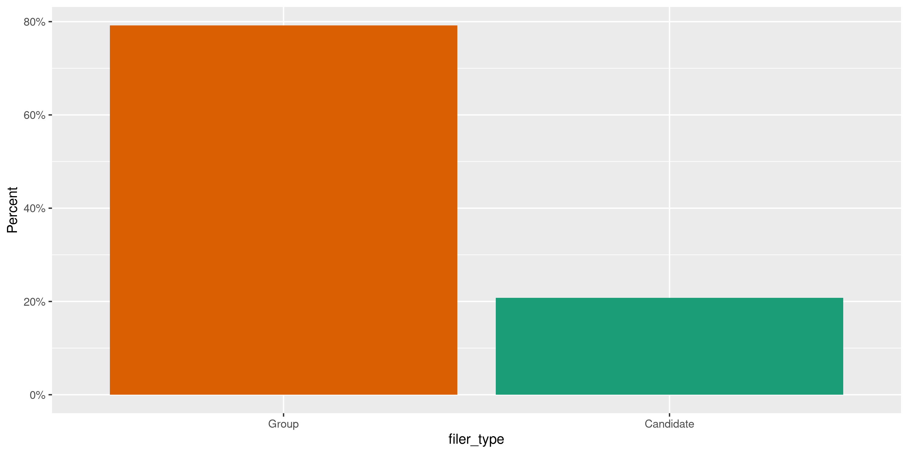
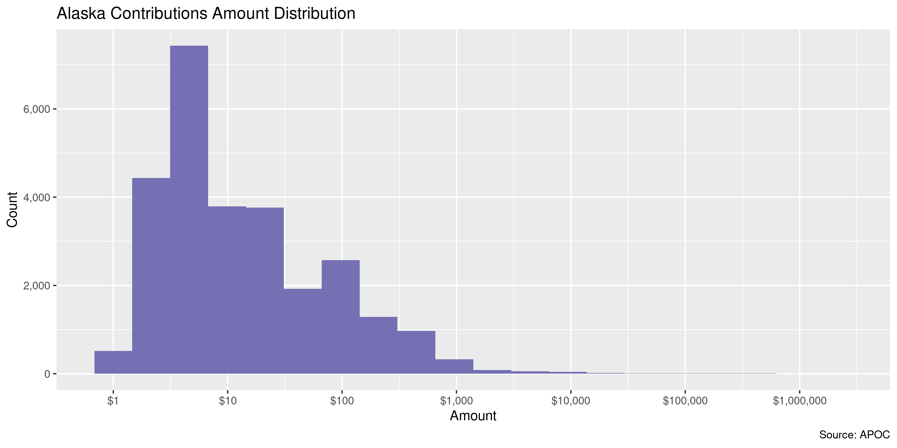

Alaska Contributions
================
Kiernan Nicholls
2021-01-22 16:59:23

-   [Project](#project)
-   [Objectives](#objectives)
-   [Packages](#packages)
-   [Data](#data)
-   [Download](#download)
-   [Read](#read)
-   [Explore](#explore)
-   [Wrangle](#wrangle)
-   [Conclude](#conclude)
-   [Export](#export)
-   [Upload](#upload)

<!-- Place comments regarding knitting here -->

## Project

The Accountability Project is an effort to cut across data silos and
give journalists, policy professionals, activists, and the public at
large a simple way to search across huge volumes of public data about
people and organizations.

Our goal is to standardizing public data on a few key fields by thinking
of each dataset row as a transaction. For each transaction there should
be (at least) 3 variables:

1.  All **parties** to a transaction.
2.  The **date** of the transaction.
3.  The **amount** of money involved.

## Objectives

This document describes the process used to complete the following
objectives:

1.  How many records are in the database?
2.  Check for entirely duplicated records.
3.  Check ranges of continuous variables.
4.  Is there anything blank or missing?
5.  Check for consistency issues.
6.  Create a five-digit ZIP Code called `zip`.
7.  Create a `year` field from the transaction date.
8.  Make sure there is data on both parties to a transaction.

## Packages

The following packages are needed to collect, manipulate, visualize,
analyze, and communicate these results. The `pacman` package will
facilitate their installation and attachment.

The IRW’s `campfin` package will also have to be installed from GitHub.
This package contains functions custom made to help facilitate the
processing of campaign finance data.

``` r
if (!require("pacman")) install.packages("pacman")
pacman::p_load_gh("irworkshop/campfin")
pacman::p_load(
  tidyverse, # data manipulation
  lubridate, # datetime strings
  magrittr, # pipe operators
  janitor, # dataframe clean
  aws.s3, # upload to aws s3
  refinr, # cluster and merge
  scales, # format strings
  knitr, # knit documents
  vroom, # read files fast
  glue, # combine strings
  httr, # http requests
  here, # relative storage
  fs # search storage 
)
```

This document should be run as part of the `R_campfin` project, which
lives as a sub-directory of the more general, language-agnostic
[`irworkshop/accountability_datacleaning`](https://github.com/irworkshop/accountability_datacleaning)
GitHub repository.

The `R_campfin` project uses the [RStudio
projects](https://support.rstudio.com/hc/en-us/articles/200526207-Using-Projects)
feature and should be run as such. The project also uses the dynamic
`here::here()` tool for file paths relative to *your* machine.

``` r
# where does this document knit?
here::here()
#> [1] "/home/kiernan/Code/tap/R_tap"
```

## Data

Data is obtained from the [Alaska Public Offices Commission
(APOC)](https://aws.state.ak.us/ApocReports/Campaign/#).

## Download

Using the [APOC income
search](https://aws.state.ak.us/ApocReports/CampaignDisclosure/CDIncome.aspx),
we need to search for “All Completed Forms”, “Any Names”, and “Any”
type. Exporting “Any” report year only returns roughly 400,000 results
despite 1,411,206 results being listed in the search. We can export all
of the results if we instead search and export individually by report
year. As of now, this needs to be done by hand.

-   2011: 785
-   2012: 173,143
-   2013: 103,121
-   2014: 206,605
-   2015: 180,295
-   2016: 194,377
-   2017: 144,398
-   2018: 198,013
-   2019: 126,881
-   2020: 137,488
-   2021: 337
-   **Total**: 1,465,443

``` r
raw_dir <- dir_create(here("ak", "contribs", "data", "raw"))
raw_info <- dir_info(raw_dir)
sum(raw_info$size)
#> 375M
raw_info %>% 
  select(path, size, modification_time) %>% 
  mutate(across(path, basename))
#> # A tibble: 11 x 3
#>    path                            size modification_time  
#>    <chr>                    <fs::bytes> <dttm>             
#>  1 CD_Transactions_2011.CSV      159.2K 2021-01-22 16:05:13
#>  2 CD_Transactions_2012.CSV       41.7M 2021-01-22 16:08:52
#>  3 CD_Transactions_2013.CSV       25.9M 2021-01-22 16:08:31
#>  4 CD_Transactions_2014.CSV       52.1M 2021-01-22 16:11:29
#>  5 CD_Transactions_2015.CSV       46.1M 2021-01-22 16:12:01
#>  6 CD_Transactions_2016.CSV         51M 2021-01-22 16:12:58
#>  7 CD_Transactions_2017.CSV       37.7M 2021-01-22 16:12:26
#>  8 CD_Transactions_2018.CSV       50.7M 2021-01-22 16:14:05
#>  9 CD_Transactions_2019.CSV       33.7M 2021-01-22 16:13:16
#> 10 CD_Transactions_2020.CSV       36.3M 2021-01-22 16:14:08
#> 11 CD_Transactions_2021.CSV       94.8K 2021-01-22 16:12:38
```

## Read

The exported delimited text files have two aspects we need to adjust
for; 1) There is a column called `--------` that is empty in every file,
and 2) there is an extra comma at the end of each line. We can read this
extra column at the end as a new `null` column.

``` r
akc_names <- raw_info$path[1] %>% 
  read_names(delim = ",") %>% 
  str_replace("--------", "null1") %>% 
  make_clean_names(case = "snake")
```

All the files can be read into a single data frame using
`vroom::vroom()`.

``` r
# should be 1,465,443 items
akc <- vroom(
  file = raw_info$path,
  skip = 1,
  delim = ",",
  num_threads = 1,
  escape_double = TRUE,
  na = c("", "NA", "N/A", "n/a"),
  # add column name to end
  col_names = c(akc_names, "null2"),
  col_types = cols(
    .default = col_character(),
    date = col_date_mdy(),
    amount = col_number(),
    report_year = col_integer(),
    submitted = col_date_mdy(),
    # ignore bad cols
    null1 = col_skip(),
    null2 = col_skip()
  )
)
```

We successfully read the same number of rows as search results.

``` r
nrow(akc) == 1465443
#> [1] TRUE
```

For exploration, we can split the election name column into its parts.

``` r
elect_names <- akc %>%
  distinct(elect_name) %>% 
  mutate(across(elect_name, na_if, "-")) %>% 
  separate(
    col = elect_name,
    into = c("elect_year", "elect_where"),
    remove = FALSE,
    sep = "\\s-\\s",
    convert = TRUE,
    extra = "merge"
  ) %>% 
  mutate(across(elect_where, str_squish))
```

``` r
akc <- akc %>% 
  left_join(elect_names, by = "elect_name") %>% 
  select(-elect_name) %>% 
  rename(elect_name = elect_where) %>% 
  relocate(elect_year, elect_name, .before = elect_type)
```

## Explore

There are 1,465,443 rows of 25 columns.

``` r
glimpse(akc)
#> Rows: 1,465,443
#> Columns: 25
#> $ txn          <chr> "1", "2", "3", "4", "5", "6", "7", "8", "9", "10", "11", "12", "13", "14", …
#> $ date         <date> 2011-09-23, 2011-09-23, 2011-09-23, 2011-09-23, 2011-09-23, 2011-09-23, 20…
#> $ pay_type     <chr> "Payroll Deduction", "Payroll Deduction", "Payroll Deduction", "Payroll Ded…
#> $ pay_info     <chr> NA, NA, NA, NA, NA, NA, NA, NA, NA, NA, NA, NA, NA, NA, NA, NA, NA, NA, NA,…
#> $ amount       <dbl> 500, 500, 500, 500, 500, 500, 500, 500, 500, 500, 500, 500, 500, 500, 500, …
#> $ last         <chr> "Anderson", "Antonsen", "Backen", "Baken", "Cathcart", "Charles", "Chaudhar…
#> $ first        <chr> "David", "Hans", "Terrance", "Jeff", "Jim", "Don", "Norbert", "Michael", "E…
#> $ address      <chr> "412 Front St.", "701 Carlanna Lake Rd.", "2417 Tongass Ave. Ste. 111-301",…
#> $ city         <chr> "Ketchikan", "Ketchikan", "Ketchikan", "Ketchikan", "Ketchikan", "Ketchikan…
#> $ state        <chr> "Alaska", "Alaska", "Alaska", "Alaska", "Alaska", "Alaska", "Alaska", "Alas…
#> $ zip          <chr> "99901", "99901", "99901", "99901", "99901", "99901", "99901", "99901", "99…
#> $ country      <chr> "USA", "USA", "USA", "USA", "USA", "USA", "USA", "USA", "USA", "USA", "USA"…
#> $ occupation   <chr> "Marine Pilot", "Marine Pilot", "Marine Pilot", "Marine Pilot", "Marine Pil…
#> $ employer     <chr> "Self", "Self", "Self", "Self", "Self", "Self", "Self", "Self", "Self", "Se…
#> $ purpose      <chr> NA, NA, NA, NA, NA, NA, NA, NA, NA, NA, NA, NA, NA, NA, NA, NA, NA, NA, NA,…
#> $ rpt_type     <chr> "Year End Report", "Year End Report", "Year End Report", "Year End Report",…
#> $ elect_year   <int> NA, NA, NA, NA, NA, NA, NA, NA, NA, NA, NA, NA, NA, NA, NA, NA, NA, NA, NA,…
#> $ elect_name   <chr> NA, NA, NA, NA, NA, NA, NA, NA, NA, NA, NA, NA, NA, NA, NA, NA, NA, NA, NA,…
#> $ elect_type   <chr> NA, NA, NA, NA, NA, NA, NA, NA, NA, NA, NA, NA, NA, NA, NA, NA, NA, NA, NA,…
#> $ municipality <chr> NA, NA, NA, NA, NA, NA, NA, NA, NA, NA, NA, NA, NA, NA, NA, NA, NA, NA, NA,…
#> $ office       <chr> NA, NA, NA, NA, NA, NA, NA, NA, NA, NA, NA, NA, NA, NA, NA, NA, NA, NA, NA,…
#> $ filer_type   <chr> "Group", "Group", "Group", "Group", "Group", "Group", "Group", "Group", "Gr…
#> $ committee    <chr> "AK Sea Pilot PAC Fund", "AK Sea Pilot PAC Fund", "AK Sea Pilot PAC Fund", …
#> $ rpt_year     <int> 2011, 2011, 2011, 2011, 2011, 2011, 2011, 2011, 2011, 2011, 2011, 2011, 201…
#> $ submitted    <date> 2012-01-17, 2012-01-17, 2012-01-17, 2012-01-17, 2012-01-17, 2012-01-17, 20…
tail(akc)
#> # A tibble: 6 x 25
#>   txn   date       pay_type pay_info amount last  first address city  state zip   country
#>   <chr> <date>     <chr>    <chr>     <dbl> <chr> <chr> <chr>   <chr> <chr> <chr> <chr>  
#> 1 332   2020-01-01 Non-Mon… G Suite    5.41 Mart… Geor… 6608 M… Anch… Alas… 99504 USA    
#> 2 333   2020-01-01 Non-Mon… Google …  10.6  Mart… Geor… 6608 M… Anch… Alas… 99504 USA    
#> 3 334   2020-01-04 Non-Mon… Vista P…  25.7  Mart… Geor… 6608 M… Anch… Alas… 99504 USA    
#> 4 335   2020-01-23 Non-Mon… At&T      30    Mart… Geor… 6608 M… Anch… Alas… 99504 USA    
#> 5 336   2020-01-30 Non-Mon… USPS (S…  90    Mart… Geor… 6608 M… Anch… Alas… 99504 USA    
#> 6 337   2020-02-01 Non-Mon… G Suite   13.9  Mart… Geor… 6608 M… Anch… Alas… 99504 USA    
#> # … with 13 more variables: occupation <chr>, employer <chr>, purpose <chr>, rpt_type <chr>,
#> #   elect_year <int>, elect_name <chr>, elect_type <chr>, municipality <chr>, office <chr>,
#> #   filer_type <chr>, committee <chr>, rpt_year <int>, submitted <date>
```

### Missing

Columns vary in their degree of missing values.

``` r
col_stats(akc, count_na)
#> # A tibble: 25 x 4
#>    col          class        n         p
#>    <chr>        <chr>    <int>     <dbl>
#>  1 txn          <chr>        0 0        
#>  2 date         <date>       0 0        
#>  3 pay_type     <chr>        0 0        
#>  4 pay_info     <chr>   622680 0.425    
#>  5 amount       <dbl>        0 0        
#>  6 last         <chr>       59 0.0000403
#>  7 first        <chr>    63621 0.0434   
#>  8 address      <chr>     6125 0.00418  
#>  9 city         <chr>     5790 0.00395  
#> 10 state        <chr>      156 0.000106 
#> 11 zip          <chr>     6214 0.00424  
#> 12 country      <chr>        0 0        
#> 13 occupation   <chr>   361721 0.247    
#> 14 employer     <chr>   270543 0.185    
#> 15 purpose      <chr>  1287466 0.879    
#> 16 rpt_type     <chr>    13801 0.00942  
#> 17 elect_year   <int>   482222 0.329    
#> 18 elect_name   <chr>   482222 0.329    
#> 19 elect_type   <chr>   482222 0.329    
#> 20 municipality <chr>   998476 0.681    
#> 21 office       <chr>  1052737 0.718    
#> 22 filer_type   <chr>        0 0        
#> 23 committee    <chr>        0 0        
#> 24 rpt_year     <int>        0 0        
#> 25 submitted    <date>       0 0
```

We can flag any rows that are missing a name, date, or amount needed to
identify a transaction.

``` r
key_vars <- c("date", "last", "amount", "committee")
akc <- flag_na(akc, all_of(key_vars))
sum(akc$na_flag)
#> [1] 59
```

All of these missing key values are the `last` name of the contributor.

``` r
akc %>% 
  filter(na_flag) %>% 
  select(all_of(key_vars)) %>% 
  sample_frac()
#> # A tibble: 59 x 4
#>    date       last   amount committee                               
#>    <date>     <chr>   <dbl> <chr>                                   
#>  1 2012-02-08 <NA>  1500    Anchorage Tomorrow                      
#>  2 2019-10-10 <NA>     8.7  Local367PAC                             
#>  3 2020-09-30 <NA>  2000    Mat Su Republican Women's Club Est. 1947
#>  4 2012-03-05 <NA>   500    Anchorage Tomorrow                      
#>  5 2012-03-01 <NA>  2500    Anchorage Tomorrow                      
#>  6 2018-08-31 <NA>     0.23 Robert Kinnard III                      
#>  7 2011-11-30 <NA>   141.   Luke Hopkins                            
#>  8 2015-12-18 <NA>    25    MAT-SU DEMOCRATS                        
#>  9 2012-02-15 <NA>   250    Anchorage Tomorrow                      
#> 10 2012-03-19 <NA>   500    Anchorage Tomorrow                      
#> # … with 49 more rows
```

``` r
akc %>% 
  filter(na_flag) %>% 
  select(all_of(key_vars)) %>% 
  col_stats(count_na)
#> # A tibble: 4 x 4
#>   col       class      n     p
#>   <chr>     <chr>  <int> <dbl>
#> 1 date      <date>     0     0
#> 2 last      <chr>     59     1
#> 3 amount    <dbl>      0     0
#> 4 committee <chr>      0     0
```

### Duplicates

Ignoring the supposedly unique `id` variable, quite a few records are
entirely duplicated. We will not remove these records, as they may very
well be valid repetitions, but we can flag them with a new logical
variable.

``` r
d1 <- duplicated(akc[, -1], fromLast = TRUE)
d2 <- duplicated(akc[, -1], fromLast = FALSE)
akc <- mutate(akc, dupe_flag = (d1 | d2))
percent(mean(akc$dupe_flag), 0.1)
#> [1] "11.5%"
rm(d1, d2); flush_memory()
```

``` r
akc %>% 
  filter(dupe_flag) %>% 
  select(txn, all_of(key_vars))
#> # A tibble: 168,707 x 5
#>    txn   date       last                       amount committee                           
#>    <chr> <date>     <chr>                       <dbl> <chr>                               
#>  1 43    2011-09-23 Moore                       500   AK Sea Pilot PAC Fund               
#>  2 44    2011-09-23 Moore                       500   AK Sea Pilot PAC Fund               
#>  3 565   2011-11-10 Wisniewski                   20   Alaska Democratic Labor Caucus      
#>  4 566   2011-11-10 Wisniewski                   20   Alaska Democratic Labor Caucus      
#>  5 63    2012-06-01 Walker                       25   Senate Democratic Campaign Committee
#>  6 64    2012-06-01 Walker                       25   Senate Democratic Campaign Committee
#>  7 221   2012-01-12 Hume                        100   Friends of the Interior             
#>  8 299   2012-01-12 Hume                        100   Friends of the Interior             
#>  9 496   2011-01-31 First National Bank Alaska    0.3 ABC Alaska PAC                      
#> 10 497   2011-02-28 First National Bank Alaska    0.3 ABC Alaska PAC                      
#> # … with 168,697 more rows
```

### Categorical

Columns also vary in their degree of distinctiveness. Some character
columns like `first` name are obviously mostly distinct, others like
`office` only have a few unique values, which we can count.

``` r
col_stats(akc, n_distinct)
#> # A tibble: 27 x 4
#>    col          class       n          p
#>    <chr>        <chr>   <int>      <dbl>
#>  1 txn          <chr>  206605 0.141     
#>  2 date         <date>   3562 0.00243   
#>  3 pay_type     <chr>      10 0.00000682
#>  4 pay_info     <chr>   32175 0.0220    
#>  5 amount       <dbl>    9206 0.00628   
#>  6 last         <chr>   52204 0.0356    
#>  7 first        <chr>   24137 0.0165    
#>  8 address      <chr>  127855 0.0872    
#>  9 city         <chr>    5919 0.00404   
#> 10 state        <chr>      90 0.0000614 
#> 11 zip          <chr>   14769 0.0101    
#> 12 country      <chr>      32 0.0000218 
#> 13 occupation   <chr>   28227 0.0193    
#> 14 employer     <chr>   39806 0.0272    
#> 15 purpose      <chr>   10598 0.00723   
#> 16 rpt_type     <chr>      14 0.00000955
#> 17 elect_year   <int>      12 0.00000819
#> 18 elect_name   <chr>      56 0.0000382 
#> 19 elect_type   <chr>      10 0.00000682
#> 20 municipality <chr>      30 0.0000205 
#> 21 office       <chr>      12 0.00000819
#> 22 filer_type   <chr>       3 0.00000205
#> 23 committee    <chr>    1203 0.000821  
#> 24 rpt_year     <int>      11 0.00000751
#> 25 submitted    <date>   2063 0.00141   
#> 26 na_flag      <lgl>       2 0.00000136
#> 27 dupe_flag    <lgl>       2 0.00000136
```

<!-- --><!-- --><!-- --><!-- --><!-- -->

### Amounts

``` r
noquote(map_chr(summary(akc$amount), dollar))
#>       Min.    1st Qu.     Median       Mean    3rd Qu.       Max. 
#>         $0         $5     $13.23    $204.12       $100 $3,004,994
percent(mean(akc$amount <= 0), 0.01)
#> [1] "0.23%"
```

There are only 9,206 values, which is an order of magnitude less than we
might expect from a distribution of values from a dataset of this size.

In fact, more than half of all `amount` values are $2, $5, $50, $100, or
$500 dollars even.

``` r
akc %>% 
  count(amount, sort = TRUE) %>% 
  add_prop(sum = TRUE)
#> # A tibble: 9,206 x 3
#>    amount      n     p
#>     <dbl>  <int> <dbl>
#>  1      5 272851 0.186
#>  2    100 159798 0.295
#>  3      2 154539 0.401
#>  4     50  86813 0.460
#>  5    500  73300 0.510
#>  6     10  70642 0.558
#>  7    250  48396 0.591
#>  8     25  42720 0.620
#>  9    200  33204 0.643
#> 10     20  30354 0.664
#> # … with 9,196 more rows
```

<!-- -->

### Dates

``` r
akc <- mutate(
  .data = akc,
  date_clean = date %>% 
    # fix bad years with regex
    str_replace("^(210)(?=\\d-)", "201") %>% 
    str_replace("^(202)(?=[13-9])", "201") %>% 
    str_replace("^(29)(?=\\d-)", "20") %>% 
    str_replace("^(291)(?=\\d-)", "201") %>% 
    str_replace("^(301)(?=\\d-)", "201") %>% 
    as_date(),
  year_clean = year(date_clean)
)
```

``` r
min(akc$date_clean)
#> [1] "2006-10-15"
sum(akc$year_clean < 2011)
#> [1] 61
max(akc$date_clean)
#> [1] "3030-10-30"
sum(akc$date_clean > today())
#> [1] 1
```

<!-- -->

## Wrangle

To improve the searchability of the database, we will perform some
consistent, confident string normalization. For geographic variables
like city names and ZIP codes, the corresponding `campfin::normal_*()`
functions are tailor made to facilitate this process.

### Address

For the street `addresss` variable, the `campfin::normal_address()`
function will force consistence case, remove punctuation, and abbreviate
official USPS suffixes.

``` r
addr_norm <- akc %>% 
  distinct(address) %>% 
  mutate(
    address_norm = normal_address(
      address = address,
      abbs = usps_street,
      na_rep = TRUE
    )
  )
```

``` r
addr_norm
#> # A tibble: 127,855 x 2
#>    address                        address_norm                
#>    <chr>                          <chr>                       
#>  1 412 Front St.                  412 FRNT ST                 
#>  2 701 Carlanna Lake Rd.          701 CARLANNA LK RD          
#>  3 2417 Tongass Ave. Ste. 111-301 2417 TONGASS AVE STE 111 301
#>  4 P.O. Box 8751                  PO BOX 8751                 
#>  5 2417 Tongass Ave. Ste. 111-185 2417 TONGASS AVE STE 111 185
#>  6 2417 Tongass Ave. Ste. 111-106 2417 TONGASS AVE STE 111 106
#>  7 862 Forest Park Dr.            862 FRST PARK DR            
#>  8 P.O. Box 8724                  PO BOX 8724                 
#>  9 2417 Tongass Ave. Ste. 111-177 2417 TONGASS AVE STE 111 177
#> 10 2299 Oyster                    2299 OYSTER                 
#> # … with 127,845 more rows
```

``` r
akc <- left_join(akc, addr_norm, by = "address")
rm(addr_norm); flush_memory()
```

### ZIP

For ZIP codes, the `campfin::normal_zip()` function will attempt to
create valid *five* digit codes by removing the ZIP+4 suffix and
returning leading zeroes dropped by other programs like Microsoft Excel.

``` r
akc <- akc %>% 
  mutate(
    zip_norm = normal_zip(
      zip = zip,
      na_rep = TRUE
    )
  )
```

``` r
progress_table(
  akc$zip,
  akc$zip_norm,
  compare = valid_zip
)
#> # A tibble: 2 x 6
#>   stage    prop_in n_distinct prop_na n_out n_diff
#>   <chr>      <dbl>      <dbl>   <dbl> <dbl>  <dbl>
#> 1 zip        0.964      14769 0.00424 52522   8638
#> 2 zip_norm   0.998       7153 0.00701  2602    447
```

### State

Valid two digit state abbreviations can be made using the
`campfin::normal_state()` function.

``` r
akc <- akc %>% 
  mutate(
    state_norm = normal_state(
      state = state,
      abbreviate = TRUE,
      na_rep = TRUE,
      valid = NULL
    )
  )
```

``` r
akc %>% 
  filter(state != state_norm) %>% 
  count(state, state_norm, sort = TRUE)
#> # A tibble: 73 x 3
#>    state                state_norm       n
#>    <chr>                <chr>        <int>
#>  1 Alaska               AK         1412707
#>  2 Washington           WA            9519
#>  3 California           CA            6090
#>  4 Texas                TX            3601
#>  5 Oregon               OR            3109
#>  6 Arizona              AZ            2342
#>  7 New York             NY            2122
#>  8 Florida              FL            1980
#>  9 Colorado             CO            1717
#> 10 District of Columbia DC            1383
#> # … with 63 more rows
```

``` r
akc %>% 
  filter(state_norm %out% valid_state) %>% 
  count(state, state_norm, sort = TRUE) %>% 
  print(n = Inf)
#> # A tibble: 30 x 3
#>    state                                    state_norm              n
#>    <chr>                                    <chr>               <int>
#>  1 <NA>                                     <NA>                  156
#>  2 Armed Forces - Europe including Canada   AE INCLUDING CANADA    14
#>  3 Alberta                                  ALBERTA                 8
#>  4 British Columbia                         BRITISH COLUMBIA        6
#>  5 Ontario                                  ONTARIO                 6
#>  6 Europe                                   EUROPE                  4
#>  7 CHE                                      CHE                     3
#>  8 DEU                                      DEU                     3
#>  9 Surry Hills                              SURRY HILLS             3
#> 10 Bulgaria                                 BULGARIA                2
#> 11 GET                                      GET                     2
#> 12 Gipuzkoa                                 GIPUZKOA                2
#> 13 GR                                       GR                      2
#> 14 IR                                       IR                      2
#> 15 NSW                                      NSW                     2
#> 16 philippines                              PHILIPPINES             2
#> 17 Phillipines                              PHILLIPINES             2
#> 18 SW                                       SW                      2
#> 19 0                                        <NA>                    1
#> 20 Armed Forces - Americas excluding Canada AA EXCLUDING CANADA     1
#> 21 Guipuzcoa                                GUIPUZCOA               1
#> 22 Japan                                    JAPAN                   1
#> 23 new zealand                              NEW ZEALAND             1
#> 24 New Zealand                              NEW ZEALAND             1
#> 25 none                                     NONE                    1
#> 26 NZL                                      NZL                     1
#> 27 Queensland                               QUEENSLAND              1
#> 28 RM                                       RM                      1
#> 29 Swerige                                  SWERIGE                 1
#> 30 Switzerland                              SWITZERLAND             1
```

``` r
akc <- akc %>% 
  mutate(
    state_norm = state_norm %>% 
      na_in("NONE") %>% 
      str_replace("^ALBERTA$", "AB") %>% 
      str_replace("^BRITISH COLUMBIA$", "BC") %>% 
      str_replace("^NEW ZEALAND$", "NZ") %>% 
      str_replace("^NZL$", "NZ") %>% 
      str_replace("^ONTARIO$", "ON") %>% 
      str_replace("^PHILIPPINES$", "PH") %>% 
      str_replace("^PHILLIPINES$", "PH") %>% 
      str_replace("^SURRY HILLS$", "NSW") %>% 
      str_replace("^EUROPE$", "EU") %>% 
      str_remove("\\s\\w+ CANADA") %>% 
      str_squish()
  )
```

``` r
progress_table(
  akc$state,
  akc$state_norm,
  compare = valid_state
)
#> # A tibble: 2 x 6
#>   stage        prop_in n_distinct  prop_na   n_out n_diff
#>   <chr>          <dbl>      <dbl>    <dbl>   <dbl>  <dbl>
#> 1 state      0.0000130         90 0.000106 1465268     84
#> 2 state_norm 1.00              78 0.000108      60     22
```

### City

Cities are the most difficult geographic variable to normalize, simply
due to the wide variety of valid cities and formats.

#### Normal

The `campfin::normal_city()` function is a good start, again converting
case, removing punctuation, but *expanding* USPS abbreviations. We can
also remove `invalid_city` values.

``` r
city_norm <- akc %>% 
  distinct(city, state_norm, zip_norm) %>% 
  mutate(
    city_norm = normal_city(
      city = city, 
      abbs = usps_city,
      states = c("AK", "DC", "ALASKA"),
      na = invalid_city,
      na_rep = TRUE
    )
  )
```

#### Swap

We can further improve normalization by comparing our normalized value
against the *expected* value for that record’s state abbreviation and
ZIP code. If the normalized value is either an abbreviation for or very
similar to the expected value, we can confidently swap those two.

``` r
city_norm <- city_norm %>% 
  rename(city_raw = city) %>% 
  left_join(
    y = zipcodes,
    by = c(
      "state_norm" = "state",
      "zip_norm" = "zip"
    )
  ) %>% 
  rename(city_match = city) %>% 
  mutate(
    match_abb = is_abbrev(city_norm, city_match),
    match_dist = str_dist(city_norm, city_match),
    city_swap = if_else(
      condition = !is.na(match_dist) & (match_abb | match_dist == 1),
      true = city_match,
      false = city_norm
    )
  ) %>% 
  select(
    -city_match,
    -match_dist,
    -match_abb
  )
```

``` r
akc <- left_join(
  x = akc,
  y = city_norm,
  by = c(
    "city" = "city_raw",
    "state_norm",
    "zip_norm"
  )
)
```

#### Refine

The [OpenRefine](https://openrefine.org/) algorithms can be used to
group similar strings and replace the less common versions with their
most common counterpart. This can greatly reduce inconsistency, but with
low confidence; we will only keep any refined strings that have a valid
city/state/zip combination.

``` r
good_refine <- akc %>% 
  mutate(
    city_refine = city_swap %>% 
      key_collision_merge() %>% 
      n_gram_merge(numgram = 1)
  ) %>% 
  filter(city_refine != city_swap) %>% 
  inner_join(
    y = zipcodes,
    by = c(
      "city_refine" = "city",
      "state_norm" = "state",
      "zip_norm" = "zip"
    )
  )
```

    #> # A tibble: 33 x 5
    #>    state_norm zip_norm city_swap          city_refine         n
    #>    <chr>      <chr>    <chr>              <chr>           <int>
    #>  1 AK         99929    WRANGLER           WRANGELL           22
    #>  2 AK         99577    EAGLE RIVER ER     EAGLE RIVER         8
    #>  3 AK         99676    TALKENNTNA         TALKEETNA           7
    #>  4 AK         99801    JUNUEA             JUNEAU              5
    #>  5 AK         99639    NILICHIK           NINILCHIK           4
    #>  6 NV         89060    PARUMPH            PAHRUMP             4
    #>  7 AK         99611    KENAIKENAI         KENAI               3
    #>  8 AK         99676    TALLLKETNA         TALKEETNA           3
    #>  9 AR         72701    FAYETTEVILLEVILLE  FAYETTEVILLE        3
    #> 10 FL         33308    FORT LAUDERDALE FL FORT LAUDERDALE     3
    #> # … with 23 more rows

Then we can join the refined values back to the database.

``` r
akc <- akc %>% 
  left_join(good_refine, by = names(.)) %>% 
  mutate(city_refine = coalesce(city_refine, city_swap))
```

#### Progress

| stage        | prop\_in | n\_distinct | prop\_na | n\_out | n\_diff |
|:-------------|---------:|------------:|---------:|-------:|--------:|
| city\_raw)   |      NaN |           0 |      NaN |      0 |       0 |
| city\_norm   |    0.960 |        4758 |    0.005 |  58572 |    1127 |
| city\_swap   |    0.997 |        4155 |    0.005 |   4668 |     476 |
| city\_refine |    0.997 |        4128 |    0.005 |   4572 |     449 |

You can see how the percentage of valid values increased with each
stage.

<!-- -->

More importantly, the number of distinct values decreased each stage. We
were able to confidently change many distinct invalid values to their
valid equivalent.

<!-- -->

## Conclude

``` r
akc <- akc %>% 
  select(
    -city_norm,
    -city_swap,
    city_clean = city_refine
  ) %>% 
  rename_all(~str_replace(., "_norm", "_clean"))
```

``` r
glimpse(sample_n(akc, 20))
#> Rows: 20
#> Columns: 33
#> $ txn           <chr> "13054", "79458", "109488", "38140", "34971", "145651", "101472", "102399"…
#> $ date          <date> 2012-03-30, 2020-09-29, 2019-01-16, 2016-06-13, 2013-08-28, 2011-07-13, 2…
#> $ pay_type      <chr> "Payroll Deduction", "Non-Monetary", "Payroll Deduction", "Payroll Deducti…
#> $ pay_info      <chr> "Payroll Deduction", "staff time", "SOA PPE 12/31/18", NA, "Payroll Deduct…
#> $ amount        <dbl> 2.00, 6197.50, 5.00, 9.25, 10.00, 50.00, 10.00, 500.00, 1.00, 10.00, 7.05,…
#> $ last          <chr> "TILL", "Brena", "SPERRY", "DUNHAM", "WILBER", "Thayer", "Killian, II", "W…
#> $ first         <chr> "DEBORAH", "Robin", "RUSSELL A", "BENJAMIN", "SARA", "Curtis", "Ken L.", "…
#> $ address       <chr> "PO BOX 3707", "810 N St", "PO BOX 30106", "6041 LONGORIA CIRCLE", "PO BOX…
#> $ city          <chr> "PALMER", "Anchorage", "CENTRAL", "ANCHORAGE", "WASILLA", "Anchorage", "An…
#> $ state         <chr> "Alaska", "Alaska", "Alaska", "Alaska", "Alaska", "Alaska", "Alaska", "Ala…
#> $ zip           <chr> "99645", "99501", "99730", "99504", "99629", "99519-0288", "99501", "99516…
#> $ country       <chr> "USA", "USA", "USA", "USA", "USA", "USA", "USA", "USA", "USA", "USA", "USA…
#> $ occupation    <chr> NA, "Attorney", NA, "Apprentice", "Professional", "Deputy Commissioner", "…
#> $ employer      <chr> NA, "Brena Bell & Walker", NA, "Price Gregory", NA, "State of Alaska", "St…
#> $ purpose       <chr> NA, "staff time", NA, NA, NA, NA, "PAC Contribution", NA, NA, NA, NA, NA, …
#> $ rpt_type      <chr> "105 Day Report", "Thirty Day Report", "Year End Report", "105 Day Report"…
#> $ elect_year    <int> 2012, 2020, NA, 2016, NA, 2012, 2015, 2012, 2020, NA, NA, 2020, 2012, 2015…
#> $ elect_name    <chr> "Anchorage Municipal Election", "State General Election", NA, "Anchorage M…
#> $ elect_type    <chr> "Anchorage Municipal", "State General", NA, "Anchorage Municipal", NA, "St…
#> $ municipality  <chr> "Anchorage, City and Borough", NA, NA, "Anchorage, City and Borough", NA, …
#> $ office        <chr> NA, NA, NA, NA, NA, NA, NA, "Mayor", NA, NA, NA, "Senate", "House", NA, "H…
#> $ filer_type    <chr> "Group", "Group", "Group", "Group", "Group", "Candidate", "Group", "Candid…
#> $ committee     <chr> "Alaska State Employees Association Local 52 Politcal Action Committee", "…
#> $ rpt_year      <int> 2012, 2020, 2018, 2016, 2013, 2012, 2015, 2012, 2020, 2015, 2014, 2020, 20…
#> $ submitted     <date> 2012-07-17, 2020-11-18, 2019-02-15, 2016-07-18, 2013-08-31, 2012-05-14, 2…
#> $ na_flag       <lgl> FALSE, FALSE, FALSE, FALSE, FALSE, FALSE, FALSE, FALSE, FALSE, FALSE, FALS…
#> $ dupe_flag     <lgl> FALSE, FALSE, FALSE, FALSE, FALSE, FALSE, FALSE, FALSE, FALSE, FALSE, FALS…
#> $ date_clean    <date> 2012-03-30, 2020-09-29, 2019-01-16, 2016-06-13, 2013-08-28, 2011-07-13, 2…
#> $ year_clean    <dbl> 2012, 2020, 2019, 2016, 2013, 2011, 2015, 2012, 2020, 2015, 2015, 2020, 20…
#> $ address_clean <chr> "PO BOX 3707", "810 N ST", "PO BOX 30106", "6041 LONGORIA CIR", "PO BOX 29…
#> $ zip_clean     <chr> "99645", "99501", "99730", "99504", "99629", "99519", "99501", "99516", "9…
#> $ state_clean   <chr> "AK", "AK", "AK", "AK", "AK", "AK", "AK", "AK", "AK", "AK", "AK", "AK", "A…
#> $ city_clean    <chr> "PALMER", "ANCHORAGE", "CENTRAL", "ANCHORAGE", "WASILLA", "ANCHORAGE", "AN…
```

1.  There are 1,465,443 records in the database.
2.  There are 168,707 duplicate records in the database.
3.  The range and distribution of `amount` and `date` seem reasonable.
4.  There are 59 records missing key variables.
5.  Consistency in geographic data has been improved with
    `campfin::normal_*()`.
6.  The 4-digit `year` variable has been created with
    `lubridate::year()`.

## Export

``` r
clean_dir <- dir_create(here("ak", "contribs", "data", "clean"))
clean_path <- path(clean_dir, "ak_contribs_clean.csv")
write_csv(akc, clean_path, na = "")
(clean_size <- file_size(clean_path))
#> 438M
```

## Upload

We can use the `aws.s3::put_object()` to upload the text file to the IRW
server.

``` r
aws_path <- path("csv", basename(clean_path))
if (!object_exists(aws_path, "publicaccountability")) {
  put_object(
    file = clean_path,
    object = aws_path, 
    bucket = "publicaccountability",
    acl = "public-read",
    show_progress = TRUE,
    multipart = TRUE
  )
}
aws_head <- head_object(aws_path, "publicaccountability")
(aws_size <- as_fs_bytes(attr(aws_head, "content-length")))
unname(aws_size == clean_size)
```
