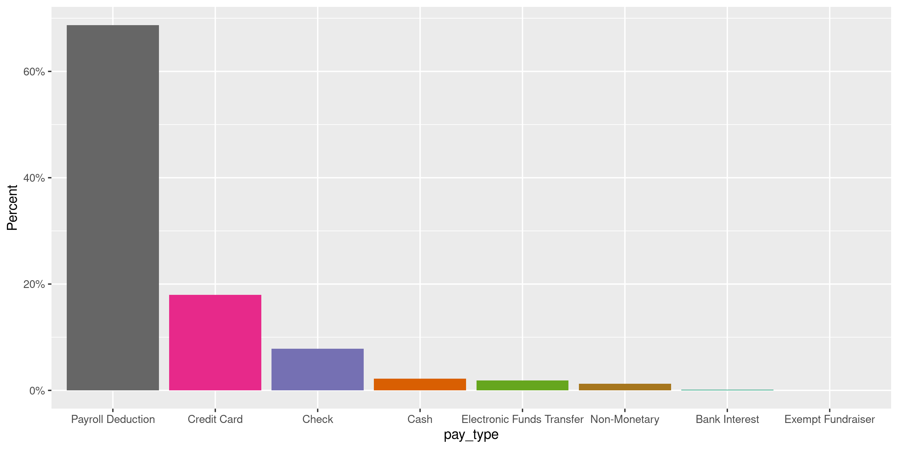
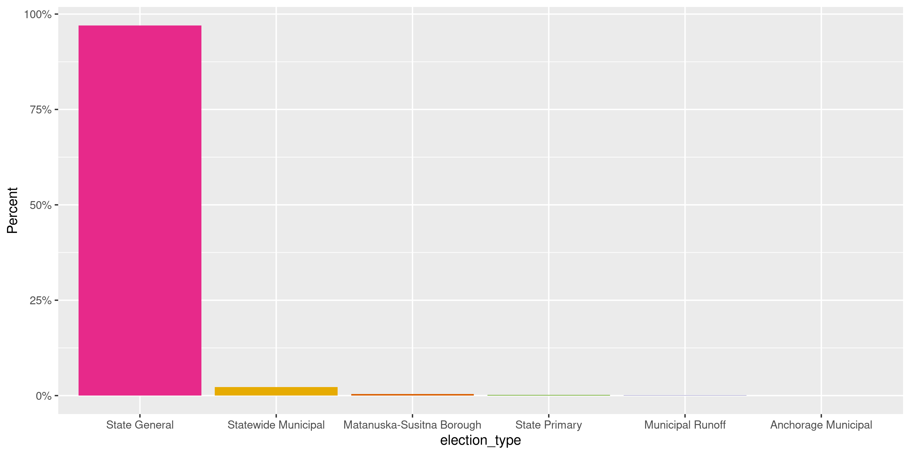
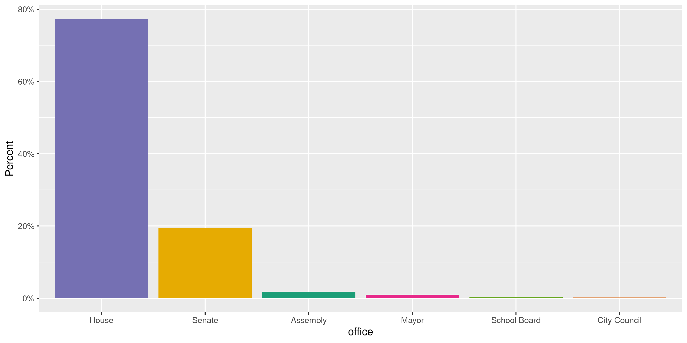

Alaska Contributions
================
Kiernan Nicholls
2022-12-29 23:13:25

- <a href="#project" id="toc-project">Project</a>
- <a href="#objectives" id="toc-objectives">Objectives</a>
- <a href="#packages" id="toc-packages">Packages</a>
- <a href="#data" id="toc-data">Data</a>
- <a href="#download" id="toc-download">Download</a>
- <a href="#read" id="toc-read">Read</a>
- <a href="#explore" id="toc-explore">Explore</a>
- <a href="#wrangle" id="toc-wrangle">Wrangle</a>
- <a href="#conclude" id="toc-conclude">Conclude</a>
- <a href="#export" id="toc-export">Export</a>
- <a href="#upload" id="toc-upload">Upload</a>

<!-- Place comments regarding knitting here -->

## Project

The Accountability Project is an effort to cut across data silos and
give journalists, policy professionals, activists, and the public at
large a simple way to search across huge volumes of public data about
people and organizations.

Our goal is to standardizing public data on a few key fields by thinking
of each dataset row as a transaction. For each transaction there should
be (at least) 3 variables:

1.  All **parties** to a transaction.
2.  The **date** of the transaction.
3.  The **amount** of money involved.

## Objectives

This document describes the process used to complete the following
objectives:

1.  How many records are in the database?
2.  Check for entirely duplicated records.
3.  Check ranges of continuous variables.
4.  Is there anything blank or missing?
5.  Check for consistency issues.
6.  Create a five-digit ZIP Code called `zip`.
7.  Create a `year` field from the transaction date.
8.  Make sure there is data on both parties to a transaction.

## Packages

The following packages are needed to collect, manipulate, visualize,
analyze, and communicate these results. The `pacman` package will
facilitate their installation and attachment.

The IRW’s `campfin` package will also have to be installed from GitHub.
This package contains functions custom made to help facilitate the
processing of campaign finance data.

``` r
if (!require("pacman")) install.packages("pacman")
pacman::p_load_gh("irworkshop/campfin")
pacman::p_load(
  tidyverse, # data manipulation
  lubridate, # datetime strings
  magrittr, # pipe operators
  janitor, # dataframe clean
  aws.s3, # upload to aws s3
  refinr, # cluster and merge
  scales, # format strings
  knitr, # knit documents
  vroom, # read files fast
  glue, # combine strings
  httr, # http requests
  here, # relative storage
  fs # search storage 
)
```

This document should be run as part of the `R_campfin` project, which
lives as a sub-directory of the more general, language-agnostic
[`irworkshop/accountability_datacleaning`](https://github.com/irworkshop/accountability_datacleaning)
GitHub repository.

The `R_campfin` project uses the [RStudio
projects](https://support.rstudio.com/hc/en-us/articles/200526207-Using-Projects)
feature and should be run as such. The project also uses the dynamic
`here::here()` tool for file paths relative to *your* machine.

``` r
# where does this document knit?
here::here()
#> [1] "/Users/yanqixu/code/accountability_datacleaning"
```

## Data

Data is obtained from the [Alaska Public Offices Commission
(APOC)](https://aws.state.ak.us/ApocReports/Campaign/#).

## Download

Using the [APOC income
search](https://aws.state.ak.us/ApocReports/CampaignDisclosure/CDIncome.aspx),
we need to search for “All Completed Forms”, “Any Names”, and “Any”
type. Exporting “Any” report year only returns roughly 400,000 results
despite 1,411,206 results being listed in the search. We can export all
of the results if we instead search and export individually by report
year. As of now, this needs to be done by hand.

``` r
line_count <- function(path) {
  as.numeric(str_extract(system(paste("wc -l", path), intern = TRUE), "^\\d+"))
}
```

``` r
raw_dir <- dir_create(here("state","ak", "contribs", "data", "raw"))
raw_info <- dir_info(raw_dir)
sum(raw_info$size)
#> 29.6M
raw_info %>% 
  select(path, size, modification_time) %>% 
  rowwise() %>% 
  mutate(lines = line_count(path)) %>% 
  mutate(across(path, basename))
#> # A tibble: 1 × 4
#>   path                                     size modification_time   lines
#>   <chr>                             <fs::bytes> <dttm>              <dbl>
#> 1 CD_Transactions_11262022_2022.CSV       29.6M 2022-11-27 08:37:58    NA
```

``` r
httr::GET(
  # does not work
  url = "https://aws.state.ak.us/ApocReports/CampaignDisclosure/CDIncome.aspx",
  path = raw_path,
  query = list(
    exportAll = "True",
    exportFormat = "CSV",
    isExport = "True"
  ),
)
```

## Read

The exported delimited text files have two aspects we need to adjust
for; 1) There is a column called `--------` that is empty in every file,
and 2) there is an extra comma at the end of each line. We can read this
extra column at the end as a new `null` column.

``` r
ak_names <- make_clean_names(read_names(raw_info$path[1]))
```

All the files can be read into a single data frame using
`vroom::vroom()`.

``` r
# 1,411,206 items
akc <- vroom(
  file = raw_info$path,
  skip = 1,
  delim = ",",
  id = "file",
  num_threads = 1,
  na = c("", "NA", "N/A"),
  escape_double = FALSE,
  escape_backslash = FALSE,
  col_names = c(ak_names, "null"),
  col_types = cols(
    .default = col_character(),
    date = col_date_mdy(),
    amount = col_number(),
    report_year = col_integer(),
    submitted = col_date_mdy(),
    null = col_logical()
  )
)
```

We successfully read the same number of rows as search results.

``` r
nrow(akc) == 1411206
#> [1] FALSE
```

100% of rows have an “Income” type.

``` r
count(akc, tran_type)
#> # A tibble: 1 × 2
#>   tran_type      n
#>   <chr>      <int>
#> 1 Income    113517
```

## Explore

There are 113,517 rows of 26 columns.

``` r
glimpse(akc)
#> Rows: 113,517
#> Columns: 26
#> $ id            <chr> "1", "2", "3", "4", "5", "6", "7", "8", "9", "10", "11", "12", "13", "14", …
#> $ date          <date> 2021-02-01, 2021-05-09, 2021-05-13, 2021-06-03, 2021-12-23, 2021-12-27, 20…
#> $ tran_type     <chr> "Income", "Income", "Income", "Income", "Income", "Income", "Income", "Inco…
#> $ pay_type      <chr> "Check", "Cash", "Cash", "Cash", "Check", "Check", "Credit Card", "Credit C…
#> $ pay_detail    <chr> "11", NA, NA, NA, "1267", "6526", NA, NA, "2321", NA, "13882", NA, "Watchin…
#> $ amount        <dbl> 5000.00, 10.00, 50.00, 50.00, 1000.00, 250.00, 50.00, 50.00, 250.00, 509.00…
#> $ last          <chr> "Freedom-Loving Alaskans for David Eastman", "Rainbolt", "Rainbolt", "Rainb…
#> $ first         <chr> NA, "Shirley", "Shirley", "Shirley", "William", "Joseph", "Naomi", "Joseph"…
#> $ address       <chr> "1491 W Gold Bar Rd.", "3705 Arctic Blvd #1768", "3705 Arctic Blvd #1768", …
#> $ city          <chr> "Wasilla", "Anchorage", "Anchorage", "ANCHORAGE", "Fairbanks", "Fairbanks",…
#> $ state         <chr> "Alaska", "Alaska", "Alaska", "Alaska", "Alaska", "Alaska", "Alaska", "Alas…
#> $ zip           <chr> "99654", "99503", "99503", "99503-5774", "99701", "99709", "99705", "99701"…
#> $ country       <chr> "USA", "USA", "USA", "USA", "USA", "USA", "USA", "USA", "USA", "USA", "USA"…
#> $ occupation    <chr> NA, "Bookkeeper", "Bookkeeper", "Bookkeeper", "Insurance Agent", "Retired",…
#> $ employer      <chr> NA, "Self", "Self", "Self", "AFLAC", NA, NA, "Alaska State Legislature", "S…
#> $ purpose       <chr> NA, NA, NA, NA, NA, NA, NA, NA, NA, NA, NA, NA, NA, NA, NA, NA, NA, NA, NA,…
#> $ report_type   <chr> "Future Campaign Account", "Year Start Report", "Year Start Report", "Year …
#> $ election_name <chr> "2020 - State General Election", "2022 - State Primary", "2022 - State Prim…
#> $ election_type <chr> "State General", "State Primary", "State Primary", "State Primary", "State …
#> $ municipality  <chr> NA, NA, NA, NA, NA, NA, NA, NA, NA, NA, NA, NA, NA, NA, NA, NA, NA, NA, NA,…
#> $ office        <chr> "House", "Lt. Governor", "Lt. Governor", "Lt. Governor", "House", "House", …
#> $ filer_type    <chr> "Candidate", "Candidate", "Candidate", "Candidate", "Candidate", "Candidate…
#> $ filer         <chr> "David Eastman", "Shirley Rainbolt for Lt Governor", "Shirley Rainbolt for …
#> $ report_year   <int> 2022, 2022, 2022, 2022, 2022, 2022, 2022, 2022, 2022, 2022, 2022, 2022, 202…
#> $ submitted     <date> 2021-02-16, 2022-01-03, 2022-01-03, 2022-01-03, 2022-02-02, 2022-02-02, 20…
#> $ file          <chr> "CD_Transactions_11262022_2022.CSV", "CD_Transactions_11262022_2022.CSV", "…
head(akc)
#> # A tibble: 6 × 26
#>   id    date       tran_type pay_type pay_de…¹ amount last  first address city  state zip   country
#>   <chr> <date>     <chr>     <chr>    <chr>     <dbl> <chr> <chr> <chr>   <chr> <chr> <chr> <chr>  
#> 1 1     2021-02-01 Income    Check    11         5000 Free… <NA>  1491 W… Wasi… Alas… 99654 USA    
#> 2 2     2021-05-09 Income    Cash     <NA>         10 Rain… Shir… 3705 A… Anch… Alas… 99503 USA    
#> 3 3     2021-05-13 Income    Cash     <NA>         50 Rain… Shir… 3705 A… Anch… Alas… 99503 USA    
#> 4 4     2021-06-03 Income    Cash     <NA>         50 Rain… Shir… 3705 A… ANCH… Alas… 9950… USA    
#> 5 5     2021-12-23 Income    Check    1267       1000 Stapp Will… 1672 M… Fair… Alas… 99701 USA    
#> 6 6     2021-12-27 Income    Check    6526        250 Pask… Jose… 3299 R… Fair… Alas… 99709 USA    
#> # … with 13 more variables: occupation <chr>, employer <chr>, purpose <chr>, report_type <chr>,
#> #   election_name <chr>, election_type <chr>, municipality <chr>, office <chr>, filer_type <chr>,
#> #   filer <chr>, report_year <int>, submitted <date>, file <chr>, and abbreviated variable name
#> #   ¹​pay_detail
```

### Missing

Columns vary in their degree of missing values.

``` r
col_stats(akc, count_na)
#> # A tibble: 26 × 4
#>    col           class      n         p
#>    <chr>         <chr>  <int>     <dbl>
#>  1 id            <chr>      0 0        
#>  2 date          <date>     0 0        
#>  3 tran_type     <chr>      0 0        
#>  4 pay_type      <chr>      0 0        
#>  5 pay_detail    <chr>  73886 0.651    
#>  6 amount        <dbl>      0 0        
#>  7 last          <chr>      8 0.0000705
#>  8 first         <chr>   2455 0.0216   
#>  9 address       <chr>    814 0.00717  
#> 10 city          <chr>    776 0.00684  
#> 11 state         <chr>     12 0.000106 
#> 12 zip           <chr>    776 0.00684  
#> 13 country       <chr>      0 0        
#> 14 occupation    <chr>  23568 0.208    
#> 15 employer      <chr>  12774 0.113    
#> 16 purpose       <chr>  99398 0.876    
#> 17 report_type   <chr>      0 0        
#> 18 election_name <chr>      0 0        
#> 19 election_type <chr>   5866 0.0517   
#> 20 municipality  <chr>  72873 0.642    
#> 21 office        <chr>  67972 0.599    
#> 22 filer_type    <chr>      0 0        
#> 23 filer         <chr>      0 0        
#> 24 report_year   <int>      0 0        
#> 25 submitted     <date>     0 0        
#> 26 file          <chr>      0 0
```

We can flag any rows that are missing a name, date, or amount needed to
identify a transaction.

``` r
key_vars <- c("date", "last", "amount", "filer")
akc <- flag_na(akc, all_of(key_vars))
sum(akc$na_flag)
#> [1] 8
```

All of these missing key values are the `last` name of the contributor.

``` r
akc %>% 
  filter(na_flag) %>% 
  select(all_of(key_vars)) %>% 
  sample_frac()
#> # A tibble: 8 × 4
#>   date       last  amount filer      
#>   <date>     <chr>  <dbl> <chr>      
#> 1 2022-03-22 <NA>    8.03 Local367PAC
#> 2 2022-04-22 <NA>    8.13 Local367PAC
#> 3 2022-02-25 <NA>    8.7  Local367PAC
#> 4 2022-08-19 <NA>    6.55 Local367PAC
#> 5 2022-07-21 <NA>    8.11 Local367PAC
#> 6 2022-05-20 <NA>    9.08 Local367PAC
#> 7 2022-06-23 <NA>    6.9  Local367PAC
#> 8 2022-09-20 <NA>    6.93 Local367PAC
```

``` r
akc %>% 
  filter(na_flag) %>% 
  select(all_of(key_vars)) %>% 
  col_stats(count_na)
#> # A tibble: 4 × 4
#>   col    class      n     p
#>   <chr>  <chr>  <int> <dbl>
#> 1 date   <date>     0     0
#> 2 last   <chr>      8     1
#> 3 amount <dbl>      0     0
#> 4 filer  <chr>      0     0
```

### Duplicates

Ignoring the supposedly unique `id` variable, quite a few records are
entirely duplicated. We will not remove these records, as they may very
well be valid repetitions, but we can flag them with a new logical
variable.

``` r
d1 <- duplicated(akc[, -1], fromLast = TRUE)
d2 <- duplicated(akc[, -1], fromLast = FALSE)
akc <- mutate(akc, dupe_flag = (d1 | d2))
percent(mean(akc$dupe_flag), 0.1)
#> [1] "6.6%"
rm(d1, d2); flush_memory()
```

``` r
akc %>% 
  filter(dupe_flag) %>% 
  select(id, all_of(key_vars))
#> # A tibble: 7,508 × 5
#>    id    date       last        amount filer               
#>    <chr> <date>     <chr>        <dbl> <chr>               
#>  1 108   2021-11-07 Reed          1500 James D. Kaufman    
#>  2 109   2021-11-07 Reed          1500 James D. Kaufman    
#>  3 1533  2021-10-01 Easterbrook    100 Forrest Dunbar      
#>  4 1534  2021-10-01 Easterbrook    100 Forrest Dunbar      
#>  5 2286  2021-12-30 Woodward       100 Forrest Dunbar      
#>  6 2287  2021-12-30 Woodward       100 Forrest Dunbar      
#>  7 3370  2022-01-14 Merrell         50 Andy Josephson      
#>  8 3371  2022-01-14 Merrell         50 Andy Josephson      
#>  9 3489  2021-09-19 Harwood        100 Kameron Perez-Verdia
#> 10 3491  2021-09-19 Harwood        100 Kameron Perez-Verdia
#> # … with 7,498 more rows
```

### Categorical

Columns also vary in their degree of distinctiveness. Some character
columns like `first` name are obviously mostly distinct, others like
`office` only have a few unique values, which we can count.

``` r
col_stats(akc, n_distinct)
#> # A tibble: 28 × 4
#>    col           class       n          p
#>    <chr>         <chr>   <int>      <dbl>
#>  1 id            <chr>  113517 1         
#>  2 date          <date>    535 0.00471   
#>  3 tran_type     <chr>       1 0.00000881
#>  4 pay_type      <chr>       9 0.0000793 
#>  5 pay_detail    <chr>    9935 0.0875    
#>  6 amount        <dbl>    3500 0.0308    
#>  7 last          <chr>   16220 0.143     
#>  8 first         <chr>    7395 0.0651    
#>  9 address       <chr>   33967 0.299     
#> 10 city          <chr>    1926 0.0170    
#> 11 state         <chr>      57 0.000502  
#> 12 zip           <chr>    3242 0.0286    
#> 13 country       <chr>       8 0.0000705 
#> 14 occupation    <chr>    6507 0.0573    
#> 15 employer      <chr>    9749 0.0859    
#> 16 purpose       <chr>    1308 0.0115    
#> 17 report_type   <chr>      11 0.0000969 
#> 18 election_name <chr>      20 0.000176  
#> 19 election_type <chr>       9 0.0000793 
#> 20 municipality  <chr>      14 0.000123  
#> 21 office        <chr>       9 0.0000793 
#> 22 filer_type    <chr>       3 0.0000264 
#> 23 filer         <chr>     325 0.00286   
#> 24 report_year   <int>       1 0.00000881
#> 25 submitted     <date>    190 0.00167   
#> 26 file          <chr>       1 0.00000881
#> 27 na_flag       <lgl>       2 0.0000176 
#> 28 dupe_flag     <lgl>       2 0.0000176
```

<!-- --><!-- --><!-- --><!-- --><!-- -->

### Amounts

``` r
noquote(map_chr(summary(akc$amount), dollar))
#>     Min.  1st Qu.   Median     Mean  3rd Qu.     Max. 
#>       $0       $5      $25  $240.00     $100 $800,000
percent(mean(akc$amount <= 0), 0.01)
#> [1] "0.01%"
```

There are only 3,500 values, which is an order of magnitude less than we
might expect from a distribution of values from a dataset of this size.

In fact, more than half of all `amount` values are \$2, \$5, \$50,
\$100, or \$500 dollars even.

``` r
akc %>% 
  count(amount, sort = TRUE) %>% 
  add_prop(sum = TRUE)
#> # A tibble: 3,500 × 3
#>    amount     n     p
#>     <dbl> <int> <dbl>
#>  1      5 15989 0.141
#>  2    100 15916 0.281
#>  3      2  9098 0.361
#>  4     50  8633 0.437
#>  5    500  5729 0.488
#>  6    250  5433 0.536
#>  7     25  4838 0.578
#>  8     10  4708 0.620
#>  9    200  2441 0.641
#> 10   1000  2167 0.660
#> # … with 3,490 more rows
```

<!-- -->

### Dates

``` r
akc <- mutate(
  .data = akc,
  date_clean = date %>% 
    # fix bad years with regex
    str_replace("^(210)(?=\\d-)", "201") %>% 
    str_replace("^(202)(?=[13-9])", "201") %>% 
    str_replace("^(29)(?=\\d-)", "20") %>% 
    str_replace("^(291)(?=\\d-)", "201") %>% 
    str_replace("^(301)(?=\\d-)", "201") %>% 
    as_date(),
  year_clean = year(date_clean)
)
```

``` r
min(akc$date_clean)
#> [1] "2011-01-31"
sum(akc$year_clean < 2011)
#> [1] 0
max(akc$date_clean)
#> [1] "2031-12-31"
sum(akc$date_clean > today())
#> [1] 1
```

<!-- -->

## Wrangle

To improve the searchability of the database, we will perform some
consistent, confident string normalization. For geographic variables
like city names and ZIP codes, the corresponding `campfin::normal_*()`
functions are tailor made to facilitate this process.

### Address

For the street `addresss` variable, the `campfin::normal_address()`
function will force consistence case, remove punctuation, and abbreviate
official USPS suffixes.

``` r
akc <- akc %>% 
  mutate(
    address_norm = normal_address(
      address = address,
      abbs = usps_street,
      na_rep = TRUE
    )
  )
```

``` r
akc %>% 
  select(contains("address")) %>% 
  distinct() %>% 
  sample_n(10)
#> # A tibble: 10 × 2
#>    address               address_norm         
#>    <chr>                 <chr>                
#>  1 20112 RAVEN DR        20112 RAVEN DR       
#>  2 PO Box 2783           PO BOX 2783          
#>  3 56 Garfield Place     56 GARFIELD PLACE    
#>  4 4111 East 20th, #11   4111 EAST 20TH #11   
#>  5 6671 W Kinsington Ave 6671 W KINSINGTON AVE
#>  6 PO BOX 241382         PO BOX 241382        
#>  7 10160 Klingler Street 10160 KLINGLER ST    
#>  8 P. O.   Box 672127    P O BOX 672127       
#>  9 3160 W Riverdell      3160 W RIVERDELL     
#> 10 2550 MELVIN AVE       2550 MELVIN AVE
```

### ZIP

For ZIP codes, the `campfin::normal_zip()` function will attempt to
create valid *five* digit codes by removing the ZIP+4 suffix and
returning leading zeroes dropped by other programs like Microsoft Excel.

``` r
akc <- akc %>% 
  mutate(
    zip_norm = normal_zip(
      zip = zip,
      na_rep = TRUE
    )
  )
```

``` r
progress_table(
  akc$zip,
  akc$zip_norm,
  compare = valid_zip
)
#> # A tibble: 2 × 6
#>   stage        prop_in n_distinct prop_na n_out n_diff
#>   <chr>          <dbl>      <dbl>   <dbl> <dbl>  <dbl>
#> 1 akc$zip        0.970       3242 0.00684  3390   1074
#> 2 akc$zip_norm   0.998       2307 0.0121    193    111
```

### State

Valid two digit state abbreviations can be made using the
`campfin::normal_state()` function.

``` r
akc <- akc %>% 
  mutate(
    state_norm = normal_state(
      state = state,
      abbreviate = TRUE,
      na_rep = TRUE,
      valid = NULL
    )
  )
```

``` r
akc %>% 
  filter(state != state_norm) %>% 
  count(state, state_norm, sort = TRUE)
#> # A tibble: 55 × 3
#>    state                state_norm      n
#>    <chr>                <chr>       <int>
#>  1 Alaska               AK         108460
#>  2 Washington           WA            880
#>  3 California           CA            606
#>  4 Texas                TX            443
#>  5 Arizona              AZ            337
#>  6 Oregon               OR            222
#>  7 New York             NY            203
#>  8 Florida              FL            186
#>  9 District of Columbia DC            135
#> 10 Virginia             VA            131
#> # … with 45 more rows
```

``` r
akc %>% 
  filter(state_norm %out% valid_state) %>% 
  count(state, state_norm, sort = TRUE) %>% 
  print(n = Inf)
#> # A tibble: 3 × 3
#>   state                                  state_norm              n
#>   <chr>                                  <chr>               <int>
#> 1 <NA>                                   <NA>                   12
#> 2 Armed Forces - Europe including Canada AE INCLUDING CANADA     2
#> 3 NSW                                    NSW                     1
```

``` r
akc <- akc %>% 
  mutate(
    state_norm = state_norm %>% 
      na_in("NONE") %>% 
      str_replace("^ALBERTA$", "AB") %>% 
      str_replace("^BRITISH COLUMBIA$", "BC") %>% 
      str_replace("^NEW ZEALAND$", "NZ") %>% 
      str_replace("^NZL$", "NZ") %>% 
      str_replace("^ONTARIO$", "ON") %>% 
      str_replace("^PHILIPPINES$", "PH") %>% 
      str_replace("^PHILLIPINES$", "PH") %>% 
      str_replace("^SURRY HILLS$", "NSW") %>% 
      str_replace("^EUROPE$", "EU") %>% 
      str_remove("\\s\\w+ CANADA") %>% 
      str_squish()
  )
```

``` r
progress_table(
  akc$state,
  akc$state_norm,
  compare = valid_state
)
#> # A tibble: 2 × 6
#>   stage          prop_in n_distinct  prop_na  n_out n_diff
#>   <chr>            <dbl>      <dbl>    <dbl>  <dbl>  <dbl>
#> 1 akc$state         0            57 0.000106 113505     57
#> 2 akc$state_norm    1.00         57 0.000106      1      2
```

### City

Cities are the most difficult geographic variable to normalize, simply
due to the wide variety of valid cities and formats.

#### Normal

The `campfin::normal_city()` function is a good start, again converting
case, removing punctuation, but *expanding* USPS abbreviations. We can
also remove `invalid_city` values.

``` r
akc <- akc %>% 
  mutate(
    city_norm = normal_city(
      city = city, 
      abbs = usps_city,
      states = c("AK", "DC", "ALASKA"),
      na = invalid_city,
      na_rep = TRUE
    )
  )
```

#### Swap

We can further improve normalization by comparing our normalized value
against the *expected* value for that record’s state abbreviation and
ZIP code. If the normalized value is either an abbreviation for or very
similar to the expected value, we can confidently swap those two.

``` r
akc <- akc %>% 
  rename(city_raw = city) %>% 
  left_join(
    y = zipcodes,
    by = c(
      "state_norm" = "state",
      "zip_norm" = "zip"
    )
  ) %>% 
  rename(city_match = city) %>% 
  mutate(
    match_abb = is_abbrev(city_norm, city_match),
    match_dist = str_dist(city_norm, city_match),
    city_swap = if_else(
      condition = !is.na(match_dist) & (match_abb | match_dist == 1),
      true = city_match,
      false = city_norm
    )
  ) %>% 
  select(
    -city_match,
    -match_dist,
    -match_abb
  )
```

#### Refine

The \[OpenRefine\] algorithms can be used to group similar strings and
replace the less common versions with their most common counterpart.
This can greatly reduce inconsistency, but with low confidence; we will
only keep any refined strings that have a valid city/state/zip
combination.

``` r
good_refine <- akc %>% 
  mutate(
    city_refine = city_swap %>% 
      key_collision_merge() %>% 
      n_gram_merge(numgram = 1)
  ) %>% 
  filter(city_refine != city_swap) %>% 
  inner_join(
    y = zipcodes,
    by = c(
      "city_refine" = "city",
      "state_norm" = "state",
      "zip_norm" = "zip"
    )
  )
```

    #> # A tibble: 17 × 5
    #>    state_norm zip_norm city_swap         city_refine     n
    #>    <chr>      <chr>    <chr>             <chr>       <int>
    #>  1 AK         99669    SOLTODNA          SOLDOTNA        5
    #>  2 AK         99508    ANCHORAGE +       ANCHORAGE       3
    #>  3 AK         99801    JUNEAU JNU        JUNEAU          3
    #>  4 AK         99501    ANCHORAGERAGE     ANCHORAGE       1
    #>  5 AK         99503    ANCHORAGE +       ANCHORAGE       1
    #>  6 AK         99509    ANCHORAGE +       ANCHORAGE       1
    #>  7 AK         99517    ANCHORAGE +       ANCHORAGE       1
    #>  8 AK         99517    ANCHORAGE ANC     ANCHORAGE       1
    #>  9 AK         99519    ANCHEORAG         ANCHORAGE       1
    #> 10 AK         99524    ANCHORAGE +       ANCHORAGE       1
    #> 11 AK         99577    EAGLE RIVER RIVER EAGLE RIVER     1
    #> 12 AK         99577    EAGLE RIVER``     EAGLE RIVER     1
    #> 13 AK         99623    WASILLAWASILLA    WASILLA         1
    #> 14 AK         99709    FAIRBANKS AK      FAIRBANKS       1
    #> 15 AK         99901    KETCHIKANAK       KETCHIKAN       1
    #> 16 AK         99901    KETICHKAN         KETCHIKAN       1
    #> 17 OH         45249    CINCINATTI        CINCINNATI      1

Then we can join the refined values back to the database.

``` r
akc <- akc %>% 
  left_join(good_refine, by = names(.)) %>% 
  mutate(city_refine = coalesce(city_refine, city_swap))
```

#### Progress

| stage                                                                      | prop_in | n_distinct | prop_na | n_out | n_diff |
|:---------------------------------------------------------------------------|--------:|-----------:|--------:|------:|-------:|
| str_to_upper(akc$city_raw) | 0.959| 1680| 0.007| 4675| 350| |akc$city_norm |   0.960 |       1635 |   0.007 |  4535 |    299 |
| akc$city_swap | 0.996| 1478| 0.007| 399| 127| |akc$city_refine             |   0.997 |       1465 |   0.007 |   374 |    114 |

You can see how the percentage of valid values increased with each
stage.

<!-- -->

More importantly, the number of distinct values decreased each stage. We
were able to confidently change many distinct invalid values to their
valid equivalent.

<!-- -->

## Conclude

``` r
akc <- akc %>% 
  select(
    -city_norm,
    -city_swap,
    city_clean = city_refine
  ) %>% 
  rename_all(~str_replace(., "_norm", "_clean"))
```

``` r
glimpse(sample_n(akc, 20))
#> Rows: 20
#> Columns: 34
#> $ id            <chr> "66486", "104540", "26063", "53483", "90740", "82285", "12904", "106429", "…
#> $ date          <date> 2022-08-04, 2022-10-10, 2022-04-18, 2022-07-14, 2022-09-22, 2022-09-02, 20…
#> $ tran_type     <chr> "Income", "Income", "Income", "Income", "Income", "Income", "Income", "Inco…
#> $ pay_type      <chr> "Payroll Deduction", "Credit Card", "Payroll Deduction", "Check", "Check", …
#> $ pay_detail    <chr> "SOA: PPE 7/24/22", NA, "Payroll Deduction", "4124", "157103958", NA, "Payr…
#> $ amount        <dbl> 5.00, 200.00, 5.00, 200.00, 2500.00, 5.00, 2.00, 1.00, 20.00, 200.00, 12.10…
#> $ last          <chr> "HUNT", "Rader", "Webber", "Ohls", "HDCC", "SANCHEZ", "Banning", "Huf", "Fo…
#> $ first         <chr> "ERIKA", "Crystal", "Shawnisty", "Karl", NA, "JOSHUA", "Kenneth", "Dustin",…
#> $ address       <chr> "PO BOX 870913", "3716 Drum Circle", "PO Box 544", "920 R St", "c/o 1320 K …
#> $ city_raw      <chr> "WASILLA", "Anchorage", "Anchor Point", "Anchorage", "Anchorage", "Anchorag…
#> $ state         <chr> "Alaska", "Alaska", "Alaska", "Alaska", "Alaska", "Alaska", "Alaska", "Alas…
#> $ zip           <chr> "99687", "99507", "99556", "99501", "99501", "99523", "99515", "99524", "99…
#> $ country       <chr> "USA", "USA", "USA", "USA", "USA", "USA", "USA", "USA", "USA", "USA", "USA"…
#> $ occupation    <chr> NA, "Administrative Assistant", NA, "Consultant", "Political Party Organiza…
#> $ employer      <chr> NA, "Teamsters Local 959", "SOA", "Self", "Political Party Organization", "…
#> $ purpose       <chr> NA, NA, NA, "Donation", NA, NA, NA, NA, "Contribution", NA, NA, NA, NA, NA,…
#> $ report_type   <chr> "Seven Day Report", "Seven Day Report", "Seven Day Report", "Thirty Day Rep…
#> $ election_name <chr> "2022 - State Primary", "2022 - State General", "2022 - Valdez, City of", "…
#> $ election_type <chr> "State Primary", "State General", "Valdez Municipal", "State Primary", "Sta…
#> $ municipality  <chr> NA, NA, "Valdez, City of", NA, NA, NA, "Anchorage, City and Borough", NA, N…
#> $ office        <chr> NA, NA, NA, NA, "House", NA, NA, NA, "Governor", "Senate", NA, "Assembly", …
#> $ filer_type    <chr> "Group", "Group", "Group", "Candidate", "Candidate", "Group", "Group", "Gro…
#> $ filer         <chr> "Public Employees Local 71 Supporting League", "A.L.I.V.E. - Voluntary", "A…
#> $ report_year   <int> 2022, 2022, 2022, 2022, 2022, 2022, 2022, 2022, 2022, 2022, 2022, 2022, 202…
#> $ submitted     <date> 2022-08-09, 2022-10-31, 2022-04-26, 2022-07-18, 2022-10-10, 2022-10-07, 20…
#> $ file          <chr> "CD_Transactions_11262022_2022.CSV", "CD_Transactions_11262022_2022.CSV", "…
#> $ na_flag       <lgl> FALSE, FALSE, FALSE, FALSE, FALSE, FALSE, FALSE, FALSE, FALSE, FALSE, FALSE…
#> $ dupe_flag     <lgl> FALSE, FALSE, FALSE, FALSE, FALSE, TRUE, FALSE, FALSE, FALSE, FALSE, FALSE,…
#> $ date_clean    <date> 2022-08-04, 2022-10-10, 2022-04-18, 2022-07-14, 2022-09-22, 2022-09-02, 20…
#> $ year_clean    <dbl> 2022, 2022, 2022, 2022, 2022, 2022, 2022, 2022, 2022, 2022, 2022, 2011, 202…
#> $ address_clean <chr> "PO BOX 870913", "3716 DRUM CIR", "PO BOX 544", "920 R ST", "C/O 1320 K ST"…
#> $ zip_clean     <chr> "99687", "99507", "99556", "99501", "99501", "99523", "99515", "99524", "99…
#> $ state_clean   <chr> "AK", "AK", "AK", "AK", "AK", "AK", "AK", "AK", "AK", "AK", "AK", "AK", "AK…
#> $ city_clean    <chr> "WASILLA", "ANCHORAGE", "ANCHOR POINT", "ANCHORAGE", "ANCHORAGE", "ANCHORAG…
```

1.  There are 113,517 records in the database.
2.  There are 7,508 duplicate records in the database.
3.  The range and distribution of `amount` and `date` seem reasonable.
4.  There are 8 records missing key variables.
5.  Consistency in geographic data has been improved with
    `campfin::normal_*()`.
6.  The 4-digit `year` variable has been created with
    `lubridate::year()`.

## Export

``` r
clean_dir <- dir_create(here("ak", "contribs", "data", "clean"))
clean_path <- path(clean_dir, "ak_contribs_clean.csv")
write_csv(akc, clean_path, na = "")
(clean_size <- file_size(clean_path))
#> 39.1M
file_encoding(clean_path) %>% 
  mutate(across(path, path.abbrev))
#> # A tibble: 1 × 3
#>   path                                                                                mime  charset
#>   <fs::path>                                                                          <chr> <chr>  
#> 1 …qixu/code/accountability_datacleaning/ak/contribs/data/clean/ak_contribs_clean.csv <NA>  <NA>
```

## Upload

We can use the `aws.s3::put_object()` to upload the text file to the IRW
server.

``` r
s3_path <- path("csv", basename(clean_path))
if (!object_exists(s3_path, "publicaccountability")) {
  put_object(
    file = clean_path,
    object = s3_path, 
    bucket = "publicaccountability",
    acl = "public-read",
    multipart = TRUE,
    show_progress = TRUE
  )
}
```

``` r
r <- head_object(s3_path, "publicaccountability")
(s3_size <- as_fs_bytes(attr(r, "content-length")))
#> 467M
unname(s3_size == clean_size)
#> [1] FALSE
```
