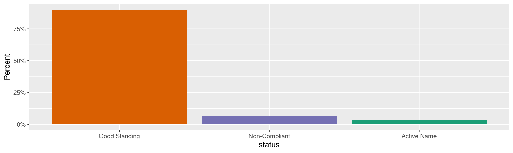
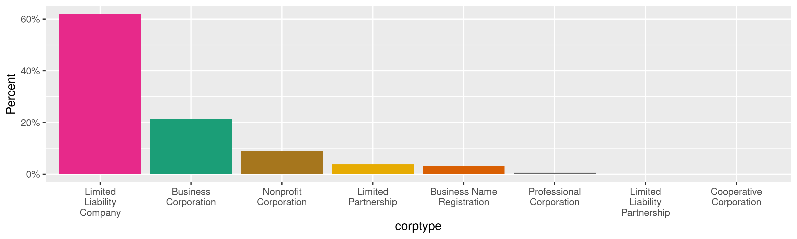
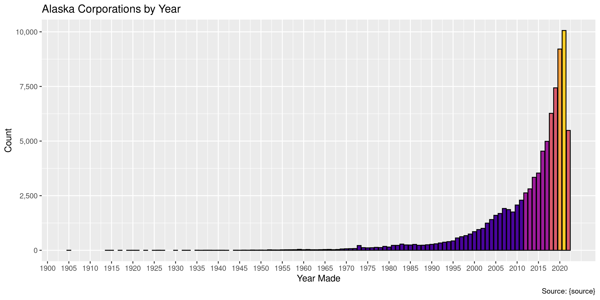
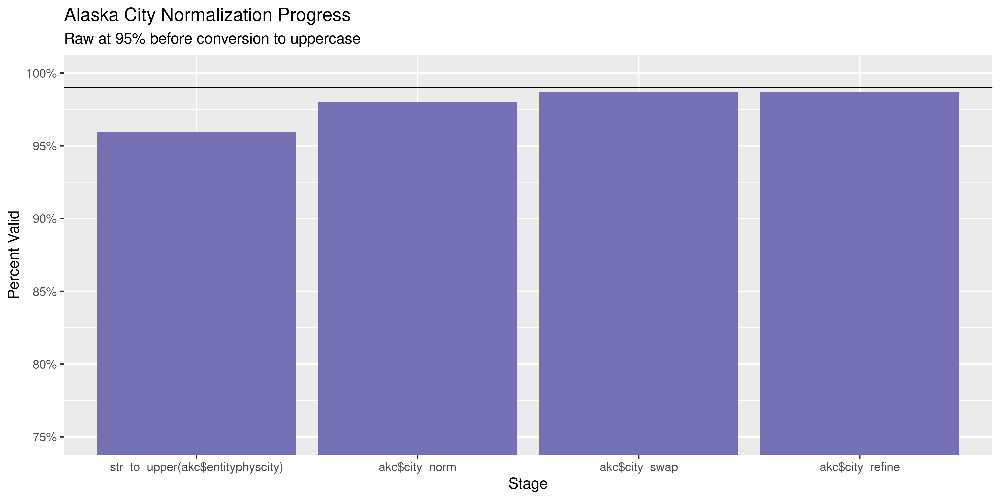
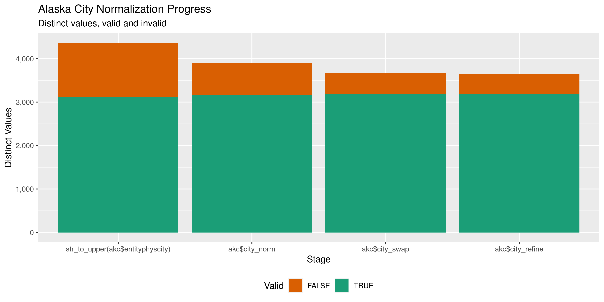

Alaska Corporations
================
Kiernan Nicholls
Fri Jun 24 14:46:35 2022

-   <a href="#project" id="toc-project">Project</a>
-   <a href="#objectives" id="toc-objectives">Objectives</a>
-   <a href="#packages" id="toc-packages">Packages</a>
-   <a href="#source" id="toc-source">Source</a>
    -   <a href="#disclaimer" id="toc-disclaimer">Disclaimer</a>
-   <a href="#download" id="toc-download">Download</a>
-   <a href="#read" id="toc-read">Read</a>
-   <a href="#explore" id="toc-explore">Explore</a>
    -   <a href="#missing" id="toc-missing">Missing</a>
    -   <a href="#duplicates" id="toc-duplicates">Duplicates</a>
    -   <a href="#categorical" id="toc-categorical">Categorical</a>
    -   <a href="#dates" id="toc-dates">Dates</a>
-   <a href="#wrangle" id="toc-wrangle">Wrangle</a>
    -   <a href="#address" id="toc-address">Address</a>
    -   <a href="#zip" id="toc-zip">ZIP</a>
    -   <a href="#state" id="toc-state">State</a>
    -   <a href="#city" id="toc-city">City</a>
-   <a href="#conclude" id="toc-conclude">Conclude</a>
-   <a href="#export" id="toc-export">Export</a>
-   <a href="#upload" id="toc-upload">Upload</a>

<!-- Place comments regarding knitting here -->

## Project

The Accountability Project is an effort to cut across data silos and
give journalists, policy professionals, activists, and the public at
large a simple way to search across huge volumes of public data about
people and organizations.

Our goal is to standardize public data on a few key fields by thinking
of each dataset row as a transaction. For each transaction there should
be (at least) 3 variables:

1.  All **parties** to a transaction.
2.  The **date** of the transaction.
3.  The **amount** of money involved.

## Objectives

This document describes the process used to complete the following
objectives:

1.  How many records are in the database?
2.  Check for entirely duplicated records.
3.  Check ranges of continuous variables.
4.  Is there anything blank or missing?
5.  Check for consistency issues.
6.  Create a five-digit ZIP Code called `zip`.
7.  Create a `year` field from the transaction date.
8.  Make sure there is data on both parties to a transaction.

## Packages

The following packages are needed to collect, manipulate, visualize,
analyze, and communicate these results. The `pacman` package will
facilitate their installation and attachment.

``` r
if (!require("pacman")) {
  install.packages("pacman")
}
pacman::p_load(
  tidyverse, # data manipulation
  lubridate, # datetime strings
  gluedown, # printing markdown
  janitor, # clean data frames
  campfin, # custom irw tools
  aws.s3, # aws cloud storage
  refinr, # cluster & merge
  scales, # format strings
  knitr, # knit documents
  rvest, # scrape html
  glue, # code strings
  here, # project paths
  httr, # http requests
  fs # local storage 
)
```

This diary was run using `campfin` version 1.0.8.9300.

``` r
packageVersion("campfin")
#> [1] '1.0.8.9300'
```

This document should be run as part of the `R_tap` project, which lives
as a sub-directory of the more general, language-agnostic
[`irworkshop/accountability_datacleaning`](https://github.com/irworkshop/accountability_datacleaning)
GitHub repository.

The `R_tap` project uses the [RStudio
projects](https://support.rstudio.com/hc/en-us/articles/200526207-Using-Projects)
feature and should be run as such. The project also uses the dynamic
`here::here()` tool for file paths relative to *your* machine.

``` r
# where does this document knit?
here::i_am("state/ak/corporations/docs/ak_corporations_diary.Rmd")
```

## Source

Alaskan business licenses are available from the Alaska Department of
Commerce, Community, and Economic Development which provides \[direct
downloads\]\[dd\] to listings of Corporations, Business & Professional
Licensing.

> The Division of Corporations, Business and Professional Licensing
> provides access to thousands of license records online as a service to
> the public. Use the links below to search specific license types,
> including corporations, business licenses, endorsements, and
> professional licenses.

### Disclaimer

> The Division has attempted to insure that the information contained in
> these electronic documents is as accurate as possible. Only authorized
> staff from the Division of Corporations, Business and Professional
> Licensing has access to modify the data provided.
>
> For individuals who have had a licensing action, a notation should be
> reflected on their website record as “This license has been the
> subject of a formal agreement, order or disciplinary action. Contact
> the Division for more information.” The Division makes no guarantee
> that such action will appear on this website and further, we make no
> warranty or guarantee of the accuracy or reliability of the content of
> this website or the content of any other website to which it may link.
>
> Assessing the accuracy and reliability of the information obtained
> from this website is solely the responsibility of the user. The
> Division shall not be responsible or liable for any errors contained
> herein or for any damages resulting from the use of the information
> contained herein.

## Download

> The Division also allows for full downloads of our corporations,
> business, and professional licensing databases in .CSV format. Select
> one of the links below to download an Excel spreadsheet of all
> licenses on record with the state. Please note that these downloads
> may require some manipulation and further investigation via NAICS
> code, Entity Type, zip code, dates, etc., in order to properly
> organize the data provided.

``` r
raw_url <- "https://www.commerce.alaska.gov/cbp/DBDownloads/CorporationsDownload.CSV"
raw_dir <- dir_create(here("state", "ak", "businesses", "data", "raw"))
raw_csv <- path(raw_dir, basename(raw_url))
```

``` r
if (!file_exists(raw_csv)) {
  download.file(raw_url, raw_csv)
}
```

## Read

``` r
akc <- read_delim(
  file = raw_csv,
  delim = ",",
  escape_backslash = FALSE,
  escape_double = FALSE,
  col_types = cols(
    .default = col_character()
  )
)
```

``` r
akc <- akc %>% 
  clean_names(case = "snake") %>% 
  mutate(across(ends_with("date"), parse_date, "%m/%d/%Y", na = "Perpetual"))
```

## Explore

There are 87,824 rows of 35 columns. Each record represents a single
corporation registered in the state of Alaska.

``` r
glimpse(akc)
#> Rows: 87,824
#> Columns: 35
#> $ corptype                    <chr> "Foreign Corporate Name Registration", "Foreign Corporate Name Registration", "Bus…
#> $ entitynumber                <chr> "8021", "31065", "85190", "96651", "114689", "132299", "72D", "521D", "618D", "971…
#> $ legalname                   <chr> "In-N-Out-Burgers", "CADILLAC FAIRVIEW", "VCA BERING SEA ANIMAL HOSPITAL", "Founda…
#> $ assumedname                 <chr> NA, NA, NA, NA, NA, NA, NA, NA, NA, NA, NA, NA, NA, NA, NA, NA, NA, NA, NA, NA, NA…
#> $ status                      <chr> "Active Name", "Active Name", "Active Name", "Active Name", "Active Name", "Active…
#> $ akformeddate                <date> 2003-11-12, 2002-12-27, 2004-03-03, 2005-10-19, 2008-03-11, 2010-12-29, 1905-12-2…
#> $ durationexpirationdate      <date> 2022-12-31, 2022-12-31, 2023-12-31, 2024-12-31, 2022-12-31, 2024-12-31, NA, NA, N…
#> $ homestate                   <chr> "CALIFORNIA", "DELAWARE", "ALASKA", "ALASKA", "ALASKA", "ALASKA", "ALASKA", "ALASK…
#> $ homecountry                 <chr> "UNITED STATES", "UNITED STATES", "UNITED STATES", "UNITED STATES", "UNITED STATES…
#> $ nextbrduedate               <date> NA, NA, NA, NA, NA, NA, 2023-01-02, 2024-01-02, 2023-01-02, NA, NA, NA, NA, NA, 2…
#> $ registeredagent             <chr> NA, NA, NA, NA, NA, NA, "E. NEIL MACKINNON", "ANDREW PEKOVICH", "CAPITOL CORPORATE…
#> $ entitymailingaddress1       <chr> "4199 CAMPUS DR 9TH FL", "20 QUEEN ST W 5TH FL", "12401 W OLYMPIC BLVD", "TAX DEPT…
#> $ entitymailingaddress2       <chr> NA, NA, NA, "PO BOX 730", NA, NA, NA, NA, "OFFICE OF CORPORATE SECRETARY", "TEN PK…
#> $ entitymailingcity           <chr> "IRVINE", "TORONTO", "LOS ANGELES", "MIDVALE", "West Covina", "WASILLA", "JUNEAU",…
#> $ entitymailingstateprovince  <chr> "CA", "ON", "CA", "UT", "CA", "AK", "AK", "AK", "BC", "IL", NA, "AK", "AK", "AK", …
#> $ entitymailingzip            <chr> "92612", "M5H3R4", "90064", "84047-0730", "91790", "99654", "99801", "99802", "V6B…
#> $ entitymailingcountry        <chr> "UNITED STATES", "CANADA", "UNITED STATES", "UNITED STATES", "UNITED STATES", "UNI…
#> $ entityphysaddress1          <chr> "4199 CAMPUS DR 9TH FL", "20 QUEEN ST W 5TH FL", "1347 E 74TH AVE", "TAX DEPT", "1…
#> $ entityphysaddress2          <chr> NA, NA, NA, "7259 S BINGHAM JCTN BLVD", NA, NA, NA, NA, "OFFICE OF CORPORATE SECRE…
#> $ entityphyscity              <chr> "IRVINE", "TORONTO", "ANCHORAGE", "MIDVALE", "WEST COVINA", "WASILLA", "JUNEAU", "…
#> $ entityphysstateprovince     <chr> "CA", "ON", "AK", "UT", "CA", "AK", "AK", "AK", "BC", "IL", "NC", "AK", "AK", "AK"…
#> $ entityphyszip               <chr> "92612", "M5H3R4", "99518", "84047", "91790", "99654", "99801", "99802", "V6B5R3",…
#> $ entityphyscountry           <chr> "UNITED STATES", "CANADA", "UNITED STATES", "UNITED STATES", "UNITED STATES", "UNI…
#> $ registeredmailaddress1      <chr> NA, NA, NA, NA, NA, NA, "1114 GLACIER AVE", "PO BOX 020642", "4318 CONIFER LANE", …
#> $ registeredmailaddress2      <chr> NA, NA, NA, NA, NA, NA, NA, NA, NA, NA, NA, NA, NA, NA, NA, NA, NA, NA, NA, NA, NA…
#> $ registeredmailcity          <chr> NA, NA, NA, NA, NA, NA, "JUNEAU", "JUNEAU", "JUNEAU", NA, NA, NA, NA, NA, "KETCHIK…
#> $ registeredmailstateprovince <chr> NA, NA, NA, NA, NA, NA, "AK", "AK", "AK", NA, NA, NA, NA, NA, "AK", "AK", "AK", "A…
#> $ registeredmailzip           <chr> NA, NA, NA, NA, NA, NA, "99801", "99802", "99801", NA, NA, NA, NA, NA, "99901", "9…
#> $ registeredmailcountry       <chr> NA, NA, NA, NA, NA, NA, "UNITED STATES", "UNITED STATES", "UNITED STATES", NA, NA,…
#> $ registeredphysaddress1      <chr> NA, NA, NA, NA, NA, NA, "1114 GLACIER AVE", "3190 INDIAN COVE DR", "4318 CONIFER L…
#> $ registeredphysaddress2      <chr> NA, NA, NA, NA, NA, NA, NA, NA, NA, NA, NA, NA, NA, NA, NA, NA, NA, NA, NA, NA, NA…
#> $ registeredphyscity          <chr> NA, NA, NA, NA, NA, NA, "JUNEAU", "JUNEAU", "JUNEAU", NA, NA, NA, NA, NA, "KETCHIK…
#> $ registeredphysstateprovince <chr> NA, NA, NA, NA, NA, NA, "AK", "AK", "AK", NA, NA, NA, NA, NA, "AK", "AK", "AK", "A…
#> $ registeredphyszip           <chr> NA, NA, NA, NA, NA, NA, "99801", "99801", "99801", NA, NA, NA, NA, NA, "99901", "9…
#> $ registeredphyscountry       <chr> NA, NA, NA, NA, NA, NA, "UNITED STATES", "UNITED STATES", "UNITED STATES", NA, NA,…
tail(akc)
#> # A tibble: 6 × 35
#>   corptype   entitynumber legalname assumedname status akformeddate durationexpirat… homestate homecountry nextbrduedate
#>   <chr>      <chr>        <chr>     <chr>       <chr>  <date>       <date>           <chr>     <chr>       <date>       
#> 1 Limited L… 10199191     Alaska F… <NA>        Good … 2022-06-22   NA               ALASKA    UNITED STA… 2024-01-02   
#> 2 Limited L… 10199256     Bookkeep… <NA>        Good … 2022-06-22   NA               ALASKA    UNITED STA… 2024-01-02   
#> 3 Limited L… 10199260     Leos Ent… <NA>        Good … 2022-06-22   NA               ALASKA    UNITED STA… 2024-01-02   
#> 4 Business … 10199317     Emerald … <NA>        Activ… 2022-06-23   2026-12-31       ALASKA    UNITED STA… NA           
#> 5 Limited L… 10199321     Stoneste… <NA>        Good … 2022-06-23   NA               ALASKA    UNITED STA… 2024-01-02   
#> 6 Limited L… 10199335     Prodebtc… <NA>        Good … 2022-06-23   NA               MARYLAND  UNITED STA… 2024-01-02   
#> # … with 25 more variables: registeredagent <chr>, entitymailingaddress1 <chr>, entitymailingaddress2 <chr>,
#> #   entitymailingcity <chr>, entitymailingstateprovince <chr>, entitymailingzip <chr>, entitymailingcountry <chr>,
#> #   entityphysaddress1 <chr>, entityphysaddress2 <chr>, entityphyscity <chr>, entityphysstateprovince <chr>,
#> #   entityphyszip <chr>, entityphyscountry <chr>, registeredmailaddress1 <chr>, registeredmailaddress2 <chr>,
#> #   registeredmailcity <chr>, registeredmailstateprovince <chr>, registeredmailzip <chr>, registeredmailcountry <chr>,
#> #   registeredphysaddress1 <chr>, registeredphysaddress2 <chr>, registeredphyscity <chr>,
#> #   registeredphysstateprovince <chr>, registeredphyszip <chr>, registeredphyscountry <chr>
```

### Missing

Columns vary in their degree of missing values.

``` r
col_stats(akc, count_na)
#> # A tibble: 35 × 4
#>    col                         class      n       p
#>    <chr>                       <chr>  <int>   <dbl>
#>  1 corptype                    <chr>      0 0      
#>  2 entitynumber                <chr>      0 0      
#>  3 legalname                   <chr>      0 0      
#>  4 assumedname                 <chr>  87317 0.994  
#>  5 status                      <chr>      0 0      
#>  6 akformeddate                <date>     0 0      
#>  7 durationexpirationdate      <date> 81039 0.923  
#>  8 homestate                   <chr>     99 0.00113
#>  9 homecountry                 <chr>      0 0      
#> 10 nextbrduedate               <date>  6143 0.0699 
#> 11 registeredagent             <chr>   2832 0.0322 
#> 12 entitymailingaddress1       <chr>    930 0.0106 
#> 13 entitymailingaddress2       <chr>  77607 0.884  
#> 14 entitymailingcity           <chr>    930 0.0106 
#> 15 entitymailingstateprovince  <chr>   1081 0.0123 
#> 16 entitymailingzip            <chr>   1081 0.0123 
#> 17 entitymailingcountry        <chr>    929 0.0106 
#> 18 entityphysaddress1          <chr>    887 0.0101 
#> 19 entityphysaddress2          <chr>  74323 0.846  
#> 20 entityphyscity              <chr>    886 0.0101 
#> 21 entityphysstateprovince     <chr>   1029 0.0117 
#> 22 entityphyszip               <chr>   1029 0.0117 
#> 23 entityphyscountry           <chr>    886 0.0101 
#> 24 registeredmailaddress1      <chr>   3846 0.0438 
#> 25 registeredmailaddress2      <chr>  82124 0.935  
#> 26 registeredmailcity          <chr>   3846 0.0438 
#> 27 registeredmailstateprovince <chr>   3846 0.0438 
#> 28 registeredmailzip           <chr>   3846 0.0438 
#> 29 registeredmailcountry       <chr>   3846 0.0438 
#> 30 registeredphysaddress1      <chr>   3681 0.0419 
#> 31 registeredphysaddress2      <chr>  81722 0.931  
#> 32 registeredphyscity          <chr>   3681 0.0419 
#> 33 registeredphysstateprovince <chr>   3681 0.0419 
#> 34 registeredphyszip           <chr>   3681 0.0419 
#> 35 registeredphyscountry       <chr>   3681 0.0419
```

We can flag any record missing a key variable needed to identify a
transaction.

There are *four* separate types of addresses that might be listed, each
with a different degree of missing value: 1. `entityphysaddress` 2.
`entitymailingaddress` 3. `registeredphysaddress` 4.
`registeredmailaddress`

We are going to create one column containing *any* address that can be
used to find rows without an address in any of the four columns.

``` r
akc <- akc %>% 
  mutate(
    any_addr1 = coalesce(
      entityphysaddress1,
      registeredphysaddress1,
      entitymailingaddress1,
      registeredmailaddress1
    ),
    any_addr2 = coalesce(
      entityphysaddress2,
      registeredphysaddress2,
      entitymailingaddress2,
      registeredmailaddress2
    )
  )
```

``` r
key_vars <- c("legalname", "akformeddate", "any_addr1")
akc <- flag_na(akc, all_of(key_vars))
sum(akc$na_flag)
#> [1] 358
```

``` r
akc %>% 
  filter(na_flag) %>% 
  select(all_of(key_vars))
#> # A tibble: 358 × 3
#>    legalname                                           akformeddate any_addr1
#>    <chr>                                               <date>       <chr>    
#>  1 ALASKA RAILROAD CORPORATION                         1997-01-01   <NA>     
#>  2 MADE IN ALASKA                                      1987-07-30   <NA>     
#>  3 CAMPBELL GLEN OWNERS ASSOCIATION, INC.              1974-05-03   <NA>     
#>  4 Alaska Urological Institute, P.C.                   1976-03-03   <NA>     
#>  5 KALEN & ASSOCIATES, INC.                            1970-06-26   <NA>     
#>  6 UNIVERSITY PLACE CONDOMINIUM ASSOCIATION            1982-04-05   <NA>     
#>  7 GEOCHEM, INC.                                       1982-02-01   <NA>     
#>  8 INVESTMENT GROUP, INCORPORATED                      1978-05-08   <NA>     
#>  9 ALASKA INDEPENDENT INSURANCE AGENTS & BROKERS, INC. 1960-01-05   <NA>     
#> 10 TARAL VALLEY ELECTRIC COOPERATIVE, INC.             1981-10-08   <NA>     
#> # … with 348 more rows
```

### Duplicates

There are no duplicate records in the data, even when ignoring
`entitynumber`.

### Categorical

``` r
col_stats(akc, n_distinct)
#> # A tibble: 38 × 4
#>    col                         class      n         p
#>    <chr>                       <chr>  <int>     <dbl>
#>  1 corptype                    <chr>     12 0.000137 
#>  2 entitynumber                <chr>  87824 1        
#>  3 legalname                   <chr>  87815 1.00     
#>  4 assumedname                 <chr>    508 0.00578  
#>  5 status                      <chr>      3 0.0000342
#>  6 akformeddate                <date> 11705 0.133    
#>  7 durationexpirationdate      <date>  1338 0.0152   
#>  8 homestate                   <chr>     64 0.000729 
#>  9 homecountry                 <chr>     39 0.000444 
#> 10 nextbrduedate               <date>     9 0.000102 
#> 11 registeredagent             <chr>  38620 0.440    
#> 12 entitymailingaddress1       <chr>  56799 0.647    
#> 13 entitymailingaddress2       <chr>   3972 0.0452   
#> 14 entitymailingcity           <chr>   4290 0.0488   
#> 15 entitymailingstateprovince  <chr>     70 0.000797 
#> 16 entitymailingzip            <chr>  14609 0.166    
#> 17 entitymailingcountry        <chr>     43 0.000490 
#> 18 entityphysaddress1          <chr>  61226 0.697    
#> 19 entityphysaddress2          <chr>   5667 0.0645   
#> 20 entityphyscity              <chr>   4375 0.0498   
#> 21 entityphysstateprovince     <chr>     72 0.000820 
#> 22 entityphyszip               <chr>  12138 0.138    
#> 23 entityphyscountry           <chr>     38 0.000433 
#> 24 registeredmailaddress1      <chr>  35247 0.401    
#> 25 registeredmailaddress2      <chr>   1336 0.0152   
#> 26 registeredmailcity          <chr>    640 0.00729  
#> 27 registeredmailstateprovince <chr>      7 0.0000797
#> 28 registeredmailzip           <chr>   4982 0.0567   
#> 29 registeredmailcountry       <chr>      2 0.0000228
#> 30 registeredphysaddress1      <chr>  38670 0.440    
#> 31 registeredphysaddress2      <chr>   1384 0.0158   
#> 32 registeredphyscity          <chr>    770 0.00877  
#> 33 registeredphysstateprovince <chr>      7 0.0000797
#> 34 registeredphyszip           <chr>   4240 0.0483   
#> 35 registeredphyscountry       <chr>      2 0.0000228
#> 36 any_addr1                   <chr>  61547 0.701    
#> 37 any_addr2                   <chr>   6825 0.0777   
#> 38 na_flag                     <lgl>      2 0.0000228
```

<!-- --><!-- -->

### Dates

We can add the calendar year from `date` with `lubridate::year()`

``` r
akc <- mutate(akc, akformedyear = year(akformeddate))
```

``` r
min(akc$akformeddate)
#> [1] "1905-03-15"
sum(akc$akformedyear < 2000)
#> [1] 8884
max(akc$akformeddate)
#> [1] "2022-06-23"
sum(akc$akformeddate > today())
#> [1] 0
```

<!-- -->

## Wrangle

To improve the searchability of the database, we will perform some
consistent, confident string normalization. For geographic variables
like city names and ZIP codes, the corresponding `campfin::normal_*()`
functions are tailor made to facilitate this process.

### Address

For the street `addresss` variable, the `campfin::normal_address()`
function will force consistence case, remove punctuation, and abbreviate
official USPS suffixes.

``` r
addr_norm <- akc %>% 
  distinct(any_addr1, any_addr2) %>% 
  mutate(
    norm_addr1 = normal_address(
      address = any_addr1,
      abbs = usps_street,
      na_rep = TRUE
    ),
    norm_addr2 = normal_address(
      address = any_addr2,
      abbs = usps_street,
      na_rep = TRUE,
      abb_end = FALSE
    )
  ) %>% 
  unite(
    col = address_norm,
    starts_with("norm_addr"),
    sep = " ",
    remove = TRUE,
    na.rm = TRUE
  ) %>% 
  mutate(across(address_norm, na_if, ""))
```

``` r
addr_norm
#> # A tibble: 64,490 × 3
#>    any_addr1                  any_addr2                     address_norm                                      
#>    <chr>                      <chr>                         <chr>                                             
#>  1 4199 CAMPUS DR 9TH FL      <NA>                          4199 CAMPUS DR 9TH FL                             
#>  2 20 QUEEN ST W 5TH FL       <NA>                          20 QUEEN ST W 5TH FL                              
#>  3 1347 E 74TH AVE            <NA>                          1347 E 74TH AVE                                   
#>  4 TAX DEPT                   7259 S BINGHAM JCTN BLVD      TAX DEPT 7259 S BINGHAM JCT BLVD                  
#>  5 1521 W. CAMERON AVENUE     <NA>                          1521 W CAMERON AVE                                
#>  6 5099 E BLUE LUPINE DR #201 <NA>                          5099 E BLUE LUPINE DR #201                        
#>  7 1114 GLACIER AVE           <NA>                          1114 GLACIER AVE                                  
#>  8 3190 INDIAN COVE DRIVE     <NA>                          3190 INDIAN COVE DR                               
#>  9 333 DUNSMUIR ST 17TH FL    OFFICE OF CORPORATE SECRETARY 333 DUNSMUIR ST 17TH FL OFC OF CORPORATE SECRETARY
#> 10 222 S RIVERSIDE PLAZA      TEN PKWY N                    222 S RIVERSIDE PLZ TEN PKWY N                    
#> # … with 64,480 more rows
```

``` r
akc <- akc %>% 
  left_join(addr_norm, by = c("any_addr1", "any_addr2")) %>% 
  select(-any_addr1, -any_addr2)
```

### ZIP

For ZIP codes, the `campfin::normal_zip()` function will attempt to
create valid *five* digit codes by removing the ZIP+4 suffix and
returning leading zeroes dropped by other programs like Microsoft Excel.

Like addresses, many records that don’t contain a mailing ZIP will have
a physical ZIP (or vice versa). We are going to normalize *one* ZIP code
that will be used in searches, \***prioritizing physical addresses
first.**

``` r
akc <- akc %>% 
  mutate(
    zip_norm = normal_zip(
      zip = coalesce(
        entityphyszip,
        registeredphyszip,
        entitymailingzip,
        registeredmailzip
      ),
      na_rep = TRUE
    )
  )
```

``` r
akc %>% 
  select(contains("zip")) %>% 
  distinct() %>% 
  filter(is.na(entityphyszip))
#> # A tibble: 266 × 5
#>    entitymailingzip entityphyszip registeredmailzip registeredphyszip zip_norm
#>    <chr>            <chr>         <chr>             <chr>             <chr>   
#>  1 <NA>             <NA>          <NA>              <NA>              <NA>    
#>  2 <NA>             <NA>          99524             99515             99515   
#>  3 <NA>             <NA>          99509             99518             99518   
#>  4 99519            <NA>          99519             99501             99501   
#>  5 44286            <NA>          <NA>              <NA>              44286   
#>  6 85001            <NA>          99801             99801             99801   
#>  7 99588            <NA>          99503             99503             99503   
#>  8 99610            <NA>          99801             99801             99801   
#>  9 99635            <NA>          99635             99611             99611   
#> 10 <NA>             <NA>          99707             99701             99701   
#> # … with 256 more rows
```

``` r
progress_table(
  akc$zip_norm,
  compare = valid_zip
)
#> # A tibble: 1 × 6
#>   stage        prop_in n_distinct prop_na n_out n_diff
#>   <chr>          <dbl>      <dbl>   <dbl> <dbl>  <dbl>
#> 1 akc$zip_norm   0.996       6183 0.00414   339    228
```

### State

Something similar must be done for state abbreviations.

``` r
akc <- akc %>% 
  mutate(
    state_norm = normal_state(
      state = coalesce(
        entityphysstateprovince,
        registeredphysstateprovince,
        entitymailingstateprovince,
        registeredmailstateprovince
      ),
      abbreviate = TRUE,
      na_rep = TRUE
    )
  )
```

``` r
progress_table(
  akc$state_norm,
  compare = valid_state
)
#> # A tibble: 1 × 6
#>   stage          prop_in n_distinct prop_na n_out n_diff
#>   <chr>            <dbl>      <dbl>   <dbl> <dbl>  <dbl>
#> 1 akc$state_norm   0.997         72 0.00411   265     12
```

### City

Cities are the most difficult geographic variable to normalize, simply
due to the wide variety of valid cities and formats.

#### Normal

The `campfin::normal_city()` function is a good start, again converting
case, removing punctuation, but *expanding* USPS abbreviations. We can
also remove `invalid_city` values.

``` r
norm_city <- akc %>% 
  distinct(entityphyscity, registeredphyscity,
           entitymailingcity, registeredmailcity,
           state_norm, zip_norm) %>% 
  mutate(
    city_norm = normal_city(
      city = coalesce(
        entityphyscity,
        registeredphyscity,
        entitymailingcity,
        registeredmailcity
      ), 
      abbs = usps_city,
      states = c("AK", "DC", "ALASKA"),
      na = invalid_city,
      na_rep = TRUE
    )
  )
```

#### Swap

We can further improve normalization by comparing our normalized value
against the *expected* value for that record’s state abbreviation and
ZIP code. If the normalized value is either an abbreviation for or very
similar to the expected value, we can confidently swap those two.

``` r
norm_city <- norm_city %>% 
  left_join(
    y = zipcodes,
    by = c(
      "state_norm" = "state",
      "zip_norm" = "zip"
    )
  ) %>% 
  rename(city_match = city) %>% 
  mutate(
    match_abb = is_abbrev(city_norm, city_match),
    match_dist = str_dist(city_norm, city_match),
    city_swap = if_else(
      condition = !is.na(match_dist) & (match_abb | match_dist == 1),
      true = city_match,
      false = city_norm
    )
  ) %>% 
  select(
    -city_match,
    -match_dist,
    -match_abb
  )
```

``` r
akc <- left_join(
  x = akc,
  y = norm_city
)
```

#### Refine

The [OpenRefine](https://openrefine.org/) algorithms can be used to
group similar strings and replace the less common versions with their
most common counterpart. This can greatly reduce inconsistency, but with
low confidence; we will only keep any refined strings that have a valid
city/state/zip combination.

``` r
good_refine <- akc %>% 
  mutate(
    city_refine = city_swap %>% 
      key_collision_merge() %>% 
      n_gram_merge(numgram = 1)
  ) %>% 
  filter(city_refine != city_swap) %>% 
  inner_join(
    y = zipcodes,
    by = c(
      "city_refine" = "city",
      "state_norm" = "state",
      "zip_norm" = "zip"
    )
  )
```

    #> # A tibble: 22 × 5
    #>    state_norm zip_norm city_swap              city_refine     n
    #>    <chr>      <chr>    <chr>                  <chr>       <int>
    #>  1 AK         99501    ANCHORAGE A            ANCHORAGE       2
    #>  2 AK         99504    ANCHORAGEANCHORAGE     ANCHORAGE       2
    #>  3 AK         99611    AK KENAI               KENAI           2
    #>  4 AK         99801    JUNEAUJUNEAU           JUNEAU          2
    #>  5 CO         80401    GOLDEN CO              GOLDEN          2
    #>  6 AK         99501    ANCHORAGE ANC          ANCHORAGE       1
    #>  7 AK         99507    ANCHORAGE ANCHORAGE    ANCHORAGE       1
    #>  8 AK         99514    ANCHORAGE ANCHORAGE    ANCHORAGE       1
    #>  9 AK         99515    ANCHORAGE ANC          ANCHORAGE       1
    #> 10 AK         99577    EAGLE RIVEREAGLE RIVER EAGLE RIVER     1
    #> # … with 12 more rows

Then we can join the refined values back to the database.

``` r
akc <- akc %>% 
  left_join(good_refine, by = names(.)) %>% 
  mutate(city_refine = coalesce(city_refine, city_swap))
```

#### Progress

Our goal for normalization was to increase the proportion of city values
known to be valid and reduce the total distinct values by correcting
misspellings.

| stage                              | prop_in | n_distinct | prop_na | n_out | n_diff |
|:-----------------------------------|--------:|-----------:|--------:|------:|-------:|
| `str_to_upper(akc$entityphyscity)` |   0.959 |       4368 |   0.010 |  3547 |   1255 |
| `akc$city_norm`                    |   0.980 |       3898 |   0.004 |  1757 |    733 |
| `akc$city_swap`                    |   0.987 |       3671 |   0.004 |  1159 |    491 |
| `akc$city_refine`                  |   0.987 |       3652 |   0.004 |  1132 |    472 |

You can see how the percentage of valid values increased with each
stage.

<!-- -->

More importantly, the number of distinct values decreased each stage. We
were able to confidently change many distinct invalid values to their
valid equivalent.

<!-- -->

Before exporting, we can remove the intermediary normalization columns
and rename all added variables with the `_clean` suffix.

``` r
akc <- akc %>% 
  select(
    -city_norm,
    -city_swap,
    city_clean = city_refine
  ) %>% 
  rename_all(~str_replace(., "_norm", "_clean")) %>% 
  rename_all(~str_remove(., "_raw")) %>% 
  relocate(address_clean, city_clean, state_clean, .before = zip_clean)
```

## Conclude

``` r
glimpse(sample_n(akc, 1000))
#> Rows: 1,000
#> Columns: 41
#> $ corptype                    <chr> "Nonprofit Corporation", "Limited Liability Company", "Limited Liability Company",…
#> $ entitynumber                <chr> "106016", "10074529", "10106668", "10153471", "10017023", "10038478", "10199262", …
#> $ legalname                   <chr> "AMAZON OUTREACH, Inc.", "CREATIVE JUICES LIMITED LIABILITY COMPANY", "Stormguard,…
#> $ assumedname                 <chr> NA, NA, NA, NA, NA, NA, NA, NA, NA, NA, NA, NA, NA, NA, NA, NA, NA, NA, NA, NA, NA…
#> $ status                      <chr> "Good Standing", "Good Standing", "Good Standing", "Good Standing", "Good Standing…
#> $ akformeddate                <date> 2007-01-22, 2017-12-26, 2019-05-24, 2021-01-25, 2013-12-05, 2016-05-13, 2022-06-2…
#> $ durationexpirationdate      <date> NA, NA, NA, NA, NA, NA, NA, NA, NA, NA, NA, 2024-01-04, NA, NA, NA, NA, NA, NA, 2…
#> $ homestate                   <chr> "ALASKA", "ALASKA", "ALASKA", "ALASKA", "ALASKA", "DELAWARE", "ALASKA", "ALASKA", …
#> $ homecountry                 <chr> "UNITED STATES", "UNITED STATES", "UNITED STATES", "UNITED STATES", "UNITED STATES…
#> $ nextbrduedate               <date> 2023-07-02, 2023-01-02, 2023-01-02, 2023-01-02, 2023-01-02, 2024-01-02, 2024-07-0…
#> $ registeredagent             <chr> "William  Pepper", "John Brown", "David Combs", "Matthew McLaren", "DOUGLAS MANAGE…
#> $ entitymailingaddress1       <chr> "2210 W MAIN STREET # 107-331", "435 JUNEAU AVE.", "6348 QUINHAGAK ST. ", "11030 N…
#> $ entitymailingaddress2       <chr> NA, NA, NA, NA, "SUITE 800", NA, NA, NA, NA, NA, "WASILLA ALASKA 99623", NA, NA, N…
#> $ entitymailingcity           <chr> "BATTLE GROUND", "FAIRBANKS", "ANCHORAGE", "KETCHIKAN", "SEATTLE", "DALLAS", "FAIR…
#> $ entitymailingstateprovince  <chr> "WA", "AK", "AK", "AK", "WA", "TX", "AK", "AK", "AK", "AK", "AK", "AK", "AK", "AK"…
#> $ entitymailingzip            <chr> "98604", "99701", "99507", "99901", "98188", "75201", "99712", "99507", "99516", "…
#> $ entitymailingcountry        <chr> "UNITED STATES", "UNITED STATES", "UNITED STATES", "UNITED STATES", "UNITED STATES…
#> $ entityphysaddress1          <chr> "900 W ADSON", "435 JUNEAU AVE.", "6348 QUINHAGAK ST. ", "11030 N. TONGASS HWY.", …
#> $ entityphysaddress2          <chr> NA, NA, NA, NA, "SUITE 800", NA, NA, NA, NA, NA, "WASILLA ALASKA 99623", NA, NA, N…
#> $ entityphyscity              <chr> "WASILLA", "FAIRBANKS", "ANCHORAGE", "KETCHIKAN", "SEATTLE", "DALLAS", "FAIRBANKS"…
#> $ entityphysstateprovince     <chr> "AK", "AK", "AK", "AK", "WA", "TX", "AK", "AK", "AK", "AK", "AK", "AK", "AK", "AK"…
#> $ entityphyszip               <chr> "99654", "99701", "99507", "99901", "98188", "75201", "99712", "99507", "99516", "…
#> $ entityphyscountry           <chr> "UNITED STATES", "UNITED STATES", "UNITED STATES", "UNITED STATES", "UNITED STATES…
#> $ registeredmailaddress1      <chr> "PO Box 873060", "435 JUNEAU AVE.", "6348 QUINHAGAK ST. ", "11030 N. TONGASS HWY."…
#> $ registeredmailaddress2      <chr> NA, NA, NA, NA, NA, "SUITE 202", NA, NA, NA, NA, "WASILLA ALASKA 99623", NA, NA, N…
#> $ registeredmailcity          <chr> "Wasilla", "FAIRBANKS", "ANCHORAGE", "KETCHIKAN", "ANCHORAGE", "JUNEAU", "FAIRBANK…
#> $ registeredmailstateprovince <chr> "AK", "AK", "AK", "AK", "AK", "AK", "AK", "AK", "AK", "AK", "AK", "AK", "AK", "AK"…
#> $ registeredmailzip           <chr> "99687", "99701", "99507", "99901", "99502", "99801", "99712", "99507", "99503", "…
#> $ registeredmailcountry       <chr> "UNITED STATES", "UNITED STATES", "UNITED STATES", "UNITED STATES", "UNITED STATES…
#> $ registeredphysaddress1      <chr> "900 W Adson", "435 JUNEAU AVE.", "6348 QUINHAGAK ST. ", "11030 N. TONGASS HWY.", …
#> $ registeredphysaddress2      <chr> NA, NA, NA, NA, NA, "SUITE 202", NA, NA, NA, NA, "WASILLA ALASKA 99623", NA, NA, N…
#> $ registeredphyscity          <chr> "Wasilla", "FAIRBANKS", "ANCHORAGE", "KETCHIKAN", "ANCHORAGE", "JUNEAU", "FAIRBANK…
#> $ registeredphysstateprovince <chr> "AK", "AK", "AK", "AK", "AK", "AK", "AK", "AK", "AK", "AK", "AK", "AK", "AK", "AK"…
#> $ registeredphyszip           <chr> "99654", "99701", "99507", "99901", "99502", "99801", "99712", "99507", "99503", "…
#> $ registeredphyscountry       <chr> "UNITED STATES", "UNITED STATES", "UNITED STATES", "UNITED STATES", "UNITED STATES…
#> $ na_flag                     <lgl> FALSE, FALSE, FALSE, FALSE, FALSE, FALSE, FALSE, FALSE, FALSE, FALSE, FALSE, FALSE…
#> $ akformedyear                <dbl> 2007, 2017, 2019, 2021, 2013, 2016, 2022, 2021, 2016, 2004, 2021, 2019, 2020, 1977…
#> $ address_clean               <chr> "900 W ADSON", "435 JUNEAU AVE", "6348 QUINHAGAK ST", "11030 N TONGASS HWY", "1800…
#> $ city_clean                  <chr> "WASILLA", "FAIRBANKS", "ANCHORAGE", "KETCHIKAN", "SEATTLE", "DALLAS", "FAIRBANKS"…
#> $ state_clean                 <chr> "AK", "AK", "AK", "AK", "WA", "TX", "AK", "AK", "AK", "AK", "AK", "AK", "AK", "AK"…
#> $ zip_clean                   <chr> "99654", "99701", "99507", "99901", "98188", "75201", "99712", "99507", "99516", "…
```

1.  There are 87,824 records in the database.
2.  There are 0 duplicate records in the database.
3.  The range and distribution of `amount` and `date` seem reasonable.
4.  There are 358 records missing key variables.
5.  Consistency in geographic data has been improved with
    `campfin::normal_*()`.
6.  The 4-digit `year` variable has been created with
    `lubridate::year()`.

## Export

Now the file can be saved on disk for upload to the Accountability
server. We will name the object using a date range of the records
included.

``` r
clean_dir <- dir_create(here("state", "ak", "corporations", "data", "clean"))
csv_ts <- str_remove_all(Sys.Date(), "-")
clean_csv <- path(clean_dir, glue("ak_corporations_{csv_ts}.csv"))
clean_rds <- path_ext_set(clean_csv, "rds")
basename(clean_csv)
#> [1] "ak_corporations_20220624.csv"
```

``` r
write_csv(akc, clean_csv, na = "")
write_rds(akc, clean_rds, compress = "xz")
(clean_size <- file_size(clean_csv))
#> 33.7M
```

## Upload

We can use the `aws.s3::put_object()` to upload the text file to the IRW
server.

``` r
aws_key <- path("csv", basename(clean_csv))
if (!object_exists(aws_key, "publicaccountability")) {
  put_object(
    file = clean_csv,
    object = aws_key, 
    bucket = "publicaccountability",
    acl = "public-read",
    show_progress = TRUE,
    multipart = TRUE
  )
}
aws_head <- head_object(aws_key, "publicaccountability")
(aws_size <- as_fs_bytes(attr(aws_head, "content-length")))
unname(aws_size == clean_size)
```
