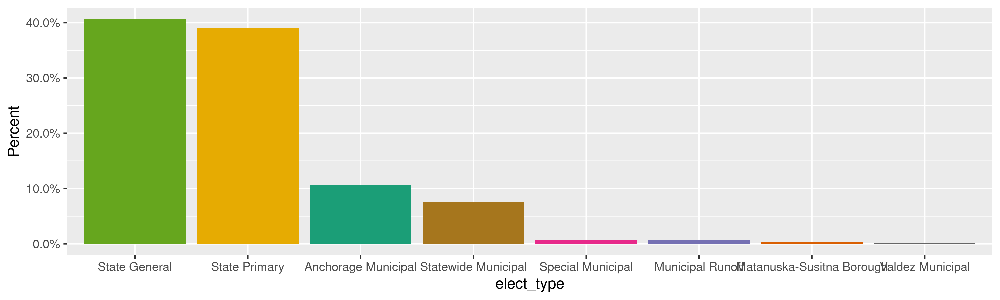
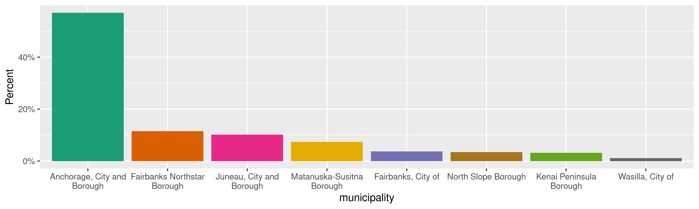

Alaska Expenditures
================
Kiernan Nicholls
Mon Jan 25 13:38:50 2021

-   [Project](#project)
-   [Objectives](#objectives)
-   [Packages](#packages)
-   [Data](#data)
-   [Download](#download)
-   [Read](#read)
-   [Explore](#explore)
    -   [Missing](#missing)
    -   [Duplicates](#duplicates)
    -   [Categorical](#categorical)
    -   [Amounts](#amounts)
    -   [Dates](#dates)
-   [Wrangle](#wrangle)
    -   [Address](#address)
    -   [ZIP](#zip)
    -   [State](#state)
    -   [City](#city)
-   [Conclude](#conclude)
-   [Export](#export)
-   [Upload](#upload)

<!-- Place comments regarding knitting here -->

## Project

The Accountability Project is an effort to cut across data silos and
give journalists, policy professionals, activists, and the public at
large a simple way to search across huge volumes of public data about
people and organizations.

Our goal is to standardizing public data on a few key fields by thinking
of each dataset row as a transaction. For each transaction there should
be (at least) 3 variables:

1.  All **parties** to a transaction.
2.  The **date** of the transaction.
3.  The **amount** of money involved.

## Objectives

This document describes the process used to complete the following
objectives:

1.  How many records are in the database?
2.  Check for entirely duplicated records.
3.  Check ranges of continuous variables.
4.  Is there anything blank or missing?
5.  Check for consistency issues.
6.  Create a five-digit ZIP Code called `zip`.
7.  Create a `year` field from the transaction date.
8.  Make sure there is data on both parties to a transaction.

## Packages

The following packages are needed to collect, manipulate, visualize,
analyze, and communicate these results. The `pacman` package will
facilitate their installation and attachment.

``` r
if (!require("pacman")) {
  install.packages("pacman")
}
pacman::p_load(
  tidyverse, # data manipulation
  lubridate, # datetime strings
  gluedown, # printing markdown
  janitor, # clean data frames
  campfin, # custom irw tools
  aws.s3, # aws cloud storage
  refinr, # cluster & merge
  scales, # format strings
  knitr, # knit documents
  vroom, # fast reading
  rvest, # scrape html
  glue, # code strings
  here, # project paths
  httr, # http requests
  fs # local storage 
)
```

This document should be run as part of the `R_campfin` project, which
lives as a sub-directory of the more general, language-agnostic
[`irworkshop/accountability_datacleaning`](https://github.com/irworkshop/accountability_datacleaning)
GitHub repository.

The `R_campfin` project uses the [RStudio
projects](https://support.rstudio.com/hc/en-us/articles/200526207-Using-Projects)
feature and should be run as such. The project also uses the dynamic
`here::here()` tool for file paths relative to *your* machine.

``` r
# where does this document knit?
here::i_am("ak/expends/docs/ak_expends_diary.Rmd")
```

## Data

Data is obtained from the [Alaska Public Offices Commission
(APOC)](https://aws.state.ak.us/ApocReports/Campaign/#).

## Download

Using the [APOC expenditure
search](https://aws.state.ak.us/ApocReports/CampaignDisclosure/CDExpenditures.aspx),
we need to search for “All Completed Forms”, “Any Names”, and “Any”
type. Exporting “Any” report year only returns roughly 243,669 results.

``` r
raw_dir <- dir_create(here("ak", "expends", "data", "raw"))
raw_csv <- path(raw_dir, glue("CD_Transactions_{format(now(), '%m-%d-%Y')}.CSV"))
```

## Read

The exported delimited text files have two aspects we need to adjust
for; 1) There is a column called `--------` that is empty in every file,
and 2) there is an extra comma at the end of each line. We can read this
extra column at the end as a new `null` column.

``` r
ake_names <- raw_csv %>%
  read_names(delim = ",") %>%
  str_replace("--------", "null1") %>%
  make_clean_names(case = "snake")
```

All the files can be read into a single data frame using
`vroom::vroom()`.

``` r
# should be 243,669 items
ake <- read_delim(
  file = raw_csv,
  skip = 1,
  delim = ",",
  escape_double = TRUE,
  na = c("", "NA", "N/A", "n/a", "N/a"),
  # add column name to end
  col_names = c(ake_names, "null2"),
  col_types = cols(
    .default = col_character(),
    date = col_date_mdy(),
    amount = col_number(),
    report_year = col_integer(),
    submitted = col_date_mdy(),
    # ignore bad cols
    null1 = col_skip(),
    null2 = col_skip()
  )
)
```

We successfully read the same number of rows as search results.

``` r
nrow(ake) == 243669
#> [1] TRUE
```

For exploration, we can split the election name column into its parts.

``` r
elect_names <- ake %>%
  distinct(elect_name) %>%
  mutate(across(elect_name, na_if, "-")) %>%
  separate(
    col = elect_name,
    into = c("elect_year", "elect_where"),
    remove = FALSE,
    sep = "\\s-\\s",
    convert = TRUE,
    extra = "merge"
  ) %>%
  mutate(across(elect_where, str_squish))
```

``` r
ake <- ake %>%
  left_join(elect_names, by = "elect_name") %>%
  select(-elect_name) %>%
  rename(elect_name = elect_where) %>%
  relocate(elect_year, elect_name, .before = elect_type)
```

## Explore

There are 243,669 rows of 25 columns. Each record represents a single
expenditure from a committee to a vendor.

``` r
glimpse(ake)
#> Rows: 243,669
#> Columns: 25
#> $ txn          <chr> "1", "2", "3", "4", "5", "6", "7", "8", "9", "10", "11", "12", "13", "14", "15", "16", "17", "18…
#> $ date         <date> 2020-02-01, 2019-10-06, 2019-10-07, 2019-10-10, 2019-10-14, 2019-10-16, 2019-10-18, 2019-10-21,…
#> $ pay_type     <chr> "Bank Fee", "Check", "Debit Card", "Debit Card", "Check", "Debit Card", "Debit Card", "Debit Car…
#> $ pay_info     <chr> NA, "1002", NA, NA, "1000", NA, NA, NA, NA, NA, NA, NA, "1001", NA, NA, NA, NA, NA, NA, NA, NA, …
#> $ amount       <dbl> 1226.80, 3600.00, 37.86, 125.00, 2000.00, 825.00, 36.94, 2131.53, 700.00, 315.31, 6.00, 36.85, 1…
#> $ last         <chr> "Anedot", "Josh Corbett Photography", "Campaign Monitor", "Standing Together Against Rape (STAR)…
#> $ first        <chr> NA, NA, NA, NA, NA, NA, NA, NA, NA, NA, NA, NA, "Kate", NA, NA, NA, NA, NA, NA, NA, NA, NA, NA, …
#> $ address      <chr> "4017 Buena Vista St #109", "2448 Sprucewood St", "Level 38, 201 Elizabeth Street", "1057 W Fire…
#> $ city         <chr> "Dallas", "Anchorage", "Sydney", "Anchorage", "Anchorage", "Anchorage", "Sydney", "Anchorage", "…
#> $ state        <chr> "Texas", "Alaska", "NSW", "Alaska", "Alaska", "Alaska", "NSW", "Alaska", "California", "Californ…
#> $ zip          <chr> "75204", "99508", "2000", "99503", "99503", "99501", "2000", "99501", "?94205", "?94205", "94043…
#> $ country      <chr> "USA", "USA", "AUS", "USA", "USA", "USA", "AUS", "USA", "USA", "USA", "USA", "AUS", "USA", "USA"…
#> $ occupation   <chr> NA, NA, NA, NA, NA, NA, NA, NA, NA, NA, NA, NA, NA, NA, NA, NA, NA, NA, NA, NA, NA, NA, NA, NA, …
#> $ employer     <chr> NA, NA, NA, NA, NA, NA, NA, NA, NA, NA, NA, NA, NA, NA, NA, NA, NA, NA, NA, NA, NA, NA, NA, NA, …
#> $ purpose      <chr> "Credit card processing fees this cycle", "Campaign launch video (production, edit and delivery)…
#> $ rpt_type     <chr> "Previous Year Start Report", "Previous Year Start Report", "Previous Year Start Report", "Previ…
#> $ elect_year   <int> 2021, 2021, 2021, 2021, 2021, 2021, 2021, 2021, 2021, 2021, 2021, 2021, 2021, 2021, 2021, 2021, …
#> $ elect_name   <chr> "Anchorage Municipal Election", "Anchorage Municipal Election", "Anchorage Municipal Election", …
#> $ elect_type   <chr> "Anchorage Municipal", "Anchorage Municipal", "Anchorage Municipal", "Anchorage Municipal", "Anc…
#> $ municipality <chr> "Anchorage, City and Borough", "Anchorage, City and Borough", "Anchorage, City and Borough", "An…
#> $ office       <chr> "Mayor", "Mayor", "Mayor", "Mayor", "Mayor", "Mayor", "Mayor", "Mayor", "Mayor", "Mayor", "Mayor…
#> $ filer_type   <chr> "Candidate", "Candidate", "Candidate", "Candidate", "Candidate", "Candidate", "Candidate", "Cand…
#> $ committee    <chr> "Forrest Dunbar", "Forrest Dunbar", "Forrest Dunbar", "Forrest Dunbar", "Forrest Dunbar", "Forre…
#> $ rpt_year     <int> 2021, 2021, 2021, 2021, 2021, 2021, 2021, 2021, 2021, 2021, 2021, 2021, 2021, 2021, 2021, 2021, …
#> $ submitted    <date> 2020-02-03, 2020-02-03, 2020-02-03, 2020-02-03, 2020-02-03, 2020-02-03, 2020-02-03, 2020-02-03,…
tail(ake)
#> # A tibble: 6 x 25
#>   txn   date       pay_type pay_info amount last  first address city  state zip   country occupation employer purpose
#>   <chr> <date>     <chr>    <chr>     <dbl> <chr> <chr> <chr>   <chr> <chr> <chr> <chr>   <chr>      <chr>    <chr>  
#> 1 2436… 2011-08-30 Non-Mon… deposit…   26.3 Nort… <NA>  "3111 … Anch… Alas… 99524 USA     <NA>       <NA>     "close…
#> 2 2436… 2011-05-07 Check    1159      608.  Thir… <NA>  "SA (s… Anch… Alas… 99508 USA     <NA>       <NA>     "Conve…
#> 3 2436… 2011-05-07 Cash     <NA>      450   Thir… <NA>  "SA (s… A     Alas… SA (… USA     <NA>       <NA>     "Cater…
#> 4 2436… 2011-05-23 Check    1161      190   UPS … <NA>  "200 W… Anch… Alas… 99503 USA     <NA>       <NA>     "PMB 5…
#> 5 2436… 2012-02-01 Bank Fee <NA>       35   Firs… <NA>  "Box 1… Anch… Alas… 99510 USA     <NA>       <NA>     "check…
#> 6 2436… 2012-02-01 Non-Mon… numerou…  150   Nume… <NA>  "Box 2… Anch… Alas… 99524 USA     <NA>       <NA>     "donat…
#> # … with 10 more variables: rpt_type <chr>, elect_year <int>, elect_name <chr>, elect_type <chr>, municipality <chr>,
#> #   office <chr>, filer_type <chr>, committee <chr>, rpt_year <int>, submitted <date>
```

### Missing

Columns vary in their degree of missing values.

``` r
col_stats(ake, count_na)
#> # A tibble: 25 x 4
#>    col          class       n        p
#>    <chr>        <chr>   <int>    <dbl>
#>  1 txn          <chr>       0 0       
#>  2 date         <date>      0 0       
#>  3 pay_type     <chr>       0 0       
#>  4 pay_info     <chr>  126388 0.519   
#>  5 amount       <dbl>       0 0       
#>  6 last         <chr>      69 0.000283
#>  7 first        <chr>  197411 0.810   
#>  8 address      <chr>    1399 0.00574 
#>  9 city         <chr>    1227 0.00504 
#> 10 state        <chr>     155 0.000636
#> 11 zip          <chr>    1460 0.00599 
#> 12 country      <chr>       0 0       
#> 13 occupation   <chr>  236287 0.970   
#> 14 employer     <chr>  237099 0.973   
#> 15 purpose      <chr>     117 0.000480
#> 16 rpt_type     <chr>     906 0.00372 
#> 17 elect_year   <int>   27314 0.112   
#> 18 elect_name   <chr>       0 0       
#> 19 elect_type   <chr>   27314 0.112   
#> 20 municipality <chr>  199911 0.820   
#> 21 office       <chr>   88279 0.362   
#> 22 filer_type   <chr>       0 0       
#> 23 committee    <chr>       0 0       
#> 24 rpt_year     <int>       0 0       
#> 25 submitted    <date>      0 0
```

We can flag any record missing a key variable needed to identify a
transaction.

``` r
key_vars <- c("date", "last", "amount", "committee")
ake <- flag_na(ake, all_of(key_vars))
sum(ake$na_flag)
#> [1] 69
```

``` r
ake %>% 
  filter(na_flag) %>% 
  select(all_of(key_vars))
#> # A tibble: 69 x 4
#>    date       last  amount committee                                                                                    
#>    <date>     <chr>  <dbl> <chr>                                                                                        
#>  1 2019-07-19 <NA>   1673. Liz Snyder                                                                                   
#>  2 2017-02-22 <NA>      0  IUOE Local 302 PAC  (International Union of Operating Engineers Local 302 Political Action C…
#>  3 2017-02-22 <NA>      0  IUOE Local 302 PAC  (International Union of Operating Engineers Local 302 Political Action C…
#>  4 2017-02-22 <NA>      0  IUOE Local 302 PAC  (International Union of Operating Engineers Local 302 Political Action C…
#>  5 2017-02-22 <NA>      0  IUOE Local 302 PAC  (International Union of Operating Engineers Local 302 Political Action C…
#>  6 2017-02-22 <NA>      0  IUOE Local 302 PAC  (International Union of Operating Engineers Local 302 Political Action C…
#>  7 2017-02-22 <NA>      0  IUOE Local 302 PAC  (International Union of Operating Engineers Local 302 Political Action C…
#>  8 2017-02-22 <NA>      0  IUOE Local 302 PAC  (International Union of Operating Engineers Local 302 Political Action C…
#>  9 2017-02-22 <NA>      0  IUOE Local 302 PAC  (International Union of Operating Engineers Local 302 Political Action C…
#> 10 2017-02-22 <NA>      0  IUOE Local 302 PAC  (International Union of Operating Engineers Local 302 Political Action C…
#> # … with 59 more rows
```

### Duplicates

We can also flag any record completely duplicated across every column.

``` r
ake <- flag_dupes(ake, -txn)
sum(ake$dupe_flag)
#> [1] 37764
```

``` r
ake %>% 
  filter(dupe_flag) %>% 
  select(txn, all_of(key_vars))
#> # A tibble: 37,764 x 5
#>    txn   date       last     amount committee      
#>    <chr> <date>     <chr>     <dbl> <chr>          
#>  1 38    2020-01-18 Donorbox    3.2 George Martinez
#>  2 39    2020-01-18 Donorbox    3.2 George Martinez
#>  3 42    2020-01-30 Donorbox    3.2 George Martinez
#>  4 44    2020-01-30 Donorbox    3.2 George Martinez
#>  5 45    2020-01-30 Donorbox    3.2 George Martinez
#>  6 46    2020-01-30 Donorbox    3.2 George Martinez
#>  7 47    2020-01-30 Donorbox    3.2 George Martinez
#>  8 49    2020-01-31 Donorbox    3.2 George Martinez
#>  9 50    2020-01-31 Donorbox    3.2 George Martinez
#> 10 51    2020-01-31 Donorbox    3.2 George Martinez
#> # … with 37,754 more rows
```

### Categorical

``` r
col_stats(ake, n_distinct)
#> # A tibble: 27 x 4
#>    col          class       n          p
#>    <chr>        <chr>   <int>      <dbl>
#>  1 txn          <chr>  243669 1         
#>  2 date         <date>   3554 0.0146    
#>  3 pay_type     <chr>      11 0.0000451 
#>  4 pay_info     <chr>   12907 0.0530    
#>  5 amount       <dbl>   30174 0.124     
#>  6 last         <chr>   23827 0.0978    
#>  7 first        <chr>    4030 0.0165    
#>  8 address      <chr>   31780 0.130     
#>  9 city         <chr>    2516 0.0103    
#> 10 state        <chr>      89 0.000365  
#> 11 zip          <chr>    3174 0.0130    
#> 12 country      <chr>      19 0.0000780 
#> 13 occupation   <chr>     653 0.00268   
#> 14 employer     <chr>     871 0.00357   
#> 15 purpose      <chr>   48244 0.198     
#> 16 rpt_type     <chr>      14 0.0000575 
#> 17 elect_year   <int>      11 0.0000451 
#> 18 elect_name   <chr>      54 0.000222  
#> 19 elect_type   <chr>      10 0.0000410 
#> 20 municipality <chr>      29 0.000119  
#> 21 office       <chr>      12 0.0000492 
#> 22 filer_type   <chr>       3 0.0000123 
#> 23 committee    <chr>    1206 0.00495   
#> 24 rpt_year     <int>      11 0.0000451 
#> 25 submitted    <date>   2019 0.00829   
#> 26 na_flag      <lgl>       2 0.00000821
#> 27 dupe_flag    <lgl>       2 0.00000821
```

<!-- --><!-- --><!-- --><!-- --><!-- --><!-- --><!-- -->

### Amounts

``` r
summary(ake$amount)
#>      Min.   1st Qu.    Median      Mean   3rd Qu.      Max. 
#>       0.0      24.3     100.0    1187.7     500.0 3152887.0
mean(ake$amount <= 0)
#> [1] 0.002712696
```

These are the records with the minimum and maximum amounts.

``` r
glimpse(ake[c(which.max(ake$amount), which.min(ake$amount)), ])
#> Rows: 2
#> Columns: 27
#> $ txn          <chr> "15758", "2727"
#> $ date         <date> 2020-09-23, 2020-02-21
#> $ pay_type     <chr> "Check", "Check"
#> $ pay_info     <chr> "1186", "Void 10816"
#> $ amount       <dbl> 3152887, 0
#> $ last         <chr> "Bright Strategy & Communications", "voided "
#> $ first        <chr> NA, NA
#> $ address      <chr> "900 W 5th Ave #100", "4001 Denali Street"
#> $ city         <chr> "Anchorage", "Anchorage"
#> $ state        <chr> "Alaska", "Alaska"
#> $ zip          <chr> "99501", "99503"
#> $ country      <chr> "USA", "USA"
#> $ occupation   <chr> NA, NA
#> $ employer     <chr> NA, NA
#> $ purpose      <chr> "TV ads: $3,388,436.61 with GCI Cable, KATH, KJUD, KTBY, KTUU, KTVF, KXDF, KXLJ, KYUR, D2 Media …
#> $ rpt_type     <chr> "Thirty Day Report", "Thirty Day Report"
#> $ elect_year   <int> 2020, 2020
#> $ elect_name   <chr> "State General Election", "Anchorage Municipal Election"
#> $ elect_type   <chr> "State General", "Anchorage Municipal"
#> $ municipality <chr> NA, "Anchorage, City and Borough"
#> $ office       <chr> NA, NA
#> $ filer_type   <chr> "Group", "Group"
#> $ committee    <chr> "OneAlaska--Vote No on One", "IUOE Local 302 PAC  (International Union of Operating Engineers Lo…
#> $ rpt_year     <int> 2020, 2020
#> $ submitted    <date> 2020-10-05, 2020-03-25
#> $ na_flag      <lgl> FALSE, FALSE
#> $ dupe_flag    <lgl> FALSE, FALSE
```

<!-- -->

### Dates

We can add the calendar year from `date` with `lubridate::year()`

``` r
ake <- mutate(ake, year = year(date))
```

``` r
min(ake$date)
#> [1] "2002-02-02"
sum(ake$year < 2000)
#> [1] 0
max(ake$date)
#> [1] "3017-11-10"
sum(ake$date > today())
#> [1] 37
```

<!-- -->

## Wrangle

To improve the searchability of the database, we will perform some
consistent, confident string normalization. For geographic variables
like city names and ZIP codes, the corresponding `campfin::normal_*()`
functions are tailor made to facilitate this process.

### Address

For the street `addresss` variable, the `campfin::normal_address()`
function will force consistence case, remove punctuation, and abbreviate
official USPS suffixes.

``` r
ake <- ake %>% 
  mutate(
    address_norm = normal_address(
      address = address,
      abbs = usps_street,
      na_rep = TRUE
    )
  )
```

``` r
ake %>% 
  select(contains("address")) %>% 
  distinct() %>% 
  sample_n(10)
#> # A tibble: 10 x 2
#>    address                        address_norm             
#>    <chr>                          <chr>                    
#>  1 "720 Cascade Court"            720 CASCADE CT           
#>  2 "2210 E. northern lights blvd" 2210 E NORTHERN LGTS BLVD
#>  3 "5627 Radcliff"                5627 RADCLIFF            
#>  4 "P.O. Box100719"               PO BOX 100719            
#>  5 "329 E 5th Ave"                329 E 5TH AVE            
#>  6 "1250 H St NW #200, "          1250 H ST NW 200         
#>  7 "3978 Lake St"                 3978 LK ST               
#>  8 "2415 C St"                    2415 C ST                
#>  9 "4000 South Cushman St."       4000 S CUSHMAN ST        
#> 10 "POB 249"                      POB 249
```

### ZIP

For ZIP codes, the `campfin::normal_zip()` function will attempt to
create valid *five* digit codes by removing the ZIP+4 suffix and
returning leading zeroes dropped by other programs like Microsoft Excel.

``` r
ake <- ake %>% 
  mutate(
    zip_norm = normal_zip(
      zip = zip,
      na_rep = TRUE
    )
  )
```

``` r
progress_table(
  ake$zip,
  ake$zip_norm,
  compare = valid_zip
)
#> # A tibble: 2 x 6
#>   stage    prop_in n_distinct prop_na n_out n_diff
#>   <chr>      <dbl>      <dbl>   <dbl> <dbl>  <dbl>
#> 1 zip        0.952       3174 0.00599 11713   1294
#> 2 zip_norm   0.993       2289 0.0150   1742    286
```

### State

Valid two digit state abbreviations can be made using the
`campfin::normal_state()` function.

``` r
ake <- ake %>% 
  mutate(
    state_norm = normal_state(
      state = state,
      abbreviate = TRUE,
      na_rep = TRUE,
      valid = valid_state
    )
  )
```

``` r
ake %>% 
  filter(state != state_norm) %>% 
  count(state, state_norm, sort = TRUE)
#> # A tibble: 52 x 3
#>    state                state_norm      n
#>    <chr>                <chr>       <int>
#>  1 Alaska               AK         184667
#>  2 California           CA          30762
#>  3 Washington           WA           4187
#>  4 Massachusetts        MA           3922
#>  5 Louisiana            LA           3252
#>  6 New York             NY           2310
#>  7 Texas                TX           1891
#>  8 District of Columbia DC           1540
#>  9 Virginia             VA            938
#> 10 Nebraska             NE            892
#> # … with 42 more rows
```

``` r
progress_table(
  ake$state,
  ake$state_norm,
  compare = valid_state
)
#> # A tibble: 2 x 6
#>   stage        prop_in n_distinct  prop_na  n_out n_diff
#>   <chr>          <dbl>      <dbl>    <dbl>  <dbl>  <dbl>
#> 1 state      0.0000205         89 0.000636 243509     88
#> 2 state_norm 1                 53 0.00262       0      1
```

### City

Cities are the most difficult geographic variable to normalize, simply
due to the wide variety of valid cities and formats.

#### Normal

The `campfin::normal_city()` function is a good start, again converting
case, removing punctuation, but *expanding* USPS abbreviations. We can
also remove `invalid_city` values.

``` r
norm_city <- ake %>% 
  distinct(city, state_norm, zip_norm) %>% 
  mutate(
    city_norm = normal_city(
      city = city, 
      abbs = usps_city,
      states = c("AK", "DC", "ALASKA"),
      na = invalid_city,
      na_rep = TRUE
    )
  )
```

#### Swap

We can further improve normalization by comparing our normalized value
against the *expected* value for that record’s state abbreviation and
ZIP code. If the normalized value is either an abbreviation for or very
similar to the expected value, we can confidently swap those two.

``` r
norm_city <- norm_city %>% 
  rename(city_raw = city) %>% 
  left_join(
    y = zipcodes,
    by = c(
      "state_norm" = "state",
      "zip_norm" = "zip"
    )
  ) %>% 
  rename(city_match = city) %>% 
  mutate(
    match_abb = is_abbrev(city_norm, city_match),
    match_dist = str_dist(city_norm, city_match),
    city_swap = if_else(
      condition = !is.na(match_dist) & (match_abb | match_dist == 1),
      true = city_match,
      false = city_norm
    )
  ) %>% 
  select(
    -city_match,
    -match_dist,
    -match_abb
  )
```

``` r
ake <- left_join(
  x = ake,
  y = norm_city,
  by = c(
    "city" = "city_raw", 
    "state_norm", 
    "zip_norm"
  )
)
```

#### Refine

The [OpenRefine](https://openrefine.org/) algorithms can be used to
group similar strings and replace the less common versions with their
most common counterpart. This can greatly reduce inconsistency, but with
low confidence; we will only keep any refined strings that have a valid
city/state/zip combination.

``` r
good_refine <- ake %>% 
  mutate(
    city_refine = city_swap %>% 
      key_collision_merge() %>% 
      n_gram_merge(numgram = 1)
  ) %>% 
  filter(city_refine != city_swap) %>% 
  inner_join(
    y = zipcodes,
    by = c(
      "city_refine" = "city",
      "state_norm" = "state",
      "zip_norm" = "zip"
    )
  )
```

    #> # A tibble: 31 x 5
    #>    state_norm zip_norm city_swap    city_refine       n
    #>    <chr>      <chr>    <chr>        <chr>         <int>
    #>  1 CA         94110    SAN FRANSICO SAN FRANCISCO   228
    #>  2 CA         94107    SAN FRANSICO SAN FRANCISCO    94
    #>  3 AK         99518    ANCHROGE     ANCHORAGE        56
    #>  4 MA         02144    SOMMERSVILLE SOMERVILLE       16
    #>  5 IL         60197    CORAL STREAM CAROL STREAM     13
    #>  6 AK         99926    METLATKA     METLAKATLA        8
    #>  7 CA         94120    SAN FRANSICO SAN FRANCISCO     7
    #>  8 AK         99654    WASSILA      WASILLA           6
    #>  9 CA         94103    SAN FRANSICO SAN FRANCISCO     6
    #> 10 CA         94102    SAN FRANSCIO SAN FRANCISCO     5
    #> # … with 21 more rows

Then we can join the refined values back to the database.

``` r
ake <- ake %>% 
  left_join(good_refine, by = names(.)) %>% 
  mutate(city_refine = coalesce(city_refine, city_swap))
```

#### Progress

Our goal for normalization was to increase the proportion of city values
known to be valid and reduce the total distinct values by correcting
misspellings.

| stage        | prop\_in | n\_distinct | prop\_na | n\_out | n\_diff |
|:-------------|---------:|------------:|---------:|-------:|--------:|
| city)        |    0.935 |        2191 |    0.005 |  15849 |    1148 |
| city\_norm   |    0.974 |        1712 |    0.009 |   6336 |     633 |
| city\_swap   |    0.990 |        1407 |    0.009 |   2423 |     319 |
| city\_refine |    0.992 |        1386 |    0.009 |   1934 |     298 |

You can see how the percentage of valid values increased with each
stage.

<!-- -->

More importantly, the number of distinct values decreased each stage. We
were able to confidently change many distinct invalid values to their
valid equivalent.

<!-- -->

## Conclude

Before exporting, we can remove the intermediary normalization columns
and rename all added variables with the `_clean` suffix.

``` r
ake <- ake %>% 
  select(
    -city_norm,
    -city_swap,
    city_clean = city_refine
  ) %>% 
  rename_all(~str_replace(., "_norm", "_clean")) %>% 
  rename_all(~str_remove(., "_raw")) %>% 
  relocate(state_clean, zip_clean, .after = city_clean)
```

``` r
glimpse(sample_n(ake, 50))
#> Rows: 50
#> Columns: 32
#> $ txn           <chr> "163219", "167718", "78767", "58188", "47232", "145865", "96988", "194378", "62586", "69427", "…
#> $ date          <date> 2014-10-20, 2014-09-15, 2017-03-20, 2018-06-26, 2018-08-11, 2014-06-02, 2016-07-15, 2013-09-10…
#> $ pay_type      <chr> "Debit Card", "Credit Card", "Check", "Check", "Check", "Check", "Check", "Debit Card", "Debit …
#> $ pay_info      <chr> NA, NA, "104", "1330", "2019", "1128", "1003", NA, NA, NA, NA, NA, NA, NA, NA, "0", "1077", NA,…
#> $ amount        <dbl> 1.13, 281.20, 4993.00, 500.00, 8000.00, 89.00, 100.00, 43.33, 50.00, 72.63, 1.75, 0.88, 338.10,…
#> $ last          <chr> "Piryx, Inc", "Alaska Airlines", "Dove Media", "Talerico", "Friends of Scott Kawasaki", "Stake …
#> $ first         <chr> NA, NA, NA, "Dave", NA, NA, NA, NA, NA, NA, NA, NA, NA, NA, NA, "0", "Lance", NA, NA, NA, NA, N…
#> $ address       <chr> "144 2nd St, 1st floor", "not provided ", "6601 E 16th Avenue", "POB 521", "2008 Carr Avenue", …
#> $ city          <chr> "San Francisco", "not provided ", "Anchorage", "Healy", "Fairbanks", "Anchorage", "Juneau", "An…
#> $ state         <chr> "California", "Alaska", "Alaska", "Alaska", "Alaska", "Alaska", "Alaska", "Alaska", "Alaska", "…
#> $ zip           <chr> "94105", "not provided ", "99504", "99743", "99709", "99501", "99801", "99501", "99801", "94025…
#> $ country       <chr> "USA", "USA", "USA", "USA", "USA", "USA", "USA", "USA", "USA", "USA", "USA", "USA", "USA", "USA…
#> $ occupation    <chr> NA, NA, NA, NA, NA, NA, NA, NA, NA, NA, NA, NA, NA, NA, NA, "0", NA, NA, NA, NA, NA, NA, NA, NA…
#> $ employer      <chr> NA, NA, NA, NA, NA, NA, NA, NA, NA, NA, NA, NA, NA, NA, NA, NA, NA, NA, NA, NA, NA, NA, NA, NA,…
#> $ purpose       <chr> "Credit card fee", "Anchorage to Fairbanks ", "Radio ad production and radio ad placement", "ca…
#> $ rpt_type      <chr> "Seven Day Report", "Seven Day Report", "Seven Day Report", "Thirty Day Report", "Seven Day Rep…
#> $ elect_year    <int> 2014, 2014, 2017, 2018, 2018, 2014, 2016, 2013, 2018, 2018, 2020, 2016, 2012, 2014, 2014, 2016,…
#> $ elect_name    <chr> "State General Election", "North Slope Borough", "Anchorage Municipal Election", "State General…
#> $ elect_type    <chr> "State General", "Statewide Municipal", "Anchorage Municipal", "State General", "State Primary"…
#> $ municipality  <chr> NA, "North Slope Borough", "Anchorage, City and Borough", NA, NA, NA, NA, "Fairbanks Northstar …
#> $ office        <chr> "Governor / Lt. Governor", NA, "Assembly", NA, NA, "House", "Senate", NA, "House", "Assembly", …
#> $ filer_type    <chr> "Candidate", "Candidate", "Candidate", "Group", "Group", "Candidate", "Candidate", "Candidate",…
#> $ committee     <chr> "Sean Parnell and Dan Sullivan", "Charlotte Brower", "Fred Dyson", "Dentists of Alaska Politica…
#> $ rpt_year      <int> 2014, 2014, 2017, 2018, 2018, 2014, 2016, 2013, 2018, 2018, 2020, 2016, 2012, 2014, 2014, 2016,…
#> $ submitted     <date> 2014-10-28, 2014-09-30, 2017-03-28, 2018-10-09, 2018-08-14, 2014-07-22, 2016-08-01, 2014-01-14…
#> $ na_flag       <lgl> FALSE, FALSE, FALSE, FALSE, FALSE, FALSE, FALSE, FALSE, FALSE, FALSE, FALSE, FALSE, FALSE, FALS…
#> $ dupe_flag     <lgl> FALSE, FALSE, FALSE, FALSE, FALSE, FALSE, FALSE, FALSE, FALSE, FALSE, FALSE, FALSE, TRUE, FALSE…
#> $ year          <dbl> 2014, 2014, 2017, 2018, 2018, 2014, 2016, 2013, 2018, 2018, 2020, 2016, 2012, 2014, 2014, 2016,…
#> $ address_clean <chr> "144 2ND ST 1ST FL", "NOT PROVIDED", "6601 E 16TH AVE", "POB 521", "2008 CARR AVE", "135 E 13TH…
#> $ city_clean    <chr> "SAN FRANCISCO", NA, "ANCHORAGE", "HEALY", "FAIRBANKS", "ANCHORAGE", "JUNEAU", "ANCHORAGE", "JU…
#> $ state_clean   <chr> "CA", "AK", "AK", "AK", "AK", "AK", "AK", "AK", "AK", "CA", "CA", "CA", "WA", "TX", "AK", "AK",…
#> $ zip_clean     <chr> "94105", NA, "99504", "99743", "99709", "99501", "99801", "99501", "99801", "94025", "95131", "…
```

1.  There are 243,669 records in the database.
2.  There are 37,764 duplicate records in the database.
3.  The range and distribution of `amount` and `date` seem reasonable.
4.  There are 69 records missing key variables.
5.  Consistency in geographic data has been improved with
    `campfin::normal_*()`.
6.  The 4-digit `year` variable has been created with
    `lubridate::year()`.

## Export

Now the file can be saved on disk for upload to the Accountability
server.

``` r
clean_dir <- dir_create(here("ak", "expends", "data", "clean"))
clean_path <- path(clean_dir, "ak_expends_clean.csv")
write_csv(ake, clean_path, na = "")
(clean_size <- file_size(clean_path))
#> 68.8M
file_encoding(clean_path) %>% 
  mutate(across(path, path.abbrev))
#> # A tibble: 1 x 3
#>   path                                         mime            charset
#>   <fs::path>                                   <chr>           <chr>  
#> 1 ~/ak/expends/data/clean/ak_expends_clean.csv application/csv utf-8
```

## Upload

We can use the `aws.s3::put_object()` to upload the text file to the IRW
server.

``` r
aws_path <- path("csv", basename(clean_path))
if (!object_exists(aws_path, "publicaccountability")) {
  put_object(
    file = clean_path,
    object = aws_path, 
    bucket = "publicaccountability",
    acl = "public-read",
    show_progress = TRUE,
    multipart = TRUE
  )
}
aws_head <- head_object(aws_path, "publicaccountability")
(aws_size <- as_fs_bytes(attr(aws_head, "content-length")))
unname(aws_size == clean_size)
```
