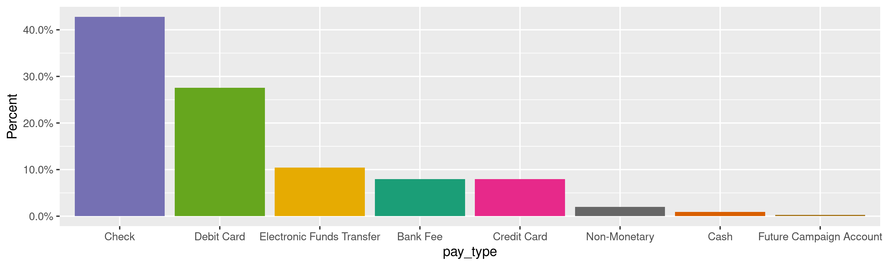
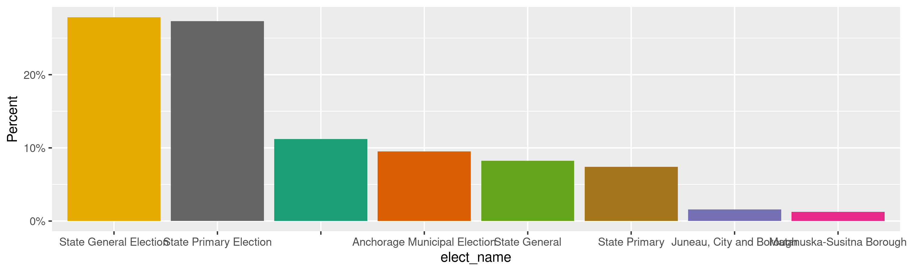
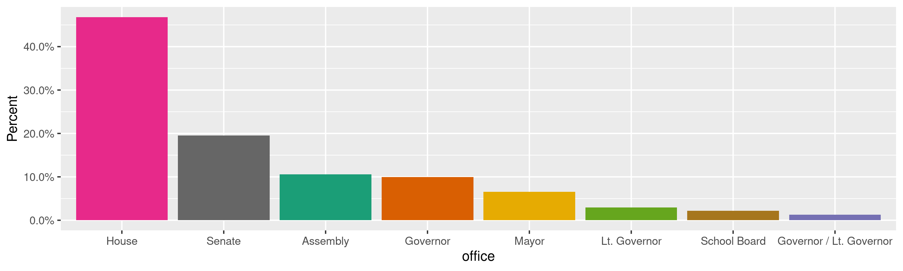
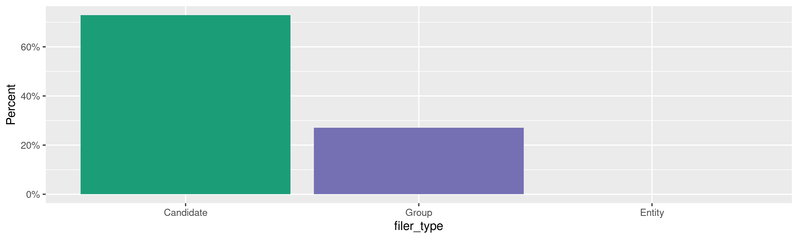
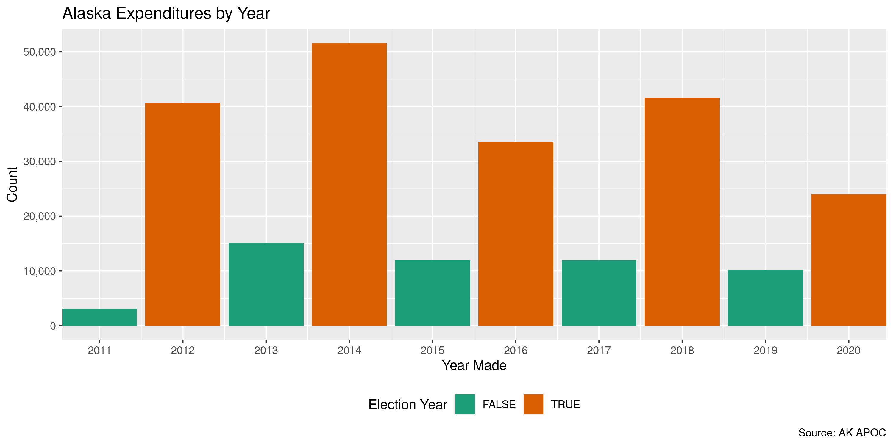

Alaska Expenditures
================
Kiernan Nicholls & Aarushi Sahejpal
Tue Sep 20 14:41:25 2022

-   <a href="#project" id="toc-project">Project</a>
-   <a href="#objectives" id="toc-objectives">Objectives</a>
-   <a href="#packages" id="toc-packages">Packages</a>
-   <a href="#data" id="toc-data">Data</a>
-   <a href="#download" id="toc-download">Download</a>
-   <a href="#read" id="toc-read">Read</a>
-   <a href="#explore" id="toc-explore">Explore</a>
    -   <a href="#missing" id="toc-missing">Missing</a>
    -   <a href="#duplicates" id="toc-duplicates">Duplicates</a>
    -   <a href="#categorical" id="toc-categorical">Categorical</a>
    -   <a href="#amounts" id="toc-amounts">Amounts</a>
    -   <a href="#dates" id="toc-dates">Dates</a>
-   <a href="#wrangle" id="toc-wrangle">Wrangle</a>
    -   <a href="#address" id="toc-address">Address</a>
    -   <a href="#zip" id="toc-zip">ZIP</a>
    -   <a href="#state" id="toc-state">State</a>
    -   <a href="#city" id="toc-city">City</a>
-   <a href="#conclude" id="toc-conclude">Conclude</a>
-   <a href="#export" id="toc-export">Export</a>
-   <a href="#upload" id="toc-upload">Upload</a>

<!-- Place comments regarding knitting here -->

## Project

The Accountability Project is an effort to cut across data silos and
give journalists, policy professionals, activists, and the public at
large a simple way to search across huge volumes of public data about
people and organizations.

Our goal is to standardizing public data on a few key fields by thinking
of each dataset row as a transaction. For each transaction there should
be (at least) 3 variables:

1.  All **parties** to a transaction.
2.  The **date** of the transaction.
3.  The **amount** of money involved.

## Objectives

This document describes the process used to complete the following
objectives:

1.  How many records are in the database?
2.  Check for entirely duplicated records.
3.  Check ranges of continuous variables.
4.  Is there anything blank or missing?
5.  Check for consistency issues.
6.  Create a five-digit ZIP Code called `zip`.
7.  Create a `year` field from the transaction date.
8.  Make sure there is data on both parties to a transaction.

## Packages

The following packages are needed to collect, manipulate, visualize,
analyze, and communicate these results. The `pacman` package will
facilitate their installation and attachment.

``` r
if (!require("pacman")) {
  install.packages("pacman")
}
pacman::p_load(
  tidyverse, # data manipulation
  lubridate, # datetime strings
  gluedown, # printing markdown
  janitor, # clean data frames
  campfin, # custom irw tools
  aws.s3, # aws cloud storage
  refinr, # cluster & merge
  scales, # format strings
  knitr, # knit documents
  vroom, # fast reading
  rvest, # scrape html
  glue, # code strings
  here, # project paths
  httr, # http requests
  fs # local storage 
)
```

This document should be run as part of the `R_campfin` project, which
lives as a sub-directory of the more general, language-agnostic
[`irworkshop/accountability_datacleaning`](https://github.com/irworkshop/accountability_datacleaning)
GitHub repository.

The `R_campfin` project uses the [RStudio
projects](https://support.rstudio.com/hc/en-us/articles/200526207-Using-Projects)
feature and should be run as such. The project also uses the dynamic
`here::here()` tool for file paths relative to *your* machine.

``` r
# where does this document knit?
here::i_am("ak/expends/docs/ak_expends_diary.Rmd")
```

## Data

Data is obtained from the [Alaska Public Offices Commission
(APOC)](https://aws.state.ak.us/ApocReports/Campaign/#).

## Download

Using the [APOC expenditure
search](https://aws.state.ak.us/ApocReports/CampaignDisclosure/CDExpenditures.aspx),
we need to search for “All Completed Forms”, “Any Names”, and “Any”
type. Exporting “Any” report year only returns roughly 243,669 results.

``` r
raw_dir <- dir_create(here("ak", "expends", "data", "raw"))
raw_csv <- path(raw_dir, glue("CD_Transactions_{format(now(), '%m-%d-%Y')}.CSV"))
```

## Read

The exported delimited text files have two aspects we need to adjust
for; 1) There is a column called `--------` that is empty in every file,
and 2) there is an extra comma at the end of each line. We can read this
extra column at the end as a new `null` column.

``` r
ake_names <- raw_csv %>%
  read_names(delim = ",") %>%
  str_replace("--------", "null1") %>%
  make_clean_names(case = "snake")
```

All the files can be read into a single data frame using
`vroom::vroom()`.

``` r
# should be 243,669 items
ake <- read_delim(
  file = raw_csv,
  skip = 1,
  delim = ",",
  escape_double = TRUE,
  na = c("", "NA", "N/A", "n/a", "N/a"),
  # add column name to end
  col_names = c(ake_names, "null2"),
  col_types = cols(
    .default = col_character(),
    date = col_date_mdy(),
    amount = col_number(),
    report_year = col_integer(),
    submitted = col_date_mdy(),
    # ignore bad cols
    null1 = col_skip(),
    null2 = col_skip()
  )
)
```

We successfully read the same number of rows as search results.

``` r
nrow(ake) == 243669
#> [1] FALSE
```

For exploration, we can split the election name column into its parts.

``` r
elect_names <- ake %>%
  distinct(elect_name) %>%
  mutate(across(elect_name, na_if, "-")) %>%
  separate(
    col = elect_name,
    into = c("elect_year", "elect_where"),
    remove = FALSE,
    sep = "\\s-\\s",
    convert = TRUE,
    extra = "merge"
  ) %>%
  mutate(across(elect_where, str_squish))
```

``` r
ake <- ake %>%
  left_join(elect_names, by = "elect_name") %>%
  select(-elect_name) %>%
  rename(elect_name = elect_where) %>%
  relocate(elect_year, elect_name, .before = elect_type)
```

## Explore

There are 265,063 rows of 25 columns. Each record represents a single
expenditure from a committee to a vendor.

``` r
glimpse(ake)
#> Rows: 265,063
#> Columns: 25
#> $ txn          <chr> "1", "2", "3", "4", "5", "6", "7", "8", "9", "10", "11", "12", "13", "14", "15", "16", "17", "18"…
#> $ date         <date> 2022-01-16, 2021-11-17, 2022-02-14, 2021-12-02, 2021-11-25, 2021-11-21, 2022-01-08, 2021-12-30, …
#> $ pay_type     <chr> "Check", "Check", "Check", "Check", "Check", "Check", "Check", "Check", "Debit Card", "Debit Card…
#> $ pay_info     <chr> "159", "151", "155", "154", "153", "152", "158", "156", NA, NA, NA, NA, NA, "Training", "Training…
#> $ amount       <dbl> 206.98, 693.00, 100.00, 68.99, 154.95, 500.00, 199.98, 100.00, 22.50, 73.42, 98.91, 35.84, 7.00, …
#> $ last         <chr> "Donley", "Chambers", "Thompkins", "Donley", "Donley", "Donley", "Donley", "Rittgers Companies, L…
#> $ first        <chr> "David", "Michael", "Brittany", "David", "David", "David", "David", NA, NA, NA, NA, NA, NA, NA, N…
#> $ address      <chr> "6860 Tondi Lane", "201 Barrow St #4", "13020 Foster Road", "6860 Tondi Lane", "6860 Tondi Lane",…
#> $ city         <chr> "Anchorage", "Anchorage", "Anchorage", "Anchorage", "Anchorage", "Anchorage", "Anchorage", "Ancho…
#> $ state        <chr> "Alaska", "Alaska", "Alaska", "Alaska", "Alaska", "Alaska", "Alaska", "Alaska", "Alaska", "Alaska…
#> $ zip          <chr> "99507", "99501", "99516", "99507", "99507", "99507", "99507", "99507", "99508", "99508", "99501"…
#> $ country      <chr> "USA", "USA", "USA", "USA", "USA", "USA", "USA", "USA", "USA", "USA", "USA", "USA", "USA", "USA",…
#> $ occupation   <chr> NA, NA, NA, NA, NA, NA, NA, NA, NA, NA, NA, NA, NA, "Foundation", "Foundation", "Internet Domain/…
#> $ employer     <chr> NA, NA, NA, NA, NA, NA, NA, NA, NA, NA, NA, NA, NA, "FACL", "FACL", "GoDaddy.com", "Paypal", "Off…
#> $ purpose      <chr> "Reimburse for 1/16/21 Amazon purchase of printer toner.", "Website services and electronic media…
#> $ rpt_type     <chr> "Previous Year Start Report", "Previous Year Start Report", "Previous Year Start Report", "Previo…
#> $ elect_year   <int> 2023, 2023, 2023, 2023, 2023, 2023, 2023, 2023, 2022, 2022, 2022, 2022, 2022, 2022, 2022, 2022, 2…
#> $ elect_name   <chr> "Anchorage Municipal Election", "Anchorage Municipal Election", "Anchorage Municipal Election", "…
#> $ elect_type   <chr> "Anchorage Municipal", "Anchorage Municipal", "Anchorage Municipal", "Anchorage Municipal", "Anch…
#> $ municipality <chr> "Anchorage, City and Borough", "Anchorage, City and Borough", "Anchorage, City and Borough", "Anc…
#> $ office       <chr> "School Board", "School Board", "School Board", "School Board", "School Board", "School Board", "…
#> $ filer_type   <chr> "Candidate", "Candidate", "Candidate", "Candidate", "Candidate", "Candidate", "Candidate", "Candi…
#> $ committee    <chr> "Dave Donley", "Dave Donley", "Dave Donley", "Dave Donley", "Dave Donley", "Dave Donley", "Dave D…
#> $ rpt_year     <int> 2023, 2023, 2023, 2023, 2023, 2023, 2023, 2023, 2022, 2022, 2022, 2022, 2022, 2022, 2022, 2022, 2…
#> $ submitted    <date> 2022-02-13, 2022-02-13, 2022-02-13, 2022-02-13, 2022-02-13, 2022-02-13, 2022-02-13, 2022-02-13, …
tail(ake)
#> # A tibble: 6 × 25
#>   txn    date   pay_type pay_info amount last  first address city  state zip   country occupat…¹ emplo…² purpose rpt_t…³
#>   <chr>  <date> <chr>    <chr>     <dbl> <chr> <chr> <chr>   <chr> <chr> <chr> <chr>   <chr>     <chr>   <chr>   <chr>  
#> 1 "    … NA     <NA>     <NA>         NA <NA>  <NA>  <NA>    <NA>  <NA>  <NA>  <NA>    <NA>      <NA>    <NA>    <NA>   
#> 2 "    … NA     <NA>     <NA>         NA <NA>  <NA>  <NA>    <NA>  <NA>  <NA>  <NA>    <NA>      <NA>    <NA>    <NA>   
#> 3 "    … NA     <NA>     <NA>         NA <NA>  <NA>  <NA>    <NA>  <NA>  <NA>  <NA>    <NA>      <NA>    <NA>    <NA>   
#> 4 "    … NA     <NA>     <NA>         NA <NA>  <NA>  <NA>    <NA>  <NA>  <NA>  <NA>    <NA>      <NA>    <NA>    <NA>   
#> 5 "    … NA     <NA>     <NA>         NA <NA>  <NA>  <NA>    <NA>  <NA>  <NA>  <NA>    <NA>      <NA>    <NA>    <NA>   
#> 6 "</ht… NA     <NA>     <NA>         NA <NA>  <NA>  <NA>    <NA>  <NA>  <NA>  <NA>    <NA>      <NA>    <NA>    <NA>   
#> # … with 9 more variables: elect_year <int>, elect_name <chr>, elect_type <chr>, municipality <chr>, office <chr>,
#> #   filer_type <chr>, committee <chr>, rpt_year <int>, submitted <date>, and abbreviated variable names ¹​occupation,
#> #   ²​employer, ³​rpt_type
```

### Missing

Columns vary in their degree of missing values.

``` r
col_stats(ake, count_na)
#> # A tibble: 25 × 4
#>    col          class       n        p
#>    <chr>        <chr>   <int>    <dbl>
#>  1 txn          <chr>       0 0       
#>  2 date         <date>     63 0.000238
#>  3 pay_type     <chr>      62 0.000234
#>  4 pay_info     <chr>  150155 0.566   
#>  5 amount       <dbl>      63 0.000238
#>  6 last         <chr>     115 0.000434
#>  7 first        <chr>  219084 0.827   
#>  8 address      <chr>    1542 0.00582 
#>  9 city         <chr>    1134 0.00428 
#> 10 state        <chr>     309 0.00117 
#> 11 zip          <chr>    1346 0.00508 
#> 12 country      <chr>      63 0.000238
#> 13 occupation   <chr>  256823 0.969   
#> 14 employer     <chr>  257700 0.972   
#> 15 purpose      <chr>     186 0.000702
#> 16 rpt_type     <chr>     917 0.00346 
#> 17 elect_year   <int>   28660 0.108   
#> 18 elect_name   <chr>      63 0.000238
#> 19 elect_type   <chr>   28660 0.108   
#> 20 municipality <chr>  198760 0.750   
#> 21 office       <chr>   88855 0.335   
#> 22 filer_type   <chr>      63 0.000238
#> 23 committee    <chr>      63 0.000238
#> 24 rpt_year     <int>      63 0.000238
#> 25 submitted    <date>     63 0.000238
```

We can flag any record missing a key variable needed to identify a
transaction.

``` r
key_vars <- c("date", "last", "amount", "committee")
ake <- flag_na(ake, all_of(key_vars))
sum(ake$na_flag)
#> [1] 115
```

``` r
ake %>% 
  filter(na_flag) %>% 
  select(all_of(key_vars))
#> # A tibble: 115 × 4
#>    date       last  amount committee                                                                                    
#>    <date>     <chr>  <dbl> <chr>                                                                                        
#>  1 2019-07-19 <NA>   1673. Liz Snyder                                                                                   
#>  2 2017-02-22 <NA>      0  IUOE Local 302 PAC  (International Union of Operating Engineers Local 302 Political Action C…
#>  3 2017-02-22 <NA>      0  IUOE Local 302 PAC  (International Union of Operating Engineers Local 302 Political Action C…
#>  4 2017-02-22 <NA>      0  IUOE Local 302 PAC  (International Union of Operating Engineers Local 302 Political Action C…
#>  5 2017-02-22 <NA>      0  IUOE Local 302 PAC  (International Union of Operating Engineers Local 302 Political Action C…
#>  6 2017-02-22 <NA>      0  IUOE Local 302 PAC  (International Union of Operating Engineers Local 302 Political Action C…
#>  7 2017-02-22 <NA>      0  IUOE Local 302 PAC  (International Union of Operating Engineers Local 302 Political Action C…
#>  8 2017-02-22 <NA>      0  IUOE Local 302 PAC  (International Union of Operating Engineers Local 302 Political Action C…
#>  9 2017-02-22 <NA>      0  IUOE Local 302 PAC  (International Union of Operating Engineers Local 302 Political Action C…
#> 10 2017-02-22 <NA>      0  IUOE Local 302 PAC  (International Union of Operating Engineers Local 302 Political Action C…
#> # … with 105 more rows
```

### Duplicates

We can also flag any record completely duplicated across every column.

``` r
ake <- flag_dupes(ake, -txn)
sum(ake$dupe_flag)
#> [1] 47064
```

``` r
ake %>% 
  filter(dupe_flag) %>% 
  select(txn, all_of(key_vars))
#> # A tibble: 47,064 × 5
#>    txn   date       last                                           amount committee            
#>    <chr> <date>     <chr>                                           <dbl> <chr>                
#>  1 14    2021-11-19 Federation for Applied Conservative Leadership   40   Sharon Denise Jackson
#>  2 15    2021-11-19 Federation for Applied Conservative Leadership   40   Sharon Denise Jackson
#>  3 21    2021-12-31 Paypal                                           14.9 Sharon Denise Jackson
#>  4 23    2021-12-31 Paypal                                           14.9 Sharon Denise Jackson
#>  5 155   2022-01-15 Anedot Inc.                                       4.3 Michael Cronk        
#>  6 157   2022-01-15 Anedot Inc.                                       4.3 Michael Cronk        
#>  7 158   2022-01-15 Anedot Inc.                                       4.3 Michael Cronk        
#>  8 180   2021-03-09 Wells Fargo                                      52.3 Rachel M. Ries       
#>  9 181   2021-03-13 Dubay Business Services                         700   Rachel M. Ries       
#> 10 182   2021-08-12 Dubay Business Services                        2000   Rachel M. Ries       
#> # … with 47,054 more rows
```

### Categorical

``` r
col_stats(ake, n_distinct)
#> # A tibble: 27 × 4
#>    col          class       n          p
#>    <chr>        <chr>   <int>      <dbl>
#>  1 txn          <chr>  265049 1.00      
#>  2 date         <date>   4123 0.0156    
#>  3 pay_type     <chr>      12 0.0000453 
#>  4 pay_info     <chr>   13631 0.0514    
#>  5 amount       <dbl>   32240 0.122     
#>  6 last         <chr>   25596 0.0966    
#>  7 first        <chr>    4206 0.0159    
#>  8 address      <chr>   34388 0.130     
#>  9 city         <chr>    2713 0.0102    
#> 10 state        <chr>      94 0.000355  
#> 11 zip          <chr>    3392 0.0128    
#> 12 country      <chr>      24 0.0000905 
#> 13 occupation   <chr>     765 0.00289   
#> 14 employer     <chr>    1014 0.00383   
#> 15 purpose      <chr>   52876 0.199     
#> 16 rpt_type     <chr>      14 0.0000528 
#> 17 elect_year   <int>      13 0.0000490 
#> 18 elect_name   <chr>      56 0.000211  
#> 19 elect_type   <chr>      10 0.0000377 
#> 20 municipality <chr>      27 0.000102  
#> 21 office       <chr>      12 0.0000453 
#> 22 filer_type   <chr>       4 0.0000151 
#> 23 committee    <chr>    1376 0.00519   
#> 24 rpt_year     <int>      13 0.0000490 
#> 25 submitted    <date>   2206 0.00832   
#> 26 na_flag      <lgl>       2 0.00000755
#> 27 dupe_flag    <lgl>       2 0.00000755
```

<!-- --><!-- --><!-- --><!-- --><!-- --><!-- --><!-- -->

### Amounts

``` r
summary(ake$amount)
#>    Min. 1st Qu.  Median    Mean 3rd Qu.    Max.    NA's 
#>       0      20      94    1244     500 3152887      63
mean(ake$amount <= 0)
#> [1] NA
```

These are the records with the minimum and maximum amounts.

``` r
glimpse(ake[c(which.max(ake$amount), which.min(ake$amount)), ])
#> Rows: 2
#> Columns: 27
#> $ txn          <chr> "51637", "62"
#> $ date         <date> 2020-09-23, 2021-11-26
#> $ pay_type     <chr> "Check", "Debit Card"
#> $ pay_info     <chr> "1186", NA
#> $ amount       <dbl> 3152887, 0
#> $ last         <chr> "Bright Strategy & Communications", " Paypal"
#> $ first        <chr> NA, NA
#> $ address      <chr> "900 W 5th Ave #100", "2211 N1st St"
#> $ city         <chr> "Anchorage", "San Jose"
#> $ state        <chr> "Alaska", "California"
#> $ zip          <chr> "99501", "95131"
#> $ country      <chr> "USA", "USA"
#> $ occupation   <chr> NA, NA
#> $ employer     <chr> NA, NA
#> $ purpose      <chr> "TV ads: $3,388,436.61 with GCI Cable, KATH, KJUD, KTBY, KTUU, KTVF, KXDF, KXLJ, KYUR, D2 Media S…
#> $ rpt_type     <chr> "Thirty Day Report", "Year Start Report"
#> $ elect_year   <int> 2020, 2022
#> $ elect_name   <chr> "State General Election", "State Primary"
#> $ elect_type   <chr> "State General", "State Primary"
#> $ municipality <chr> NA, NA
#> $ office       <chr> NA, "Senate"
#> $ filer_type   <chr> "Group", "Candidate"
#> $ committee    <chr> "OneAlaska--Vote No on One", "Janice Lynn Park"
#> $ rpt_year     <int> 2020, 2022
#> $ submitted    <date> 2020-10-05, 2022-02-15
#> $ na_flag      <lgl> FALSE, FALSE
#> $ dupe_flag    <lgl> FALSE, FALSE
```

<!-- -->

### Dates

We can add the calendar year from `date` with `lubridate::year()`

``` r
ake <- mutate(ake, year = year(date))
```

``` r
min(ake$date)
#> [1] NA
sum(ake$year < 2000)
#> [1] NA
max(ake$date)
#> [1] NA
sum(ake$date > today())
#> [1] NA
```

<!-- -->

## Wrangle

To improve the searchability of the database, we will perform some
consistent, confident string normalization. For geographic variables
like city names and ZIP codes, the corresponding `campfin::normal_*()`
functions are tailor made to facilitate this process.

### Address

For the street `addresss` variable, the `campfin::normal_address()`
function will force consistence case, remove punctuation, and abbreviate
official USPS suffixes.

``` r
ake <- ake %>% 
  mutate(
    address_norm = normal_address(
      address = address,
      abbs = usps_street,
      na_rep = TRUE
    )
  )
```

``` r
ake %>% 
  select(contains("address")) %>% 
  distinct() %>% 
  sample_n(10)
#> # A tibble: 10 × 2
#>    address                         address_norm                
#>    <chr>                           <chr>                       
#>  1 "2233 112th Ave NE"             2233 112TH AVE NE           
#>  2 "#2512 Parks Highway "          #2512 PARKS HWY             
#>  3 "737 N Michigan #2020"          737 N MICHIGAN #2020        
#>  4 "4720 Business Park Blvd #G-25" 4720 BUSINESS PARK BLVD #G25
#>  5 "1989 AIRPORT WAY"              1989 AIRPORT WAY            
#>  6 "P. O. Box 993"                 P O BOX 993                 
#>  7 "4340 MacAlister Dr."           4340 MACALISTER DR          
#>  8 "19300 International Blvd."     19300 INTERNATIONAL BLVD    
#>  9 "2014 Southeast 39th"           2014 SOUTHEAST 39TH         
#> 10 "2449 Glenwood Street"          2449 GLENWOOD ST
```

### ZIP

For ZIP codes, the `campfin::normal_zip()` function will attempt to
create valid *five* digit codes by removing the ZIP+4 suffix and
returning leading zeroes dropped by other programs like Microsoft Excel.

``` r
ake <- ake %>% 
  mutate(
    zip_norm = normal_zip(
      zip = zip,
      na_rep = TRUE
    )
  )
```

``` r
progress_table(
  ake$zip,
  ake$zip_norm,
  compare = valid_zip
)
#> # A tibble: 2 × 6
#>   stage        prop_in n_distinct prop_na n_out n_diff
#>   <chr>          <dbl>      <dbl>   <dbl> <dbl>  <dbl>
#> 1 ake$zip        0.956       3392 0.00508 11600   1356
#> 2 ake$zip_norm   0.986       2513 0.0136   3698    415
```

### State

Valid two digit state abbreviations can be made using the
`campfin::normal_state()` function.

``` r
ake <- ake %>% 
  mutate(
    state_norm = normal_state(
      state = state,
      abbreviate = TRUE,
      na_rep = TRUE,
      valid = valid_state
    )
  )
```

``` r
ake %>% 
  filter(state != state_norm) %>% 
  count(state, state_norm, sort = TRUE)
#> # A tibble: 52 × 3
#>    state                state_norm      n
#>    <chr>                <chr>       <int>
#>  1 Alaska               AK         187452
#>  2 California           CA          34779
#>  3 Louisiana            LA          13747
#>  4 Massachusetts        MA           4662
#>  5 Washington           WA           4461
#>  6 New York             NY           2833
#>  7 Texas                TX           2165
#>  8 District of Columbia DC           1694
#>  9 Virginia             VA           1266
#> 10 Ohio                 OH           1159
#> # … with 42 more rows
```

``` r
progress_table(
  ake$state,
  ake$state_norm,
  compare = valid_state
)
#> # A tibble: 2 × 6
#>   stage            prop_in n_distinct prop_na  n_out n_diff
#>   <chr>              <dbl>      <dbl>   <dbl>  <dbl>  <dbl>
#> 1 ake$state      0.0000189         94 0.00117 264749     93
#> 2 ake$state_norm 1                 53 0.00321      0      1
```

### City

Cities are the most difficult geographic variable to normalize, simply
due to the wide variety of valid cities and formats.

#### Normal

The `campfin::normal_city()` function is a good start, again converting
case, removing punctuation, but *expanding* USPS abbreviations. We can
also remove `invalid_city` values.

``` r
norm_city <- ake %>% 
  distinct(city, state_norm, zip_norm) %>% 
  mutate(
    city_norm = normal_city(
      city = city, 
      abbs = usps_city,
      states = c("AK", "DC", "ALASKA"),
      na = invalid_city,
      na_rep = TRUE
    )
  )
```

#### Swap

We can further improve normalization by comparing our normalized value
against the *expected* value for that record’s state abbreviation and
ZIP code. If the normalized value is either an abbreviation for or very
similar to the expected value, we can confidently swap those two.

``` r
norm_city <- norm_city %>% 
  rename(city_raw = city) %>% 
  left_join(
    y = zipcodes,
    by = c(
      "state_norm" = "state",
      "zip_norm" = "zip"
    )
  ) %>% 
  rename(city_match = city) %>% 
  mutate(
    match_abb = is_abbrev(city_norm, city_match),
    match_dist = str_dist(city_norm, city_match),
    city_swap = if_else(
      condition = !is.na(match_dist) & (match_abb | match_dist == 1),
      true = city_match,
      false = city_norm
    )
  ) %>% 
  select(
    -city_match,
    -match_dist,
    -match_abb
  )
```

``` r
ake <- left_join(
  x = ake,
  y = norm_city,
  by = c(
    "city" = "city_raw", 
    "state_norm", 
    "zip_norm"
  )
)
```

#### Refine

The [OpenRefine](https://openrefine.org/) algorithms can be used to
group similar strings and replace the less common versions with their
most common counterpart. This can greatly reduce inconsistency, but with
low confidence; we will only keep any refined strings that have a valid
city/state/zip combination.

``` r
good_refine <- ake %>% 
  mutate(
    city_refine = city_swap %>% 
      key_collision_merge() %>% 
      n_gram_merge(numgram = 1)
  ) %>% 
  filter(city_refine != city_swap) %>% 
  inner_join(
    y = zipcodes,
    by = c(
      "city_refine" = "city",
      "state_norm" = "state",
      "zip_norm" = "zip"
    )
  )
```

    #> # A tibble: 32 × 5
    #>    state_norm zip_norm city_swap           city_refine           n
    #>    <chr>      <chr>    <chr>               <chr>             <int>
    #>  1 CA         94110    SAN FRANSICO        SAN FRANCISCO       228
    #>  2 CA         94107    SAN FRANSICO        SAN FRANCISCO        94
    #>  3 AK         99518    ANCHROGE            ANCHORAGE            51
    #>  4 WA         98110    B BAINBRIDGE ISLAND BAINBRIDGE ISLAND    24
    #>  5 MA         02144    SOMMERSVILLE        SOMERVILLE           16
    #>  6 IL         60197    CORAL STREAM        CAROL STREAM         13
    #>  7 AK         99654    WASSILA             WASILLA               7
    #>  8 CA         94103    SAN FRANSICO        SAN FRANCISCO         7
    #>  9 CA         94120    SAN FRANSICO        SAN FRANCISCO         7
    #> 10 CA         94102    SAN FRANSCIO        SAN FRANCISCO         5
    #> # … with 22 more rows

Then we can join the refined values back to the database.

``` r
ake <- ake %>% 
  left_join(good_refine, by = names(.)) %>% 
  mutate(city_refine = coalesce(city_refine, city_swap))
```

#### Progress

Our goal for normalization was to increase the proportion of city values
known to be valid and reduce the total distinct values by correcting
misspellings.

| stage                                                                                                                                                                                                                                                                                      | prop_in | n_distinct | prop_na | n_out | n_diff |
|:-------------------------------------------------------------------------------------------------------------------------------------------------------------------------------------------------------------------------------------------------------------------------------------------|--------:|-----------:|--------:|------:|-------:|
| str_to_upper(ake | 0.937| 2342| 0.004| 16677| 1229| |ake")city_norm |   0.974 |       1829 |   0.007 |  6792 |    688 |
| akecity_refine        |   0.992 |       1483 |   0.007 |  2007 |    326 |

You can see how the percentage of valid values increased with each
stage.

<!-- -->

More importantly, the number of distinct values decreased each stage. We
were able to confidently change many distinct invalid values to their
valid equivalent.

<!-- -->

## Conclude

Before exporting, we can remove the intermediary normalization columns
and rename all added variables with the `_clean` suffix.

``` r
ake <- ake %>% 
  select(
    -city_norm,
    -city_swap,
    city_clean = city_refine
  ) %>% 
  rename_all(~str_replace(., "_norm", "_clean")) %>% 
  rename_all(~str_remove(., "_raw")) %>% 
  relocate(state_clean, zip_clean, .after = city_clean)
```

``` r
glimpse(sample_n(ake, 50))
#> Rows: 50
#> Columns: 32
#> $ txn           <chr> "146486", "4490", "107008", "233720", "221588", "141384", "185266", "125772", "199889", "247933"…
#> $ date          <date> 2016-09-30, 2022-03-16, 2018-03-31, 2014-11-02, 2014-08-26, 2016-07-05, 2014-07-03, 2017-08-14,…
#> $ pay_type      <chr> "Check", "Electronic Funds Transfer", "Check", "Check", "Check", "Check", "Check", "Bank Fee", "…
#> $ pay_info      <chr> "1571", NA, "1100", "1129", "197", "1016", "1051", NA, NA, NA, "0022", NA, NA, "127", NA, "2046"…
#> $ amount        <dbl> 500.00, 4346.28, 1500.00, 1042.15, 15.00, 100.00, 254500.00, 1.38, 472.70, 7.55, 4190.92, 10.30,…
#> $ last          <chr> "Patricia for House", "ADP Federal Account", "DeLaiarro", "Express Business Service ", "Kreiss-T…
#> $ first         <chr> NA, NA, "Paula", NA, "Jonathan", "Jasmine", NA, NA, NA, NA, NA, NA, NA, NA, NA, NA, NA, NA, NA, …
#> $ address       <chr> "PO Box 940107", "2602 Fairbanks", "8401 Pioneer Dr", "360 E. International Airport Rd #6", "Big…
#> $ city          <chr> "Houston", "Anchorage", "Anchorage", "Anchorage", "Sitka", "Anchorage", "Anchorage", "San Franci…
#> $ state         <chr> "Alaska", "Alaska", "Alaska", "Alaska", "Alaska", "Alaska", "Alaska", "California", "Washington"…
#> $ zip           <chr> "99694", "99503", "99504", "99518", "99835", "99508", "99501", "94103", "98168", NA, "99508", "7…
#> $ country       <chr> "USA", "USA", "USA", "USA", "USA", "USA", "USA", "USA", "USA", "USA", "USA", "USA", "USA", "USA"…
#> $ occupation    <chr> NA, NA, NA, NA, NA, NA, NA, NA, NA, NA, NA, NA, NA, NA, NA, NA, NA, NA, NA, NA, NA, NA, NA, NA, …
#> $ employer      <chr> NA, NA, NA, NA, NA, NA, NA, NA, NA, NA, NA, NA, NA, NA, NA, NA, NA, NA, NA, NA, NA, NA, NA, NA, …
#> $ purpose       <chr> "Donation", "Administrative Transfer", "Accounting, banking, data analysis, financial compliance…
#> $ rpt_type      <chr> "Thirty Day Report", "Seven Day Report", "Thirty Day Report", "Year End Report", "Thirty Day Rep…
#> $ elect_year    <int> 2016, 2022, 2018, 2014, 2014, 2016, 2014, 2017, 2014, 2012, 2018, 2021, 2016, 2014, 2013, 2014, …
#> $ elect_name    <chr> "State General Election", "Anchorage Municipal Election", "State Primary Election", "State Gener…
#> $ elect_type    <chr> "State General", "Anchorage Municipal", "State Primary", "State General", "State General", "Stat…
#> $ municipality  <chr> NA, "Anchorage, City and Borough", NA, NA, NA, NA, NA, "Fairbanks Northstar Borough", NA, NA, NA…
#> $ office        <chr> NA, NA, "Lt. Governor", "House", "House", "Senate", NA, "Assembly", "Governor", NA, "House", "Ma…
#> $ filer_type    <chr> "Group", "Group", "Candidate", "Candidate", "Candidate", "Candidate", "Group", "Candidate", "Can…
#> $ committee     <chr> "Putting Alaskans First PAC", "Alaska Democratic Party", "Byron I. Mallott", "Matt Claman", "Jon…
#> $ rpt_year      <int> 2016, 2022, 2018, 2014, 2014, 2016, 2014, 2017, 2014, 2012, 2018, 2021, 2016, 2014, 2013, 2014, …
#> $ submitted     <date> 2016-10-10, 2022-03-29, 2018-10-28, 2016-06-30, 2015-03-09, 2016-07-19, 2014-07-21, 2017-09-02,…
#> $ na_flag       <lgl> FALSE, FALSE, FALSE, FALSE, FALSE, FALSE, FALSE, FALSE, FALSE, FALSE, FALSE, FALSE, FALSE, FALSE…
#> $ dupe_flag     <lgl> FALSE, FALSE, FALSE, FALSE, TRUE, FALSE, FALSE, FALSE, FALSE, FALSE, FALSE, TRUE, FALSE, FALSE, …
#> $ year          <dbl> 2016, 2022, 2018, 2014, 2014, 2016, 2014, 2017, 2014, 2012, 2018, 2021, 2016, 2014, 2013, 2014, …
#> $ address_clean <chr> "PO BOX 940107", "2602 FAIRBANKS", "8401 PIONEER DR", "360 E INTERNATIONAL AIRPORT RD #6", "BIG …
#> $ city_clean    <chr> "HOUSTON", "ANCHORAGE", "ANCHORAGE", "ANCHORAGE", "SITKA", "ANCHORAGE", "ANCHORAGE", "SAN FRANCI…
#> $ state_clean   <chr> "AK", "AK", "AK", "AK", "AK", "AK", "AK", "CA", "WA", "AK", "AK", "LA", "CA", "AK", "AK", "AK", …
#> $ zip_clean     <chr> "99694", "99503", "99504", "99518", "99835", "99508", "99501", "94103", "98168", NA, "99508", "7…
```

1.  There are 265,063 records in the database.
2.  There are 47,064 duplicate records in the database.
3.  The range and distribution of `amount` and `date` seem reasonable.
4.  There are 115 records missing key variables.
5.  Consistency in geographic data has been improved with
    `campfin::normal_*()`.
6.  The 4-digit `year` variable has been created with
    `lubridate::year()`.

## Export

Now the file can be saved on disk for upload to the Accountability
server.

``` r
clean_dir <- dir_create(here("ak", "expends", "data", "clean"))
clean_path <- path(clean_dir, "ak_expends_clean.csv")
write_csv(ake, clean_path, na = "")
(clean_size <- file_size(clean_path))
#> 76.1M
file_encoding(clean_path) %>% 
  mutate(across(path, path.abbrev))
#> # A tibble: 1 × 3
#>   path                                                                                          mime  charset
#>   <fs::path>                                                                                    <chr> <chr>  
#> 1 /Volumes/TAP/TAP/accountability_datacleaning/state/ak/expends/data/clean/ak_expends_clean.csv <NA>  <NA>
```

## Upload

We can use the `aws.s3::put_object()` to upload the text file to the IRW
server.

``` r
aws_path <- path("csv", basename(clean_path))
if (!object_exists(aws_path, "publicaccountability")) {
  put_object(
    file = clean_path,
    object = aws_path, 
    bucket = "publicaccountability",
    acl = "public-read",
    show_progress = TRUE,
    multipart = TRUE
  )
}
aws_head <- head_object(aws_path, "publicaccountability")
(aws_size <- as_fs_bytes(attr(aws_head, "content-length")))
unname(aws_size == clean_size)
```
