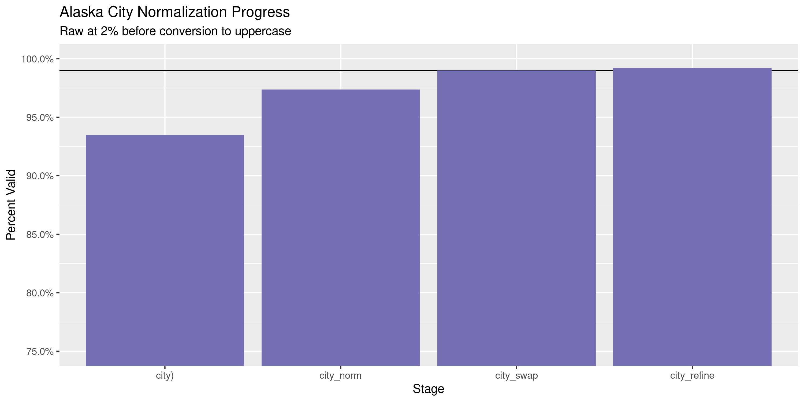

Alaska Expenditures
================
Kiernan Nicholls & Aarushi Sahejpal
Tue May 30 14:48:18 2023

- <a href="#project" id="toc-project">Project</a>
- <a href="#objectives" id="toc-objectives">Objectives</a>
- <a href="#packages" id="toc-packages">Packages</a>
- <a href="#data" id="toc-data">Data</a>
- <a href="#download" id="toc-download">Download</a>
- <a href="#read" id="toc-read">Read</a>
- <a href="#explore" id="toc-explore">Explore</a>
  - <a href="#missing" id="toc-missing">Missing</a>
  - <a href="#duplicates" id="toc-duplicates">Duplicates</a>
  - <a href="#categorical" id="toc-categorical">Categorical</a>
  - <a href="#amounts" id="toc-amounts">Amounts</a>
  - <a href="#dates" id="toc-dates">Dates</a>
- <a href="#wrangle" id="toc-wrangle">Wrangle</a>
  - <a href="#address" id="toc-address">Address</a>
  - <a href="#zip" id="toc-zip">ZIP</a>
  - <a href="#state" id="toc-state">State</a>
  - <a href="#city" id="toc-city">City</a>
- <a href="#conclude" id="toc-conclude">Conclude</a>
- <a href="#export" id="toc-export">Export</a>
- <a href="#upload" id="toc-upload">Upload</a>

<!-- Place comments regarding knitting here -->

## Project

The Accountability Project is an effort to cut across data silos and
give journalists, policy professionals, activists, and the public at
large a simple way to search across huge volumes of public data about
people and organizations.

Our goal is to standardizing public data on a few key fields by thinking
of each dataset row as a transaction. For each transaction there should
be (at least) 3 variables:

1.  All **parties** to a transaction.
2.  The **date** of the transaction.
3.  The **amount** of money involved.

## Objectives

This document describes the process used to complete the following
objectives:

1.  How many records are in the database?
2.  Check for entirely duplicated records.
3.  Check ranges of continuous variables.
4.  Is there anything blank or missing?
5.  Check for consistency issues.
6.  Create a five-digit ZIP Code called `zip`.
7.  Create a `year` field from the transaction date.
8.  Make sure there is data on both parties to a transaction.

## Packages

The following packages are needed to collect, manipulate, visualize,
analyze, and communicate these results. The `pacman` package will
facilitate their installation and attachment.

``` r
if (!require("pacman")) {
  install.packages("pacman")
}
pacman::p_load(
  tidyverse, # data manipulation
  lubridate, # datetime strings
  gluedown, # printing markdown
  janitor, # clean data frames
  campfin, # custom irw tools
  aws.s3, # aws cloud storage
  refinr, # cluster & merge
  scales, # format strings
  knitr, # knit documents
  vroom, # fast reading
  rvest, # scrape html
  glue, # code strings
  here, # project paths
  httr, # http requests
  fs # local storage 
)
```

This document should be run as part of the `R_campfin` project, which
lives as a sub-directory of the more general, language-agnostic
[`irworkshop/accountability_datacleaning`](https://github.com/irworkshop/accountability_datacleaning)
GitHub repository.

The `R_campfin` project uses the [RStudio
projects](https://support.rstudio.com/hc/en-us/articles/200526207-Using-Projects)
feature and should be run as such. The project also uses the dynamic
`here::here()` tool for file paths relative to *your* machine.

``` r
# where does this document knit?
here::here()
#> [1] "/Volumes/TAP/accountability_datacleaning"
```

## Data

Data is obtained from the [Alaska Public Offices Commission
(APOC)](https://aws.state.ak.us/ApocReports/Campaign/#).

## Download

Using the [APOC expenditure
search](https://aws.state.ak.us/ApocReports/CampaignDisclosure/CDExpenditures.aspx),
we need to search for “All Completed Forms”, “Any Names”, and “Any”
type. Exporting “Any” report year only returns roughly 243,669 results.

``` r
raw_dir <- dir_create(here("ak", "expends", "data", "raw"))
raw_csv <- path(raw_dir, glue("CD_Transactions_{format(now(), '%m-%d-%Y')}.CSV"))
```

## Read

The exported delimited text files have two aspects we need to adjust
for; 1) There is a column called `--------` that is empty in every file,
and 2) there is an extra comma at the end of each line. We can read this
extra column at the end as a new `null` column.

``` r
ake_names <- raw_csv %>%
  read_names(delim = ",") %>%
  str_replace("--------", "null1") %>%
  make_clean_names(case = "snake")
```

All the files can be read into a single data frame using
`vroom::vroom()`.

``` r
# should be 243,669 items
ake <- read_delim(
  file = raw_csv,
  skip = 1,
  delim = ",",
  escape_double = TRUE,
  na = c("", "NA", "N/A", "n/a", "N/a"),
  # add column name to end
  col_names = c(ake_names, "null2"),
  col_types = cols(
    .default = col_character(),
    date = col_date_mdy(),
    amount = col_number(),
    report_year = col_integer(),
    submitted = col_date_mdy(),
    # ignore bad cols
    null1 = col_skip(),
    null2 = col_skip()
  )
)
```

We successfully read the same number of rows as search results.

``` r
nrow(ake) == 243669
#> [1] FALSE
```

For exploration, we can split the election name column into its parts.

``` r
elect_names <- ake %>%
  distinct(elect_name) %>%
  mutate(across(elect_name, na_if, "-")) %>%
  separate(
    col = elect_name,
    into = c("elect_year", "elect_where"),
    remove = FALSE,
    sep = "\\s-\\s",
    convert = TRUE,
    extra = "merge"
  ) %>%
  mutate(across(elect_where, str_squish))
```

``` r
ake <- ake %>%
  left_join(elect_names, by = "elect_name") %>%
  select(-elect_name) %>%
  rename(elect_name = elect_where) %>%
  relocate(elect_year, elect_name, .before = elect_type)
```

## Explore

There are 225,062 rows of 25 columns. Each record represents a single
expenditure from a committee to a vendor.

``` r
glimpse(ake)
#> Rows: 225,062
#> Columns: 25
#> $ txn          <chr> "1", "2", "3", "4", "5", "6", "7", "8", "9", "10", "11", "12", "13", "14", "15", "16", "17", "18"…
#> $ date         <date> 2023-02-01, 2022-11-23, 2022-11-28, 2022-12-01, 2022-12-01, 2022-12-09, 2022-12-09, 2022-12-09, …
#> $ pay_type     <chr> "Check", "Debit Card", "Debit Card", "Debit Card", "Debit Card", "Debit Card", "Debit Card", "Deb…
#> $ pay_info     <chr> "1003", NA, NA, NA, NA, NA, NA, NA, NA, NA, NA, NA, NA, "159", "151", "155", "154", "153", "152",…
#> $ amount       <dbl> 54.86, 276.00, 14.00, 303.27, 194.15, 179.00, 170.75, 161.29, 360.00, 40.00, 1241.60, 16.00, 15.2…
#> $ last         <chr> "Frasca", "US Post Office", "US Post Office", "PIP Printing", "PIP Printing", "AT Publishing", "O…
#> $ first        <chr> "Cheryl", NA, NA, NA, NA, NA, NA, NA, NA, NA, NA, NA, NA, "David", "Michael", "Brittany", "David"…
#> $ address      <chr> "2415 La Honda Dr", "1601 W. Northern Lights", "1601 W. Northern Lights", "833 E. 4th Ave", "833 …
#> $ city         <chr> "Anchorage", "Anchorage", "Anchorage", "Anchorage", "Anchorage", "Anchorage", "Anchorage", "Ancho…
#> $ state        <chr> "Alaska", "Alaska", "Alaska", "Alaska", "Alaska", "Alaska", "Alaska", "Alaska", "Alaska", "Alaska…
#> $ zip          <chr> "99517", "99517", "99517", "99501", "99501", "99507", "99503", "99503", "99517", "99507", "70112"…
#> $ country      <chr> "USA", "USA", "USA", "USA", "USA", "USA", "USA", "USA", "USA", "USA", "USA", "USA", "USA", "USA",…
#> $ occupation   <chr> NA, NA, NA, NA, NA, NA, NA, NA, NA, NA, NA, NA, NA, NA, NA, NA, NA, NA, NA, NA, NA, NA, NA, NA, N…
#> $ employer     <chr> NA, NA, NA, NA, NA, NA, NA, NA, NA, NA, NA, NA, NA, NA, NA, NA, NA, NA, NA, NA, NA, NA, NA, NA, N…
#> $ purpose      <chr> "Reimburse for campaign checks", "PO box rental", "PO Box key deposit", "Printing of campaign mat…
#> $ rpt_type     <chr> "Previous Year Start Report", "Previous Year Start Report", "Previous Year Start Report", "Previo…
#> $ elect_year   <int> 2024, 2024, 2024, 2024, 2024, 2024, 2024, 2024, 2024, 2024, 2024, 2024, 2024, 2023, 2023, 2023, 2…
#> $ elect_name   <chr> "Anchorage Municipal Election", "Anchorage Municipal Election", "Anchorage Municipal Election", "…
#> $ elect_type   <chr> "Anchorage Municipal", "Anchorage Municipal", "Anchorage Municipal", "Anchorage Municipal", "Anch…
#> $ municipality <chr> "Anchorage, City and Borough", "Anchorage, City and Borough", "Anchorage, City and Borough", "Anc…
#> $ office       <chr> "Mayor", "Mayor", "Mayor", "Mayor", "Mayor", "Mayor", "Mayor", "Mayor", "Mayor", "Mayor", "Mayor"…
#> $ filer_type   <chr> "Candidate", "Candidate", "Candidate", "Candidate", "Candidate", "Candidate", "Candidate", "Candi…
#> $ committee    <chr> "Dave Bronson", "Dave Bronson", "Dave Bronson", "Dave Bronson", "Dave Bronson", "Dave Bronson", "…
#> $ rpt_year     <int> 2024, 2024, 2024, 2024, 2024, 2024, 2024, 2024, 2024, 2024, 2024, 2024, 2024, 2023, 2023, 2023, 2…
#> $ submitted    <date> 2023-02-15, 2023-02-15, 2023-02-15, 2023-02-15, 2023-02-15, 2023-02-15, 2023-02-15, 2023-02-15, …
tail(ake)
#> # A tibble: 6 × 25
#>   txn      date   pay_type pay_info amount last  first address city  state zip   country occupation employer purpose
#>   <chr>    <date> <chr>    <chr>     <dbl> <chr> <chr> <chr>   <chr> <chr> <chr> <chr>   <chr>      <chr>    <chr>  
#> 1 "      … NA     <NA>     <NA>         NA <NA>  <NA>  <NA>    <NA>  <NA>  <NA>  <NA>    <NA>       <NA>     <NA>   
#> 2 "      … NA     <NA>     <NA>         NA <NA>  <NA>  <NA>    <NA>  <NA>  <NA>  <NA>    <NA>       <NA>     <NA>   
#> 3 "      … NA     <NA>     <NA>         NA <NA>  <NA>  <NA>    <NA>  <NA>  <NA>  <NA>    <NA>       <NA>     <NA>   
#> 4 "      … NA     <NA>     <NA>         NA <NA>  <NA>  <NA>    <NA>  <NA>  <NA>  <NA>    <NA>       <NA>     <NA>   
#> 5 "    </… NA     <NA>     <NA>         NA <NA>  <NA>  <NA>    <NA>  <NA>  <NA>  <NA>    <NA>       <NA>     <NA>   
#> 6 "</html… NA     <NA>     <NA>         NA <NA>  <NA>  <NA>    <NA>  <NA>  <NA>  <NA>    <NA>       <NA>     <NA>   
#> # ℹ 10 more variables: rpt_type <chr>, elect_year <int>, elect_name <chr>, elect_type <chr>, municipality <chr>,
#> #   office <chr>, filer_type <chr>, committee <chr>, rpt_year <int>, submitted <date>
```

### Missing

Columns vary in their degree of missing values.

``` r
col_stats(ake, count_na)
#> # A tibble: 25 × 4
#>    col          class       n        p
#>    <chr>        <chr>   <int>    <dbl>
#>  1 txn          <chr>       0 0       
#>  2 date         <date>     62 0.000275
#>  3 pay_type     <chr>      61 0.000271
#>  4 pay_info     <chr>  138886 0.617   
#>  5 amount       <dbl>      62 0.000275
#>  6 last         <chr>      82 0.000364
#>  7 first        <chr>  189662 0.843   
#>  8 address      <chr>    1272 0.00565 
#>  9 city         <chr>     846 0.00376 
#> 10 state        <chr>     332 0.00148 
#> 11 zip          <chr>     990 0.00440 
#> 12 country      <chr>      62 0.000275
#> 13 occupation   <chr>  217461 0.966   
#> 14 employer     <chr>  218224 0.970   
#> 15 purpose      <chr>     172 0.000764
#> 16 rpt_type     <chr>     369 0.00164 
#> 17 elect_year   <int>   22470 0.0998  
#> 18 elect_name   <chr>      62 0.000275
#> 19 elect_type   <chr>   22470 0.0998  
#> 20 municipality <chr>  163243 0.725   
#> 21 office       <chr>   74677 0.332   
#> 22 filer_type   <chr>      62 0.000275
#> 23 committee    <chr>      62 0.000275
#> 24 rpt_year     <int>      62 0.000275
#> 25 submitted    <date>     62 0.000275
```

We can flag any record missing a key variable needed to identify a
transaction.

``` r
key_vars <- c("date", "last", "amount", "committee")
ake <- flag_na(ake, all_of(key_vars))
sum(ake$na_flag)
#> [1] 82
```

``` r
ake %>% 
  filter(na_flag) %>% 
  select(all_of(key_vars))
#> # A tibble: 82 × 4
#>    date       last  amount committee                                                                                    
#>    <date>     <chr>  <dbl> <chr>                                                                                        
#>  1 2019-07-19 <NA>   1673. Liz Snyder                                                                                   
#>  2 2017-02-22 <NA>      0  IUOE Local 302 PAC  (International Union of Operating Engineers Local 302 Political Action C…
#>  3 2017-02-22 <NA>      0  IUOE Local 302 PAC  (International Union of Operating Engineers Local 302 Political Action C…
#>  4 2017-02-22 <NA>      0  IUOE Local 302 PAC  (International Union of Operating Engineers Local 302 Political Action C…
#>  5 2017-02-22 <NA>      0  IUOE Local 302 PAC  (International Union of Operating Engineers Local 302 Political Action C…
#>  6 2017-02-22 <NA>      0  IUOE Local 302 PAC  (International Union of Operating Engineers Local 302 Political Action C…
#>  7 2017-02-22 <NA>      0  IUOE Local 302 PAC  (International Union of Operating Engineers Local 302 Political Action C…
#>  8 2017-02-22 <NA>      0  IUOE Local 302 PAC  (International Union of Operating Engineers Local 302 Political Action C…
#>  9 2017-02-22 <NA>      0  IUOE Local 302 PAC  (International Union of Operating Engineers Local 302 Political Action C…
#> 10 2017-02-22 <NA>      0  IUOE Local 302 PAC  (International Union of Operating Engineers Local 302 Political Action C…
#> # ℹ 72 more rows
```

### Duplicates

We can also flag any record completely duplicated across every column.

``` r
ake <- flag_dupes(ake, -txn)
sum(ake$dupe_flag)
#> [1] 41090
```

``` r
ake %>% 
  filter(dupe_flag) %>% 
  select(txn, all_of(key_vars))
#> # A tibble: 41,090 × 5
#>    txn   date       last                      amount committee        
#>    <chr> <date>     <chr>                      <dbl> <chr>            
#>  1 88    2023-01-17 eFundraising Connections    7.75 Kevin Scott Myers
#>  2 89    2023-01-17 eFundraising Connections    7.75 Kevin Scott Myers
#>  3 158   2023-01-12 KSRM                     7320    Peter A. Micciche
#>  4 159   2023-01-13 Empire Consulting          50    Peter A. Micciche
#>  5 160   2023-01-13 Hendrix                  1000    Peter A. Micciche
#>  6 161   2023-01-12 Kelley Connect             39.6  Peter A. Micciche
#>  7 162   2023-01-06 G. F. Sherman Signs      1473    Peter A. Micciche
#>  8 163   2023-01-06 G. F. Sherman Signs      1473    Peter A. Micciche
#>  9 164   2023-01-12 Kelley Connect             39.6  Peter A. Micciche
#> 10 165   2023-01-12 KSRM                     7320    Peter A. Micciche
#> # ℹ 41,080 more rows
```

### Categorical

``` r
col_stats(ake, n_distinct)
#> # A tibble: 27 × 4
#>    col          class       n          p
#>    <chr>        <chr>   <int>      <dbl>
#>  1 txn          <chr>  225048 1.00      
#>  2 date         <date>   3638 0.0162    
#>  3 pay_type     <chr>      11 0.0000489 
#>  4 pay_info     <chr>   12662 0.0563    
#>  5 amount       <dbl>   30002 0.133     
#>  6 last         <chr>   22688 0.101     
#>  7 first        <chr>    3696 0.0164    
#>  8 address      <chr>   30263 0.134     
#>  9 city         <chr>    2499 0.0111    
#> 10 state        <chr>      93 0.000413  
#> 11 zip          <chr>    3122 0.0139    
#> 12 country      <chr>      24 0.000107  
#> 13 occupation   <chr>     771 0.00343   
#> 14 employer     <chr>    1062 0.00472   
#> 15 purpose      <chr>   47555 0.211     
#> 16 rpt_type     <chr>      13 0.0000578 
#> 17 elect_year   <int>      14 0.0000622 
#> 18 elect_name   <chr>      53 0.000235  
#> 19 elect_type   <chr>      11 0.0000489 
#> 20 municipality <chr>      26 0.000116  
#> 21 office       <chr>      13 0.0000578 
#> 22 filer_type   <chr>       4 0.0000178 
#> 23 committee    <chr>    1229 0.00546   
#> 24 rpt_year     <int>      12 0.0000533 
#> 25 submitted    <date>   1872 0.00832   
#> 26 na_flag      <lgl>       2 0.00000889
#> 27 dupe_flag    <lgl>       2 0.00000889
```

<!-- --><!-- --><!-- --><!-- --><!-- --><!-- --><!-- -->

### Amounts

``` r
summary(ake$amount)
#>      Min.   1st Qu.    Median      Mean   3rd Qu.      Max.      NA's 
#>       0.0      19.5      90.0    1374.3     500.0 3152887.0        62
mean(ake$amount <= 0)
#> [1] NA
```

These are the records with the minimum and maximum amounts.

``` r
glimpse(ake[c(which.max(ake$amount), which.min(ake$amount)), ])
#> Rows: 2
#> Columns: 27
#> $ txn          <chr> "75191", "1896"
#> $ date         <date> 2020-09-23, 2023-03-22
#> $ pay_type     <chr> "Check", "Check"
#> $ pay_info     <chr> "1186", "Void 1186"
#> $ amount       <dbl> 3152887, 0
#> $ last         <chr> "Bright Strategy & Communications", "Holleman"
#> $ first        <chr> NA, "Andy"
#> $ address      <chr> "900 W 5th Ave #100", "PO box 212333"
#> $ city         <chr> "Anchorage", "Anchorage"
#> $ state        <chr> "Alaska", "Alaska"
#> $ zip          <chr> "99501", "99521"
#> $ country      <chr> "USA", "USA"
#> $ occupation   <chr> NA, NA
#> $ employer     <chr> NA, NA
#> $ purpose      <chr> "TV ads: $3,388,436.61 with GCI Cable, KATH, KJUD, KTBY, KTUU, KTVF, KXDF, KXLJ, KYUR, D2 Media S…
#> $ rpt_type     <chr> "Thirty Day Report", "Seven Day Report"
#> $ elect_year   <int> 2020, 2023
#> $ elect_name   <chr> "State General Election", "Anchorage Municipal Election"
#> $ elect_type   <chr> "State General", "Anchorage Municipal"
#> $ municipality <chr> NA, "Anchorage, City and Borough"
#> $ office       <chr> NA, NA
#> $ filer_type   <chr> "Group", "Group"
#> $ committee    <chr> "OneAlaska--Vote No on One", "Anchorage Central Labor Coucil PAC Anchorage Central Labor Council…
#> $ rpt_year     <int> 2020, 2023
#> $ submitted    <date> 2020-10-05, 2023-03-27
#> $ na_flag      <lgl> FALSE, FALSE
#> $ dupe_flag    <lgl> FALSE, FALSE
```

<!-- -->

### Dates

We can add the calendar year from `date` with `lubridate::year()`

``` r
ake <- mutate(ake, year = year(date))
ake <- ake %>%
  mutate(date = as.Date(date, format = "%Y/%m/%d %H:%M:%S+00")) %>%
  mutate(date = format(date, "%Y-%m-%d"))
```

``` r
min(ake$date)
#> [1] NA
sum(ake$year < 2000)
#> [1] NA
max(ake$date)
#> [1] NA
sum(ake$date > today())
#> [1] NA
```

<!-- -->

## Wrangle

To improve the searchability of the database, we will perform some
consistent, confident string normalization. For geographic variables
like city names and ZIP codes, the corresponding `campfin::normal_*()`
functions are tailor made to facilitate this process.

### Address

For the street `addresss` variable, the `campfin::normal_address()`
function will force consistence case, remove punctuation, and abbreviate
official USPS suffixes.

``` r
ake <- ake %>% 
  mutate(
    address_norm = normal_address(
      address = address,
      abbs = usps_street,
      na_rep = TRUE
    )
  )
```

``` r
ake %>% 
  select(contains("address")) %>% 
  distinct() %>% 
  sample_n(10)
#> # A tibble: 10 × 2
#>    address                       address_norm               
#>    <chr>                         <chr>                      
#>  1 22568 Sambar Lp.              22568 SAMBAR LP            
#>  2 815 1st Ave Suite 188         815 1ST AVE SUITE 188      
#>  3 1000 E Northern Lights Blvd.  1000 E NORTHERN LIGHTS BLVD
#>  4 Po BOX 6615                   PO BOX 6615                
#>  5 1121 124th Ave NE             1121 124TH AVE NE          
#>  6 1503 W 31st Ave Suite 202     1503 W 31ST AVE SUITE 202  
#>  7 1423 Lawrenceville Rd.        1423 LAWRENCEVILLE RD      
#>  8 11701 Nix Court #A1           11701 NIX COURT #A1        
#>  9 22 Sing Lee Ave               22 SING LEE AVE            
#> 10 815 16th Street NW, 4th Floor 815 16TH STREET NW 4TH FL
```

### ZIP

For ZIP codes, the `campfin::normal_zip()` function will attempt to
create valid *five* digit codes by removing the ZIP+4 suffix and
returning leading zeroes dropped by other programs like Microsoft Excel.

``` r
ake <- ake %>% 
  mutate(
    zip_norm = normal_zip(
      zip = zip,
      na_rep = TRUE
    )
  )
```

``` r
progress_table(
  ake$zip,
  ake$zip_norm,
  compare = valid_zip
)
#> # A tibble: 2 × 6
#>   stage        prop_in n_distinct prop_na n_out n_diff
#>   <chr>          <dbl>      <dbl>   <dbl> <dbl>  <dbl>
#> 1 ake$zip        0.954       3122 0.00440 10315   1198
#> 2 ake$zip_norm   0.986       2362 0.0134   3177    374
```

### State

Valid two digit state abbreviations can be made using the
`campfin::normal_state()` function.

``` r
ake <- ake %>% 
  mutate(
    state_norm = normal_state(
      state = state,
      abbreviate = TRUE,
      na_rep = TRUE,
      valid = valid_state
    )
  )
```

``` r
ake %>% 
  filter(state != state_norm) %>% 
  count(state, state_norm, sort = TRUE)
#> # A tibble: 53 × 3
#>    state                state_norm      n
#>    <chr>                <chr>       <int>
#>  1 Alaska               AK         149437
#>  2 California           CA          33281
#>  3 Louisiana            LA          14608
#>  4 Massachusetts        MA           5171
#>  5 Washington           WA           3692
#>  6 New York             NY           2546
#>  7 Texas                TX           2236
#>  8 District of Columbia DC           1551
#>  9 Georgia              GA           1340
#> 10 Virginia             VA           1292
#> # ℹ 43 more rows
```

``` r
progress_table(
  ake$state,
  ake$state_norm,
  compare = valid_state
)
#> # A tibble: 2 × 6
#>   stage            prop_in n_distinct prop_na  n_out n_diff
#>   <chr>              <dbl>      <dbl>   <dbl>  <dbl>  <dbl>
#> 1 ake$state      0.0000222         93 0.00148 224725     92
#> 2 ake$state_norm 1                 54 0.00388      0      1
```

### City

Cities are the most difficult geographic variable to normalize, simply
due to the wide variety of valid cities and formats.

#### Normal

The `campfin::normal_city()` function is a good start, again converting
case, removing punctuation, but *expanding* USPS abbreviations. We can
also remove `invalid_city` values.

``` r
norm_city <- ake %>% 
  distinct(city, state_norm, zip_norm) %>% 
  mutate(
    city_norm = normal_city(
      city = city, 
      abbs = usps_city,
      states = c("AK", "DC", "ALASKA"),
      na = invalid_city,
      na_rep = TRUE
    )
  )
```

#### Swap

We can further improve normalization by comparing our normalized value
against the *expected* value for that record’s state abbreviation and
ZIP code. If the normalized value is either an abbreviation for or very
similar to the expected value, we can confidently swap those two.

``` r
norm_city <- norm_city %>% 
  rename(city_raw = city) %>% 
  left_join(
    y = zipcodes,
    by = c(
      "state_norm" = "state",
      "zip_norm" = "zip"
    )
  ) %>% 
  rename(city_match = city) %>% 
  mutate(
    match_abb = is_abbrev(city_norm, city_match),
    match_dist = str_dist(city_norm, city_match),
    city_swap = if_else(
      condition = !is.na(match_dist) & (match_abb | match_dist == 1),
      true = city_match,
      false = city_norm
    )
  ) %>% 
  select(
    -city_match,
    -match_dist,
    -match_abb
  )
```

``` r
ake <- left_join(
  x = ake,
  y = norm_city,
  by = c(
    "city" = "city_raw", 
    "state_norm", 
    "zip_norm"
  )
)
```

#### Refine

The [OpenRefine](https://openrefine.org/) algorithms can be used to
group similar strings and replace the less common versions with their
most common counterpart. This can greatly reduce inconsistency, but with
low confidence; we will only keep any refined strings that have a valid
city/state/zip combination.

``` r
good_refine <- ake %>% 
  mutate(
    city_refine = city_swap %>% 
      key_collision_merge() %>% 
      n_gram_merge(numgram = 1)
  ) %>% 
  filter(city_refine != city_swap) %>% 
  inner_join(
    y = zipcodes,
    by = c(
      "city_refine" = "city",
      "state_norm" = "state",
      "zip_norm" = "zip"
    )
  )
```

    #> # A tibble: 32 × 5
    #>    state_norm zip_norm city_swap           city_refine           n
    #>    <chr>      <chr>    <chr>               <chr>             <int>
    #>  1 CA         94110    SAN FRANSICO        SAN FRANCISCO       180
    #>  2 CA         94107    SAN FRANSICO        SAN FRANCISCO        94
    #>  3 AK         99518    ANCHROGE            ANCHORAGE            46
    #>  4 WA         98110    B BAINBRIDGE ISLAND BAINBRIDGE ISLAND    24
    #>  5 AK         99654    WASSILA             WASILLA              23
    #>  6 CA         94043    MOUNTIANVIEW        MOUNTAIN VIEW        22
    #>  7 MA         02144    SOMMERSVILLE        SOMERVILLE           16
    #>  8 IL         60197    CORAL STREAM        CAROL STREAM         13
    #>  9 CA         94158    SAN FRANSICO        SAN FRANCISCO         9
    #> 10 CA         94103    SAN FRANSICO        SAN FRANCISCO         7
    #> # ℹ 22 more rows

Then we can join the refined values back to the database.

``` r
ake <- ake %>% 
  left_join(good_refine, by = names(.)) %>% 
  mutate(city_refine = coalesce(city_refine, city_swap))
```

#### Progress

Our goal for normalization was to increase the proportion of city values
known to be valid and reduce the total distinct values by correcting
misspellings.

| stage                                                                    | prop_in | n_distinct | prop_na | n_out | n_diff |
|:-------------------------------------------------------------------------|--------:|-----------:|--------:|------:|-------:|
| str_to_upper(ake$city) | 0.931| 2159| 0.004| 15551| 1109| |ake$city_norm |   0.972 |       1687 |   0.007 |  6322 |    604 |
| ake$city_swap | 0.990| 1402| 0.007| 2200| 301| |ake$city_refine          |   0.992 |       1383 |   0.007 |  1715 |    282 |

You can see how the percentage of valid values increased with each
stage.

<!-- -->

More importantly, the number of distinct values decreased each stage. We
were able to confidently change many distinct invalid values to their
valid equivalent.

<!-- -->

## Conclude

Before exporting, we can remove the intermediary normalization columns
and rename all added variables with the `_clean` suffix.

``` r
ake <- ake %>% 
  select(
    -city_norm,
    -city_swap,
    city_clean = city_refine
  ) %>% 
  rename_all(~str_replace(., "_norm", "_clean")) %>% 
  rename_all(~str_remove(., "_raw")) %>% 
  relocate(state_clean, zip_clean, .after = city_clean)
```

``` r
glimpse(sample_n(ake, 50))
#> Rows: 50
#> Columns: 32
#> $ txn           <chr> "163219", "167718", "78767", "58188", "47232", "145865", "96988", "194378", "62586", "69427", "2…
#> $ date          <chr> "2016-07-29", "2016-07-05", "2020-10-02", "2021-10-20", "2021-03-21", "2018-12-12", "2019-11-22"…
#> $ pay_type      <chr> "Check", "Check", "Bank Fee", "Debit Card", "Bank Fee", "Credit Card", "Check", "Check", "Electr…
#> $ pay_info      <chr> "1376", "1008", NA, NA, NA, NA, "109", "1093", "Online", "5591", NA, NA, "126", NA, "8715", NA, …
#> $ amount        <dbl> 88.00, 576.88, 150.26, 33.98, 10.30, 654.10, 1500.00, 826.20, 4.72, 1352.55, 0.56, 0.74, 450.00,…
#> $ last          <chr> "Valley Business Machine", "5th Avenue Design & Graphics Inc.", "Stripe, Inc", "Amazon", "Anedot…
#> $ first         <chr> NA, NA, NA, NA, NA, NA, NA, NA, NA, NA, NA, NA, NA, NA, NA, NA, NA, NA, NA, NA, NA, NA, NA, NA, …
#> $ address       <chr> "5825 Mayflower Ct", "1222 Well Street, Suite 3", "510 Townsend Street", "410 Terry Ave N", "134…
#> $ city          <chr> "Wasilla", "Fairbanks", "San Francisco", "Seattle", "NEW ORLEANS", "Fairbanks", "Anchorage", "An…
#> $ state         <chr> "Alaska", "Alaska", "California", "Washington", "Louisiana", "Alaska", "Alaska", "Alaska", "Loui…
#> $ zip           <chr> "99654", "99701", "94103", "98109", "70112", "99701", "99516", "99501", "70810", "21401", "20036…
#> $ country       <chr> "USA", "USA", "USA", "USA", "USA", "USA", "USA", "USA", "USA", "USA", "USA", "USA", "USA", "USA"…
#> $ occupation    <chr> NA, NA, NA, NA, NA, NA, NA, NA, NA, NA, NA, NA, NA, NA, NA, NA, NA, NA, NA, NA, NA, NA, NA, NA, …
#> $ employer      <chr> NA, NA, NA, NA, NA, NA, NA, NA, NA, NA, NA, NA, NA, NA, NA, NA, NA, NA, NA, NA, NA, NA, NA, NA, …
#> $ purpose       <chr> "Brochure Printing", "Banner design and printing for campaign publicity.", "Bank Fees", "Hand Wa…
#> $ rpt_type      <chr> "Seven Day Report", "Thirty Day Report", "Thirty Day Report", "Seven Day Report", "Seven Day Rep…
#> $ elect_year    <int> 2016, 2016, 2020, 2021, 2021, 2018, NA, 2015, 2020, 2020, 2023, 2019, 2016, 2018, NA, 2022, 2018…
#> $ elect_name    <chr> "State Primary Election", "State Primary Election", "State General Election", "Matanuska-Susitna…
#> $ elect_type    <chr> "State Primary", "State Primary", "State General", "Matanuska-Susitna Borough", "Anchorage Munic…
#> $ municipality  <chr> NA, NA, NA, "Matanuska-Susitna Borough", "Anchorage, City and Borough", NA, NA, "Anchorage, City…
#> $ office        <chr> NA, "House", "Senate", "Assembly", "Mayor", "House", NA, "Mayor", NA, NA, NA, NA, "Assembly", "S…
#> $ filer_type    <chr> "Group", "Candidate", "Candidate", "Candidate", "Candidate", "Candidate", "Group", "Candidate", …
#> $ committee     <chr> "Valley Republican Women", "Jeanne L. Olson", "Robert H Myers Jr", "Tamara Boeve", "David W Bron…
#> $ rpt_year      <int> 2016, 2016, 2020, 2021, 2021, 2018, 2019, 2015, 2020, 2020, 2023, 2019, 2016, 2018, 2019, 2022, …
#> $ submitted     <date> 2016-08-08, 2016-08-09, 2020-10-10, 2022-01-18, 2021-05-11, 2020-02-18, 2020-01-23, 2015-06-19,…
#> $ na_flag       <lgl> FALSE, FALSE, FALSE, FALSE, FALSE, FALSE, FALSE, FALSE, FALSE, FALSE, FALSE, FALSE, FALSE, FALSE…
#> $ dupe_flag     <lgl> FALSE, FALSE, TRUE, TRUE, FALSE, FALSE, FALSE, FALSE, TRUE, FALSE, FALSE, FALSE, FALSE, FALSE, F…
#> $ year          <dbl> 2016, 2016, 2020, 2021, 2021, 2018, 2019, 2015, 2020, 2020, 2023, 2019, 2016, 2018, 2019, 2021, …
#> $ address_clean <chr> "5825 MAYFLOWER CT", "1222 WELL STREET SUITE 3", "510 TOWNSEND ST", "410 TERRY AVE N", "1340 POY…
#> $ city_clean    <chr> "WASILLA", "FAIRBANKS", "SAN FRANCISCO", "SEATTLE", "NEW ORLEANS", "FAIRBANKS", "ANCHORAGE", "AN…
#> $ state_clean   <chr> "AK", "AK", "CA", "WA", "LA", "AK", "AK", "AK", "LA", "MD", "DC", "AK", "AK", "AK", "AK", "TX", …
#> $ zip_clean     <chr> "99654", "99701", "94103", "98109", "70112", "99701", "99516", "99501", "70810", "21401", "20036…
```

1.  There are 225,062 records in the database.
2.  There are 41,090 duplicate records in the database.
3.  The range and distribution of `amount` and `date` seem reasonable.
4.  There are 82 records missing key variables.
5.  Consistency in geographic data has been improved with
    `campfin::normal_*()`.
6.  The 4-digit `year` variable has been created with
    `lubridate::year()`.

## Export

Now the file can be saved on disk for upload to the Accountability
server.

``` r
clean_dir <- dir_create(here("ak", "expends", "data", "clean"))
clean_path <- path(clean_dir, "ak_expends_2023-05-18.csv")
write_csv(ake, clean_path, na = "")
(clean_size <- file_size(clean_path))
#> 65.1M
file_encoding(clean_path) %>% 
  mutate(across(path, path.abbrev))
#> # A tibble: 1 × 3
#>   path                                                                                     mime  charset
#>   <fs::path>                                                                               <chr> <chr>  
#> 1 /Volumes/TAP/accountability_datacleaning/ak/expends/data/clean/ak_expends_2023-05-18.csv <NA>  <NA>
```

## Upload

We can use the `aws.s3::put_object()` to upload the text file to the IRW
server.

``` r
aws_path <- path("csv", basename(clean_path))
if (!object_exists(aws_path, "publicaccountability")) {
  put_object(
    file = clean_path,
    object = aws_path, 
    bucket = "publicaccountability",
    acl = "public-read",
    show_progress = TRUE,
    multipart = TRUE
  )
}
aws_head <- head_object(aws_path, "publicaccountability")
(aws_size <- as_fs_bytes(attr(aws_head, "content-length")))
unname(aws_size == clean_size)
```
