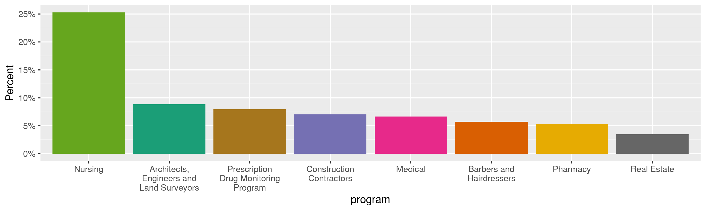
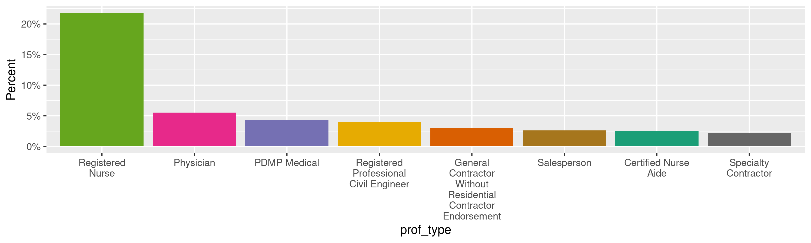
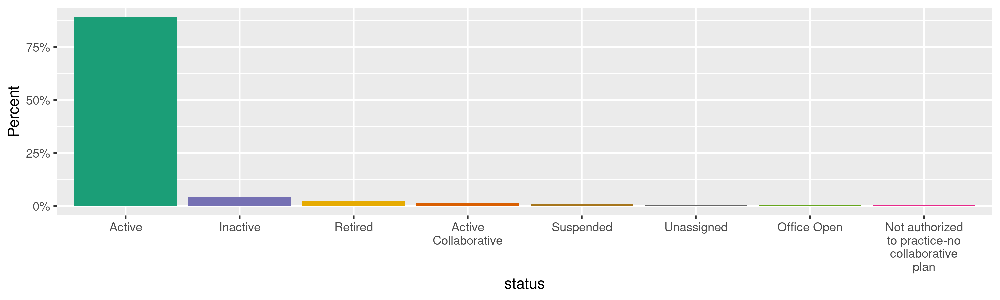
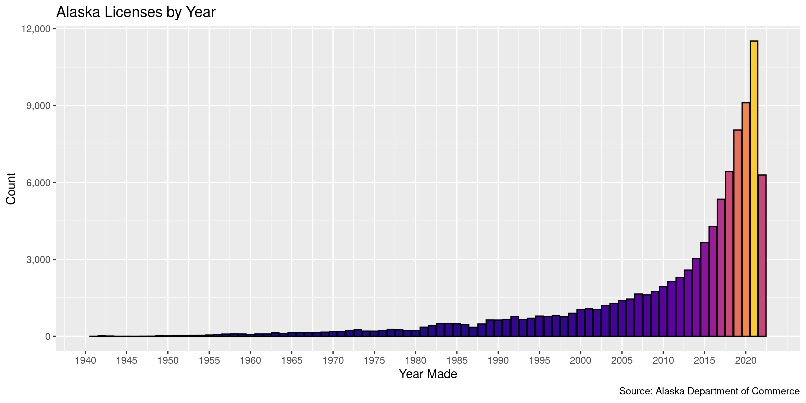
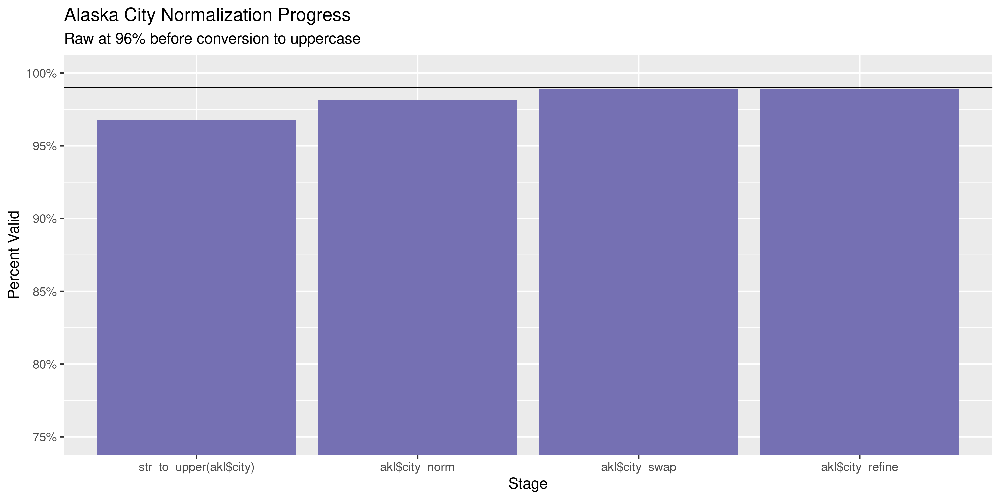
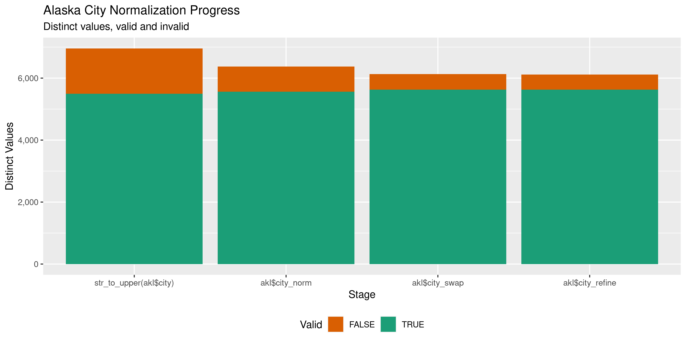

Alaska Licenses
================
Kiernan Nicholls
Fri Jun 24 13:15:30 2022

-   <a href="#project" id="toc-project">Project</a>
-   <a href="#objectives" id="toc-objectives">Objectives</a>
-   <a href="#packages" id="toc-packages">Packages</a>
-   <a href="#source" id="toc-source">Source</a>
    -   <a href="#disclaimer" id="toc-disclaimer">Disclaimer</a>
-   <a href="#download" id="toc-download">Download</a>
-   <a href="#read" id="toc-read">Read</a>
-   <a href="#explore" id="toc-explore">Explore</a>
    -   <a href="#missing" id="toc-missing">Missing</a>
    -   <a href="#duplicates" id="toc-duplicates">Duplicates</a>
    -   <a href="#categorical" id="toc-categorical">Categorical</a>
    -   <a href="#dates" id="toc-dates">Dates</a>
-   <a href="#wrangle" id="toc-wrangle">Wrangle</a>
    -   <a href="#address" id="toc-address">Address</a>
    -   <a href="#zip" id="toc-zip">ZIP</a>
    -   <a href="#state" id="toc-state">State</a>
    -   <a href="#city" id="toc-city">City</a>
-   <a href="#conclude" id="toc-conclude">Conclude</a>
-   <a href="#export" id="toc-export">Export</a>
-   <a href="#upload" id="toc-upload">Upload</a>

<!-- Place comments regarding knitting here -->

## Project

The Accountability Project is an effort to cut across data silos and
give journalists, policy professionals, activists, and the public at
large a simple way to search across huge volumes of public data about
people and organizations.

Our goal is to standardize public data on a few key fields by thinking
of each dataset row as a transaction. For each transaction there should
be (at least) 3 variables:

1.  All **parties** to a transaction.
2.  The **date** of the transaction.
3.  The **amount** of money involved.

## Objectives

This document describes the process used to complete the following
objectives:

1.  How many records are in the database?
2.  Check for entirely duplicated records.
3.  Check ranges of continuous variables.
4.  Is there anything blank or missing?
5.  Check for consistency issues.
6.  Create a five-digit ZIP Code called `zip`.
7.  Create a `year` field from the transaction date.
8.  Make sure there is data on both parties to a transaction.

## Packages

The following packages are needed to collect, manipulate, visualize,
analyze, and communicate these results. The `pacman` package will
facilitate their installation and attachment.

``` r
if (!require("pacman")) {
  install.packages("pacman")
}
pacman::p_load(
  tidyverse, # data manipulation
  lubridate, # datetime strings
  gluedown, # printing markdown
  janitor, # clean data frames
  campfin, # custom irw tools
  aws.s3, # aws cloud storage
  refinr, # cluster & merge
  scales, # format strings
  knitr, # knit documents
  rvest, # scrape html
  glue, # code strings
  here, # project paths
  httr, # http requests
  fs # local storage 
)
```

This diary was run using `campfin` version 1.0.8.9300.

``` r
packageVersion("campfin")
#> [1] '1.0.8.9300'
```

This document should be run as part of the `R_tap` project, which lives
as a sub-directory of the more general, language-agnostic
[`irworkshop/accountability_datacleaning`](https://github.com/irworkshop/accountability_datacleaning)
GitHub repository.

The `R_tap` project uses the [RStudio
projects](https://support.rstudio.com/hc/en-us/articles/200526207-Using-Projects)
feature and should be run as such. The project also uses the dynamic
`here::here()` tool for file paths relative to *your* machine.

``` r
# where does this document knit?
here::i_am("state/ak/licenses/docs/ak_licenses_diary.Rmd")
```

## Source

Professional licenses are available from the Alaska Department of
Commerce, Community, and Economic Development which provides \[direct
downloads\]\[dd\] to listings of Corporations, Business & Professional
Licensing.

> The Division of Corporations, Business and Professional Licensing
> provides access to thousands of license records online as a service to
> the public. Use the links below to search specific license types,
> including corporations, business licenses, endorsements, and
> professional licenses.

### Disclaimer

> The Division has attempted to insure that the information contained in
> these electronic documents is as accurate as possible. Only authorized
> staff from the Division of Corporations, Business and Professional
> Licensing has access to modify the data provided.
>
> For individuals who have had a licensing action, a notation should be
> reflected on their website record as “This license has been the
> subject of a formal agreement, order or disciplinary action. Contact
> the Division for more information.” The Division makes no guarantee
> that such action will appear on this website and further, we make no
> warranty or guarantee of the accuracy or reliability of the content of
> this website or the content of any other website to which it may link.
>
> Assessing the accuracy and reliability of the information obtained
> from this website is solely the responsibility of the user. The
> Division shall not be responsible or liable for any errors contained
> herein or for any damages resulting from the use of the information
> contained herein.

## Download

> The Division also allows for full downloads of our corporations,
> business, and professional licensing databases in .CSV format. Select
> one of the links below to download an Excel spreadsheet of all
> licenses on record with the state. Please note that these downloads
> may require some manipulation and further investigation via NAICS
> code, Entity Type, zip code, dates, etc., in order to properly
> organize the data provided.

``` r
raw_url <- "https://www.commerce.alaska.gov/cbp/DBDownloads/ProfessionalLicenseDownload.CSV"
raw_dir <- dir_create(here("state", "ak", "licenses", "data", "raw"))
raw_csv <- path(raw_dir, basename(raw_url))
```

``` r
if (!file_exists(raw_csv)) {
  download.file(raw_url, raw_csv)
}
```

## Read

``` r
akl <- read_delim(
  file = raw_csv,
  delim = ",",
  locale = locale(date_format = "%m/%d/%Y"),
  escape_backslash = FALSE,
  escape_double = FALSE,
  col_types = cols(
    .default = col_character()
    # DateEffective = col_date(),
    # DateExpired = col_date(),
  )
)
```

``` r
sub_date <- function(x) {
  readr::parse_date(
    x = stringr::str_remove(x, "\\s.*$"),
    format = "%m/%d/%Y"
  )
}
```

``` r
akl <- akl %>% 
  clean_names(case = "snake") %>% 
  mutate(across(starts_with("date_"), sub_date))
```

## Explore

There are 96,573 rows of 14 columns. Each record represents a single
professional license issued to a business in Alaska.

``` r
glimpse(akl)
#> Rows: 96,573
#> Columns: 14
#> $ program        <chr> "Collection Agencies", "Collection Agencies", "Collection Agencies", "Collection Agencies", "Co…
#> $ prof_type      <chr> "Collection Agency", "Collection Agency", "Collection Agency", "Collection Agency", "Collection…
#> $ license_num    <chr> "COAA282", "COAA306", "COAA321", "COAA336", "COAA346", "COAA404", "COAA462", "COAA575", "COAA59…
#> $ dba            <chr> "ALLIED INTERNATIONAL CREDIT CORP. (U.S.)", "ALLIANCEONE RECEIVABLES MANAGEMENT", "NATIONWIDE R…
#> $ owners         <chr> "ALLIED INTERNATIONAL CREDIT CORP. (U.S.)", "ALLIANCEONE RECEIVABLES MANAGEMENT, INC.", "NATION…
#> $ status         <chr> "Active", "Active", "Active", "Active", "Active", "Active", "Active", "Active", "Active", "Acti…
#> $ date_issued    <date> 2001-05-30, 2002-01-23, 2002-09-12, 2003-05-27, 2003-12-08, 2006-04-20, 2009-06-04, 2013-10-16…
#> $ date_effective <date> 2022-06-22, 2022-06-15, 2022-06-14, 2022-06-23, 2022-06-06, 2022-05-03, 2020-05-06, 2022-06-08…
#> $ date_expired   <date> 2024-06-30, 2024-06-30, 2024-06-30, 2024-06-30, 2024-06-30, 2024-06-30, 2022-06-30, 2024-06-30…
#> $ address1       <chr> "6800 PARAGON PLACE #400", "3043 WALTON ROAD, SUITE 201", "501 SHELLEY DRIVE, SUITE 300", "P O …
#> $ address2       <chr> NA, NA, NA, NA, NA, NA, NA, NA, NA, NA, NA, "9078 STATE ROAD 84", NA, "214 EXPO CIRCLE, SUITE 7…
#> $ city           <chr> "RICHMOND", "PLYMOUTH MEETING", "TYLER", "TUPELO", "LAKE FOREST", "MISSION", "MARSHFIELD", "NOR…
#> $ state          <chr> "VA", "PA", "TX", "MS", "CA", "KS", "WI", "IL", "KY", "AK", "AK", "FL", NA, "CA", "WA", "AK", "…
#> $ zip            <chr> "23230", "19462", "75701", "38803", "92630", "66202", "54449", "60062", "40224", "99501", "9960…
tail(akl)
#> # A tibble: 6 × 14
#>   program      prof_type license_num dba   owners status date_issued date_effective date_expired address1 address2 city 
#>   <chr>        <chr>     <chr>       <chr> <chr>  <chr>  <date>      <date>         <date>       <chr>    <chr>    <chr>
#> 1 Dental       Dentist … DENG17      <NA>  ROBER… Active 1991-08-07  2021-04-30     2023-02-28   W801 5T… <NA>     SPOK…
#> 2 Speech-Lang… Speech-L… SLPS521     <NA>  AMY A… Active 2014-09-19  2020-09-03     2022-09-30   2863 RE… <NA>     ANCH…
#> 3 Pharmacy     Pharmaci… 104257      <NA>  MICHE… Active 2016-01-27  2020-07-21     2022-09-30   4 OAK M… <NA>     LEIC…
#> 4 Nursing      Advanced… 183265      <NA>  Eliza… Active 2022-02-23  2022-02-23     2022-11-30   1319 SE… UNIT B   PORT…
#> 5 Real Estate  Salesper… 187097      <NA>  JULIA… Active 2021-12-18  2021-12-18     2024-01-31   12248 V… <NA>     EAGL…
#> 6 Nursing      Register… 193626      <NA>  Annie… Active 2022-06-15  2022-06-15     2022-11-30   10820 H… <NA>     EAGL…
#> # … with 2 more variables: state <chr>, zip <chr>
```

### Missing

Columns vary in their degree of missing values.

``` r
col_stats(akl, count_na)
#> # A tibble: 14 × 4
#>    col            class      n       p
#>    <chr>          <chr>  <int>   <dbl>
#>  1 program        <chr>      0 0      
#>  2 prof_type      <chr>      0 0      
#>  3 license_num    <chr>      0 0      
#>  4 dba            <chr>  84915 0.879  
#>  5 owners         <chr>   1478 0.0153 
#>  6 status         <chr>      0 0      
#>  7 date_issued    <date>   704 0.00729
#>  8 date_effective <date>  2033 0.0211 
#>  9 date_expired   <date>  7896 0.0818 
#> 10 address1       <chr>   3502 0.0363 
#> 11 address2       <chr>  86714 0.898  
#> 12 city           <chr>   3502 0.0363 
#> 13 state          <chr>   3791 0.0393 
#> 14 zip            <chr>   3791 0.0393
```

We can flag any record missing a key variable needed to identify a
transaction.

``` r
key_vars <- c("owners", "date_issued", "date_effective")
akl <- flag_na(akl, owners)
sum(akl$na_flag)
#> [1] 1478
```

``` r
akl %>% 
  filter(na_flag) %>% 
  select(all_of(key_vars))
#> # A tibble: 1,478 × 3
#>    owners date_issued date_effective
#>    <chr>  <date>      <date>        
#>  1 <NA>   1976-06-14  NA            
#>  2 <NA>   1993-08-18  2018-02-05    
#>  3 <NA>   1978-11-16  2020-04-30    
#>  4 <NA>   1979-09-11  2020-10-05    
#>  5 <NA>   1981-05-29  NA            
#>  6 <NA>   1985-03-20  2015-08-28    
#>  7 <NA>   1990-06-12  2015-12-18    
#>  8 <NA>   1996-02-07  2022-01-31    
#>  9 <NA>   2000-05-30  2020-01-24    
#> 10 <NA>   2017-06-19  2020-10-02    
#> # … with 1,468 more rows
```

### Duplicates

We can also flag any record completely duplicated across every column.

``` r
akl <- flag_dupes(akl, -license_num)
sum(akl$dupe_flag)
#> [1] 373
```

``` r
akl %>% 
  filter(dupe_flag) %>% 
  select(license_num, address1, all_of(key_vars)) %>% 
  arrange(date_issued)
#> # A tibble: 373 × 5
#>    license_num address1         owners                                 date_issued date_effective
#>    <chr>       <chr>            <chr>                                  <date>      <date>        
#>  1 COLPA4746   <NA>             <NA>                                   2003-10-29  2020-12-24    
#>  2 COLPA4730   <NA>             <NA>                                   2003-10-29  2020-12-24    
#>  3 COLPA13960  <NA>             <NA>                                   2012-05-23  2012-05-23    
#>  4 COLPA13958  <NA>             <NA>                                   2012-05-23  2012-05-23    
#>  5 HADP19009   1148 HESS AVENUE Body Piercing Unlimited & Tattoo, Inc. 2013-09-11  2021-08-24    
#>  6 HADP19012   1148 HESS AVENUE Body Piercing Unlimited & Tattoo, Inc. 2013-09-11  2021-08-24    
#>  7 HADP19010   1148 HESS AVENUE Body Piercing Unlimited & Tattoo, Inc. 2013-09-11  2021-08-24    
#>  8 COLPA14513  <NA>             <NA>                                   2014-08-26  2014-08-26    
#>  9 102617      <NA>             <NA>                                   2014-08-26  2014-08-26    
#> 10 110278      <NA>             <NA>                                   2016-04-06  2020-12-23    
#> # … with 363 more rows
```

Many “duplicates” are just missing identifying data.

``` r
akl %>% 
  filter(dupe_flag) %>% 
  col_stats(count_na)
#> # A tibble: 16 × 4
#>    col            class      n     p
#>    <chr>          <chr>  <int> <dbl>
#>  1 program        <chr>      0 0    
#>  2 prof_type      <chr>      0 0    
#>  3 license_num    <chr>      0 0    
#>  4 dba            <chr>    309 0.828
#>  5 owners         <chr>    285 0.764
#>  6 status         <chr>      0 0    
#>  7 date_issued    <date>    85 0.228
#>  8 date_effective <date>     0 0    
#>  9 date_expired   <date>    74 0.198
#> 10 address1       <chr>    273 0.732
#> 11 address2       <chr>    327 0.877
#> 12 city           <chr>    273 0.732
#> 13 state          <chr>    273 0.732
#> 14 zip            <chr>    273 0.732
#> 15 na_flag        <lgl>      0 0    
#> 16 dupe_flag      <lgl>      0 0
```

### Categorical

``` r
col_stats(akl, n_distinct)
#> # A tibble: 16 × 4
#>    col            class      n         p
#>    <chr>          <chr>  <int>     <dbl>
#>  1 program        <chr>     55 0.000570 
#>  2 prof_type      <chr>    211 0.00218  
#>  3 license_num    <chr>  96573 1        
#>  4 dba            <chr>  11235 0.116    
#>  5 owners         <chr>  81020 0.839    
#>  6 status         <chr>     11 0.000114 
#>  7 date_issued    <date> 11518 0.119    
#>  8 date_effective <date>  4266 0.0442   
#>  9 date_expired   <date>  1014 0.0105   
#> 10 address1       <chr>  75140 0.778    
#> 11 address2       <chr>   5397 0.0559   
#> 12 city           <chr>   6959 0.0721   
#> 13 state          <chr>     72 0.000746 
#> 14 zip            <chr>  10723 0.111    
#> 15 na_flag        <lgl>      2 0.0000207
#> 16 dupe_flag      <lgl>      2 0.0000207
```

<!-- --><!-- --><!-- -->

### Dates

We can add the calendar year from `date` with `lubridate::year()`

``` r
akl <- mutate(akl, year_issued = year(date_issued))
```

``` r
min(akl$date_issued, na.rm = TRUE)
#> [1] "1941-03-28"
sum(akl$year_issued < 2000, na.rm = TRUE)
#> [1] 15749
max(akl$date_issued, na.rm = TRUE)
#> [1] "2022-12-31"
sum(akl$date_issued > today(), na.rm = TRUE)
#> [1] 42
```

It’s common to see an increase in the number of contributins in
elections years.

<!-- -->

## Wrangle

To improve the searchability of the database, we will perform some
consistent, confident string normalization. For geographic variables
like city names and ZIP codes, the corresponding `campfin::normal_*()`
functions are tailor made to facilitate this process.

### Address

For the street `addresss` variable, the `campfin::normal_address()`
function will force consistence case, remove punctuation, and abbreviate
official USPS suffixes.

``` r
addr_norm <- akl %>% 
  distinct(address1, address2) %>%  
  separate(
    col = address1,
    into = c("split_addr1", "split_addr2"),
    sep = ",\\s",
    extra = "merge",
    fill = "right",
    remove = FALSE
  ) %>% 
  mutate(
    norm_address1 = normal_address(
      address = split_addr1,
      abbs = usps_street,
      na_rep = TRUE
    ),
    norm_address3 = normal_address(
      address = split_addr2,
      abbs = usps_street,
      na_rep = TRUE,
      abb_end = FALSE
    ),
    norm_address2 = normal_address(
      address = address2,
      abbs = usps_street,
      na_rep = TRUE
    )
  ) %>% 
  unite(
    col = address_norm,
    starts_with("norm_address"),
    sep = " ",
    remove = TRUE,
    na.rm = TRUE
  ) %>% 
  select(-starts_with("split_addr"))
```

``` r
addr_norm
#> # A tibble: 76,679 × 3
#>    address1                     address2 address_norm           
#>    <chr>                        <chr>    <chr>                  
#>  1 6800 PARAGON PLACE #400      <NA>     6800 PARAGON PLACE #400
#>  2 3043 WALTON ROAD, SUITE 201  <NA>     3043 WALTON RD STE 201 
#>  3 501 SHELLEY DRIVE, SUITE 300 <NA>     501 SHELLEY DR STE 300 
#>  4 P O BOX 3910                 <NA>     P O BOX 3910           
#>  5 14 ORCHARD RD STE 100        <NA>     14 ORCHARD RD STE 100  
#>  6 6000 MARTWAY ST              <NA>     6000 MARTWAY ST        
#>  7 PO BOX 1267                  <NA>     PO BOX 1267            
#>  8 650 DUNDEE RD STE 370        <NA>     650 DUNDEE RD STE 370  
#>  9 PO BOX 24266                 <NA>     PO BOX 24266           
#> 10 629 L ST, SUITE 201          <NA>     629 L ST STE 201       
#> # … with 76,669 more rows
```

``` r
akl <- left_join(akl, addr_norm, by = c("address1", "address2"))
```

### ZIP

All unknown `zip` values belong to out-of-country locations.

``` r
prop_in(akl$zip, valid_zip)
#> [1] 0.996163
```

``` r
akl %>% 
  filter(zip %out% valid_zip) %>% 
  count(state, sort = TRUE)
#> # A tibble: 36 × 2
#>    state     n
#>    <chr> <int>
#>  1 <NA>   3791
#>  2 BC       97
#>  3 ON       44
#>  4 AB       27
#>  5 AK       27
#>  6 OR       26
#>  7 OH       20
#>  8 AZ       14
#>  9 UT       14
#> 10 WA       14
#> # … with 26 more rows
```

### State

Like we know from the `zip` values, the unknown states are from Canada.

``` r
prop_in(akl$state, valid_state)
#> [1] 0.997963
```

### City

Cities are the most difficult geographic variable to normalize, simply
due to the wide variety of valid cities and formats.

#### Normal

The `campfin::normal_city()` function is a good start, again converting
case, removing punctuation, but *expanding* USPS abbreviations. We can
also remove `invalid_city` values.

``` r
norm_city <- akl %>% 
  distinct(city, state, zip) %>% 
  mutate(
    city_norm = normal_city(
      city = city, 
      abbs = usps_city,
      states = c("AK", "DC", "ALASKA"),
      na = invalid_city,
      na_rep = TRUE
    )
  )
```

#### Swap

We can further improve normalization by comparing our normalized value
against the *expected* value for that record’s state abbreviation and
ZIP code. If the normalized value is either an abbreviation for or very
similar to the expected value, we can confidently swap those two.

``` r
norm_city <- norm_city %>% 
  rename(city_raw = city) %>% 
  left_join(
    y = zipcodes,
    by = c(
      "state" = "state",
      "zip" = "zip"
    )
  ) %>% 
  rename(city_match = city) %>% 
  mutate(
    match_abb = is_abbrev(city_norm, city_match),
    match_dist = str_dist(city_norm, city_match),
    city_swap = if_else(
      condition = !is.na(match_dist) & (match_abb | match_dist == 1),
      true = city_match,
      false = city_norm
    )
  ) %>% 
  select(
    -city_match,
    -match_dist,
    -match_abb
  )
```

``` r
akl <- left_join(
  x = akl,
  y = norm_city,
  by = c(
    "city" = "city_raw", 
    "state", 
    "zip"
  )
)
```

#### Refine

The [OpenRefine](https://openrefine.org/) algorithms can be used to
group similar strings and replace the less common versions with their
most common counterpart. This can greatly reduce inconsistency, but with
low confidence; we will only keep any refined strings that have a valid
city/state/zip combination.

``` r
good_refine <- akl %>% 
  mutate(
    city_refine = city_swap %>% 
      key_collision_merge() %>% 
      n_gram_merge(numgram = 1)
  ) %>% 
  filter(city_refine != city_swap) %>% 
  inner_join(
    y = zipcodes,
    by = c(
      "city_refine" = "city",
      "state" = "state",
      "zip" = "zip"
    )
  )
```

    #> # A tibble: 12 × 5
    #>    state zip   city_swap        city_refine       n
    #>    <chr> <chr> <chr>            <chr>         <int>
    #>  1 AK    99835 SITKA AK         SITKA             1
    #>  2 AK    99901 KETCHIKAN AK     KETCHIKAN         1
    #>  3 AP    96326 APO AP           APO               1
    #>  4 CA    92058 OCEANSIDE CA     OCEANSIDE         1
    #>  5 CO    80521 FORT COLLINS C   FORT COLLINS      1
    #>  6 GA    30043 LAWENRENCEVILLE  LAWRENCEVILLE     1
    #>  7 ID    83815 COUER DALENE     COEUR D ALENE     1
    #>  8 MD    20650 LEANORDTOWN      LEONARDTOWN       1
    #>  9 MN    55344 EDEN PRIAIRE     EDEN PRAIRIE      1
    #> 10 MO    64158 KANASA CITY      KANSAS CITY       1
    #> 11 NV    89410 GARDENVILLE      GARDNERVILLE      1
    #> 12 SC    29406 NORTH CHARLESTON CHARLESTON        1

Then we can join the refined values back to the database.

``` r
akl <- akl %>% 
  left_join(good_refine, by = names(.)) %>% 
  mutate(city_refine = coalesce(city_refine, city_swap))
```

#### Progress

Our goal for normalization was to increase the proportion of city values
known to be valid and reduce the total distinct values by correcting
misspellings.

| stage                    | prop_in | n_distinct | prop_na | n_out | n_diff |
|:-------------------------|--------:|-----------:|--------:|------:|-------:|
| `str_to_upper(akl$city)` |   0.968 |       6959 |   0.036 |  3010 |   1463 |
| `akl$city_norm`          |   0.981 |       6376 |   0.036 |  1736 |    814 |
| `akl$city_swap`          |   0.989 |       6128 |   0.036 |  1029 |    497 |
| `akl$city_refine`        |   0.989 |       6117 |   0.036 |  1019 |    487 |

You can see how the percentage of valid values increased with each
stage.

<!-- -->

More importantly, the number of distinct values decreased each stage. We
were able to confidently change many distinct invalid values to their
valid equivalent.

<!-- -->

Before exporting, we can remove the intermediary normalization columns
and rename all added variables with the `_clean` suffix.

``` r
akl <- akl %>% 
  select(
    -city_norm,
    -city_swap,
    city_clean = city_refine
  ) %>% 
  rename_all(~str_replace(., "_norm", "_clean")) %>% 
  rename_all(~str_remove(., "_raw")) %>% 
  relocate(address_clean, city_clean, .before = last_col())
```

## Conclude

``` r
glimpse(sample_n(akl, 1000))
#> Rows: 1,000
#> Columns: 19
#> $ program        <chr> "Veterinary", "Big Game Guides and Transporters", "Collaborative Plan", "Residential Contractor…
#> $ prof_type      <chr> "Veterinarian", "Master Guide-Outfitter", "Collaborative Plan Agreement", "Residential Contract…
#> $ license_num    <chr> "167537", "GUIM88", "147918", "RESR2582", "PSYP576", "130839", "132443", "AELC6832", "109776", …
#> $ dba            <chr> NA, NA, NA, NA, NA, NA, NA, NA, NA, NA, NA, NA, NA, "MILDBRAND WOOD & TILE", NA, NA, "TODD REAL…
#> $ owners         <chr> "Mackenzie Hellert", "JAMES BAILEY", NA, "BENJAMIN MILLER", "CHRISTOPHER FRACZEK", "LISA CORTEZ…
#> $ status         <chr> "Active", "Active", "Active Collaborative", "Active", "Active", "Active", "Active", "Active", "…
#> $ date_issued    <date> 2020-11-23, 1995-07-27, 2019-06-14, 2013-02-21, 2007-08-24, 2020-10-14, 2018-04-19, 1985-05-07…
#> $ date_effective <date> 2020-11-23, 2021-11-17, 2019-05-21, 2021-01-13, 2021-06-28, 2021-12-16, 2020-11-11, 2021-12-20…
#> $ date_expired   <date> 2022-12-31, 2023-12-31, 2020-12-31, 2022-12-31, 2023-06-30, 2023-12-31, 2022-11-30, 2023-12-31…
#> $ address1       <chr> "17336 WILDCAT HOLLOW", "P.O. BOX 770695", NA, "1185 N OLD GLENN HWY", "19315 SE 31ST DR", "134…
#> $ address2       <chr> NA, NA, NA, NA, NA, NA, NA, NA, NA, NA, NA, NA, NA, NA, NA, "STE B", NA, NA, NA, NA, "PMB 309",…
#> $ city           <chr> "DUBUQUE", "EAGLE RIVER", NA, "PALMER", "CAMAS", "OAK RIDGE", "BETHEL ", "BELLINGHAM", "ANCHORA…
#> $ state          <chr> "IA", "AK", NA, "AK", "WA", "TN", "AK", "WA", "AK", "AK", "AK", "AK", "AK", "AK", "TX", "AK", "…
#> $ zip            <chr> "52002", "99577", NA, "99645", "98607", "37830", "99559", "98229", "99516", "99623", "99501", "…
#> $ na_flag        <lgl> FALSE, FALSE, TRUE, FALSE, FALSE, FALSE, FALSE, FALSE, FALSE, FALSE, FALSE, FALSE, FALSE, FALSE…
#> $ dupe_flag      <lgl> FALSE, FALSE, FALSE, FALSE, FALSE, FALSE, FALSE, FALSE, FALSE, FALSE, FALSE, FALSE, FALSE, FALS…
#> $ year_issued    <dbl> 2020, 1995, 2019, 2013, 2007, 2020, 2018, 1985, 2015, 2015, 2016, 2017, 1979, 1994, 2017, 2008,…
#> $ address_clean  <chr> "17336 WILDCAT HOLW", "PO BOX 770695", "", "1185 N OLD GLENN HWY", "19315 SE 31ST DR", "134 WAI…
#> $ city_clean     <chr> "DUBUQUE", "EAGLE RIVER", NA, "PALMER", "CAMAS", "OAK RIDGE", "BETHEL", "BELLINGHAM", "ANCHORAG…
```

1.  There are 96,573 records in the database.
2.  There are 373 duplicate records in the database.
3.  The range and distribution of `amount` and `date` seem reasonable.
4.  There are 1,478 records missing key variables.
5.  Consistency in geographic data has been improved with
    `campfin::normal_*()`.
6.  The 4-digit `year` variable has been created with
    `lubridate::year()`.

## Export

Now the file can be saved on disk for upload to the Accountability
server. We will name the object using a date range of the records
included.

``` r
clean_dir <- dir_create(here("state", "ak", "licenses", "data", "clean"))
clean_ts <- str_remove_all(Sys.Date(), '-')
clean_csv <- path(clean_dir, glue("ak_licenses_{clean_ts}.csv"))
clean_rds <- path_ext_set(clean_csv, "rds")
basename(clean_csv)
#> [1] "ak_licenses_20220624.csv"
```

``` r
write_csv(akl, clean_csv, na = "")
write_rds(akl, clean_rds, compress = "xz")
(clean_size <- file_size(clean_csv))
#> 17.8M
```

## Upload

We can use the `aws.s3::put_object()` to upload the text file to the IRW
server.

``` r
aws_key <- path("csv", basename(clean_csv))
if (!object_exists(aws_key, "publicaccountability")) {
  put_object(
    file = clean_csv,
    object = aws_key, 
    bucket = "publicaccountability",
    acl = "public-read",
    show_progress = TRUE,
    multipart = TRUE
  )
}
aws_head <- head_object(aws_key, "publicaccountability")
(aws_size <- as_fs_bytes(attr(aws_head, "content-length")))
unname(aws_size == clean_size)
```
