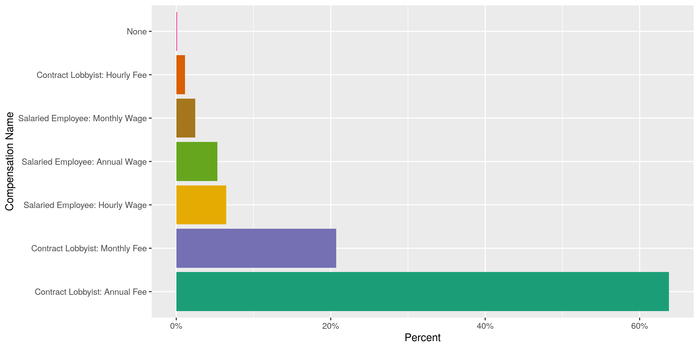
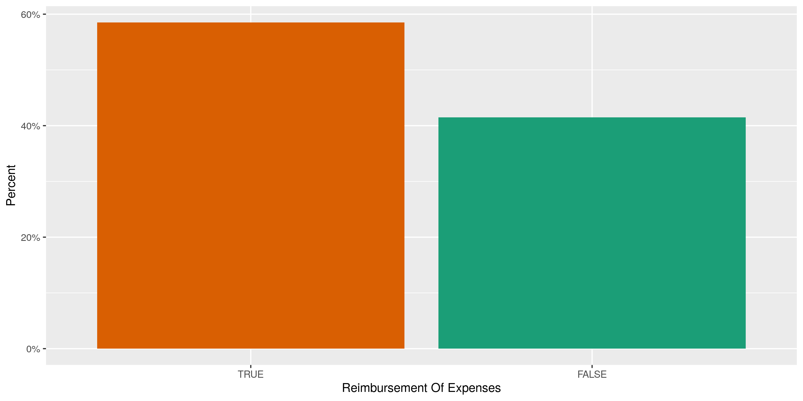
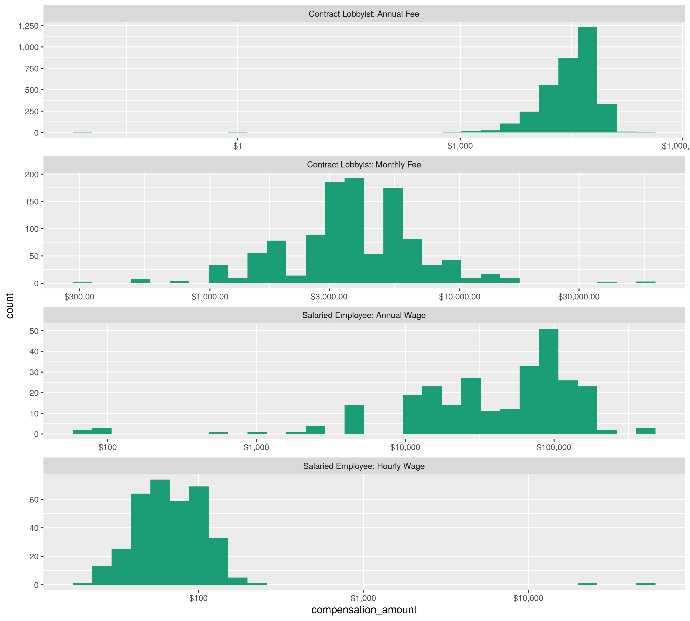
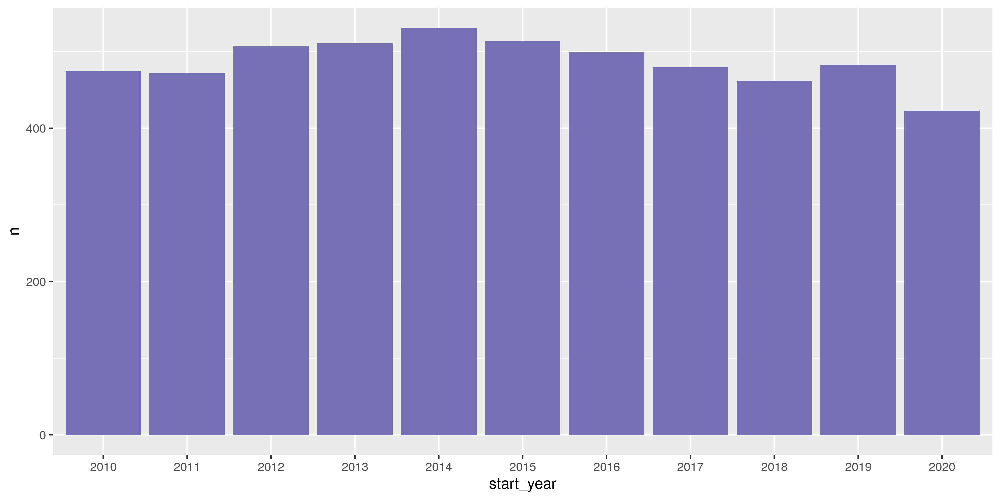

Alaksa Lobbyists
================
Kiernan Nicholls & Yanqi Xu
2023-03-17 23:57:50

- <a href="#project" id="toc-project">Project</a>
- <a href="#objectives" id="toc-objectives">Objectives</a>
- <a href="#packages" id="toc-packages">Packages</a>
- <a href="#data" id="toc-data">Data</a>
- <a href="#import" id="toc-import">Import</a>
- <a href="#explore" id="toc-explore">Explore</a>
  - <a href="#missing" id="toc-missing">Missing</a>
  - <a href="#duplicate" id="toc-duplicate">Duplicate</a>
  - <a href="#categorical" id="toc-categorical">Categorical</a>
  - <a href="#continuous" id="toc-continuous">Continuous</a>
  - <a href="#amounts" id="toc-amounts">Amounts</a>
  - <a href="#dates" id="toc-dates">Dates</a>
- <a href="#wrangle" id="toc-wrangle">Wrangle</a>
  - <a href="#address" id="toc-address">Address</a>
  - <a href="#zip" id="toc-zip">ZIP</a>
  - <a href="#state" id="toc-state">State</a>
  - <a href="#city" id="toc-city">City</a>
- <a href="#export" id="toc-export">Export</a>

<!-- Place comments regarding knitting here -->

## Project

The Accountability Project is an effort to cut across data silos and
give journalists, policy professionals, activists, and the public at
large a simple way to search across huge volumes of public data about
people and organizations.

Our goal is to standardizing public data on a few key fields by thinking
of each dataset row as a transaction. For each transaction there should
be (at least) 3 variables:

1.  All **parties** to a transaction
2.  The **date** of the transaction
3.  The **amount** of money involved

## Objectives

This document describes the process used to complete the following
objectives:

1.  How many records are in the database?
2.  Check for duplicates
3.  Check ranges
4.  Is there anything blank or missing?
5.  Check for consistency issues
6.  Create a five-digit ZIP Code called `ZIP5`
7.  Create a `YEAR` field from the transaction date
8.  Make sure there is data on both parties to a transaction

## Packages

The following packages are needed to collect, manipulate, visualize,
analyze, and communicate these results. The `pacman` package will
facilitate their installation and attachment.

The IRW’s `campfin` package will also have to be installed from GitHub.
This package contains functions custom made to help facilitate the
processing of campaign finance data.

``` r
if (!require("pacman")) install.packages("pacman")
pacman::p_load_gh("irworkshop/campfin")
pacman::p_load(
  tidyverse, # data manipulation
  lubridate, # datetime strings
  magrittr, # pipe opperators
  janitor, # dataframe clean
  refinr, # cluster and merge
  scales, # format strings
  knitr, # knit documents
  vroom, # read files fast
  glue, # combine strings
  here, # relative storage
  httr, # http queries
  fs # search storage 
)
```

This document should be run as part of the `R_campfin` project, which
lives as a sub-directory of the more general, language-agnostic
[`irworkshop/accountability_datacleaning`](https://github.com/irworkshop/accountability_datacleaning "TAP repo")
GitHub repository.

The `R_campfin` project uses the [RStudio
projects](https://support.rstudio.com/hc/en-us/articles/200526207-Using-Projects "Rproj")
feature and should be run as such. The project also uses the dynamic
`here::here()` tool for file paths relative to *your* machine.

``` r
# where does this document knit?
here::here()
#> [1] "/Users/yanqixu/code/accountability_datacleaning"
```

## Data

Data is obtained from the [Alaska Public Offices
Commission](http://doa.alaska.gov/apoc/home.html) (APOC). The dataset was downloaded on March 17, 2023.

> #### Mission
>
> To encourage the public’s confidence in their elected and appointed
> officials by administering Alaska’s disclosure statutes and publishing
> financial information regarding the activities of election campaigns,
> public officials, lobbyists and lobbyist employers.

On the APOC home page, we can see that lobbying disclosure data can be
searched.

> #### [Lobbying Disclosure](https://aws.state.ak.us/ApocReports/Lobbying/)
>
> Search reports from Lobbyists and Employers of Lobbyists.

## Import

From the APOC website, we can query the database for any year and
download the data locally.

``` r
raw_dir <- here("state","ak", "lobby", "data", "raw")
dir_create(raw_dir)
```

We could also attemp this with `httr::GET()` (but not now).

``` r
response <- GET(
  url = "https://aws.state.ak.us/ApocReports/Lobbying/LORForms.aspx", 
  query = list(
    exportAll = "True", 
    exportFormat = "CSV", 
    isExport = "True"
  )
)
aklr <- content(response)
```

``` r
raw_file <- dir_ls(raw_dir)
length(raw_file) == 1
#> [1] TRUE
```

The raw file can be read using `vroom::vroom()`.

``` r
aklr <- vroom(
  file = raw_file,
  delim = ",",
  escape_backslash = FALSE,
  escape_double = FALSE,
  guess_max = 0,
  num_threads = 1,
  col_types = cols(
    .default = col_character(),
    Result = col_double(),
    `Report Year` = col_integer(),
    Submitted = col_date_mdy(),
    `Other Services Performed` = col_logical(),
    `Administrative Lobbying` = col_logical(),
    `Legislative Lobbying` = col_logical(),
    `Start Date` = col_date_mdy(),
    `Compensation Amount` = col_double(),
    `Reimbursement Of Expenses` = col_logical(),
    `Other Compensation` = col_logical(),
    `Not Qualified As Lobbyist` = col_logical(),
    `Date Qualified As Lobbyist` = col_date_mdy()
  )
)
```

We know the file properly read as the number of rows is equal to the
number of distinct `report` values, a unique row number variable.

``` r
n_distinct(aklr$result) == nrow(aklr)
#> [1] FALSE
```

``` r
aklr <- aklr %>% 
  clean_names("snake") %>% 
  remove_empty("cols") %>% 
  remove_empty("rows") %>%
  filter(!is.na(result))
```

``` r
n_distinct(aklr$result) == nrow(aklr)
#> [1] TRUE
```

## Explore

``` r
head(aklr)
#> # A tibble: 6 × 50
#>   result report_year submitted  status amending first…¹ last_…² middl…³ address city  state…⁴ zip  
#>    <dbl>       <int> <date>     <chr>  <chr>    <chr>   <chr>   <chr>   <chr>   <chr> <chr>   <chr>
#> 1      1        2023 2023-01-11 Filed  <NA>     Bruce   Baker   Andrew  P.O. B… Kotz… Alaska  99752
#> 2      2        2023 2023-01-27 Filed  <NA>     Bruce   Baker   Andrew  P.O. B… Kotz… Alaska  99752
#> 3      3        2023 2023-01-17 Filed  <NA>     Bruce   Baker   Andrew  P.O. B… Kotz… Alaska  99752
#> 4      4        2023 2023-01-04 Filed  <NA>     Frank   Bickfo… <NA>    PO Box… Anch… Alaska  99509
#> 5      5        2023 2023-01-04 Filed  <NA>     Frank   Bickfo… <NA>    PO Box… Anch… Alaska  99509
#> 6      6        2023 2023-01-05 Filed  <NA>     Frank   Bickfo… <NA>    PO Box… Anch… Alaska  99509
#> # … with 38 more variables: country <chr>, email <chr>, phone <chr>, fax <chr>,
#> #   legislative_address <chr>, legislative_city <chr>, legislative_state_region <chr>,
#> #   legislative_zip <chr>, legislative_country <chr>, legislative_email <chr>,
#> #   legislative_phone <chr>, legislative_fax <chr>, business_name <chr>,
#> #   voter_district_name <chr>, employer_name <chr>, employer_contact_first_name <chr>,
#> #   employer_contact_last_name <chr>, employer_contact_middle_name <chr>,
#> #   employer_contact_address <chr>, employer_contact_city <chr>, …
tail(aklr)
#> # A tibble: 6 × 50
#>   result report_year submitted  status amending first…¹ last_…² middl…³ address city  state…⁴ zip  
#>    <dbl>       <int> <date>     <chr>  <chr>    <chr>   <chr>   <chr>   <chr>   <chr> <chr>   <chr>
#> 1   6816        2010 2010-02-17 Filed  <NA>     John    Walsh   <NA>    POB 24… Doug… Alaska  99824
#> 2   6817        2010 2010-03-09 Filed  <NA>     John    Walsh   <NA>    POB 24… Doug… Alaska  99824
#> 3   6818        2010 2010-01-26 Filed  <NA>     Kathie  Wasser… <NA>    217 Se… June… Alaska  99801
#> 4   6819        2010 2010-01-14 Filed  <NA>     royce   weller  <NA>    p.o. b… doug… Alaska  99824
#> 5   6820        2010 2010-02-23 Filed  <NA>     Monte   Willia… <NA>    4020 G… Fort… Florida 33308
#> 6   6821        2010 2010-01-04 Filed  <NA>     Sheldon Winters <NA>    3000 V… June… Alaska  99801
#> # … with 38 more variables: country <chr>, email <chr>, phone <chr>, fax <chr>,
#> #   legislative_address <chr>, legislative_city <chr>, legislative_state_region <chr>,
#> #   legislative_zip <chr>, legislative_country <chr>, legislative_email <chr>,
#> #   legislative_phone <chr>, legislative_fax <chr>, business_name <chr>,
#> #   voter_district_name <chr>, employer_name <chr>, employer_contact_first_name <chr>,
#> #   employer_contact_last_name <chr>, employer_contact_middle_name <chr>,
#> #   employer_contact_address <chr>, employer_contact_city <chr>, …
glimpse(sample_frac(aklr))
#> Rows: 6,821
#> Columns: 50
#> $ result                               <dbl> 4930, 3947, 2745, 2255, 4985, 1833, 3797, 5342, 1527…
#> $ report_year                          <int> 2013, 2015, 2018, 2019, 2013, 2020, 2016, 2013, 2020…
#> $ submitted                            <date> 2013-04-09, 2015-01-22, 2018-01-25, 2019-01-07, 201…
#> $ status                               <chr> "Filed", "Filed", "Filed", "Filed", "Filed", "Filed"…
#> $ amending                             <chr> NA, NA, NA, NA, NA, NA, NA, NA, "Amendment", NA, "(A…
#> $ first_name                           <chr> "Wendy", "Robert", "Ashley", "David", "Kimberly", "J…
#> $ last_name                            <chr> "Chamberlain", "Evans", "Reed", "Parish", "Fox", "Re…
#> $ middle_name                          <chr> "Anne", NA, NA, NA, "J", NA, NA, NA, NA, NA, "Anne",…
#> $ address                              <chr> "224 4th Street", "P.O. Box 100384", "813 D Street, …
#> $ city                                 <chr> "Juneau", "Anchorage", "Anchorage", "Anchorage", "An…
#> $ state_region                         <chr> "Alaska", "Alaska", "Alaska", "Alaska", "Alaska", "A…
#> $ zip                                  <chr> "99801", "99510", "99501", "99509", "99503", "99801"…
#> $ country                              <chr> "United States", "United States", "United States", "…
#> $ email                                <chr> "wendyc@gci.net", "Robert@evans46alaska.net", "ashle…
#> $ phone                                <chr> "907-586-2565", "9073517394", "9072798008", "9075222…
#> $ fax                                  <chr> NA, NA, NA, NA, NA, NA, NA, NA, "9074633922", NA, NA…
#> $ legislative_address                  <chr> "224 4th Street", "P.O. Box 100384", "813 D Street, …
#> $ legislative_city                     <chr> "Juneau", "Anchorage", "Anchorage", "Anchorage", "An…
#> $ legislative_state_region             <chr> "Alaska", "Alaska", "Alaska", "Alaska", "Alaska", "A…
#> $ legislative_zip                      <chr> "99801", "99510", "99501", "99509", "99503", "99801"…
#> $ legislative_country                  <chr> "United States", "United States", "United States", "…
#> $ legislative_email                    <chr> "wendyc@gci.net", "Robert@evans46alaska.net", "ashle…
#> $ legislative_phone                    <chr> "907-586-2565", "9073517394", NA, "9075222600  90752…
#> $ legislative_fax                      <chr> NA, NA, NA, NA, NA, NA, NA, NA, "9074633922", NA, NA…
#> $ business_name                        <chr> "Legislative Consultants in Alaska", "Robert A. Evan…
#> $ voter_district_name                  <chr> "3B - North Pole / Badger", "21K - West Anchorage", …
#> $ employer_name                        <chr> "Alaska eHealth Network", "QUINTILLION INC", "Juneau…
#> $ employer_contact_first_name          <chr> "Rebecca", "Elizabeth", "Duff", "Millie", "Jennie Un…
#> $ employer_contact_last_name           <chr> "Madison", "Pierce", "Mitchell", "Ryan", "Skelton", …
#> $ employer_contact_middle_name         <chr> NA, NA, NA, NA, NA, "W.", NA, NA, NA, NA, "J", NA, N…
#> $ employer_contact_address             <chr> "2440 East Tudor Rd.", "201 East 56th Ave, Suite 300…
#> $ employer_contact_city                <chr> "Anchorage", "Anchorage", "Juneau", "Anchorage", "Sa…
#> $ employer_contact_state_region        <chr> "Alaska", "Alaska", "Alaska", "Alaska", "California"…
#> $ employer_contact_zip                 <chr> "99507", "99518", "99802", "99503", "94901", "94901"…
#> $ employer_contact_country             <chr> "United States", "United States", "United States", "…
#> $ employer_contact_email               <chr> "rebecca@ak-ehealth.org", "shari.showalter@quintilli…
#> $ employer_contact_phone               <chr> "9072502061", "907-230-2398", "907-789-2775", "90744…
#> $ employer_contact_fax                 <chr> NA, NA, NA, NA, NA, "4153886874", "907-591-2206", NA…
#> $ other_services_performed             <lgl> FALSE, FALSE, TRUE, FALSE, FALSE, FALSE, FALSE, FALS…
#> $ other_services_performed_description <chr> NA, NA, "consulting", NA, "Public Affairs Manager", …
#> $ administrative_lobbying              <lgl> TRUE, TRUE, TRUE, TRUE, TRUE, TRUE, TRUE, TRUE, TRUE…
#> $ legislative_lobbying                 <lgl> TRUE, TRUE, TRUE, TRUE, TRUE, TRUE, TRUE, TRUE, TRUE…
#> $ start_date                           <date> 2013-04-09, 2015-01-22, 2018-01-24, 2019-01-09, 201…
#> $ compensation_name                    <chr> "Contract Lobbyist: Annual Fee", "Contract Lobbyist:…
#> $ compensation_amount                  <dbl> 54000.00, 1500.00, 3000.00, 20000.00, 98.00, 30000.0…
#> $ reimbursement_of_expenses            <lgl> FALSE, TRUE, FALSE, TRUE, TRUE, FALSE, TRUE, TRUE, F…
#> $ other_compensation                   <lgl> FALSE, FALSE, FALSE, FALSE, FALSE, FALSE, FALSE, FAL…
#> $ other_compensation_description       <chr> NA, NA, NA, NA, NA, NA, NA, NA, NA, NA, NA, NA, NA, …
#> $ lobbying_interests_description       <chr> "All issues relating to the electronic health care s…
#> $ not_qualified_as_lobbyist            <lgl> NA, NA, NA, NA, TRUE, NA, NA, NA, NA, NA, NA, NA, NA…
```

### Missing

*Very* few records are missing some of the variables we need to identify
a lobbyist.

``` r
col_stats(aklr, count_na)
#> # A tibble: 50 × 4
#>    col                                  class      n        p
#>    <chr>                                <chr>  <int>    <dbl>
#>  1 result                               <dbl>      0 0       
#>  2 report_year                          <int>      0 0       
#>  3 submitted                            <date>     0 0       
#>  4 status                               <chr>      0 0       
#>  5 amending                             <chr>   6166 0.904   
#>  6 first_name                           <chr>      0 0       
#>  7 last_name                            <chr>      0 0       
#>  8 middle_name                          <chr>   4719 0.692   
#>  9 address                              <chr>      0 0       
#> 10 city                                 <chr>      0 0       
#> 11 state_region                         <chr>     45 0.00660 
#> 12 zip                                  <chr>      0 0       
#> 13 country                              <chr>      0 0       
#> 14 email                                <chr>      0 0       
#> 15 phone                                <chr>    322 0.0472  
#> 16 fax                                  <chr>   5187 0.760   
#> 17 legislative_address                  <chr>      0 0       
#> 18 legislative_city                     <chr>      0 0       
#> 19 legislative_state_region             <chr>     47 0.00689 
#> 20 legislative_zip                      <chr>      0 0       
#> 21 legislative_country                  <chr>      0 0       
#> 22 legislative_email                    <chr>      0 0       
#> 23 legislative_phone                    <chr>    929 0.136   
#> 24 legislative_fax                      <chr>   5235 0.767   
#> 25 business_name                        <chr>    601 0.0881  
#> 26 voter_district_name                  <chr>      0 0       
#> 27 employer_name                        <chr>      0 0       
#> 28 employer_contact_first_name          <chr>      0 0       
#> 29 employer_contact_last_name           <chr>      1 0.000147
#> 30 employer_contact_middle_name         <chr>   6585 0.965   
#> 31 employer_contact_address             <chr>      0 0       
#> 32 employer_contact_city                <chr>      0 0       
#> 33 employer_contact_state_region        <chr>     90 0.0132  
#> 34 employer_contact_zip                 <chr>      0 0       
#> 35 employer_contact_country             <chr>      0 0       
#> 36 employer_contact_email               <chr>      3 0.000440
#> 37 employer_contact_phone               <chr>      0 0       
#> 38 employer_contact_fax                 <chr>   5206 0.763   
#> 39 other_services_performed             <lgl>      0 0       
#> 40 other_services_performed_description <chr>   4790 0.702   
#> 41 administrative_lobbying              <lgl>      1 0.000147
#> 42 legislative_lobbying                 <lgl>      0 0       
#> 43 start_date                           <date>     0 0       
#> 44 compensation_name                    <chr>     16 0.00235 
#> 45 compensation_amount                  <dbl>      0 0       
#> 46 reimbursement_of_expenses            <lgl>      0 0       
#> 47 other_compensation                   <lgl>      0 0       
#> 48 other_compensation_description       <chr>   6519 0.956   
#> 49 lobbying_interests_description       <chr>      1 0.000147
#> 50 not_qualified_as_lobbyist            <lgl>   6156 0.903
```

We can flag those rows with `campfin::na_flag()`.

``` r
aklr <- aklr %>% 
  flag_na(last_name, address, employer_contact_last_name, start_date)
sum(aklr$na_flag)
#> [1] 1
```

### Duplicate

There are no duplicate records that need to be flagged.

``` r
aklr <- flag_dupes(aklr, -result)
#> Warning in flag_dupes(aklr, -result): no duplicate rows, column not created
```

### Categorical

``` r
col_stats(aklr, n_distinct)
#> # A tibble: 51 × 4
#>    col                                  class      n        p
#>    <chr>                                <chr>  <int>    <dbl>
#>  1 result                               <dbl>   6821 1       
#>  2 report_year                          <int>     14 0.00205 
#>  3 submitted                            <date>  1408 0.206   
#>  4 status                               <chr>      2 0.000293
#>  5 amending                             <chr>      4 0.000586
#>  6 first_name                           <chr>    277 0.0406  
#>  7 last_name                            <chr>    343 0.0503  
#>  8 middle_name                          <chr>     84 0.0123  
#>  9 address                              <chr>    476 0.0698  
#> 10 city                                 <chr>     98 0.0144  
#> 11 state_region                         <chr>     22 0.00323 
#> 12 zip                                  <chr>    136 0.0199  
#> 13 country                              <chr>      2 0.000293
#> 14 email                                <chr>    424 0.0622  
#> 15 phone                                <chr>    481 0.0705  
#> 16 fax                                  <chr>    139 0.0204  
#> 17 legislative_address                  <chr>    495 0.0726  
#> 18 legislative_city                     <chr>     96 0.0141  
#> 19 legislative_state_region             <chr>     22 0.00323 
#> 20 legislative_zip                      <chr>    137 0.0201  
#> 21 legislative_country                  <chr>      2 0.000293
#> 22 legislative_email                    <chr>    434 0.0636  
#> 23 legislative_phone                    <chr>    457 0.0670  
#> 24 legislative_fax                      <chr>    136 0.0199  
#> 25 business_name                        <chr>    276 0.0405  
#> 26 voter_district_name                  <chr>     55 0.00806 
#> 27 employer_name                        <chr>   1049 0.154   
#> 28 employer_contact_first_name          <chr>    967 0.142   
#> 29 employer_contact_last_name           <chr>   1654 0.242   
#> 30 employer_contact_middle_name         <chr>     73 0.0107  
#> 31 employer_contact_address             <chr>   1542 0.226   
#> 32 employer_contact_city                <chr>    296 0.0434  
#> 33 employer_contact_state_region        <chr>     44 0.00645 
#> 34 employer_contact_zip                 <chr>    476 0.0698  
#> 35 employer_contact_country             <chr>      3 0.000440
#> 36 employer_contact_email               <chr>   1879 0.275   
#> 37 employer_contact_phone               <chr>   1587 0.233   
#> 38 employer_contact_fax                 <chr>    359 0.0526  
#> 39 other_services_performed             <lgl>      2 0.000293
#> 40 other_services_performed_description <chr>    746 0.109   
#> 41 administrative_lobbying              <lgl>      3 0.000440
#> 42 legislative_lobbying                 <lgl>      2 0.000293
#> 43 start_date                           <date>  1018 0.149   
#> 44 compensation_name                    <chr>      9 0.00132 
#> 45 compensation_amount                  <dbl>    726 0.106   
#> 46 reimbursement_of_expenses            <lgl>      2 0.000293
#> 47 other_compensation                   <lgl>      2 0.000293
#> 48 other_compensation_description       <chr>    157 0.0230  
#> 49 lobbying_interests_description       <chr>   4928 0.722   
#> 50 not_qualified_as_lobbyist            <lgl>      3 0.000440
#> 51 na_flag                              <lgl>      2 0.000293
```

<!-- -->

<!-- -->

### Continuous

### Amounts

<!-- -->

### Dates

``` r
aklr <- mutate(aklr, start_year = year(start_date))
```

``` r
min(aklr$start_date, na.rm = TRUE)
#> [1] "2010-01-01"
max(aklr$start_date, na.rm = TRUE)
#> [1] "2023-03-15"
```

<!-- -->

## Wrangle

### Address

``` r
aklr <- aklr %>% 
  mutate_at(
    .vars = vars(ends_with("address")),
    .funs = list(norm = normal_address),
    abbs = usps_street,
    na_rep = TRUE
  )
```

### ZIP

``` r
aklr <- aklr %>% 
  mutate_at(
    .vars = vars(ends_with("zip")),
    .funs = list(norm = normal_zip),
    na_rep = TRUE
  )
```

``` r
progress_table(
  aklr$zip,
  aklr$zip_norm,
  compare = valid_zip
)
#> # A tibble: 2 × 6
#>   stage         prop_in n_distinct  prop_na n_out n_diff
#>   <chr>           <dbl>      <dbl>    <dbl> <dbl>  <dbl>
#> 1 aklr$zip        0.991        136 0           58     13
#> 2 aklr$zip_norm   0.999        126 0.000293     8      3
progress_table(
  aklr$employer_contact_zip,
  aklr$employer_contact_zip_norm,
  compare = valid_zip
)
#> # A tibble: 2 × 6
#>   stage                          prop_in n_distinct prop_na n_out n_diff
#>   <chr>                            <dbl>      <dbl>   <dbl> <dbl>  <dbl>
#> 1 aklr$employer_contact_zip        0.923        476       0   527     83
#> 2 aklr$employer_contact_zip_norm   0.984        424       0   112     24
```

### State

``` r
aklr <- aklr %>% 
  mutate_at(
    .vars = vars(ends_with("state_region")),
    .funs = list(norm = normal_state),
    abbreviate = TRUE,
    na_rep = TRUE,
    valid = NULL
  )
```

``` r
progress_table(
  aklr$state_region,
  aklr$state_region_norm,
  compare = valid_state
)
#> # A tibble: 2 × 6
#>   stage                  prop_in n_distinct prop_na n_out n_diff
#>   <chr>                    <dbl>      <dbl>   <dbl> <dbl>  <dbl>
#> 1 aklr$state_region         0            22 0.00660  6776     22
#> 2 aklr$state_region_norm    1.00         22 0.00660     1      2
progress_table(
  aklr$employer_contact_state_region,
  aklr$employer_contact_state_region_norm,
  compare = valid_state
)
#> # A tibble: 2 × 6
#>   stage                                   prop_in n_distinct prop_na n_out n_diff
#>   <chr>                                     <dbl>      <dbl>   <dbl> <dbl>  <dbl>
#> 1 aklr$employer_contact_state_region        0             44  0.0132  6731     44
#> 2 aklr$employer_contact_state_region_norm   0.997         44  0.0132    23      5
```

``` r
count(aklr, state_region, state_region_norm, sort = TRUE)
#> # A tibble: 22 × 3
#>    state_region         state_region_norm     n
#>    <chr>                <chr>             <int>
#>  1 Alaska               AK                 6432
#>  2 Washington           WA                   91
#>  3 Oregon               OR                   85
#>  4 California           CA                   56
#>  5 <NA>                 <NA>                 45
#>  6 District of Columbia DC                   34
#>  7 Colorado             CO                   21
#>  8 Texas                TX                   14
#>  9 Utah                 UT                    9
#> 10 New York             NY                    6
#> # … with 12 more rows
```

``` r
aklr <- mutate(
  .data = aklr,
  state_region_norm = state_region_norm %>% 
    str_replace("^ALBERTA$", "AB")
)
```

### City

``` r
aklr <- aklr %>% 
  mutate_at(
    .vars = vars(ends_with("city")),
    .funs = list(norm = normal_city),
    abbs = usps_city,
    states = c("AK", "DC", "ALASKA"),
    na = invalid_city,
    na_rep = TRUE
  )
```

``` r
aklr <- aklr %>%
  rename(city_raw = city) %>% 
  left_join(
    y = zipcodes,
    by = c(
      "state_region_norm" = "state",
      "zip_norm" = "zip"
    )
  ) %>% 
  rename(city_match = city) %>% 
  mutate(
    match_abb = is_abbrev(city_norm, city_match),
    match_dist = str_dist(city_norm, city_match),
    city_swap = if_else(
      condition = !is.na(city_match) & (match_abb | match_dist == 1),
      true = city_match, 
      false = city_norm
    )
  ) %>% 
  select(
    -city_match,
    -match_abb,
    -match_dist
  )
```

``` r
progress_table(
  str_to_upper(aklr$city_raw),
  aklr$city_norm,
  aklr$city_swap,
  compare = c(valid_city, extra_city)
)
#> # A tibble: 3 × 6
#>   stage                       prop_in n_distinct prop_na n_out n_diff
#>   <chr>                         <dbl>      <dbl>   <dbl> <dbl>  <dbl>
#> 1 str_to_upper(aklr$city_raw)   0.996         85       0    27      5
#> 2 aklr$city_norm                0.997         84       0    19      4
#> 3 aklr$city_swap                0.999         84       0     9      2
```

``` r
aklr <- aklr %>%
  left_join(
    y = zipcodes,
    by = c(
      "employer_contact_state_region_norm" = "state",
      "employer_contact_zip_norm" = "zip"
    )
  ) %>% 
  rename(employer_city_match = city) %>% 
  mutate(
    match_abb = is_abbrev(
      abb = employer_contact_city_norm, 
      full = employer_city_match
    ),
    match_dist = str_dist(
      a = employer_contact_city_norm, 
      b = employer_city_match
    ),
    employer_contact_city_swap = if_else(
      condition = !is.na(employer_city_match) & (match_abb | match_dist == 1),
      true = employer_city_match, 
      false = employer_contact_city_norm
    )
  ) %>% 
  select(
    -employer_city_match,
    -match_abb,
    -match_dist
  )
```

``` r
progress_table(
  str_to_upper(aklr$employer_contact_city),
  aklr$employer_contact_city_norm,
  aklr$employer_contact_city_swap,
  compare = c(valid_city, extra_city)
)
#> # A tibble: 3 × 6
#>   stage                                    prop_in n_distinct prop_na n_out n_diff
#>   <chr>                                      <dbl>      <dbl>   <dbl> <dbl>  <dbl>
#> 1 str_to_upper(aklr$employer_contact_city)   0.985        273       0   105     26
#> 2 aklr$employer_contact_city_norm            0.988        269       0    83     21
#> 3 aklr$employer_contact_city_swap            0.995        258       0    35      8
```

## Export

``` r
clean_dir <- dir_create(here("state","ak", "lobby", "data", "clean"))
```

``` r
aklr %>% 
  select(
    -ends_with("city_norm"),
    -contains("match")
  ) %>% 
  write_csv(
    path = path(clean_dir, "ak_lobby_reg.csv"),
    na = ""
  )
```
