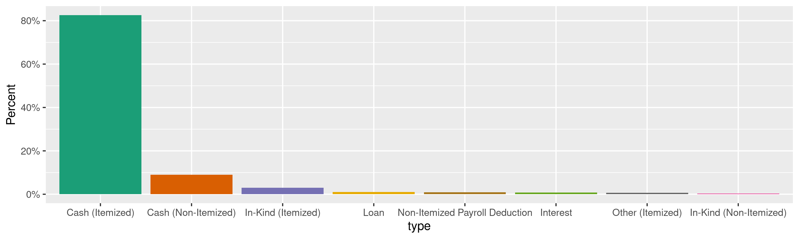
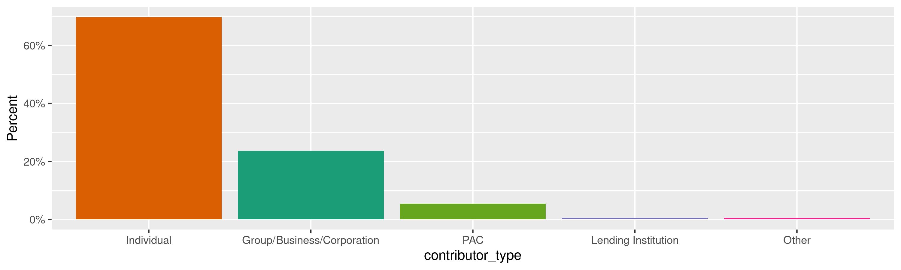
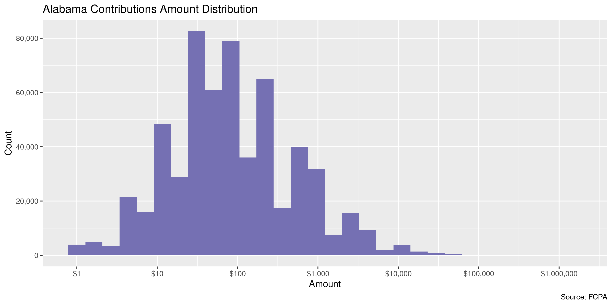

Alabama Contributions
================
Kiernan Nicholls
Wed Dec 30 13:31:12 2020

  - [Project](#project)
  - [Objectives](#objectives)
  - [Packages](#packages)
  - [Data](#data)
  - [Download](#download)
  - [Read](#read)
  - [Explore](#explore)
      - [Missing](#missing)
      - [Duplicates](#duplicates)
      - [Categorical](#categorical)
      - [Amounts](#amounts)
      - [Dates](#dates)
  - [Wrangle](#wrangle)
      - [Address](#address)
      - [ZIP](#zip)
      - [State](#state)
      - [City](#city)
  - [Conclude](#conclude)
  - [Export](#export)
  - [Upload](#upload)

<!-- Place comments regarding knitting here -->

## Project

The Accountability Project is an effort to cut across data silos and
give journalists, policy professionals, activists, and the public at
large a simple way to search across huge volumes of public data about
people and organizations.

Our goal is to standardizing public data on a few key fields by thinking
of each dataset row as a transaction. For each transaction there should
be (at least) 3 variables:

1.  All **parties** to a transaction.
2.  The **date** of the transaction.
3.  The **amount** of money involved.

## Objectives

This document describes the process used to complete the following
objectives:

1.  How many records are in the database?
2.  Check for entirely duplicated records.
3.  Check ranges of continuous variables.
4.  Is there anything blank or missing?
5.  Check for consistency issues.
6.  Create a five-digit ZIP Code called `zip`.
7.  Create a `year` field from the transaction date.
8.  Make sure there is data on both parties to a transaction.

## Packages

The following packages are needed to collect, manipulate, visualize,
analyze, and communicate these results. The `pacman` package will
facilitate their installation and attachment.

``` r
if (!require("pacman")) {
  install.packages("pacman")
}
pacman::p_load(
  tidyverse, # data manipulation
  lubridate, # datetime strings
  gluedown, # printing markdown
  janitor, # clean data frames
  campfin, # custom irw tools
  aws.s3, # aws cloud storage
  refinr, # cluster & merge
  scales, # format strings
  knitr, # knit documents
  vroom, # fast reading
  rvest, # scrape html
  glue, # code strings
  here, # project paths
  httr, # http requests
  fs # local storage 
)
```

This document should be run as part of the `R_campfin` project, which
lives as a sub-directory of the more general, language-agnostic
[`irworkshop/accountability_datacleaning`](https://github.com/irworkshop/accountability_datacleaning)
GitHub repository.

The `R_campfin` project uses the [RStudio
projects](https://support.rstudio.com/hc/en-us/articles/200526207-Using-Projects)
feature and should be run as such. The project also uses the dynamic
`here::here()` tool for file paths relative to *your* machine.

``` r
# where does this document knit?
here::i_am("al/contribs/docs/al_contribs_diary.Rmd")
```

## Data

Alabama contributions data can be retrieved from the Alabama Electronic
Fair Campaign Practices Act (FCPA) [Reporting System
website](https://fcpa.alabamavotes.gov/PublicSite/Homepage.aspx). We can
find the files of interest on the [Data Download
page](https://fcpa.alabamavotes.gov/PublicSite/DataDownload.aspx), which
has a table of files available.

> This page provides comma separated value (CSV) downloadable files
> which contain annual data for Cash Contributions, In-Kind
> Contributions, Other Receipts, and Expenditures in a zipped file
> format. These files can be downloaded and imported into other
> applications (Microsoft Excel, Microsoft Access, etc.) for your use.

> This data is extracted from the Alabama Electronic FCPA Reporting
> System database as it existed as of 12/28/2020 1:35 AM

``` r
fcpa_home <- "https://fcpa.alabamavotes.gov/PublicSite"
al_table <- fcpa_home %>% 
  str_c("DataDownload.aspx", sep = "/") %>% 
  read_html(encoding = "UTF-8") %>% 
  html_node("#_ctl0_Content_dlstDownloadFiles")
```

| Data Type             | Year | Download                                                                                                                 |
| :-------------------- | :--- | :----------------------------------------------------------------------------------------------------------------------- |
| Cash Contributions    | 2020 | [Download File](https://fcpa.alabamavotes.gov/PublicSite/Docs/BulkDataDownloads/2020_CashContributionsExtract.csv.zip)   |
| Expenditures          | 2020 | [Download File](https://fcpa.alabamavotes.gov/PublicSite/Docs/BulkDataDownloads/2020_ExpendituresExtract.csv.zip)        |
| In-Kind Contributions | 2020 | [Download File](https://fcpa.alabamavotes.gov/PublicSite/Docs/BulkDataDownloads/2020_InKindContributionsExtract.csv.zip) |
| Other Receipts        | 2020 | [Download File](https://fcpa.alabamavotes.gov/PublicSite/Docs/BulkDataDownloads/2020_OtherReceiptsExtract.csv.zip)       |
| Cash Contributions    | 2019 | [Download File](https://fcpa.alabamavotes.gov/PublicSite/Docs/BulkDataDownloads/2019_CashContributionsExtract.csv.zip)   |
| Expenditures          | 2019 | [Download File](https://fcpa.alabamavotes.gov/PublicSite/Docs/BulkDataDownloads/2019_ExpendituresExtract.csv.zip)        |
| In-Kind Contributions | 2019 | [Download File](https://fcpa.alabamavotes.gov/PublicSite/Docs/BulkDataDownloads/2019_InKindContributionsExtract.csv.zip) |
| Other Receipts        | 2019 | [Download File](https://fcpa.alabamavotes.gov/PublicSite/Docs/BulkDataDownloads/2019_OtherReceiptsExtract.csv.zip)       |
| Cash Contributions    | 2018 | [Download File](https://fcpa.alabamavotes.gov/PublicSite/Docs/BulkDataDownloads/2018_CashContributionsExtract.csv.zip)   |
| Expenditures          | 2018 | [Download File](https://fcpa.alabamavotes.gov/PublicSite/Docs/BulkDataDownloads/2018_ExpendituresExtract.csv.zip)        |

There are three kinds of contribution files available for each year:

1.  Cash Contributions
2.  In-Kind Contributions (goods, services, etc.)
3.  Other Receipts (loans, interest, etc.)

The Secretary of State’s office provides file layout keys for each file
type:

  - [`AL_CashContributionsFileLayout.pdf`](https://fcpa.alabamavotes.gov/PublicSite/Resources/AL_CashContributionsFileLayout.pdf)
  - [`AL_InKindContributionsFileLayout.pdf`](https://fcpa.alabamavotes.gov/PublicSite/Resources/AL_InKindContributionsFileLayout.pdf)
  - [`AL_OtherReceiptsFileLayout.pdf`](https://fcpa.alabamavotes.gov/PublicSite/Resources/AL_OtherReceiptsFileLayout.pdf)

|   | Name                  | Description                                       |
| :- | :-------------------- | :------------------------------------------------ |
| A | `ORG ID`              | This is the unique ID of the recipient committee. |
| B | `CONTRIBUTION AMOUNT` | Contribution Amount.                              |
| C | `CONTRIBUTION DATE`   | Contribution Receipt Date.                        |
| D | `LAST NAME`           | Last Name of Contributor, if individual person.   |
| E | `FIRST NAME`          | Contributor First Name                            |
| F | `MI`                  | Contributor Middle Initial                        |
| G | `SUFFIX`              | Contributor Name Suffix                           |
| H | `ADDRESS`             | Contributor Street, PO Box, or other direction    |
| I | `CITY`                | Contributor City                                  |
| J | `STATE`               | Contributor State                                 |
| K | `ZIP`                 | Contributor Zip Code                              |
| L | `CONTRIBUTION ID`     | This is the unique Contribution ID.               |
| M | `FILED DATE`          | Contribution Filed Date                           |
| N | `CONTRIBUTION TYPE`   | Contribution Type                                 |
| O | `CONTRIBUTOR TYPE`    | Contributor Type                                  |
| P | `COMMITTEE TYPE`      | Recipient Committee Type                          |
| Q | `COMMITTEE NAME`      | This is the name of the recipient committee.      |
| R | `CANDIDATE NAME`      | This is the name of the recipient candidate.      |
| S | `AMENDED`             | Y/N indicator to show if an amendment was filed.  |

## Download

We can construct a URL for each yearly file.

``` r
zip_dir <- dir_create(here("al", "contribs", "data", "zip"))
raw_files <- c(
  glue("{2013:2020}_CashContributionsExtract.csv.zip"),
  glue("{2013:2020}_InKindContributionsExtract.csv.zip"),
  glue("{2013:2020}_OtherReceiptsExtract.csv.zip")
)
raw_url <- str_c(fcpa_home, "/Docs/BulkDataDownloads/", raw_files)
raw_zip <- path(zip_dir, raw_files)
```

The URLs can be used to download the ZIP archives.

``` r
if (!all(file_exists(raw_zip))) {
  download.file(raw_url, raw_zip)
}
```

And the CSV files from those archives can be extracted.

``` r
csv_dir <- dir_create(here("al", "contribs", "data", "csv"))
raw_csv <- map_chr(raw_zip, unzip, exdir = csv_dir)
```

``` r
for (f in raw_csv) {
  message(f)
  rx <- "(?<!(^|,|\"))\"(?!(,|$|\"))"
  x <- read_lines(f) 
  x <- str_replace_all(x, rx, "\'") 
  write_lines(x, f)
  rm(x)
  flush_memory(1)
  Sys.sleep(1)
}
```

## Read

``` r
alc <- map(
  .x = raw_csv,
  .f = read_delim,
  delim = ",",
  na = c("", " "),
  escape_backslash = FALSE,
  escape_double = FALSE,
  col_types = cols(
    .default = col_character(),
    # ContributionDate = col_date_usa(),
    # ContributionAmount = col_double(),
    # FiledDate = col_date_usa()
  )
)
```

Each file type (Cash, In-Kind, Other) have *mostly* similar columns with
similar names. However, some of the names are specific to the file type
despite containing the same kind of data. We can rename these columns
accordingly and then combine all the files into a single data frame.

``` r
alc <- map_df(
  .x = alc,
  .f = rename_with,
  .id  = "source_file",
  .fn = function(x) {
      str_remove(x, "^Receipt") %>% 
      str_remove("^Contribution") %>% 
      str_remove("InKindContribution") %>% 
      str_replace(
        pattern = "^SourceType$",
        replacement = "ContributorType"
      )
  }
)
```

We can then convert these unified columns to their proper data type.

``` r
alc <- alc %>% 
  relocate(source_file, .after = last_col()) %>% 
  clean_names("snake") %>% 
  mutate(across(amended, `==`, "Y")) %>% 
  select(-starts_with("endorse")) %>% 
  type_convert(
    col_types = cols(
      amount = col_double(),
      date = col_date_usa(),
      filed_date = col_date_usa()
    )
  )
```

## Explore

There are now 590,689 rows of 21 columns. Each column represents a
single contribution made from a person or business to a political
candidate or committee.

``` r
glimpse(alc)
#> Rows: 590,689
#> Columns: 21
#> $ org_id           <dbl> 24947, 24907, 24907, 24907, 24907, 24907, 24907, 24907, 24907, 24907, 24907, 24907, 24907, 2…
#> $ amount           <dbl> 1050, 240, 180, 100, -100, -180, -240, -120, -100, -100, -100, -200, -200, -240, -200, -200,…
#> $ date             <date> 2013-01-01, 2013-01-02, 2013-01-02, 2013-01-02, 2013-01-02, 2013-01-02, 2013-01-02, 2013-01…
#> $ last_name        <chr> "WILMER & LEE, P.A.", "SCOTT'S EXCAVATING & HAULING, INC.", "THE DON DELL CORP.", "TYLER TRA…
#> $ first_name       <chr> NA, NA, NA, NA, NA, NA, NA, NA, NA, NA, NA, NA, NA, NA, NA, NA, NA, NA, NA, NA, NA, NA, NA, …
#> $ mi               <chr> NA, NA, NA, NA, NA, NA, NA, NA, NA, NA, NA, NA, NA, NA, NA, NA, NA, NA, NA, NA, NA, NA, NA, …
#> $ suffix           <chr> NA, NA, NA, NA, NA, NA, NA, NA, NA, NA, NA, NA, NA, NA, NA, NA, NA, NA, NA, NA, NA, NA, NA, …
#> $ address1         <chr> "100 WASHINGTON STREET, SUITE 200", "7771 COUNTY ROAD 222", "20060 HIGHWAY 216", "P. O. BOX …
#> $ city             <chr> "HUNTSVILLE", "CULLMAN", "VANCE", "TROY", "TROY", "VANCE", "CULLMAN", "BELK", "MONTGOMERY", …
#> $ state            <chr> "AL", "AL", "AL", "AL", "AL", "AL", "AL", "AL", "AL", "AL", "AL", "AL", "AL", "AL", "AL", "A…
#> $ zip              <chr> "35801", "35057", "35490", "36081", "36081", "35490", "35057", "35545", "36117", "36124", "3…
#> $ id               <dbl> 11689, 6958, 6972, 6976, 8336, 8340, 8354, 8367, 8373, 8374, 8376, 8377, 8382, 8387, 8394, 8…
#> $ filed_date       <date> 2013-08-01, 2013-07-19, 2013-07-19, 2013-07-19, 2013-07-25, 2013-07-25, 2013-07-25, 2013-07…
#> $ type             <chr> "Cash (Itemized)", "Cash (Non-Itemized)", "Cash (Non-Itemized)", "Cash (Non-Itemized)", "Cas…
#> $ contributor_type <chr> "Group/Business/Corporation", "Individual", "Individual", "Individual", "Individual", "Indiv…
#> $ committee_type   <chr> "Political Action Committee", "Political Action Committee", "Political Action Committee", "P…
#> $ committee_name   <chr> "WLPA PAC", "ALABAMA TRUCKING ASSOCIATION", "ALABAMA TRUCKING ASSOCIATION", "ALABAMA TRUCKIN…
#> $ candidate_name   <chr> NA, NA, NA, NA, NA, NA, NA, NA, NA, NA, NA, NA, NA, NA, NA, NA, NA, NA, NA, NA, NA, NA, NA, …
#> $ amended          <lgl> FALSE, TRUE, TRUE, TRUE, FALSE, FALSE, FALSE, FALSE, FALSE, FALSE, FALSE, FALSE, FALSE, FALS…
#> $ nature_of        <chr> NA, NA, NA, NA, NA, NA, NA, NA, NA, NA, NA, NA, NA, NA, NA, NA, NA, NA, NA, NA, NA, NA, NA, …
#> $ source_file      <chr> "CashContributionsExtract.csv_2013", "CashContributionsExtract.csv_2013", "CashContributions…
tail(alc)
#> # A tibble: 6 x 21
#>   org_id amount date       last_name first_name mi    suffix address1 city  state zip       id filed_date type 
#>    <dbl>  <dbl> <date>     <chr>     <chr>      <chr> <chr>  <chr>    <chr> <chr> <chr>  <dbl> <date>     <chr>
#> 1  24888 5.00e3 2020-11-30 WEBB CON… <NA>       <NA>  <NA>   POST OF… HEFL… AL    36264 741554 2020-12-01 Othe…
#> 2  24888 2.50e4 2020-11-30 MCWANE, … <NA>       <NA>  <NA>   POST OF… BIRM… AL    35243 741555 2020-12-01 Othe…
#> 3  25009 7.60e1 2020-11-30 <NA>      <NA>       <NA>  <NA>   <NA>     <NA>  <NA>  <NA>  741578 2020-12-01 Othe…
#> 4  29235 2.57e3 2020-12-14 FLEMING   TAMARA     <NA>  <NA>   P O BOX… MONT… AL    36116 744527 2020-12-14 Loan 
#> 5  25104 1.00e3 2020-12-19 MIGHTY A… <NA>       <NA>  <NA>   PO BOX … MONT… AL    36123 744512 2020-12-27 Retu…
#> 6  24888 2.35e4 2020-12-23 COOPER/T… <NA>       <NA>  <NA>   POST OF… MOBI… AL    36633 744724 2020-12-23 Othe…
#> # … with 7 more variables: contributor_type <chr>, committee_type <chr>, committee_name <chr>, candidate_name <chr>,
#> #   amended <lgl>, nature_of <chr>, source_file <chr>
```

### Missing

Columns vary in their degree of missing values.

``` r
col_stats(alc, count_na)
#> # A tibble: 21 x 4
#>    col              class       n     p
#>    <chr>            <chr>   <int> <dbl>
#>  1 org_id           <dbl>       0 0    
#>  2 amount           <dbl>       0 0    
#>  3 date             <date>      0 0    
#>  4 last_name        <chr>   61367 0.104
#>  5 first_name       <chr>  190518 0.323
#>  6 mi               <chr>  482568 0.817
#>  7 suffix           <chr>  574332 0.972
#>  8 address1         <chr>   61881 0.105
#>  9 city             <chr>   61835 0.105
#> 10 state            <chr>   61729 0.105
#> 11 zip              <chr>   62799 0.106
#> 12 id               <dbl>       0 0    
#> 13 filed_date       <date>      0 0    
#> 14 type             <chr>       0 0    
#> 15 contributor_type <chr>   61309 0.104
#> 16 committee_type   <chr>       0 0    
#> 17 committee_name   <chr>  224382 0.380
#> 18 candidate_name   <chr>  366307 0.620
#> 19 amended          <lgl>       0 0    
#> 20 nature_of        <chr>  570138 0.965
#> 21 source_file      <chr>       0 0
```

We can flag any record missing a key variable needed to identify a
transaction.

``` r
alc <- mutate(alc, recipient = coalesce(committee_name, candidate_name))
key_vars <- c("date", "last_name", "amount", "recipient")
geo_vars <- c("address1", "city", "state", "zip")
alc <- flag_na(alc, all_of(key_vars))
sum(alc$na_flag)
#> [1] 61367
```

10.4% of records are missing a key variable.

``` r
alc %>% 
  filter(na_flag) %>% 
  select(all_of(key_vars))
#> # A tibble: 61,367 x 4
#>    date       last_name amount recipient                                              
#>    <date>     <chr>      <dbl> <chr>                                                  
#>  1 2013-01-03 <NA>        84.9 TALLADEGA COUNTY REPUBLICAN PARTY                      
#>  2 2013-01-04 <NA>      1598   ALABAMA HOSPITAL ASSOCIATION POLITICAL ACTION COMMITTEE
#>  3 2013-01-04 <NA>        63.2 FIRST CITIZENS BANK                                    
#>  4 2013-01-07 <NA>        20   CULLMAN COUNTY REPUBLICAN WOMEN                        
#>  5 2013-01-07 <NA>        20   CULLMAN COUNTY REPUBLICAN WOMEN                        
#>  6 2013-01-07 <NA>        20   CULLMAN COUNTY REPUBLICAN WOMEN                        
#>  7 2013-01-07 <NA>        20   CULLMAN COUNTY REPUBLICAN WOMEN                        
#>  8 2013-01-07 <NA>        20   CULLMAN COUNTY REPUBLICAN WOMEN                        
#>  9 2013-01-08 <NA>        10   CULLMAN COUNTY REPUBLICAN WOMEN                        
#> 10 2013-01-08 <NA>        10   CULLMAN COUNTY REPUBLICAN WOMEN                        
#> # … with 61,357 more rows
```

All of these records missing variables belong to a non-itemized `type`.

``` r
alc %>% 
  mutate(non_item = str_detect(type, "Non-Itemized")) %>% 
  group_by(na_flag) %>% 
  summarise(non_item = mean(non_item))
#> # A tibble: 2 x 2
#>   na_flag non_item
#>   <lgl>      <dbl>
#> 1 FALSE    0.00576
#> 2 TRUE     1.00
```

We can remove the flag from such records, they should be missing this
data.

``` r
alc$na_flag[str_which(alc$type, "Non-Itemized")] <- FALSE
sum(alc$na_flag)
#> [1] 2
```

This leaves us with very few records.

``` r
alc %>% 
  filter(na_flag) %>% 
  select(all_of(key_vars), type)
#> # A tibble: 2 x 5
#>   date       last_name amount recipient               type           
#>   <date>     <chr>      <dbl> <chr>                   <chr>          
#> 1 2013-08-14 <NA>       21000 WESTPAC                 Cash (Itemized)
#> 2 2018-10-05 <NA>         100 JAMES HOWARD SANDERFORD Cash (Itemized)
```

### Duplicates

We can also flag any record completely duplicated across every column.

``` r
alc <- flag_dupes(alc, -id)
sum(alc$dupe_flag)
#> [1] 45541
```

7.7% of records are duplicates.

``` r
alc %>% 
  filter(dupe_flag) %>% 
  select(id, all_of(key_vars))
#> # A tibble: 45,541 x 5
#>       id date       last_name amount recipient                      
#>    <dbl> <date>     <chr>      <dbl> <chr>                          
#>  1 51859 2013-01-07 <NA>          20 CULLMAN COUNTY REPUBLICAN WOMEN
#>  2 51860 2013-01-07 <NA>          20 CULLMAN COUNTY REPUBLICAN WOMEN
#>  3 51861 2013-01-07 <NA>          20 CULLMAN COUNTY REPUBLICAN WOMEN
#>  4 51862 2013-01-07 <NA>          20 CULLMAN COUNTY REPUBLICAN WOMEN
#>  5 51863 2013-01-07 <NA>          20 CULLMAN COUNTY REPUBLICAN WOMEN
#>  6 51815 2013-01-08 <NA>          10 CULLMAN COUNTY REPUBLICAN WOMEN
#>  7 51816 2013-01-08 <NA>          10 CULLMAN COUNTY REPUBLICAN WOMEN
#>  8 51817 2013-01-08 <NA>          30 CULLMAN COUNTY REPUBLICAN WOMEN
#>  9 51818 2013-01-08 <NA>          30 CULLMAN COUNTY REPUBLICAN WOMEN
#> 10 51849 2013-01-08 <NA>          30 CULLMAN COUNTY REPUBLICAN WOMEN
#> # … with 45,531 more rows
```

Similar to the missing values, much of these are non-itemized.

``` r
alc %>% 
  mutate(non_item = str_detect(type, "Non-Itemized")) %>% 
  group_by(dupe_flag) %>% 
  summarise(non_item = mean(non_item))
#> # A tibble: 2 x 2
#>   dupe_flag non_item
#>   <lgl>        <dbl>
#> 1 FALSE       0.0561
#> 2 TRUE        0.743
```

``` r
alc$dupe_flag[str_which(alc$type, "Non-Itemized")] <- FALSE
sum(alc$dupe_flag)
#> [1] 11687
```

This removes most, but not all, duplicate records.

``` r
alc %>% 
  filter(dupe_flag) %>% 
  select(id, all_of(key_vars), type)
#> # A tibble: 11,687 x 6
#>       id date       last_name                           amount recipient                                  type          
#>    <dbl> <date>     <chr>                                <dbl> <chr>                                      <chr>         
#>  1  9001 2013-02-18 MCMILLAN TRUCKING, INC.                100 ALABAMA TRUCKING ASSOCIATION               Cash (Itemize…
#>  2  9002 2013-02-18 MCMILLAN TRUCKING, INC.                100 ALABAMA TRUCKING ASSOCIATION               Cash (Itemize…
#>  3  3837 2013-02-21 MCCALLUM, HOAGLUND, COOK & IRBY, L…    100 TRUST REPRESENTING INVOLVED ALABAMA LAWYE… Cash (Itemize…
#>  4  3838 2013-02-21 MCCALLUM, HOAGLUND, COOK & IRBY, L…    100 TRUST REPRESENTING INVOLVED ALABAMA LAWYE… Cash (Itemize…
#>  5  3843 2013-02-21 NORRIS INJURY LAWYERS, P.C.            100 TRUST REPRESENTING INVOLVED ALABAMA LAWYE… Cash (Itemize…
#>  6  3844 2013-02-21 NORRIS INJURY LAWYERS, P.C.            100 TRUST REPRESENTING INVOLVED ALABAMA LAWYE… Cash (Itemize…
#>  7  9011 2013-02-25 RANGEWAY CARRIERS, LLC                 100 ALABAMA TRUCKING ASSOCIATION               Cash (Itemize…
#>  8  9012 2013-02-25 RANGEWAY CARRIERS, LLC                 100 ALABAMA TRUCKING ASSOCIATION               Cash (Itemize…
#>  9   285 2013-04-25 KINNEY CAPITOL GROUP, LLC              500 ALABAMA 2014 PAC                           Cash (Itemize…
#> 10   286 2013-04-25 KINNEY CAPITOL GROUP, LLC              500 ALABAMA 2014 PAC                           Cash (Itemize…
#> # … with 11,677 more rows
```

### Categorical

``` r
col_stats(alc, n_distinct)
#> # A tibble: 24 x 4
#>    col              class       n          p
#>    <chr>            <chr>   <int>      <dbl>
#>  1 org_id           <dbl>    3446 0.00583   
#>  2 amount           <dbl>   21789 0.0369    
#>  3 date             <date>   2889 0.00489   
#>  4 last_name        <chr>   56623 0.0959    
#>  5 first_name       <chr>   18686 0.0316    
#>  6 mi               <chr>      34 0.0000576 
#>  7 suffix           <chr>      33 0.0000559 
#>  8 address1         <chr>  123164 0.209     
#>  9 city             <chr>    5318 0.00900   
#> 10 state            <chr>     102 0.000173  
#> 11 zip              <chr>    9273 0.0157    
#> 12 id               <dbl>  590534 1.00      
#> 13 filed_date       <date>   1889 0.00320   
#> 14 type             <chr>      31 0.0000525 
#> 15 contributor_type <chr>       6 0.0000102 
#> 16 committee_type   <chr>       2 0.00000339
#> 17 committee_name   <chr>     506 0.000857  
#> 18 candidate_name   <chr>    2848 0.00482   
#> 19 amended          <lgl>       2 0.00000339
#> 20 nature_of        <chr>       2 0.00000339
#> 21 source_file      <chr>      24 0.0000406 
#> 22 recipient        <chr>    3352 0.00567   
#> 23 na_flag          <lgl>       2 0.00000339
#> 24 dupe_flag        <lgl>       2 0.00000339
```

<!-- --><!-- --><!-- -->

### Amounts

``` r
summary(alc$amount)
#>      Min.   1st Qu.    Median      Mean   3rd Qu.      Max. 
#> -200000.0      25.0      90.0     575.9     250.0 1495000.0
mean(alc$amount <= 0)
#> [1] 0.0121299
```

These are the records with the minimum and maximum amounts.

``` r
glimpse(alc[c(which.max(alc$amount), which.min(alc$amount)), ])
#> Rows: 2
#> Columns: 24
#> $ org_id           <dbl> 29064, 27540
#> $ amount           <dbl> 1495000, -200000
#> $ date             <date> 2020-01-06, 2018-10-31
#> $ last_name        <chr> "ALABAMA POWER COMPANY", "RIVER BANK & TRUST"
#> $ first_name       <chr> NA, NA
#> $ mi               <chr> NA, NA
#> $ suffix           <chr> NA, NA
#> $ address1         <chr> "600 NORTH 18TH STREET", "244 S 3RD ST"
#> $ city             <chr> "BIRMINGHAM", "GADSDEN"
#> $ state            <chr> "AL", "AL"
#> $ zip              <chr> "35203", "35901"
#> $ id               <dbl> 666816, 569355
#> $ filed_date       <date> 2020-01-07, 2018-11-01
#> $ type             <chr> "Cash (Itemized)", "Interest Offset due to update of filed item"
#> $ contributor_type <chr> "Group/Business/Corporation", "Group/Business/Corporation"
#> $ committee_type   <chr> "Political Action Committee", "Principal Campaign Committee"
#> $ committee_name   <chr> "LION PAC", NA
#> $ candidate_name   <chr> NA, "JON CRAIG FORD"
#> $ amended          <lgl> FALSE, TRUE
#> $ nature_of        <chr> NA, NA
#> $ source_file      <chr> "CashContributionsExtract.csv_2020", "OtherReceiptsExtract.csv_2018"
#> $ recipient        <chr> "LION PAC", "JON CRAIG FORD"
#> $ na_flag          <lgl> FALSE, FALSE
#> $ dupe_flag        <lgl> FALSE, FALSE
```

<!-- -->

### Dates

We can add the calendar year from `date` with `lubridate::year()`

``` r
alc <- mutate(alc, year = year(date))
```

``` r
min(alc$date)
#> [1] "2010-06-09"
sum(alc$year < 2000)
#> [1] 0
max(alc$date)
#> [1] "2020-12-25"
sum(alc$date > today())
#> [1] 0
```

<!-- -->

## Wrangle

To improve the searchability of the database, we will perform some
consistent, confident string normalization. For geographic variables
like city names and ZIP codes, the corresponding `campfin::normal_*()`
functions are tailor made to facilitate this process.

### Address

For the street `addresss` variable, the `campfin::normal_address()`
function will force consistence case, remove punctuation, and abbreviate
official USPS suffixes.

``` r
addr_norm <- alc %>% 
  distinct(address1) %>% 
  mutate(
    address_norm = normal_address(
      address = address1,
      abbs = usps_street,
      na_rep = TRUE
    )
  )
```

``` r
addr_norm
#> # A tibble: 123,164 x 2
#>    address1                         address_norm             
#>    <chr>                            <chr>                    
#>  1 100 WASHINGTON STREET, SUITE 200 100 WASHINGTON ST STE 200
#>  2 7771 COUNTY ROAD 222             7771 COUNTY RD 222       
#>  3 20060 HIGHWAY 216                20060 HWY 216            
#>  4 P. O. BOX 121                    PO BOX 121               
#>  5 P. O. BOX 78                     PO BOX 78                
#>  6 8553 WEST HAMPTON CT.            8553 W HAMPTON CT        
#>  7 P. O. BOX 241212                 PO BOX 241212            
#>  8 P. O. BOX 143                    PO BOX 143               
#>  9 P. O. BOX 473                    PO BOX 473               
#> 10 3835 SNOW ROAD                   3835 SNOW RD             
#> # … with 123,154 more rows
```

``` r
alc <- left_join(alc, addr_norm, by = "address1")
```

### ZIP

For ZIP codes, the `campfin::normal_zip()` function will attempt to
create valid *five* digit codes by removing the ZIP+4 suffix and
returning leading zeroes dropped by other programs like Microsoft Excel.

``` r
alc <- alc %>% 
  mutate(
    zip_norm = normal_zip(
      zip = zip,
      na_rep = TRUE
    )
  )
```

``` r
progress_table(
  alc$zip,
  alc$zip_norm,
  compare = valid_zip
)
#> # A tibble: 2 x 6
#>   stage    prop_in n_distinct prop_na n_out n_diff
#>   <chr>      <dbl>      <dbl>   <dbl> <dbl>  <dbl>
#> 1 zip        0.982       9273   0.106  9448   2971
#> 2 zip_norm   0.996       6942   0.107  2272    463
```

### State

Valid two digit state abbreviations can be made using the
`campfin::normal_state()` function.

``` r
alc <- alc %>% 
  mutate(
    state_norm = normal_state(
      state = state,
      abbreviate = TRUE,
      na_rep = TRUE,
      valid = valid_state
    )
  )
```

``` r
alc %>% 
  filter(state != state_norm) %>% 
  count(state, state_norm, sort = TRUE)
#> # A tibble: 0 x 3
#> # … with 3 variables: state <chr>, state_norm <chr>, n <int>
```

``` r
progress_table(
  alc$state,
  alc$state_norm,
  compare = valid_state
)
#> # A tibble: 2 x 6
#>   stage      prop_in n_distinct prop_na n_out n_diff
#>   <chr>        <dbl>      <dbl>   <dbl> <dbl>  <dbl>
#> 1 state         1.00        102   0.105    93     46
#> 2 state_norm    1            56   0.105     0      1
```

### City

Cities are the most difficult geographic variable to normalize, simply
due to the wide variety of valid cities and formats.

#### Normal

The `campfin::normal_city()` function is a good start, again converting
case, removing punctuation, but *expanding* USPS abbreviations. We can
also remove `invalid_city` values.

``` r
norm_city <- alc %>% 
  distinct(city, state_norm, zip_norm) %>% 
  mutate(
    city_norm = normal_city(
      city = city, 
      abbs = usps_city,
      states = c("AL", "DC", "ALABAMA"),
      na = invalid_city,
      na_rep = TRUE
    )
  )
```

#### Swap

We can further improve normalization by comparing our normalized value
against the *expected* value for that record’s state abbreviation and
ZIP code. If the normalized value is either an abbreviation for or very
similar to the expected value, we can confidently swap those two.

``` r
norm_city <- norm_city %>% 
  rename(city_raw = city) %>% 
  left_join(
    y = zipcodes,
    by = c(
      "state_norm" = "state",
      "zip_norm" = "zip"
    )
  ) %>% 
  rename(city_match = city) %>% 
  mutate(
    match_abb = is_abbrev(city_norm, city_match),
    match_dist = str_dist(city_norm, city_match),
    city_swap = if_else(
      condition = !is.na(match_dist) & (match_abb | match_dist == 1),
      true = city_match,
      false = city_norm
    )
  ) %>% 
  select(
    -city_match,
    -match_dist,
    -match_abb
  )
```

``` r
alc <- left_join(
  x = alc,
  y = norm_city,
  by = c(
    "city" = "city_raw", 
    "state_norm", 
    "zip_norm"
  )
)
```

#### Refine

The [OpenRefine](https://openrefine.org/) algorithms can be used to
group similar strings and replace the less common versions with their
most common counterpart. This can greatly reduce inconsistency, but with
low confidence; we will only keep any refined strings that have a valid
city/state/zip combination.

``` r
good_refine <- alc %>% 
  mutate(
    city_refine = city_swap %>% 
      key_collision_merge() %>% 
      n_gram_merge(numgram = 1)
  ) %>% 
  filter(city_refine != city_swap) %>% 
  inner_join(
    y = zipcodes,
    by = c(
      "city_refine" = "city",
      "state_norm" = "state",
      "zip_norm" = "zip"
    )
  )
```

    #> # A tibble: 41 x 5
    #>    state_norm zip_norm city_swap     city_refine       n
    #>    <chr>      <chr>    <chr>         <chr>         <int>
    #>  1 AL         36752    LOWENDSBORO   LOWNDESBORO       8
    #>  2 AL         35754    LACEY SPRINGS LACEYS SPRING     5
    #>  3 AL         36102    MONTOGEMERY   MONTGOMERY        4
    #>  4 MD         20816    BESTHEDA      BETHESDA          3
    #>  5 AL         35223    BIRMINGHMAN   BIRMINGHAM        2
    #>  6 AL         36853    DADEVEILL     DADEVILLE         2
    #>  7 AL         35051    COLUMBIANA AL COLUMBIANA        1
    #>  8 AL         35053    CREAN HILL    CRANE HILL        1
    #>  9 AL         35064    FAIRFEIDL     FAIRFIELD         1
    #> 10 AL         35071    GARDDALEEN    GARDENDALE        1
    #> # … with 31 more rows

Then we can join the refined values back to the database.

``` r
alc <- alc %>% 
  left_join(good_refine) %>% 
  mutate(city_refine = coalesce(city_refine, city_swap))
```

#### Progress

Our goal for normalization was to increase the proportion of city values
known to be valid and reduce the total distinct values by correcting
misspellings.

| stage        | prop\_in | n\_distinct | prop\_na | n\_out | n\_diff |
| :----------- | -------: | ----------: | -------: | -----: | ------: |
| city)        |    0.974 |        5318 |    0.105 |  13491 |    1995 |
| city\_norm   |    0.982 |        4922 |    0.105 |   9426 |    1578 |
| city\_swap   |    0.992 |        3880 |    0.105 |   4001 |     507 |
| city\_refine |    0.993 |        3843 |    0.105 |   3942 |     470 |

You can see how the percentage of valid values increased with each
stage.

<!-- -->

More importantly, the number of distinct values decreased each stage. We
were able to confidently change many distinct invalid values to their
valid equivalent.

<!-- -->

## Conclude

Before exporting, we can remove the intermediary normalization columns
and rename all added variables with the `_clean` suffix.

``` r
alc <- alc %>% 
  select(
    -city_norm,
    -city_swap,
    city_clean = city_refine
  ) %>% 
  rename_all(~str_replace(., "_norm", "_clean")) %>% 
  rename_all(~str_remove(., "_raw")) %>% 
  relocate(state_clean, zip_clean, .after = city_clean)
```

``` r
glimpse(sample_n(alc, 50))
#> Rows: 50
#> Columns: 29
#> $ org_id           <dbl> 25547, 25202, 25266, 26762, 25891, 26325, 25092, 25054, 26303, 25080, 27462, 29004, 25092, 2…
#> $ amount           <dbl> 100.00, 200.00, 1760.00, 2500.00, 100.00, 100.00, 125.00, 1000.00, 2500.00, 100.00, 100.00, …
#> $ date             <date> 2014-10-29, 2020-11-10, 2014-11-04, 2018-10-26, 2015-12-15, 2018-02-28, 2018-02-02, 2018-05…
#> $ last_name        <chr> "STURDIVANT", "COWAN", "GREER", "ET PAC", "TOMLIN", NA, "COPELAND", "FFB PAC", "THE HOWE GRO…
#> $ first_name       <chr> "JAMES", "JASON", "LYNN", NA, "DON & BETTY", NA, "BRENDA", NA, NA, "CLINT", "MIKE", NA, "DIA…
#> $ mi               <chr> "R", NA, NA, NA, NA, NA, NA, NA, NA, NA, NA, NA, NA, "E", NA, NA, "W", NA, NA, NA, "J", "O",…
#> $ suffix           <chr> NA, NA, NA, NA, NA, NA, NA, NA, NA, NA, NA, NA, NA, NA, NA, NA, NA, NA, NA, NA, NA, "01", NA…
#> $ address1         <chr> "2422 ALTA RIDGE CIR", "126 DALTON LN", "P.O. BOX 40", "P. O. BOX 2663", "2733 TREVOR DRIVE"…
#> $ city             <chr> "BIRMINGHAM", "TUSCUMBIA", "ROGERSVILLE", "TUSCALOOSA", "HUNTSVILLE", NA, "FAIRHOPE", "BESSE…
#> $ state            <chr> "AL", "AL", "AL", "AL", "AL", NA, "AL", "AL", "AL", "AL", "OK", NA, "AL", "TN", "AL", "AL", …
#> $ zip              <chr> "35243", "35674", "35652", "35403", "35802", NA, "36559", "35020", "36104", "35403", "74073"…
#> $ id               <dbl> 153412, 737936, 206504, 567205, 213201, 417919, 420484, 479647, 435963, 3760, 477379, 724397…
#> $ filed_date       <date> 2014-11-02, 2020-11-10, 2015-11-04, 2018-10-29, 2015-12-31, 2018-03-02, 2018-03-02, 2018-05…
#> $ type             <chr> "Cash (Itemized)", "Cash (Itemized)", "Loan", "Cash (Itemized)", "Cash (Itemized)", "Cash (N…
#> $ contributor_type <chr> "Individual", "Individual", "Individual", "PAC", "Individual", NA, "Individual", "PAC", "Gro…
#> $ committee_type   <chr> "Principal Campaign Committee", "Political Action Committee", "Principal Campaign Committee"…
#> $ committee_name   <chr> NA, "ALABAMA MEDICAL PAC", NA, NA, NA, NA, "ALABAMA REALTORS POLITICAL ACTION COMMITTEE", NA…
#> $ candidate_name   <chr> "PATRICK JAMES BALLARD", NA, "BAYLESS LYNN GREER", "LAURA KATE GREGORY", "BRIAN CHRISTOPHER …
#> $ amended          <lgl> FALSE, FALSE, FALSE, FALSE, FALSE, FALSE, FALSE, FALSE, FALSE, FALSE, FALSE, FALSE, FALSE, F…
#> $ nature_of        <chr> NA, NA, NA, NA, NA, NA, NA, NA, NA, NA, NA, NA, NA, NA, NA, NA, NA, NA, NA, NA, NA, NA, NA, …
#> $ source_file      <chr> "CashContributionsExtract.csv_2014", "CashContributionsExtract.csv_2020", "OtherReceiptsExtr…
#> $ recipient        <chr> "PATRICK JAMES BALLARD", "ALABAMA MEDICAL PAC", "BAYLESS LYNN GREER", "LAURA KATE GREGORY", …
#> $ na_flag          <lgl> FALSE, FALSE, FALSE, FALSE, FALSE, FALSE, FALSE, FALSE, FALSE, FALSE, FALSE, FALSE, FALSE, F…
#> $ dupe_flag        <lgl> FALSE, FALSE, FALSE, FALSE, FALSE, FALSE, FALSE, FALSE, FALSE, FALSE, FALSE, FALSE, TRUE, FA…
#> $ year             <dbl> 2014, 2020, 2014, 2018, 2015, 2018, 2018, 2018, 2018, 2013, 2018, 2020, 2017, 2019, 2019, 20…
#> $ address_clean    <chr> "2422 ALTA RDG CIR", "126 DALTON LN", "PO BOX 40", "PO BOX 2663", "2733 TREVOR DR", NA, "238…
#> $ city_clean       <chr> "BIRMINGHAM", "TUSCUMBIA", "ROGERSVILLE", "TUSCALOOSA", "HUNTSVILLE", NA, "FAIRHOPE", "BESSE…
#> $ state_clean      <chr> "AL", "AL", "AL", "AL", "AL", NA, "AL", "AL", "AL", "AL", "OK", NA, "AL", "TN", "AL", "AL", …
#> $ zip_clean        <chr> "35243", "35674", "35652", "35403", "35802", NA, "36559", "35020", "36104", "35403", "74073"…
```

1.  There are 590,689 records in the database.
2.  There are 11,687 duplicate records in the database.
3.  The range and distribution of `amount` and `date` seem reasonable.
4.  There are 2 records missing key variables.
5.  Consistency in geographic data has been improved with
    `campfin::normal_*()`.
6.  The 4-digit `year` variable has been created with
    `lubridate::year()`.

## Export

Now the file can be saved on disk for upload to the Accountability
server.

``` r
clean_dir <- dir_create(here("al", "contribs", "data", "clean"))
clean_path <- path(clean_dir, "al_contribs_clean.csv")
write_csv(alc, clean_path, na = "")
(clean_size <- file_size(clean_path))
#> 172M
file_encoding(clean_path) %>% 
  mutate(across(path, path.abbrev))
#> # A tibble: 1 x 3
#>   path                                                                          mime            charset 
#>   <fs::path>                                                                    <chr>           <chr>   
#> 1 /home/kiernan/Code/tap/R_campfin/al/contribs/data/clean/al_contribs_clean.csv application/csv us-ascii
```

## Upload

We can use the `aws.s3::put_object()` to upload the text file to the IRW
server.

``` r
aws_path <- path("csv", basename(clean_path))
if (!object_exists(aws_path, "publicaccountability")) {
  put_object(
    file = clean_path,
    object = aws_path, 
    bucket = "publicaccountability",
    acl = "public-read",
    show_progress = TRUE,
    multipart = TRUE
  )
}
aws_head <- head_object(aws_path, "publicaccountability")
(aws_size <- as_fs_bytes(attr(aws_head, "content-length")))
unname(aws_size == clean_size)
```
