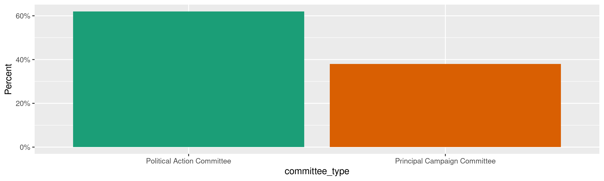
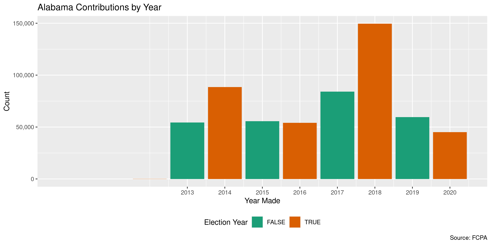
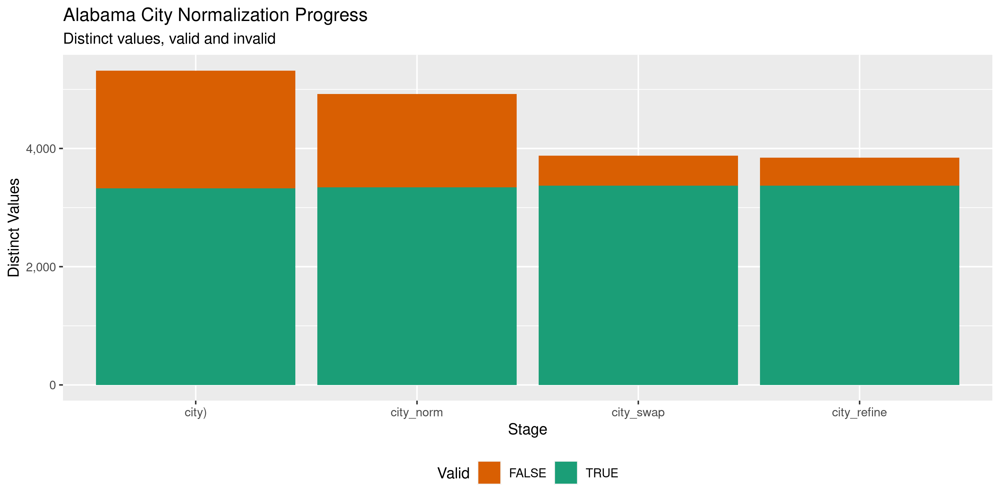

Alabama Contributions
================
Kiernan Nicholls & Aarushi Sahejpal
Tue May 2 10:41:58 2023

- <a href="#project" id="toc-project">Project</a>
- <a href="#objectives" id="toc-objectives">Objectives</a>
- <a href="#packages" id="toc-packages">Packages</a>
- <a href="#data" id="toc-data">Data</a>
- <a href="#download" id="toc-download">Download</a>
- <a href="#read" id="toc-read">Read</a>
- <a href="#explore" id="toc-explore">Explore</a>
  - <a href="#missing" id="toc-missing">Missing</a>
  - <a href="#duplicates" id="toc-duplicates">Duplicates</a>
  - <a href="#categorical" id="toc-categorical">Categorical</a>
  - <a href="#amounts" id="toc-amounts">Amounts</a>
  - <a href="#dates" id="toc-dates">Dates</a>
- <a href="#wrangle" id="toc-wrangle">Wrangle</a>
  - <a href="#address" id="toc-address">Address</a>
  - <a href="#zip" id="toc-zip">ZIP</a>
  - <a href="#state" id="toc-state">State</a>
  - <a href="#city" id="toc-city">City</a>
- <a href="#conclude" id="toc-conclude">Conclude</a>
- <a href="#export" id="toc-export">Export</a>
- <a href="#upload" id="toc-upload">Upload</a>

<!-- Place comments regarding knitting here -->

## Project

The Accountability Project is an effort to cut across data silos and
give journalists, policy professionals, activists, and the public at
large a simple way to search across huge volumes of public data about
people and organizations.

Our goal is to standardizing public data on a few key fields by thinking
of each dataset row as a transaction. For each transaction there should
be (at least) 3 variables:

1.  All **parties** to a transaction.
2.  The **date** of the transaction.
3.  The **amount** of money involved.

## Objectives

This document describes the process used to complete the following
objectives:

1.  How many records are in the database?
2.  Check for entirely duplicated records.
3.  Check ranges of continuous variables.
4.  Is there anything blank or missing?
5.  Check for consistency issues.
6.  Create a five-digit ZIP Code called `zip`.
7.  Create a `year` field from the transaction date.
8.  Make sure there is data on both parties to a transaction.

## Packages

The following packages are needed to collect, manipulate, visualize,
analyze, and communicate these results. The `pacman` package will
facilitate their installation and attachment.

``` r
if (!require("pacman")) {
  install.packages("pacman")
}
pacman::p_load(
  tidyverse, # data manipulation
  lubridate, # datetime strings
  gluedown, # printing markdown
  janitor, # clean data frames
  campfin, # custom irw tools
  aws.s3, # aws cloud storage
  refinr, # cluster & merge
  scales, # format strings
  knitr, # knit documents
  vroom, # fast reading
  rvest, # scrape html
  glue, # code strings
  here, # project paths
  httr, # http requests
  fs # local storage 
)
```

This document should be run as part of the `R_campfin` project, which
lives as a sub-directory of the more general, language-agnostic
[`irworkshop/accountability_datacleaning`](https://github.com/irworkshop/accountability_datacleaning)
GitHub repository.

The `R_campfin` project uses the [RStudio
projects](https://support.rstudio.com/hc/en-us/articles/200526207-Using-Projects)
feature and should be run as such. The project also uses the dynamic
`here::here()` tool for file paths relative to *your* machine.

``` r
# where does this document knit?
here::i_am("al/contribs/docs/al_contribs_diary.Rmd")
```

## Data

Alabama contributions data can be retrieved from the Alabama Electronic
Fair Campaign Practices Act (FCPA) [Reporting System
website](https://fcpa.alabamavotes.gov/PublicSite/Homepage.aspx). We can
find the files of interest on the [Data Download
page](https://fcpa.alabamavotes.gov/PublicSite/DataDownload.aspx), which
has a table of files available.

> This page provides comma separated value (CSV) downloadable files
> which contain annual data for Cash Contributions, In-Kind
> Contributions, Other Receipts, and Expenditures in a zipped file
> format. These files can be downloaded and imported into other
> applications (Microsoft Excel, Microsoft Access, etc.) for your use.

> This data is extracted from the Alabama Electronic FCPA Reporting
> System database as it existed as of 12/28/2020 1:35 AM

``` r
fcpa_home <- "https://fcpa.alabamavotes.gov/PublicSite"
al_table <- fcpa_home %>% 
  str_c("DataDownload.aspx", sep = "/") %>% 
  read_html(encoding = "UTF-8") %>% 
  html_node("#_ctl0_Content_dlstDownloadFiles")
```

| Data Type             | Year | Download                                                                                                                 |
|:----------------------|:-----|:-------------------------------------------------------------------------------------------------------------------------|
| Cash Contributions    | 2023 | [Download File](https://fcpa.alabamavotes.gov/PublicSite/Docs/BulkDataDownloads/2023_CashContributionsExtract.csv.zip)   |
| Expenditures          | 2023 | [Download File](https://fcpa.alabamavotes.gov/PublicSite/Docs/BulkDataDownloads/2023_ExpendituresExtract.csv.zip)        |
| In-Kind Contributions | 2023 | [Download File](https://fcpa.alabamavotes.gov/PublicSite/Docs/BulkDataDownloads/2023_InKindContributionsExtract.csv.zip) |
| Other Receipts        | 2023 | [Download File](https://fcpa.alabamavotes.gov/PublicSite/Docs/BulkDataDownloads/2023_OtherReceiptsExtract.csv.zip)       |
| Cash Contributions    | 2022 | [Download File](https://fcpa.alabamavotes.gov/PublicSite/Docs/BulkDataDownloads/2022_CashContributionsExtract.csv.zip)   |
| Expenditures          | 2022 | [Download File](https://fcpa.alabamavotes.gov/PublicSite/Docs/BulkDataDownloads/2022_ExpendituresExtract.csv.zip)        |
| In-Kind Contributions | 2022 | [Download File](https://fcpa.alabamavotes.gov/PublicSite/Docs/BulkDataDownloads/2022_InKindContributionsExtract.csv.zip) |
| Other Receipts        | 2022 | [Download File](https://fcpa.alabamavotes.gov/PublicSite/Docs/BulkDataDownloads/2022_OtherReceiptsExtract.csv.zip)       |
| Cash Contributions    | 2021 | [Download File](https://fcpa.alabamavotes.gov/PublicSite/Docs/BulkDataDownloads/2021_CashContributionsExtract.csv.zip)   |
| Expenditures          | 2021 | [Download File](https://fcpa.alabamavotes.gov/PublicSite/Docs/BulkDataDownloads/2021_ExpendituresExtract.csv.zip)        |

There are three kinds of contribution files available for each year:

1.  Cash Contributions
2.  In-Kind Contributions (goods, services, etc.)
3.  Other Receipts (loans, interest, etc.)

The Secretary of State’s office provides file layout keys for each file
type:

- [`AL_CashContributionsFileLayout.pdf`](https://fcpa.alabamavotes.gov/PublicSite/Resources/AL_CashContributionsFileLayout.pdf)
- [`AL_InKindContributionsFileLayout.pdf`](https://fcpa.alabamavotes.gov/PublicSite/Resources/AL_InKindContributionsFileLayout.pdf)
- [`AL_OtherReceiptsFileLayout.pdf`](https://fcpa.alabamavotes.gov/PublicSite/Resources/AL_OtherReceiptsFileLayout.pdf)

|     | Name                  | Description                                       |
|:----|:----------------------|:--------------------------------------------------|
| A   | `ORG ID`              | This is the unique ID of the recipient committee. |
| B   | `CONTRIBUTION AMOUNT` | Contribution Amount.                              |
| C   | `CONTRIBUTION DATE`   | Contribution Receipt Date.                        |
| D   | `LAST NAME`           | Last Name of Contributor, if individual person.   |
| E   | `FIRST NAME`          | Contributor First Name                            |
| F   | `MI`                  | Contributor Middle Initial                        |
| G   | `SUFFIX`              | Contributor Name Suffix                           |
| H   | `ADDRESS`             | Contributor Street, PO Box, or other direction    |
| I   | `CITY`                | Contributor City                                  |
| J   | `STATE`               | Contributor State                                 |
| K   | `ZIP`                 | Contributor Zip Code                              |
| L   | `CONTRIBUTION ID`     | This is the unique Contribution ID.               |
| M   | `FILED DATE`          | Contribution Filed Date                           |
| N   | `CONTRIBUTION TYPE`   | Contribution Type                                 |
| O   | `CONTRIBUTOR TYPE`    | Contributor Type                                  |
| P   | `COMMITTEE TYPE`      | Recipient Committee Type                          |
| Q   | `COMMITTEE NAME`      | This is the name of the recipient committee.      |
| R   | `CANDIDATE NAME`      | This is the name of the recipient candidate.      |
| S   | `AMENDED`             | Y/N indicator to show if an amendment was filed.  |

## Download

We can construct a URL for each yearly file.

``` r
zip_dir <- dir_create(here("al", "contribs", "data", "zip"))
raw_files <- c(
  glue("{2013:2023}_CashContributionsExtract.csv.zip"),
  glue("{2013:2023}_InKindContributionsExtract.csv.zip"),
  glue("{2013:2023}_OtherReceiptsExtract.csv.zip")
)
raw_url <- str_c(fcpa_home, "/Docs/BulkDataDownloads/", raw_files)
raw_zip <- path(zip_dir, raw_files)
```

The URLs can be used to download the ZIP archives.

``` r
if (!all(file_exists(raw_zip))) {
  download.file(raw_url, raw_zip)
}
```

And the CSV files from those archives can be extracted.

``` r
csv_dir <- dir_create(here("al", "contribs", "data", "csv"))
raw_csv <- map_chr(raw_zip, unzip, exdir = csv_dir)
```

``` r
for (f in raw_csv) {
  message(f)
  rx <- "(?<!(^|,|\"))\"(?!(,|$|\"))"
  x <- read_lines(f) 
  x <- str_replace_all(x, rx, "\'") 
  write_lines(x, f)
  rm(x)
  flush_memory(1)
  Sys.sleep(1)
}
```

## Read

``` r
alc <- map(
  .x = raw_csv,
  .f = read_delim,
  delim = ",",
  na = c("", " "),
  escape_backslash = FALSE,
  escape_double = FALSE,
  col_types = cols(
    .default = col_character(),
    # ContributionDate = col_date_usa(),
    # ContributionAmount = col_double(),
    # FiledDate = col_date_usa()
  )
)
```

Each file type (Cash, In-Kind, Other) have *mostly* similar columns with
similar names. However, some of the names are specific to the file type
despite containing the same kind of data. We can rename these columns
accordingly and then combine all the files into a single data frame.

``` r
alc <- map_df(
  .x = alc,
  .f = rename_with,
  .id  = "source_file",
  .fn = function(x) {
      str_remove(x, "^Receipt") %>% 
      str_remove("^Contribution") %>% 
      str_remove("InKindContribution") %>% 
      str_replace(
        pattern = "^SourceType$",
        replacement = "ContributorType"
      )
  }
)
```

We can then convert these unified columns to their proper data type.

``` r
alc <- alc %>% 
  relocate(source_file, .after = last_col()) %>% 
  clean_names("snake") %>% 
  mutate(across(amended, `==`, "Y")) %>% 
  select(-starts_with("endorse")) %>% 
  type_convert(
    col_types = cols(
      amount = col_double(),
      date = col_date_usa(),
      filed_date = col_date_usa()
    )
  )
```

## Explore

There are now 759,527 rows of 21 columns. Each column represents a
single contribution made from a person or business to a political
candidate or committee.

``` r
glimpse(alc)
#> Rows: 759,527
#> Columns: 21
#> $ org_id           <dbl> 24947, 24907, 24907, 24907, 24907, 24907, 24907, 24907, 24907, 24907, 24907, 24907, 24907, 24…
#> $ amount           <dbl> 1050, 240, 180, 100, -100, -180, -240, -120, -100, -100, -100, -200, -200, -240, -200, -200, …
#> $ date             <date> 2013-01-01, 2013-01-02, 2013-01-02, 2013-01-02, 2013-01-02, 2013-01-02, 2013-01-02, 2013-01-…
#> $ last_name        <chr> "WILMER & LEE, P.A.", "SCOTT'S EXCAVATING & HAULING, INC.", "THE DON DELL CORP.", "TYLER TRAN…
#> $ first_name       <chr> NA, NA, NA, NA, NA, NA, NA, NA, NA, NA, NA, NA, NA, NA, NA, NA, NA, NA, NA, NA, NA, NA, NA, N…
#> $ mi               <chr> NA, NA, NA, NA, NA, NA, NA, NA, NA, NA, NA, NA, NA, NA, NA, NA, NA, NA, NA, NA, NA, NA, NA, N…
#> $ suffix           <chr> NA, NA, NA, NA, NA, NA, NA, NA, NA, NA, NA, NA, NA, NA, NA, NA, NA, NA, NA, NA, NA, NA, NA, N…
#> $ address1         <chr> "100 WASHINGTON STREET, SUITE 200", "7771 COUNTY ROAD 222", "20060 HIGHWAY 216", "P. O. BOX 1…
#> $ city             <chr> "HUNTSVILLE", "CULLMAN", "VANCE", "TROY", "TROY", "VANCE", "CULLMAN", "BELK", "MONTGOMERY", "…
#> $ state            <chr> "AL", "AL", "AL", "AL", "AL", "AL", "AL", "AL", "AL", "AL", "AL", "AL", "AL", "AL", "AL", "AL…
#> $ zip              <chr> "35801", "35057", "35490", "36081", "36081", "35490", "35057", "35545", "36117", "36124", "35…
#> $ id               <chr> "11689", "6958", "6972", "6976", "8336", "8340", "8354", "8367", "8373", "8374", "8376", "837…
#> $ filed_date       <date> 2013-08-01, 2013-07-19, 2013-07-19, 2013-07-19, 2013-07-25, 2013-07-25, 2013-07-25, 2013-07-…
#> $ type             <chr> "Cash (Itemized)", "Cash (Non-Itemized)", "Cash (Non-Itemized)", "Cash (Non-Itemized)", "Cash…
#> $ contributor_type <chr> "Group/Business/Corporation", "Individual", "Individual", "Individual", "Individual", "Indivi…
#> $ committee_type   <chr> "Political Action Committee", "Political Action Committee", "Political Action Committee", "Po…
#> $ committee_name   <chr> "WLPA PAC", "ALABAMA TRUCKING ASSOCIATION", "ALABAMA TRUCKING ASSOCIATION", "ALABAMA TRUCKING…
#> $ candidate_name   <chr> NA, NA, NA, NA, NA, NA, NA, NA, NA, NA, NA, NA, NA, NA, NA, NA, NA, NA, NA, NA, NA, NA, NA, N…
#> $ amended          <lgl> FALSE, TRUE, TRUE, TRUE, FALSE, FALSE, FALSE, FALSE, FALSE, FALSE, FALSE, FALSE, FALSE, FALSE…
#> $ nature_of        <chr> NA, NA, NA, NA, NA, NA, NA, NA, NA, NA, NA, NA, NA, NA, NA, NA, NA, NA, NA, NA, NA, NA, NA, N…
#> $ source_file      <chr> "CashContributionsExtract.csv_2013", "CashContributionsExtract.csv_2013", "CashContributionsE…
tail(alc)
#> # A tibble: 6 × 21
#>   org_id amount date       last_name          first_name mi    suffix address1  city  state zip   id    filed_date type 
#>    <dbl>  <dbl> <date>     <chr>              <chr>      <chr> <chr>  <chr>     <chr> <chr> <chr> <chr> <date>     <chr>
#> 1  24888 123.   2022-12-31 RIVER BANK & TRUST <NA>       <NA>  <NA>   309 MAXW… MONT… AL    36104 9749… 2023-01-04 Inte…
#> 2  24888   3.57 2022-12-31 HANCOCK WHITNEY    <NA>       <NA>  <NA>   1881 E M… PRAT… AL    36066 9749… 2023-01-04 Inte…
#> 3  24888  14.9  2022-12-31 SERVIS1ST BANK     <NA>       <NA>  <NA>   PO BOX 1… BIRM… AL    35209 9749… 2023-01-04 Inte…
#> 4  24888  71.7  2022-12-31 FIRST HORIZON      <NA>       <NA>  <NA>   2824 CAH… BIRM… AL    35223 9749… 2023-01-04 Inte…
#> 5  25409   8.11 2022-12-31 LIBERTY BANK       <NA>       <NA>  <NA>   P. O. BO… NEW … LA    70160 9761… 2023-01-12 Inte…
#> 6  25409   0.35 2022-12-31 RIVER BANK & TRUST <NA>       <NA>  <NA>   P. O. BO… MONT… AL    36124 9761… 2023-01-12 Inte…
#> # ℹ 7 more variables: contributor_type <chr>, committee_type <chr>, committee_name <chr>, candidate_name <chr>,
#> #   amended <lgl>, nature_of <chr>, source_file <chr>
```

### Missing

Columns vary in their degree of missing values.

``` r
col_stats(alc, count_na)
#> # A tibble: 21 × 4
#>    col              class       n         p
#>    <chr>            <chr>   <int>     <dbl>
#>  1 org_id           <dbl>       0 0        
#>  2 amount           <dbl>       0 0        
#>  3 date             <date>      0 0        
#>  4 last_name        <chr>   74371 0.0979   
#>  5 first_name       <chr>  243587 0.321    
#>  6 mi               <chr>  623806 0.821    
#>  7 suffix           <chr>  740546 0.975    
#>  8 address1         <chr>   74952 0.0987   
#>  9 city             <chr>   74904 0.0986   
#> 10 state            <chr>   74758 0.0984   
#> 11 zip              <chr>   76040 0.100    
#> 12 id               <chr>      18 0.0000237
#> 13 filed_date       <date>     97 0.000128 
#> 14 type             <chr>      18 0.0000237
#> 15 contributor_type <chr>   74350 0.0979   
#> 16 committee_type   <chr>      28 0.0000369
#> 17 committee_name   <chr>  296524 0.390    
#> 18 candidate_name   <chr>  462964 0.610    
#> 19 amended          <lgl>      62 0.0000816
#> 20 nature_of        <chr>  730065 0.961    
#> 21 source_file      <chr>       0 0
```

We can flag any record missing a key variable needed to identify a
transaction.

``` r
alc <- mutate(alc, recipient = coalesce(committee_name, candidate_name))
key_vars <- c("date", "last_name", "amount", "recipient")
geo_vars <- c("address1", "city", "state", "zip")
alc <- flag_na(alc, all_of(key_vars))
sum(alc$na_flag)
#> [1] 74389
```

9.8% of records are missing a key variable.

``` r
alc %>% 
  filter(na_flag) %>% 
  select(all_of(key_vars))
#> # A tibble: 74,389 × 4
#>    date       last_name amount recipient                                              
#>    <date>     <chr>      <dbl> <chr>                                                  
#>  1 2013-01-03 <NA>        84.9 TALLADEGA COUNTY REPUBLICAN PARTY                      
#>  2 2013-01-04 <NA>      1598   ALABAMA HOSPITAL ASSOCIATION POLITICAL ACTION COMMITTEE
#>  3 2013-01-04 <NA>        63.2 FIRST CITIZENS BANK                                    
#>  4 2013-01-07 <NA>        20   CULLMAN COUNTY REPUBLICAN WOMEN                        
#>  5 2013-01-07 <NA>        20   CULLMAN COUNTY REPUBLICAN WOMEN                        
#>  6 2013-01-07 <NA>        20   CULLMAN COUNTY REPUBLICAN WOMEN                        
#>  7 2013-01-07 <NA>        20   CULLMAN COUNTY REPUBLICAN WOMEN                        
#>  8 2013-01-07 <NA>        20   CULLMAN COUNTY REPUBLICAN WOMEN                        
#>  9 2013-01-08 <NA>        10   CULLMAN COUNTY REPUBLICAN WOMEN                        
#> 10 2013-01-08 <NA>        10   CULLMAN COUNTY REPUBLICAN WOMEN                        
#> # ℹ 74,379 more rows
```

All of these records missing variables belong to a non-itemized `type`.

``` r
alc %>% 
  mutate(non_item = str_detect(type, "Non-Itemized")) %>% 
  group_by(na_flag) %>% 
  summarise(non_item = mean(non_item))
#> # A tibble: 2 × 2
#>   na_flag non_item
#>   <lgl>      <dbl>
#> 1 FALSE    0.00445
#> 2 TRUE    NA
```

We can remove the flag from such records, they should be missing this
data.

``` r
alc$na_flag[str_which(alc$type, "Non-Itemized")] <- FALSE
sum(alc$na_flag)
#> [1] 21
```

This leaves us with very few records.

``` r
alc %>% 
  filter(na_flag) %>% 
  select(all_of(key_vars), type)
#> # A tibble: 21 × 5
#>    date       last_name amount recipient               type           
#>    <date>     <chr>      <dbl> <chr>                   <chr>          
#>  1 2013-08-14 <NA>       21000 WESTPAC                 Cash (Itemized)
#>  2 2018-10-05 <NA>         100 JAMES HOWARD SANDERFORD Cash (Itemized)
#>  3 2021-04-28 GRIMES         1 <NA>                    <NA>           
#>  4 2015-10-02 ADAIR       3000 <NA>                    <NA>           
#>  5 2015-10-02 ADAIR        500 <NA>                    <NA>           
#>  6 2017-02-21 GLOVER     10000 <NA>                    <NA>           
#>  7 2017-04-14 GLOVER      5000 <NA>                    <NA>           
#>  8 2017-11-08 JOHNS        100 <NA>                    <NA>           
#>  9 2017-11-15 JOHNS         90 <NA>                    <NA>           
#> 10 2017-11-30 JOHNS         90 <NA>                    <NA>           
#> # ℹ 11 more rows
```

### Duplicates

We can also flag any record completely duplicated across every column.

``` r
alc <- flag_dupes(alc, -id)
sum(alc$dupe_flag)
#> [1] 51769
```

6.8% of records are duplicates.

``` r
alc %>% 
  filter(dupe_flag) %>% 
  select(id, all_of(key_vars))
#> # A tibble: 51,769 × 5
#>    id    date       last_name amount recipient                      
#>    <chr> <date>     <chr>      <dbl> <chr>                          
#>  1 51859 2013-01-07 <NA>          20 CULLMAN COUNTY REPUBLICAN WOMEN
#>  2 51860 2013-01-07 <NA>          20 CULLMAN COUNTY REPUBLICAN WOMEN
#>  3 51861 2013-01-07 <NA>          20 CULLMAN COUNTY REPUBLICAN WOMEN
#>  4 51862 2013-01-07 <NA>          20 CULLMAN COUNTY REPUBLICAN WOMEN
#>  5 51863 2013-01-07 <NA>          20 CULLMAN COUNTY REPUBLICAN WOMEN
#>  6 51815 2013-01-08 <NA>          10 CULLMAN COUNTY REPUBLICAN WOMEN
#>  7 51816 2013-01-08 <NA>          10 CULLMAN COUNTY REPUBLICAN WOMEN
#>  8 51817 2013-01-08 <NA>          30 CULLMAN COUNTY REPUBLICAN WOMEN
#>  9 51818 2013-01-08 <NA>          30 CULLMAN COUNTY REPUBLICAN WOMEN
#> 10 51849 2013-01-08 <NA>          30 CULLMAN COUNTY REPUBLICAN WOMEN
#> # ℹ 51,759 more rows
```

Similar to the missing values, much of these are non-itemized.

``` r
alc %>% 
  mutate(non_item = str_detect(type, "Non-Itemized")) %>% 
  group_by(dupe_flag) %>% 
  summarise(non_item = mean(non_item))
#> # A tibble: 2 × 2
#>   dupe_flag non_item
#>   <lgl>        <dbl>
#> 1 FALSE       NA    
#> 2 TRUE         0.735
```

``` r
alc$dupe_flag[str_which(alc$type, "Non-Itemized")] <- FALSE
sum(alc$dupe_flag)
#> [1] 13736
```

This removes most, but not all, duplicate records.

``` r
alc %>% 
  filter(dupe_flag) %>% 
  select(id, all_of(key_vars), type)
#> # A tibble: 13,736 × 6
#>    id    date       last_name                            amount recipient                                   type        
#>    <chr> <date>     <chr>                                 <dbl> <chr>                                       <chr>       
#>  1 9001  2013-02-18 MCMILLAN TRUCKING, INC.                 100 ALABAMA TRUCKING ASSOCIATION                Cash (Itemi…
#>  2 9002  2013-02-18 MCMILLAN TRUCKING, INC.                 100 ALABAMA TRUCKING ASSOCIATION                Cash (Itemi…
#>  3 3837  2013-02-21 MCCALLUM, HOAGLUND, COOK & IRBY, LLP    100 TRUST REPRESENTING INVOLVED ALABAMA LAWYERS Cash (Itemi…
#>  4 3838  2013-02-21 MCCALLUM, HOAGLUND, COOK & IRBY, LLP    100 TRUST REPRESENTING INVOLVED ALABAMA LAWYERS Cash (Itemi…
#>  5 3843  2013-02-21 NORRIS INJURY LAWYERS, P.C.             100 TRUST REPRESENTING INVOLVED ALABAMA LAWYERS Cash (Itemi…
#>  6 3844  2013-02-21 NORRIS INJURY LAWYERS, P.C.             100 TRUST REPRESENTING INVOLVED ALABAMA LAWYERS Cash (Itemi…
#>  7 9011  2013-02-25 RANGEWAY CARRIERS, LLC                  100 ALABAMA TRUCKING ASSOCIATION                Cash (Itemi…
#>  8 9012  2013-02-25 RANGEWAY CARRIERS, LLC                  100 ALABAMA TRUCKING ASSOCIATION                Cash (Itemi…
#>  9 285   2013-04-25 KINNEY CAPITOL GROUP, LLC               500 ALABAMA 2014 PAC                            Cash (Itemi…
#> 10 286   2013-04-25 KINNEY CAPITOL GROUP, LLC               500 ALABAMA 2014 PAC                            Cash (Itemi…
#> # ℹ 13,726 more rows
```

### Categorical

``` r
col_stats(alc, n_distinct)
#> # A tibble: 24 × 4
#>    col              class       n          p
#>    <chr>            <chr>   <int>      <dbl>
#>  1 org_id           <dbl>    4268 0.00562   
#>  2 amount           <dbl>   27250 0.0359    
#>  3 date             <date>   3628 0.00478   
#>  4 last_name        <chr>   67620 0.0890    
#>  5 first_name       <chr>   22111 0.0291    
#>  6 mi               <chr>      98 0.000129  
#>  7 suffix           <chr>      83 0.000109  
#>  8 address1         <chr>  151846 0.200     
#>  9 city             <chr>    6329 0.00833   
#> 10 state            <chr>     171 0.000225  
#> 11 zip              <chr>   12079 0.0159    
#> 12 id               <chr>  759296 1.00      
#> 13 filed_date       <date>   2461 0.00324   
#> 14 type             <chr>      86 0.000113  
#> 15 contributor_type <chr>      55 0.0000724 
#> 16 committee_type   <chr>      33 0.0000434 
#> 17 committee_name   <chr>     584 0.000769  
#> 18 candidate_name   <chr>    3524 0.00464   
#> 19 amended          <lgl>       3 0.00000395
#> 20 nature_of        <chr>      21 0.0000276 
#> 21 source_file      <chr>      33 0.0000434 
#> 22 recipient        <chr>    4094 0.00539   
#> 23 na_flag          <lgl>       2 0.00000263
#> 24 dupe_flag        <lgl>       2 0.00000263
```

<!-- --><!-- --><!-- -->

### Amounts

``` r
summary(alc$amount)
#>    Min. 1st Qu.  Median    Mean 3rd Qu.    Max. 
#> -200000      25      99     634     250 5000000
mean(alc$amount <= 0)
#> [1] 0.01152823
```

These are the records with the minimum and maximum amounts.

``` r
glimpse(alc[c(which.max(alc$amount), which.min(alc$amount)), ])
#> Rows: 2
#> Columns: 24
#> $ org_id           <dbl> 29533, 27540
#> $ amount           <dbl> 5e+06, -2e+05
#> $ date             <date> 2021-12-14, 2018-10-31
#> $ last_name        <chr> "BLANCHARD", "RIVER BANK & TRUST"
#> $ first_name       <chr> "LYNDA", NA
#> $ mi               <chr> NA, NA
#> $ suffix           <chr> NA, NA
#> $ address1         <chr> "PO BOX 241331", "244 S 3RD ST"
#> $ city             <chr> "MONTGOMERY", "GADSDEN"
#> $ state            <chr> "AL", "AL"
#> $ zip              <chr> "36124", "35901"
#> $ id               <chr> "839752", "569355"
#> $ filed_date       <date> 2021-12-16, 2018-11-01
#> $ type             <chr> "Loan", "Interest Offset due to update of filed item"
#> $ contributor_type <chr> "Individual", "Group/Business/Corporation"
#> $ committee_type   <chr> "Principal Campaign Committee", "Principal Campaign Committee"
#> $ committee_name   <chr> NA, NA
#> $ candidate_name   <chr> "LYNDA BLANCHARD", "JON CRAIG FORD"
#> $ amended          <lgl> FALSE, TRUE
#> $ nature_of        <chr> NA, NA
#> $ source_file      <chr> "OtherReceiptsExtract.csv_2021", "OtherReceiptsExtract.csv_2018"
#> $ recipient        <chr> "LYNDA BLANCHARD", "JON CRAIG FORD"
#> $ na_flag          <lgl> FALSE, FALSE
#> $ dupe_flag        <lgl> FALSE, FALSE
```

<!-- -->

### Dates

We can add the calendar year from `date` with `lubridate::year()`

``` r
alc <- mutate(alc, year = year(date))
```

``` r
min(alc$date)
#> [1] "2010-06-09"
sum(alc$year < 2000)
#> [1] 0
max(alc$date)
#> [1] "2022-12-31"
sum(alc$date > today())
#> [1] 0
```

<!-- -->

## Wrangle

To improve the searchability of the database, we will perform some
consistent, confident string normalization. For geographic variables
like city names and ZIP codes, the corresponding `campfin::normal_*()`
functions are tailor made to facilitate this process.

### Address

For the street `addresss` variable, the `campfin::normal_address()`
function will force consistence case, remove punctuation, and abbreviate
official USPS suffixes.

``` r
addr_norm <- alc %>% 
  distinct(address1) %>% 
  mutate(
    address_norm = normal_address(
      address = address1,
      abbs = usps_street,
      na_rep = TRUE
    )
  )
```

``` r
addr_norm
#> # A tibble: 151,846 × 2
#>    address1                         address_norm                   
#>    <chr>                            <chr>                          
#>  1 100 WASHINGTON STREET, SUITE 200 100 WASHINGTON STREET SUITE 200
#>  2 7771 COUNTY ROAD 222             7771 COUNTY ROAD 222           
#>  3 20060 HIGHWAY 216                20060 HIGHWAY 216              
#>  4 P. O. BOX 121                    P O BOX 121                    
#>  5 P. O. BOX 78                     P O BOX 78                     
#>  6 8553 WEST HAMPTON CT.            8553 WEST HAMPTON CT           
#>  7 P. O. BOX 241212                 P O BOX 241212                 
#>  8 P. O. BOX 143                    P O BOX 143                    
#>  9 P. O. BOX 473                    P O BOX 473                    
#> 10 3835 SNOW ROAD                   3835 SNOW RD                   
#> # ℹ 151,836 more rows
```

``` r
alc <- left_join(alc, addr_norm, by = "address1")
```

### ZIP

For ZIP codes, the `campfin::normal_zip()` function will attempt to
create valid *five* digit codes by removing the ZIP+4 suffix and
returning leading zeroes dropped by other programs like Microsoft Excel.

``` r
alc <- alc %>% 
  mutate(
    zip_norm = normal_zip(
      zip = zip,
      na_rep = TRUE
    )
  )
```

``` r
progress_table(
  alc$zip,
  alc$zip_norm,
  compare = valid_zip
)
#> # A tibble: 2 × 6
#>   stage        prop_in n_distinct prop_na n_out n_diff
#>   <chr>          <dbl>      <dbl>   <dbl> <dbl>  <dbl>
#> 1 alc$zip        0.978      12079   0.100 14851   4604
#> 2 alc$zip_norm   0.995       8349   0.100  3433    785
```

### State

Valid two digit state abbreviations can be made using the
`campfin::normal_state()` function.

``` r
alc <- alc %>% 
  mutate(
    state_norm = normal_state(
      state = state,
      abbreviate = TRUE,
      na_rep = TRUE,
      valid = valid_state
    )
  )
```

``` r
alc %>% 
  filter(state != state_norm) %>% 
  count(state, state_norm, sort = TRUE)
#> # A tibble: 0 × 3
#> # ℹ 3 variables: state <chr>, state_norm <chr>, n <int>
```

``` r
progress_table(
  alc$state,
  alc$state_norm,
  compare = valid_state
)
#> # A tibble: 2 × 6
#>   stage          prop_in n_distinct prop_na n_out n_diff
#>   <chr>            <dbl>      <dbl>   <dbl> <dbl>  <dbl>
#> 1 alc$state         1.00        171  0.0984   214    115
#> 2 alc$state_norm    1            57  0.0987     0      1
```

### City

Cities are the most difficult geographic variable to normalize, simply
due to the wide variety of valid cities and formats.

#### Normal

The `campfin::normal_city()` function is a good start, again converting
case, removing punctuation, but *expanding* USPS abbreviations. We can
also remove `invalid_city` values.

``` r
norm_city <- alc %>% 
  distinct(city, state_norm, zip_norm) %>% 
  mutate(
    city_norm = normal_city(
      city = city, 
      abbs = usps_city,
      states = c("AL", "DC", "ALABAMA"),
      na = invalid_city,
      na_rep = TRUE
    )
  )
```

#### Swap

We can further improve normalization by comparing our normalized value
against the *expected* value for that record’s state abbreviation and
ZIP code. If the normalized value is either an abbreviation for or very
similar to the expected value, we can confidently swap those two.

``` r
norm_city <- norm_city %>% 
  rename(city_raw = city) %>% 
  left_join(
    y = zipcodes,
    by = c(
      "state_norm" = "state",
      "zip_norm" = "zip"
    )
  ) %>% 
  rename(city_match = city) %>% 
  mutate(
    match_abb = is_abbrev(city_norm, city_match),
    match_dist = str_dist(city_norm, city_match),
    city_swap = if_else(
      condition = !is.na(match_dist) & (match_abb | match_dist == 1),
      true = city_match,
      false = city_norm
    )
  ) %>% 
  select(
    -city_match,
    -match_dist,
    -match_abb
  )
```

``` r
alc <- left_join(
  x = alc,
  y = norm_city,
  by = c(
    "city" = "city_raw", 
    "state_norm", 
    "zip_norm"
  )
)
```

#### Refine

The [OpenRefine](https://openrefine.org/) algorithms can be used to
group similar strings and replace the less common versions with their
most common counterpart. This can greatly reduce inconsistency, but with
low confidence; we will only keep any refined strings that have a valid
city/state/zip combination.

``` r
good_refine <- alc %>% 
  mutate(
    city_refine = city_swap %>% 
      key_collision_merge() %>% 
      n_gram_merge(numgram = 1)
  ) %>% 
  filter(city_refine != city_swap) %>% 
  inner_join(
    y = zipcodes,
    by = c(
      "city_refine" = "city",
      "state_norm" = "state",
      "zip_norm" = "zip"
    )
  )
```

    #> # A tibble: 56 × 5
    #>    state_norm zip_norm city_swap     city_refine       n
    #>    <chr>      <chr>    <chr>         <chr>         <int>
    #>  1 AL         36752    LOWENDSBORO   LOWNDESBORO       8
    #>  2 AL         35754    LACEY SPRINGS LACEYS SPRING     7
    #>  3 AL         36102    MONTOGEMERY   MONTGOMERY        5
    #>  4 AL         35223    BIRMINGHMAN   BIRMINGHAM        3
    #>  5 MD         20816    BESTHEDA      BETHESDA          3
    #>  6 AL         35244    BIRMGINHAM    BIRMINGHAM        2
    #>  7 AL         36104    MONTOMGERY    MONTGOMERY        2
    #>  8 AL         36532    FAIRHOPE F    FAIRHOPE          2
    #>  9 AL         36853    DADEVEILL     DADEVILLE         2
    #> 10 DC         20003    WASHINGONT    WASHINGTON        2
    #> # ℹ 46 more rows

Then we can join the refined values back to the database.

``` r
alc <- alc %>% 
  left_join(good_refine) %>% 
  mutate(city_refine = coalesce(city_refine, city_swap))
```

#### Progress

Our goal for normalization was to increase the proportion of city values
known to be valid and reduce the total distinct values by correcting
misspellings.

| stage                                                                    | prop_in | n_distinct | prop_na | n_out | n_diff |
|:-------------------------------------------------------------------------|--------:|-----------:|--------:|------:|-------:|
| str_to_upper(alc$city) | 0.975| 6329| 0.099| 16895| 2528| |alc$city_norm |   0.981 |       5843 |   0.099 | 12730 |   2030 |
| alc$city_swap | 0.992| 4541| 0.099| 5135| 690| |alc$city_refine          |   0.993 |       4492 |   0.099 |  5053 |    641 |

You can see how the percentage of valid values increased with each
stage.

<!-- -->

More importantly, the number of distinct values decreased each stage. We
were able to confidently change many distinct invalid values to their
valid equivalent.

<!-- -->

## Conclude

Before exporting, we can remove the intermediary normalization columns
and rename all added variables with the `_clean` suffix.

``` r
alc <- alc %>% 
  select(
    -city_norm,
    -city_swap,
    city_clean = city_refine
  ) %>% 
  rename_all(~str_replace(., "_norm", "_clean")) %>% 
  rename_all(~str_remove(., "_raw")) %>% 
  relocate(state_clean, zip_clean, .after = city_clean)
```

``` r
glimpse(sample_n(alc, 50))
#> Rows: 50
#> Columns: 29
#> $ org_id           <dbl> 25091, 29232, 25107, 24986, 25092, 26120, 24898, 27259, 28142, 24888, 25001, 27273, 27957, 29…
#> $ amount           <dbl> 50.00, 500.00, 1000.00, 237.69, 35.00, 100.00, 5.00, 100.00, 5.00, 112.50, 8.33, 52.87, 250.0…
#> $ date             <date> 2014-10-29, 2020-11-12, 2021-12-16, 2021-06-14, 2018-10-26, 2015-12-16, 2021-11-05, 2018-02-…
#> $ last_name        <chr> NA, "FARMERS EMPLOYEE AND AGENT PAC", "SMITHMACK, LLC", "BURNS NURSING HOME. INC", "KOGER", "…
#> $ first_name       <chr> NA, NA, NA, NA, "CHRISTY", "JOHN", "DAVID", "TERRY", "JOHN", NA, "M. CHADWICK", "DONNA", NA, …
#> $ mi               <chr> NA, NA, NA, NA, NA, NA, "A", NA, NA, NA, NA, "J", NA, NA, NA, NA, "E", NA, NA, NA, NA, "M", N…
#> $ suffix           <chr> NA, NA, NA, NA, NA, NA, NA, NA, NA, NA, NA, NA, NA, NA, NA, NA, NA, NA, NA, NA, NA, NA, NA, N…
#> $ address1         <chr> NA, "22 INVERNESS CENTER DRIVE, STE 510", "429 GREEN SPRINGS HWY SUITE 161", "701 MONROE ST N…
#> $ city             <chr> NA, "BIRMINGHAM", "BIRMINGHAM", "RUSSELLVILLE", "FLORENCE", "BIRMINGHAM", "HOOVER", "CLOVER",…
#> $ state            <chr> NA, "AL", "AL", "AL", "AL", "AL", "AL", "SC", "AL", "AL", "AL", "AL", "AL", "AL", "AL", "AL",…
#> $ zip              <chr> NA, "35242", "35209", "35653", "35630", "35209", "35226", "29710", "35490", "36575", "35630",…
#> $ id               <chr> "152289", "738358", "842526", "800911", "567350", "214594", "837953", "423064", "486243", "94…
#> $ filed_date       <date> 2014-10-29, 2020-11-16, 2022-01-02, 2021-06-18, 2018-10-29, 2015-12-31, 2021-12-02, 2018-03-…
#> $ type             <chr> "Cash (Non-Itemized)", "Cash (Itemized)", "Cash (Itemized)", "Cash (Itemized)", "Cash (Itemiz…
#> $ contributor_type <chr> NA, "PAC", "Group/Business/Corporation", "Group/Business/Corporation", "Individual", "Individ…
#> $ committee_type   <chr> "Political Action Committee", "Principal Campaign Committee", "Principal Campaign Committee",…
#> $ committee_name   <chr> "REPUBLICAN STATE LEADERSHIP COMMITTEE - INDIVIDUAL DONORS ACCOUNT", NA, NA, "AL.NURSING HOME…
#> $ candidate_name   <chr> NA, "LYCURGUS THONTHIEUS HATCHER", "LAURA V HALL", NA, NA, "BRONSON PATTERSON", NA, "TODD ROB…
#> $ amended          <lgl> FALSE, FALSE, FALSE, FALSE, FALSE, FALSE, FALSE, FALSE, FALSE, FALSE, FALSE, FALSE, FALSE, FA…
#> $ nature_of        <chr> NA, NA, NA, NA, NA, NA, NA, NA, NA, NA, NA, "Administrative", NA, NA, NA, NA, NA, NA, NA, NA,…
#> $ source_file      <chr> "CashContributionsExtract.csv_2014", "CashContributionsExtract.csv_2020", "CashContributionsE…
#> $ recipient        <chr> "REPUBLICAN STATE LEADERSHIP COMMITTEE - INDIVIDUAL DONORS ACCOUNT", "LYCURGUS THONTHIEUS HAT…
#> $ na_flag          <lgl> FALSE, FALSE, FALSE, FALSE, FALSE, FALSE, FALSE, FALSE, FALSE, FALSE, FALSE, FALSE, FALSE, FA…
#> $ dupe_flag        <lgl> FALSE, FALSE, FALSE, FALSE, FALSE, FALSE, FALSE, FALSE, FALSE, FALSE, FALSE, FALSE, FALSE, FA…
#> $ year             <dbl> 2014, 2020, 2021, 2021, 2018, 2015, 2021, 2018, 2018, 2022, 2018, 2018, 2018, 2021, 2013, 201…
#> $ address_clean    <chr> NA, "22 INVERNESS CENTER DRIVE STE 510", "429 GREEN SPRINGS HWY SUITE 161", "701 MONROE ST NW…
#> $ city_clean       <chr> NA, "BIRMINGHAM", "BIRMINGHAM", "RUSSELLVILLE", "FLORENCE", "BIRMINGHAM", "HOOVER", "CLOVER",…
#> $ state_clean      <chr> NA, "AL", "AL", "AL", "AL", "AL", "AL", "SC", "AL", "AL", "AL", "AL", "AL", "AL", "AL", "AL",…
#> $ zip_clean        <chr> NA, "35242", "35209", "35653", "35630", "35209", "35226", "29710", "35490", "36575", "35630",…
```

1.  There are 759,527 records in the database.
2.  There are 13,736 duplicate records in the database.
3.  The range and distribution of `amount` and `date` seem reasonable.
4.  There are 21 records missing key variables.
5.  Consistency in geographic data has been improved with
    `campfin::normal_*()`.
6.  The 4-digit `year` variable has been created with
    `lubridate::year()`.

## Export

Now the file can be saved on disk for upload to the Accountability
server.

``` r
clean_dir <- dir_create(here("al", "contribs", "data", "clean"))
clean_path <- path(clean_dir, "al_contribs_clean.csv")
write_csv(alc, clean_path, na = "")
(clean_size <- file_size(clean_path))
#> 223M
file_encoding(clean_path) %>% 
  mutate(across(path, path.abbrev))
#> # A tibble: 1 × 3
#>   path                                                                                        mime  charset
#>   <fs::path>                                                                                  <chr> <chr>  
#> 1 /Volumes/TAP/accountability_datacleaning/state/al/contribs/data/clean/al_contribs_clean.csv <NA>  <NA>
```

## Upload

We can use the `aws.s3::put_object()` to upload the text file to the IRW
server.

``` r
aws_path <- path("csv", basename(clean_path))
if (!object_exists(aws_path, "publicaccountability")) {
  put_object(
    file = clean_path,
    object = aws_path, 
    bucket = "publicaccountability",
    acl = "public-read",
    show_progress = TRUE,
    multipart = TRUE
  )
}
aws_head <- head_object(aws_path, "publicaccountability")
(aws_size <- as_fs_bytes(attr(aws_head, "content-length")))
unname(aws_size == clean_size)
```
