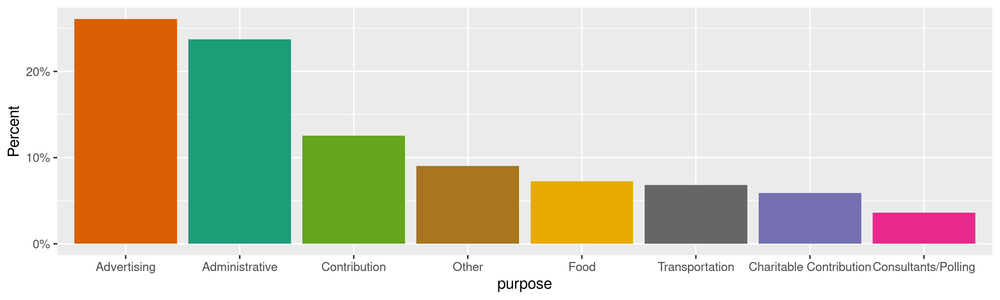
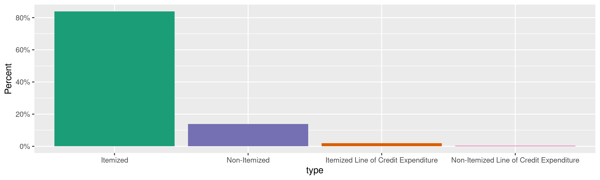
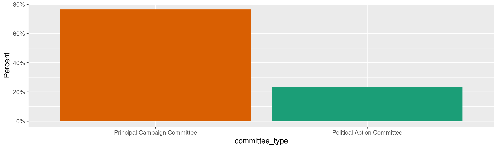
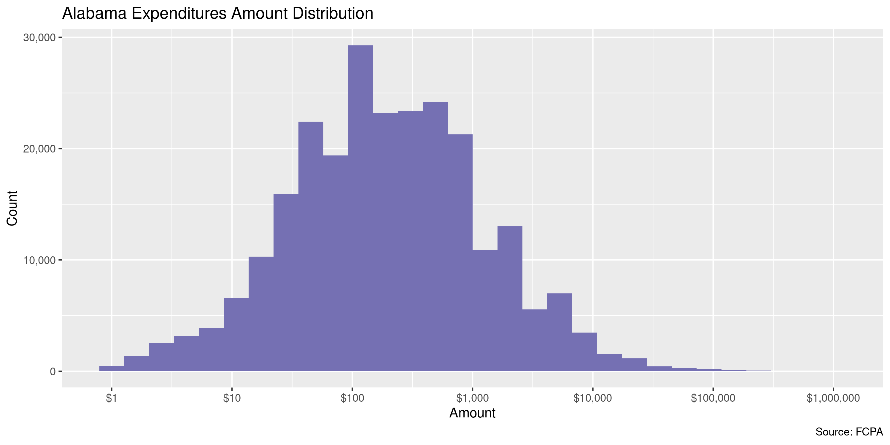
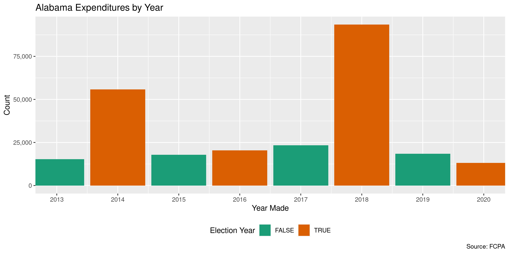
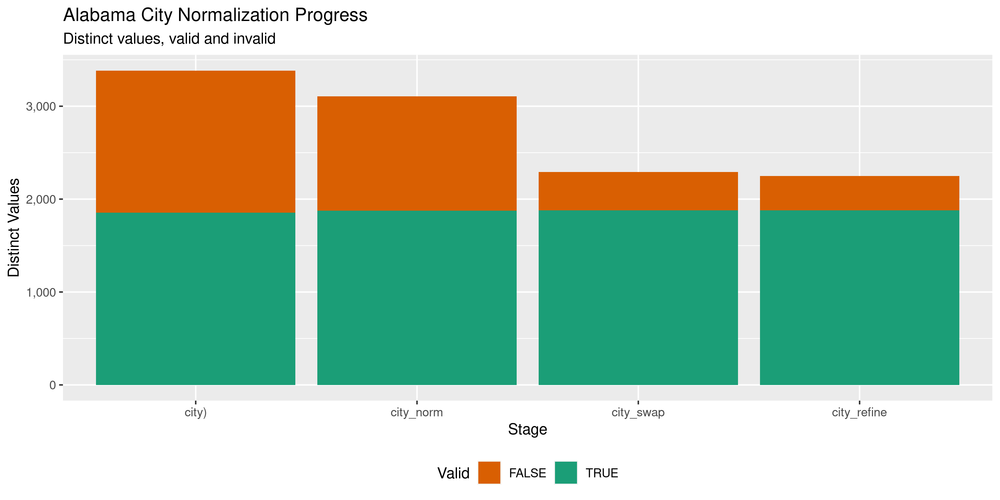

Alabama Expenditures
================
Kiernan Nicholls & Aarushi Sahejpal
Mon Feb 27 13:20:37 2023

- <a href="#project" id="toc-project">Project</a>
- <a href="#objectives" id="toc-objectives">Objectives</a>
- <a href="#packages" id="toc-packages">Packages</a>
- <a href="#data" id="toc-data">Data</a>
- <a href="#download" id="toc-download">Download</a>
- <a href="#read" id="toc-read">Read</a>
- <a href="#explore" id="toc-explore">Explore</a>
  - <a href="#missing" id="toc-missing">Missing</a>
  - <a href="#duplicates" id="toc-duplicates">Duplicates</a>
  - <a href="#categorical" id="toc-categorical">Categorical</a>
  - <a href="#amounts" id="toc-amounts">Amounts</a>
  - <a href="#dates" id="toc-dates">Dates</a>
- <a href="#wrangle" id="toc-wrangle">Wrangle</a>
  - <a href="#address" id="toc-address">Address</a>
  - <a href="#zip" id="toc-zip">ZIP</a>
  - <a href="#state" id="toc-state">State</a>
  - <a href="#city" id="toc-city">City</a>
- <a href="#conclude" id="toc-conclude">Conclude</a>
- <a href="#export" id="toc-export">Export</a>
- <a href="#upload" id="toc-upload">Upload</a>

<!-- Place comments regarding knitting here -->

## Project

The Accountability Project is an effort to cut across data silos and
give journalists, policy professionals, activists, and the public at
large a simple way to search across huge volumes of public data about
people and organizations.

Our goal is to standardizing public data on a few key fields by thinking
of each dataset row as a transaction. For each transaction there should
be (at least) 3 variables:

1.  All **parties** to a transaction.
2.  The **date** of the transaction.
3.  The **amount** of money involved.

## Objectives

This document describes the process used to complete the following
objectives:

1.  How many records are in the database?
2.  Check for entirely duplicated records.
3.  Check ranges of continuous variables.
4.  Is there anything blank or missing?
5.  Check for consistency issues.
6.  Create a five-digit ZIP Code called `zip`.
7.  Create a `year` field from the transaction date.
8.  Make sure there is data on both parties to a transaction.

## Packages

The following packages are needed to collect, manipulate, visualize,
analyze, and communicate these results. The `pacman` package will
facilitate their installation and attachment.

``` r
if (!require("pacman")) {
  install.packages("pacman")
}
pacman::p_load(
  tidyverse, # data manipulation
  lubridate, # datetime strings
  gluedown, # printing markdown
  janitor, # clean data frames
  campfin, # custom irw tools
  aws.s3, # aws cloud storage
  refinr, # cluster & merge
  scales, # format strings
  knitr, # knit documents
  vroom, # fast reading
  rvest, # scrape html
  glue, # code strings
  here, # project paths
  httr, # http requests
  fs # local storage 
)
```

This document should be run as part of the `R_campfin` project, which
lives as a sub-directory of the more general, language-agnostic
[`irworkshop/accountability_datacleaning`](https://github.com/irworkshop/accountability_datacleaning)
GitHub repository.

The `R_campfin` project uses the [RStudio
projects](https://support.rstudio.com/hc/en-us/articles/200526207-Using-Projects)
feature and should be run as such. The project also uses the dynamic
`here::here()` tool for file paths relative to *your* machine.

``` r
# where does this document knit?
here::i_am("al/expends/docs/al_expends_diary.Rmd")
```

## Data

Alabama expenditures data can be retrieved from the Alabama Electronic
Fair Campaign Practices Act (FCPA) [Reporting System
website](https://fcpa.alabamavotes.gov/PublicSite/Homepage.aspx). We can
find the files of interest on the [Data Download
page](https://fcpa.alabamavotes.gov/PublicSite/DataDownload.aspx), which
has a table of files available.

> This page provides comma separated value (CSV) downloadable files
> which contain annual data for Cash Contributions, In-Kind
> Contributions, Other Receipts, and Expenditures in a zipped file
> format. These files can be downloaded and imported into other
> applications (Microsoft Excel, Microsoft Access, etc.) for your use.

> This data is extracted from the Alabama Electronic FCPA Reporting
> System database as it existed as of 02/27/2023 1:35 AM

``` r
fcpa_home <- "https://fcpa.alabamavotes.gov/PublicSite"
al_table <- fcpa_home %>% 
  str_c("DataDownload.aspx", sep = "/") %>% 
  read_html(encoding = "UTF-8") %>% 
  html_node("#_ctl0_Content_dlstDownloadFiles")
```

| Data Type             | Year | Download                                                                                                                 |
|:----------------------|:-----|:-------------------------------------------------------------------------------------------------------------------------|
| Cash Contributions    | 2023 | [Download File](https://fcpa.alabamavotes.gov/PublicSite/Docs/BulkDataDownloads/2023_CashContributionsExtract.csv.zip)   |
| Expenditures          | 2023 | [Download File](https://fcpa.alabamavotes.gov/PublicSite/Docs/BulkDataDownloads/2023_ExpendituresExtract.csv.zip)        |
| In-Kind Contributions | 2023 | [Download File](https://fcpa.alabamavotes.gov/PublicSite/Docs/BulkDataDownloads/2023_InKindContributionsExtract.csv.zip) |
| Other Receipts        | 2023 | [Download File](https://fcpa.alabamavotes.gov/PublicSite/Docs/BulkDataDownloads/2023_OtherReceiptsExtract.csv.zip)       |
| Cash Contributions    | 2022 | [Download File](https://fcpa.alabamavotes.gov/PublicSite/Docs/BulkDataDownloads/2022_CashContributionsExtract.csv.zip)   |
| Expenditures          | 2022 | [Download File](https://fcpa.alabamavotes.gov/PublicSite/Docs/BulkDataDownloads/2022_ExpendituresExtract.csv.zip)        |
| In-Kind Contributions | 2022 | [Download File](https://fcpa.alabamavotes.gov/PublicSite/Docs/BulkDataDownloads/2022_InKindContributionsExtract.csv.zip) |
| Other Receipts        | 2022 | [Download File](https://fcpa.alabamavotes.gov/PublicSite/Docs/BulkDataDownloads/2022_OtherReceiptsExtract.csv.zip)       |
| Cash Contributions    | 2021 | [Download File](https://fcpa.alabamavotes.gov/PublicSite/Docs/BulkDataDownloads/2021_CashContributionsExtract.csv.zip)   |
| Expenditures          | 2021 | [Download File](https://fcpa.alabamavotes.gov/PublicSite/Docs/BulkDataDownloads/2021_ExpendituresExtract.csv.zip)        |

The Secretary of State also provides a file layout
[key](https://fcpa.alabamavotes.gov/PublicSite/Resources/AL_OtherReceiptsFileLayout.pdf).

| Field | Field Name           | Description                                    |
|:------|:---------------------|:-----------------------------------------------|
| A     | `ORG ID`             | This is the unique ID of the paying committee. |
| B     | `EXPENDITURE AMOUNT` | Dollar amount of the expenditure.              |
| C     | `EXPENDITURE DATE`   | Date of the expenditure.                       |
| D     | `LAST NAME`          | Last Name of Payee (entity paid).              |
| E     | `FIRST NAME`         | Payee First Name.                              |
| F     | `MI`                 | Payee Middle Name.                             |
| G     | `SUFFIX`             | Payee Name Suffix.                             |
| H     | `ADDRESS`            | Payee Address Number, Street, PO Box, etc.     |
| I     | `CITY`               | Payee City                                     |
| J     | `STATE`              | Payee State                                    |
| K     | `ZIP`                | Payee Zip Code                                 |
| L     | `EXPLANATION`        | Explanation provided if “Other” purpose.       |
| M     | `EXPENDITURE ID`     | Expenditure internal ID. This ID is unique.    |
| N     | `FILED DATE`         | Date the Expenditure was filed.                |
| O     | `PURPOSE`            | Purpose of the Expenditure.                    |
| P     | `EXPENDITURE TYPE`   | Indicates the Type of Expenditure.             |
| Q     | `COMMITTEE TYPE`     | Type of committee (PCC or PAC).                |
| R     | `COMMITTEE NAME`     | Name of the Committee if a PAC.                |
| S     | `CANDIDATE NAME`     | Name of the Candidate if a PCC.                |
| T     | `AMENDED`            | Y/N if this record has been amended.           |

## Download

We can construct a URL for each yearly file.

``` r
zip_dir <- dir_create(here("al", "expends", "data", "zip"))
raw_files <- glue("{2013:2023}_ExpendituresExtract.csv.zip")
raw_url <- str_c(fcpa_home, "/Docs/BulkDataDownloads/", raw_files)
raw_zip <- path(zip_dir, raw_files)
```

The URLs can be used to download the ZIP archives.

``` r
if (!all(file_exists(raw_zip))) {
  download.file(raw_url, raw_zip)
}
```

And the CSV files from those archives can be extracted.

``` r
csv_dir <- dir_create(here("al", "expends", "data", "csv"))
raw_csv <- map_chr(raw_zip, unzip, exdir = csv_dir)
```

``` r
for (f in raw_csv) {
  message(f)
  rx <- "(?<!(^|,|\"))\"(?!(,|$|\"))"
  x <- read_lines(f) 
  x <- str_replace_all(x, rx, "\'") 
  write_lines(x, f)
  rm(x)
  flush_memory(1)
  Sys.sleep(1)
}
```

## Read

``` r
ale <- map_df(
  .x = raw_csv,
  .f = read_delim,
  .id = "source_file",
  delim = ",",
  na = c("", " "),
  escape_backslash = FALSE,
  escape_double = FALSE,
  col_types = cols(
    .default = col_character(),
    ExpenditureDate = col_date_mdy(),
    ExpenditureAmount = col_double(),
    FiledDate = col_date_mdy()
  )
)
```

``` r
ale <- ale %>% 
  rename_with(.fn = str_remove, .cols = everything(), "^Expenditure") %>% 
  mutate(
    Amended = (Amended == "Y"),
    source_file = basename(raw_csv)[as.integer(source_file)]
  ) %>% 
  relocate(source_file, .after = last_col()) %>% 
  clean_names("snake")
```

## Explore

There are now 343,877 rows of 21 columns. Each column represents a
single expenditure made by a candidate or committee to a vendor.

``` r
glimpse(ale)
#> Rows: 343,877
#> Columns: 21
#> $ org_id         <chr> "25144", "25189", "25156", "25382", "25033", "25032", "24965", "24965", "24965", "25142", "2500…
#> $ amount         <dbl> 50.00, 100.00, 235.00, 10.00, 1.00, 45.00, 1228.15, 750.00, 2500.00, 200.00, 630.00, 1035.00, 6…
#> $ date           <date> 2013-01-01, 2013-01-01, 2013-01-01, 2013-01-01, 2013-01-01, 2013-01-02, 2013-01-02, 2013-01-02…
#> $ last_name      <chr> "CULLMAN COUNTY SPORTS HALL OF FAME", "AL.WILDLIFE FEDERATION", NA, NA, NA, NA, "DELTA PRINTING…
#> $ first_name     <chr> NA, NA, NA, NA, NA, NA, NA, NA, NA, NA, NA, NA, NA, NA, NA, NA, NA, NA, NA, NA, NA, NA, NA, NA,…
#> $ mi             <chr> NA, NA, NA, NA, NA, NA, NA, NA, NA, NA, NA, NA, NA, NA, NA, NA, NA, NA, NA, NA, NA, NA, NA, NA,…
#> $ suffix         <chr> NA, NA, NA, NA, NA, NA, NA, NA, NA, NA, NA, NA, NA, NA, NA, NA, NA, NA, NA, NA, NA, NA, NA, NA,…
#> $ address1       <chr> "510 5TH ST SW", "3050 LANARK ROAD", NA, NA, NA, NA, "6001 MONTICELLO DRIVE", "P.O. BOX 2663", …
#> $ city           <chr> "CULLMAN", "WETUMPKA", NA, NA, NA, NA, "MONTGOMERY", "TUSCALOOSA", "MONTGOMERY", "MONTGOMERY", …
#> $ state          <chr> "AL", "AL", NA, NA, NA, NA, "AL", "AL", "AL", "AL", "AL", "AL", "GA", "AL", "AL", "AL", "AL", "…
#> $ zip            <chr> "35055", "36054", NA, NA, NA, NA, "36117", "35403", "36104", "36104", "36702", "36702", "30353"…
#> $ explanation    <chr> "AD IN PROGRAM", NA, "ADVERTISING AND TICKET", "BANK FEE", NA, NA, NA, NA, NA, NA, NA, NA, "INT…
#> $ id             <chr> "1050", "3499", "4728", "7957", "712", "763", "900", "901", "897", "1157", "123", "124", "125",…
#> $ filed_date     <date> 2013-07-15, 2013-10-02, 2013-10-02, 2013-11-01, 2013-07-01, 2013-07-01, 2013-07-02, 2013-07-02…
#> $ purpose        <chr> "Advertising", "Charitable Contribution", "Other", "Administrative", "Administrative", "Adminis…
#> $ type           <chr> "Itemized", "Itemized", "Non-Itemized", "Non-Itemized", "Non-Itemized", "Non-Itemized", "Itemiz…
#> $ committee_type <chr> "Principal Campaign Committee", "Principal Campaign Committee", "Principal Campaign Committee",…
#> $ committee_name <chr> NA, NA, NA, "GULF PAC", "STORMING THE STATE HOUSE POLITICAL ACTION COMMITTEE", NA, NA, NA, NA, …
#> $ candidate_name <chr> "MARVIN MCDANIEL BUTTRAM", "RANDALL (RANDY) M DAVIS", "JAMES EDWARD BUSKEY", NA, NA, "MICHAEL G…
#> $ amended        <lgl> FALSE, FALSE, FALSE, FALSE, FALSE, FALSE, FALSE, FALSE, FALSE, FALSE, FALSE, FALSE, FALSE, FALS…
#> $ source_file    <chr> "2013_ExpendituresExtract.csv", "2013_ExpendituresExtract.csv", "2013_ExpendituresExtract.csv",…
tail(ale)
#> # A tibble: 6 × 21
#>   org_id amount date       last_…¹ first…² mi    suffix addre…³ city  state zip   expla…⁴ id    filed_date purpose type 
#>   <chr>   <dbl> <date>     <chr>   <chr>   <chr> <chr>  <chr>   <chr> <chr> <chr> <chr>   <chr> <date>     <chr>   <chr>
#> 1 24889    268. 2022-12-31 HANCOC… <NA>    <NA>  <NA>   P.O. B… GULF… MS    39502 BANK S… 3616… 2023-01-26 Other   Item…
#> 2 24889   -268. 2022-12-31 HANCOC… <NA>    <NA>  <NA>   P.O. B… GULF… MS    39502 Offset… 3649… 2023-02-09 Other   Item…
#> 3 24889    267. 2022-12-31 HANCOC… <NA>    <NA>  <NA>   P.O. B… GULF… MS    39502 BANK S… 3649… 2023-02-09 Other   Item…
#> 4 30267      5  2022-12-31 AUBURN… <NA>    <NA>  <NA>   100 NO… AUBU… AL    3683… <NA>    3622… 2023-01-29 Admini… Item…
#> 5 25153     70  2022-12-31 SYNOVU… <NA>    <NA>  <NA>   800 SH… BIRM… AL    35209 BANK S… 3610… 2023-01-24 Admini… Item…
#> 6 28873    250  2022-12-31 POMPEY  BRENDA  M     <NA>   P.O. B… CAMD… AL    36726 EXPENS… 3631… 2023-01-30 Other   Item…
#> # … with 5 more variables: committee_type <chr>, committee_name <chr>, candidate_name <chr>, amended <lgl>,
#> #   source_file <chr>, and abbreviated variable names ¹​last_name, ²​first_name, ³​address1, ⁴​explanation
```

### Missing

Columns vary in their degree of missing values.

``` r
col_stats(ale, count_na)
#> # A tibble: 21 × 4
#>    col            class       n         p
#>    <chr>          <chr>   <int>     <dbl>
#>  1 org_id         <chr>       0 0        
#>  2 amount         <dbl>       0 0        
#>  3 date           <date>      0 0        
#>  4 last_name      <chr>   47034 0.137    
#>  5 first_name     <chr>  282838 0.822    
#>  6 mi             <chr>  336161 0.978    
#>  7 suffix         <chr>  343005 0.997    
#>  8 address1       <chr>   47250 0.137    
#>  9 city           <chr>   47250 0.137    
#> 10 state          <chr>   47250 0.137    
#> 11 zip            <chr>   47439 0.138    
#> 12 explanation    <chr>  224911 0.654    
#> 13 id             <chr>       8 0.0000233
#> 14 filed_date     <date>     30 0.0000872
#> 15 purpose        <chr>      10 0.0000291
#> 16 type           <chr>      15 0.0000436
#> 17 committee_type <chr>      13 0.0000378
#> 18 committee_name <chr>  260301 0.757    
#> 19 candidate_name <chr>   83580 0.243    
#> 20 amended        <lgl>      20 0.0000582
#> 21 source_file    <chr>       0 0
```

We can flag any record missing a key variable needed to identify a
transaction.

``` r
ale <- mutate(ale, committee = coalesce(committee_name, candidate_name))
key_vars <- c("date", "last_name", "amount", "committee")
geo_vars <- c("address1", "city", "state", "zip")
ale <- flag_na(ale, all_of(key_vars))
sum(ale$na_flag)
#> [1] 47045
```

13.7% of records are missing a key variable.

``` r
ale %>% 
  filter(na_flag) %>% 
  select(all_of(key_vars))
#> # A tibble: 47,045 × 4
#>    date       last_name amount committee                                              
#>    <date>     <chr>      <dbl> <chr>                                                  
#>  1 2013-01-01 <NA>       235   JAMES EDWARD BUSKEY                                    
#>  2 2013-01-01 <NA>        10   GULF PAC                                               
#>  3 2013-01-01 <NA>         1   STORMING THE STATE HOUSE POLITICAL ACTION COMMITTEE    
#>  4 2013-01-02 <NA>        45   MICHAEL G. HUBBARD                                     
#>  5 2013-01-02 <NA>        10.4 TALLADEGA COUNTY REPUBLICAN PARTY                      
#>  6 2013-01-03 <NA>        10   MIKE BALL                                              
#>  7 2013-01-03 <NA>        95.6 ALABAMA HOSPITAL ASSOCIATION POLITICAL ACTION COMMITTEE
#>  8 2013-01-03 <NA>        50   TALLADEGA COUNTY REPUBLICAN PARTY                      
#>  9 2013-01-05 <NA>        42   JOHNNY MACK MORROW                                     
#> 10 2013-01-08 <NA>        36.0 UNITED TRANSPORTATION UNION                            
#> # … with 47,035 more rows
```

All of these records missing variables belong to a non-itemized `type`.

``` r
ale %>% 
  mutate(non_item = str_detect(type, "Non-Itemized")) %>% 
  group_by(na_flag) %>% 
  summarise(non_item = mean(non_item))
#> # A tibble: 2 × 2
#>   na_flag non_item
#>   <lgl>      <dbl>
#> 1 FALSE         NA
#> 2 TRUE          NA
```

We can remove the flag from such records, they should be missing this
data.

``` r
ale$na_flag[str_which(ale$type, "Non-Itemized")] <- FALSE
sum(ale$na_flag)
#> [1] 48
```

This leaves us with very few records.

``` r
ale %>% 
  filter(na_flag) %>% 
  select(all_of(key_vars), type)
#> # A tibble: 48 × 5
#>    date       last_name                                                                             amount commi…¹ type 
#>    <date>     <chr>                                                                                  <dbl> <chr>   <chr>
#>  1 2013-03-19  <NA>                                                                                 1   e2 TALLAD… Item…
#>  2 2013-11-08  <NA>                                                                                 9.37e1 SUZELL… Item…
#>  3 2013-11-12  <NA>                                                                                 2.44e1 SUZELL… Item…
#>  4 2014-09-04 "LOWTHER"                                                                             8.49e2 <NA>    <NA> 
#>  5 2015-01-09 "Other"                                                                               6.71e4 <NA>    <NA> 
#>  6 2015-02-09  <NA>                                                                                 5   e3 ALABAM… Item…
#>  7 2016-06-01  <NA>                                                                                 1   e2 MERCER… Item…
#>  8 2016-07-13 "COLVERT"                                                                             5   e2 <NA>    <NA> 
#>  9 2015-07-17 "LOWTHER"                                                                             3.94e2 <NA>    <NA> 
#> 10 2016-10-26 "SPORTS RADIO 93.9 'THE SCORE\"\",\"\",\"\",\"\",\"P. O. BOX 146\",\"FLORENCE\",\"AL… 6.2 e2 <NA>    <NA> 
#> # … with 38 more rows, and abbreviated variable name ¹​committee
```

### Duplicates

We can also flag any record completely duplicated across every column.

``` r
ale <- flag_dupes(ale, -id)
sum(ale$dupe_flag)
#> [1] 4165
```

1.2% of records are duplicates.

``` r
ale %>% 
  filter(dupe_flag) %>% 
  select(id, all_of(key_vars))
#> # A tibble: 4,165 × 5
#>    id    date       last_name amount committee                      
#>    <chr> <date>     <chr>      <dbl> <chr>                          
#>  1 2908  2013-01-28 BARTON      1000 ENPAC                          
#>  2 2916  2013-01-28 BARTON      1000 ENPAC                          
#>  3 11601 2013-02-08 <NA>          17 CULLMAN COUNTY REPUBLICAN WOMEN
#>  4 11602 2013-02-08 <NA>          17 CULLMAN COUNTY REPUBLICAN WOMEN
#>  5 11603 2013-02-08 <NA>          17 CULLMAN COUNTY REPUBLICAN WOMEN
#>  6 11604 2013-02-08 <NA>          17 CULLMAN COUNTY REPUBLICAN WOMEN
#>  7 11605 2013-02-08 <NA>          17 CULLMAN COUNTY REPUBLICAN WOMEN
#>  8 11590 2013-02-11 <NA>          17 CULLMAN COUNTY REPUBLICAN WOMEN
#>  9 11591 2013-02-11 <NA>          17 CULLMAN COUNTY REPUBLICAN WOMEN
#> 10 11592 2013-02-11 <NA>          17 CULLMAN COUNTY REPUBLICAN WOMEN
#> # … with 4,155 more rows
```

Similar to the missing values, much of these are non-itemized.

``` r
ale %>% 
  mutate(non_item = str_detect(type, "Non-Itemized")) %>% 
  group_by(dupe_flag) %>% 
  summarise(non_item = mean(non_item))
#> # A tibble: 2 × 2
#>   dupe_flag non_item
#>   <lgl>        <dbl>
#> 1 FALSE       NA    
#> 2 TRUE         0.525
```

``` r
ale$dupe_flag[str_which(ale$type, "Non-Itemized")] <- FALSE
sum(ale$dupe_flag)
#> [1] 1979
```

This removes most, but not all, duplicate records.

``` r
ale %>% 
  filter(dupe_flag) %>% 
  select(id, all_of(key_vars), type)
#> # A tibble: 1,979 × 6
#>    id    date       last_name        amount committee             type    
#>    <chr> <date>     <chr>             <dbl> <chr>                 <chr>   
#>  1 2908  2013-01-28 BARTON            1000  ENPAC                 Itemized
#>  2 2916  2013-01-28 BARTON            1000  ENPAC                 Itemized
#>  3 3366  2013-02-27 FASTSPRING         180. BRYAN MCDANIEL TAYLOR Itemized
#>  4 3367  2013-02-27 CONSTANT CONTACT    35  BRYAN MCDANIEL TAYLOR Itemized
#>  5 3373  2013-02-27 CONSTANT CONTACT    35  BRYAN MCDANIEL TAYLOR Itemized
#>  6 3376  2013-02-27 FASTSPRING         180. BRYAN MCDANIEL TAYLOR Itemized
#>  7 220   2013-05-08 SAHR GROUP        2000  ALABAMA 2014 PAC      Itemized
#>  8 221   2013-05-08 SAHR GROUP        2000  ALABAMA 2014 PAC      Itemized
#>  9 222   2013-05-08 SAHR GROUP        2000  ALABAMA 2014 PAC      Itemized
#> 10 4308  2013-08-01 WHALEY             200  RAY BRYAN             Itemized
#> # … with 1,969 more rows
```

### Categorical

``` r
col_stats(ale, n_distinct)
#> # A tibble: 24 × 4
#>    col            class       n          p
#>    <chr>          <chr>   <int>      <dbl>
#>  1 org_id         <chr>    3897 0.0113    
#>  2 amount         <dbl>   56515 0.164     
#>  3 date           <date>   3701 0.0108    
#>  4 last_name      <chr>   53243 0.155     
#>  5 first_name     <chr>    4689 0.0136    
#>  6 mi             <chr>      54 0.000157  
#>  7 suffix         <chr>      24 0.0000698 
#>  8 address1       <chr>   71813 0.209     
#>  9 city           <chr>    3995 0.0116    
#> 10 state          <chr>      89 0.000259  
#> 11 zip            <chr>    5699 0.0166    
#> 12 explanation    <chr>   49422 0.144     
#> 13 id             <chr>  343852 1.00      
#> 14 filed_date     <date>   2388 0.00694   
#> 15 purpose        <chr>      31 0.0000901 
#> 16 type           <chr>      19 0.0000553 
#> 17 committee_type <chr>      14 0.0000407 
#> 18 committee_name <chr>     596 0.00173   
#> 19 candidate_name <chr>    3137 0.00912   
#> 20 amended        <lgl>       3 0.00000872
#> 21 source_file    <chr>      11 0.0000320 
#> 22 committee      <chr>    3729 0.0108    
#> 23 na_flag        <lgl>       2 0.00000582
#> 24 dupe_flag      <lgl>       2 0.00000582
```

<!-- --><!-- --><!-- -->

### Amounts

``` r
summary(ale$amount)
#>      Min.   1st Qu.    Median      Mean   3rd Qu.      Max. 
#> -700000.0      50.0     175.0    1274.7     742.3 1000000.0
mean(ale$amount <= 0)
#> [1] 0.02127796
```

These are the records with the minimum and maximum amounts.

``` r
glimpse(ale[c(which.max(ale$amount), which.min(ale$amount)), ])
#> Rows: 2
#> Columns: 24
#> $ org_id         <chr> "25003", "24982"
#> $ amount         <dbl> 1e+06, -7e+05
#> $ date           <date> 2014-03-03, 2019-03-27
#> $ last_name      <chr> "ALABAMA EDUCATION ASSOCIATION", "FARM BUREAU BANK"
#> $ first_name     <chr> NA, NA
#> $ mi             <chr> NA, NA
#> $ suffix         <chr> NA, NA
#> $ address1       <chr> "P.O. BOX 4177", "17300 HENDERSON PASS"
#> $ city           <chr> "MONTGOMERY", "SAN ANTONIO"
#> $ state          <chr> "AL", "TX"
#> $ zip            <chr> "36103", "78232-1568"
#> $ explanation    <chr> "LOAN", "Offset due to deletion of filed item"
#> $ id             <chr> "21321", "289841"
#> $ filed_date     <date> 2014-04-02, 2021-09-22
#> $ purpose        <chr> "Other", "Other"
#> $ type           <chr> "Itemized", "Itemized"
#> $ committee_type <chr> "Political Action Committee", "Political Action Committee"
#> $ committee_name <chr> "ALABAMA VOICE OF TEACHERS FOR EDUCATION", "FARM PAC - THE POLITICAL ACTION COMMITTEE OF THE AL…
#> $ candidate_name <chr> NA, NA
#> $ amended        <lgl> FALSE, FALSE
#> $ source_file    <chr> "2014_ExpendituresExtract.csv", "2021_ExpendituresExtract.csv"
#> $ committee      <chr> "ALABAMA VOICE OF TEACHERS FOR EDUCATION", "FARM PAC - THE POLITICAL ACTION COMMITTEE OF THE AL…
#> $ na_flag        <lgl> FALSE, FALSE
#> $ dupe_flag      <lgl> FALSE, FALSE
```

<!-- -->

### Dates

We can add the calendar year from `date` with `lubridate::year()`

``` r
ale <- mutate(ale, year = year(date))
```

``` r
min(ale$date)
#> [1] "2010-02-09"
sum(ale$year < 2000)
#> [1] 0
max(ale$date)
#> [1] "2023-02-16"
sum(ale$date > today())
#> [1] 0
```

<!-- -->

## Wrangle

To improve the searchability of the database, we will perform some
consistent, confident string normalization. For geographic variables
like city names and ZIP codes, the corresponding `campfin::normal_*()`
functions are tailor made to facilitate this process.

### Address

For the street `addresss` variable, the `campfin::normal_address()`
function will force consistence case, remove punctuation, and abbreviate
official USPS suffixes.

``` r
addr_norm <- ale %>% 
  distinct(address1) %>% 
  mutate(
    address_norm = normal_address(
      address = address1,
      abbs = usps_street,
      na_rep = TRUE
    )
  )
```

``` r
addr_norm
#> # A tibble: 71,813 × 2
#>    address1                       address_norm                 
#>    <chr>                          <chr>                        
#>  1 510 5TH ST SW                  510 5TH ST SW                
#>  2 3050 LANARK ROAD               3050 LANARK RD               
#>  3 <NA>                           <NA>                         
#>  4 6001 MONTICELLO DRIVE          6001 MONTICELLO DR           
#>  5 P.O. BOX 2663                  PO BOX 2663                  
#>  6 60 COMMERCE STREET, SUITE 1400 60 COMMERCE STREET SUITE 1400
#>  7 201 TALLAPOOSA STREET          201 TALLAPOOSA ST            
#>  8 PO BOX 2080                    PO BOX 2080                  
#>  9 PO BOX 536126                  PO BOX 536126                
#> 10 101 TALLAPOOSA STREET          101 TALLAPOOSA ST            
#> # … with 71,803 more rows
```

``` r
ale <- left_join(ale, addr_norm, by = "address1")
```

### ZIP

For ZIP codes, the `campfin::normal_zip()` function will attempt to
create valid *five* digit codes by removing the ZIP+4 suffix and
returning leading zeroes dropped by other programs like Microsoft Excel.

``` r
ale <- ale %>% 
  mutate(
    zip_norm = normal_zip(
      zip = zip,
      na_rep = TRUE
    )
  )
```

``` r
progress_table(
  ale$zip,
  ale$zip_norm,
  compare = valid_zip
)
#> # A tibble: 2 × 6
#>   stage        prop_in n_distinct prop_na n_out n_diff
#>   <chr>          <dbl>      <dbl>   <dbl> <dbl>  <dbl>
#> 1 ale$zip        0.977       5699   0.138  6811   1451
#> 2 ale$zip_norm   0.995       4803   0.139  1511    504
```

### State

Valid two digit state abbreviations can be made using the
`campfin::normal_state()` function.

``` r
ale <- ale %>% 
  mutate(
    state_norm = normal_state(
      state = state,
      abbreviate = TRUE,
      na_rep = TRUE,
      valid = valid_state
    )
  )
```

``` r
ale %>% 
  filter(state != state_norm) %>% 
  count(state, state_norm, sort = TRUE)
#> # A tibble: 1 × 3
#>   state      state_norm     n
#>   <chr>      <chr>      <int>
#> 1 WASHINGTON WA             1
```

``` r
progress_table(
  ale$state,
  ale$state_norm,
  compare = valid_state
)
#> # A tibble: 2 × 6
#>   stage          prop_in n_distinct prop_na n_out n_diff
#>   <chr>            <dbl>      <dbl>   <dbl> <dbl>  <dbl>
#> 1 ale$state         1.00         89   0.137   114     34
#> 2 ale$state_norm    1            55   0.138     0      1
```

### City

Cities are the most difficult geographic variable to normalize, simply
due to the wide variety of valid cities and formats.

#### Normal

The `campfin::normal_city()` function is a good start, again converting
case, removing punctuation, but *expanding* USPS abbreviations. We can
also remove `invalid_city` values.

``` r
norm_city <- ale %>% 
  distinct(city, state_norm, zip_norm) %>% 
  mutate(
    city_norm = normal_city(
      city = city, 
      abbs = usps_city,
      states = c("AL", "DC", "ALABAMA"),
      na = invalid_city,
      na_rep = TRUE
    )
  )
```

#### Swap

We can further improve normalization by comparing our normalized value
against the *expected* value for that record’s state abbreviation and
ZIP code. If the normalized value is either an abbreviation for or very
similar to the expected value, we can confidently swap those two.

``` r
norm_city <- norm_city %>% 
  rename(city_raw = city) %>% 
  left_join(
    y = zipcodes,
    by = c(
      "state_norm" = "state",
      "zip_norm" = "zip"
    )
  ) %>% 
  rename(city_match = city) %>% 
  mutate(
    match_abb = is_abbrev(city_norm, city_match),
    match_dist = str_dist(city_norm, city_match),
    city_swap = if_else(
      condition = !is.na(match_dist) & (match_abb | match_dist == 1),
      true = city_match,
      false = city_norm
    )
  ) %>% 
  select(
    -city_match,
    -match_dist,
    -match_abb
  )
```

``` r
ale <- left_join(
  x = ale,
  y = norm_city,
  by = c(
    "city" = "city_raw", 
    "state_norm", 
    "zip_norm"
  )
)
```

#### Refine

The [OpenRefine](https://openrefine.org/) algorithms can be used to
group similar strings and replace the less common versions with their
most common counterpart. This can greatly reduce inconsistency, but with
low confidence; we will only keep any refined strings that have a valid
city/state/zip combination.

``` r
good_refine <- ale %>% 
  mutate(
    city_refine = city_swap %>% 
      key_collision_merge() %>% 
      n_gram_merge(numgram = 1)
  ) %>% 
  filter(city_refine != city_swap) %>% 
  inner_join(
    y = zipcodes,
    by = c(
      "city_refine" = "city",
      "state_norm" = "state",
      "zip_norm" = "zip"
    )
  )
```

    #> # A tibble: 61 × 5
    #>    state_norm zip_norm city_swap      city_refine       n
    #>    <chr>      <chr>    <chr>          <chr>         <int>
    #>  1 AL         36104    MONTOMGERY     MONTGOMERY       79
    #>  2 IL         60197    CARROLL STREAM CAROL STREAM     28
    #>  3 CA         94107    SAN FRANSICO   SAN FRANCISCO    20
    #>  4 OH         45249    CINNCINATI     CINCINNATI       13
    #>  5 AL         35121    OENOTA         ONEONTA           8
    #>  6 AL         35768    SCOTTSOBOR     SCOTTSBORO        6
    #>  7 AL         35769    SCOTTSOBOR     SCOTTSBORO        6
    #>  8 OH         45249    CINNICINATI    CINCINNATI        6
    #>  9 AL         35234    BMINGHAMIR     BIRMINGHAM        5
    #> 10 OH         45274    CINCINATTI     CINCINNATI        3
    #> # … with 51 more rows

Then we can join the refined values back to the database.

``` r
ale <- ale %>% 
  left_join(good_refine) %>% 
  mutate(city_refine = coalesce(city_refine, city_swap))
```

#### Progress

Our goal for normalization was to increase the proportion of city values
known to be valid and reduce the total distinct values by correcting
misspellings.

| stage                                                                   | prop_in | n_distinct | prop_na | n_out | n_diff |
|:------------------------------------------------------------------------|--------:|-----------:|--------:|------:|-------:|
| str_to_upper(ale$city) | 0.972| 3995| 0.137| 8278| 1868| |ale$city_norm |   0.977 |       3684 |   0.138 |  6786 |   1541 |
| ale$city_swap | 0.992| 2691| 0.138| 2386| 536| |ale$city_refine         |   0.993 |       2640 |   0.138 |  2143 |    485 |

You can see how the percentage of valid values increased with each
stage.

<!-- -->

More importantly, the number of distinct values decreased each stage. We
were able to confidently change many distinct invalid values to their
valid equivalent.

<!-- -->

## Conclude

Before exporting, we can remove the intermediary normalization columns
and rename all added variables with the `_clean` suffix.

``` r
ale <- ale %>% 
  select(
    -city_norm,
    -city_swap,
    city_clean = city_refine
  ) %>% 
  rename_all(~str_replace(., "_norm", "_clean")) %>% 
  rename_all(~str_remove(., "_raw")) %>% 
  relocate(state_clean, zip_clean, .after = city_clean)
```

``` r
glimpse(sample_n(ale, 50))
#> Rows: 50
#> Columns: 29
#> $ org_id         <chr> "24964", "25662", "27648", "25087", "25325", "27117", "25899", "25172", "29488", "26428", "2517…
#> $ amount         <dbl> 76.86, 671.00, 303.97, 300.00, 72.00, 1000.00, 400.00, 227.04, 1500.00, 34.75, 5000.00, 5.00, 5…
#> $ date           <date> 2016-09-01, 2014-03-13, 2018-06-27, 2014-10-02, 2021-12-06, 2018-05-30, 2016-02-10, 2022-08-05…
#> $ last_name      <chr> "MARRIOTT", "KEVIN CANNON PHOTOGRAPY", "PERDIDO BEACH RESORT", "BATTLES", "WELLS FARGO", "HARWO…
#> $ first_name     <chr> NA, NA, NA, "BOYD", NA, "TUCKER", NA, NA, NA, NA, "JAMES", NA, "DAVID", NA, NA, NA, NA, "COLLIN…
#> $ mi             <chr> NA, NA, NA, NA, NA, NA, NA, NA, NA, NA, NA, NA, "W", NA, NA, NA, NA, NA, NA, NA, NA, NA, NA, NA…
#> $ suffix         <chr> NA, NA, NA, NA, NA, NA, NA, NA, NA, NA, NA, NA, NA, NA, NA, NA, NA, "JR.", NA, NA, NA, NA, NA, …
#> $ address1       <chr> "1 GRAND BLVD.", "235 SOUTH WILSON AVE", "27200 PERDIDO BEACH BLVD", "49 SOMMERSET DRIVE", "EAS…
#> $ city           <chr> "POINT CLEAR", "PRICHARD", "ORANGE BEACH", "PHENIX CITY", "MONTGOMERY", "BIRMINGHAM", "FLORENCE…
#> $ state          <chr> "AL", "AL", "AL", "AL", "AL", "AL", "AL", "AL", "AL", "AL", "AL", "AL", "AL", NA, NA, "AL", "AL…
#> $ zip            <chr> "36564", "36610", "36561", "36869", "36106", "35205", "35631", "36083", "36104", "35209", "3634…
#> $ explanation    <chr> NA, "POST CARDS AND FLYERS", NA, "PUTTING UP SIGNS/ HANDING OUT FLYERS", NA, NA, NA, NA, NA, NA…
#> $ id             <chr> "108829", "21844", "191239", "55350", "298398", "181562", "91247", "346088", "333508", "166755"…
#> $ filed_date     <date> 2017-01-31, 2014-03-31, 2018-07-03, 2014-10-10, 2022-01-03, 2018-06-01, 2016-02-13, 2022-09-01…
#> $ purpose        <chr> "Administrative", "Advertising", "Lodging", "Other", "Administrative", "Consultants/Polling", "…
#> $ type           <chr> "Itemized", "Itemized", "Itemized", "Itemized", "Itemized", "Itemized", "Itemized", "Itemized",…
#> $ committee_type <chr> "Principal Campaign Committee", "Principal Campaign Committee", "Principal Campaign Committee",…
#> $ committee_name <chr> NA, NA, NA, NA, "ALA-CRNA", NA, NA, NA, NA, NA, "ASSOCIATED GENERAL CONTRACTORS - PAC", NA, NA,…
#> $ candidate_name <chr> "TOM WHATLEY", "HENRY ABDUL HASEEB", "JOSEPH JAY SIEGELMAN", "LESLEY VANCE", NA, "LINDSEY DECKA…
#> $ amended        <lgl> FALSE, FALSE, FALSE, FALSE, FALSE, FALSE, FALSE, FALSE, FALSE, FALSE, FALSE, FALSE, FALSE, FALS…
#> $ source_file    <chr> "2017_ExpendituresExtract.csv", "2014_ExpendituresExtract.csv", "2018_ExpendituresExtract.csv",…
#> $ committee      <chr> "TOM WHATLEY", "HENRY ABDUL HASEEB", "JOSEPH JAY SIEGELMAN", "LESLEY VANCE", "ALA-CRNA", "LINDS…
#> $ na_flag        <lgl> FALSE, FALSE, FALSE, FALSE, FALSE, FALSE, FALSE, FALSE, FALSE, FALSE, FALSE, FALSE, FALSE, FALS…
#> $ dupe_flag      <lgl> FALSE, FALSE, FALSE, FALSE, FALSE, FALSE, FALSE, FALSE, FALSE, FALSE, FALSE, FALSE, FALSE, FALS…
#> $ year           <dbl> 2016, 2014, 2018, 2014, 2021, 2018, 2016, 2022, 2022, 2018, 2018, 2021, 2014, 2013, 2020, 2018,…
#> $ address_clean  <chr> "1 GRAND BLVD", "235 SOUTH WILSON AVE", "27200 PERDIDO BEACH BLVD", "49 SOMMERSET DR", "EASTERN…
#> $ city_clean     <chr> "POINT CLEAR", "PRICHARD", "ORANGE BEACH", "PHENIX CITY", "MONTGOMERY", "BIRMINGHAM", "FLORENCE…
#> $ state_clean    <chr> "AL", "AL", "AL", "AL", "AL", "AL", "AL", "AL", "AL", "AL", "AL", "AL", "AL", NA, NA, "AL", "AL…
#> $ zip_clean      <chr> "36564", "36610", "36561", "36869", "36106", "35205", "35631", "36083", "36104", "35209", "3634…
```

1.  There are 343,877 records in the database.
2.  There are 1,979 duplicate records in the database.
3.  The range and distribution of `amount` and `date` seem reasonable.
4.  There are 48 records missing key variables.
5.  Consistency in geographic data has been improved with
    `campfin::normal_*()`.
6.  The 4-digit `year` variable has been created with
    `lubridate::year()`.

## Export

Now the file can be saved on disk for upload to the Accountability
server.

``` r
clean_dir <- dir_create(here("al", "expends", "data", "clean"))
clean_path <- path(clean_dir, "al_expends_clean.csv")
write_csv(ale, clean_path, na = "")
(clean_size <- file_size(clean_path))
#> 91.7M
file_encoding(clean_path) %>% 
  mutate(across(path, path.abbrev))
#> # A tibble: 1 × 3
#>   path                                                                                      mime  charset
#>   <fs::path>                                                                                <chr> <chr>  
#> 1 /Volumes/TAP/accountability_datacleaning/state/al/expends/data/clean/al_expends_clean.csv <NA>  <NA>
```

## Upload

We can use the `aws.s3::put_object()` to upload the text file to the IRW
server.

``` r
aws_path <- path("csv", basename(clean_path))
if (!object_exists(aws_path, "publicaccountability")) {
  put_object(
    file = clean_path,
    object = aws_path, 
    bucket = "publicaccountability",
    acl = "public-read",
    show_progress = TRUE,
    multipart = TRUE
  )
}
aws_head <- head_object(aws_path, "publicaccountability")
(aws_size <- as_fs_bytes(attr(aws_head, "content-length")))
unname(aws_size == clean_size)
```
