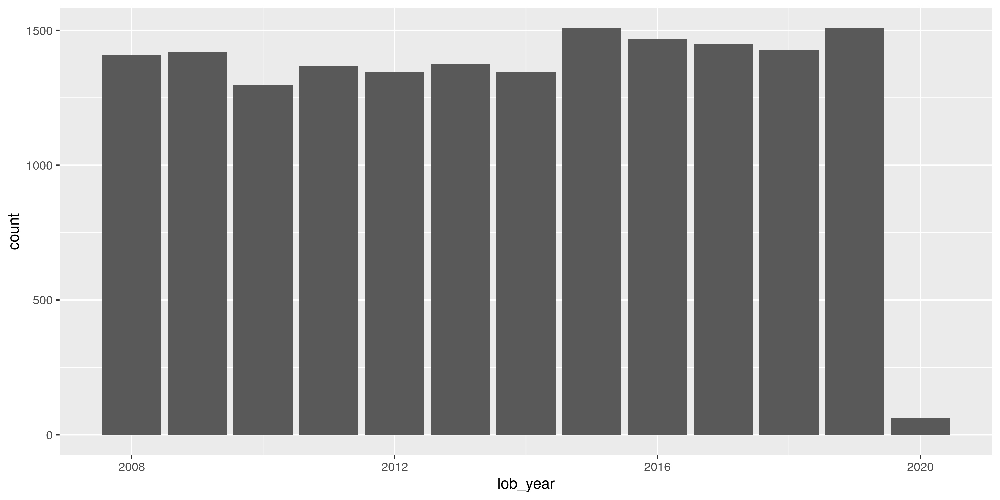

Alabama Lobbyists
================
Kiernan Nicholls & Yanqi Xu
2023-06-13 21:05:18

- <a href="#project" id="toc-project">Project</a>
- <a href="#objectives" id="toc-objectives">Objectives</a>
- <a href="#packages" id="toc-packages">Packages</a>
- <a href="#data" id="toc-data">Data</a>
- <a href="#import" id="toc-import">Import</a>
- <a href="#explore" id="toc-explore">Explore</a>
- <a href="#wrangle" id="toc-wrangle">Wrangle</a>
- <a href="#normalize" id="toc-normalize">Normalize</a>
- <a href="#export" id="toc-export">Export</a>

  - [Project](#project)
  - [Objectives](#objectives)
  - [Packages](#packages)
  - [Data](#data)
  - [Import](#import)
  - [Explore](#explore)
  - [Wrangle](#wrangle)
  - [Normalize](#normalize)
  - [Export](#export)

<!-- Place comments regarding knitting here -->

## Project

The Accountability Project is an effort to cut across data silos and
give journalists, policy professionals, activists, and the public at
large a simple way to search across huge volumes of public data about
people and organizations.

Our goal is to standardizing public data on a few key fields by thinking
of each dataset row as a transaction. For each transaction there should
be (at least) 3 variables:

1.  All **parties** to a transaction
2.  The **date** of the transaction
3.  The **amount** of money involved

## Objectives

This document describes the process used to complete the following
objectives:

1.  How many records are in the database?
2.  Check for duplicates
3.  Check ranges
4.  Is there anything blank or missing?
5.  Check for consistency issues
6.  Create a five-digit ZIP Code called `ZIP5`
7.  Create a `YEAR` field from the transaction date
8.  Make sure there is data on both parties to a transaction

## Packages

The following packages are needed to collect, manipulate, visualize,
analyze, and communicate these results. The `pacman` package will
facilitate their installation and attachment.

The IRW’s `campfin` package will also have to be installed from GitHub.
This package contains functions custom made to help facilitate the
processing of campaign finance data.

``` r
if (!require("pacman")) install.packages("pacman")
pacman::p_load_gh("irworkshop/campfin")
pacman::p_load(
  tidyverse, # data manipulation
  lubridate, # datetime strings
  magrittr, # pipe opperators
  pdftools, # process pdf text
  janitor, # dataframe clean
  refinr, # cluster and merge
  scales, # format strings
  knitr, # knit documents
  vroom, # read files fast
  glue, # combine strings
  here, # relative storage
  fs # search storage 
)
```

This document should be run as part of the `R_campfin` project, which
lives as a sub-directory of the more general, language-agnostic
[`irworkshop/accountability_datacleaning`](https://github.com/irworkshop/accountability_datacleaning "TAP repo")
GitHub repository.

The `R_campfin` project uses the [RStudio
projects](https://support.rstudio.com/hc/en-us/articles/200526207-Using-Projects "Rproj")
feature and should be run as such. The project also uses the dynamic
`here::here()` tool for file paths relative to *your* machine.

``` r
# where does this document knit?
here::here()
#> [1] "/Users/yanqixu/code/accountability_datacleaning"
```

## Data

Data is obtained from the [Alabama Ethics Commission
(AEC)](http://ethics.alabama.gov/).

> The Alabama Ethics Commission was created by the Alabama Legislature
> in 1973 by Act No. 1056. The mission of this Commission is to ensure
> that public officials are independent and impartial; that decisions
> and policies are made in the proper governmental channels; that public
> office is not used for private gain; and, most importantly, that there
> is public confidence in the integrity of government.

On the [lobbyist section](http://ethics.alabama.gov/lobbyists.aspx) of
the AEC website, the requirments for lobbyist registration are given.

> Registration as a Lobbyist is now required if your duties include
> promoting or attempting to influence the awarding of a grant or
> contract with any department or agency of the Executive, Legislative
> or Judicial Branch of state government.

Per [Section
36-25-1(20)](http://ethics.alabama.gov/docs/WhatisLobbyingREVISEDDec2012.pdf):

> Lobby or Lobbying is: “The practice of promoting, opposing, or in any
> manner influencing or attempting to influence the introduction,
> defeat, or enactment of legislation before any legislative body;
> opposing or in any manner influencing the executive approval, veto, or
> amendment of legislation; or the practice of promoting, opposing, or
> in any manner influencing or attempting to influence the enactment,
> promulgation, modification, or deletion of regulations before any
> regulatory body. The term does not include providing public testimony
> before a legislative body or regulatory body or any committee
> thereof.”

## Import

While the AEC *does* provide two Excel files listing [registered
lobbyists](https://ethics-form.alabama.gov/entity/FileUpload2015/RegisteredLobbyist/WebDataForExcel_2010.aspx)
and [registered principal
clients](https://ethics-form.alabama.gov/entity/FileUpload2015/RegisteredLobbyist/rptPrincipalsListing_Excel.aspx),
these two files do not show the relationship between each lobbyist and
those entities for which they lobby.

Instead, that relationship is documented on annual filings for each
individual lobbyist. These reports are given as PDF documents and can be
searched from the [AEC search
page](http://ethics.alabama.gov/search/PublicEmployeeSearch.aspx).

The PDF statements can be then be viewed one at a time. Each yearly PDF
of a lobyist has a unique lobbyist ID (`lid`), which can be passed to an
`httr::GET()` request to save the PDF.

### Download

Opening random PDF’s from 2008 to 2023, it seems as though their are
valid lobbyist ID’s from 1 to 14,900 (with roughly 25% inbetween leading
to “empty” files without any information).

This takes **hours**, but we can loop through each ID and write the file
to disk.

``` r
raw_dir <- dir_create(here("state","al", "lobby", "data", "raw"))
```

``` r
n <- 14900
start_time <- Sys.time()
if (length(dir_ls(raw_dir)) < 5000) {
  for (i in seq(n)) {
    path <- glue("{raw_dir}/reg_{str_pad(i, nchar(n), pad = '0')}.pdf")
    loop_start <- Sys.time()
    # make get request
    GET(
      url = "http://ethics.alabama.gov/search/ViewReports.aspx",
      write_disk(path, overwrite = TRUE),
      query = list(
        lid = i,
        rpt = "rptLobbyistRegistration"
      )
    )
    # delete if empty pdf
    if (file_size(path) == 55714) {
      file_delete(path)
      deleted <- TRUE
    } else {
      deleted <- FALSE
    }
    # track progress
    loop_time <- Sys.time() - loop_start
    loop_time <- paste(round(loop_time, 2), attributes(loop_time)$units)
    total_time <- Sys.time() - start_time
    total_time <- paste(round(total_time, 2), attributes(total_time)$units)
    message(glue(
      "{i} done in {str_pad(loop_time, 2)}",
      "running for {str_pad(total_time, 2)}",
      "({percent(i/n)})",
      deleted,
      .sep = " / "
    ))
    # rand sleep
    Sys.sleep(time = runif(n = 1, min = 0, max = 3))
  }
}
```

### Read

Once we have downloaded all 7,500 PDF files to the same directory, we
can write some generic functions that use the `pdftools::pdf_text()` and
`stringr::str_extract()` functions to scan the embeded text of each page
and extract the bits of information we want.

The overall technic is to create 1 data rame row with lobbyist
information per document and an individual row per principal client. We
can then combine those two data frames to produce a single row per
lobbyist-principal relationship.

This `str_get()` function is just a simple way to look for the line
containing the information we want (e.g., Lobbyist Name) and extract the
relevant text from that line using regular expressions. Each page has
the exact same layout, so we can then use this function to get each bit
of text from every page.

``` r
# extract first from which contains
str_get <- function(string, pattern, n = 1) {
  got <- str_trim(str_extract(str_subset(string, pattern), pattern)[[n]])
  if (nchar(got) == 0) {
    got <- NA_character_
  }
  return(got)
}
```

This `frame_lob()` function uses `str_get()` to locate each piece of
information and turn it into the column of a single row tibble.

``` r
frame_lob <- function(x) {
    # find email line index
    which_email <- str_which(x, "E-Mail")
    # check for no address after email
    if (str_detect(x[which_email + 1], "Address", negate = TRUE)) {
      # collapse two lines
      x[which_email] <- str_c(x[which_email], x[which_email + 1], collapse = "")
      # remove overflow line
      x <- x[-(which_email + 1)]
    }
    # extract content from lines of text
    tibble(
      lob_year = as.integer(str_get(x, "(?<=Year:)(.*)")),
      lob_date = mdy(str_get(x[str_which(x, "I certify that") + 1], "(?<=Date:)(.*)")),
      lob_name = str_get(x, "(?<=Lobbyist:)(.*)(?=Business Phone:)"),
      lob_phone = str_get(x, "(?<=Business Phone:)(.*)"),
      lob_addr1 = str_get(x, "(?<=Business)(.*)(?=E-Mail)"),
      lob_addr2 = str_get(x, "(?<=Address:)(.*)"),
      lob_city = str_get(x, "(?<=City/State/Zip:)(.*)"),
      lob_public = str_get(x, "(?<=Public Employee\\?)(.*)"),
      # combine all lines between these
      lob_subjects = str_c(x[seq(
        str_which(x, "Categories of legislation") + 1,
        str_which(x, "List Business Entities") - 1
      )], collapse = " "
      )
    )
  }
```

This `frame_pri()` function does a similar thing for each principal
section of the document.

``` r
# extract content from lines of text
frame_pri <- function(section) {
    a <- section$text
    tibble(
      pri_name = str_get(a, "(?<=Principal Name:\\s)(.*)(?=\\sPhone)"),
      pri_phone = str_get(a, "(?<=Phone:)(.*)"),
      pri_addr = str_get(a, "(?<=Address:)(.*)"),
      pri_start = mdy(str_get(a, "(?<=Effective Date:)(.*)(?=\\s)")),
      pri_end_date = mdy(str_get(a, "(?<=Termination Date:)(.*)")),
      pri_sign = str_get(a, "(?<=Principal:)(.*)"),
      pri_behalf = a[str_which(a, "If your activity") + 1]
    )
  }
```

The final `frame_pdf()` function reads the PDF document and
appropriately formats the text before calling `frame_lob()` and
`frame_pri()` to return a single combined data frame.

``` r
frame_pdf <- function(file) {
  id <- str_extract(file, "\\d+")

  # read text of single file
  text <-
    # read lines of text
    pdf_text(pdf = file) %>%
    # concat pages of text
    str_c(collapse = "\n") %>%
    # split by newline
    str_split(pattern = "\n") %>%
    pluck(1) %>%
    # reduce whitespace
    str_squish() %>%
    # remove header, footer, empty
    str_subset("^Page \\d+ of \\d+$", negate = TRUE) %>%
    str_subset("^\\d{1,2}/\\d{1,2}/\\d{4}$", negate = TRUE) %>%
    str_subset("^$", negate = TRUE)
  
  lob <-
    frame_lob(x = text) %>%
    mutate(id) %>%
    select(id, everything())

  # keep only pri lines
  pri <- text[seq(
    str_which(text, "List Business Entities") + 1,
    str_which(text, "I certify that") - 1
  )]

  pri <- pri %>%
    enframe(name = "line", value = "text") %>%
    # count pri section
    mutate(section = cumsum(str_detect(text, "Principal Name:"))) %>%
    # split into list
    group_split(section)
  
  # frame every section
  pri <- map_df(pri, frame_pri)

  # rep lob by col bind
  as_tibble(cbind(lob, pri))
}
```

We can then apply this function to every PDF downloaded and combine the
results of each into a single giant data frame.

``` r
allr <- map_df(
  .x = dir_ls(raw_dir),
  .f = frame_pdf
)
```

## Explore

``` r
head(allr)
#> # A tibble: 6 × 17
#>   id    lob_year lob_date   lob_n…¹ lob_p…² lob_a…³ lob_a…⁴ lob_c…⁵ lob_p…⁶ lob_s…⁷ pri_n…⁸ pri_p…⁹
#>   <chr>    <dbl> <date>     <chr>   <chr>   <chr>   <chr>   <chr>   <chr>   <chr>   <chr>   <chr>  
#> 1 00004     2008 NA         ADAMS,… 334-26… Post O… 465 So… Montgo… No      ZZZ Ch… Adams … 334-26…
#> 2 00004     2008 NA         ADAMS,… 334-26… Post O… 465 So… Montgo… No      ZZZ Ch… Financ… 334-55…
#> 3 00004     2008 NA         ADAMS,… 334-26… Post O… 465 So… Montgo… No      ZZZ Ch… Kimber… 334-26…
#> 4 00004     2008 NA         ADAMS,… 334-26… Post O… 465 So… Montgo… No      ZZZ Ch… Poultr… 334-26…
#> 5 00004     2008 NA         ADAMS,… 334-26… Post O… 465 So… Montgo… No      ZZZ Ch… Save t… 203-22…
#> 6 00005     2008 2008-12-09 ADAMS,… 334-26… 400 S.… Suite … Montgo… No      ZZZ Bu… Access… 334-51…
#> # … with 5 more variables: pri_addr <chr>, pri_start <date>, pri_end_date <date>, pri_sign <chr>,
#> #   pri_behalf <chr>, and abbreviated variable names ¹​lob_name, ²​lob_phone, ³​lob_addr1,
#> #   ⁴​lob_addr2, ⁵​lob_city, ⁶​lob_public, ⁷​lob_subjects, ⁸​pri_name, ⁹​pri_phone
tail(allr)
#> # A tibble: 6 × 17
#>   id    lob_year lob_date   lob_n…¹ lob_p…² lob_a…³ lob_a…⁴ lob_c…⁵ lob_p…⁶ lob_s…⁷ pri_n…⁸ pri_p…⁹
#>   <chr>    <dbl> <date>     <chr>   <chr>   <chr>   <chr>   <chr>   <chr>   <chr>   <chr>   <chr>  
#> 1 14859     2023 2023-05-12 Viaud,… 540-44… c/o Co… 7670 O… San Di… No      Consti… Conven… 540-44…
#> 2 14860     2023 2023-05-18 Willia… 443-41… 200 Ma… 7th Fl… Washin… No      Tax Is… IAC/In… 202-49…
#> 3 14861     2023 2023-05-18 Corin,… 202-71… 1201 P… Suite … Washin… No      Health… Americ… 202-71…
#> 4 14862     2023 2023-05-22 Willia… 202-84… 1401 K… Suite … Washin… No      Data p… ACT     202-84…
#> 5 14863     2023 2023-05-26 Rogers… 608-82… 361 In… <NA>    Madiso… No      Pharma… Navitu… 877-57…
#> 6 14864     2023 2023-05-30 Whited… 512-63… 1101 W… 636     Austin… No      Alcoho… Distil… 202-68…
#> # … with 5 more variables: pri_addr <chr>, pri_start <date>, pri_end_date <date>, pri_sign <chr>,
#> #   pri_behalf <chr>, and abbreviated variable names ¹​lob_name, ²​lob_phone, ³​lob_addr1,
#> #   ⁴​lob_addr2, ⁵​lob_city, ⁶​lob_public, ⁷​lob_subjects, ⁸​pri_name, ⁹​pri_phone
glimpse(sample_frac(allr))
#> Rows: 22,991
#> Columns: 17
#> $ id           <chr> "08835", "08276", "11720", "05699", "08856", "02655", "13462", "05855", "112…
#> $ lob_year     <dbl> 2017, 2016, 2021, 2013, 2017, 2009, 2022, 2013, 2020, 2022, 2010, 2020, 2017…
#> $ lob_date     <date> 2017-02-17, 2016-01-04, 2021-01-14, 2013-01-15, 2017-01-05, 2009-01-30, 202…
#> $ lob_name     <chr> "WEST, DEBRA K", "KING, CHRISTINE", "TEAGUE, JOHN A.", "PATRICK, G. FERRELL"…
#> $ lob_phone    <chr> "515-778-7429", "256-310-4111", "334-265-8086", "334-315-1353", "334-265-002…
#> $ lob_addr1    <chr> "101 Constitution Avenue, NW", "3322 West End Avenue", "Government Corporate…
#> $ lob_addr2    <chr> "Suite 700", "Suite # 100", "441 High Street, Suite 103", NA, NA, NA, NA, NA…
#> $ lob_city     <chr> "Washington, DC 20001", "Nashville, TN 37203", "Montgomery, AL 36104", "Mont…
#> $ lob_public   <chr> "No", "No", "No", "No", "No", "No", "No", "No", "No", "No", "No", "No", "No"…
#> $ lob_subjects <chr> "Insurance", "ZZZState Agencies , Boards, and Commissions, ZZZ State Budget,…
#> $ pri_name     <chr> "American Council of Life Insurers", "Sarrell Regional Dental Center for Pub…
#> $ pri_phone    <chr> "202-624-2385", "256-310-4111", "256-675-4612", "940-383-8100", "334-261-200…
#> $ pri_addr     <chr> "101 Constitution Avenue NW Suite 700, Washington, DC 20001", "3322 West End…
#> $ pri_start    <date> 2017-03-10, 2016-01-04, 2021-06-21, 2013-01-16, 2017-01-18, 2009-01-30, 202…
#> $ pri_end_date <date> NA, NA, NA, NA, NA, NA, NA, NA, NA, NA, NA, NA, NA, NA, NA, NA, NA, NA, NA,…
#> $ pri_sign     <chr> "J. Bruce Ferguson", "Christine King", "Mike Bruce", "Zach Rozell", "Richard…
#> $ pri_behalf   <chr> "over 25", "over 25", "corporation", "corporation", "over 25", NA, "6-10", "…
```

``` r
col_stats(allr, count_na)
#> # A tibble: 17 × 4
#>    col          class      n         p
#>    <chr>        <chr>  <int>     <dbl>
#>  1 id           <chr>      0 0        
#>  2 lob_year     <dbl>      0 0        
#>  3 lob_date     <date>  1420 0.0618   
#>  4 lob_name     <chr>      0 0        
#>  5 lob_phone    <chr>     20 0.000870 
#>  6 lob_addr1    <chr>      1 0.0000435
#>  7 lob_addr2    <chr>  15759 0.685    
#>  8 lob_city     <chr>      0 0        
#>  9 lob_public   <chr>      0 0        
#> 10 lob_subjects <chr>      0 0        
#> 11 pri_name     <chr>      0 0        
#> 12 pri_phone    <chr>    105 0.00457  
#> 13 pri_addr     <chr>      0 0        
#> 14 pri_start    <date>     3 0.000130 
#> 15 pri_end_date <date> 20891 0.909    
#> 16 pri_sign     <chr>     19 0.000826 
#> 17 pri_behalf   <chr>   3459 0.150
```

``` r
col_stats(allr, n_distinct)
#> # A tibble: 17 × 4
#>    col          class      n         p
#>    <chr>        <chr>  <int>     <dbl>
#>  1 id           <chr>   9949 0.433    
#>  2 lob_year     <dbl>     16 0.000696 
#>  3 lob_date     <date>  1404 0.0611   
#>  4 lob_name     <chr>   2630 0.114    
#>  5 lob_phone    <chr>   1960 0.0853   
#>  6 lob_addr1    <chr>   2098 0.0913   
#>  7 lob_addr2    <chr>    574 0.0250   
#>  8 lob_city     <chr>    758 0.0330   
#>  9 lob_public   <chr>      2 0.0000870
#> 10 lob_subjects <chr>   4650 0.202    
#> 11 pri_name     <chr>   3434 0.149    
#> 12 pri_phone    <chr>   3724 0.162    
#> 13 pri_addr     <chr>   4510 0.196    
#> 14 pri_start    <date>  2404 0.105    
#> 15 pri_end_date <date>  1182 0.0514   
#> 16 pri_sign     <chr>   7059 0.307    
#> 17 pri_behalf   <chr>     40 0.00174
```

``` r
ggplot(data = allr) +
  geom_bar(mapping = aes(x = lob_year))
```

<!-- -->

## Wrangle

Now we can separate some of the lobbyist information into distinct
columns.

``` r
allr <- allr %>%
  mutate_all(str_to_upper) %>%
  separate(
    col = lob_name,
    into = c("lob_last", "lob_first"),
    sep = ",\\s",
    extra = "merge",
    fill = "right"
  ) %>%
  separate(
    col = lob_city,
    into = c("lob_city", "lob_state"),
    sep = ",\\s(?=[A-Z])",
    extra = "merge"
  ) %>%
  mutate_at(
    .vars = vars(lob_state),
    .funs = str_remove,
    pattern = "(.*,\\s)(?=[A-Z])"
  ) %>%
  separate(
    col = lob_state,
    into = c("lob_state", "lob_zip"),
    sep = "\\s(?=\\d+)"
  )
```

    #> # A tibble: 9,949 × 12
    #>    lob_year lob_d…¹ lob_l…² lob_f…³ lob_p…⁴ lob_a…⁵ lob_a…⁶ lob_c…⁷ lob_s…⁸ lob_zip lob_p…⁹ lob_s…˟
    #>    <chr>    <chr>   <chr>   <chr>   <chr>   <chr>   <chr>   <chr>   <chr>   <chr>   <chr>   <chr>  
    #>  1 2022     2022-0… O'BRIEN BARBAR… 850-32… 3626 B… <NA>    TALLAH… FL      32311   NO      FINANC…
    #>  2 2019     2019-0… HOSP    EDWARD… 205-22… 450 RI… <NA>    BIRMIN… AL      35244   NO      EMPLOY…
    #>  3 2010     2010-0… BARGAN… JON D.  334-27… 8112 H… <NA>    MONTGO… AL      36117   NO      ZZZ HE…
    #>  4 2012     2012-0… HARPER  TAYLOR… 334-26… P.O. B… <NA>    GRAND … AL      36541   NO      ZZZ AL…
    #>  5 2018     2018-0… DAVIS   WILLIA… 334-83… P.O. B… <NA>    MONTGO… AL      36101   NO      UTILIT…
    #>  6 2012     2012-0… MARAMAN MELVIN… 334-30… 453 SO… <NA>    MONTGO… AL      36104   NO      UTILIT…
    #>  7 2021     2021-0… KIDD    EMERY   334-83… P.O. B… <NA>    MONTGO… AL      36103-… NO      ZZZEDU…
    #>  8 2008     <NA>    SHAW    SHIRLE… 334-24… STATE … 600 DE… MONTGO… AL      36130   NO      ZZZ BU…
    #>  9 2019     2019-0… GARNER  BRITNE… 205-44… P O BO… <NA>    BIRMIN… AL      35260   NO      OPTOME…
    #> 10 2010     2010-0… GEORGE  RANDAL… 334-24… P.O. B… <NA>    MONTGO… AL      36101   NO      ZZZTOU…
    #> # … with 9,939 more rows, and abbreviated variable names ¹​lob_date, ²​lob_last, ³​lob_first,
    #> #   ⁴​lob_phone, ⁵​lob_addr1, ⁶​lob_addr2, ⁷​lob_city, ⁸​lob_state, ⁹​lob_public, ˟​lob_subjects

And we can do the same for principal clients.

``` r
allr <- allr %>%
  separate(
    col = pri_addr,
    into = c(
      glue("pri_addr{1:10}"),
      "pri_city",
      "pri_state"
    ),
    sep = ",\\s+",
    extra = "merge",
    fill = "left"
  ) %>%
  unite(
    starts_with("pri_addr"),
    col = pri_addr,
    sep = ", ",
    na.rm = TRUE
  ) %>%
  separate(
    col = pri_state,
    into = c("pri_state", "pri_zip"),
    sep = "\\s(?=\\d+)",
    extra = "merge",
    fill = "right"
  ) %>%
  mutate_if(
    .predicate = is_character,
    .funs = str_trim
  )
```

    #> # A tibble: 19,237 × 10
    #>    pri_name                 pri_p…¹ pri_a…² pri_c…³ pri_s…⁴ pri_zip pri_s…⁵ pri_e…⁶ pri_s…⁷ pri_b…⁸
    #>    <chr>                    <chr>   <chr>   <chr>   <chr>   <chr>   <chr>   <chr>   <chr>   <chr>  
    #>  1 PSYCHIATRIC SOLUTIONS, … 615-31… 6640 C… FRANKL… TN      37067   2008-0… <NA>    CRAIG … <NA>   
    #>  2 COOSA-ALABAMA RIVER IMP… 334-55… 770 WA… MONTGO… AL      36104   2023-0… <NA>    BLAKE … CORPOR…
    #>  3 GREENDOT                 703-68… C/O MU… ALEXAN… VA      22314   2016-0… <NA>    JEFFER… CORPOR…
    #>  4 ALABAMA DENTAL ASSOCIAT… 334-26… 836 WA… MONTGO… AL      36104   2010-0… <NA>    ZACK S… CORPOR…
    #>  5 RELYF                    205-64… POST O… ORANGE… AL      36561   2021-0… <NA>    CHEY G… 6-10   
    #>  6 LORD ABBETT MUNICIPAL I… 201-82… 90 HUD… JERSEY… NJ      07302   2012-0… <NA>    JOHN K… CORPOR…
    #>  7 ALABAMA DISTRICT ATTORN… 334-24… 515 SO… MONTGO… AL      36104   2015-0… <NA>    RANDAL… OVER 25
    #>  8 GREAT-WEST FINANCIAL AN… 303-73… 8525 E… GREENW… CO      80111   2014-1… <NA>    BRENT … CORPOR…
    #>  9 THE LOUIS BERGER GROUP   973-40… 412 MT… MORRIS… NJ      07960   2013-0… <NA>    RAED E… CORPOR…
    #> 10 ALABAMA SPAY/NEUTER CLI… 205-31… 2721 C… IRONDA… AL      35210   2011-0… <NA>    MARK H… <NA>   
    #> # … with 19,227 more rows, and abbreviated variable names ¹​pri_phone, ²​pri_addr, ³​pri_city,
    #> #   ⁴​pri_state, ⁵​pri_start, ⁶​pri_end_date, ⁷​pri_sign, ⁸​pri_behalf

## Normalize

### Address

``` r
allr <- allr %>% 
  # combine street addr
  unite(
    starts_with("lob_addr"),
    col = lob_addr_full,
    sep = " ",
    remove = FALSE,
    na.rm = TRUE
  ) %>% 
  # normalize combined addr
  mutate(
    lob_addr_norm = normal_address(
      address = lob_addr_full,
      abbs = usps_street,
      na_rep = TRUE
    )
  ) %>% 
  select(-lob_addr_full)
```

``` r
allr <- allr %>% 
  mutate(
    pri_addr_norm = normal_address(
      address = pri_addr,
      abbs = usps_street,
      na_rep = TRUE
    )
  )
```

``` r
allr %>% 
  select(contains("lob_addr")) %>% 
  distinct() %>% 
  sample_frac()
#> # A tibble: 2,305 × 3
#>    lob_addr1                        lob_addr2               lob_addr_norm                          
#>    <chr>                            <chr>                   <chr>                                  
#>  1 P.O. BOX 940                     <NA>                    PO BOX 940                             
#>  2 ONE RAVINIA DRIVE                SUITE 1000              ONE RAVINIA DRIVE SUITE 1000           
#>  3 41 BROOKLAND CT                  <NA>                    41 BROOKLAND CT                        
#>  4 215 S. MONROE ST.                SUITE 303               215 S MONROE ST SUITE 303              
#>  5 361 8TH AVENUE EAST              <NA>                    361 8TH AVENUE E                       
#>  6 ALABAMA DEPT. OF HUMAN RESOURCES POST OFFFICE BOX 304000 ALABAMA DEPT OF HUMAN RESOURCES POST O…
#>  7 4252 CARMICHAEL ROAD             <NA>                    4252 CARMICHAEL RD                     
#>  8 3800 LLYDE LANE                  <NA>                    3800 LLYDE LN                          
#>  9 770 WASHINGTON AVE. STE. 530     <NA>                    770 WASHINGTON AVE STE 530             
#> 10 202 GOVERNMENT ST. SUITE 220     <NA>                    202 GOVERNMENT ST SUITE 220            
#> # … with 2,295 more rows
```

### ZIP

``` r
allr <- mutate_at(
  .tbl = allr,
  .vars = vars(ends_with("_zip")),
  .funs = list(norm = normal_zip),
  na_rep = TRUE
)
```

``` r
progress_table(
  allr$lob_zip,
  allr$lob_zip_norm,
  allr$pri_zip,
  allr$pri_zip_norm,
  compare = valid_zip
)
#> # A tibble: 4 × 6
#>   stage             prop_in n_distinct  prop_na n_out n_diff
#>   <chr>               <dbl>      <dbl>    <dbl> <dbl>  <dbl>
#> 1 allr$lob_zip        0.907        681 0         2141    141
#> 2 allr$lob_zip_norm   1.00         560 0           10      5
#> 3 allr$pri_zip        0.904       1354 0.000522  2215    210
#> 4 allr$pri_zip_norm   0.998       1199 0.000522    36     15
```

### State

``` r
allr <- mutate_at(
  .tbl = allr,
  .vars = vars(ends_with("_state")),
  .funs = list(norm = normal_state),
  na_rep = TRUE
)
```

``` r
progress_table(
  allr$lob_state,
  allr$lob_state_norm,
  allr$pri_state,
  allr$pri_state_norm,
  compare = valid_state
)
#> # A tibble: 4 × 6
#>   stage               prop_in n_distinct   prop_na n_out n_diff
#>   <chr>                 <dbl>      <dbl>     <dbl> <dbl>  <dbl>
#> 1 allr$lob_state        1             34 0             0      0
#> 2 allr$lob_state_norm   1             34 0             0      0
#> 3 allr$pri_state        0.999         56 0            17     13
#> 4 allr$pri_state_norm   1.00          50 0.0000435     8      7
```

### City

``` r
allr <- allr %>% 
  mutate_at(
    .vars = vars(ends_with("_city")),
    .funs = list(norm = normal_city),
    abbs = usps_city,
    states = c("AL", "ALA", "ALABAMA", "DC"),
    na = invalid_city,
    na_rep = TRUE
  )
```

``` r
allr <- allr %>% 
  left_join(
    y = zipcodes,
    by = c(
      "lob_state_norm" = "state",
      "lob_zip_norm" = "zip"
    )
  ) %>% 
  rename(lob_city_match = city) %>% 
  mutate(
    lob_match_abb = is_abbrev(lob_city_norm, lob_city_match),
    lob_match_dist = str_dist(lob_city_norm, lob_city_match),
    lob_city_swap = if_else(
      condition = lob_match_abb | lob_match_dist == 1,
      true = lob_city_match,
      false = lob_city_norm
    )
  ) %>% 
  select(
    -lob_city_match,
    -lob_match_abb,
    -lob_match_dist
  )
```

``` r
allr <- allr %>% 
  left_join(
    y = zipcodes,
    by = c(
      "pri_state_norm" = "state",
      "pri_zip_norm" = "zip"
    )
  ) %>% 
  rename(pri_city_match = city) %>% 
  mutate(
    pri_match_abb = is_abbrev(pri_city_norm, pri_city_match),
    pri_match_dist = str_dist(pri_city_norm, pri_city_match),
    pri_city_swap = if_else(
      condition = pri_match_abb | pri_match_dist == 1,
      true = pri_city_match,
      false = pri_city_norm
    )
  ) %>% 
  select(
    -pri_city_match,
    -pri_match_abb,
    -pri_match_dist
  )
```

``` r
progress_table(
  allr$lob_city,
  allr$lob_city_norm,
  allr$lob_city_swap,
  allr$pri_city,
  allr$pri_city_norm,
  allr$pri_city_swap,
  compare = valid_city
)
#> # A tibble: 6 × 6
#>   stage              prop_in n_distinct   prop_na n_out n_diff
#>   <chr>                <dbl>      <dbl>     <dbl> <dbl>  <dbl>
#> 1 allr$lob_city        0.982        334 0           413     34
#> 2 allr$lob_city_norm   0.982        331 0           405     30
#> 3 allr$lob_city_swap   0.984        321 0.000609    357     18
#> 4 allr$pri_city        0.965        707 0.0000870   796    114
#> 5 allr$pri_city_norm   0.970        685 0.000130    690     87
#> 6 allr$pri_city_swap   0.980        647 0.00278     459     47
```

## Export

``` r
proc_dir <- dir_create(here("state","al", "lobby", "data", "processed"))
```

``` r
allr %>% 
  select(
    -lob_city_norm,
    -pri_city_norm
  ) %>% 
  rename(
    lob_city_norm = lob_city_swap,
    pri_city_norm = pri_city_swap,
  ) %>% 
  write_csv(
    path = glue("{proc_dir}/al_lob_reg.csv"),
    na = ""
  )
```
