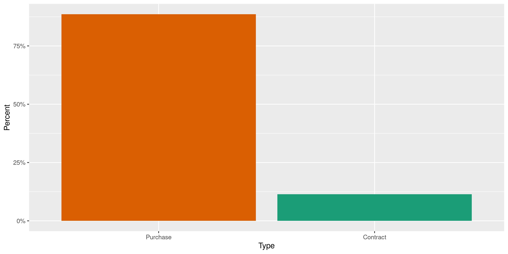
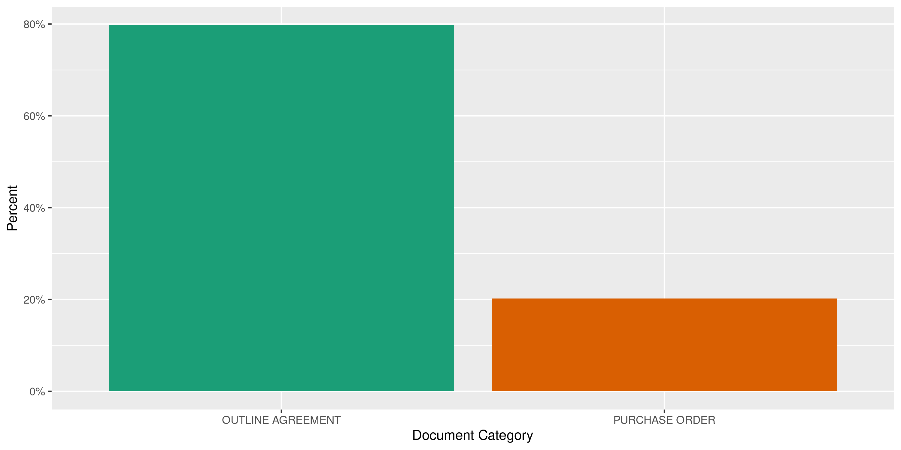
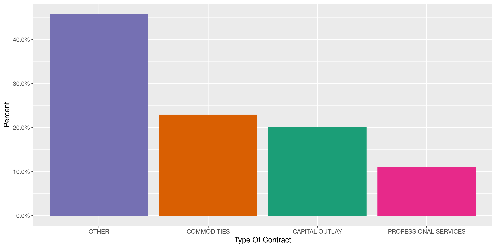
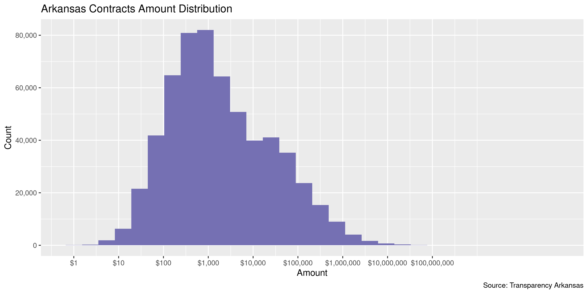
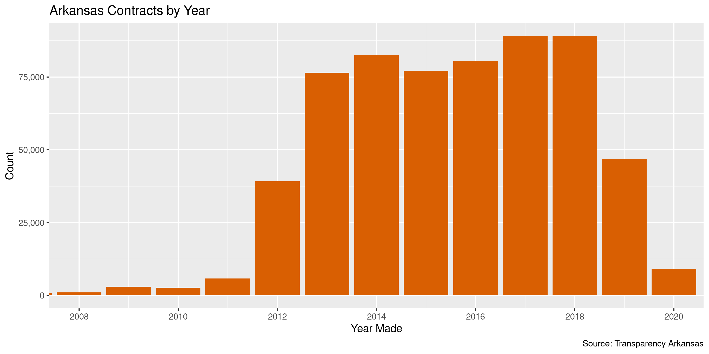

Arkansas Contracts
================
Kiernan Nicholls
2023-01-17 12:49:16

- <a href="#project" id="toc-project">Project</a>
- <a href="#objectives" id="toc-objectives">Objectives</a>
- <a href="#packages" id="toc-packages">Packages</a>
- <a href="#data" id="toc-data">Data</a>
- <a href="#glossary" id="toc-glossary">Glossary</a>
- <a href="#download" id="toc-download">Download</a>
- <a href="#extract" id="toc-extract">Extract</a>
- <a href="#existing" id="toc-existing">Existing</a>
- <a href="#read" id="toc-read">Read</a>
- <a href="#explore" id="toc-explore">Explore</a>
- <a href="#export" id="toc-export">Export</a>
- <a href="#upload" id="toc-upload">Upload</a>

<!-- Place comments regarding knitting here -->

## Project

The Accountability Project is an effort to cut across data silos and
give journalists, policy professionals, activists, and the public at
large a simple way to search across huge volumes of public data about
people and organizations.

Our goal is to standardize public data on a few key fields by thinking
of each dataset row as a transaction. For each transaction there should
be (at least) 3 variables:

1.  All **parties** to a transaction.
2.  The **date** of the transaction.
3.  The **amount** of money involved.

## Objectives

This document describes the process used to complete the following
objectives:

1.  How many records are in the database?
2.  Check for entirely duplicated records.
3.  Check ranges of continuous variables.
4.  Is there anything blank or missing?
5.  Check for consistency issues.
6.  Create a five-digit ZIP Code called `zip`.
7.  Create a `year` field from the transaction date.
8.  Make sure there is data on both parties to a transaction.

## Packages

The following packages are needed to collect, manipulate, visualize,
analyze, and communicate these results. The `pacman` package will
facilitate their installation and attachment.

The IRW’s `campfin` package will also have to be installed from GitHub.
This package contains functions custom made to help facilitate the
processing of campaign finance data.

``` r
if (!require("pacman")) install.packages("pacman")
pacman::p_load_gh("irworkshop/campfin")
pacman::p_load(
  tidyverse, # data manipulation
  lubridate, # datetime strings
  gluedown, # printing markdown
  magrittr, # pipe operators
  janitor, # clean data frames
  refinr, # cluster and merge
  scales, # format strings
  aws.s3, # upload to aws
  knitr, # knit documents
  vroom, # read files fast
  rvest, # html scraping
  glue, # combine strings
  here, # relative paths
  httr, # http requests
  fs # local storage 
)
```

This document should be run as part of the `R_campfin` project, which
lives as a sub-directory of the more general, language-agnostic
[`irworkshop/accountability_datacleaning`](https://github.com/irworkshop/accountability_datacleaning)
GitHub repository.

The `R_campfin` project uses the [RStudio
projects](https://support.rstudio.com/hc/en-us/articles/200526207-Using-Projects)
feature and should be run as such. The project also uses the dynamic
`here::here()` tool for file paths relative to *your* machine.

``` r
# where does this document knit?
here::here()
#> [1] "/home/kiernan/Documents/accountability_datacleaning"
```

## Data

Arkansas contracts data can be obtained from the [state transparecy
website](https://transparency.arkansas.gov/).

> Transparency.Arkansas.gov is a resource for citizens, legislators,
> news media, scholars, and nonprofit groups who want to know where the
> state, their city, town, and school district get their money, and how
> they spend it. It was created as a result of [Act
> 303](https://transparency.arkansas.gov/assets/pdf/Act303.pdf) which
> was passed in the 2011 General Session requiring the Department of
> Finance and Administration to create a free website, accessible to the
> public that contains state financial information.

> State Agencies negotiate contracts with vendors to provide services or
> goods at set prices. Contract information is available. Choose a link
> to learn more about contracts awarded in Arkansas.

> Three types of transactions are displayed on this website: 1. Standard
> contracts in excess of \$25,000 and 1. Construction contracts in
> excess of \$20,000 1. Single purchase orders in excess of \$25,000
>
> Data about these contracts is displayed on this website. Actual
> contracts are displayed as PDF documents. Some contract data is
> considered private or protected under state and federal laws. That
> data will be summarized to provide that privacy while also providing
> the reader with accurate details. Contracts are updated daily.

## Glossary

There are a few terms in the data which can be found in the [site
glossary](https://transparency.arkansas.gov/glossary.html):

> DBA means: Doing Business As.Vendors often have more than one name, so
> Vendor DBA is used to help identify the correct business.

> The 12-month period beginning July 1 and ending June 30 used by the
> state government for accounting purposes. Fiscal year designation is
> based on the year in which it ends \[e.g., fiscal year 2013 (FY-2013)
> runs from July 1, 2012 to June 30, 2013\].

> A vendor is an individual or company that buys and sells goods or
> services to the State of Arkansas.

## Download

The data is downloaded as ZIP archives. They can be downloaded manually
on the [search page](https://www.ark.org/dfa/transparency/contracts.php)
by selecting a fiscal year from the drop down menu.

``` r
raw_dir <- dir_create(here("state", "ar", "contracts", "data", "raw"))
```

Or, we can use an `httr::GET()` request for each year. This will change
the URL and ask for the appropriate archive from the server.

``` r
if (length(dir_ls(raw_dir)) == 0) {
  for (year in 2013:2022) {
    message(year)
    get_path <- path(raw_dir, glue("contracts_overview_{year}.zip"))
    GET(
      url = glue("https://www.ark.org/dfa/transparency_{year}/contracts.php"),
      write_disk(get_path, overwrite = TRUE),
      query = list(
        # need new hash each session
        ina_sec_csrf = "6d2673540b4be801b5b58748b935dd2c",
        `do:export_contracts` = "",
        report = "contracts",
        level = "1",
        # keep as 2011
        fiscal_year = 2011,
        current_tab = "overview",
        type = "csv"
      )
    )
  }
}
```

``` r
zip_info <- as_tibble(dir_info(raw_dir, glob = "*.zip"))
zip_info %>% 
  select(path, size, modification_time) %>% 
  mutate(across(path, ~as_fs_path(basename(.))))
#> # A tibble: 10 × 3
#>    path                               size modification_time  
#>    <fs::path>                  <fs::bytes> <dttm>             
#>  1 contracts_overview_2013.zip     396.58K 2023-01-17 11:49:16
#>  2 contracts_overview_2014.zip       1.27M 2023-01-17 11:49:23
#>  3 contracts_overview_2015.zip       1.36M 2023-01-17 11:49:28
#>  4 contracts_overview_2016.zip     453.98K 2023-01-17 11:49:30
#>  5 contracts_overview_2017.zip     349.64K 2023-01-17 11:49:31
#>  6 contracts_overview_2018.zip       2.49M 2023-01-17 11:49:40
#>  7 contracts_overview_2019.zip       2.54M 2023-01-17 11:49:50
#>  8 contracts_overview_2020.zip       2.46M 2023-01-17 11:49:58
#>  9 contracts_overview_2021.zip       2.55M 2023-01-17 11:50:07
#> 10 contracts_overview_2022.zip       2.54M 2023-01-17 11:50:17
```

## Extract

Each ZIP archive contains two files:

1.  `Main_Contracts.csv`
2.  `Purchase_Orders_Against_Contracts.csv`

We will extract each of these files to the `data/raw/` directory and add
the fiscal year to the file name.

``` r
for (z in zip_info$path) {
  message(basename(z))
  # extract csv files
  out_files <- unzip(z, exdir = raw_dir, overwrite = TRUE)
  # determine year from zip
  year <- str_extract(z, "\\d{4}")
  # create new file names
  out_new <- str_c(c("purchase_orders-", "main_contracts-"), year, ".csv")
  out_new <- path(raw_dir, out_new)
  # rename with year
  file_move(out_files, out_new)
}
```

## Existing

``` r
old_find <- object_exists(
  object = "csv/ar_contracts_clean.csv",
  bucket = "publicaccountability"
)
```

``` r
if (old_find) {
  arc_old <- s3read_using(
    FUN = read_csv,
    object = "csv/ar_contracts_clean.csv",
    bucket = "publicaccountability",
    col_types = cols(
      .default = col_character(),
      date = col_date()
    )
  )
  arc_old %>% 
    count(fiscal_year)
  count_na(arc_old$date)
  max_old <- max(arc_old$date[arc_old$year < 2021], na.rm = TRUE) + 1
}
```

## Read

Each file type contains different columns. Some overlap and some do not.
We can read both file types into the same data frame, as the key mapping
variables are present in both.

``` r
md_bullet(read_names(out_new[1])) # purchase orders
#> * Fiscal Year
#> * Agency
#> * Document Category
#> * Contract Number
#> * Material Group
#> * Type of Contract
#> * Vendor Name
#> * DBA
#> * Contract Start Date
#> * Contract End Date
#> * Contract Value
#> * Amount Ordered
#> * Amount Spent
md_bullet(read_names(out_new[2])) # main contracts
#> * Fiscal Year
#> * Agency ID
#> * Agency
#> * Contract Number
#> * Release PO
#> * Release Date
#> * PO Agency Value
#> * PO Agency Name
#> * Material Group
#> * Vendor Name
#> * Vendor DBA
#> * Amount Ordered
#> * Amount Spent
```

``` r
raw_paths <- dir_ls(raw_dir, glob = "*.csv")
md_bullet(md_code(basename(raw_paths)))
#> * `main_contracts-2013.csv`
#> * `main_contracts-2014.csv`
#> * `main_contracts-2015.csv`
#> * `main_contracts-2016.csv`
#> * `main_contracts-2017.csv`
#> * `main_contracts-2018.csv`
#> * `main_contracts-2019.csv`
#> * `main_contracts-2020.csv`
#> * `main_contracts-2021.csv`
#> * `main_contracts-2022.csv`
#> * `purchase_orders-2013.csv`
#> * `purchase_orders-2014.csv`
#> * `purchase_orders-2015.csv`
#> * `purchase_orders-2016.csv`
#> * `purchase_orders-2017.csv`
#> * `purchase_orders-2018.csv`
#> * `purchase_orders-2019.csv`
#> * `purchase_orders-2020.csv`
#> * `purchase_orders-2021.csv`
#> * `purchase_orders-2022.csv`
```

``` r
if (old_find) {
  new_file <- as.integer(str_extract(raw_paths, "\\d{4}")) >= year(max_old)
  raw_paths <- raw_paths[new_file]
}
```

``` r
arc <- map_df(
  .x = raw_paths,
  .f = read_delim,
  .id = "file",
  delim = ",",
  escape_double = FALSE,
  escape_backslash = FALSE,
  col_types = cols(
    .default = col_character(),
    `Fiscal Year` = col_integer(),
    `Amount Ordered` = col_double(),
    `Amount Spent` = col_double()
  )
)
```

The added `file` variable lists the source file, but we will create a
second variable that explicitly describes whether the record is a
contract or purchase order.

``` r
arc <- mutate(
  .data = arc,
  type = if_else(
    condition = str_detect(file, "order"), 
    true = "Purchase", 
    false = "Contract")
)
```

If the files were all read properly, there should only be years in the
`fiscal_year` column.

``` r
count(arc, `Fiscal Year`)
#> # A tibble: 3 × 2
#>   `Fiscal Year`      n
#>           <int>  <int>
#> 1          2020 136727
#> 2          2021 141817
#> 3          2022 141896
```

We have to do some parsing and renaming after the fact to account for
slight differences between the two types of files. Purchase orders have
a single `release_date` variable (when the purchase was made), whereas
main contracts have both `contract_start_date` and `contract_end_date`;
we will have to combine these two variables into a single date to
represent the transaction.

``` r
arc <- arc %>% 
  clean_names("snake") %>% 
  mutate(across(ends_with("date"), parse_date, na = "0000-00-00")) %>% 
  mutate(across(contract_value, parse_double)) %>% 
  mutate(across(file, basename)) %>% 
  mutate(date = coalesce(release_date, contract_start_date)) %>% 
  unite(
    col = vendor_dba, 
    contains("dba"), 
    sep = " ", 
    na.rm = TRUE, 
    remove = TRUE
  ) %>% 
  mutate(across(vendor_dba, na_if, ""))
```

For purchase orders, almost half the agency names are simply “STATEWIDE
CONTRACT” but the `po_agency_name` variable contains useful information.

``` r
arc %>% 
  filter(str_detect(file, "order")) %>% 
  count(agency, po_agency_name, sort = TRUE) %>% 
  mutate(p = n/sum(n))
#> # A tibble: 144 × 4
#>    agency                        po_agency_name     n      p
#>    <chr>                         <chr>          <int>  <dbl>
#>  1 AR DEPT OF TRANSPORTATION     <NA>            5623 0.151 
#>  2 AR DEPT OF HUMAN SERVICES     <NA>            5317 0.143 
#>  3 STATEWIDE CONTRACT            <NA>            4055 0.109 
#>  4 AR DEPARTMENT OF HEALTH       <NA>            2718 0.0732
#>  5 DEPARTMENT OF CORRECTION      <NA>            1570 0.0423
#>  6 AR GAME AND FISH COMMISSION   <NA>            1243 0.0335
#>  7 DEPT OF PARKS AND TOURISM     <NA>            1213 0.0326
#>  8 STATE MILITARY DEPARTMENT     <NA>             971 0.0261
#>  9 DEPT OF ARKANSAS STATE POLICE <NA>             924 0.0249
#> 10 DFA - REVENUE SERVICES DIV    <NA>             815 0.0219
#> # … with 134 more rows
```

The `po_agency_name` variable is not present for main contracts, so we
will have to merge these two columns in some kind of meaningful way.

``` r
arc %>% 
  filter(str_detect(file, "contract")) %>% 
  count(agency, po_agency_name, sort = TRUE) %>% 
  mutate(p = n/sum(n))
#> # A tibble: 246 × 4
#>    agency                       po_agency_name                    n      p
#>    <chr>                        <chr>                         <int>  <dbl>
#>  1 STATEWIDE CONTRACT           AR DEPT OF HUMAN SERVICES     84116 0.219 
#>  2 STATEWIDE CONTRACT           DEPT OF COMMUNITY CORRECTION  57117 0.149 
#>  3 AR DEPT OF TRANSPORTATION    AR DEPT OF TRANSPORTATION     55742 0.145 
#>  4 STATEWIDE CONTRACT           DEPARTMENT OF CORRECTION      24373 0.0636
#>  5 STATEWIDE CONTRACT           DEPT OF PARKS AND TOURISM     18733 0.0489
#>  6 STATEWIDE CONTRACT           AR DEPARTMENT OF HEALTH       13056 0.0341
#>  7 AR DEPT OF HUMAN SERVICES    AR DEPT OF HUMAN SERVICES     10850 0.0283
#>  8 DEPARTMENT OF CORRECTION     DEPARTMENT OF CORRECTION       8713 0.0227
#>  9 DEPT OF COMMUNITY CORRECTION DEPT OF COMMUNITY CORRECTION   8494 0.0222
#> 10 STATEWIDE CONTRACT           DEPT OF ARKANSAS STATE POLICE  7133 0.0186
#> # … with 236 more rows
```

``` r
arc <- arc %>% 
  mutate(
    agency = coalesce(po_agency_name, agency),
    agency_id = coalesce(po_agency_value, agency_id),
  ) %>% 
  select(
    -po_agency_name,
    -po_agency_value
  )
```

``` r
if (old_find) {
  arc <- arc %>% 
    filter(date > as.Date(max_old))
}
```

## Explore

Combining these two file types results in a structure where matching
names are aligned and missing columns are filled with `NA` values. This
is most noticeable at the `tail()`.

``` r
glimpse(arc)
#> Rows: 82,888
#> Columns: 19
#> $ file                <chr> "main_contracts-2021.csv", "main_contracts-2021.csv", "main_contracts…
#> $ fiscal_year         <int> 2021, 2021, 2021, 2021, 2021, 2021, 2021, 2021, 2021, 2021, 2021, 202…
#> $ agency_id           <chr> "0009", "0009", "0009", "0009", "0009", "0009", "0009", "0023", "0023…
#> $ agency              <chr> "LEGISLATIVE AUDIT", "LEGISLATIVE AUDIT", "LEGISLATIVE AUDIT", "LEGIS…
#> $ contract_number     <chr> "4600040093", "4600044033", "4600044997", "4600046289", "4600040690",…
#> $ release_po          <chr> "4501955832", "4501955833", "4501955834", "4501955835", "4501955836",…
#> $ release_date        <date> 2020-07-07, 2020-07-07, 2020-07-07, 2020-07-07, 2020-07-07, 2020-07-…
#> $ material_group      <chr> "REAL PROPERTY RENTAL OR LEASE", "REAL PROPERTY RENTAL OR LEASE", "RE…
#> $ vendor_name         <chr> "AR TEACHER RETIREMENT SYSTEM", "RLW PROPERTIES LLC", "MC BAKER PROPE…
#> $ vendor_dba          <chr> NA, NA, NA, NA, NA, NA, NA, NA, NA, "BELL LAW CO", "BELL LAW CO", NA,…
#> $ amount_ordered      <dbl> 476116.68, 55440.00, 34343.28, 20987.04, 9265.32, 12240.00, 12362.40,…
#> $ amount_spent        <dbl> 476116.68, 55440.00, 34343.28, 20987.04, 9265.32, 12240.00, 12362.40,…
#> $ document_category   <chr> NA, NA, NA, NA, NA, NA, NA, NA, NA, NA, NA, NA, NA, NA, NA, NA, NA, N…
#> $ type_of_contract    <chr> NA, NA, NA, NA, NA, NA, NA, NA, NA, NA, NA, NA, NA, NA, NA, NA, NA, N…
#> $ contract_start_date <date> NA, NA, NA, NA, NA, NA, NA, NA, NA, NA, NA, NA, NA, NA, NA, NA, NA, …
#> $ contract_end_date   <date> NA, NA, NA, NA, NA, NA, NA, NA, NA, NA, NA, NA, NA, NA, NA, NA, NA, …
#> $ contract_value      <dbl> NA, NA, NA, NA, NA, NA, NA, NA, NA, NA, NA, NA, NA, NA, NA, NA, NA, N…
#> $ type                <chr> "Contract", "Contract", "Contract", "Contract", "Contract", "Contract…
#> $ date                <date> 2020-07-07, 2020-07-07, 2020-07-07, 2020-07-07, 2020-07-07, 2020-07-…
tail(arc)
#> # A tibble: 6 × 19
#>   file    fisca…¹ agenc…² agency contr…³ relea…⁴ release_…⁵ mater…⁶ vendo…⁷ vendo…⁸ amoun…⁹ amoun…˟
#>   <chr>     <int> <chr>   <chr>  <chr>   <chr>   <date>     <chr>   <chr>   <chr>     <dbl>   <dbl>
#> 1 purcha…    2022 <NA>    TSS -… 450206… <NA>    NA         FIRE P… AMERIC… <NA>     32127   32127 
#> 2 purcha…    2022 <NA>    TSS -… 450205… <NA>    NA         TRANSP… MOHAWK… <NA>      3570.   3558.
#> 3 purcha…    2022 <NA>    TSS -… 450203… <NA>    NA         ELEVAT… OTIS E… <NA>     72575.  72575.
#> 4 purcha…    2022 <NA>    WORKE… 460004… <NA>    NA         ADMINI… TSS - … <NA>    156266. 153365.
#> 5 purcha…    2022 <NA>    WORKE… 460004… <NA>    NA         REIMBU… OSBORN… <NA>     51900   51900 
#> 6 purcha…    2022 <NA>    WORKE… 450202… <NA>    NA         REAL P… BEST P… <NA>     35012.  35012.
#> # … with 7 more variables: document_category <chr>, type_of_contract <chr>,
#> #   contract_start_date <date>, contract_end_date <date>, contract_value <dbl>, type <chr>,
#> #   date <date>, and abbreviated variable names ¹​fiscal_year, ²​agency_id, ³​contract_number,
#> #   ⁴​release_po, ⁵​release_date, ⁶​material_group, ⁷​vendor_name, ⁸​vendor_dba, ⁹​amount_ordered,
#> #   ˟​amount_spent
```

### Missing

If we count the number of missing values per column, we can see a lot of
the values from the columns found only in one type of file are missing.

``` r
col_stats(arc, count_na)
#> # A tibble: 19 × 4
#>    col                 class      n     p
#>    <chr>               <chr>  <int> <dbl>
#>  1 file                <chr>      0 0    
#>  2 fiscal_year         <int>      0 0    
#>  3 agency_id           <chr>   8844 0.107
#>  4 agency              <chr>      0 0    
#>  5 contract_number     <chr>      0 0    
#>  6 release_po          <chr>   8844 0.107
#>  7 release_date        <date>  8844 0.107
#>  8 material_group      <chr>      0 0    
#>  9 vendor_name         <chr>      0 0    
#> 10 vendor_dba          <chr>  67740 0.817
#> 11 amount_ordered      <dbl>      0 0    
#> 12 amount_spent        <dbl>      0 0    
#> 13 document_category   <chr>  74044 0.893
#> 14 type_of_contract    <chr>  74044 0.893
#> 15 contract_start_date <date> 74044 0.893
#> 16 contract_end_date   <date> 74044 0.893
#> 17 contract_value      <dbl>  74044 0.893
#> 18 type                <chr>      0 0    
#> 19 date                <date>     0 0
```

But we can flag those key values that should be present in both file
types.

``` r
arc <- arc %>% flag_na(date, agency, amount_spent, vendor_name)
percent(mean(arc$na_flag), 0.01)
#> [1] "0.00%"
```

``` r
arc %>% 
  filter(na_flag) %>% 
  select(date, agency, amount_spent, vendor_name, type) %>% 
  distinct()
#> # A tibble: 0 × 5
#> # … with 5 variables: date <date>, agency <chr>, amount_spent <dbl>, vendor_name <chr>, type <chr>
```

### Duplicates

There are no duplicate records in this database.

``` r
arc <- flag_dupes(arc, everything())
```

### Categorical

``` r
col_stats(arc, n_distinct)
#> # A tibble: 21 × 4
#>    col                 class      n         p
#>    <chr>               <chr>  <int>     <dbl>
#>  1 file                <chr>      4 0.0000483
#>  2 fiscal_year         <int>      2 0.0000241
#>  3 agency_id           <chr>    111 0.00134  
#>  4 agency              <chr>    117 0.00141  
#>  5 contract_number     <chr>   7589 0.0916   
#>  6 release_po          <chr>  40842 0.493    
#>  7 release_date        <date>   671 0.00810  
#>  8 material_group      <chr>    329 0.00397  
#>  9 vendor_name         <chr>   3293 0.0397   
#> 10 vendor_dba          <chr>    871 0.0105   
#> 11 amount_ordered      <dbl>  44455 0.536    
#> 12 amount_spent        <dbl>  44345 0.535    
#> 13 document_category   <chr>      3 0.0000362
#> 14 type_of_contract    <chr>      5 0.0000603
#> 15 contract_start_date <date>   547 0.00660  
#> 16 contract_end_date   <date>   582 0.00702  
#> 17 contract_value      <dbl>   4863 0.0587   
#> 18 type                <chr>      2 0.0000241
#> 19 date                <date>   687 0.00829  
#> 20 na_flag             <lgl>      1 0.0000121
#> 21 dupe_flag           <lgl>      2 0.0000241
```

``` r
explore_plot(arc, type)
```

<!-- -->

``` r
explore_plot(arc, document_category)
```

<!-- -->

``` r
explore_plot(arc, type_of_contract)
```

<!-- -->

### Amounts

``` r
mean(arc$amount_ordered != arc$amount_spent)
#> [1] 0.3238949
noquote(map_chr(summary(arc$amount_spent), dollar))
#>        Min.     1st Qu.      Median        Mean     3rd Qu.        Max. 
#>          $0     $175.38     $759.90  $69,350.94   $5,477.04 $87,735,393
mean(arc$amount_spent <= 0)
#> [1] 0.06658382
```

The maximum `amount_spent` is \$87,735,393. In this value, we can see an
enormous discrepancy between the `amount_ordered` and the
`amount_spent`.

``` r
glimpse(arc[which.max(arc$amount_spent), ])
#> Rows: 1
#> Columns: 21
#> $ file                <chr> "purchase_orders-2022.csv"
#> $ fiscal_year         <int> 2022
#> $ agency_id           <chr> NA
#> $ agency              <chr> "AR DEPT OF HUMAN SERVICES"
#> $ contract_number     <chr> "4600047191"
#> $ release_po          <chr> NA
#> $ release_date        <date> NA
#> $ material_group      <chr> "PROFESSIONAL MEDICAL SERVICES - INCLUDING PHYSICIANS"
#> $ vendor_name         <chr> "GAINWELL TECHNOLOGIES LLC"
#> $ vendor_dba          <chr> NA
#> $ amount_ordered      <dbl> 88083231
#> $ amount_spent        <dbl> 87735393
#> $ document_category   <chr> "OUTLINE AGREEMENT"
#> $ type_of_contract    <chr> "OTHER"
#> $ contract_start_date <date> 2020-07-29
#> $ contract_end_date   <date> 2021-11-30
#> $ contract_value      <dbl> 371471466
#> $ type                <chr> "Purchase"
#> $ date                <date> 2020-07-29
#> $ na_flag             <lgl> FALSE
#> $ dupe_flag           <lgl> FALSE
```

Turns out there are quite a few records with enormous difference between
the amount ordered and spent.

``` r
arc %>% 
  mutate(amount_dif = amount_spent - amount_ordered) %>% 
  select(agency, contains("amount"), material_group) %>% 
  arrange(amount_dif)
#> # A tibble: 82,888 × 5
#>    agency                    amount_ordered amount_spent amount_dif material_group                 
#>    <chr>                              <dbl>        <dbl>      <dbl> <chr>                          
#>  1 AR DEPARTMENT OF HEALTH        32500000      1239929. -31260071. MEDICAL AND LABORATORY SERVICE…
#>  2 AR DEPARTMENT OF HEALTH        32500000      1239929. -31260071. MEDICAL AND LABORATORY SERVICE…
#>  3 AR DEPARTMENT OF HEALTH        32605048.    13631296. -18973752. LABORATORY EQUIPMENT AND ACCES…
#>  4 AR DEPARTMENT OF HEALTH        17236033.        2442. -17233591. LABORATORY EQUIPMENT AND ACCES…
#>  5 AR DEPARTMENT OF HEALTH        17229928.           0  -17229928. LABORATORY EQUIPMENT AND ACCES…
#>  6 AR DEPT OF HUMAN SERVICES      53995650.    39294705. -14700944. DATA PROCESSING, COMPUTER, AND…
#>  7 STATEWIDE SHARED SERVICES      97508282.    86170055. -11338226. INSURANCE MANAGEMENT SERVICES  
#>  8 STATEWIDE SHARED SERVICES      53208077.    41869851. -11338226. INSURANCE MANAGEMENT SERVICES  
#>  9 AR DEPARTMENT OF HEALTH        52688300     42333137. -10355163. MISCELLANEOUS SERVICES         
#> 10 AR DEPARTMENT OF HEALTH        52688300     42333137. -10355163. MISCELLANEOUS SERVICES         
#> # … with 82,878 more rows

arc %>% 
  mutate(amount_dif = amount_spent - amount_ordered) %>% 
  select(agency, contains("amount"), material_group) %>% 
  arrange(desc(amount_dif))
#> # A tibble: 82,888 × 5
#>    agency                         amount_ordered amount_spent amount_dif material_group            
#>    <chr>                                   <dbl>        <dbl>      <dbl> <chr>                     
#>  1 DEPT OF EMERGENCY MANAGEMENT         6753376.     6818758      65382. DATA PROCESSING, COMPUTER…
#>  2 AR DEPARTMENT OF HEALTH              2275459.     2313930.     38471. HOSPITAL, SURGICAL, AND R…
#>  3 DEPT OF EMERGENCY MANAGEMENT         3376688.     3410379      33691. DATA PROCESSING, COMPUTER…
#>  4 DEPT OF EMERGENCY MANAGEMENT         3376688.     3410379      33691. DATA PROCESSING, COMPUTER…
#>  5 DEPT OF EMERGENCY MANAGEMENT         3376688.     3410379      33691. DATA PROCESSING, COMPUTER…
#>  6 DEPT OF EMERGENCY MANAGEMENT         3376688.     3408379      31691. DATA PROCESSING, COMPUTER…
#>  7 AR DEPT OF HUMAN SERVICES            2217417.     2231400.     13982. REAL PROPERTY RENTAL OR L…
#>  8 AR DEPT OF HUMAN SERVICES             436075.      450057.     13982. REAL PROPERTY RENTAL OR L…
#>  9 DEPT OF TRANSFORM & SHARED SVC        142500       155325      12825  FIRST AID AND SAFETY EQUI…
#> 10 ADMIN OFFICE OF THE COURTS            147290       159994.     12704. FURNITURE: OFFICE         
#> # … with 82,878 more rows
```

<!-- -->

### Dates

We can add the calendar year from `date` with `lubridate::year()`

``` r
arc <- mutate(arc, year = year(date))
```

``` r
prop_na(arc$date)
#> [1] 0
min(arc$date, na.rm = TRUE)
#> [1] "2020-07-06"
sum(arc$year < 2000, na.rm = TRUE)
#> [1] 0
max(arc$date, na.rm = TRUE)
#> [1] "2022-09-28"
sum(arc$date > today(), na.rm = TRUE)
#> [1] 0
arc$year <- na_if(arc$year, 9999)
```

<!-- -->

## Export

1.  There are 82,888 records in the database.
2.  There are 4 duplicate records in the database.
3.  The range and distribution of `amount` and `date` seem reasonable.
4.  There are 0 records missing key variables.
5.  There are no geographic variables to be normalized.
6.  The 4-digit `year` variable has been created with
    `lubridate::year()`.

Now the file can be saved on disk for upload to the Accountability
server.

``` r
clean_dir <- dir_create(here("state", "ar", "contracts", "data", "clean"))
if (old_find) {
  date_ts <- paste(str_remove_all(c(max_old, Sys.Date()), "-"), collapse = "-")
  clean_csv <- path(clean_dir, sprintf("ar_contracts_%s.csv", date_ts))
} else {
  clean_csv <- path(clean_dir, "ar_contracts_clean.csv")
}
write_csv(arc, clean_csv, na = "")
file_size(clean_csv)
#> 17.1M
```

The encoding of the exported file should be UTF-8 or ASCII.

``` r
enc <- system2("file", args = paste("-i", clean_csv), stdout = TRUE)
str_replace_all(enc, clean_csv, basename)
#> [1] "ar_contracts_20200701-20230117.csv: text/csv; charset=us-ascii"
```

## Upload

We can use the `aws.s3::put_object()` to upload the text file to the IRW
server.

``` r
aws_key <- path("csv", basename(clean_csv))
if (!object_exists(aws_key, "publicaccountability")) {
  put_object(
    file = clean_csv,
    object = aws_key, 
    bucket = "publicaccountability",
    acl = "public-read",
    show_progress = TRUE,
    multipart = TRUE
  )
}
aws_head <- head_object(aws_key, "publicaccountability")
(aws_size <- as_fs_bytes(attr(aws_head, "content-length")))
unname(aws_size == clean_size)
```
