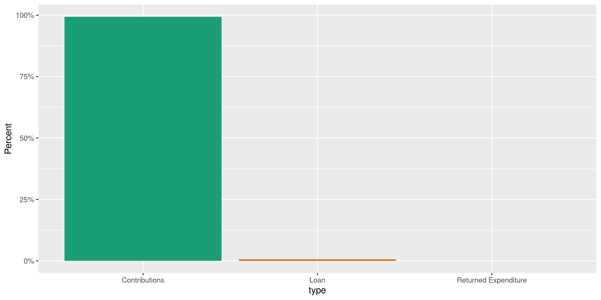
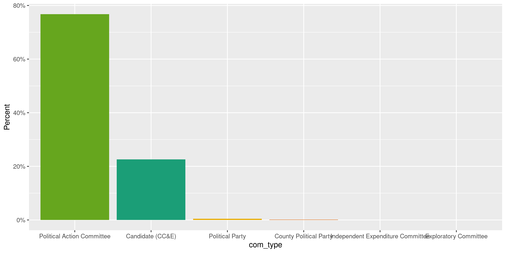
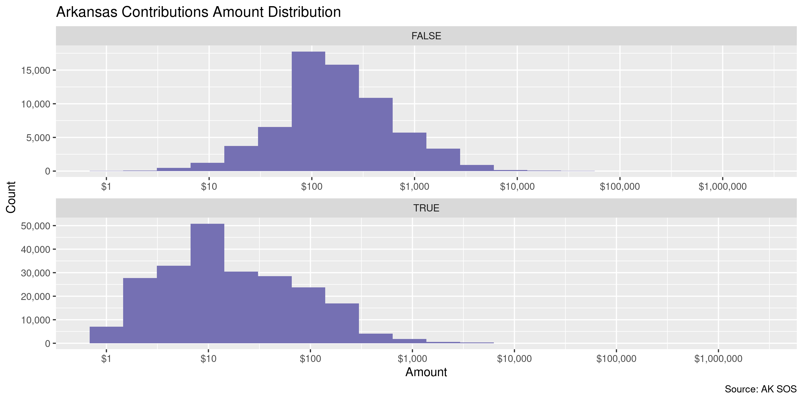
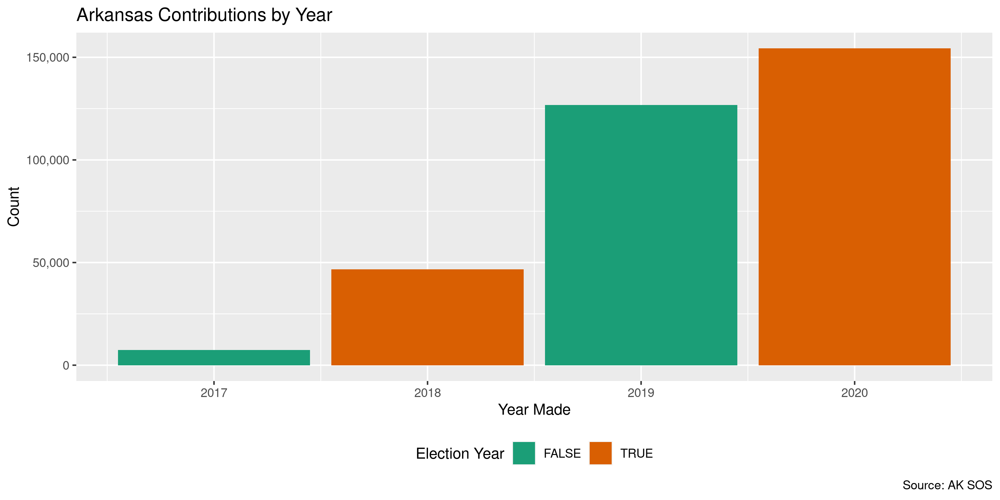
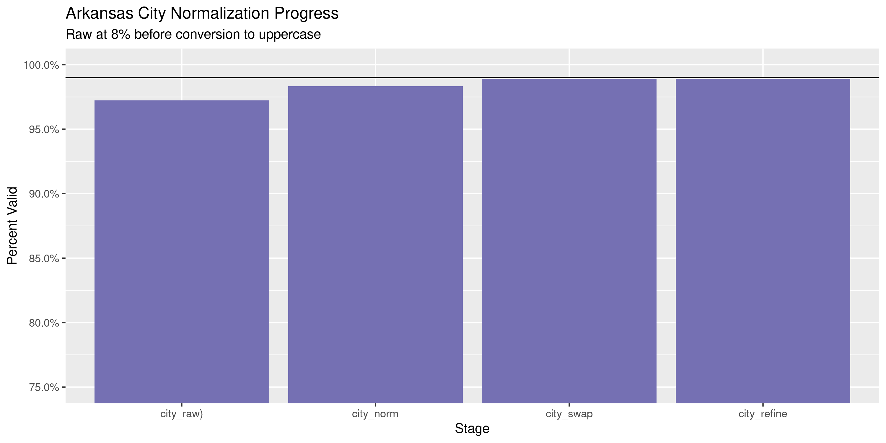
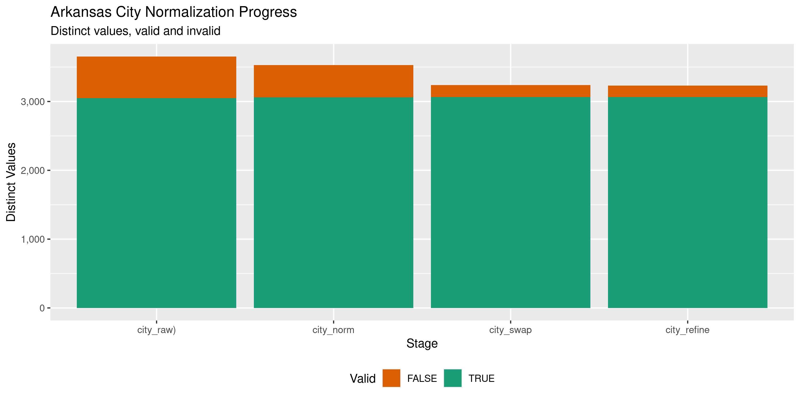

Arkansas Contributions
================
Kiernan Nicholls & Aarushi Sahejpal
2023-04-29 08:54:21

- <a href="#project" id="toc-project">Project</a>
- <a href="#objectives" id="toc-objectives">Objectives</a>
- <a href="#packages" id="toc-packages">Packages</a>
- <a href="#data" id="toc-data">Data</a>
- <a href="#download" id="toc-download">Download</a>
- <a href="#read" id="toc-read">Read</a>
- <a href="#explore" id="toc-explore">Explore</a>
- <a href="#wrangle" id="toc-wrangle">Wrangle</a>
- <a href="#conclude" id="toc-conclude">Conclude</a>
- <a href="#export" id="toc-export">Export</a>
- <a href="#upload" id="toc-upload">Upload</a>
- <a href="#dictionary" id="toc-dictionary">Dictionary</a>

<!-- Place comments regarding knitting here -->

## Project

The Accountability Project is an effort to cut across data silos and
give journalists, policy professionals, activists, and the public at
large a simple way to search across huge volumes of public data about
people and organizations.

Our goal is to standardizing public data on a few key fields by thinking
of each dataset row as a transaction. For each transaction there should
be (at least) 3 variables:

1.  All **parties** to a transaction.
2.  The **date** of the transaction.
3.  The **amount** of money involved.

## Objectives

This document describes the process used to complete the following
objectives:

1.  How many records are in the database?
2.  Check for entirely duplicated records.
3.  Check ranges of continuous variables.
4.  Is there anything blank or missing?
5.  Check for consistency issues.
6.  Create a five-digit ZIP Code called `zip`.
7.  Create a `year` field from the transaction date.
8.  Make sure there is data on both parties to a transaction.

## Packages

The following packages are needed to collect, manipulate, visualize,
analyze, and communicate these results. The `pacman` package will
facilitate their installation and attachment.

The IRW’s `campfin` package will also have to be installed from GitHub.
This package contains functions custom made to help facilitate the
processing of campaign finance data.

``` r
if (!require("pacman")) install.packages("pacman")
pacman::p_load_gh("irworkshop/campfin")
pacman::p_load(
  tidyverse, # data manipulation
  lubridate, # datetime strings
  gluedown, # printing markdown
  magrittr, # pipe operators
  janitor, # clean data frames
  aws.s3, # upload to aws s3
  refinr, # cluster and merge
  scales, # format strings
  knitr, # knit documents
  vroom, # read files fast
  rvest, # html scraping
  glue, # combine strings
  here, # relative paths
  httr, # http requests
  fs # local storage 
)
```

This document should be run as part of the `R_campfin` project, which
lives as a sub-directory of the more general, language-agnostic
[`irworkshop/accountability_datacleaning`](https://github.com/irworkshop/accountability_datacleaning)
GitHub repository.

The `R_campfin` project uses the [RStudio
projects](https://support.rstudio.com/hc/en-us/articles/200526207-Using-Projects)
feature and should be run as such. The project also uses the dynamic
`here::here()` tool for file paths relative to *your* machine.

``` r
# where does this document knit?
here::here()
#> [1] "/Volumes/TAP/accountability_datacleaning"
```

## Data

Data is obtained from the Arkansas Secretary of State’s [Financial
Disclosure
portal](https://financial-disclosures.sos.arkansas.gov/index.html#/dataDownload).

> This page provides comma separated value (CSV) downloads of
> contribution, expenditure, and loan data for each reporting year in a
> zipped file format. These files can be downloaded and imported into
> other applications (Microsoft Excel, Microsoft Access, etc.)
>
> This data is extracted from the Arkansas Campaign Finance database as
> it existed as of 04/28/2023 6:42 AM.

The AR SOS also provides a [data layout
key](https://financial-disclosures.sos.arkansas.gov//CFISAR_Service/Template/KeyDownloads/Expenditures,%20Debts,%20and%20Payments%20to%20Workers%20File%20Layout%20Key.pdf):

| Field | Field Name           | Description                                     |
|:------|:---------------------|:------------------------------------------------|
| A     | `ORG ID`             | Unique ID of the paying candidate or committee. |
| B     | `EXPENDITURE AMOUNT` | Expenditure Amount.                             |
| C     | `EXPENDITURE  DATE`  | Expenditure Date.                               |
| D     | `LAST NAME`          | Payee Last or Full Name.                        |
| E     | `FIRST NAME`         | Payee First Name.                               |
| F     | `MIDDLE NAME`        | Payee Middle Initial or Name if provided.       |
| G     | `SUFFIX`             | Payee Name Suffix.                              |
| H     | `ADDRESS 1`          | Payee Street, PO Box, etc.                      |
| I     | `ADDRESS 2`          | Payee Suite/Apartment number.                   |
| J     | `CITY`               | Payee City                                      |
| K     | `STATE`              | Payee State                                     |
| L     | `ZIP`                | Payee Zip Code                                  |
| M     | `EXPLANATION`        | Explanation provided for the expenditure.       |
| N     | `EXPENDITURE ID`     | Unique Expenditure internal ID.                 |
| O     | `FILED DATE`         | Expenditure Filed Date                          |
| P     | `PURPOSE`            | Purpose of the Expenditure.                     |
| Q     | `EXPENDITURE TYPE`   | Indicates Type of Expenditure.                  |
| R     | `COMMITTEE TYPE`     | Indicates Type of Committee                     |
| S     | `COMMITTEE NAME`     | Name of the paying committee.                   |
| T     | `CANDIDATE NAME`     | Name of the paying candidate.                   |
| U     | `AMENDED`            | Y/N if an amendment was filed.                  |

## Download

To download the expenditure files, we can make a series of direct
`httr::GET()` requests to the AR SOS server, downloaded the CSV files
locally.

``` r
raw_dir <- dir_create(here("ar", "contribs", "data", "raw"))
raw_url <- str_c(
  base = "https://financial-disclosures.sos.arkansas.gov",
  path = "/CFISAR_Service/api/DataDownload/GetCSVDownloadReport"
)
```

``` r
ys <- seq(2017, year(today()))
fix_dir <- dir_create(path(dirname(raw_dir), "fix"))
for (y in ys) {
  # download raw file
  raw_file <- glue("CON_{y}.csv")
  raw_path <- path(raw_dir, raw_file)
  GET(
    url = raw_url,
    write_disk(raw_path, overwrite = TRUE),
    query = list(
      year = "2017",
      transactionType = "CON",
      reportFormat = "csv",
      fileName = raw_file
    )
  )
  # fix downloaded file
  read_file(raw_path) %>% 
    str_replace_all("(?<!,|^)\"(?!,|$)", "'") %>% 
    str_remove_all(",\\s(?=\r\n)") %>% 
    write_file(path(fix_dir, basename(raw_path)))
  message(paste("finished", y))
}
```

``` r
fix_paths <- dir_ls(fix_dir)
```

## Read

``` r
arc <- map_df(
  .x = fix_paths,
  .f = read_delim,
  delim = ",",
  escape_backslash = FALSE,
  escape_double = FALSE,
  col_types = cols(
    .default = col_character(),
    `Receipt Amount` = col_double(),
    `Receipt Date` = col_date("%m/%d/%Y %H:%M:%S %p"),
    `Filed Date` = col_date("%m/%d/%Y %H:%M:%S %p")
  )
)
```

We can count the distinct values of a discrete variable to check file
reading.

``` r
count(arc, type)
#> # A tibble: 3 × 2
#>   type                       n
#>   <chr>                  <int>
#> 1 Contributions        2976744
#> 2 Loan                    3131
#> 3 Returned Expenditure     563
```

## Explore

``` r
glimpse(arc)
#> Rows: 2,980,438
#> Columns: 23
#> $ org_id      <chr> "223411", "232148", "223411", "222837", "223358", "229760", "220870", "222836…
#> $ amount      <dbl> 9.07, 125.00, 0.27, 20.00, 500.00, 31.46, 198.28, 96.15, 5.43, 50.00, 38.46, …
#> $ date        <date> 2017-11-15, 2017-11-30, 2017-10-21, 2017-11-16, 2017-11-27, 2017-10-27, 2017…
#> $ last        <chr> NA, "Gonzalez", NA, "Kennedy", "Nabholz", "Nowak", "Dempsey", "Nisbet", NA, "…
#> $ first       <chr> " ", "Fernando", " ", "Timothy", "Charles", "John", "Mark", "Sharon", " ", "B…
#> $ middle      <chr> " ", " ", " ", "R", " ", "R", "E", " ", " ", "L", "A", " ", "R", " ", "L", " …
#> $ suffix      <chr> " ", " ", " ", " ", " ", "JR.", " ", " ", " ", " ", " ", " ", " ", " ", " ", …
#> $ address1    <chr> " ", "133 Peachtree St NE", " ", "87 Oakford Rd", "4630 Sawgrass Cove", "143 …
#> $ address2    <chr> " ", " ", " ", " ", " ", " ", " ", " ", " ", " ", " ", " ", " ", " ", " ", " …
#> $ city        <chr> " ", "Atlanta", " ", "Wayne", "Conway", "Crofton", "CHARLESTON", "Tampa", " "…
#> $ state       <chr> "  ", "GA", "  ", "PA", "AR", "KY", "WV", "FL", "  ", "OH", "AR", "GA", "KY",…
#> $ zip         <chr> " ", "30303", " ", "19087", "72034", "42217", "25304", "33634", " ", "44236",…
#> $ description <chr> " ", " ", " ", " ", NA, " ", " ", " ", " ", " ", " ", " ", " ", " ", " ", " "…
#> $ id          <chr> "73007", "101858", "74681", "62764", "67485", "106241", "14619", "115051", "7…
#> $ filed_date  <date> 2018-01-16, 2018-01-17, 2018-01-16, 2018-01-12, 2018-01-15, 2018-01-17, 2017…
#> $ source_type <chr> "Non-itemized", "Individual", "Non-itemized", "Individual", "Individual", "In…
#> $ type        <chr> "Contributions", "Contributions", "Contributions", "Contributions", "Contribu…
#> $ com_type    <chr> "Political Action Committee", "Political Action Committee", "Political Action…
#> $ committee   <chr> "GlaxoSmithKline LLC PAC", "Koch Industries, Inc. Political Action Committee"…
#> $ candidate   <chr> " ", " ", " ", " ", "Andrea Woods", " ", " ", " ", " ", " ", " ", " ", " ", "…
#> $ amended     <lgl> FALSE, FALSE, FALSE, FALSE, FALSE, FALSE, FALSE, FALSE, FALSE, FALSE, FALSE, …
#> $ employer    <chr> " ", "G-P Consumer Products Lp", " ", "Medical Dev Bus Serv Inc", "Nabholz", …
#> $ occupation  <chr> " ", " ", " ", " ", "Other", " ", " ", "Healthcare/Medical", " ", " ", " ", "…
tail(arc)
#> # A tibble: 6 × 23
#>   org_id amount date       last      first   middle suffix address1      address2 city  state zip  
#>   <chr>   <dbl> <date>     <chr>     <chr>   <chr>  <chr>  <chr>         <chr>    <chr> <chr> <chr>
#> 1 358946   5    2023-01-30 <NA>      " "     " "    " "    " "           " "      " "   "  "  " "  
#> 2 240633   4.62 2023-03-10 <NA>      " "     " "    " "    " "           " "      " "   "  "  " "  
#> 3 241764   3.52 2023-02-03 <NA>      " "     " "    " "    " "           " "      " "   "  "  " "  
#> 4 220865 150    2023-01-06 Houserman "Lynne" " "    " "    "1303 E. Alg… " "      "Sch… "IL"  "601…
#> 5 240633   4.62 2023-03-24 <NA>      " "     " "    " "    " "           " "      " "   "  "  " "  
#> 6 254505   5    2023-03-31 <NA>      " "     " "    " "    " "           " "      " "   "  "  " "  
#> # ℹ 11 more variables: description <chr>, id <chr>, filed_date <date>, source_type <chr>,
#> #   type <chr>, com_type <chr>, committee <chr>, candidate <chr>, amended <lgl>, employer <chr>,
#> #   occupation <chr>
```

### Missing

Variables differ in the degree of values they are missing.

``` r
col_stats(arc, count_na)
#> # A tibble: 23 × 4
#>    col         class        n           p
#>    <chr>       <chr>    <int>       <dbl>
#>  1 org_id      <chr>        0 0          
#>  2 amount      <dbl>        0 0          
#>  3 date        <date>       0 0          
#>  4 last        <chr>  1814722 0.609      
#>  5 first       <chr>        0 0          
#>  6 middle      <chr>    15999 0.00537    
#>  7 suffix      <chr>        0 0          
#>  8 address1    <chr>      262 0.0000879  
#>  9 address2    <chr>    41910 0.0141     
#> 10 city        <chr>       25 0.00000839 
#> 11 state       <chr>        0 0          
#> 12 zip         <chr>        2 0.000000671
#> 13 description <chr>   137280 0.0461     
#> 14 id          <chr>        0 0          
#> 15 filed_date  <date>     277 0.0000929  
#> 16 source_type <chr>        0 0          
#> 17 type        <chr>        0 0          
#> 18 com_type    <chr>        0 0          
#> 19 committee   <chr>        0 0          
#> 20 candidate   <chr>        0 0          
#> 21 amended     <lgl>        0 0          
#> 22 employer    <chr>    24119 0.00809    
#> 23 occupation  <chr>    20120 0.00675
```

With `campfin::flag_na()`, we can flag any record missing a key
variable.

``` r
arc <- arc %>% 
  flag_na(date, last, amount, candidate)
```

``` r
percent(mean(arc$na_flag), 0.1)
#> [1] "60.9%"
```

These records are missing either the `last` or `candidate` names.

``` r
arc %>% 
  filter(na_flag) %>% 
  select(date, last, amount, candidate) %>%
  col_stats(count_na)
#> # A tibble: 4 × 4
#>   col       class        n     p
#>   <chr>     <chr>    <int> <dbl>
#> 1 date      <date>       0     0
#> 2 last      <chr>  1814722     1
#> 3 amount    <dbl>        0     0
#> 4 candidate <chr>        0     0
```

Records missing a contributor `last` name are non-itemized.

``` r
arc %>% 
  filter(is.na(last)) %>% 
  count(source_type, sort = TRUE) %>% 
  add_prop()
#> # A tibble: 5 × 3
#>   source_type           n           p
#>   <chr>             <int>       <dbl>
#> 1 Non-itemized    1811459 0.998      
#> 2 Interest           3119 0.00172    
#> 3 Anonymous            76 0.0000419  
#> 4 Individual           67 0.0000369  
#> 5 Political Party       1 0.000000551
```

Records missing the receiving `candidate` name are given to PACs.

``` r
arc %>% 
  filter(is.na(candidate)) %>% 
  count(com_type, sort = TRUE) %>% 
  add_prop()
#> # A tibble: 0 × 3
#> # ℹ 3 variables: com_type <chr>, n <int>, p <dbl>
```

### Duplicates

If we ignore the supposedly unique `id` variable, there are a number of
duplicate records.

``` r
arc <- flag_dupes(arc, -id)
percent(mean(arc$dupe_flag), 0.1)
#> [1] "54.4%"
```

``` r
arc %>% 
  filter(dupe_flag) %>% 
  select(date, last, address1, amount, candidate) %>% 
  drop_na()
#> # A tibble: 5,224 × 5
#>    date       last               address1                amount candidate       
#>    <date>     <chr>              <chr>                    <dbl> <chr>           
#>  1 2017-10-04 Gazaway            3105 Norman Rockwell      2700 "Asa Hutchinson"
#>  2 2017-09-27 Franklin           109 Chambord              2700 "Asa Hutchinson"
#>  3 2017-09-13 Nicholson          352 South Main Street     2700 "Asa Hutchinson"
#>  4 2017-11-24 Tregoning          55 Corporate Drive         193 " "             
#>  5 2017-09-27 Thomason           PO Box 3457               2700 "Asa Hutchinson"
#>  6 2017-08-15 Highway Safety PAC PO Box 846                2700 "Asa Hutchinson"
#>  7 2017-11-17 Oakley             362 Hammons Chapel Road   2700 "Asa Hutchinson"
#>  8 2017-11-08 Castellanos        399 North Quaker Lane     2700 "Tim Griffin"   
#>  9 2017-10-04 Rankin             4014 Ridge Creek Lane     2700 "Asa Hutchinson"
#> 10 2017-10-08 Rogers             880 Greene Road 718       2700 "Asa Hutchinson"
#> # ℹ 5,214 more rows
```

Even more of these duplicate records are missing a `last` name.

``` r
percent(mean(is.na(arc$last[arc$dupe_flag])), 0.1)
#> [1] "99.7%"
```

### Categorical

``` r
col_stats(arc, n_distinct)
#> # A tibble: 25 × 4
#>    col         class        n           p
#>    <chr>       <chr>    <int>       <dbl>
#>  1 org_id      <chr>     1625 0.000545   
#>  2 amount      <dbl>    22622 0.00759    
#>  3 date        <date>    2095 0.000703   
#>  4 last        <chr>    53704 0.0180     
#>  5 first       <chr>    17155 0.00576    
#>  6 middle      <chr>     2291 0.000769   
#>  7 suffix      <chr>       10 0.00000336 
#>  8 address1    <chr>   129818 0.0436     
#>  9 address2    <chr>     2876 0.000965   
#> 10 city        <chr>    13588 0.00456    
#> 11 state       <chr>      107 0.0000359  
#> 12 zip         <chr>    23410 0.00785    
#> 13 description <chr>     1757 0.000590   
#> 14 id          <chr>  2980421 1.00       
#> 15 filed_date  <date>    1264 0.000424   
#> 16 source_type <chr>       11 0.00000369 
#> 17 type        <chr>        3 0.00000101 
#> 18 com_type    <chr>        6 0.00000201 
#> 19 committee   <chr>     1408 0.000472   
#> 20 candidate   <chr>      856 0.000287   
#> 21 amended     <lgl>        2 0.000000671
#> 22 employer    <chr>    36149 0.0121     
#> 23 occupation  <chr>       34 0.0000114  
#> 24 na_flag     <lgl>        2 0.000000671
#> 25 dupe_flag   <lgl>        2 0.000000671
```

``` r
explore_plot(arc, type)
```

<!-- -->

``` r
explore_plot(arc, com_type)
```

<!-- -->

### Amounts

``` r
summary(arc$amount)
#>    Min. 1st Qu.  Median    Mean 3rd Qu.    Max. 
#>       0       5      20     122      50 4257496
mean(arc$amount <= 0)
#> [1] 0
```

The `amount` values for records missing a contributor name are much
smaller on average, however their doesn’t appear to be a firm upper
limit. Could still possibly be related to itemization.

<!-- -->

``` r
arc %>% 
  count(cents = amount %% 1, sort = TRUE) %>% 
  add_prop()
#> # A tibble: 987 × 3
#>    cents       n       p
#>    <dbl>   <int>   <dbl>
#>  1 0     1477430 0.496  
#>  2 0.5     54576 0.0183 
#>  3 0.300   42621 0.0143 
#>  4 0.460   38164 0.0128 
#>  5 0.230   37789 0.0127 
#>  6 0.330   34150 0.0115 
#>  7 0.61    33000 0.0111 
#>  8 0.170   28776 0.00965
#>  9 0.62    28741 0.00964
#> 10 0.670   27898 0.00936
#> # ℹ 977 more rows
```

### Dates

We can add the calendar year from `date` with `lubridate::year()`

``` r
arc <- mutate(arc, year = year(date))
```

``` r
min(arc$date)
#> [1] "2017-05-17"
sum(arc$year < 2017)
#> [1] 0
max(arc$date)
#> [1] "2023-03-31"
sum(arc$date > today())
#> [1] 0
```

<!-- -->

## Wrangle

To improve the searchability of the database, we will perform some
consistent, confident string normalization. For geographic variables
like city names and ZIP codes, the corresponding `campfin::normal_*()`
functions are tailor made to facilitate this process.

### Address

For the street `addresss` variable, the `campfin::normal_address()`
function will force consistence case, remove punctuation, and abbreviate
official USPS suffixes.

``` r
arc <- arc %>% 
  unite(
    col = address_full,
    starts_with("address"),
    sep = " ",
    remove = FALSE,
    na.rm = TRUE
  ) %>% 
  mutate(
    address_norm = normal_address(
      address = address_full,
      abbs = usps_street,
      na_rep = TRUE
    )
  ) %>% 
  select(-address_full)
```

``` r
arc %>% 
  select(contains("address")) %>% 
  distinct() %>% 
  sample_n(10)
#> # A tibble: 10 × 3
#>    address1                             address2 address_norm                      
#>    <chr>                                <chr>    <chr>                             
#>  1 22 Romano Ln                         " "      22 ROMANO LN                      
#>  2 1379 WINOKA RD.                      " "      1379 WINOKA RD                    
#>  3 10395 W 25TH STREET                  " "      10395 W 25TH ST                   
#>  4 9225 E. TANQUE VERDE ROAD, APT 45202 " "      9225 E TANQUE VERDE ROAD APT 45202
#>  5 103 Riverview Rd                     " "      103 RIVERVIEW RD                  
#>  6 P.O. Box 55088                       " "      PO BOX 55088                      
#>  7 2000 Triple E Rd                     <NA>     2000 TRIPLE E RD                  
#>  8 15730 John Diskin Circle             " "      15730 JOHN DISKIN CIR             
#>  9 23030 EAST PRAIRIE WAY               " "      23030 EAST PRAIRIE WAY            
#> 10 PO Box 1113                          " "      PO BOX 1113
```

### ZIP

For ZIP codes, the `campfin::normal_zip()` function will attempt to
create valid *five* digit codes by removing the ZIP+4 suffix and
returning leading zeroes dropped by other programs like Microsoft Excel.

``` r
arc <- mutate(
  .data = arc,
  zip_norm = normal_zip(
    zip = zip,
    na_rep = TRUE
  )
)
```

``` r
progress_table(
  arc$zip,
  arc$zip_norm,
  compare = valid_zip
)
#> # A tibble: 2 × 6
#>   stage        prop_in n_distinct     prop_na   n_out n_diff
#>   <chr>          <dbl>      <dbl>       <dbl>   <dbl>  <dbl>
#> 1 arc$zip        0.310      23410 0.000000671 2055259   8473
#> 2 arc$zip_norm   0.995      15748 0.609          5999    442
```

### State

Valid two digit state abbreviations can be made using the
`campfin::normal_state()` function.

``` r
arc <- mutate(
  .data = arc,
  state_norm = normal_state(
    state = state,
    abbreviate = TRUE,
    na_rep = TRUE,
    valid = valid_state
  )
)
```

``` r
arc %>% 
  filter(state != state_norm) %>% 
  count(state, state_norm, sort = TRUE)
#> # A tibble: 26 × 3
#>    state state_norm     n
#>    <chr> <chr>      <int>
#>  1 mI    MI          1117
#>  2 Ar    AR           160
#>  3 ar    AR           104
#>  4 oH    OH            99
#>  5 aR    AR            52
#>  6 tx    TX            49
#>  7 dc    DC            42
#>  8 mo    MO            14
#>  9 dC    DC            13
#> 10 oh    OH            11
#> # ℹ 16 more rows
```

``` r
progress_table(
  arc$state,
  arc$state_norm,
  compare = valid_state
)
#> # A tibble: 2 × 6
#>   stage          prop_in n_distinct prop_na   n_out n_diff
#>   <chr>            <dbl>      <dbl>   <dbl>   <dbl>  <dbl>
#> 1 arc$state        0.390        107   0     1816806     51
#> 2 arc$state_norm   1             57   0.609       0      1
```

### City

Cities are the most difficult geographic variable to normalize, simply
due to the wide variety of valid cities and formats.

#### Normal

The `campfin::normal_city()` function is a good start, again converting
case, removing punctuation, but *expanding* USPS abbreviations. We can
also remove `invalid_city` values.

``` r
arc <- mutate(
  .data = arc,
  city_norm = normal_city(
    city = city, 
    abbs = usps_city,
    states = c("AR", "DC", "ARKANSAS"),
    na = invalid_city,
    na_rep = TRUE
  )
)
```

#### Swap

We can further improve normalization by comparing our normalized value
against the *expected* value for that record’s state abbreviation and
ZIP code. If the normalized value is either an abbreviation for or very
similar to the expected value, we can confidently swap those two.

``` r
arc <- arc %>% 
  rename(city_raw = city) %>% 
  left_join(
    y = zipcodes,
    by = c(
      "state_norm" = "state",
      "zip_norm" = "zip"
    )
  ) %>% 
  rename(city_match = city) %>% 
  mutate(
    match_abb = is_abbrev(city_norm, city_match),
    match_dist = str_dist(city_norm, city_match),
    city_swap = if_else(
      condition = !is.na(match_dist) & (match_abb | match_dist == 1),
      true = city_match,
      false = city_norm
    )
  ) %>% 
  select(
    -city_match,
    -match_dist,
    -match_abb
  )
```

#### Refine

The [OpenRefine](https://openrefine.org/) algorithms can be used to
group similar strings and replace the less common versions with their
most common counterpart. This can greatly reduce inconsistency, but with
low confidence; we will only keep any refined strings that have a valid
city/state/zip combination.

``` r
good_refine <- arc %>% 
  mutate(
    city_refine = city_swap %>% 
      key_collision_merge() %>% 
      n_gram_merge(numgram = 1)
  ) %>% 
  filter(city_refine != city_swap) %>% 
  inner_join(
    y = zipcodes,
    by = c(
      "city_refine" = "city",
      "state_norm" = "state",
      "zip_norm" = "zip"
    )
  )
```

    #> # A tibble: 33 × 5
    #>    state_norm zip_norm city_swap              city_refine        n
    #>    <chr>      <chr>    <chr>                  <chr>          <int>
    #>  1 CA         92625    CORONA DALE MAR        CORONA DEL MAR     9
    #>  2 AR         71657    MONITCELLE             MONTICELLO         6
    #>  3 CA         91104    PADASENA               PASADENA           5
    #>  4 AL         36542    GULF SHORESGULF SHORES GULF SHORES        4
    #>  5 AR         72143    SEARCYARCY             SEARCY             3
    #>  6 SC         29406    NORTH CHARLESTON       CHARLESTON         3
    #>  7 AR         72003    ALMARY                 ALMYRA             2
    #>  8 AR         72740    HUNSTIVILLE            HUNTSVILLE         2
    #>  9 IN         47130    JEFFERERSONVILLE       JEFFERSONVILLE     2
    #> 10 AR         71742    FORDYCE DR             FORDYCE            1
    #> # ℹ 23 more rows

Then we can join the refined values back to the database.

``` r
arc <- arc %>% 
  left_join(good_refine, by = names(.)) %>% 
  mutate(city_refine = coalesce(city_refine, city_swap))
```

#### Progress

``` r
arc %>% 
  filter(city_refine %out% valid_city) %>% 
  count(city_refine, state_norm, sort = TRUE)
#> # A tibble: 900 × 3
#>    city_refine      state_norm       n
#>    <chr>            <chr>        <int>
#>  1 <NA>             <NA>       1814681
#>  2 ROCHESTER HILLS  MI            2891
#>  3 TEXAS            TX            1939
#>  4 THE WOODLANDS    TX            1871
#>  5 SHELBY TOWNSHIP  MI            1703
#>  6 HOOVER           AL            1619
#>  7 MOUNTAIN BROOK   AL            1443
#>  8 VESTAVIA         AL            1263
#>  9 ILLINOIS         IL            1187
#> 10 OAKLAND TOWNSHIP MI            1137
#> # ℹ 890 more rows
```

``` r
extra_city <- c(extra_city, "ROCHESTER HILLS", "HOLIDAY ISLAND", "GREERS FERRY")
```

| stage                                                                          | prop_in | n_distinct | prop_na | n_out | n_diff |
|:-------------------------------------------------------------------------------|--------:|-----------:|--------:|------:|-------:|
| str_to_upper(arc$city_raw) | 0.378| 9265| 0.000| 1854768| 1453| |arc$city_norm |   0.970 |       9012 |   0.609 | 34654 |   1184 |
| arc$city_swap | 0.980| 8342| 0.609| 22895| 497| |arc$city_refine               |   0.980 |       8312 |   0.609 | 22838 |    467 |

You can see how the percentage of valid values increased with each
stage.

<!-- -->

More importantly, the number of distinct values decreased each stage. We
were able to confidently change many distinct invalid values to their
valid equivalent.

<!-- -->

## Conclude

Before exporting, we can remove the intermediary normalization columns
and rename all added variables with the `_clean` suffix.

``` r
arc <- arc %>% 
  select(
    -city_norm,
    -city_swap,
    city_clean = city_refine
  ) %>% 
  rename_all(~str_replace(., "_norm", "_clean")) %>% 
  rename_all(~str_remove(., "_raw"))
```

``` r
glimpse(sample_frac(arc))
#> Rows: 2,980,438
#> Columns: 30
#> $ org_id        <chr> "242222", "229246", "232402", "254505", "264607", "220943", "275940", "2417…
#> $ amount        <dbl> 21.74, 21.95, 104.17, 1.00, 13.46, 192.30, 1000.00, 27.98, 25.00, 38.46, 10…
#> $ date          <date> 2020-11-13, 2018-12-05, 2022-11-30, 2019-11-27, 2019-04-18, 2022-02-07, 20…
#> $ last          <chr> NA, "MANN III", "Chasnow", NA, NA, "Mulderry", "Nordhoff", "Champlin", "Jac…
#> $ first         <chr> " ", "HARRY", "Jeffrey", " ", " ", "Amy", "Nancy", "Jeremy", "Vanessa", "Da…
#> $ middle        <chr> " ", "P", "B", " ", " ", " ", " ", " ", " ", " ", " ", " ", " ", " ", " ", …
#> $ suffix        <chr> " ", " ", " ", " ", " ", " ", " ", " ", " ", " ", " ", " ", " ", " ", " ", …
#> $ address1      <chr> " ", "2500 Lou Menk Dr", "235 E 42nd St", " ", " ", "1148 5th Ave", "9424 N…
#> $ address2      <chr> " ", " ", "Pfizer Inc", " ", " ", "Apt 7C", " ", " ", " ", " ", "Pfizer Inc…
#> $ city          <chr> " ", "FORT WORTH", "New York", " ", " ", "New York", "Clyde Hill", "Cabot",…
#> $ state         <chr> "  ", "TX", "NY", "  ", "  ", "NY", "WA", "AR", "CA", "AR", "NY", "TN", "  …
#> $ zip           <chr> " ", "76131-2828", "10017", " ", " ", "10128", "98004-2120", "72023-7625", …
#> $ description   <chr> " ", " ", " ", " ", " ", " ", " ", " ", " ", " ", " ", " ", " ", " ", " ", …
#> $ id            <chr> "2731591", "1229107", "4636686", "2092407", "1730042", "4029972", "803757",…
#> $ filed_date    <date> 2021-01-15, 2019-01-15, 2023-01-18, 2020-01-07, 2019-07-09, 2022-04-15, 20…
#> $ source_type   <chr> "Non-itemized", "Individual", "Individual", "Non-itemized", "Non-itemized",…
#> $ type          <chr> "Contributions", "Contributions", "Contributions", "Contributions", "Contri…
#> $ com_type      <chr> "Political Action Committee", "Political Action Committee", "Political Acti…
#> $ committee     <chr> "Enterprise Holdings, Inc. Political Action Committee", "BNSF Railway Compa…
#> $ candidate     <chr> " ", " ", " ", " ", " ", " ", " ", " ", " ", " ", " ", " ", "Christopher Jo…
#> $ amended       <lgl> FALSE, FALSE, FALSE, FALSE, FALSE, FALSE, FALSE, FALSE, FALSE, FALSE, FALSE…
#> $ employer      <chr> " ", "BNSF Railway Company", "Pfizer Inc", " ", " ", "The Anthem Companies,…
#> $ occupation    <chr> " ", " ", " ", " ", " ", "Insurance Industry", " ", "Other", " ", "Retail S…
#> $ na_flag       <lgl> TRUE, FALSE, FALSE, TRUE, TRUE, FALSE, FALSE, FALSE, FALSE, FALSE, FALSE, F…
#> $ dupe_flag     <lgl> TRUE, FALSE, FALSE, TRUE, TRUE, FALSE, FALSE, FALSE, FALSE, FALSE, FALSE, F…
#> $ year          <dbl> 2020, 2018, 2022, 2019, 2019, 2022, 2018, 2020, 2022, 2022, 2018, 2019, 202…
#> $ address_clean <chr> NA, "2500 LOU MENK DR", "235 E 42ND ST PFIZER INC", NA, NA, "1148 5TH AVE A…
#> $ zip_clean     <chr> NA, "76131", "10017", NA, NA, "10128", "98004", "72023", "95823", "72716", …
#> $ state_clean   <chr> NA, "TX", "NY", NA, NA, "NY", "WA", "AR", "CA", "AR", "NY", "TN", NA, NA, N…
#> $ city_clean    <chr> NA, "FORT WORTH", "NEW YORK", NA, NA, "NEW YORK", "CLYDE HILL", "CABOT", "S…
```

1.  There are 2,980,438 records in the database.
2.  There are 1,622,085 duplicate records in the database.
3.  The range and distribution of `amount` and `date` seem reasonable.
4.  There are 1,814,722 records missing key variables.
5.  Consistency in geographic data has been improved with
    `campfin::normal_*()`.
6.  The 4-digit `year` variable has been created with
    `lubridate::year()`.

## Export

Now the file can be saved on disk for upload to the Accountability
server.

``` r
clean_dir <- dir_create(here("ar", "contribs", "data", "clean"))
clean_path <- path(clean_dir, "ar_contribs_20230331.csv")
write_csv(arc, clean_path, na = "")
file_size(clean_path)
#> 689M
file_encoding(clean_path) %>% 
  mutate(across(path, path.abbrev))
#> # A tibble: 1 × 3
#>   path                                                                                mime  charset
#>   <fs::path>                                                                          <chr> <chr>  
#> 1 …es/TAP/accountability_datacleaning/ar/contribs/data/clean/ar_contribs_20230331.csv <NA>  <NA>
```

## Upload

We can use the `aws.s3::put_object()` to upload the text file to the IRW
server.

``` r
s3_path <- path("csv", basename(clean_path))
if (!object_exists(s3_path, "publicaccountability")) {
  put_object(
    file = clean_path,
    object = s3_path, 
    bucket = "publicaccountability",
    acl = "public-read",
    show_progress = TRUE
  )
}
```

``` r
as_fs_bytes(object_size(s3_path, "publicaccountability"))
#> 689M
```

## Dictionary

### The following table describes the variables in our final exported file:

### r dict_make, echo=FALSE}

dict_raw \<- tibble( var = md_code(names(arc)), old =
c(md_code(old_names), rep(““, ncol(arc) - length(old_names))), type =
md_code(map_chr(arc, rlang::as_label)), def = c(”Unique ID of the paying
candidate or committee”, “Contribution Amount”, “Contribution Date”,
“Payee Last or Full Name”, “Payee First Name”, “Payee Middle Initial or
Name if provided”, “Payee Name Suffix”, “Payee Street, PO Box, etc”,
“Payee Suite/Apartment number”, “Payee City”, “Payee State”, “Payee Zip
Code”, “Description of Contribution”, “Unique Contribution internal ID”,
“Contribution Filed Date”, “Cobtribution source”, “Indicates Type of
Contribution”, “Indicates Type of Committee”, “Name of the paying
candidate”, “Y/N if an amendment was filed”, “Contributor employer
name”, “Contributor occupation”, “Flag for missing date, amount, or
name”, “Flag for completely duplicated record”, “Calendar year of
contribution date”, “Normalized combined street address”, “Normalized
5-digit ZIP code”, “Normalized 2-digit state abbreviation”, “Normalized
city name” ) ) \###

### 

r dict_md, echo=FALSE} (dict_md \<- kable( x = dict_raw, format =
“markdown”, col.names = c(“Column”, “Original”, “Type”, “Definition”) ))
\###
