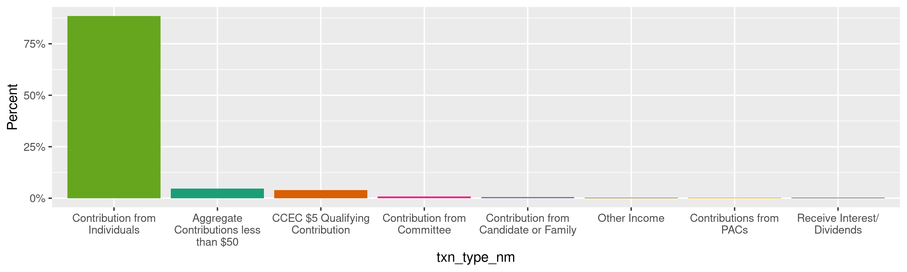
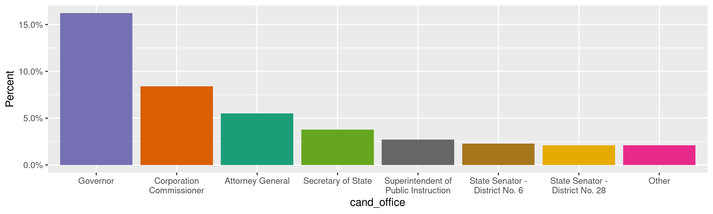
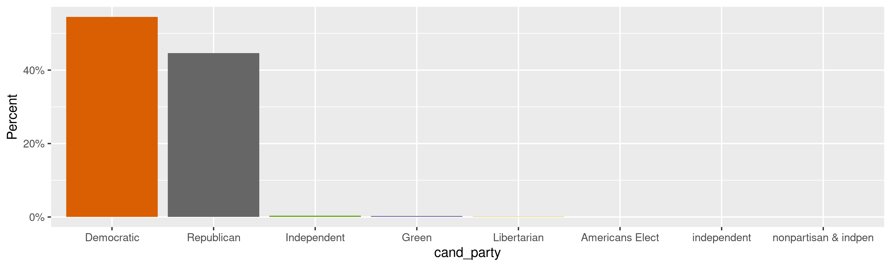
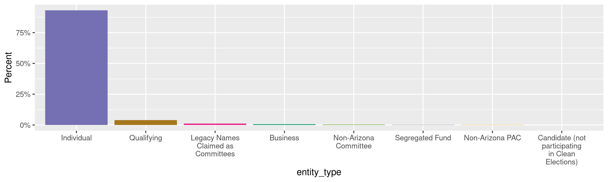
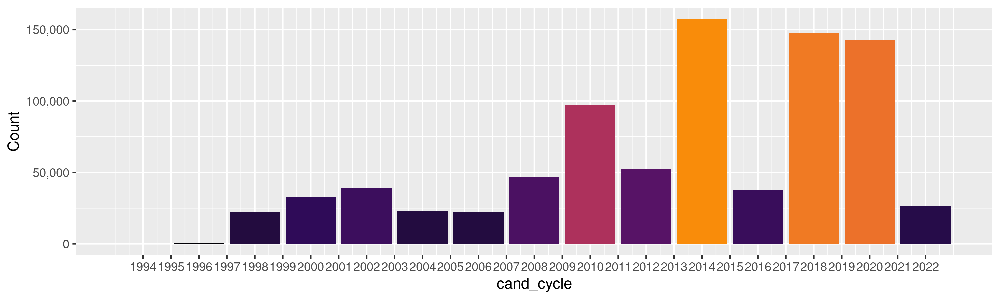
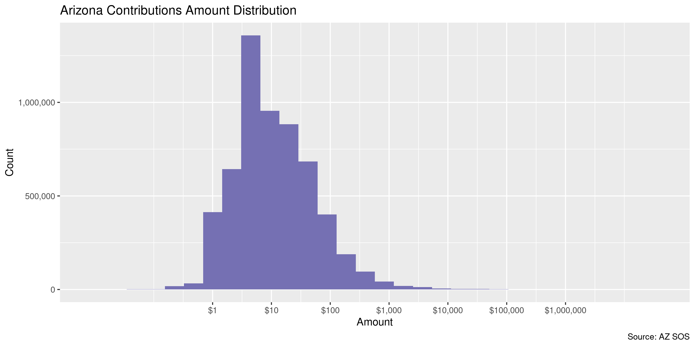
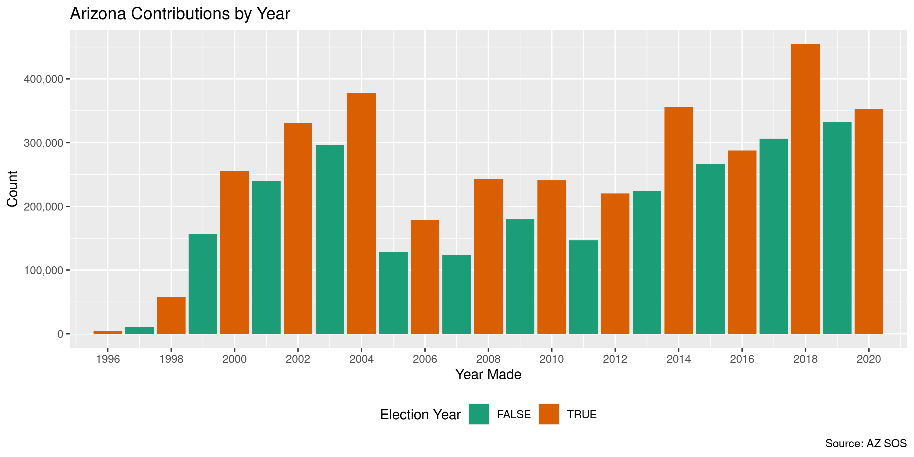

Arizona Contributions
================
Kiernan Nicholls
Thu Jan 21 12:40:13 2021

-   [Project](#project)
-   [Objectives](#objectives)
-   [Packages](#packages)
-   [Data](#data)
-   [Read](#read)
-   [Prepare](#prepare)
    -   [Transactions](#transactions)
    -   [Committees](#committees)
    -   [Contributors](#contributors)
-   [Wrangle](#wrangle)
    -   [Fix](#fix)
    -   [Address](#address)
    -   [ZIP](#zip)
    -   [State](#state)
    -   [City](#city)
-   [Join](#join)
-   [Explore](#explore)
    -   [Missing](#missing)
    -   [Duplicates](#duplicates)
    -   [Categorical](#categorical)
    -   [Amounts](#amounts)
    -   [Dates](#dates)
-   [Conclude](#conclude)
-   [Export](#export)
-   [Upload](#upload)

<!-- Place comments regarding knitting here -->

## Project

The Accountability Project is an effort to cut across data silos and
give journalists, policy professionals, activists, and the public at
large a simple way to search across huge volumes of public data about
people and organizations.

Our goal is to standardizing public data on a few key fields by thinking
of each dataset row as a transaction. For each transaction there should
be (at least) 3 variables:

1.  All **parties** to a transaction.
2.  The **date** of the transaction.
3.  The **amount** of money involved.

## Objectives

This document describes the process used to complete the following
objectives:

1.  How many records are in the database?
2.  Check for entirely duplicated records.
3.  Check ranges of continuous variables.
4.  Is there anything blank or missing?
5.  Check for consistency issues.
6.  Create a five-digit ZIP Code called `zip`.
7.  Create a `year` field from the transaction date.
8.  Make sure there is data on both parties to a transaction.

## Packages

The following packages are needed to collect, manipulate, visualize,
analyze, and communicate these results. The `pacman` package will
facilitate their installation and attachment.

``` r
if (!require("pacman")) {
  install.packages("pacman")
}
pacman::p_load(
  tidyverse, # data manipulation
  lubridate, # datetime strings
  gluedown, # printing markdown
  janitor, # clean data frames
  campfin, # custom irw tools
  aws.s3, # aws cloud storage
  refinr, # cluster & merge
  scales, # format strings
  knitr, # knit documents
  vroom, # fast reading
  rvest, # scrape html
  mdbr, # read mdb files
  glue, # code strings
  here, # project paths
  httr, # http requests
  fs # local storage 
)
```

This document should be run as part of the `R_campfin` project, which
lives as a sub-directory of the more general, language-agnostic
[`irworkshop/accountability_datacleaning`](https://github.com/irworkshop/accountability_datacleaning)
GitHub repository.

The `R_campfin` project uses the [RStudio
projects](https://support.rstudio.com/hc/en-us/articles/200526207-Using-Projects)
feature and should be run as such. The project also uses the dynamic
`here::here()` tool for file paths relative to *your* machine.

``` r
# where does this document knit?
here::i_am("az/contribs/docs/az_contribs_diary.Rmd")
```

## Data

The Arizona campaign finance database was obtained by the Investigative
Reporting Workshop via a state records request pursuant to Ariz.
Rev. Stat. Ann. Secs. 39-121 to 39-122. The request was made via email
to Renada Fisher, Elections Customer Service Manager for the Arizona
Secretary of State on January 13, 2021. She supplied a Microsoft Access
database file via the secure file sharing site Serv-U. That file was
download and then uploaded to the IRW server, where it can be
downloaded.

``` r
raw_dir <- dir_create(here("az", "contribs", "data", "raw"))
raw_obj <- "20201230-CFS_Export.mdb"
raw_mdb <- path(raw_dir, raw_obj)
raw_aws <- path("csv", raw_obj)
```

``` r
if (!file_exists(raw_mdb)) {
  save_object(
    object = raw_aws,
    bucket = "publicaccountability",
    file = raw_mdb,
    overwrite = FALSE,
    show_progress = TRUE
  )
}
```

## Read

The tables in this Microsoft Access database can be converted to flat,
comma delimited text files which can then be read as data frames and
joined together into a single, searchable file. The `mdbr` R package is
needed for this conversion. That packages uses the [MDB
Tools](https://github.com/mdbtools/mdbtools) software, which needs to be
installed separately on your system. For example, Debian users can
install MDB Tools from the apt repository from the command line.

``` bash
sudo apt install mdbtools
```

``` r
az_tables <- mdb_tables(raw_mdb)
md_bullet(md_code(az_tables))
#> * `BallotMeasures`
#> * `Categories`
#> * `Counties`
#> * `Cycles`
#> * `EntityTypes`
#> * `IncomeExpenseNeutral`
#> * `Names`
#> * `Offices`
#> * `Parties`
#> * `ReportNames`
#> * `Reports`
#> * `ReportTypes`
#> * `TransactionTypes`
#> * `WebsiteExpenseTransactionTypes`
#> * `WebsiteIncomeTransactionTypes`
#> * `Committees`
#> * `Transactions`
```

The `Transactions` table contains the bulk data, every financial
transaction conducted by campaign committees in the state of Arizona.
The other tables contain the codes needed to identify the parties
details of each transaction.

We can read all of these tables as data frames into a list.

``` r
az <- map(
  .x = az_tables, 
  .f = read_mdb, 
  file = raw_mdb, 
  col_types = TRUE,
  na = c("", "NA", "N/A", "<missing value>")
)
```

``` r
az <- map(az, clean_names, "snake")
names(az) <- make_clean_names(az_tables)
```

## Prepare

First we will simplify each data frame by removing empty and constant
columns and abbreviating column names for ease of use.

``` r
az <- map(az, fix_cols)
```

Now that each data frame is read and cleaned, we can prepare them for a
join.

### Transactions

The most important table is `Transactions`. This table only identifies
the reporting committee and transaction partner using their unique ID
number. This table includes not just contribution *to* a committee but
also the expenses *from* that committee, etc. Each transaction has it’s
own unique ID.

``` r
az$transactions
#> # A tibble: 6,396,194 x 6
#>    txn_id txn_type_id   cmte_id txn_date   amount  nm_id
#>     <int>       <int>     <int> <date>      <dbl>  <int>
#>  1      1           2 200492094 2003-09-10     50 541067
#>  2      2           2 200492094 2003-12-09    100 541142
#>  3      3           2 200492094 2003-10-23    140 541066
#>  4      4           2 200492094 2003-10-27    250 541095
#>  5      5           2 200492094 2004-01-10    280 541218
#>  6      6           2 200492094 2003-01-09    160 541275
#>  7      7           2 200492094 2003-09-15    100 541418
#>  8      8           2 200492094 2003-09-24    100 541408
#>  9      9           2 200002301 2001-10-02     10 307788
#> 10     10           2 200002301 2001-10-16     10 307788
#> # … with 6,396,184 more rows
```

Contributions from individuals are the most common transaction type, but
there are other types that are different kinds of income.

``` r
az$transactions %>% 
  count(txn_type_id, sort = TRUE) %>% 
  left_join(az$transaction_types, by = "txn_type_id") %>% 
  add_prop(sum = FALSE)
#> # A tibble: 162 x 5
#>    txn_type_id       n txn_type_nm                                  income_expense_neutral_id       p
#>          <int>   <int> <chr>                                                            <int>   <dbl>
#>  1           2 5103997 Contribution from Individuals                                        1 0.798  
#>  2          31  379067 Operating Expense - Pay Cash/Check                                   2 0.0593 
#>  3           5  269450 Aggregate Contributions less than $50                                1 0.0421 
#>  4          10  230295 CCEC $5 Qualifying Contribution                                      1 0.0360 
#>  5           3   45386 Contribution from Committee                                          1 0.00710
#>  6          37   43417 Other Expenses - Pay Cash/Check                                      2 0.00679
#>  7          35   34118 Contribute to another Committee                                      2 0.00533
#>  8           1   28538 Contribution from Candidate or Family                                1 0.00446
#>  9          32   26808 Operating Expense - Purchase on Terms/Credit                         2 0.00419
#> 10          75   25689 Pay a Bill - Operating Expenses                                      3 0.00402
#> # … with 152 more rows
```

Here, we are interested in *all* income types, so we will use the
`income_expense_neutral_id` variable associated with each `txn_type_*`
to keep only “Income” transactions.

``` r
az$income_expense_neutral
#> # A tibble: 3 x 2
#>   income_expense_neutral_id income_expense_neutral
#>                       <int> <chr>                 
#> 1                         1 Income                
#> 2                         2 Expense               
#> 3                         3 Neutral
```

``` r
az$transactions <- az$transactions %>% 
  # identify transaction type
  left_join(az$transaction_types, by = "txn_type_id") %>% 
  # identify if type is income
  left_join(az$income_expense_neutral, by = "income_expense_neutral_id") %>% 
  # keep only income types
  filter(income_expense_neutral == "Income") %>% 
  # remove ids and move cols
  select(-txn_type_id, -income_expense_neutral_id, -income_expense_neutral) %>% 
  relocate(txn_type_nm = txn_type_nm, .before = cmte_id)
```

    #> # A tibble: 5,768,411 x 6
    #>    txn_id txn_type_nm                     cmte_id txn_date   amount  nm_id
    #>     <int> <chr>                             <int> <date>      <dbl>  <int>
    #>  1      1 Contribution from Individuals 200492094 2003-09-10     50 541067
    #>  2      2 Contribution from Individuals 200492094 2003-12-09    100 541142
    #>  3      3 Contribution from Individuals 200492094 2003-10-23    140 541066
    #>  4      4 Contribution from Individuals 200492094 2003-10-27    250 541095
    #>  5      5 Contribution from Individuals 200492094 2004-01-10    280 541218
    #>  6      6 Contribution from Individuals 200492094 2003-01-09    160 541275
    #>  7      7 Contribution from Individuals 200492094 2003-09-15    100 541418
    #>  8      8 Contribution from Individuals 200492094 2003-09-24    100 541408
    #>  9      9 Contribution from Individuals 200002301 2001-10-02     10 307788
    #> 10     10 Contribution from Individuals 200002301 2001-10-16     10 307788
    #> # … with 5,768,401 more rows

Now we will have to use the `Names` and `Committees` tables to identify
the entities making the contributions and the committees receiving them.

### Committees

The `Committees` table contains all the information on political
committees, including their financial institutions, chairpersons, etc.
We are only interested in adding names and addresses to the transaction
data so it can be searched.

``` r
az$committees
#> # A tibble: 4,611 x 27
#>    cmte_id  nm_id chairperson_nm_… treasurer_nm_id cand_nm_id designee_nm_id sponsor_nm_id ballot_measure_…
#>      <int>  <int>            <int>           <int>      <int>          <int>         <int>            <int>
#>  1    1001 1.54e6          1541829         1541830         NA             NA            NA               NA
#>  2    1002 1.44e6           695421         1610589         NA             NA            NA               NA
#>  3    1004 1.44e6          1338246         1430479         NA             NA       1082064               NA
#>  4    1007 1.56e6           695447         1562704         NA             NA        695451               NA
#>  5    1013 1.67e6          1271050         1589839         NA             NA       1111516               NA
#>  6    1014 1.44e6          1558627         1090076         NA             NA            NA               NA
#>  7    1016 1.53e6          1344676         1148739         NA             NA       1148740               NA
#>  8    1018 6.96e5           695527          695528         NA             NA            NA               NA
#>  9    1022 1.68e6          1684401         1684402         NA             NA       1684404               NA
#> 10    1024 1.44e6          1420895         1420896         NA             NA       1420897               NA
#> # … with 4,601 more rows, and 19 more variables: physical_address1 <chr>, physical_address2 <chr>, physical_city <chr>,
#> #   physical_state <chr>, physical_zip_code <chr>, sponsor_type <chr>, sponsor_relationship <chr>,
#> #   organization_date <date>, termination_date <dttm>, benefits_ballot_measure <lgl>, financial_institution1 <chr>,
#> #   financial_institution2 <chr>, financial_institution3 <chr>, cand_party_id <int>, cand_office_id <int>,
#> #   cand_county_id <int>, cand_is_incumbent <lgl>, cand_cycle_id <int>, cand_other_party_nm <chr>
```

``` r
az$committees <- az$committees %>% 
  # keep address and candidate info
  rename_with(~str_replace(., "physical", "cmte")) %>% 
  select(
    cmte_id, nm_id, starts_with("cmte"), 
    cand_party_id, cand_office_id,
    cand_is_incumbent, cand_cycle_id,
    cand_other_party_nm
  ) %>% 
  rename(cmte_zip = cmte_zip_code)
```

We can then use the `Offices`, `Parties`, and `Cycles` tables to
identify candidate information by code. We will keep the names and
remove the codes.

``` r
az$committees <- az$committees %>% 
  # add office name from id
  left_join(az$offices, by = c("cand_office_id" = "office_id")) %>% 
  # add party name from id
  left_join(az$parties, by = c("cand_party_id" = "party_id")) %>% 
  # add cycle year from id
  left_join(az$cycles[, 1:2], by = c("cand_cycle_id" = "cycle_id")) %>% 
  # remove codes
  select(
    -cand_office_id, cand_office = office_nm,
    -cand_party_id, cand_party = party_nm,
    -cand_cycle_id, cand_cycle = cycle_nm
  ) %>% 
  # combine "other" party and other col
  mutate(
    cand_party = cand_party %>% 
      na_if("Other") %>% 
      coalesce(cand_other_party_nm)
  ) %>% 
  select(-cand_other_party_nm)
```

This data still only identifies the committees by their unique
`cmte_id`. We can use the `nm_id` variable to add the names for those
committees.

``` r
cmte_nms <- select(az$names, nm_id, cmte_nm = last_nm)
cmte_nms
#> # A tibble: 1,233,705 x 2
#>    nm_id cmte_nm                           
#>    <int> <chr>                             
#>  1    -7 Multiple Vendors                  
#>  2    -5 Previous/Next Committee           
#>  3    -3 Arizona Secretary of State        
#>  4    -2 Citizens Clean Election Commission
#>  5    -1 Multiple Contributors             
#>  6     0 Invalid Name                      
#>  7     4 ARIZONA STATE DEMOCRATIC PARTY    
#>  8     5 ARIZONA STATE AFL-CIO             
#>  9     9 PAUL JOHNSON FOR GOVERNOR         
#> 10    12 COMMITTEE TO ELECT DAWN KNIGHT    
#> # … with 1,233,695 more rows
```

``` r
az$committees <- az$committees %>% 
  # add the committee name
  inner_join(cmte_nms, by = "nm_id") %>% 
  relocate(cmte_nm, .after = cmte_id) %>% 
  select(-nm_id)
```

    #> # A tibble: 4,611 x 11
    #>    cmte_id cmte_nm cmte_address1 cmte_address2 cmte_city cmte_state cmte_zip cand_is_incumbe… cand_office cand_party
    #>      <int> <chr>   <chr>         <chr>         <chr>     <chr>      <chr>    <lgl>            <chr>       <chr>     
    #>  1    1001 ARIZON… 3117 N 16th … <NA>          PHOENIX   AZ         85016    FALSE            <NA>        <NA>      
    #>  2    1002 INDEPE… 333 EAST FLO… <NA>          PHOENIX   AZ         85012    FALSE            <NA>        <NA>      
    #>  3    1004 ALLSTA… 2775 SANDERS… <NA>          NORTHBRO… IL         60062    FALSE            <NA>        <NA>      
    #>  4    1007 AMIGOS… 8711 E. Pinn… <NA>          Scottsda… AZ         85255    FALSE            <NA>        <NA>      
    #>  5    1013 AZ ACR… 2210 S. Prie… <NA>          Tempe     AZ         85282    FALSE            <NA>        <NA>      
    #>  6    1014 CUPAC   2020 N Centr… Suite 530     PHOENIX   AZ         85004    FALSE            <NA>        <NA>      
    #>  7    1016 PINNAC… PO BOX 53999  <NA>          PHOENIX   AZ         85072    FALSE            <NA>        <NA>      
    #>  8    1018 ASARCO… 1150 N 7TH A… <NA>          TUCSON    AZ         85705    FALSE            <NA>        <NA>      
    #>  9    1022 #1022 … 3419 E Unive… <NA>          Phoenix   AZ         85034    FALSE            <NA>        <NA>      
    #> 10    1024 AZ LIC… 8155 N. 24th… <NA>          PHOENIX   AZ         85021    FALSE            <NA>        <NA>      
    #> # … with 4,601 more rows, and 1 more variable: cand_cycle <int>

### Contributors

We can now identify the contributors by their name and address. Again,
we will join together other tables which identify the *type* of
contributor and the county name if they’re from Arizona.

``` r
az$names <- az$names %>% 
  rename(zip = zip_code) %>% 
  # add entity type and county name
  left_join(az$entity_types, by = "entity_type_id") %>% 
  left_join(az$counties, by = "county_id") %>% 
  select(-nm_group_id, -entity_type_id, -county_id) %>% 
  rename(entity_type = entity_type_nm, county = county_nm) %>% 
  # keep names of contributors only
  filter(nm_id %in% az$transactions$nm_id)
```

    #> # A tibble: 10 x 8
    #>    nm_id last_nm                           address1              address2 city     state zip   entity_type              
    #>    <int> <chr>                             <chr>                 <chr>    <chr>    <chr> <chr> <chr>                    
    #>  1    -7 Multiple Vendors                  <NA>                  <NA>     <NA>     AZ    <NA>  Business Vendor          
    #>  2    -5 Previous/Next Committee           <NA>                  <NA>     <NA>     AZ    <NA>  Legacy Names Claimed as …
    #>  3    -3 Arizona Secretary of State        1700 W Washington St  Floor 7  Phoenix  AZ    85007 Business                 
    #>  4    -2 Citizens Clean Election Commissi… 1616 W Adams          Suite 1… Phoenix  AZ    85007 Business                 
    #>  5    -1 Multiple Contributors             <NA>                  <NA>     <NA>     AZ    <NA>  Individual               
    #>  6     0 Invalid Name                      <NA>                  <NA>     <NA>     AZ    <NA>  Business                 
    #>  7     5 ARIZONA STATE AFL-CIO             5818 N 7th St         Ste 200  Phoenix  AZ    85014 Business                 
    #>  8    23 COMMUNICATION WORKERS OF AMERICA… 5818 N 7th St         Ste 206  Phoenix  AZ    85014 Legacy Names Claimed as …
    #>  9    28 CWA STATE CNCL-PAC                5818 N. 7THS STREET.… <NA>     PHONEIX  AZ    85014 Legacy Names Claimed as …
    #> 10    30 TEAMSTERS DRIVE COMMITTEE         25 Louisiana Ave NW   <NA>     Washing… DC    20001 Legacy Names Claimed as …

## Wrangle

Before identifying the parties to each transaction, we can use their
individual tables to normalize the geographic variables search on the
Accountability site.

To improve the searchability of the database, we will perform some
consistent, confident string normalization. For geographic variables
like city names and ZIP codes, the corresponding `campfin::normal_*()`
functions are tailor made to facilitate this process.

### Fix

There are 15,046 records with some kind of problem shifting the
geographic variables out of place. For these records, the `city` is in
thr `address1` variable, the `state` is in the `city` variable, and it
appears as though the `zip` variable has been split in half with the
first two digits (85 is a comma Arizona ZIP code prefix) in the `state`
column and the last three converted somehow to a dollar value?

This problem has been confirmed to exist in the raw Microsoft Access
database and not be an error stemming from our conversion to a flat text
file.

``` r
az$names %>% 
  filter(str_detect(zip, "\\$")) %>% 
  select(6:10)
#> # A tibble: 15,046 x 5
#>    address1     address2 city  state zip  
#>    <chr>        <chr>    <chr> <chr> <chr>
#>  1 PLYMOUTH     <NA>     NH    32    $1.00
#>  2 JACKSONVILLE <NA>     FL    32    $7.00
#>  3 INDIANAPOLIS <NA>     IN    46    $4.00
#>  4 CHICAGO      <NA>     IL    60    $7.00
#>  5 CHICAGO      <NA>     IL    60    $1.00
#>  6 SAN ANTONIO  <NA>     TX    78    $3.00
#>  7 PHOENIX      <NA>     AZ    85    $7.00
#>  8 PHOENIX      <NA>     AZ    85    $2.00
#>  9 PHOENIX      <NA>     AZ    85    $4.00
#> 10 PHOENIX      <NA>     AZ    85    $1.00
#> # … with 15,036 more rows
```

We can attempt to fix these values to the best of our ability.

First, we will find the index of any record with a `zip` value
containing a dollar sight at the start.

``` r
dollar_zip <- str_which(az$names$zip, "^\\$")
length(dollar_zip)
#> [1] 15046
```

We can then create vectors of the city names and state abbreviations
from the wrong column.

``` r
bad_city <- az$names$address1[dollar_zip]
bad_state <- az$names$city[dollar_zip]
```

Then, we will combine the two numbers from the `state` column of these
bad records the dollar value, after converting those dollar values to
three digit numbers.

``` r
bad_zip <- str_c(
  az$names$state[dollar_zip],
  str_sub(
    string = str_pad(
      string = parse_number(x = az$names$zip[dollar_zip]) * 100, 
      width = 3, 
      pad = "0"
    ), 
    end = 3
  )
)
```

Only 10.6% of these combined ZIP code values are actually valid, but
that is an improvement over the bad data. It seems as though some
accuracy was lost whenever these ZIP codes were accidentally converted
to dollar values.

``` r
prop_in(az$names$zip[dollar_zip], valid_zip)
#> [1] 0
prop_in(bad_zip, valid_zip)
#> [1] 0.1056759
```

``` r
mutate(count_vec(bad_zip), valid = value %in% valid_zip)
#> # A tibble: 84 x 3
#>    value     n valid
#>    <chr> <int> <lgl>
#>  1 85700  5193 FALSE
#>  2 85400  2529 FALSE
#>  3 85175  1702 FALSE
#>  4 85100  1113 FALSE
#>  5 86400   612 FALSE
#>  6 85200   577 TRUE 
#>  7 85900   404 FALSE
#>  8 85350   402 TRUE 
#>  9 85600   375 FALSE
#> 10 85140   329 TRUE 
#> # … with 74 more rows
```

We can now take these three vectors and place them back into the proper
columns.

``` r
az$names$city[dollar_zip] <- bad_city
az$names$state[dollar_zip] <- bad_state
az$names$zip[dollar_zip] <- bad_zip
```

For these bad records, there is no street address value. The city values
were placed there instead and the addresses were not misplaced (as was
the case with the state and ZIP code values).

``` r
az$names$address1[dollar_zip] <- NA
```

### Address

For the street `addresss*` variables, the `campfin::normal_address()`
function will force consistence case, remove punctuation, and abbreviate
official USPS suffixes.

We will repeat the process once for committee addresses then for
contributors.

``` r
az$committees <- az$committees %>% 
  unite(
    col = cmte_address_full,
    matches("address\\d$"),
    sep = " ",
    remove = FALSE,
    na.rm = TRUE
  ) %>% 
  mutate(
    cmte_address_norm = normal_address(
      address = cmte_address_full,
      abbs = usps_street,
      na_rep = TRUE
    )
  ) %>% 
  select(-cmte_address_full)
```

``` r
nm_norm_addr <- az$names %>% 
  distinct(address1, address2) %>% 
  unite(
    col = address_full,
    starts_with("address"),
    sep = " ",
    remove = FALSE,
    na.rm = TRUE
  ) %>% 
  mutate(
    address_norm = normal_address(
      address = address_full,
      abbs = usps_street,
      na_rep = TRUE
    )
  ) %>% 
  select(-address_full)
```

``` r
nm_norm_addr
#> # A tibble: 494,889 x 3
#>    address1                      address2  address_norm             
#>    <chr>                         <chr>     <chr>                    
#>  1 <NA>                          <NA>      <NA>                     
#>  2 1700 W Washington St          Floor 7   1700 W WASHINGTON ST FL 7
#>  3 1616 W Adams                  Suite 110 1616 W ADAMS STE 110     
#>  4 5818 N 7th St                 Ste 200   5818 N 7TH ST STE 200    
#>  5 5818 N 7th St                 Ste 206   5818 N 7TH ST STE 206    
#>  6 5818 N. 7THS STREET., STE 206 <NA>      5818 N 7THS ST STE 206   
#>  7 25 Louisiana Ave NW           <NA>      25 LOUISIANA AVE NW      
#>  8 501 3rd St NW                 <NA>      501 3RD ST NW            
#>  9 PO Box 260180                 <NA>      PO BOX 260180            
#> 10 3109 N 24th St                <NA>      3109 N 24TH ST           
#> # … with 494,879 more rows
```

``` r
az$names <- left_join(az$names, nm_norm_addr)
```

### ZIP

For ZIP codes, the `campfin::normal_zip()` function will attempt to
create valid *five* digit codes by removing the ZIP+4 suffix and
returning leading zeroes dropped by other programs like Microsoft Excel.

``` r
prop_in(az$committees$cmte_zip, valid_zip)
#> [1] 0.9978313
```

``` r
az$names <- az$names %>% 
  mutate(
    zip_norm = normal_zip(
      zip = zip,
      na_rep = TRUE
    )
  )
```

``` r
progress_table(
  az$names$zip,
  az$names$zip_norm,
  compare = valid_zip
)
#> # A tibble: 2 x 6
#>   stage    prop_in n_distinct prop_na n_out n_diff
#>   <chr>      <dbl>      <dbl>   <dbl> <dbl>  <dbl>
#> 1 zip        0.981      16773   0.150 18420    676
#> 2 zip_norm   0.984      16618   0.152 15542    515
```

### State

Valid two digit state abbreviations can be made using the
`campfin::normal_state()` function.

``` r
az$committees <- az$committees %>% 
  mutate(
    cmte_state_norm = normal_state(
      state = cmte_state,
      abbreviate = TRUE,
      na_rep = TRUE,
      valid = valid_state
    )
  )
```

``` r
az$names <- az$names %>% 
  mutate(
    state_norm = normal_state(
      state = state,
      abbreviate = TRUE,
      na_rep = TRUE,
      valid = valid_state
    )
  )
```

``` r
az$names %>% 
  filter(state != state_norm) %>% 
  count(state, state_norm, sort = TRUE)
#> # A tibble: 74 x 3
#>    state   state_norm     n
#>    <chr>   <chr>      <int>
#>  1 "Az"    AZ           794
#>  2 "az"    AZ           582
#>  3 "AZ "   AZ           114
#>  4 "Az."   AZ            25
#>  5 "AZ - " AZ            12
#>  6 "az."   AZ             7
#>  7 "ca"    CA             7
#>  8 "Ca"    CA             7
#>  9 "Co"    CO             7
#> 10 "AZ  "  AZ             6
#> # … with 64 more rows
```

``` r
progress_table(
  az$names$state,
  az$names$state_norm,
  compare = valid_state
)
#> # A tibble: 2 x 6
#>   stage      prop_in n_distinct prop_na n_out n_diff
#>   <chr>        <dbl>      <dbl>   <dbl> <dbl>  <dbl>
#> 1 state        0.995        319   0.148  4789    260
#> 2 state_norm   1             59   0.151     0      1
```

### City

Cities are the most difficult geographic variable to normalize, simply
due to the wide variety of valid cities and formats.

#### Normal

The `campfin::normal_city()` function is a good start, again converting
case, removing punctuation, but *expanding* USPS abbreviations. We can
also remove `invalid_city` values.

``` r
nm_norm_city <- az$names %>% 
  distinct(city, state_norm, zip_norm) %>% 
  mutate(
    city_norm = normal_city(
      city = city, 
      abbs = usps_city,
      states = c("AZ", "DC", "ARIZONA"),
      na = invalid_city,
      na_rep = TRUE
    )
  )
```

``` r
cmte_norm_city <- az$committees %>% 
  distinct(cmte_city, cmte_state_norm, cmte_zip) %>% 
  mutate(
    cmte_city_norm = normal_city(
      city = cmte_city, 
      abbs = usps_city,
      states = c("AZ", "DC", "ARIZONA"),
      na = invalid_city,
      na_rep = TRUE
    )
  )
```

#### Swap

We can further improve normalization by comparing our normalized value
against the *expected* value for that record’s state abbreviation and
ZIP code. If the normalized value is either an abbreviation for or very
similar to the expected value, we can confidently swap those two.

``` r
nm_norm_city <- nm_norm_city %>% 
  rename(city_raw = city) %>% 
  left_join(
    y = zipcodes,
    by = c(
      "state_norm" = "state",
      "zip_norm" = "zip"
    )
  ) %>% 
  rename(city_match = city) %>% 
  mutate(
    match_abb = is_abbrev(city_norm, city_match),
    match_dist = str_dist(city_norm, city_match),
    city_swap = if_else(
      condition = !is.na(match_dist) & (match_abb | match_dist == 1),
      true = city_match,
      false = city_norm
    )
  ) %>% 
  select(
    -city_match,
    -match_dist,
    -match_abb
  )
```

``` r
az$names <- left_join(
  x = az$names,
  y = nm_norm_city,
  by = c(
    "city" = "city_raw", 
    "state_norm", 
    "zip_norm"
  )
)
```

``` r
cmte_norm_city <- cmte_norm_city %>% 
  left_join(
    y = zipcodes,
    by = c(
      "cmte_state_norm" = "state",
      "cmte_zip" = "zip"
    )
  ) %>% 
  rename(city_match = city) %>% 
  mutate(
    match_abb = is_abbrev(cmte_city_norm, city_match),
    match_dist = str_dist(cmte_city_norm, city_match),
    cmte_city_swap = if_else(
      condition = !is.na(match_dist) & (match_abb | match_dist == 1),
      true = city_match,
      false = cmte_city_norm
    )
  ) %>% 
  select(
    -city_match,
    -match_dist,
    -match_abb
  )
```

``` r
az$committees <- left_join(
  x = az$committees,
  y = cmte_norm_city,
  by = c(
    "cmte_city", 
    "cmte_state_norm", 
    "cmte_zip"
  )
)
```

#### Progress

Our goal for normalization was to increase the proportion of city values
known to be valid and reduce the total distinct values by correcting
misspellings.

| stage      | prop\_in | n\_distinct | prop\_na | n\_out | n\_diff |
|:-----------|---------:|------------:|---------:|-------:|--------:|
| city)      |    0.990 |        9978 |    0.150 |   9876 |    2079 |
| city\_norm |    0.994 |        9324 |    0.152 |   5982 |    1401 |
| city\_swap |    0.995 |        8866 |    0.152 |   4663 |     943 |

| stage            | prop\_in | n\_distinct | prop\_na | n\_out | n\_diff |
|:-----------------|---------:|------------:|---------:|-------:|--------:|
| cmte\_city)      |    0.974 |         329 |    0.001 |    118 |      68 |
| cmte\_city\_norm |    0.994 |         289 |    0.001 |     28 |      22 |
| cmte\_city\_swap |    0.998 |         272 |    0.001 |     11 |       8 |

These intermediary columns can then be removed.

``` r
az$names <- select(az$names, -city_norm, city_norm = city_swap)
```

``` r
az$committees <- select(
  .data = az$committees, 
  -cmte_city_norm, cmte_city_norm = cmte_city_swap
)
```

## Join

These tables, with their normalized geographic variables, can now be
joined.

``` r
az$transactions <- az$transactions %>% 
  left_join(az$committees, by = "cmte_id") %>% 
  relocate(cmte_id, .before = cmte_nm)
```

``` r
az$transactions <- az$transactions %>% 
  left_join(az$names, by = "nm_id") %>% 
  relocate(nm_id, .before = last_nm)
```

``` r
azc <- az$transactions
rm(az); flush_memory()
```

## Explore

There are 5,768,411 rows of 36 columns. Each record represents a single
contribution made from an entity to a political committee.

``` r
glimpse(azc)
#> Rows: 5,768,411
#> Columns: 36
#> $ txn_id            <int> 1, 2, 3, 4, 5, 6, 7, 8, 9, 10, 11, 12, 13, 14, 15, 16, 17, 18, 19, 20, 21, 22, 23, 24, 25, …
#> $ txn_type_nm       <chr> "Contribution from Individuals", "Contribution from Individuals", "Contribution from Indivi…
#> $ txn_date          <date> 2003-09-10, 2003-12-09, 2003-10-23, 2003-10-27, 2004-01-10, 2003-01-09, 2003-09-15, 2003-0…
#> $ amount            <dbl> 50.0, 100.0, 140.0, 250.0, 280.0, 160.0, 100.0, 100.0, 10.0, 10.0, 10.0, 10.0, 10.0, 10.0, …
#> $ cmte_id           <int> 200492094, 200492094, 200492094, 200492094, 200492094, 200492094, 200492094, 200492094, 200…
#> $ cmte_nm           <chr> "VOTE DEAN MARTIN - 2004", "VOTE DEAN MARTIN - 2004", "VOTE DEAN MARTIN - 2004", "VOTE DEAN…
#> $ cmte_address1     <chr> "23227 N 23RD PL", "23227 N 23RD PL", "23227 N 23RD PL", "23227 N 23RD PL", "23227 N 23RD P…
#> $ cmte_address2     <chr> NA, NA, NA, NA, NA, NA, NA, NA, "Suite 700", "Suite 700", "Suite 700", "Suite 700", "Suite …
#> $ cmte_city         <chr> "PHOENIX", "PHOENIX", "PHOENIX", "PHOENIX", "PHOENIX", "PHOENIX", "PHOENIX", "PHOENIX", "Wa…
#> $ cmte_state        <chr> "AZ", "AZ", "AZ", "AZ", "AZ", "AZ", "AZ", "AZ", "DC", "DC", "DC", "DC", "DC", "DC", "DC", "…
#> $ cmte_zip          <chr> "85024", "85024", "85024", "85024", "85024", "85024", "85024", "85024", "20001", "20001", "…
#> $ cand_is_incumbent <lgl> TRUE, TRUE, TRUE, TRUE, TRUE, TRUE, TRUE, TRUE, FALSE, FALSE, FALSE, FALSE, FALSE, FALSE, F…
#> $ cand_office       <chr> "State Senator - District No. 6", "State Senator - District No. 6", "State Senator - Distri…
#> $ cand_party        <chr> "Republican", "Republican", "Republican", "Republican", "Republican", "Republican", "Republ…
#> $ cand_cycle        <int> 2004, 2004, 2004, 2004, 2004, 2004, 2004, 2004, NA, NA, NA, NA, NA, NA, NA, NA, NA, NA, 200…
#> $ cmte_address_norm <chr> "23227 N 23RD PL", "23227 N 23RD PL", "23227 N 23RD PL", "23227 N 23RD PL", "23227 N 23RD P…
#> $ cmte_state_norm   <chr> "AZ", "AZ", "AZ", "AZ", "AZ", "AZ", "AZ", "AZ", "DC", "DC", "DC", "DC", "DC", "DC", "DC", "…
#> $ cmte_city_norm    <chr> "PHOENIX", "PHOENIX", "PHOENIX", "PHOENIX", "PHOENIX", "PHOENIX", "PHOENIX", "PHOENIX", "WA…
#> $ nm_id             <int> 541067, 541142, 541066, 541095, 541218, 541275, 541418, 541408, 307788, 307788, 307788, 307…
#> $ last_nm           <chr> "Lopata", "Allen", "Low", "Ricks", "Wilhelm-Garcia", "Barclay", "Shipe", "Disbrow", "Kramer…
#> $ first_nm          <chr> "Jaime", "Richard", "Jamie", "Ron", "Connie", "Steve", "Robert", "Tim", "Karl", "Karl", "Ka…
#> $ middle_nm         <chr> NA, NA, NA, NA, NA, NA, NA, NA, "Dieter", "Dieter", "Dieter", "Dieter", "Dieter", "Dieter",…
#> $ suffix            <chr> NA, NA, NA, NA, NA, NA, NA, NA, NA, NA, NA, NA, NA, NA, NA, NA, NA, NA, NA, NA, NA, NA, NA,…
#> $ address1          <chr> "1053 E Sheffield Ave", "1029 E Vista Ave", "5817 E Leith Ln", "6338 Azalea Ln", "138 W Ros…
#> $ address2          <chr> NA, NA, NA, NA, NA, NA, NA, NA, NA, NA, NA, NA, NA, NA, NA, NA, NA, NA, NA, NA, NA, NA, NA,…
#> $ city              <chr> "Chandler", "Phoenix", "Scottsdale", "Dallas", "Phoenix", "Phoenix", "Window Rock", "Scotts…
#> $ state             <chr> "AZ", "AZ", "AZ", "TX", "AZ", "AZ", "AZ", "AZ", "VA", "VA", "VA", "VA", "VA", "VA", "OH", "…
#> $ zip               <chr> "85225", "85020", "85254", "75230", "85013", "85048", "86515", "85259", "22181", "22181", "…
#> $ occupation        <chr> "Integrated Solutions Manager", "Owner", "Insurance Producer", "VP-Govt Affairs", "Director…
#> $ employer          <chr> "SBC DataComm, Inc.", "Allen Tenant Services", "Low & Johnson", "Southwest Airlines", "Home…
#> $ entity_type       <chr> "Individual", "Individual", "Individual", "Individual", "Individual", "Individual", "Indivi…
#> $ county            <chr> NA, NA, NA, NA, NA, NA, NA, NA, NA, NA, NA, NA, NA, NA, NA, NA, NA, NA, NA, NA, NA, NA, NA,…
#> $ address_norm      <chr> "1053 E SHEFFIELD AVE", "1029 E VIS AVE", "5817 E LEITH LN", "6338 AZALEA LN", "138 W ROSE …
#> $ zip_norm          <chr> "85225", "85020", "85254", "75230", "85013", "85048", "86515", "85259", "22181", "22181", "…
#> $ state_norm        <chr> "AZ", "AZ", "AZ", "TX", "AZ", "AZ", "AZ", "AZ", "VA", "VA", "VA", "VA", "VA", "VA", "OH", "…
#> $ city_norm         <chr> "CHANDLER", "PHOENIX", "SCOTTSDALE", "DALLAS", "PHOENIX", "PHOENIX", "WINDOW ROCK", "SCOTTS…
tail(azc)
#> # A tibble: 6 x 36
#>   txn_id txn_type_nm txn_date   amount cmte_id cmte_nm cmte_address1 cmte_address2 cmte_city cmte_state cmte_zip
#>    <int> <chr>       <date>      <dbl>   <int> <chr>   <chr>         <chr>         <chr>     <chr>      <chr>   
#> 1 8.72e6 Contributi… 2019-12-19     20  2.01e8 D12 De… 2210 E. Saus… <NA>          Gilbert   AZ         85234   
#> 2 8.72e6 Contributi… 2019-12-27     10  2.01e8 D12 De… 2210 E. Saus… <NA>          Gilbert   AZ         85234   
#> 3 8.72e6 Contributi… 2019-12-30     20  2.01e8 D12 De… 2210 E. Saus… <NA>          Gilbert   AZ         85234   
#> 4 8.72e6 Contributi… 2019-12-30     20  2.01e8 D12 De… 2210 E. Saus… <NA>          Gilbert   AZ         85234   
#> 5 8.72e6 Contributi… 2019-12-30     20  2.01e8 D12 De… 2210 E. Saus… <NA>          Gilbert   AZ         85234   
#> 6 8.72e6 Contributi… 2019-12-31     20  2.01e8 D12 De… 2210 E. Saus… <NA>          Gilbert   AZ         85234   
#> # … with 25 more variables: cand_is_incumbent <lgl>, cand_office <chr>, cand_party <chr>, cand_cycle <int>,
#> #   cmte_address_norm <chr>, cmte_state_norm <chr>, cmte_city_norm <chr>, nm_id <int>, last_nm <chr>, first_nm <chr>,
#> #   middle_nm <chr>, suffix <chr>, address1 <chr>, address2 <chr>, city <chr>, state <chr>, zip <chr>,
#> #   occupation <chr>, employer <chr>, entity_type <chr>, county <chr>, address_norm <chr>, zip_norm <chr>,
#> #   state_norm <chr>, city_norm <chr>
```

### Missing

Columns vary in their degree of missing values.

``` r
col_stats(azc, count_na)
#> # A tibble: 36 x 4
#>    col               class        n          p
#>    <chr>             <chr>    <int>      <dbl>
#>  1 txn_id            <int>        0 0         
#>  2 txn_type_nm       <chr>        0 0         
#>  3 txn_date          <date>       0 0         
#>  4 amount            <dbl>        0 0         
#>  5 cmte_id           <int>        0 0         
#>  6 cmte_nm           <chr>       20 0.00000347
#>  7 cmte_address1     <chr>       20 0.00000347
#>  8 cmte_address2     <chr>  4853569 0.841     
#>  9 cmte_city         <chr>     1030 0.000179  
#> 10 cmte_state        <chr>       20 0.00000347
#> 11 cmte_zip          <chr>       20 0.00000347
#> 12 cand_is_incumbent <lgl>       20 0.00000347
#> 13 cand_office       <chr>  4902979 0.850     
#> 14 cand_party        <chr>  4924167 0.854     
#> 15 cand_cycle        <int>  4920360 0.853     
#> 16 cmte_address_norm <chr>       20 0.00000347
#> 17 cmte_state_norm   <chr>       25 0.00000433
#> 18 cmte_city_norm    <chr>     1030 0.000179  
#> 19 nm_id             <int>        0 0         
#> 20 last_nm           <chr>      974 0.000169  
#> 21 first_nm          <chr>   450500 0.0781    
#> 22 middle_nm         <chr>  4419017 0.766     
#> 23 suffix            <chr>  5595044 0.970     
#> 24 address1          <chr>   523775 0.0908    
#> 25 address2          <chr>  5086116 0.882     
#> 26 city              <chr>   527728 0.0915    
#> 27 state             <chr>   229055 0.0397    
#> 28 zip               <chr>   527823 0.0915    
#> 29 occupation        <chr>   849357 0.147     
#> 30 employer          <chr>   927873 0.161     
#> 31 entity_type       <chr>        0 0         
#> 32 county            <chr>  2871312 0.498     
#> 33 address_norm      <chr>   528649 0.0916    
#> 34 zip_norm          <chr>   535250 0.0928    
#> 35 state_norm        <chr>   257972 0.0447    
#> 36 city_norm         <chr>   533991 0.0926
```

We can flag any record missing a key variable needed to identify a
transaction.

``` r
key_vars <- c("txn_id", "txn_date", "last_nm", "amount", "cmte_nm")
azc <- flag_na(azc, all_of(key_vars))
sum(azc$na_flag)
#> [1] 994
```

``` r
azc %>% 
  filter(na_flag) %>% 
  select(all_of(key_vars)) %>% 
  sample_frac()
#> # A tibble: 994 x 5
#>     txn_id txn_date   last_nm amount cmte_nm                                              
#>      <int> <date>     <chr>    <dbl> <chr>                                                
#>  1 2202110 2004-01-22 <NA>      5    HSBC North America Political Action Committee (H-PAC)
#>  2 2336334 2004-10-28 <NA>      9.04 HSBC North America Political Action Committee (H-PAC)
#>  3 2152550 2003-01-10 <NA>      1    HSBC North America Political Action Committee (H-PAC)
#>  4 1216591 2002-03-22 <NA>      5    HSBC North America Political Action Committee (H-PAC)
#>  5 2158069 2004-05-27 <NA>      5    HSBC North America Political Action Committee (H-PAC)
#>  6 2437150 2005-02-17 <NA>    300    REALTORS OF AZ PAC (RAPAC)                           
#>  7 2190429 2004-02-19 <NA>      5    HSBC North America Political Action Committee (H-PAC)
#>  8 2162724 2004-05-13 <NA>      8.98 HSBC North America Political Action Committee (H-PAC)
#>  9 1287061 2002-02-22 <NA>      5    HSBC North America Political Action Committee (H-PAC)
#> 10   39405 2003-08-29 <NA>     40    PARSONS CORPORATION PAC                              
#> # … with 984 more rows
```

### Duplicates

We can also flag any record completely duplicated across every column.

``` r
dupe_file <- here("az", "contribs", "dupes.tsv.xz")
```

``` r
if (!file_exists(dupe_file)) {
  file_create(dupe_file)
  azs <- azc %>% 
    select(-txn_id) %>% 
    group_split(cmte_zip)
  split_id <- split(azc$txn_id, azc$cmte_zip)
  pb <- txtProgressBar(max = length(azs), style = 3)
  for (i in seq_along(azs)) {
    d1 <- duplicated(azs[[i]], fromLast = FALSE)
    if (any(d1)) {
      d2 <- duplicated(azs[[i]], fromLast = TRUE)
      dupes <- tibble(txn_id = split_id[[i]], dupe_flag = d1 | d2)
      dupes <- filter(dupes, dupe_flag == TRUE)
      vroom_write(dupes, xzfile(dupe_file), append = TRUE)
      rm(d2, dupes)
    }
    rm(d1)
    flush_memory(1)
    setTxtProgressBar(pb, i)
  }
  rm(azs)
}
```

``` r
file_size(dupe_file)
#> 368K
dupes <- read_tsv(
  file = xzfile(dupe_file),
  col_names = c("txn_id", "dupe_flag"),
  col_types = cols(
    txn_id = col_integer(),
    dupe_flag = col_logical()
  )
)
dupes <- distinct(dupes)
```

``` r
nrow(azc)
#> [1] 5768411
azc <- left_join(azc, dupes, by = "txn_id")
azc <- mutate(azc, dupe_flag = !is.na(dupe_flag))
mean(azc$dupe_flag)
#> [1] 0.07625566
```

We can see that, despite unique `txn_id` values, there are duplicate
records.

``` r
azc %>% 
  filter(dupe_flag) %>% 
  select(txn_id, all_of(key_vars)) %>% 
  arrange(last_nm)
#> # A tibble: 439,874 x 5
#>     txn_id txn_date   last_nm                           amount cmte_nm                                                  
#>      <int> <date>     <chr>                              <dbl> <chr>                                                    
#>  1 7088629 2017-07-31 "\"Wells Fargo Bank, N.A.\""         0.4 AZ SOCIETY OF CPAS PAC                                   
#>  2 7089098 2017-07-31 "\"Wells Fargo Bank, N.A.\""         0.4 AZ SOCIETY OF CPAS PAC                                   
#>  3 7201747 2017-11-27 "\"Wells Fargo Bank, N.A.\""        14   Arizona ArchiPAC:AIA Arizona, American Institute of Arch…
#>  4 7201751 2017-11-27 "\"Wells Fargo Bank, N.A.\""        14   Arizona ArchiPAC:AIA Arizona, American Institute of Arch…
#>  5 6809502 2016-10-11 "1016 - Pinnacle West PAC"        1000   Committee to Elect Sylvia Allen 2016                     
#>  6 6809504 2016-10-11 "1016 - Pinnacle West PAC"        1000   Committee to Elect Sylvia Allen 2016                     
#>  7 6862376 2017-01-06 "1016 - Pinnacle West PAC"         500   Boyer for Senate                                         
#>  8 7165993 2017-01-06 "1016 - Pinnacle West PAC"         500   Boyer for Senate                                         
#>  9 5184742 2014-01-08 "1139 Freeport McMoran Arizona P…  200   Elect Hobbs                                              
#> 10 5184743 2014-01-08 "1139 Freeport McMoran Arizona P…  200   Elect Hobbs                                              
#> # … with 439,864 more rows
```

### Categorical

``` r
col_stats(azc, n_distinct)
#> # A tibble: 38 x 4
#>    col               class        n           p
#>    <chr>             <chr>    <int>       <dbl>
#>  1 txn_id            <int>  5768411 1          
#>  2 txn_type_nm       <chr>       62 0.0000107  
#>  3 txn_date          <date>    8874 0.00154    
#>  4 amount            <dbl>    31414 0.00545    
#>  5 cmte_id           <int>     4349 0.000754   
#>  6 cmte_nm           <chr>     4199 0.000728   
#>  7 cmte_address1     <chr>     3729 0.000646   
#>  8 cmte_address2     <chr>      397 0.0000688  
#>  9 cmte_city         <chr>      452 0.0000784  
#> 10 cmte_state        <chr>       44 0.00000763 
#> 11 cmte_zip          <chr>      551 0.0000955  
#> 12 cand_is_incumbent <lgl>        3 0.000000520
#> 13 cand_office       <chr>       70 0.0000121  
#> 14 cand_party        <chr>       13 0.00000225 
#> 15 cand_cycle        <int>       16 0.00000277 
#> 16 cmte_address_norm <chr>     3147 0.000546   
#> 17 cmte_state_norm   <chr>       38 0.00000659 
#> 18 cmte_city_norm    <chr>      267 0.0000463  
#> 19 nm_id             <int>  1113620 0.193      
#> 20 last_nm           <chr>   204437 0.0354     
#> 21 first_nm          <chr>    60968 0.0106     
#> 22 middle_nm         <chr>     8917 0.00155    
#> 23 suffix            <chr>      330 0.0000572  
#> 24 address1          <chr>   444596 0.0771     
#> 25 address2          <chr>    20682 0.00359    
#> 26 city              <chr>    13146 0.00228    
#> 27 state             <chr>      319 0.0000553  
#> 28 zip               <chr>    16773 0.00291    
#> 29 occupation        <chr>    88992 0.0154     
#> 30 employer          <chr>   123692 0.0214     
#> 31 entity_type       <chr>       42 0.00000728 
#> 32 county            <chr>       16 0.00000277 
#> 33 address_norm      <chr>   477771 0.0828     
#> 34 zip_norm          <chr>    16618 0.00288    
#> 35 state_norm        <chr>       59 0.0000102  
#> 36 city_norm         <chr>     8866 0.00154    
#> 37 na_flag           <lgl>        2 0.000000347
#> 38 dupe_flag         <lgl>        2 0.000000347
```

<!-- --><!-- --><!-- --><!-- --><!-- -->

### Amounts

``` r
summary(azc$amount)
#>     Min.  1st Qu.   Median     Mean  3rd Qu.     Max. 
#>        0        5       10      206       30 25653327
mean(azc$amount <= 0)
#> [1] 0
```

These are the records with the minimum and maximum amounts.

``` r
glimpse(azc[c(which.max(azc$amount), which.min(azc$amount)), ])
#> Rows: 2
#> Columns: 38
#> $ txn_id            <int> 990373, 45085
#> $ txn_type_nm       <chr> "Contribution from Individuals", "Receive Interest/Dividends"
#> $ txn_date          <date> 2002-08-21, 2003-12-31
#> $ amount            <dbl> 25653327.35, 0.01
#> $ cmte_id           <int> 1648, 200493093
#> $ cmte_nm           <chr> "REPUBLICAN NATIONAL STATE ELECTIONS COMMITTEE", "KEVIN JACKSON FOR ARIZONA"
#> $ cmte_address1     <chr> "310 FIRST STREET SE", "1233 NORTH MESA DRIVE #2008"
#> $ cmte_address2     <chr> NA, NA
#> $ cmte_city         <chr> "WASHINGTON", "MESA"
#> $ cmte_state        <chr> "DC", "AZ"
#> $ cmte_zip          <chr> "20003", "85201"
#> $ cand_is_incumbent <lgl> FALSE, FALSE
#> $ cand_office       <chr> NA, "State Representative - District 18"
#> $ cand_party        <chr> NA, "Democratic"
#> $ cand_cycle        <int> NA, 2004
#> $ cmte_address_norm <chr> "310 FIRST ST SE", "1233 N MESA DR 2008"
#> $ cmte_state_norm   <chr> "DC", "AZ"
#> $ cmte_city_norm    <chr> "WASHINGTON", "MESA"
#> $ nm_id             <int> 207517, 177005
#> $ last_nm           <chr> "Previous", "DESERT SCHOOLS FEDERAL CREDIT UNION"
#> $ first_nm          <chr> "Receipts", NA
#> $ middle_nm         <chr> NA, NA
#> $ suffix            <chr> NA, NA
#> $ address1          <chr> "310 1st St SE", "PO Box 2945"
#> $ address2          <chr> NA, NA
#> $ city              <chr> "Washington", "Phoenix"
#> $ state             <chr> "DC", "AZ"
#> $ zip               <chr> "20003", "85062"
#> $ occupation        <chr> NA, NA
#> $ employer          <chr> NA, NA
#> $ entity_type       <chr> "Individual", "Business"
#> $ county            <chr> NA, NA
#> $ address_norm      <chr> "310 1ST ST SE", "PO BOX 2945"
#> $ zip_norm          <chr> "20003", "85062"
#> $ state_norm        <chr> "DC", "AZ"
#> $ city_norm         <chr> "WASHINGTON", "PHOENIX"
#> $ na_flag           <lgl> FALSE, FALSE
#> $ dupe_flag         <lgl> FALSE, FALSE
```

<!-- -->

### Dates

We can add the calendar year from `txn_date` with `lubridate::year()`

``` r
azc <- mutate(azc, txn_year = year(txn_date))
```

``` r
min(azc$txn_date)
#> [1] "1994-11-29"
mean(azc$txn_year < 2000)
#> [1] 0.03978409
max(azc$txn_date)
#> [1] "2020-11-03"
sum(azc$txn_date > today())
#> [1] 0
```

<!-- -->

## Conclude

Before exporting, we can remove the intermediary normalization columns
and rename all added variables with the `_clean` suffix.

``` r
azc <- rename_all(azc, ~str_replace(., "_norm", "_clean"))
```

``` r
glimpse(sample_n(azc, 50))
#> Rows: 50
#> Columns: 39
#> $ txn_id             <int> 7066818, 2864499, 8417893, 2795469, 4689683, 2851565, 1609128, 2934847, 1151323, 6783939, …
#> $ txn_type_nm        <chr> "Contribution from Individuals", "Contribution from Individuals", "Contribution from Indiv…
#> $ txn_date           <date> 2017-08-11, 2008-02-22, 2020-05-02, 2008-03-21, 2013-07-15, 2008-01-25, 2002-05-09, 2008-…
#> $ amount             <dbl> 10.00, 25.00, 2.00, 5.00, 79.88, 2.00, 1.00, 60.00, 82.69, 25000.00, 11.00, 5.00, 5.30, 20…
#> $ cmte_id            <int> 2083, 1013, 2083, 1259, 1227, 1583, 1644, 1333, 1102, 201600676, 2083, 200202475, 20160024…
#> $ cmte_nm            <chr> "UNITED FOOD & COMMERCIAL WORKERS UNION OF AZ LOCAL 99", "AZ ACRE PAC (ACTION COMMITTEE FO…
#> $ cmte_address1      <chr> "2401 NORTH CENTRAL AVENUE", "2210 S. Priest Drive", "2401 NORTH CENTRAL AVENUE", "8465 N …
#> $ cmte_address2      <chr> NA, NA, NA, NA, NA, NA, "Suite 720", NA, NA, "Suite 418", NA, NA, NA, NA, NA, NA, NA, NA, …
#> $ cmte_city          <chr> "PHOENIX", "Tempe", "PHOENIX", "Scottsdale", "PHOENIX", "PHOENIX", "Washington", "PHOENIX"…
#> $ cmte_state         <chr> "AZ", "AZ", "AZ", "AZ", "AZ", "AZ", "DC", "AZ", "IL", "DC", "AZ", "AZ", "AZ", "AZ", "AZ", …
#> $ cmte_zip           <chr> "85004", "85282", "85004", "85258", "85016", "85008", "20004", "85021", "60045", "20036", …
#> $ cand_is_incumbent  <lgl> FALSE, FALSE, FALSE, FALSE, FALSE, FALSE, FALSE, FALSE, FALSE, FALSE, FALSE, FALSE, FALSE,…
#> $ cand_office        <chr> NA, NA, NA, NA, NA, NA, NA, NA, NA, NA, NA, NA, NA, NA, NA, "State Representative - Distri…
#> $ cand_party         <chr> NA, NA, NA, NA, NA, NA, NA, NA, NA, NA, NA, NA, NA, NA, NA, "Republican", "Republican", "D…
#> $ cand_cycle         <int> NA, NA, NA, NA, NA, NA, NA, NA, NA, NA, NA, NA, NA, NA, NA, 2000, 2014, 2016, NA, NA, NA, …
#> $ cmte_address_clean <chr> "2401 N CENTRAL AVE", "2210 S PRIEST DR", "2401 N CENTRAL AVE", "8465 N PIMA RD", "3109 N …
#> $ cmte_state_clean   <chr> "AZ", "AZ", "AZ", "AZ", "AZ", "AZ", "DC", "AZ", "IL", "DC", "AZ", "AZ", "AZ", "AZ", "AZ", …
#> $ cmte_city_clean    <chr> "PHOENIX", "TEMPE", "PHOENIX", "SCOTTSDALE", "PHOENIX", "PHOENIX", "WASHINGTON", "PHOENIX"…
#> $ nm_id              <int> 1469803, 756, 1663352, 169482, 1138843, 198607, 204957, 176389, 47208, 1430686, 1461553, 1…
#> $ last_nm            <chr> "NSABIMANA", "SCOTT", "RUSSELL", "Williams", "Sloan Jr", "WALDO", "DARETY", "IRWIN", "Davi…
#> $ first_nm           <chr> "FRANCOIS XAVIER", "BARRY", "RHONDA", "Charles", "Daniel", "WANDA", "CYNTHIA", "BONNIE", "…
#> $ middle_nm          <chr> NA, NA, NA, NA, NA, "O", "J", NA, NA, NA, NA, NA, NA, "P", "A", NA, NA, NA, "C", NA, NA, N…
#> $ suffix             <chr> NA, NA, NA, NA, NA, NA, NA, NA, NA, NA, NA, NA, NA, NA, NA, NA, NA, NA, NA, NA, NA, NA, NA…
#> $ address1           <chr> "1735 W Missouri Ave", "PO Box 390709", "710 1st St", "11707 N Mineral Park Way", "1650 S …
#> $ address2           <chr> "Apt 415", NA, NA, NA, "Lot 180", NA, NA, NA, NA, "Ste 418", "Unit 141", NA, NA, NA, NA, N…
#> $ city               <chr> "Phoenix", "Anza", "Prescott", "Oro Valley", "Chandler", "Glendale", "Memphis", "Phoenix",…
#> $ state              <chr> "AZ", "CA", "AZ", "AZ", "AZ", "AZ", "TN", "AZ", "IL", "DC", "AZ", "AZ", "AZ", "AZ", "AZ", …
#> $ zip                <chr> "85015", "92539", "86301", "85737", "85286", "85301", "38134", "85002", "60047", "20036", …
#> $ occupation         <chr> "JANITORIAL", "EMPLOYEE", "PHARMACY TECH", "FF/Paramedic", "PIPE TRADES JOURNEYMAN", "CLER…
#> $ employer           <chr> "OLYMPUS", "ANZA EC", "FRYS FOOD STORES", "Rural/Metro Corporation", "J.B. HENDERSON CONST…
#> $ entity_type        <chr> "Individual", "Individual", "Individual", "Individual", "Individual", "Individual", "Indiv…
#> $ county             <chr> "Maricopa", NA, "Yavapai", NA, "Maricopa", NA, NA, NA, NA, NA, "Maricopa", "Maricopa", "Ma…
#> $ address_clean      <chr> "1735 W MISSOURI AVE APT 415", "PO BOX 390709", "710 1ST ST", "11707 N MINERAL PARK WAY", …
#> $ zip_clean          <chr> "85015", "92539", "86301", "85737", "85286", "85301", "38134", "85002", "60047", "20036", …
#> $ state_clean        <chr> "AZ", "CA", "AZ", "AZ", "AZ", "AZ", "TN", "AZ", "IL", "DC", "AZ", "AZ", "AZ", "AZ", "AZ", …
#> $ city_clean         <chr> "PHOENIX", "ANZA", "PRESCOTT", "ORO VALLEY", "CHANDLER", "GLENDALE", "MEMPHIS", "PHOENIX",…
#> $ na_flag            <lgl> FALSE, FALSE, FALSE, FALSE, FALSE, FALSE, FALSE, FALSE, FALSE, FALSE, FALSE, FALSE, FALSE,…
#> $ dupe_flag          <lgl> FALSE, FALSE, FALSE, FALSE, FALSE, FALSE, FALSE, FALSE, FALSE, FALSE, FALSE, FALSE, TRUE, …
#> $ txn_year           <dbl> 2017, 2008, 2020, 2008, 2013, 2008, 2002, 2008, 2002, 2016, 2017, 2014, 2020, 2019, 2017, …
```

1.  There are 5,768,411 records in the database.
2.  There are 439,874 duplicate records in the database.
3.  The range and distribution of `amount` and `date` seem reasonable.
4.  There are 994 records missing key variables.
5.  Consistency in geographic data has been improved with
    `campfin::normal_*()`.
6.  The 4-digit `year` variable has been created with
    `lubridate::year()`.

## Export

Now the file can be saved on disk for upload to the Accountability
server.

``` r
clean_dir <- dir_create(here("az", "contribs", "data", "clean"))
clean_path <- path(clean_dir, "az_contribs_clean.csv")
write_csv(azc, clean_path, na = "")
(clean_size <- file_size(clean_path))
#> 1.86G
```

## Upload

We can use the `aws.s3::put_object()` to upload the text file to the IRW
server.

``` r
aws_path <- path("csv", basename(clean_path))
if (!object_exists(aws_path, "publicaccountability")) {
  put_object(
    file = clean_path,
    object = aws_path, 
    bucket = "publicaccountability",
    acl = "public-read",
    show_progress = TRUE,
    multipart = TRUE
  )
}
aws_head <- head_object(aws_path, "publicaccountability")
(aws_size <- as_fs_bytes(attr(aws_head, "content-length")))
unname(aws_size == clean_size)
```
