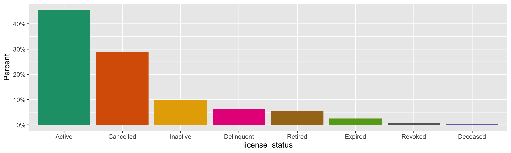
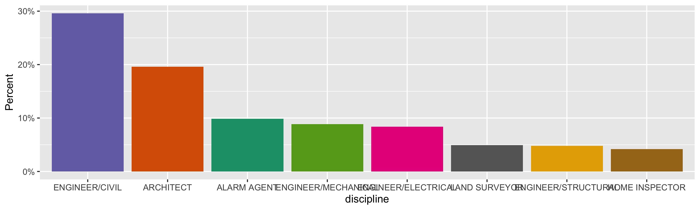
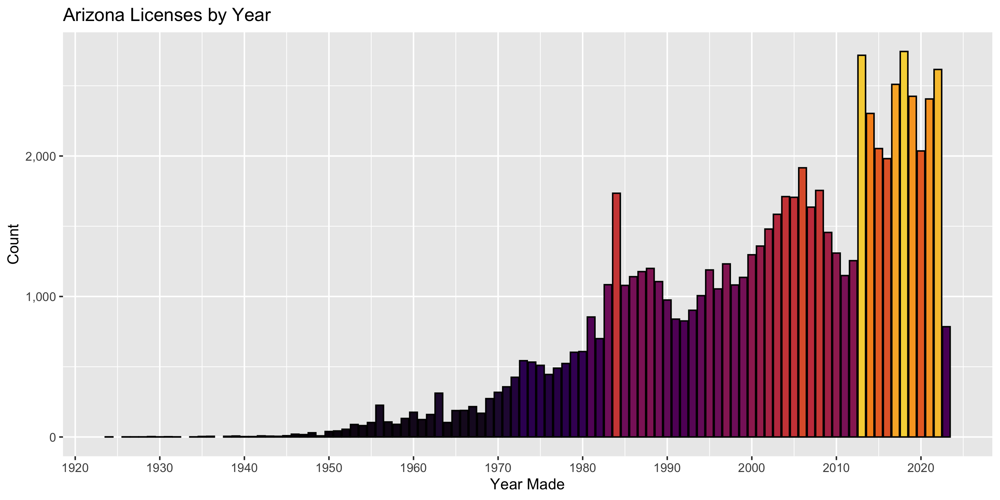
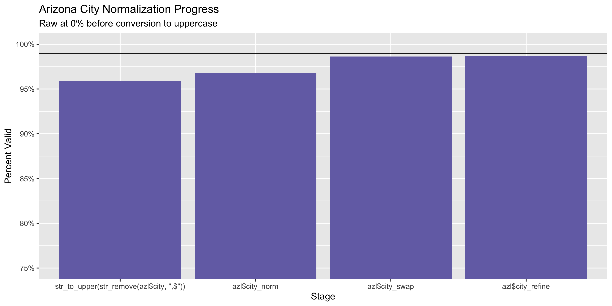
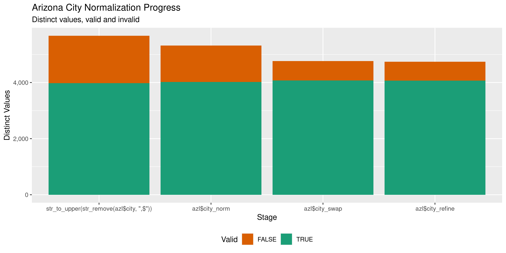

Arizona Licenses
================
Kiernan Nicholls & Aarushi Sahejpal
Tue May 2 10:26:21 2023

- <a href="#project" id="toc-project">Project</a>
- <a href="#objectives" id="toc-objectives">Objectives</a>
- <a href="#packages" id="toc-packages">Packages</a>
- <a href="#source" id="toc-source">Source</a>
- <a href="#download" id="toc-download">Download</a>
- <a href="#read" id="toc-read">Read</a>
- <a href="#explore" id="toc-explore">Explore</a>
  - <a href="#missing" id="toc-missing">Missing</a>
  - <a href="#duplicates" id="toc-duplicates">Duplicates</a>
  - <a href="#categorical" id="toc-categorical">Categorical</a>
  - <a href="#dates" id="toc-dates">Dates</a>
- <a href="#wrangle" id="toc-wrangle">Wrangle</a>
  - <a href="#address" id="toc-address">Address</a>
  - <a href="#zip" id="toc-zip">ZIP</a>
  - <a href="#state" id="toc-state">State</a>
  - <a href="#city" id="toc-city">City</a>
- <a href="#conclude" id="toc-conclude">Conclude</a>
- <a href="#export" id="toc-export">Export</a>
- <a href="#upload" id="toc-upload">Upload</a>

<!-- Place comments regarding knitting here -->

## Project

The Accountability Project is an effort to cut across data silos and
give journalists, policy professionals, activists, and the public at
large a simple way to search across huge volumes of public data about
people and organizations.

Our goal is to standardize public data on a few key fields by thinking
of each dataset row as a transaction. For each transaction there should
be (at least) 3 variables:

1.  All **parties** to a transaction.
2.  The **date** of the transaction.
3.  The **amount** of money involved.

## Objectives

This document describes the process used to complete the following
objectives:

1.  How many records are in the database?
2.  Check for entirely duplicated records.
3.  Check ranges of continuous variables.
4.  Is there anything blank or missing?
5.  Check for consistency issues.
6.  Create a five-digit ZIP Code called `zip`.
7.  Create a `year` field from the transaction date.
8.  Make sure there is data on both parties to a transaction.

## Packages

The following packages are needed to collect, manipulate, visualize,
analyze, and communicate these results. The `pacman` package will
facilitate their installation and attachment.

``` r
if (!require("pacman")) {
  install.packages("pacman")
}
pacman::p_load(
  tidyverse, # data manipulation
  lubridate, # datetime strings
  gluedown, # printing markdown
  janitor, # clean data frames
  campfin, # custom irw tools
  aws.s3, # aws cloud storage
  refinr, # cluster & merge
  scales, # format strings
  knitr, # knit documents
  vroom, # fast reading
  rvest, # scrape html
  glue, # code strings
  here, # project paths
  httr, # http requests
  fs # local storage 
)
```

This diary was run using `campfin` version 1.0.10.9001.

``` r
packageVersion("campfin")
#> [1] '1.0.10.9001'
```

This document should be run as part of the `R_tap` project, which lives
as a sub-directory of the more general, language-agnostic
[`irworkshop/accountability_datacleaning`](https://github.com/irworkshop/accountability_datacleaning)
GitHub repository.

The `R_tap` project uses the [RStudio
projects](https://support.rstudio.com/hc/en-us/articles/200526207-Using-Projects)
feature and should be run as such. The project also uses the dynamic
`here::here()` tool for file paths relative to *your* machine.

``` r
# where does this document knit?
here::i_am("state/az/licenses/docs/az_licenses_diary.Rmd")
```

## Source

> Last Updated 04/21/2023
>
> For the best results finding a specific registrant, please enter only
> their license number and hit apply.
>
> Registrants, if you believe the information regarding your license on
> this search is inaccurate or missing, please email <news@azbtr.gov>
> citing the discrepancy.
>
> In-Training Designations are NOT included in this search.
>
> Do not use abbreviations in the State Field (type Arizona, not AZ).
>
> A spreadsheet of the results of a search can be downloaded by
> selecting the Export CSV box to the right.
>
> Please note that Board staff cannot make recommendations regarding the
> procurement of registrant services.

## Download

``` r
raw_csv <- read_csv('/Volumes/TAP/accountability_datacleaning/state/az/licenses/data/raw/Registered_proffessional_list.csv')
```

``` r
raw_dir <- dir_create(here("state", "az", "licenses", "data", "raw")) 
raw_csv <- path(raw_dir) 
```

## Read

``` r
azl <- read_delim(
  file = "/Volumes/TAP/accountability_datacleaning/state/az/licenses/data/raw/Registered_proffessional_list.csv",
  delim = ",",
  escape_backslash = FALSE,
  escape_double = FALSE,
  locale = locale(date_format = "%d %b %Y"),
  col_types = cols(
    .default = col_character(),
    `License Number` = col_integer(),
    `Board Action Date` = col_date(),
    `Expiration Date` = col_date()
  )
)
```

``` r
azl <- clean_names(azl, case = "snake")
```

## Explore

There are 72,893 rows of 13 columns. Each record represents a single
professional or occupation license.

``` r
glimpse(azl)
#> Rows: 72,893
#> Columns: 13
#> $ license_number    <int> 9999, 9997, 9972, 9968, 9930, 9928, 9921, 9919, 9918, 9896, 9892, 9883, 9881, 9819, 9793, 97…
#> $ first_name        <chr> "JOHN", "HJALMAR", "ALAN", "HOWARD", "HOWARD", "ALAN", "JOE", "JOSEPH", "JAMES", "Henry", "R…
#> $ last_name         <chr> "KUHN", "HJALMARSON", "MEAD", "PARSELL", "PARSELL", "MEAD", "HILL", "HAYNES", "HAWTHORNE", "…
#> $ license_status    <chr> "Active", "Delinquent", "Delinquent", "Delinquent", "Delinquent", "Inactive", "Active", "Ina…
#> $ discipline        <chr> "ENGINEER/CIVIL", "ENGINEER/CIVIL", "LAND SURVEYOR", "ENGINEER/STRUCTURAL", "ENGINEER/CIVIL"…
#> $ board_action_date <date> 1975-10-10, 1975-10-10, 1975-12-20, 1975-01-27, 1975-01-27, 1975-12-20, 1975-10-10, 1975-10…
#> $ expiration_date   <date> 2024-06-30, 2021-03-31, 2021-09-30, 2021-12-31, 2021-12-31, NA, 2024-03-31, NA, 2024-03-31,…
#> $ address_line_1    <chr> NA, "1381 S. Saddleback Drive", "4734 B  LA VILLA MARINA, UNIT B4734", "4854 MAIN ST", "4854…
#> $ address_line_2    <chr> NA, NA, NA, NA, NA, NA, "Suite 440", NA, NA, NA, NA, NA, NA, NA, "Suite 600", NA, NA, NA, NA…
#> $ city              <chr> NA, "Cottonwood,", "MARINA DEL REY,", "YORBA LINDA,", "YORBA LINDA,", "MARINA DEL REY,", "De…
#> $ state             <chr> NA, "Arizona", "California", "California", "California", "California", "Texas", "Texas", "Ar…
#> $ zip               <chr> NA, "86326", "90292", "92886", "92886", "90292", "75115", "79606", "85718", "86442", "86442"…
#> $ phone             <chr> NA, "9286340278", "3108211715", "714-777-3765", "7146420511", "310211715", "972-283-5111", "…
tail(azl)
#> # A tibble: 6 × 13
#>   license_number first_name last_name license_status discipline     board_action_date expiration_date address_line_1    
#>            <int> <chr>      <chr>     <chr>          <chr>          <date>            <date>          <chr>             
#> 1            483 ROBERT     RUPKEY    Expired        ENGINEER/CIVIL 1929-10-10        1998-03-31      1726 E GRANADA RD 
#> 2            470 ORVILLE    BELL      Cancelled      ARCHITECT      1929-10-10        1987-03-31      WRONG ADDRESS     
#> 3            453 JOSEPH     FRAPS     Cancelled      ENGINEER/CIVIL 1928-10-10        1987-12-31      WRONG ADDRESS     
#> 4            373 DWIGHT     CHENAULT  Expired        ARCHITECT      1927-10-10        1993-06-30      1571 FAIR PARK AVE
#> 5            359 GLENTON    SYKES     Cancelled      ENGINEER/CIVIL 1926-10-10        1986-06-30      480 RUDASILL RD   
#> 6            232 E          HERRERAS  Cancelled      ARCHITECT      1924-10-10        1991-03-31      1331 E WAVERLY ST 
#> # ℹ 5 more variables: address_line_2 <chr>, city <chr>, state <chr>, zip <chr>, phone <chr>
```

### Missing

Columns vary in their degree of missing values.

``` r
col_stats(azl, count_na)
#> # A tibble: 13 × 4
#>    col               class      n         p
#>    <chr>             <chr>  <int>     <dbl>
#>  1 license_number    <int>      0 0        
#>  2 first_name        <chr>      3 0.0000412
#>  3 last_name         <chr>      3 0.0000412
#>  4 license_status    <chr>      0 0        
#>  5 discipline        <chr>     15 0.000206 
#>  6 board_action_date <date>    14 0.000192 
#>  7 expiration_date   <date> 13781 0.189    
#>  8 address_line_1    <chr>    956 0.0131   
#>  9 address_line_2    <chr>  59847 0.821    
#> 10 city              <chr>    887 0.0122   
#> 11 state             <chr>   1859 0.0255   
#> 12 zip               <chr>    962 0.0132   
#> 13 phone             <chr>  10852 0.149
```

We can flag any record missing a key variable needed to identify a
transaction.

``` r
key_vars <- c("board_action_date", "last_name", "discipline")
azl <- flag_na(azl, all_of(key_vars))
sum(azl$na_flag)
#> [1] 32
```

``` r
azl %>% 
  filter(na_flag) %>% 
  select(all_of(key_vars))
#> # A tibble: 32 × 3
#>    board_action_date last_name  discipline         
#>    <date>            <chr>      <chr>              
#>  1 NA                Chavez     ALARM AGENT        
#>  2 NA                Skinner    ENGINEER/CIVIL     
#>  3 NA                Verbeke    HOME INSPECTOR     
#>  4 NA                Sorcinelli ALARM AGENT        
#>  5 NA                Carpenter  ALARM AGENT        
#>  6 NA                Klein      ALARM AGENT        
#>  7 NA                OHLE       HOME INSPECTOR     
#>  8 NA                MARTENS    LANDSCAPE ARCHITECT
#>  9 NA                TREESE     ENGINEER/ELECTRICAL
#> 10 2002-09-20        <NA>       HOME INSPECTOR     
#> # ℹ 22 more rows
```

### Duplicates

We can also flag any record completely duplicated across every column.

``` r
azl <- flag_dupes(azl, -license_number)
sum(azl$dupe_flag)
#> [1] 253
```

``` r
azl %>% 
  filter(dupe_flag) %>% 
  select(all_of(key_vars)) %>% 
  arrange(board_action_date)
#> # A tibble: 253 × 3
#>    board_action_date last_name  discipline         
#>    <date>            <chr>      <chr>              
#>  1 1955-10-10        GRUNDSTEDT ENGINEER/MINING    
#>  2 1955-10-10        GRUNDSTEDT ENGINEER/MINING    
#>  3 1959-10-10        SARVIS     ENGINEER/CIVIL     
#>  4 1959-10-10        SARVIS     ENGINEER/CIVIL     
#>  5 1963-10-10        GERVASIO   ENGINEER/STRUCTURAL
#>  6 1963-10-10        GERVASIO   ENGINEER/CIVIL     
#>  7 1963-10-10        GERVASIO   ENGINEER/STRUCTURAL
#>  8 1963-10-10        GERVASIO   ENGINEER/CIVIL     
#>  9 1964-03-13        CORLEY     ENGINEER/CIVIL     
#> 10 1964-03-13        CORLEY     ENGINEER/CIVIL     
#> # ℹ 243 more rows
```

### Categorical

``` r
col_stats(azl, n_distinct)
#> # A tibble: 15 × 4
#>    col               class      n         p
#>    <chr>             <chr>  <int>     <dbl>
#>  1 license_number    <int>  72558 0.995    
#>  2 first_name        <chr>   8875 0.122    
#>  3 last_name         <chr>  36004 0.494    
#>  4 license_status    <chr>     17 0.000233 
#>  5 discipline        <chr>     25 0.000343 
#>  6 board_action_date <date>  4469 0.0613   
#>  7 expiration_date   <date>  2768 0.0380   
#>  8 address_line_1    <chr>  56120 0.770    
#>  9 address_line_2    <chr>   4701 0.0645   
#> 10 city              <chr>   7786 0.107    
#> 11 state             <chr>     94 0.00129  
#> 12 zip               <chr>  11414 0.157    
#> 13 phone             <chr>  52225 0.716    
#> 14 na_flag           <lgl>      2 0.0000274
#> 15 dupe_flag         <lgl>      2 0.0000274
```

<!-- --><!-- -->

### Dates

We can add the calendar year from `date` with `lubridate::year()`

``` r
azl <- mutate(azl, year = year(board_action_date))
```

``` r
count_na(azl$board_action_date)
#> [1] 14
min(azl$board_action_date, na.rm = TRUE)
#> [1] "1924-10-10"
mean(azl$year < 2000, na.rm = TRUE)
#> [1] 0.3936525
max(azl$board_action_date, na.rm = TRUE)
#> [1] "2023-04-21"
sum(azl$board_action_date > today(), na.rm = TRUE)
#> [1] 0
```

<!-- -->

## Wrangle

To improve the searchability of the database, we will perform some
consistent, confident string normalization. For geographic variables
like city names and ZIP codes, the corresponding `campfin::normal_*()`
functions are tailor made to facilitate this process.

### Address

For the street `addresss` variable, the `campfin::normal_address()`
function will force consistence case, remove punctuation, and abbreviate
official USPS suffixes.

``` r
addr_norm <- azl %>% 
  distinct(address_line_1, address_line_2) %>% 
  mutate(
    address_norm_line_1 = normal_address(
      address = address_line_1,
      abbs = usps_street,
      na_rep = TRUE
    ),
    address_norm_line_2 = normal_address(
      address = address_line_2,
      abbs = usps_street,
      na_rep = TRUE,
      abb_end = FALSE
    )
  ) %>% 
  unite(
    col = address_norm,
    starts_with("address_norm"),
    sep = " ",
    remove = TRUE,
    na.rm = TRUE
  ) %>% 
  mutate(across(address_norm, na_if, ""))
```

``` r
addr_norm
#> # A tibble: 57,961 × 3
#>    address_line_1                      address_line_2 address_norm                     
#>    <chr>                               <chr>          <chr>                            
#>  1 <NA>                                <NA>           <NA>                             
#>  2 1381 S. Saddleback Drive            <NA>           1381 S SADDLEBACK DR             
#>  3 4734 B  LA VILLA MARINA, UNIT B4734 <NA>           4734 B LA VILLA MARINA UNIT B4734
#>  4 4854 MAIN ST                        <NA>           4854 MAIN ST                     
#>  5 4734 LA VILLA MARINA UNIT B         <NA>           4734 LA VILLA MARINA UNIT B      
#>  6 1801 N. Hampton Rd                  Suite 440      1801 N HAMPTON RD STE 440        
#>  7 5066 SUE LOOKOUT                    <NA>           5066 SUE LOOKOUT                 
#>  8 5700 N PLACITA DEL TRUENO           <NA>           5700 N PLACITA DEL TRUENO        
#>  9 303 Thunderbird Ln                  <NA>           303 THUNDERBIRD LN               
#> 10 1301 LOUSE RD                       <NA>           1301 LOUSE RD                    
#> # ℹ 57,951 more rows
```

``` r
azl <- left_join(azl, addr_norm, by = c("address_line_1", "address_line_2"))
```

### ZIP

For ZIP codes, the `campfin::normal_zip()` function will attempt to
create valid *five* digit codes by removing the ZIP+4 suffix and
returning leading zeroes dropped by other programs like Microsoft Excel.

``` r
azl <- azl %>% 
  mutate(
    zip_norm = normal_zip(
      zip = zip,
      na_rep = TRUE
    )
  )
```

``` r
progress_table(
  azl$zip,
  azl$zip_norm,
  compare = valid_zip
)
#> # A tibble: 2 × 6
#>   stage        prop_in n_distinct prop_na n_out n_diff
#>   <chr>          <dbl>      <dbl>   <dbl> <dbl>  <dbl>
#> 1 azl$zip        0.954      11414  0.0132  3306   2616
#> 2 azl$zip_norm   0.989       9567  0.0166   805    532
```

### State

Valid two digit state abbreviations can be made using the
`campfin::normal_state()` function.

``` r
azl <- azl %>% 
  mutate(
    state_norm = normal_state(
      state = state,
      abbreviate = TRUE,
      na_rep = TRUE,
      valid = valid_state
    )
  )
```

``` r
azl %>% 
  filter(state != state_norm) %>% 
  count(state, state_norm, sort = TRUE)
#> # A tibble: 55 × 3
#>    state      state_norm     n
#>    <chr>      <chr>      <int>
#>  1 Arizona    AZ         26151
#>  2 California CA         10199
#>  3 Texas      TX          3794
#>  4 Colorado   CO          3226
#>  5 Utah       UT          3089
#>  6 Washington WA          1503
#>  7 Illinois   IL          1432
#>  8 Nevada     NV          1415
#>  9 Florida    FL          1379
#> 10 Missouri   MO          1281
#> # ℹ 45 more rows
```

``` r
progress_table(
  azl$state,
  azl$state_norm,
  compare = valid_state
)
#> # A tibble: 2 × 6
#>   stage           prop_in n_distinct prop_na n_out n_diff
#>   <chr>             <dbl>      <dbl>   <dbl> <dbl>  <dbl>
#> 1 azl$state      0.000169         94  0.0255 71022     92
#> 2 azl$state_norm 1                57  0.0300     0      1
```

### City

Cities are the most difficult geographic variable to normalize, simply
due to the wide variety of valid cities and formats.

#### Normal

The `campfin::normal_city()` function is a good start, again converting
case, removing punctuation, but *expanding* USPS abbreviations. We can
also remove `invalid_city` values.

``` r
norm_city <- azl %>% 
  distinct(city, state_norm, zip_norm) %>% 
  mutate(
    city_norm = normal_city(
      city = city, 
      abbs = usps_city,
      states = c("AZ", "DC", "ARIZONA"),
      na = invalid_city,
      na_rep = TRUE
    )
  )
```

#### Swap

We can further improve normalization by comparing our normalized value
against the *expected* value for that record’s state abbreviation and
ZIP code. If the normalized value is either an abbreviation for or very
similar to the expected value, we can confidently swap those two.

``` r
norm_city <- norm_city %>% 
  rename(city_raw = city) %>% 
  left_join(
    y = zipcodes,
    by = c(
      "state_norm" = "state",
      "zip_norm" = "zip"
    )
  ) %>% 
  rename(city_match = city) %>% 
  mutate(
    match_abb = is_abbrev(city_norm, city_match),
    match_dist = str_dist(city_norm, city_match),
    city_swap = if_else(
      condition = !is.na(match_dist) & (match_abb | match_dist == 1),
      true = city_match,
      false = city_norm
    )
  ) %>% 
  select(
    -city_match,
    -match_dist,
    -match_abb
  )
```

``` r
azl <- left_join(
  x = azl,
  y = norm_city,
  by = c(
    "city" = "city_raw", 
    "state_norm", 
    "zip_norm"
  )
)
```

#### Refine

The [OpenRefine](https://openrefine.org/) algorithms can be used to
group similar strings and replace the less common versions with their
most common counterpart. This can greatly reduce inconsistency, but with
low confidence; we will only keep any refined strings that have a valid
city/state/zip combination.

``` r
good_refine <- azl %>% 
  mutate(
    city_refine = city_swap %>% 
      key_collision_merge() %>% 
      n_gram_merge(numgram = 1)
  ) %>% 
  filter(city_refine != city_swap) %>% 
  inner_join(
    y = zipcodes,
    by = c(
      "city_refine" = "city",
      "state_norm" = "state",
      "zip_norm" = "zip"
    )
  )
```

    #> # A tibble: 24 × 5
    #>    state_norm zip_norm city_swap         city_refine          n
    #>    <chr>      <chr>    <chr>             <chr>            <int>
    #>  1 SC         29406    NORTH CHARLESTON  CHARLESTON           2
    #>  2 AZ         85138    MARICOPA #        MARICOPA             1
    #>  3 CA         90042    LOS ANGELSA       LOS ANGELES          1
    #>  4 CA         90045    LOS ANGELES #     LOS ANGELES          1
    #>  5 CA         90266    MAHANTTAN BEACH   MANHATTAN BEACH      1
    #>  6 CA         91730    RANCHO CUMCAMOUGA RANCHO CUCAMONGA     1
    #>  7 CA         91745    HACIENDA HGTHS    HACIENDA HEIGHTS     1
    #>  8 CA         92563    MURIETTA          MURRIETA             1
    #>  9 CA         92648    HUNGTINTON BEACH  HUNTINGTON BEACH     1
    #> 10 CA         92805    ANAHEMIN          ANAHEIM              1
    #> # ℹ 14 more rows

Then we can join the refined values back to the database.

``` r
azl <- azl %>% 
  left_join(good_refine, by = names(.)) %>% 
  mutate(city_refine = coalesce(city_refine, city_swap))
```

#### Progress

Our goal for normalization was to increase the proportion of city values
known to be valid and reduce the total distinct values by correcting
misspellings.

| stage                                      | prop_in | n_distinct | prop_na | n_out | n_diff |
|:-------------------------------------------|--------:|-----------:|--------:|------:|-------:|
| `str_to_upper(str_remove(azl$city, ",$"))` |   0.959 |       5738 |   0.012 |  2988 |   1676 |
| `azl$city_norm`                            |   0.968 |       5409 |   0.013 |  2318 |   1308 |
| `azl$city_swap`                            |   0.986 |       4838 |   0.013 |   981 |    691 |
| `azl$city_refine`                          |   0.987 |       4815 |   0.013 |   959 |    669 |

You can see how the percentage of valid values increased with each
stage.

<!-- -->

More importantly, the number of distinct values decreased each stage. We
were able to confidently change many distinct invalid values to their
valid equivalent.

<!-- -->

Before exporting, we can remove the intermediary normalization columns
and rename all added variables with the `_clean` suffix.

``` r
azl <- azl %>% 
  select(
    -city_norm,
    -city_swap,
    city_clean = city_refine
  ) %>% 
  rename_all(~str_replace(., "_norm", "_clean")) %>% 
  rename_all(~str_remove(., "_raw")) %>% 
  relocate(address_clean, city_clean, state_clean, .before = zip_clean)
```

## Conclude

``` r
glimpse(sample_n(azl, 1000))
#> Rows: 1,000
#> Columns: 20
#> $ license_number    <int> 60007, 32599, 25362, 1377, 46498, 41984, 20095, 31292, 63835, 14867, 15615, 8014, 76566, 526…
#> $ first_name        <chr> "Gregory", "BRAD", "RONALD", "HAROLD", "COLLIN", "KARA", "KENNETH", "JOHN", "Micah", "JOSEPH…
#> $ last_name         <chr> "Darveaux", "TAYLOR", "BRENNER", "BOZARTH", "JONES", "YOUNG", "RICHARDS", "ZIEBARTH", "Hanna…
#> $ license_status    <chr> "Cancelled", "Cancelled", "Retired", "Cancelled", "Active", "Delinquent", "Inactive", "Cance…
#> $ discipline        <chr> "HOME INSPECTOR", "ENGINEER/CIVIL", "ENGINEER/STRUCTURAL", "ENGINEER/MECHANICAL", "LANDSCAPE…
#> $ board_action_date <date> 2015-04-28, 1998-06-05, 1991-07-25, 1948-03-04, 2007-06-26, 2004-12-20, 1986-10-14, 1997-04…
#> $ expiration_date   <date> 2017-04-28, 2013-06-30, NA, 1984-03-31, 2025-06-30, 2023-03-31, NA, 2018-06-30, 2026-03-31,…
#> $ address_line_1    <chr> "29592 N 69th Drive", "220 ST CHARLES WAY #150", "1989 GRANDVIEW DR", "1501 W PALMAIRE", "15…
#> $ address_line_2    <chr> NA, NA, NA, NA, "Unit D", NA, NA, NA, NA, NA, NA, NA, "Suite 300", NA, NA, NA, "Suite D", NA…
#> $ city              <chr> "Peoria,", "YORK,", "VICTORIA,", "PHOENIX,", "Emeryville,", "Phoenix,", "NASHVILLE,", "San D…
#> $ state             <chr> "Arizona", "Pennsylvania", "British Columbia", "Arizona", "California", "Arizona", "Tennesse…
#> $ zip               <chr> "85383", "17406", "V8N  2V2", "85021", "94608", "85016", "37221", "92103", "85234", "06604",…
#> $ phone             <chr> "(602) 881-0139", "(717) 741-6484", "(250) 477-0730", NA, "415-205-5131", NA, "(615) 646-811…
#> $ na_flag           <lgl> FALSE, FALSE, FALSE, FALSE, FALSE, FALSE, FALSE, FALSE, FALSE, FALSE, FALSE, FALSE, FALSE, F…
#> $ dupe_flag         <lgl> FALSE, FALSE, FALSE, FALSE, FALSE, FALSE, FALSE, FALSE, FALSE, FALSE, TRUE, FALSE, FALSE, FA…
#> $ year              <dbl> 2015, 1998, 1991, 1948, 2007, 2004, 1986, 1997, 2017, 1982, 1983, 1971, 2022, 2011, 2016, 20…
#> $ address_clean     <chr> "29592 N 69TH DR", "220 ST CHARLES WAY #150", "1989 GRANDVIEW DR", "1501 W PALMAIRE", "1510 …
#> $ city_clean        <chr> "PEORIA", "YORK", "VICTORIA", "PHOENIX", "EMERYVILLE", "PHOENIX", "NASHVILLE", "SAN DIEGO", …
#> $ state_clean       <chr> "AZ", "PA", NA, "AZ", "CA", "AZ", "TN", "CA", "AZ", "CT", "AZ", "AZ", "OR", "WI", "UT", "AZ"…
#> $ zip_clean         <chr> "85383", "17406", "822", "85021", "94608", "85016", "37221", "92103", "85234", "06604", "850…
```

1.  There are 72,893 records in the database.
2.  There are 253 duplicate records in the database.
3.  The range and distribution of `amount` and `date` seem reasonable.
4.  There are 32 records missing key variables.
5.  Consistency in geographic data has been improved with
    `campfin::normal_*()`.
6.  The 4-digit `year` variable has been created with
    `lubridate::year()`.

## Export

Now the file can be saved on disk for upload to the Accountability
server. We will name the object using a date range of the records
included.

``` r
min_dt <- str_remove_all(min(azl$board_action_date, na.rm = TRUE), "-")
max_dt <- str_remove_all(max(azl$board_action_date, na.rm = TRUE), "-")
csv_ts <- paste(min_dt, max_dt, sep = "-")
```

``` r
clean_dir <- dir_create(here("state", "az", "licenses", "data", "clean"))
clean_csv <- path(clean_dir, glue("az_licenses_{csv_ts}.csv"))
clean_rds <- path_ext_set(clean_csv, "rds")
basename(clean_csv)
#> [1] "az_licenses_19241010-20230421.csv"
```

``` r
write_csv(azl, clean_csv, na = "")
write_rds(azl, clean_rds, compress = "xz")
(clean_size <- file_size(clean_csv))
#> 12.5M
```

## Upload

We can use the `aws.s3::put_object()` to upload the text file to the IRW
server.

``` r
aws_key <- path("csv", basename(clean_csv))
if (!object_exists(aws_key, "publicaccountability")) {
  put_object(
    file = clean_csv,
    object = aws_key, 
    bucket = "publicaccountability",
    acl = "public-read",
    show_progress = TRUE,
    multipart = TRUE
  )
}
aws_head <- head_object(aws_key, "publicaccountability")
(aws_size <- as_fs_bytes(attr(aws_head, "content-length")))
unname(aws_size == clean_size)
```
