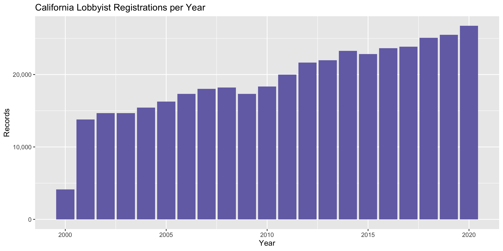

California Lobbyists
================
Kiernan Nicholls & Yanqi Xu
2023-03-29 21:28:05

- <a href="#project" id="toc-project">Project</a>
- <a href="#packages" id="toc-packages">Packages</a>
- <a href="#data" id="toc-data">Data</a>
- <a href="#import" id="toc-import">Import</a>
- <a href="#explore" id="toc-explore">Explore</a>
- <a href="#wrangle" id="toc-wrangle">Wrangle</a>
- <a href="#export" id="toc-export">Export</a>

<!-- Place comments regarding knitting here -->

## Project

The Accountability Project is an effort to cut across data silos and
give journalists, policy professionals, activists, and the public at
large a simple way to search across huge volumes of public data about
people and organizations.

Our goal is to standardizing public data on a few key fields by thinking
of each dataset row as a transaction. For each transaction there should
be (at least) 3 variables:

1.  All **parties** to a transaction
2.  The **date** of the transaction
3.  The **amount** of money involved

## Packages

The following packages are needed to collect, manipulate, visualize,
analyze, and communicate these results. The `pacman` package will
facilitate their installation and attachment.

The IRW’s `campfin` package will also have to be installed from GitHub.
This package contains functions custom made to help facilitate the
processing of campaign finance data.

``` r
if (!require("pacman")) install.packages("pacman")
pacman::p_load_gh("irworkshop/campfin")
pacman::p_load(
  tidyverse, # data manipulation
  lubridate, # datetime strings
  magrittr, # pipe opperators
  janitor, # dataframe clean
  refinr, # cluster and merge
  scales, # format strings
  knitr, # knit documents
  vroom, # read files fast
  glue, # combine strings
  here, # relative storage
  fs # search storage 
)
```

This document should be run as part of the `R_campfin` project, which
lives as a sub-directory of the more general, language-agnostic
[`irworkshop/accountability_datacleaning`](https://github.com/irworkshop/accountability_datacleaning)
GitHub repository.

The `R_campfin` project uses the [RStudio
projects](https://support.rstudio.com/hc/en-us/articles/200526207-Using-Projects)
feature and should be run as such. The project also uses the dynamic
`here::here()` tool for file paths relative to *your* machine.

``` r
# where does this document knit?
here::here()
#> [1] "/Users/yanqixu/code/accountability_datacleaning"
```

## Data

Data from the California Secretary of State’s [Cal-Access
database](https://www.sos.ca.gov/).

> Cal-Access provides financial information supplied by state
> candidates, donors, lobbyists, and others. Simply start by selecting
> either Campaign Finance Activity, Lobbying Activity, or Cal-Access
> Resources and we will guide you to the information.

### About

All California campaign finance data can be downloaded in a single file.
As described on PRD website:

> ### Raw Data for Campaign Finance and Lobbying Activity
>
> In addition to presenting California campaign finance and lobbying
> activity on the user-friendly [CAL-ACCESS
> website](http://cal-access.sos.ca.gov/), the Secretary of State
> provides the raw data to allow people with technical expertise to
> create their own databases.
>
> The raw data is presented in tab-delimited text files from
> corresponding tables in the CAL-ACCESS database. Users can uncompress
> and extract the data with standard software such as PKZIP, WinZip, or
> MacZip. The Secretary of State does not provide technical support to
> users who want to download and analyze CAL-ACCESS data in this
> advanced way. However, the Secretary of State offers guides to the
> CAL-ACCESS data structure and fields.

> ### Download Files
>
> - [Guides to CAL-ACCESS data structure and fields
>   (ZIP)](https://campaignfinance.cdn.sos.ca.gov/calaccess-documentation.zip)
> - [CAL-ACCESS raw data
>   (ZIP)](https://campaignfinance.cdn.sos.ca.gov/dbwebexport.zip)
>
> All CAL-ACCESS users should keep in mind that campaign finance and
> lobbying activity information changes often. The raw data extracts are
> updated once a day. Campaign finance and lobbying activity filings can
> also be obtained in hard copy by contacting the Secretary of State’s
> Political Reform Division.

This file was downloaded on March 29, 2023 and replaces the old one that contained the full download up to the last update.

### Variables

Using the data key provided by Cal-Access, we can find the lobbyists
file and understand it’s contents.

``` r
key_url <- "https://campaignfinance.cdn.sos.ca.gov/calaccess-documentation.zip"
url_file_size(key_url)
#> 4.06M
```

If they ZIP file containing the documentation files has not yet been
downloaded, we can do so now.

``` r
doc_dir <- here("state","ca", "lobby", "docs")
key_file <- str_c(doc_dir, basename(key_url), sep = "/")
if (!this_file_new(key_file)) {
  download.file(
    url = key_url,
    destfile = key_file
  )
}
```

Before we unzip the file, we can view it’s contents.

``` r
key_content <- as_tibble(unzip(key_file, list = TRUE))
print(key_content)
#> # A tibble: 49 × 3
#>    Name                                                     Length Date               
#>    <chr>                                                     <dbl> <dttm>             
#>  1 CalAccess-Documentation/                                      0 2018-04-12 11:23:00
#>  2 CalAccess-Documentation/CalFormat/                            0 2018-04-12 11:23:00
#>  3 CalAccess-Documentation/CalFormat/cal_errata_1_05_02.pdf  29189 2016-05-13 14:24:00
#>  4 CalAccess-Documentation/CalFormat/cal_errata_201.pdf     297342 2016-05-13 14:24:00
#>  5 CalAccess-Documentation/CalFormat/cal_errata_22.pdf      119974 2016-07-14 11:34:00
#>  6 CalAccess-Documentation/CalFormat/cal_format_1_05_02.pdf  92026 2016-05-13 14:24:00
#>  7 CalAccess-Documentation/CalFormat/cal_format_201.pdf     864677 2016-05-13 14:24:00
#>  8 CalAccess-Documentation/CalFormat/cal_format_22.pdf      395783 2016-07-14 13:02:00
#>  9 CalAccess-Documentation/CalFormat/cal_readme.pdf          37820 2016-05-13 14:24:00
#> 10 CalAccess-Documentation/DBInfo/                               0 2018-04-12 11:23:00
#> # … with 39 more rows
```

``` r
key_dir <- str_c(doc_dir, key_content$Name[1], sep = "/")
if (!dir_exists(key_dir)) {
  unzip(
    zipfile = key_file,
    exdir = doc_dir
  )
}
file_delete(key_file)
```

## Import

### Download

``` r
raw_dir <- dir_create(here("state","ca", "lobby", "data", "raw"))
zip_url <- "https://campaignfinance.cdn.sos.ca.gov/dbwebexport.zip"
zip_file <- str_c(raw_dir, basename(zip_url), sep = "/")
```

The ZIP file is extremelly large, and will take quite some time

``` r
url_file_size(zip_url)
#> 1.16G
if (requireNamespace("speedtest", quietly = TRUE)) {
  # speedtest::spd_test()
}
```

If the most recent version of the file has not yet been downloaded, we
can do so now.

``` r
if (!this_file_new(zip_file)) {
  download.file(
    url = zip_url,
    destfile = zip_file
  )
}
```

We don’t need to unzip every file, only those pertaining to lobbying.

``` r
zip_content <- unzip(zip_file, list = TRUE) 
zip_lobby <- zip_content$Name[str_which(zip_content$Name, "LOBBY")]
cal_dir <- str_c(raw_dir, unique(dirname(zip_lobby)), sep = "/")
```

Then, if those files have not yet been unzipped, we can do so now.

``` r
if (!dir_exists(cal_dir)) {
  unzip(
    zipfile = zip_file,
    files = zip_lobby,
    exdir = raw_dir
  )
}
```

### Read

Much of the data is split into multiple files. We will list all the
files of a similar name and read them into a single data frame with
`purrr::map_dfr()` and `readr::read_tsv()`.

The `CVR_LOBBY_DISCLOSURE_CD.TSV` file lists the information from every
F615, F635, F625, F645 form, which are submitted by principal clients
employing lobbying efforts (LEM) and contains records for every lobbying
firm (FRM), individual person (IND), lobbyists (LBY), andlobbying
coalitions (LCO).

> Lobbyist contribution disclosure table. Temporary table used to
> generate disclosure table (Lobbyist Contributions 3).

``` r
lob_conts <- map_dfr(
  .x = dir_ls(
    path = cal_dir, 
    type = "file", 
    glob = "*LOBBYIST_CONTRIBUTIONS\\d_CD.TSV$"
  ),
  .f = read_tsv,
  col_types = cols(
    FILER_ID = col_character(),
    FILING_PERIOD_START_DT = col_date("%m/%d/%Y %H:%M:%S %p"),
    FILING_PERIOD_END_DT = col_date("%m/%d/%Y %H:%M:%S %p"),
    CONTRIBUTION_DT = col_character(),
    RECIPIENT_NAME = col_character(),
    RECIPIENT_ID = col_character(),
    AMOUNT = col_double()
  )
) %>% 
  clean_names("snake")
```

Every yearly relationship between lobbyists and their principal clients.

``` r
cal_emp_lob <- map_dfr(
  .x = dir_ls(
    path = cal_dir, 
    type = "file", 
    glob = "*LOBBYIST_EMP_LOBBYIST\\d_CD.TSV"
  ),
  .f = read_tsv,
  col_types = cols(
    .default = col_character(),
    SESSION_ID = col_double()
  )
) %>% 
  clean_names("snake")
```

Quarterly and annual employee compensation amounts.

``` r
cal_emp_total <- map_df(
  .x = dir_ls(
    path = cal_dir, 
    type = "file", 
    glob = "*LOBBYIST_EMPLOYER\\d_CD.TSV$"
  ),
  .f = read_tsv,
  col_types = cols(
    .default = col_character(),
    SESSION_ID = col_double(),
    CURRENT_QTR_AMT = col_double(),
    SESSION_TOTAL_AMT = col_double(),
    SESSION_YR_1 = col_double(),
    SESSION_YR_2 = col_double(),
    YR_1_YTD_AMT = col_double(),
    YR_2_YTD_AMT = col_double(),
    QTR_1 = col_double(),
    QTR_2 = col_double(),
    QTR_3 = col_double(),
    QTR_4 = col_double(),
    QTR_5 = col_double(),
    QTR_6 = col_double(),
    QTR_7 = col_double(),
    QTR_8 = col_double()
  )
) %>% 
  clean_names("snake") %>% 
  remove_empty("cols")
```

``` r
cal_emp_total <- cal_emp_total %>% 
  select(
    session_id,
    employer_id,
    interest_cd,
    interest_name,
    session_total_amt,
  )
```

``` r
cal_emp_firms <- map_dfr(
  .x = dir_ls(
    path = cal_dir, 
    type = "file", 
    glob = "*LOBBYIST_EMPLOYER_FIRMS\\d_CD.TSV$"
  ),
  .f = read_tsv,
  col_types = cols(
    .default = col_character(),
    SESSION_ID = col_double()
  )
) %>% 
  clean_names("snake")
```

``` r
# empty file
file_size(
  dir_ls(
    path = cal_dir, 
    type = "file", 
    glob = "*LOBBYIST_EMPLOYER_HISTORY_CD.TSV$"
  )
)
#> 0
```

``` r
cal_firm_totals <- map_dfr(
  .x = dir_ls(
    path = cal_dir, 
    type = "file", 
    glob = "*LOBBYIST_FIRM\\d_CD.TSV$"
  ), 
  .f = read_tsv,
  col_types = cols(
    .default = col_character(),
    CURRENT_QTR_AMT = col_double(),
    SESSION_TOTAL_AMT = col_double(),
    SESSION_YR_1 = col_double(),
    SESSION_YR_2 = col_double(),
    YR_1_YTD_AMT = col_double(),
    YR_2_YTD_AMT = col_double(),
    QTR_1 = col_double(),
    QTR_2 = col_double(),
    QTR_3 = col_double(),
    QTR_4 = col_double(),
    QTR_5 = col_double(),
    QTR_6 = col_double(),
    QTR_7 = col_double(),
    QTR_8 = col_double()
  )
) %>% 
  clean_names("snake")
```

``` r
cal_firm_totals <- cal_firm_totals %>% 
  select(
    session_id,
    firm_id,
    firm_name,
    session_total_amt,
  )
```

``` r
calr <- read_delim(
  file = str_c(cal_dir, "CVR_LOBBY_DISCLOSURE_CD.TSV", sep = "/"),
  delim = "\t",
  escape_backslash = FALSE,
  escape_double = FALSE,
  na = c("", "NA", "none", "NONE", "None", "n/a", "N/A"),
  col_types = cols(
    .default = col_character(),
    AMEND_ID = col_double(),
    RPT_DATE = col_date("%m/%d/%Y %H:%M:%S %p"),
    FROM_DATE = col_date("%m/%d/%Y %H:%M:%S %p"),
    THRU_DATE = col_date("%m/%d/%Y %H:%M:%S %p"),
    CUM_BEG_DT = col_date("%m/%d/%Y %H:%M:%S %p"),
    CUM_BEG_DT = col_date("%m/%d/%Y %H:%M:%S %p"),
    SIG_DATE = col_date("%m/%d/%Y %H:%M:%S %p"),
  )
)

calr <- clean_names(calr, "snake")
```

## Explore

``` r
head(calr)
#> # A tibble: 6 × 52
#>   filing_id amend…¹ rec_t…² form_…³ sende…⁴ filer…⁵ entit…⁶ filer…⁷ filer…⁸ filer…⁹ filer…˟ repor…˟
#>   <chr>       <dbl> <chr>   <chr>   <chr>   <chr>   <chr>   <chr>   <chr>   <chr>   <chr>   <chr>  
#> 1 624359          0 CVR     F615    E24542  L25430  LBY     Dinno   Rachel  <NA>    <NA>    000    
#> 2 624360          0 CVR     F615    L24721  L24721  LBY     Farabee David … <NA>    <NA>    000    
#> 3 624361          0 CVR     F615    L23112  L23112  LBY     Rosegay Margar… <NA>    <NA>    000    
#> 4 624362          0 CVR     F615    L23330  L23330  LBY     Whitlo… Wayne … <NA>    <NA>    000    
#> 5 624363          0 CVR     F615    L23346  L23346  LBY     Maas    Brian … <NA>    <NA>    000    
#> 6 624364          0 CVR     F635    E22568  E22568  LEM     Califo… <NA>    <NA>    <NA>    000    
#> # … with 40 more variables: rpt_date <date>, from_date <date>, thru_date <date>,
#> #   cum_beg_dt <date>, firm_id <chr>, firm_name <chr>, firm_city <chr>, firm_st <chr>,
#> #   firm_zip4 <chr>, firm_phon <chr>, mail_city <chr>, mail_st <chr>, mail_zip4 <chr>,
#> #   mail_phon <chr>, sig_date <date>, sig_loc <chr>, sig_naml <chr>, sig_namf <chr>,
#> #   sig_namt <chr>, sig_nams <chr>, prn_naml <chr>, prn_namf <chr>, prn_namt <chr>,
#> #   prn_nams <chr>, sig_title <chr>, nopart1_cb <chr>, nopart2_cb <chr>, part1_1_cb <chr>,
#> #   part1_2_cb <chr>, ctrib_n_cb <chr>, ctrib_y_cb <chr>, lby_actvty <chr>, lobby_n_cb <chr>, …
tail(calr)
#> # A tibble: 6 × 52
#>   filing_id amend…¹ rec_t…² form_…³ sende…⁴ filer…⁵ entit…⁶ filer…⁷ filer…⁸ filer…⁹ filer…˟ repor…˟
#>   <chr>       <dbl> <chr>   <chr>   <chr>   <chr>   <chr>   <chr>   <chr>   <chr>   <chr>   <chr>  
#> 1 2748130         0 CVR     F625    1436555 1436555 FRM     FOGART… <NA>    <NA>    <NA>    000    
#> 2 2748172         0 CVR     F615    F24894  1243954 LBY     COSTIG… <NA>    <NA>    <NA>    000    
#> 3 2748291         0 CVR     F635    1412920 1396339 LEM     CALIFO… <NA>    <NA>    <NA>    000    
#> 4 2748292         0 CVR     F635    C24459  C24459  LEM     CALIFO… <NA>    <NA>    <NA>    000    
#> 5 2748300         0 CVR     F635    1245875 1245875 LEM     PURDUE… <NA>    <NA>    <NA>    000    
#> 6 2748301         0 CVR     F615    1376751 1376751 FRM     ARCE    SARA A. <NA>    <NA>    000    
#> # … with 40 more variables: rpt_date <date>, from_date <date>, thru_date <date>,
#> #   cum_beg_dt <date>, firm_id <chr>, firm_name <chr>, firm_city <chr>, firm_st <chr>,
#> #   firm_zip4 <chr>, firm_phon <chr>, mail_city <chr>, mail_st <chr>, mail_zip4 <chr>,
#> #   mail_phon <chr>, sig_date <date>, sig_loc <chr>, sig_naml <chr>, sig_namf <chr>,
#> #   sig_namt <chr>, sig_nams <chr>, prn_naml <chr>, prn_namf <chr>, prn_namt <chr>,
#> #   prn_nams <chr>, sig_title <chr>, nopart1_cb <chr>, nopart2_cb <chr>, part1_1_cb <chr>,
#> #   part1_2_cb <chr>, ctrib_n_cb <chr>, ctrib_y_cb <chr>, lby_actvty <chr>, lobby_n_cb <chr>, …
glimpse(sample_frac(calr))
#> Rows: 465,764
#> Columns: 52
#> $ filing_id  <chr> "1308086", "810966", "1618452", "1013388", "2203145", "2599500", "1567413", "1…
#> $ amend_id   <dbl> 0, 0, 0, 0, 0, 0, 0, 0, 0, 0, 0, 0, 1, 0, 0, 0, 0, 0, 1, 0, 0, 0, 0, 0, 0, 0, …
#> $ rec_type   <chr> "CVR", "CVR", "CVR", "CVR", "CVR", "CVR", "CVR", "CVR", "CVR", "CVR", "CVR", "…
#> $ form_type  <chr> "F615", "F625", "F635", "F635", "F615", "F635", "F615", "F625", "F635", "F635"…
#> $ sender_id  <chr> "E01343", "F23084", "1335106", "1223221", "1334663", "C26750", "1261533", "F00…
#> $ filer_id   <chr> "1253714", "F23084", "1335106", "1223221", "1334663", "C26750", "1292898", "F0…
#> $ entity_cd  <chr> "LBY", "FRM", "LEM", "LEM", "FRM", "LEM", "LBY", "FRM", "LEM", "LEM", "FRM", "…
#> $ filer_naml <chr> "HOFFMAN", "LEVY GOVERNMENT RELATIONS, EDWARD", "URDANG CAPITAL MANGEMENT, INC…
#> $ filer_namf <chr> "ERIKA K.", NA, NA, NA, "KEVIN", NA, "ANGELA K.W.", NA, NA, NA, NA, "TATE", NA…
#> $ filer_namt <chr> NA, NA, NA, NA, NA, NA, NA, NA, NA, NA, NA, NA, NA, NA, "Ms.", NA, NA, NA, NA,…
#> $ filer_nams <chr> NA, NA, NA, NA, NA, NA, NA, NA, NA, NA, NA, NA, NA, NA, NA, NA, NA, NA, NA, NA…
#> $ report_num <chr> "000", "000", "000", "000", "000", "000", "000", "000", "000", "000", "000", "…
#> $ rpt_date   <date> 2008-01-31, 2002-01-31, 2011-10-20, 2004-04-29, 2018-01-19, 2021-07-29, 2011-…
#> $ from_date  <date> 2007-10-01, 2001-10-01, 2001-07-01, 2004-01-01, 2017-10-01, 2021-04-01, 2010-…
#> $ thru_date  <date> 2007-12-31, 2001-12-31, 2011-09-30, 2004-03-31, 2017-12-31, 2021-06-30, 2010-…
#> $ cum_beg_dt <date> NA, 2001-01-01, 2011-01-01, 2003-01-01, NA, 2021-01-01, NA, 2005-01-01, 2017-…
#> $ firm_id    <chr> "E01343", "F23084", NA, "1223221", "1334663", "C26750", "1261533", "F00956", "…
#> $ firm_name  <chr> "California School Boards Association", "LEVY GOVERNMENT RELATIONS, EDWARD", N…
#> $ firm_city  <chr> "West Sacramento", "SACRAMENTO", "PLYMOUTH MEETING", "Los Angeles", "NEWPORT B…
#> $ firm_st    <chr> "CA", "CA", "PA", "CA", "CA", "CA", "CA", "CA", "OR", "CA", "CA", NA, "CA", "C…
#> $ firm_zip4  <chr> "95691", "95814", "19462", "90024-6532", "92660", "95814", "95814", "95814", "…
#> $ firm_phon  <chr> "(916) 325-4020", "(916) 441-7377", "6108184612", "(310) 954-5001", "949720487…
#> $ mail_city  <chr> NA, NA, "PITTSBURGH", NA, NA, NA, NA, NA, NA, NA, NA, NA, NA, NA, NA, "SACRAME…
#> $ mail_st    <chr> NA, NA, "PA", NA, NA, NA, NA, NA, NA, NA, NA, NA, NA, NA, NA, "CA", NA, NA, NA…
#> $ mail_zip4  <chr> NA, NA, "15258", NA, NA, NA, NA, NA, NA, NA, NA, NA, NA, NA, NA, "95814", NA, …
#> $ mail_phon  <chr> NA, NA, NA, NA, NA, NA, NA, NA, NA, NA, NA, NA, NA, NA, NA, NA, NA, NA, NA, NA…
#> $ sig_date   <date> 2008-01-29, 2002-01-21, 2011-10-20, 2004-04-19, 2018-01-19, 2021-07-29, 2011-…
#> $ sig_loc    <chr> "West Sacramento", "SACRAMENTO, CA", "Pittsburgh, Pennsylvania", "Los Angeles,…
#> $ sig_naml   <chr> "Hoffman", "LEVY", "March", "Broad", "Gray", "Acosta", "BLANCHARD        (4442…
#> $ sig_namf   <chr> "Erika", "EDWARD", "Amy M", "Eli", "Kevin", "Juan", "ANGELA K. ", "Ronald W.",…
#> $ sig_namt   <chr> NA, NA, NA, NA, NA, NA, NA, NA, NA, NA, NA, NA, NA, NA, "Ms.", "Mr.", NA, NA, …
#> $ sig_nams   <chr> NA, NA, NA, NA, NA, NA, NA, NA, NA, NA, NA, NA, NA, NA, NA, NA, NA, NA, NA, NA…
#> $ prn_naml   <chr> NA, "LEVY", "March", "Broad", "Gray", "Acosta", "BLANCHARD        (444200  SLC…
#> $ prn_namf   <chr> NA, "EDWARD", "Amy M", "Eli", "Kevin", "Juan", "ANGELA K. ", "Ronald W.", "Nei…
#> $ prn_namt   <chr> NA, NA, NA, NA, NA, NA, NA, NA, NA, NA, NA, NA, NA, NA, "Ms.", NA, NA, NA, NA,…
#> $ prn_nams   <chr> NA, NA, NA, NA, NA, NA, NA, NA, NA, NA, NA, NA, NA, NA, NA, NA, NA, NA, NA, NA…
#> $ sig_title  <chr> NA, "OWNER (4324 - RS)", "Managing Director", NA, "Senior Vice President", "AV…
#> $ nopart1_cb <chr> "X", NA, NA, NA, "X", NA, "X", NA, NA, NA, NA, "X", NA, NA, "X", "X", "X", NA,…
#> $ nopart2_cb <chr> "X", NA, NA, NA, "X", NA, "X", NA, NA, NA, NA, "X", NA, NA, "X", "X", "X", NA,…
#> $ part1_1_cb <chr> NA, "X", NA, NA, NA, NA, NA, "X", NA, NA, "X", NA, NA, NA, NA, NA, NA, NA, "X"…
#> $ part1_2_cb <chr> NA, NA, NA, NA, NA, NA, NA, NA, NA, NA, NA, NA, NA, NA, NA, NA, NA, NA, NA, NA…
#> $ ctrib_n_cb <chr> NA, "X", "X", NA, NA, NA, NA, "X", "X", "X", "X", NA, "X", "X", NA, NA, NA, "X…
#> $ ctrib_y_cb <chr> NA, NA, NA, "X", NA, "X", NA, NA, NA, NA, NA, NA, NA, NA, NA, NA, NA, NA, NA, …
#> $ lby_actvty <chr> NA, NA, "University of California", NA, NA, NA, NA, NA, "AB 509, AB 1008, AB 1…
#> $ lobby_n_cb <chr> NA, "X", NA, NA, NA, NA, NA, "X", NA, NA, "X", NA, NA, NA, NA, NA, NA, NA, "X"…
#> $ lobby_y_cb <chr> NA, NA, NA, NA, NA, NA, NA, NA, NA, NA, NA, NA, NA, NA, NA, NA, NA, NA, NA, NA…
#> $ major_naml <chr> NA, NA, NA, NA, NA, NA, NA, NA, NA, NA, NA, NA, NA, NA, NA, NA, NA, NA, NA, NA…
#> $ major_namf <chr> NA, NA, NA, NA, NA, NA, NA, NA, NA, NA, NA, NA, NA, NA, NA, NA, NA, NA, NA, NA…
#> $ major_namt <chr> NA, NA, NA, NA, NA, NA, NA, NA, NA, NA, NA, NA, NA, NA, NA, NA, NA, NA, NA, NA…
#> $ major_nams <chr> NA, NA, NA, NA, NA, NA, NA, NA, NA, NA, NA, NA, NA, NA, NA, NA, NA, NA, NA, NA…
#> $ rcpcmte_nm <chr> NA, NA, NA, NA, NA, "BNSF Railway Company", NA, NA, NA, NA, NA, NA, NA, NA, NA…
#> $ rcpcmte_id <chr> NA, NA, NA, NA, NA, "484024", NA, NA, NA, NA, NA, NA, NA, NA, NA, NA, NA, NA, …
```

``` r
col_stats(calr, count_na)
#> # A tibble: 52 × 4
#>    col        class       n         p
#>    <chr>      <chr>   <int>     <dbl>
#>  1 filing_id  <chr>       0 0        
#>  2 amend_id   <dbl>       0 0        
#>  3 rec_type   <chr>       0 0        
#>  4 form_type  <chr>       0 0        
#>  5 sender_id  <chr>     664 0.00143  
#>  6 filer_id   <chr>       0 0        
#>  7 entity_cd  <chr>    2800 0.00601  
#>  8 filer_naml <chr>       0 0        
#>  9 filer_namf <chr>  328908 0.706    
#> 10 filer_namt <chr>  462042 0.992    
#> 11 filer_nams <chr>  465390 0.999    
#> 12 report_num <chr>     664 0.00143  
#> 13 rpt_date   <date>      0 0        
#> 14 from_date  <date>     12 0.0000258
#> 15 thru_date  <date>     12 0.0000258
#> 16 cum_beg_dt <date> 127476 0.274    
#> 17 firm_id    <chr>  153684 0.330    
#> 18 firm_name  <chr>  142771 0.307    
#> 19 firm_city  <chr>     398 0.000855 
#> 20 firm_st    <chr>    3832 0.00823  
#> 21 firm_zip4  <chr>    3885 0.00834  
#> 22 firm_phon  <chr>    4421 0.00949  
#> 23 mail_city  <chr>  423972 0.910    
#> 24 mail_st    <chr>  421143 0.904    
#> 25 mail_zip4  <chr>  424025 0.910    
#> 26 mail_phon  <chr>  455584 0.978    
#> 27 sig_date   <date>   2241 0.00481  
#> 28 sig_loc    <chr>    1491 0.00320  
#> 29 sig_naml   <chr>    3878 0.00833  
#> 30 sig_namf   <chr>    3751 0.00805  
#> 31 sig_namt   <chr>  434646 0.933    
#> 32 sig_nams   <chr>  463457 0.995    
#> 33 prn_naml   <chr>   35209 0.0756   
#> 34 prn_namf   <chr>   35032 0.0752   
#> 35 prn_namt   <chr>  440593 0.946    
#> 36 prn_nams   <chr>  463952 0.996    
#> 37 sig_title  <chr>   72603 0.156    
#> 38 nopart1_cb <chr>  333131 0.715    
#> 39 nopart2_cb <chr>  330281 0.709    
#> 40 part1_1_cb <chr>  429022 0.921    
#> 41 part1_2_cb <chr>  463861 0.996    
#> 42 ctrib_n_cb <chr>  190565 0.409    
#> 43 ctrib_y_cb <chr>  409163 0.878    
#> 44 lby_actvty <chr>  223966 0.481    
#> 45 lobby_n_cb <chr>  427759 0.918    
#> 46 lobby_y_cb <chr>  464979 0.998    
#> 47 major_naml <chr>  455980 0.979    
#> 48 major_namf <chr>  464123 0.996    
#> 49 major_namt <chr>  465473 0.999    
#> 50 major_nams <chr>  465425 0.999    
#> 51 rcpcmte_nm <chr>  431961 0.927    
#> 52 rcpcmte_id <chr>  435260 0.935
```

``` r
distinct_counts <- col_stats(calr, n_distinct, print = FALSE)
print(distinct_counts)
#> # A tibble: 52 × 4
#>    col        class      n          p
#>    <chr>      <chr>  <int>      <dbl>
#>  1 filing_id  <chr> 427232 0.917     
#>  2 amend_id   <dbl>     11 0.0000236 
#>  3 rec_type   <chr>      1 0.00000215
#>  4 form_type  <chr>      4 0.00000859
#>  5 sender_id  <chr>  16184 0.0347    
#>  6 filer_id   <chr>  19038 0.0409    
#>  7 entity_cd  <chr>      8 0.0000172 
#>  8 filer_naml <chr>  25595 0.0550    
#>  9 filer_namf <chr>   5285 0.0113    
#> 10 filer_namt <chr>     32 0.0000687 
#> # … with 42 more rows
x_cols <- which(distinct_counts$n <= 4)
x_cols <- x_cols[which(x_cols > 5)]
```

``` r
# parse checkbox cols
calr <- mutate_at(
  .tbl = calr,
  .vars = vars(all_of(x_cols)),
  .funs = equals, "X"
)
```

``` r
# capitalize all
calr <- mutate_if(
  .tbl = calr,
  .predicate = is_character,
  .funs = str_to_upper
)
```

``` r
# `sender_id` = ID# of Lobbyist Entity that is SUBMITTING this report.
# `filer_id` = ID# of Lobbyist Entity that is SUBJECT of this report.
inner_join(
  x = calr,
  y = cal_emp_lob,
  by = c("filer_id" = "lobbyist_id")
)
#> # A tibble: 9,864 × 57
#>    filing…¹ amend…² rec_t…³ form_…⁴ sende…⁵ filer…⁶ entit…⁷ filer…⁸ filer…⁹ filer…˟ filer…˟ repor…˟
#>    <chr>      <dbl> <chr>   <chr>   <chr>   <chr>   <chr>   <chr>   <chr>   <chr>   <chr>   <chr>  
#>  1 624398         0 CVR     F615    E00122  1222954 LBY     NIXON   DARRYL  <NA>    <NA>    000    
#>  2 624398         0 CVR     F615    E00122  1222954 LBY     NIXON   DARRYL  <NA>    <NA>    000    
#>  3 624398         0 CVR     F615    E00122  1222954 LBY     NIXON   DARRYL  <NA>    <NA>    000    
#>  4 624398         0 CVR     F615    E00122  1222954 LBY     NIXON   DARRYL  <NA>    <NA>    000    
#>  5 624445         0 CVR     F615    E00243  1222906 LBY     ROTHRO… DOROTHY <NA>    <NA>    000    
#>  6 624445         0 CVR     F615    E00243  1222906 LBY     ROTHRO… DOROTHY <NA>    <NA>    000    
#>  7 624445         0 CVR     F615    E00243  1222906 LBY     ROTHRO… DOROTHY <NA>    <NA>    000    
#>  8 624445         0 CVR     F615    E00243  1222906 LBY     ROTHRO… DOROTHY <NA>    <NA>    000    
#>  9 650665         0 CVR     F615    E00559  1223153 LBY     BROWN   AMY L.  <NA>    <NA>    000    
#> 10 650665         0 CVR     F615    E00559  1223153 LBY     BROWN   AMY L.  <NA>    <NA>    000    
#> # … with 9,854 more rows, 45 more variables: rpt_date <date>, from_date <date>, thru_date <date>,
#> #   cum_beg_dt <date>, firm_id <chr>, firm_name <chr>, firm_city <chr>, firm_st <chr>,
#> #   firm_zip4 <chr>, firm_phon <chr>, mail_city <chr>, mail_st <chr>, mail_zip4 <chr>,
#> #   mail_phon <chr>, sig_date <date>, sig_loc <chr>, sig_naml <chr>, sig_namf <chr>,
#> #   sig_namt <chr>, sig_nams <chr>, prn_naml <chr>, prn_namf <chr>, prn_namt <chr>,
#> #   prn_nams <chr>, sig_title <chr>, nopart1_cb <chr>, nopart2_cb <chr>, part1_1_cb <lgl>,
#> #   part1_2_cb <lgl>, ctrib_n_cb <lgl>, ctrib_y_cb <lgl>, lby_actvty <chr>, lobby_n_cb <chr>, …
```

## Wrangle

### Year

``` r
calr <- mutate(calr, year = year(rpt_date))
calr$year[which(calr$year < 2000)] <- NA
calr$year[which(calr$year > 2020)] <- NA
```

<!-- -->

### ZIP

``` r
calr <- mutate_at(
  .tbl = calr,
  .vars = vars(ends_with("_zip4")),
  .funs = list(norm = normal_zip),
  na_rep = TRUE
)
```

``` r
progress_table(
  calr$firm_zip4,
  calr$mail_zip4,
  calr$firm_zip4_norm,
  calr$mail_zip4_norm,
  compare = valid_zip
)
#> # A tibble: 4 × 6
#>   stage               prop_in n_distinct prop_na n_out n_diff
#>   <chr>                 <dbl>      <dbl>   <dbl> <dbl>  <dbl>
#> 1 calr$firm_zip4        0.944       4941 0.00834 25807   1682
#> 2 calr$mail_zip4        0.849       1155 0.910    6307    278
#> 3 calr$firm_zip4_norm   0.996       3550 0.00884  1630    168
#> 4 calr$mail_zip4_norm   0.996        978 0.910     166     21
```

### States

``` r
calr <- mutate_at(
  .tbl = calr,
  .vars = vars(ends_with("_st")),
  .funs = list(norm = normal_state),
  na_rep = TRUE
)
```

``` r
progress_table(
  calr$firm_st,
  calr$mail_st,
  calr$firm_st_norm,
  calr$mail_st_norm,
  compare = valid_state
)
#> # A tibble: 4 × 6
#>   stage             prop_in n_distinct prop_na n_out n_diff
#>   <chr>               <dbl>      <dbl>   <dbl> <dbl>  <dbl>
#> 1 calr$firm_st        0.996         98 0.00823  1955     47
#> 2 calr$mail_st        0.939         54 0.904    2712      9
#> 3 calr$firm_st_norm   0.999         77 0.0114    486     26
#> 4 calr$mail_st_norm   0.999         51 0.910      34      6
```

### City

``` r
calr <- mutate_at(
  .tbl = calr,
  .vars = vars(ends_with("_city")),
  .funs = list(norm = normal_city),
  states = c("CA", "DC"),
  na = invalid_city,
  na_rep = TRUE
)
```

``` r
# firm city
calr <- calr %>% 
  left_join(
    y = zipcodes,
    by = c(
      "firm_st_norm" = "state",
      "firm_zip4_norm" = "zip"
    )
  ) %>% 
  rename(firm_city_match = city) %>% 
  mutate(
    match_abb = is_abbrev(firm_city_norm, firm_city_match),
    match_dist = str_dist(firm_city_norm, firm_city_match),
    firm_city_swap = if_else(
      condition = !is.na(firm_city_match) & (match_abb | match_dist == 1),
      true = firm_city_match,
      false = firm_city_norm
    )
  ) %>% 
  select(
    -firm_city_match,
    -match_abb,
    -match_dist,
  )
```

``` r
# mail city
calr <- calr %>% 
  left_join(
    y = zipcodes,
    by = c(
      "firm_st_norm" = "state",
      "firm_zip4_norm" = "zip"
    )
  ) %>% 
  rename(mail_city_match = city) %>% 
  mutate(
    match_abb = is_abbrev(mail_city_norm, mail_city_match),
    match_dist = str_dist(mail_city_norm, mail_city_match),
    mail_city_swap = if_else(
      condition = !is.na(mail_city_match) & (match_abb | match_dist == 1),
      true = mail_city_match,
      false = mail_city_norm
    )
  ) %>% 
  select(
    -mail_city_match,
    -match_abb,
    -match_dist,
  )
```

``` r
progress_table(
  calr$firm_city,
  calr$firm_city_norm,
  calr$firm_city_swap,
  calr$mail_city,
  calr$mail_city_norm,
  calr$mail_city_swap,
  compare = c(valid_city, extra_city)
)
#> # A tibble: 6 × 6
#>   stage               prop_in n_distinct  prop_na n_out n_diff
#>   <chr>                 <dbl>      <dbl>    <dbl> <dbl>  <dbl>
#> 1 calr$firm_city        0.977       2361 0.000855 10643    808
#> 2 calr$firm_city_norm   0.981       2156 0.000859  8668    597
#> 3 calr$firm_city_swap   0.988       1985 0.000859  5638    413
#> 4 calr$mail_city        0.987        589 0.910      554     48
#> 5 calr$mail_city_norm   0.989        582 0.910      450     39
#> 6 calr$mail_city_swap   0.992        572 0.910      318     27
```

## Export

``` r
calr <- calr %>% 
  select(-ends_with("_city_norm")) %>% 
  rename_all(str_replace, "_swap", "_norm") %>% 
  rename_all(str_replace, "_norm", "_clean")
```

``` r
clean_dir <- dir_create(here("state","ca", "lobby", "data", "clean"))
clean_path <- path(clean_dir, "ca_lobby_reg.csv")
write_csv(calr, path = clean_path, na = "")
```

``` r
dir_delete(key_dir) # no git
file_size(clean_path)
#> 160M
guess_encoding(clean_path)
#> # A tibble: 3 × 2
#>   encoding   confidence
#>   <chr>           <dbl>
#> 1 UTF-8            1   
#> 2 ISO-8859-1       0.39
#> 3 ISO-8859-2       0.22
```
