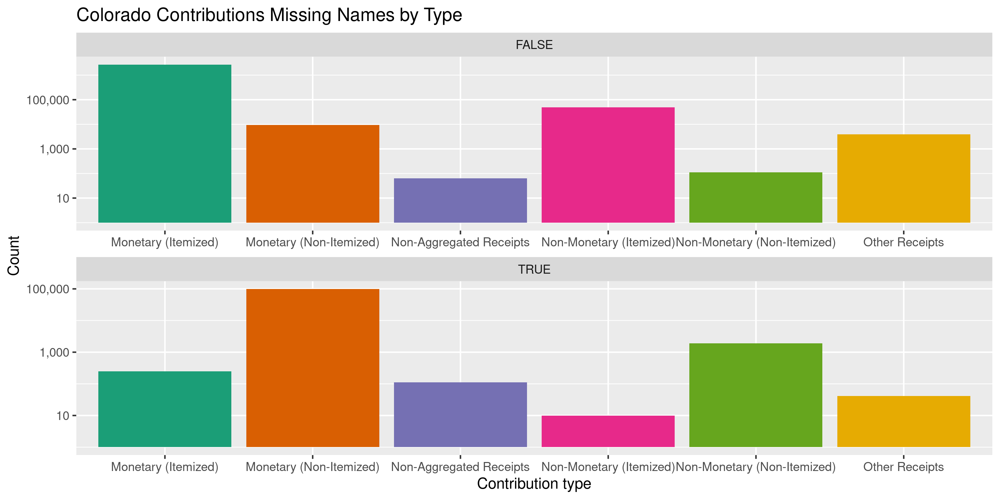
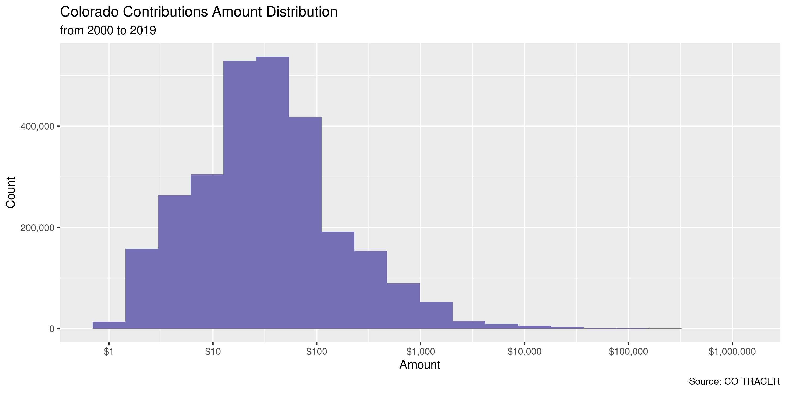
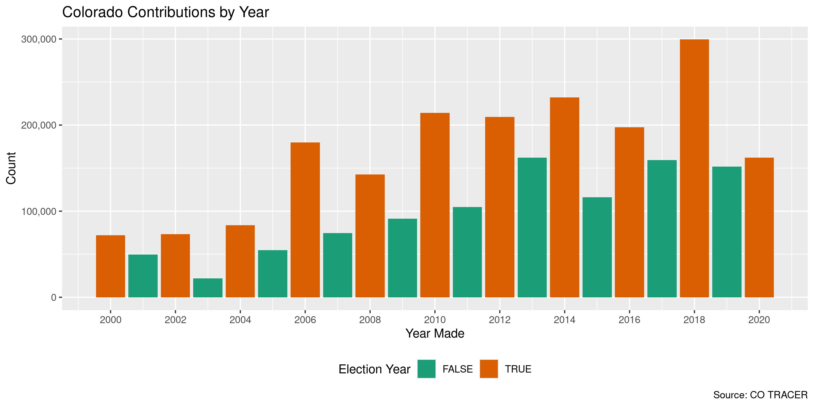
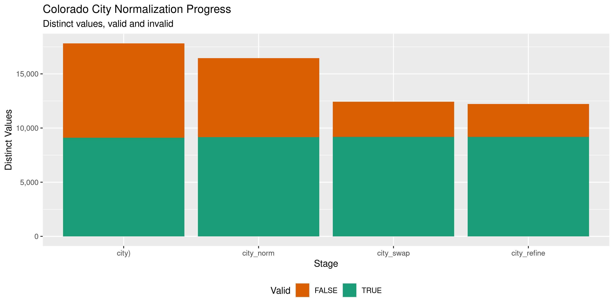

Colorado Contributions
================
Kiernan Nicholls
2022-10-30 16:23:41

-   <a href="#project" id="toc-project">Project</a>
-   <a href="#objectives" id="toc-objectives">Objectives</a>
-   <a href="#packages" id="toc-packages">Packages</a>
-   <a href="#import" id="toc-import">Import</a>
-   <a href="#explore" id="toc-explore">Explore</a>
-   <a href="#wrangle" id="toc-wrangle">Wrangle</a>
-   <a href="#conclude" id="toc-conclude">Conclude</a>
-   <a href="#export" id="toc-export">Export</a>
-   <a href="#upload" id="toc-upload">Upload</a>

<!-- Place comments regarding knitting here -->

## Project

The Accountability Project is an effort to cut across data silos and
give journalists, policy professionals, activists, and the public at
large a simple way to search across huge volumes of public data about
people and organizations.

Our goal is to standardizing public data on a few key fields by thinking
of each dataset row as a transaction. For each transaction there should
be (at least) 3 variables:

1.  All **parties** to a transaction.
2.  The **date** of the transaction.
3.  The **amount** of money involved.

## Objectives

This document describes the process used to complete the following
objectives:

1.  How many records are in the database?
2.  Check for entirely duplicated records.
3.  Check ranges of continuous variables.
4.  Is there anything blank or missing?
5.  Check for consistency issues.
6.  Create a five-digit ZIP Code called `zip`.
7.  Create a `year` field from the transaction date.
8.  Make sure there is data on both parties to a transaction.

## Packages

The following packages are needed to collect, manipulate, visualize,
analyze, and communicate these results. The `pacman` package will
facilitate their installation and attachment.

The IRW’s `campfin` package will also have to be installed from GitHub.
This package contains functions custom made to help facilitate the
processing of campaign finance data.

``` r
if (!require("pacman")) install.packages("pacman")
pacman::p_load_gh("irworkshop/campfin")
pacman::p_load(
  tidyverse, # data manipulation
  lubridate, # datetime strings
  gluedown, # printing markdown
  magrittr, # pipe operators
  janitor, # clean data frames
  aws.s3, # upload to aws s3
  refinr, # cluster and merge
  scales, # format strings
  knitr, # knit documents
  vroom, # read files fast
  rvest, # html scraping
  glue, # combine strings
  here, # relative paths
  httr, # http requests
  fs # local storage 
)
```

This document should be run as part of the `R_campfin` project, which
lives as a sub-directory of the more general, language-agnostic
[`irworkshop/accountability_datacleaning`](https://github.com/irworkshop/accountability_datacleaning)
GitHub repository.

The `R_campfin` project uses the [RStudio
projects](https://support.rstudio.com/hc/en-us/articles/200526207-Using-Projects)
feature and should be run as such. The project also uses the dynamic
`here::here()` tool for file paths relative to *your* machine.

``` r
here::here() # where does this document knit?
#> [1] "/Users/yanqixu/code/accountability_datacleaning"
```

Colorado campaign expenditures data comes courtesy of Colorado Campaign
Finance Disclosure Website, which is managed by the TRACER reporting
system (**Tra**nsparency in **C**ontribution and **E**xpenditure
**R**eporting). Files can be found on the [Data
Download](http://tracer.sos.colorado.gov/PublicSite/DataDownload.aspx)
page.

### Access

> You can access the Campaign Finance Data Download page to download
> contribution and expenditure data for import into other applications
> such as Microsoft Excel or Access. A weekly batch process is run that
> captures the year-to-date information for the current year. The data
> is available for each calendar year. The file is downloaded in CSV
> format.

> This page provides comma separated value (CSV) downloads of
> contribution/donation, expenditure, and loan data for each reporting
> year in a zipped file format. These files can be downloaded and
> imported into other applications (Microsoft Excel, Microsoft Access,
> etc.). This data is extracted from the Department of State database as
> it existed as of 7/20/2019 3:01 AM

In the [TRACER FAQ
file](http://tracer.sos.colorado.gov/PublicSite/FAQ.aspx), the Secretary
of State explains:

> The information presented in the campaign finance database is, to the
> best of the ability of the Secretary of State, an accurate
> representation of the disclosure reports filed with the applicable
> office.It is suggested that the information found from reports
> data-entered by the Secretary of State or County Clerks (which
> includes reports filed prior to 2010) be cross-checked with the
> original document or scanned image of the original document.
>
> Beginning in 2010, all candidates, committees, and political parties
> who file disclosure reports with the Secretary of State must do so
> electronically using the TRACER system. Therefore, all data contained
> in the database dated January 2010 onward reflects that data as
> entered by the reporting person or entity.
>
> Prior to 2010, filers had the option of filing manual disclosure
> reports. Therefore, some of the information in the campaign finance
> database dated prior to 2010was submitted in electronic form by the
> candidate, committee or party, and some of the information was
> data-entered from paper reports filed with the appropriate office.
> Sometimes items which are not consistent with filing requirements,
> such as missing names and addresses or contributions that exceed the
> allowable limits, are displayed when data is viewed online. Incorrect
> entries in the database typically reflect incorrect or incomplete
> entries on manually filed reports submitted to the Secretary of State
> or County Clerk. If you believe that there is a discrepancy in data
> dated prior to January 2010, please contact the appropriate filing
> officer for that data—the Secretary of State for statewide candidates,
> committees, and parties; or the County Clerk for county candidates and
> committees.

TRACER also provides a PDF [spreadsheet
key](http://tracer.sos.colorado.gov/PublicSite/Resources/DownloadDataFileKey.pdf).

| Field Name            | Description                                            |
|:----------------------|:-------------------------------------------------------|
| `CO_ID`               | Alphanumeric committee ID for the recipient committee. |
| `CONTRIBUTION AMOUNT` | Contribution Amount.                                   |
| `CONTRIBUTION DATE`   | Contribution Receipt Date.                             |
| `LAST NAME`           | Last Name (or entity name) of Contributor              |
| `FIRST NAME`          | Contributor First Name                                 |
| `MI`                  | Contributor Middle Initial                             |
| `SUFFIX`              | Contributor Name Suffix                                |
| `ADDRESS 1`           | Street, PO Box, or other directional information       |
| `ADDRESS 2`           | Suite/Apartment number, directional information        |
| `CITY`                | City.                                                  |
| `STATE`               | State.                                                 |
| `ZIP`                 | Zip Code.                                              |
| `EXPLANATION`         | Description provided for the contribution.             |
| `RECORD ID`           | Contribution internal ID issued by the SOS.            |
| `FILED DATE`          |                                                        |
| `CONTRIBUTION TYPE`   | Contribution Type.                                     |
| `RECEIPT TYPE`        |                                                        |
| `CONTRIBUTOR TYPE`    |                                                        |
| `ELECTIONEERING`      | YES or blank                                           |
| `COMMITTEE TYPE`      |                                                        |
| `COMMITTEE NAME`      | Name of the recipient committee.                       |
| `CANDIDATE NAME`      | Name of the recipient candidate..                      |
| `EMPLOYER`            | Contributor’s employer.                                |
| `OCCUPATION`          | Contributor’s occupation in cases from list.           |
| `AMENDED`             | Amendment was filed for this record. (Y/N)             |
| `AMENDMENT`           | Record is an amendment to a previously file. (Y/N)     |
| `AMENDED RECORD ID`   | Original record ID that was amended.                   |
| `JURISDICTION`        | This is the jurisdiction name.                         |
| `OCCUPATION COMMENTS` | If ‘Other’ is chosen for the occupation.               |

## Import

We can download the annual ZIP archives directly from TRACER. This data
is extracted from the Department of State database as it existed as of
10/29/2022 early morning. Since the last update took place

``` r
raw_dir <- dir_create(here("state","co", "contribs", "data", "raw"))
raw_base <- "http://tracer.sos.colorado.gov/PublicSite/Docs/BulkDataDownloads/"
raw_urls <- str_c(raw_base, glue("{2020:2022}_ContributionData.csv.zip"))
raw_paths <- path(raw_dir, basename(raw_urls))
for (f in raw_paths) {
if (!this_file_new(f)) {
  download.file(raw_urls, raw_paths)
}  
}
```

Some slight adjustments need to be made properly read the text files.
Every cell is surrounded in double-quotes (`"`), meaning any
double-quotes *within* a cell result parsing errors. We can read the
lines of each file and replace these with single-quotes.

``` r

fix_dir <- dir_create(path(dirname(raw_dir), "fix"))
for (r in raw_paths) {
  f <- path(fix_dir, path_ext_remove(basename(r)))
  read_lines(r) %>% 
    str_replace_all('(?<!,(?!\\s)|\n|^)"(?!,(?!\\s)|\n|$)', "'") %>% 
    str_replace_all('\n(?!"\\d+",)', " ") %>% 
    write_lines(f)
  message(path.abbrev(f))
}
fix_paths <- dir_ls(fix_dir)
```

``` r
coc <- vroom(
  file = fix_paths,
  delim = ",",
  id = "source",
  escape_double = TRUE,
  escape_backslash = FALSE,
  .name_repair = make_clean_names,
  col_types = cols( # from key
    .default = col_character(),
    ContributionAmount = col_double(),
    ContributionDate = col_datetime(),
    FiledDate = col_datetime(),
  )
)
```

``` r
coc <- relocate(coc, source, .after = last_col())
```

We can ensure these files were properly read by counting the distinct
values of a discrete variable like the binary `amended` variable. There
should only be two values.

``` r
count(coc, amended, sort = TRUE)
#> # A tibble: 2 × 2
#>   amended      n
#>   <chr>    <int>
#> 1 N       820517
#> 2 Y         7072
```

These binary variable should be converted to logical.

``` r
old_names <- names(coc)
coc <- coc %>% 
  mutate(across(c(amended, amendment), .fns = magrittr::equals, "Y")) %>% 
  mutate(across(electioneering, ~!is.na(.))) %>% 
  mutate(across(source, basename)) %>% 
  mutate(across(ends_with("date"), as_date)) %>% 
  rename_all(str_remove, "contribution_") %>% 
  rename_all(str_remove, "_name") %>% 
  rename(
    amend_id = amended_record_id,
    cont_type = contributor_type,
    comm_type = committee_type
  )
```

## Explore

There are 827,589 records with 30 columns.

``` r
glimpse(coc)
#> Rows: 827,589
#> Columns: 30
#> $ co_id               <chr> "20025606447", "20025606447", "20025606447", "20025606447", "20025606…
#> $ amount              <chr> "-50", "250", "262.5", "262.5", "-100", "50", "-100", "50", "-100", "…
#> $ date                <date> 2018-01-01, 2018-01-01, 2018-01-01, 2018-01-01, 2018-01-01, 2018-01-…
#> $ last                <chr> "CLARKE", "BORGEL", "BUSH", "SCHLICHTING", "ALPERT", "ALPERT", "BAJOR…
#> $ first               <chr> "KAREN", "JAMES", "JONATHAN", "TIM", "JONATHAN", "JONATHAN", "NIKOLAI…
#> $ mi                  <chr> NA, NA, NA, NA, NA, NA, NA, NA, NA, NA, NA, NA, NA, NA, NA, NA, NA, N…
#> $ suffix              <chr> NA, NA, NA, NA, NA, NA, NA, NA, NA, NA, NA, NA, NA, NA, NA, NA, NA, N…
#> $ address1            <chr> "4643 S. ULSTER ST., STE. 900", "555 17TH ST., STE. 3200", "2150 W 29…
#> $ address2            <chr> NA, NA, NA, NA, NA, NA, NA, NA, NA, NA, NA, NA, NA, NA, NA, NA, NA, N…
#> $ city                <chr> "DENVER", "DENVER", "DENVER", "DENVER", "DENVER", "DENVER", "DENVER",…
#> $ state               <chr> "CO", "CO", "CO", "CO", "CO", "CO", "CO", "CO", "CO", "CO", "CO", "CO…
#> $ zip                 <chr> "80237", "80202", "80211", "80211", "80202", "80202", "80202", "80202…
#> $ explanation         <chr> "Offset due to deletion of filed item", NA, NA, NA, "Offset due to up…
#> $ record_id           <chr> "5503141", "5503143", "5503144", "5503145", "5503216", "5503217", "55…
#> $ filed_date          <date> 2020-06-12, 2020-06-12, 2020-06-12, 2020-06-12, 2020-06-12, 2020-06-…
#> $ type                <chr> "Monetary (Itemized)", "Monetary (Itemized)", "Monetary (Itemized)", …
#> $ receipt_type        <chr> "Check", "Check", "Check", "Check", "Check", "Check", "Check", "Check…
#> $ cont_type           <chr> "Individual", "Individual", "Individual", "Individual", "Individual",…
#> $ electioneering      <lgl> FALSE, FALSE, FALSE, FALSE, FALSE, FALSE, FALSE, FALSE, FALSE, FALSE,…
#> $ comm_type           <chr> "Political Committee", "Political Committee", "Political Committee", …
#> $ committee           <chr> "NAIOP COLORADO PAC", "NAIOP COLORADO PAC", "NAIOP COLORADO PAC", "NA…
#> $ candidate           <chr> NA, NA, NA, NA, NA, NA, NA, NA, NA, NA, NA, NA, NA, NA, NA, NA, NA, N…
#> $ employer            <chr> "TRANSWESTERN", "HOLLAND & HART", "LCP DEVELOPMENT", "LPC DEVELOPMENT…
#> $ occupation          <chr> "Real Estate Professional", "Attorney/Legal", "Real Estate Profession…
#> $ amended             <lgl> FALSE, FALSE, FALSE, FALSE, TRUE, FALSE, TRUE, FALSE, TRUE, FALSE, TR…
#> $ amendment           <lgl> TRUE, FALSE, FALSE, FALSE, TRUE, TRUE, TRUE, TRUE, TRUE, TRUE, TRUE, …
#> $ amend_id            <chr> "5034997", "0", "0", "0", "5040661", "5040661", "5040666", "5040666",…
#> $ jurisdiction        <chr> "STATEWIDE", "STATEWIDE", "STATEWIDE", "STATEWIDE", "STATEWIDE", "STA…
#> $ occupation_comments <chr> NA, NA, NA, NA, NA, NA, NA, NA, NA, NA, NA, NA, NA, NA, NA, NA, NA, N…
#> $ source              <chr> "2020_ContributionData.csv", "2020_ContributionData.csv", "2020_Contr…
tail(coc)
#> # A tibble: 6 × 30
#>   co_id       amount date       last   first mi    suffix addre…¹ addre…² city  state zip   expla…³
#>   <chr>       <chr>  <date>     <chr>  <chr> <chr> <chr>  <chr>   <chr>   <chr> <chr> <chr> <chr>  
#> 1 20215041730 200    2021-12-31 BEECH… JESS… <NA>  <NA>   201 E … <NA>    COLO… CO    80903 <NA>   
#> 2 20215041730 100    2021-12-31 HALTER IRVI… <NA>  <NA>   104 CO… <NA>    PHIL… PA    19146 <NA>   
#> 3 20215041730 400    2021-12-31 BARNH… DAWN  <NA>  <NA>   1265 R… <NA>    DENV… CO    80206 WEBSIT…
#> 4 20215041730 130    2021-12-31 SMITH  MISC… <NA>  <NA>   5279 W… <NA>    COLO… CO    80911 <NA>   
#> 5 20215041730 250    2021-12-31 NEHME  GEOR… <NA>  <NA>   2044 P… <NA>    COLO… CO    80921 <NA>   
#> 6 20215041730 250    2021-12-31 LABAR… SCOTT <NA>  <NA>   6454 S… <NA>    CENT… CO    80111 <NA>   
#> # … with 17 more variables: record_id <chr>, filed_date <date>, type <chr>, receipt_type <chr>,
#> #   cont_type <chr>, electioneering <lgl>, comm_type <chr>, committee <chr>, candidate <chr>,
#> #   employer <chr>, occupation <chr>, amended <lgl>, amendment <lgl>, amend_id <chr>,
#> #   jurisdiction <chr>, occupation_comments <chr>, source <chr>, and abbreviated variable names
#> #   ¹​address1, ²​address2, ³​explanation
```

We’ll look at the filing date range. We’ll filter out anything filed
before Oct 1, 2020 as those records are already in our previous update.

``` r
max(coc$filed_date)
#> [1] "2022-10-30"
min(coc$filed_date)
#> [1] "2020-01-01"

coc <- coc %>% 
  filter(filed_date >= as.Date("2020-10-01"))
```

### Missing

Columns vary in their degree of missing values.

``` r
col_stats(coc, count_na)
#> # A tibble: 30 × 4
#>    col                 class       n         p
#>    <chr>               <chr>   <int>     <dbl>
#>  1 co_id               <chr>       0 0        
#>  2 amount              <chr>       0 0        
#>  3 date                <date>      0 0        
#>  4 last                <chr>   58571 0.0935   
#>  5 first               <chr>   82313 0.131    
#>  6 mi                  <chr>  559979 0.894    
#>  7 suffix              <chr>  624389 0.997    
#>  8 address1            <chr>   61041 0.0975   
#>  9 address2            <chr>  571839 0.913    
#> 10 city                <chr>   60754 0.0970   
#> 11 state               <chr>   59561 0.0951   
#> 12 zip                 <chr>   61810 0.0987   
#> 13 explanation         <chr>  553333 0.884    
#> 14 record_id           <chr>       0 0        
#> 15 filed_date          <date>      0 0        
#> 16 type                <chr>       8 0.0000128
#> 17 receipt_type        <chr>       0 0        
#> 18 cont_type           <chr>   58556 0.0935   
#> 19 electioneering      <lgl>       0 0        
#> 20 comm_type           <chr>       0 0        
#> 21 committee           <chr>       0 0        
#> 22 candidate           <chr>  372803 0.595    
#> 23 employer            <chr>  197128 0.315    
#> 24 occupation          <chr>  198888 0.318    
#> 25 amended             <lgl>       0 0        
#> 26 amendment           <lgl>       0 0        
#> 27 amend_id            <chr>       0 0        
#> 28 jurisdiction        <chr>       0 0        
#> 29 occupation_comments <chr>  593973 0.948    
#> 30 source              <chr>       0 0
```

After creating a single contributor name variable, we can flag any
record missing a name, date, or amount.

``` r
coc <- coc %>% 
  unite(
    col = contributor,
    first, mi, last,
    sep = " ",
    na.rm = TRUE,
    remove = FALSE
  ) %>% 
  relocate(contributor, .after = last_col()) %>% 
  mutate(across(contributor, na_if, "")) %>% 
  flag_na(date, contributor, amount, committee)
```

9.4% of records are missing some value.

``` r
mean(coc$na_flag)
#> [1] 0.09352774
```

All of these records are missing the contributor `last` name.

``` r
coc %>% 
  filter(na_flag) %>% 
  select(date, contributor, amount, committee)
#> # A tibble: 58,571 × 4
#>    date       contributor amount committee                                 
#>    <date>     <chr>       <chr>  <chr>                                     
#>  1 2020-01-26 <NA>        75     COMMITTEE TO ELECT TISHA MAURO            
#>  2 2020-02-06 <NA>        58     RE-ELECT REAMS FOR SHERIFF                
#>  3 2020-02-09 <NA>        400    COMMITTEE TO ELECT TISHA MAURO            
#>  4 2020-02-24 <NA>        -50    ROURKE FOR DA                             
#>  5 2020-03-14 <NA>        196    MORGAN COUNTY DEMOCRATIC CENTRAL COMMITTEE
#>  6 2020-04-13 <NA>        1      ADAMS 12 CAN FOR KIDS                     
#>  7 2020-04-19 <NA>        200    VICTORIA 2020                             
#>  8 2020-04-19 <NA>        -1000  VICTORIA 2020                             
#>  9 2020-04-22 <NA>        -19.99 CITIZENS FOR LUCK                         
#> 10 2020-04-25 <NA>        -2000  VICTORIA 2020                             
#> # … with 58,561 more rows
```

Practically all of these values are “Non-Itemized” contributions.

``` r
coc %>% 
  filter(na_flag) %>% 
  count(type, sort = TRUE) %>% 
  add_prop()
#> # A tibble: 6 × 3
#>   type                            n         p
#>   <chr>                       <int>     <dbl>
#> 1 Monetary (Non-Itemized)     58230 0.994    
#> 2 Non-Monetary (Non-Itemized)   233 0.00398  
#> 3 Non-Aggregated Receipts        47 0.000802 
#> 4 Returned Contributions         38 0.000649 
#> 5 Monetary (Itemized)            18 0.000307 
#> 6 Non-Monetary (Itemized)         5 0.0000854
```

<!-- -->

### Duplicates

``` r
d1 <- duplicated(select(coc, -record_id), fromLast = FALSE)
d2 <- duplicated(select(coc, -record_id), fromLast = TRUE)
coc <- mutate(coc, dupe_flag = d1 | d2)
rm(d1, d2); flush_memory()
```

``` r
percent(mean(coc$dupe_flag), 0.01)
#> [1] "8.60%"
```

``` r
coc %>% 
  filter(dupe_flag) %>% 
  arrange(date) %>% 
  select(date, last, amount, committee) %>% 
  arrange(desc(date))
#> # A tibble: 53,829 × 4
#>    date       last   amount committee                                        
#>    <date>     <chr>  <chr>  <chr>                                            
#>  1 2022-10-25 WADE   50     SULLIVAN FOR COLORADO                            
#>  2 2022-10-25 WADE   50     SULLIVAN FOR COLORADO                            
#>  3 2022-10-22 OLIGER 100    SHELLI SHAW FOR HOUSE DISTRICT 59                
#>  4 2022-10-22 OLIGER 100    SHELLI SHAW FOR HOUSE DISTRICT 59                
#>  5 2022-10-13 <NA>   5      DENVER DEMOCRATIC CENTRAL COMMITTEE              
#>  6 2022-10-13 <NA>   5      DENVER DEMOCRATIC CENTRAL COMMITTEE              
#>  7 2022-10-12 <NA>   10.53  CENTENNIAL STATE PROSPERITY SMALL DONOR COMMITTEE
#>  8 2022-10-12 <NA>   10.53  CENTENNIAL STATE PROSPERITY SMALL DONOR COMMITTEE
#>  9 2022-10-12 <NA>   5.36   CENTENNIAL STATE PROSPERITY SMALL DONOR COMMITTEE
#> 10 2022-10-12 <NA>   5.36   CENTENNIAL STATE PROSPERITY SMALL DONOR COMMITTEE
#> # … with 53,819 more rows
```

Most duplicate records are also missing a key value.

``` r
mean(coc$dupe_flag[coc$na_flag])
#> [1] 0.8228816
```

### Categorical

``` r
col_stats(coc, n_distinct)
#> # A tibble: 33 × 4
#>    col                 class       n          p
#>    <chr>               <chr>   <int>      <dbl>
#>  1 co_id               <chr>    2092 0.00334   
#>  2 amount              <chr>    8466 0.0135    
#>  3 date                <date>   1387 0.00221   
#>  4 last                <chr>   55695 0.0889    
#>  5 first               <chr>   13690 0.0219    
#>  6 mi                  <chr>      36 0.0000575 
#>  7 suffix              <chr>      99 0.000158  
#>  8 address1            <chr>  152955 0.244     
#>  9 address2            <chr>    5404 0.00863   
#> 10 city                <chr>    7980 0.0127    
#> 11 state               <chr>     115 0.000184  
#> 12 zip                 <chr>   13149 0.0210    
#> 13 explanation         <chr>   13613 0.0217    
#> 14 record_id           <chr>  626241 1.00      
#> 15 filed_date          <date>    592 0.000945  
#> 16 type                <chr>     154 0.000246  
#> 17 receipt_type        <chr>       7 0.0000112 
#> 18 cont_type           <chr>     592 0.000945  
#> 19 electioneering      <lgl>       2 0.00000319
#> 20 comm_type           <chr>       8 0.0000128 
#> 21 committee           <chr>    2073 0.00331   
#> 22 candidate           <chr>    1120 0.00179   
#> 23 employer            <chr>   33466 0.0534    
#> 24 occupation          <chr>      33 0.0000527 
#> 25 amended             <lgl>       2 0.00000319
#> 26 amendment           <lgl>       2 0.00000319
#> 27 amend_id            <chr>    4138 0.00661   
#> 28 jurisdiction        <chr>      63 0.000101  
#> 29 occupation_comments <chr>    6082 0.00971   
#> 30 source              <chr>       3 0.00000479
#> 31 contributor         <chr>  146425 0.234     
#> 32 na_flag             <lgl>       2 0.00000319
#> 33 dupe_flag           <lgl>       2 0.00000319
```

<!-- --><!-- --><!-- --><!-- --><!-- --><!-- -->

### Continuous

#### Amounts

``` r
coc <- coc %>% mutate(amount = as.numeric(amount))
summary(coc$amount)
#>     Min.  1st Qu.   Median     Mean  3rd Qu.     Max. 
#> -1000000        4       19      376       50  5000000
mean(coc$amount <= 0, na.rm = TRUE)
#> [1] 0.006620444
```

<!-- -->

#### Dates

``` r
coc <- mutate(coc, year = year(date))
#coc$year[which(coc$year > 2020 | coc$year < 2000)] <- NA
```

``` r
min(coc$date, na.rm = TRUE)
#> [1] "2000-10-01"
sum(coc$year < 2000, na.rm = TRUE)
#> [1] 0
max(coc$date, na.rm = TRUE)
#> [1] "2022-10-29"
sum(coc$date > today(), na.rm = TRUE)
#> [1] 0
```

<!-- -->

## Wrangle

To improve the searchability of the database, we will perform some
consistent, confident string normalization. For geographic variables
like city names and ZIP codes, the corresponding `campfin::normal_*()`
functions are tailor made to facilitate this process.

### Address

For the street `addresss` variable, the `campfin::normal_address()`
function will force consistence case, remove punctuation, and abbreviate
official USPS suffixes.

``` r
coc <- coc %>% 
  unite(
    col = address_full,
    starts_with("address"),
    sep = " ",
    remove = FALSE,
    na.rm = TRUE
  ) %>% 
  mutate(
    address_norm = normal_address(
      address = address_full,
      abbs = usps_street,
      na_rep = TRUE
    )
  ) %>% 
  select(-address_full)
```

``` r
coc %>% 
  select(contains("address")) %>% 
  distinct() %>% 
  sample_n(10)
#> # A tibble: 10 × 3
#>    address1                    address2 address_norm               
#>    <chr>                       <chr>    <chr>                      
#>  1 6209 S. SKYLINE DR.         <NA>     6209 S SKYLINE DR          
#>  2 307 WASHINGTON BLVD         <NA>     307 WASHINGTON BLVD        
#>  3 1765 SUNSET BLVD            <NA>     1765 SUNSET BLVD           
#>  4 5255 STONE CA�ON RANCH ROAD <NA>     5255 STONE CA�ON RANCH RD  
#>  5 514 S CLARION DR            <NA>     514 S CLARION DR           
#>  6 4100 E MISSISSIPPI AVE #500 <NA>     4100 E MISSISSIPPI AVE #500
#>  7 200 S WILCOX STREET #407    <NA>     200 S WILCOX STREET #407   
#>  8 811 S. EMERSON ST.          <NA>     811 S EMERSON ST           
#>  9 10050 LEWIS COURT           <NA>     10050 LEWIS CT             
#> 10 2677 CATALINA               <NA>     2677 CATALINA
```

### ZIP

For ZIP codes, the `campfin::normal_zip()` function will attempt to
create valid *five* digit codes by removing the ZIP+4 suffix and
returning leading zeroes dropped by other programs like Microsoft Excel.

``` r
coc <- coc %>% 
  mutate(
    zip_norm = normal_zip(
      zip = zip,
      na_rep = TRUE
    )
  )
```

``` r
progress_table(
  coc$zip,
  coc$zip_norm,
  compare = valid_zip
)
#> # A tibble: 2 × 6
#>   stage        prop_in n_distinct prop_na n_out n_diff
#>   <chr>          <dbl>      <dbl>   <dbl> <dbl>  <dbl>
#> 1 coc$zip        0.991      13149  0.0987  5115   1944
#> 2 coc$zip_norm   0.997      11938  0.0996  1825    697
```

### State

Valid two digit state abbreviations can be made using the
`campfin::normal_state()` function.

``` r
coc <- coc %>% 
  mutate(
    state_norm = normal_state(
      state = state,
      abbreviate = TRUE,
      na_rep = TRUE,
      valid = NULL
    )
  )
```

``` r
coc %>% 
  filter(state_norm %out% valid_state) %>% 
  count(state, state_norm, sort = TRUE)
#> # A tibble: 57 × 3
#>    state state_norm     n
#>    <chr> <chr>      <int>
#>  1 <NA>  <NA>       59561
#>  2 RE    RE            98
#>  3 UN    UN            16
#>  4 TE    TE            15
#>  5 D.    <NA>          13
#>  6 GE    GE            11
#>  7 IO    IO            11
#>  8 NO    NO             8
#>  9 SE    SE             7
#> 10 KA    KA             6
#> # … with 47 more rows
```

``` r
progress_table(
  coc$state,
  coc$state_norm,
  compare = valid_state
)
#> # A tibble: 2 × 6
#>   stage          prop_in n_distinct prop_na n_out n_diff
#>   <chr>            <dbl>      <dbl>   <dbl> <dbl>  <dbl>
#> 1 coc$state         1.00        115  0.0951   278     57
#> 2 coc$state_norm    1.00        104  0.0952   248     46
```

### City

Cities are the most difficult geographic variable to normalize, simply
due to the wide variety of valid cities and formats.

#### Normal

The `campfin::normal_city()` function is a good start, again converting
case, removing punctuation, but *expanding* USPS abbreviations. We can
also remove `invalid_city` values.

``` r
coc <- coc %>% 
  mutate(
    city_norm = normal_city(
      city = city, 
      abbs = usps_city,
      states = c("CO", "DC", "COLORADO"),
      na = invalid_city,
      na_rep = TRUE
    )
  )
```

#### Swap

We can further improve normalization by comparing our normalized value
against the *expected* value for that record’s state abbreviation and
ZIP code. If the normalized value is either an abbreviation for or very
similar to the expected value, we can confidently swap those two.

``` r
coc <- coc %>% 
  rename(city_raw = city) %>% 
  left_join(
    y = zipcodes,
    by = c(
      "state_norm" = "state",
      "zip_norm" = "zip"
    )
  ) %>% 
  rename(city_match = city) %>% 
  mutate(
    match_abb = is_abbrev(city_norm, city_match),
    match_dist = str_dist(city_norm, city_match),
    city_swap = if_else(
      condition = !is.na(match_dist) & (match_abb | match_dist == 1),
      true = city_match,
      false = city_norm
    )
  ) %>% 
  select(
    -city_match,
    -match_dist,
    -match_abb
  ) %>% 
  rename(city = city_raw)
```

#### Refine

The \[OpenRefine\] algorithms can be used to group similar strings and
replace the less common versions with their most common counterpart.
This can greatly reduce inconsistency, but with low confidence; we will
only keep any refined strings that have a valid city/state/zip
combination.

``` r
good_refine <- coc %>% 
  mutate(
    city_refine = city_swap %>% 
      key_collision_merge() %>% 
      n_gram_merge(numgram = 1)
  ) %>% 
  filter(city_refine != city_swap) %>% 
  inner_join(
    y = zipcodes,
    by = c(
      "city_refine" = "city",
      "state_norm" = "state",
      "zip_norm" = "zip"
    )
  )
```

    #> # A tibble: 49 × 5
    #>    state_norm zip_norm city_swap               city_refine           n
    #>    <chr>      <chr>    <chr>                   <chr>             <int>
    #>  1 CO         80816    FLORRISANT              FLORISSANT           14
    #>  2 CO         81413    CEDERADGE               CEDAREDGE             3
    #>  3 OH         45209    CINCINATTI              CINCINNATI            3
    #>  4 CO         80113    ENGLEWOODEWOOD          ENGLEWOOD             2
    #>  5 CO         80487    STRINGSTEAMBOAT SPRINGS STEAMBOAT SPRINGS     2
    #>  6 CO         81601    GLENWOODSPRINGSS        GLENWOOD SPRINGS      2
    #>  7 NY         11733    SETAUKET                EAST SETAUKET         2
    #>  8 NY         11733    SETAUKETEAST            EAST SETAUKET         2
    #>  9 CA         90802    LONG BEACH CA           LONG BEACH            1
    #> 10 CA         91423    SHERMAN OKES            SHERMAN OAKS          1
    #> # … with 39 more rows

Then we can join the refined values back to the database.

``` r
coc <- coc %>% 
  left_join(good_refine, by = names(.)) %>% 
  mutate(city_refine = coalesce(city_refine, city_swap))
```

#### Progress

``` r
many_city <- c(valid_city, extra_city, "PUEBLO WEST", "CASTLE PINES")
coc$city_refine <- na_if(coc$city_refine, "UNKNOWNCITY")
coc %>% 
  filter(city_refine %out% many_city) %>% 
  count(city_refine, state_norm, sort = TRUE)
#> # A tibble: 759 × 3
#>    city_refine      state_norm     n
#>    <chr>            <chr>      <int>
#>  1 <NA>             <NA>       59503
#>  2 <NA>             CO          1325
#>  3 REDACTED BY SOS  CO           335
#>  4 <NA>             RE            96
#>  5 MILWAUKIE        OR            95
#>  6 WORK AT HOME     NY            84
#>  7 FOXFIELD         CO            83
#>  8 GREENWOODVILLAGE CO            74
#>  9 ROXBOROUGH       CO            73
#> 10 WESTMINISTER     CO            70
#> # … with 749 more rows
```

| stage                                                                   | prop_in | n_distinct | prop_na | n_out | n_diff |
|:------------------------------------------------------------------------|--------:|-----------:|--------:|------:|-------:|
| str_to_upper(coc$city) | 0.983| 7980| 0.097| 9425| 2202| |coc$city_norm |   0.988 |       7616 |   0.097 |  6793 |   1800 |
| coc$city_swap | 0.995| 6626| 0.097| 3107| 779| |coc$city_refine         |   0.995 |       6583 |   0.097 |  3037 |    737 |

You can see how the percentage of valid values increased with each
stage.

<!-- -->

More importantly, the number of distinct values decreased each stage. We
were able to confidently change many distinct invalid values to their
valid equivalent.

<!-- -->

## Conclude

Before exporting, we can remove the intermediary normalization columns
and rename all added variables with the `_clean` suffix.

``` r
coc <- coc %>% 
  select(
    -city_norm,
    -city_swap,
    city_clean = city_refine
  ) %>% 
  rename_all(~str_replace(., "_norm", "_clean")) %>% 
  rename_all(~str_remove(., "_raw"))
```

``` r
glimpse(sample_frac(coc))
#> Rows: 626,242
#> Columns: 38
#> $ co_id               <chr> "20175032141", "20055622122", "20175031894", "20195037874", "20185035…
#> $ amount              <dbl> 200.00, 31.05, 20.85, 100.00, 25.00, 1500.00, 10.00, 13.12, 8.33, 2.0…
#> $ date                <date> 2021-11-18, 2020-08-01, 2022-05-03, 2022-09-19, 2021-09-30, 2022-09-…
#> $ last                <chr> "KING", "COURINGTON", "GREGORY", "DYKSTRA", "PIZARRO", "HOUSING AND B…
#> $ first               <chr> "SANDRA", "STEPHANIE", "AUSTIN", "KATHLEEN", "ALEJANDRO", NA, "MIKE",…
#> $ mi                  <chr> NA, NA, NA, "R", NA, NA, NA, NA, "J", NA, NA, NA, NA, NA, NA, NA, NA,…
#> $ suffix              <chr> NA, NA, NA, NA, NA, NA, NA, NA, NA, NA, NA, NA, NA, NA, NA, NA, NA, N…
#> $ address1            <chr> "3254 FORREST LAKES DRIVE", "2541 DUBLIN DR.", "903 S ASPEN ST", "153…
#> $ address2            <chr> NA, NA, NA, NA, NA, "SUITE 100", NA, NA, NA, "APT 3013", NA, NA, NA, …
#> $ city                <chr> "MONUMENT", "CASTLE ROCK", "LINCOLNTON", "RIFLE", "ROUND LAKE", "COLO…
#> $ state               <chr> "CO", "CO", "NC", "CO", "IL", "CO", "CO", "CO", "IL", "TX", NA, "CO",…
#> $ zip                 <chr> "80132", "80104", "28092", "81650", "60073", "80907", "80026", "80218…
#> $ explanation         <chr> NA, "RAFFLE TICKET PLUS CC FEES ITEM 107", NA, NA, NA, "CONTRIBUTION"…
#> $ record_id           <chr> "6032311", "5663497", "6200126", "6418517", "5932045", "6417499", "63…
#> $ filed_date          <date> 2022-01-18, 2020-10-13, 2022-05-16, 2022-10-04, 2021-10-15, 2022-10-…
#> $ type                <chr> "Monetary (Itemized)", "Monetary (Itemized)", "Monetary (Itemized)", …
#> $ receipt_type        <chr> "Check", "Electronic Pay System", "Credit/Debit Card", "Check", "Elec…
#> $ cont_type           <chr> "Individual", "Individual", "Individual", "Individual", "Individual",…
#> $ electioneering      <lgl> FALSE, FALSE, FALSE, FALSE, FALSE, FALSE, FALSE, FALSE, FALSE, FALSE,…
#> $ comm_type           <chr> "Candidate Committee", "Political Party Committee", "Small Donor Comm…
#> $ committee           <chr> "ELECT TIM GEITNER", "DOUGLAS COUNTY DEMOCRATIC PARTY", "HEALTHIER CO…
#> $ candidate           <chr> "TIM GEITNER", NA, NA, "PERRY WILL", NA, NA, NA, "ELISABETH EPPS", NA…
#> $ employer            <chr> "RETIRED", "SELF", NA, "CONCRETE EQUIPMENT AND SUPPLY", "SELF EMPLOYE…
#> $ occupation          <chr> "Retired", "Retail Sales", NA, "Retired", "Insurance Industry", NA, "…
#> $ amended             <lgl> FALSE, FALSE, FALSE, FALSE, FALSE, FALSE, FALSE, FALSE, FALSE, FALSE,…
#> $ amendment           <lgl> FALSE, FALSE, FALSE, FALSE, FALSE, FALSE, FALSE, FALSE, FALSE, FALSE,…
#> $ amend_id            <chr> "0", "0", "0", "0", "0", "0", "0", "0", "0", "0", "0", "0", "0", "0",…
#> $ jurisdiction        <chr> "STATEWIDE", "DOUGLAS", "STATEWIDE", "STATEWIDE", "STATEWIDE", "STATE…
#> $ occupation_comments <chr> NA, NA, NA, NA, NA, NA, NA, NA, NA, NA, NA, NA, NA, NA, NA, "FIRM ADM…
#> $ source              <chr> "2022_ContributionData.csv", "2020_ContributionData.csv", "2022_Contr…
#> $ contributor         <chr> "SANDRA KING", "STEPHANIE COURINGTON", "AUSTIN GREGORY", "KATHLEEN R …
#> $ na_flag             <lgl> FALSE, FALSE, FALSE, FALSE, FALSE, FALSE, FALSE, FALSE, FALSE, FALSE,…
#> $ dupe_flag           <lgl> FALSE, FALSE, FALSE, FALSE, FALSE, FALSE, FALSE, FALSE, FALSE, FALSE,…
#> $ year                <dbl> 2021, 2020, 2022, 2022, 2021, 2022, 2022, 2022, 2021, 2021, 2022, 202…
#> $ address_clean       <chr> "3254 FORREST LAKES DR", "2541 DUBLIN DR", "903 S ASPEN ST", "1530 CO…
#> $ zip_clean           <chr> "80132", "80104", "28092", "81650", "60073", "80907", "80026", "80218…
#> $ state_clean         <chr> "CO", "CO", "NC", "CO", "IL", "CO", "CO", "CO", "IL", "TX", NA, "CO",…
#> $ city_clean          <chr> "MONUMENT", "CASTLE ROCK", "LINCOLNTON", "RIFLE", "ROUND LAKE", "COLO…
```

1.  There are 626,242 records in the database.
2.  There are 53,829 duplicate records in the database.
3.  The range and distribution of `amount` and `date` seem reasonable.
4.  There are 58,571 records missing key variables.
5.  Consistency in geographic data has been improved with
    `campfin::normal_*()`.
6.  The 4-digit `year` variable has been created with
    `lubridate::year()`.

## Export

Now the file can be saved on disk for upload to the Accountability
server.

``` r
clean_dir <- dir_create(here("state","co", "contribs", "data", "clean"))
clean_path <- path(clean_dir, "co_contribs_clean_20201001-20221028.csv")
write_csv(coc, clean_path, na = "")
file_size(clean_path)
#> 214M
file_encoding(clean_path) %>% 
  mutate(across(path, path.abbrev))
#> # A tibble: 1 × 3
#>   path                                                                                mime  charset
#>   <fs::path>                                                                          <chr> <chr>  
#> 1 …_datacleaning/state/co/contribs/data/clean/co_contribs_clean_20201001-20221028.csv <NA>  <NA>
```

## Upload

We can use the `aws.s3::put_object()` to upload the text file to the IRW
server.

``` r
s3_path <- path("csv", basename(clean_path))
if (!object_exists(s3_path, "publicaccountability")) {
  put_object(
    file = clean_path,
    object = s3_path, 
    bucket = "publicaccountability",
    acl = "public-read",
    show_progress = TRUE,
    multipart = TRUE
  )
}
as_fs_bytes(object_size(s3_path, "publicaccountability"))
```
