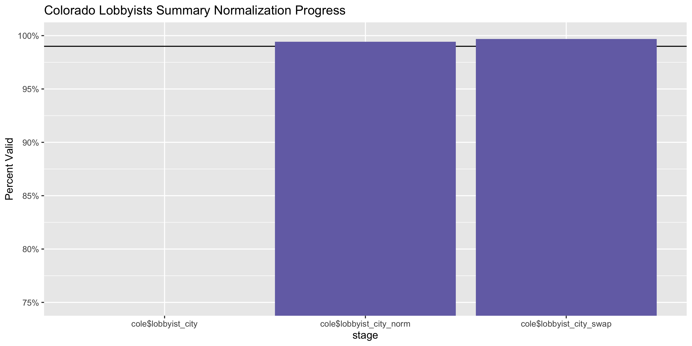
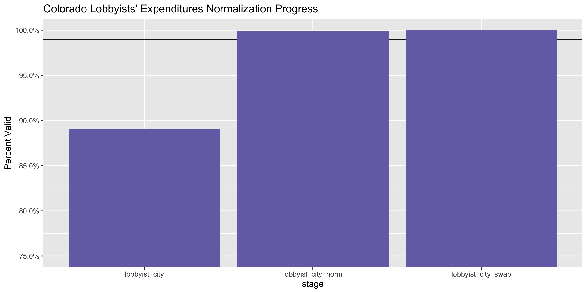

Colorado Lobbying Expenditure Data Diary
================
Yanqi Xu
2020-03-25 17:19:54

<!-- Place comments regarding knitting here -->

## Project

The Accountability Project is an effort to cut across data silos and
give journalists, policy professionals, activists, and the public at
large a simple way to search across huge volumes of public data about
people and organizations.

Our goal is to standardizing public data on a few key fields by thinking
of each dataset row as a transaction. For each transaction there should
be (at least) 3 variables:

1.  All **parties** to a transaction.
2.  The **date** of the transaction.
3.  The **amount** of money involved.

## Objectives

This document describes the process used to complete the following
objectives:

1.  How many records are in the database?
2.  Check for entirely duplicated records.
3.  Check ranges of continuous variables.
4.  Is there anything blank or missing?
5.  Check for consistency issues.
6.  Create a five-digit ZIP Code called `zip`.
7.  Create a `year` field from the transaction date.
8.  Make sure there is data on both parties to a transaction.

## Packages

The following packages are needed to collect, manipulate, visualize,
analyze, and communicate these results. The `pacman` package will
facilitate their installation and attachment.

The IRW’s `campfin` package will also have to be installed from GitHub.
This package contains functions custom made to help facilitate the
processing of campaign finance data.

``` r
if (!require("pacman")) install.packages("pacman")
pacman::p_load_current_gh("irworkshop/campfin")
pacman::p_load(
  readxl, # read excel files
  rvest, # used to scrape website and get html elements
  tidyverse, # data manipulation
  stringdist, # calculate distances between strings
  lubridate, # datetime strings
  magrittr, # pipe opperators
  janitor, # dataframe clean
  refinr, # cluster and merge
  scales, # format strings
  knitr, # knit documents
  vroom, # read files fast
  httr, # http queries
  glue, # combine strings
  here, # relative storage
  fs # search storage 
)
```

This document should be run as part of the `R_campfin` project, which
lives as a sub-directory of the more general, language-agnostic
[`irworkshop/accountability_datacleaning`](https://github.com/irworkshop/accountability_datacleaning)
GitHub repository.

The `R_campfin` project uses the [Rstudio
projects](https://support.rstudio.com/hc/en-us/articles/200526207-Using-Projects "Rproj")
feature and should be run as such. The project also uses the dynamic
`here::here()` tool for file paths relative to *your* machine.

``` r
# where does this document knit?
here::here()
#> [1] "/Users/yanqixu/code/accountability_datacleaning/R_campfin"
```

## Data

Lobbyist data is obtained from the [Colorado Open Data
Portal](https://data.colorado.gov/Lobbyist/Directory-of-Lobbyists-in-Colorado/bqa5-gr84).
The data is as current as March 11, 2020.

> About:  
> Information for each registered lobbyist, including contact details,
> and their associated income and expenses as summarized by month and
> associated report date for the State of Colorado dating back to 1995
> provided by the Colorado Department of State
(CDOS).

## Import

### Setting up Raw Data Directory

``` r
raw_dir <- dir_create(here("co", "lobby", "data", "raw", "exp"))
```

### Download from web

``` r
summary_url <- 'https://data.colorado.gov/api/views/bqa5-gr84/rows.csv?accessType=DOWNLOAD'
exp_url <- 'https://data.colorado.gov/api/views/eqsm-7ah7/rows.csv?accessType=DOWNLOAD'
  
urls <- c(summary_url, exp_url)
wget <- function(url, dir) {
  system2(
    command = "wget",
    args = c(
      "--no-verbose",
      "--content-disposition",
      url,
      paste("-P", raw_dir)
    )
  )
}

if (!all_files_new(raw_dir)) {
  map(urls, wget, raw_dir)
}
```

### Read

> Description:  
> Expenses and income summarized by month associated with lobbying
> activities. In a reporting month, income is reported based on the date
> that it is actually received. For example, in the event that a payment
> is made cumulatively over a three month period, they must report the
> full three month payment when the payment was received. If a lobbyist
> has multiple payments received by various clients, each dollar amount
> is reported separately by each client. If a lobbyist receives multiple
> payments on multiple bills from a single client, the monthly income
> report will be the total of what the client is paying the lobbyist for
> all of lobbying activities on the multiple bills. The statute
> specifies that lobbyists report the total amount they receive from the
> client, so in some cases the monthly dollar amount reported by a
> lobbyist is the total amount received may reflect a payment paid for a
> number of bills and activities. The payments are not itemized by bills
> or activities. In this dataset income is summarized by month.

> Each row represents: Lobbyist name, id, address, and income and
> expense by month

According to Colorado data portal, this dataset can be joined to: \>
Bill Information and Position with Income of Lobbyist in Colorado,
Characterization of Lobbyist Clients in Colorado, Directory of Lobbyist
Clients in Colorado, Expenses for Lobbyists in Colorado, Subcontractors
for Lobbyists in Colorado based on “primaryLobbyistId”

``` r
cole <- read_csv(dir_ls(raw_dir, regexp = "Directory.+"), 
                 col_types = cols(.default = col_character())) %>% 
  clean_names()

co_exp <- read_csv(dir_ls(raw_dir, regexp = "Expenses.+"), 
                 col_types = cols(.default = col_character())) %>% 
  clean_names()
```

## Explore

``` r
head(cole)
#> # A tibble: 6 x 18
#>   lobbyist_last_n… lobbyist_first_… lobbyist_addres… lobbyist_addres… lobbyist_city lobbyist_state
#>   <chr>            <chr>            <chr>            <chr>            <chr>         <chr>         
#> 1 WOODHOUSE        JEFF             1675 BROADWAY    <NA>             DENVER        CO            
#> 2 Harvey           Lauren           1200 Federal Bl… <NA>             Denver        CO            
#> 3 DE               HAAN             <NA>             <NA>             <NA>          <NA>          
#> 4 GATES            LANDON           1700 Lincoln St… <NA>             Denver        CO            
#> 5 PICKAR           JOY              1555 PROMONTORY… <NA>             GREELEY       CO            
#> 6 NIELSEN          JOHN             2260 BASELINE R… <NA>             BOULDER       CO            
#> # … with 12 more variables: lobbyist_zip <chr>, official_state_lobbyist <chr>,
#> #   primary_lobbyist_id <chr>, annual_lobbyist_registration_id <chr>, date_disclosure_filed <chr>,
#> #   date_disclosure_last_modified <chr>, business_associated_with_pending_legislation <chr>,
#> #   total_monthly_income <chr>, total_monthly_expenses <chr>, report_month <chr>,
#> #   fiscal_year <chr>, report_due_date <chr>
tail(cole)
#> # A tibble: 6 x 18
#>   lobbyist_last_n… lobbyist_first_… lobbyist_addres… lobbyist_addres… lobbyist_city lobbyist_state
#>   <chr>            <chr>            <chr>            <chr>            <chr>         <chr>         
#> 1 McCarthy         Danny            1120 Lincoln St… <NA>             Denver        CO            
#> 2 Baillie          Theresa          401 Plymouth Ro… <NA>             Plymouth Mee… PA            
#> 3 Weil             Lisa             1355 S. Colorad… <NA>             Denver        CO            
#> 4 Weil             Lisa             1355 S. Colorad… <NA>             Denver        CO            
#> 5 Weil             Lisa             1355 S. Colorad… <NA>             Denver        CO            
#> 6 Weil             Lisa             1355 S. Colorad… <NA>             Denver        CO            
#> # … with 12 more variables: lobbyist_zip <chr>, official_state_lobbyist <chr>,
#> #   primary_lobbyist_id <chr>, annual_lobbyist_registration_id <chr>, date_disclosure_filed <chr>,
#> #   date_disclosure_last_modified <chr>, business_associated_with_pending_legislation <chr>,
#> #   total_monthly_income <chr>, total_monthly_expenses <chr>, report_month <chr>,
#> #   fiscal_year <chr>, report_due_date <chr>

head(co_exp)
#> # A tibble: 6 x 18
#>   lobbyist_last_n… lobbyist_first_… lobbyist_addres… lobbyist_addres… lobbyist_city lobbyist_state
#>   <chr>            <chr>            <chr>            <chr>            <chr>         <chr>         
#> 1 ABBOUD           GERALD           POWER SPORTS DE… 2003 W ALAMEDA   DENVER        CO            
#> 2 ABBOUD           GERALD           POWER SPORTS DE… 2003 W ALAMEDA   DENVER        CO            
#> 3 ABBOUD           GERALD           POWER SPORTS DE… 2003 W ALAMEDA   DENVER        CO            
#> 4 ABBOUD           GERALD           POWER SPORTS DE… 2003 W ALAMEDA   DENVER        CO            
#> 5 ABBOUD           GERALD           POWER SPORTS DE… 2003 W ALAMEDA   DENVER        CO            
#> 6 ABBOUD           GERALD           POWER SPORTS DE… 2003 W ALAMEDA   DENVER        CO            
#> # … with 12 more variables: lobbyist_zip <chr>, primary_lobbyist_id <chr>,
#> #   annual_lobbyist_registration_id <chr>, official_state_lobbyist <chr>, expenditure_name <chr>,
#> #   expenditure_amount <chr>, expenditure_receipt_date <chr>, expenditure_purpose <chr>,
#> #   expenditure_for_media_flag <chr>, report_month <chr>, fiscal_year <chr>, report_due_date <chr>
tail(co_exp)
#> # A tibble: 6 x 18
#>   lobbyist_last_n… lobbyist_first_… lobbyist_addres… lobbyist_addres… lobbyist_city lobbyist_state
#>   <chr>            <chr>            <chr>            <chr>            <chr>         <chr>         
#> 1 Mallory          Jesse            450 Lincoln Str… Suite 103        Denver        CO            
#> 2 Weil             Lisa             1355 S. Colorad… Building C, Sui… Denver        CO            
#> 3 Mallory          Jesse            450 Lincoln Str… Suite 103        Denver        CO            
#> 4 Mallory          Jesse            450 Lincoln Str… Suite 103        Denver        CO            
#> 5 Mallory          Jesse            450 Lincoln Str… Suite 103        Denver        CO            
#> 6 Martin           Carolyn          19039 Plaza Dr   Suite 210        Parker        CO            
#> # … with 12 more variables: lobbyist_zip <chr>, primary_lobbyist_id <chr>,
#> #   annual_lobbyist_registration_id <chr>, official_state_lobbyist <chr>, expenditure_name <chr>,
#> #   expenditure_amount <chr>, expenditure_receipt_date <chr>, expenditure_purpose <chr>,
#> #   expenditure_for_media_flag <chr>, report_month <chr>, fiscal_year <chr>, report_due_date <chr>
```

### Missing

All records seem to be pretty complete.

``` r
col_stats(cole, count_na)
#> # A tibble: 18 x 4
#>    col                                          class      n      p
#>    <chr>                                        <chr>  <int>  <dbl>
#>  1 lobbyist_last_name                           <chr>      0 0     
#>  2 lobbyist_first_name                          <chr>   7797 0.0478
#>  3 lobbyist_address1                            <chr>  11568 0.0709
#>  4 lobbyist_address2                            <chr> 163271 1     
#>  5 lobbyist_city                                <chr>  11568 0.0709
#>  6 lobbyist_state                               <chr>  11568 0.0709
#>  7 lobbyist_zip                                 <chr>  11568 0.0709
#>  8 official_state_lobbyist                      <chr>      0 0     
#>  9 primary_lobbyist_id                          <chr>      0 0     
#> 10 annual_lobbyist_registration_id              <chr>      0 0     
#> 11 date_disclosure_filed                        <chr>  48857 0.299 
#> 12 date_disclosure_last_modified                <chr>   3754 0.0230
#> 13 business_associated_with_pending_legislation <chr> 163085 0.999 
#> 14 total_monthly_income                         <chr>  65124 0.399 
#> 15 total_monthly_expenses                       <chr> 117091 0.717 
#> 16 report_month                                 <chr>      0 0     
#> 17 fiscal_year                                  <chr>      0 0     
#> 18 report_due_date                              <chr>      0 0
col_stats(co_exp, count_na)
#> # A tibble: 18 x 4
#>    col                             class     n         p
#>    <chr>                           <chr> <int>     <dbl>
#>  1 lobbyist_last_name              <chr>     0 0        
#>  2 lobbyist_first_name             <chr>  2764 0.0409   
#>  3 lobbyist_address1               <chr>  9978 0.148    
#>  4 lobbyist_address2               <chr> 56645 0.838    
#>  5 lobbyist_city                   <chr>  9978 0.148    
#>  6 lobbyist_state                  <chr>  9978 0.148    
#>  7 lobbyist_zip                    <chr>  9978 0.148    
#>  8 primary_lobbyist_id             <chr>     0 0        
#>  9 annual_lobbyist_registration_id <chr>     0 0        
#> 10 official_state_lobbyist         <chr>     0 0        
#> 11 expenditure_name                <chr>  3918 0.0580   
#> 12 expenditure_amount              <chr>     1 0.0000148
#> 13 expenditure_receipt_date        <chr> 31551 0.467    
#> 14 expenditure_purpose             <chr> 49534 0.733    
#> 15 expenditure_for_media_flag      <chr>     0 0        
#> 16 report_month                    <chr>     0 0        
#> 17 fiscal_year                     <chr>     0 0        
#> 18 report_due_date                 <chr>     0 0
```

We’ll flag records without lobbyists’ addresses.

``` r
cole <- cole %>% 
  flag_na(lobbyist_address1)

co_exp <- co_exp %>% 
  flag_na(lobbyist_address1, expenditure_amount)
```

### Duplicates

There isn’t any duplicate column.

``` r
cole <- flag_dupes(cole, dplyr::everything())
sum(cole$dupe_flag)
#> [1] 602

co_exp <- flag_dupes(co_exp, dplyr::everything())
sum(co_exp$dupe_flag)
#> [1] 998
```

### Categorical

#### Dates

Since the dates are all read as characters, we will convert them back in
to date objects. We can add a year variable to the dataframe based on
the registration date.

After examining the results, we can clearly see that there’re some human
errors when entering the date.

``` r
cole <- cole%>% 
   mutate_at(.vars = vars(ends_with('date')), as.Date, format = "%m/%d/%Y %H:%M:%S %p") %>% 
   mutate(year = year(report_due_date))

co_exp <- co_exp%>% 
   mutate_at(.vars = vars(ends_with('date')), as.Date, format = "%m/%d/%Y %H:%M:%S %p") %>% 
   mutate(year = year(report_due_date))

min(co_exp$expenditure_receipt_date, na.rm = T)
#> [1] "0002-05-03"
max(co_exp$expenditure_receipt_date, na.rm = T)
#> [1] "4014-03-11"
```

#### Year

We can see the distribution of the `year` variable as such.

``` r
tabyl(co_exp$fiscal_year)
#> # A tibble: 26 x 3
#>    `co_exp$fiscal_year`     n percent
#>    <chr>                <dbl>   <dbl>
#>  1 1995                  3743  0.0554
#>  2 1996                  6855  0.101 
#>  3 1997                  6898  0.102 
#>  4 1998                  6783  0.100 
#>  5 1999                  6252  0.0925
#>  6 2000                  6532  0.0967
#>  7 2001                  6475  0.0958
#>  8 2002                  4085  0.0604
#>  9 2003                  2751  0.0407
#> 10 2004                  2797  0.0414
#> # … with 16 more rows
```

<!-- -->

### Continuous

We can examine the amounts in both the summary and the expenditure
database

``` r
cole <- cole %>% 
  mutate_at(.vars = vars(starts_with('total_monthly')), .funs = as.numeric)

co_exp <- co_exp %>% 
  mutate(expenditure_amount = as.numeric(expenditure_amount))

summary(cole$total_monthly_income)
#>    Min. 1st Qu.  Median    Mean 3rd Qu.    Max.    NA's 
#>       0     522    2500    6694    7000  259454   65124
summary(cole$total_monthly_expenses)
#>    Min. 1st Qu.  Median    Mean 3rd Qu.    Max.    NA's 
#>       0       0       0     752     100 2399285  117091

summary(co_exp$expenditure_amount)
#>      Min.   1st Qu.    Median      Mean   3rd Qu.      Max.      NA's 
#>       0.0       0.0       9.8     513.9      82.0 1974852.0         1
```

### Wrangle

To improve the searchability of the database, we will perform some
consistent, confident string normalization. For geographic variables
like city names and ZIP codes, the corresponding `campfin::normal_*()`
functions are taylor made to facilitate this process.

### Address

For the street `addresss` variable, the `campfin::normal_address()`
function will force consistence case, remove punctuation, and
abbreviation official USPS suffixes.

``` r
cole <- cole %>% 
    # combine street addr
  unite(
    col = lobbyist_address,
    starts_with("lobbyist_address"),
    sep = " ",
    remove = FALSE,
    na.rm = TRUE
  ) %>% 
  # normalize combined addr
    mutate(lobbyist_address_norm = normal_address(lobbyist_address,abbs = usps_street,
      na_rep = TRUE)) %>% 
  select(-ends_with("address"))

co_exp <- co_exp %>% 
    # combine street addr
  unite(
    col = lobbyist_address,
    starts_with("lobbyist_address"),
    sep = " ",
    remove = FALSE,
    na.rm = TRUE
  ) %>% 
  # normalize combined addr
    mutate(lobbyist_address_norm = normal_address(lobbyist_address,abbs = usps_street,
      na_rep = TRUE)) %>% 
  select(-ends_with("address"))
```

``` r
cole %>% 
  select(contains("address")) %>% 
  distinct() %>% 
  sample_n(10) %>% 
  glimpse()
#> Observations: 10
#> Variables: 3
#> $ lobbyist_address1     <chr> "5290 DTC PARKWAY", "899 North Capitol Street NE", "1201 Maryland …
#> $ lobbyist_address2     <chr> NA, NA, NA, NA, NA, NA, NA, NA, NA, NA
#> $ lobbyist_address_norm <chr> "5290 DTC PKWY", "899 N CAPITOL ST NE", "1201 MARYLAND AVE SW", "C…

co_exp %>% 
  select(contains("address")) %>% 
  distinct() %>% 
  sample_n(10) %>% 
  glimpse()
#> Observations: 10
#> Variables: 3
#> $ lobbyist_address1     <chr> "PO BOX 288", "1800 Larimer Street, Suite 1400", "3632 NEWTON ST",…
#> $ lobbyist_address2     <chr> NA, NA, NA, NA, NA, NA, NA, "SUITE 1000", NA, "Suite 150"
#> $ lobbyist_address_norm <chr> "PO BOX 288", "1800 LARIMER ST STE 1400", "3632 NEWTON ST", "2250 …
```

### ZIP

For ZIP codes, the `campfin::normal_zip()` function will attempt to
create valied *five* digit codes by removing the ZIP+4 suffix and
returning leading zeroes dropped by other programs like Microsoft Excel.

``` r
cole <- cole %>% 
    mutate(lobbyist_zip_norm = normal_zip(lobbyist_zip, na_rep = T)) %>% 
  rename(lobbyist_zip5 = lobbyist_zip_norm)

co_exp <- co_exp %>% 
    mutate(lobbyist_zip_norm = normal_zip(lobbyist_zip, na_rep = T)) %>% 
  rename(lobbyist_zip5 = lobbyist_zip_norm)
```

``` r
progress_table(
  cole$lobbyist_zip,
  cole$lobbyist_zip5,
  compare = valid_zip
)
#> # A tibble: 2 x 6
#>   stage         prop_in n_distinct prop_na n_out n_diff
#>   <chr>           <dbl>      <dbl>   <dbl> <dbl>  <dbl>
#> 1 lobbyist_zip    0.969        622  0.0709  4634     95
#> 2 lobbyist_zip5   0.998        545  0.0709   298      9

progress_table(
  co_exp$lobbyist_zip,
  co_exp$lobbyist_zip5,
  compare = valid_zip
)
#> # A tibble: 2 x 6
#>   stage         prop_in n_distinct prop_na n_out n_diff
#>   <chr>           <dbl>      <dbl>   <dbl> <dbl>  <dbl>
#> 1 lobbyist_zip    0.961        370   0.148  2235     72
#> 2 lobbyist_zip5   1.00         311   0.148     3      3
```

### State

By examining the percentage of lobbyist\_state that are considered
valid, we can see that the variable in both datasets doesn’t need to be
normalized.

``` r
prop_in(cole$lobbyist_state, valid_state, na.rm = T)
#> [1] 1
prop_in(co_exp$lobbyist_state, valid_state, na.rm = T)
#> [1] 1
```

### City

Cities are the most difficult geographic variable to normalize, simply
due to the wide variety of valid cities and formats. \#\#\#\# Normal

The `campfin::normal_city()` function is a good coleart, again
converting case, removing punctuation, but *expanding* USPS
abbreviations. We can also remove `invalid_city` values.

``` r
cole <- cole %>% 
      mutate(lobbyist_city_norm = normal_city(lobbyist_city,abbs = usps_city,
      states = usps_state,
      na = invalid_city,
      na_rep = TRUE))

prop_in(cole$lobbyist_city_norm, valid_city, na.rm = T)
#> [1] 0.9642064

co_exp <- co_exp %>% 
      mutate(lobbyist_city_norm = normal_city(lobbyist_city,abbs = usps_city,
      states = usps_state,
      na = invalid_city,
      na_rep = TRUE))

prop_in(co_exp$lobbyist_city_norm, valid_city, na.rm = T)
#> [1] 0.9710417
```

#### Swap

We can further improve normalization by comparing our normalized value
against the *expected* value for that record’s state abbreviation and
ZIP code. If the normalized value is either an abbreviation for or very
similar to the expected value, we can confidently swap those two.

``` r
cole <- cole %>% 
  left_join(
    y = zipcodes,
    by = c(
      "lobbyist_state" = "state",
      "lobbyist_zip5" = "zip"
    )
  ) %>% 
  rename(lobbyist_city_match = city) %>% 
  mutate(
    match_abb = is_abbrev(lobbyist_city_norm, lobbyist_city_match),
    match_dist = str_dist(lobbyist_city_norm, lobbyist_city_match),
    lobbyist_city_swap = if_else(
      condition = !is.na(match_dist) & match_abb | match_dist == 1,
      true = lobbyist_city_match,
      false = lobbyist_city_norm
    )
  ) %>% 
  select(
    -lobbyist_city_match,
    -match_dist,
    -match_abb
  )

co_exp <- co_exp %>% 
  left_join(
    y = zipcodes,
    by = c(
      "lobbyist_state" = "state",
      "lobbyist_zip5" = "zip"
    )
  ) %>% 
  rename(lobbyist_city_match = city) %>% 
  mutate(
    match_abb = is_abbrev(lobbyist_city_norm, lobbyist_city_match),
    match_dist = str_dist(lobbyist_city_norm, lobbyist_city_match),
    lobbyist_city_swap = if_else(
      condition = !is.na(match_dist) & match_abb | match_dist == 1,
      true = lobbyist_city_match,
      false = lobbyist_city_norm
    )
  ) %>% 
  select(
    -lobbyist_city_match,
    -match_dist,
    -match_abb
  )
```

After the two normalization steps, the percentage of valid cities is
close to 100% for both
datasets.

#### Progress

| stage                | prop\_in | n\_distinct | prop\_na | n\_out | n\_diff |
| :------------------- | -------: | ----------: | -------: | -----: | ------: |
| lobbyist\_city       |    0.700 |         381 |    0.071 |  45540 |     217 |
| lobbyist\_city\_norm |    0.997 |         290 |    0.071 |    446 |      21 |
| lobbyist\_city\_swap |    0.999 |         283 |    0.073 |    200 |      10 |

CO Lobbyists Summary Data Normalization
Progress

| stage                | prop\_in | n\_distinct | prop\_na | n\_out | n\_diff |
| :------------------- | -------: | ----------: | -------: | -----: | ------: |
| lobbyist\_city       |    0.891 |         203 |    0.148 |   6296 |      86 |
| lobbyist\_city\_norm |    0.999 |         160 |    0.148 |     51 |       7 |
| lobbyist\_city\_swap |    1.000 |         158 |    0.148 |     10 |       5 |

CO Lobbyists Expenditure Data Normalization Progress

You can see how the percentage of valid values increased with each
stage.

<!-- --><!-- -->

More importantly, the number of distinct values decreased each stage. We
were able to confidently change many distinct invalid values to their
valid equivalent.

## Conclude

``` r
glimpse(sample_n(cole, 20))
#> Observations: 20
#> Variables: 25
#> $ lobbyist_last_name                           <chr> "WANSTRATH", "YEHLE", "JACKSON KELLY PLLC",…
#> $ lobbyist_first_name                          <chr> "CATHERINE", "FRAN", NA, "ARLENE", "Nick", …
#> $ lobbyist_address1                            <chr> "3000 E. CEDAR AVE. #3", NA, "1099 18TH STR…
#> $ lobbyist_address2                            <chr> NA, NA, NA, NA, NA, NA, NA, NA, NA, NA, NA,…
#> $ lobbyist_city                                <chr> "DENVER", NA, "DENVER", "Englewood", "Denve…
#> $ lobbyist_state                               <chr> "CO", NA, "CO", "CO", "CO", "CO", "CO", "CO…
#> $ lobbyist_zip                                 <chr> "80209", NA, "80202", "80112", "80203", "80…
#> $ official_state_lobbyist                      <chr> "N", "N", "N", "N", "N", "N", "N", "Y", "N"…
#> $ primary_lobbyist_id                          <chr> "19927000253", "19967000346", "20075002185"…
#> $ annual_lobbyist_registration_id              <chr> "19997000702", "19967000346", "20075004153"…
#> $ date_disclosure_filed                        <chr> NA, NA, "06/13/2008 12:00:00 AM", NA, "05/1…
#> $ date_disclosure_last_modified                <chr> "10/06/1999 12:00:00 AM", "02/13/1996 12:00…
#> $ business_associated_with_pending_legislation <chr> NA, NA, NA, NA, NA, NA, NA, NA, NA, NA, NA,…
#> $ total_monthly_income                         <dbl> 16249.83, 1000.00, 25166.67, 1000.00, 500.0…
#> $ total_monthly_expenses                       <dbl> 172.76, 0.00, NA, 3316.67, NA, NA, 0.00, NA…
#> $ report_month                                 <chr> "September", "January", "May", "March", "Ap…
#> $ fiscal_year                                  <chr> "2000", "1996", "2008", "1997", "2017", "20…
#> $ report_due_date                              <date> 1999-10-15, 1996-02-15, 2008-06-16, 1997-0…
#> $ na_flag                                      <lgl> FALSE, TRUE, FALSE, FALSE, FALSE, FALSE, FA…
#> $ dupe_flag                                    <lgl> FALSE, FALSE, FALSE, FALSE, FALSE, FALSE, F…
#> $ year                                         <dbl> 1999, 1996, 2008, 1997, 2017, 2008, 1996, 2…
#> $ lobbyist_address_norm                        <chr> "3000 E CEDAR AVE 3", NA, "1099 18 TH ST", …
#> $ lobbyist_zip5                                <chr> "80209", NA, "80202", "80112", "80203", "80…
#> $ lobbyist_city_norm                           <chr> "DENVER", NA, "DENVER", "ENGLEWOOD", "DENVE…
#> $ lobbyist_city_swap                           <chr> "DENVER", NA, "DENVER", "ENGLEWOOD", "DENVE…
glimpse(sample_n(co_exp, 20))
#> Observations: 20
#> Variables: 25
#> $ lobbyist_last_name              <chr> "LUFEN", "FORD, SOVINE & FORD", "LOWER", "FERM", "HEINTZ…
#> $ lobbyist_first_name             <chr> "RALPH", "CHUCK", "JAY", "ROBERT", "ED", "KAREN", "BRIAN…
#> $ lobbyist_address1               <chr> "495 Uinta Way", "1539 MONROE STREET", "P.O. BOX 3489", …
#> $ lobbyist_address2               <chr> "Ste. 240", NA, NA, "Suite 300", NA, NA, NA, NA, NA, NA,…
#> $ lobbyist_city                   <chr> "Denver", "DENVER", "ENGLEWOOD", "Denver", "LITTLETON", …
#> $ lobbyist_state                  <chr> "CO", "CO", "CO", "CO", "CO", "CO", "CO", "CO", NA, NA, …
#> $ lobbyist_zip                    <chr> "80230", "80206", "80155", "80202", "80124", "80944", "8…
#> $ primary_lobbyist_id             <chr> "20085000349", "19947000400", "19897000499", "1990700013…
#> $ annual_lobbyist_registration_id <chr> "20095000060", "19987000393", "19977000179", "2004500239…
#> $ official_state_lobbyist         <chr> "N", "N", "N", "N", "N", "N", "N", "N", "N", "N", "N", "…
#> $ expenditure_name                <chr> "RALPH LUFEN", "SEN LACY", "NONE", NA, "NON ITEMIZED GIF…
#> $ expenditure_amount              <dbl> 9.00, 6.35, 0.00, 1070.73, 16.27, 0.00, 0.00, 0.00, 0.00…
#> $ expenditure_receipt_date        <date> 2009-04-25, 1998-01-01, NA, 2004-12-01, 1996-03-01, NA,…
#> $ expenditure_purpose             <chr> "PARKING", NA, NA, NA, NA, NA, NA, NA, NA, NA, NA, NA, N…
#> $ expenditure_for_media_flag      <chr> "N", "N", "N", "N", "N", "N", "N", "N", "N", "N", "N", "…
#> $ report_month                    <chr> "April", "April", "January", "November", "March", "April…
#> $ fiscal_year                     <chr> "2009", "1998", "1997", "2005", "1996", "1998", "2002", …
#> $ report_due_date                 <date> 2009-05-15, 1998-05-15, 1997-02-15, 2004-12-15, 1996-04…
#> $ na_flag                         <lgl> FALSE, FALSE, FALSE, FALSE, FALSE, FALSE, FALSE, FALSE, …
#> $ dupe_flag                       <lgl> FALSE, FALSE, FALSE, FALSE, FALSE, FALSE, FALSE, FALSE, …
#> $ year                            <dbl> 2009, 1998, 1997, 2004, 1996, 1998, 2001, 1997, 1998, 19…
#> $ lobbyist_address_norm           <chr> "495 UINTA WAY STE 240", "1539 MONROE ST", "PO BOX 3489"…
#> $ lobbyist_zip5                   <chr> "80230", "80206", "80155", "80202", "80124", "80944", "8…
#> $ lobbyist_city_norm              <chr> "DENVER", "DENVER", "ENGLEWOOD", "DENVER", "LITTLETON", …
#> $ lobbyist_city_swap              <chr> "DENVER", "DENVER", "ENGLEWOOD", "DENVER", "LITTLETON", …
```

1.  There are 163271 records in the summary database and 67578 in the
    expenditure database.
2.  There’re 602 duplicate records in the summary database and 998 in
    the expenditure database.
3.  The range and distribution of `amount` and `date` seem reasonable.
4.  There are 9979 records missing either address or expenditure amount.
5.  Consistency in goegraphic data has been improved with
    `campfin::normal_*()`.

## Export

``` r
clean_dir <- dir_create(here("co", "lobby", "data", "exp","clean"))
```

``` r
write_csv(
  x = cole %>% rename( lobbyist_city_clean = lobbyist_city_swap),
  path = path(clean_dir, "co_lob_summary_clean.csv"),
  na = ""
)


write_csv(
  x = co_exp %>% rename(lobbyist_city_clean = lobbyist_city_swap),
  path = path(clean_dir, "co_lob_exp_clean.csv"),
  na = ""
)
```
