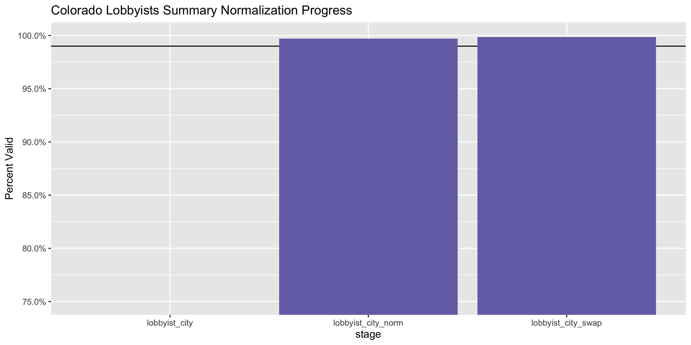
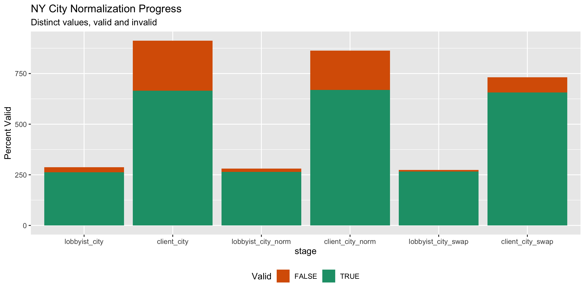

Colorado Lobbying Registration Diary
================
Yanqi Xu
2023-03-26 16:51:46

- <a href="#project" id="toc-project">Project</a>
- <a href="#objectives" id="toc-objectives">Objectives</a>
- <a href="#packages" id="toc-packages">Packages</a>
- <a href="#data" id="toc-data">Data</a>
- <a href="#conclude" id="toc-conclude">Conclude</a>
- <a href="#export" id="toc-export">Export</a>

<!-- Place comments regarding knitting here -->

## Project

The Accountability Project is an effort to cut across data silos and
give journalists, policy professionals, activists, and the public at
large a simple way to search across huge volumes of public data about
people and organizations.

Our goal is to standardizing public data on a few key fields by thinking
of each dataset row as a transaction. For each transaction there should
be (at least) 3 variables:

1.  All **parties** to a transaction
2.  The **date** of the transaction
3.  The **amount** of money involved

## Objectives

This document describes the process used to complete the following
objectives:

1.  How many records are in the database?
2.  Check for duplicates
3.  Check ranges
4.  Is there anything blank or missing?
5.  Check for consistency issues
6.  Create a five-digit ZIP Code called `ZIP5`
7.  Create a `YEAR` field from the transaction date
8.  Make sure there is data on both parties to a transaction

## Packages

The following packages are needed to collect, manipulate, visualize,
analyze, and communicate these results. The `pacman` package will
facilitate their installation and attachment.

The IRW’s `campfin` package will also have to be installed from GitHub.
This package contains functions custom made to help facilitate the
processing of campaign finance data.

``` r
if (!require("pacman")) install.packages("pacman")
pacman::p_load_gh("irworkshop/campfin")
pacman::p_load(
  tidyverse, # data manipulation
  lubridate, # datetime strings
  magrittr, # pipe opperators
  janitor, # dataframe clean
  refinr, # cluster and merge
  scales, # format strings
  knitr, # knit documents
  vroom, # read files fast
  glue, # combine strings
  here, # relative storage
  fs # search storage 
)
```

This document should be run as part of the `R_campfin` project, which
lives as a sub-directory of the more general, language-agnostic
[`irworkshop/accountability_datacleaning`](https://github.com/irworkshop/accountability_datacleaning "TAP repo")
GitHub repository.

The `R_campfin` project uses the [RStudio
projects](https://support.rstudio.com/hc/en-us/articles/200526207-Using-Projects "Rproj")
feature and should be run as such. The project also uses the dynamic
`here::here()` tool for file paths relative to *your* machine.

``` r
# where does this document knit?
here::here()
#> [1] "/Users/yanqixu/code/accountability_datacleaning"
```

## Data

Lobbyist data is obtained from the [Colorado Open Data
Portal](https://data.colorado.gov/Lobbyist/Directory-of-Lobbyist-Clients-in-Colorado/35k5-cv8s).
The data is as current as March 26, 2023.

> About:  
> Lobbyist name and address and the names and addresses of their
> associated clients provided by the Colorado Department of State
> (CDOS).

``` r
raw_dir <- dir_create(here("state","co", "lobby", "data", "raw", "reg"))
```

``` r
reg_url <- 'https://data.colorado.gov/api/views/35k5-cv8s/rows.csv?accessType=DOWNLOAD'

wget <- function(url, dir) {
  system2(
    command = "wget",
    args = c(
      "--no-verbose",
      "--content-disposition",
      url,
      paste("-P", raw_dir)
    )
  )
}

if (!all_files_new(raw_dir)) {
  wget(reg_url, raw_dir)
}
```

``` r
colr <- read_csv(dir_ls(raw_dir), 
                 col_types = cols(.default = col_character()))
```

We’ll do some basic cleaning by turning all text columns to uppercase
and transform column names to snake case.

``` r
colr <- colr %>% 
  mutate_if(is.character, str_to_upper) %>% 
  clean_names()
```

``` r
head(colr)
#> # A tibble: 6 × 15
#>   lobbyis…¹ lobby…² lobby…³ lobby…⁴ lobby…⁵ lobby…⁶ lobby…⁷ prima…⁸ annua…⁹ clien…˟ clien…˟ clien…˟
#>   <chr>     <chr>   <chr>   <chr>   <chr>   <chr>   <chr>   <chr>   <chr>   <chr>   <chr>   <chr>  
#> 1 A. TRENT… <NA>    P. O. … <NA>    JOHNST… CO      80534   200850… 200850… ALAN T… P. O. … <NA>   
#> 2 ABBOUD    GERALD  POWER … 2003 W… DENVER  CO      80223   198970… 199570… COLORA… 2025 W… <NA>   
#> 3 ABBOUD    GERALD  POWER … 2003 W… DENVER  CO      80223   198970… 199570… COLORA… 246 S … <NA>   
#> 4 ABBOUD    GERALD  POWER … 2003 W… DENVER  CO      80223   198970… 199670… COLORA… 2015 W… <NA>   
#> 5 ABBOUD    GERALD  POWER … 2003 W… DENVER  CO      80223   198970… 199670… COLORA… 2015 W… <NA>   
#> 6 ABBOUD    GERALD  POWER … 2003 W… DENVER  CO      80223   198970… 199670… COLORA… 2015 W… <NA>   
#> # … with 3 more variables: client_city <chr>, client_state <chr>, client_zip <chr>, and
#> #   abbreviated variable names ¹​lobbyist_last_name, ²​lobbyist_first_name, ³​lobbyist_address1,
#> #   ⁴​lobbyist_address2, ⁵​lobbyist_city, ⁶​lobbyist_state, ⁷​lobbyist_zip, ⁸​primary_lobbyist_id,
#> #   ⁹​annual_lobbyist_registration_id, ˟​client_name, ˟​client_address1, ˟​client_address2
tail(colr)
#> # A tibble: 6 × 15
#>   lobbyis…¹ lobby…² lobby…³ lobby…⁴ lobby…⁵ lobby…⁶ lobby…⁷ prima…⁸ annua…⁹ clien…˟ clien…˟ clien…˟
#>   <chr>     <chr>   <chr>   <chr>   <chr>   <chr>   <chr>   <chr>   <chr>   <chr>   <chr>   <chr>  
#> 1 CORNERST… <NA>    1660 L… SUITE … DENVER  CO      80238   202051… 202250… CRH AM… 600 AS… <NA>   
#> 2 CAPITOL … <NA>    800 N … #702    DENVER  CO      80203   201050… 202250… POPULU… 300 E.… STE 900
#> 3 BRIDGE C… JOE     2205 S… UNIT 8  DENVER  CO      80222   201650… 202250… LOGAN … 315 MA… <NA>   
#> 4 SOASH & … <NA>    1626 W… <NA>    DENVER  CO      80203   201250… 201350… REPUBL… 410 MA… SUITE …
#> 5 PROTOSTR… DIANA   7904 E… <NA>    DENVER  CO      80238   200170… 202250… ENVIRO… 1543 W… <NA>   
#> 6 CORNERST… <NA>    800 MA… 7TH FL… WASHIN… DC      20024   202051… 202250… CRH AM… 600 AS… <NA>   
#> # … with 3 more variables: client_city <chr>, client_state <chr>, client_zip <chr>, and
#> #   abbreviated variable names ¹​lobbyist_last_name, ²​lobbyist_first_name, ³​lobbyist_address1,
#> #   ⁴​lobbyist_address2, ⁵​lobbyist_city, ⁶​lobbyist_state, ⁷​lobbyist_zip, ⁸​primary_lobbyist_id,
#> #   ⁹​annual_lobbyist_registration_id, ˟​client_name, ˟​client_address1, ˟​client_address2
glimpse(sample_n(colr, 20))
#> Rows: 20
#> Columns: 15
#> $ lobbyist_last_name              <chr> "TOMLINSON", "FENDER", "JLH CONSULTING & PUBLIC AFFAIRS, …
#> $ lobbyist_first_name             <chr> "DANNY", "SHANNON", "JASON", "SEAN", "AMY", "MARGARET", "…
#> $ lobbyist_address1               <chr> "PO BOX 567", "1551 WEWATTA STREET", "2105 MEADOW GREEN C…
#> $ lobbyist_address2               <chr> "38 VIRGINIA CANYON ROAD", NA, NA, NA, NA, NA, NA, "SUITE…
#> $ lobbyist_city                   <chr> "IDAHO SPRINGS", "DENVER", "FRANKTOWN", "DENVER", "LITTLE…
#> $ lobbyist_state                  <chr> "CO", "CO", "CO", "CO", "CO", "TX", "CO", "CO", "CO", "CO…
#> $ lobbyist_zip                    <chr> "80452", "80202", "80116", "80204", "80123", "78746", "80…
#> $ primary_lobbyist_id             <chr> "20025001646", "20135000358", "20065000037", "20065002933…
#> $ annual_lobbyist_registration_id <chr> "20075003033", "20135032162", "20115022540", "20215070534…
#> $ client_name                     <chr> "ECONOMIC DEVELOPMENT COUNCIL OF COLORADO", "BUCHANAN & S…
#> $ client_address1                 <chr> "12050 N. PECOS STREET", "7703 RALSTON ROAD", "421 NORTH …
#> $ client_address2                 <chr> "SUITE 200", NA, NA, NA, "SUITE 200-223", NA, NA, NA, NA,…
#> $ client_city                     <chr> "WESTMINSTER", "ARVADA", "PUEBLO", "LOUISVILLE", "DENVER"…
#> $ client_state                    <chr> "CO", "CO", "CO", "KY", "CO", "MA", "CO", "DC", "CO", "TN…
#> $ client_zip                      <chr> "80234", "80002", "81003", "40222", "80209", "01752", "80…
```

According to the [data
portal](https://data.colorado.gov/Lobbyist/Directory-of-Lobbyist-Clients-in-Colorado/35k5-cv8s):

> All of the lobbyists and all of the clients for Colorado, except for
> state lobbyists, also known as official State Liaisons, who are
> responsible for lobbying on behalf of a state agency and therefore
> have no “client”. The primaryLobbyistID field is the number assigned
> when the lobbyist registers with the state, and the first four numbers
> are the year of original registration. The annual lobbyist
> registration identification number is updated when they register in a
> current fiscal year, and the first four numbers reflect status of the
> lobbyist when registering in a current fiscal year (for example, if
> they were registered in 2015, but did not update their registration in
> 2016, then the registration id would remain 2015 until they register
> in a new fiscal year). The data is updated as necessary to the main
> lobbyist online system via manual entry, however the updates to the
> Colorado Information Marketplace is only done weekly, every Monday
> night.

### Year

We can add a year based on the first four digit of
`annual_lobbyist_registration_id`.

``` r
colr <- colr %>% 
  mutate(year = str_sub(annual_lobbyist_registration_id, start = 1L, end = 4L),
         first_year = str_sub(primary_lobbyist_id, start = 1L, end = 4L))
```

### Missing

``` r
col_stats(colr, count_na)
#> # A tibble: 17 × 4
#>    col                             class     n        p
#>    <chr>                           <chr> <int>    <dbl>
#>  1 lobbyist_last_name              <chr>     0 0       
#>  2 lobbyist_first_name             <chr> 12555 0.152   
#>  3 lobbyist_address1               <chr>  1466 0.0178  
#>  4 lobbyist_address2               <chr> 46099 0.559   
#>  5 lobbyist_city                   <chr>  1466 0.0178  
#>  6 lobbyist_state                  <chr>  1466 0.0178  
#>  7 lobbyist_zip                    <chr>  1466 0.0178  
#>  8 primary_lobbyist_id             <chr>     0 0       
#>  9 annual_lobbyist_registration_id <chr>     0 0       
#> 10 client_name                     <chr>    48 0.000582
#> 11 client_address1                 <chr>   262 0.00318 
#> 12 client_address2                 <chr> 62649 0.760   
#> 13 client_city                     <chr>   193 0.00234 
#> 14 client_state                    <chr>   193 0.00234 
#> 15 client_zip                      <chr>   197 0.00239 
#> 16 year                            <chr>     0 0       
#> 17 first_year                      <chr>     0 0
```

``` r
colr <- colr %>% flag_na(lobbyist_last_name, client_name)
sum(colr$na_flag)
#> [1] 48
```

### Duplicates

We can see there’s no duplicate entry.

``` r
colr <- flag_dupes(colr, dplyr::everything())
sum(colr$dupe_flag)
#> [1] 3282
```

### Categorical

#### Year

We can see that the data is pretty up to date. However, there’re some
fileds indicating the annual registration was recorded in `2055`, which
is presumably a human error.

``` r
colr <- colr %>% 
  mutate(year = as.numeric(year))
tabyl(colr$year)
#> # A tibble: 30 × 3
#>    `colr$year`     n percent
#>          <dbl> <int>   <dbl>
#>  1        1995  1173  0.0142
#>  2        1996  1328  0.0161
#>  3        1997  1087  0.0132
#>  4        1998  1287  0.0156
#>  5        1999  1905  0.0231
#>  6        2000  1792  0.0217
#>  7        2001  3382  0.0410
#>  8        2002  1778  0.0216
#>  9        2003  1985  0.0241
#> 10        2004  2194  0.0266
#> # … with 20 more rows
```

### Wrangle

To improve the searchability of the database, we will perform some
consistent, confident string normalization. For geographic variables
like city names and ZIP codes, the corresponding `campfin::normal_*()`
functions are taylor made to facilitate this process.

### Address

For the street `addresss` variable, the `campfin::normal_address()`
function will force consistence case, remove punctuation, and
abbreviation official USPS suffixes.

``` r
colr <- colr %>% 
    # combine street addr
  unite(
    col = lobbyist_address,
    starts_with("lobbyist_address"),
    sep = " ",
    remove = FALSE,
    na.rm = TRUE
  ) %>% 
    unite(
    col = client_address,
    starts_with("client_address"),
    sep = " ",
    remove = FALSE,
    na.rm = TRUE
  ) %>% 
  # normalize combined addr
    mutate_at(.vars = vars(ends_with('address')), .funs = list(norm = ~ normal_address(.,abbs = usps_street,
      na_rep = TRUE))) %>% 
  select(-ends_with("address"))
```

``` r
colr %>% 
  select(contains("address")) %>% 
  distinct() %>% 
  sample_n(10) %>% 
  glimpse()
#> Rows: 10
#> Columns: 6
#> $ lobbyist_address1     <chr> "1551 LARIMER #1603", "1410 GRANT STREET", "1410 GRANT STREET", "16…
#> $ lobbyist_address2     <chr> NA, "SUITE C 107", "SUITE A-301", NA, "STE 1460", NA, NA, NA, NA, NA
#> $ client_address1       <chr> "14041 HWY 105 EAST", "1201 CONNECTICUT AVE. NW", "3025 W. 37TH AVE…
#> $ client_address2       <chr> NA, NA, NA, NA, NA, NA, "12TH FLOOR", NA, NA, NA
#> $ lobbyist_address_norm <chr> "1551 LARIMER #1603", "1410 GRANT STREET SUITE C 107", "1410 GRANT …
#> $ client_address_norm   <chr> "14041 HWY 105 E", "1201 CONNECTICUT AVE NW", "3025 W 37TH AVE SUIT…
```

### ZIP

For ZIP codes, the `campfin::normal_zip()` function will attempt to
create valied *five* digit codes by removing the ZIP+4 suffix and
returning leading zeroes dropped by other programs like Microsoft Excel.

``` r
colr <- colr %>% 
    mutate_at(.vars = vars(ends_with('zip')), 
              .funs = list(norm = ~ normal_zip(.))) %>% 
  rename(lobbyist_zip5 = lobbyist_zip_norm,
         client_zip5 = client_zip_norm)
```

``` r
progress_table(
  colr$lobbyist_zip,
  colr$lobbyist_zip5,
  colr$client_zip,
  colr$client_zip5,
  compare = valid_zip
)
#> # A tibble: 4 × 6
#>   stage              prop_in n_distinct prop_na n_out n_diff
#>   <chr>                <dbl>      <dbl>   <dbl> <dbl>  <dbl>
#> 1 colr$lobbyist_zip    0.985        714 0.0178   1255    100
#> 2 colr$lobbyist_zip5   0.998        635 0.0178    145     11
#> 3 colr$client_zip      0.969       2039 0.00239  2576    523
#> 4 colr$client_zip5     0.994       1646 0.00264   453     95
```

### State

Valid two digit state abbreviations can be made using the
`campfin::normal_state()` function.

``` r
prop_in(colr$lobbyist_state, valid_state, na.rm = T)
#> [1] 0.9999877
prop_in(colr$client_state, valid_state, na.rm = T)
#> [1] 0.9996111
colr <- colr %>% 
   mutate(client_state_norm = normal_state(client_state,abbreviate = TRUE,
      na_rep = TRUE,
      valid = valid_state))
```

``` r
colr %>% 
  filter(client_state != client_state_norm) %>% 
  count(client_state, sort = TRUE)
#> # A tibble: 0 × 2
#> # … with 2 variables: client_state <chr>, n <int>
```

``` r
progress_table(
  colr$client_state,
  colr$client_state_norm,
  compare = valid_state
)
#> # A tibble: 2 × 6
#>   stage                  prop_in n_distinct prop_na n_out n_diff
#>   <chr>                    <dbl>      <dbl>   <dbl> <dbl>  <dbl>
#> 1 colr$client_state         1.00         58 0.00234    32     10
#> 2 colr$client_state_norm    1            49 0.00273     0      1
```

### City

Cities are the most difficult geographic variable to normalize, simply
due to the wide variety of valid cities and formats. \#### Normal

The `campfin::normal_city()` function is a good colrart, again
converting case, removing punctuation, but *expanding* USPS
abbreviations. We can also remove `invalid_city` values.

``` r
colr <- colr %>% 
      mutate_at(.vars = vars(ends_with('city')), .funs = list(norm = ~ normal_city(.,abbs = usps_city,
      states = usps_state,
      na = invalid_city,
      na_rep = TRUE)))

prop_in(colr$lobbyist_city_norm, valid_city, na.rm = T)
#> [1] 0.9678905
prop_in(colr$client_city_norm, valid_city, na.rm = T)
#> [1] 0.9532464
```

#### Swap

We can further improve normalization by comparing our normalized value
against the *expected* value for that record’s state abbreviation and
ZIP code. If the normalized value is either an abbreviation for or very
similar to the expected value, we can confidently swap those two.

``` r
colr <- colr %>% 
  left_join(
    y = zipcodes,
    by = c(
      "lobbyist_state" = "state",
      "lobbyist_zip5" = "zip"
    )
  ) %>% 
  rename(lobbyist_city_match = city) %>% 
  mutate(
    match_abb = is_abbrev(lobbyist_city_norm, lobbyist_city_match),
    match_dist = str_dist(lobbyist_city_norm, lobbyist_city_match),
    lobbyist_city_swap = if_else(
      condition = !is.na(match_dist) & match_abb | match_dist == 1,
      true = lobbyist_city_match,
      false = lobbyist_city_norm
    )
  ) %>% 
  select(
    -lobbyist_city_match,
    -match_dist,
    -match_abb
  )
```

``` r
colr <- colr %>% 
  left_join(
    y = zipcodes,
    by = c(
      "client_state_norm" = "state",
      "client_zip5" = "zip"
    )
  ) %>% 
  rename(client_city_match = city) %>% 
  mutate(
    match_abb = is_abbrev(client_city_norm, client_city_match),
    match_dist = str_dist(client_city_norm, client_city_match),
    client_city_swap = if_else(
      condition = !is.na(match_dist) & match_abb | match_dist == 1,
      true = client_city_match,
      false = client_city_norm
    )
  ) %>% 
  select(
    -client_city_match,
    -match_dist,
    -match_abb
  )
```

After the two normalization steps, the percentage of valid cities is at
100%. \#### Progress

| stage                                                                        | prop_in | n_distinct | prop_na | n_out | n_diff |
|:-----------------------------------------------------------------------------|--------:|-----------:|--------:|------:|-------:|
| colr$lobbyist_city | 0.997| 350| 0.018| 206| 30| |colr$client_city           |   0.976 |       1019 |   0.002 |  1960 |    284 |
| colr$lobbyist_city_norm | 0.998| 343| 0.018| 192| 22| |colr$client_city_norm |   0.980 |        969 |   0.003 |  1629 |    232 |
| colr$lobbyist_city_swap | 0.999| 331| 0.020| 93| 9| |colr$client_city_swap   |   0.991 |        817 |   0.012 |   717 |     92 |

You can see how the percentage of valid values increased with each
stage.

<!-- -->

More importantly, the number of distinct values decreased each stage. We
were able to confidently change many distinct invalid values to their
valid equivalent.

``` r
progress %>% 
  select(
    stage, 
    all = n_distinct,
    bad = n_diff
  ) %>% 
  mutate(good = all - bad) %>% 
  pivot_longer(c("good", "bad")) %>% 
  mutate(name = name == "good") %>% 
  ggplot(aes(x = stage, y = value)) +
  geom_col(aes(fill = name)) +
  scale_fill_brewer(palette = "Dark2", direction = -1) +
  scale_y_continuous(labels = comma) +
  theme(legend.position = "bottom") +
  labs(
    title = "NY City Normalization Progress",
    subtitle = "Distinct values, valid and invalid",
    x = "stage",
    y = "Percent Valid",
    fill = "Valid"
  )
```

<!-- -->

## Conclude

``` r
glimpse(sample_n(colr, 20))
#> Rows: 20
#> Columns: 28
#> $ lobbyist_last_name              <chr> "KELLY-BOWRY", "BRANDEBERRY MCKENNA PUBLIC AFFAIRS", "GOF…
#> $ lobbyist_first_name             <chr> "TANYA", NA, "ERIN", "DANNY", "III", NA, "RACHEL", "DANIE…
#> $ lobbyist_address1               <chr> "2205 W. 136TH AVENUE, STE. 106", "1410 GRANT STREET, C-3…
#> $ lobbyist_address2               <chr> "#317", NA, "SUITE # 510", "38 VIRGINIA CANYON ROAD", NA,…
#> $ lobbyist_city                   <chr> "WESTMINSTER", "DENVER", "DENVER", "IDAHO SPRINGS", NA, "…
#> $ lobbyist_state                  <chr> "CO", "CO", "CO", "CO", NA, "CO", "CO", "CO", "CO", "CO",…
#> $ lobbyist_zip                    <chr> "80023", "80203", "80202", "80452", NA, "80203", "80202",…
#> $ primary_lobbyist_id             <chr> "20075000109", "20105000133", "20105000068", "20025001646…
#> $ annual_lobbyist_registration_id <chr> "20095006063", "20105000133", "20185025726", "20095005884…
#> $ client_name                     <chr> "SUBCONTRACTOR", "CFSA, C/O MULTISTATES ASSOCIATES", "VIS…
#> $ client_address1                 <chr> "2042 GLENCOE STREET", "515 KING STREET", "P.O. BOX 8999"…
#> $ client_address2                 <chr> NA, NA, NA, NA, NA, NA, NA, NA, NA, NA, "SUITE 315", NA, …
#> $ client_city                     <chr> "DENVER", "ALEXANDRIA", "SAN FRANCISCO", "DENVER", "ALEXA…
#> $ client_state                    <chr> "CO", "VA", "CA", "CO", "VA", "CO", "CO", "CO", "CO", "CO…
#> $ client_zip                      <chr> "80207", "22314", "94128", "80237", "22314", "80422", "80…
#> $ year                            <dbl> 2009, 2010, 2018, 2009, 1996, 2017, 2010, 2013, 2012, 201…
#> $ first_year                      <chr> "2007", "2010", "2010", "2002", "1995", "2009", "2006", "…
#> $ na_flag                         <lgl> FALSE, FALSE, FALSE, FALSE, FALSE, FALSE, FALSE, FALSE, F…
#> $ dupe_flag                       <lgl> TRUE, TRUE, FALSE, FALSE, FALSE, FALSE, FALSE, FALSE, TRU…
#> $ lobbyist_address_norm           <chr> "2205 W 136TH AVENUE STE 106 #317", "1410 GRANT STREET C3…
#> $ client_address_norm             <chr> "2042 GLENCOE ST", "515 KING ST", "PO BOX 8999", "7979 EA…
#> $ lobbyist_zip5                   <chr> "80023", "80203", "80202", "80452", NA, "80203", "80202",…
#> $ client_zip5                     <chr> "80207", "22314", "94128", "80237", "22314", "80422", "80…
#> $ client_state_norm               <chr> "CO", "VA", "CA", "CO", "VA", "CO", "CO", "CO", "CO", "CO…
#> $ lobbyist_city_norm              <chr> "WESTMINSTER", "DENVER", "DENVER", "IDAHO SPRINGS", NA, "…
#> $ client_city_norm                <chr> "DENVER", "ALEXANDRIA", "SAN FRANCISCO", "DENVER", "ALEXA…
#> $ lobbyist_city_swap              <chr> "WESTMINSTER", "DENVER", "DENVER", "IDAHO SPRINGS", NA, "…
#> $ client_city_swap                <chr> "DENVER", "ALEXANDRIA", "SAN FRANCISCO", "DENVER", "ALEXA…
```

1.  There are 82470 records in the database.
2.  There are 3282 duplicate records in the database.
3.  The range and distribution of `year` seems mostly reasonable except
    for a few entries.
4.  There are 48 records missing either recipient or date.
5.  Consistency in goegraphic data has been improved with
    `campfin::normal_*()`.
6.  The 4-digit `year` variable has been created with
    `lubridate::year()`.

## Export

``` r
clean_dir <- dir_create(here("state","co", "lobby", "data", "reg","clean"))
```

``` r
write_csv(
  x = colr %>% rename(lobbyist_city_clean = lobbyist_city_swap) %>% rename(client_city_clean = client_city_swap),
  path = path(clean_dir, "co_lob_reg_clean.csv"),
  na = ""
)
```
