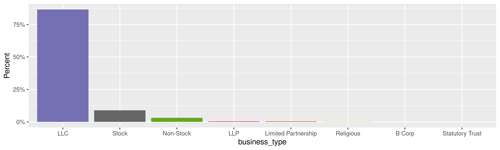
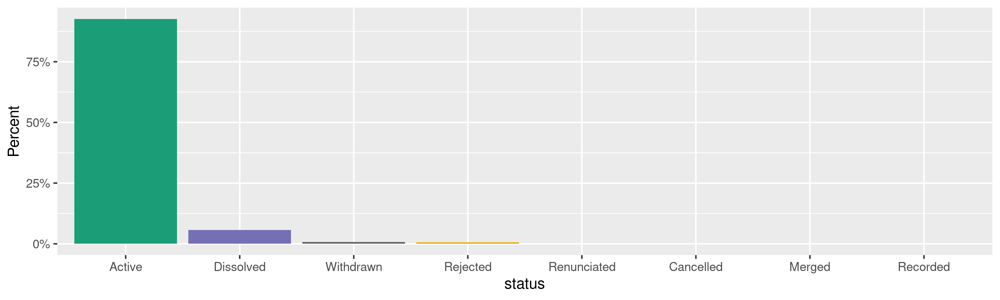
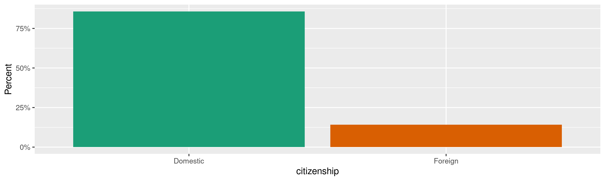
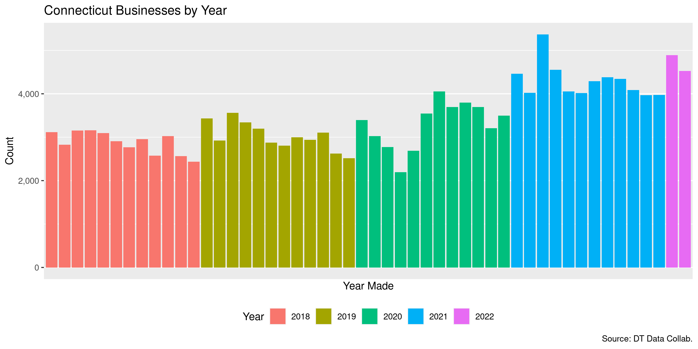
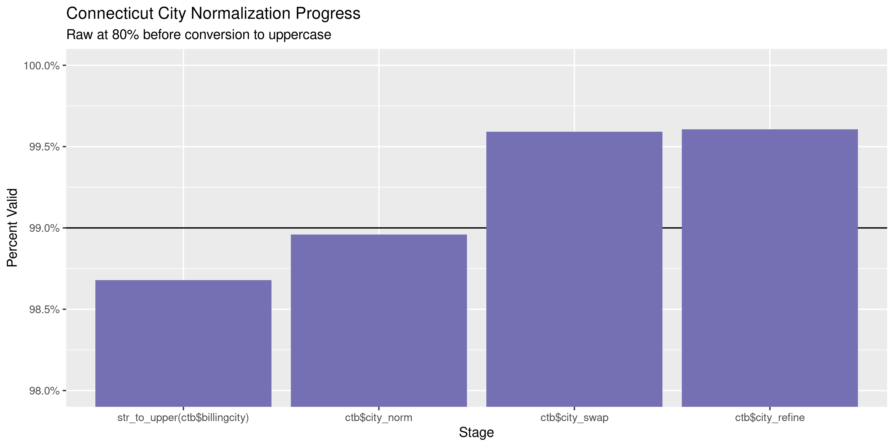
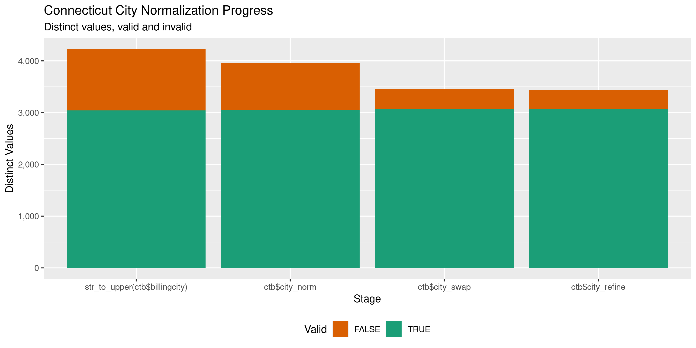

Connecticut Businesses
================
Kiernan Nicholls
Tue May 3 14:23:23 2022

-   [Project](#project)
-   [Objectives](#objectives)
-   [Packages](#packages)
-   [Source](#source)
-   [Download](#download)
-   [Read](#read)
-   [Explore](#explore)
    -   [Missing](#missing)
    -   [Duplicates](#duplicates)
    -   [Categorical](#categorical)
    -   [Dates](#dates)
-   [Wrangle](#wrangle)
    -   [Address](#address)
    -   [ZIP](#zip)
    -   [State](#state)
    -   [City](#city)
-   [Conclude](#conclude)
-   [Export](#export)
-   [Upload](#upload)

<!-- Place comments regarding knitting here -->

## Project

The Accountability Project is an effort to cut across data silos and
give journalists, policy professionals, activists, and the public at
large a simple way to search across huge volumes of public data about
people and organizations.

Our goal is to standardize public data on a few key fields by thinking
of each dataset row as a transaction. For each transaction there should
be (at least) 3 variables:

1.  All **parties** to a transaction.
2.  The **date** of the transaction.
3.  The **amount** of money involved.

## Objectives

This document describes the process used to complete the following
objectives:

1.  How many records are in the database?
2.  Check for entirely duplicated records.
3.  Check ranges of continuous variables.
4.  Is there anything blank or missing?
5.  Check for consistency issues.
6.  Create a five-digit ZIP Code called `zip`.
7.  Create a `year` field from the transaction date.
8.  Make sure there is data on both parties to a transaction.

## Packages

The following packages are needed to collect, manipulate, visualize,
analyze, and communicate these results. The `pacman` package will
facilitate their installation and attachment.

``` r
if (!require("pacman")) {
  install.packages("pacman")
}
pacman::p_load(
  tidyverse, # data manipulation
  lubridate, # datetime strings
  gluedown, # printing markdown
  janitor, # clean data frames
  campfin, # custom irw tools
  aws.s3, # aws cloud storage
  refinr, # cluster & merge
  scales, # format strings
  knitr, # knit documents
  vroom, # fast reading
  rvest, # scrape html
  glue, # code strings
  here, # project paths
  httr, # http requests
  fs # local storage 
)
```

This diary was run using `campfin` version 1.0.8.9300.

``` r
packageVersion("campfin")
#> [1] '1.0.8.9300'
```

This document should be run as part of the `R_tap` project, which lives
as a sub-directory of the more general, language-agnostic
[`irworkshop/accountability_datacleaning`](https://github.com/irworkshop/accountability_datacleaning)
GitHub repository.

The `R_tap` project uses the [RStudio
projects](https://support.rstudio.com/hc/en-us/articles/200526207-Using-Projects)
feature and should be run as such. The project also uses the dynamic
`here::here()` tool for file paths relative to *your* machine.

``` r
# where does this document knit?
here::i_am("state/ct/business/docs/ct_business_diary.Rmd")
```

## Source

Businesses registrations in Connecticut are provided online as part of a
collaboration between the [CT Data
Collaborative](http://ctbusiness.ctdata.org/#/) and the Office of The
Secretary of State.

> In partnership with the Connecticut Secretary of the State, The
> Connecticut Data Collaborative is excited to present multiple tools to
> explore business registration data from January 1980 to May 2021. This
> is the first time this data has been made open and accessible. Here
> you will find six ways to explore the data.

## Download

We can obtain business [registration data by
month](https://www.ctdata.org/sots-monthly-registrations) from a public
Google Drive folder. This folder can be downloaded as a single ZIP
archive and the CSV files can then be extracted locally.

``` r
self_name <- function(x) {
  stopifnot(is_character(x))
  setNames(x, x)
}
```

``` r
raw_dir <- dir_create(here("state", "ct", "business", "data", "raw"))
raw_csv <- dir_ls(raw_dir, glob = "*.csv")
raw_zip <- dir_ls(raw_dir, glob = "*.zip")
if (length(raw_csv) == 0) {
  raw_csv <- unzip(raw_zip, exdir = raw_dir, junkpaths = TRUE)
  raw_csv <- self_name(fs_path(sort(str_subset(raw_csv, "csv$"))))
}
```

## Read

The monthly CSV files can be read together into a list.

``` r
ctb <- map(
  .x = raw_csv,
  .f = read_delim,
  delim = ",",
  escape_backslash = FALSE,
  escape_double = FALSE,
  col_types = cols(
    .default = col_character(),
    annual_report_due_date = col_date(),
    date_registration = col_date(),
    woman_owned_organization = col_logical(),
    veteran_owned_organization = col_logical(),
    minority_owned_organization = col_logical(),
    organization_is_lgbtqi_owned = col_logical(),
    create_dt = col_datetime(),
    began_transacting_in_ct = col_date(),
    date_of_organization_meeting = col_date()
  )
)
```

That list of monthly registrations can be combined into a single data
frame.

``` r
ctb <- ctb |> 
  bind_rows(.id = "source_file") |> 
  relocate(source_file, .after = last_col()) |> 
  mutate(across(source_file, basename))
```

We are going to keep the first 30 columns, dropping mostly empty and
redundant data at the

``` r
ctb <- ctb[, c(1:30, 58)]
```

## Explore

There are 171,422 rows of 31 columns. Each record represents a single
business registered in Connecticut.

``` r
glimpse(ctb)
#> Rows: 171,422
#> Columns: 31
#> $ name                           <chr> "CONNECTICUT CUSTOM CAR, INC.", "SHUMEI, LLC.", "AXIS WORKFLOW AUTOMATION INC",…
#> $ business_type                  <chr> "Stock", "LLC", "Stock", "LLC", "LLC", "LLC", "LLC", "LLC", "LLC", "B Corp", "L…
#> $ status                         <chr> "Active", "Active", "Active", "Active", "Active", "Active", "Active", "Active",…
#> $ accountnumber                  <chr> "1259042", "1259174", "1259175", "1259177", "1259178", "1259179", "1259180", "1…
#> $ annual_report_due_date         <date> 2022-01-01, 2019-03-31, 2020-01-01, 2022-03-31, 2022-03-31, 2022-03-31, 2019-0…
#> $ billingstreet                  <chr> "744 ENFIELD STREET", "1585 BOSTON POST ROAD", "No information provided", "20 B…
#> $ billingcity                    <chr> "ENFIELD", "MILFORD", NA, "DARIEN", "DARIEN", "STRATFORD", "STAMFORD", "BRIDGEP…
#> $ billingcountry                 <chr> "United States", NA, NA, "United States", "United States", "United States", NA,…
#> $ billingpostalcode              <chr> "06082", "06460", NA, "06820", "06820", "06614", "06902", "06606", "06084", NA,…
#> $ billingstate                   <chr> "CT", "CT", NA, "CT", "CT", "CT", "CT", "CT", "CT", NA, "CT", "CT", "CT", "CT",…
#> $ business_email_address         <chr> "waltjr@conncustomcar.com", "KRUANCPA@YAHAOO.COM", "GARY.DAVIES@AUTOMATED-WORKF…
#> $ citizenship                    <chr> "Domestic", "Domestic", "Domestic", "Domestic", "Domestic", "Domestic", "Domest…
#> $ date_registration              <date> 2018-01-01, 2018-01-01, 2018-01-01, 2018-01-01, 2018-01-01, 2018-01-01, 2018-0…
#> $ formation_place                <chr> "CT", "CT", "CT", "CT", "CT", "CT", "CT", "CT", "CT", "CT", "CT", "CT", "CT", "…
#> $ state_or_territory_formation   <chr> "Connecticut", "Connecticut", "Connecticut", "Connecticut", "Connecticut", "Con…
#> $ woman_owned_organization       <lgl> FALSE, FALSE, FALSE, TRUE, FALSE, FALSE, FALSE, TRUE, FALSE, FALSE, FALSE, FALS…
#> $ veteran_owned_organization     <lgl> FALSE, FALSE, FALSE, FALSE, FALSE, FALSE, FALSE, FALSE, TRUE, FALSE, FALSE, FAL…
#> $ minority_owned_organization    <lgl> FALSE, FALSE, FALSE, TRUE, TRUE, FALSE, FALSE, FALSE, FALSE, FALSE, FALSE, FALS…
#> $ org_owned_by_person_s_with     <chr> "False", "False", "False", "False", "False", "False", "False", "False", "False"…
#> $ organization_is_lgbtqi_owned   <lgl> FALSE, FALSE, FALSE, FALSE, FALSE, FALSE, FALSE, FALSE, FALSE, FALSE, FALSE, FA…
#> $ naics_code                     <chr> "Automotive Body, Paint, and Interior Repair and Maintenance (811121)", NA, NA,…
#> $ naics_sub_code                 <chr> "811121.0", NA, NA, NA, NA, "531210.0", NA, "812990.0", "326199.0", NA, NA, "52…
#> $ total_authorized_shares        <chr> "1000.0", NA, "100.0", NA, NA, NA, NA, NA, NA, "100.0", NA, NA, NA, NA, NA, NA,…
#> $ create_dt                      <dttm> 2021-11-10 00:10:18, 2021-11-10 00:10:19, 2021-11-10 00:10:19, 2021-11-10 00:1…
#> $ sub_status                     <chr> NA, "Ready for dissolution", "First report past due", NA, NA, NA, "Ready for di…
#> $ reason_for_administrative      <chr> NA, "Failure to file Annual Report", "Failure to file First Report", NA, NA, NA…
#> $ dissolution_date               <chr> NA, NA, NA, NA, NA, NA, NA, NA, NA, NA, NA, NA, NA, NA, NA, NA, NA, "2019-04-17…
#> $ began_transacting_in_ct        <date> NA, NA, NA, NA, NA, NA, NA, NA, NA, NA, NA, NA, NA, NA, NA, NA, NA, NA, NA, NA…
#> $ business_name_in_state_country <chr> NA, NA, NA, NA, NA, NA, NA, NA, NA, NA, NA, NA, NA, NA, NA, NA, NA, NA, NA, NA,…
#> $ country_formation              <chr> NA, NA, NA, NA, NA, NA, NA, NA, NA, NA, NA, NA, NA, NA, NA, NA, NA, NA, NA, NA,…
#> $ source_file                    <chr> "2018-01.csv", "2018-01.csv", "2018-01.csv", "2018-01.csv", "2018-01.csv", "201…
tail(ctb)
#> # A tibble: 6 × 31
#>   name     business_type status accountnumber annual_report_d… billingstreet billingcity billingcountry billingpostalco…
#>   <chr>    <chr>         <chr>  <chr>         <date>           <chr>         <chr>       <chr>          <chr>           
#> 1 TRDM LLC LLC           Active 2470770       2023-03-31       1 Valley Str… Danbury     United States  06811-3830      
#> 2 TRYON V… Statutory Tr… Active 2470996       2023-03-01       620 S TRYON … CHARLOTTE   UNITED STATES  28255           
#> 3 HAR LLC  LLC           Active 2471152       2023-03-31       478 PARK AVE… EAST HARTF… UNITED STATES  06108           
#> 4 FRESH S… LLC           Active 2473353       2023-03-31       1805 N SCOTT… TEMPE       US             85281           
#> 5 LAGOM K… Stock         Active 2473479       2023-03-02       3924 TULLER … CULVER CITY US             90230           
#> 6 MAPBOX,… Stock         Active 2473592       2023-03-02       740 15TH STR… WASHINGTON  UNITED STATES  20005           
#> # … with 22 more variables: billingstate <chr>, business_email_address <chr>, citizenship <chr>,
#> #   date_registration <date>, formation_place <chr>, state_or_territory_formation <chr>,
#> #   woman_owned_organization <lgl>, veteran_owned_organization <lgl>, minority_owned_organization <lgl>,
#> #   org_owned_by_person_s_with <chr>, organization_is_lgbtqi_owned <lgl>, naics_code <chr>, naics_sub_code <chr>,
#> #   total_authorized_shares <chr>, create_dt <dttm>, sub_status <chr>, reason_for_administrative <chr>,
#> #   dissolution_date <chr>, began_transacting_in_ct <date>, business_name_in_state_country <chr>,
#> #   country_formation <chr>, source_file <chr>
```

### Missing

There are no rows missing a name or creation date.

### Duplicates

There are no duplicate rows.

### Categorical

``` r
col_stats(ctb, n_distinct)
#> # A tibble: 31 × 4
#>    col                            class       n         p
#>    <chr>                          <chr>   <int>     <dbl>
#>  1 name                           <chr>  170636 0.995    
#>  2 business_type                  <chr>      11 0.0000642
#>  3 status                         <chr>      16 0.0000933
#>  4 accountnumber                  <chr>  171379 1.00     
#>  5 annual_report_due_date         <date>   1400 0.00817  
#>  6 billingstreet                  <chr>  139716 0.815    
#>  7 billingcity                    <chr>    5510 0.0321   
#>  8 billingcountry                 <chr>      74 0.000432 
#>  9 billingpostalcode              <chr>   22626 0.132    
#> 10 billingstate                   <chr>      79 0.000461 
#> 11 business_email_address         <chr>  124323 0.725    
#> 12 citizenship                    <chr>       2 0.0000117
#> 13 date_registration              <date>   1344 0.00784  
#> 14 formation_place                <chr>     176 0.00103  
#> 15 state_or_territory_formation   <chr>     187 0.00109  
#> 16 woman_owned_organization       <lgl>       2 0.0000117
#> 17 veteran_owned_organization     <lgl>       2 0.0000117
#> 18 minority_owned_organization    <lgl>       2 0.0000117
#> 19 org_owned_by_person_s_with     <chr>       2 0.0000117
#> 20 organization_is_lgbtqi_owned   <lgl>       2 0.0000117
#> 21 naics_code                     <chr>    1551 0.00905  
#> 22 naics_sub_code                 <chr>     887 0.00517  
#> 23 total_authorized_shares        <chr>     115 0.000671 
#> 24 create_dt                      <dttm>   4810 0.0281   
#> 25 sub_status                     <chr>       8 0.0000467
#> 26 reason_for_administrative      <chr>       4 0.0000233
#> 27 dissolution_date               <chr>    1175 0.00685  
#> 28 began_transacting_in_ct        <date>   1890 0.0110   
#> 29 business_name_in_state_country <chr>   24115 0.141    
#> 30 country_formation              <chr>      60 0.000350 
#> 31 source_file                    <chr>      50 0.000292
```

<!-- --><!-- --><!-- -->

``` r
ctb |> 
  select(where(is.logical)) |> 
  map(~round(prop.table(table(.)), 3))
#> $woman_owned_organization
#> .
#> FALSE  TRUE 
#> 0.862 0.138 
#> 
#> $veteran_owned_organization
#> .
#> FALSE  TRUE 
#> 0.987 0.013 
#> 
#> $minority_owned_organization
#> .
#> FALSE  TRUE 
#> 0.887 0.113 
#> 
#> $organization_is_lgbtqi_owned
#> .
#> FALSE  TRUE 
#> 0.997 0.003
```

### Dates

We can add the calendar year from `date` with `lubridate::year()`

``` r
ctb <- mutate(ctb, year_registration = year(date_registration))
```

``` r
min(ctb$date_registration)
#> [1] "2018-01-01"
max(ctb$date_registration)
#> [1] "2022-02-28"
```

<!-- -->

## Wrangle

To improve the searchability of the database, we will perform some
consistent, confident string normalization. For geographic variables
like city names and ZIP codes, the corresponding `campfin::normal_*()`
functions are tailor made to facilitate this process.

### Address

For the street `addresss` variable, the `campfin::normal_address()`
function will force consistence case, remove punctuation, and abbreviate
official USPS suffixes.

``` r
addr_norm <- ctb %>% 
  distinct(billingstreet) %>% 
  mutate(
    address_norm = normal_address(
      address = billingstreet,
      abbs = usps_street,
      na_rep = TRUE
    )
  )
```

``` r
addr_norm
#> # A tibble: 139,716 × 2
#>    billingstreet                       address_norm                    
#>    <chr>                               <chr>                           
#>  1 744 ENFIELD STREET                  744 ENFIELD ST                  
#>  2 1585 BOSTON POST ROAD               1585 BOSTON POST RD             
#>  3 No information provided             NO INFORMATION PROVIDED         
#>  4 20 BROOKSIDE DRIVE                  20 BROOKSIDE DR                 
#>  5 295 SUNNYBANK AVE                   295 SUNNYBANK AVE               
#>  6 35 W BROAD STREET, 407              35 W BROAD STREET 407           
#>  7 253 INDIAN AVENUE 253 INDIAN AVENUE 253 INDIAN AVENUE 253 INDIAN AVE
#>  8 10 ANTHONY RD                       10 ANTHONY RD                   
#>  9 93 EAST MAIN STREET                 93 EAST MAIN ST                 
#> 10 43 W MAIN ST                        43 W MAIN ST                    
#> # … with 139,706 more rows
```

``` r
ctb <- left_join(ctb, addr_norm, by = "billingstreet")
```

### ZIP

For ZIP codes, the `campfin::normal_zip()` function will attempt to
create valid *five* digit codes by removing the ZIP+4 suffix and
returning leading zeroes dropped by other programs like Microsoft Excel.

``` r
ctb <- ctb %>% 
  mutate(
    zip_norm = normal_zip(
      zip = billingpostalcode,
      na_rep = TRUE
    )
  )
```

``` r
progress_table(
  ctb$billingpostalcode,
  ctb$zip_norm,
  compare = valid_zip
)
#> # A tibble: 2 × 6
#>   stage                 prop_in n_distinct prop_na n_out n_diff
#>   <chr>                   <dbl>      <dbl>   <dbl> <dbl>  <dbl>
#> 1 ctb$billingpostalcode   0.874      22626  0.0435 20609  17113
#> 2 ctb$zip_norm            0.998       6040  0.0437   326    234
```

### State

Valid two digit state abbreviations can be made using the
`campfin::normal_state()` function.

``` r
ctb <- ctb %>% 
  mutate(
    state_norm = normal_state(
      state = billingstate,
      abbreviate = TRUE,
      na_rep = TRUE,
      valid = valid_state
    )
  )
```

``` r
ctb %>% 
  filter(billingstate != state_norm) %>% 
  count(billingstate, state_norm, sort = TRUE)
#> # A tibble: 17 × 3
#>    billingstate   state_norm     n
#>    <chr>          <chr>      <int>
#>  1 ct             CT             8
#>  2 CONNECTICUT    CT             7
#>  3 NEW YORK       NY             3
#>  4 TEXAS          TX             3
#>  5 ILLINOIS       IL             2
#>  6 ny             NY             2
#>  7 ALABAMA        AL             1
#>  8 ca             CA             1
#>  9 CALIFORNIA     CA             1
#> 10 COLORADO       CO             1
#> 11 DELAWARE       DE             1
#> 12 FLORIDA        FL             1
#> 13 IOWA           IA             1
#> 14 MASSACHUSETTS  MA             1
#> 15 NORTH CAROLINA NC             1
#> 16 OHIO           OH             1
#> 17 RHODE ISLAND   RI             1
```

``` r
progress_table(
  ctb$billingstate,
  ctb$state_norm,
  compare = valid_state
)
#> # A tibble: 2 × 6
#>   stage            prop_in n_distinct prop_na n_out n_diff
#>   <chr>              <dbl>      <dbl>   <dbl> <dbl>  <dbl>
#> 1 ctb$billingstate    1.00         79  0.0378    48     26
#> 2 ctb$state_norm      1            54  0.0378     0      1
```

### City

Cities are the most difficult geographic variable to normalize, simply
due to the wide variety of valid cities and formats.

#### Normal

The `campfin::normal_city()` function is a good start, again converting
case, removing punctuation, but *expanding* USPS abbreviations. We can
also remove `invalid_city` values.

``` r
norm_city <- ctb %>% 
  distinct(billingcity, state_norm, zip_norm) %>% 
  mutate(
    city_norm = normal_city(
      city = billingcity, 
      abbs = usps_city,
      states = c("CT", "DC", "CONNECTICUT"),
      na = invalid_city,
      na_rep = TRUE
    )
  )
```

#### Swap

We can further improve normalization by comparing our normalized value
against the *expected* value for that record’s state abbreviation and
ZIP code. If the normalized value is either an abbreviation for or very
similar to the expected value, we can confidently swap those two.

``` r
norm_city <- norm_city %>% 
  rename(city_raw = billingcity) %>% 
  left_join(
    y = zipcodes,
    by = c(
      "state_norm" = "state",
      "zip_norm" = "zip"
    )
  ) %>% 
  rename(city_match = city) %>% 
  mutate(
    match_abb = is_abbrev(city_norm, city_match),
    match_dist = str_dist(city_norm, city_match),
    city_swap = if_else(
      condition = !is.na(match_dist) & (match_abb | match_dist == 1),
      true = city_match,
      false = city_norm
    )
  ) %>% 
  select(
    -city_match,
    -match_dist,
    -match_abb
  )
```

``` r
ctb <- left_join(
  x = ctb,
  y = norm_city,
  by = c(
    "billingcity" = "city_raw", 
    "state_norm", 
    "zip_norm"
  )
)
```

#### Refine

The [OpenRefine](https://openrefine.org/) algorithms can be used to
group similar strings and replace the less common versions with their
most common counterpart. This can greatly reduce inconsistency, but with
low confidence; we will only keep any refined strings that have a valid
city/state/zip combination.

``` r
good_refine <- ctb %>% 
  mutate(
    city_refine = city_swap %>% 
      key_collision_merge() %>% 
      n_gram_merge(numgram = 1)
  ) %>% 
  filter(city_refine != city_swap) %>% 
  inner_join(
    y = zipcodes,
    by = c(
      "city_refine" = "city",
      "state_norm" = "state",
      "zip_norm" = "zip"
    )
  )
```

    #> # A tibble: 22 × 5
    #>    state_norm zip_norm city_swap           city_refine             n
    #>    <chr>      <chr>    <chr>               <chr>               <int>
    #>  1 CT         06109    WHETERSFIELD        WETHERSFIELD            2
    #>  2 CT         06255    NORTH GROVESNORDALE NORTH GROSVENORDALE     2
    #>  3 CT         06002    BLOOMFLIED          BLOOMFIELD              1
    #>  4 CT         06110    WEST HARFROD        WEST HARTFORD           1
    #>  5 CT         06239    DANEISLON           DANIELSON               1
    #>  6 CT         06260    PUTMAN              PUTNAM                  1
    #>  7 CT         06268    MANSFIELD STORRS    STORRS MANSFIELD        1
    #>  8 CT         06410    CHERSIRE            CHESHIRE                1
    #>  9 CT         06441    HIGGUNAM            HIGGANUM                1
    #> 10 CT         06489    SOUGHTINGTON        SOUTHINGTON             1
    #> # … with 12 more rows

Then we can join the refined values back to the database.

``` r
ctb <- ctb %>% 
  left_join(good_refine, by = names(.)) %>% 
  mutate(city_refine = coalesce(city_refine, city_swap))
```

#### Progress

Our goal for normalization was to increase the proportion of city values
known to be valid and reduce the total distinct values by correcting
misspellings.

| stage                           | prop_in | n_distinct | prop_na | n_out | n_diff |
|:--------------------------------|--------:|-----------:|--------:|------:|-------:|
| `str_to_upper(ctb$billingcity)` |   0.987 |       4227 |   0.037 |  2180 |   1183 |
| `ctb$city_norm`                 |   0.990 |       3955 |   0.037 |  1719 |    899 |
| `ctb$city_swap`                 |   0.996 |       3451 |   0.037 |   675 |    381 |
| `ctb$city_refine`               |   0.996 |       3430 |   0.037 |   651 |    360 |

You can see how the percentage of valid values increased with each
stage.

<!-- -->

More importantly, the number of distinct values decreased each stage. We
were able to confidently change many distinct invalid values to their
valid equivalent.

<!-- -->

Before exporting, we can remove the intermediary normalization columns
and rename all added variables with the `_clean` suffix.

``` r
ctb <- ctb %>% 
  select(
    -city_norm,
    -city_swap,
    city_clean = city_refine
  ) %>% 
  rename_all(~str_replace(., "_norm", "_clean")) %>% 
  rename_all(~str_remove(., "_raw")) %>% 
  relocate(address_clean, city_clean, state_clean, .before = zip_clean)
```

## Conclude

``` r
glimpse(sample_n(ctb, 1000))
#> Rows: 1,000
#> Columns: 36
#> $ name                           <chr> "GARMARK SBIC ADVISORS LLC", "CTS RISK SERVICES, LLC", "PREMIER DELIVERY, LLC",…
#> $ business_type                  <chr> "LLC", "LLC", "LLC", "LLC", "Non-Stock", "LLC", "LLC", "LLC", "LLC", "Non-Stock…
#> $ status                         <chr> "Active", "Active", "Active", "Active", "Active", "Active", "Active", "Active",…
#> $ accountnumber                  <chr> "1371676", "1278291", "1313075", "1333381", "2419174", "2445619", "1339319", "1…
#> $ annual_report_due_date         <date> 2022-03-31, 2019-03-31, 2022-03-31, 2022-03-31, 2022-04-09, 2023-03-31, 2022-0…
#> $ billingstreet                  <chr> "ONE LANDMARK SQUARE STE 600", "5900 NORTH ANDREWS AVE STE 1000", "1000 LAFAYET…
#> $ billingcity                    <chr> "STAMFORD", "FORT LAUDERDALE", "BRIDGEPORT", "SOUTH GLASTONBURY", NA, "Old Gree…
#> $ billingcountry                 <chr> "United States", NA, "United States", "United States", NA, "United States", "Un…
#> $ billingpostalcode              <chr> "06901", "33309", "06604", "06073", NA, "06870", "06510", "06610", "06907", NA,…
#> $ billingstate                   <chr> "CT", "FL", "CT", "CT", NA, "CT", "CT", "CT", "CT", NA, "CT", "CT", "CT", "CT",…
#> $ business_email_address         <chr> "mrich@garmark.com", "BCREWS@PATNAT.COM", "premierdeliver@gmail.com", "JMCendan…
#> $ citizenship                    <chr> "Foreign", "Foreign", "Domestic", "Domestic", "Domestic", "Domestic", "Domestic…
#> $ date_registration              <date> 2020-12-31, 2018-07-06, 2019-06-20, 2020-01-17, 2022-01-09, 2022-02-04, 2020-0…
#> $ formation_place                <chr> "DE", "DE", "CT", "CT", "Connecticut", "Connecticut", "CT", "CT", "CT", "Connec…
#> $ state_or_territory_formation   <chr> "DE", "DE", "Connecticut", "Connecticut", "Connecticut", "Connecticut", "Connec…
#> $ woman_owned_organization       <lgl> FALSE, FALSE, FALSE, TRUE, TRUE, FALSE, FALSE, FALSE, FALSE, FALSE, TRUE, FALSE…
#> $ veteran_owned_organization     <lgl> FALSE, FALSE, FALSE, FALSE, TRUE, FALSE, FALSE, FALSE, FALSE, FALSE, FALSE, FAL…
#> $ minority_owned_organization    <lgl> FALSE, FALSE, FALSE, FALSE, FALSE, TRUE, FALSE, FALSE, FALSE, FALSE, FALSE, FAL…
#> $ org_owned_by_person_s_with     <chr> "False", "False", "False", "False", "False", "False", "False", "False", "False"…
#> $ organization_is_lgbtqi_owned   <lgl> FALSE, FALSE, FALSE, FALSE, FALSE, FALSE, FALSE, FALSE, FALSE, FALSE, FALSE, FA…
#> $ naics_code                     <chr> "Other Financial Vehicles (525990)", NA, "All Other General Merchandise Stores …
#> $ naics_sub_code                 <chr> NA, NA, NA, "518210.0", NA, NA, "551112.0", NA, NA, NA, NA, "524210.0", "424410…
#> $ total_authorized_shares        <chr> NA, NA, NA, NA, NA, NA, NA, NA, NA, NA, NA, NA, NA, NA, "100.0", NA, NA, NA, NA…
#> $ create_dt                      <dttm> 2021-11-10 00:05:07, 2021-11-10 00:08:23, 2021-11-10 00:10:28, 2021-11-10 00:0…
#> $ sub_status                     <chr> NA, "Ready for dissolution", NA, NA, "First report due", NA, NA, "Ready for dis…
#> $ reason_for_administrative      <chr> NA, "Failure to file Annual Report", NA, NA, NA, NA, NA, "Failure to file Annua…
#> $ dissolution_date               <chr> NA, NA, NA, NA, NA, NA, NA, NA, NA, NA, NA, NA, NA, NA, NA, NA, NA, NA, NA, NA,…
#> $ began_transacting_in_ct        <date> 2014-07-15, 2018-07-05, NA, NA, NA, NA, NA, NA, NA, NA, NA, NA, NA, NA, NA, NA…
#> $ business_name_in_state_country <chr> "GARMARK SBIC ADVISORS LLC", "CTS RISK SERVICES, LLC", NA, NA, NA, NA, NA, NA, …
#> $ country_formation              <chr> "United States", NA, NA, NA, "United States", "United States", NA, NA, NA, "Uni…
#> $ source_file                    <chr> "2020-12.csv", "2018-07.csv", "2019-06.csv", "2020-01.csv", "2022-01.csv", "202…
#> $ year_registration              <dbl> 2020, 2018, 2019, 2020, 2022, 2022, 2020, 2019, 2019, 2021, 2020, 2019, 2019, 2…
#> $ address_clean                  <chr> "ONE LANDMARK SQUARE STE 600", "5900 NORTH ANDREWS AVE STE 1000", "1000 LAFAYET…
#> $ city_clean                     <chr> "STAMFORD", "FORT LAUDERDALE", "BRIDGEPORT", "SOUTH GLASTONBURY", NA, "OLD GREE…
#> $ state_clean                    <chr> "CT", "FL", "CT", "CT", NA, "CT", "CT", "CT", "CT", NA, "CT", "CT", "CT", "CT",…
#> $ zip_clean                      <chr> "06901", "33309", "06604", "06073", NA, "06870", "06510", "06610", "06907", NA,…
```

1.  There are 171,422 records in the database.
2.  There are 0 duplicate records in the database.
3.  The range and distribution of `amount` and `date` seem reasonable.
4.  There are 0 records missing key variables.
5.  Consistency in geographic data has been improved with
    `campfin::normal_*()`.
6.  The 4-digit `year` variable has been created with
    `lubridate::year()`.

## Export

Now the file can be saved on disk for upload to the Accountability
server. We will name the object using a date range of the records
included.

``` r
min_dt <- str_remove_all(min(ctb$date_registration), "-")
max_dt <- str_remove_all(max(ctb$date_registration), "-")
csv_ts <- paste(min_dt, max_dt, sep = "-")
```

``` r
clean_dir <- dir_create(here("state", "ct", "business", "data", "clean"))
clean_csv <- path(clean_dir, glue("ct_businesses_{csv_ts}.csv"))
clean_rds <- path_ext_set(clean_csv, "rds")
basename(clean_csv)
#> [1] "ct_businesses_20180101-20220228.csv"
```

``` r
write_csv(ctb, clean_csv, na = "")
write_rds(ctb, clean_rds, compress = "xz")
(clean_size <- file_size(clean_csv))
#> 54.5M
```

## Upload

We can use the `aws.s3::put_object()` to upload the text file to the IRW
server.

``` r
aws_key <- path("csv", basename(clean_csv))
if (!object_exists(aws_key, "publicaccountability")) {
  put_object(
    file = clean_csv,
    object = aws_key, 
    bucket = "publicaccountability",
    acl = "public-read",
    show_progress = TRUE,
    multipart = TRUE
  )
}
aws_head <- head_object(aws_key, "publicaccountability")
(aws_size <- as_fs_bytes(attr(aws_head, "content-length")))
unname(aws_size == clean_size)
```
