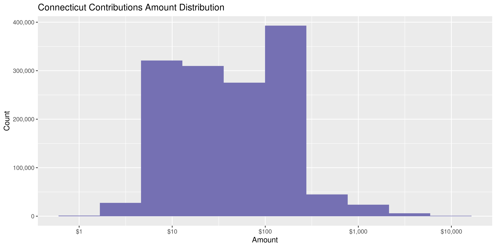
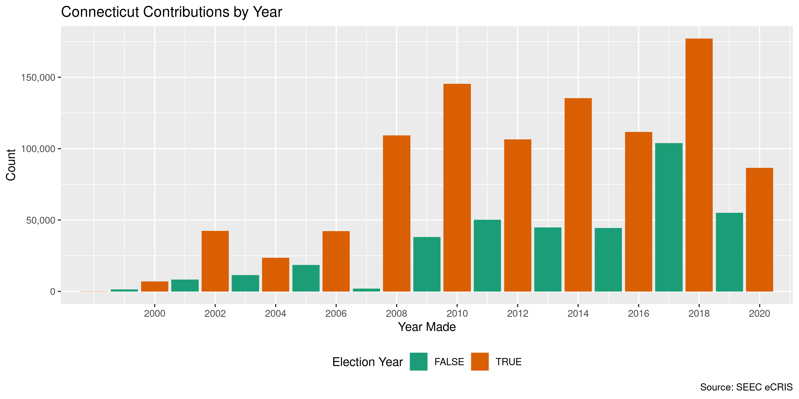
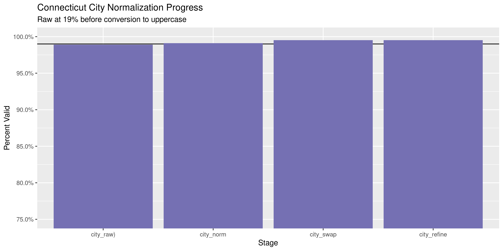

Connecticut Contributions
================
Kiernna Nicholls & Aarushi Sahejpal
2023-03-25 23:32:31

- <a href="#project" id="toc-project">Project</a>
- <a href="#objectives" id="toc-objectives">Objectives</a>
- <a href="#packages" id="toc-packages">Packages</a>
- <a href="#data" id="toc-data">Data</a>
- <a href="#download" id="toc-download">Download</a>
- <a href="#read" id="toc-read">Read</a>
- <a href="#explore" id="toc-explore">Explore</a>
- <a href="#missing" id="toc-missing">Missing</a>
- <a href="#duplicates" id="toc-duplicates">Duplicates</a>
- <a href="#amounts" id="toc-amounts">Amounts</a>
- <a href="#dates" id="toc-dates">Dates</a>
- <a href="#wrangle" id="toc-wrangle">Wrangle</a>
- <a href="#conclude" id="toc-conclude">Conclude</a>
- <a href="#export" id="toc-export">Export</a>
- <a href="#upload" id="toc-upload">Upload</a>

<!-- Place comments regarding knitting here -->

## Project

The Accountability Project is an effort to cut across data silos and
give journalists, policy professionals, activists, and the public at
large a simple way to search across huge volumes of public data about
people and organizations.

Our goal is to standardizing public data on a few key fields by thinking
of each dataset row as a transaction. For each transaction there should
be (at least) 3 variables:

1.  All **parties** to a transaction.
2.  The **date** of the transaction.
3.  The **amount** of money involved.

## Objectives

This document describes the process used to complete the following
objectives:

1.  How many records are in the database?
2.  Check for entirely duplicated records.
3.  Check ranges of continuous variables.
4.  Is there anything blank or missing?
5.  Check for consistency issues.
6.  Create a five-digit ZIP Code called `zip`.
7.  Create a `year` field from the transaction date.
8.  Make sure there is data on both parties to a transaction.

## Packages

The following packages are needed to collect, manipulate, visualize,
analyze, and communicate these results. The `pacman` package will
facilitate their installation and attachment.

The IRW’s `campfin` package will also have to be installed from GitHub.
This package contains functions custom made to help facilitate the
processing of campaign finance data.

``` r
if (!require("pacman")) install.packages("pacman")
pacman::p_load_gh("irworkshop/campfin")
pacman::p_load(
  tidyverse, # data manipulation
  lubridate, # datetime strings
  gluedown, # printing markdown
  magrittr, # pipe operators
  janitor, # clean data frames
  aws.s3, # upload to aws s3
  refinr, # cluster and merge
  scales, # format strings
  knitr, # knit documents
  vroom, # read files fast
  rvest, # html scraping
  glue, # combine strings
  here, # relative paths
  httr, # http requests
  fs # local storage 
)
```

This document should be run as part of the `R_campfin` project, which
lives as a sub-directory of the more general, language-agnostic
[`irworkshop/accountability_datacleaning`](https://github.com/irworkshop/accountability_datacleaning)
GitHub repository.

The `R_campfin` project uses the [RStudio
projects](https://support.rstudio.com/hc/en-us/articles/200526207-Using-Projects)
feature and should be run as such. The project also uses the dynamic
`here::here()` tool for file paths relative to *your* machine.

``` r
# where does this document knit?
here::here()
#> [1] "/Volumes/TAP/accountability_datacleaning"
```

## Data

Campaign contribution data for the state of Connecticut is managed by
the [State Elections Enforcement Commission
(SEEC)](https://portal.ct.gov/seec). The data can be obtained from the
SEEC [Campaign Reporting Information System
(eCRIS)](https://seec.ct.gov/Portal/eCRIS/eCRISlanding) public [search
portal](https://seec.ct.gov/Portal/eCRIS/eCrisSearch).

> This page allows the public to search, browse and download information
> from campaign finance reports filed by committees with the SEEC’s
> Disclosure and Audit Unit. The term committees for purposes of this
> summary includes: Candidate committees, Exploratory committees, Party
> committees and Political Action committees (also known as PACs). We
> shall refer to all four distinct committee types as political
> committees in order to accent the political nature of their purpose in
> relationship to the financing of election campaigns for elective
> public office in Connecticut.The Commission strives to offer fast and
> easy public access to the filings by committees.

The SEEC also provides a [bulk download
page](https://seec.ct.gov/Portal/eCRIS/CurPreYears) with annual CSV
files.

> Receipts Data for Party, Political, Candidate and Exploratory
> Committees (e-filed in eCRIS and paper report transactions were
> entered by the State Election Enforcement Comission staff using a data
> entry module.)

## Download

We can scrape this page and find any CSV files containing contribution
receipts.

``` r
# read the seec cris page
read_html("https://seec.ct.gov/Portal/eCRIS/CurPreYears") %>% 
  # grab all urls on the page
  html_nodes("a") %>% html_attr("href") %>% 
  # filter the receit csv files
  str_subset("Receipts.*(csv|CSV)$") -> raw_urls
```

These URLs will be downloaded to the local raw directory.

``` r
raw_dir <- dir_create(here("ct", "contribs", "data", "raw"))
raw_paths <- path(raw_dir, basename(raw_urls))
for (i in seq_along(raw_urls)) {
  if (!file_exists(raw_paths[i])) {
    download.file(
      url = raw_urls[i], 
      destfile = raw_paths[i]
    )
  }
}
```

## Read

There are three types of files, with each varying slightly year to year:

1.  Party and PAC receipts
    1.  2008-2013 (23 columns)
    2.  2014-2022 (? columns)
2.  Candidate exploratory committee receipts
    1.  2008-2013 (23 columns)
    2.  2014-2015 (37 columns)
    3.  2016-2022 (? columns)
3.  General committee receipts
    1.  2002-2007 (26 columns)

We will have to do some work to read these files into a single data
frame and match the columns.

### Older files

The oldest files have 26 columns with capitalized names. The 2006
receipts file lacks column names, so we will read it last and then
combine it separately to the other years.

``` r
old_files <- str_subset(raw_paths, "Cifs_Receipts")
md_bullet(md_code(basename(old_files)))
```

- `Cifs_Receipts_2007.csv`
- `Cifs_Receipts_2006.csv`
- `Cifs_Receipts_2005.csv`
- `Cifs_Receipts_2004.csv`
- `Cifs_Receipts_2003.csv`
- `Cifs_Receipts_1999_2001.csv`
- `Cifs_Receipts_2002.csv`

``` r
ct_old <- map_df(
  .x = old_files[-2],
  .f = read_delim,
  .id = "source_file",
  delim = ",",
  escape_backslash = FALSE, 
  escape_double = FALSE,
  col_types = cols(
    .default = col_character(),
    # FILED_TO_STATE_DATE = col_date_usa(),
    # SUBMITTED_DATE = col_date_usa(),
    # CONTRIB_DATE = col_date_usa(),
    CONTRIB_AMOUNT = col_double(),
    LOAN_AMOUNT = col_double(),
    INTEREST_EARNED_AMOUNT = col_double()
  )
)
```

``` r
ct_2006 <- read_delim(
  file = old_files[2],
  delim = ",",
  escape_backslash = FALSE,
  escape_double = FALSE,
  col_names = names(ct_old)[-1],
  col_types = spec(ct_old)
)
```

``` r
ct_old <- relocate(ct_old, source_file, .after = last_col())
ct_old$source_file <- basename(old_files[as.integer(ct_old$source_file)])
ct_2006 <- mutate(ct_2006, source_file = basename(raw_paths[2]))
```

``` r
ct_old <- ct_old %>% 
  bind_rows(ct_2006) %>% 
  clean_names("snake") %>% 
  mutate(across(source_file, basename))
```

These files include 155,685 columns of 27 columns.

We can create a single column for the contributor name to make the later
files.

``` r
ct_old <- ct_old %>% 
  unite(
    col = contributor,
    first, middle, last,
    sep = " ",
    remove = FALSE,
    na.rm = TRUE
  ) %>% 
  relocate(
    contributor,
    .after = last_col()
  ) %>% 
  mutate(
    contributor = na_if(contributor, ""),
    date_clean = mdy(date)
  )
```

### Candidate files

After 2007, contribution receipts were divided between filer types. We
can now read all of the contributions made to candidate exploratory
committees.

``` r
cand_files <- str_subset(raw_paths, "Candidate")
md_bullet(md_code(basename(cand_files)))
```

- `Receipts2022ElectionYearCandidateExploratoryCommittees.csv`
- `Receipts2021ElectionYearCandidateExploratoryCommittees.csv`
- `Receipts2020ElectionYearCandidateExploratoryCommittees.csv`
- `Receipts2019ElectionYearCandidateExploratoryCommittees.csv`
- `Receipts2018ElectionYearCandidateExploratoryCommittees.csv`
- `Receipts2017ElectionYearCandidateExploratoryCommittees.csv`
- `Receipts2016ElectionYearCandidateExploratoryCommittees.csv`
- `Receipts2015ElectionYearCandidateExploratoryCommittees.csv`
- `Receipts2014ElectionYearCandidateExploratoryCommittees.csv`
- `Receipts2013ElectionYearCandidateExploratoryCommittees.csv`
- `Receipts2012ElectionYearCandidateExploratoryCommittees.csv`
- `Receipts2011ElectionYearCandidateExploratoryCommittees.csv`
- `Receipts2011ElectionYearCandidateExploratoryCommittees.csv`
- `Receipts2010ElectionYearCandidateExploratoryCommittees.csv`
- `Receipts2008ElectionYearCandidateExploratoryCommittees.CSV`

``` r
ct_cand <- map(
  .x = cand_files,
  .f = read_delim,
  delim = ",",
  na = c("", "NA", "N/A", "NULL", "NO"),
  escape_double = TRUE,
  col_types = cols(
    .default = col_character(),
    `Amount` = col_number(),
    # use lubridate::mdy() instead
    # `Transaction Date` = col_date_usa()
  )
)
```

The number of columns in a file increased over time.

``` r
map_dbl(ct_cand, length)
#>  [1] 41 41 41 41 41 41 41 37 37 23 23 22 22 22 21
```

However, all the columns present in the old files are present in the
newer ones. Only additional columns are added over time.

    #>  [1] 1.000000 1.000000 1.000000 1.000000 1.000000 1.000000 1.000000 1.000000 1.000000 1.000000
    #> [11] 1.000000 1.000000 1.000000 1.000000 0.952381

That means we can safely `bind_rows()` and create a single dataframe.

``` r
ct_cand <- bind_rows(ct_cand, .id = "source_file")
ct_cand <- relocate(ct_cand, source_file, .after = last_col())
ct_cand$source_file <- basename(cand_files[as.integer(ct_cand$source_file)])
```

``` r
try_date <- function(date) {
  out <- suppressWarnings(parse_date_time(date, orders = c("mdy", "dmy")))
  out <- as_date(out)
  return(out)
}
```

``` r
date_cols <- which(map_lgl(ct_cand, ~str_detect(.[1], "\\d+/\\d+/\\d")))
ct_cand <- mutate(ct_cand, date_clean = try_date(date))
```

### PAC files

After 2007, contribution receipts were divided between filer types. We
can now read all of the contributions made to candidate exploratory
committees.

``` r
pac_files <- str_subset(raw_paths, "PAC")
md_bullet(md_code(basename(pac_files)))
```

- `Receipts2022CalendarYearPartyPACCommittees.csv`
- `Receipts2021CalendarYearPartyPACCommittees.csv`
- `Receipts2020CalendarYearPartyPACCommittees.csv`
- `Receipts2019CalendarYearPartyPACCommittees.csv`
- `Receipts2018CalendarYearPartyPACCommittees.csv`
- `Receipts2017CalendarYearPartyPACCommittees.csv`
- `Receipts2016CalendarYearPartyPACCommittees.csv`
- `Receipts2015CalendarYearPartyPACCommittees.csv`
- `Receipts2014CalendarYearPartyPACCommittees.csv`
- `Receipts2013CalendarYearPartyPACCommittees.csv`
- `Receipts2012CalendarYearPartyPACCommittees.csv`
- `Receipts2011CalendarYearPartyPACCommittees.csv`
- `Receipts2010CalendarYearPartyPACCommittees.csv`
- `Receipts2009CalendarYearPartyPACCommittees.CSV`
- `Receipts2008CalendarYearPartyPACCommittees.CSV`

``` r
ct_pac <- map(
  .x = pac_files,
  .f = read_delim,
  delim = ",",
  na = c("", "NA", "N/A", "NULL", "UNKNOWN"),
  escape_double = TRUE,
  col_types = cols(
    .default = col_character(),
    `Amount` = col_number(),
    # use lubridate::mdy() instead
    # `Transaction Date` = col_date_usa()
  )
)
```

The number of columns in a file increased over time.

``` r
map_dbl(ct_pac, length)
#>  [1] 35 35 35 35 35 35 35 34 34 23 24 24 24 21 21
```

However, all the columns present in the old files are present in the
newer ones. Only additional columns are added over time.

    #>  [1] 1.000000 1.000000 1.000000 1.000000 1.000000 1.000000 1.000000 1.000000 1.000000 1.000000
    #> [11] 1.000000 1.000000 1.000000 0.952381 0.952381

That means we can safely `bind_rows()` and create a single dataframe.

``` r
ct_pac <- map(ct_pac, clean_names)
ct_pac <- bind_rows(ct_pac, .id = "source_file")
ct_pac <- relocate(ct_pac, source_file, .after = last_col())
ct_pac$source_file <- basename(cand_files[as.integer(ct_pac$source_file)])
```

``` r
ct_pac <- mutate(ct_pac, date_clean = try_date(date))
```

### Bind files

Now we can combine these three different file type dataframes together.
There is sufficient overlap in the columns for our purposes.

``` r
prop_in(names(ct_pac), names(ct_cand))
#> [1] 1
prop_in(names(ct_old), names(ct_cand))
#> [1] 0.5862069
intersect(names(ct_cand), names(ct_old))
#>  [1] "committee"   "contributor" "fil_type"    "date"        "filed"       "amount"     
#>  [7] "occupation"  "city"        "state"       "zip"         "fil_id"      "first"      
#> [13] "middle"      "last"        "method"      "source_file" "date_clean"
```

``` r
ctc <- bind_rows(ct_cand, ct_pac, ct_old, .id = "source_type")
ctc <- relocate(ctc, source_type, .after = last_col())
ctc$source_type <- c("PAC", "CAND", "OLD")[as.numeric(ctc$source_type)]
ctc <- mutate(ctc, across(where(is.character), str_squish))
```

Here, we see how each of the three file types has

``` r
key_vars <- c("contributor", "date_clean", "amount", "committee")
ctc %>% 
  select(all_of(key_vars), source_type) %>% 
  sample_n(20)
#> # A tibble: 20 × 5
#>    contributor                          date_clean amount committee                     source_type
#>    <chr>                                <date>      <dbl> <chr>                         <chr>      
#>  1 Nancy L Coolidge                     2020-07-27   50   Elect Dauphinais              PAC        
#>  2 Christian Hoheb                      2010-10-26  100   Foley For Governor, Inc.      PAC        
#>  3 Philip L Young III                   2012-05-22   20   Backer 2012                   PAC        
#>  4 Steven Humphrey                      2004-09-30  500   DeStefano for Connecticut     OLD        
#>  5 Melissa 0 Bazar                      2020-05-17   10   Steve Meskers 4 Greenwich     PAC        
#>  6 tricia a mezzeti                     2009-08-10  125   Clinton Democratic Town Comm… CAND       
#>  7 CHRISTOPHER A MANOUSE                2017-11-06    3   AT & T Connecticut Employees… CAND       
#>  8 Jill Mehler                          2017-11-30   50   Merrill 2018                  PAC        
#>  9 Linda Vannoni                        NA           41.6 Connecticut Health Care Dist… CAND       
#> 10 Robert E Scalzo                      2009-08-30   25   Danbury Democratic Town Comm… CAND       
#> 11 Alanah Coshow                        2017-01-26   50   East Hampton Republican Town… CAND       
#> 12 Gail Adler                           NA           52   Connecticut Health Care Dist… CAND       
#> 13 Matthew Anderson                     2020-09-08  100   Old Lyme Democratic Town Com… CAND       
#> 14 ROBERT DURAN                         2010-02-19  100   Brenda 2010                   PAC        
#> 15 Arnold Goldman                       2021-07-20  250   Canton Republican Town Commi… CAND       
#> 16 Insurance Association of Connecticut 2018-09-05  250   Jason Rojas PAC               CAND       
#> 17 Christie Carpino                     2006-09-26  100   Friends of Ralph Capenera     OLD        
#> 18 Andrea Levine                        2012-06-14    5   Pollard2012                   PAC        
#> 19 Elizabeth Esty                       2011-05-07   20   Cheshire Democratic Women's … CAND       
#> 20 Leila McCormick                      2014-10-09    5   Linda Louise For District 52… PAC
```

## Explore

``` r
head(ctc)
#> # A tibble: 6 × 57
#>   committee       contributor district office employer rec_type fil_type date  filed amount receipt
#>   <chr>           <chr>       <chr>    <chr>  <chr>    <chr>    <chr>    <chr> <chr>  <dbl> <chr>  
#> 1 2022 Comisky f… Kerry A Co… 34       State… Bozzuto… Itemize… Candida… 7/1/… 7/20…    290 Origin…
#> 2 2022 Comisky f… Kurt J Com… 34       State… <NA>     Persona… Candida… 7/1/… 7/20…    500 Origin…
#> 3 2022 Comisky f… Maxwell C … 34       State… Bender,… Itemize… Candida… 4/23… 7/1/…     75 Origin…
#> 4 2022 DAC House… Bonnie L P… 114      State… <NA>     Itemize… Candida… 6/17… 7/9/…     50 Origin…
#> 5 2022 DAC House… Brian D Ma… 114      State… <NA>     Itemize… Candida… 6/11… 7/9/…     10 Origin…
#> 6 2022 DAC House… Casimir Mi… 114      State… Retired  Itemize… Candida… 6/15… 7/9/…      5 Origin…
#> # ℹ 46 more variables: occupation <chr>, election_year <chr>, con_exec <chr>, con_leg <chr>,
#> #   contractor <chr>, lobbyist <chr>, source <chr>, refiled <chr>, address <chr>, city <chr>,
#> #   state <chr>, zip <chr>, event <chr>, report <chr>, fil_id <chr>, sec_letter <chr>,
#> #   sec_name <chr>, period_start <chr>, period_end <chr>, first <chr>, middle <chr>, last <chr>,
#> #   candidate_first_name <chr>, candidate_middle_intial <chr>, candidate_last_name <chr>,
#> #   report_id <chr>, form <chr>, is_reimbursement_claimed <chr>, description <chr>, method <chr>,
#> #   election_year_2 <chr>, source_file <chr>, date_clean <date>, fil_sub <chr>, trans_sub <chr>, …
tail(ctc)
#> # A tibble: 6 × 57
#>   committee       contributor district office employer rec_type fil_type date  filed amount receipt
#>   <chr>           <chr>       <chr>    <chr>  <chr>    <chr>    <chr>    <chr> <chr>  <dbl> <chr>  
#> 1 Jodi Rell '06   Philip L. … <NA>     <NA>   <NA>     <NA>     CA       3/2/… 4/10…   -250 <NA>   
#> 2 Tom Gaffey for… <NA>        <NA>     <NA>   <NA>     <NA>     CA       9/30… 10/1…      0 <NA>   
#> 3 Connecticut Bu… Steven W L… <NA>     <NA>   <NA>     <NA>     PO       10/5… 10/3…    -75 <NA>   
#> 4 Nappier for St… Michael J … <NA>     <NA>   <NA>     <NA>     CA       10/4… 10/1…    -75 <NA>   
#> 5 Madison Rep. T… Kristine M… <NA>     <NA>   <NA>     <NA>     PA       3/29… 7/10…   -100 <NA>   
#> 6 Madison Rep. T… Kristine M… <NA>     <NA>   <NA>     <NA>     PA       3/29… 7/10…   -100 <NA>   
#> # ℹ 46 more variables: occupation <chr>, election_year <chr>, con_exec <chr>, con_leg <chr>,
#> #   contractor <chr>, lobbyist <chr>, source <chr>, refiled <chr>, address <chr>, city <chr>,
#> #   state <chr>, zip <chr>, event <chr>, report <chr>, fil_id <chr>, sec_letter <chr>,
#> #   sec_name <chr>, period_start <chr>, period_end <chr>, first <chr>, middle <chr>, last <chr>,
#> #   candidate_first_name <chr>, candidate_middle_intial <chr>, candidate_last_name <chr>,
#> #   report_id <chr>, form <chr>, is_reimbursement_claimed <chr>, description <chr>, method <chr>,
#> #   election_year_2 <chr>, source_file <chr>, date_clean <date>, fil_sub <chr>, trans_sub <chr>, …
glimpse(sample_n(ctc, 20))
#> Rows: 20
#> Columns: 57
#> $ committee                <chr> "Committee To Re-Elect Mike Lawlor", "Brandi Briggs For Westport…
#> $ contributor              <chr> "Yvonne Kapavitch", "Walter J Sutherland", "Carl Fortuna", "Gary…
#> $ district                 <chr> "99", "136", NA, NA, "20", NA, NA, "22", NA, NA, NA, NA, NA, "33…
#> $ office                   <chr> "State Representative", "State Representative", NA, NA, "State S…
#> $ employer                 <chr> "Deltronics", "Retired", "Town Of Old Saybrook", NA, NA, "Mashan…
#> $ rec_type                 <chr> "Itemized Contributions from Individuals", "Itemized Contributio…
#> $ fil_type                 <chr> "Candidate Committee", "Candidate Committee", "Party Committee",…
#> $ date                     <chr> "6/11/2008", "7/1/2014", "3/27/2019", "6/14/2009", "5/7/2020", "…
#> $ filed                    <chr> "7/10/2008", "7/23/2014", "4/2/2019", "7/10/2009", "7/1/2020", "…
#> $ amount                   <dbl> 5, 10, 75, 30, 5, 100, 250, 100, 100, 100, 50, 50, 100, 25, 50, …
#> $ receipt                  <chr> "Original", "Original", "Original", "Original", "Original", "Ori…
#> $ occupation               <chr> "Electronic Tech", "Stock Broker", "Selectman", NA, NA, "Life & …
#> $ election_year            <chr> NA, "2014", NA, "2008", "2020", NA, NA, "2014", NA, NA, "2018", …
#> $ con_exec                 <chr> NA, NA, NA, NA, NA, NA, NA, NA, NA, NA, NA, NA, NA, NA, NA, NA, …
#> $ con_leg                  <chr> NA, NA, NA, NA, NA, NA, NA, NA, NA, NA, NA, NA, NA, NA, NA, NA, …
#> $ contractor               <chr> NA, NA, "NO", NA, NA, "NO", "NO", NA, "NO", "NO", NA, "NO", "NO"…
#> $ lobbyist                 <chr> NA, NA, "NO", NA, NA, "NO", "NO", NA, "NO", "NO", NA, "NO", "NO"…
#> $ source                   <chr> "Data Entry", "eFILE", "eFILE", "eFILE", "eFILE", "eFILE", "eFIL…
#> $ refiled                  <chr> NA, NA, "NO", "NO", NA, "NO", "NO", NA, "NO", "NO", NA, "NO", "N…
#> $ address                  <chr> NA, "12 Primrose Ln", "54 Pennywise La", NA, "12 Dubois Rd", "37…
#> $ city                     <chr> "EAST HAVEN", "Westport", "Old Saybrook", "Colchester", "Uncasvi…
#> $ state                    <chr> "CT", "CT", "CT", "CT", "CT", "CT", "CT", "CT", "CT", "CT", "CT"…
#> $ zip                      <chr> NA, "06880-", "06475-", NA, "-", "06385-", "06902-8131", "06062-…
#> $ event                    <chr> NA, NA, NA, NA, NA, NA, NA, NA, "10062014W", "09182021H", NA, NA…
#> $ report                   <chr> NA, "Itemized Statement accompanying application for Public Gran…
#> $ fil_id                   <chr> NA, "9764", "2124", NA, "12324", NA, "4422", "9771", "1863", "22…
#> $ sec_letter               <chr> NA, "B", "B", NA, "B", NA, "B", "B", "B", "B", "B", NA, "B", "B"…
#> $ sec_name                 <chr> NA, "Itemized Contributions from Individuals", "Itemized Contrib…
#> $ period_start             <chr> NA, "7/1/2014", "1/1/2019", NA, "4/1/2020", NA, "10/29/2018", "5…
#> $ period_end               <chr> NA, "7/22/2014", "3/31/2019", NA, "6/30/2020", NA, "12/31/2018",…
#> $ first                    <chr> NA, "Walter", "Carl", NA, "Timothy", NA, "Erna", "JOHN", "Debora…
#> $ middle                   <chr> NA, "J", NA, NA, NA, NA, NA, "W", "L", NA, NA, NA, "S", NA, NA, …
#> $ last                     <chr> NA, "Sutherland", "Fortuna", NA, "Shanahan", NA, "Szekeres", "HA…
#> $ candidate_first_name     <chr> NA, "Brandi", NA, NA, "Martha", NA, NA, "Katherine", NA, NA, "Ro…
#> $ candidate_middle_intial  <chr> NA, "D", NA, NA, "E", NA, NA, "M", NA, NA, "V", NA, NA, NA, "C",…
#> $ candidate_last_name      <chr> NA, "Briggs", NA, NA, "Marx", NA, NA, "Pugliese", NA, NA, "Stefa…
#> $ report_id                <chr> NA, "E26915", "E67008", NA, "E74178", NA, "E65917", "E25454", "E…
#> $ form                     <chr> NA, NA, NA, NA, "30", NA, NA, NA, NA, NA, "30", NA, NA, NA, "30"…
#> $ is_reimbursement_claimed <chr> NA, NA, NA, NA, NA, NA, NA, NA, NA, NA, NA, NA, NA, NA, NA, NA, …
#> $ description              <chr> NA, NA, NA, NA, NA, NA, NA, NA, NA, NA, NA, NA, NA, NA, NA, NA, …
#> $ method                   <chr> NA, NA, "Personal Check", NA, "Credit/Debit Card", NA, "Personal…
#> $ election_year_2          <chr> "2008", NA, NA, NA, NA, NA, NA, NA, NA, NA, NA, NA, NA, NA, NA, …
#> $ source_file              <chr> "Receipts2008ElectionYearCandidateExploratoryCommittees.CSV", "R…
#> $ date_clean               <date> 2008-06-11, 2014-07-01, 2019-03-27, 2009-06-14, 2020-05-07, 201…
#> $ fil_sub                  <chr> NA, NA, NA, NA, NA, NA, NA, NA, NA, NA, NA, NA, NA, NA, NA, NA, …
#> $ trans_sub                <chr> NA, NA, NA, NA, NA, NA, NA, NA, NA, NA, NA, NA, NA, NA, NA, NA, …
#> $ trans_type               <chr> NA, NA, NA, NA, NA, NA, NA, NA, NA, NA, NA, NA, NA, NA, NA, NA, …
#> $ trans_name               <chr> NA, NA, NA, NA, NA, NA, NA, NA, NA, NA, NA, NA, NA, NA, NA, NA, …
#> $ is_contrib               <chr> NA, NA, NA, NA, NA, NA, NA, NA, NA, NA, NA, NA, NA, NA, NA, NA, …
#> $ submitted                <chr> NA, NA, NA, NA, NA, NA, NA, NA, NA, NA, NA, NA, NA, NA, NA, NA, …
#> $ comm_to                  <chr> NA, NA, NA, NA, NA, NA, NA, NA, NA, NA, NA, NA, NA, NA, NA, NA, …
#> $ loan                     <dbl> NA, NA, NA, NA, NA, NA, NA, NA, NA, NA, NA, NA, NA, NA, NA, NA, …
#> $ inkind_desc              <chr> NA, NA, NA, NA, NA, NA, NA, NA, NA, NA, NA, NA, NA, NA, NA, NA, …
#> $ inkind_est               <chr> NA, NA, NA, NA, NA, NA, NA, NA, NA, NA, NA, NA, NA, NA, NA, NA, …
#> $ interest                 <dbl> NA, NA, NA, NA, NA, NA, NA, NA, NA, NA, NA, NA, NA, NA, NA, NA, …
#> $ occup_desc               <chr> NA, NA, NA, NA, NA, NA, NA, NA, NA, NA, NA, NA, NA, NA, NA, NA, …
#> $ source_type              <chr> "PAC", "PAC", "CAND", "CAND", "PAC", "CAND", "CAND", "PAC", "CAN…
```

## Missing

While most of the files from 2008 to 2020 share the same \~20 columns,
some of the more recent files have an additional \~10 columns. Those
files will contribute empty columns for rows from the earlier files.

``` r
col_stats(ctc, count_na)
#> # A tibble: 57 × 4
#>    col                      class        n         p
#>    <chr>                    <chr>    <int>     <dbl>
#>  1 committee                <chr>       71 0.0000447
#>  2 contributor              <chr>    31219 0.0196   
#>  3 district                 <chr>   949310 0.597    
#>  4 office                   <chr>   730451 0.459    
#>  5 employer                 <chr>   562493 0.354    
#>  6 rec_type                 <chr>   155757 0.0980   
#>  7 fil_type                 <chr>       72 0.0000453
#>  8 date                     <chr>    48282 0.0304   
#>  9 filed                    <chr>       71 0.0000447
#> 10 amount                   <dbl>     1188 0.000747 
#> 11 receipt                  <chr>   155791 0.0980   
#> 12 occupation               <chr>   461674 0.290    
#> 13 election_year            <chr>   774908 0.487    
#> 14 con_exec                 <chr>  1453808 0.914    
#> 15 con_leg                  <chr>  1454114 0.915    
#> 16 contractor               <chr>  1147631 0.722    
#> 17 lobbyist                 <chr>  1119674 0.704    
#> 18 source                   <chr>   155756 0.0980   
#> 19 refiled                  <chr>  1023798 0.644    
#> 20 address                  <chr>   455623 0.287    
#> 21 city                     <chr>    25842 0.0163   
#> 22 state                    <chr>    30338 0.0191   
#> 23 zip                      <chr>   192929 0.121    
#> 24 event                    <chr>  1309771 0.824    
#> 25 report                   <chr>   690740 0.434    
#> 26 fil_id                   <chr>   683135 0.430    
#> 27 sec_letter               <chr>   690740 0.434    
#> 28 sec_name                 <chr>   690740 0.434    
#> 29 period_start             <chr>   691269 0.435    
#> 30 period_end               <chr>   691270 0.435    
#> 31 first                    <chr>   599979 0.377    
#> 32 middle                   <chr>  1272552 0.800    
#> 33 last                     <chr>   599307 0.377    
#> 34 candidate_first_name     <chr>  1018698 0.641    
#> 35 candidate_middle_intial  <chr>  1210062 0.761    
#> 36 candidate_last_name      <chr>  1018698 0.641    
#> 37 report_id                <chr>   690741 0.434    
#> 38 form                     <chr>  1132713 0.712    
#> 39 is_reimbursement_claimed <chr>  1582104 0.995    
#> 40 description              <chr>  1583317 0.996    
#> 41 method                   <chr>   774672 0.487    
#> 42 election_year_2          <chr>  1506533 0.948    
#> 43 source_file              <chr>        0 0        
#> 44 date_clean               <date>   52993 0.0333   
#> 45 fil_sub                  <chr>  1556692 0.979    
#> 46 trans_sub                <chr>  1434198 0.902    
#> 47 trans_type               <chr>  1446255 0.910    
#> 48 trans_name               <chr>  1577925 0.992    
#> 49 is_contrib               <chr>  1434298 0.902    
#> 50 submitted                <chr>  1439680 0.906    
#> 51 comm_to                  <chr>  1582277 0.995    
#> 52 loan                     <dbl>  1446145 0.910    
#> 53 inkind_desc              <chr>  1588347 0.999    
#> 54 inkind_est               <chr>  1446100 0.910    
#> 55 interest                 <dbl>  1446042 0.910    
#> 56 occup_desc               <chr>  1544702 0.972    
#> 57 source_type              <chr>        0 0
```

We know the variables like `first` and `last` exist for only the more
recent files but simply repeat the information from `contributor`.

Even from the main variables, quite a few are missing values.

``` r
ctc <- flag_na(ctc, all_of(key_vars))
percent(mean(ctc$na_flag), 0.1)
#> [1] "5.2%"
```

``` r
ctc %>% 
  filter(na_flag) %>% 
  select(all_of(key_vars)) %>% 
  sample_frac()
#> # A tibble: 83,450 × 4
#>    contributor        date_clean amount committee                                 
#>    <chr>              <date>      <dbl> <chr>                                     
#>  1 SUSAN WINKEL       NA           29.2 UI POWER PAC                              
#>  2 MICHAEL DESCOTEAUX NA           30   Connecticut Health Care District 1199 PAC 
#>  3 <NA>               2014-09-19   25   East Hartford Democratic Town Committee   
#>  4 JAMES MERITHEW     NA            8   Connecticut Chapter 1150                  
#>  5 <NA>               2003-06-03 1000   Connecticut Citizen Action Group State PAC
#>  6 <NA>               2016-07-01   20   Chester Republican Town Committee         
#>  7 Tammy Mesita       NA            5   Miller For 36Th                           
#>  8 MARIA PACHECO      NA           35   Connecticut Health Care District 1199 PAC 
#>  9 <NA>               2017-07-01 1825   Shelton Democratic Town Committee         
#> 10 Jeffrey Capeci     NA           50   Newtown Republican Town Committee         
#> # ℹ 83,440 more rows
```

Most of these records missing values are missing a date.

``` r
ctc %>% 
  filter(na_flag) %>% 
  select(all_of(key_vars)) %>% 
  col_stats(count_na)
#> # A tibble: 4 × 4
#>   col         class      n        p
#>   <chr>       <chr>  <int>    <dbl>
#> 1 contributor <chr>  31219 0.374   
#> 2 date_clean  <date> 52993 0.635   
#> 3 amount      <dbl>   1188 0.0142  
#> 4 committee   <chr>     71 0.000851
```

Not much of these missing values were created when parsing the date.

``` r
prop_na(ctc$date)
#> [1] 0.03036827
prop_na(ctc$date_clean)
#> [1] 0.03333138
```

## Duplicates

``` r
ctc <- flag_dupes(ctc, everything())
percent(mean(ctc$dupe_flag), 0.1)
#> [1] "1.9%"
```

``` r
ctc %>% 
  filter(dupe_flag) %>% 
  select(all_of(key_vars))
#> # A tibble: 29,675 × 4
#>    contributor      date_clean amount committee                              
#>    <chr>            <date>      <dbl> <chr>                                  
#>  1 India Liddell    2022-07-12     50 Anastasia Yopp for State Representative
#>  2 India Liddell    2022-07-12     50 Anastasia Yopp for State Representative
#>  3 Jeffrey Weissman 2022-07-18     15 Andy 2022                              
#>  4 Jeffrey Weissman 2022-07-18     15 Andy 2022                              
#>  5 Audra Veach      2022-05-18      5 ARATA 2022                             
#>  6 Audra Veach      2022-05-18      5 ARATA 2022                             
#>  7 Margaret Dadakis 2022-03-30     25 Arora For CT                           
#>  8 Margaret Dadakis 2022-03-30     25 Arora For CT                           
#>  9 Jason Lebel      2022-05-19      5 Ashley Gillece For the 43rd            
#> 10 Jason Lebel      2022-05-19      5 Ashley Gillece For the 43rd            
#> # ℹ 29,665 more rows
```

## Amounts

``` r
summary(ctc$amount)
#>     Min.  1st Qu.   Median     Mean  3rd Qu.     Max.     NA's 
#>  -108842       11       50      256      100 10000000     1188
mean(ctc$amount <= 0, na.rm = TRUE)
#> [1] 0.002579476
```

<!-- -->

``` r
ctc %>% 
  count(cents = amount %% 1, sort = TRUE) %>% 
  add_prop()
#> # A tibble: 1,008 × 3
#>     cents       n        p
#>     <dbl>   <int>    <dbl>
#>  1  0     1519068 0.955   
#>  2  0.5      9548 0.00601 
#>  3  0.300    2078 0.00131 
#>  4  0.25     2074 0.00130 
#>  5 NA        1188 0.000747
#>  6  0.75     1067 0.000671
#>  7  0.03      752 0.000473
#>  8  0.02      728 0.000458
#>  9  0.700     676 0.000425
#> 10  0.200     653 0.000411
#> # ℹ 998 more rows
```

## Dates

``` r
ctc <- mutate(ctc, year_clean = year(date_clean))
```

``` r
min(ctc$date_clean, na.rm = TRUE)
#> [1] "0200-05-17"
sum(ctc$year_clean < 2000, na.rm = TRUE)
#> [1] 1501
max(ctc$date_clean, na.rm = TRUE)
#> [1] "3007-11-30"
sum(ctc$date_clean > today(), na.rm = TRUE)
#> [1] 7
ctc$year_clean[which(ctc$year_clean > 2022)] <- NA
ctc$year_clean[which(ctc$year_clean < 1998)] <- NA
```

<!-- -->

## Wrangle

To improve the searchability of the database, we will perform some
consistent, confident string normalization. For geographic variables
like city names and ZIP codes, the corresponding `campfin::normal_*()`
functions are tailor made to facilitate this process.

### Address

For the street `addresss` variable, the `campfin::normal_address()`
function will force consistence case, remove punctuation, and abbreviate
official USPS suffixes.

``` r
ctc <- ctc %>%
  mutate(
    address_norm = normal_address(
      address = address,
      abbs = usps_street,
      na_rep = TRUE
    )
  )
```

``` r
ctc %>% 
  select(contains("address")) %>% 
  distinct() %>% 
  sample_n(10)
#> # A tibble: 10 × 2
#>    address                   address_norm             
#>    <chr>                     <chr>                    
#>  1 190 Tomlinson Ave Apt 14E 190 TOMLINSON AVE APT 14E
#>  2 196 Fan Hill Rd           196 FAN HILL RD          
#>  3 15 Autumn Cir             15 AUTUMN CIR            
#>  4 205 HELEN ST              205 HELEN ST             
#>  5 197 CONCORD AVENUE        197 CONCORD AVE          
#>  6 860 Knapps Hwy            860 KNAPPS HWY           
#>  7 38 Beverly Rd             38 BEVERLY RD            
#>  8 17 MEREDITH LANE          17 MEREDITH LN           
#>  9 50 Lexington Ave Apt 7D   50 LEXINGTON AVE APT 7D  
#> 10 41 ST AUGUSTINE ST        41 ST AUGUSTINE ST
```

### ZIP

For ZIP codes, the `campfin::normal_zip()` function will attempt to
create valid *five* digit codes by removing the ZIP+4 suffix and
returning leading zeroes dropped by other programs like Microsoft Excel.

``` r
ctc <- ctc %>% 
  mutate(
    zip_norm = normal_zip(
      zip = zip,
      na_rep = TRUE
    )
  )
```

``` r
progress_table(
  ctc$zip,
  ctc$zip_norm,
  compare = valid_zip
)
#> # A tibble: 2 × 6
#>   stage        prop_in n_distinct prop_na   n_out n_diff
#>   <chr>          <dbl>      <dbl>   <dbl>   <dbl>  <dbl>
#> 1 ctc$zip        0.186      43443   0.121 1137549  39839
#> 2 ctc$zip_norm   0.972       9896   0.158   37968   1705
```

### State

Valid two digit state abbreviations can be made using the
`campfin::normal_state()` function.

``` r
ctc <- ctc %>% 
  mutate(
    state_norm = normal_state(
      state = state,
      abbreviate = TRUE,
      na_rep = TRUE,
      valid = valid_state
    )
  )
```

``` r
ctc %>% 
  filter(state != state_norm) %>% 
  count(state, state_norm, sort = TRUE)
#> # A tibble: 34 × 3
#>    state state_norm     n
#>    <chr> <chr>      <int>
#>  1 Ct    CT          8207
#>  2 ct    CT          1019
#>  3 cT    CT           137
#>  4 CT.   CT            72
#>  5 Va    VA            18
#>  6 ny    NY            18
#>  7 nc    NC            16
#>  8 Fl    FL             7
#>  9 CT5   CT             6
#> 10 Ma    MA             6
#> # ℹ 24 more rows
```

``` r
progress_table(
  ctc$state,
  ctc$state_norm,
  compare = valid_state
)
#> # A tibble: 2 × 6
#>   stage          prop_in n_distinct prop_na n_out n_diff
#>   <chr>            <dbl>      <dbl>   <dbl> <dbl>  <dbl>
#> 1 ctc$state        0.994        241  0.0191  9925    185
#> 2 ctc$state_norm   1             57  0.0193     0      1
```

### City

Cities are the most difficult geographic variable to normalize, simply
due to the wide variety of valid cities and formats.

#### Normal

The `campfin::normal_city()` function is a good start, again converting
case, removing punctuation, but *expanding* USPS abbreviations. We can
also remove `invalid_city` values.

``` r
ctc <- ctc %>% 
  mutate(
    city_norm = normal_city(
      city = city, 
      abbs = usps_city,
      states = c("CT", "DC", "CONNECTICUT"),
      na = invalid_city,
      na_rep = TRUE
    )
  )
```

#### Swap

We can further improve normalization by comparing our normalized value
against the *expected* value for that record’s state abbreviation and
ZIP code. If the normalized value is either an abbreviation for or very
similar to the expected value, we can confidently swap those two.

``` r
ctc <- ctc %>% 
  rename(city_raw = city) %>% 
  left_join(
    y = zipcodes,
    by = c(
      "state_norm" = "state",
      "zip_norm" = "zip"
    )
  ) %>% 
  rename(city_match = city) %>% 
  mutate(
    match_abb = is_abbrev(city_norm, city_match),
    match_dist = str_dist(city_norm, city_match),
    city_swap = if_else(
      condition = !is.na(match_dist) & (match_abb | match_dist == 1),
      true = city_match,
      false = city_norm
    )
  ) %>% 
  select(
    -city_match,
    -match_dist,
    -match_abb
  )
```

#### Refine

The [OpenRefine](https://openrefine.org/) algorithms can be used to
group similar strings and replace the less common versions with their
most common counterpart. This can greatly reduce inconsistency, but with
low confidence; we will only keep any refined strings that have a valid
city/state/zip combination.

``` r
good_refine <- ctc %>% 
  mutate(
    city_refine = city_swap %>% 
      key_collision_merge() %>% 
      n_gram_merge(numgram = 1)
  ) %>% 
  filter(city_refine != city_swap) %>% 
  inner_join(
    y = zipcodes,
    by = c(
      "city_refine" = "city",
      "state_norm" = "state",
      "zip_norm" = "zip"
    )
  )
```

    #> # A tibble: 54 × 5
    #>    state_norm zip_norm city_swap                  city_refine          n
    #>    <chr>      <chr>    <chr>                      <chr>            <int>
    #>  1 CT         06896    REDDING RIDGE              REDDING             23
    #>  2 MA         01073    SOUTH HAMPTON              SOUTHAMPTON         11
    #>  3 CT         06066    ROCKVILLE VERNON           VERNON ROCKVILLE     4
    #>  4 NY         11733    SETAUKET                   EAST SETAUKET        4
    #>  5 SC         29406    NORTH CHARLESTON           CHARLESTON           4
    #>  6 CA         94103    SAN FRANSICO               SAN FRANCISCO        2
    #>  7 CT         06074    SOUTH WINDSORSOUTH WINDSOR SOUTH WINDSOR        2
    #>  8 MA         01060    NORTH HAMPTON              NORTHAMPTON          2
    #>  9 CA         94102    SAN FRANCISCOSAN FRANCISO  SAN FRANCISCO        1
    #> 10 CA         94109    SAN FRANSICO               SAN FRANCISCO        1
    #> # ℹ 44 more rows

Then we can join the refined values back to the database.

``` r
ctc <- ctc %>% 
  left_join(good_refine, by = names(.)) %>% 
  mutate(city_refine = coalesce(city_refine, city_swap))
```

#### Progress

| stage                                                                        | prop_in | n_distinct | prop_na | n_out | n_diff |
|:-----------------------------------------------------------------------------|--------:|-----------:|--------:|------:|-------:|
| str_to_upper(ctc$city_raw) | 0.990| 7337| 0.016| 16037| 3003| |ctc$city_norm |   0.991 |       6974 |   0.016 | 13512 |   2618 |
| ctc$city_swap | 0.995| 5947| 0.016| 7411| 1557| |ctc$city_refine             |   0.995 |       5905 |   0.016 |  7339 |   1515 |

You can see how the percentage of valid values increased with each
stage.

<!-- -->

More importantly, the number of distinct values decreased each stage. We
were able to confidently change many distinct invalid values to their
valid equivalent.

<!-- -->

## Conclude

``` r
ctc <- ctc %>% 
  select(
    -city_norm,
    -city_swap,
    city_clean = city_refine
  ) %>% 
  rename_all(~str_replace(., "_norm", "_clean")) %>% 
  rename_all(~str_remove(., "_raw"))
```

``` r
glimpse(sample_n(ctc, 50))
#> Rows: 50
#> Columns: 64
#> $ committee                <chr> "Lauretti Governor 2014", "Karen Houghtaling State Rep 80Th Dist…
#> $ contributor              <chr> "Mark Romano", "lori spector", "ARLINE B THEON", "DAVID PARIAN",…
#> $ district                 <chr> NA, "80", NA, NA, "18", "65", "53", NA, NA, NA, "12", "31", NA, …
#> $ office                   <chr> "Governor", "State Representative", NA, NA, "State Representativ…
#> $ employer                 <chr> "Self", NA, "AT&T Services. Inc.", "R&D PROPERTIES LLC", "Town o…
#> $ rec_type                 <chr> "Itemized Contributions from Individuals", "Itemized Contributio…
#> $ fil_type                 <chr> "Candidate Committee", "Candidate Committee", "Political Action …
#> $ date                     <chr> "3/5/2014", "7/13/2008", "6/20/2008", "4/8/2013", "1/5/2020", "2…
#> $ filed                    <chr> "4/10/2014", "7/17/2008", "7/10/2008", "7/5/2013", "3/1/2020", "…
#> $ amount                   <dbl> 100, 25, 5, 10, 5, 5, 5, 100, 500, 14, 50, 50, 300, 10, 20, 100,…
#> $ receipt                  <chr> "Original", "Original", "Original", "Original", "Original", "Ori…
#> $ occupation               <chr> "Developer", NA, "PROJECT MANAGER IT", "SELF-EMPLOYED", "Teacher…
#> $ election_year            <chr> "2014", NA, NA, NA, "2020", "2022", "2022", NA, NA, "2008", "201…
#> $ con_exec                 <chr> NA, NA, "NO", "NO", NA, NA, NA, NA, NA, NA, NA, NA, NA, NA, NA, …
#> $ con_leg                  <chr> NA, NA, "NO", "NO", NA, NA, NA, NA, NA, NA, NA, NA, NA, NA, NA, …
#> $ contractor               <chr> NA, NA, "NO", "NO", NA, NA, NA, NA, "NO", "NO", NA, NA, "NO", NA…
#> $ lobbyist                 <chr> NA, NA, "NO", "NO", NA, NA, NA, NA, "NO", "NO", NA, NA, "NO", NA…
#> $ source                   <chr> "eFILE", "eFILE", "Data Entry", "Data Entry", "eFILE", "eFILE", …
#> $ refiled                  <chr> NA, NA, "NO", "NO", NA, NA, NA, NA, "NO", "NO", NA, NA, "NO", NA…
#> $ address                  <chr> "6 Frans Way", NA, NA, "90 TRUMBULL ST", "256 King Philip Dr", "…
#> $ city                     <chr> "Shelton", "Wolcott", "WALLINGFORD", "MERIDEN", "West Hartford",…
#> $ state                    <chr> "CT", "CT", "CT", "CT", "CT", "CT", "CT", "CT", "CT", "CT", "CT"…
#> $ zip                      <chr> "06484-", NA, NA, "06451", "06117-", "06790-", "06084-", "06901"…
#> $ event                    <chr> "03052014A", NA, NA, NA, NA, NA, NA, NA, "05142012A", NA, NA, NA…
#> $ report                   <chr> "April 10 Filing", NA, NA, NA, "Optional Itemized Statement for …
#> $ fil_id                   <chr> "9397", NA, NA, NA, "12290", "13010", "13229", NA, NA, NA, NA, "…
#> $ sec_letter               <chr> "B", NA, NA, NA, "B", "B", "B", NA, NA, NA, NA, "B", "B", "B", "…
#> $ sec_name                 <chr> "Itemized Contributions from Individuals", NA, NA, NA, "Itemized…
#> $ period_start             <chr> "1/1/2014", NA, NA, NA, "1/1/2020", "1/16/2022", "4/10/2022", NA…
#> $ period_end               <chr> "3/31/2014", NA, NA, NA, "2/29/2020", "3/31/2022", "6/21/2022", …
#> $ first                    <chr> "Mark", NA, NA, NA, "Ryan", "Paul", "Nilda", "Jonathan", NA, NA,…
#> $ middle                   <chr> NA, NA, NA, NA, NA, NA, NA, NA, NA, NA, NA, NA, "F", NA, NA, NA,…
#> $ last                     <chr> "Romano", NA, NA, NA, "Ford", "Farley", "Nunez", "Levirne", NA, …
#> $ candidate_first_name     <chr> "Mark", NA, NA, NA, "Jillian", "Michelle", "Kenneth", NA, NA, NA…
#> $ candidate_middle_intial  <chr> "A", NA, NA, NA, "M", "L", "J", NA, NA, NA, NA, "A", NA, "C", "A…
#> $ candidate_last_name      <chr> "Lauretti", NA, NA, NA, "Gilchrest", "Cook", "Trice", NA, NA, NA…
#> $ report_id                <chr> "E24150", NA, NA, NA, "E73047", "E89638", "E92493", NA, NA, NA, …
#> $ form                     <chr> NA, NA, NA, NA, "30", "30", "30", NA, NA, NA, NA, "30", NA, "30"…
#> $ is_reimbursement_claimed <chr> NA, NA, NA, NA, NA, NA, NA, NA, NA, NA, NA, NA, NA, NA, NA, NA, …
#> $ description              <chr> NA, NA, NA, NA, NA, NA, NA, NA, NA, NA, NA, NA, NA, NA, NA, NA, …
#> $ method                   <chr> NA, NA, NA, NA, "Credit/Debit Card", "Credit/Debit Card", "Credi…
#> $ election_year_2          <chr> NA, "2008", NA, NA, NA, NA, NA, NA, NA, NA, NA, NA, NA, NA, NA, …
#> $ source_file              <chr> "Receipts2014ElectionYearCandidateExploratoryCommittees.csv", "R…
#> $ date_clean               <date> 2014-03-05, 2008-07-13, 2008-06-20, 2013-04-08, 2020-01-05, 202…
#> $ fil_sub                  <chr> NA, NA, NA, NA, NA, NA, NA, NA, NA, NA, NA, NA, NA, NA, NA, NA, …
#> $ trans_sub                <chr> NA, NA, NA, NA, NA, NA, NA, "Contribution from an Individual", N…
#> $ trans_type               <chr> NA, NA, NA, NA, NA, NA, NA, "Monetary gift (receipt) at other th…
#> $ trans_name               <chr> NA, NA, NA, NA, NA, NA, NA, NA, NA, NA, NA, NA, NA, NA, NA, NA, …
#> $ is_contrib               <chr> NA, NA, NA, NA, NA, NA, NA, "Y", NA, NA, NA, NA, NA, NA, NA, NA,…
#> $ submitted                <chr> NA, NA, NA, NA, NA, NA, NA, "4/10/2006", NA, NA, NA, NA, NA, NA,…
#> $ comm_to                  <chr> NA, NA, NA, NA, NA, NA, NA, NA, NA, NA, NA, NA, NA, NA, NA, NA, …
#> $ loan                     <dbl> NA, NA, NA, NA, NA, NA, NA, 0, NA, NA, NA, NA, NA, NA, NA, NA, N…
#> $ inkind_desc              <chr> NA, NA, NA, NA, NA, NA, NA, NA, NA, NA, NA, NA, NA, NA, NA, NA, …
#> $ inkind_est               <chr> NA, NA, NA, NA, NA, NA, NA, "0", NA, NA, NA, NA, NA, NA, NA, NA,…
#> $ interest                 <dbl> NA, NA, NA, NA, NA, NA, NA, 0, NA, NA, NA, NA, NA, NA, NA, NA, N…
#> $ occup_desc               <chr> NA, NA, NA, NA, NA, NA, NA, "Vice President", NA, NA, NA, NA, NA…
#> $ source_type              <chr> "PAC", "PAC", "CAND", "CAND", "PAC", "PAC", "PAC", "OLD", "CAND"…
#> $ na_flag                  <lgl> FALSE, FALSE, FALSE, FALSE, FALSE, FALSE, FALSE, FALSE, FALSE, F…
#> $ dupe_flag                <lgl> FALSE, FALSE, FALSE, FALSE, FALSE, FALSE, FALSE, FALSE, FALSE, F…
#> $ year_clean               <dbl> 2014, 2008, 2008, 2013, 2020, 2022, 2022, 2006, 2012, 2009, 2010…
#> $ address_clean            <chr> "6 FRANS WAY", NA, NA, "90 TRUMBULL ST", "256 KING PHILIP DR", "…
#> $ zip_clean                <chr> "06484", NA, NA, "06451", "06117", "06790", "06084", "06901", "0…
#> $ state_clean              <chr> "CT", "CT", "CT", "CT", "CT", "CT", "CT", "CT", "CT", "CT", "CT"…
#> $ city_clean               <chr> "SHELTON", "WOLCOTT", "WALLINGFORD", "MERIDEN", "WEST HARTFORD",…
```

1.  There are 1,589,889 records in the database.
2.  There are 29,681 duplicate records in the database.
3.  The range and distribution of `amount` and `date` seem reasonable.
4.  There are 83,450 records missing key variables.
5.  Consistency in geographic data has been improved with
    `campfin::normal_*()`.
6.  The 4-digit `year` variable has been created with
    `lubridate::year()`.

## Export

Now the file can be saved on disk for upload to the Accountability
server.

``` r
clean_dir <- dir_create(here("ct", "contribs", "data", "clean"))
clean_path <- path(clean_dir, "ct_contribs_clean.csv")
write_csv(ctc, clean_path, na = "")
file_size(clean_path)
#> 678M
file_encoding(clean_path) %>% 
  mutate(across(path, path.abbrev))
#> # A tibble: 1 × 3
#>   path                                                                                mime  charset
#>   <fs::path>                                                                          <chr> <chr>  
#> 1 …lumes/TAP/accountability_datacleaning/ct/contribs/data/clean/ct_contribs_clean.csv <NA>  <NA>
```

## Upload

We can use the `aws.s3::put_object()` to upload the text file to the IRW
server.

``` r
s3_path <- path("csv", basename(clean_path))
if (!object_exists(s3_path, "publicaccountability")) {
  put_object(
    file = clean_path,
    object = s3_path, 
    bucket = "publicaccountability",
    acl = "public-read",
    show_progress = TRUE,
    multipart = TRUE
  )
}
as_fs_bytes(object_size(s3_path, "publicaccountability"))
```
