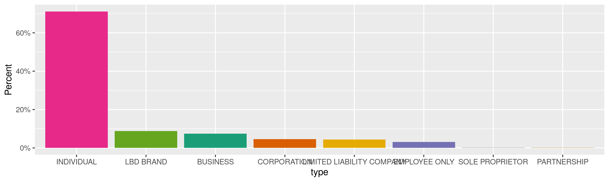
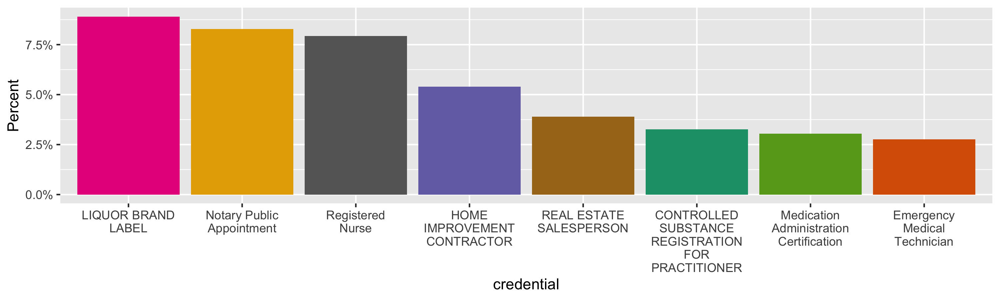
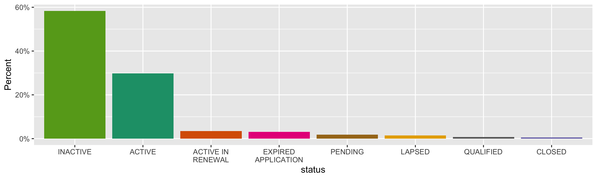
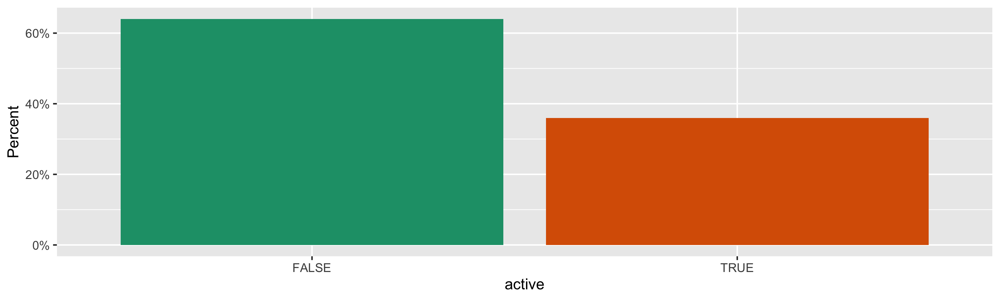
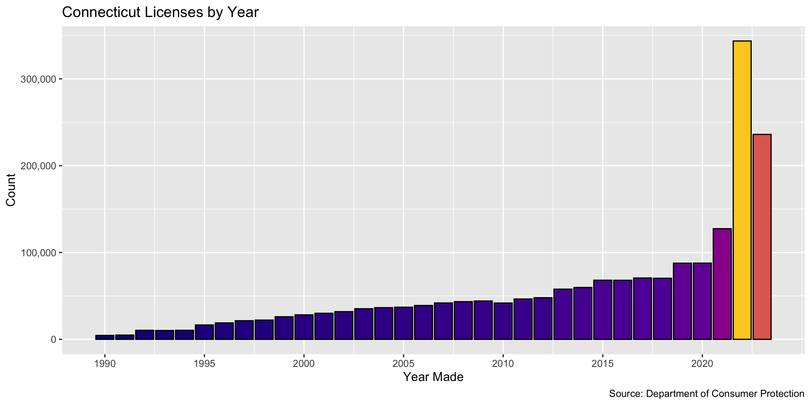
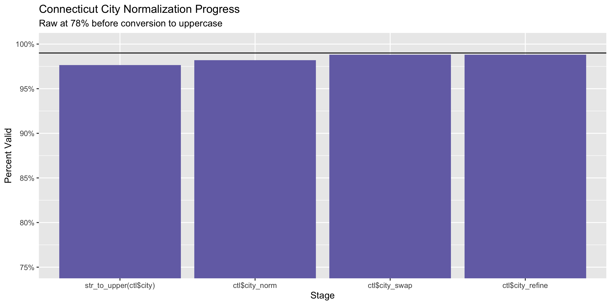
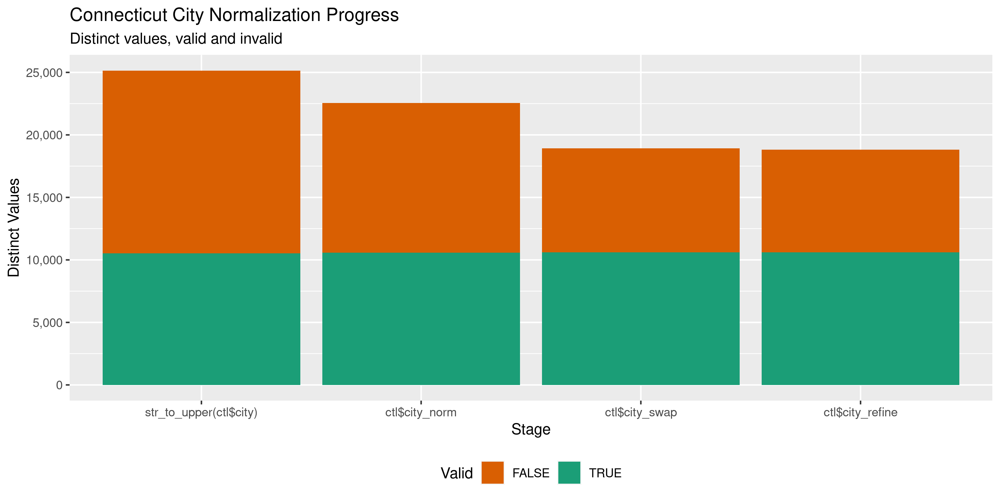

Connecticut Licenses
================
Kiernan Nicholls & Aarushi Sahejpal
Sat Apr 29 17:53:33 2023

- <a href="#project" id="toc-project">Project</a>
- <a href="#objectives" id="toc-objectives">Objectives</a>
- <a href="#packages" id="toc-packages">Packages</a>
- <a href="#source" id="toc-source">Source</a>
- <a href="#download" id="toc-download">Download</a>
- <a href="#read" id="toc-read">Read</a>
- <a href="#explore" id="toc-explore">Explore</a>
  - <a href="#missing" id="toc-missing">Missing</a>
  - <a href="#duplicates" id="toc-duplicates">Duplicates</a>
  - <a href="#categorical" id="toc-categorical">Categorical</a>
  - <a href="#dates" id="toc-dates">Dates</a>
- <a href="#wrangle" id="toc-wrangle">Wrangle</a>
  - <a href="#address" id="toc-address">Address</a>
  - <a href="#zip" id="toc-zip">ZIP</a>
  - <a href="#state" id="toc-state">State</a>
  - <a href="#city" id="toc-city">City</a>
- <a href="#conclude" id="toc-conclude">Conclude</a>
- <a href="#export" id="toc-export">Export</a>
- <a href="#upload" id="toc-upload">Upload</a>

<!-- Place comments regarding knitting here -->

## Project

The Accountability Project is an effort to cut across data silos and
give journalists, policy professionals, activists, and the public at
large a simple way to search across huge volumes of public data about
people and organizations.

Our goal is to standardize public data on a few key fields by thinking
of each dataset row as a transaction. For each transaction there should
be (at least) 3 variables:

1.  All **parties** to a transaction.
2.  The **date** of the transaction.
3.  The **amount** of money involved.

## Objectives

This document describes the process used to complete the following
objectives:

1.  How many records are in the database?
2.  Check for entirely duplicated records.
3.  Check ranges of continuous variables.
4.  Is there anything blank or missing?
5.  Check for consistency issues.
6.  Create a five-digit ZIP Code called `zip`.
7.  Create a `year` field from the transaction date.
8.  Make sure there is data on both parties to a transaction.

## Packages

The following packages are needed to collect, manipulate, visualize,
analyze, and communicate these results. The `pacman` package will
facilitate their installation and attachment.

``` r
if (!require("pacman")) {
  install.packages("pacman")
}
pacman::p_load(
  tidyverse, # data manipulation
  lubridate, # datetime strings
  jsonlite, # read json data
  gluedown, # printing markdown
  janitor, # clean data frames
  campfin, # custom irw tools
  aws.s3, # aws cloud storage
  refinr, # cluster & merge
  scales, # format strings
  knitr, # knit documents
  vroom, # fast reading
  rvest, # scrape html
  glue, # code strings
  here, # project paths
  httr, # http requests
  fs # local storage 
)
```

This diary was run using `campfin` version 1.0.10.9001.

``` r
packageVersion("campfin")
#> [1] '1.0.10.9001'
```

This document should be run as part of the `R_tap` project, which lives
as a sub-directory of the more general, language-agnostic
[`irworkshop/accountability_datacleaning`](https://github.com/irworkshop/accountability_datacleaning)
GitHub repository.

The `R_tap` project uses the [RStudio
projects](https://support.rstudio.com/hc/en-us/articles/200526207-Using-Projects)
feature and should be run as such. The project also uses the dynamic
`here::here()` tool for file paths relative to *your* machine.

``` r
# where does this document knit?
here::i_am("state/ct/licenses/docs/ct_licenses_diary.Rmd")
```

## Source

We can obtain Connecticut licenses data from the state’s [open data
portal](https://data.ct.gov/Business/State-Licenses-and-Credentials/ngch-56tr).
The data is published from the Department of Consumer Protection.

> Licenses and Credentials recorded in Connecticut’s eLicensing system.

The dataset was created on April 23, 2015 and is updated daily.

| position | name                  | dataTypeName  |
|---------:|:----------------------|:--------------|
|        1 | CredentialId          | number        |
|        2 | Name                  | text          |
|        3 | Type                  | text          |
|        4 | BusinessName          | text          |
|        5 | DBA                   | text          |
|        6 | FullCredentialCode    | text          |
|        7 | CredentialType        | text          |
|        8 | CredentialNumber      | text          |
|        9 | CredentialSubCategory | text          |
|       10 | Credential            | text          |
|       11 | Status                | text          |
|       12 | StatusReason          | text          |
|       13 | Active                | number        |
|       14 | IssueDate             | calendar_date |
|       15 | EffectiveDate         | calendar_date |
|       16 | ExpirationDate        | calendar_date |
|       17 | Address               | text          |
|       18 | City                  | text          |
|       19 | State                 | text          |
|       20 | Zip                   | text          |
|       21 | RecordRefreshedOn     | calendar_date |

## Download

``` r
raw_url <- "https://data.ct.gov/api/views/ngch-56tr/rows.tsv"
raw_dir <- dir_create(here("state", "ct", "licenses", "data", "raw"))
raw_csv <- path(raw_dir, basename(raw_url))
```

``` r
if (!file_exists(raw_csv)) {
  GET(
    url = raw_url,
    body = list(accessType = "DOWNLOAD"),
    write_disk(raw_csv),
    progress("down")
  )
}
```

## Read

``` r
ctl <- read_tsv(
  file = raw_csv,
  locale = locale(date_format = "%m/%d/%Y"),
  col_types = cols(
    .default = col_character(),
    Active = col_logical(),
    IssueDate = col_date(),
    EffectiveDate = col_date(),
    ExpirationDate= col_date()
  )
)
```

``` r
ctl <- clean_names(ctl, case = "snake")
```

## Explore

There are 2,260,323 rows of 21 columns. Each record represents a single
license or credential.

``` r
glimpse(ctl)
#> Rows: 2,260,323
#> Columns: 21
#> $ credential_id           <chr> "1000104", "2027327", "2027328", "1000679", "1000791", "1000830", "1002287", "1000202"…
#> $ name                    <chr> "UBALDO J GONZALEZ", "WAYNE CARTER", "SODARA CHAN", "ALISON J LEGERE", "JOHN F MCNELLI…
#> $ type                    <chr> "INDIVIDUAL", "INDIVIDUAL", "INDIVIDUAL", "INDIVIDUAL", "INDIVIDUAL", "INDIVIDUAL", "I…
#> $ business_name           <chr> NA, NA, NA, NA, NA, NA, NA, NA, NA, NA, NA, NA, NA, NA, NA, NA, NA, NA, NA, NA, NA, NA…
#> $ dba                     <chr> NA, NA, NA, NA, NA, NA, NA, NA, NA, NA, NA, NA, NA, NA, NA, NA, NA, NA, NA, NA, NA, NA…
#> $ full_credential_code    <chr> "ELC.0198723-E2", "CASE.0993725", "CASE.0993303", "10.100432", "10.101078", "10.102261…
#> $ credential_type         <chr> "ELC", "CASE", "CASE", "10", "10", "10", "ELC", "HIC", "CASE", "10", "11", "CASE", "PE…
#> $ credential_number       <chr> "198723", "993725", "993303", "100432", "101078", "102261", "198766", "631002", "96297…
#> $ credential_sub_category <chr> "E2", NA, NA, NA, NA, NA, "E2", NA, NA, NA, NA, NA, NA, NA, "S2", "E1", NA, NA, NA, "T…
#> $ credential              <chr> "ELECTRICAL UNLIMITED JOURNEYPERSON", "CASINO CLASS I EMPLOYEE", "CASINO CLASS I EMPLO…
#> $ status                  <chr> "ACTIVE", "ACTIVE", "ACTIVE", "ACTIVE", "ACTIVE", "ACTIVE", "ACTIVE", "ACTIVE", "ACTIV…
#> $ status_reason           <chr> "CURRENT", NA, NA, "CURRENT", "CURRENT", "CURRENT", "CURRENT", "CURRENT", NA, "CURRENT…
#> $ active                  <lgl> TRUE, TRUE, TRUE, TRUE, TRUE, TRUE, TRUE, TRUE, TRUE, TRUE, TRUE, TRUE, TRUE, TRUE, TR…
#> $ issue_date              <date> 2011-05-31, 1995-04-26, 1993-10-19, 2011-06-29, 2011-07-18, 2011-09-15, 2011-06-11, 2…
#> $ effective_date          <date> 2022-10-01, 2022-11-01, 2022-11-01, 2022-10-01, 2022-10-01, 2022-10-01, 2022-10-01, 2…
#> $ expiration_date         <date> 2023-09-30, 2023-10-31, 2023-10-31, 2023-09-30, 2023-09-30, 2023-09-30, 2023-09-30, 2…
#> $ address                 <chr> "105 FIVE FIELDS RD", "62 Canterbury Rd", "58 Kenyon Rd.", "124 Constitution Street, U…
#> $ city                    <chr> "MADISON", "Mystic", "Waterford", "Wallingford", "BRISTOL", "Stratford", "MONROE", "CR…
#> $ state                   <chr> "CT", "CT", "CT", "CT", "CT", "CT", "CT", "CT", "CT", "MA", "CT", "CT", "GA", "CT", "C…
#> $ zip                     <chr> "064432532", "06355", "06385", "06492", "060104946", "06614", "064682835", "064162407"…
#> $ record_refreshed_on     <chr> "09/12/2022", "11/03/2022", "11/03/2022", "09/12/2022", "09/12/2022", "09/12/2022", "0…
tail(ctl)
#> # A tibble: 6 × 21
#>   credential_id name                    type  business_name dba   full_credential_code credential_type credential_number
#>   <chr>         <chr>                   <chr> <chr>         <chr> <chr>                <chr>           <chr>            
#> 1 999558        ACTION REMODELING       PART… ACTION REMOD… <NA>  HIC.0630961          HIC             630961           
#> 2 999584        DEMOLITION PLUS LLC     LIMI… DEMOLITION P… <NA>  HIC.0630967          HIC             630967           
#> 3 999697        ADS CONSTRUCTION CORP   CORP… ADS CONSTRUC… AUTU… HIC.0630975          HIC             630975           
#> 4 999700        COMPLETE CARE MASONRY … LIMI… COMPLETE CAR… <NA>  HIC.0630976          HIC             630976           
#> 5 999738        J FERNANDES HOME IMPRO… LIMI… J FERNANDES … <NA>  HIC.0630980          HIC             630980           
#> 6 999795        VINCENT J MIGNECO       INDI… <NA>          <NA>  PTN.0013413          PTN             13413            
#> # ℹ 13 more variables: credential_sub_category <chr>, credential <chr>, status <chr>, status_reason <chr>,
#> #   active <lgl>, issue_date <date>, effective_date <date>, expiration_date <date>, address <chr>, city <chr>,
#> #   state <chr>, zip <chr>, record_refreshed_on <chr>
```

### Missing

Columns vary in their degree of missing values.

``` r
col_stats(ctl, count_na)
#> # A tibble: 21 × 4
#>    col                     class        n           p
#>    <chr>                   <chr>    <int>       <dbl>
#>  1 credential_id           <chr>        0 0          
#>  2 name                    <chr>       67 0.0000296  
#>  3 type                    <chr>        0 0          
#>  4 business_name           <chr>  1612424 0.713      
#>  5 dba                     <chr>  2099452 0.929      
#>  6 full_credential_code    <chr>        1 0.000000442
#>  7 credential_type         <chr>        0 0          
#>  8 credential_number       <chr>    56636 0.0251     
#>  9 credential_sub_category <chr>  2018177 0.893      
#> 10 credential              <chr>        0 0          
#> 11 status                  <chr>        0 0          
#> 12 status_reason           <chr>   644703 0.285      
#> 13 active                  <lgl>        0 0          
#> 14 issue_date              <date>  510247 0.226      
#> 15 effective_date          <date>  268666 0.119      
#> 16 expiration_date         <date>  304401 0.135      
#> 17 address                 <chr>     8943 0.00396    
#> 18 city                    <chr>     8657 0.00383    
#> 19 state                   <chr>    13380 0.00592    
#> 20 zip                     <chr>    12082 0.00535    
#> 21 record_refreshed_on     <chr>        0 0
```

We can flag any record missing a key variable needed to identify a
transaction.

``` r
ctl <- flag_na(ctl, "name")
sum(ctl$na_flag)
#> [1] 67
```

``` r
ctl %>% 
  filter(na_flag) %>% 
  select(name, credential, effective_date, address)
#> # A tibble: 67 × 4
#>    name  credential             effective_date address                       
#>    <chr> <chr>                  <date>         <chr>                         
#>  1 <NA>  AIRLINE LIQUOR         2011-09-21     BRADLEY INT'L AIRPORT         
#>  2 <NA>  NON LEGEND DRUG PERMIT 2011-08-31     361 NEW PARK AVE              
#>  3 <NA>  LIQUOR BRAND LABEL     2004-02-24     CONNECTICUT BRAND REGISTRATION
#>  4 <NA>  LIQUOR BRAND LABEL     1998-06-22     CONNECTICUT BRAND REGISTRATION
#>  5 <NA>  LIQUOR BRAND LABEL     1997-12-11     CONNECTICUT BRAND REGISTRATION
#>  6 <NA>  LIQUOR BRAND LABEL     2000-08-30     CONNECTICUT BRAND REGISTRATION
#>  7 <NA>  LIQUOR BRAND LABEL     1998-05-14     CONNECTICUT BRAND REGISTRATION
#>  8 <NA>  LIQUOR BRAND LABEL     1998-04-22     CONNECTICUT BRAND REGISTRATION
#>  9 <NA>  LIQUOR BRAND LABEL     2001-02-13     CONNECTICUT BRAND REGISTRATION
#> 10 <NA>  LIQUOR BRAND LABEL     2001-02-05     CONNECTICUT BRAND REGISTRATION
#> # ℹ 57 more rows
```

### Duplicates

We can also flag any record completely duplicated across every column.

``` r
ctl <- flag_dupes(ctl, -credential_id)
sum(ctl$dupe_flag)
#> [1] 218
```

``` r
ctl %>% 
  filter(dupe_flag) %>% 
  select(name, credential, effective_date, address) %>% 
  arrange(effective_date)
#> # A tibble: 218 × 4
#>    name                       credential                                                          effective_date address
#>    <chr>                      <chr>                                                               <date>         <chr>  
#>  1 SONIA V MEHTA              Speech and Language Pathologist Temporary Permit                    2015-02-23     230 MU…
#>  2 SONIA V MEHTA              Speech and Language Pathologist Temporary Permit                    2015-02-23     230 MU…
#>  3 THERESA KING               Medication Administration Certification                             NA             95 Mag…
#>  4 ALICIA A BERG              Hairdresser/Cosmetician                                             NA             30 Wes…
#>  5 ALICIA A BERG              Hairdresser/Cosmetician                                             NA             30 Wes…
#>  6 MARIA GARCIA               Hairdresser/Cosmetician                                             NA             108 Ha…
#>  7 MARIA GARCIA               Hairdresser/Cosmetician                                             NA             108 Ha…
#>  8 WOODSON EUGENE             Emergency Medical Technician                                        NA             173 CO…
#>  9 WOODSON EUGENE             Emergency Medical Technician                                        NA             173 CO…
#> 10 TEXIBRIDPURE T742C19 18241 MEDICAL MARIJUANA  AND ADULT-USE CANNABIS PRODUCER BRAND REGISTRAT… NA             856 Ec…
#> # ℹ 208 more rows
```

Almost all “duplicate” licenses are missing an `effective_date`,
indicating they could just be repeat submissions.

``` r
prop_na(ctl$effective_date[ctl$dupe_flag])
#> [1] 0.9908257
```

### Categorical

``` r
col_stats(ctl, n_distinct)
#> # A tibble: 23 × 4
#>    col                     class        n           p
#>    <chr>                   <chr>    <int>       <dbl>
#>  1 credential_id           <chr>  2260323 1          
#>  2 name                    <chr>  1677973 0.742      
#>  3 type                    <chr>       22 0.00000973 
#>  4 business_name           <chr>   473490 0.209      
#>  5 dba                     <chr>   107748 0.0477     
#>  6 full_credential_code    <chr>  2203001 0.975      
#>  7 credential_type         <chr>      483 0.000214   
#>  8 credential_number       <chr>   702850 0.311      
#>  9 credential_sub_category <chr>      176 0.0000779  
#> 10 credential              <chr>      607 0.000269   
#> 11 status                  <chr>       19 0.00000841 
#> 12 status_reason           <chr>      253 0.000112   
#> 13 active                  <lgl>        2 0.000000885
#> 14 issue_date              <date>   26889 0.0119     
#> 15 effective_date          <date>   19320 0.00855    
#> 16 expiration_date         <date>   13432 0.00594    
#> 17 address                 <chr>  1194281 0.528      
#> 18 city                    <chr>    35107 0.0155     
#> 19 state                   <chr>      146 0.0000646  
#> 20 zip                     <chr>   352515 0.156      
#> 21 record_refreshed_on     <chr>     5883 0.00260    
#> 22 na_flag                 <lgl>        2 0.000000885
#> 23 dupe_flag               <lgl>        2 0.000000885
```

<!-- --><!-- --><!-- --><!-- -->

### Dates

``` r
min(ctl$effective_date, na.rm = TRUE)
#> [1] "1800-12-27"
max(ctl$effective_date, na.rm = TRUE)
#> [1] "2024-02-01"
```

There are many licenses with an `effective_date` of December 27, 1800.
This is most likely a default or minimum date, perhaps one entered for
those with existing licenses when the system was created.

``` r
sum(ctl$effective_date == "1800-12-27", na.rm = TRUE)
#> [1] 1092
```

We will make these dates invalid entries.

``` r
ctl$effective_date[ctl$effective_date < "1900-01-01"] <- NA
```

We can add the calendar year from `date` with `lubridate::year()`

``` r
ctl <- mutate(ctl, effective_year = year(effective_date))
```

<!-- -->

## Wrangle

To improve the searchability of the database, we will perform some
consistent, confident string normalization. For geographic variables
like city names and ZIP codes, the corresponding `campfin::normal_*()`
functions are tailor made to facilitate this process.

### Address

For the street `addresss` variable, the `campfin::normal_address()`
function will force consistence case, remove punctuation, and abbreviate
official USPS suffixes.

``` r
addr_norm <- ctl %>% 
  distinct(address) %>% 
  mutate(
    address_norm = normal_address(
      address = address,
      abbs = usps_street,
      na_rep = TRUE
    )
  )
```

``` r
addr_norm
#> # A tibble: 1,194,281 × 2
#>    address                           address_norm                    
#>    <chr>                             <chr>                           
#>  1 105 FIVE FIELDS RD                105 FIVE FIELDS RD              
#>  2 62 Canterbury Rd                  62 CANTERBURY RD                
#>  3 58 Kenyon Rd.                     58 KENYON RD                    
#>  4 124 Constitution Street, Unit #13 124 CONSTITUTION STREET UNIT #13
#>  5 195 Indian Trail                  195 INDIAN TRL                  
#>  6 80 Peacock Drive                  80 PEACOCK DR                   
#>  7 30 FOX RUN                        30 FOX RUN                      
#>  8 18 HICKSVILLE RD                  18 HICKSVILLE RD                
#>  9 122 SULLIVAN RD.                  122 SULLIVAN RD                 
#> 10 145 Barber st                     145 BARBER ST                   
#> # ℹ 1,194,271 more rows
```

``` r
ctl <- left_join(ctl, addr_norm, by = "address")
```

### ZIP

For ZIP codes, the `campfin::normal_zip()` function will attempt to
create valid *five* digit codes by removing the ZIP+4 suffix and
returning leading zeroes dropped by other programs like Microsoft Excel.

``` r
ctl <- ctl %>% 
  mutate(
    zip_norm = normal_zip(
      zip = zip,
      na_rep = TRUE
    )
  )
```

``` r
progress_table(
  ctl$zip,
  ctl$zip_norm,
  compare = valid_zip
)
#> # A tibble: 2 × 6
#>   stage        prop_in n_distinct prop_na  n_out n_diff
#>   <chr>          <dbl>      <dbl>   <dbl>  <dbl>  <dbl>
#> 1 ctl$zip        0.607     352515 0.00535 882464 334455
#> 2 ctl$zip_norm   0.988      26092 0.00597  27042   4200
```

### State

All of the invalid `state` values seem to be foreign with a `zip` code
value not matching any US code with a similar corresponding state.

``` r
ctl |> 
  filter(state %out% valid_state) |> 
  count(state_raw = state, zip_norm, sort = TRUE) |> 
  add_prop(sum = TRUE) |> 
  left_join(
    y = zipcodes,
    by = c("zip_norm" = "zip")
  )
#> # A tibble: 5,849 × 6
#>    state_raw zip_norm     n     p city     state
#>    <chr>     <chr>    <int> <dbl> <chr>    <chr>
#>  1 <NA>      <NA>      7645 0.339 <NA>     <NA> 
#>  2 PH        1634       374 0.355 <NA>     <NA> 
#>  3 CH        <NA>       290 0.368 <NA>     <NA> 
#>  4 OC        <NA>       166 0.375 <NA>     <NA> 
#>  5 PH        1605       118 0.381 <NA>     <NA> 
#>  6 VN        <NA>       110 0.386 <NA>     <NA> 
#>  7 I2        20130       95 0.390 PARIS    VA   
#>  8 CY        <NA>        93 0.394 <NA>     <NA> 
#>  9 <NA>      010         90 0.398 <NA>     <NA> 
#> 10 I2        13210       81 0.402 SYRACUSE NY   
#> # ℹ 5,839 more rows
```

### City

Cities are the most difficult geographic variable to normalize, simply
due to the wide variety of valid cities and formats.

#### Normal

The `campfin::normal_city()` function is a good start, again converting
case, removing punctuation, but *expanding* USPS abbreviations. We can
also remove `invalid_city` values.

``` r
norm_city <- ctl %>% 
  distinct(city, state, zip_norm) %>% 
  mutate(
    city_norm = normal_city(
      city = city, 
      abbs = usps_city,
      states = c("CT", "DC", "CONNECTICUT"),
      na = invalid_city,
      na_rep = TRUE
    )
  )
```

#### Swap

We can further improve normalization by comparing our normalized value
against the *expected* value for that record’s state abbreviation and
ZIP code. If the normalized value is either an abbreviation for or very
similar to the expected value, we can confidently swap those two.

``` r
norm_city <- norm_city %>% 
  rename(city_raw = city) %>% 
  left_join(
    y = zipcodes,
    by = c(
      "state" = "state",
      "zip_norm" = "zip"
    )
  ) %>% 
  rename(city_match = city) %>% 
  mutate(
    match_abb = is_abbrev(city_norm, city_match),
    match_dist = str_dist(city_norm, city_match),
    city_swap = if_else(
      condition = !is.na(match_dist) & (match_abb | match_dist == 1),
      true = city_match,
      false = city_norm
    )
  ) %>% 
  select(
    -city_match,
    -match_dist,
    -match_abb
  )
```

``` r
ctl <- left_join(
  x = ctl,
  y = norm_city,
  by = c(
    "city" = "city_raw", 
    "state", 
    "zip_norm"
  )
)
```

#### Refine

The [OpenRefine](https://openrefine.org/) algorithms can be used to
group similar strings and replace the less common versions with their
most common counterpart. This can greatly reduce inconsistency, but with
low confidence; we will only keep any refined strings that have a valid
city/state/zip combination.

``` r
good_refine <- ctl %>% 
  mutate(
    city_refine = city_swap %>% 
      key_collision_merge() %>% 
      n_gram_merge(numgram = 1)
  ) %>% 
  filter(city_refine != city_swap) %>% 
  inner_join(
    y = zipcodes,
    by = c(
      "city_refine" = "city",
      "state" = "state",
      "zip_norm" = "zip"
    )
  )
```

    #> # A tibble: 131 × 5
    #>    state zip_norm city_swap        city_refine       n
    #>    <chr> <chr>    <chr>            <chr>         <int>
    #>  1 WV    25303    SO CHARLESTON    CHARLESTON       56
    #>  2 NY    11733    SETAUKET         EAST SETAUKET    47
    #>  3 IL    60606    CHIGACO          CHICAGO          18
    #>  4 MA    01060    NORTH HAMPTON    NORTHAMPTON      16
    #>  5 SC    29406    NORTH CHARLESTON CHARLESTON       13
    #>  6 CT    06081    TARRIFVILLE      TARIFFVILLE       9
    #>  7 RI    02904    NO PROVIDENCE    PROVIDENCE        7
    #>  8 MA    01073    SOUTH HAMPTON    SOUTHAMPTON       6
    #>  9 CA    92879    CORONA CA        CORONA            5
    #> 10 CA    92673    SAN CELMNENTE    SAN CLEMENTE      4
    #> # ℹ 121 more rows

Then we can join the refined values back to the database.

``` r
ctl <- ctl %>% 
  left_join(good_refine, by = names(.)) %>% 
  mutate(city_refine = coalesce(city_refine, city_swap))
```

#### Progress

Our goal for normalization was to increase the proportion of city values
known to be valid and reduce the total distinct values by correcting
misspellings.

| stage                    | prop_in | n_distinct | prop_na | n_out | n_diff |
|:-------------------------|--------:|-----------:|--------:|------:|-------:|
| `str_to_upper(ctl$city)` |   0.976 |      25932 |   0.004 | 53105 |  15190 |
| `ctl$city_norm`          |   0.982 |      23232 |   0.004 | 40503 |  12452 |
| `ctl$city_swap`          |   0.988 |      19518 |   0.004 | 27053 |   8705 |
| `ctl$city_refine`        |   0.988 |      19407 |   0.004 | 26750 |   8594 |

You can see how the percentage of valid values increased with each
stage.

<!-- -->

More importantly, the number of distinct values decreased each stage. We
were able to confidently change many distinct invalid values to their
valid equivalent.

<!-- -->

Before exporting, we can remove the intermediary normalization columns
and rename all added variables with the `_clean` suffix.

``` r
ctl <- ctl %>% 
  select(
    -city_norm,
    -city_swap,
    city_clean = city_refine
  ) %>% 
  rename_all(~str_replace(., "_norm", "_clean")) %>% 
  rename_all(~str_remove(., "_raw")) %>% 
  relocate(address_clean, city_clean, .before = zip_clean)
```

## Conclude

``` r
glimpse(sample_n(ctl, 1000))
#> Rows: 1,000
#> Columns: 27
#> $ credential_id           <chr> "1093128", "1688285", "848890", "1146986", "2065949", "653432", "339999", "305664", "5…
#> $ name                    <chr> "JONATHAN HIRSCHFELD", "SIERRA N BOMBARD", "JILL M BAUER", "CHATEAU BEAUSEJOUR SAINT E…
#> $ type                    <chr> "INDIVIDUAL", "INDIVIDUAL", "INDIVIDUAL", "LBD BRAND", "INDIVIDUAL", "INDIVIDUAL", "IN…
#> $ business_name           <chr> NA, NA, NA, "CHATEAU BEAUSEJOUR SAINT EMILION GRAND CRU", NA, NA, NA, "A L S CONTRACTI…
#> $ dba                     <chr> NA, NA, NA, NA, NA, NA, "NEW ENGLAND CLASSICS", NA, NA, NA, NA, NA, NA, NA, NA, NA, NA…
#> $ full_credential_code    <chr> "CPAL.0012429", "RES.0813730", "70.009157", "LBD.0098521", "NLT.0001120", "10.R53688",…
#> $ credential_type         <chr> "CPAL", "RES", "70", "LBD", "NLT", "10", "HIC", "NHC", "10", "ARI", "SNPC", "IMP", "HI…
#> $ credential_number       <chr> "12429", "813730", "9157", "98521", "1120", "R53688", "579847", "3798", "69852", "3972…
#> $ credential_sub_category <chr> NA, NA, NA, NA, NA, NA, NA, NA, NA, NA, NA, NA, NA, NA, NA, NA, NA, NA, "TEMP", "RES",…
#> $ credential              <chr> "CERTIFIED PUBLIC ACCOUNTANT LICENSE", "REAL ESTATE SALESPERSON", "Emergency Medical T…
#> $ status                  <chr> "INACTIVE", "INACTIVE", "ACTIVE", "INACTIVE", "ACTIVE", "INACTIVE", "INACTIVE", "INACT…
#> $ status_reason           <chr> "VOLUNTARY NON-RENEWAL", "LACK OF SPONSORSHIP", "CURRENT", NA, "CURRENT", "LAPSED DUE …
#> $ active                  <lgl> FALSE, FALSE, TRUE, FALSE, TRUE, FALSE, FALSE, FALSE, TRUE, TRUE, FALSE, TRUE, FALSE, …
#> $ issue_date              <date> 2005-03-11, 2019-11-19, 2008-01-14, 2013-01-25, 2020-09-04, 1997-01-17, 2006-03-21, N…
#> $ effective_date          <date> 2008-01-01, 2021-06-25, 2022-01-01, 2013-01-25, 2022-05-01, NA, 2010-12-10, 2005-10-0…
#> $ expiration_date         <date> 2008-12-31, 2022-05-31, 2023-12-31, 2016-01-24, 2024-04-30, 1997-05-31, 2011-11-30, 2…
#> $ address                 <chr> "6 QUAIL RUN", "17 HARTFORD TURNPIKE", "1 Church Street", "CONNECTICUT BRAND REGISTRAT…
#> $ city                    <chr> "RANDOLPH", "TOLLAND", "STONINGTON", "HARTFORD", "DANBURY", "WHIPPANY", "CANTON", "DAN…
#> $ state                   <chr> "NJ", "CT", "CT", "CT", "CT", "NJ", "CT", "CT", "CA", "CT", "CT", "WI", "CT", "CT", "C…
#> $ zip                     <chr> "07869", "06084", "06378", "06106", "068108195", "07981", "060192042", "06810", "93611…
#> $ record_refreshed_on     <chr> "08/02/2012", "06/28/2021", "07/19/2021", "06/13/2017", "06/09/2022", "07/08/2009", "0…
#> $ na_flag                 <lgl> FALSE, FALSE, FALSE, FALSE, FALSE, FALSE, FALSE, FALSE, FALSE, FALSE, FALSE, FALSE, FA…
#> $ dupe_flag               <lgl> FALSE, FALSE, FALSE, FALSE, FALSE, FALSE, FALSE, FALSE, FALSE, FALSE, FALSE, FALSE, FA…
#> $ effective_year          <dbl> 2008, 2021, 2022, 2013, 2022, NA, 2010, 2005, 2022, 2022, 1999, 2023, 2009, 2018, 2020…
#> $ address_clean           <chr> "6 QUAIL RUN", "17 HARTFORD TPKE", "1 CHURCH ST", "CONNECTICUT BRAND REGISTRATION", "0…
#> $ city_clean              <chr> "RANDOLPH", "TOLLAND", "STONINGTON", "HARTFORD", "DANBURY", "WHIPPANY", "CANTON", "DAN…
#> $ zip_clean               <chr> "07869", "06084", "06378", "06106", "06810", "07981", "06019", "06810", "93611", "0646…
```

1.  There are 2,260,323 records in the database.
2.  There are 218 duplicate records in the database.
3.  The range and distribution of `amount` and `date` seem reasonable.
4.  There are 67 records missing key variables.
5.  Consistency in geographic data has been improved with
    `campfin::normal_*()`.
6.  The 4-digit `year` variable has been created with
    `lubridate::year()`.

## Export

Now the file can be saved on disk for upload to the Accountability
server. We will name the object using a date range of the records
included.

``` r
clean_dir <- dir_create(here("state", "ct", "licenses", "data", "clean"))
clean_csv <- path(clean_dir, glue("ct_licenses_19900101-20220505.csv"))
clean_rds <- path_ext_set(clean_csv, "rds")
basename(clean_csv)
#> [1] "ct_licenses_19900101-20220505.csv"
```

``` r
write_csv(ctl, clean_csv, na = "")
write_rds(ctl, clean_rds, compress = "xz")
(clean_size <- file_size(clean_csv))
#> 551M
```

## Upload

We can use the `aws.s3::put_object()` to upload the text file to the IRW
server.

``` r
aws_key <- path("csv", basename(clean_csv))
if (!object_exists(aws_key, "publicaccountability")) {
  put_object(
    file = clean_csv,
    object = aws_key, 
    bucket = "publicaccountability",
    acl = "public-read",
    show_progress = TRUE,
    multipart = TRUE
  )
}
aws_head <- head_object(aws_key, "publicaccountability")
(aws_size <- as_fs_bytes(attr(aws_head, "content-length")))
unname(aws_size == clean_size)
```
