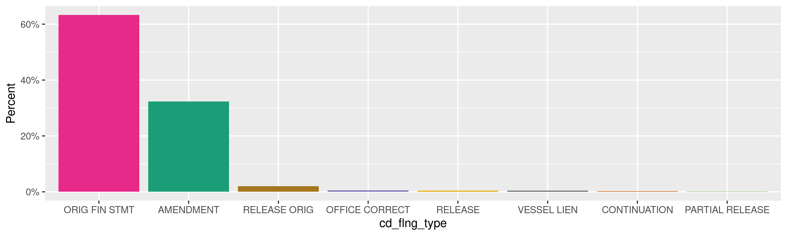
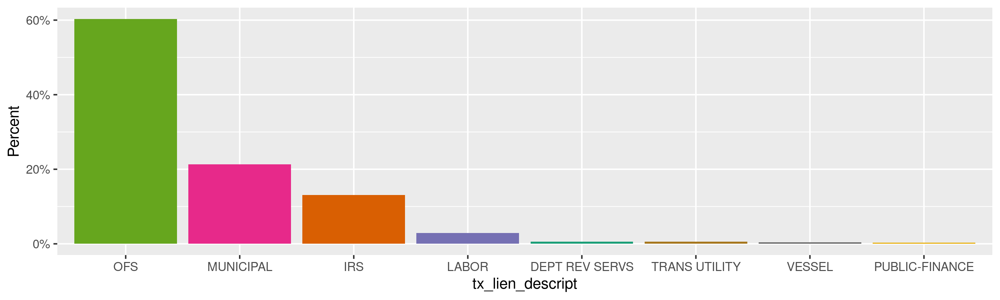
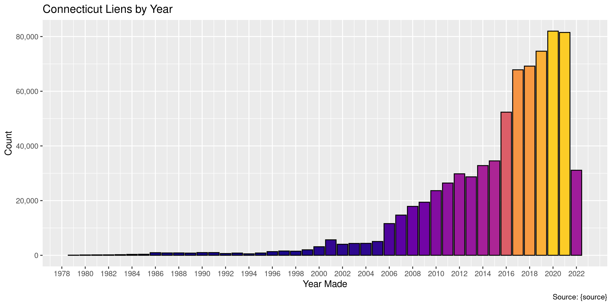
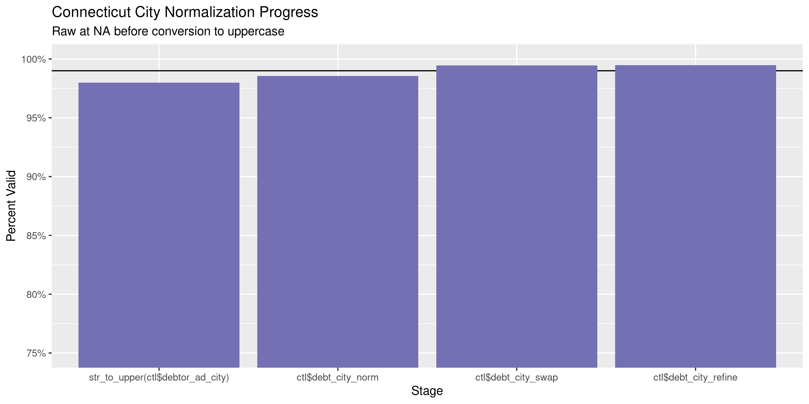
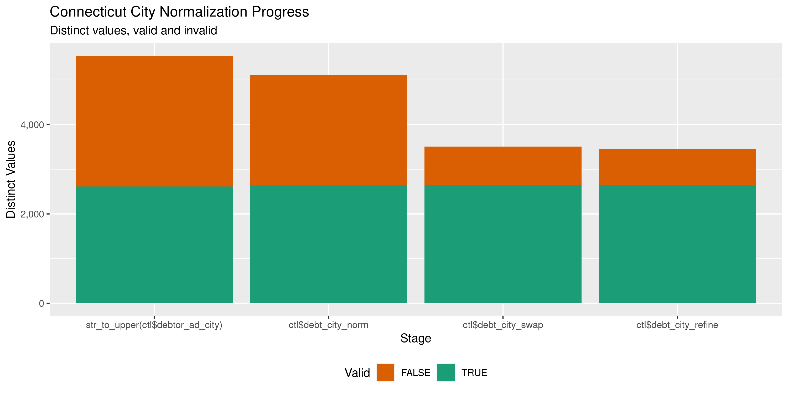

Connecticut Liens
================
Kiernan Nicholls
Tue May 10 11:00:25 2022

-   <a href="#project" id="toc-project">Project</a>
-   <a href="#objectives" id="toc-objectives">Objectives</a>
-   <a href="#packages" id="toc-packages">Packages</a>
-   <a href="#source" id="toc-source">Source</a>
-   <a href="#download" id="toc-download">Download</a>
-   <a href="#read" id="toc-read">Read</a>
-   <a href="#explore" id="toc-explore">Explore</a>
    -   <a href="#missing" id="toc-missing">Missing</a>
    -   <a href="#duplicates" id="toc-duplicates">Duplicates</a>
    -   <a href="#categorical" id="toc-categorical">Categorical</a>
    -   <a href="#dates" id="toc-dates">Dates</a>
-   <a href="#wrangle" id="toc-wrangle">Wrangle</a>
    -   <a href="#address" id="toc-address">Address</a>
    -   <a href="#zip" id="toc-zip">ZIP</a>
    -   <a href="#state" id="toc-state">State</a>
    -   <a href="#city" id="toc-city">City</a>
-   <a href="#conclude" id="toc-conclude">Conclude</a>
-   <a href="#export" id="toc-export">Export</a>
-   <a href="#upload" id="toc-upload">Upload</a>

<!-- Place comments regarding knitting here -->

## Project

The Accountability Project is an effort to cut across data silos and
give journalists, policy professionals, activists, and the public at
large a simple way to search across huge volumes of public data about
people and organizations.

Our goal is to standardize public data on a few key fields by thinking
of each dataset row as a transaction. For each transaction there should
be (at least) 3 variables:

1.  All **parties** to a transaction.
2.  The **date** of the transaction.
3.  The **amount** of money involved.

## Objectives

This document describes the process used to complete the following
objectives:

1.  How many records are in the database?
2.  Check for entirely duplicated records.
3.  Check ranges of continuous variables.
4.  Is there anything blank or missing?
5.  Check for consistency issues.
6.  Create a five-digit ZIP Code called `zip`.
7.  Create a `year` field from the transaction date.
8.  Make sure there is data on both parties to a transaction.

## Packages

The following packages are needed to collect, manipulate, visualize,
analyze, and communicate these results. The `pacman` package will
facilitate their installation and attachment.

``` r
if (!require("pacman")) {
  install.packages("pacman")
}
pacman::p_load(
  tidyverse, # data manipulation
  lubridate, # datetime strings
  jsonlite, # read json data
  gluedown, # printing markdown
  janitor, # clean data frames
  campfin, # custom irw tools
  aws.s3, # aws cloud storage
  refinr, # cluster & merge
  scales, # format strings
  knitr, # knit documents
  vroom, # fast reading
  rvest, # scrape html
  glue, # code strings
  here, # project paths
  httr, # http requests
  fs # local storage 
)
```

This diary was run using `campfin` version 1.0.8.9300.

``` r
packageVersion("campfin")
#> [1] '1.0.8.9300'
```

This document should be run as part of the `R_tap` project, which lives
as a sub-directory of the more general, language-agnostic
[`irworkshop/accountability_datacleaning`](https://github.com/irworkshop/accountability_datacleaning)
GitHub repository.

The `R_tap` project uses the [RStudio
projects](https://support.rstudio.com/hc/en-us/articles/200526207-Using-Projects)
feature and should be run as such. The project also uses the dynamic
`here::here()` tool for file paths relative to *your* machine.

``` r
# where does this document knit?
here::i_am("state/ct/liens/docs/ct_liens_diary.Rmd")
```

## Source

The data on liens filings in Connecticut comes from the state open data
portal in the dataset [Uniform Commercial Code (UCC) Lien
Filings](https://data.ct.gov/Business/Uniform-Commercial-Code-UCC-Lien-Filings-4-0-Revis/xfev-8smz)
(version 4.0 and revised July 2021).

> This dataset contains liens filed with the Business Services Division
> of the Office of the Secretary of the State. Most liens are filed
> under the Uniform Commercial Code, but the dataset also contains
> vessel and aircraft liens, and liens filed by the Internal Revenue
> Service, the Connecticut Department of Labor, and municipalities.
>
> The dataset only contains liens that are active (e.g., not lapsed) or
> that are less than one year past their natural lapse date.
>
> Note that liens showing a lapse date of December 31, 9999 have no
> lapse date and are effective until released/terminated. These liens
> will remain on the data set for one year following
> termination/release.

The dataset was created on March 11, 2020 and is updated daily.

| position | fieldName          | name                           | dataTypeName  |
|---------:|:-------------------|:-------------------------------|:--------------|
|        1 | id_lien_flng_nbr   | Original Filing No.            | text          |
|        2 | id_ucc_flng_nbr    | Subsequent Filing No.          | text          |
|        3 | lien_status        | Lien Status                    | text          |
|        4 | cd_flng_type       | Filing Type                    | text          |
|        6 | tx_lien_descript   | Lien Type                      | text          |
|        7 | debtor_nm_last     | Debtor Last Name               | text          |
|        8 | debtor_nm_suff     | Debtor Name Suffix             | text          |
|        9 | debtor_nm_pref     | Debtor Name Prefix             | text          |
|       10 | debtor_nm_first    | Debtor First Name              | text          |
|       11 | debtor_nm_mid      | Debtor Middle Name             | text          |
|       12 | debtor_nm_bus      | Debtor Business Name           | text          |
|       13 | debtor_ad_str1     | Debtor Street Address 1        | text          |
|       14 | debtor_ad_str2     | Debtor Street Address 2        | text          |
|       15 | debtor_ad_city     | Debtor City                    | text          |
|       16 | debtor_ad_state    | Debtor State                   | text          |
|       17 | debtor_ad_zip      | Debtor Zip                     | text          |
|       18 | sec_party_nm_last  | Secured Party Last Name        | text          |
|       19 | sec_party_nm_suff  | Secured Party Name Suffix      | text          |
|       20 | sec_party_nm_pref  | Secured Party Name Prefix      | text          |
|       21 | sec_party_nm_first | Secured Party First Name       | text          |
|       22 | sec_party_nm_mid   | Secured Party Middle Name      | text          |
|       23 | sec_party_nm_bus   | Secured Party Business Name    | text          |
|       24 | sec_party_ad_str1  | Secured Party Street Address 1 | text          |
|       25 | sec_party_ad_str2  | Secured Party Street Address 2 | text          |
|       26 | sec_party_ad_city  | Secured Party City             | text          |
|       27 | sec_party_ad_state | Secured Party State            | text          |
|       28 | sec_party_ad_zip   | Secured Party Zip              | text          |
|       29 | dt_lapse           | Lapse Date                     | calendar_date |
|       30 | dt_accept          | Filing Date                    | calendar_date |
|       32 | cd_volume          | Record Volume                  | number        |
|       33 | cd_start_page      | Start Page                     | number        |
|       34 | qt_pages           | No. Pages                      | number        |

## Download

``` r
raw_url <- "https://data.ct.gov/api/views/xfev-8smz/rows.tsv"
raw_dir <- dir_create(here("state", "ct", "liens", "data", "raw"))
raw_csv <- path(raw_dir, basename(raw_url))
```

``` r
if (!file_exists(raw_csv)) {
  GET(
    url = raw_url,
    body = list(accessType = "DOWNLOAD"),
    write_disk(raw_csv),
    progress("down")
  )
}
```

## Read

``` r
ctl <- read_delim(
  file = raw_csv,
  delim = "\t",
  locale = locale(date_format = "%m/%d/%Y"),
  escape_backslash = FALSE,
  escape_double = FALSE,
  col_names = about$columns$fieldName,
  skip = 1,
  col_types = cols(
    .default = col_character(),
    dt_lapse = col_date(),
    dt_accept = col_date()
  )
)
```

## Explore

There are 740,973 rows of 32 columns. Each record represents a single
lien filed with the Secretary of State.

``` r
glimpse(ctl)
#> Rows: 740,973
#> Columns: 32
#> $ id_lien_flng_nbr   <chr> "0003388083", "0003252371", "0003387996", "0002940450", "0003388022", "0003387804", "000338…
#> $ id_ucc_flng_nbr    <chr> "0003388083", "0003387758", "0003387996", "0003386364", "0003388022", "0003387804", "000338…
#> $ lien_status        <chr> "Active", "Active", "Active", "Active", "Active", "Active", "Active", "Active", "Active", "…
#> $ cd_flng_type       <chr> "ORIG FIN STMT", "AMENDMENT", "ORIG FIN STMT", "AMENDMENT", "ORIG FIN STMT", "ORIG FIN STMT…
#> $ tx_lien_descript   <chr> "OFS", "OFS", "OFS", "OFS", "OFS", "OFS", "OFS", "OFS", "OFS", "OFS", "OFS", "OFS", "OFS", …
#> $ debtor_nm_last     <chr> NA, "ROWLEY", NA, NA, NA, "PYLYPYSZYM", "DYCE", NA, NA, NA, "NICHOLS", NA, NA, NA, NA, NA, …
#> $ debtor_nm_suff     <chr> NA, NA, NA, NA, NA, NA, NA, NA, NA, NA, NA, NA, NA, NA, NA, NA, NA, NA, NA, NA, NA, NA, NA,…
#> $ debtor_nm_pref     <chr> NA, NA, NA, NA, NA, NA, NA, NA, NA, NA, NA, NA, NA, NA, NA, NA, NA, NA, NA, NA, NA, NA, NA,…
#> $ debtor_nm_first    <chr> NA, "MONIQUE", NA, NA, NA, "PAUL", "KERRY ANN", NA, NA, NA, "LEAH", NA, NA, NA, NA, NA, "WI…
#> $ debtor_nm_mid      <chr> NA, "ANN", NA, NA, NA, "MICHAEL", NA, NA, NA, NA, NA, NA, NA, NA, NA, NA, NA, "R", NA, NA, …
#> $ debtor_nm_bus      <chr> "NUTRIPLEDGE,LLC", NA, "SHREE YAMUNAJI LLC", "DANBURY PET SUPPLY, INC.", "CRYSTAL HANGER, I…
#> $ debtor_ad_str1     <chr> "175 CAPITAL BLVD.", "161 PUMPKIN HILL ROAD", "244 ALLEN STREET", "67 NEWTOWN ROAD", "852 B…
#> $ debtor_ad_str2     <chr> NA, NA, NA, NA, NA, NA, NA, NA, NA, NA, NA, NA, NA, NA, NA, NA, NA, NA, NA, NA, NA, NA, NA,…
#> $ debtor_ad_city     <chr> "ROCKY HILL", "ASHFORD", "NEW BRITAIN", "DANBURY", "GUILFORD", "NEWINGTON", "HAMDEN", "STAM…
#> $ debtor_ad_state    <chr> "CT", "CT", "CT", "CT", "CT", "CT", "CT", "CT", "CT", "CT", "CT", "CT", "CT", "CT", "CT", "…
#> $ debtor_ad_zip      <chr> "06067", "06278", "06053", "06810", "06437", "06111", "06514", "06907", "06793", "06853", "…
#> $ sec_party_nm_last  <chr> NA, NA, NA, NA, NA, NA, NA, NA, NA, NA, NA, NA, NA, NA, NA, NA, NA, NA, NA, NA, NA, NA, NA,…
#> $ sec_party_nm_suff  <chr> NA, NA, NA, NA, NA, NA, NA, NA, NA, NA, NA, NA, NA, NA, NA, NA, NA, NA, NA, NA, NA, NA, NA,…
#> $ sec_party_nm_pref  <chr> NA, NA, NA, NA, NA, NA, NA, NA, NA, NA, NA, NA, NA, NA, NA, NA, NA, NA, NA, NA, NA, NA, NA,…
#> $ sec_party_nm_first <chr> NA, NA, NA, NA, NA, NA, NA, NA, NA, NA, NA, NA, NA, NA, NA, NA, NA, NA, NA, NA, NA, NA, NA,…
#> $ sec_party_nm_mid   <chr> NA, NA, NA, NA, NA, NA, NA, NA, NA, NA, NA, NA, NA, NA, NA, NA, NA, NA, NA, NA, NA, NA, NA,…
#> $ sec_party_nm_bus   <chr> "U.S. SMALL BUSINESS ADMINISTRATION", "KUBOTA CREDIT CORPORATION, U.S.A.", "U.S. SMALL BUSI…
#> $ sec_party_ad_str1  <chr> "2 NORTH STREET, SUITE 320", "PO BOX 2046", "2 NORTH STREET, SUITE 320", "71 OLD BELDEN HIL…
#> $ sec_party_ad_str2  <chr> NA, NA, NA, NA, NA, NA, NA, NA, NA, NA, NA, NA, NA, NA, NA, NA, NA, NA, NA, NA, NA, NA, NA,…
#> $ sec_party_ad_city  <chr> "BIRMINGHAM", "GRAPEVINE", "BIRMINGHAM", "WILTON", "BIRMINGHAM", "JOHNSTON", "BRIDGEPORT", …
#> $ sec_party_ad_state <chr> "AL", "TX", "AL", "CT", "AL", "IA", "CT", "AL", "CT", "AL", "AL", "AL", "CT", "AL", "AL", "…
#> $ sec_party_ad_zip   <chr> "35203", "76099", "35203", "06897", "35203", "50131", "06606", "35203", "06068", "35203", "…
#> $ dt_lapse           <date> 2025-07-09, 2023-06-26, 2025-07-09, 2023-05-30, 2025-07-09, 2025-07-09, 2025-07-09, 2025-0…
#> $ dt_accept          <date> 2020-07-09, 2020-07-09, 2020-07-09, 2020-06-26, 2020-07-09, 2020-07-09, 2020-07-09, 2020-0…
#> $ cd_volume          <chr> "176", "175", "175", "700", "175", "175", "175", "176", "175", "175", "175", "175", "175", …
#> $ cd_start_page      <chr> "91", "1714", "2130", "1174", "2208", "1775", "1911", "40", "1866", "2244", "2217", "2172",…
#> $ qt_pages           <chr> "3", "1", "3", "1", "3", "3", "3", "3", "3", "3", "3", "3", "3", "3", "3", "3", "3", "3", "…
tail(ctl)
#> # A tibble: 6 × 32
#>   id_lien_flng_nbr id_ucc_flng_nbr lien_status cd_flng_type  tx_lien_descript debtor_nm_last debtor_nm_suff
#>   <chr>            <chr>           <chr>       <chr>         <chr>            <chr>          <chr>         
#> 1 0005009237       0005009237      Active      ORIG FIN STMT OFS              KANG           <NA>          
#> 2 0003372317       0005009262      Active      AMENDMENT     OFS              <NA>           <NA>          
#> 3 0002844794       0003140055      Active      AMENDMENT     OFS              <NA>           <NA>          
#> 4 0003141670       0003141670      Active      ORIG FIN STMT OFS              <NA>           <NA>          
#> 5 0003138512       0003138512      Active      ORIG FIN STMT OFS              <NA>           <NA>          
#> 6 0003304375       0005009299      Released    RELEASE       IRS              ALEX RIVERA    <NA>          
#> # … with 25 more variables: debtor_nm_pref <chr>, debtor_nm_first <chr>, debtor_nm_mid <chr>, debtor_nm_bus <chr>,
#> #   debtor_ad_str1 <chr>, debtor_ad_str2 <chr>, debtor_ad_city <chr>, debtor_ad_state <chr>, debtor_ad_zip <chr>,
#> #   sec_party_nm_last <chr>, sec_party_nm_suff <chr>, sec_party_nm_pref <chr>, sec_party_nm_first <chr>,
#> #   sec_party_nm_mid <chr>, sec_party_nm_bus <chr>, sec_party_ad_str1 <chr>, sec_party_ad_str2 <chr>,
#> #   sec_party_ad_city <chr>, sec_party_ad_state <chr>, sec_party_ad_zip <chr>, dt_lapse <date>, dt_accept <date>,
#> #   cd_volume <chr>, cd_start_page <chr>, qt_pages <chr>
```

### Missing

Columns vary in their degree of missing values.

``` r
col_stats(ctl, count_na)
#> # A tibble: 32 × 4
#>    col                class       n          p
#>    <chr>              <chr>   <int>      <dbl>
#>  1 id_lien_flng_nbr   <chr>       8 0.0000108 
#>  2 id_ucc_flng_nbr    <chr>       0 0         
#>  3 lien_status        <chr>       0 0         
#>  4 cd_flng_type       <chr>       6 0.00000810
#>  5 tx_lien_descript   <chr>       0 0         
#>  6 debtor_nm_last     <chr>  493877 0.667     
#>  7 debtor_nm_suff     <chr>  732516 0.989     
#>  8 debtor_nm_pref     <chr>  738429 0.997     
#>  9 debtor_nm_first    <chr>  565162 0.763     
#> 10 debtor_nm_mid      <chr>  663204 0.895     
#> 11 debtor_nm_bus      <chr>  252518 0.341     
#> 12 debtor_ad_str1     <chr>    5480 0.00740   
#> 13 debtor_ad_str2     <chr>  739716 0.998     
#> 14 debtor_ad_city     <chr>    5478 0.00739   
#> 15 debtor_ad_state    <chr>    6744 0.00910   
#> 16 debtor_ad_zip      <chr>   15903 0.0215    
#> 17 sec_party_nm_last  <chr>  733273 0.990     
#> 18 sec_party_nm_suff  <chr>  737842 0.996     
#> 19 sec_party_nm_pref  <chr>  740552 0.999     
#> 20 sec_party_nm_first <chr>  733444 0.990     
#> 21 sec_party_nm_mid   <chr>  736432 0.994     
#> 22 sec_party_nm_bus   <chr>    3793 0.00512   
#> 23 sec_party_ad_str1  <chr>  101984 0.138     
#> 24 sec_party_ad_str2  <chr>  740032 0.999     
#> 25 sec_party_ad_city  <chr>  102585 0.138     
#> 26 sec_party_ad_state <chr>  105516 0.142     
#> 27 sec_party_ad_zip   <chr>  111822 0.151     
#> 28 dt_lapse           <date>      0 0         
#> 29 dt_accept          <date>      0 0         
#> 30 cd_volume          <chr>  175628 0.237     
#> 31 cd_start_page      <chr>  175628 0.237     
#> 32 qt_pages           <chr>       0 0
```

We can flag any record missing a key variable needed to identify a
transaction.

``` r
ctl <- mutate(ctl, debtor_nm_any = coalesce(debtor_nm_last, debtor_nm_bus))
```

``` r
key_vars <- c("debtor_nm_any", "sec_party_nm_bus", "dt_lapse", "dt_accept")
ctl <- flag_na(ctl, all_of(key_vars))
mean(ctl$na_flag)
#> [1] 0.007471257
sum(ctl$na_flag)
#> [1] 5536
```

``` r
ctl |> 
  filter(na_flag) |> 
  select(all_of(key_vars))
#> # A tibble: 5,536 × 4
#>    debtor_nm_any sec_party_nm_bus                               dt_lapse   dt_accept 
#>    <chr>         <chr>                                          <date>     <date>    
#>  1 <NA>          <NA>                                           2026-10-04 2021-11-29
#>  2 <NA>          <NA>                                           2026-12-19 2021-11-29
#>  3 <NA>          <NA>                                           2027-03-29 2021-11-29
#>  4 <NA>          IRS Hartford Connecticut                       9999-12-31 2020-08-24
#>  5 <NA>          <NA>                                           2026-09-15 2021-11-29
#>  6 <NA>          <NA>                                           2027-04-25 2017-05-02
#>  7 <NA>          <NA>                                           2026-11-08 2021-12-01
#>  8 <NA>          CORPORATION SERVICE COMPANY, AS REPRESENTATIVE 2024-10-23 2019-01-10
#>  9 <NA>          <NA>                                           2027-01-31 2012-06-15
#> 10 <NA>          IRS Hartford Connecticut                       9999-12-31 2021-03-29
#> # … with 5,526 more rows
```

### Duplicates

We can also flag any record completely duplicated across every column.

``` r
ctl <- flag_dupes(ctl, -id_ucc_flng_nbr)
mean(ctl$dupe_flag)
#> [1] 0.003766669
sum(ctl$dupe_flag)
#> [1] 2791
```

``` r
ctl |> 
  filter(dupe_flag) |> 
  select(id_ucc_flng_nbr, all_of(key_vars)) |> 
  arrange(dt_lapse)
#> # A tibble: 2,791 × 5
#>    id_ucc_flng_nbr debtor_nm_any                                   sec_party_nm_bus                dt_lapse   dt_accept 
#>    <chr>           <chr>                                           <chr>                           <date>     <date>    
#>  1 0005010238      FRENCH SOCIAL CIRCLE BUILDING ASSOCIATION, INC. People's United Bank, National… 2021-10-20 2021-08-18
#>  2 0005010206      FRENCH SOCIAL CIRCLE BUILDING ASSOCIATION, INC. People's United Bank, National… 2021-10-20 2021-08-18
#>  3 0005014975      SIVAN GROUP LLC                                 BANKWELL BANK                   2022-01-04 2021-09-13
#>  4 0005015011      SIVAN GROUP LLC                                 BANKWELL BANK                   2022-01-04 2021-09-13
#>  5 0005003850      NICPER, LLC                                     CHARTER OAK FEDERAL CREDIT UNI… 2022-01-12 2021-06-23
#>  6 0005003239      NICPER, LLC                                     CHARTER OAK FEDERAL CREDIT UNI… 2022-01-12 2021-06-23
#>  7 0005015000      TRISTAR ALLIANCE, LLC                           People's United Bank, National… 2022-02-03 2021-09-13
#>  8 0005014969      TRISTAR ALLIANCE, LLC                           People's United Bank, National… 2022-02-03 2021-09-13
#>  9 0005020138      TISCHOFER                                       CT SOLAR LEASE 2 LLC            2022-05-09 2021-09-07
#> 10 0005020434      TISCHOFER                                       CT SOLAR LEASE 2 LLC            2022-05-09 2021-09-07
#> # … with 2,781 more rows
```

### Categorical

``` r
col_stats(ctl, n_distinct)
#> # A tibble: 35 × 4
#>    col                class       n          p
#>    <chr>              <chr>   <int>      <dbl>
#>  1 id_lien_flng_nbr   <chr>  410283 0.554     
#>  2 id_ucc_flng_nbr    <chr>  625811 0.845     
#>  3 lien_status        <chr>       2 0.00000270
#>  4 cd_flng_type       <chr>      31 0.0000418 
#>  5 tx_lien_descript   <chr>      15 0.0000202 
#>  6 debtor_nm_last     <chr>   77754 0.105     
#>  7 debtor_nm_suff     <chr>     269 0.000363  
#>  8 debtor_nm_pref     <chr>     112 0.000151  
#>  9 debtor_nm_first    <chr>   12493 0.0169    
#> 10 debtor_nm_mid      <chr>    2864 0.00387   
#> 11 debtor_nm_bus      <chr>  171594 0.232     
#> 12 debtor_ad_str1     <chr>  242317 0.327     
#> 13 debtor_ad_str2     <chr>     599 0.000808  
#> 14 debtor_ad_city     <chr>    6284 0.00848   
#> 15 debtor_ad_state    <chr>      68 0.0000918 
#> 16 debtor_ad_zip      <chr>    5651 0.00763   
#> 17 sec_party_nm_last  <chr>    2143 0.00289   
#> 18 sec_party_nm_suff  <chr>     196 0.000265  
#> 19 sec_party_nm_pref  <chr>      31 0.0000418 
#> 20 sec_party_nm_first <chr>    1156 0.00156   
#> 21 sec_party_nm_mid   <chr>     434 0.000586  
#> 22 sec_party_nm_bus   <chr>   21816 0.0294    
#> 23 sec_party_ad_str1  <chr>   25502 0.0344    
#> 24 sec_party_ad_str2  <chr>     221 0.000298  
#> 25 sec_party_ad_city  <chr>    4356 0.00588   
#> 26 sec_party_ad_state <chr>      63 0.0000850 
#> 27 sec_party_ad_zip   <chr>    4641 0.00626   
#> 28 dt_lapse           <date>   4573 0.00617   
#> 29 dt_accept          <date>   9483 0.0128    
#> 30 cd_volume          <chr>     712 0.000961  
#> 31 cd_start_page      <chr>    3701 0.00499   
#> 32 qt_pages           <chr>      98 0.000132  
#> 33 debtor_nm_any      <chr>  248715 0.336     
#> 34 na_flag            <lgl>       2 0.00000270
#> 35 dupe_flag          <lgl>       2 0.00000270
```

<!-- --><!-- -->

### Dates

We can add the calendar year from `date` with `lubridate::year()`

``` r
ctl <- mutate(ctl, yr_accept = year(dt_accept))
```

``` r
min(ctl$dt_accept)
#> [1] "1888-05-16"
sum(ctl$yr_accept < 2000)
#> [1] 16271
max(ctl$dt_accept)
#> [1] "2022-05-08"
sum(ctl$dt_accept > today())
#> [1] 0
```

<!-- -->

## Wrangle

To improve the searchability of the database, we will perform some
consistent, confident string normalization. For geographic variables
like city names and ZIP codes, the corresponding `campfin::normal_*()`
functions are tailor made to facilitate this process.

### Address

For the street `addresss` variable, the `campfin::normal_address()`
function will force consistence case, remove punctuation, and abbreviate
official USPS suffixes.

``` r
debt_addr_norm <- ctl |> 
  distinct(debtor_ad_str1, debtor_ad_str2) |> 
  mutate(
    debtor_ad_str_norm1 = normal_address(
      address = debtor_ad_str1,
      abbs = usps_street,
      na_rep = TRUE
    ),
    debtor_ad_str_norm2 = normal_address(
      address = debtor_ad_str2,
      abbs = usps_street,
      na_rep = TRUE,
      abb_end = FALSE
    )
  ) |> 
  unite(
    col = debtor_ad_norm,
    starts_with("debtor_ad_str_norm"),
    sep = " ",
    remove = TRUE,
    na.rm = TRUE
  ) |> 
  mutate(across(debtor_ad_norm, na_if, ""))
```

``` r
sec_addr_norm <- ctl |> 
  distinct(sec_party_ad_str1, sec_party_ad_str2) |> 
  mutate(
    sec_party_ad_str_norm1 = normal_address(
      address = sec_party_ad_str1,
      abbs = usps_street,
      na_rep = TRUE
    ),
    sec_party_ad_str_norm2 = normal_address(
      address = sec_party_ad_str2,
      abbs = usps_street,
      na_rep = TRUE,
      abb_end = FALSE
    )
  ) |> 
  unite(
    col = sec_ad_norm,
    starts_with("sec_party_ad_str_norm"),
    sep = " ",
    remove = TRUE,
    na.rm = TRUE
  ) |> 
  mutate(across(sec_ad_norm, na_if, ""))
```

    #> # A tibble: 299 × 3
    #>    sec_party_ad_str1                               sec_party_ad_str2 sec_ad_norm                                       
    #>    <chr>                                           <chr>             <chr>                                             
    #>  1 55 Water St                                     50th Fl           55 WATER ST 50TH FL                               
    #>  2 2315 Whitney Avenue                             2B                2315 WHITNEY AVE 2B                               
    #>  3 2651 Strang Boulevard                           Suite 100         2651 STRANG BLVD STE 100                          
    #>  4 5480 Corporate Dr                               Suite 350         5480 CORPORATE DR STE 350                         
    #>  5 9 Regency Dr                                    3                 9 REGENCY DR                                      
    #>  6 185 ASYLUM STREET                               27TH FLOOR        185 ASYLUM ST 27TH FL                             
    #>  7 C/O FairWay Financial U.S., Inc. 85 Norman Road Unit 311          C/O FAIRWAY FINANCIAL US INC 85 NORMAN RD UNIT 311
    #>  8 85 Norman Rd                                    311               85 NORMAN RD 311                                  
    #>  9 C/O FairWay Financial U.S., Inc. 85 Norman Road 311               C/O FAIRWAY FINANCIAL US INC 85 NORMAN RD 311     
    #> 10 4 PARK PLAZA                                    SUITE 900         4 PARK PLZ STE 900                                
    #> # … with 289 more rows

``` r
ctl <- ctl |> 
  left_join(debt_addr_norm) |> 
  left_join(sec_addr_norm)
```

### ZIP

For ZIP codes, the `campfin::normal_zip()` function will attempt to
create valid *five* digit codes by removing the ZIP+4 suffix and
returning leading zeroes dropped by other programs like Microsoft Excel.

``` r
ctl <- ctl |> 
  mutate(
    debt_zip_norm = normal_zip(
      zip = debtor_ad_zip,
      na_rep = TRUE
    ),
    sec_zip_norm = normal_zip(
      zip = sec_party_ad_zip,
      na_rep = TRUE
    )
  )
```

``` r
progress_table(
  ctl$debtor_ad_zip,
  ctl$debt_zip_norm,
  compare = valid_zip
)
#> # A tibble: 2 × 6
#>   stage             prop_in n_distinct prop_na n_out n_diff
#>   <chr>               <dbl>      <dbl>   <dbl> <dbl>  <dbl>
#> 1 ctl$debtor_ad_zip   0.996       5651  0.0215  3009    810
#> 2 ctl$debt_zip_norm   0.996       5623  0.0215  2964    782
```

### State

Valid two digit state abbreviations can be made using the
`campfin::normal_state()` function.

``` r
ctl <- ctl |> 
  mutate(
    debt_state_norm = normal_state(
      state = debtor_ad_state,
      abbreviate = TRUE,
      na_rep = TRUE,
      valid = valid_state
    ),
    sec_state_norm = normal_state(
      state = sec_party_ad_state,
      abbreviate = TRUE,
      na_rep = TRUE,
      valid = valid_state
    )
  )
```

``` r
ctl |> 
  filter(debtor_ad_state != debt_state_norm) |> 
  count(debtor_ad_state, debt_state_norm, sort = TRUE)
#> # A tibble: 0 × 3
#> # … with 3 variables: debtor_ad_state <chr>, debt_state_norm <chr>, n <int>
```

``` r
progress_table(
  ctl$debtor_ad_state,
  ctl$debt_state_norm,
  compare = valid_state
)
#> # A tibble: 2 × 6
#>   stage               prop_in n_distinct prop_na n_out n_diff
#>   <chr>                 <dbl>      <dbl>   <dbl> <dbl>  <dbl>
#> 1 ctl$debtor_ad_state    1.00         68 0.00910    23     11
#> 2 ctl$debt_state_norm    1            58 0.00913     0      1
```

``` r
unique(what_out(ctl$debtor_ad_state, ctl$debt_state_norm))
#>  [1] "."  "C"  "X"  "T"  "XX" "CG" "MY" "CY" "RD" "NK"
```

### City

Cities are the most difficult geographic variable to normalize, simply
due to the wide variety of valid cities and formats.

#### Normal

The `campfin::normal_city()` function is a good start, again converting
case, removing punctuation, but *expanding* USPS abbreviations. We can
also remove `invalid_city` values.

``` r
debt_norm_city <- ctl |> 
  distinct(debtor_ad_city, debt_state_norm, debt_zip_norm) |> 
  mutate(
    debt_city_norm = normal_city(
      city = debtor_ad_city, 
      abbs = usps_city,
      states = c("CT", "DC", "CONNECTICUT"),
      na = invalid_city,
      na_rep = TRUE
    )
  )
```

#### Swap

We can further improve normalization by comparing our normalized value
against the *expected* value for that record’s state abbreviation and
ZIP code. If the normalized value is either an abbreviation for or very
similar to the expected value, we can confidently swap those two.

``` r
norm_city <- debt_norm_city |> 
  rename(city_raw = debtor_ad_city) |> 
  left_join(
    y = zipcodes,
    by = c(
      "debt_state_norm" = "state",
      "debt_zip_norm" = "zip"
    )
  ) |> 
  rename(city_match = city) |> 
  mutate(
    match_abb = is_abbrev(debt_city_norm, city_match),
    match_dist = str_dist(debt_city_norm, city_match),
    debt_city_swap = if_else(
      condition = !is.na(match_dist) & (match_abb | match_dist == 1),
      true = city_match,
      false = debt_city_norm
    )
  ) |> 
  select(
    -city_match,
    -match_dist,
    -match_abb
  )
```

``` r
ctl <- left_join(
  x = ctl,
  y = norm_city,
  by = c(
    "debtor_ad_city" = "city_raw", 
    "debt_state_norm", 
    "debt_zip_norm"
  )
)
```

#### Refine

The [OpenRefine](https://openrefine.org/) algorithms can be used to
group similar strings and replace the less common versions with their
most common counterpart. This can greatly reduce inconsistency, but with
low confidence; we will only keep any refined strings that have a valid
city/state/zip combination.

``` r
good_refine <- ctl |> 
  mutate(
    debt_city_refine = debt_city_swap |> 
      key_collision_merge() |> 
      n_gram_merge(numgram = 1)
  ) |> 
  filter(debt_city_refine != debt_city_swap) |> 
  inner_join(
    y = zipcodes,
    by = c(
      "debt_city_refine" = "city",
      "debt_state_norm" = "state",
      "debt_zip_norm" = "zip"
    )
  )
```

    #> # A tibble: 56 × 5
    #>    debt_state_norm debt_zip_norm debt_city_swap   debt_city_refine        n
    #>    <chr>           <chr>         <chr>            <chr>               <int>
    #>  1 CT              06260         PUTMAN           PUTNAM                 13
    #>  2 CT              06615         STAFFORD         STRATFORD               8
    #>  3 CT              06460         MILFORDRD        MILFORD                 6
    #>  4 CT              06108         EAST HARDFORDF   EAST HARTFORD           4
    #>  5 CT              06255         NORTH GROVESDALE NORTH GROSVENORDALE     4
    #>  6 CT              06824         FARIFILED        FAIRFIELD               4
    #>  7 CT              06405         BRANFORD ROAD    BRANFORD                3
    #>  8 CT              06611         TRMUBLL          TRUMBULL                3
    #>  9 CT              06896         REDDING RIDGE    REDDING                 3
    #> 10 NY              12590         WAPPINGGERS FALL WAPPINGERS FALLS        3
    #> # … with 46 more rows

Then we can join the refined values back to the database.

``` r
ctl <- ctl |> 
  left_join(good_refine, by = names(ctl)) |> 
  mutate(debt_city_refine = coalesce(debt_city_refine, debt_city_swap))
```

#### Secured Party

``` r
sec_norm_city <- ctl |> 
  distinct(sec_party_ad_city, sec_state_norm, sec_zip_norm) |> 
  mutate(
    sec_city_norm = normal_city(
      city = sec_party_ad_city, 
      abbs = usps_city,
      states = c("CT", "DC", "CONNECTICUT"),
      na = invalid_city,
      na_rep = TRUE
    )
  )
```

``` r
sec_norm_city <- sec_norm_city |> 
  rename(city_raw = sec_party_ad_city) |> 
  left_join(
    y = zipcodes,
    by = c(
      "sec_state_norm" = "state",
      "sec_zip_norm" = "zip"
    )
  ) |> 
  rename(city_match = city) |> 
  mutate(
    match_abb = is_abbrev(sec_city_norm, city_match),
    match_dist = str_dist(sec_city_norm, city_match),
    sec_city_swap = if_else(
      condition = !is.na(match_dist) & (match_abb | match_dist == 1),
      true = city_match,
      false = sec_city_norm
    )
  ) |> 
  select(
    -city_match,
    -match_dist,
    -match_abb
  )
```

``` r
ctl <- left_join(
  x = ctl,
  y = sec_norm_city,
  by = c(
    "sec_party_ad_city" = "city_raw", 
    "sec_state_norm", 
    "sec_zip_norm"
  )
)
```

#### Progress

Our goal for normalization was to increase the proportion of city values
known to be valid and reduce the total distinct values by correcting
misspellings.

| stage                              | prop_in | n_distinct | prop_na | n_out | n_diff |
|:-----------------------------------|--------:|-----------:|--------:|------:|-------:|
| `str_to_upper(ctl$debtor_ad_city)` |   0.980 |       5544 |   0.007 | 14858 |   2928 |
| `ctl$debt_city_norm`               |   0.986 |       5115 |   0.007 | 10658 |   2477 |
| `ctl$debt_city_swap`               |   0.995 |       3509 |   0.007 |  4037 |    861 |
| `ctl$debt_city_refine`             |   0.995 |       3456 |   0.007 |  3946 |    812 |

You can see how the percentage of valid values increased with each
stage.

<!-- -->

More importantly, the number of distinct values decreased each stage. We
were able to confidently change many distinct invalid values to their
valid equivalent.

<!-- -->

Before exporting, we can remove the intermediary normalization columns
and rename all added variables with the `_clean` suffix.

``` r
ctl <- ctl |> 
  select(
    -debt_city_norm,
    -debt_city_swap,
    debt_city_clean = debt_city_refine
  ) |> 
  select(
    -sec_city_norm,
    sec_city_clean= sec_city_swap,
  ) |> 
  select(
    -debtor_nm_any
  ) |> 
  rename_all(~str_replace(., "_norm", "_clean")) |> 
  rename_all(~str_remove(., "_raw")) |> 
  relocate(
    debtor_ad_clean, debt_city_clean, debt_state_clean, 
    .before = debt_zip_clean
  ) |> 
  relocate(
    sec_ad_clean, sec_city_clean, sec_state_clean, 
    .before = sec_zip_clean
  )
```

## Conclude

``` r
glimpse(sample_n(ctl, 1000))
#> Rows: 1,000
#> Columns: 43
#> $ id_lien_flng_nbr   <chr> "0003450327", "0003000066", "0002692481", "0002658842", "0003263496", "0002266223", "000242…
#> $ id_ucc_flng_nbr    <chr> "0003450327", "0003301091", "0002692481", "0002664738", "0003263496", "0002266223", "000262…
#> $ lien_status        <chr> "Active", "Active", "Active", "Active", "Active", "Active", "Active", "Active", "Active", "…
#> $ cd_flng_type       <chr> "ORIG FIN STMT", "AMENDMENT", "VESSEL LIEN", "AMENDMENT", "ORIG FIN STMT", "ORIG FIN STMT",…
#> $ tx_lien_descript   <chr> "OFS", "OFS", "VESSEL", "MUNICIPAL", "OFS", "LABOR", "MUNICIPAL", "OFS", "OFS", "OFS", "MUN…
#> $ debtor_nm_last     <chr> "LETTER CONCEPTS", NA, "SCHAVUER", NA, "KWOLEK", NA, NA, NA, NA, "TARPILL", NA, NA, "GRANT"…
#> $ debtor_nm_suff     <chr> NA, NA, NA, NA, NA, NA, NA, NA, NA, NA, NA, NA, NA, NA, NA, NA, NA, NA, NA, NA, NA, NA, NA,…
#> $ debtor_nm_pref     <chr> NA, NA, NA, NA, NA, NA, NA, NA, NA, NA, NA, NA, NA, NA, NA, NA, NA, NA, NA, NA, NA, NA, NA,…
#> $ debtor_nm_first    <chr> NA, NA, "TINA", NA, "GEMMA", NA, NA, NA, NA, "LAURA", NA, NA, "GENTRY", NA, NA, NA, NA, "DA…
#> $ debtor_nm_mid      <chr> NA, NA, NA, NA, NA, NA, NA, NA, NA, NA, NA, NA, NA, NA, NA, NA, NA, "PATRICK", NA, NA, "R."…
#> $ debtor_nm_bus      <chr> NA, "ASHITA LLC.", NA, "CROWN POINT CENTER LLC", NA, "SPRING GLEN CLEANERS LLC", "MIJON INC…
#> $ debtor_ad_str1     <chr> "33 MASSIRIO DR", "198 HALL AVENUE", "12625 FREDERICK ST   SUITE 1-1   #181", "260 QUARRY R…
#> $ debtor_ad_str2     <chr> NA, NA, NA, NA, NA, NA, NA, NA, NA, NA, NA, NA, NA, NA, NA, NA, NA, NA, NA, NA, NA, NA, NA,…
#> $ debtor_ad_city     <chr> "BERLIN", "MERIDEN", "MOREN O VALLEY", "MILFORD", "STRATFORD", "HAMDEN", "WATERBURY", "NEWI…
#> $ debtor_ad_state    <chr> "CT", "CT", "CA", "CT", "CT", "CT", "CT", "CT", "CT", "CT", "CT", "CT", "CT", "CT", "CT", "…
#> $ debtor_ad_zip      <chr> "06037", "06450", "92553", "06460", "06614", "06517", "06710", "06111", "06851", "06413", "…
#> $ sec_party_nm_last  <chr> NA, NA, NA, NA, NA, NA, NA, NA, NA, NA, NA, NA, NA, NA, NA, NA, NA, NA, NA, "MCKENNA", NA, …
#> $ sec_party_nm_suff  <chr> NA, NA, NA, NA, NA, NA, NA, NA, NA, NA, NA, NA, NA, NA, NA, NA, NA, NA, NA, NA, NA, NA, NA,…
#> $ sec_party_nm_pref  <chr> NA, NA, NA, NA, NA, NA, NA, NA, NA, NA, NA, NA, NA, NA, NA, NA, NA, NA, NA, NA, NA, NA, NA,…
#> $ sec_party_nm_first <chr> NA, NA, NA, NA, NA, NA, NA, NA, NA, NA, NA, NA, NA, NA, NA, NA, NA, NA, NA, "LINDA", NA, NA…
#> $ sec_party_nm_mid   <chr> NA, NA, NA, NA, NA, NA, NA, NA, NA, NA, NA, NA, NA, NA, NA, NA, NA, NA, NA, "S.", NA, NA, N…
#> $ sec_party_nm_bus   <chr> "KONICA MINOLTA BUSINESS SOLUTIONS", "TD BANK, N.A.", "FAIR HAVEN YACHT CLUB LLC", "CITY OF…
#> $ sec_party_ad_str1  <chr> "101 WILLIAMS DR", "1701 ROUTE 70 EAST", "309 FRONT STREET", "P O BOX 273", "5 CENTER AVENU…
#> $ sec_party_ad_str2  <chr> NA, NA, NA, NA, NA, NA, NA, NA, NA, NA, NA, NA, NA, NA, NA, NA, NA, NA, NA, NA, NA, NA, NA,…
#> $ sec_party_ad_city  <chr> "RAMSEY", "CHERRY HILL", "NEW HAVEN", "SHELTON", "LITTLE FALLS", "WETHERSFIELD", "WATERBURY…
#> $ sec_party_ad_state <chr> "NJ", "NJ", "CT", "CT", "NJ", "CT", "CT", "IL", "PA", "CA", "CT", "CT", "TX", "CT", "NJ", "…
#> $ sec_party_ad_zip   <chr> "07446", "08034", "06513", "06484", "07424", "06109", "06722", "60604", "19382", "95131", "…
#> $ dt_lapse           <date> 2026-06-14, 2024-06-12, 9999-12-31, 2023-10-03, 2023-09-05, 9999-12-31, 2021-10-25, 2026-0…
#> $ dt_accept          <date> 2021-06-14, 2019-04-17, 2009-04-30, 2008-11-05, 2018-09-05, 2004-05-07, 2008-04-07, 2015-1…
#> $ cd_volume          <chr> "221", "116", "400", "392", "667", "292", "379", "571", NA, NA, "533", "100", NA, "588", "4…
#> $ cd_start_page      <chr> "1721", "1475", "2447", "904", "2469", "3334", "3340", "153", NA, NA, "1934", "3509", NA, "…
#> $ qt_pages           <chr> "3", "1", "4", "1", "3", "1", "1", "1", "0", "0", "3", "1", "0", "2", "1", "1", "1", "3", "…
#> $ na_flag            <lgl> FALSE, FALSE, FALSE, FALSE, FALSE, FALSE, FALSE, FALSE, FALSE, FALSE, FALSE, FALSE, FALSE, …
#> $ dupe_flag          <lgl> FALSE, FALSE, FALSE, FALSE, FALSE, FALSE, FALSE, FALSE, FALSE, FALSE, FALSE, FALSE, FALSE, …
#> $ yr_accept          <dbl> 2021, 2019, 2009, 2008, 2018, 2004, 2008, 2015, 2022, 2022, 2014, 1997, 2021, 2016, 2011, 2…
#> $ debtor_ad_clean    <chr> "33 MASSIRIO DR", "198 HALL AVE", "12625 FREDERICK ST SUITE 11 #181", "260 QUARRY RD UNIT A…
#> $ debt_city_clean    <chr> "BERLIN", "MERIDEN", "MORENO VALLEY", "MILFORD", "STRATFORD", "HAMDEN", "WATERBURY", "NEWIN…
#> $ debt_state_clean   <chr> "CT", "CT", "CA", "CT", "CT", "CT", "CT", "CT", "CT", "CT", "CT", "CT", "CT", "CT", "CT", "…
#> $ debt_zip_clean     <chr> "06037", "06450", "92553", "06460", "06614", "06517", "06710", "06111", "06851", "06413", "…
#> $ sec_ad_clean       <chr> "101 WILLIAMS DR", "1701 ROUTE 70 E", "309 FRONT ST", "P O BOX 273", "5 CENTER AVE", "200 F…
#> $ sec_city_clean     <chr> "RAMSEY", "CHERRY HILL", "NEW HAVEN", "SHELTON", "LITTLE FALLS", "WETHERSFIELD", "WATERBURY…
#> $ sec_state_clean    <chr> "NJ", "NJ", "CT", "CT", "NJ", "CT", "CT", "IL", "PA", "CA", "CT", "CT", "TX", "CT", "NJ", "…
#> $ sec_zip_clean      <chr> "07446", "08034", "06513", "06484", "07424", "06109", "06722", "60604", "19382", "95131", "…
```

1.  There are 740,973 records in the database.
2.  There are 2,791 duplicate records in the database.
3.  The range and distribution of `amount` and `date` seem reasonable.
4.  There are 5,536 records missing key variables.
5.  Consistency in geographic data has been improved with
    `campfin::normal_*()`.
6.  The 4-digit `year` variable has been created with
    `lubridate::year()`.

## Export

Now the file can be saved on disk for upload to the Accountability
server. We will name the object using a date range of the records
included.

``` r
min_dt <- "19790101"
max_dt <- str_remove_all(max(ctl$dt_accept), "-")
csv_ts <- paste(min_dt, max_dt, sep = "-")
```

``` r
clean_dir <- dir_create(here("state", "ct", "liens", "data", "clean"))
clean_csv <- path(clean_dir, glue("ct_liens_{csv_ts}.csv"))
clean_rds <- path_ext_set(clean_csv, "rds")
basename(clean_csv)
#> [1] "ct_liens_19790101-20220508.csv"
```

``` r
write_csv(ctl, clean_csv, na = "")
write_rds(ctl, clean_rds, compress = "xz")
(clean_size <- file_size(clean_csv))
#> 215M
```

## Upload

We can use the `aws.s3::put_object()` to upload the text file to the IRW
server.

``` r
aws_key <- path("csv", basename(clean_csv))
if (!object_exists(aws_key, "publicaccountability")) {
  put_object(
    file = clean_csv,
    object = aws_key, 
    bucket = "publicaccountability",
    acl = "public-read",
    show_progress = TRUE,
    multipart = TRUE
  )
}
aws_head <- head_object(aws_key, "publicaccountability")
(aws_size <- as_fs_bytes(attr(aws_head, "content-length")))
unname(aws_size == clean_size)
```
