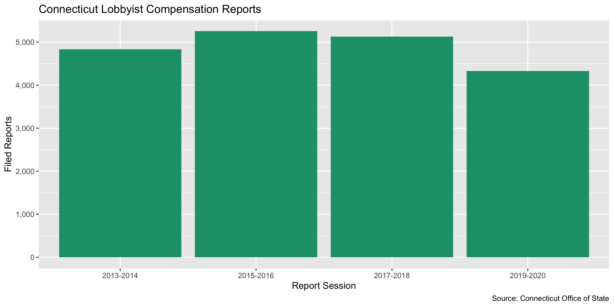

Connecticut Lobbying Compensation Data Diary
================
Yanqi Xu
2023-04-22 21:01:56

- <a href="#project" id="toc-project">Project</a>
- <a href="#objectives" id="toc-objectives">Objectives</a>
- <a href="#packages" id="toc-packages">Packages</a>
- <a href="#download" id="toc-download">Download</a>
- <a href="#import" id="toc-import">Import</a>
- <a href="#explore" id="toc-explore">Explore</a>
- <a href="#export" id="toc-export">Export</a>

## Project

The Accountability Project is an effort to cut across data silos and
give journalists, policy professionals, activists, and the public at
large a simple way to search across huge volumes of public data about
people and organizations.

Our goal is to standardizing public data on a few key fields by thinking
of each dataset row as a transaction. For each transaction there should
be (at least) 3 variables:

1.  All **parties** to a transaction
2.  The **date** of the transaction
3.  The **amount** of money involved

## Objectives

This document describes the process used to complete the following
objectives:

1.  How many records are in the database?
2.  Check for duplicates
3.  Check ranges
4.  Is there anything blank or missing?
5.  Check for consistency issues
6.  Create a five-digit ZIP Code called `ZIP5`
7.  Create a `YEAR` field from the transaction date
8.  Make sure there is data on both parties to a transaction

## Packages

The following packages are needed to collect, manipulate, visualize,
analyze, and communicate these results. The `pacman` package will
facilitate their installation and attachment.

``` r
if (!require("pacman")) install.packages("pacman")
pacman::p_load_current_gh("irworkshop/campfin")
pacman::p_load(
  rvest, # read html tables
  httr, # interact with http requests
  stringdist, # levenshtein value
  tidyverse, # data manipulation
  lubridate, # datetime strings
  tidytext, # string analysis
  magrittr, # pipe opperators
  janitor, # dataframe clean
  refinr, # cluster and merge
  knitr, # knit documents
  glue, # combine strings
  scales, #format strings
  here, # relative storage
  fs, # search storage 
  vroom, #read deliminated files
  readxl #read excel files
)
```

This document should be run as part of the `R_campfin` project, which
lives as a sub-directory of the more general, language-agnostic
\[`irworkshop/accountability_datacleaning`\]\[01\] GitHub repository.

The `R_campfin` project uses the \[RStudio projects\]\[02\] feature and
should be run as such. The project also uses the dynamic `here::here()`
tool for file paths relative to *your* machine.

## Download

Set the download directory first.

``` r
# create a directory for the raw data
raw_dir <- here("state","ct", "lobby", "data", "raw","exp")

dir_create(raw_dir)
```

According to \[CT Office of State Ethics\]
[03](https://www.oseapps.ct.gov/NewLobbyist/PublicReports/LobbyistFAQ.aspx),

> Lobbying in Connecticut is defined as “communicating directly or
> soliciting others to communicate with any official or his or her staff
> in the legislative or executive branch of government or in a
> quasi-public agency, for the purpose of influencing any legislative or
> administrative action.”

Lobbyist terms:  
\> A Client Lobbyist is the party paying for lobbying services on its
behalf. In other words, the client lobbyist is expending or agreeing to
expend the threshold amount of \$3,000 in a calendar year. A
Communicator Lobbyist receives payment and does the actual lobbying
legwork (i.e., communicating or soliciting others to communicate).  
\> A Communicator Lobbyist receives or agrees to receive \$3,000 for
lobbying activities in a calendar year. A communicator lobbyist can
be:  
1. An individual; or 2. A member of a Business Organization (e.g., a
firm or association that is owned by or employs a number of lobbyists),
Conn. Gen. Stat. § 1-91 (t); or 3. An In-house Communicator (a lobbyist
who is a salaried employee of a client lobbyist).

Registration and Filing Specifics:

> Individuals or entities are required by law to register as a lobbyist
> with the Office of State Ethics (OSE) if they:  
> 1. Expend or agree to expend \$3,000 or more in a calendar year in
> lobbying; OR 2. Receive or agree to receive \$3,000 or more in a
> calendar year in lobbying. Once the \$3,000 threshold is met,
> registration with the OSE is required. Registration occurs biennially
> (every two years) by January 15, or prior to the commencement of
> lobbying, whichever is later.

Client Lobbyists:  
\> Client lobbyists file quarterly financial reports, with the third and
fourth quarters combined. These reports are filed between the 1st and
10th days of April, July and January.  
2. To ensure timely transparency, if a client lobbyist spends or agrees
to spend more than \$100 in legislative lobbying while the Legislature
is in regular session, that lobbyist must file monthly financial
reports.  
3. The quarterly and monthly reports gather information such as
compensation, sales tax and money expended in connection with lobbying;
expenditures benefiting a public official or his/her staff or immediate
family; all other lobbying expenditures; and the fundamental terms of
any lobbying contract or agreement.

Communicator Lobbyists:

    > Communicator lobbyists also register upon meeting the threshold amount. Communicator lobbyists generally file a financial report once a year, due by January 10. These reports capture compensation, reimbursements from the client lobbyist and sales tax for the previous year.  
    If a communicator lobbyist makes unreimbursed expenditures of $10 or more for the benefit of a public official, a member of his/her staff, or his/her immediate family, that lobbyist must also file on the client lobbyist’s schedule (either monthly or quarterly).

This Rmd file documents the data processing workflow for CT lobbying
compensation only, whereas the registration data is wrangled in a
separate data diary. The data is last downloaded on April 15, 2020.

## Import

To create a single clean data file of lobbyist compensation, we will
merge the data tables of each year into a master data frame.

### Download

We’ll download the `Communicator Detail Compensation` reports from
[Office of State
Ethics](https://www.oseapps.ct.gov/NewLobbyist/PublicReports/AdditionalReports.aspx#)
=\> Additional Reports +\> Issue/Financial Reports, as they specify the
payors (clients) and payees (lobbyists) in a single data frame. The data
is separated by year.

We can download each TXT file to the `/ct/data/raw` directory.

    #> # A tibble: 5 × 4
    #>   path                                             type         size birth_time         
    #>   <chr>                                            <fct> <fs::bytes> <dttm>             
    #> 1 /state/ct/lobby/data/raw/exp/lobby_comp_2013.csv file         534K 2019-12-23 07:08:08
    #> 2 /state/ct/lobby/data/raw/exp/lobby_comp_2015.csv file         581K 2019-12-23 06:51:36
    #> 3 /state/ct/lobby/data/raw/exp/lobby_comp_2017.csv file         569K 2019-12-23 06:51:14
    #> 4 /state/ct/lobby/data/raw/exp/lobby_comp_2019.csv file         573K 2023-04-02 16:07:30
    #> 5 /state/ct/lobby/data/raw/exp/lobby_comp_2021.csv file         572K 2023-04-02 16:08:39

### Read

We will remove the commas and dollar signs in currency expressions.

``` r
ctlc <- map_dfr(
  .x = dir_ls(raw_dir),
  .f = read_csv,
  .id = "source_file",
  col_types = cols(
    .default = col_character()
      ))

ctlc <- clean_names(ctlc)

ctlc <- ctlc %>% mutate_if(.predicate = str_detect(.,"\\$"),
                           .funs = ~str_remove_all(.,"\\$|,"))

ctlc[5:8] <-  ctlc[5:8] %>% map(as.numeric)
```

## Explore

``` r
head(ctlc)
#> # A tibble: 6 × 8
#>   source_file                                 commu…¹ client selec…² comp_…³ sales…⁴ exp_r…⁵  total
#>   <chr>                                       <chr>   <chr>  <chr>     <dbl>   <dbl>   <dbl>  <dbl>
#> 1 /Users/yanqixu/code/accountability_datacle… 3D Con… Evers… Admini…       0       0       0      0
#> 2 /Users/yanqixu/code/accountability_datacle… 3D Con… Evers… Legisl…  240000       0     750 240750
#> 3 /Users/yanqixu/code/accountability_datacle… 3D Con… Evers… Client…  240000       0     750 240750
#> 4 /Users/yanqixu/code/accountability_datacle… Aaron … Advan… Admini…       0       0       0      0
#> 5 /Users/yanqixu/code/accountability_datacle… Aaron … Advan… Legisl…       0       0       0      0
#> 6 /Users/yanqixu/code/accountability_datacle… Aaron … Advan… Client…       0       0       0      0
#> # … with abbreviated variable names ¹​communicator, ²​selected_type, ³​comp_amt, ⁴​sales_tax,
#> #   ⁵​exp_reimb
tail(ctlc)
#> # A tibble: 6 × 8
#>   source_file                                 commu…¹ client selec…² comp_…³ sales…⁴ exp_r…⁵  total
#>   <chr>                                       <chr>   <chr>  <chr>     <dbl>   <dbl>   <dbl>  <dbl>
#> 1 /Users/yanqixu/code/accountability_datacle… Zachar… CT Co… Admini…      0        0       0     0 
#> 2 /Users/yanqixu/code/accountability_datacle… Zachar… CT Co… Legisl…  44171        0       0 44171 
#> 3 /Users/yanqixu/code/accountability_datacle… Zachar… CT Co… Client…  44171        0       0 44171 
#> 4 /Users/yanqixu/code/accountability_datacle… Zina D… Lockh… Admini…    291.       0       0   291.
#> 5 /Users/yanqixu/code/accountability_datacle… Zina D… Lockh… Legisl…   2914.       0       0  2914.
#> 6 /Users/yanqixu/code/accountability_datacle… Zina D… Lockh… Client…   3205        0       0  3205 
#> # … with abbreviated variable names ¹​communicator, ²​selected_type, ³​comp_amt, ⁴​sales_tax,
#> #   ⁵​exp_reimb
glimpse(sample_frac(ctlc))
#> Rows: 25,543
#> Columns: 8
#> $ source_file   <chr> "/Users/yanqixu/code/accountability_datacleaning/state/ct/lobby/data/raw/ex…
#> $ communicator  <chr> "Lorelei Mottese", "Halloran & Sage Government Affairs, LLC", "Mary Elizabe…
#> $ client        <chr> "Wakefern Food Corporation", "CT Society of Plastic and Reconstructive Surg…
#> $ selected_type <chr> "Administrative", "ClientTotal", "Administrative", "Administrative", "Admin…
#> $ comp_amt      <dbl> 0.00, 14000.00, 0.00, 94029.24, 0.00, 18910.30, 37500.00, 29732.75, 0.00, 1…
#> $ sales_tax     <dbl> 0.00, 0.00, 0.00, 5970.84, 0.00, 0.00, 2381.25, 0.00, 0.00, 13175.00, 5427.…
#> $ exp_reimb     <dbl> 0.00, 0.00, 0.00, 0.00, 0.00, 1171.60, 750.00, 561.83, 0.00, 0.00, 0.00, 0.…
#> $ total         <dbl> 0.00, 14000.00, 0.00, 100000.08, 0.00, 20081.90, 40631.25, 30294.58, 0.00, …
```

``` r
ctlc <- distinct(ctlc)
```

### Missing

The data file doesn’t seem to miss any important fields.

``` r
col_stats(ctlc, count_na)
#> # A tibble: 8 × 4
#>   col           class     n     p
#>   <chr>         <chr> <int> <dbl>
#> 1 source_file   <chr>     0     0
#> 2 communicator  <chr>     0     0
#> 3 client        <chr>     0     0
#> 4 selected_type <chr>     0     0
#> 5 comp_amt      <dbl>     0     0
#> 6 sales_tax     <dbl>     0     0
#> 7 exp_reimb     <dbl>     0     0
#> 8 total         <dbl>     0     0
```

### Duplicates

We can see there’s no duplicate entry.

``` r
ctlc <- flag_dupes(ctlc, dplyr::everything())
```

### Session

The original data doesn’t contain fields indicative of time. We’ll use
the file name to identify the legislative sessions they correspond to by
creating a variable `session`.

``` r
ctlc <- ctlc %>% mutate(session = str_extract(source_file, "\\d{4}")) %>% 
                          mutate(session = case_when(session == "2013" ~ "2013-2014",
                            session == "2015" ~ "2015-2016",
                             session == "2017" ~ "2017-2018",
                             session == "2019" ~ "2019-2020",
                            session == "2021" ~ "2021-2022")) %>% 
        select(-source_file)
```

<!-- -->

### Continuous

We can use the data to find out who are the top spenders, and how their
payment amounts are distributed. <!-- -->

We’ll need the ID information from the registration list that we
previously processed. Note that the registration data is arranged by
year and not session, so a session may include multiple
`client-communicator` intances.Since duplicates will be joined multiple
times to the actual compensation data frame, and thus we do not wish to
introduce duplicates in this joined data frame. We will de-dupe the
registration data for each year and prioritize years that have more
comprehensive information than the other year of the same session. That
is, we will create a column `na_count` counting the `NA` values of each
row and only maintain the intance with a smaller `na_count` value.

``` r
reg_dir <- here("state","ct", "lobby", "data", "processed","reg")
ct_reg <- read_csv(glue("{reg_dir}/ct_lobby_reg.csv"),col_types = cols(.default = col_character()))

ct_reg <- ct_reg %>% 
  # Remove some nonessential columns where communicator is "`"
  filter(communicator_name_clean != "1") %>% 
  mutate(session = case_when(str_detect(client_year, "2013|2014") ~ "2013-2014",
                             str_detect(client_year, "2015|2016") ~ "2015-2016",
                             str_detect(client_year, "2017|2018") ~ "2017-2018",
                             str_detect(client_year, "2019|2020") ~ "2019-2020",
                             str_detect(client_year, "2021|2022") ~ "2021-2022"))

ct_join <- ct_reg %>% 
  select(client_name,client_year, lobbyist_first_name,lobbyist_last_name,lobbyist_year,client_address_clean, session,client_phone,client_city_clean,client_email, client_zip, client_state, lobbyist_city_clean, lobbyist_address_clean, lobbyist_state, lobbyist_zip, lobbyist_email) %>% 
  # we can safely de-dupe the rows where only the lobbyist_year is different from one another 
  flag_dupes(-lobbyist_year) %>% 
  filter(!dupe_flag)

ct_count <- ct_join %>% count(client_name, lobbyist_first_name, lobbyist_last_name, session) %>% arrange(desc(n))
  #count(client_name, lobbyist_first_name, lobbyist_last_name)
```

Our goal is to reduce the number of rows in the `ct_reg` table to 13047,
which is the total number of ct_reg rows (each row represents a distinct
relationship between a client and a lobbyist for a session).

``` r
ct_join <- ct_join %>% 
  add_count(client_name, lobbyist_first_name, lobbyist_last_name, session)
#the ct_dedupe dataframe contains twice as many rows as the difference between nrow(ct_join) and nrow(ct_count)
ct_dupe <- ct_join %>% filter(n==2) %>% 
  mutate(row_sum = rowSums(is.na(.)))

ct_dedupe <- ct_dupe %>% group_split(client_name, lobbyist_first_name, lobbyist_last_name, session)

# For entries with the same client_name, lobbyist_first_name, lobbyist_last_name, session, we group them in a list for comparison
ct_dedupes <- rep(NA, length(ct_dedupe))

for (i in seq_along(ct_dedupe)){
  # early_more_info suggests whether the first entry has more information
  ct_dedupes[i] <- ct_dedupe[[i]]$row_sum[1] < ct_dedupe[[i]]$row_sum[2]
  
# if the first entry has more non-NA columns, use the first entry, otherwise use the second instance.
  if (ct_dedupes[i]) {
  ct_dedupe[[i]] <- ct_dedupe[[i]][1,]
  }
  else{
  ct_dedupe[[i]] <- ct_dedupe[[i]][2,]
  }
}

ct_deduped <- ct_dedupe %>% plyr::ldply() %>% select(-c(row_sum,n))
# first remove all the double entries
ct_join<- ct_join %>% filter(n != 2) %>% 
  unite(remove = T, col = "communicator", lobbyist_first_name, lobbyist_last_name,sep = " ", na.rm = TRUE) %>% select(-n) %>% 
#then add the ones we're keeping back
  bind_rows(ct_deduped) %>% 
  rename(client = client_name)
```

``` r
ctlc_clean <- ctlc %>% 
  mutate_if(is.character, str_to_upper) %>% 
  left_join(ct_join, by = c("client", "communicator", "session")) 

col_stats(ctlc_clean, count_na)         
#> # A tibble: 24 × 4
#>    col                    class     n     p
#>    <chr>                  <chr> <int> <dbl>
#>  1 communicator           <chr>     0 0    
#>  2 client                 <chr>     0 0    
#>  3 selected_type          <chr>     0 0    
#>  4 comp_amt               <dbl>     0 0    
#>  5 sales_tax              <dbl>     0 0    
#>  6 exp_reimb              <dbl>     0 0    
#>  7 total                  <dbl>     0 0    
#>  8 session                <chr>     0 0    
#>  9 client_year            <chr> 16263 0.637
#> 10 lobbyist_year          <chr> 16263 0.637
#> 11 client_address_clean   <chr> 16263 0.637
#> 12 client_phone           <chr> 16263 0.637
#> 13 client_city_clean      <chr> 16286 0.638
#> 14 client_email           <chr> 16263 0.637
#> 15 client_zip             <chr> 16263 0.637
#> 16 client_state           <chr> 16263 0.637
#> 17 lobbyist_city_clean    <chr> 16314 0.639
#> 18 lobbyist_address_clean <chr> 16291 0.638
#> 19 lobbyist_state         <chr> 16291 0.638
#> 20 lobbyist_zip           <chr> 16291 0.638
#> 21 lobbyist_email         <chr> 16291 0.638
#> 22 dupe_flag              <lgl> 16263 0.637
#> 23 lobbyist_first_name    <chr> 25541 1    
#> 24 lobbyist_last_name     <chr> 25541 1

sample_frac(ctlc_clean)
#> # A tibble: 25,541 × 24
#>    communic…¹ client selec…² comp_…³ sales…⁴ exp_r…⁵  total session clien…⁶ lobby…⁷ clien…⁸ clien…⁹
#>    <chr>      <chr>  <chr>     <dbl>   <dbl>   <dbl>  <dbl> <chr>   <chr>   <chr>   <chr>   <chr>  
#>  1 HALLORAN … ALLST… CLIENT…  84000    5382.     750 90132. 2013-2… <NA>    <NA>    <NA>    <NA>   
#>  2 NICKEY KO… CONNE… LEGISL…  14433.      0        0 14433. 2021-2… 2021    2021    10 ALC… 860-61…
#>  3 ERIN BOGGS OPEN … ADMINI…      0       0        0     0  2021-2… 2021    2021    75 CHA… 860-61…
#>  4 RYAN M. B… ADVAN… ADMINI…    240       0        0   240  2019-2… 2019    2019    909 PO… 314-72…
#>  5 JAMES CRO… COALI… CLIENT…  10300       0        0 10300  2015-2… 2015    2015    PO BOX… 203-24…
#>  6 DEREK PHE… FUEL … LEGISL…  13195       0        0 13195  2021-2… 2021    2021    3 GREA… 203-82…
#>  7 CAPITOL C… CHRIS… CLIENT…  24000       0      750 24750  2019-2… <NA>    <NA>    <NA>    <NA>   
#>  8 SULLIVAN … ALMAD… ADMINI…   5625       0        0  5625  2021-2… <NA>    <NA>    <NA>    <NA>   
#>  9 FOCUS GOV… CONNE… CLIENT…  19769.   1255.     500 21524  2021-2… <NA>    <NA>    <NA>    <NA>   
#> 10 SULLIVAN … AGRIC… ADMINI…      0       0        0     0  2017-2… <NA>    <NA>    <NA>    <NA>   
#> # … with 25,531 more rows, 12 more variables: client_city_clean <chr>, client_email <chr>,
#> #   client_zip <chr>, client_state <chr>, lobbyist_city_clean <chr>, lobbyist_address_clean <chr>,
#> #   lobbyist_state <chr>, lobbyist_zip <chr>, lobbyist_email <chr>, dupe_flag <lgl>,
#> #   lobbyist_first_name <chr>, lobbyist_last_name <chr>, and abbreviated variable names
#> #   ¹​communicator, ²​selected_type, ³​comp_amt, ⁴​sales_tax, ⁵​exp_reimb, ⁶​client_year,
#> #   ⁷​lobbyist_year, ⁸​client_address_clean, ⁹​client_phone
```

1.  There are 25541 records in the database.
2.  There are NA duplicate records in the database.
3.  The range and distribution of `year` seems mostly reasonable except
    for a few entries.
4.  Consistency in goegraphic data has been improved with
    `campfin::normal_*()`.
5.  The 4-digit `year` variable has been created with
    `lubridate::year()`.

## Export

``` r
clean_dir <- here("state","ct", "lobby", "data", "processed","exp")
dir_create(clean_dir)
ctlc_clean %>% 
  select(-c(lobbyist_first_name, lobbyist_last_name)) %>% 
  mutate_if(is.character, str_to_upper) %>% 
  write_csv(
    path = glue("{clean_dir}/ct_lobby_exp.csv"),
    na = ""
  )
```
