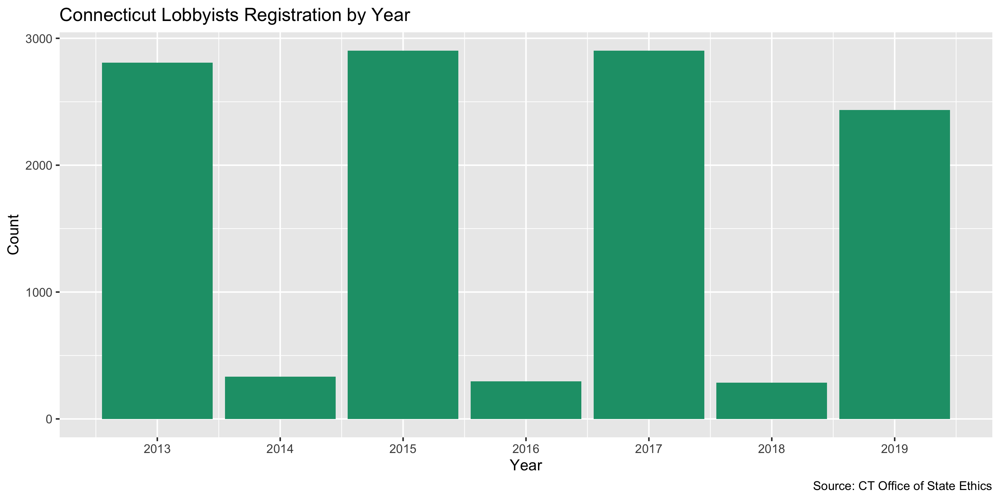

Connecticut Lobbying Registration Data Diary
================
Yanqi Xu
2023-04-08 10:46:01

- <a href="#project" id="toc-project">Project</a>
- <a href="#objectives" id="toc-objectives">Objectives</a>
- <a href="#packages" id="toc-packages">Packages</a>
- <a href="#download" id="toc-download">Download</a>
- <a href="#reading" id="toc-reading">Reading</a>
- <a href="#explore" id="toc-explore">Explore</a>
- <a href="#wrangling" id="toc-wrangling">Wrangling</a>
- <a href="#join" id="toc-join">Join</a>
- <a href="#export" id="toc-export">Export</a>

## Project

The Accountability Project is an effort to cut across data silos and
give journalists, policy professionals, activists, and the public at
large a simple way to search across huge volumes of public data about
people and organizations.

Our goal is to standardizing public data on a few key fields by thinking
of each dataset row as a transaction. For each transaction there should
be (at least) 3 variables:

1.  All **parties** to a transaction
2.  The **date** of the transaction
3.  The **amount** of money involved

## Objectives

This document describes the process used to complete the following
objectives:

1.  How many records are in the database?
2.  Check for duplicates
3.  Check ranges
4.  Is there anything blank or missing?
5.  Check for consistency issues
6.  Create a five-digit ZIP Code called `ZIP5`
7.  Create a `YEAR` field from the transaction date
8.  Make sure there is data on both parties to a transaction

## Packages

The following packages are needed to collect, manipulate, visualize,
analyze, and communicate these results. The `pacman` package will
facilitate their installation and attachment.

``` r
if (!require("pacman")) install.packages("pacman")
pacman::p_load_current_gh("irworkshop/campfin")
pacman::p_load(
  rvest, # read html tables
  httr, # interact with http requests
  stringdist, # levenshtein value
  tidyverse, # data manipulation
  lubridate, # datetime strings
  tidytext, # string analysis
  magrittr, # pipe opperators
  janitor, # dataframe clean
  refinr, # cluster and merge
  knitr, # knit documents
  glue, # combine strings
  scales, #format strings
  here, # relative storage
  fs, # search storage 
  vroom, #read deliminated files
  readxl #read excel files
)
```

This document should be run as part of the `R_campfin` project, which
lives as a sub-directory of the more general, language-agnostic
[`irworkshop/accountability_datacleaning`](https://github.com/irworkshop/accountability_datacleaning "TAP repo")
GitHub repository.

The `R_campfin` project uses the [RStudio
projects](https://support.rstudio.com/hc/en-us/articles/200526207-Using-Projects "Rproj")
feature and should be run as such. The project also uses the dynamic
`here::here()` tool for file paths relative to *your* machine.

## Download

Set the download directory first. This data update includes everything
prior to 2023, so the next update should start with the 2023-2024 cycle.

``` r
# create a directory for the raw data
raw_dir <- here("state","ct", "lobby", "data", "raw","reg")

dir_create(raw_dir)
```

According to \[CT Office of State Ethics\]
[03](https://www.oseapps.ct.gov/NewLobbyist/PublicReports/LobbyistFAQ.aspx),

> Lobbying in Connecticut is defined as “communicating directly or
> soliciting others to communicate with any official or his or her staff
> in the legislative or executive branch of government or in a
> quasi-public agency, for the purpose of influencing any legislative or
> administrative action.”

Lobbyist terms:  
\> A Client Lobbyist is the party paying for lobbying services on its
behalf. In other words, the client lobbyist is expending or agreeing to
expend the threshold amount of \$3,000 in a calendar year. A
Communicator Lobbyist receives payment and does the actual lobbying
legwork (i.e., communicating or soliciting others to communicate).  
\> A Communicator Lobbyist receives or agrees to receive \$3,000 for
lobbying activities in a calendar year. A communicator lobbyist can
be:  
1. An individual; or 2. A member of a Business Organization (e.g., a
firm or association that is owned by or employs a number of lobbyists),
Conn. Gen. Stat. § 1-91 (t); or 3. An In-house Communicator (a lobbyist
who is a salaried employee of a client lobbyist).

Registration and Filing Specifics:

> Individuals or entities are required by law to register as a lobbyist
> with the Office of State Ethics (OSE) if they:  
> 1. Expend or agree to expend \$3,000 or more in a calendar year in
> lobbying; OR 2. Receive or agree to receive \$3,000 or more in a
> calendar year in lobbying. Once the \$3,000 threshold is met,
> registration with the OSE is required. Registration occurs biennially
> (every two years) by January 15, or prior to the commencement of
> lobbying, whichever is later.

Client Lobbyists:  
\> 1. Client lobbyists file quarterly financial reports, with the third
and fourth quarters combined. These reports are filed between the 1st
and 10th days of April, July and January.  
2. To ensure timely transparency, if a client lobbyist spends or agrees
to spend more than \$100 in legislative lobbying while the Legislature
is in regular session, that lobbyist must file monthly financial
reports.  
3. The quarterly and monthly reports gather information such as
compensation, sales tax and money expended in connection with lobbying;
expenditures benefiting a public official or his/her staff or immediate
family; all other lobbying expenditures; and the fundamental terms of
any lobbying contract or agreement.

Communicator Lobbyists:  
\> Communicator lobbyists also register upon meeting the threshold
amount. Communicator lobbyists generally file a financial report once a
year, due by January 10. These reports capture compensation,
reimbursements from the client lobbyist and sales tax for the previous
year.  
If a communicator lobbyist makes unreimbursed expenditures of \$10 or
more for the benefit of a public official, a member of his/her staff, or
his/her immediate family, that lobbyist must also file on the client
lobbyist’s schedule (either monthly or quarterly).

This Rmd file documents the CT registration data only, whereas the
expenditure data is wrangled in a separate data diary.

To generate a master dataset, we will need to download four kinds of
data tables from [Office of State
Ethics](https://www.oseapps.ct.gov/NewLobbyist/PublicReports/AdditionalReports.aspx),
*Communicator Lobbyist List* for information about lobbyists (Note that
this data file is the total of the next two data files, in-house and
outside communicators), Switch to the tab *Relationship/Registrant
reports - All Registrants - Client* for information about clients,
*Registration by Client, Communicator, Bus Org and Registration Date*
for their relationships, as well as the *Combined Lobbyist List by
Registrant with Type of Lobbying and Issues*. There will be overlapping
and missing fields, but we will use the *Registration by Client,
Communicator, Bus Org and Registration Date* as the base table since it
captures the relationship between the lobbyists and their clients.

## Reading

We discovered that the xls files are actually structured as html tables.
We’ll use the `rvest` package to read these files.

``` r
ct_lob <- list.files(raw_dir, pattern = "Client.*", recursive = TRUE, full.names = TRUE) %>% 
  map_dfr(read_csv) %>% clean_names() %>% mutate_if(is.character, str_to_upper) %>% 
  mutate(street_address_2 = street_address_2 %>% na_if("-"))
  
ct_cl <- list.files(raw_dir, pattern = "ct_cl.*", recursive = TRUE, full.names = TRUE) %>% 
  map_dfr(read_csv, col_types = cols(.default = col_character())) %>% clean_names() %>% mutate_if(is.character, str_to_upper) 

ct_reg <- dir_ls(raw_dir, regexp = "reg_by") %>% 
  map_dfr(read_csv, col_types = cols(.default = col_character())) %>%  clean_names() %>% mutate_if(is.character, str_to_upper) %>% 
  mutate(business_organization = business_organization %>% na_if("-"))
```

\###Columns \#### Year Here we read everything as strings, and we will
need to convert them back to numeric or datetime objects.

``` r
ct_reg <- ct_reg %>% mutate (registration_date = registration_date %>% as.Date(format = "%m/%d/%Y"),
                                       year = year(registration_date))
                             

ct_lob <- ct_lob %>% mutate (registration_date = registration_date %>% as.Date(format = "%m/%d/%Y"),
                                       year = year(registration_date))

ct_cl <- ct_cl %>% mutate(registration_date = registration_date %>% as.Date(format = "%m/%d/%Y"),
                          year = year(registration_date),
                          term_date = as.Date(term_date, format = "%m/%d/%Y"))
```

#### Name

We will replace the fields that said `1` for `communicator_name` and
`comm_type` in `ct_reg` with `NA`s.

``` r
ct_reg <- ct_reg %>% mutate(communicator_status = str_match(communicator_name, " [(]TERMINATED: .+[)]") %>% 
                              str_remove("[(]") %>% str_remove("[)]"),
                            communicator_name_clean = str_remove(communicator_name,  " [(]TERMINATED: .+[)]"),
                            communicator_status = communicator_status %>% trimws())

ct_reg <- ct_reg %>% 
  mutate(first_name = str_match(communicator_name_clean, ",(.[^,]+$)")[,2],
         last_name = str_remove(communicator_name_clean, str_c(",",first_name)))

ct_reg <- ct_reg %>% 
  mutate(comm_type = na_if(x = comm_type, y = "1"),
         communicator_name = na_if(x = communicator_name, y = "1"))
```

## Explore

### Duplicates

We’ll use the `flag_dupes()` function to see if there are records
identical to one another and flag the duplicates. A new variable
`dupe_flag` will be created.

``` r
ct_lob <- flag_dupes(ct_lob, dplyr::everything())
ct_cl <- flag_dupes(ct_cl, dplyr::everything())
ct_reg <- flag_dupes(ct_reg, dplyr::everything())
```

``` r
ct_reg %>% 
  count(year) %>% 
  mutate(even = is_even(year)) %>% 
  ggplot(aes(x = year, y = n)) +
  geom_col(aes(fill = even)) +
  scale_fill_brewer(palette = "Dark2") +
  scale_x_continuous(breaks = 2013:2019) +
  labs(
    title = "Connecticut Lobbyists Registration by Year",
    caption = "Source: CT Office of State Ethics",
    fill = "Election Year",
    x = "Year",
    y = "Count"
  )
```

<!-- -->

### Missing

There’s almost no empty fields in the two data frames.

``` r
ct_lob  %>% col_stats(count_na)
#> # A tibble: 13 × 4
#>    col               class      n     p
#>    <chr>             <chr>  <int> <dbl>
#>  1 last_name         <chr>      0 0    
#>  2 first_name        <chr>      0 0    
#>  3 street_address_1  <chr>      0 0    
#>  4 street_address_2  <chr>   3350 0.682
#>  5 city              <chr>      0 0    
#>  6 state             <chr>      0 0    
#>  7 zip               <chr>      0 0    
#>  8 email             <chr>      0 0    
#>  9 registration_date <date>     0 0    
#> 10 member_type       <chr>      0 0    
#> 11 status            <chr>   3630 0.739
#> 12 organisation_name <chr>      0 0    
#> 13 year              <dbl>      0 0
ct_cl  %>% col_stats(count_na)
#> # A tibble: 13 × 4
#>    col               class      n        p
#>    <chr>             <chr>  <int>    <dbl>
#>  1 client_name       <chr>      0 0       
#>  2 address_1         <chr>      0 0       
#>  3 address_2         <chr>   3910 0.680   
#>  4 city              <chr>      0 0       
#>  5 state             <chr>      0 0       
#>  6 zip               <chr>      0 0       
#>  7 phone             <chr>      0 0       
#>  8 email             <chr>      0 0       
#>  9 registration_date <date>     1 0.000174
#> 10 term_date         <date>  5222 0.909   
#> 11 communicator_type <chr>   5747 1       
#> 12 year              <dbl>      1 0.000174
#> 13 dupe_flag         <lgl>      0 0
```

Few values are missing from the lobbyists database.

## Wrangling

We’ll wrangle the two datasets to extract information such as address,
city, ZIP, state, phone for both lobbyists and their clients, as well as
authorization date. The lobbyists registry has the one-to-one
relationship between lobbyists and clients, so we will use `ct_lob` as
the main data frame and join the clients’ information from the `ct_cl`
data frame.

### Phone

``` r
ct_cl <- ct_cl %>% mutate(phone_norm = normal_phone(phone))
```

### Address

``` r
ct_cl <- ct_cl %>%
  unite(
  address_1,
  address_2,
  col = address_combined,
  sep = " ",
  remove = FALSE,
  na.rm = TRUE
  ) %>%
  mutate(address_clean = normal_address(
  address = address_combined,
  abbs = usps_city,
  na_rep = TRUE
  )) %>% 
  select(-address_combined)
  
  ct_lob <- ct_lob %>%
unite(
  street_address_1,
  street_address_2,
  col = address_combined,
  sep = " ",
  remove = FALSE,
  na.rm = TRUE
  ) %>% 
    mutate(address_clean = normal_address(
      address = address_combined,
  abbs = usps_city,
  na_rep = TRUE
  )) %>% 
    select(-address_combined)
```

### ZIP

The ZIP code fields are pretty clean.

``` r
prop_in(ct_cl$zip, valid_zip, na.rm = TRUE) %>% percent()
#> [1] "100%"
prop_in(ct_lob$zip, valid_zip, na.rm = TRUE) %>% percent()
#> [1] "100%"
```

### State

Running the following commands tells us the state fields are clean.

``` r
prop_in(ct_cl$state, valid_state, na.rm = TRUE) %>% percent()
#> [1] "100%"
prop_in(ct_lob$state, valid_state, na.rm = TRUE) %>% percent()
#> [1] "100%"
```

### City

The city fields in both data frames use upper-case letters and
lower-case letters inconsistently. We’ll convert everything to upper
case.

``` r
prop_in(ct_cl$city, valid_city, na.rm = TRUE) %>% percent()
#> [1] "97%"
prop_in(ct_lob$city, valid_city, na.rm = TRUE) %>% percent()
#> [1] "99%"
```

#### Normalize

``` r
ct_cl <- ct_cl %>% mutate(city_norm = normal_city(city = city,
                                            abbs = usps_city,
                                            states = c(valid_state),
                                            na = invalid_city,
                                            na_rep = TRUE))
n_distinct(ct_cl$city)
#> [1] 551
n_distinct(ct_cl$city_norm)
#> [1] 548

prop_in(ct_cl$city, valid_city, na.rm = TRUE)
#> [1] 0.9732034
prop_in(ct_cl$city_norm, valid_city, na.rm = TRUE)
#> [1] 0.9751175
```

``` r
ct_lob <- ct_lob %>% mutate(city_norm = normal_city(city = city,
                                            abbs = usps_city,
                                            states = c(valid_state),
                                            na = invalid_city,
                                            na_rep = TRUE))
n_distinct(ct_lob$city)
#> [1] 273
n_distinct(ct_lob$city_norm)
#> [1] 272

prop_in(ct_lob$city, valid_city, na.rm = TRUE)
#> [1] 0.9940949
prop_in(ct_lob$city_norm, valid_city, na.rm = TRUE)
#> [1] 0.9947058
```

#### Swap

Then, we will compare these normalized `city_norm` values to the
*expected* city value for that vendor’s ZIP code. If the [levenshtein
distance](https://en.wikipedia.org/wiki/Levenshtein_distance) is less
than 3, we can confidently swap these two values.

``` r
ct_lob <- ct_lob %>% 
  left_join(
    y = zipcodes,
    by = c(
      "state" = "state",
      "zip" = "zip"
    )
  ) %>% 
  rename(city_match = city.y,
         city = city.x) %>% 
  mutate(
    match_abb = is_abbrev(city_norm, city_match),
    match_dist = str_dist(city_norm, city_match),
    city_swap = if_else(
      condition = match_abb | match_dist == 1,
      true = city_match,
      false = city_norm
    )
  ) %>% 
  select(
    -city_match,
    -match_dist,
    -match_abb
  )

prop_in(ct_lob$city_swap, valid_city, na.rm = TRUE) %>% percent()
#> [1] "100%"
```

``` r
ct_cl <- ct_cl %>% 
  left_join(
    y = zipcodes,
    by = c(
      "state" = "state",
      "zip" = "zip"
    )
  ) %>% 
  rename(city_match = city.y,
         city = city.x) %>% 
  mutate(
    match_abb = is_abbrev(city_norm, city_match),
    match_dist = str_dist(city_norm, city_match),
    city_swap = if_else(
      condition = match_abb | match_dist == 1,
      true = city_match,
      false = city_norm
    )
  ) %>% 
  select(
    -city_match,
    -match_dist,
    -match_abb
  )

prop_in(ct_cl$city_swap, valid_city, na.rm = TRUE) %>% percent()
#> [1] "99%"
```

Besides the `valid_city` vector, there is another vector of `extra_city`
that contains other locales. We’ll incorporate that in our comparison.

    #> # A tibble: 3 × 6
    #>   stage            prop_in n_distinct prop_na n_out n_diff
    #>   <chr>              <dbl>      <dbl>   <dbl> <dbl>  <dbl>
    #> 1 ct_lob$city        0.994        273 0          29     13
    #> 2 ct_lob$city_norm   0.995        272 0          26     11
    #> 3 ct_lob$city_swap   0.999        266 0.00265     3      3
    #> # A tibble: 3 × 6
    #>   stage           prop_in n_distinct prop_na n_out n_diff
    #>   <chr>             <dbl>      <dbl>   <dbl> <dbl>  <dbl>
    #> 1 ct_cl$city        0.977        551  0        130     50
    #> 2 ct_cl$city_norm   0.979        548  0        119     45
    #> 3 ct_cl$city_swap   0.995        524  0.0118    29     13

This is a very fast way to increase the valid proportion in the lobbyist
data frame to 0% and reduce the number of distinct *invalid* values from
45 to only 13

Similarly, the valid proportion in the clients data frame was bumped up
to 0% and reduce the number of distinct *invalid* values from 11 to only
3

## Join

We’ll join the two data frames together.

``` r
if ("dupe_flag" %in%  names(ct_lob)) {
ct_lob$dupe_flag %>% tabyl()  
}

ct_lob <- ct_lob %>% 
  #filter(!dupe_flag) %>% 
  select(-c(
            city_norm)) %>% 
  rename(city_clean = city_swap) %>% 
  rename_all(.funs = ~str_c("lobbyist_",.))

ct_cl <- ct_cl %>% 
  select(-city_norm) %>% 
  rename(city_clean = city_swap) %>% 
  rename_at(.vars = vars(-starts_with("client_"))
            ,.funs = ~ str_c("client_", .))

ct_cl <- ct_cl %>% flag_dupes(client_name, client_registration_date)
ct_lob <- ct_lob %>% flag_dupes(lobbyist_first_name, lobbyist_last_name, lobbyist_year, lobbyist_organisation_name)
```

After the join, we can see that all the clients’ id information is
accounted for. After the join, we can see the total numbers of NA
columns are consistent, and we are not introducting extraneous entries.
The numbers of NA columns are also consistent.

``` r
ct_reg <- ct_reg %>% select(-dupe_flag)

ct_reg <- ct_cl %>% filter(!dupe_flag) %>% 
  right_join(ct_reg,
            by = c("client_name" = "client_name",
            "client_registration_date" = "registration_date"))

col_stats(ct_reg, count_na)
#> # A tibble: 26 × 4
#>    col                      class      n         p
#>    <chr>                    <chr>  <int>     <dbl>
#>  1 client_name              <chr>      0 0        
#>  2 client_address_1         <chr>     32 0.00200  
#>  3 client_address_2         <chr>  10922 0.683    
#>  4 client_city              <chr>     32 0.00200  
#>  5 client_state             <chr>     32 0.00200  
#>  6 client_zip               <chr>     32 0.00200  
#>  7 client_phone             <chr>     32 0.00200  
#>  8 client_email             <chr>     32 0.00200  
#>  9 client_registration_date <date>     1 0.0000626
#> 10 client_term_date         <date> 14505 0.908    
#> 11 client_communicator_type <chr>  15982 1        
#> 12 client_year              <dbl>     33 0.00206  
#> 13 client_dupe_flag         <lgl>     32 0.00200  
#> 14 client_phone_norm        <chr>     32 0.00200  
#> 15 client_address_clean     <chr>     32 0.00200  
#> 16 client_city_clean        <chr>    186 0.0116   
#> 17 dupe_flag                <lgl>     32 0.00200  
#> 18 comm_type                <chr>   2722 0.170    
#> 19 communicator_name        <chr>   2722 0.170    
#> 20 business_organization    <chr>   4840 0.303    
#> 21 client_status            <chr>      0 0        
#> 22 year                     <dbl>      1 0.0000626
#> 23 communicator_status      <chr>  14810 0.927    
#> 24 communicator_name_clean  <chr>      0 0        
#> 25 first_name               <chr>   2722 0.170    
#> 26 last_name                <chr>   2722 0.170

ct_reg <- ct_reg %>% mutate(join = coalesce(business_organization, client_name))
  #the lobbyhist_organisation name usually reflects the business organization field in ct_reg, but corresponds to client_name when they are in-house lobbyists


ct_join<- ct_lob %>% 
  filter(!dupe_flag) %>% 
  select(-dupe_flag) %>%
  right_join(ct_reg,
            by = c( 'lobbyist_last_name' ='last_name',
                    'lobbyist_first_name' ='first_name',
                   'lobbyist_year' = 'year',
                   'lobbyist_organisation_name' = "join"))

col_stats(ct_join, count_na)
#> # A tibble: 38 × 4
#>    col                        class      n         p
#>    <chr>                      <chr>  <int>     <dbl>
#>  1 lobbyist_last_name         <chr>   2722 0.170    
#>  2 lobbyist_first_name        <chr>   2722 0.170    
#>  3 lobbyist_street_address_1  <chr>   4779 0.299    
#>  4 lobbyist_street_address_2  <chr>  12796 0.801    
#>  5 lobbyist_city              <chr>   4779 0.299    
#>  6 lobbyist_state             <chr>   4779 0.299    
#>  7 lobbyist_zip               <chr>   4779 0.299    
#>  8 lobbyist_email             <chr>   4779 0.299    
#>  9 lobbyist_registration_date <date>  4779 0.299    
#> 10 lobbyist_member_type       <chr>   4779 0.299    
#> 11 lobbyist_status            <chr>  14754 0.923    
#> 12 lobbyist_organisation_name <chr>      0 0        
#> 13 lobbyist_year              <dbl>      1 0.0000626
#> 14 lobbyist_address_clean     <chr>   4779 0.299    
#> 15 lobbyist_city_clean        <chr>   4791 0.300    
#> 16 client_name                <chr>      0 0        
#> 17 client_address_1           <chr>     32 0.00200  
#> 18 client_address_2           <chr>  10922 0.683    
#> 19 client_city                <chr>     32 0.00200  
#> 20 client_state               <chr>     32 0.00200  
#> 21 client_zip                 <chr>     32 0.00200  
#> 22 client_phone               <chr>     32 0.00200  
#> 23 client_email               <chr>     32 0.00200  
#> 24 client_registration_date   <date>     1 0.0000626
#> 25 client_term_date           <date> 14505 0.908    
#> 26 client_communicator_type   <chr>  15982 1        
#> 27 client_year                <dbl>     33 0.00206  
#> 28 client_dupe_flag           <lgl>     32 0.00200  
#> 29 client_phone_norm          <chr>     32 0.00200  
#> 30 client_address_clean       <chr>     32 0.00200  
#> 31 client_city_clean          <chr>    186 0.0116   
#> 32 dupe_flag                  <lgl>     32 0.00200  
#> 33 comm_type                  <chr>   2722 0.170    
#> 34 communicator_name          <chr>   2722 0.170    
#> 35 business_organization      <chr>   4840 0.303    
#> 36 client_status              <chr>      0 0        
#> 37 communicator_status        <chr>  14810 0.927    
#> 38 communicator_name_clean    <chr>      0 0

sample_frac(ct_join)
#> # A tibble: 15,982 × 38
#>    lobbyist_la…¹ lobby…² lobby…³ lobby…⁴ lobby…⁵ lobby…⁶ lobby…⁷ lobby…⁸ lobbyist…⁹ lobby…˟ lobby…˟
#>    <chr>         <chr>   <chr>   <chr>   <chr>   <chr>   <chr>   <chr>   <date>     <chr>   <chr>  
#>  1 SULLIVAN      PATRICK <NA>    <NA>    <NA>    <NA>    <NA>    <NA>    NA         <NA>    <NA>   
#>  2 ROSE          DAVID   <NA>    <NA>    <NA>    <NA>    <NA>    <NA>    NA         <NA>    <NA>   
#>  3 STONE         PATRICK 2440 R… <NA>    ROCKVI… MD      20850   PATRIC… 2021-01-07 IN-HOU… <NA>   
#>  4 ALBENZE       BRIAN   333 LO… <NA>    STRATF… CT      06615   BRIAN_… 2015-01-17 IN-HOU… <NA>   
#>  5 YI            SARAH   1400 1… SUITE … WASHIN… DC      20036   SYI@CT… 2017-09-21 IN-HOU… <NA>   
#>  6 <NA>          <NA>    <NA>    <NA>    <NA>    <NA>    <NA>    <NA>    NA         <NA>    <NA>   
#>  7 ROSE          DAVID   100 PE… 10TH F… HARTFO… CT      06103   DAVID.… 2013-01-03 BUS OR… <NA>   
#>  8 MONROY SMITH  AIMEE   600 MA… <NA>    BAR HA… ME      04609   AIMEE.… 2015-01-05 IN-HOU… <NA>   
#>  9 <NA>          <NA>    <NA>    <NA>    <NA>    <NA>    <NA>    <NA>    NA         <NA>    <NA>   
#> 10 CONWAY        FRITZ   ONE LI… <NA>    NEW BR… CT      06051   RCONWA… 2019-01-03 BUS OR… <NA>   
#> # … with 15,972 more rows, 27 more variables: lobbyist_organisation_name <chr>,
#> #   lobbyist_year <dbl>, lobbyist_address_clean <chr>, lobbyist_city_clean <chr>,
#> #   client_name <chr>, client_address_1 <chr>, client_address_2 <chr>, client_city <chr>,
#> #   client_state <chr>, client_zip <chr>, client_phone <chr>, client_email <chr>,
#> #   client_registration_date <date>, client_term_date <date>, client_communicator_type <chr>,
#> #   client_year <dbl>, client_dupe_flag <lgl>, client_phone_norm <chr>,
#> #   client_address_clean <chr>, client_city_clean <chr>, dupe_flag <lgl>, comm_type <chr>, …
```

## Export

``` r
clean_dir <- here("state","ct", "lobby", "data", "processed","reg")
dir_create(clean_dir)
ct_join %>% 
  select(-c(dupe_flag)) %>% 
  mutate_if(is.character, str_to_upper) %>% 
  write_csv(
    path = glue("{clean_dir}/ct_lobby_reg.csv"),
    na = ""
  )
```
