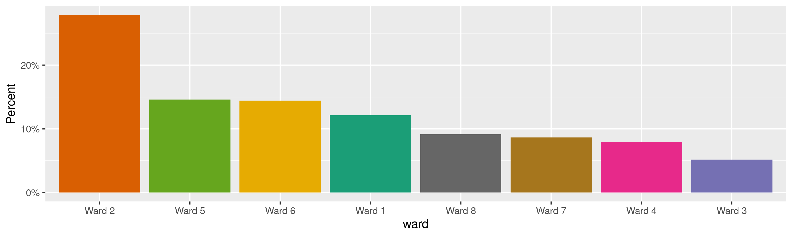
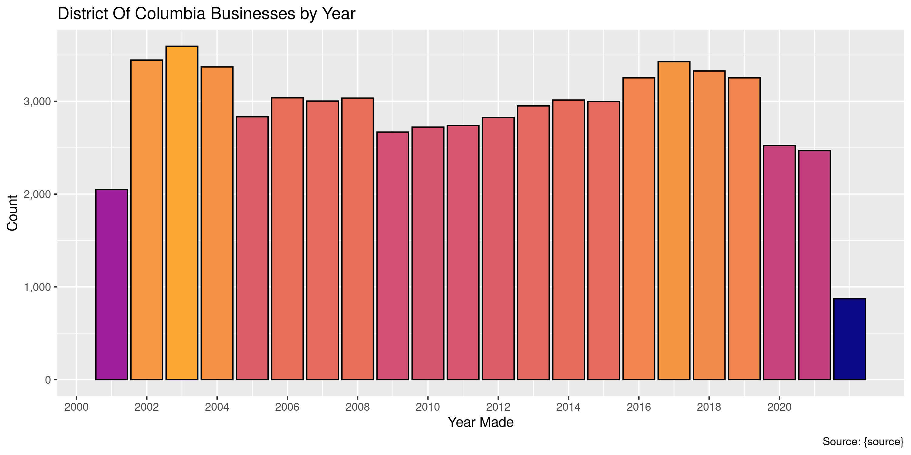

District Of Columbia Businesses
================
Kiernan Nicholls
Wed May 25 14:29:31 2022

-   <a href="#project" id="toc-project">Project</a>
-   <a href="#objectives" id="toc-objectives">Objectives</a>
-   <a href="#packages" id="toc-packages">Packages</a>
-   <a href="#source" id="toc-source">Source</a>
-   <a href="#download" id="toc-download">Download</a>
-   <a href="#read" id="toc-read">Read</a>
-   <a href="#explore" id="toc-explore">Explore</a>
    -   <a href="#missing" id="toc-missing">Missing</a>
    -   <a href="#duplicates" id="toc-duplicates">Duplicates</a>
    -   <a href="#categorical" id="toc-categorical">Categorical</a>
    -   <a href="#dates" id="toc-dates">Dates</a>
-   <a href="#wrangle" id="toc-wrangle">Wrangle</a>
-   <a href="#conclude" id="toc-conclude">Conclude</a>
-   <a href="#export" id="toc-export">Export</a>
-   <a href="#upload" id="toc-upload">Upload</a>

<!-- Place comments regarding knitting here -->

## Project

The Accountability Project is an effort to cut across data silos and
give journalists, policy professionals, activists, and the public at
large a simple way to search across huge volumes of public data about
people and organizations.

Our goal is to standardize public data on a few key fields by thinking
of each dataset row as a transaction. For each transaction there should
be (at least) 3 variables:

1.  All **parties** to a transaction.
2.  The **date** of the transaction.
3.  The **amount** of money involved.

## Objectives

This document describes the process used to complete the following
objectives:

1.  How many records are in the database?
2.  Check for entirely duplicated records.
3.  Check ranges of continuous variables.
4.  Is there anything blank or missing?
5.  Check for consistency issues.
6.  Create a five-digit ZIP Code called `zip`.
7.  Create a `year` field from the transaction date.
8.  Make sure there is data on both parties to a transaction.

## Packages

The following packages are needed to collect, manipulate, visualize,
analyze, and communicate these results. The `pacman` package will
facilitate their installation and attachment.

``` r
if (!require("pacman")) {
  install.packages("pacman")
}
pacman::p_load(
  tidyverse, # data manipulation
  lubridate, # datetime strings
  gluedown, # printing markdown
  janitor, # clean data frames
  campfin, # custom irw tools
  aws.s3, # aws cloud storage
  refinr, # cluster & merge
  scales, # format strings
  knitr, # knit documents
  vroom, # fast reading
  rvest, # scrape html
  glue, # code strings
  here, # project paths
  httr, # http requests
  fs # local storage 
)
```

This diary was run using `campfin` version 1.0.8.9300.

``` r
packageVersion("campfin")
#> [1] '1.0.8.9300'
```

This document should be run as part of the `R_tap` project, which lives
as a sub-directory of the more general, language-agnostic
[`irworkshop/accountability_datacleaning`](https://github.com/irworkshop/accountability_datacleaning)
GitHub repository.

The `R_tap` project uses the [RStudio
projects](https://support.rstudio.com/hc/en-us/articles/200526207-Using-Projects)
feature and should be run as such. The project also uses the dynamic
`here::here()` tool for file paths relative to *your* machine.

``` r
# where does this document knit?
here::i_am("state/dc/businesses/docs/dc_businesses_diary.Rmd")
```

## Source

> All applicants for a Basic Business License operating from a
> commercial location in the District of Columbia must provide a
> Certificate of Occupancy (C of O) for the premise address from which
> the business activity is conducted in order to demonstrate the
> activity does not conflict with building and zoning codes. A
> certificate of occupancy is needed to occupy any structure other than
> a single family dwelling. To include the following uses: two family
> flat, apartment house and all commercial uses.

-   `OBJECTID` (OID, OBJECTID)
-   `PERMIT_NUMBER` (String, Permit Number, length: 30)
-   `ISSUE_DATE` (Date, Issue Date, length: 8)
-   `ADDRESS` (String, Address, length: 200)
-   `WARD` (String, Ward, length: 10)
-   `DESCRIPTION_OF_OCCUPANCY` (String, Description of Occupancy,
    length: 2000)
-   `PERMISSION_GRANTED_TO` (String, Permission Granted To, length: 200)
-   `TRADING_AS` (String, Trading As, length: 200)
-   `FLOORS_OCCUPIED` (String, Floors Occupied, length: 200)
-   `OCCUPANCY_LOAD` (String, Occupancy Load, length: 200)
-   `PROPERTY_OWNER` (String, Property Owner, length: 200)
-   `OWNER_ADDRESS` (String, Owner Address, length: 200)
-   `B_Z_A_NUMBER` (String, Board of Zoning Adjustment Number, length:
    50)
-   `APPROVED_BUILDING_CODE_USE` (String, Approved Building Code Use,
    length: 50)
-   `APPROVED_ZONING_USE` (String, Approved Zoning Use, length: 200)
-   `EXPIRATION_DATE` (Date, Expiration Date, length: 8)
-   `MAR_ID` (Double, Master Address Repository ID)
-   `X_COORDINATE` (Double, X Coordinate)
-   `Y_COORDINATE` (Double, Y Coordinate)
-   `LATITUDE` (Double, Latitude)
-   `LONGITUDE` (Double, Longitude)
-   `DCS_LAST_MOD_DTTM` (Date, Database Last Modified Date, length: 8)
-   `SHAPE` (Geometry, SHAPE)
-   `APPLICATION_COMMENTS` (String, Application Comments, length: 4000)

## Download

``` r
raw_dir <- dir_create(here("state", "dc", "businesses", "data", "raw"))
raw_csv <- path(raw_dir, "Certificate_of_Occupancy.csv")
```

## Read

``` r
dcb <- read_delim(
  file = raw_csv,
  delim = ",",
  escape_backslash = FALSE,
  escape_double = FALSE,
  locale = locale(date_format = "%Y/%m/%d %H:%M:%S+%z"),
  col_types = cols(
    .default = col_character(),
    X = col_double(),
    Y = col_double(),
    ISSUE_DATE = col_date(),
    EXPIRATION_DATE = col_date(),
    X_COORDINATE = col_double(),
    Y_COORDINATE = col_double(),
    LATITUDE = col_double(),
    LONGITUDE = col_double(),
    DCS_LAST_MOD_DTTM = col_date()
  )
)
```

``` r
dcb <- clean_names(dcb, case = "snake")
```

``` r
dcb <- dcb %>% 
  select(-x, -y)
```

## Explore

There are 63,406 rows of 23 columns. Each record represents a single
business registered in the District.

``` r
glimpse(dcb)
#> Rows: 63,406
#> Columns: 23
#> $ objectid                   <chr> "5977641", "5977642", "5977643", "5977644", "5977645", "5977646", "5977647", "59776…
#> $ permit_number              <chr> "CO0800007", "CO0800008", "CO0800009", "CO0800010", "CO0800011", "CO0800012", "CO08…
#> $ issue_date                 <date> 2008-08-13, 2008-08-12, 2008-08-12, 2008-08-13, 2008-08-12, 2008-08-12, 2008-08-12…
#> $ address                    <chr> "1305 RHODE ISLAND AVE NE, WASHINGTON, DC", "50 MASSACHUSETTS AVE NE, WASHINGTON, D…
#> $ ward                       <chr> "Ward 5", "Ward 6", "Ward 2", "Ward 8", "Ward 5", "Ward 2", "Ward 3", "Ward 1", "Wa…
#> $ description_of_occupancy   <chr> "DENTAL CLINIC", "FAST FOOD", "PARTIAL HOME IMPROVEMENT OFFICE (100 SQ FT.) USE ON …
#> $ permission_granted_to      <chr> "HERO  MANAGEMENT", "GIFU  DC INV", "JORDAN C GILCHRIST SR.", "IN SOOK  LEE", "FERD…
#> $ trading_as                 <chr> "ADVENTURE DENTAL & VISION", NA, NA, "ROY'S STEAK'N SUBS", "CAFE SUREIA", "PACIFIC …
#> $ floors_occupied            <chr> "1", NA, "3RD", "1ST", "1", "BASEMENT", "1ST", "1", "2ND", "2", "1ST", "1ST", "1ST …
#> $ occupancy_load             <chr> NA, NA, NA, "0", "45", "0", "75", NA, NA, "2", NA, NA, NA, "2", "2", "3", "2", NA, …
#> $ property_owner             <chr> "HERO DENTAL OF WASHINGTON D C, P C", "WASHINGTON TERMINAL COMPANY", "DAVIS BUILDIN…
#> $ owner_address              <chr> "C/O FRED A SMITH COMPANY, 730 24TH ST NW STE 19, WASHINGTON, DC 20037-2518", "400 …
#> $ b_z_a_number               <chr> NA, NA, NA, NA, NA, NA, NA, NA, NA, "0", NA, NA, NA, NA, "0", NA, NA, NA, NA, NA, N…
#> $ approved_building_code_use <chr> NA, NA, NA, NA, NA, NA, NA, NA, NA, NA, NA, NA, NA, NA, NA, NA, NA, NA, NA, NA, NA,…
#> $ approved_zoning_use        <chr> NA, NA, NA, NA, NA, NA, NA, NA, NA, NA, NA, NA, NA, NA, NA, NA, NA, NA, NA, NA, NA,…
#> $ expiration_date            <date> NA, NA, NA, NA, NA, NA, NA, NA, NA, NA, NA, NA, NA, NA, NA, NA, NA, NA, NA, NA, NA…
#> $ mar_id                     <chr> "300736", "293243", "242031", "302045", "289179", "241710", "224730", "233025", "51…
#> $ x_coordinate               <dbl> 401145.4, 399464.3, 396712.9, 402474.3, 400784.4, 396459.1, 393151.2, 397935.5, 400…
#> $ y_coordinate               <dbl> 139532.0, 136641.1, 137230.4, 131100.4, 140715.9, 138242.6, 139482.1, 140378.1, 130…
#> $ latitude                   <dbl> 38.92366, 38.89762, 38.90292, 38.84770, 38.93433, 38.91204, 38.92319, 38.93128, 38.…
#> $ longitude                  <dbl> -76.98679, -77.00618, -77.03790, -76.97150, -76.99095, -77.04083, -77.07898, -77.02…
#> $ dcs_last_mod_dttm          <date> 2022-05-25, 2022-05-25, 2022-05-25, 2022-05-25, 2022-05-25, 2022-05-25, 2022-05-25…
#> $ application_comments       <chr> NA, NA, NA, NA, NA, "OFFICE USE ON  LOWER LEVEL", "ELEMENTARY SCHOOL 75 STUDENTS", …
tail(dcb)
#> # A tibble: 6 × 23
#>   objectid permit_number issue_date address           ward  description_of_… permission_gran… trading_as floors_occupied
#>   <chr>    <chr>         <date>     <chr>             <chr> <chr>            <chr>            <chr>      <chr>          
#> 1 6041313  CO163634      2008-03-26 975 F ST NW, WAS… Ward… <NA>             <NA>             <NA>       2ND,3RD FLR.   
#> 2 6041314  CO1600686     2015-12-15 975 H ST NW, WAS… Ward… RETAIL SALES OF… <NA>             LILITH     PART OF 1ST    
#> 3 6041315  CO1801257     2018-01-22 98 DISTRICT SQ S… Ward… RESTAURANT WITH… <NA>             MI VIDA    1ST, 2ND & MEZ…
#> 4 6041316  CO55998       2003-06-06 980 V ST NE, DC   Ward… <NA>             <NA>             <NA>       1ST & 2ND.FL   
#> 5 6041317  CO1702769     2017-06-29 984 I ST NW, WAS… Ward… RETAIL SALES OF… <NA>             CHRISTOFLE PART OF THE 1ST
#> 6 6041318  CO2103331     2021-10-01 99 DISTRICT SQ S… Ward… RESTAURANT AND … <NA>             BISTRO DU… 1ST            
#> # … with 14 more variables: occupancy_load <chr>, property_owner <chr>, owner_address <chr>, b_z_a_number <chr>,
#> #   approved_building_code_use <chr>, approved_zoning_use <chr>, expiration_date <date>, mar_id <chr>,
#> #   x_coordinate <dbl>, y_coordinate <dbl>, latitude <dbl>, longitude <dbl>, dcs_last_mod_dttm <date>,
#> #   application_comments <chr>
```

### Missing

Columns vary in their degree of missing values.

``` r
col_stats(dcb, count_na)
#> # A tibble: 23 × 4
#>    col                        class      n        p
#>    <chr>                      <chr>  <int>    <dbl>
#>  1 objectid                   <chr>      0 0       
#>  2 permit_number              <chr>      0 0       
#>  3 issue_date                 <date>     0 0       
#>  4 address                    <chr>      0 0       
#>  5 ward                       <chr>     26 0.000410
#>  6 description_of_occupancy   <chr>  20173 0.318   
#>  7 permission_granted_to      <chr>  47682 0.752   
#>  8 trading_as                 <chr>  23817 0.376   
#>  9 floors_occupied            <chr>   1523 0.0240  
#> 10 occupancy_load             <chr>  40158 0.633   
#> 11 property_owner             <chr>     62 0.000978
#> 12 owner_address              <chr>   3173 0.0500  
#> 13 b_z_a_number               <chr>  59346 0.936   
#> 14 approved_building_code_use <chr>  63406 1       
#> 15 approved_zoning_use        <chr>  32963 0.520   
#> 16 expiration_date            <date> 60664 0.957   
#> 17 mar_id                     <chr>      0 0       
#> 18 x_coordinate               <dbl>      0 0       
#> 19 y_coordinate               <dbl>      0 0       
#> 20 latitude                   <dbl>      0 0       
#> 21 longitude                  <dbl>      0 0       
#> 22 dcs_last_mod_dttm          <date>     0 0       
#> 23 application_comments       <chr>  55314 0.872
```

We can flag any record missing a key variable needed to identify a
transaction.

``` r
key_vars <- c("issue_date", "property_owner", "address")
dcb <- flag_na(dcb, all_of(key_vars))
sum(dcb$na_flag)
#> [1] 62
```

``` r
dcb %>% 
  filter(na_flag) %>% 
  select(all_of(key_vars))
#> # A tibble: 62 × 3
#>    issue_date property_owner address                                           
#>    <date>     <chr>          <chr>                                             
#>  1 2008-09-29 <NA>           1000 H ST NW, WASHINGTON, DC                      
#>  2 2008-10-16 <NA>           914 11TH ST SE, WASHINGTON, DC                    
#>  3 2008-10-17 <NA>           1354 - 1356 EUCLID ST NW, WASHINGTON, DC          
#>  4 2008-12-23 <NA>           1810 EDWIN ST NE, WASHINGTON, DC                  
#>  5 2008-12-09 <NA>           1900 - 1904 23RD ST SE, WASHINGTON, DC            
#>  6 2008-12-09 <NA>           1901 - 1909 23RD ST SE, WASHINGTON, DC            
#>  7 2008-12-17 <NA>           1906 - 1910 23RD ST SE, WASHINGTON, DC 20020      
#>  8 2008-12-09 <NA>           1805 - 1809 23RD ST SE, WASHINGTON, DC            
#>  9 2009-05-14 <NA>           300 D ST SW, WASHINGTON, DC 20024                 
#> 10 2009-04-28 <NA>           3303 A STANTON RD SE, STE# E, WASHINGTON, DC 20032
#> # … with 52 more rows
```

### Duplicates

We can also flag any record completely duplicated across every column.

``` r
dcb <- flag_dupes(dcb, -objectid)
sum(dcb$dupe_flag)
#> [1] 0
```

There are no duplicate rows in this data.

### Categorical

``` r
col_stats(dcb, n_distinct)
#> # A tibble: 24 × 4
#>    col                        class      n         p
#>    <chr>                      <chr>  <int>     <dbl>
#>  1 objectid                   <chr>  63406 1        
#>  2 permit_number              <chr>  63127 0.996    
#>  3 issue_date                 <date>  5235 0.0826   
#>  4 address                    <chr>  35998 0.568    
#>  5 ward                       <chr>      9 0.000142 
#>  6 description_of_occupancy   <chr>  23496 0.371    
#>  7 permission_granted_to      <chr>  12493 0.197    
#>  8 trading_as                 <chr>  23816 0.376    
#>  9 floors_occupied            <chr>   8811 0.139    
#> 10 occupancy_load             <chr>   1093 0.0172   
#> 11 property_owner             <chr>  31489 0.497    
#> 12 owner_address              <chr>  24740 0.390    
#> 13 b_z_a_number               <chr>   1283 0.0202   
#> 14 approved_building_code_use <chr>      1 0.0000158
#> 15 approved_zoning_use        <chr>    175 0.00276  
#> 16 expiration_date            <date>  1592 0.0251   
#> 17 mar_id                     <chr>  22986 0.363    
#> 18 x_coordinate               <dbl>  22473 0.354    
#> 19 y_coordinate               <dbl>  22496 0.355    
#> 20 latitude                   <dbl>  22894 0.361    
#> 21 longitude                  <dbl>  22921 0.361    
#> 22 dcs_last_mod_dttm          <date>     1 0.0000158
#> 23 application_comments       <chr>   6746 0.106    
#> 24 na_flag                    <lgl>      2 0.0000315
```

<!-- -->

### Dates

We can add the calendar year from `date` with `lubridate::year()`

``` r
dcb <- mutate(dcb, issue_year = year(issue_date))
```

``` r
min(dcb$issue_date)
#> [1] "2001-02-09"
sum(dcb$issue_year < 2000)
#> [1] 0
max(dcb$issue_date)
#> [1] "2022-04-25"
sum(dcb$issue_date > today())
#> [1] 0
```

<!-- -->

## Wrangle

To improve the searchability of the database, we will perform some
consistent, confident string normalization. For geographic variables
like city names and ZIP codes, the corresponding `campfin::normal_*()`
functions are tailor made to facilitate this process.

Because all of these addresses are in DC by their very nature, we can
use that information to separate the very messy address string into it’s
component parts by manually adding the `city` and `state` and removing
those values from the address. We will look more carefully for any kid
of ZIP code and then clean it into the 5-digit version.

``` r
x <- dcb %>% 
  distinct(address) %>% 
  mutate(
    address_sep = str_remove(address, "(?<=\\d)-(?=$)"),
    city_sep = "WASHINGTON",
    state_sep = "DC",
    zip_norm = address_sep %>% 
      str_extract("\\d{5}(?:-?\\d{4})?$") %>% 
      normal_zip(na_rep = TRUE),
    # remove extracted strings from address
    address_sep = address_sep %>% 
      str_remove("(,\\s)?DC") %>% 
      str_remove("(,\\s)?WASHINGTON") %>% 
      str_remove("\\d{5}(?:-?\\d{4})?$") %>% 
      str_trim()
  )
```

``` r
dcb <- left_join(dcb, x, by = "address")
```

## Conclude

``` r
glimpse(sample_n(dcb, 1000))
#> Rows: 1,000
#> Columns: 29
#> $ objectid                   <chr> "6022819", "5996551", "6023857", "6030861", "5985151", "6010059", "6014558", "59911…
#> $ permit_number              <chr> "CO2002064", "CO1303333", "CO20092", "CO46512", "CO1100112", "CO165391", "CO1800782…
#> $ issue_date                 <date> 2020-05-21, 2013-09-20, 2001-09-28, 2002-12-23, 2010-10-21, 2008-04-29, 2017-12-01…
#> $ address                    <chr> "4012 8TH ST NE, WASHINGTON, DC 20017", "660 PENNSYLVANIA AVE SE, WASHINGTON, DC 20…
#> $ ward                       <chr> "Ward 5", "Ward 6", "Ward 5", "Ward 4", "Ward 5", "Ward 2", "Ward 6", "Ward 4", "Wa…
#> $ description_of_occupancy   <chr> "4-UNIT APARTMENT HOUSE WITH 2 OFF-STREET PARKING SPACES.", "OFFICE BUILDING.", NA,…
#> $ permission_granted_to      <chr> "; ROBERT  BAILEY", NA, NA, NA, "PEACEOHOLICS, INC.", NA, NA, NA, NA, NA, "; BAIRD"…
#> $ trading_as                 <chr> "N/A", NA, "DBCM MANAGEMENT", "BARNEY NEIGHBORHOOD HOUSE", "PEACEOHOLICS", NA, "PHO…
#> $ floors_occupied            <chr> NA, "1ST-4TH", "FIRST, SECOND, THIRD, FL.", "FIRST,FL.", "1,2,3..", "1ST, 2ND, & 3R…
#> $ occupancy_load             <chr> "4", NA, NA, NA, "5", NA, NA, NA, NA, NA, NA, NA, NA, NA, NA, "2", "12", NA, NA, NA…
#> $ property_owner             <chr> "SQ15 8TH ST LLC", "660 PENNSYLVANIA AVE ASSOCIATES LLC", "12TH STREET ASSOCIATES",…
#> $ owner_address              <chr> "321 L ST NE, WASHINGTON, DC 20002-3556", "660 PENNSYLVANIA AVE SE, WASHINGTON, DC …
#> $ b_z_a_number               <chr> NA, "17582", NA, NA, "0", NA, NA, NA, NA, NA, NA, NA, NA, NA, NA, NA, "0", NA, NA, …
#> $ approved_building_code_use <chr> NA, NA, NA, NA, NA, NA, NA, NA, NA, NA, NA, NA, NA, NA, NA, NA, NA, NA, NA, NA, NA,…
#> $ approved_zoning_use        <chr> "APARTMENT HOUSE", "OFFICE", NA, NA, NA, NA, "RETAIL ESTABLISHMENT", "OFFICE", NA, …
#> $ expiration_date            <date> NA, NA, NA, NA, NA, NA, NA, NA, NA, NA, 2021-06-30, NA, NA, NA, NA, NA, NA, NA, NA…
#> $ mar_id                     <chr> "28010", "300871", "47209", "7175", "149231", "218355", "68431", "302610", "288111"…
#> $ x_coordinate               <dbl> 400446.0, 400298.2, 400826.5, 399689.3, 401370.2, 397630.6, 401051.1, 398308.5, 404…
#> $ y_coordinate               <dbl> 141340.3, 135258.5, 139430.8, 143314.8, 137710.3, 138181.5, 136904.4, 145349.2, 136…
#> $ latitude                   <dbl> 38.93995, 38.88516, 38.92275, 38.95774, 38.90725, 38.91149, 38.89999, 38.97606, 38.…
#> $ longitude                  <dbl> -76.99486, -76.99656, -76.99047, -77.00358, -76.98420, -77.02732, -76.98788, -77.01…
#> $ dcs_last_mod_dttm          <date> 2022-05-25, 2022-05-25, 2022-05-25, 2022-05-25, 2022-05-25, 2022-05-25, 2022-05-25…
#> $ application_comments       <chr> NA, "GENERAL OFFICE ON THE 1ST THROUGH 4TH FLOORS.  AUTOMOBILE PARKING CREDIT OF 7 …
#> $ na_flag                    <lgl> FALSE, FALSE, FALSE, FALSE, FALSE, FALSE, FALSE, FALSE, FALSE, FALSE, FALSE, FALSE,…
#> $ issue_year                 <dbl> 2020, 2013, 2001, 2002, 2010, 2008, 2017, 2012, 2004, 2003, 2021, 2006, 2008, 2017,…
#> $ address_sep                <chr> "4012 8TH ST NE", "660 PENNSYLVANIA AVE SE", "2420 12TH ST NE", "5656 3RD ST NE", "…
#> $ city_sep                   <chr> "WASHINGTON", "WASHINGTON", "WASHINGTON", "WASHINGTON", "WASHINGTON", "WASHINGTON",…
#> $ state_sep                  <chr> "DC", "DC", "DC", "DC", "DC", "DC", "DC", "DC", "DC", "DC", "DC", "DC", "DC", "DC",…
#> $ zip_norm                   <chr> "20017", "20003", "20018", NA, "20002", "20001", "20002", "20012", NA, "20037", "20…
```

1.  There are 63,406 records in the database.
2.  There are 0 duplicate records in the database.
3.  The range and distribution of `amount` and `date` seem reasonable.
4.  There are 62 records missing key variables.
5.  Consistency in geographic data has been improved with
    `campfin::normal_*()`.
6.  The 4-digit `year` variable has been created with
    `lubridate::year()`.

## Export

Now the file can be saved on disk for upload to the Accountability
server. We will name the object using a date range of the records
included.

``` r
min_dt <- str_remove_all(min(dcb$issue_date), "-")
max_dt <- str_remove_all(max(dcb$issue_date), "-")
csv_ts <- paste(min_dt, max_dt, sep = "-")
```

``` r
clean_dir <- dir_create(here("state", "dc", "businesses", "data", "clean"))
clean_csv <- path(clean_dir, glue("dc_businesses_{csv_ts}.csv"))
clean_rds <- path_ext_set(clean_csv, "rds")
basename(clean_csv)
#> [1] "dc_businesses_20010209-20220425.csv"
```

``` r
write_csv(dcb, clean_csv, na = "")
write_rds(dcb, clean_rds, compress = "xz")
(clean_size <- file_size(clean_csv))
#> 20.8M
```

## Upload

We can use the `aws.s3::put_object()` to upload the text file to the IRW
server.

``` r
aws_key <- path("csv", basename(clean_csv))
if (!object_exists(aws_key, "publicaccountability")) {
  put_object(
    file = clean_csv,
    object = aws_key, 
    bucket = "publicaccountability",
    acl = "public-read",
    show_progress = TRUE,
    multipart = TRUE
  )
}
aws_head <- head_object(aws_key, "publicaccountability")
(aws_size <- as_fs_bytes(attr(aws_head, "content-length")))
unname(aws_size == clean_size)
```
