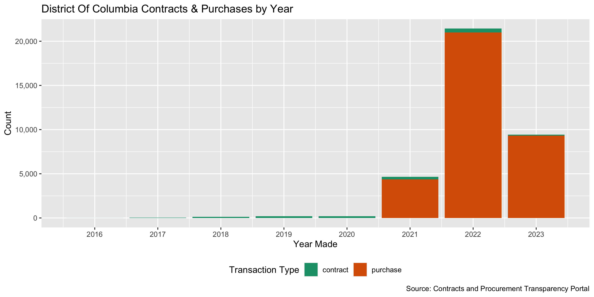

District Of Columbia Contracts
================
Kiernan Nicholls & Aarushi Sahejpal
2023-06-19 11:43:14.407137

- [Project](#project)
- [Objectives](#objectives)
- [Packages](#packages)
- [Data](#data)
- [Read](#read)
- [Explore](#explore)
- [Wrangle](#wrangle)
- [Conclude](#conclude)
- [Export](#export)
- [Upload](#upload)
- [Dictionary](#dictionary)

<!-- Place comments regarding knitting here -->

## Project

The Accountability Project is an effort to cut across data silos and
give journalists, policy professionals, activists, and the public at
large a simple way to search across huge volumes of public data about
people and organizations.

Our goal is to standardizing public data on a few key fields by thinking
of each dataset row as a transaction. For each transaction there should
be (at least) 3 variables:

1.  All **parties** to a transaction.
2.  The **date** of the transaction.
3.  The **amount** of money involved.

## Objectives

This document describes the process used to complete the following
objectives:

1.  How many records are in the database?
2.  Check for entirely duplicated records.
3.  Check ranges of continuous variables.
4.  Is there anything blank or missing?
5.  Check for consistency issues.
6.  Create a five-digit ZIP Code called `zip`.
7.  Create a `year` field from the transaction date.
8.  Make sure there is data on both parties to a transaction.

## Packages

The following packages are needed to collect, manipulate, visualize,
analyze, and communicate these results. The `pacman` package will
facilitate their installation and attachment.

The IRW’s `campfin` package will also have to be installed from GitHub.
This package contains functions custom made to help facilitate the
processing of campaign finance data.

``` r
if (!require("pacman")) install.packages("pacman")
pacman::p_load_gh("irworkshop/campfin")
pacman::p_load(
  tidyverse, # data manipulation
  lubridate, # datetime strings
  gluedown, # printing markdown
  magrittr, # pipe operators
  janitor, # clean data frames
  refinr, # cluster and merge
  scales, # format strings
  knitr, # knit documents
  vroom, # read files fast
  rvest, # html scraping
  glue, # combine strings
  here, # relative paths
  httr, # http requests
  fs # local storage 
)
library(dplyr)
```

This document should be run as part of the `R_campfin` project, which
lives as a sub-directory of the more general, language-agnostic
[`irworkshop/accountability_datacleaning`](https://github.com/irworkshop/accountability_datacleaning)
GitHub repository.

The `R_campfin` project uses the [RStudio
projects](https://support.rstudio.com/hc/en-us/articles/200526207-Using-Projects)
feature and should be run as such. The project also uses the dynamic
`here::here()` tool for file paths relative to *your* machine.

``` r
# where does this document knit?
here::here()
#> [1] "/Volumes/TAP/accountability_datacleaning"
```

## Data

A list of contracts by fiscal year can be obtained from the District of
Columbia [Contracts and Procurement Transparency
Portal](https://contracts.ocp.dc.gov/contracts/search). A search can be
run for results by fiscal year. This search can then
be exported as a single CSV file which we can read into R. The same
thing can be done on the [purchase orders
portal](https://contracts.ocp.dc.gov/purchase/search).

## Read

``` r
raw_dir <- dir_create(here("state", "dc", "contracts", "data", "raw"))
```

First, we will read the contract awards file.

``` r
dcc <- read_delim(
  file = path(raw_dir, "ContractAwards.csv"),
  delim = ",",
  locale = locale(date_format = "%m/%d/%Y"),
  col_types = cols(
    .default = col_character(),
    `Start Date` = col_date(),
    `End Date` = col_date(),
    `Award Date` = col_date(),
    `Amount` = col_number()
  )
)
```

Then the we will read the purchase orders file.

``` r
dcp <- read_delim(
  file = path(raw_dir, "PurchaseOrders.csv"),
  delim = ",",
  locale = locale(date_format = "%m/%d/%Y"),
  col_types = cols(
    .default = col_character(),
    `Total Amount` = col_number(),
    `Order Date` = col_date(),
  )
)
```

``` r
dcc <- clean_names(dcc)
dcp <- clean_names(dcp)
```

After making some column names match, the two data frames can be bound
together into a single data frame. For contracts, the `award_date` will
be used as a single date, paired with the `order_date` for purchase
orders. The purchase order `total_amount` will be paired with the
contract’s single `amount`.

``` r
dcc <- rename(
  .data = dcc,
  id = contract_number,
  vendor = vendor_supplier,
  date = award_date
)
```

``` r
dcp <- rename(
  .data = dcp,
  amount = total_amount,
  id = po_number,
  vendor = vendor_supplier,
  date = order_date
)
```

After the two data frames are bound together, columns not found in both
files (e.g., a contract’s `start_date`) will be filed with `NA` for
records from the other data type.

``` r
dcc <- bind_rows(contract = dcc, purchase = dcp, .id = "type")
```

## Explore

``` r
glimpse(dcc)
#> Rows: 36,090
#> Columns: 12
#> $ type          <chr> "contract", "contract", "contract", "contract", "contract", "contract", "co…
#> $ id            <chr> "DCRL-2022-C-0066", "CW99879", "CW105702", "CW108416", "CW99963", "CW99961"…
#> $ title         <chr> "Unaccompanied Refugee Minor Program", "FY22 PROFESSIONAL DEVELOPMENT-BOOT …
#> $ agency        <chr> "Child and Family Services Agency (CFSA)", "Employment Services (DOES)", NA…
#> $ option_period <chr> "Option Year 1", "Option 1", "Base Period", "Base Period", "Option 1", "Opt…
#> $ start_date    <date> 2023-06-19, 2023-06-08, 2023-06-07, 2023-06-05, 2023-06-03, 2023-06-03, 20…
#> $ end_date      <date> 2024-06-18, 2024-06-07, 2024-06-06, 2023-09-30, 2024-06-02, 2024-06-02, 20…
#> $ date          <date> 2023-03-13, 2022-05-26, 2023-06-07, 2023-06-05, 2022-05-26, 2022-05-26, 20…
#> $ nigp_code     <chr> "952-92-00", "9183822", "9929000", "9615342", "9183822", "9183822", "070488…
#> $ vendor        <chr> "Lutheran Social Services of the National Capital Area", "TECKNOMIC LLC", "…
#> $ amount        <dbl> 1927924.0, 100000.0, 950000.0, 28875.0, 100000.0, 100000.0, 782500.0, 12354…
#> $ fiscal_year   <chr> NA, NA, NA, NA, NA, NA, NA, NA, NA, NA, NA, NA, NA, NA, NA, NA, NA, NA, NA,…
tail(dcc)
#> # A tibble: 6 × 12
#>   type    id    title agency option_period start_date end_date date       nigp_code vendor   amount
#>   <chr>   <chr> <chr> <chr>  <chr>         <date>     <date>   <date>     <chr>     <chr>     <dbl>
#> 1 purcha… PO65… <NA>  Chief… <NA>          NA         NA       2021-10-01 9485550   CVPATH … 2.5 e4
#> 2 purcha… PO65… <NA>  Chief… <NA>          NA         NA       2021-10-01 9487452   MEDSTAR… 6   e3
#> 3 purcha… PO65… <NA>  Foren… <NA>          NA         NA       2021-10-01 9614950   WEST PU… 9.68e3
#> 4 purcha… PO65… <NA>  Chief… <NA>          NA         NA       2021-10-01 9586300   THE COL… 7.26e4
#> 5 purcha… PO65… <NA>  Chief… <NA>          NA         NA       2021-10-01 9381800   EMERGEN… 8.32e3
#> 6 purcha… PO64… <NA>  Depar… <NA>          NA         NA       2021-10-01 9529265   NATIONA… 4.79e5
#> # ℹ 1 more variable: fiscal_year <chr>
```

### Missing

There are a handful of records missing a name or date needed to properly
identify a transaction, mostly the agency name.

``` r
col_stats(dcc, count_na)
#> # A tibble: 12 × 4
#>    col           class      n        p
#>    <chr>         <chr>  <int>    <dbl>
#>  1 type          <chr>      0 0       
#>  2 id            <chr>      0 0       
#>  3 title         <chr>  34673 0.961   
#>  4 agency        <chr>    142 0.00393 
#>  5 option_period <chr>  34673 0.961   
#>  6 start_date    <date> 34673 0.961   
#>  7 end_date      <date> 34673 0.961   
#>  8 date          <date>     0 0       
#>  9 nigp_code     <chr>     12 0.000333
#> 10 vendor        <chr>      0 0       
#> 11 amount        <dbl>      0 0       
#> 12 fiscal_year   <chr>   1417 0.0393
```

These records can be flagged with `campfin::flag_na()`.

``` r
dcc <- dcc %>% flag_na(date, vendor, amount, agency)
percent(mean(dcc$na_flag), 0.01)
#> [1] "0.39%"
```

### Duplicates

Ignoring the `id` variable, there are a handful of completely duplicated
records. These can be flagged with `campfin::flag_dupes()`.

``` r
dcc <- flag_dupes(dcc, -id)
percent(mean(dcc$dupe_flag), 0.01)
#> [1] "2.52%"
```

### Categorical

``` r
col_stats(dcc, n_distinct)
#> # A tibble: 14 × 4
#>    col           class      n         p
#>    <chr>         <chr>  <int>     <dbl>
#>  1 type          <chr>      2 0.0000554
#>  2 id            <chr>  35846 0.993    
#>  3 title         <chr>   1170 0.0324   
#>  4 agency        <chr>    106 0.00294  
#>  5 option_period <chr>     17 0.000471 
#>  6 start_date    <date>   470 0.0130   
#>  7 end_date      <date>   484 0.0134   
#>  8 date          <date>   946 0.0262   
#>  9 nigp_code     <chr>   3083 0.0854   
#> 10 vendor        <chr>   6431 0.178    
#> 11 amount        <dbl>  21596 0.598    
#> 12 fiscal_year   <chr>      3 0.0000831
#> 13 na_flag       <lgl>      2 0.0000554
#> 14 dupe_flag     <lgl>      2 0.0000554
```

``` r
add_prop(count(dcc, agency, sort = TRUE))
#> # A tibble: 106 × 3
#>    agency                                         n      p
#>    <chr>                                      <int>  <dbl>
#>  1 District of Columbia Public Schools (DCPS)  4941 0.137 
#>  2 General Services (DGS)                      2907 0.0805
#>  3 Commission on Arts and Humanities (CAH)     2479 0.0687
#>  4 Chief Technology Officer (OCTO)             1740 0.0482
#>  5 Behavioral Health (DBH)                     1625 0.0450
#>  6 Health (DOH)                                1425 0.0395
#>  7 Attorney General (OAG)                      1380 0.0382
#>  8 Employment Services (DOES)                  1107 0.0307
#>  9 Health Care Finance (DHCF)                  1093 0.0303
#> 10 Transportation (DDOT)                       1079 0.0299
#> # ℹ 96 more rows
add_prop(count(dcc, option_period, sort = TRUE))
#> # A tibble: 17 × 3
#>    option_period                          n         p
#>    <chr>                              <int>     <dbl>
#>  1 <NA>                               34673 0.961    
#>  2 Base Period                          611 0.0169   
#>  3 Option 1                             225 0.00623  
#>  4 Option 2                             199 0.00551  
#>  5 Option 3                             189 0.00524  
#>  6 Option 4                             159 0.00441  
#>  7 Base Year                              6 0.000166 
#>  8 Option Year 2                          6 0.000166 
#>  9 Base                                   5 0.000139 
#> 10 Option Year 1                          4 0.000111 
#> 11 Option 5                               3 0.0000831
#> 12 Option Year 3                          3 0.0000831
#> 13 Option Year 4                          2 0.0000554
#> 14 Option Year Two                        2 0.0000554
#> 15 Partial Exercise of  Option Year 4     1 0.0000277
#> 16 Partial Exercise of Option Year 2      1 0.0000277
#> 17 Partial Option Year 1                  1 0.0000277
```

### Continuous

#### Amounts

``` r
noquote(map_chr(summary(dcc$amount), dollar))
#>           Min.        1st Qu.         Median           Mean        3rd Qu.           Max. 
#>             $0      $7,851.75     $32,825.00     $1,257,138       $130,000 $8,830,418,153
sum(dcc$amount <= 0)
#> [1] 708
```

``` r
glimpse(dcc[c(which.min(dcc$amount), which.max(dcc$amount)), ])
#> Rows: 2
#> Columns: 14
#> $ type          <chr> "contract", "contract"
#> $ id            <chr> "CW103109", "CW99931"
#> $ title         <chr> "Inmate Phones (DOC)", "Managed Care Organization - MedStar"
#> $ agency        <chr> "Corrections (DC)", "Health Care Finance (DHCF)"
#> $ option_period <chr> "Base Period", "Base Period"
#> $ start_date    <date> 2022-12-14, 2023-02-01
#> $ end_date      <date> 2023-12-13, 2028-01-31
#> $ date          <date> 2022-12-14, 2022-10-19
#> $ nigp_code     <chr> "9072800", "9585600"
#> $ vendor        <chr> "Global Tel*Link", "MedStar Family Choice"
#> $ amount        <dbl> 0, 8830418153
#> $ fiscal_year   <chr> NA, NA
#> $ na_flag       <lgl> FALSE, FALSE
#> $ dupe_flag     <lgl> FALSE, FALSE
```

#### Dates

We can add the calendar year from `date` with `lubridate::year()`

``` r
dcc <- mutate(dcc, year = year(date))
```

Aside from a few of contracts awarded much earlier, the date columns are
clean.

``` r
count_na(dcc$date)
#> [1] 0
min(dcc$date, na.rm = TRUE)
#> [1] "2016-06-28"
sum(dcc$year < 2012, na.rm = TRUE)
#> [1] 0
max(dcc$date, na.rm = TRUE)
#> [1] "2023-06-10"
sum(dcc$date > today(), na.rm = TRUE)
#> [1] 0
```

<!-- -->

## Wrangle

There are no geographic variables, but we can add a 2-digit state
abbreviation for the spending agency.

``` r
dcc <- mutate(dcc, state = "dc", .after = agency)
```

## Conclude

1.  There are 36,090 records in the database.
2.  There are 910 duplicate records in the database.
3.  The range and distribution of `amount` and `award_date` seem
    reasonable.
4.  There are 142 records missing key variables.
5.  Consistency in geographic data has been improved with
    `campfin::normal_*()`.
6.  The 4-digit `award_year` variable has been created with
    `lubridate::year()`.

## Export

Now the file can be saved on disk for upload to the Accountability
server.

``` r
clean_dir <- dir_create(here("state", "dc", "contracts", "data", "clean"))
clean_csv <- path(clean_dir, "dc_contracts_20160628-20230610.csv")
write_csv(dcc, clean_csv, na = "")
file_size(clean_csv)
#> 4.58M
mutate(file_encoding(clean_csv), across(path, path.abbrev))
#> # A tibble: 1 × 3
#>   path                                                                                mime  charset
#>   <fs::path>                                                                          <chr> <chr>  
#> 1 …lity_datacleaning/state/dc/contracts/data/clean/dc_contracts_20160628-20230610.csv <NA>  <NA>
```

## Upload

We can use the `aws.s3::put_object()` to upload the text file to the IRW
server.

``` r
aws_key <- path("csv", basename(clean_csv))
if (!object_exists(aws_key, "publicaccountability")) {
  put_object(
    file = clean_csv,
    object = aws_key, 
    bucket = "publicaccountability",
    acl = "public-read",
    show_progress = TRUE,
    multipart = TRUE
  )
}
aws_head <- head_object(aws_key, "publicaccountability")
(aws_size <- as_fs_bytes(attr(aws_head, "content-length")))
```

## Dictionary

The following table describes the variables in our final exported file:

| Column          | Found in both | Type  | Definition                                         |
|:----------------|:--------------|:------|:---------------------------------------------------|
| `type`          | `character`   | TRUE  | Transaction type (contract or purchae)             |
| `id`            | `character`   | TRUE  | Unique contract number                             |
| `title`         | `character`   | TRUE  | Contract title                                     |
| `agency`        | `character`   | TRUE  | Awarding agency name                               |
| `state`         | `character`   | FALSE | Awarding agency state location                     |
| `option_period` | `character`   | FALSE | Option period awarded                              |
| `start_date`    | `double`      | FALSE | Contract start date                                |
| `end_date`      | `double`      | TRUE  | Contract end date                                  |
| `date`          | `double`      | TRUE  | Contract awarded date, purchase made date          |
| `nigp_code`     | `character`   | TRUE  | National Institute of Governmental Purchasing code |
| `vendor`        | `character`   | TRUE  | Recipient vendor name                              |
| `amount`        | `double`      | FALSE | Contract amount awarded, total purchase amount     |
| `fiscal_year`   | `character`   | NA    | Purchase order fiscal year                         |
| `na_flag`       | `logical`     | NA    | Flag for missing date, amount, or name             |
| `dupe_flag`     | `logical`     | NA    | Flag for completely duplicated record              |
| `year`          | `double`      | TRUE  | Calendar year contract awarded                     |

``` r
write_lines(
  x = c("# District Of Columbia Contracts Data Dictionary\n", dict_md),
  file = here("state", "dc", "contracts", "dc_contracts_dict.md"),
)
```
