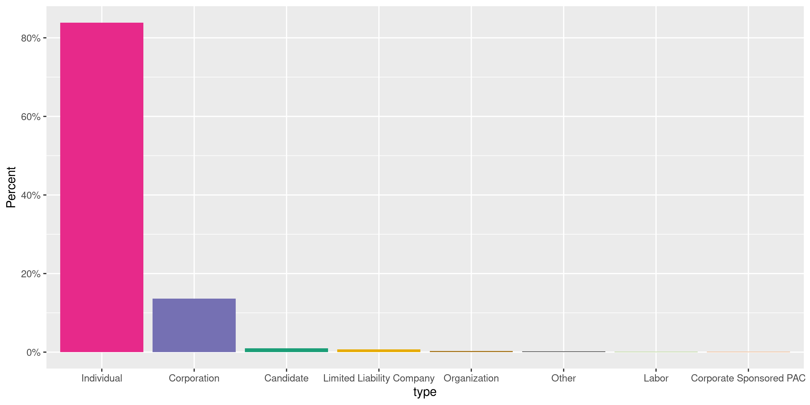
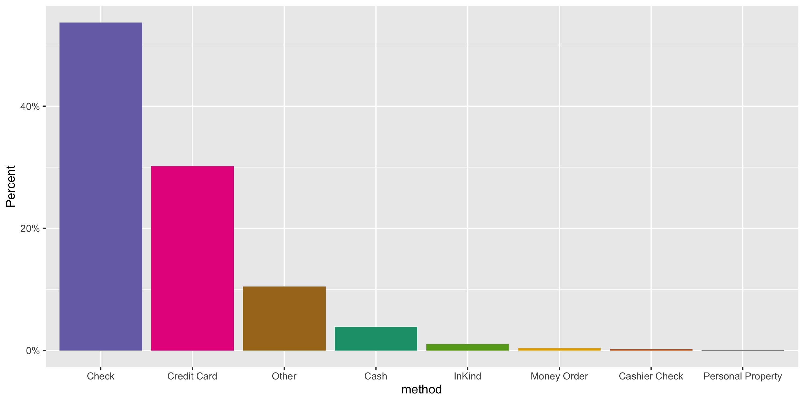
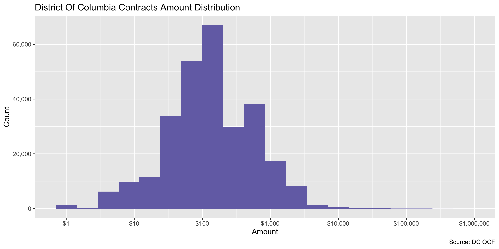
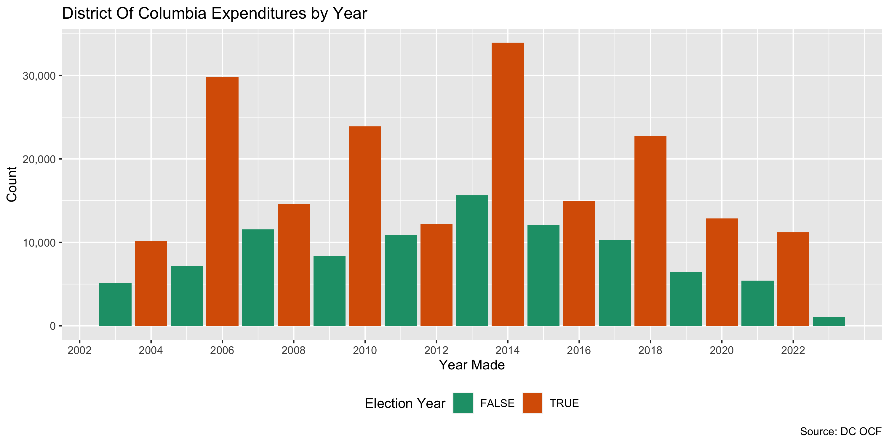
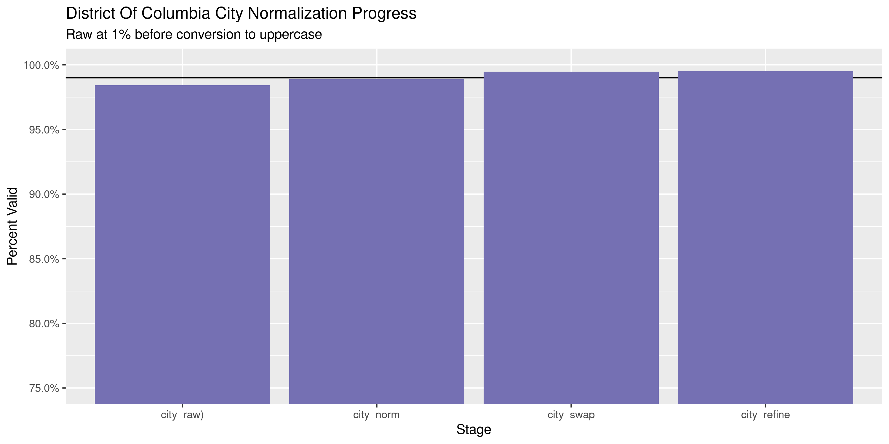
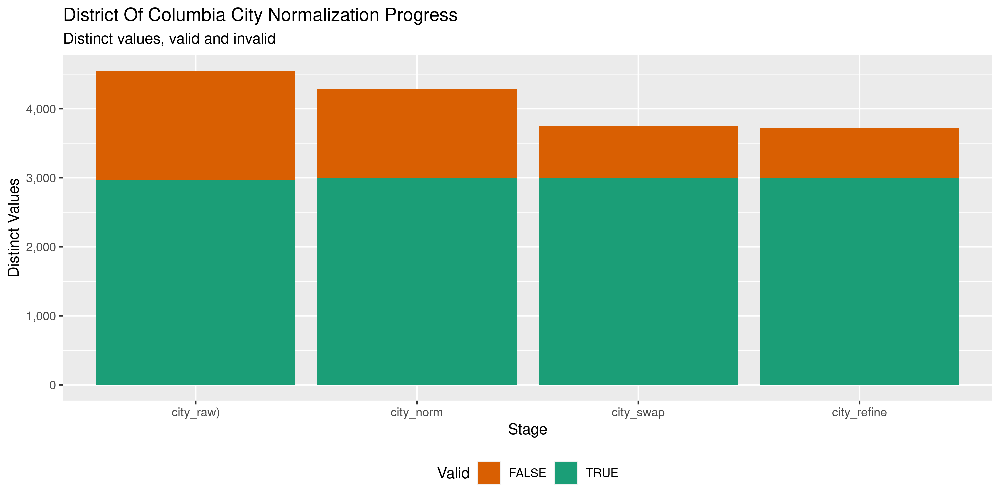

District Of Columbia Contributions
================
Kiernan Nicholls
2020-10-08 12:21:22

  - [Project](#project)
  - [Objectives](#objectives)
  - [Packages](#packages)
  - [Data](#data)
  - [Download](#download)
  - [Read](#read)
  - [Explore](#explore)
  - [Wrangle](#wrangle)
  - [Conclude](#conclude)
  - [Export](#export)
  - [Upload](#upload)
  - [Dictionary](#dictionary)

<!-- Place comments regarding knitting here -->

## Project

The Accountability Project is an effort to cut across data silos and
give journalists, policy professionals, activists, and the public at
large a simple way to search across huge volumes of public data about
people and organizations.

Our goal is to standardizing public data on a few key fields by thinking
of each dataset row as a transaction. For each transaction there should
be (at least) 3 variables:

1.  All **parties** to a transaction.
2.  The **date** of the transaction.
3.  The **amount** of money involved.

## Objectives

This document describes the process used to complete the following
objectives:

1.  How many records are in the database?
2.  Check for entirely duplicated records.
3.  Check ranges of continuous variables.
4.  Is there anything blank or missing?
5.  Check for consistency issues.
6.  Create a five-digit ZIP Code called `zip`.
7.  Create a `year` field from the transaction date.
8.  Make sure there is data on both parties to a transaction.

## Packages

The following packages are needed to collect, manipulate, visualize,
analyze, and communicate these results. The `pacman` package will
facilitate their installation and attachment.

The IRW’s `campfin` package will also have to be installed from GitHub.
This package contains functions custom made to help facilitate the
processing of campaign finance data.

``` r
if (!require("pacman")) install.packages("pacman")
pacman::p_load_gh("irworkshop/campfin")
pacman::p_load(
  tidyverse, # data manipulation
  lubridate, # datetime strings
  gluedown, # printing markdown
  magrittr, # pipe operators
  aws.s3, # upload to aws s3
  janitor, # clean data frames
  refinr, # cluster and merge
  scales, # format strings
  knitr, # knit documents
  vroom, # read files fast
  rvest, # html scraping
  glue, # combine strings
  here, # relative paths
  httr, # http requests
  fs # local storage 
)
```

This document should be run as part of the `R_campfin` project, which
lives as a sub-directory of the more general, language-agnostic
[`irworkshop/accountability_datacleaning`](https://github.com/irworkshop/accountability_datacleaning)
GitHub repository.

The `R_campfin` project uses the [RStudio
projects](https://support.rstudio.com/hc/en-us/articles/200526207-Using-Projects)
feature and should be run as such. The project also uses the dynamic
`here::here()` tool for file paths relative to *your* machine.

``` r
# where does this document knit?
here::here()
#> [1] "/home/kiernan/Code/tap/R_campfin"
```

## Data

Data comes courtesy of the Washington, [DC Office of Campaign Finance
(OCF)](https://ocf.dc.gov/).

As the [OCF
website](https://ocf.dc.gov/service/view-contributions-expenditures)
explains:

> The Office of Campaign Finance (OCF) provides easy access to all
> contributions and expenditures reported from 2003, through the current
> reporting period. Because the system is updated on a daily basis, you
> may be able to retrieve data received by OCF after the latest
> reporting period. This data is as reported, but may not be complete.

The data is found on the dc.gov [OpenData
website](https://opendata.dc.gov/datasets/campaign-financial-expenditures).
The file abstract reads:

> The Office of Campaign Finance (OCF) is pleased to publicly share
> election campaign contribution data. The Campaign Finance Office is
> charged with administering and enforcing the District of Columbia laws
> pertaining to campaign finance operations, lobbying activities,
> conflict of interest matters, the ethical conduct of public officials,
> and constituent service and statehood fund programs. OCF provides easy
> access to all contributions and expenditures reported from 2003,
> through the current reporting period. Because the system is updated on
> a daily basis, you may be able to retrieve data received by OCF after
> the latest reporting period. This data is as reported, but may not be
> complete. Visit the <http://ocf.dc.gov> for more information.

## Download

Contributions should be downloaded by hand to the raw directory.

``` r
raw_dir <- dir_create(here("dc", "contribs", "data", "raw"))
```

Contributions are retrieved by filter type drop down menu.

``` r
read_html("https://efiling.ocf.dc.gov/ContributionExpenditure") %>% 
  html_nodes("#FilerTypeId> option") %>%
  html_text() %>% 
  extract(-1) %>% 
  str_trim() %>% 
  md_bullet()
```

  - Principal Campaign Committee
  - Political Action Committee
  - Initiative
  - Referendum
  - Recall
  - Transition Committee
  - Inaugural Committee
  - Legal Defense Committee
  - Independent Expenditure Committee
  - Exploratory Committee
  - Senators & Representatives
  - Constituent Service Program
  - Advisory Neighborhood Commission

## Read

``` r
raw_paths <- dir_ls(raw_dir)
md_bullet(md_code(path.abbrev(raw_paths)))
```

  - `~/dc/contribs/data/raw/ContributionsSearchResult-CSP.csv`
  - `~/dc/contribs/data/raw/ContributionsSearchResult-Explore.csv`
  - `~/dc/contribs/data/raw/ContributionsSearchResult-IEC.csv`
  - `~/dc/contribs/data/raw/ContributionsSearchResult-Inag.csv`
  - `~/dc/contribs/data/raw/ContributionsSearchResult-Int.csv`
  - `~/dc/contribs/data/raw/ContributionsSearchResult-Legal.csv`
  - `~/dc/contribs/data/raw/ContributionsSearchResult-PAC.csv`
  - `~/dc/contribs/data/raw/ContributionsSearchResult-PCC.csv`
  - `~/dc/contribs/data/raw/ContributionsSearchResult-Rec.csv`
  - `~/dc/contribs/data/raw/ContributionsSearchResult-Ref.csv`
  - `~/dc/contribs/data/raw/ContributionsSearchResult-Rep.csv`

These files have a troublesome encoding. We can read and re-write them.

``` r
for (p in raw_paths) {
  write_csv(
    path = p,
    x = read.csv(
      file = p, skip = 1,
      fileEncoding = "UTF-16LE", 
    )
  )
}
```

The new files can be read into a single data frame.

``` r
dcc <- map_df(
  .x = raw_paths,
  .f = read_csv,
  skip = 1,
  col_names = read_names(raw_paths[2]),
  col_types = cols(
    .default = col_character(),
    Receipt.Date = col_date_usa(),
    Amount = col_number()
  )
)
```

``` r
dcc <- dcc %>% 
  clean_names("snake") %>% 
  rename(
    committee = committee_name,
    first = contributor_first_name,
    middle = contributor_middle_name,
    last = contributor_last_name,
    org = contributor_organization_name,
    address = number_and_street,
    type = contributor_type,
    method = contribution_type,
    employer = employer_name,
    date = receipt_date,
  )
```

## Explore

There are 256,231 rows of 16 columns.

``` r
glimpse(dcc)
#> Rows: 256,231
#> Columns: 16
#> $ committee        <chr> "Brazil Constituent Fund", "Brazil Constituent Fund", "Brazil Constitue…
#> $ first            <chr> NA, NA, "CAROLYN", NA, NA, NA, "DAVID", NA, "ELEANOR", "ERIC", NA, "GEO…
#> $ middle           <chr> NA, NA, NA, NA, NA, NA, NA, NA, NA, NA, NA, NA, NA, NA, NA, NA, NA, NA,…
#> $ last             <chr> NA, NA, "LONG", NA, NA, NA, "LEVY", NA, "HEDDEN", "ROGERS", NA, "LOWE",…
#> $ org              <chr> "American Insurance Association", "Bell Multi Cul. Sch.", NA, "COMCAST"…
#> $ address          <chr> "1130 Connecticut Avenue N.W.", "3145 Hiatt Pl. NW", "1527 28TH ST SE #…
#> $ city             <chr> "Washington", "Washington", "Washington", "PHILA", "Washington", "Lanca…
#> $ state            <chr> "DC", "DC", "DC", "PA", "DC", "PA", "DC", "DC", "DC", "DC", "DC", "DC",…
#> $ zip              <chr> "20036", "20010", "20020", "19102", "20018", "17604", "20008", "20004",…
#> $ type             <chr> "Corporation", "Corporation", "Individual", "Corporation", "Corporation…
#> $ method           <chr> "Other", "Other", "Other", "Other", "Other", "Other", "Other", "Other",…
#> $ employer         <chr> NA, NA, "DC COUNCIL", NA, NA, NA, "CORCORAN GALLERY", NA, "N/A", "DC CO…
#> $ employer_address <chr> NA, NA, "1350 PENNA AVE NW, Washington, DC 20004", NA, NA, NA, "17TH ST…
#> $ occupation       <chr> NA, NA, "RECEPTIONIST", NA, NA, NA, "PRESIDENT", NA, "CIVIC LEADER", "S…
#> $ date             <date> 2003-04-17, 2003-02-03, 2004-05-10, 2004-01-09, 2003-03-18, 2003-02-03…
#> $ amount           <dbl> 400.00, 200.00, 250.00, 400.00, 100.00, 91.99, 200.00, 50.00, 250.00, 2…
tail(dcc)
#> # A tibble: 6 x 16
#>   committee first middle last  org   address city  state zip   type  method employer
#>   <chr>     <chr> <chr>  <chr> <chr> <chr>   <chr> <chr> <chr> <chr> <chr>  <chr>   
#> 1 Ray Brow… RAY   <NA>   JONES <NA>  1155 C… Wash… DC    20036 Indi… Other  <NA>    
#> 2 Ray Brow… ROBE… M      BRAN… <NA>  3417 W… Wash… DC    20016 Indi… Other  <NA>    
#> 3 Ray Brow… SHEL… L      TOMK… <NA>  5816 N… Wash… DC    20015 Indi… Other  <NA>    
#> 4 Ray Brow… THORN L      POZEN <NA>  4822 U… Wash… DC    20016 Indi… Other  DC COUN…
#> 5 Ray Brow… Walt… D      Clin… <NA>  2101 C… Wash… DC    20008 Indi… Other  Self    
#> 6 Ray Brow… WALT… D      CLIN… <NA>  2101 C… Wash… DC    20008 Indi… Other  SELF    
#> # … with 4 more variables: employer_address <chr>, occupation <chr>, date <date>, amount <dbl>
```

### Missing

Columns vary in their degree of missing values.

``` r
col_stats(dcc, count_na)
#> # A tibble: 16 x 4
#>    col              class       n       p
#>    <chr>            <chr>   <int>   <dbl>
#>  1 committee        <chr>       0 0      
#>  2 first            <chr>   39376 0.154  
#>  3 middle           <chr>  205334 0.801  
#>  4 last             <chr>   39394 0.154  
#>  5 org              <chr>   54565 0.213  
#>  6 address          <chr>  162957 0.636  
#>  7 city             <chr>     283 0.00110
#>  8 state            <chr>     495 0.00193
#>  9 zip              <chr>     278 0.00108
#> 10 type             <chr>     602 0.00235
#> 11 method           <chr>    1632 0.00637
#> 12 employer         <chr>   97942 0.382  
#> 13 employer_address <chr>  144642 0.564  
#> 14 occupation       <chr>  114844 0.448  
#> 15 date             <date>      0 0      
#> 16 amount           <dbl>       0 0
```

We should first create a single variable for a combined contributor
name.

``` r
dcc <- unite(
  data = dcc,
  col = contributor,
  first, middle, last, org,
  sep = " ",
  na.rm = TRUE,
  remove = FALSE
)
```

We can then flag any records missing a key variable like a name or
number.

``` r
key_vars <- c("date", "contributor", "amount", "committee")
dcc <- flag_na(dcc, all_of(key_vars))
sum(dcc$na_flag)
#> [1] 0
```

``` r
dcc %>% 
  filter(na_flag) %>% 
  select(all_of(key_vars))
#> # A tibble: 0 x 4
#> # … with 4 variables: date <date>, contributor <chr>, amount <dbl>, committee <chr>
```

### Duplicates

We can also flag duplicate records.

``` r
dcc <- flag_dupes(dcc, everything())
percent(mean(dcc$dupe_flag))
#> [1] "1%"
```

``` r
dcc %>% 
  filter(dupe_flag) %>% 
  select(all_of(key_vars))
#> # A tibble: 3,835 x 4
#>    date       contributor             amount committee                                           
#>    <date>     <chr>                    <dbl> <chr>                                               
#>  1 2012-12-15 Adelaide Miller             75 Councilmember Muriel Bowser Constituent Service Fund
#>  2 2012-12-15 Adelaide Miller             75 Councilmember Muriel Bowser Constituent Service Fund
#>  3 2012-12-15 Allen Beach                 50 Councilmember Muriel Bowser Constituent Service Fund
#>  4 2012-12-15 Allen Beach                 50 Councilmember Muriel Bowser Constituent Service Fund
#>  5 2012-12-15 Allie Black                 10 Councilmember Muriel Bowser Constituent Service Fund
#>  6 2012-12-15 Allie Black                 10 Councilmember Muriel Bowser Constituent Service Fund
#>  7 2012-12-15 Alvanette & Derek Jones     25 Councilmember Muriel Bowser Constituent Service Fund
#>  8 2012-12-15 Alvanette & Derek Jones     25 Councilmember Muriel Bowser Constituent Service Fund
#>  9 2012-12-15 Anita Bonds                 40 Councilmember Muriel Bowser Constituent Service Fund
#> 10 2012-12-15 Anita Bonds                 40 Councilmember Muriel Bowser Constituent Service Fund
#> # … with 3,825 more rows
```

### Categorical

``` r
col_stats(dcc, n_distinct)
#> # A tibble: 19 x 4
#>    col              class       n          p
#>    <chr>            <chr>   <int>      <dbl>
#>  1 committee        <chr>     846 0.00330   
#>  2 contributor      <chr>  170646 0.666     
#>  3 first            <chr>   19835 0.0774    
#>  4 middle           <chr>     559 0.00218   
#>  5 last             <chr>   36219 0.141     
#>  6 org              <chr>  127348 0.497     
#>  7 address          <chr>   40401 0.158     
#>  8 city             <chr>    5135 0.0200    
#>  9 state            <chr>      81 0.000316  
#> 10 zip              <chr>    7758 0.0303    
#> 11 type             <chr>      28 0.000109  
#> 12 method           <chr>       9 0.0000351 
#> 13 employer         <chr>   38854 0.152     
#> 14 employer_address <chr>   23679 0.0924    
#> 15 occupation       <chr>   15970 0.0623    
#> 16 date             <date>   6153 0.0240    
#> 17 amount           <dbl>    5194 0.0203    
#> 18 na_flag          <lgl>       1 0.00000390
#> 19 dupe_flag        <lgl>       2 0.00000781
```

<!-- --><!-- -->

### Amounts

``` r
summary(dcc$amount)
#>     Min.  1st Qu.   Median     Mean  3rd Qu.     Max. 
#> -31889.2     50.0    100.0    371.5    400.0 536000.0
mean(dcc$amount <= 0)
#> [1] 0.0007415184
```

<!-- -->

### Dates

We can add the calendar year from `date` with `lubridate::year()`

``` r
dcc <- mutate(dcc, year = year(date))
```

``` r
min(dcc$date)
#> [1] "2003-01-01"
sum(dcc$year < 2000)
#> [1] 0
max(dcc$date)
#> [1] "2020-09-14"
sum(dcc$date > today())
#> [1] 0
```

<!-- -->

## Wrangle

To improve the searchability of the database, we will perform some
consistent, confident string normalization. For geographic variables
like city names and ZIP codes, the corresponding `campfin::normal_*()`
functions are tailor made to facilitate this process.

### Address

For the street `addresss` variable, the `campfin::normal_address()`
function will force consistence case, remove punctuation, and abbreviate
official USPS suffixes.

``` r
dcc <- dcc %>% 
  mutate(
    address_norm = normal_address(
      address = address,
      abbs = usps_street,
      na_rep = TRUE
    )
  )
```

``` r
dcc %>% 
  select(contains("address")) %>% 
  distinct() %>% 
  sample_n(10)
#> # A tibble: 10 x 3
#>    address                       employer_address                       address_norm               
#>    <chr>                         <chr>                                  <chr>                      
#>  1 Bayside Fire Protection LLC   <NA>                                   BAYSIDE FIRE PROTECTION LLC
#>  2 913 Lorraine Drive            44 East Mifflin Street, Madison, WI 5… 913 LORRAINE DR            
#>  3 <NA>                          617 Kennedy St NW, Washington, DC 200… <NA>                       
#>  4 <NA>                          1413 K st NW, Washington, DC 20005     <NA>                       
#>  5 2601 Klingle Rd. NW           Washington, DC                         2601 KLINGLE RD NW         
#>  6 Brownstein Hyatt Farber Schr… <NA>                                   BROWNSTEIN HYATT FARBER SC…
#>  7 Robert Willis Attorney At Law <NA>                                   ROBERT WILLIS ATTORNEY AT …
#>  8 4949 Battery Lane             <NA>                                   4949 BATTERY LN            
#>  9 <NA>                          2311 Wisconsin Ave NW, Washington, DC… <NA>                       
#> 10 CITIWIDE COMPUTER TRAINING C… <NA>                                   CITIWIDE COMPUTER TRAINING…
```

### ZIP

For ZIP codes, the `campfin::normal_zip()` function will attempt to
create valid *five* digit codes by removing the ZIP+4 suffix and
returning leading zeroes dropped by other programs like Microsoft Excel.

``` r
dcc <- dcc %>% 
  mutate(
    zip_norm = normal_zip(
      zip = zip,
      na_rep = TRUE
    )
  )
```

``` r
progress_table(
  dcc$zip,
  dcc$zip_norm,
  compare = valid_zip
)
#> # A tibble: 2 x 6
#>   stage    prop_in n_distinct prop_na n_out n_diff
#>   <chr>      <dbl>      <dbl>   <dbl> <dbl>  <dbl>
#> 1 zip        0.970       7758 0.00108  7560   1544
#> 2 zip_norm   0.997       6621 0.00622   888    383
```

### State

Valid two digit state abbreviations can be made using the
`campfin::normal_state()` function.

``` r
dcc <- dcc %>% 
  mutate(
    state_norm = normal_state(
      state = state,
      abbreviate = TRUE,
      na_rep = TRUE,
      valid = valid_state
    )
  )
```

``` r
dcc %>% 
  filter(state != state_norm) %>% 
  count(state, state_norm, sort = TRUE)
#> # A tibble: 18 x 3
#>    state                state_norm     n
#>    <chr>                <chr>      <int>
#>  1 Maryland             MD            68
#>  2 Florida              FL            40
#>  3 Virginia             VA            17
#>  4 District of Columbia DC             4
#>  5 Pennsylvania         PA             4
#>  6 California           CA             3
#>  7 New York             NY             3
#>  8 Alabama              AL             2
#>  9 Connecticut          CT             2
#> 10 Georgia              GA             2
#> 11 North Carolina       NC             2
#> 12 Ohio                 OH             2
#> 13 Texas                TX             2
#> 14 Wisconsin            WI             2
#> 15 Illinois             IL             1
#> 16 Mississippi          MS             1
#> 17 Missouri             MO             1
#> 18 New Jersey           NJ             1
```

``` r
progress_table(
  dcc$state,
  dcc$state_norm,
  compare = valid_state
)
#> # A tibble: 2 x 6
#>   stage      prop_in n_distinct prop_na n_out n_diff
#>   <chr>        <dbl>      <dbl>   <dbl> <dbl>  <dbl>
#> 1 state        0.999         81 0.00193   190     26
#> 2 state_norm   1             56 0.00206     0      1
```

### City

Cities are the most difficult geographic variable to normalize, simply
due to the wide variety of valid cities and formats.

#### Normal

The `campfin::normal_city()` function is a good start, again converting
case, removing punctuation, but *expanding* USPS abbreviations. We can
also remove `invalid_city` values.

``` r
dcc <- dcc %>% 
  mutate(
    city_norm = normal_city(
      city = city, 
      abbs = usps_city,
      states = c("DC", "DC", "DISTRICT OF COLUMBIA"),
      na = invalid_city,
      na_rep = TRUE
    )
  )
```

#### Swap

We can further improve normalization by comparing our normalized value
against the *expected* value for that record’s state abbreviation and
ZIP code. If the normalized value is either an abbreviation for or very
similar to the expected value, we can confidently swap those two.

``` r
dcc <- dcc %>% 
  rename(city_raw = city) %>% 
  left_join(
    y = zipcodes,
    by = c(
      "state_norm" = "state",
      "zip_norm" = "zip"
    )
  ) %>% 
  rename(city_match = city) %>% 
  mutate(
    match_abb = is_abbrev(city_norm, city_match),
    match_dist = str_dist(city_norm, city_match),
    city_swap = if_else(
      condition = !is.na(match_dist) & (match_abb | match_dist == 1),
      true = city_match,
      false = city_norm
    )
  ) %>% 
  select(
    -city_match,
    -match_dist,
    -match_abb
  )
```

#### Refine

The [OpenRefine](https://openrefine.org/) algorithms can be used to
group similar strings and replace the less common versions with their
most common counterpart. This can greatly reduce inconsistency, but with
low confidence; we will only keep any refined strings that have a valid
city/state/zip combination.

``` r
good_refine <- dcc %>% 
  mutate(
    city_refine = city_swap %>% 
      key_collision_merge() %>% 
      n_gram_merge(numgram = 1)
  ) %>% 
  filter(city_refine != city_swap) %>% 
  inner_join(
    y = zipcodes,
    by = c(
      "city_refine" = "city",
      "state_norm" = "state",
      "zip_norm" = "zip"
    )
  )
```

    #> # A tibble: 27 x 5
    #>    state_norm zip_norm city_swap         city_refine           n
    #>    <chr>      <chr>    <chr>             <chr>             <int>
    #>  1 FL         32082    PONTE VERDE BEACH PONTE VEDRA BEACH     2
    #>  2 MD         20616    BRYAN ROADS       BRYANS ROAD           2
    #>  3 MD         20910    SIL VER SPRINGS   SILVER SPRING         2
    #>  4 MD         21117    OWNINGS MILL      OWINGS MILLS          2
    #>  5 NY         11733    SETAUKET          EAST SETAUKET         2
    #>  6 CA         94111    SAN FRANCISCO CA  SAN FRANCISCO         1
    #>  7 DC         20057    WASHINGONT        WASHINGTON            1
    #>  8 GA         30022    ALPHERTTA         ALPHARETTA            1
    #>  9 GA         30067    MARRIETA          MARIETTA              1
    #> 10 LA         70116    NEWS ORLEAN       NEW ORLEANS           1
    #> # … with 17 more rows

Then we can join the refined values back to the database.

``` r
dcc <- dcc %>% 
  left_join(good_refine, by = names(.)) %>% 
  mutate(city_refine = coalesce(city_refine, city_swap))
```

#### Progress

| stage        | prop\_in | n\_distinct | prop\_na | n\_out | n\_diff |
| :----------- | -------: | ----------: | -------: | -----: | ------: |
| city\_raw)   |    0.984 |        4552 |    0.001 |   4013 |    1586 |
| city\_norm   |    0.989 |        4292 |    0.002 |   2882 |    1302 |
| city\_swap   |    0.995 |        3750 |    0.002 |   1330 |     758 |
| city\_refine |    0.995 |        3725 |    0.002 |   1294 |     733 |

You can see how the percentage of valid values increased with each
stage.

<!-- -->

More importantly, the number of distinct values decreased each stage. We
were able to confidently change many distinct invalid values to their
valid equivalent.

<!-- -->

## Conclude

Before exporting, we can remove the intermediary normalization columns
and rename all added variables with the `_clean` suffix.

``` r
dcc <- dcc %>% 
  select(
    -city_norm,
    -city_swap,
    city_clean = city_refine
  ) %>% 
  rename_all(~str_replace(., "_norm", "_clean")) %>% 
  rename_all(~str_remove(., "_raw"))
```

``` r
glimpse(sample_n(dcc, 50))
#> Rows: 50
#> Columns: 24
#> $ committee        <chr> "Verizon Communications Inc. Good Government Club - Washington DC", "Fe…
#> $ contributor      <chr> "Shelley R Robinette", "Tasha Hailey 1945 7th Ave.", "James Beers 3801 …
#> $ first            <chr> "Shelley", "Tasha", "James", "Tammie", "Richard", NA, "John", "Kerry", …
#> $ middle           <chr> "R", NA, NA, "B", NA, NA, NA, "B", NA, NA, NA, NA, "F", NA, "V", NA, "G…
#> $ last             <chr> "Robinette", "Hailey", "Beers", "Cottom", "Ross", NA, "Hoskinson", "Lon…
#> $ org              <chr> NA, "1945 7th Ave.", "3801 Fordham Road NW", "213 Shivers Run Court", N…
#> $ address          <chr> "7245 Wickford Dr.", NA, NA, NA, "3000 K St NW", "Yekcuts, LLC", "888 1…
#> $ city             <chr> "Alexandria", "New York", "Washington", "Mullica Hill", "Washington", "…
#> $ state            <chr> "VA", "DC", "DC", "NJ", "DC", "MD", "DC", "MD", "DC", "DC", "DC", "PA",…
#> $ zip              <chr> "22315", "10026", "20016", "08062", "20007", "20744", "20006", "21401",…
#> $ type             <chr> "Individual", "Individual", "Individual", "Individual", "Individual", "…
#> $ method           <chr> "Check", "Check", "Check", "Check", "Check", "Check", "Other", "Check",…
#> $ employer         <chr> "Verizon Corporate Svcs. Corp", "Pfizer, Inc.", "Beers & Cutler", NA, "…
#> $ employer_address <chr> "Washington, DC", "Washington, DC", "Washington, DC", NA, "Washington, …
#> $ occupation       <chr> "Sr. Staff CSLT-Lobbyist-STA", "Attorney", "Accountant", NA, "Realtor",…
#> $ date             <date> 2005-04-01, 2006-01-31, 2006-06-01, 2005-08-01, 2013-12-30, 2004-10-21…
#> $ amount           <dbl> 25.00, 200.00, 250.00, 200.00, 50.00, 200.00, 400.00, 500.00, 500.00, 1…
#> $ na_flag          <lgl> FALSE, FALSE, FALSE, FALSE, FALSE, FALSE, FALSE, FALSE, FALSE, FALSE, F…
#> $ dupe_flag        <lgl> FALSE, FALSE, FALSE, FALSE, FALSE, FALSE, FALSE, FALSE, FALSE, FALSE, F…
#> $ year             <dbl> 2005, 2006, 2006, 2005, 2013, 2004, 2009, 2006, 2016, 2010, 2006, 2009,…
#> $ address_clean    <chr> "7245 WICKFORD DR", NA, NA, NA, "3000 K ST NW", "YEKCUTS LLC", "888 17 …
#> $ zip_clean        <chr> "22315", "10026", "20016", "08062", "20007", "20744", "20006", "21401",…
#> $ state_clean      <chr> "VA", "DC", "DC", "NJ", "DC", "MD", "DC", "MD", "DC", "DC", "DC", "PA",…
#> $ city_clean       <chr> "ALEXANDRIA", "NEW YORK", "WASHINGTON", "MULLICA HILL", "WASHINGTON", "…
```

1.  There are 256,235 records in the database.
2.  There are 3,839 duplicate records in the database.
3.  The range and distribution of `amount` and `date` seem reasonable.
4.  There are 0 records missing key variables.
5.  Consistency in geographic data has been improved with
    `campfin::normal_*()`.
6.  The 4-digit `year` variable has been created with
    `lubridate::year()`.

## Export

Now the file can be saved on disk for upload to the Accountability
server.

``` r
clean_dir <- dir_create(here("dc", "contribs", "data", "clean"))
clean_path <- path(clean_dir, "dc_contribs_clean.csv")
write_csv(dcc, clean_path, na = "")
(clean_size <- file_size(clean_path))
#> 55.5M
file_encoding(clean_path) %>% 
  mutate(across(path, path.abbrev))
#> # A tibble: 1 x 3
#>   path                                           mime            charset 
#>   <chr>                                          <chr>           <chr>   
#> 1 ~/dc/contribs/data/clean/dc_contribs_clean.csv application/csv us-ascii
```

## Upload

We can use the `aws.s3::put_object()` to upload the text file to the IRW
server.

``` r
s3_path <- path("csv", basename(clean_path))
if (!object_exists(s3_path, "publicaccountability")) {
  put_object(
    file = clean_path,
    object = s3_path, 
    bucket = "publicaccountability",
    acl = "public-read",
    show_progress = TRUE,
    multipart = TRUE
  )
}
s3_head <- head_object(s3_path, "publicaccountability")
(s3_size <- as_fs_bytes(attr(s3_head, "content-length")))
#> 55.5M
unname(s3_size == clean_size)
#> [1] TRUE
```

## Dictionary

The following table describes the variables in our final exported file:

| Column             | Type        | Definition                             |
| :----------------- | :---------- | :------------------------------------- |
| `committee`        | `character` | Recipient committee name               |
| `contributor`      | `character` | Contributor full name                  |
| `first`            | `character` | Contributor first name                 |
| `middle`           | `character` | Contributor middle name                |
| `last`             | `character` | Contributor last name                  |
| `org`              | `character` | Contributor organization name          |
| `address`          | `character` | Contributor street address             |
| `city`             | `character` | Contributor city name                  |
| `state`            | `character` | Contributor state abbreviation         |
| `zip`              | `character` | Contributor ZIP+4 code                 |
| `type`             | `character` | Contributor type                       |
| `method`           | `character` | Contribution method                    |
| `employer`         | `character` | Contributor employer name              |
| `employer_address` | `character` | Contributor employer address           |
| `occupation`       | `character` | Contributor occupation                 |
| `date`             | `double`    | Date contribution was made             |
| `amount`           | `double`    | Contribution amount or correction      |
| `na_flag`          | `logical`   | Flag for missing date, amount, or name |
| `dupe_flag`        | `logical`   | Flag for completely duplicated record  |
| `year`             | `double`    | Calendar year of contribution date     |
| `address_clean`    | `character` | Normalized combined street address     |
| `zip_clean`        | `character` | Normalized 5-digit ZIP code            |
| `state_clean`      | `character` | Normalized 2-digit state abbreviation  |
| `city_clean`       | `character` | Normalized city name                   |
