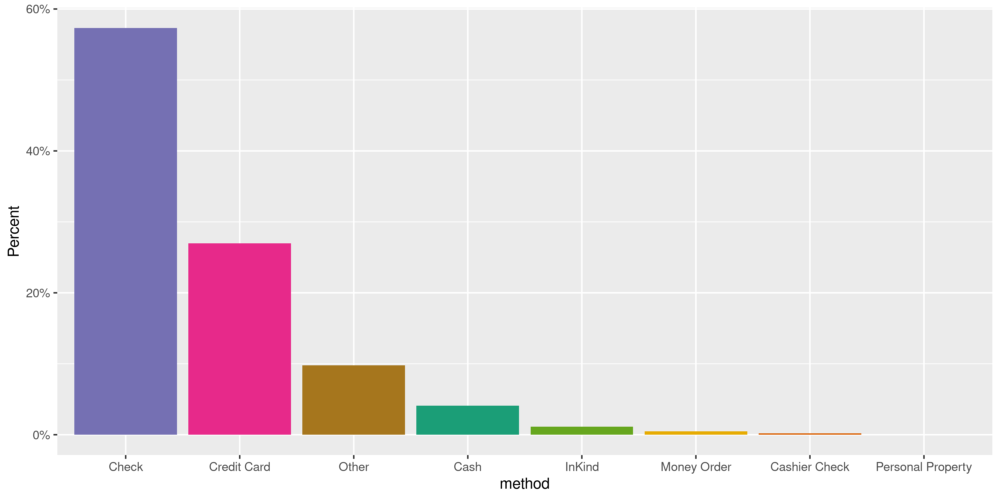

District Of Columbia Contributions
================
Kiernan Nicholls & Aarushi Sahejpal
2023-05-28 20:49:06

- <a href="#project" id="toc-project">Project</a>
- <a href="#objectives" id="toc-objectives">Objectives</a>
- <a href="#packages" id="toc-packages">Packages</a>
- <a href="#data" id="toc-data">Data</a>
- <a href="#download" id="toc-download">Download</a>
- <a href="#read" id="toc-read">Read</a>
- <a href="#explore" id="toc-explore">Explore</a>
- <a href="#wrangle" id="toc-wrangle">Wrangle</a>
- <a href="#conclude" id="toc-conclude">Conclude</a>
- <a href="#export" id="toc-export">Export</a>
- <a href="#upload" id="toc-upload">Upload</a>

<!-- Place comments regarding knitting here -->

## Project

The Accountability Project is an effort to cut across data silos and
give journalists, policy professionals, activists, and the public at
large a simple way to search across huge volumes of public data about
people and organizations.

Our goal is to standardizing public data on a few key fields by thinking
of each dataset row as a transaction. For each transaction there should
be (at least) 3 variables:

1.  All **parties** to a transaction.
2.  The **date** of the transaction.
3.  The **amount** of money involved.

## Objectives

This document describes the process used to complete the following
objectives:

1.  How many records are in the database?
2.  Check for entirely duplicated records.
3.  Check ranges of continuous variables.
4.  Is there anything blank or missing?
5.  Check for consistency issues.
6.  Create a five-digit ZIP Code called `zip`.
7.  Create a `year` field from the transaction date.
8.  Make sure there is data on both parties to a transaction.

## Packages

The following packages are needed to collect, manipulate, visualize,
analyze, and communicate these results. The `pacman` package will
facilitate their installation and attachment.

The IRW’s `campfin` package will also have to be installed from GitHub.
This package contains functions custom made to help facilitate the
processing of campaign finance data.

``` r
if (!require("pacman")) install.packages("pacman")
pacman::p_load_gh("irworkshop/campfin")
pacman::p_load(
  tidyverse, # data manipulation
  lubridate, # datetime strings
  gluedown, # printing markdown
  magrittr, # pipe operators
  aws.s3, # upload to aws s3
  janitor, # clean data frames
  refinr, # cluster and merge
  scales, # format strings
  knitr, # knit documents
  vroom, # read files fast
  rvest, # html scraping
  glue, # combine strings
  here, # relative paths
  httr, # http requests
  fs # local storage 
)
```

This document should be run as part of the `R_campfin` project, which
lives as a sub-directory of the more general, language-agnostic
[`irworkshop/accountability_datacleaning`](https://github.com/irworkshop/accountability_datacleaning)
GitHub repository.

The `R_campfin` project uses the [RStudio
projects](https://support.rstudio.com/hc/en-us/articles/200526207-Using-Projects)
feature and should be run as such. The project also uses the dynamic
`here::here()` tool for file paths relative to *your* machine.

``` r
# where does this document knit?
setwd("/Volumes/TAP/accountability_datacleaning/state")
here::here()
#> [1] "/Volumes/TAP/accountability_datacleaning"
```

## Data

Data comes courtesy of the Washington, [DC Office of Campaign Finance
(OCF)](https://ocf.dc.gov/).

As the [OCF
website](https://ocf.dc.gov/service/view-contributions-expenditures)
explains:

> The Office of Campaign Finance (OCF) provides easy access to all
> contributions and expenditures reported from 2003, through the current
> reporting period. Because the system is updated on a daily basis, you
> may be able to retrieve data received by OCF after the latest
> reporting period. This data is as reported, but may not be complete.

The data is found on the dc.gov [OpenData
website](https://opendata.dc.gov/datasets/DCGIS::campaign-financial-contributions/explore).
The file abstract reads:

> The Office of Campaign Finance (OCF) is pleased to publicly share
> election campaign contribution data. The Campaign Finance Office is
> charged with administering and enforcing the District of Columbia laws
> pertaining to campaign finance operations, lobbying activities,
> conflict of interest matters, the ethical conduct of public officials,
> and constituent service and statehood fund programs. OCF provides easy
> access to all contributions and expenditures reported from 2003,
> through the current reporting period. Because the system is updated on
> a daily basis, you may be able to retrieve data received by OCF after
> the latest reporting period. This data is as reported, but may not be
> complete. Visit the <http://ocf.dc.gov> for more information.

## Download

Contributions should be downloaded by hand to the raw directory.

``` r
raw_dir <- dir_create(here("dc", "contribs", "data", "raw"))
```

Contributions are retrieved by filter type drop down menu.

``` r
read_html("https://efiling.ocf.dc.gov/ContributionExpenditure") %>% 
  html_nodes("#FilerTypeId> option") %>%
  html_text() %>% 
  extract(-1) %>% 
  str_trim() %>% 
  md_bullet()
```

- Principal Campaign Committee
- Political Action Committee
- Initiative
- Referendum
- Recall
- Transition Committee
- Inaugural Committee
- Legal Defense Committee
- Independent Expenditure Committee
- Exploratory Committee
- Senators & Representatives
- Constituent Service Program
- Advisory Neighborhood Commission

## Read

``` r
raw_paths <- dir_ls(raw_dir)
md_bullet(md_code(path.abbrev(raw_paths)))
```

- `/Volumes/TAP/accountability_datacleaning/dc/contribs/data/raw/Campaign_Financial_Contributions.csv`

These files have a troublesome encoding. We can read and re-write them.

``` r
library(readr)

dcc <- read_csv("/Volumes/TAP/accountability_datacleaning/dc/contribs/data/raw/Campaign_Financial_Contributions.csv")
```

|                                                                                                                                                                                                         |
|---------------------------------------------------------------------------------------------------------------------------------------------------------------------------------------------------------|
| \### exclude {r raw_convert, eval=FALSE} for (p in raw_paths) { write_csv( path = p, x = read.csv( file = p, skip = 1, fileEncoding = “UTF-16LE”, ) ) }                                                 |
| The new files can be read into a single data frame.                                                                                                                                                     |
| dcc \<- map_df( .x = raw_paths, .f = read_csv, skip = 1, col_names = read_names(raw_paths\[2\]), col_types = cols( .default = col_character(), Receipt.Date = col_date_usa(), Amount = col_number() ) ) |

``` r
dcc <- dcc %>% 
  clean_names("snake") 
```

``` r
dcc <- dcc %>% 
  rename(
    committee = committeename,
    contributor = contributorname,
    address = address,
    type = contributortype,
    method = contributiontype,
    employer = employer,
    date = dateofreceipt)
```

## Explore

There are 280,653 rows of 20 columns.

``` r
glimpse(dcc)
#> Rows: 280,653
#> Columns: 20
#> $ objectid          <dbl> 46554812, 46554813, 46554814, 46554815, 46554816, 46554881, 46554882, 4…
#> $ committee         <chr> "Mary Cheh Ward 3 Constituent Service FD.", "Mary Cheh Ward 3 Constitue…
#> $ candidatename     <chr> "Mary Cheh", "Mary Cheh", "Mary Cheh", "Mary Cheh", "Mary Cheh", "Mary …
#> $ electionyear      <dbl> 2006, 2006, 2006, 2006, 2006, 2006, 2006, 2006, 2006, 2006, 2006, 2006,…
#> $ contributor       <chr> "Mary Cheh for DC Council", "Jack H Olender & Asssociates PC", "Law Off…
#> $ address           <chr> "3908 Morrison St NW, Washington, DC 20015", "1050 17th St NW, Washingt…
#> $ type              <chr> "PCC", "Corporation", "Corporation", "Individual", "Corporation", "Corp…
#> $ method            <chr> "Other", "Other", "Other", "Other", "Other", "Other", "Other", "Other",…
#> $ employer          <chr> NA, NA, NA, "Jack H. Olender & Associates", NA, NA, "Jack H. Olender & …
#> $ employeraddress   <chr> NA, NA, NA, "888 17th St NW, Washington, DC 20009", NA, NA, "888 17th S…
#> $ amount            <dbl> 11434, 400, 400, 200, 250, 400, 400, 400, 250, 400, 400, 400, 400, 400,…
#> $ date              <chr> "2007/04/10 04:00:00+00", "2007/05/04 04:00:00+00", "2007/05/07 04:00:0…
#> $ address_id        <dbl> 264830, 278801, NA, 257067, 241777, NA, NA, 243303, 241003, 235309, 241…
#> $ xcoord            <dbl> 393245.2, 396632.2, NA, 397181.8, 396636.8, NA, NA, 396475.1, 396132.5,…
#> $ ycoord            <dbl> 143985.5, 137279.3, NA, 146356.9, 137694.8, NA, NA, 137358.1, 138429.4,…
#> $ latitude          <dbl> 38.96375, 38.90336, NA, 38.98514, 38.90711, NA, NA, 38.90407, 38.91372,…
#> $ longitude         <dbl> -77.07794, -77.03883, NA, -77.03253, -77.03878, NA, NA, -77.04064, -77.…
#> $ fulladdress       <chr> "3908 MORRISON STREET NW", "1050 17TH STREET NW", NA, "1359 KALMIA ROAD…
#> $ gis_last_mod_dttm <chr> "2023/05/22 10:48:02+00", "2023/05/22 10:48:02+00", "2023/05/22 10:48:0…
#> $ ward              <chr> "Ward 3", "Ward 2", NA, "Ward 4", "Ward 2", NA, NA, "Ward 2", "Ward 2",…
tail(dcc)
#> # A tibble: 6 × 20
#>   objectid committee           candidatename electionyear contributor address type  method employer
#>      <dbl> <chr>               <chr>                <dbl> <chr>       <chr>   <chr> <chr>  <chr>   
#> 1 46841531 Paul Strauss        Paul Strauss          2002 DC DELEGAT… c/o DC… Corp… <NA>   <NA>    
#> 2 46841532 Committee to Elect… Mark Long             2007 Scott  Spa… xxx, W… Indi… Credi… <NA>    
#> 3 46841533 Committee to Elect… Mark Long             2007 Robert Pru… xxx, W… Indi… Credi… <NA>    
#> 4 46841534 Committee to Elect… Mark Long             2007 Warren Rid… xxx, W… Indi… Credi… <NA>    
#> 5 46841535 Committee to Elect… Mark Long             2007 Brian Alman xxx, W… Indi… Credi… <NA>    
#> 6 46841536 Committee to Elect… Mark Long             2007 David Rich… xxx, W… Indi… Credi… <NA>    
#> # ℹ 11 more variables: employeraddress <chr>, amount <dbl>, date <chr>, address_id <dbl>,
#> #   xcoord <dbl>, ycoord <dbl>, latitude <dbl>, longitude <dbl>, fulladdress <chr>,
#> #   gis_last_mod_dttm <chr>, ward <chr>
```

### Missing

Columns vary in their degree of missing values.

``` r
col_stats(dcc, count_na)
#> # A tibble: 20 × 4
#>    col               class      n        p
#>    <chr>             <chr>  <int>    <dbl>
#>  1 objectid          <dbl>      0 0       
#>  2 committee         <chr>      0 0       
#>  3 candidatename     <chr>  33858 0.121   
#>  4 electionyear      <dbl>     30 0.000107
#>  5 contributor       <chr>   1925 0.00686 
#>  6 address           <chr>   1910 0.00681 
#>  7 type              <chr>   2337 0.00833 
#>  8 method            <chr>   3476 0.0124  
#>  9 employer          <chr> 102106 0.364   
#> 10 employeraddress   <chr> 157084 0.560   
#> 11 amount            <dbl>    557 0.00198 
#> 12 date              <chr>      0 0       
#> 13 address_id        <dbl>  90814 0.324   
#> 14 xcoord            <dbl>  90814 0.324   
#> 15 ycoord            <dbl>  90814 0.324   
#> 16 latitude          <dbl>  90814 0.324   
#> 17 longitude         <dbl>  90814 0.324   
#> 18 fulladdress       <chr>  90814 0.324   
#> 19 gis_last_mod_dttm <chr>      0 0       
#> 20 ward              <chr>  91221 0.325
```

We can then flag any records missing a key variable like a name or
number.

``` r
key_vars <- c("date", "contributor", "amount", "committee")
dcc <- flag_na(dcc, all_of(key_vars))
sum(dcc$na_flag)
#> [1] 1925
```

``` r
dcc %>% 
  filter(na_flag) %>% 
  select(all_of(key_vars))
#> # A tibble: 1,925 × 4
#>    date                   contributor amount committee                    
#>    <chr>                  <chr>        <dbl> <chr>                        
#>  1 2020/11/02 05:00:00+00 <NA>            65 Hannah Untereiner            
#>  2 2018/11/05 05:00:00+00 <NA>             0 Kent C. Boese                
#>  3 2018/11/05 05:00:00+00 <NA>            NA Dan Orlaskey                 
#>  4 2022/11/07 05:00:00+00 <NA>             0 Veronica Adams               
#>  5 2017/01/16 05:00:00+00 <NA>           212 Amanda Frost                 
#>  6 2018/11/05 05:00:00+00 <NA>             0 Jamie Barden                 
#>  7 2008/03/10 04:00:00+00 <NA>           500 Muriel Bowser for Ward 4 2008
#>  8 2008/03/10 04:00:00+00 <NA>           500 Muriel Bowser for Ward 4 2008
#>  9 2016/08/09 04:00:00+00 <NA>           116 Barbara Rogers               
#> 10 2008/03/05 05:00:00+00 <NA>           500 Muriel Bowser for Ward 4 2008
#> # ℹ 1,915 more rows
```

### Categorical

``` r
col_stats(dcc, n_distinct)
#> # A tibble: 21 × 4
#>    col               class      n          p
#>    <chr>             <chr>  <int>      <dbl>
#>  1 objectid          <dbl> 280653 1         
#>  2 committee         <chr>   2161 0.00770   
#>  3 candidatename     <chr>    473 0.00169   
#>  4 electionyear      <dbl>     21 0.0000748 
#>  5 contributor       <chr> 126626 0.451     
#>  6 address           <chr> 153813 0.548     
#>  7 type              <chr>     28 0.0000998 
#>  8 method            <chr>      9 0.0000321 
#>  9 employer          <chr>  41689 0.149     
#> 10 employeraddress   <chr>  27373 0.0975    
#> 11 amount            <dbl>   2317 0.00826   
#> 12 date              <chr>   7072 0.0252    
#> 13 address_id        <dbl>  34851 0.124     
#> 14 xcoord            <dbl>  34085 0.121     
#> 15 ycoord            <dbl>  34047 0.121     
#> 16 latitude          <dbl>  34745 0.124     
#> 17 longitude         <dbl>  34775 0.124     
#> 18 fulladdress       <chr>  34845 0.124     
#> 19 gis_last_mod_dttm <chr>      1 0.00000356
#> 20 ward              <chr>      9 0.0000321 
#> 21 na_flag           <lgl>      2 0.00000713
```

<!-- --><!-- -->

### Amounts

``` r
summary(dcc$amount)
#>     Min.  1st Qu.   Median     Mean  3rd Qu.     Max.     NA's 
#> -31889.0     50.0    100.0    379.8    350.0 700000.0      557
mean(dcc$amount <= 0)
#> [1] NA
```

<!-- -->

### Dates

We can add the calendar year from `date` with `lubridate::year()`

``` r
dcc <- mutate(dcc, year = year(date))
dcc <- dcc %>%
  mutate(date = as.Date(date, format = "%Y/%m/%d %H:%M:%S+00")) %>%
  mutate(date = format(date, "%Y-%m-%d"))
```

``` r
min(dcc$date)
#> [1] "2003-01-01"
sum(dcc$year < 2000)
#> [1] 0
max(dcc$date)
#> [1] "2023-05-17"
sum(dcc$date > today())
#> [1] 0
```

<!-- -->

## Wrangle

To improve the searchability of the database, we will perform some
consistent, confident string normalization. For geographic variables
like city names and ZIP codes, the corresponding `campfin::normal_*()`
functions are tailor made to facilitate this process.

### Address

For the street `addresss` variable, the `campfin::normal_address()`
function will force consistence case, remove punctuation, and abbreviate
official USPS suffixes.

``` r
dcc <- dcc %>% 
  mutate(
    address_norm = normal_address(
      address = address,
      abbs = usps_street,
      na_rep = TRUE
    )
  )
```

``` r
dcc %>% 
  select(contains("address")) %>% 
  distinct() %>% 
  sample_n(10)
#> # A tibble: 10 × 5
#>    address                                      employeraddress address_id fulladdress address_norm
#>    <chr>                                        <chr>                <dbl> <chr>       <chr>       
#>  1 14602 Dolphin Way, Bowie, MD 20721           <NA>                    NA <NA>        14602 DOLPH…
#>  2 827 Hr. Dr. SE., Washington, DC 20032        Washington, DC      278634 827 H R DR… 827 HR DR S…
#>  3 3010 Kidden Road, XWashington, MD 20744      , DC                    NA <NA>        3010 KIDDEN…
#>  4 1606 Crittenden St., NW, Washington, DC 200… Washington, DC      258715 1606 CRITT… 1606 CRITTE…
#>  5 2716 Woodley Place, Washington, DC 20008     <NA>                219188 2716 WOODL… 2716 WOODLE…
#>  6 425 L St NW #1018, Washington, DC 20001      <NA>                279770 425 L STRE… 425 L ST NW…
#>  7 2840 Livingston Pl, SE, Washington, DC 20020 <NA>                    NA <NA>        2840 LIVING…
#>  8 6120 Utah Ave NW, Washington, DC 20015       <NA>                260216 6120 UTAH … 6120 UTAH A…
#>  9 3143 O St, NW, Washington, DC 20007          <NA>                275521 3143 O STR… 3143 O ST N…
#> 10 118 Taussig Place, NE, Washington, DC 20002  <NA>                 72526 118 TAUSSI… 118 TAUSSIG…
```

### City

Cities are the most difficult geographic variable to normalize, simply
due to the wide variety of valid cities and formats.

#### Normal

The `campfin::normal_city()` function is a good start, again converting
case, removing punctuation, but *expanding* USPS abbreviations. We can
also remove `invalid_city` values.

More importantly, the number of distinct values decreased each stage. We
were able to confidently change many distinct invalid values to their
valid equivalent.

## Conclude

Before exporting, we can remove the intermediary normalization columns
and rename all added variables with the `_clean` suffix.

``` r
glimpse(sample_n(dcc, 50))
#> Rows: 50
#> Columns: 23
#> $ objectid          <dbl> 46753668, 46627393, 46556917, 46795613, 46705492, 46559369, 46665522, 4…
#> $ committee         <chr> "Catania For Mayor", "4 Hagler For 4", "Elissa 2018", "Fenty 2006", "Fr…
#> $ candidatename     <chr> "David Catania", "Graylan Scott  Hagler", "Elissa Silverman", "Adrian F…
#> $ electionyear      <dbl> 2014, 2007, 2018, 2006, 2020, 2002, 2006, 2018, 2004, 2016, 2006, 2010,…
#> $ contributor       <chr> "Rudolph Riet", "Eric White", "Karen Evans", "Peter Nickles", "James Th…
#> $ address           <chr> "2146 Florida Avenue, NW, Washington, DC 20008", "1625 Nicholson St NW,…
#> $ type              <chr> "Individual", "Individual", "Individual", "Individual", "Individual", "…
#> $ method            <chr> "Credit Card", "Check", "Check", "Check", "Credit Card", "Check", "Chec…
#> $ employer          <chr> NA, NA, "Cochran Firm", "Covington & Burling", "Coliseum Apparel", "TTR…
#> $ employeraddress   <chr> NA, NA, "1100 New York Ave NW, Washington, DC 20005", "Washington, DC",…
#> $ amount            <dbl> 25, 50, 300, 50, 250, 50, 500, 1, 100, 10, 1000, 18, NA, 1000, 250, 162…
#> $ date              <chr> "2014-06-09", "2007-02-11", "2018-04-18", "2006-01-25", "2020-10-22", "…
#> $ address_id        <dbl> 242727, 259568, 257221, 240937, NA, 272067, NA, 220471, NA, 225069, 299…
#> $ xcoord            <dbl> 395882.8, 396773.0, 397347.5, 397537.2, NA, 394849.9, NA, 394307.2, NA,…
#> $ ycoord            <dbl> 138289.0, 143609.8, 145955.6, 136429.4, NA, 137518.3, NA, 143242.5, NA,…
#> $ latitude          <dbl> 38.91246, 38.96039, 38.98152, 38.89571, NA, 38.90551, NA, 38.95707, NA,…
#> $ longitude         <dbl> -77.04747, -77.03723, -77.03061, -77.02839, NA, -77.05938, NA, -77.0656…
#> $ fulladdress       <chr> "2146 FLORIDA AVENUE NW", "1625 NICHOLSON STREET NW", "7511 MORNINGSIDE…
#> $ gis_last_mod_dttm <chr> "2023/05/22 10:48:02+00", "2023/05/22 10:48:02+00", "2023/05/22 10:48:0…
#> $ ward              <chr> "Ward 2", "Ward 4", "Ward 4", "Ward 2", NA, "Ward 2", NA, "Ward 3", NA,…
#> $ na_flag           <lgl> FALSE, FALSE, FALSE, FALSE, FALSE, FALSE, FALSE, FALSE, FALSE, FALSE, F…
#> $ year              <dbl> 2014, 2007, 2018, 2006, 2020, 2012, 2006, 2018, 2005, 2018, 2006, 2010,…
#> $ address_norm      <chr> "2146 FLORIDA AVENUE NW WASHINGTON DC 20008", "1625 NICHOLSON ST NW WAS…
```

1.  There are 280,653 records in the database.
2.  There are 0 duplicate records in the database.
3.  The range and distribution of `amount` and `date` seem reasonable.
4.  There are 1,925 records missing key variables.
5.  Consistency in geographic data has been improved with
    `campfin::normal_*()`.
6.  The 4-digit `year` variable has been created with
    `lubridate::year()`.

## Export

Now the file can be saved on disk for upload to the Accountability
server.

``` r
clean_dir <- dir_create(here("dc", "contribs", "data", "clean"))
clean_path <- path(clean_dir, "dc_contribs_20230517.csv")
write_csv(dcc, clean_path, na = "")
(clean_size <- file_size(clean_path))
#> 81.4M
file_encoding(clean_path) %>% 
  mutate(across(path, path.abbrev))
#> # A tibble: 1 × 3
#>   path                                                                                mime  charset
#>   <fs::path>                                                                          <chr> <chr>  
#> 1 …es/TAP/accountability_datacleaning/dc/contribs/data/clean/dc_contribs_20230517.csv <NA>  <NA>
```

## Upload

We can use the `aws.s3::put_object()` to upload the text file to the IRW
server.

``` r
s3_path <- path("csv", basename(clean_path))
if (!object_exists(s3_path, "publicaccountability")) {
  put_object(
    file = clean_path,
    object = s3_path, 
    bucket = "publicaccountability",
    acl = "public-read",
    show_progress = TRUE,
    multipart = TRUE
  )
}
s3_head <- head_object(s3_path, "publicaccountability")
(s3_size <- as_fs_bytes(attr(s3_head, "content-length")))
#> 81.4M
unname(s3_size == clean_size)
#> [1] TRUE
```
