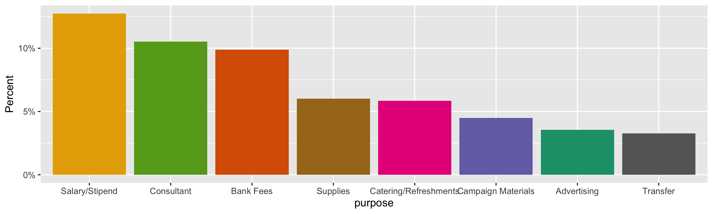
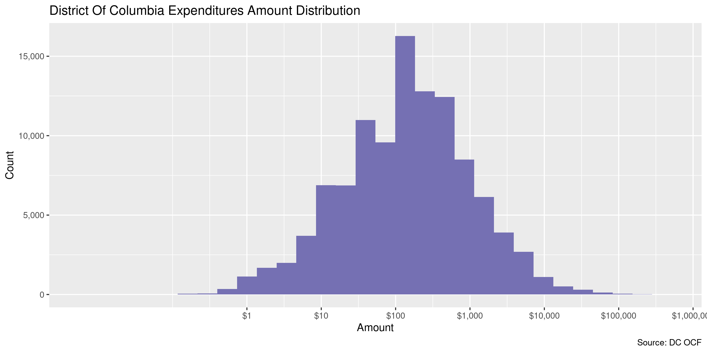
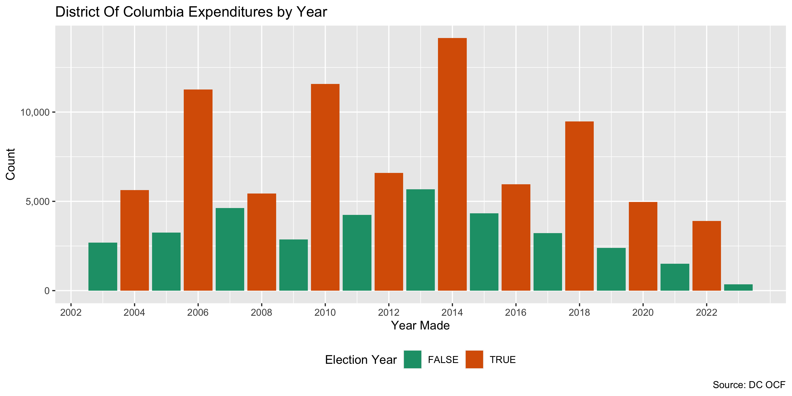
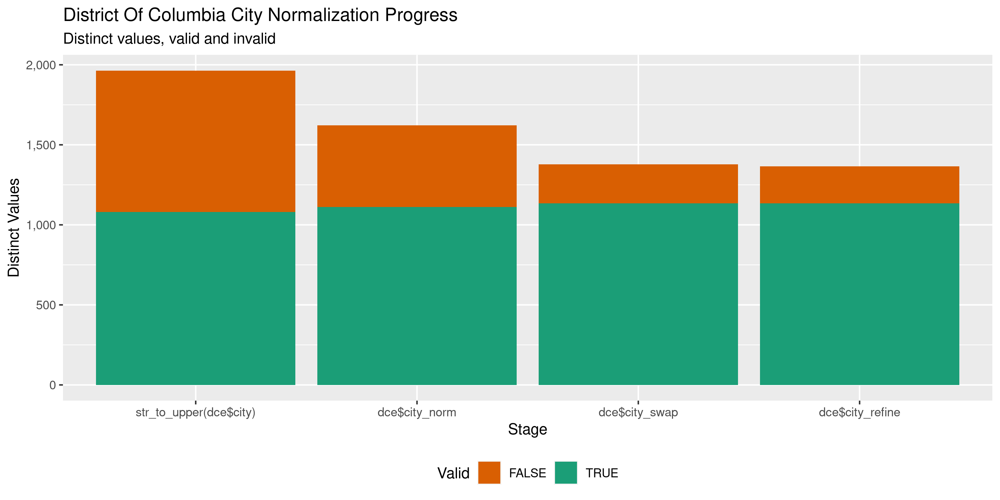

District Of Columbia Expenditures
================
Kiernan Nicholls
Wed Feb 9 12:39:50 2022

-   [Project](#project)
-   [Objectives](#objectives)
-   [Packages](#packages)
-   [Source](#source)
-   [Data](#data)
-   [Download](#download)
-   [Read](#read)
-   [Explore](#explore)
    -   [Missing](#missing)
    -   [Duplicates](#duplicates)
    -   [Categorical](#categorical)
    -   [Amounts](#amounts)
    -   [Dates](#dates)
-   [Wrangle](#wrangle)
    -   [Address](#address)
    -   [ZIP](#zip)
    -   [State](#state)
    -   [City](#city)
-   [Conclude](#conclude)
-   [Export](#export)
-   [Upload](#upload)

<!-- Place comments regarding knitting here -->

## Project

The Accountability Project is an effort to cut across data silos and
give journalists, policy professionals, activists, and the public at
large a simple way to search across huge volumes of public data about
people and organizations.

Our goal is to standardize public data on a few key fields by thinking
of each dataset row as a transaction. For each transaction there should
be (at least) 3 variables:

1.  All **parties** to a transaction.
2.  The **date** of the transaction.
3.  The **amount** of money involved.

## Objectives

This document describes the process used to complete the following
objectives:

1.  How many records are in the database?
2.  Check for entirely duplicated records.
3.  Check ranges of continuous variables.
4.  Is there anything blank or missing?
5.  Check for consistency issues.
6.  Create a five-digit ZIP Code called `zip`.
7.  Create a `year` field from the transaction date.
8.  Make sure there is data on both parties to a transaction.

## Packages

The following packages are needed to collect, manipulate, visualize,
analyze, and communicate these results. The `pacman` package will
facilitate their installation and attachment.

``` r
if (!require("pacman")) {
  install.packages("pacman")
}
pacman::p_load(
  tidyverse, # data manipulation
  lubridate, # datetime strings
  gluedown, # printing markdown
  janitor, # clean data frames
  campfin, # custom irw tools
  aws.s3, # aws cloud storage
  refinr, # cluster & merge
  scales, # format strings
  knitr, # knit documents
  vroom, # fast reading
  rvest, # scrape html
  glue, # code strings
  here, # project paths
  httr, # http requests
  fs # local storage 
)
```

This diary was run using `campfin` version 1.0.8.9201.

``` r
packageVersion("campfin")
#> [1] '1.0.8.9201'
```

This document should be run as part of the `R_tap` project, which lives
as a sub-directory of the more general, language-agnostic
[`irworkshop/accountability_datacleaning`](https://github.com/irworkshop/accountability_datacleaning)
GitHub repository.

The `R_tap` project uses the [RStudio
projects](https://support.rstudio.com/hc/en-us/articles/200526207-Using-Projects)
feature and should be run as such. The project also uses the dynamic
`here::here()` tool for file paths relative to *your* machine.

``` r
# where does this document knit?
here::i_am("dc/expends/docs/dc_expends_diary.Rmd")
```

## Source

## Data

Data comes courtesy of the [DC Office of Campaign Finance
(OCF)](https://ocf.dc.gov/).

As the [OCF
website](https://ocf.dc.gov/service/view-contributions-expenditures)
explains:

> The Office of Campaign Finance (OCF) provides easy access to all
> contributions and expenditures reported from 2003, through the current
> reporting period. Because the system is updated on a daily basis, you
> may be able to retrieve data received by OCF after the latest
> reporting period. This data is as reported, but may not be complete.

The data is found on the dc.gov [OpenData
website](https://opendata.dc.gov/datasets/campaign-financial-expenditures).
The file abstract reads:

> The Office of Campaign Finance (OCF) is pleased to publicly share
> election campaign contribution data. The Campaign Finance Office is
> charged with administering and enforcing the District of Columbia laws
> pertaining to campaign finance operations, lobbying activities,
> conflict of interest matters, the ethical conduct of public officials,
> and constituent service and statehood fund programs. OCF provides easy
> access to all contributions and expenditures reported from 2003,
> through the current reporting period. Because the system is updated on
> a daily basis, you may be able to retrieve data received by OCF after
> the latest reporting period. This data is as reported, but may not be
> complete. Visit the <http://ocf.dc.gov> for more information.

## Download

``` r
raw_dir <- dir_create(here("dc", "expends", "data", "raw"))
raw_csv <- dir_ls(raw_dir, glob = "*.csv")
```

| File Type                         | File Size |
|:----------------------------------|----------:|
| Principal Campaign Committee      |     7.49M |
| Political Action Committee        |     1.83M |
| Initiative                        |   243.94K |
| Referendum                        |    52.82K |
| Recall                            |    13.44K |
| Inaugural Committee               |    28.89K |
| Legal Defense Committee           |       933 |
| Independent Expenditure Committee |   100.49K |
| Exploratory Committee             |    24.49K |
| Senators & Representatives        |   165.03K |
| Constituent Service Program       |     2.19M |

## Read

These files have a troublesome encoding. We can read and re-write them.

``` r
dc_types2 <- map_chr(
  raw_csv,
  function(x) {
    readLines(
      con = file(x, encoding = "UTF-16LE", blocking = FALSE), 
      n = 1
    )
  }
)
```

``` r
for (p in raw_csv) {
  message(basename(p))
  write_csv(
    file = p,
    x = read.csv(
      file = p,
      skip = 1,
      fileEncoding = "UTF-16LE", 
      check.names = FALSE
    )
  )
}
```

``` r
names(raw_csv) <- dc_types
```

``` r
dce <- map(
  .x = raw_csv,
  .f = function(x) {
    with_edition(
      edition = 1,
      code = read_delim(
        file = x,
        delim = ",",
        escape_backslash = FALSE,
        escape_double = TRUE,
        col_types = cols(
          .default = col_character(),
          `Payment Date` = col_date_mdy(),
          `Amount` = col_number()
        )
      )
    )
  }
)
```

``` r
dce <- map(dce, ~rename(., `Expendee Name` = 1)) %>% bind_rows()
```

``` r
dce <- clean_names(dce, case = "snake")
```

## Explore

There are 108,335 rows of 13 columns. Each record represents a single
Expenditures…

``` r
glimpse(dce)
#> Rows: 108,335
#> Columns: 13
#> $ expendee_name           <chr> "\"SS\" for Ward 8 City Council", "\"SS\" for Ward 8 City Council", "\"SS\" for Ward 8…
#> $ payee_first_name        <chr> NA, "Anthony", NA, NA, NA, NA, NA, NA, NA, "David", "Donna", NA, "Elsie", NA, NA, NA, …
#> $ payee_middle_name       <chr> NA, NA, NA, NA, NA, NA, NA, NA, NA, NA, NA, NA, NA, NA, NA, NA, NA, NA, NA, NA, NA, NA…
#> $ payee_last_name         <chr> NA, "Cooper", NA, NA, NA, NA, NA, NA, NA, "Brown", "Long", NA, "Long", NA, NA, NA, NA,…
#> $ payee_organization_name <chr> "ACTS Inc.", NA, "Apex Gas Station", "Applebees", "Capitol Marking Products, Inc.", "C…
#> $ number_and_street       <chr> "102 Canal Rd.", "3700 9th Street, SE", "2830 Sherman Ave. NW.", "3447 Donnell Drive "…
#> $ city                    <chr> "Dumfries", "Washington", "Washington", "Forrestville", "Arlington", "Washington", "Wa…
#> $ state                   <chr> "VA", "DC", "DC", "MD", "VA", "DC", "DC", "DC", "DC", "DC", "DC", "MD", "DC", "MD", "D…
#> $ zip                     <chr> "22026", "20032", "20001", "20735", "22204", "20032", "20032", "20032", "20032", "2003…
#> $ purpose_of_expenditure  <chr> "Equipment Purchases", "Consultant", "Travel", "Catering/Refreshments", "Supplies", "P…
#> $ further_explanation     <chr> NA, NA, NA, NA, NA, NA, NA, NA, NA, NA, NA, NA, NA, NA, NA, NA, NA, NA, NA, NA, NA, NA…
#> $ payment_date            <date> 2004-08-29, 2004-09-18, 2004-08-31, 2004-09-06, 2004-08-26, 2004-08-25, 2004-08-25, 2…
#> $ amount                  <dbl> 32.19, 50.00, 10.00, 47.17, 35.53, 370.00, 13.65, 7.42, 0.83, 410.00, 50.00, 296.96, 5…
tail(dce)
#> # A tibble: 6 × 13
#>   expendee_name    payee_first_name payee_middle_na… payee_last_name payee_organizat… number_and_stre… city  state zip  
#>   <chr>            <chr>            <chr>            <chr>           <chr>            <chr>            <chr> <chr> <chr>
#> 1 Yvette Alexande… Yvette           <NA>             Alexander       <NA>             3440 Highwood Dr Wash… DC    20009
#> 2 Yvette Alexande… Yvette           <NA>             Alexander       <NA>             3440 Highwood Dr Wash… DC    20020
#> 3 Yvette Alexande… Yvette           <NA>             Alexander       <NA>             3442 Highwood Dr Wash… DC    20020
#> 4 Yvette Alexande… Yvette           <NA>             Alexander       <NA>             3443 Highwood A… Wash… DC    20020
#> 5 Yvette Alexande… Yvette           <NA>             Alexander       <NA>             3442 Highwood Dr Wash… DC    20020
#> 6 Yvette Alexande… Yvette           <NA>             Alexander       <NA>             3442 Highwood D… Wash… DC    20020
#> # … with 4 more variables: purpose_of_expenditure <chr>, further_explanation <chr>, payment_date <date>, amount <dbl>
```

### Missing

Columns vary in their degree of missing values.

``` r
col_stats(dce, count_na)
#> # A tibble: 13 × 4
#>    col                     class       n        p
#>    <chr>                   <chr>   <int>    <dbl>
#>  1 expendee_name           <chr>       0 0       
#>  2 payee_first_name        <chr>   72925 0.673   
#>  3 payee_middle_name       <chr>  105436 0.973   
#>  4 payee_last_name         <chr>   73281 0.676   
#>  5 payee_organization_name <chr>   51886 0.479   
#>  6 number_and_street       <chr>     246 0.00227 
#>  7 city                    <chr>      63 0.000582
#>  8 state                   <chr>     210 0.00194 
#>  9 zip                     <chr>      62 0.000572
#> 10 purpose_of_expenditure  <chr>    3214 0.0297  
#> 11 further_explanation     <chr>   98411 0.908   
#> 12 payment_date            <date>      0 0       
#> 13 amount                  <dbl>       0 0
```

We can flag any record missing a key variable needed to identify a
transaction.

``` r
dce <- dce %>% 
  unite(
    col = "payee_full_name",
    payee_first_name, payee_middle_name, payee_last_name,
    remove = FALSE,
    sep = " ",
    na.rm = TRUE
  ) %>% 
  mutate(
    payee_name = coalesce(payee_organization_name, payee_full_name),
    payee_name = na_if(payee_name, "")
  ) %>% 
  select(-payee_full_name)
```

``` r
key_vars <- c("payment_date", "expendee_name", "amount", "payee_name")
dce <- flag_na(dce, all_of(key_vars))
sum(dce$na_flag)
#> [1] 16476
```

``` r
dce %>% 
  filter(na_flag) %>% 
  select(all_of(key_vars))
#> # A tibble: 16,476 × 4
#>    payment_date expendee_name                  amount payee_name
#>    <date>       <chr>                           <dbl> <chr>     
#>  1 2014-08-10   Friends of Courtney R. Snowden  343.  <NA>      
#>  2 2014-08-04   Friends of Courtney R. Snowden  333.  <NA>      
#>  3 2014-08-03   Friends of Courtney R. Snowden 3500   <NA>      
#>  4 2014-07-17   Friends of Courtney R. Snowden   60.2 <NA>      
#>  5 2014-07-14   Friends of Courtney R. Snowden  676.  <NA>      
#>  6 2014-07-11   Friends of Courtney R. Snowden 2500   <NA>      
#>  7 2014-09-15   Jim Graham 2014                4241.  <NA>      
#>  8 2006-10-15   Moore for Ward 5                 40   <NA>      
#>  9 2006-09-06   Moore for Ward 5                 31.6 <NA>      
#> 10 2009-12-31   Muriel Bowser for Ward 4 2008   153.  <NA>      
#> # … with 16,466 more rows
```

### Duplicates

We can also flag any record completely duplicated across every column.

``` r
dce <- flag_dupes(dce, everything())
sum(dce$dupe_flag)
#> [1] 4218
```

``` r
dce %>% 
  filter(dupe_flag) %>% 
  select(all_of(key_vars)) %>% 
  arrange(payment_date)
#> # A tibble: 4,218 × 4
#>    payment_date expendee_name                                  amount payee_name            
#>    <date>       <chr>                                           <dbl> <chr>                 
#>  1 2003-02-03   Washington DC Association of Realtors PAC         400 <NA>                  
#>  2 2003-02-03   Washington DC Association of Realtors PAC         400 <NA>                  
#>  3 2003-02-12   Committee to Re-Elect Jack Evans                  500 Premium Distributors  
#>  4 2003-02-12   Committee to Re-Elect Jack Evans                  500 Premium Distributors  
#>  5 2003-02-12   Committee to Re-Elect Jack Evans                  500 Ronald Cohen Mgmt. Co.
#>  6 2003-02-12   Committee to Re-Elect Jack Evans                  500 Ronald Cohen Mgmt. Co.
#>  7 2003-02-12   Committee to Re-Elect Jack Evans                  500 Scott Pannick         
#>  8 2003-02-12   Committee to Re-Elect Jack Evans                  500 Scott Pannick         
#>  9 2003-02-28   Peggy Cooper Cafritz for President of Bd of Ed     17 Industrial Bank       
#> 10 2003-02-28   Peggy Cooper Cafritz for President of Bd of Ed     17 Industrial Bank       
#> # … with 4,208 more rows
```

### Categorical

``` r
col_stats(dce, n_distinct)
#> # A tibble: 16 × 4
#>    col                     class      n         p
#>    <chr>                   <chr>  <int>     <dbl>
#>  1 expendee_name           <chr>    880 0.00812  
#>  2 payee_first_name        <chr>   6126 0.0565   
#>  3 payee_middle_name       <chr>    226 0.00209  
#>  4 payee_last_name         <chr>   6472 0.0597   
#>  5 payee_organization_name <chr>  15206 0.140    
#>  6 number_and_street       <chr>  37569 0.347    
#>  7 city                    <chr>   2266 0.0209   
#>  8 state                   <chr>     60 0.000554 
#>  9 zip                     <chr>   2686 0.0248   
#> 10 purpose_of_expenditure  <chr>     37 0.000342 
#> 11 further_explanation     <chr>   5611 0.0518   
#> 12 payment_date            <date>  6471 0.0597   
#> 13 amount                  <dbl>  24013 0.222    
#> 14 payee_name              <chr>  29504 0.272    
#> 15 na_flag                 <lgl>      2 0.0000185
#> 16 dupe_flag               <lgl>      2 0.0000185
```

<!-- -->

### Amounts

``` r
# fix floating point precision
dce$amount <- round(dce$amount, digits = 2)
```

``` r
summary(dce$amount)
#>     Min.  1st Qu.   Median     Mean  3rd Qu.     Max. 
#> -96037.7     39.5    133.5    942.4    500.0 513240.0
mean(dce$amount <= 0)
#> [1] 0.001550745
```

These are the records with the minimum and maximum amounts.

``` r
glimpse(dce[c(which.max(dce$amount), which.min(dce$amount)), ])
#> Rows: 2
#> Columns: 16
#> $ expendee_name           <chr> "Citizens to Elect Linda Cropp Mayor", "Gray for Mayor"
#> $ payee_first_name        <chr> NA, NA
#> $ payee_middle_name       <chr> NA, NA
#> $ payee_last_name         <chr> NA, NA
#> $ payee_organization_name <chr> "Media Production LUC", "EXPENDITURES NOT NEGOTIATED"
#> $ number_and_street       <chr> "Georgian Bank", "2000 14TH STREET, NW SUITE 433"
#> $ city                    <chr> "Powder Spring", "WASHINGTON"
#> $ state                   <chr> "GA", "DC"
#> $ zip                     <chr> "32134", "20009"
#> $ purpose_of_expenditure  <chr> "Advertising", "Other"
#> $ further_explanation     <chr> NA, NA
#> $ payment_date            <date> 2006-08-23, 2011-01-31
#> $ amount                  <dbl> 513240.00, -96037.71
#> $ payee_name              <chr> "Media Production LUC", "EXPENDITURES NOT NEGOTIATED"
#> $ na_flag                 <lgl> FALSE, FALSE
#> $ dupe_flag               <lgl> FALSE, FALSE
```

The distribution of amount values are typically log-normal.

<!-- -->

### Dates

We can add the calendar year from `date` with `lubridate::year()`

``` r
dce <- mutate(dce, payment_year = year(payment_date))
```

``` r
min(dce$payment_date)
#> [1] "2003-01-01"
sum(dce$payment_year < 2000)
#> [1] 0
max(dce$payment_date)
#> [1] "2021-12-30"
sum(dce$payment_date > today())
#> [1] 0
```

It’s common to see an increase in the number of expenditures in
elections years.

<!-- -->

## Wrangle

To improve the searchability of the database, we will perform some
consistent, confident string normalization. For geographic variables
like city names and ZIP codes, the corresponding `campfin::normal_*()`
functions are tailor made to facilitate this process.

### Address

For the street `addresss` variable, the `campfin::normal_address()`
function will force consistence case, remove punctuation, and abbreviate
official USPS suffixes.

``` r
addr_norm <- dce %>% 
  distinct(number_and_street) %>% 
  mutate(
    address_norm = normal_address(
      address = number_and_street,
      abbs = usps_street,
      na_rep = TRUE
    )
  )
```

``` r
addr_norm
#> # A tibble: 37,569 × 2
#>    number_and_street          address_norm           
#>    <chr>                      <chr>                  
#>  1 "102 Canal Rd."            102 CANAL RD           
#>  2 "3700 9th Street, SE"      3700 9TH STREET SE     
#>  3 "2830 Sherman Ave. NW."    2830 SHERMAN AVE NW    
#>  4 "3447 Donnell Drive "      3447 DONNELL DR        
#>  5 "4611 Columbia Pk "        4611 COLUMBIA PK       
#>  6 "*****************"        <NA>                   
#>  7 "************************" <NA>                   
#>  8 "Congress Heights, SE"     CONGRESS HEIGHTS SE    
#>  9 "1107 Savannah Street, SE" 1107 SAVANNAH STREET SE
#> 10 "1109 Savannah Road, SE"   1109 SAVANNAH ROAD SE  
#> # … with 37,559 more rows
```

``` r
dce <- left_join(dce, addr_norm, by = "number_and_street")
```

### ZIP

For ZIP codes, the `campfin::normal_zip()` function will attempt to
create valid *five* digit codes by removing the ZIP+4 suffix and
returning leading zeroes dropped by other programs like Microsoft Excel.

``` r
dce <- dce %>% 
  mutate(
    zip_norm = normal_zip(
      zip = zip,
      na_rep = TRUE
    )
  )
```

``` r
progress_table(
  dce$zip,
  dce$zip_norm,
  compare = valid_zip
)
#> # A tibble: 2 × 6
#>   stage        prop_in n_distinct  prop_na n_out n_diff
#>   <chr>          <dbl>      <dbl>    <dbl> <dbl>  <dbl>
#> 1 dce$zip        0.961       2686 0.000572  4273    322
#> 2 dce$zip_norm   0.992       2546 0.0283     807    165
```

### State

Valid two digit state abbreviations can be made using the
`campfin::normal_state()` function.

``` r
dce <- dce %>% 
  mutate(
    state_norm = normal_state(
      state = state,
      abbreviate = TRUE,
      na_rep = TRUE,
      valid = valid_state
    )
  )
```

``` r
dce %>% 
  filter(state != state_norm) %>% 
  count(state, state_norm, sort = TRUE)
#> # A tibble: 8 × 3
#>   state          state_norm     n
#>   <chr>          <chr>      <int>
#> 1 Maryland       MD            10
#> 2 California     CA             3
#> 3 Massachusetts  MA             3
#> 4 Florida        FL             1
#> 5 Minnesota      MN             1
#> 6 Nebraska       NE             1
#> 7 North Carolina NC             1
#> 8 Pennsylvania   PA             1
```

``` r
progress_table(
  dce$state,
  dce$state_norm,
  compare = valid_state
)
#> # A tibble: 2 × 6
#>   stage          prop_in n_distinct prop_na n_out n_diff
#>   <chr>            <dbl>      <dbl>   <dbl> <dbl>  <dbl>
#> 1 dce$state         1.00         60 0.00194    21      9
#> 2 dce$state_norm    1            52 0.00194     0      1
```

### City

Cities are the most difficult geographic variable to normalize, simply
due to the wide variety of valid cities and formats.

#### Normal

The `campfin::normal_city()` function is a good start, again converting
case, removing punctuation, but *expanding* USPS abbreviations. We can
also remove `invalid_city` values.

``` r
norm_city <- dce %>% 
  distinct(city, state_norm, zip_norm) %>% 
  mutate(
    city_norm = normal_city(
      city = city, 
      abbs = usps_city,
      states = c("DC", "DC", "DISTRICT OF COLUMBIA"),
      na = invalid_city,
      na_rep = TRUE
    )
  )
```

#### Swap

We can further improve normalization by comparing our normalized value
against the *expected* value for that record’s state abbreviation and
ZIP code. If the normalized value is either an abbreviation for or very
similar to the expected value, we can confidently swap those two.

``` r
norm_city <- norm_city %>% 
  rename(city_raw = city) %>% 
  left_join(
    y = zipcodes,
    by = c(
      "state_norm" = "state",
      "zip_norm" = "zip"
    )
  ) %>% 
  rename(city_match = city) %>% 
  mutate(
    match_abb = is_abbrev(city_norm, city_match),
    match_dist = str_dist(city_norm, city_match),
    city_swap = if_else(
      condition = !is.na(match_dist) & (match_abb | match_dist == 1),
      true = city_match,
      false = city_norm
    )
  ) %>% 
  select(
    -city_match,
    -match_dist,
    -match_abb
  )
```

``` r
dce <- left_join(
  x = dce,
  y = norm_city,
  by = c(
    "city" = "city_raw", 
    "state_norm", 
    "zip_norm"
  )
)
```

#### Refine

The [OpenRefine](https://openrefine.org/) algorithms can be used to
group similar strings and replace the less common versions with their
most common counterpart. This can greatly reduce inconsistency, but with
low confidence; we will only keep any refined strings that have a valid
city/state/zip combination.

``` r
good_refine <- dce %>% 
  mutate(
    city_refine = city_swap %>% 
      key_collision_merge() %>% 
      n_gram_merge(numgram = 1)
  ) %>% 
  filter(city_refine != city_swap) %>% 
  inner_join(
    y = zipcodes,
    by = c(
      "city_refine" = "city",
      "state_norm" = "state",
      "zip_norm" = "zip"
    )
  )
```

    #> # A tibble: 17 × 5
    #>    state_norm zip_norm city_swap      city_refine        n
    #>    <chr>      <chr>    <chr>          <chr>          <int>
    #>  1 PA         19126    PHILADEPHILA   PHILADELPHIA       4
    #>  2 OH         45263    CINCINATTI     CINCINNATI         2
    #>  3 OH         45271    CINCINATTI     CINCINNATI         2
    #>  4 OH         45274    CINCINATTI     CINCINNATI         2
    #>  5 PA         19101    PHILIDEPHIA    PHILADELPHIA       2
    #>  6 WV         25303    SO CHARLESTON  CHARLESTON         2
    #>  7 CA         94104    SAN FRANSICO   SAN FRANCISCO      1
    #>  8 CA         94117    SAN FRANSICO   SAN FRANCISCO      1
    #>  9 DC         20001    WASH//INGTON   WASHINGTON         1
    #> 10 DC         20005    WASHGINTTON    WASHINGTON         1
    #> 11 KY         40285    LOUSIVLLE      LOUISVILLE         1
    #> 12 MD         20774    UPPER MARLOBOR UPPER MARLBORO     1
    #> 13 NM         87113    ALBURQURQUE    ALBUQUERQUE        1
    #> 14 OH         45380    VERSALLIES     VERSAILLES         1
    #> 15 PA         19118    PHILLIDELPHIA  PHILADELPHIA       1
    #> 16 SD         57117    SOUIX FALLS    SIOUX FALLS        1
    #> 17 VA         22031    FAIRRRFAX      FAIRFAX            1

Then we can join the refined values back to the database.

``` r
dce <- dce %>% 
  left_join(good_refine, by = names(.)) %>% 
  mutate(city_refine = coalesce(city_refine, city_swap))
```

#### Progress

Our goal for normalization was to increase the proportion of city values
known to be valid and reduce the total distinct values by correcting
misspellings.

| stage                    | prop_in | n_distinct | prop_na | n_out | n_diff |
|:-------------------------|--------:|-----------:|--------:|------:|-------:|
| `str_to_upper(dce$city)` |   0.962 |       1964 |   0.001 |  4126 |    883 |
| `dce$city_norm`          |   0.984 |       1621 |   0.003 |  1683 |    509 |
| `dce$city_swap`          |   0.995 |       1379 |   0.003 |   574 |    245 |
| `dce$city_refine`        |   0.995 |       1366 |   0.003 |   549 |    232 |

You can see how the percentage of valid values increased with each
stage.

<!-- -->

More importantly, the number of distinct values decreased each stage. We
were able to confidently change many distinct invalid values to their
valid equivalent.

<!-- -->

Before exporting, we can remove the intermediary normalization columns
and rename all added variables with the `_clean` suffix.

``` r
dce <- dce %>% 
  select(
    -city_norm,
    -city_swap,
    city_clean = city_refine
  ) %>% 
  rename_all(~str_replace(., "_norm", "_clean")) %>% 
  rename_all(~str_remove(., "_raw")) %>% 
  relocate(address_clean, city_clean, state_clean, .before = zip_clean)
```

## Conclude

``` r
glimpse(sample_n(dce, 1000))
#> Rows: 1,000
#> Columns: 21
#> $ expendee_name           <chr> "Committee to Re-Elect Yvette Alexander", "Mary Cheh for DC Council", "Paul Strauss Co…
#> $ payee_first_name        <chr> "Darryl Rose", NA, NA, NA, NA, NA, NA, "Larry", "Andre", NA, NA, NA, NA, "Kathy ", NA,…
#> $ payee_middle_name       <chr> NA, NA, NA, NA, NA, NA, NA, NA, NA, NA, NA, NA, NA, NA, NA, NA, NA, NA, NA, NA, NA, NA…
#> $ payee_last_name         <chr> "Rose", NA, NA, NA, NA, NA, NA, "Decker", "Jones", NA, NA, NA, NA, "Henderson", NA, NA…
#> $ payee_organization_name <chr> NA, "ACME Printing", "ActBlue Technical Services", NA, "Beyond the Hill Strategies", "…
#> $ number_and_street       <chr> "3608 Alabama Ave SE", "7 Aquarius Court", "366 Summer Street", "2221 North First Stre…
#> $ city                    <chr> "Washington", "Silver Spring", "Somerville", "San Jose", "Baltimmore", "Washington", "…
#> $ state                   <chr> "DC", "MD", "MA", "CA", "MD", "DC", "MD", "DC", "DC", "MD", "DC", "VA", "DC", "DC", "M…
#> $ zip                     <chr> "20020", "20906", "02144-3132", "95131", "21225", "20009", "20907", "20001", "20032", …
#> $ purpose_of_expenditure  <chr> "Consultant", "Printing", "Bank Fees", "Bank Fees", "Consultant", "Bank Fees", "Transf…
#> $ further_explanation     <chr> NA, NA, NA, "PayPal fees", NA, "Transaction Fee", NA, NA, NA, NA, NA, NA, NA, NA, NA, …
#> $ payment_date            <date> 2008-04-01, 2006-04-26, 2020-01-19, 2020-02-18, 2014-08-21, 2016-01-31, 2010-08-23, 2…
#> $ amount                  <dbl> 700.00, 2296.89, 3.95, 1.03, 3040.49, 3.95, 850.00, 48.26, 60.00, 300.00, 20.00, 975.3…
#> $ payee_name              <chr> "Darryl Rose Rose", "ACME Printing", "ActBlue Technical Services", NA, "Beyond the Hil…
#> $ na_flag                 <lgl> FALSE, FALSE, FALSE, TRUE, FALSE, FALSE, TRUE, FALSE, FALSE, FALSE, FALSE, FALSE, FALS…
#> $ dupe_flag               <lgl> FALSE, FALSE, FALSE, TRUE, FALSE, TRUE, FALSE, FALSE, FALSE, FALSE, FALSE, FALSE, FALS…
#> $ payment_year            <dbl> 2008, 2006, 2020, 2020, 2014, 2016, 2010, 2013, 2006, 2007, 2004, 2010, 2018, 2003, 20…
#> $ address_clean           <chr> "3608 ALABAMA AVE SE", "7 AQUARIUS CT", "366 SUMMER ST", "2221 NORTH FIRST ST", "906 S…
#> $ city_clean              <chr> "WASHINGTON", "SILVER SPRING", "SOMERVILLE", "SAN JOSE", "BALTIMMORE", "WASHINGTON", "…
#> $ state_clean             <chr> "DC", "MD", "MA", "CA", "MD", "DC", "MD", "DC", "DC", "MD", "DC", "VA", "DC", "DC", "M…
#> $ zip_clean               <chr> "20020", "20906", "02144", "95131", "21225", "20009", "20907", "20001", "20032", "2077…
```

1.  There are 108,335 records in the database.
2.  There are 4,218 duplicate records in the database.
3.  The range and distribution of `amount` and `payment_date` seem
    reasonable.
4.  There are 16,476 records missing key variables.
5.  Consistency in geographic data has been improved with
    `campfin::normal_*()`.
6.  The 4-digit `year` variable has been created with
    `lubridate::year()`.

## Export

Now the file can be saved on disk for upload to the Accountability
server. We will name the object using a date range of the records
included.

``` r
min_dt <- str_remove_all(min(dce$payment_date), "-")
max_dt <- str_remove_all(max(dce$payment_date), "-")
csv_ts <- paste(min_dt, max_dt, sep = "-")
```

``` r
clean_dir <- dir_create(here("dc", "expends", "data", "clean"))
clean_csv <- path(clean_dir, glue("dc_expends_{csv_ts}.csv"))
clean_rds <- path_ext_set(clean_csv, "rds")
basename(clean_csv)
#> [1] "dc_expends_20030101-20211230.csv"
```

``` r
write_csv(dce, clean_csv, na = "")
write_rds(dce, clean_rds, compress = "xz")
(clean_size <- file_size(clean_csv))
#> 19M
```

## Upload

We can use the `aws.s3::put_object()` to upload the text file to the IRW
server.

``` r
aws_key <- path("csv", basename(clean_csv))
if (!object_exists(aws_key, "publicaccountability")) {
  put_object(
    file = clean_csv,
    object = aws_key, 
    bucket = "publicaccountability",
    acl = "public-read",
    show_progress = TRUE,
    multipart = TRUE
  )
}
aws_head <- head_object(aws_key, "publicaccountability")
(aws_size <- as_fs_bytes(attr(aws_head, "content-length")))
unname(aws_size == clean_size)
```
