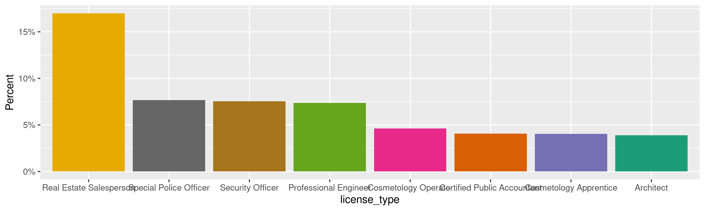
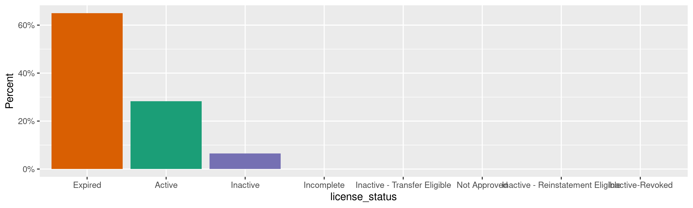
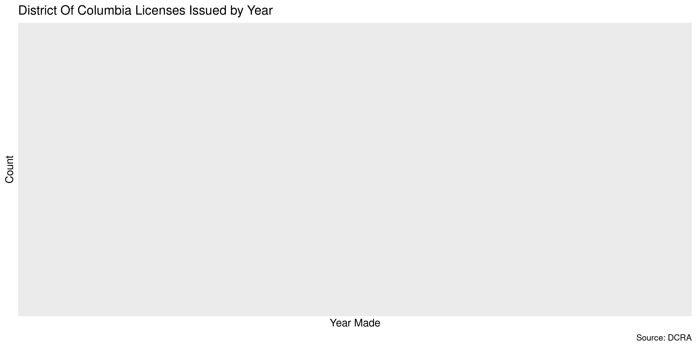

District Of Columbia Licenses
================
Kiernan Nicholls
Tue Jun 14 11:00:29 2022

-   <a href="#project" id="toc-project">Project</a>
-   <a href="#objectives" id="toc-objectives">Objectives</a>
-   <a href="#packages" id="toc-packages">Packages</a>
-   <a href="#source" id="toc-source">Source</a>
-   <a href="#read" id="toc-read">Read</a>
-   <a href="#explore" id="toc-explore">Explore</a>
    -   <a href="#missing" id="toc-missing">Missing</a>
    -   <a href="#duplicates" id="toc-duplicates">Duplicates</a>
    -   <a href="#categorical" id="toc-categorical">Categorical</a>
    -   <a href="#dates" id="toc-dates">Dates</a>
-   <a href="#conclude" id="toc-conclude">Conclude</a>
-   <a href="#export" id="toc-export">Export</a>
-   <a href="#upload" id="toc-upload">Upload</a>

<!-- Place comments regarding knitting here -->

## Project

The Accountability Project is an effort to cut across data silos and
give journalists, policy professionals, activists, and the public at
large a simple way to search across huge volumes of public data about
people and organizations.

Our goal is to standardize public data on a few key fields by thinking
of each dataset row as a transaction. For each transaction there should
be (at least) 3 variables:

1.  All **parties** to a transaction.
2.  The **date** of the transaction.
3.  The **amount** of money involved.

## Objectives

This document describes the process used to complete the following
objectives:

1.  How many records are in the database?
2.  Check for entirely duplicated records.
3.  Check ranges of continuous variables.
4.  Is there anything blank or missing?
5.  Check for consistency issues.
6.  Create a five-digit ZIP Code called `zip`.
7.  Create a `year` field from the transaction date.
8.  Make sure there is data on both parties to a transaction.

## Packages

The following packages are needed to collect, manipulate, visualize,
analyze, and communicate these results. The `pacman` package will
facilitate their installation and attachment.

``` r
if (!require("pacman")) {
  install.packages("pacman")
}
pacman::p_load(
  tidyverse, # data manipulation
  lubridate, # datetime strings
  gluedown, # printing markdown
  jsonlite, # read json files
  janitor, # clean data frames
  campfin, # custom irw tools
  aws.s3, # aws cloud storage
  refinr, # cluster & merge
  scales, # format strings
  knitr, # knit documents
  vroom, # fast reading
  rvest, # scrape html
  glue, # code strings
  here, # project paths
  httr, # http requests
  fs # local storage 
)
```

This diary was run using `campfin` version 1.0.8.9300.

``` r
packageVersion("campfin")
#> [1] '1.0.8.9300'
```

This document should be run as part of the `R_tap` project, which lives
as a sub-directory of the more general, language-agnostic
[`irworkshop/accountability_datacleaning`](https://github.com/irworkshop/accountability_datacleaning)
GitHub repository.

The `R_tap` project uses the [RStudio
projects](https://support.rstudio.com/hc/en-us/articles/200526207-Using-Projects)
feature and should be run as such. The project also uses the dynamic
`here::here()` tool for file paths relative to *your* machine.

``` r
# where does this document knit?
here::i_am("state/dc/licenses/docs/dc_licenses_diary.Rmd")
```

## Source

We can search for professional licenses from the Department of Consumer
and Regulatory Affairs (DCRA), which provided a search portal.

## Read

First, we will submit an empty request for all licenses. Then we can
save the results to a local file.

``` r
raw_dir <- dir_create(here("state", "dc", "licenses", "data", "raw"))
raw_csv <- path(raw_dir, "dc_licenses.csv")
```

``` r
if (!file_exists(raw_csv)) {
  api_url <- "https://govservices.dcra.dc.gov/oplalicensesearch/Home/GetLicenseSearchDetailsByFilter"
  # find how many records total
  find_n <- POST(api_url, body = list(pageSize = 1))
  get_all <- POST(
    url = api_url,
    encode = "form",
    body = list(
      licenseType = "",
      licenseNumber = "",
      licenseeName = "",
      licenseStatus = "",
      searchBeginDate = "",
      searchEndDate = "",
      sortName = "LicenseNumber",
      pageIndex = 1,
      # request all of the rows on one page
      pageSize = content(find_n)$recordCount
    )
  )
  # pull the json results as a csv and parse 
  all_got <- content(get_all, simplifyDataFrame = TRUE)
  dcl <- as_tibble(all_got$licenseSearchDetailsList)
  dcl <- dcl %>% 
    clean_names(case = "snake") %>% 
    mutate(
      across(where(is.character), ~na_if(str_squish(.), "")),
      across(ends_with("_date"), parse_date, "%m/%d/%Y")
    )
  # save for future use
  write_csv(dcl, raw_csv, na = "")
  rm(find_n, get_all, all_got)
} else {
  # read if already exists
  dcl <- read_delim(
    file = raw_csv,
    delim = ",",
    escape_backslash = FALSE,
    escape_double = FALSE,
    name_repair = make_clean_names,
    # locale = locale(date_format = "%m/%d/%Y"),
    col_types = cols(
      .default = col_character(),
      effective_date = col_date(),
      license_expiration_date = col_date(),
      initial_issue_date = col_date()
    )
  )
}
```

## Explore

There are 227,116 rows of 11 columns. Each record represents a single
occupational & professional License

``` r
glimpse(dcl)
#> Rows: 227,116
#> Columns: 11
#> $ license_number          <chr> NA, "1420002", "1420006", "1420007", "1420008", "1420010", "1420011", "1420012", "1420…
#> $ licensee_name           <chr> "SHENA GREEN", "Weichert Real Estate School", "Security Assurance Management", "Metro …
#> $ license_type            <chr> "Cosmetology Specialist Operator - Manicurist", "Provider - Real Estate", "Provider - …
#> $ license_status          <chr> "Expired", "Expired", "Expired", "Expired", "Expired", "Expired", "Expired", "Expired"…
#> $ effective_date          <date> 1900-01-01, 1900-01-01, 1900-01-01, 1900-01-01, 1900-01-01, 1900-01-01, 1900-01-01, 1…
#> $ license_expiration_date <date> 1900-01-01, 1900-01-01, 1900-01-01, 1900-01-01, 1900-01-01, 1900-01-01, 1900-01-01, 1…
#> $ initial_issue_date      <date> 1900-01-01, 1900-01-01, 1900-01-01, 1900-01-01, 1900-01-01, 1900-01-01, 1900-01-01, 1…
#> $ image_name              <chr> "noimage.png", "noimage.png", "noimage.png", "noimage.png", "noimage.png", "noimage.pn…
#> $ image_url               <chr> "https://govservices.dcra.dc.gov/ProfessionalImages/noimage.png", "https://govservices…
#> $ affiliated_agency_name  <chr> NA, NA, NA, NA, NA, NA, NA, NA, NA, NA, NA, NA, NA, NA, NA, NA, NA, NA, NA, NA, NA, NA…
#> $ data_flag               <chr> "PsiData", "PsiData", "PsiData", "PsiData", "PsiData", "PsiData", "PsiData", "PsiData"…
tail(dcl)
#> # A tibble: 6 × 11
#>   license_number licensee_name  license_type license_status effective_date license_expirati… initial_issue_d… image_name
#>   <chr>          <chr>          <chr>        <chr>          <date>         <date>            <date>           <chr>     
#> 1 WR800257       MATT BOWMAN    Wrestler     Expired        2000-03-31     2002-03-31        1930-01-01       noimage.p…
#> 2 WR800258       NORA GREENWALD Wrestler     Expired        2004-04-01     2006-03-31        1930-01-01       noimage.p…
#> 3 WR800259       TERRI POCH     Wrestler     Expired        2000-03-31     2002-03-31        1930-01-01       noimage.p…
#> 4 WR800260       MONTY SOPP     Wrestler     Expired        2004-04-01     2006-03-31        1930-01-01       noimage.p…
#> 5 WR800261       KURT ANGLE     Wrestler     Inactive       2018-12-03     2020-03-31        2018-12-03       260951.JP…
#> 6 WR800262       MARK CALAWAY   Wrestler     Expired        2004-04-01     2006-03-31        1930-01-01       noimage.p…
#> # … with 3 more variables: image_url <chr>, affiliated_agency_name <chr>, data_flag <chr>
```

### Missing

Columns vary in their degree of missing values.

``` r
col_stats(dcl, count_na)
#> # A tibble: 11 × 4
#>    col                     class       n          p
#>    <chr>                   <chr>   <int>      <dbl>
#>  1 license_number          <chr>       1 0.00000440
#>  2 licensee_name           <chr>      39 0.000172  
#>  3 license_type            <chr>       0 0         
#>  4 license_status          <chr>       1 0.00000440
#>  5 effective_date          <date>      0 0         
#>  6 license_expiration_date <date>      0 0         
#>  7 initial_issue_date      <date>      0 0         
#>  8 image_name              <chr>       0 0         
#>  9 image_url               <chr>       0 0         
#> 10 affiliated_agency_name  <chr>  189528 0.834     
#> 11 data_flag               <chr>       0 0
```

We can flag any record missing a key variable needed to identify a
transaction.

``` r
key_vars <- c("initial_issue_date", "licensee_name", "license_type")
dcl <- flag_na(dcl, all_of(key_vars))
sum(dcl$na_flag)
#> [1] 39
```

All 39 rows missing a `licensee_name` are cosmetology apprentices that
were originally issued on January 1, 2001. Suspicious.

``` r
dcl %>% 
  filter(na_flag) %>% 
  count(initial_issue_date, licensee_name, license_type)
#> # A tibble: 1 × 4
#>   initial_issue_date licensee_name license_type               n
#>   <date>             <chr>         <chr>                  <int>
#> 1 2001-01-01         <NA>          Cosmetology Apprentice    39
```

### Duplicates

We can also flag any record completely duplicated across every column.

``` r
dcl <- flag_dupes(dcl, -license_number)
sum(dcl$dupe_flag)
#> [1] 249
```

``` r
dcl %>% 
  filter(dupe_flag) %>% 
  count(initial_issue_date, licensee_name, license_type, sort = TRUE)
#> # A tibble: 84 × 4
#>    initial_issue_date licensee_name             license_type                                     n
#>    <date>             <chr>                     <chr>                                        <int>
#>  1 2001-01-01         <NA>                      Cosmetology Apprentice                          38
#>  2 2001-01-01         UNK                       Cosmetology Apprentice                          21
#>  3 2001-01-01         NU                        Cosmetology Apprentice                          16
#>  4 2001-01-01         UN                        Cosmetology Apprentice                           6
#>  5 1900-01-01         THI NGUYEN                Cosmetology Specialist Operator - Manicurist     4
#>  6 1997-03-01         LONG & FOSTER RL EST INC. Real Estate Organization                         4
#>  7 1900-01-01         Thi Le                    Cosmetology Specialist Operator - Manicurist     3
#>  8 1900-01-01         Thi Nguyen                Cosmetology Specialist Operator - Manicurist     3
#>  9 1900-01-01         Thi Tran                  Cosmetology Specialist Operator - Manicurist     3
#> 10 1997-09-24         BEN CARTER HOLDINGS, INC. Real Estate Organization                         3
#> # … with 74 more rows
```

### Categorical

``` r
col_stats(dcl, n_distinct)
#> # A tibble: 13 × 4
#>    col                     class       n          p
#>    <chr>                   <chr>   <int>      <dbl>
#>  1 license_number          <chr>  226212 0.996     
#>  2 licensee_name           <chr>  197651 0.870     
#>  3 license_type            <chr>     156 0.000687  
#>  4 license_status          <chr>      16 0.0000704 
#>  5 effective_date          <date>   8212 0.0362    
#>  6 license_expiration_date <date>   4120 0.0181    
#>  7 initial_issue_date      <date>  11846 0.0522    
#>  8 image_name              <chr>   83931 0.370     
#>  9 image_url               <chr>   83932 0.370     
#> 10 affiliated_agency_name  <chr>    3383 0.0149    
#> 11 data_flag               <chr>       2 0.00000881
#> 12 na_flag                 <lgl>       2 0.00000881
#> 13 dupe_flag               <lgl>       2 0.00000881
```

<!-- --><!-- -->

### Dates

We can add the calendar year from date with `lubridate::year()`

``` r
dcl <- dcl %>% 
  mutate(
    date_fix = initial_issue_date %>% 
      na_if("1900-01-01") %>% 
      na_if("1901-01-01"),
    year_fix = year(date_fix)
  )
```

``` r
min(dcl$date_fix, na.rm = TRUE)
#> [1] "1903-10-01"
sum(dcl$year_fix < 2000, na.rm = TRUE)
#> [1] 76871
max(dcl$date_fix, na.rm = TRUE)
#> [1] "2022-05-31"
sum(dcl$date_fix > today(), na.rm = TRUE)
#> [1] 0
```

<!-- -->

## Conclude

``` r
glimpse(sample_n(dcl, 1000))
#> Rows: 1,000
#> Columns: 15
#> $ license_number          <chr> "INT880", "BAO5009547", "SP600752", "COP5009406", "CSB909802", "SO30842", "SP102255", …
#> $ licensee_name           <chr> "ETHEL ARMSTRONG", "AMADI Y. KITWANA", "DONNA BRANT", "KRISTIAN MCCRORY", "TERRELL FLO…
#> $ license_type            <chr> "Interior Design", "Barber Owner", "Real Estate Salesperson", "Cosmetology Operator", …
#> $ license_status          <chr> "Expired", "Active", "Expired", "Active", "Inactive", "Expired", "Expired", "Active", …
#> $ effective_date          <date> 1992-10-31, 2021-10-01, 2013-08-31, 2022-04-18, 2018-10-01, 2018-05-01, 2001-03-22, 2…
#> $ license_expiration_date <date> 1994-10-31, 2023-09-30, 2015-08-31, 2024-04-15, 2020-09-30, 2020-04-30, 2001-08-31, 2…
#> $ initial_issue_date      <date> 1991-10-29, 2016-02-12, 2009-06-01, 2015-11-12, 2012-01-24, 2016-10-18, 2001-03-22, 2…
#> $ image_name              <chr> "noimage.png", "noimage.png", "noimage.png", "279912.JPEG", "338150.JPEG", "316476.JPE…
#> $ image_url               <chr> "https://govservices.dcra.dc.gov/ProfessionalImages/noimage.png", "https://govservices…
#> $ affiliated_agency_name  <chr> NA, NA, NA, NA, NA, NA, NA, NA, NA, NA, NA, NA, NA, NA, NA, NA, NA, "UNIVERSAL PROTECT…
#> $ data_flag               <chr> "PsiData", "PsiData", "PsiData", "PsiData", "PsiData", "PsiData", "PsiData", "PsiData"…
#> $ na_flag                 <lgl> FALSE, FALSE, FALSE, FALSE, FALSE, FALSE, FALSE, FALSE, FALSE, FALSE, FALSE, FALSE, FA…
#> $ dupe_flag               <lgl> FALSE, FALSE, FALSE, FALSE, FALSE, FALSE, FALSE, FALSE, FALSE, FALSE, FALSE, FALSE, FA…
#> $ date_fix                <date> 1991-10-29, 2016-02-12, 2009-06-01, 2015-11-12, 2012-01-24, 2016-10-18, 2001-03-22, 2…
#> $ year_fix                <dbl> 1991, 2016, 2009, 2015, 2012, 2016, 2001, 2020, 2009, 1986, 2008, 1988, 2007, 2005, 19…
```

1.  There are 227,116 records in the database.
2.  There are 249 duplicate records in the database.
3.  The range and distribution of `amount` and `date` seem reasonable.
4.  There are 39 records missing key variables.
5.  Consistency in geographic data has been improved with
    `campfin::normal_*()`.
6.  The 4-digit `year` variable has been created with
    `lubridate::year()`.

## Export

Now the file can be saved on disk for upload to the Accountability
server. We will name the object using a date range of the records
included.

``` r
clean_dir <- dir_create(here("state", "dc", "licenses", "data", "clean"))
clean_csv <- path(clean_dir, glue("dc_licenses_19500101-20220531.csv"))
clean_rds <- path_ext_set(clean_csv, "rds")
basename(clean_csv)
#> [1] "dc_licenses_19500101-20220531.csv"
```

``` r
write_csv(dcl, clean_csv, na = "")
write_rds(dcl, clean_rds, compress = "xz")
(clean_size <- file_size(clean_csv))
#> 45.5M
```

## Upload

We can use the `aws.s3::put_object()` to upload the text file to the IRW
server.

``` r
aws_key <- path("csv", basename(clean_csv))
if (!object_exists(aws_key, "publicaccountability")) {
  put_object(
    file = clean_csv,
    object = aws_key, 
    bucket = "publicaccountability",
    acl = "public-read",
    show_progress = TRUE,
    multipart = TRUE
  )
}
aws_head <- head_object(aws_key, "publicaccountability")
(aws_size <- as_fs_bytes(attr(aws_head, "content-length")))
unname(aws_size == clean_size)
```
